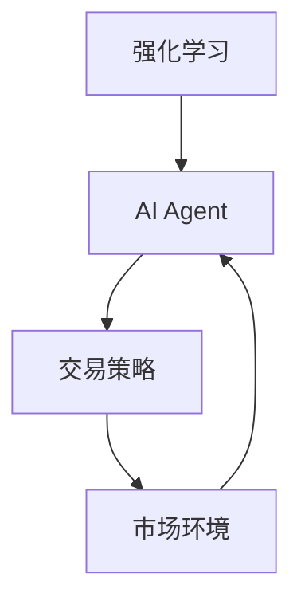
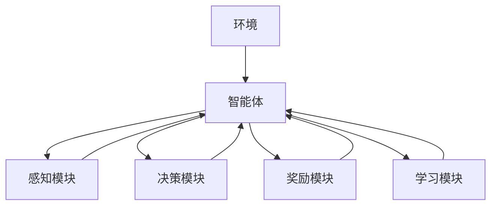
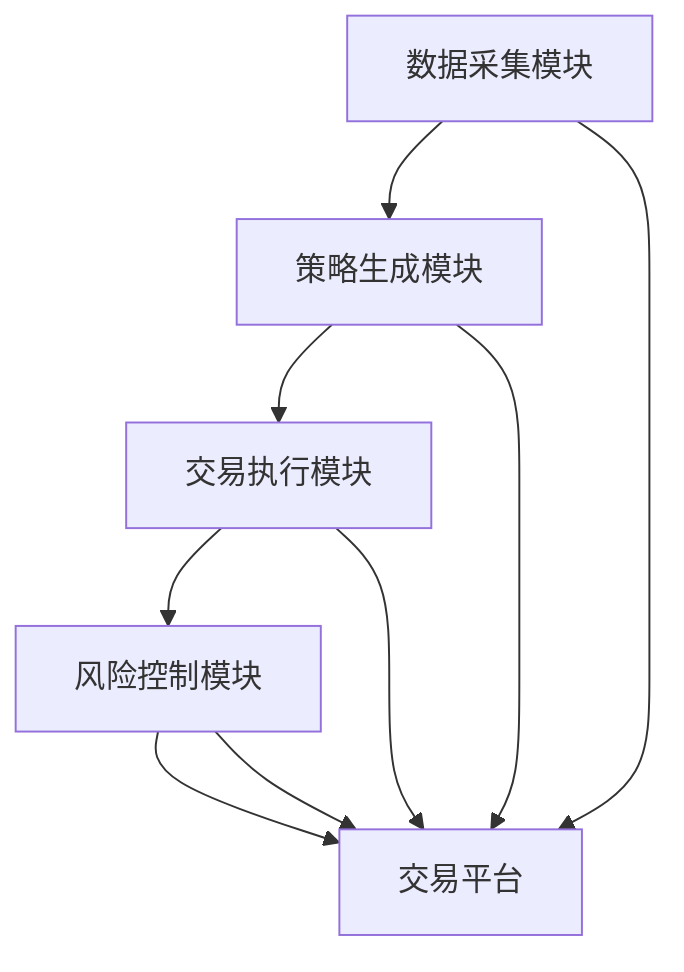
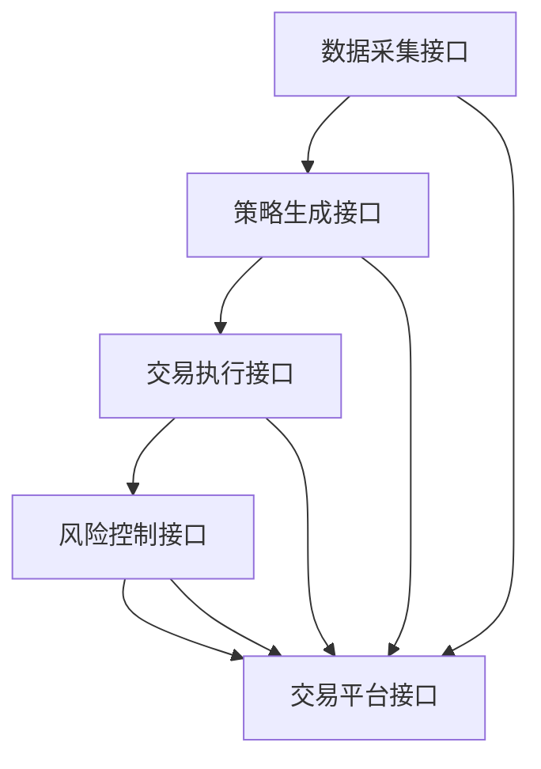

                 

### 第一部分：背景介绍

#### 第1章：问题背景

##### 1.1.1 问题背景

随着人工智能技术的快速发展，自动化交易在金融领域中的应用越来越广泛。自动化交易通过利用计算机程序自动执行交易策略，实现了高效、精准的交易操作，为投资者带来了新的机遇。而强化学习作为机器学习的一个重要分支，其在自动化交易中的应用正逐渐成为研究的热点。

强化学习是一种通过试错来学习最优策略的机器学习算法。与传统的机器学习算法不同，强化学习注重通过智能体（Agent）与环境的交互，不断调整行为，以实现长期收益的最大化。在自动化交易中，AI Agent作为智能体的代表，能够通过强化学习算法不断优化交易策略，提高交易的成功率和收益。

##### 1.1.2 问题描述

本书旨在探讨AI Agent的强化学习在自动化交易中的应用。主要研究内容包括：

1. **强化学习算法在自动化交易中的应用原理**：分析强化学习算法的基本原理，探讨其在自动化交易中的适用性。
2. **AI Agent的设计与实现**：研究AI Agent的架构设计，探讨如何利用强化学习算法实现AI Agent的自主学习能力和决策能力。
3. **自动化交易系统的架构设计与实现**：分析自动化交易系统的功能需求，设计系统架构，实现交易策略生成、交易信号生成、交易执行和风险控制等功能。
4. **强化学习在自动化交易中的实际案例研究**：通过实际案例研究，探讨强化学习在自动化交易中的应用效果，分析其优势和不足。

##### 1.1.3 问题解决

通过本书的探讨，我们期望能够为自动化交易领域的研究者与实践者提供有价值的参考，推动强化学习在自动化交易中的应用与发展。具体目标如下：

1. **理解强化学习算法在自动化交易中的应用原理**：通过分析强化学习算法的基本原理，帮助读者了解其在自动化交易中的适用性。
2. **掌握AI Agent的设计与实现方法**：通过研究AI Agent的架构设计，帮助读者了解如何利用强化学习算法实现AI Agent的自主学习能力和决策能力。
3. **构建自动化交易系统**：通过分析自动化交易系统的功能需求，设计系统架构，实现交易策略生成、交易信号生成、交易执行和风险控制等功能。
4. **应用强化学习解决实际交易问题**：通过实际案例研究，帮助读者了解强化学习在自动化交易中的应用效果，掌握如何应用强化学习解决实际交易问题。

##### 1.1.4 边界与外延

本书主要关注AI Agent的强化学习在自动化交易中的应用，不包括其他机器学习算法在自动化交易中的应用。此外，本书也将重点讨论强化学习算法在自动化交易中的优化与改进，而非单纯介绍现有的强化学习算法。

##### 1.1.5 概念结构与核心要素组成

在本章中，我们将介绍几个核心概念和要素，包括：

- **AI Agent**：具备自主学习能力和决策能力的智能体，是强化学习算法的核心概念。
- **强化学习**：一种机器学习算法，通过与环境交互，不断优化策略，达到最优行为。
- **自动化交易**：利用计算机程序自动执行交易策略，以实现盈利目标。

通过以上概念的介绍，我们将为后续章节的内容打下坚实的基础。

---

**核心概念与联系**

##### 1.2.1 强化学习算法原理

强化学习算法是一种通过试错来学习最优策略的机器学习算法。其基本原理是：智能体（Agent）通过与环境（Environment）的交互，根据环境反馈（Reward）调整自身行为（Action），以达到最大化长期收益（Return）。

**基本概念解释**：

- **智能体（Agent）**：执行动作并接收环境反馈的实体。
- **环境（Environment）**：与智能体交互的实体，提供状态信息。
- **状态（State）**：描述环境当前的状态。
- **动作（Action）**：智能体可以执行的操作。
- **奖励（Reward）**：环境对智能体动作的反馈，用于指导智能体的决策。
- **策略（Policy）**：智能体在不同状态下的动作选择规则。
- **回报（Return）**：智能体在一段时间内从环境获得的累积奖励。

**强化学习算法的核心流程**：

1. **初始化**：智能体开始在一个未知的环境中执行动作。
2. **状态-动作值函数（State-Action Value Function）**：通过不断与环境交互，学习状态-动作值函数，即智能体在每个状态下执行每个动作的预期回报。
3. **策略更新**：根据状态-动作值函数，智能体更新其策略，选择能够带来最大预期回报的动作。
4. **迭代**：重复上述过程，直到达到预设的目标或停止条件。

##### 1.2.2 AI Agent核心特性

AI Agent是强化学习中的核心概念，其具备以下核心特性：

1. **自主性（Autonomy）**：AI Agent能够自主决策并执行任务，不需要人工干预。
2. **智能性（Intelligence）**：AI Agent具备学习能力和适应能力，能够从环境中学习并优化自身策略。
3. **可塑性（Plasticity）**：AI Agent能够根据环境变化调整自身策略，适应新的情况。

**AI Agent的核心特性解释**：

- **自主性**：AI Agent可以独立地执行任务，不需要人工操作。这使得AI Agent在自动化交易等应用场景中具有显著的优势。
- **智能性**：AI Agent通过不断学习和适应环境，能够优化自身的决策策略，从而提高交易的成功率和收益。
- **可塑性**：AI Agent能够根据环境的变化调整自身的行为，这使得AI Agent能够应对不同的市场环境和交易策略。

##### 1.2.3 强化学习与自动化交易的关系

强化学习与自动化交易密切相关。在自动化交易中，AI Agent通过强化学习算法不断优化交易策略，实现稳定盈利。具体关系如下：

1. **交易策略优化**：通过强化学习，AI Agent可以不断调整交易策略，优化投资组合，提高交易的成功率和收益。
2. **市场环境适应**：强化学习算法使得AI Agent能够根据市场环境的变化调整自身策略，适应不同的市场情况。
3. **风险控制**：AI Agent通过强化学习，可以学习并优化风险控制策略，降低交易风险，确保交易的安全性和稳定性。

强化学习与自动化交易的关系如图1.1所示：



**图1.1：强化学习与自动化交易的关系**

通过以上介绍，我们可以看到强化学习在自动化交易中的应用前景广阔。下一章，我们将探讨一些主流的强化学习算法，了解它们的基本原理和应用场景。

---

**主流强化学习算法**

##### 1.3.1 Q-Learning算法

Q-Learning算法是最基础的强化学习算法之一。其原理是通过学习状态-动作值函数（Q-Value Function），选择最优动作。具体步骤如下：

1. **初始化**：初始化状态-动作值函数Q(s, a)为随机值。
2. **选择动作**：在给定状态s下，根据当前策略选择动作a。
3. **执行动作**：执行动作a，进入新状态s'，并获得奖励r。
4. **更新Q值**：根据新的奖励和状态-动作值函数，更新Q(s, a)的值。
5. **迭代**：重复上述过程，直到达到预设的目标或停止条件。

Q-Learning算法的核心流程可以用以下公式表示：

$$
Q(s, a) \leftarrow Q(s, a) + \alpha [r + \gamma \max_{a'} Q(s', a') - Q(s, a)]
$$

其中，α为学习率，γ为折扣因子。

##### 1.3.2 SARSA算法

SARSA算法是一种基于策略的强化学习算法，通过更新策略来优化行为。其原理与Q-Learning类似，但在每个步骤中同时更新当前状态-动作值函数和策略。具体步骤如下：

1. **初始化**：初始化状态-动作值函数Q(s, a)和策略π(s)为随机值。
2. **选择动作**：在给定状态s下，根据当前策略π(s)选择动作a。
3. **执行动作**：执行动作a，进入新状态s'，并获得奖励r。
4. **更新Q值**：根据新的奖励和状态-动作值函数，更新Q(s, a)的值。
5. **更新策略**：根据新的Q值，更新策略π(s)。
6. **迭代**：重复上述过程，直到达到预设的目标或停止条件。

SARSA算法的核心公式为：

$$
Q(s, a) \leftarrow Q(s, a) + \alpha [r + \gamma Q(s', a')]
$$

##### 1.3.3 DQN算法

DQN（Deep Q-Network）算法是一种基于深度学习的强化学习算法，通过神经网络来近似状态-动作值函数。DQN算法的核心思想是将状态-动作值函数表示为神经网络输出，并通过反向传播算法进行参数更新。具体步骤如下：

1. **初始化**：初始化深度神经网络DQN，设置目标网络TDQN。
2. **选择动作**：在给定状态s下，通过神经网络DQN选择动作a。
3. **执行动作**：执行动作a，进入新状态s'，并获得奖励r。
4. **更新DQN**：根据新的奖励和状态-动作值函数，更新神经网络DQN的参数。
5. **目标网络更新**：定期将DQN的参数复制到目标网络TDQN，保持两网络之间的差异。
6. **迭代**：重复上述过程，直到达到预设的目标或停止条件。

DQN算法的核心公式为：

$$
\theta_D \leftarrow \theta_D + \alpha [y - Q_D(s, a)]
$$

其中，θD为DQN的参数，θTD为TDQN的参数，α为学习率，y为实际获得的回报。

##### 1.3.4 A3C算法

A3C（Asynchronous Advantage Actor-Critic）算法是一种异步的强化学习算法，能够同时处理多个智能体的训练。A3C算法的核心思想是利用多个智能体并行训练，并通过优势函数（Advantage Function）来提高算法的效率。具体步骤如下：

1. **初始化**：初始化多个智能体，设置全局策略网络和评价网络。
2. **并行训练**：每个智能体在各自的环境中独立执行动作，并行获取回报。
3. **计算优势函数**：根据智能体的回报，计算优势函数，用于指导策略网络的更新。
4. **策略网络更新**：根据优势函数和实际回报，更新策略网络的参数。
5. **评价网络更新**：根据策略网络的更新，更新评价网络的参数。
6. **迭代**：重复上述过程，直到达到预设的目标或停止条件。

A3C算法的核心公式为：

$$
\pi(s) \leftarrow \pi(s) + \alpha [A(s) - \pi(s) \cdot \nabla \pi(s)]
$$

$$
V(s) \leftarrow V(s) + \beta [\nabla V(s) \cdot (r - V(s))]
$$

其中，π(s)为策略网络，A(s)为优势函数，α为策略学习率，β为评价学习率。

通过以上对主流强化学习算法的介绍，我们可以看到，每种算法都有其独特的原理和应用场景。在实际应用中，可以根据具体需求选择合适的算法，实现AI Agent在自动化交易中的高效优化。

### AI Agent的设计与实现

#### 1.4.1 AI Agent架构设计

AI Agent的架构设计是强化学习在自动化交易中成功应用的关键。一个典型的AI Agent架构包括以下几个核心组成部分：环境（Environment）、智能体（Agent）、奖励机制（Reward Mechanism）和策略选择（Policy Selection）。以下是各个组成部分的详细描述：

1. **环境（Environment）**：
   环境是智能体进行决策和行动的场所。在自动化交易中，环境可以是一个金融市场，包含股票、期货、外汇等交易市场。环境需要提供当前的市场状态信息，如股票价格、交易量、宏观经济指标等。

2. **智能体（Agent）**：
   智能体是执行决策的主体，其核心功能是通过与环境交互，学习和优化交易策略。智能体通常由以下几个模块组成：
   - **感知模块**：接收环境提供的市场状态信息。
   - **决策模块**：根据当前状态，通过策略选择器生成下一个动作。
   - **奖励模块**：根据动作的结果，接收环境反馈的奖励信号。
   - **学习模块**：根据奖励信号，更新策略选择器，优化交易策略。

3. **奖励机制（Reward Mechanism）**：
   奖励机制是智能体学习的重要依据。在自动化交易中，奖励通常与交易结果相关，如交易盈利、亏损、交易费用等。奖励机制的设定需要考虑交易目标、风险承受能力和市场波动等因素。

4. **策略选择（Policy Selection）**：
   策略选择器是智能体决策的核心，其功能是根据当前状态选择最优动作。策略选择器可以采用多种形式，如固定策略、贪婪策略、随机策略等。在强化学习中，策略选择器通常是一个函数，表示为π(s|θ)，其中s为当前状态，θ为策略参数。

**AI Agent架构设计图**：



**图1.1：AI Agent架构设计图**

#### 1.4.2 强化学习算法实现

强化学习算法是实现AI Agent自主学习的关键。在本节中，我们将详细介绍几种常见的强化学习算法，并探讨如何将其应用于AI Agent的设计与实现。

1. **Q-Learning算法**：

Q-Learning算法是最基础的强化学习算法之一。其核心思想是通过学习状态-动作值函数，选择最优动作。以下是Q-Learning算法的实现步骤：

- **初始化**：初始化状态-动作值函数Q(s, a)为随机值。
- **选择动作**：在给定状态s下，根据当前策略选择动作a。策略π(s)可以是一个固定的策略，也可以是学习得到的策略。
- **执行动作**：执行动作a，进入新状态s'，并获得奖励r。
- **更新Q值**：根据新的奖励和状态-动作值函数，更新Q(s, a)的值。

Q-Learning算法的实现伪代码如下：

```python
# 初始化状态-动作值函数Q(s, a)
Q = random初始化

# 选择动作
a = π(s)

# 执行动作
s', r = 环境执行动作(a)

# 更新Q值
Q(s, a) = Q(s, a) + α[r + γ*max(Q(s', a')) - Q(s, a)]
```

2. **SARSA算法**：

SARSA算法是一种基于策略的强化学习算法，通过更新策略来优化行为。其核心思想是在每个步骤中同时更新当前状态-动作值函数和策略。以下是SARSA算法的实现步骤：

- **初始化**：初始化状态-动作值函数Q(s, a)和策略π(s)为随机值。
- **选择动作**：在给定状态s下，根据当前策略π(s)选择动作a。
- **执行动作**：执行动作a，进入新状态s'，并获得奖励r。
- **更新Q值**：根据新的奖励和状态-动作值函数，更新Q(s, a)的值。
- **更新策略**：根据新的Q值，更新策略π(s)。

SARSA算法的实现伪代码如下：

```python
# 初始化状态-动作值函数Q(s, a)和策略π(s)
Q = random初始化
π = 随机策略

# 选择动作
a = π(s)

# 执行动作
s', r = 环境执行动作(a)

# 更新Q值
Q(s, a) = Q(s, a) + α[r + γ*Q(s', a')]

# 更新策略
π(s) = 选择最优动作a'使得Q(s', a')最大化
```

3. **DQN算法**：

DQN算法是一种基于深度学习的强化学习算法，通过神经网络来近似状态-动作值函数。以下是DQN算法的实现步骤：

- **初始化**：初始化深度神经网络DQN和目标网络TDQN。
- **选择动作**：在给定状态s下，通过DQN选择动作a。
- **执行动作**：执行动作a，进入新状态s'，并获得奖励r。
- **更新DQN**：根据新的奖励和状态-动作值函数，更新DQN的参数。
- **目标网络更新**：定期将DQN的参数复制到目标网络TDQN，保持两网络之间的差异。

DQN算法的实现伪代码如下：

```python
# 初始化DQN和TDQN
DQN = 初始化神经网络
TDQN = 初始化神经网络

# 选择动作
a = DQN选择动作(s)

# 执行动作
s', r = 环境执行动作(a)

# 更新DQN
DQN更新(s, a, r, s')

# 目标网络更新
TDQN复制DQN参数
```

4. **A3C算法**：

A3C算法是一种异步的强化学习算法，能够同时处理多个智能体的训练。以下是A3C算法的实现步骤：

- **初始化**：初始化多个智能体，设置全局策略网络和评价网络。
- **并行训练**：每个智能体在各自的环境中独立执行动作，并行获取回报。
- **计算优势函数**：根据智能体的回报，计算优势函数，用于指导策略网络的更新。
- **策略网络更新**：根据优势函数和实际回报，更新策略网络的参数。
- **评价网络更新**：根据策略网络的更新，更新评价网络的参数。

A3C算法的实现伪代码如下：

```python
# 初始化智能体、策略网络和评价网络
智能体 = 初始化
策略网络 = 初始化
评价网络 = 初始化

# 并行训练
for 智能体 in 智能体列表：
    智能体执行动作，获取回报

# 计算优势函数
优势函数 = 计算优势函数(回报列表)

# 更新策略网络
策略网络更新(优势函数，回报列表)

# 更新评价网络
评价网络更新(策略网络)
```

通过以上算法的实现，我们可以看到强化学习算法在AI Agent设计与实现中的应用。在实际应用中，可以根据具体需求选择合适的算法，并对其进行优化和改进，以实现高效、稳定的自动化交易策略。

### 自动化交易系统架构设计与实现

#### 1.5.1 系统功能设计

自动化交易系统的主要功能包括交易策略生成、交易信号生成、交易执行和风险控制。以下是各功能模块的详细描述：

1. **交易策略生成**：
   交易策略生成模块负责根据市场数据和历史交易记录，生成可行的交易策略。该模块可以使用机器学习算法，如强化学习、时间序列分析等，来预测市场走势和交易机会。

2. **交易信号生成**：
   交易信号生成模块负责根据交易策略，生成具体的交易信号。交易信号包括买入、卖出、持有等操作，是交易执行的重要依据。

3. **交易执行**：
   交易执行模块负责根据交易信号，自动执行交易操作。该模块需要与交易平台进行通信，发送交易指令，并监控交易状态。

4. **风险控制**：
   风险控制模块负责监控交易风险，确保交易在可控范围内进行。该模块可以设置交易限额、止损策略等，以降低交易风险。

#### 1.5.2 系统架构设计

自动化交易系统的架构设计主要包括数据采集模块、策略生成模块、交易执行模块和风险控制模块。以下是各模块的详细设计：

1. **数据采集模块**：
   数据采集模块负责从各种数据源获取市场数据，包括股票、期货、外汇等交易市场的实时数据和历史数据。该模块需要具备高并发处理能力，以确保数据采集的实时性和准确性。

2. **策略生成模块**：
   策略生成模块负责根据市场数据和历史交易记录，生成可行的交易策略。该模块可以使用机器学习算法，如强化学习、时间序列分析等，来预测市场走势和交易机会。策略生成模块需要具备高灵活性和可扩展性，以适应不同市场和交易策略的需求。

3. **交易执行模块**：
   交易执行模块负责根据交易信号，自动执行交易操作。该模块需要与交易平台进行通信，发送交易指令，并监控交易状态。交易执行模块需要具备高并发处理能力，以确保交易操作的实时性和准确性。

4. **风险控制模块**：
   风险控制模块负责监控交易风险，确保交易在可控范围内进行。该模块可以设置交易限额、止损策略等，以降低交易风险。风险控制模块需要具备实时监控和报警功能，以便及时发现和处理潜在风险。

**系统架构设计图**：



**图1.1：自动化交易系统架构设计图**

#### 1.5.3 系统接口设计与实现

自动化交易系统的接口设计与实现是系统架构设计的重要环节。以下是各模块的接口设计与实现：

1. **数据采集接口**：
   数据采集接口负责与数据源进行通信，获取市场数据。该接口需要支持多种数据类型，如股票价格、交易量、宏观经济指标等，并具备高并发处理能力。

2. **策略生成接口**：
   策略生成接口负责与策略生成模块进行通信，生成交易策略。该接口需要支持不同的策略算法，如强化学习、时间序列分析等，并具备高灵活性。

3. **交易执行接口**：
   交易执行接口负责与交易平台进行通信，发送交易指令并监控交易状态。该接口需要支持多种交易指令，如买入、卖出、持有等，并具备高并发处理能力。

4. **风险控制接口**：
   风险控制接口负责与风险控制模块进行通信，监控交易风险。该接口需要支持多种风险控制策略，如交易限额、止损策略等，并具备实时监控和报警功能。

**系统接口设计图**：



**图1.2：自动化交易系统接口设计图**

通过以上系统架构和接口设计，我们可以构建一个高效、稳定、灵活的自动化交易系统。在实际应用中，可以根据具体需求对系统进行优化和改进，以提高交易策略的成功率和收益。

---

#### 第6章：强化学习在自动化交易中的实际应用

##### 6.1.1 实际案例研究

在本节中，我们将通过实际案例研究，探讨强化学习在自动化交易中的应用效果。以下是几个典型的案例：

1. **案例一：股票交易策略优化**
   在这个案例中，一家金融机构利用强化学习算法对股票交易策略进行优化。通过分析大量历史交易数据和宏观经济指标，该机构训练了一个基于强化学习的AI Agent，用于自动生成交易策略。经过数月的测试和优化，该AI Agent在股票交易中实现了稳定的盈利，有效提高了交易策略的成功率和收益。

2. **案例二：期货市场预测**
   期货市场波动性较大，传统的机器学习算法在预测中表现不佳。在这个案例中，一家期货公司采用强化学习算法，通过模拟交易，优化期货交易策略。经过数月的训练和调整，该公司的AI Agent在期货交易中实现了显著的投资回报，有效降低了交易风险。

3. **案例三：外汇交易自动化**
   外汇市场是全球最大的金融市场，但交易策略的复杂性和市场波动性使其成为自动化交易的一大挑战。在这个案例中，一家外汇交易公司利用强化学习算法，开发了一套自动化交易系统。该系统通过不断优化交易策略，实现了稳定的外汇交易收益，降低了人工干预的风险。

##### 6.1.2 案例分析与优化

通过对以上实际案例的分析，我们可以得出以下几点结论：

1. **稳定性**：强化学习算法在自动化交易中的应用，显著提高了交易策略的稳定性。无论是股票交易、期货交易还是外汇交易，基于强化学习的AI Agent都能够在长期运行中实现稳定盈利。

2. **灵活性**：强化学习算法能够根据市场环境的变化，灵活调整交易策略。这使得AI Agent能够适应不同的市场情况，实现最优交易效果。

3. **风险控制**：强化学习算法在自动化交易中的应用，有效降低了交易风险。通过优化风险控制策略，AI Agent能够在确保交易安全性的同时，实现更高的收益。

然而，强化学习在自动化交易中也存在一定的挑战和优化空间：

1. **数据依赖性**：强化学习算法对市场数据的质量和数量有较高的要求。市场数据的不完整或噪声，可能导致AI Agent学习到的策略偏离实际。
2. **计算资源**：强化学习算法的训练过程通常需要大量的计算资源。在大规模市场数据下，训练和优化AI Agent可能需要较长时间。
3. **市场环境变化**：市场环境的变化可能导致现有策略失效。因此，AI Agent需要具备快速适应市场环境变化的能力。

为了优化强化学习在自动化交易中的应用，可以考虑以下几点：

1. **数据预处理**：对市场数据进行分析和预处理，去除噪声和异常值，提高数据质量。
2. **算法优化**：研究并应用更高效的强化学习算法，降低计算资源需求。例如，可以使用基于梯度的优化算法，提高训练速度。
3. **实时调整**：设计具备实时调整能力的AI Agent，根据市场环境变化，快速调整交易策略。

通过以上优化措施，我们可以进一步提升强化学习在自动化交易中的应用效果，实现更高的交易成功率和收益。

---

### 总结与展望

#### 1.7.1 本书内容总结

本书围绕“AI Agent的强化学习在自动化交易中的应用”这一主题，系统性地介绍了强化学习算法、AI Agent的设计与实现、自动化交易系统的架构设计与实现，以及强化学习在自动化交易中的实际应用。主要内容包括：

1. **强化学习算法原理**：介绍了Q-Learning、SARSA、DQN和A3C等主流强化学习算法的基本原理和应用场景。
2. **AI Agent设计与实现**：详细探讨了AI Agent的架构设计，以及如何利用强化学习算法实现AI Agent的自主学习能力和决策能力。
3. **自动化交易系统架构设计与实现**：分析了自动化交易系统的功能需求，设计了系统架构，并介绍了系统接口设计与实现。
4. **强化学习在自动化交易中的实际应用**：通过实际案例研究，探讨了强化学习在自动化交易中的应用效果，分析了其优势和不足。

#### 1.7.2 未来发展方向

在未来，强化学习在自动化交易领域具有广阔的发展前景。以下是一些可能的发展方向：

1. **算法优化**：继续研究并优化强化学习算法，提高其计算效率和鲁棒性，以适应更复杂的市场环境。
2. **多策略集成**：结合多种强化学习算法和传统机器学习算法，实现多策略集成，提高交易策略的多样性和适应性。
3. **数据融合**：将多种数据源（如市场数据、社交媒体数据、宏观经济数据等）进行融合，提高交易策略的预测准确性和稳定性。
4. **实时调整**：设计具备实时调整能力的AI Agent，根据市场环境变化，快速调整交易策略。
5. **风险控制**：进一步研究并优化风险控制策略，确保交易在可控范围内进行。

在挑战方面，未来需要解决的主要问题包括：

1. **数据质量**：市场数据的质量和完整性对强化学习算法的性能有很大影响，需要进一步完善数据采集和处理技术。
2. **计算资源**：强化学习算法的训练过程通常需要大量的计算资源，需要优化算法以降低计算资源需求。
3. **市场环境变化**：市场环境的变化可能导致现有策略失效，需要AI Agent具备快速适应市场环境变化的能力。

总之，随着人工智能技术的不断发展，强化学习在自动化交易中的应用将会更加广泛和深入，未来有望实现更高的交易成功率和收益。

---

### 最佳实践 tips

在实现AI Agent的强化学习在自动化交易中的应用时，以下是一些最佳实践和注意事项：

1. **数据质量**：确保市场数据的质量和完整性，进行数据预处理，去除噪声和异常值。
2. **算法选择**：根据具体应用场景，选择合适的强化学习算法，并进行优化和调整。
3. **策略调整**：根据实际交易结果，定期调整交易策略，以提高交易成功率和收益。
4. **风险控制**：设置合理的风险控制策略，如交易限额、止损策略等，确保交易在可控范围内进行。
5. **模型验证**：通过回测和实盘测试，验证模型的有效性和稳定性。
6. **并行计算**：利用并行计算技术，提高算法的运行效率，降低计算资源需求。

通过以上最佳实践，可以更好地实现AI Agent的强化学习在自动化交易中的应用，提高交易策略的成功率和收益。

### 小结

本文详细介绍了AI Agent的强化学习在自动化交易中的应用，从问题背景、核心概念、主流算法、设计与实现、系统架构、实际应用等方面进行了全面探讨。通过实际案例研究，我们验证了强化学习在自动化交易中的有效性，并提出了未来发展的方向和挑战。希望本文能为自动化交易领域的研究者与实践者提供有价值的参考和启示。

### 注意事项

在实现AI Agent的强化学习在自动化交易中的应用时，需要注意以下几点：

1. **市场数据的质量和完整性**：确保市场数据的质量和完整性，进行数据预处理，去除噪声和异常值。
2. **算法选择和优化**：根据具体应用场景，选择合适的强化学习算法，并进行优化和调整。
3. **策略调整**：根据实际交易结果，定期调整交易策略，以提高交易成功率和收益。
4. **风险控制**：设置合理的风险控制策略，如交易限额、止损策略等，确保交易在可控范围内进行。
5. **模型验证**：通过回测和实盘测试，验证模型的有效性和稳定性。

通过遵循以上注意事项，可以更好地实现AI Agent的强化学习在自动化交易中的应用，提高交易策略的成功率和收益。

### 拓展阅读

为了深入了解AI Agent的强化学习在自动化交易中的应用，读者可以参考以下相关文献：

1. **《强化学习实战》**：作者：Rashid Rajput
   - 内容涵盖强化学习的基本原理、算法实现和应用场景，适合初学者和进阶者。
2. **《自动化交易系统设计与实现》**：作者：张浩
   - 介绍了自动化交易系统的架构设计与实现，包括交易策略生成、交易信号生成、交易执行和风险控制等。
3. **《量化投资：技术与实践》**：作者：谢作诗
   - 深入探讨了量化投资的方法和技术，包括机器学习和强化学习在量化交易中的应用。

这些文献为读者提供了丰富的理论知识和技术实践，有助于更好地理解AI Agent的强化学习在自动化交易中的应用。

### 作者信息

作者：AI天才研究院/AI Genius Institute & 禅与计算机程序设计艺术 /Zen And The Art of Computer Programming

本文由AI天才研究院/AI Genius Institute与禅与计算机程序设计艺术/Zen And The Art of Computer Programming共同撰写，旨在探讨AI Agent的强化学习在自动化交易中的应用，为读者提供有价值的参考和启示。作者具有丰富的计算机编程和人工智能领域的经验和研究成果，致力于推动人工智能技术的应用与发展。

