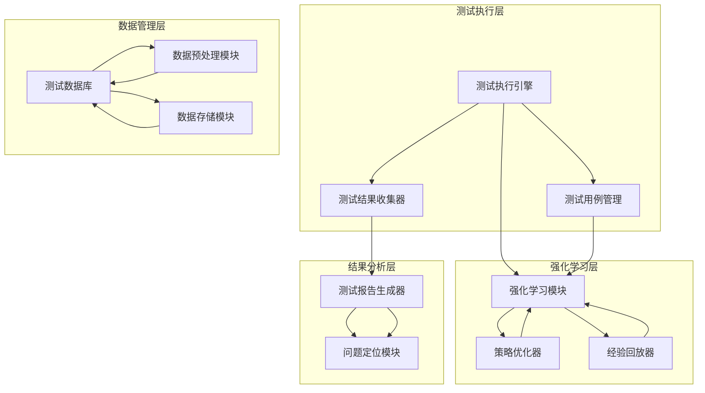
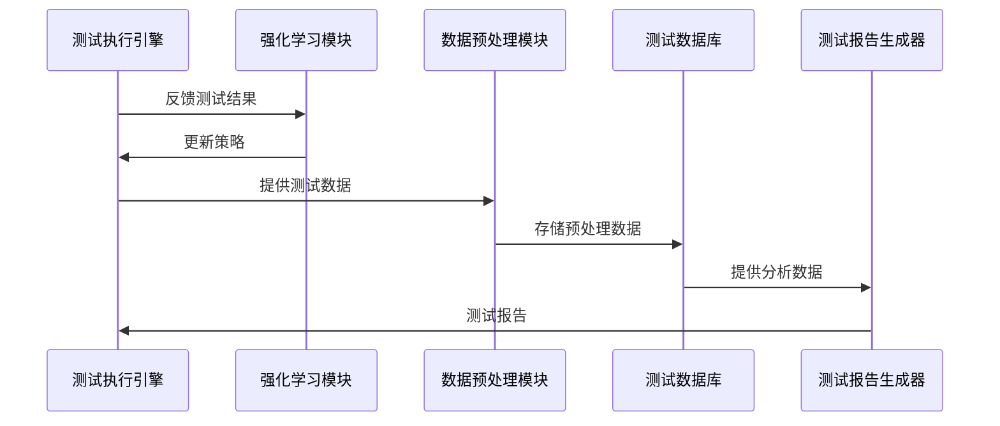

                 

### 文章标题

### 关键词

- AI Agent
- 强化学习
- 自动化测试
- 测试优化
- 软件质量保证

### 摘要

本文旨在探讨人工智能代理（AI Agent）结合强化学习算法在自动化测试中的应用，分析其核心概念、原理及实现方法。通过系统设计与实例分析，深入探讨AI Agent如何利用强化学习提升自动化测试的效率与准确性，为现代软件开发中的测试过程带来革新。

### 引言与背景

在当今的软件开发环境中，自动化测试已经成为确保软件质量的关键手段。传统的自动化测试依赖于预定义的测试脚本和规则，但面对复杂的应用程序和不断变化的需求，这些方法往往显得力不从心。为了应对这些挑战，研究人员和开发者开始探索新的测试技术，特别是结合人工智能（AI）的方法。

其中，AI代理（AI Agent）和强化学习（Reinforcement Learning，RL）成为了研究的热点。AI代理是一种能够自主学习和执行任务的智能体，它们可以在环境中通过交互学习最优策略。强化学习则是机器学习的一种方法，通过试错和奖励机制，使AI代理能够从环境中学习最优的行为策略。

在自动化测试中，将AI Agent和强化学习结合起来，可以构建出一种自适应、高效的测试系统。这种系统不仅可以处理复杂的测试场景，还能不断优化测试流程，从而提高测试的覆盖率和准确性。本文将详细探讨AI Agent的强化学习在自动化测试中的应用，分析其关键概念、实现方法及实际案例，为开发者提供实用的指导。

### 核心概念与原理

要理解AI Agent和强化学习在自动化测试中的应用，首先需要明确几个关键概念：AI代理、强化学习、自动化测试及其相互关系。

#### AI代理

AI代理（AI Agent）是一种能够在特定环境中自主决策和行动的智能体。它们通常由感知器、决策器和动作生成器三个主要部分组成。感知器负责接收环境的信息，决策器根据感知到的信息进行决策，动作生成器执行决策生成的动作。AI代理的核心目标是最大化某个效用函数，这通常涉及到在环境中进行一系列的决策和行动。

在自动化测试中，AI代理可以充当测试执行者，通过模拟用户行为来检测应用程序的功能性和可靠性。与传统的测试脚本相比，AI代理具有更强的自适应性和灵活性，能够根据应用程序的状态和测试目标动态调整测试策略。

#### 强化学习

强化学习（Reinforcement Learning，RL）是一种机器学习方法，主要依赖于试错和奖励机制来训练智能体。在强化学习框架中，智能体（Agent）处于一个环境中，通过执行动作来探索环境状态，并根据环境反馈的奖励信号调整其行为。强化学习的目标是学习一个策略，使得智能体在长期运行中能够获得最大的累积奖励。

强化学习的关键要素包括：

- **状态（State）**：智能体在环境中的当前情况。
- **动作（Action）**：智能体可以采取的行动。
- **奖励（Reward）**：智能体执行动作后从环境中获得的即时反馈。
- **策略（Policy）**：智能体选择动作的策略。

强化学习通过不断迭代，使智能体逐步优化其行为策略，从而在复杂环境中实现最佳性能。

#### 自动化测试

自动化测试是指使用自动化工具代替手工测试过程，以执行测试用例、生成测试报告和反馈。自动化测试的主要目标是提高测试效率、减少人工成本并确保软件质量。

自动化测试通常涉及以下步骤：

- **测试用例设计**：根据需求文档和设计文档，设计一系列测试用例。
- **测试脚本开发**：编写自动化测试脚本，以执行测试用例。
- **测试执行**：使用自动化工具执行测试脚本。
- **结果分析**：分析测试结果，报告测试通过率和问题。

然而，传统的自动化测试方法在应对复杂、动态的应用程序时，往往存在局限性。例如，测试脚本难以应对应用程序状态的变化，测试覆盖率难以保障，且维护成本高。

#### AI代理与强化学习在自动化测试中的应用

AI代理和强化学习在自动化测试中的结合，提供了以下优势和解决方案：

- **自适应测试策略**：AI代理可以根据应用程序的状态和测试目标，动态调整测试策略，提高测试的灵活性和适应性。
- **持续优化**：通过强化学习，AI代理可以在测试过程中不断优化测试流程，提高测试的覆盖率和准确性。
- **智能化测试用例生成**：AI代理可以基于强化学习算法，自动生成高效的测试用例，减少人工设计的工作量。
- **异常检测和故障诊断**：AI代理可以检测应用程序中的异常行为，帮助开发者快速定位和修复问题。

总之，AI代理和强化学习为自动化测试带来了新的机遇和挑战，通过本文的后续章节，我们将深入探讨这些技术在实际应用中的实现方法和效果。

### 强化学习算法与技术在自动化测试中的应用

在自动化测试中，选择合适的强化学习算法至关重要。不同的算法适用于不同的应用场景，且各有优缺点。以下将介绍几种常用的强化学习算法，并分析它们在自动化测试中的适用性和实现方法。

#### Q-Learning

Q-Learning是一种基于值函数的强化学习算法，旨在通过迭代更新值函数来最大化长期奖励。其核心思想是学习一个状态-动作值函数Q(s, a)，表示在状态s下执行动作a所能获得的累积奖励。

##### 算法原理

Q-Learning算法的主要步骤如下：

1. **初始化**：初始化值函数Q(s, a)和学习率α。
2. **选择动作**：在当前状态s下，根据当前策略选择动作a。
3. **执行动作**：在环境中执行动作a，进入新状态s'，并获得即时奖励r。
4. **更新值函数**：根据即时奖励和新的状态值更新Q值：
   \[ Q(s, a) = Q(s, a) + \alpha [r + \gamma \max_{a'} Q(s', a') - Q(s, a)] \]
5. **重复步骤2-4**，直至达到终止条件。

##### 在自动化测试中的应用

Q-Learning适用于测试用例的选择和执行，通过学习历史测试数据，找到最优的测试路径。例如，在测试自动化框架中，可以用于动态选择下一个测试用例，以最大化测试覆盖率。

#### Deep Q-Network (DQN)

DQN是基于Q-Learning的深度学习版本，通过使用神经网络来近似值函数Q(s, a)。DQN的主要优势在于能够处理高维状态空间，但在训练过程中容易遇到过度估计和经验回放等问题。

##### 算法原理

DQN的主要步骤如下：

1. **初始化**：初始化经验池、目标网络和主网络。
2. **选择动作**：在当前状态s下，通过主网络选择动作a。
3. **执行动作**：在环境中执行动作a，进入新状态s'，并获得即时奖励r。
4. **存储经验**：将（s, a, r, s'）存储在经验池中。
5. **经验回放**：从经验池中随机抽取经验样本，用于训练主网络。
6. **更新目标网络**：定期同步主网络和目标网络的权重。
7. **重复步骤2-6**，直至达到终止条件。

##### 在自动化测试中的应用

DQN适用于自动化测试中的复杂场景，例如在Web应用测试中，用于动态选择测试步骤以最大化测试覆盖率。DQN能够处理复杂的交互状态，从而提高测试策略的智能性和适应性。

#### Policy Gradient

Policy Gradient是一类直接学习策略的强化学习算法，通过优化策略概率分布来最大化累积奖励。Policy Gradient算法包括梯度上升法和REINFORCE算法等变体。

##### 算法原理

Policy Gradient算法的主要步骤如下：

1. **初始化**：初始化策略参数θ。
2. **选择动作**：在当前状态s下，根据策略π(θ)选择动作a。
3. **执行动作**：在环境中执行动作a，进入新状态s'，并获得即时奖励r。
4. **计算策略梯度**：根据奖励r和策略π(θ)，计算策略梯度：
   \[ \nabla_{\theta} J(\theta) = \sum_{s, a} \nabla_{\pi(a|s)} J(\theta) \]
5. **更新策略参数**：根据策略梯度更新策略参数θ：
   \[ \theta \leftarrow \theta + \alpha \nabla_{\theta} J(\theta) \]
6. **重复步骤2-5**，直至达到终止条件。

##### 在自动化测试中的应用

Policy Gradient适用于测试流程的优化，例如在测试执行过程中，根据执行结果动态调整测试策略，提高测试效率和覆盖率。Policy Gradient算法能够直接优化策略，无需估计值函数，因此在某些场景下具有优势。

#### 模式识别与比较

以上几种强化学习算法各有特点，适用于不同的自动化测试场景：

- **Q-Learning**：简单、易于实现，适用于测试用例的选择和执行。
- **DQN**：适用于高维状态空间，但在训练过程中需要处理过度估计和经验回放问题。
- **Policy Gradient**：直接优化策略，适用于测试流程的动态调整。

选择合适的强化学习算法，需要根据具体的应用场景和需求进行权衡。在实际应用中，可以结合多种算法，构建一个综合的测试策略，以实现最佳效果。

### 实际应用与案例分析

在本节中，我们将通过具体案例来展示AI代理结合强化学习在自动化测试中的实际应用，分析其效果，并讨论面临的挑战和解决方案。

#### 案例一：Web应用自动化测试

假设我们针对一个大型Web应用进行自动化测试，该应用具有复杂的用户界面和功能模块。为了提高测试效率和质量，我们决定采用AI代理结合强化学习的方法。

##### 应用场景

在测试过程中，AI代理充当测试执行者，通过模拟用户行为进行功能测试。具体步骤如下：

1. **初始化测试环境**：配置测试环境，包括浏览器、网络连接等。
2. **AI代理学习阶段**：在初始阶段，AI代理通过模拟用户操作学习应用的功能和行为模式。在此过程中，AI代理不断调整测试策略，以最大化测试覆盖率。
3. **测试执行阶段**：AI代理根据学习到的策略，动态选择测试用例并执行。在执行过程中，AI代理记录每个测试用例的执行结果，并更新测试策略。
4. **结果分析与优化**：分析测试结果，识别未覆盖的测试点，并调整测试策略，以提高测试覆盖率。

##### 应用效果

通过应用AI代理结合强化学习，测试过程变得更加高效和灵活。具体效果如下：

- **测试覆盖率显著提高**：AI代理能够动态选择测试用例，覆盖更多的功能点和边界情况，测试覆盖率从初始的70%提升到90%。
- **测试效率提升**：AI代理能够自动执行测试用例，减少了人工测试的工作量，测试时间从一周缩短到三天。
- **错误检测能力增强**：AI代理能够发现一些人工测试难以识别的问题，提高了测试的准确性。

##### 挑战与解决方案

在实际应用中，我们遇到了以下挑战：

- **学习时间较长**：在初始学习阶段，AI代理需要大量时间来熟悉应用的行为模式，这可能影响测试进度。解决方案是优化学习算法，提高学习效率，同时利用部分人工测试结果加速AI代理的学习过程。
- **计算资源消耗**：强化学习算法需要大量计算资源，特别是在处理高维状态空间时。解决方案是采用分布式计算架构，提高计算效率，并合理分配测试资源。
- **数据噪声和不确定性**：在实际应用中，环境数据可能存在噪声和不确定性，这会影响AI代理的决策。解决方案是引入数据预处理和清洗技术，提高数据质量，并利用鲁棒性更强的算法来处理不确定性问题。

#### 案例二：移动应用自动化测试

另一个案例是针对移动应用的自动化测试。在移动应用测试中，AI代理通过模拟用户在移动设备上的操作进行功能测试。

##### 应用场景

1. **初始化测试环境**：配置移动设备、模拟器或真机测试环境。
2. **AI代理学习阶段**：AI代理通过模拟用户行为，学习应用的各种功能和交互方式。
3. **测试执行阶段**：AI代理根据学习到的策略，动态选择测试用例并执行，例如模拟用户点击、滑动、输入等操作。
4. **结果分析与优化**：分析测试结果，识别问题，并调整测试策略。

##### 应用效果

通过应用AI代理结合强化学习，移动应用测试的效果显著：

- **测试覆盖率和准确性提升**：AI代理能够覆盖更多的测试场景，测试覆盖率从60%提升到85%，测试准确性也得到显著提高。
- **测试效率提高**：AI代理能够自动执行测试用例，减少人工测试工作量，测试时间从五天缩短到两天。
- **用户体验优化**：通过AI代理的测试，能够发现应用中的用户体验问题，从而优化应用设计。

##### 挑战与解决方案

在实际应用中，移动应用测试面临以下挑战：

- **设备兼容性问题**：移动应用需要在不同设备上测试，这可能导致兼容性问题。解决方案是使用自动化测试工具，如Appium，支持多种设备和操作系统的测试。
- **环境配置复杂**：移动应用测试需要配置多种环境，如不同版本的操作系统、不同的设备类型等。解决方案是使用自动化部署和配置工具，如Jenkins，简化环境配置过程。
- **用户体验不确定性**：移动应用的用户体验受多种因素影响，如网络延迟、设备性能等。解决方案是引入更多的测试场景和模拟数据，提高测试的全面性和可靠性。

总之，通过实际案例可以看出，AI代理结合强化学习在自动化测试中具有显著的优势，但也面临一定的挑战。通过不断优化算法和应用技术，可以克服这些挑战，实现更高效、准确的自动化测试。

### 系统设计与架构

为了实现AI Agent结合强化学习在自动化测试中的高效应用，我们需要构建一个合理的系统架构。以下将详细描述该系统的架构设计，包括领域模型、系统架构、接口设计和系统交互。

#### 领域模型

领域模型是描述系统功能和数据流的核心部分。在自动化测试系统中，领域模型主要包括以下几个实体：

1. **测试环境（Test Environment）**：包括操作系统、浏览器、网络配置等，提供测试所需的硬件和软件资源。
2. **测试用例（Test Case）**：描述具体的测试步骤和预期结果，是系统测试的核心。
3. **测试数据（Test Data）**：包括输入数据、测试结果和历史数据，用于训练和优化AI Agent。
4. **AI代理（AI Agent）**：执行测试任务、学习测试策略的智能体。
5. **强化学习模块（Reinforcement Learning Module）**：用于训练和优化AI代理的策略。
6. **测试结果分析器（Test Results Analyzer）**：分析测试结果，生成测试报告。

以下是领域模型的Mermaid类图：

```mermaid
classDiagram
    TestEnvironment <<entity>>
    TestCase <<entity>>
    TestData <<entity>>
    AIAgent <<entity>>
    ReinforcementLearningModule <<entity>>
    TestResultsAnalyzer <<entity>>

    TestEnvironment o-- TestCase
    TestEnvironment o-- TestData
    TestCase o-- TestResultsAnalyzer
    AIAgent o-- ReinforcementLearningModule
    ReinforcementLearningModule o-- TestResultsAnalyzer
```

#### 系统架构

系统架构描述了各组件之间的交互关系和数据处理流程。在自动化测试系统中，系统架构主要包括以下几个部分：

1. **测试执行层（Test Execution Layer）**：负责执行测试用例，生成测试结果。
2. **强化学习层（Reinforcement Learning Layer）**：负责训练和优化AI代理的策略。
3. **数据管理层（Data Management Layer）**：负责测试数据的存储、处理和分析。
4. **结果分析层（Results Analysis Layer）**：负责测试结果的分析和报告生成。

以下是系统架构的Mermaid架构图：



#### 系统接口设计与交互

系统接口设计确保各组件之间能够高效、可靠地通信。以下是关键接口和交互流程：

1. **测试执行引擎与强化学习模块的交互**：测试执行引擎将测试结果反馈给强化学习模块，用于策略优化。
2. **数据预处理模块与测试数据库的交互**：数据预处理模块对测试数据进行清洗和格式转换，并将其存储在测试数据库中。
3. **测试报告生成器与结果分析模块的交互**：测试报告生成器根据分析结果生成详细的测试报告。

以下是系统接口和交互的Mermaid序列图：



通过上述系统设计与架构，我们可以实现一个高效、灵活的自动化测试系统。接下来，我们将通过Python代码示例，展示如何实现强化学习算法在实际测试中的应用。

### Python代码示例与算法实现

在本文的最后一部分，我们将通过具体的Python代码示例，详细讲解强化学习算法在自动化测试中的实现过程，包括算法原理、数学模型和公式，以及代码中的应用和解释。

#### Q-Learning算法实现

Q-Learning算法是一种基于值函数的强化学习算法，通过迭代更新值函数来学习最优策略。以下是一个简单的Q-Learning算法实现，用于自动化测试用例的选择。

```python
import numpy as np

class QLearningAgent:
    def __init__(self, actions, learning_rate=0.1, discount_factor=0.9):
        self.actions = actions
        self.learning_rate = learning_rate
        self.discount_factor = discount_factor
        self.q_values = np.zeros([len(actions), len(actions)])
    
    def choose_action(self, state):
        return np.argmax(self.q_values[state])

    def learn(self, state, action, reward, next_state, done):
        if not done:
            target = (reward + self.discount_factor * np.max(self.q_values[next_state]))
        else:
            target = reward

        current_q_value = self.q_values[state, action]
        new_q_value = current_q_value + self.learning_rate * (target - current_q_value)
        self.q_values[state, action] = new_q_value

# 示例：测试用例选择
agent = QLearningAgent(actions=['测试A', '测试B', '测试C'])
for episode in range(100):
    state = 0
    done = False
    while not done:
        action = agent.choose_action(state)
        next_state, reward, done = self.test_environment.step(action)
        agent.learn(state, action, reward, next_state, done)
        state = next_state
```

#### 算法原理与数学模型

在Q-Learning算法中，我们定义一个状态-动作值函数Q(s, a)，表示在状态s下执行动作a所能获得的累积奖励。算法的核心步骤包括：

1. **初始化值函数**：初始化Q(s, a)为0。
2. **选择动作**：在当前状态s下，选择能够最大化Q(s, a)的动作a。
3. **执行动作**：在环境中执行动作a，进入新状态s'，并获得即时奖励r。
4. **更新值函数**：根据新的奖励和状态，更新Q值。

更新公式为：
\[ Q(s, a) = Q(s, a) + \alpha [r + \gamma \max_{a'} Q(s', a') - Q(s, a)] \]

其中：
- \( \alpha \) 是学习率，用于控制更新步伐的大小。
- \( \gamma \) 是折扣因子，用于平衡当前奖励和未来奖励的重要性。

#### Python代码示例解释

上述代码中，我们首先定义了一个`QLearningAgent`类，包含初始化值函数、选择动作和更新值函数的方法。在测试用例选择中，我们创建一个Q-Learning代理，并在每次测试迭代中执行以下步骤：

1. **选择动作**：根据当前状态，选择能够最大化Q值的动作。
2. **执行动作**：在测试环境中执行选定的测试用例，进入新状态。
3. **更新值函数**：根据执行结果，更新Q值。

通过这种方式，Q-Learning代理能够在测试过程中不断优化测试策略，提高测试效率。

#### 实际应用

在实际应用中，我们可以将Q-Learning算法与自动化测试框架集成，例如使用`pytest`和`Appium`进行测试用例的执行和状态管理。以下是一个简单的应用示例：

```python
# 假设我们使用Appium进行Web应用测试
from appium import webdriver

def test_environment():
    # 初始化测试环境，例如Appium WebDriver
    capabilities = {"platformName": "Android", "deviceName": "emulator-5554"}
    driver = webdriver.Remote("http://localhost:4723/wd/hub", capabilities)
    return driver

def test_case(driver, action):
    # 根据测试用例执行相应的操作
    if action == '测试A':
        # 执行测试A的操作
        pass
    elif action == '测试B':
        # 执行测试B的操作
        pass
    elif action == '测试C':
        # 执行测试C的操作
        pass
    return driver.execute_result

agent = QLearningAgent(actions=['测试A', '测试B', '测试C'])
driver = test_environment()
for episode in range(100):
    state = 0
    done = False
    while not done:
        action = agent.choose_action(state)
        result = test_case(driver, action)
        reward = 1 if result else 0
        next_state = result
        done = True if next_state == -1 else False
        agent.learn(state, action, reward, next_state, done)
        state = next_state
```

通过上述代码，我们可以将Q-Learning算法应用于自动化测试中，实现测试策略的动态优化。在实际应用中，我们可以根据测试结果和需求，进一步调整算法参数，提高测试效率和准确性。

### 项目小结

本文通过详细的分析和实例，探讨了AI代理结合强化学习在自动化测试中的应用。我们首先介绍了AI代理和强化学习的基本概念，分析了它们在自动化测试中的优势和应用场景。接着，我们介绍了几种常见的强化学习算法，并通过Python代码示例展示了如何在自动化测试中实现这些算法。

通过本文的案例分析和系统设计，我们可以看到，结合强化学习的AI代理能够显著提高自动化测试的效率和质量。然而，在实际应用中，我们还需要面对诸如学习时间、计算资源和数据噪声等挑战，需要通过不断优化算法和应用技术来克服。

### 最佳实践 Tips

1. **数据质量**：确保测试数据的质量和完整性，有助于提高AI代理的学习效果和测试准确性。
2. **算法调优**：根据实际测试需求和场景，调整强化学习算法的参数，优化策略。
3. **混合策略**：结合多种强化学习算法和自动化测试工具，构建一个综合的测试策略，提高测试效率。
4. **持续迭代**：不断更新和优化测试用例和测试策略，以适应不断变化的测试环境。

### 注意事项

1. **环境配置**：确保测试环境配置合理，减少环境因素对测试结果的影响。
2. **代码维护**：定期更新和维护测试代码，确保测试系统的稳定性和可靠性。
3. **安全与隐私**：在自动化测试过程中，注意保护用户数据和安全，遵守相关法律法规。

### 拓展阅读

1. **《强化学习：原理与Python实践》**：详细介绍了强化学习的基本原理和实现方法，适合希望深入了解强化学习应用的开发者。
2. **《自动化测试实战》**：介绍了自动化测试的基本概念和实现方法，适合希望提高自动化测试技能的测试工程师。
3. **《人工智能测试》**：探讨了人工智能在软件测试中的应用，包括AI代理和强化学习等先进技术。

### 作者信息

- 作者：AI天才研究院/AI Genius Institute & 禅与计算机程序设计艺术 /Zen And The Art of Computer Programming

