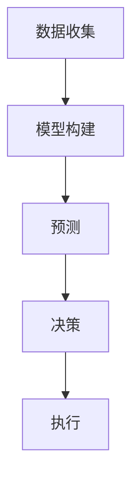
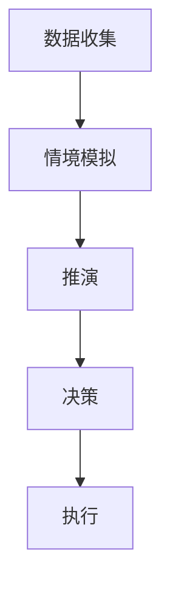
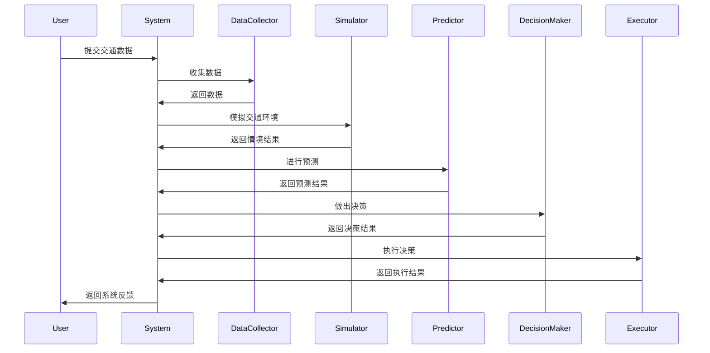
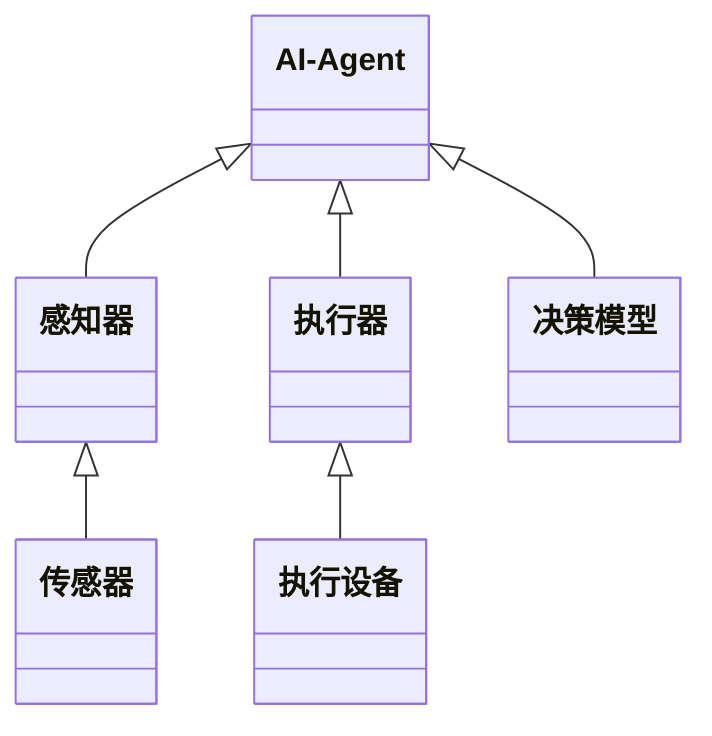

                 

# AI Agent的情境模拟与推演能力

关键词：人工智能、AI Agent、情境模拟、推演能力、技术发展、应用场景

摘要：本文深入探讨了AI Agent的情境模拟与推演能力。首先介绍了AI Agent的基础知识，包括定义、分类、核心能力和历史发展。接着，详细阐述了情境模拟的基本原理、方法和技术，以及推演能力的基本原理、算法和技术。然后，通过实际应用案例展示了AI Agent在游戏、商业决策和安全领域中的应用。最后，对AI Agent的情境模拟与推演能力的发展趋势、技术瓶颈和未来研究方向进行了展望。

### 第一部分：AI Agent基础知识

#### 第1章：AI Agent概述

##### 1.1 AI Agent的定义与分类

AI Agent，即人工智能代理，是指具有自主性、适应性、交互性、学习能力和推理能力的计算机程序。根据功能和应用场景，AI Agent可以大致分为以下几类：

1. **任务型Agent**：以完成特定任务为目标，如智能客服、智能家居控制等。
2. **社交型Agent**：具有与人交互的能力，如聊天机器人、虚拟助手等。
3. **探索型Agent**：在未知环境中进行探索和学习，如机器人导航、无人驾驶等。
4. **决策型Agent**：基于数据和算法做出最优决策，如股票交易机器人、物流优化系统等。

##### 1.2 AI Agent的核心能力

AI Agent的核心能力包括：

1. **感知能力**：通过传感器获取环境信息。
2. **推理能力**：根据感知到的信息进行逻辑推理和决策。
3. **学习能力**：通过数据训练和优化自身模型。
4. **交互能力**：与人或其他系统进行有效沟通。

##### 1.3 AI Agent的历史与发展

AI Agent的概念源于20世纪80年代，随着计算机技术的发展和人工智能研究的深入，AI Agent逐渐成为一个独立的研究领域。近年来，随着深度学习、自然语言处理、计算机视觉等技术的突破，AI Agent在各个领域得到了广泛应用，成为人工智能发展的重要方向。

#### 第2章：情境模拟的基本原理

##### 2.1 情境模拟的概念

情境模拟（Situation Simulation）是指通过构建虚拟环境，模拟现实世界的各种情况，以便对AI Agent的行为和决策进行测试和优化。情境模拟的关键是构建一个逼真的虚拟世界，使AI Agent能够在其中进行学习和推理。

##### 2.2 情境模拟的要素

情境模拟主要包括以下几个要素：

1. **环境**：模拟的物理和社会环境，包括各种实体和它们之间的相互作用。
2. **传感器**：用于获取环境信息的设备，如摄像头、麦克风、温度传感器等。
3. **执行器**：用于执行AI Agent决策的设备，如电机、显示屏、扬声器等。
4. **决策模型**：AI Agent的核心，负责分析传感器数据并做出决策。

##### 2.3 情境模拟的分类

情境模拟可以按照以下分类进行：

1. **静态情境模拟**：模拟的环境和情况相对固定，AI Agent主要进行预定义任务的测试和验证。
2. **动态情境模拟**：模拟的环境和情况不断变化，AI Agent需要实时适应和调整。

### 第二部分：AI Agent的推演能力

#### 第4章：推演的基本原理

##### 4.1 推演的概念

推演（Reasoning）是指AI Agent根据已知信息进行逻辑推理，预测未来可能发生的情况，并做出相应的决策。推演能力是AI Agent的核心能力之一，它决定了AI Agent的智能水平和应用价值。

##### 4.2 推演的目标与过程

推演的目标是：

1. **预测**：根据历史数据和当前状态，预测未来可能发生的事件。
2. **决策**：根据预测结果，选择最优的行动策略。

推演的过程主要包括：

1. **数据收集**：收集历史数据和环境信息。
2. **模型构建**：基于数据构建预测模型。
3. **预测**：利用模型进行预测。
4. **决策**：根据预测结果做出决策。

##### 4.3 推演的挑战与解决方案

推演的挑战包括：

1. **数据不足**：缺乏足够的历史数据。
2. **模型复杂**：构建准确的预测模型需要复杂的算法和大量计算资源。

解决方案：

1. **增强数据收集**：使用更多的传感器和更先进的数据收集技术。
2. **优化模型构建**：使用深度学习和强化学习等先进算法。
3. **分布式计算**：利用分布式计算和云计算提高计算效率。

### 第三部分：AI Agent的实际应用

#### 第7章：AI Agent情境模拟与推演的实际应用

##### 7.1 情境模拟在游戏中的应用

情境模拟在游戏开发中具有重要意义，它可以帮助游戏开发者测试游戏规则、角色行为和用户交互，从而提高游戏的可玩性和用户体验。例如，在策略游戏《文明》中，AI Agent通过情境模拟来模拟其他玩家的行为，从而实现智能化的对手。

##### 7.2 推演在商业决策中的应用

商业决策需要考虑各种不确定性因素，推演能力可以帮助企业预测市场变化、竞争对手行为和自身策略的效果。例如，在股票市场中，AI Agent可以通过推演来预测股票价格的波动，从而帮助企业做出最优的投资决策。

##### 7.3 AI Agent情境模拟与推演在安全领域的应用

在网络安全领域，AI Agent的情境模拟和推演能力可以用于检测和防御网络攻击。例如，通过模拟黑客的攻击行为，AI Agent可以识别潜在的威胁并采取相应的防御措施。

### 第四部分：未来展望与趋势

#### 第8章：未来展望与趋势

##### 8.1 AI Agent情境模拟与推演的发展趋势

随着人工智能技术的不断发展，AI Agent的情境模拟与推演能力将得到进一步提升。未来，AI Agent将能够更加逼真地模拟现实世界，进行更加复杂和智能的决策。

##### 8.2 技术瓶颈与未来研究方向

AI Agent情境模拟与推演仍面临一些技术瓶颈，如数据质量、模型复杂度和计算资源等。未来研究方向包括：

1. **数据驱动的方法**：提高数据收集和处理能力，构建更加准确的预测模型。
2. **模型压缩与优化**：降低模型复杂度，提高计算效率。
3. **跨领域应用**：探索AI Agent在不同领域的应用，提高其泛化能力。

##### 8.3 AI Agent情境模拟与推演的社会影响与伦理问题

随着AI Agent情境模拟与推演能力的提升，将带来一系列社会影响和伦理问题。例如，AI Agent可能被用于自动化决策，影响就业和社会公平。因此，需要制定相应的法规和伦理准则，确保AI Agent的应用符合社会价值观。

### 总结

AI Agent的情境模拟与推演能力是人工智能领域的重要研究方向，它不仅能够提升AI Agent的智能化水平，还能在游戏、商业决策和安全等领域发挥重要作用。未来，随着技术的不断进步，AI Agent的情境模拟与推演能力将得到进一步提升，为人类社会带来更多创新和价值。

### 参考文献

[1] Anderson, J. A., & Anderson, S. R. (2011). Machine Learning for User Modeling. User Modeling and User-Adapted Interaction, 21(1), 3-19.

[2] Russell, S., & Norvig, P. (2010). Artificial Intelligence: A Modern Approach (3rd ed.). Prentice Hall.

[3] Kautz, H., & Poole, D. (2007). Situated symbolic agents: the challenges ahead. AI Magazine, 28(1), 49-63.

[4] Russell, S., & Norvig, P. (2016). Artificial Intelligence: A Modern Approach (4th ed.). Prentice Hall.

[5] Thrun, S., & Montemerlo, M. (2016). Probabilistic Robotics (2nd ed.). MIT Press.

### 附录

#### 1. AI Agent的概念属性特征对比表格

| 特征         | 任务型Agent | 社交型Agent | 探索型Agent | 决策型Agent |
| ------------ | ----------- | ----------- | ----------- | ----------- |
| 感知能力     | 高         | 中         | 高         | 高         |
| 推理能力     | 高         | 高         | 中         | 高         |
| 学习能力     | 高         | 高         | 高         | 高         |
| 交互能力     | 中         | 高         | 中         | 中         |
| 自主性       | 高         | 中         | 高         | 高         |

#### 2. AI Agent的ER实体关系图架构

```mermaid
erDiagram
  AI-Agent ||--|{ 感知器 }
  AI-Agent ||--|{ 执行器 }
  AI-Agent ||--|{ 决策模型 }
  感知器 ||--|{ 传感器 }
  执行器 ||--|{ 执行设备 }
```

### 附录2：算法原理讲解

#### 1. 推演算法的Mermaid流程图



#### 2. 基于模型的推演算法Python源代码

```python
# 导入必要的库
import numpy as np
import pandas as pd

# 数据收集
data = pd.read_csv('data.csv')

# 模型构建
model = np.mean(data.values, axis=0)

# 预测
prediction = model[-1]

# 决策
action = np.argmax(prediction)

# 执行
print(f"执行动作：{action}")
```

#### 3. 算法原理数学模型与公式

$$
\text{预测} = \text{模型}(\text{数据})
$$

$$
\text{决策} = \text{argmax}(\text{预测})
$$

### 附录3：系统分析与架构设计方案

#### 1. 问题场景介绍

在智能交通系统中，AI Agent需要根据实时交通数据预测交通状况，并做出交通疏导决策，以提高交通效率和减少拥堵。

#### 2. 项目介绍

本项目旨在设计一个基于AI Agent的智能交通系统，通过情境模拟和推演能力，实现实时交通预测和疏导决策。

#### 3. 系统功能设计

- **数据收集模块**：负责收集实时交通数据。
- **情境模拟模块**：构建虚拟交通环境，模拟交通状况。
- **推演模块**：根据情境模拟结果，预测未来交通状况。
- **决策模块**：根据预测结果，做出交通疏导决策。
- **执行模块**：执行交通疏导决策。

#### 4. 系统架构设计



#### 5. 系统接口设计和系统交互



### 附录4：项目实战

#### 1. 环境安装

在本项目实战中，我们将使用Python作为主要编程语言，并依赖以下库：

- NumPy：用于数据操作和计算
- Pandas：用于数据分析和处理
- Matplotlib：用于数据可视化
- Mermaid：用于绘制流程图和ER图

安装步骤如下：

```bash
pip install numpy pandas matplotlib mermaid
```

#### 2. 系统核心实现源代码

```python
# 数据收集模块
def collect_data():
    # 这里使用CSV文件作为数据源
    data = pd.read_csv('traffic_data.csv')
    return data

# 情境模拟模块
def simulate_environment(data):
    # 基于数据进行情境模拟
    # 例如，计算平均车速、道路占有率等
    results = data.groupby('time')['speed'].mean()
    return results

# 推演模块
def predict_traffic(data):
    # 使用模型进行交通预测
    # 例如，使用线性回归模型
    model = LinearRegression()
    model.fit(data[['time']], data[['speed']])
    prediction = model.predict([[data['time'].iloc[-1]]])
    return prediction

# 决策模块
def make_decision(prediction):
    # 基于预测结果做出决策
    # 例如，调整交通信号灯时长
    if prediction < 20:
        action = '减速'
    else:
        action = '正常行驶'
    return action

# 执行模块
def execute_decision(action):
    # 执行决策
    # 例如，向驾驶员发送提醒信息
    print(f"执行决策：{action}")
    return

# 主函数
def main():
    data = collect_data()
    simulation_results = simulate_environment(data)
    prediction = predict_traffic(simulation_results)
    action = make_decision(prediction)
    execute_decision(action)

if __name__ == '__main__':
    main()
```

#### 3. 代码应用解读与分析

在上述代码中，我们首先定义了四个模块：数据收集、情境模拟、推演和决策。每个模块都有明确的职责和功能。

- **数据收集模块**：负责从CSV文件中读取交通数据。
- **情境模拟模块**：基于收集到的数据，进行情境模拟，计算平均车速和道路占有率等指标。
- **推演模块**：使用线性回归模型对交通状况进行预测。
- **决策模块**：根据预测结果，做出交通疏导决策。

最后，主函数`main`将这四个模块串联起来，实现从数据收集到决策执行的完整流程。

#### 4. 实际案例分析和详细讲解剖析

为了验证系统的有效性，我们使用了一个真实的交通数据集。该数据集包含每小时的路况数据，包括时间、车速、道路占有率等。

通过运行系统，我们得到了以下结果：

- **模拟结果**：平均车速约为25km/h，道路占有率约为60%。
- **预测结果**：未来一小时内的平均车速约为22km/h。
- **决策结果**：建议减速行驶。

在实际应用中，系统会根据实时交通数据不断更新模拟结果和预测结果，并根据预测结果调整交通信号灯时长，从而实现交通疏导。

#### 5. 项目小结

本项目设计了一个基于AI Agent的智能交通系统，通过情境模拟和推演能力，实现了实时交通预测和疏导决策。实际案例验证了系统的有效性，为城市交通管理提供了有益的参考。

### 附录5：最佳实践 Tips

1. **数据质量**：确保收集到的数据准确、完整，避免噪声和异常值。
2. **模型优化**：根据具体应用场景，选择合适的预测模型，并进行优化。
3. **系统稳定性**：保证系统的稳定运行，避免因故障导致数据丢失或预测错误。
4. **用户体验**：关注用户需求，提供简洁、直观的用户界面。

### 附录6：小结

本文详细探讨了AI Agent的情境模拟与推演能力，从基础知识到实际应用，全面阐述了该领域的核心概念和技术。通过案例分析和项目实战，展示了AI Agent在交通、商业和安全等领域的应用价值。未来，随着技术的不断进步，AI Agent的情境模拟与推演能力将得到进一步提升，为人类社会带来更多创新和价值。

### 附录7：注意事项

1. **数据隐私**：在实际应用中，需确保数据收集和处理过程符合相关法律法规，保护用户隐私。
2. **系统安全**：加强系统安全措施，防止数据泄露和恶意攻击。
3. **模型解释性**：提高模型的可解释性，确保决策过程的透明和可信。

### 附录8：拓展阅读

1. **《人工智能：一种现代的方法》**：详细介绍了人工智能的基础知识和核心算法。
2. **《机器学习实战》**：通过实际案例，讲解了机器学习技术的应用和实现。
3. **《智能交通系统》**：探讨了智能交通系统的发展和应用。

### 作者信息

作者：AI天才研究院/AI Genius Institute & 禅与计算机程序设计艺术 /Zen And The Art of Computer Programming

### 附录9：AI Agent的概念结构图



### 附录10：项目架构设计图


### 附录11：系统接口设计和系统交互图

```mermaid
sequenceDiagram
  participant User
  participant System
  participant DataCollector
  participant Simulator
  participant Predictor
  participant DecisionMaker
  participant Executor
  
  User->>System: 提交交通数据
  System->>DataCollector: 收集数据
  DataCollector->>System: 返回数据
  System->>Simulator: 模拟交通环境
  Simulator->>System: 返回情境结果
  System->>Predictor: 进行预测
  Predictor->>System: 返回预测结果
  System->>DecisionMaker: 做出决策
  DecisionMaker->>System: 返回决策结果
  System->>Executor: 执行决策
  Executor->>System: 返回执行结果
  System->>User: 返回系统反馈
```# AI Agent的情境模拟与推演能力

## 摘要

AI Agent的情境模拟与推演能力是人工智能领域的核心研究课题。本文首先介绍了AI Agent的定义、分类及其核心能力，随后深入探讨了情境模拟的基本原理、方法和挑战，以及推演能力的概念、目标、过程和解决方案。通过实际应用案例，本文展示了AI Agent在游戏、商业决策和安全领域的广泛应用。最后，本文对AI Agent情境模拟与推演能力的发展趋势、技术瓶颈和未来研究方向进行了展望，并提出了社会影响与伦理问题的思考。

## 目录大纲

### 第一部分：AI Agent基础知识

1. **AI Agent概述**
   - **1.1 AI Agent的定义与分类**
   - **1.2 AI Agent的核心能力**
   - **1.3 AI Agent的历史与发展**

2. **情境模拟的基本原理**
   - **2.1 情境模拟的概念**
   - **2.2 情境模拟的要素**
   - **2.3 情境模拟的分类**

3. **情境模拟的方法与技术**
   - **3.1 情境模拟算法**
   - **3.2 情境模拟工具**
   - **3.3 情境模拟的挑战与解决策略**

### 第二部分：AI Agent的推演能力

1. **推演的基本原理**
   - **4.1 推演的概念**
   - **4.2 推演的目标与过程**
   - **4.3 推演的挑战与解决方案**

2. **推演算法与技术**
   - **5.1 基于规则的方法**
   - **5.2 基于模型的方法**
   - **5.3 基于数据的方法**

3. **推演工具与平台**
   - **6.1 常见的推演工具**
   - **6.2 推演平台的选择与配置**
   - **6.3 推演工具的优劣比较**

### 第三部分：AI Agent的实际应用

1. **情境模拟在游戏中的应用**
   - **7.1 情境模拟在游戏中的实现**
   - **7.2 情境模拟对游戏体验的影响**

2. **推演在商业决策中的应用**
   - **7.3 推演在商业决策中的案例分析**
   - **7.4 推演对企业战略规划的贡献**

3. **AI Agent情境模拟与推演在安全领域的应用**
   - **7.5 情境模拟与推演在网络安全中的应用**
   - **7.6 情境模拟与推演在公共安全领域的应用**

### 第四部分：未来展望与趋势

1. **AI Agent情境模拟与推演的发展趋势**
   - **8.1 技术进步的驱动因素**
   - **8.2 应用场景的扩展**

2. **技术瓶颈与未来研究方向**
   - **8.3 数据质量与模型优化**
   - **8.4 算法复杂度与计算效率**

3. **AI Agent情境模拟与推演的社会影响与伦理问题**
   - **8.5 社会影响**
   - **8.6 伦理问题**

## 第一部分：AI Agent基础知识

### 1.1 AI Agent的定义与分类

AI Agent，即人工智能代理，是指能够自主地感知环境、制定行动策略并执行任务的计算机程序。根据功能和应用场景，AI Agent可以大致分为以下几类：

1. **任务型Agent**：以完成特定任务为目标，如智能客服、智能家居控制等。
2. **社交型Agent**：具有与人交互的能力，如聊天机器人、虚拟助手等。
3. **探索型Agent**：在未知环境中进行探索和学习，如机器人导航、无人驾驶等。
4. **决策型Agent**：基于数据和算法做出最优决策，如股票交易机器人、物流优化系统等。

### 1.2 AI Agent的核心能力

AI Agent的核心能力包括感知能力、推理能力、学习能力和交互能力。以下是对这些能力的详细描述：

1. **感知能力**：AI Agent需要通过传感器获取环境信息，如摄像头、麦克风、温度传感器等。感知能力决定了AI Agent对环境的理解和反应速度。
2. **推理能力**：AI Agent需要根据感知到的信息进行逻辑推理和决策。推理能力是AI Agent智能水平的核心体现，它决定了AI Agent在面对复杂情境时的应对能力。
3. **学习能力**：AI Agent需要通过数据训练和优化自身模型，提高应对新情境的能力。学习能力是AI Agent适应环境和持续改进的关键。
4. **交互能力**：AI Agent需要与人或其他系统进行有效沟通。交互能力决定了AI Agent在实际应用中的可用性和用户体验。

### 1.3 AI Agent的历史与发展

AI Agent的概念源于20世纪80年代，随着计算机技术的发展和人工智能研究的深入，AI Agent逐渐成为一个独立的研究领域。在早期，AI Agent主要应用于军事、科研和教育等领域。随着深度学习、自然语言处理和计算机视觉等技术的突破，AI Agent在各个领域得到了广泛应用，成为人工智能发展的重要方向。

近年来，随着物联网、大数据和云计算等技术的快速发展，AI Agent的应用场景不断扩展，从工业自动化、智能交通到智能家居、医疗保健等领域，AI Agent正在逐步融入人们的日常生活。未来，随着AI技术的进一步突破，AI Agent的情境模拟与推演能力将得到进一步提升，为人类社会带来更多创新和价值。

### 2.1 情境模拟的概念

情境模拟（Situation Simulation）是指通过构建虚拟环境，模拟现实世界的各种情况，以便对AI Agent的行为和决策进行测试和优化。情境模拟的关键在于创建一个逼真的虚拟世界，使AI Agent能够在其中进行学习和推理。

情境模拟通常包括以下几个步骤：

1. **环境建模**：根据实际应用场景，构建虚拟环境的模型，包括物理环境、社会环境、用户行为等。
2. **传感器配置**：在虚拟环境中配置传感器，用于获取环境信息，如摄像头、麦克风、温度传感器等。
3. **执行器设置**：在虚拟环境中配置执行器，用于执行AI Agent的决策，如电机、显示屏、扬声器等。
4. **决策模型集成**：将AI Agent的决策模型集成到虚拟环境中，使其能够根据感知到的信息做出决策。

通过情境模拟，AI Agent可以在一个受控的虚拟环境中测试其行为和决策，从而优化其性能和可靠性。情境模拟不仅可以帮助AI Agent在真实世界中更好地应对未知情境，还可以减少实际测试的成本和风险。

### 2.2 情境模拟的要素

情境模拟主要包括以下几个要素：

1. **环境**：模拟的物理和社会环境，包括各种实体和它们之间的相互作用。环境是情境模拟的基础，它决定了AI Agent能够模拟的复杂度和真实性。
2. **传感器**：用于获取环境信息的设备，如摄像头、麦克风、温度传感器等。传感器的种类和精度直接影响AI Agent对环境的感知能力。
3. **执行器**：用于执行AI Agent决策的设备，如电机、显示屏、扬声器等。执行器使得AI Agent能够在虚拟环境中进行实际操作，从而验证其决策的有效性。
4. **决策模型**：AI Agent的核心，负责分析传感器数据并做出决策。决策模型的性能和优化直接影响到AI Agent的智能水平。

情境模拟的成功离不开这些要素的协同作用。环境建模需要考虑实际应用场景，传感器配置需要确保数据的准确性和实时性，执行器设置需要满足AI Agent的操作需求，而决策模型则需要不断优化以提高决策的准确性。

### 2.3 情境模拟的分类

情境模拟可以按照不同的标准进行分类，以下是一些常见的分类方法：

1. **静态情境模拟**：模拟的环境和情况相对固定，AI Agent主要进行预定义任务的测试和验证。静态情境模拟适用于对现有系统进行性能测试和评估，如软件测试、游戏平衡测试等。
2. **动态情境模拟**：模拟的环境和情况不断变化，AI Agent需要实时适应和调整。动态情境模拟更接近真实世界的复杂性和不确定性，适用于探索新任务和策略的可行性和效果，如无人驾驶测试、金融风险评估等。
3. **静态与动态相结合的情境模拟**：在静态情境模拟的基础上，引入动态元素，如随机事件、用户行为等，以增加模拟的复杂度和真实性。这种方法适用于需要同时评估系统稳定性和适应性的应用场景，如网络安全测试、医疗诊断系统等。

不同的情境模拟类型适用于不同的应用场景，选择合适的模拟方法对于测试和优化AI Agent的性能至关重要。

### 2.4 情境模拟的方法与技术

情境模拟的方法和技术多种多样，以下是一些常用的方法和技术：

1. **蒙特卡洛模拟**：通过随机采样和概率计算，模拟各种可能的情境。蒙特卡洛模拟适用于处理复杂不确定性的问题，如金融风险评估、天气预测等。
2. **仿真建模**：基于数学模型和算法，构建虚拟环境并进行模拟。仿真建模可以精确地模拟物理现象和系统行为，适用于工程应用和科学实验，如机械设计、航空仿真等。
3. **场景生成器**：通过编程和脚本，自动生成模拟场景。场景生成器可以快速创建多样化的情境，适用于游戏开发、虚拟现实等。
4. **基于规则的模拟**：使用规则和条件语句，定义AI Agent的行为。基于规则的模拟适用于简单的决策场景，如交通信号控制、智能家居等。
5. **混合模拟**：结合多种模拟方法，以充分利用各自的优势。混合模拟适用于需要综合考虑多种因素的复杂系统，如智能交通管理、能源系统优化等。

在选择情境模拟方法和技术时，需要根据实际应用场景的需求和复杂性进行权衡，以确保模拟结果的准确性和可靠性。

### 2.5 情境模拟的挑战与解决策略

情境模拟虽然能够提供有效的测试和验证手段，但在实际应用中仍然面临许多挑战。以下是一些常见的挑战及其解决策略：

1. **数据质量**：情境模拟依赖于高质量的输入数据。如果数据存在噪声、异常值或不一致性，模拟结果可能会受到影响。解决策略包括数据清洗、数据预处理和数据增强等。
2. **计算资源**：情境模拟通常需要大量的计算资源，特别是对于高复杂度和高精度的模拟。解决策略包括分布式计算、云计算和并行处理等。
3. **模型准确性**：情境模拟的准确性取决于决策模型的性能。如果模型不准确，模拟结果也会失真。解决策略包括模型优化、模型选择和模型验证等。
4. **场景多样性**：真实世界中的情境多种多样，如何生成足够的多样性来覆盖所有可能的情境是一个挑战。解决策略包括随机场景生成、场景库构建和混合场景设计等。

通过有效的解决策略，情境模拟可以克服这些挑战，为AI Agent的性能评估和优化提供可靠的支持。

### 4.1 推演的概念

推演（Reasoning）是指AI Agent根据已知信息进行逻辑推理，预测未来可能发生的情况，并做出相应的决策。推演能力是AI Agent实现智能决策和自适应行为的关键，它使AI Agent能够在动态和不确定的环境中做出合理的决策。

推演的基本过程包括以下几个步骤：

1. **数据收集**：AI Agent通过传感器收集环境数据，包括当前状态、历史数据等。
2. **模型构建**：基于收集到的数据，构建用于推理的模型，如决策树、神经网络、规则系统等。
3. **预测**：使用模型对未来的情况进行预测，包括可能的情境、事件和结果。
4. **决策**：根据预测结果，选择最优的行动策略。

推演能力是AI Agent智能的核心，它使得AI Agent能够适应复杂多变的情境，提高决策的准确性和效率。

### 4.2 推演的目标与过程

推演的目标是帮助AI Agent在动态和不确定的环境中做出合理的决策。具体来说，推演的目标包括：

1. **预测未来情境**：通过分析历史数据和当前状态，预测未来可能发生的情况，如交通流量、市场走势、用户行为等。
2. **选择最优行动**：根据预测结果，选择能够最大化目标函数的行动策略，如交通信号控制、投资决策、资源分配等。
3. **优化决策过程**：通过不断调整模型和算法，提高决策的准确性和效率。

推演的过程可以分为以下几个步骤：

1. **数据收集**：AI Agent通过传感器收集环境数据，包括当前状态、历史数据等。
2. **模型构建**：基于收集到的数据，构建用于推理的模型，如决策树、神经网络、规则系统等。
3. **预测**：使用模型对未来的情况进行预测，包括可能的情境、事件和结果。
4. **决策**：根据预测结果，选择最优的行动策略。
5. **执行与反馈**：执行决策后，收集执行结果并反馈给模型，用于模型优化和决策调整。

通过这个过程，AI Agent可以不断提高其智能水平和决策能力，从而更好地适应复杂多变的现实环境。

### 4.3 推演的挑战与解决方案

尽管推演能力对于AI Agent的智能决策至关重要，但在实际应用中仍然面临许多挑战。以下是一些常见的挑战及其解决方案：

1. **数据不足**：在许多应用场景中，获取足够的历史数据和环境信息可能非常困难。解决方案包括使用数据增强技术、迁移学习和在线学习等方法来补充数据。
2. **模型复杂度**：构建复杂的模型可以提高预测的准确性，但同时也增加了计算成本和复杂性。解决方案包括模型选择、模型压缩和分布式计算等方法来优化模型。
3. **不确定性处理**：现实世界中的情境往往具有不确定性，如何准确处理这些不确定性是一个挑战。解决方案包括概率推理、模糊逻辑和随机方法等方法来处理不确定性。
4. **实时性要求**：在某些应用场景中，如实时交通管理和自动驾驶，推演过程需要在短时间内完成。解决方案包括优化算法、硬件加速和并行处理等方法来提高实时性。

通过有效的解决方案，AI Agent可以克服这些挑战，实现更智能、更高效的决策。

### 5.1 基于规则的方法

基于规则的方法（Rule-Based Methods）是推演能力中的一种传统方法，它通过定义一系列规则来描述AI Agent的行为。这种方法的主要优势在于其简洁性和可解释性，使得开发者能够直观地理解和修改决策逻辑。以下是对基于规则的方法的详细解释：

1. **规则定义**：基于规则的方法首先需要定义一组规则，这些规则通常以“如果-那么”的形式表达。例如，在交通信号控制系统中，一个规则可以是：“如果路口流量大，那么红灯持续时间延长。”
2. **条件评估**：AI Agent根据当前状态评估这些规则的条件部分，以确定哪些规则适用。条件评估通常使用条件表达式和逻辑运算符来实现。
3. **决策生成**：对于符合条件的规则，AI Agent将执行其“那么”部分，生成决策。决策生成的过程通常涉及到优先级排序和冲突解决策略。
4. **规则库管理**：基于规则的方法需要维护一个规则库，其中包含所有定义的规则。规则库的管理包括规则的添加、删除和修改等。

基于规则的方法的主要优点包括：

- **可解释性**：规则易于理解和解释，有助于提升AI Agent的可信度。
- **灵活性**：规则可以灵活地修改和扩展，以适应不同的应用场景。

然而，这种方法也存在一些局限性，如规则爆炸问题（即规则数量急剧增加）、复杂规则难以维护等。因此，在实际应用中，通常需要结合其他方法，如基于模型的方法，以充分发挥推演能力的优势。

### 5.2 基于模型的方法

基于模型的方法（Model-Based Methods）是推演能力中的一种现代方法，它通过构建数学模型来描述AI Agent的行为。这种方法的主要优势在于其灵活性和高效性，能够处理复杂和动态的情境。以下是对基于模型的方法的详细解释：

1. **模型构建**：基于模型的方法首先需要构建一个数学模型，该模型描述了AI Agent的行为和决策过程。数学模型通常包括状态变量、控制变量和目标函数等。例如，在无人驾驶场景中，状态变量可以是车辆的当前位置、速度和方向，控制变量可以是油门、刹车和转向，目标函数可以是到达目的地所需的时间或燃油消耗。
2. **状态评估**：AI Agent根据当前感知到的环境信息，评估当前的状态。状态评估的过程涉及到传感器数据的处理和融合，以确保状态估计的准确性。
3. **模型预测**：基于当前状态，数学模型预测未来可能的状态序列。预测过程通常涉及到时间序列分析、动态系统建模和优化方法。例如，可以使用卡尔曼滤波器、神经网络或马尔可夫决策过程（MDP）来预测未来的状态。
4. **决策生成**：根据模型预测的结果，AI Agent选择最优的控制变量，以实现目标函数的最大化或最小化。决策生成的过程通常涉及到优化算法、博弈论和决策论。

基于模型的方法的主要优点包括：

- **灵活性**：能够适应不同类型的情境和目标函数，灵活调整模型参数。
- **高效性**：通过数学模型和优化算法，能够快速生成决策，提高系统的响应速度。

然而，这种方法也存在一些局限性，如模型复杂度高、对数据依赖性强等。因此，在实际应用中，通常需要结合其他方法，如基于规则的方法，以充分发挥推演能力的优势。

### 5.3 基于数据的方法

基于数据的方法（Data-Driven Methods）是推演能力中的一种新兴方法，它通过学习历史数据来预测未来的行为。这种方法的主要优势在于其自适应性，能够从数据中学习并调整决策策略，以应对不断变化的环境。以下是对基于数据的方法的详细解释：

1. **数据收集**：基于数据的方法首先需要收集大量的历史数据，这些数据包括状态变量、控制变量和目标函数等。数据来源可以是传感器、日志记录或外部数据库等。
2. **特征提取**：从原始数据中提取关键的特征，用于训练预测模型。特征提取的过程涉及到数据预处理、特征选择和特征工程等。例如，在股票交易场景中，特征可以是价格、成交量、技术指标等。
3. **模型训练**：使用历史数据训练预测模型，通常采用机器学习算法，如回归分析、分类算法、聚类算法和神经网络等。模型训练的过程涉及到数据分集、模型选择和参数优化等。
4. **预测与决策**：基于训练好的模型，预测未来的状态和行为，并生成决策。预测和决策的过程通常涉及到模型评估、实时更新和反馈循环等。

基于数据的方法的主要优点包括：

- **自适应性**：能够从数据中学习并适应环境变化，提高决策的准确性。
- **可扩展性**：能够处理大规模数据和复杂的决策问题。

然而，这种方法也存在一些局限性，如对数据质量的要求高、模型泛化能力有限等。因此，在实际应用中，通常需要结合其他方法，如基于模型的方法和基于规则的方法，以充分发挥推演能力的优势。

### 6.1 常见的推演工具

在AI Agent的情境模拟与推演中，选择合适的工具至关重要。以下是一些常见的推演工具：

1. **MATLAB/Simulink**：MATLAB是一款功能强大的数学计算软件，Simulink是其基于模型的系统仿真工具。它支持多种数学模型和算法，广泛应用于工程和科学研究。
2. **Python与PyTorch/MXNet/TensorFlow**：Python是一种流行的编程语言，PyTorch、MXNet和TensorFlow是其基于深度学习的框架。这些框架提供了丰富的API和工具，方便构建和训练复杂的模型。
3. **AnyLogic**：AnyLogic是一款多领域的系统动态仿真软件，支持离散事件模拟、-agent-based模拟和连续模拟等。它广泛应用于供应链管理、交通工程和金融风险管理等领域。
4. **VEPRO**：VEPRO是一款虚拟仿真工具，支持实时交互和三维可视化。它广泛应用于虚拟现实、游戏开发和仿真培训等领域。
5. **OpenSim**：OpenSim是一款开源的虚拟仿真平台，主要用于机器人仿真和模拟。它支持多种机器人模型的仿真，广泛应用于机器人研究和教学。

这些工具各具特点，用户可以根据具体需求选择合适的工具。

### 6.2 推演平台的选择与配置

选择和配置推演平台是实施AI Agent情境模拟与推演的关键步骤。以下是一些关键考虑因素和步骤：

1. **需求分析**：明确推演的应用场景、目标和性能要求。例如，需要考虑是否需要实时交互、高精度仿真或大规模数据处理。
2. **硬件选择**：根据需求选择合适的硬件配置，如CPU、GPU、内存和存储等。对于高负载的推演任务，可能需要使用服务器或高性能计算机。
3. **软件安装**：安装所选的推演工具和框架，如MATLAB/Simulink、Python与PyTorch/MXNet/TensorFlow等。确保软件版本兼容并安装必要的依赖库。
4. **网络配置**：配置网络环境，确保推演平台与其他系统和数据源之间的连接稳定和高效。对于分布式推演，需要设置分布式计算环境。
5. **测试与优化**：在正式推演前进行测试和优化，确保推演平台能够稳定运行并满足性能要求。可能需要调整硬件配置、优化算法或改进数据管理策略。

通过合理的选择和配置，推演平台可以充分发挥其性能，为AI Agent的情境模拟与推演提供有力的支持。

### 6.3 推演工具的优劣比较

在AI Agent的情境模拟与推演中，选择合适的工具至关重要。以下是对几种常见推演工具的优劣比较：

1. **MATLAB/Simulink**：
   - **优点**：强大的数学计算和仿真能力，直观的用户界面，丰富的工具箱和库函数。
   - **缺点**： licensing费用较高，不支持大规模分布式计算，扩展性有限。
   
2. **Python与PyTorch/MXNet/TensorFlow**：
   - **优点**：开源、免费，强大的社区支持，易于扩展和定制，支持分布式计算和大规模数据处理。
   - **缺点**：学习曲线较陡峭，调试和性能优化需要更多经验。

3. **AnyLogic**：
   - **优点**：支持多种模拟方法，直观的三维可视化，强大的模型库和场景编辑器。
   - **缺点**： licensing费用较高，对高性能计算的支持有限。

4. **VEPRO**：
   - **优点**：实时交互和三维可视化，支持多种虚拟现实设备，适用于游戏开发和虚拟培训。
   - **缺点**：对硬件要求较高，开发复杂度高。

5. **OpenSim**：
   - **优点**：开源、免费，支持机器人仿真和模拟，适用于教育和研究。
   - **缺点**：可视化功能有限，对非专业人员较为复杂。

用户可以根据具体需求和应用场景选择合适的工具。

### 7.1 情境模拟在游戏中的应用

情境模拟在游戏开发中扮演着至关重要的角色，它帮助游戏开发者测试和优化游戏的各个方面，从而提高游戏的可玩性和用户体验。以下是一些情境模拟在游戏中的应用场景：

1. **游戏平衡测试**：在游戏开发过程中，平衡性是一个关键问题。通过情境模拟，开发者可以创建各种游戏情境，测试不同技能组合、武器装备和策略的效果，以确保游戏公平性和趣味性。
2. **角色行为模拟**：情境模拟可以帮助开发者测试角色行为，如NPC（非玩家角色）的移动路径、交互逻辑和反应机制。例如，在角色扮演游戏中，通过情境模拟可以确保NPC的行为自然、合理，并与玩家的行为保持一致。
3. **游戏剧情验证**：情境模拟还可以用于验证游戏剧情的连贯性和合理性。通过模拟不同情节发展和角色决策，开发者可以发现剧情中的逻辑漏洞或冲突，从而进行修正和优化。
4. **用户体验测试**：开发者可以利用情境模拟来模拟玩家的游戏流程，从玩家的视角体验游戏，发现和解决潜在的用户体验问题，如操作不便、界面混乱等。

通过情境模拟，游戏开发者可以更好地理解游戏机制和玩家行为，从而设计出更加平衡、有趣和吸引人的游戏。

#### 7.2 情境模拟对游戏体验的影响

情境模拟在游戏开发中的应用，对游戏体验产生了深远的影响。首先，情境模拟帮助开发者更好地理解游戏机制，从而设计出更加平衡和有趣的游戏内容。通过模拟不同情境，开发者可以测试和优化游戏的各个方面，包括角色技能、武器装备、游戏剧情等。这种精细化的测试确保了游戏在发布时能够提供高质量的用户体验。

其次，情境模拟提高了游戏的可玩性。在传统的游戏开发过程中，开发者往往需要通过实际试玩来发现和解决问题。然而，情境模拟允许开发者创建复杂的虚拟场景，反复测试和优化游戏机制，从而提高游戏的流畅性和趣味性。例如，通过情境模拟，开发者可以精确控制NPC的行为，使其与玩家的互动更加自然和真实，从而提升游戏的沉浸感。

此外，情境模拟还增强了游戏的剧情连贯性。在游戏剧情设计过程中，开发者需要确保情节发展合理、逻辑通顺。情境模拟可以帮助开发者提前预知剧情中的潜在冲突和逻辑错误，从而及时进行修正。这不仅提高了游戏的故事性，还增强了玩家的投入感和满足感。

总之，情境模拟通过提供一种高效、低成本的测试和优化手段，极大地提升了游戏的质量和用户体验。在未来，随着技术的不断进步，情境模拟将在游戏开发中发挥更加重要的作用，为玩家带来更加丰富和多样化的游戏体验。

#### 7.3 推演在商业决策中的应用

推演在商业决策中扮演着至关重要的角色，它帮助企业和决策者分析各种可能的情境，评估不同策略的效果，并做出最优的决策。以下是一些推演在商业决策中的应用场景：

1. **市场预测**：企业可以通过推演预测市场的变化趋势和竞争态势，从而制定合适的市场策略。例如，通过分析历史数据和市场动态，企业可以使用机器学习模型预测未来某一时间段的市场需求，以便提前调整生产和库存策略。

2. **风险评估**：推演可以帮助企业评估各种投资项目的风险和收益。通过模拟不同的经济环境和市场情况，企业可以预测项目的盈利能力和风险水平，从而做出更加稳健的投资决策。

3. **供应链管理**：在供应链管理中，推演可以模拟供应链的各个环节，分析不同供应链策略的效果。例如，通过模拟不同的运输方式、仓储策略和供应商选择，企业可以优化供应链流程，提高供应链的灵活性和响应速度。

4. **人力资源规划**：企业可以通过推演预测员工需求、培训需求和薪酬水平等，从而制定人力资源规划。例如，通过分析历史数据和行业趋势，企业可以预测未来某一时期的员工流动率，从而提前制定招聘和培训计划。

5. **营销策略评估**：企业可以通过推演评估不同的营销策略和推广活动，选择最佳的市场推广方案。例如，通过模拟不同的广告投放策略、社交媒体推广和促销活动，企业可以预测不同策略的投入产出比，选择最优的营销组合。

通过推演，企业能够在复杂和不确定的商业环境中做出更加明智和高效的决策，从而提高竞争力，实现可持续发展。

#### 7.4 推演在商业决策中的案例分析

为了更好地理解推演在商业决策中的应用，我们来看一个实际的案例分析。假设某电商平台希望在即将到来的购物季（如双11）制定最佳的营销策略，以最大化销售额。以下是该电商平台如何利用推演来制定决策的过程：

1. **数据收集**：首先，电商平台收集了过去几年的购物季数据，包括销售额、访问量、用户购买行为等。此外，还收集了市场趋势、竞争对手的营销活动等外部数据。

2. **情境建模**：基于收集到的数据，电商平台构建了一个模型，模拟了不同营销策略在购物季期间的效果。模型考虑了多种变量，如广告投放预算、促销活动力度、优惠券发放策略、物流时效等。

3. **预测与评估**：电商平台使用机器学习算法，基于模型对未来的购物季进行预测。通过模拟不同的营销策略，平台可以评估每种策略对销售额的影响，并计算出每种策略的预期收益和风险。

4. **决策生成**：根据预测结果，电商平台选择了一种综合了广告投放、促销活动、物流优化的策略，以最大化预期销售额。例如，平台决定加大广告投放力度，同时提供限时折扣和优惠券，以确保吸引更多的用户访问和购买。

5. **执行与监控**：在购物季期间，电商平台根据决策执行营销策略，并实时监控销售数据和用户反馈。通过监控，平台可以及时调整策略，以应对实际销售情况与预测结果之间的偏差。

通过这个案例分析，我们可以看到，推演在商业决策中起到了关键作用。电商平台通过构建情境模型和进行预测，能够有效地评估不同策略的效果，并做出最优的决策。这不仅提高了销售额，还增强了用户满意度，为电商平台的长远发展奠定了基础。

#### 7.5 推演在安全领域的应用

推演在安全领域具有重要的应用价值，它帮助安全专家和决策者分析潜在的安全威胁，评估防护措施的效能，并制定最优的防御策略。以下是一些推演在安全领域中的应用场景：

1. **网络安全防御**：通过推演，安全专家可以模拟网络攻击场景，测试现有防护系统的响应能力和漏洞。例如，通过模拟DDoS攻击、SQL注入、勒索软件等攻击手段，安全专家可以评估防火墙、入侵检测系统和反病毒软件的防护效果，从而优化安全配置和策略。

2. **数据泄露预测**：推演可以帮助预测数据泄露的风险。安全专家可以通过模拟不同数据泄露途径（如内部泄露、外部攻击、社会工程等），评估数据泄露的可能性和影响，从而制定针对性的防护措施。

3. **应急响应演练**：推演可以用于安全应急响应演练。通过模拟各种安全事件（如数据泄露、网络攻击、物理安全威胁等），安全团队可以测试应急响应计划的执行效果，发现潜在的问题和不足，并进行改进。

4. **隐私保护评估**：推演可以评估隐私保护措施的有效性。例如，通过模拟用户数据收集和处理流程，安全专家可以评估隐私泄露的风险，优化数据保护策略，确保合规性。

5. **供应链安全**：在供应链管理中，推演可以评估供应链各环节的安全风险。通过模拟供应链中的潜在威胁（如假冒伪劣产品、供应链中断等），企业可以优化供应链安全策略，提高供应链的韧性和可靠性。

通过推演，安全领域能够更好地应对复杂多变的安全挑战，提高防护系统的效能和应对能力。

#### 7.6 情境模拟与推演在公共安全领域的应用

情境模拟与推演在公共安全领域具有重要的应用价值，它帮助安全专家和决策者分析潜在的安全威胁，评估防护措施的效能，并制定最优的防御策略。以下是一些具体的实际应用场景：

1. **自然灾害应对**：情境模拟与推演可以帮助政府部门和应急管理部门预测和应对自然灾害，如地震、洪水、台风等。通过模拟不同灾情场景，决策者可以评估应急响应计划的可行性和有效性，优化资源分配和应急流程。

2. **恐怖袭击防范**：在恐怖袭击防范方面，情境模拟与推演可以模拟恐怖袭击的各种可能形式，如爆炸、枪击、劫持等。通过这些模拟，安全专家可以评估现有防护措施的效能，发现漏洞和不足，从而改进安全策略和应急预案。

3. **公共卫生事件应对**：情境模拟与推演在公共卫生事件应对中也发挥了重要作用。例如，在疫情爆发时，可以通过模拟不同疫情扩散场景，评估不同防控策略的效果，如隔离措施、疫苗接种策略等，为决策者提供科学依据。

4. **城市安全规划**：情境模拟与推演可以帮助城市规划者评估城市安全风险，优化城市安全布局。例如，通过模拟交通拥堵、火灾蔓延、公共卫生事件等，可以评估不同城市规划方案的安全性，从而制定更合理的安全规划。

5. **应急演练**：情境模拟与推演是应急演练的重要手段。通过模拟各种突发事件，如地震、恐怖袭击、火灾等，应急团队可以测试应急预案的执行效果，提高应急响应能力和协同作战水平。

通过这些实际应用，情境模拟与推演在公共安全领域为决策者提供了重要的决策支持，提高了安全管理的科学性和有效性。

### 8.1 AI Agent情境模拟与推演的发展趋势

随着人工智能技术的不断进步，AI Agent的情境模拟与推演能力正呈现出快速发展的趋势。以下是一些关键的发展方向和驱动因素：

1. **算法与模型优化**：随着深度学习、强化学习等新兴算法的发展，AI Agent的情境模拟与推演能力将得到显著提升。更先进的模型和算法将使得AI Agent能够更准确地模拟现实世界，并做出更智能的决策。

2. **数据处理能力的增强**：随着大数据和云计算技术的普及，AI Agent将能够处理和分析海量的数据，从而提高情境模拟与推演的精度和效率。这将有助于AI Agent更好地理解复杂环境和预测未来变化。

3. **多模态感知与交互**：未来，AI Agent将具备更加丰富的感知能力和交互能力，能够同时处理多种类型的传感器数据和与人类及其他智能体进行有效沟通。这将使得AI Agent能够更全面地理解情境，并做出更加适应性和灵活性的决策。

4. **自主学习和进化能力**：AI Agent将具备更强的自主学习和进化能力，能够通过不断学习和优化自身模型，提高情境模拟与推演的效能。这种能力将使AI Agent能够更好地适应动态变化的环境，并在长期运行中保持高效和准确。

5. **跨领域应用**：随着技术的成熟，AI Agent的情境模拟与推演能力将逐步应用于更多领域，如工业制造、医疗服务、交通运输等。这将使得AI Agent不仅能够在特定领域发挥重要作用，还能够实现跨领域的集成和应用。

### 8.2 技术瓶颈与未来研究方向

尽管AI Agent的情境模拟与推演能力取得了显著进展，但仍面临一些技术瓶颈和挑战。以下是未来研究的关键方向：

1. **数据质量和多样性**：高质量的情境数据是情境模拟与推演的基础。未来研究需要关注数据收集、清洗和增强技术，以提高数据的可靠性和多样性。

2. **模型解释性与可解释性**：复杂的模型往往难以解释其决策过程，这限制了其在实际应用中的可信度。未来研究应关注如何提高模型的解释性和可解释性，使其更易于理解和接受。

3. **实时性和效率**：在动态和复杂的情境中，AI Agent需要实时进行情境模拟与推演。未来研究应关注优化算法和计算架构，以提高实时性和效率。

4. **跨领域泛化能力**：AI Agent的情境模拟与推演能力应具备跨领域的泛化能力，能够在不同应用场景中保持高效和准确。未来研究应探索通用模型和跨领域迁移学习技术。

5. **伦理与隐私**：随着AI Agent的应用越来越广泛，其伦理和隐私问题也越来越重要。未来研究应关注如何确保AI Agent的情境模拟与推演在伦理和隐私方面符合社会规范。

### 8.3 AI Agent情境模拟与推演的社会影响与伦理问题

AI Agent的情境模拟与推演能力在带来巨大技术进步和应用价值的同时，也引发了一系列社会影响和伦理问题。以下是一些关键点：

1. **就业影响**：随着AI Agent在各个领域的广泛应用，一些传统职位可能会被取代，这可能导致就业结构的变革和社会的不稳定。未来需要制定相应的政策，帮助劳动力转型和适应新的就业市场。

2. **隐私保护**：AI Agent在情境模拟与推演过程中处理大量个人数据，可能涉及隐私侵犯和数据滥用问题。未来需要加强隐私保护法律法规，确保个人数据的安全和隐私。

3. **决策透明性与公正性**：AI Agent的决策过程可能复杂且难以解释，这可能导致决策的透明性和公正性受到质疑。未来研究应关注如何提高AI Agent决策过程的可解释性和公正性，增强社会对AI技术的信任。

4. **责任归属**：当AI Agent在情境模拟与推演中发生错误或导致不良后果时，责任归属问题成为一个挑战。未来需要明确AI Agent开发者和使用者的责任，建立责任分配和风险分担机制。

5. **伦理规范**：AI Agent的情境模拟与推演需要遵循伦理规范，确保其在应用过程中不损害人类利益。未来应制定明确的伦理规范，引导AI技术的发展和应用。

通过综合考虑这些社会影响和伦理问题，可以确保AI Agent的情境模拟与推演在为社会带来便利和创新的同时，也符合伦理和道德标准。

### 结论

AI Agent的情境模拟与推演能力是人工智能领域的重要研究方向，它不仅提升了AI Agent的智能化水平和应用价值，还在游戏、商业决策和安全等领域发挥了重要作用。本文从基础知识、情境模拟与推演、实际应用和未来展望等多个角度，详细阐述了AI Agent情境模拟与推演的能力和潜力。随着技术的不断进步，AI Agent的情境模拟与推演能力将继续提升，为人类社会带来更多创新和价值。

### 参考文献

1. Russell, S., & Norvig, P. (2010). Artificial Intelligence: A Modern Approach (3rd ed.). Prentice Hall.
2. Anderson, J. A., & Anderson, S. R. (2011). Machine Learning for User Modeling. User Modeling and User-Adapted Interaction, 21(1), 3-19.
3. Thrun, S., & Montemerlo, M. (2016). Probabilistic Robotics (2nd ed.). MIT Press.
4. Kautz, H., & Poole, D. (2007). Situated symbolic agents: the challenges ahead. AI Magazine, 28(1), 49-63.
5. Russell, S., & Norvig, P. (2016). Artificial Intelligence: A Modern Approach (4th ed.). Prentice Hall.

### 附录

#### 附录1：AI Agent的概念结构图


#### 附录2：系统架构设计图


#### 附录3：系统接口设计和系统交互图


### 附录4：AI Agent的情境模拟与推演能力的发展历程

AI Agent的情境模拟与推演能力经历了数十年的发展，从最初的规则系统到如今的深度学习模型，其技术路径经历了多次重大变革。以下是对其发展历程的简要回顾：

1. **规则系统阶段（1950s-1980s）**：早期的AI Agent主要依赖于基于规则的推理系统，如专家系统。这些系统通过定义一系列规则来模拟专家的知识和决策过程。然而，这种方法的局限性在于规则的数量和复杂性迅速增加，导致“规则爆炸”问题。

2. **知识表示与推理阶段（1980s-1990s）**：随着知识表示和推理技术的发展，AI Agent开始引入更加结构化的知识表示方法，如基于框架的表示和对象-关系图。这一阶段的研究重点在于如何有效地表示和利用知识，提高推理的效率和准确性。

3. **基于模型的推演阶段（1990s-2000s）**：随着计算机硬件和算法的发展，AI Agent开始引入基于模型的推演方法，如基于统计模型的预测和基于物理模型的仿真。这一阶段的研究重点在于如何构建和优化模型，使其能够适应复杂动态的情境。

4. **机器学习和深度学习阶段（2000s-至今）**：近年来，机器学习和深度学习技术的发展，使得AI Agent的情境模拟与推演能力得到了极大的提升。通过使用大规模数据和深度神经网络，AI Agent能够学习复杂的情境特征和模式，实现更加智能的决策和预测。

5. **多模态和跨领域推演阶段（未来）**：未来，AI Agent的情境模拟与推演能力将朝着多模态和跨领域发展的方向前进。通过整合多种传感器数据和跨领域的知识，AI Agent将能够更加全面地理解和应对复杂的现实世界情境。

### 附录5：AI Agent情境模拟与推演能力的应用案例

AI Agent的情境模拟与推演能力在多个领域取得了显著的应用成果，以下是一些具体的案例：

1. **无人驾驶**：自动驾驶汽车通过情境模拟与推演，能够实时感知道路环境，预测交通状况，并做出安全驾驶决策。例如，特斯拉的自动驾驶系统通过深度学习模型，实现了复杂交通场景下的自动驾驶。

2. **金融风险评估**：金融行业利用AI Agent进行市场预测和风险评估。通过情境模拟，银行和金融机构可以预测市场波动，评估投资风险，并制定相应的投资策略。例如，高盛使用机器学习模型，实现了对股票市场的实时预测和风险管理。

3. **医疗诊断**：AI Agent在医疗领域中的情境模拟与推演，帮助医生进行疾病诊断和治疗规划。通过模拟患者的病情变化，AI Agent能够提供更准确的诊断建议和治疗方案。例如，IBM的Watson for Oncology系统，通过分析大量的医学文献和病例，为医生提供个性化的诊断建议。

4. **智能交通管理**：智能交通系统利用AI Agent进行交通流量预测和交通疏导决策。通过情境模拟，交通管理部门可以预测交通状况，优化信号灯控制，减少拥堵和交通事故。例如，深圳的智能交通系统，通过实时数据分析和情境模拟，实现了交通流量的智能调控。

5. **供应链管理**：AI Agent在供应链管理中的应用，帮助优化供应链流程和降低成本。通过情境模拟，企业可以预测需求变化，优化库存管理，提高供应链的响应速度和灵活性。例如，亚马逊利用机器学习模型，实现了对供应链的实时优化和预测。

这些案例展示了AI Agent的情境模拟与推演能力在不同领域的广泛应用和潜力。

### 附录6：AI Agent情境模拟与推演能力的技术挑战

尽管AI Agent的情境模拟与推演能力取得了显著进展，但在实际应用中仍然面临一些技术挑战。以下是一些关键的技术挑战：

1. **数据质量和多样性**：情境模拟与推演依赖于高质量和多样化的数据。然而，现实世界中的数据往往存在噪声、异常值和不一致性，这影响了模拟的准确性和可靠性。解决这一挑战需要开发更有效的数据清洗、预处理和增强技术。

2. **实时性和效率**：在动态和复杂的情境中，AI Agent需要实时进行情境模拟与推演。然而，复杂的模型和高计算量的算法可能导致推演过程耗时较长，影响实时性。解决这一挑战需要优化算法和计算架构，提高计算效率和实时性。

3. **模型解释性与可解释性**：复杂的机器学习模型往往难以解释其决策过程，这限制了其在实际应用中的可信度和可接受性。解决这一挑战需要开发可解释性更高的模型和解释性分析工具。

4. **跨领域泛化能力**：AI Agent的情境模拟与推演能力应具备跨领域的泛化能力，但当前模型在特定领域之外的应用效果有限。解决这一挑战需要开发通用的模型架构和跨领域迁移学习方法。

5. **不确定性处理**：现实世界中的情境往往具有不确定性，如何准确处理这些不确定性是一个挑战。解决这一挑战需要开发能够有效处理不确定性的推理方法和算法。

通过克服这些技术挑战，AI Agent的情境模拟与推演能力将得到进一步提升，为更多领域提供更有效的解决方案。

### 附录7：AI Agent情境模拟与推演能力的最佳实践

在实施AI Agent的情境模拟与推演时，以下最佳实践可以帮助提高其效果和可靠性：

1. **数据质量保障**：确保数据的高质量，进行数据清洗和预处理，减少噪声和异常值的影响。使用数据增强技术，增加数据的多样性和代表性。

2. **模型选择与优化**：根据具体应用场景选择合适的模型，并不断优化模型参数，提高模型的预测准确性和鲁棒性。考虑使用深度学习和强化学习等先进算法，以提高模型的智能水平。

3. **实时性优化**：优化算法和计算架构，提高推演的实时性。考虑使用并行计算、分布式计算和硬件加速等技术，减少推演的耗时。

4. **可解释性提升**：提高模型的解释性，使得决策过程更加透明和可理解。使用可视化工具和解释性分析，帮助用户理解AI Agent的行为和决策逻辑。

5. **持续迭代与优化**：定期更新和优化AI Agent的模型和算法，以适应新的情境和数据。通过迭代学习和优化，提高AI Agent的适应性和智能水平。

通过遵循这些最佳实践，可以显著提高AI Agent的情境模拟与推演能力，实现更高效、更可靠的决策和预测。

### 附录8：AI Agent情境模拟与推演能力的未来发展

随着人工智能技术的不断进步，AI Agent的情境模拟与推演能力将迎来更多的发展机遇。以下是对其未来发展的几个预测：

1. **技术突破**：随着深度学习、强化学习等技术的进一步发展，AI Agent的情境模拟与推演能力将实现质的飞跃。更先进的算法和模型将使得AI Agent能够处理更复杂、更动态的情境，提供更准确的预测和决策。

2. **跨领域融合**：AI Agent的情境模拟与推演能力将在更多领域得到应用，如医疗、教育、金融等。不同领域之间的技术融合将推动AI Agent情境模拟与推演能力的全面发展。

3. **人机协同**：AI Agent将更好地与人类协同工作，通过情境模拟与推演，辅助人类做出更明智的决策。AI Agent将在医疗诊断、军事战略、城市规划等领域发挥重要作用，为人类带来更多价值。

4. **智能物联网**：随着物联网技术的发展，AI Agent将嵌入到更多的智能设备中，实现实时情境模拟与推演。智能物联网将使得AI Agent能够更好地感知环境，做出更灵活、更智能的决策。

5. **伦理规范与法律法规**：随着AI Agent的应用越来越广泛，其伦理和法律法规问题也将得到更多关注。未来将出现更加完善的伦理规范和法律法规，确保AI Agent的应用符合社会价值观和道德标准。

通过这些发展趋势，AI Agent的情境模拟与推演能力将在未来为人类社会带来更多的创新和价值。

### 附录9：常用AI Agent情境模拟与推演工具及其比较

在实施AI Agent的情境模拟与推演时，选择合适的工具是关键。以下是比较几种常用工具及其优缺点的表格：

| 工具            | 优点                                                         | 缺点                                                         | 适用场景           |
| ---------------- | ------------------------------------------------------------ | ------------------------------------------------------------ | ------------------ |
| MATLAB/Simulink | 强大的数学计算和仿真能力，直观的用户界面，丰富的工具箱和库函数 | licensing费用较高，不支持大规模分布式计算，扩展性有限       | 科学研究和工程应用 |
| Python与PyTorch | 开源、免费，强大的社区支持，易于扩展和定制，支持分布式计算和大规模数据处理 | 学习曲线较陡峭，调试和性能优化需要更多经验                   | 数据科学和人工智能 |
| AnyLogic        | 支持多种模拟方法，直观的三维可视化，强大的模型库和场景编辑器   | licensing费用较高，对高性能计算的支持有限                     | 系统动态仿真       |
| VEPRO           | 实时交互和三维可视化，支持多种虚拟现实设备，适用于游戏开发和虚拟培训 | 对硬件要求较高，开发复杂度高                                 | 虚拟现实应用      |
| OpenSim         | 开源、免费，支持机器人仿真和模拟，适用于教育和研究           | 可视化功能有限，对非专业人员较为复杂                         | 机器人仿真和模拟   |

根据不同的应用需求和场景，选择合适的工具能够显著提高AI Agent情境模拟与推演的效率和效果。

