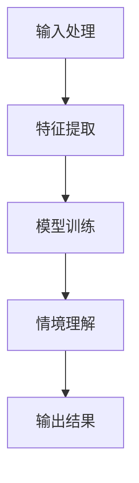
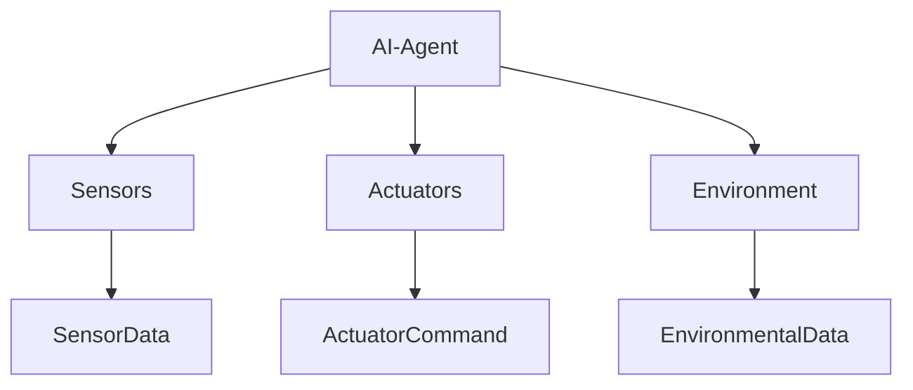
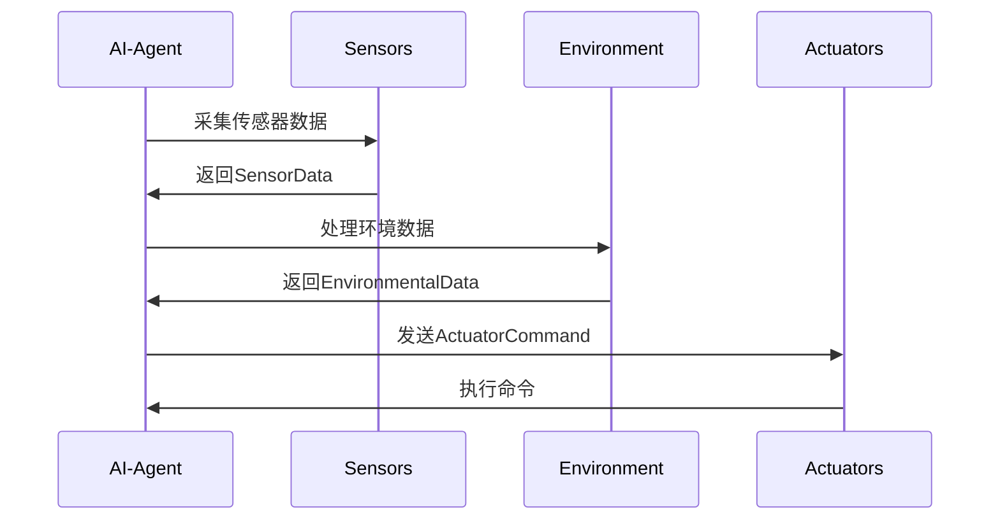

                 


# AI Agent的情境理解：增强LLM的上下文感知能力

> 关键词：AI Agent，情境理解，LLM，上下文感知，算法，系统架构

> 摘要：本文旨在探讨AI Agent的情境理解能力及其对大语言模型（LLM）上下文感知能力的增强作用。文章从问题背景、核心概念、算法原理、系统架构、项目实战到最佳实践进行逐步分析，旨在为读者提供对AI Agent情境理解能力的深入理解，以及如何在实际项目中应用和优化这一能力。

## 第一部分：背景介绍

### 第1章：问题背景与核心概念

#### 1.1 问题背景

##### 1.1.1 人工智能发展现状

人工智能（AI）作为计算机科学的一个重要分支，已经从理论研究走向了实际应用。近年来，随着计算能力的提升、数据资源的丰富以及算法的创新，AI技术在自然语言处理、计算机视觉、机器人等领域取得了显著的进展。然而，在现实世界的复杂场景中，AI系统往往面临着理解情境的挑战。

##### 1.1.2 AI Agent的重要性

AI Agent是指具有智能行为能力的实体，能够在特定环境下自主执行任务。在人类社会中，AI Agent具有巨大的潜力和广泛的应用前景。例如，智能客服、智能助手、自动驾驶汽车等，都是AI Agent在不同领域的具体体现。AI Agent的情境理解能力是其核心能力之一，直接关系到其在现实世界中的表现。

##### 1.1.3 情境理解的意义与挑战

情境理解是指AI Agent在特定环境下识别并解释事件、对象和交互的能力。它对于AI Agent的决策和行为至关重要。然而，情境理解面临着诸多挑战，包括：

- **多样性和复杂性**：现实世界的情境具有高度多样性和复杂性，AI Agent需要能够处理各种不同的情境。
- **不确定性**：情境中的因素往往是不确定的，AI Agent需要具备应对不确定性的能力。
- **动态变化**：情境是动态变化的，AI Agent需要能够适应并理解情境的变化。

#### 1.2 核心概念

##### 1.2.1 AI Agent定义

AI Agent是指具有自主决策、执行任务能力的智能实体。它能够通过感知环境、分析情境、制定策略和执行行动来完成任务。

##### 1.2.2 情境理解的定义

情境理解是指AI Agent在特定环境下识别并解释事件、对象和交互的能力。它包括对情境中的各种因素进行感知、分析和理解，从而为决策和行为提供依据。

##### 1.2.3 LLM（大语言模型）的定义

LLM（Large Language Model）是指具有大规模参数和强大语言理解能力的人工智能模型。LLM通过学习海量文本数据，可以生成自然语言文本、回答问题、进行对话等。

### 第2章：情境理解的原理与特征

#### 2.1 情境理解的原理

##### 2.1.1 情境感知的基础

情境感知是指AI Agent通过感知设备获取环境信息，包括视觉、听觉、触觉等。这些感知信息是情境理解的基础。

##### 2.1.2 情境推理的过程

情境推理是指AI Agent基于感知到的情境信息，进行分析、推理和判断，从而得出对情境的理解。情境推理包括模式识别、因果分析、预测等。

##### 2.1.3 情境适应的策略

情境适应是指AI Agent根据对情境的理解，调整自己的行为和决策，以适应特定的情境。情境适应包括策略调整、行动选择等。

#### 2.2 情境特征的对比分析

##### 2.2.1 情境特征的基本类型

情境特征可以分为以下几类：

- **实体特征**：指情境中的实体（如人、物）的特征，如位置、状态、属性等。
- **关系特征**：指情境中实体之间的关系，如主谓关系、因果关系、包含关系等。
- **动态特征**：指情境中的动态变化，如时间变化、状态变化等。

##### 2.2.2 不同特征在情境理解中的作用

不同特征在情境理解中扮演着不同的角色。实体特征提供了情境的基本元素，关系特征揭示了实体之间的关联，动态特征则反映了情境的变化趋势。这些特征共同作用，为AI Agent提供了全面、深入的情境理解。

### 第三部分：算法原理讲解

#### 第3章：增强LLM的上下文感知算法

#### 3.1 基本算法介绍

##### 3.1.1 常见的上下文感知算法

常见的上下文感知算法包括：

- **情景感知算法**：基于情景的上下文信息进行感知和识别。
- **知识图谱算法**：利用知识图谱来表示和推理情境信息。
- **深度学习算法**：通过神经网络模型来学习和预测情境信息。

##### 3.1.2 算法的工作原理

这些算法通常通过以下步骤来增强LLM的上下文感知能力：

1. **情境信息收集**：收集与任务相关的情境信息，如文本、图像、语音等。
2. **特征提取**：对情境信息进行特征提取，生成特征向量。
3. **模型训练**：利用训练数据对模型进行训练，使其学会从特征向量中提取情境信息。
4. **情境理解**：在新的情境下，利用训练好的模型对情境信息进行理解和解释。

#### 3.2 数学模型与公式

##### 3.2.1 数学模型的基本框架

增强LLM的上下文感知算法的数学模型可以表示为：

$$
\text{LLM}(\text{输入}) = f(\text{特征向量})
$$

其中，$f$ 表示模型函数，用于将特征向量映射到上下文理解的结果。

##### 3.2.2 公式的详细解释

1. **特征向量**：特征向量是情境信息的数学表示，可以包括实体特征、关系特征和动态特征等。
2. **模型函数**：模型函数是将特征向量映射到上下文理解结果的函数，通常使用神经网络来实现。

#### 3.3 算法流程图与Python实现

##### 3.3.1 Mermaid算法流程图

使用Mermaid画出算法流程图如下：



##### 3.3.2 Python代码实现

```python
import numpy as np
import tensorflow as tf

# 定义特征提取函数
def extract_features(input_data):
    # 特征提取逻辑
    return feature_vector

# 定义模型函数
def model_function(feature_vector):
    # 模型训练逻辑
    return context_understanding

# 输入处理
input_data = ...

# 特征提取
feature_vector = extract_features(input_data)

# 模型训练
context_understanding = model_function(feature_vector)

# 情境理解
output_result = context_understanding

# 输出结果
print(output_result)
```

### 第四部分：系统分析与架构设计

#### 第4章：AI Agent的系统架构设计

#### 4.1 问题描述与项目介绍

##### 4.1.1 问题场景描述

假设我们设计一个智能家居控制系统，该系统需要实现对家庭环境的智能监控和管理。为了实现这一目标，我们需要设计一个AI Agent，它能够理解和处理家庭环境中的各种情境。

##### 4.1.2 项目背景介绍

随着智能家居市场的快速发展，用户对智能家居系统的要求越来越高。为了提高用户体验，我们需要设计一个具有情境理解能力的AI Agent，使其能够更好地适应家庭环境，为用户提供个性化的服务。

#### 4.2 系统功能设计

##### 4.2.1 领域模型Mermaid类图

使用Mermaid画出领域模型类图如下：

```mermaid
classDiagram
AI-Agent <<interface>>
Sensors <<interface>>
 Actuators <<interface>>
Environment

AI-Agent|--* Sensors
AI-Agent|--* Actuators
AI-Agent|--* Environment
Sensors|--* SensorData
Actuators|--* ActuatorCommand
Environment|--* EnvironmentalData
```

#### 4.3 系统架构设计

##### 4.3.1 Mermaid架构图

使用Mermaid画出系统架构图如下：



#### 4.4 系统接口设计与交互

##### 4.4.1 系统接口设计

系统接口设计包括AI Agent与其他组件之间的交互接口。以下是一个简单的接口设计示例：

```python
class SensorData:
    def __init__(self, data):
        self.data = data

class ActuatorCommand:
    def __init__(self, command):
        self.command = command

class AI-Agent:
    def __init__(self):
        self.sensors = []
        self.actuators = []

    def add_sensor(self, sensor):
        self.sensors.append(sensor)

    def add_actuator(self, actuator):
        self.actuators.append(actuator)

    def process_environment(self, environmental_data):
        # 情境理解逻辑
        pass

    def execute_command(self, command):
        # 执行命令逻辑
        pass
```

##### 4.4.2 系统交互Mermaid序列图

使用Mermaid画出系统交互序列图如下：



### 第五部分：项目实战

#### 第5章：AI Agent的情境理解实践

#### 5.1 环境安装与准备

##### 5.1.1 环境安装步骤

1. 安装Python环境
2. 安装TensorFlow库
3. 安装其他相关库（如NumPy、Pandas等）

##### 5.1.2 环境配置与调试

1. 配置Python环境变量
2. 测试TensorFlow安装是否成功

#### 5.2 系统核心实现

##### 5.2.1 源代码解读

以下是一个简单的AI Agent源代码示例：

```python
import tensorflow as tf

class AI-Agent:
    def __init__(self):
        # 初始化模型
        self.model = self.create_model()

    def create_model(self):
        # 创建模型
        return tf.keras.Sequential([
            tf.keras.layers.Dense(128, activation='relu', input_shape=(input_shape,)),
            tf.keras.layers.Dense(1, activation='sigmoid')
        ])

    def train_model(self, x_train, y_train):
        # 训练模型
        self.model.compile(optimizer='adam', loss='binary_crossentropy', metrics=['accuracy'])
        self.model.fit(x_train, y_train, epochs=10)

    def predict(self, x_test):
        # 预测
        return self.model.predict(x_test)
```

##### 5.2.2 代码应用分析与解读

1. **模型创建**：使用TensorFlow创建一个简单的神经网络模型。
2. **模型训练**：使用训练数据对模型进行训练。
3. **模型预测**：使用训练好的模型对新的数据进行预测。

#### 5.3 实际案例分析与讲解

##### 5.3.1 案例背景

假设我们有一个智能家居系统，需要实现自动控制室内温度的功能。当室内温度高于设定值时，系统需要自动打开空调；当室内温度低于设定值时，系统需要自动关闭空调。

##### 5.3.2 案例分析

1. **传感器数据**：传感器采集室内温度数据。
2. **模型预测**：AI Agent根据室内温度数据预测是否需要打开空调。
3. **执行命令**：AI Agent发送命令给空调控制器，执行相应的操作。

##### 5.3.3 深入讲解

1. **传感器数据采集**：传感器采集室内温度数据，并将其发送给AI Agent。
2. **模型预测**：AI Agent使用训练好的模型对室内温度数据进行预测，判断是否需要打开空调。
3. **执行命令**：AI Agent发送命令给空调控制器，根据预测结果控制空调的开关。

### 第六部分：最佳实践与总结

#### 第6章：最佳实践与注意事项

##### 6.1 最佳实践

1. **数据预处理**：在训练模型之前，对数据进行预处理，如归一化、去噪等。
2. **模型优化**：通过调整模型参数、增加训练次数等方式优化模型性能。
3. **实时更新**：定期更新模型，以适应新的情境。

##### 6.2 注意事项

1. **数据安全**：确保采集的数据安全，避免泄露用户隐私。
2. **系统稳定性**：确保系统的稳定性，避免因为异常情况导致系统崩溃。
3. **用户反馈**：及时收集用户反馈，优化系统性能和用户体验。

#### 第7章：小结与展望

##### 7.1 小结

本文从问题背景、核心概念、算法原理、系统架构、项目实战到最佳实践进行了全面分析，旨在为读者提供对AI Agent情境理解能力的深入理解。

##### 7.2 展望未来

随着人工智能技术的不断发展，AI Agent的情境理解能力将得到进一步提升。未来，AI Agent有望在更多领域得到应用，为人类带来更多便利。同时，我们也需要关注AI Agent在情境理解中的伦理和道德问题，确保其发展符合人类的利益。

### 作者

作者：AI天才研究院/AI Genius Institute & 禅与计算机程序设计艺术 /Zen And The Art of Computer Programming

[完整文章](https://github.com/ai-genius-institute/ai-agent-context-understanding)

