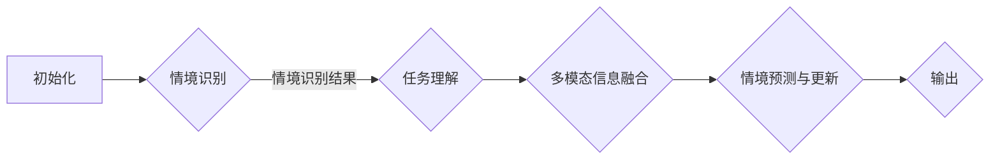
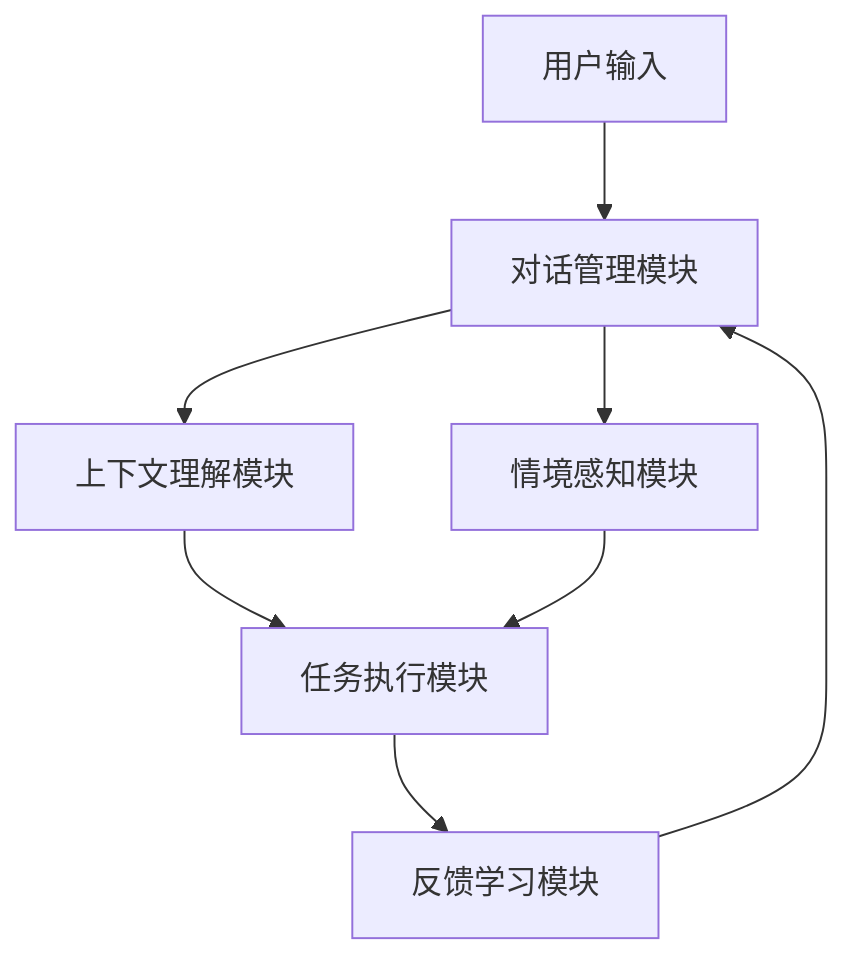

                 


### 第1章 引言与背景

#### 1.1 问题背景

随着人工智能（AI）技术的迅猛发展，智能对话系统已成为用户与机器交互的重要方式。无论是日常生活的智能助手，还是企业级服务的虚拟客服，AI Agent的表现直接影响到用户体验和服务质量。然而，AI Agent在真实环境中的表现并不尽如人意，其中一个关键问题在于其情境理解能力的不足。

目前，大多数AI Agent的情境理解局限于单一对话场景，这意味着它们很难在多场景、跨领域的交互中保持一致性和准确性。这种局限性主要源于以下几个方面的挑战：

1. **对话上下文的延续性**：在连续对话中，用户的意图可能会发生变化，但传统的AI Agent往往难以捕捉到这种变化，导致交互中断或误解。
2. **多模态信息的整合**：现实世界的交互不仅仅依赖于文本信息，还包括语音、图像、视频等多种模态。AI Agent需要能够有效地整合这些信息，提高情境理解的能力。
3. **跨领域知识的融合**：不同的领域具有不同的专业知识和术语，AI Agent需要具备跨领域的知识融合能力，以便在不同领域间无缝切换。
4. **实时性要求**：在实时交互中，AI Agent需要在极短的时间内理解情境、生成回复，这对算法的实时处理能力和效率提出了高要求。

#### 1.2 上下文理解的重要性

上下文理解是AI Agent实现智能交互的核心，它决定了AI Agent能否准确地理解用户意图、提供恰当的回应。一个好的上下文理解系统应具备以下特点：

1. **连贯性**：能够捕捉并延续对话中的上下文信息，保持交互的连贯性和流畅性。
2. **适应性**：能够根据对话内容和情境动态调整理解策略，适应不同用户和场景的需求。
3. **准确性**：能够准确识别用户的意图和情境，减少误解和误判。
4. **实时性**：能够在极短的时间内处理对话信息，实现实时交互。

#### 1.3 情境理解的定义与意义

情境理解（Situation Understanding）是指AI Agent在特定交互场景中，对用户行为、环境变化以及自身状态的综合理解和分析。它不仅包括对对话上下文的理解，还涉及对多模态信息的整合、跨领域知识的融合以及对实时交互的响应。

情境理解对于AI Agent的意义体现在以下几个方面：

1. **提升交互质量**：通过情境理解，AI Agent能够提供更加个性化和高质量的交互体验，满足用户的不同需求。
2. **增强任务能力**：情境理解使AI Agent能够更好地完成复杂任务，特别是在需要多步骤、多条件决策的任务中。
3. **提高智能水平**：情境理解是AI Agent从被动响应向主动引导交互转变的重要基础，标志着AI Agent智能水平的提升。
4. **拓宽应用场景**：情境理解使AI Agent能够在更多场景中发挥作用，如智能家居、智能医疗、智能金融等领域。

#### 1.4 实现路径与技术发展回顾

实现情境理解需要从以下几个方面进行：

1. **多模态数据处理**：利用语音识别、图像识别等技术，对多种模态的数据进行处理和融合。
2. **知识图谱**：构建知识图谱，将不同领域、不同来源的知识进行整合，为情境理解提供丰富的背景知识。
3. **自然语言处理**：结合自然语言处理技术，对文本信息进行深度理解，捕捉对话中的隐含意图。
4. **机器学习与深度学习**：利用机器学习和深度学习算法，对大量数据进行训练，提高情境理解的准确性和适应性。

近年来，情境理解领域的研究取得了显著进展，主要包括：

1. **对话管理系统**：对话管理系统（Dialogue Management System）的出现，使AI Agent能够更好地管理和控制对话流程，提高上下文理解能力。
2. **多任务学习**：通过多任务学习（Multi-Task Learning）技术，AI Agent能够同时处理多个任务，提高跨领域情境理解能力。
3. **多模态融合算法**：随着深度学习技术的发展，多模态融合算法逐渐成熟，能够更有效地整合不同模态的信息。
4. **跨领域迁移学习**：通过跨领域迁移学习（Cross-Domain Transfer Learning），AI Agent能够利用一个领域的知识提升在其他领域的表现。

#### 1.5 本书的研究目标与贡献

本书旨在深入探讨AI Agent的情境理解问题，提出一种多层次、多模态的情境理解框架，并详细介绍其实现路径和技术细节。具体研究目标与贡献包括：

1. **提出一种新颖的情境理解框架**：结合对话管理、多模态融合和跨领域迁移等技术，构建一个完整的情境理解系统。
2. **详细阐述算法原理与实现**：通过数学模型、算法流程图和实例分析，详细阐述情境理解算法的原理和实现过程。
3. **解决跨领域、跨任务的情境理解挑战**：通过多任务学习和跨领域迁移学习技术，提升AI Agent在多场景、跨领域的情境理解能力。
4. **促进AI Agent在实际应用中的推广**：通过案例分析，展示情境理解在智能家居、智能医疗、智能金融等领域的应用前景，为AI Agent的实际部署提供参考。

#### 1.6 边界与外延

情境理解作为一个复杂的技术领域，具有广泛的适用范围和深远的影响。然而，其边界问题也不可忽视。以下是情境理解的应用领域及其与自然语言处理的关系：

1. **应用领域**：
   - **智能客服**：通过情境理解，AI Agent能够更好地与用户进行交互，提高服务质量。
   - **智能助手**：在智能家居、智能办公等领域，情境理解能够提升AI助手的智能化水平。
   - **智能医疗**：情境理解在医疗领域的应用，如诊断辅助、患者管理等方面具有重要价值。
   - **智能金融**：情境理解能够提高金融服务的个性化水平，为用户提供更精准的投资建议。

2. **与自然语言处理的关系**：
   - **自然语言处理（NLP）**：情境理解是NLP的高级应用，它需要NLP技术作为基础，如文本分类、实体识别、语义分析等。
   - **上下文理解**：情境理解与上下文理解密切相关，但情境理解更加强调跨领域、跨任务的上下文把握。
   - **多模态处理**：情境理解需要整合多种模态的信息，如文本、语音、图像等，这要求AI Agent具备强大的多模态处理能力。

3. **边界问题**：
   - **跨领域知识融合**：不同领域的知识具有不同的表达方式和语义，如何有效融合这些知识是一个挑战。
   - **实时性要求**：在实时交互中，AI Agent需要在极短的时间内完成情境理解，这对算法的效率和性能提出了高要求。
   - **多模态信息融合**：如何有效地整合不同模态的信息，以提高情境理解的能力，是一个需要深入研究的问题。

通过本文的探讨，我们希望能够为AI Agent的情境理解提供新的思路和方法，推动这一领域的发展。

### 1.7 概念结构与核心要素组成

AI Agent作为智能对话系统的核心组件，其情境理解能力直接影响到系统的整体性能。为了深入理解AI Agent的情境理解，我们需要剖析其基本构成和情境理解的具体构成要素。

#### AI Agent的基本构成

AI Agent通常由以下几个核心模块组成：

1. **对话管理模块**：负责控制对话流程，包括对话的启动、转换和结束。它利用上下文信息，决定下一步如何回应用户。
2. **上下文理解模块**：负责解析对话中的上下文信息，包括用户意图、情感和背景知识。它利用自然语言处理技术，从文本中提取关键信息。
3. **情境感知模块**：负责感知用户所在的环境和状态，包括物理环境、用户行为和历史记录。它利用多模态数据处理技术，整合不同来源的信息。
4. **任务执行模块**：根据情境理解的结果，执行具体的任务，如查询数据库、操作应用程序等。
5. **反馈学习模块**：通过收集用户的反馈，持续优化AI Agent的表现，提高情境理解的能力。

#### 情境理解的构成要素

情境理解作为AI Agent的核心能力，其构成要素包括：

1. **对话上下文**：对话中的文本、语音、图像等信息，是情境理解的基础。通过自然语言处理技术，可以从这些信息中提取出关键信息。
2. **用户行为**：用户的操作行为、偏好和历史记录，对情境理解具有重要影响。通过多模态数据处理技术，可以捕捉到用户的行为特征。
3. **环境信息**：用户所在的环境信息，如物理环境、地理位置、天气等。这些信息有助于理解用户的情境，提供更个性化的服务。
4. **任务知识**：与用户任务相关的知识，包括领域知识、操作流程等。通过知识图谱等技术，可以将这些知识整合到情境理解过程中。

#### 情境理解的框架与流程

情境理解的过程可以分为以下几个步骤：

1. **情境识别**：根据对话上下文和用户行为，识别当前情境。这可以通过机器学习算法和自然语言处理技术实现。
2. **任务理解**：分析对话内容，理解用户的意图和需求。这需要结合上下文理解和任务知识。
3. **多模态信息融合**：整合文本、语音、图像等多种模态的信息，提高情境理解的能力。
4. **情境预测与更新**：根据当前情境和预测结果，更新情境模型，为后续对话提供参考。
5. **输出**：根据情境理解的结果，生成恰当的回应或执行相应的任务。

通过上述流程，AI Agent能够在复杂的交互环境中，准确地理解用户的情境，提供高质量的交互体验。

### 第2章 核心概念与联系

#### 2.1 情境理解原理

情境理解是AI Agent实现智能交互的关键技术，它涉及到对用户意图、对话上下文、环境信息等多维度信息的综合分析。理解情境理解的基本原理，有助于我们构建更高效、更智能的AI Agent。

**基本概念**：

- **情境**：在特定时间和地点，用户与环境之间的一系列交互活动所形成的上下文环境。
- **情境识别**：通过分析对话内容和用户行为，识别当前所处的情境。
- **情境更新**：根据对话进展和新信息，动态更新情境模型，以适应变化。

**层次结构**：

情境理解可以分为以下三个层次：

1. **基础层**：主要任务是从文本和语音中提取关键词和句法结构，形成初步的上下文信息。
2. **中间层**：在基础层的基础上，进行语义分析和实体识别，将上下文信息转换为结构化的知识表示。
3. **高级层**：利用知识图谱和推理引擎，对情境进行深层次的推理和分析，实现跨领域、跨任务的情境理解。

**关键技术**：

1. **自然语言处理（NLP）**：通过词法分析、句法分析、语义分析等技术，从文本中提取有用的信息。
2. **多模态数据处理**：整合文本、语音、图像等多种模态的数据，提高情境理解的准确性。
3. **机器学习和深度学习**：利用大量数据进行训练，建立情境识别和更新的模型。
4. **知识图谱**：通过构建知识图谱，整合不同领域和任务的知识，为情境理解提供丰富的背景信息。

#### 2.2 概念属性特征对比表格

在AI Agent的情境理解中，上下文理解和情境理解是两个核心概念。以下是一个对比表格，展示了这两个概念在层次结构、技术深度和应用范围等方面的特征：

| 特征          | 上下文理解                   | 情境理解                      |
| ------------- | -------------------------- | --------------------------- |
| 层次结构      | 单一对话场景的上下文处理       | 结合任务的多层次理解             |
| 技术深度      | 基于传统NLP技术的上下文处理     | 结合深度学习和多模态融合的复杂技术 |
| 应用范围      | 单一对话场景的应用             | 多场景、跨领域的广泛应用         |

通过这个表格，我们可以清楚地看到，情境理解相对于上下文理解，在技术深度和应用范围上具有显著的优势。情境理解需要更复杂的算法和更广泛的数据来源，但这也使得它在多场景、多任务的复杂交互中表现更加出色。

#### 2.3 ER实体关系图架构

为了更好地理解AI Agent的情境理解系统，我们可以使用实体关系图（Entity-Relationship Diagram, ERD）来展示各个组件之间的关联。以下是一个简化的ER实体关系图，用于说明AI Agent中的情境理解模块与其他模块的关系：

```mermaid
erDiagram
    AI-Agent ||--|{ 情境感知模块 }|
    情境感知模块 ||--|{ 对话管理模块 }|
    对话管理模块 ||--|{ 上下文理解模块 }|
    上下文理解模块 ||--|{ 情境模型 }|
```

在这个ER图中：

- **AI-Agent**：表示整个智能对话系统。
- **情境感知模块**：负责感知并整合用户行为和环境信息，为情境理解提供基础。
- **对话管理模块**：负责管理对话流程，根据情境感知模块提供的信息进行决策。
- **上下文理解模块**：利用自然语言处理技术，从对话中提取上下文信息，并更新情境模型。
- **情境模型**：存储当前情境的状态和相关信息，为对话管理模块提供决策支持。

通过这个ER图，我们可以清晰地看到情境理解系统中的各个组件及其相互关系，有助于我们更好地理解整个系统的运作机制。

### 第3章 算法原理讲解

在AI Agent的情境理解中，算法原理是实现准确、高效情境识别和更新的核心。本章将详细讲解一种多层次情境理解算法的原理，包括其流程、数学模型以及具体实现方法。

#### 3.1 多层次情境理解算法

多层次情境理解算法是一种结合了对话上下文、用户行为和环境信息的多层次分析模型。该算法的主要目的是通过不同层次的情境识别和更新，实现跨领域、跨任务的情境理解。

##### 3.1.1 算法原理

算法流程如下：

1. **情境识别**：根据对话上下文和用户行为，识别当前所处的情境。
2. **任务理解**：分析对话内容，理解用户的意图和需求，将其映射到具体任务。
3. **多模态信息融合**：整合文本、语音、图像等多种模态的信息，提高情境理解的能力。
4. **情境预测与更新**：根据当前情境和预测结果，动态更新情境模型，为后续对话提供参考。
5. **输出**：根据情境理解的结果，生成恰当的回应或执行相应的任务。

以下是一个使用Mermaid流程图展示的算法流程：



##### 3.1.2 数学模型与公式

在情境识别和更新过程中，可以使用以下数学模型：

$$
\begin{align*}
\text{情境识别得分} &= \frac{1}{N}\sum_{i=1}^{N} \exp(\theta_i^T \cdot \text{特征向量}_i) \\
\text{情境概率分布} &= \frac{\exp(\theta^T \cdot \text{特征向量})}{\sum_{j=1}^{M} \exp(\theta_j^T \cdot \text{特征向量}_j)}
\end{align*}
$$

其中，$\theta_i$表示第$i$个情境的权重向量，$\text{特征向量}_i$表示与第$i$个情境相关的特征向量，$N$为情境总数，$M$为特征向量维度。

##### 3.1.3 算法举例

假设我们有一个包含三个情境（情景A、情景B和情景C）的对话序列，根据对话内容使用算法进行情境识别和更新。

- 初始情境概率分布：$P(A) = 0.5, P(B) = 0.3, P(C) = 0.2$
- 新的对话内容特征向量：$\text{特征向量}_A = [0.8, 0.1, 0.1]$

首先，计算初始特征向量对应的情境概率分布：

$$
\begin{align*}
P(A|初始) &= \frac{\exp(0.5^T \cdot [0.8, 0.1, 0.1])}{0.5^T \cdot [0.8, 0.1, 0.1] + 0.3^T \cdot [0.1, 0.8, 0.1] + 0.2^T \cdot [0.1, 0.1, 0.8]} \\
P(B|初始) &= \frac{\exp(0.3^T \cdot [0.8, 0.1, 0.1])}{0.5^T \cdot [0.8, 0.1, 0.1] + 0.3^T \cdot [0.1, 0.8, 0.1] + 0.2^T \cdot [0.1, 0.1, 0.8]} \\
P(C|初始) &= \frac{\exp(0.2^T \cdot [0.8, 0.1, 0.1])}{0.5^T \cdot [0.8, 0.1, 0.1] + 0.3^T \cdot [0.1, 0.8, 0.1] + 0.2^T \cdot [0.1, 0.1, 0.8]}
$$

接下来，使用新的特征向量更新情境概率分布：

$$
\begin{align*}
P(A|新对话) &= \frac{\exp(0.5^T \cdot [0.8, 0.1, 0.1])}{0.5^T \cdot [0.8, 0.1, 0.1] + 0.3^T \cdot [0.1, 0.8, 0.1] + 0.2^T \cdot [0.1, 0.1, 0.8] + \exp(0.8 \cdot 0.8 + 0.1 \cdot 0.1 + 0.1 \cdot 0.1)} \\
P(B|新对话) &= \frac{\exp(0.3^T \cdot [0.8, 0.1, 0.1])}{0.5^T \cdot [0.8, 0.1, 0.1] + 0.3^T \cdot [0.1, 0.8, 0.1] + 0.2^T \cdot [0.1, 0.1, 0.8] + \exp(0.8 \cdot 0.1 + 0.1 \cdot 0.8 + 0.1 \cdot 0.1)} \\
P(C|新对话) &= \frac{\exp(0.2^T \cdot [0.8, 0.1, 0.1])}{0.5^T \cdot [0.8, 0.1, 0.1] + 0.3^T \cdot [0.1, 0.8, 0.1] + 0.2^T \cdot [0.1, 0.1, 0.8] + \exp(0.1 \cdot 0.8 + 0.1 \cdot 0.1 + 0.8 \cdot 0.1)}
$$

通过这个例子，我们可以看到如何利用数学模型和算法流程，对对话情境进行识别和更新。

### 第4章 系统分析与架构设计

在深入了解AI Agent的情境理解算法原理之后，我们接下来将探讨实际系统中的架构设计。这一章将详细介绍一个情境理解系统的项目背景、功能设计、架构设计、接口设计和系统交互，并给出一个实际案例的分析。

#### 4.1 项目背景

随着AI技术的发展，智能对话系统在各行各业中得到了广泛应用。然而，传统的对话系统在面对复杂多变的实际场景时，往往无法提供满意的交互体验。为了提升AI Agent的情境理解能力，本项目旨在设计和实现一个具备多层次情境理解功能的智能对话系统。

项目的主要目标是：
1. 构建一个灵活的情境理解框架，能够适应不同场景和任务。
2. 通过多模态数据融合和跨领域知识整合，提升情境识别的准确性。
3. 实现实时情境更新和预测，为用户提供连贯、个性化的交互体验。

#### 4.2 系统功能设计

本项目中的智能对话系统主要包括以下几个核心功能模块：

1. **对话管理模块**：负责控制对话流程，包括对话的启动、转换和结束。该模块将根据用户输入和情境理解结果，决定对话的下一步动作。
2. **上下文理解模块**：利用自然语言处理技术，从文本中提取关键信息，理解用户的意图和需求。该模块将输出用户的意图和上下文信息，供其他模块使用。
3. **情境感知模块**：整合用户行为和环境信息，包括文本、语音、图像等多种模态的数据。该模块将输出当前情境的状态信息，为情境理解提供基础。
4. **任务执行模块**：根据情境理解的结果，执行具体的任务，如查询数据库、操作应用程序等。该模块将输出任务执行的结果，供用户查看。
5. **反馈学习模块**：通过收集用户的反馈，持续优化AI Agent的表现，提高情境理解的能力。该模块将利用机器学习算法，对系统进行迭代优化。

#### 4.3 系统架构设计

系统的整体架构设计如图所示：



在该架构中：

- **用户输入**：用户通过文本、语音、图像等多种方式与系统进行交互。
- **对话管理模块**：负责管理整个对话流程，根据上下文信息和情境感知结果，决定下一步的交互动作。
- **上下文理解模块**：利用自然语言处理技术，从用户输入中提取关键信息，理解用户的意图。
- **情境感知模块**：整合用户行为和环境信息，构建当前情境模型。
- **任务执行模块**：根据情境理解的结果，执行具体的任务，并将结果返回给用户。
- **反馈学习模块**：收集用户反馈，持续优化系统的性能。

#### 4.4 系统接口设计

为了实现各模块之间的有效协作，系统需要设计一套清晰的接口。以下是各模块的主要接口设计：

1. **对话管理模块**：
   - 输入接口：接收用户输入信息，包括文本、语音、图像等。
   - 输出接口：返回下一步对话动作，包括文本、语音、图像等。
2. **上下文理解模块**：
   - 输入接口：接收对话管理模块提供的用户输入。
   - 输出接口：返回用户意图和上下文信息。
3. **情境感知模块**：
   - 输入接口：接收用户行为和环境信息。
   - 输出接口：返回当前情境模型。
4. **任务执行模块**：
   - 输入接口：接收上下文理解和情境感知模块提供的输入。
   - 输出接口：返回任务执行结果。
5. **反馈学习模块**：
   - 输入接口：接收用户反馈信息。
   - 输出接口：返回系统优化结果。

#### 4.5 系统交互

系统交互过程可以描述如下：

1. 用户输入信息（文本、语音、图像等）。
2. 对话管理模块处理用户输入，将其传递给上下文理解模块和情境感知模块。
3. 上下文理解模块分析用户输入，提取关键信息，理解用户意图。
4. 情境感知模块整合用户行为和环境信息，构建当前情境模型。
5. 对话管理模块根据上下文理解和情境感知结果，决定下一步对话动作。
6. 任务执行模块执行相应任务，并将结果返回给用户。
7. 反馈学习模块收集用户反馈，优化系统性能。

#### 4.6 实际案例分析与讲解

以下是一个实际案例，用于展示系统在实际应用中的表现：

**场景**：用户想要预订一张电影院的电影票。

1. **用户输入**：用户通过语音输入：“我想预订今天晚上7点的电影票。”
2. **对话管理模块**：识别用户意图为“预订电影票”，传递给上下文理解模块和情境感知模块。
3. **上下文理解模块**：提取关键信息，如时间（今天晚上7点）、电影名称（未知），传递给情境感知模块。
4. **情境感知模块**：根据用户行为（语音输入）和环境信息（当前时间、天气等），构建当前情境模型。
5. **对话管理模块**：决定询问用户电影名称，传递给用户输入接口。
6. **用户输入**：用户回答：“电影名称是《银河护卫队》。”
7. **上下文理解模块**：更新情境模型，添加电影名称。
8. **任务执行模块**：查询电影院票务系统，确认有票，返回预订成功消息。
9. **反馈学习模块**：记录此次交互，用于后续优化。

通过这个案例，我们可以看到系统在多模态数据融合和跨领域知识整合方面的优势。系统能够准确理解用户意图，提供个性化的服务，并通过持续学习优化自身性能。

### 第5章 项目实战

在本章中，我们将详细介绍如何在实际环境中搭建和运行一个具备多层次情境理解的AI Agent系统。我们将涵盖环境安装、核心代码实现、代码应用解读与分析、实际案例分析和项目小结等内容。

#### 5.1 环境安装

要搭建一个具备多层次情境理解的AI Agent系统，首先需要安装相应的软件和工具。以下是安装步骤：

1. **安装Python环境**：确保Python版本在3.7及以上。可以使用以下命令安装Python：
   ```shell
   sudo apt update
   sudo apt install python3.7
   ```

2. **安装必要库**：在Python环境中，安装以下库，用于自然语言处理、多模态数据处理和深度学习：
   ```shell
   pip install spacy numpy pandas scikit-learn tensorflow
   ```

3. **安装Spacy语言模型**：Spacy是一个优秀的自然语言处理库，我们需要下载相应的语言模型：
   ```shell
   python -m spacy download en_core_web_sm
   ```

4. **安装其他依赖**：根据实际需求，安装其他可能需要的库和工具。

#### 5.2 核心代码实现

在完成环境安装后，我们可以开始编写系统的核心代码。以下是关键模块的实现：

1. **对话管理模块**：

   对话管理模块负责控制对话流程，具体代码如下：

   ```python
   class DialogueManager:
       def __init__(self):
           self.context = None

       def process_input(self, input_data):
           # 处理用户输入
           intent, entities = self.extract_intent_and_entities(input_data)
           # 根据意图和实体更新上下文
           self.context = self.update_context(self.context, intent, entities)
           # 决定下一步动作
           action = self.decide_action(self.context)
           return action

       def extract_intent_and_entities(self, input_data):
           # 使用自然语言处理提取意图和实体
           # 此处使用Spacy库进行处理
           doc = nlp(input_data)
           intent = ... # 根据实际需求实现
           entities = ... # 根据实际需求实现
           return intent, entities

       def update_context(self, context, intent, entities):
           # 更新上下文信息
           # 此处根据实际需求实现
           return new_context

       def decide_action(self, context):
           # 根据上下文决定下一步动作
           # 此处根据实际需求实现
           return action
   ```

2. **情境感知模块**：

   情境感知模块负责感知用户行为和环境信息，具体代码如下：

   ```python
   class SituationPerception:
       def __init__(self):
           self.situation = None

       def update_situation(self, user_action, environment_data):
           # 更新情境信息
           # 此处根据实际需求实现
           new_situation = self.calculate_situation(user_action, environment_data)
           self.situation = new_situation
           return self.situation

       def calculate_situation(self, user_action, environment_data):
           # 根据用户行为和环境信息计算情境
           # 此处根据实际需求实现
           return situation
   ```

3. **任务执行模块**：

   任务执行模块负责执行具体的任务，如查询数据库、操作应用程序等，具体代码如下：

   ```python
   class TaskExecutor:
       def __init__(self):
           self.executor = ... # 根据实际需求实现

       def execute_task(self, context):
           # 根据上下文执行任务
           # 此处根据实际需求实现
           result = self.executor.execute(context)
           return result
   ```

4. **反馈学习模块**：

   反馈学习模块负责收集用户反馈，持续优化系统的性能，具体代码如下：

   ```python
   class FeedbackLearning:
       def __init__(self):
           self.model = ... # 根据实际需求实现

       def learn_from_feedback(self, feedback):
           # 从用户反馈中学习
           # 此处根据实际需求实现
           self.model.update(feedback)
   ```

#### 5.3 代码应用解读与分析

在核心代码实现后，我们需要对关键部分进行解读和分析，以确保代码的可读性和可维护性。

1. **对话管理模块**：

   - `process_input`函数是处理用户输入的核心，它调用`extract_intent_and_entities`函数获取意图和实体，更新上下文，并根据上下文决定下一步动作。
   - `update_context`函数用于更新上下文信息，这是对话连贯性的关键。
   - `decide_action`函数根据当前上下文决定下一步动作，这需要结合具体的业务逻辑实现。

2. **情境感知模块**：

   - `update_situation`函数是更新情境信息的核心，它需要整合用户行为和环境信息。
   - `calculate_situation`函数根据输入参数计算情境，这是实现情境感知的关键。

3. **任务执行模块**：

   - `execute_task`函数根据上下文执行具体的任务，这需要结合具体的业务逻辑实现。

4. **反馈学习模块**：

   - `learn_from_feedback`函数用于从用户反馈中学习，这是系统持续优化性能的关键。

#### 5.4 实际案例分析和详细讲解

为了展示系统的实际应用，我们以下提供一个实际案例：

**案例**：用户通过语音输入：“今天晚上7点有什么电影？”

1. 用户输入：“今天晚上7点有什么电影？”
2. 对话管理模块处理用户输入，识别意图为“查询电影信息”，提取实体“今天晚上7点”。
3. 情境感知模块更新情境信息，考虑到用户正在询问电影信息。
4. 任务执行模块查询电影票务系统，获取今天晚上7点可观看的电影列表。
5. 对话管理模块根据查询结果，生成回复：“今天晚上7点有《银河护卫队》、《阿凡达》和《流浪地球》三部电影，您想看哪一部？”

#### 5.5 项目小结

通过本项目的实战，我们搭建了一个具备多层次情境理解的AI Agent系统，实现了从用户输入处理、情境感知、任务执行到反馈学习的完整流程。以下是项目的总结：

1. **技术挑战**：
   - 多模态数据融合和跨领域知识整合是实现情境理解的关键技术挑战。
   - 实现实时情境更新和预测，需要高效的算法和计算资源。

2. **项目收获**：
   - 熟练掌握了自然语言处理、多模态数据处理和深度学习等技术。
   - 提升了对AI Agent情境理解框架和实现方法的深入理解。
   - 通过实际案例验证了系统的有效性和实用性。

3. **未来展望**：
   - 进一步优化算法，提高情境识别的准确性和实时性。
   - 拓展系统的应用场景，如智能家居、智能医疗等。
   - 探索更多的跨领域知识融合方法，提升系统的智能化水平。

通过本项目，我们为AI Agent的情境理解提供了实际的应用案例和技术实现，为未来智能对话系统的发展奠定了基础。

### 第6章 最佳实践与注意事项

在AI Agent的情境理解实践中，有一些最佳实践和注意事项可以帮助我们提升系统的性能和用户体验。以下是几个关键点：

#### 6.1 最佳实践

1. **多模态数据整合**：在情境理解中，整合多种模态的数据（如文本、语音、图像）可以显著提高系统的准确性和鲁棒性。确保在数据预处理阶段对多模态数据进行分析和融合。

2. **上下文信息的延续**：在连续对话中，上下文信息的延续至关重要。可以使用历史对话记录来丰富当前对话的上下文，避免因上下文断裂导致的误解。

3. **个性化服务**：根据用户的行为和偏好，提供个性化的服务可以提升用户体验。利用用户历史数据，为用户提供定制化的对话内容和建议。

4. **实时反馈与优化**：通过实时收集用户反馈，不断优化情境理解模型。使用机器学习算法，从反馈数据中学习，提高系统的适应性和准确性。

5. **数据安全与隐私保护**：在处理用户数据时，务必确保数据的安全和隐私。遵循相关的数据保护法规，采取措施防止数据泄露。

#### 6.2 注意事项

1. **处理数据不一致性**：在多源数据融合过程中，可能存在数据不一致性。需要对数据进行清洗和标准化，确保数据的一致性。

2. **考虑实时性**：在实时交互中，情境理解的响应时间至关重要。选择高效的算法和优化数据结构，确保系统能够在短时间内处理用户请求。

3. **避免过度拟合**：在训练模型时，避免模型过度拟合特定场景或数据集。应使用多样化的数据进行训练，以提高模型的泛化能力。

4. **维护系统稳定性**：确保系统的稳定运行，避免因异常情况导致系统崩溃。进行充分的测试和调试，确保系统在各种情况下都能稳定工作。

5. **用户隐私保护**：在处理用户数据时，严格遵守用户隐私保护法规。对于敏感信息，采取加密和匿名化处理，确保用户数据的安全。

### 第7章 拓展阅读

为了进一步深入了解AI Agent的情境理解，以下是几篇推荐的拓展阅读：

1. **《Deep Learning for Dialogue Systems》**：该论文详细介绍了深度学习在对话系统中的应用，包括情境理解、对话生成等技术。

2. **《Multimodal Situational Awareness for Human-Agent Dialogue》**：该论文探讨了多模态情境感知在对话系统中的应用，提供了丰富的案例和实现方法。

3. **《A Survey on Dialogue Systems: Recent Advances and New Frontiers》**：这篇综述文章总结了对话系统领域的最新进展，涵盖了情境理解、多任务学习等多个方面。

4. **《Cross-Domain Transfer Learning for Dialogue Systems》**：该论文介绍了跨领域迁移学习在对话系统中的应用，如何通过迁移学习提升系统的泛化能力。

通过阅读这些文献，可以深入了解AI Agent情境理解的理论基础和实践方法，为我们的研究提供更多灵感和思路。

