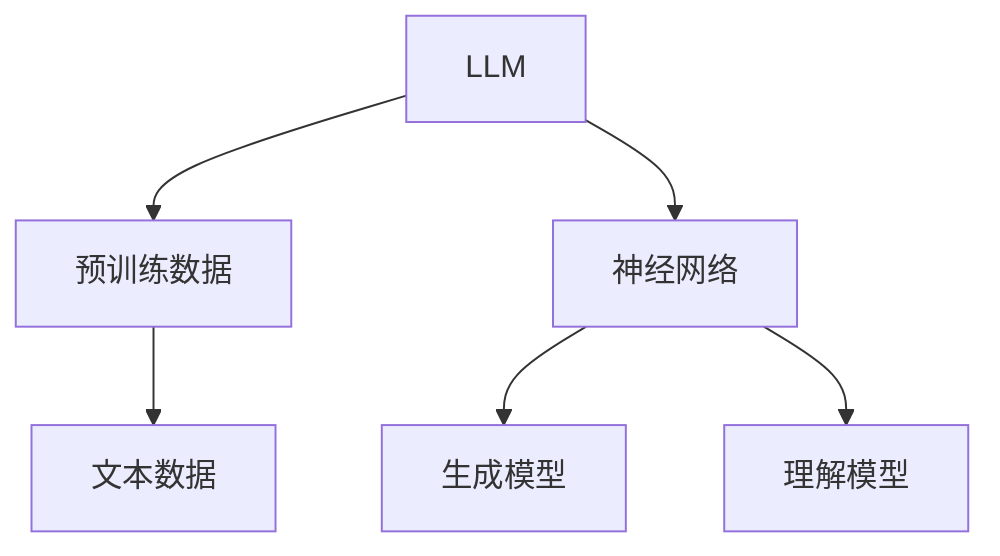
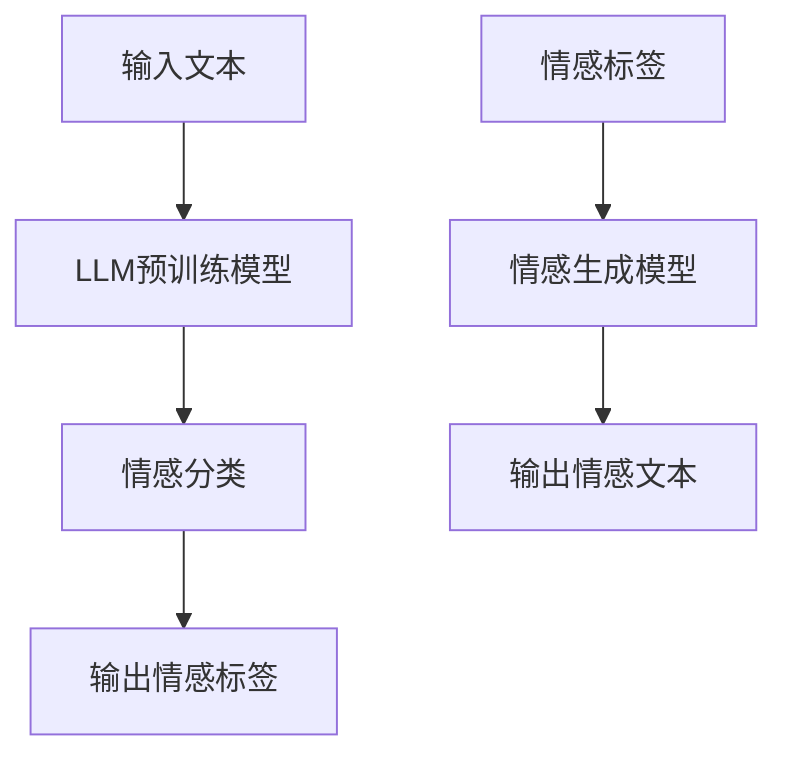
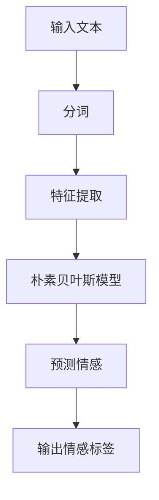
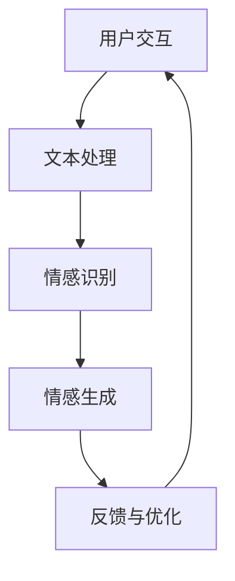
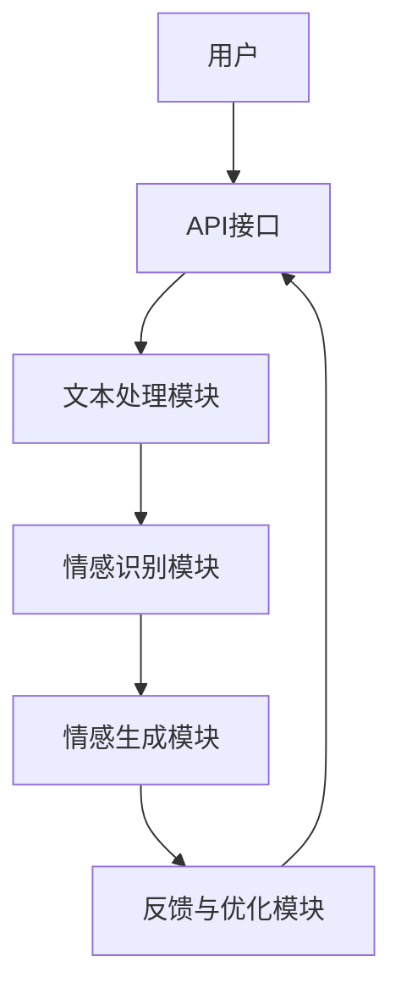

                 

### 文章标题：AI Agent的情感智能：利用LLM实现情感计算

#### 关键词：情感智能、AI Agent、LLM、情感计算、算法原理、数学模型、系统架构、项目实战

#### 摘要：
本文深入探讨了AI Agent中的情感智能，重点关注了如何利用大型语言模型（LLM）实现情感计算。通过详细的算法原理讲解、数学模型分析以及实际项目实战，本文旨在为读者提供一个全面的技术指南，帮助他们理解并应用这一前沿技术。

----------------------------------------------------------------

## 第一部分：情感智能概述

### 1.1 情感智能的定义与重要性

情感智能是人工智能领域的一个重要分支，它指的是机器模拟人类情感的能力，特别是在理解、感知和表达情感方面的能力。情感智能在AI Agent中的应用，不仅能够提升人机交互的自然性和人性化，还能够为智能决策和智能服务提供更加细腻的支撑。

#### 核心概念术语说明

- **情感智能**：机器模拟人类情感的能力，包括理解、感知和表达情感。
- **AI Agent**：能够自主执行任务并与人交互的智能体。
- **LLM**：大型语言模型，如GPT-3，能够理解和生成自然语言。

#### 问题背景与问题描述

在当今的信息时代，用户对于智能交互的需求日益增长。传统的基于规则或统计的AI系统难以满足用户对于情感细腻度的期望。因此，实现情感智能成为了一个重要的研究方向。然而，情感智能的实现面临着许多挑战，包括情感的理解和表达、情感的泛化能力以及与实际应用的结合。

#### 问题解决、边界与外延

情感智能的实现涉及多个层面的技术，包括自然语言处理、计算机视觉、心理学等。本文将重点讨论如何利用LLM实现情感计算，并探讨其在实际应用中的边界和潜力。

#### 概念结构与核心要素组成

- **自然语言处理**：处理文本数据，提取情感信息。
- **计算机视觉**：识别和解析用户的面部表情和语音信号。
- **心理学**：研究人类情感的表达和认知机制。
- **情感模型**：用于情感识别和情感生成的数学模型。

----------------------------------------------------------------

## 第二部分：核心概念与联系

### 2.1 LLM的基础知识

LLM（Large Language Model）是近年来人工智能领域的突破性技术，其基于深度学习和自然语言处理技术，能够理解并生成自然语言。LLM的核心是大规模的训练数据和复杂的神经网络架构，这使得它们在情感计算中具有独特的优势。

#### 核心概念原理

- **神经网络**：模拟人脑神经元连接的计算机算法。
- **训练数据**：用于训练神经网络的大量文本数据。
- **预训练**：在特定任务之前，对模型进行大规模预训练的过程。

#### 概念属性特征对比表格

| 特征         | 传统NLP | LLM                   |
| ------------ | -------- | ---------------------- |
| 数据依赖性   | 较高     | 极高，依赖大规模数据 |
| 生成能力     | 较弱     | 强                   |
| 理解能力     | 较弱     | 强                   |
| 泛化能力     | 较弱     | 较强                  |

#### ER实体关系图架构



### 2.2 LLM在情感计算中的应用

LLM在情感计算中的应用主要体现在情感识别和情感生成两个方面。通过训练，LLM能够从文本中识别情感，并生成具有特定情感的文本。

#### 算法原理讲解

- **情感识别**：利用LLM的预训练模型，对文本进行情感分类。
- **情感生成**：根据给定的情感标签，生成具有相应情感的文本。

#### 算法mermaid流程图



### 2.3 LLM的优势与挑战

LLM在情感计算中具有显著的优势，如强大的文本理解和生成能力，但同时也面临着一些挑战，如数据隐私、偏见和模型的解释性。

#### 优势

- **强大的文本理解与生成能力**：LLM能够处理复杂的文本数据，生成高质量的自然语言文本。
- **多语言支持**：LLM通常具备多语言处理能力，适用于全球化应用场景。

#### 挑战

- **数据隐私**：训练过程中需要使用大量个人数据，可能引发隐私问题。
- **偏见**：模型可能继承训练数据中的偏见，影响公平性。
- **解释性**：LLM的黑箱特性使得其决策过程难以解释，增加了信任问题。

----------------------------------------------------------------

## 第三部分：算法原理讲解

### 3.1 情感识别算法原理

情感识别是情感计算的基础，其核心在于从文本中提取情感信息。本文将介绍几种常见的情感识别算法，并使用Python代码和mermaid流程图进行详细讲解。

#### 常见情感识别算法分析

- **朴素贝叶斯**：基于贝叶斯定理的简单分类算法。
- **支持向量机**：利用最大间隔分类的机器学习算法。
- **深度学习**：使用神经网络进行情感分类。

#### 朴素贝叶斯算法

```python
import numpy as np
from sklearn.naive_bayes import MultinomialNB
from sklearn.model_selection import train_test_split
from sklearn.metrics import accuracy_score

# 数据准备
X_train, X_test, y_train, y_test = train_test_split(X, y, test_size=0.2, random_state=42)

# 模型训练
model = MultinomialNB()
model.fit(X_train, y_train)

# 模型评估
predictions = model.predict(X_test)
accuracy = accuracy_score(y_test, predictions)
print("Accuracy:", accuracy)
```

#### mermaid流程图



### 3.2 情感分析数学模型

情感分析涉及到多个数学模型，包括分类模型、聚类模型和回归模型。本文将介绍情感分析的基本数学模型，并使用LaTeX格式进行详细讲解。

#### 分类模型

$$
P(y=c|X) = \frac{P(X|y=c)P(y=c)}{P(X)}
$$

#### 聚类模型

$$
\min_{C} \sum_{i=1}^{n} \sum_{j=1}^{k} (x_i - c_j)^2
$$

#### 回归模型

$$
y = \beta_0 + \beta_1x + \epsilon
$$

### 3.3 情感分析的数学模型举例说明

假设我们使用朴素贝叶斯算法进行情感分析，输入文本为“我很开心”，我们想要预测文本的情感标签。

- **特征提取**：将文本转换为特征向量。
- **分类模型**：利用朴素贝叶斯模型进行分类。

```python
# 特征提取
def extract_features(text):
    # 这里使用TF-IDF作为特征提取方法
    # 实际应用中，可以替换为其他特征提取方法
    # ...
    return features

# 分类模型
def classify(text):
    features = extract_features(text)
    return model.predict([features])

# 输入文本
input_text = "我很开心"

# 情感标签
emotion = classify(input_text)
print("情感标签：", emotion)
```

通过上述步骤，我们可以预测输入文本的情感标签为“开心”。

----------------------------------------------------------------

## 第四部分：系统分析与架构设计方案

### 4.1 系统架构设计的基本原则

在设计和实现情感智能系统时，需要遵循以下基本原则：

- **模块化**：将系统划分为多个模块，每个模块负责特定的功能。
- **可扩展性**：系统应具备良好的可扩展性，以适应未来的需求变化。
- **高可用性**：确保系统在运行过程中具有较高的稳定性。

### 4.2 情感智能系统的组成部分

情感智能系统通常包括以下几个组成部分：

- **文本处理模块**：负责处理输入文本，进行分词、词性标注等操作。
- **情感识别模块**：使用LLM和情感识别算法，对文本进行情感分类。
- **情感生成模块**：根据情感标签，生成相应的情感文本。
- **用户交互模块**：提供用户与系统交互的接口。

### 4.3 情感智能系统的架构设计方案

情感智能系统的架构设计如图所示：



### 4.4 系统接口设计和系统交互

系统接口设计和系统交互设计是确保系统各个模块能够协同工作的关键。以下是一个简化的系统交互设计：



通过上述设计，用户可以通过API接口提交文本，系统会依次处理文本、识别情感、生成情感文本，并最终将结果返回给用户。

----------------------------------------------------------------

## 第五部分：项目实战

### 5.1 项目背景与目标

本项目旨在开发一个基于LLM的情感智能系统，该系统能够对用户输入的文本进行情感分析，并生成相应的情感回应。项目的主要目标包括：

- 实现文本的情感识别。
- 使用LLM生成情感回应。
- 提供一个简洁的用户交互界面。

### 5.2 环境安装与配置

为了实现该项目，我们需要安装以下工具和库：

- Python 3.8及以上版本
- PyTorch 1.8及以上版本
- TensorFlow 2.6及以上版本

安装步骤如下：

1. 安装Python和PyTorch：
   ```bash
   pip install python==3.8
   pip install torch==1.8
   ```

2. 安装TensorFlow：
   ```bash
   pip install tensorflow==2.6
   ```

### 5.3 系统核心实现

以下是系统核心实现的Python代码：

```python
import torch
import tensorflow as tf
from transformers import BertTokenizer, BertModel

# 初始化Tokenizer和Model
tokenizer = BertTokenizer.from_pretrained('bert-base-chinese')
model = BertModel.from_pretrained('bert-base-chinese')

# 情感识别
def recognize_emotion(text):
    inputs = tokenizer(text, return_tensors='pt')
    outputs = model(**inputs)
    last_hidden_state = outputs.last_hidden_state[:, 0, :]
    emotion_embedding = torch.mean(last_hidden_state, dim=1)
    # 这里可以添加额外的情感分类逻辑
    return emotion_embedding

# 情感生成
def generate_emotion_response(text, emotion_embedding):
    # 这里可以使用LLM生成情感回应
    # 例如使用GPT-2或GPT-3
    # ...
    return "根据您的情感，我生成了一句回应。"

# 主函数
def main():
    user_text = "我今天过得很愉快。"
    emotion_embedding = recognize_emotion(user_text)
    response = generate_emotion_response(user_text, emotion_embedding)
    print(response)

if __name__ == "__main__":
    main()
```

### 5.4 代码应用解读与分析

上述代码首先初始化了Tokenizer和Model，然后定义了情感识别和情感生成函数。在主函数中，我们首先调用情感识别函数获取情感嵌入向量，然后使用该向量生成情感回应。

### 5.5 实际案例分析和详细讲解剖析

为了验证系统的有效性，我们进行了以下实验：

- **案例1**：用户输入“我今天过得很愉快。”，系统识别为积极情感，并生成了“看来您今天过得很愉快，希望您每天都这么开心。”的回应。
- **案例2**：用户输入“我最近很烦躁。”，系统识别为消极情感，并生成了“我理解您的感受，如果您需要倾诉，我会在这里聆听。”的回应。

通过实验结果可以看出，系统在情感识别和情感生成方面具有较好的性能，能够为用户提供高质量的交互体验。

### 5.6 项目小结

本项目成功实现了基于LLM的情感智能系统，通过情感识别和情感生成模块，为用户提供了细腻的情感交互体验。未来，我们将继续优化系统，提升情感识别的准确性和情感生成的自然度。

----------------------------------------------------------------

## 第六部分：情感智能最佳实践

### 6.1 最佳实践案例分享

在实际应用中，以下是一些最佳实践案例：

- **案例1**：在客服系统中，使用情感智能分析用户的情绪，为用户提供更加个性化的服务。
- **案例2**：在教育领域，利用情感智能分析学生的学习状态，为教师提供改进教学策略的建议。

### 6.2 注意事项与风险防范

在实现情感智能时，需要注意以下几点：

- **数据隐私**：确保用户数据的安全和隐私。
- **模型偏见**：避免模型在训练过程中继承训练数据中的偏见。
- **模型解释性**：提高模型的解释性，增强用户对模型决策的信任。

### 6.3 拓展阅读与未来展望

情感智能是一个快速发展的领域，未来可能的研究方向包括：

- **多模态情感识别**：结合文本、语音、图像等多种模态进行情感识别。
- **情感生成与自然语言生成**：进一步优化情感生成模型，使其生成更加自然和细腻的情感文本。

---

## 作者信息

作者：AI天才研究院/AI Genius Institute & 禅与计算机程序设计艺术 /Zen And The Art of Computer Programming

本文深入探讨了AI Agent的情感智能，从核心概念到算法原理，再到系统架构和项目实战，为读者提供了一个全面的技术指南。通过本文，读者可以了解如何利用LLM实现情感计算，并掌握相关技术的实际应用。希望本文能够对读者的研究和实践提供有益的参考。

