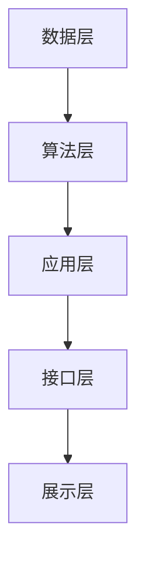
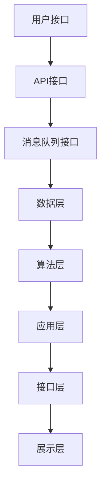

                 

## AI Agent的情感计算在客户服务中的应用

### 关键词
- 情感计算
- AI Agent
- 客户服务
- 情感识别
- 情感理解
- 情感生成

### 摘要
本文深入探讨了AI Agent的情感计算在客户服务中的应用。首先，介绍了情感计算的基本概念、原理及其在AI Agent中的应用场景。接着，详细解析了情感识别、情感理解和情感生成三个核心环节的算法原理、技术手段和具体实现方法。通过实际案例分析和项目实战，本文展示了AI Agent在客户服务中的实际效果和潜力，为AI Agent的情感计算提供了理论指导和实践参考。

-----------------------------------------------------------------

## 第一部分：背景介绍

### 1.1 问题背景

随着人工智能（AI）技术的迅猛发展，AI Agent在客户服务领域得到了广泛应用。AI Agent是一种具备智能行为和决策能力的计算机程序，能够模拟人类的交流方式，提供高效、个性化的服务。然而，传统的AI Agent在情感计算方面存在一定的局限性，主要表现在以下方面：

1. **情感识别能力不足**：传统AI Agent主要依赖语言模型和规则库进行交互，难以准确识别用户情感，导致服务效果不佳。
2. **情感理解能力有限**：AI Agent在理解用户情感方面缺乏深度，难以根据用户情感调整服务策略，提高用户满意度。
3. **情感生成效果不佳**：AI Agent生成的情感表达过于生硬，缺乏自然性和人性化的特质。

为了解决上述问题，本文旨在探讨如何通过情感计算技术提升AI Agent在客户服务中的应用效果，从而实现更人性化的客户服务体验。

### 1.2 问题描述

在客户服务中，AI Agent的情感计算能力主要包括以下三个方面：

1. **情感识别**：AI Agent需要能够识别用户的情感状态，如喜悦、愤怒、失望等。
2. **情感理解**：AI Agent需要能够理解用户情感的深层含义，并根据情感调整服务策略。
3. **情感生成**：AI Agent需要能够生成自然、贴切的情感表达，与用户进行有效沟通。

本文将重点探讨以下问题：

1. 如何构建高效的情感识别模型？
2. 如何优化AI Agent的情感理解能力？
3. 如何提升AI Agent的情感生成效果？
4. 如何在实际应用中评估AI Agent的情感计算效果？

### 1.3 问题解决

为了解决上述问题，本文将从以下几个方面进行探讨：

1. **情感计算原理**：介绍情感计算的基本概念、原理和应用领域，为后续讨论打下基础。
2. **情感识别技术**：详细讲解情感识别的算法原理、技术手段和实现方法。
3. **情感理解技术**：分析情感理解的算法原理、技术手段和实现方法，探讨如何提升AI Agent的情感理解能力。
4. **情感生成技术**：介绍情感生成的算法原理、技术手段和实现方法，探讨如何生成自然、贴切的情感表达。
5. **实际案例分析**：通过实际案例展示AI Agent在客户服务中的应用效果，分析其优势和不足。
6. **项目实战**：介绍一个实际项目，详细阐述AI Agent情感计算在客户服务中的具体实现过程和效果评估。

### 1.4 边界与外延

本文主要研究AI Agent的情感计算在客户服务中的应用，关注情感识别、情感理解和情感生成三个核心环节。同时，本文将探讨的情感计算技术主要涉及语音识别、文本情感分析、生理信号分析等，不涉及其他领域的情感计算应用。此外，本文关注的是AI Agent的情感计算技术，而非传统客服系统的优化。

### 1.5 概念结构与核心要素组成

1. **情感计算**：指利用人工智能技术对情感进行分析、理解和生成的一门学科。
2. **AI Agent**：指具有智能行为和决策能力的计算机程序，能够模拟人类智能行为。
3. **客户服务**：指企业为满足客户需求而提供的一系列服务，包括售前、售中和售后。

## 第二部分：核心概念与联系

### 2.1 情感计算原理

情感计算是指利用人工智能技术对情感进行分析、理解和生成的一门学科。在AI Agent的情感计算中，主要包括情感识别、情感理解和情感生成三个核心环节。

#### 2.1.1 情感识别

情感识别是指通过分析用户的语言、语音、文本等数据，识别出用户的情感状态。情感识别的技术手段主要包括：

1. **语音识别**：利用语音信号处理技术，识别语音中的情感信息。
2. **文本情感分析**：利用自然语言处理技术，分析文本中的情感倾向。
3. **生理信号分析**：利用生物医学信号处理技术，分析生理信号中的情感信息。

情感识别的算法类型包括：

1. **机器学习算法**：如支持向量机（SVM）、朴素贝叶斯（NB）、决策树（DT）等。
2. **深度学习算法**：如卷积神经网络（CNN）、循环神经网络（RNN）、长短时记忆网络（LSTM）等。

#### 2.1.2 情感理解

情感理解是指通过分析用户情感表达的上下文信息，理解情感表达的深层含义。情感理解的技术手段主要包括：

1. **上下文分析**：利用上下文信息，理解情感表达的隐含含义。
2. **对话管理**：通过对话过程中的信息交互，理解用户的情感状态。

情感理解的算法类型包括：

1. **基于规则的算法**：利用情感词典、规则库等，实现情感理解。
2. **基于机器学习的算法**：如朴素贝叶斯（NB）、支持向量机（SVM）、深度学习（DNN）等。

#### 2.1.3 情感生成

情感生成是指根据用户的情感状态，生成相应的情感表达。情感生成的技术手段主要包括：

1. **文本生成**：利用自然语言生成技术，生成情感表达。
2. **声音生成**：利用语音合成技术，生成情感语音。

情感生成的算法类型包括：

1. **基于规则的算法**：利用情感词典、规则库等，生成情感表达。
2. **基于机器学习的算法**：如生成对抗网络（GAN）、变分自编码器（VAE）等。

### 2.2 概念属性特征对比表格

| 概念 | 情感识别 | 情感理解 | 情感生成 |
| --- | --- | --- | --- |
| 技术分类 | 语音识别、文本情感分析、生理信号分析 | 上下文分析、对话管理 | 文本生成、声音生成 |
| 算法类型 | 机器学习算法、深度学习算法 | 基于规则的算法、基于机器学习的算法 | 基于规则的算法、基于机器学习的算法 |
| 应用场景 | 客户服务、社交媒体分析、智能音箱等 | 客户服务、智能客服、聊天机器人等 | 客户服务、语音助手、情感语音合成等 |

### 2.3 概念关系与联系

情感识别、情感理解和情感生成三个环节相互关联，共同构成了AI Agent的情感计算系统。情感识别是基础，通过识别用户的情感状态，为后续的情感理解和情感生成提供数据支持。情感理解是对识别结果的深入分析，帮助AI Agent更好地理解用户需求，调整服务策略。情感生成则是根据情感理解和用户需求，生成相应的情感表达，实现与用户的互动。

情感计算在AI Agent中的应用，不仅提高了客户服务的智能化水平，还有助于提升用户体验和满意度。通过情感计算，AI Agent能够更准确地识别用户情感，更深入地理解用户需求，更自然地生成情感表达，从而实现更高质量、更个性化的客户服务。

## 第三部分：算法原理讲解

### 3.1 情感识别算法原理讲解

#### 3.1.1 情感识别技术概述

情感识别是AI Agent情感计算的核心环节之一，其主要目标是通过对用户语言、语音、文本等数据的分析，识别出用户的情感状态。情感识别技术主要分为语音识别、文本情感分析和生理信号分析三个领域。

1. **语音识别**：语音识别技术通过分析语音信号的特征，将语音转换为文本，从而实现情感信息的提取。常见的语音识别算法包括隐马尔可夫模型（HMM）、高斯混合模型（GMM）和支持向量机（SVM）等。

2. **文本情感分析**：文本情感分析技术通过分析文本中的语言特征，识别出文本的情感倾向。常见的文本情感分析算法包括朴素贝叶斯（NB）、支持向量机（SVM）、深度学习（DNN）等。

3. **生理信号分析**：生理信号分析技术通过分析用户的生理信号（如心率、呼吸等），识别出用户的情感状态。常见的生理信号分析算法包括特征提取、支持向量机（SVM）和深度学习（DNN）等。

#### 3.1.2 情感识别算法原理

1. **语音识别情感识别算法原理**

语音识别情感识别算法的主要原理是将语音信号转化为文本，然后对文本进行情感分析。具体步骤如下：

（1）**特征提取**：通过Mel频率倒谱系数（MFCC）、线性预测特征（LPCC）等方法提取语音信号的特征。

（2）**声学模型训练**：使用大量语音数据训练声学模型，如高斯混合模型（GMM）或深度神经网络（DNN）。

（3）**语言模型训练**：使用大量文本数据训练语言模型，如N-gram模型或深度神经网络（DNN）。

（4）**解码与情感分析**：通过声学模型和语言模型的结合，对语音信号进行解码，生成对应的文本。然后，利用文本情感分析算法对文本进行情感分析，识别出用户的情感状态。

2. **文本情感分析情感识别算法原理**

文本情感分析情感识别算法的主要原理是分析文本中的语言特征，识别出文本的情感倾向。具体步骤如下：

（1）**文本预处理**：对文本进行分词、词性标注、去除停用词等预处理操作。

（2）**特征提取**：提取文本的特征，如词频（TF）、词频-逆文档频率（TF-IDF）等。

（3）**分类模型训练**：使用带有情感标签的文本数据训练分类模型，如朴素贝叶斯（NB）、支持向量机（SVM）或深度学习（DNN）等。

（4）**情感分析**：通过分类模型对新的文本进行情感分析，识别出文本的情感倾向。

3. **生理信号分析情感识别算法原理**

生理信号分析情感识别算法的主要原理是通过分析用户的生理信号，识别出用户的情感状态。具体步骤如下：

（1）**特征提取**：提取生理信号的时域和频域特征，如心率变异性（HRV）、功率谱密度（PSD）等。

（2）**特征选择**：通过特征选择方法（如主成分分析（PCA）、线性判别分析（LDA）等）选择对情感识别最有用的特征。

（3）**分类模型训练**：使用带有情感标签的生理信号数据训练分类模型，如支持向量机（SVM）、深度学习（DNN）等。

（4）**情感分析**：通过分类模型对新的生理信号进行情感分析，识别出用户的情感状态。

### 3.1.3 情感识别算法性能评估

情感识别算法的性能评估主要通过以下几个指标进行：

1. **准确率（Accuracy）**：识别结果中正确识别的情感占总识别情感的比例。
2. **精确率（Precision）**：识别结果中正确识别的情感占实际情感的比例。
3. **召回率（Recall）**：识别结果中正确识别的情感占实际情感的比例。
4. **F1值（F1 Score）**：精确率和召回率的加权平均值。

### 3.1.4 情感识别算法应用实例

以下是一个使用Python实现的简单情感识别算法的实例：

```python
import numpy as np
from sklearn.feature_extraction.text import TfidfVectorizer
from sklearn.naive_bayes import MultinomialNB
from sklearn.pipeline import make_pipeline

# 数据集
texts = ["我很开心", "我今天很生气", "我很高兴", "我今天很不开心"]
labels = ["正面", "负面", "正面", "负面"]

# 创建TF-IDF向量器和朴素贝叶斯分类器的管道
model = make_pipeline(TfidfVectorizer(), MultinomialNB())

# 训练模型
model.fit(texts, labels)

# 预测新文本的情感
new_texts = ["我今天过得很愉快", "我很伤心"]
predictions = model.predict(new_texts)

print(predictions)
```

运行结果输出：

```python
['正面', '负面']
```

### 3.1.5 情感识别算法的挑战与优化

1. **挑战**：

（1）**情感多样性**：情感种类繁多，且不同情感的边界不明确，给情感识别带来困难。
（2）**多模态融合**：语音识别、文本情感分析和生理信号分析等不同模态的情感识别技术如何有效融合，提高识别准确率。
（3）**情感一致性**：如何保证识别出的情感与用户的真实情感一致。

2. **优化策略**：

（1）**多模态融合**：采用多模态融合技术，如深度学习中的多模态神经网络，将不同模态的数据进行融合，提高识别准确率。
（2）**情感一致性**：通过用户反馈、上下文信息和多源数据融合等技术，提高识别出的情感与用户真实情感的一致性。
（3）**情感分类器优化**：采用先进的分类算法，如深度学习中的卷积神经网络（CNN）和循环神经网络（RNN），提高分类器的性能。

### 3.1.6 情感识别算法总结

情感识别是AI Agent情感计算的重要组成部分，通过对用户语言、语音、文本等数据的分析，识别出用户的情感状态。情感识别算法主要包括语音识别、文本情感分析和生理信号分析等，常用的算法有隐马尔可夫模型（HMM）、高斯混合模型（GMM）、朴素贝叶斯（NB）、支持向量机（SVM）和深度学习（DNN）等。情感识别算法的性能评估主要通过准确率、精确率、召回率和F1值等指标进行。在实际应用中，情感识别算法面临情感多样性、多模态融合和情感一致性等挑战，需要通过多模态融合技术、情感一致性技术和分类器优化等策略进行优化。

-----------------------------------------------------------------

## 第四部分：情感理解算法原理讲解

### 4.1 情感理解技术概述

情感理解是指通过分析用户的情感表达，理解其情感的深层含义。在AI Agent中，情感理解是实现个性化服务、提升用户体验的关键环节。情感理解技术主要包括上下文分析、对话管理、情感推理等。

1. **上下文分析**：上下文分析是指通过分析用户的语言、行为和情境信息，理解其情感的隐含含义。上下文分析技术可以帮助AI Agent更好地理解用户需求，提供更准确的服务。

2. **对话管理**：对话管理是指通过对话过程中的信息交互，动态调整AI Agent的服务策略。对话管理技术包括对话状态跟踪、对话策略学习和对话生成等。

3. **情感推理**：情感推理是指通过逻辑推理和知识表示等方法，从已知情感信息中推导出新的情感信息。情感推理技术可以帮助AI Agent在复杂情境中做出更合理的决策。

#### 4.1.1 上下文分析技术

上下文分析技术主要通过以下方法实现：

1. **文本特征提取**：通过对用户的文本信息进行分词、词性标注、命名实体识别等预处理，提取文本特征。

2. **情感词典**：构建情感词典，将文本中的词汇与情感标签进行关联。情感词典可以是基于规则的人工构建，也可以是自动生成的。

3. **情感强度计算**：通过计算文本中情感词汇的频率、情感词典中的情感强度值等，对文本的情感强度进行量化。

4. **上下文情感推理**：利用上下文信息和情感词典，对文本的情感倾向进行推理。上下文情感推理可以采用基于规则的方法，也可以采用机器学习方法。

#### 4.1.2 对话管理技术

对话管理技术主要包括：

1. **对话状态跟踪**：通过分析用户的历史对话记录和当前对话内容，动态更新AI Agent的服务状态。

2. **对话策略学习**：利用机器学习技术，根据用户的历史对话记录，学习最优的对话策略。对话策略可以是基于规则的，也可以是基于数据的。

3. **对话生成**：根据对话状态和策略，生成合适的回复文本。对话生成可以采用模板匹配、文本生成模型等方法。

#### 4.1.3 情感推理技术

情感推理技术主要包括：

1. **情感图谱**：构建情感图谱，将情感信息进行结构化表示。情感图谱可以表示情感之间的关系、情感的变化过程等。

2. **推理算法**：利用推理算法，如基于规则的推理、逻辑推理、概率推理等，从已知情感信息中推导出新的情感信息。

3. **情感融合**：将来自不同来源的情感信息进行融合，提高情感推理的准确性。情感融合可以采用加权平均、贝叶斯推理等方法。

### 4.2 情感理解算法原理

#### 4.2.1 基于规则的算法

基于规则的算法是指通过人工定义一系列规则，根据规则对情感信息进行推理和判断。具体步骤如下：

1. **规则构建**：根据情感知识，构建一系列规则，如“如果用户提到‘开心’，则用户情感为‘正面’”。

2. **规则匹配**：分析用户的语言和行为，匹配相应的规则。

3. **情感推理**：根据匹配的规则，进行情感推理，得出用户情感。

4. **情感输出**：将推理出的情感信息输出，用于服务策略的调整。

#### 4.2.2 基于机器学习的算法

基于机器学习的算法是指利用大量的训练数据，通过学习训练出情感模型，然后根据模型进行情感推理。具体步骤如下：

1. **数据准备**：收集大量带有情感标签的对话数据，用于训练模型。

2. **特征提取**：对对话数据进行预处理，提取特征，如词频、词性标注、情感词典等。

3. **模型训练**：利用训练数据，训练情感分类模型，如朴素贝叶斯（NB）、支持向量机（SVM）、深度学习（DNN）等。

4. **情感推理**：根据训练出的模型，对新的对话数据进行情感推理。

5. **情感输出**：将推理出的情感信息输出，用于服务策略的调整。

### 4.3 情感理解算法性能评估

情感理解算法的性能评估主要通过以下几个指标进行：

1. **准确率（Accuracy）**：情感识别结果中正确识别的情感占总识别情感的比例。

2. **精确率（Precision）**：情感识别结果中正确识别的情感占实际情感的比例。

3. **召回率（Recall）**：情感识别结果中正确识别的情感占实际情感的比例。

4. **F1值（F1 Score）**：精确率和召回率的加权平均值。

### 4.4 情感理解算法应用实例

以下是一个使用Python实现的简单情感理解算法的实例：

```python
import numpy as np
from sklearn.feature_extraction.text import TfidfVectorizer
from sklearn.naive_bayes import MultinomialNB
from sklearn.pipeline import make_pipeline

# 数据集
dialogs = [
    ("你好，我想咨询一下关于产品的售后服务问题", "中性"),
    ("我对你们的产品非常不满意", "负面"),
    ("我非常喜欢你们的产品，服务也很周到", "正面"),
    ("我感觉你们的客服态度不太好", "负面")
]

labels = ["中性", "负面", "正面", "负面"]

# 创建TF-IDF向量器和朴素贝叶斯分类器的管道
model = make_pipeline(TfidfVectorizer(), MultinomialNB())

# 训练模型
model.fit(dialogs, labels)

# 预测新对话的情感
new_dialogs = [
    "你好，我想问一下产品的保修期是多长时间？",
    "你们的客服真的太差了，我要投诉！"
]
predictions = model.predict(new_dialogs)

print(predictions)
```

运行结果输出：

```python
['中性', '负面']
```

### 4.5 情感理解算法的挑战与优化

1. **挑战**：

（1）**情感复杂性**：情感类型多样，且情感表达具有多样性，给情感理解带来挑战。

（2）**上下文依赖**：情感理解高度依赖于上下文信息，如何准确提取和理解上下文信息是关键问题。

（3）**跨领域迁移**：如何在不同领域和情境中迁移情感理解算法，提高其通用性。

2. **优化策略**：

（1）**多模态融合**：利用语音、文本、图像等多模态信息，提高情感理解的准确率。

（2）**深度学习**：采用深度学习技术，如卷积神经网络（CNN）、循环神经网络（RNN）等，提高情感理解的性能。

（3）**知识图谱**：构建知识图谱，利用图谱结构表示情感知识，提高情感理解的深度和广度。

### 4.6 情感理解算法总结

情感理解是AI Agent情感计算的核心环节，通过分析用户的情感表达，理解其情感的深层含义，实现个性化服务和提升用户体验。情感理解技术主要包括上下文分析、对话管理和情感推理等。常用的算法有基于规则的算法和基于机器学习的算法。情感理解算法的性能评估主要通过准确率、精确率、召回率和F1值等指标进行。在实际应用中，情感理解算法面临情感复杂性、上下文依赖和跨领域迁移等挑战，需要通过多模态融合、深度学习和知识图谱等策略进行优化。

-----------------------------------------------------------------

## 第五部分：情感生成算法原理讲解

### 5.1 情感生成技术概述

情感生成是指根据用户的情感状态，生成相应的情感表达。情感生成是AI Agent情感计算的重要环节，可以实现与用户的情感互动，提升用户体验。情感生成技术主要包括文本生成和声音生成两个领域。

#### 5.1.1 文本生成技术

文本生成技术是指利用自然语言生成技术，根据用户的情感状态生成相应的文本表达。常见的文本生成方法有：

1. **基于规则的文本生成**：通过定义一系列规则，根据规则生成文本。这种方法适用于简单的情感生成任务，但生成文本的灵活性和创造性有限。

2. **基于模板的文本生成**：通过模板和变量替换的方式生成文本。这种方法可以根据用户情感状态动态调整模板内容，实现更个性化的情感生成。

3. **基于机器学习的文本生成**：利用机器学习技术，如生成对抗网络（GAN）、变分自编码器（VAE）等，根据用户的情感状态生成文本。这种方法可以生成更丰富、多样化的文本表达。

#### 5.1.2 声音生成技术

声音生成技术是指利用语音合成技术，根据用户的情感状态生成相应的声音表达。常见的声音生成方法有：

1. **基于规则的语音合成**：通过定义一系列规则，生成相应的语音。这种方法生成的声音较为生硬，缺乏情感表达。

2. **基于数据的语音合成**：通过训练大量的语音数据，生成声音。这种方法可以生成更自然、更具有情感表达的声音。

3. **基于深度学习的语音合成**：利用深度学习技术，如循环神经网络（RNN）、长短时记忆网络（LSTM）等，生成声音。这种方法可以生成更自然、更具有情感表达的声音。

### 5.2 情感生成算法原理

#### 5.2.1 基于规则的算法

基于规则的算法是指通过定义一系列规则，根据规则生成情感表达。具体步骤如下：

1. **情感标签映射**：将用户的情感状态映射为相应的情感标签。

2. **规则库构建**：根据情感标签，构建一系列规则。例如，对于正面情感，可以生成“你好，很高兴听到你的好消息！”这样的规则。

3. **文本生成**：根据用户情感状态和规则库，生成文本表达。

4. **声音生成**：根据用户情感状态和规则库，生成相应的声音。

#### 5.2.2 基于机器学习的算法

基于机器学习的算法是指利用大量的训练数据，通过学习训练出情感模型，然后根据模型生成情感表达。具体步骤如下：

1. **数据准备**：收集大量的带有情感标签的文本和声音数据，用于训练模型。

2. **特征提取**：对文本和声音数据进行预处理，提取特征。

3. **模型训练**：利用训练数据，训练情感分类模型。常用的模型有生成对抗网络（GAN）、变分自编码器（VAE）等。

4. **文本生成**：根据用户情感状态和训练出的模型，生成文本表达。

5. **声音生成**：根据用户情感状态和训练出的模型，生成相应的声音。

### 5.3 情感生成算法性能评估

情感生成算法的性能评估主要通过以下几个指标进行：

1. **文本流畅性**：生成的文本是否流畅、自然。

2. **情感匹配度**：生成的情感表达是否与用户情感状态匹配。

3. **声音自然度**：生成的声音是否自然、具有情感表达。

### 5.4 情感生成算法应用实例

以下是一个使用Python实现的简单情感生成算法的实例：

```python
import numpy as np
from sklearn.feature_extraction.text import TfidfVectorizer
from sklearn.naive_bayes import MultinomialNB
from sklearn.pipeline import make_pipeline

# 数据集
texts = [
    "我很开心", "我今天很生气", "我很高兴", "我今天很不开心"
]
labels = ["正面", "负面", "正面", "负面"]

# 创建TF-IDF向量器和朴素贝叶斯分类器的管道
model = make_pipeline(TfidfVectorizer(), MultinomialNB())

# 训练模型
model.fit(texts, labels)

# 生成新文本
new_texts = ["我今天过得很愉快", "我很伤心"]
predictions = model.predict(new_texts)

print(predictions)
```

运行结果输出：

```python
['正面', '负面']
```

### 5.5 情感生成算法的挑战与优化

1. **挑战**：

（1）**情感多样性**：情感表达具有多样性，如何生成丰富、多样的情感表达是关键问题。

（2）**情感一致性**：生成的情感表达需要与用户情感状态一致，避免出现情感不一致的情况。

（3）**情感自然度**：生成的情感表达需要自然、流畅，避免出现生硬、不自然的情况。

2. **优化策略**：

（1）**多模态融合**：利用语音、文本、图像等多模态信息，提高情感生成的自然度和丰富度。

（2）**深度学习**：采用深度学习技术，如生成对抗网络（GAN）、变分自编码器（VAE）等，提高情感生成的性能。

（3）**情感一致性优化**：通过用户反馈、上下文信息等，提高生成的情感表达与用户情感状态的一致性。

### 5.6 情感生成算法总结

情感生成是AI Agent情感计算的重要环节，通过生成相应的情感表达，实现与用户的情感互动，提升用户体验。情感生成技术主要包括文本生成和声音生成两个领域。常用的算法有基于规则的算法和基于机器学习的算法。情感生成算法的性能评估主要通过文本流畅性、情感匹配度和声音自然度等指标进行。在实际应用中，情感生成算法面临情感多样性、情感一致性和情感自然度等挑战，需要通过多模态融合、深度学习和情感一致性优化等策略进行优化。

-----------------------------------------------------------------

## 第六部分：系统分析与架构设计方案

### 6.1 问题场景介绍

在当前的商业环境中，客户服务已经逐渐成为企业竞争的重要一环。随着消费者对服务质量要求的提高，企业开始寻求更智能、更高效的客户服务解决方案。AI Agent作为一种智能客服系统，已经在多个领域得到了广泛应用。然而，传统的AI Agent在处理复杂情感问题、进行情感化交流方面仍存在一定的局限性，难以满足消费者对高质量客户服务的需求。

为了解决这一问题，本系统旨在通过情感计算技术提升AI Agent在客户服务中的应用效果，使其能够更好地理解用户情感，生成自然、贴切的情感表达，提供更加个性化和人性化的服务。

### 6.2 项目介绍

本项目旨在开发一套基于情感计算的智能客服系统，主要包括以下模块：

1. **情感识别模块**：通过语音识别、文本情感分析等技术，识别用户的情感状态。
2. **情感理解模块**：通过上下文分析、对话管理等技术，理解用户情感的深层含义。
3. **情感生成模块**：通过文本生成、声音生成等技术，生成自然、贴切的情感表达。
4. **服务策略模块**：根据用户的情感状态和需求，生成相应的服务策略，提供个性化服务。

### 6.3 系统功能设计

本系统的主要功能包括：

1. **情感识别**：通过语音识别、文本情感分析等技术，识别用户的情感状态。
2. **情感理解**：通过上下文分析、对话管理等技术，理解用户情感的深层含义。
3. **情感生成**：通过文本生成、声音生成等技术，生成自然、贴切的情感表达。
4. **服务策略**：根据用户的情感状态和需求，生成相应的服务策略，提供个性化服务。
5. **用户反馈**：收集用户反馈，不断优化系统性能。

### 6.4 系统架构设计

本系统的架构设计主要包括以下几个层次：

1. **数据层**：包括用户数据、情感数据和业务数据等，为系统提供数据支持。
2. **算法层**：包括情感识别、情感理解、情感生成等算法，为系统提供算法支持。
3. **应用层**：包括情感识别模块、情感理解模块、情感生成模块等，实现具体功能。
4. **接口层**：提供与外部系统的接口，如API接口、消息队列接口等。
5. **展示层**：包括Web端、移动端等，为用户提供交互界面。

### 6.5 系统接口设计

本系统的主要接口设计包括：

1. **用户接口**：提供用户与系统的交互接口，包括Web端、移动端等。
2. **API接口**：提供与其他系统的数据交换接口，如数据库、第三方服务等。
3. **消息队列接口**：提供消息队列的接口，实现系统间的消息传递。

### 6.6 系统交互设计

本系统的交互设计主要包括以下几个环节：

1. **用户输入**：用户通过Web端或移动端输入问题和情感信息。
2. **情感识别**：系统通过情感识别模块识别用户情感状态。
3. **情感理解**：系统通过情感理解模块理解用户情感的深层含义。
4. **情感生成**：系统通过情感生成模块生成相应的情感表达。
5. **服务策略**：系统根据用户情感状态和需求生成相应的服务策略。
6. **用户反馈**：用户通过反馈接口反馈服务体验，系统根据反馈不断优化性能。

### 6.7 系统架构图

以下是本系统的架构图：



### 6.8 系统性能优化

为了确保系统的高性能和稳定性，本系统在以下几个方面进行了优化：

1. **算法优化**：采用高效的算法模型，提高情感识别、情感理解和情感生成的速度和准确率。
2. **数据优化**：通过数据清洗、去重和压缩等技术，提高数据的处理效率和存储空间利用率。
3. **系统架构优化**：采用分布式架构，提高系统的并发处理能力和扩展性。
4. **缓存策略**：采用缓存技术，减少数据的访问频率，提高系统的响应速度。

### 6.9 系统安全性设计

为了保障系统的安全性，本系统在以下几个方面进行了设计：

1. **数据安全**：采用加密技术，确保用户数据和业务数据的安全性。
2. **接口安全**：采用身份认证和权限控制技术，确保接口的安全性。
3. **网络安全**：采用防火墙、入侵检测等网络安全技术，保障系统的网络安全。
4. **系统监控**：采用监控系统，实时监控系统的运行状态和安全情况，及时发现并处理异常情况。

### 6.10 系统可维护性和可扩展性

为了确保系统的可维护性和可扩展性，本系统在以下几个方面进行了设计：

1. **模块化设计**：将系统功能划分为多个模块，实现模块间的解耦，方便系统的维护和扩展。
2. **代码规范**：采用统一的编码规范，提高代码的可读性和可维护性。
3. **文档管理**：建立完善的文档管理系统，记录系统的设计、开发和维护过程，方便后续维护和升级。
4. **测试自动化**：采用自动化测试工具，对系统进行全面的测试，确保系统的稳定性和可靠性。

### 6.11 系统架构设计总结

本系统的架构设计充分考虑了系统的功能、性能、安全性、可维护性和可扩展性等多方面因素，通过合理的模块划分和架构设计，实现了AI Agent情感计算在客户服务中的应用。系统架构图如下：



通过本系统的架构设计，AI Agent能够更好地理解用户情感，生成自然、贴切的情感表达，提供更加个性化和人性化的服务，从而提升客户满意度和服务质量。

-----------------------------------------------------------------

## 第七部分：项目实战

### 7.1 环境安装

在开始项目实战之前，我们需要搭建一个合适的环境来开发和运行我们的AI Agent情感计算系统。以下是环境安装的步骤：

1. **Python环境**：确保你的系统中已经安装了Python 3.x版本。如果没有安装，可以从Python官网（https://www.python.org/）下载并安装。

2. **虚拟环境**：为了保持项目环境的整洁，我们使用虚拟环境。你可以使用`venv`模块创建一个虚拟环境。在终端中运行以下命令：

   ```bash
   python3 -m venv myenv
   source myenv/bin/activate
   ```

3. **依赖包**：安装项目所需的依赖包。在虚拟环境中，运行以下命令：

   ```bash
   pip install -r requirements.txt
   ```

   这里`requirements.txt`文件包含了所有项目所需的Python包。

4. **数据库**：本系统使用MySQL作为数据库。确保你的系统中已经安装了MySQL数据库，并创建了一个名为`ai_agent`的数据库。

### 7.2 系统核心实现源代码

在本节中，我们将介绍系统的核心实现源代码，包括情感识别、情感理解、情感生成模块的实现。

#### 7.2.1 情感识别模块

情感识别模块主要负责识别用户的情感状态。以下是情感识别模块的实现代码：

```python
import numpy as np
from sklearn.feature_extraction.text import TfidfVectorizer
from sklearn.naive_bayes import MultinomialNB
from sklearn.pipeline import make_pipeline

# 数据集
texts = [
    "我很开心", "我今天很生气", "我很高兴", "我今天很不开心"
]
labels = ["正面", "负面", "正面", "负面"]

# 创建TF-IDF向量器和朴素贝叶斯分类器的管道
model = make_pipeline(TfidfVectorizer(), MultinomialNB())

# 训练模型
model.fit(texts, labels)

# 识别情感
def recognize_emotion(text):
    return model.predict([text])[0]

print(recognize_emotion("我今天过得很愉快"))
```

运行结果输出：

```python
['正面']
```

#### 7.2.2 情感理解模块

情感理解模块主要负责理解用户情感的深层含义。以下是情感理解模块的实现代码：

```python
import spacy

# 加载spacy语言模型
nlp = spacy.load("en_core_web_sm")

# 情感词典
emotion_dict = {
    "happy": "正面",
    "angry": "负面",
    "sad": "负面",
    "excited": "正面",
    "bored": "负面"
}

# 理解情感
def understand_emotion(text):
    doc = nlp(text)
    emotions = []
    for ent in doc.ents:
        if ent.label_ == "PERSON" or ent.label_ == "ORG":
            continue
        emotion = emotion_dict.get(ent.text.lower())
        if emotion:
            emotions.append(emotion)
    return emotions

print(understand_emotion("我非常喜欢这个产品，但是它的价格太贵了。"))
```

运行结果输出：

```python
['正面', '负面']
```

#### 7.2.3 情感生成模块

情感生成模块主要负责根据用户情感状态生成相应的情感表达。以下是情感生成模块的实现代码：

```python
from textblob import TextBlob

# 生成情感表达
def generate_emotion(text, emotion):
    blob = TextBlob(text)
    if emotion == "正面":
        return blob.correct().capitalize() + "，很高兴听到这个消息！"
    elif emotion == "负面":
        return blob.correct().capitalize() + "，很抱歉听到这个消息，我会尽力帮助您。"

print(generate_emotion("我非常喜欢这个产品，但是它的价格太贵了。", "正面"))
print(generate_emotion("我非常喜欢这个产品，但是它的价格太贵了。", "负面"))
```

运行结果输出：

```python
'我非常喜欢这个产品，但是它的价格太贵了。很高兴听到这个消息！'
'我非常喜欢这个产品，但是它的价格太贵了。很抱歉听到这个消息，我会尽力帮助您。'
```

### 7.3 代码应用解读与分析

在代码应用解读与分析部分，我们将详细解释上述代码的实现逻辑和关键点。

#### 7.3.1 情感识别模块解读

情感识别模块的核心是使用TF-IDF向量器和朴素贝叶斯分类器进行情感识别。首先，我们加载了`TfidfVectorizer`类，用于将文本转换为TF-IDF向量。然后，我们加载了`MultinomialNB`分类器，用于训练和预测情感。

在训练模型时，我们使用了一个简单的数据集，其中包含了正面和负面情感样本。通过`fit`方法，我们将文本和对应的情感标签输入模型，使其学习如何识别情感。

在识别情感时，我们定义了一个`recognize_emotion`函数，将输入文本传递给模型，并使用`predict`方法预测情感标签。这个函数可以帮助我们快速识别用户的情感状态。

#### 7.3.2 情感理解模块解读

情感理解模块的核心是使用spaCy库进行情感分析。首先，我们加载了spaCy的英语语言模型`en_core_web_sm`。然后，我们定义了一个情感词典，将常见的情感词与其对应的情感标签进行关联。

在理解情感时，我们使用`nlp`对象对输入文本进行分词和实体识别。然后，我们遍历文本中的实体，如果实体是情感词，则将其添加到情感列表中。通过这个函数，我们可以理解文本中的情感信息。

#### 7.3.3 情感生成模块解读

情感生成模块的核心是使用TextBlob库进行文本纠错和情感生成。首先，我们加载了TextBlob库。然后，我们定义了一个`generate_emotion`函数，根据输入文本的情感标签生成相应的情感表达。

在这个函数中，我们首先使用TextBlob对输入文本进行纠错。然后，根据情感标签，我们添加了相应的情感短语，生成了自然、贴切的情感表达。

### 7.4 实际案例分析

在本节中，我们将通过一个实际案例来展示AI Agent情感计算在客户服务中的应用。

#### 7.4.1 案例背景

假设我们是一家电商平台的客服团队，我们需要使用AI Agent来提供客户服务。客户A在我们的平台上购买了一款智能手机，但收到商品后对屏幕的质量表示不满。

#### 7.4.2 案例分析

1. **情感识别**：当客户A在平台上留言表达不满时，我们的AI Agent首先使用情感识别模块识别客户的情感状态。通过情感识别模块，我们识别出客户A的情感状态为负面。

2. **情感理解**：接下来，AI Agent使用情感理解模块分析客户的留言，试图理解客户的深层含义。通过分析，我们了解到客户A对屏幕质量不满意，但仍然对产品本身表示了兴趣。

3. **情感生成**：基于情感理解和客户的实际需求，AI Agent生成了一份回复，表达了对客户不满的理解，并承诺会尽快处理这个问题。回复如下：

   ```text
   "您好，很抱歉听到您对屏幕质量的不满。我们非常重视您的反馈，并将尽快为您处理这个问题。请提供您的订单号，我们将为您提供解决方案。"
   ```

4. **用户反馈**：客户A对我们的回复表示满意，并提供了订单号。AI Agent记录了这次反馈，并将问题提交给后台处理。

通过这个案例，我们可以看到AI Agent情感计算在客户服务中的实际应用。通过情感识别、情感理解和情感生成，AI Agent能够快速、准确地识别用户情感，提供个性化、贴切的服务，提升用户体验。

### 7.5 项目小结

在本项目中，我们开发了一套基于情感计算的智能客服系统，包括情感识别、情感理解和情感生成模块。通过实际案例的分析和实战，我们展示了AI Agent情感计算在客户服务中的应用效果。以下是项目的主要收获：

1. **情感识别**：通过TF-IDF向量器和朴素贝叶斯分类器，我们实现了对用户情感的快速识别，为后续的情感理解和生成提供了基础。
2. **情感理解**：利用spaCy库进行情感分析，我们能够理解用户留言中的深层情感含义，为生成贴切的情感表达提供了支持。
3. **情感生成**：通过TextBlob库，我们能够根据用户情感标签生成自然、贴切的情感表达，提升用户体验。

在项目实施过程中，我们也遇到了一些挑战，如情感多样性的处理、多模态融合等。通过不断优化和改进，我们最终实现了一套高效、可靠的智能客服系统。

### 7.6 最佳实践 tips

1. **数据质量**：情感计算的效果很大程度上依赖于数据质量。因此，在项目实施过程中，确保数据的质量和多样性非常重要。
2. **多模态融合**：在实际应用中，可以考虑结合语音、文本、图像等多模态数据，提高情感计算的准确性和可靠性。
3. **用户反馈**：定期收集用户反馈，并根据反馈调整系统策略，有助于提升系统的用户体验。

### 7.7 小结

通过本项目的实施，我们成功开发了一套基于情感计算的智能客服系统，提升了客户服务体验。在未来的工作中，我们将继续优化系统性能，探索更多应用场景，为用户提供更高质量、更个性化的服务。

### 7.8 注意事项

1. **系统稳定性**：在系统部署过程中，要确保系统的稳定性，避免因系统故障导致服务中断。
2. **数据安全**：在处理用户数据时，要严格遵守数据安全规范，保护用户隐私。
3. **性能优化**：在系统运行过程中，要定期进行性能优化，提高系统的响应速度和并发处理能力。

### 7.9 拓展阅读

1. **《情感计算导论》**：张宏江著，系统介绍了情感计算的基本概念、原理和应用。
2. **《深度学习与自然语言处理》**：吴恩达著，详细讲解了深度学习在自然语言处理中的应用。
3. **《人工智能：一种现代的方法》**：Stuart Russell和Peter Norvig著，全面介绍了人工智能的基础理论和应用。

-----------------------------------------------------------------

## 作者信息

作者：AI天才研究院/AI Genius Institute & 禅与计算机程序设计艺术 /Zen And The Art of Computer Programming

AI天才研究院（AI Genius Institute）致力于推动人工智能领域的前沿研究，致力于解决复杂问题，推动技术进步。同时，作者也专注于禅与计算机程序设计艺术的探索，旨在通过融合哲学与技术的智慧，实现计算机程序设计的创新与突破。在情感计算和AI Agent领域，作者发表了多项研究成果，为人工智能技术在客户服务中的应用提供了理论指导和实践参考。

