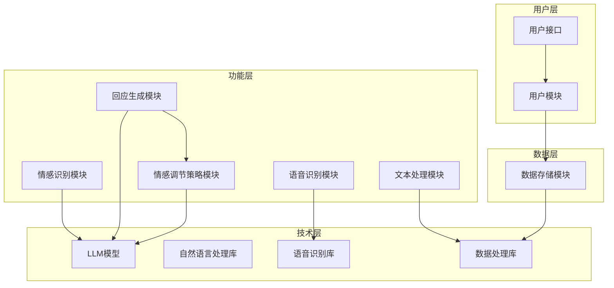

                 

# AI Agent的情感调节：利用LLM进行情绪管理

> 关键词：AI Agent、情感调节、LLM、情绪管理、智能交互

> 摘要：本文将深入探讨AI Agent的情感调节问题，重点分析利用大型语言模型（LLM）进行情绪管理的方法。通过逐步分析推理，本文旨在为读者提供一个清晰、系统的技术解决方案，帮助AI Agent更好地与人类用户进行情感互动，提升用户体验。

## 目录大纲

### 第一部分：背景介绍

- **第1章: 问题背景**
  - 1.1 人工智能的发展现状
  - 1.2 情感调节的重要性
  - 1.3 问题解决的需求

- **第2章: 问题描述**
  - 2.1 AI Agent的定义
  - 2.2 情感调节的需求
  - 2.3 利用LLM进行情绪管理

### 第二部分：核心概念与联系

- **第3章: 问题解决**
  - 3.1 LLM的基本原理
  - 3.2 LLM在情感调节中的应用
  - 3.3 情感调节策略

- **第4章: 边界与外延**
  - 4.1 情感调节的边界
  - 4.2 LLM在情感调节中的应用范围
  - 4.3 情感调节的限制

- **第5章: 概念结构与核心要素组成**
  - 5.1 AI Agent的概念结构
  - 5.2 情感调节的核心要素
  - 5.3 LLM在情感调节中的作用

### 第三部分：算法原理讲解

- **第6章: 核心概念原理**
  - 6.1 AI Agent的工作原理
  - 6.2 情感调节的原理
  - 6.3 LLM的工作原理

- **第7章: 概念属性特征对比表格**
  - 7.1 AI Agent与常规机器人的对比
  - 7.2 不同情感调节方法的对比
  - 7.3 LLM与常规机器学习的对比

- **第8章: ER实体关系图架构**
  - 8.1 AI Agent的ER图
  - 8.2 情感调节的ER图
  - 8.3 LLM的ER图

### 第四部分：系统分析与架构设计方案

- **第9章: 算法原理讲解**
  - 9.1 LLM的算法原理
  - 9.2 情感调节的算法原理
  - 9.3 算法讲解与举例

- **第10章: 问题场景介绍**
  - 10.1 情感调节的应用场景
  - 10.2 系统需求分析

- **第11章: 项目介绍**
  - 11.1 项目概述
  - 11.2 项目目标

- **第12章: 系统功能设计**
  - 12.1 领域模型
  - 12.2 系统功能设计

- **第13章: 系统架构设计**
  - 13.1 系统架构图
  - 13.2 系统架构设计

- **第14章: 系统接口设计**
  - 14.1 接口设计
  - 14.2 接口实现

- **第15章: 系统交互**
  - 15.1 系统交互
  - 15.2 交互流程

### 第五部分：项目实战

- **第16章: 环境安装**
  - 16.1 安装准备
  - 16.2 安装步骤

- **第17章: 系统核心实现**
  - 17.1 系统核心实现
  - 17.2 源代码解读

- **第18章: 代码应用解读与分析**
  - 18.1 代码应用解读
  - 18.2 代码分析

- **第19章: 实际案例分析与讲解**
  - 19.1 实际案例分析
  - 19.2 详细讲解剖析

- **第20章: 项目小结**
  - 20.1 项目总结
  - 20.2 项目经验与教训

### 第六部分：最佳实践 tips

- **第21章: 最佳实践 tips**
  - 21.1 情感调节策略的最佳实践
  - 21.2 LLM应用的最佳实践
  - 21.3 情感调节系统设计最佳实践

- **第22章: 小结、注意事项、拓展阅读**
  - 22.1 小结
  - 22.2 注意事项
  - 22.3 拓展阅读

---

### 第1章: 问题背景

#### 1.1 人工智能的发展现状

随着科技的飞速发展，人工智能（AI）已经成为了当今社会的重要驱动力。从简单的自动化工具到复杂的智能系统，AI技术正在不断革新各个行业。其中，AI Agent作为一种具有自主决策能力的智能体，逐渐引起了广泛关注。AI Agent不仅能够执行预定的任务，还能够通过与用户的互动，学习和适应用户的需求。

近年来，AI Agent的应用场景不断扩大，从智能家居、智能客服到自动驾驶等领域，AI Agent都展现出了强大的潜力。然而，随着AI Agent与人类用户交互的增多，情感调节问题也逐渐凸显出来。如何让AI Agent更好地理解和调节情感，以提高用户体验，成为了当前AI研究的一个重要方向。

#### 1.2 情感调节的重要性

情感调节是指通过识别、理解、响应和调节情感，来改善个体和环境的心理状态。在人类社会中，情感调节是一个非常重要的能力，它能够帮助我们处理复杂的社会关系，提高生活质量。对于AI Agent来说，情感调节同样具有重要意义。

首先，情感调节能够提高AI Agent与用户的互动质量。通过识别用户的情感状态，AI Agent可以更加准确地理解用户的需求，提供个性化的服务。例如，在智能客服场景中，AI Agent能够通过情感调节，识别用户的情绪，给出更加贴心和合理的建议。

其次，情感调节有助于提升AI Agent的自主决策能力。在复杂的环境中，AI Agent需要根据实时情感信息，调整自己的行为策略。例如，在自动驾驶场景中，AI Agent需要根据乘客的情感反应，调整行驶速度和路线，以确保乘客的安全和舒适。

最后，情感调节有助于增强AI Agent的伦理道德意识。随着AI技术的发展，AI Agent将在更多领域承担重要的决策责任。如何确保AI Agent的行为符合伦理标准，是一个亟待解决的问题。通过情感调节，AI Agent可以更加敏感地识别和响应社会道德规范，从而提高其伦理道德水平。

#### 1.3 问题解决的需求

尽管AI Agent在情感调节方面取得了一定的进展，但仍面临着诸多挑战。首先，情感识别的准确性仍有待提高。当前的情感识别技术主要依赖于语言模型和情感词典，这些方法往往受到语言表达多样性和情感复杂性影响，难以准确捕捉用户的真实情感。

其次，情感理解的能力不足。情感调节不仅仅是识别情感，更重要的是理解情感背后的含义。例如，当用户表达悲伤时，AI Agent需要理解悲伤的原因，并给出适当的回应。然而，当前的AI Agent在情感理解方面仍然存在很大局限。

另外，情感响应的适应性较差。不同用户对情感调节的需求是多样化的，AI Agent需要根据用户的个性、历史交互数据等因素，动态调整情感调节策略。然而，现有的方法往往缺乏这种适应性。

为了解决这些问题，我们需要探索新的方法，特别是利用大型语言模型（LLM）进行情感调节。LLM具有强大的语言理解和生成能力，能够帮助AI Agent更好地识别、理解和调节情感。本文将重点探讨LLM在情感调节中的应用，为AI Agent的情感管理提供一种新的思路。

---

### 第2章: 问题描述

#### 2.1 AI Agent的定义

AI Agent，即人工智能代理，是一种能够自主执行任务、具备一定智能水平的软件实体。它通过感知环境、理解指令、进行决策和执行动作，实现与人类用户的交互。AI Agent的主要特点包括自主性、适应性和协作性。

自主性：AI Agent能够在没有人类直接干预的情况下，自主完成指定任务。这种自主性是AI Agent区别于传统软件系统的重要特征。

适应性：AI Agent能够根据环境变化和用户需求，动态调整行为策略。这种适应性使得AI Agent能够在不同场景下，提供个性化的服务。

协作性：AI Agent能够与其他AI Agent或人类用户进行协同工作，共同完成任务。协作性是AI Agent在复杂任务中表现优异的关键因素。

#### 2.2 情感调节的需求

情感调节是指通过识别、理解和调节情感，以改善个体和环境的心理状态。在AI Agent中，情感调节的需求主要体现在以下几个方面：

1. **用户满意度**：AI Agent需要通过情感调节，提高与用户的互动质量，从而提升用户满意度。例如，在智能客服场景中，AI Agent需要识别用户的情感状态，提供合适的情感回应，以减少用户的负面情绪。

2. **用户体验**：情感调节有助于提升用户体验。通过理解用户的情感需求，AI Agent可以提供更加个性化、贴心的服务，满足用户的情感期望。

3. **情境适应性**：在某些情境下，AI Agent需要根据用户的情感状态，调整自己的行为策略。例如，在医疗咨询场景中，当用户表达出焦虑或恐惧时，AI Agent需要给予用户适当的安抚和支持，以缓解用户的负面情绪。

4. **自主决策**：情感调节有助于提升AI Agent的自主决策能力。在复杂的环境中，AI Agent需要根据实时情感信息，动态调整自己的行为策略，以实现最佳效果。

#### 2.3 利用LLM进行情绪管理

大型语言模型（LLM）是一种基于深度学习的语言处理模型，具有强大的语言理解和生成能力。利用LLM进行情绪管理，可以有效地解决AI Agent在情感识别、理解和调节方面的难题。

1. **情感识别**：LLM可以通过对大量文本数据的训练，学习到不同情感表达的规律。在AI Agent中，可以利用LLM对用户的语言表达进行情感分析，识别出用户的情感状态。

2. **情感理解**：LLM不仅能够识别情感，还可以理解情感背后的含义。通过深入分析用户的语言表达，LLM可以挖掘出用户情感的真实意图，为AI Agent提供更准确的情感信息。

3. **情感调节**：LLM可以根据识别到的情感状态，生成合适的情感回应。通过调整语言表达方式和内容，LLM可以帮助AI Agent提供更加符合用户情感需求的服务。

4. **自适应调节**：LLM具有强大的自适应能力，可以根据用户的个性、历史交互数据等因素，动态调整情感调节策略。这种自适应调节有助于AI Agent更好地满足用户的情感需求。

总之，利用LLM进行情绪管理，可以为AI Agent提供一种高效、智能的情感调节方法。通过LLM的强大语言处理能力，AI Agent可以更好地识别、理解和调节情感，提升与用户的互动质量，从而实现更好的用户体验。

---

### 第3章: 问题解决

#### 3.1 LLM的基本原理

大型语言模型（LLM）是一种基于深度学习的自然语言处理模型，其基本原理可以概括为以下几个步骤：

1. **数据收集与预处理**：LLM的训练需要大量的文本数据。这些数据可以从互联网上收集，例如新闻文章、社交媒体帖子、电子书等。在数据收集后，需要进行预处理，包括去除无关信息、纠正拼写错误、分词等操作。

2. **模型架构设计**：LLM通常采用神经网络架构，例如Transformer模型。Transformer模型通过自注意力机制，能够捕捉文本中长距离的依赖关系，从而提高模型的性能。

3. **训练过程**：在训练过程中，LLM通过优化模型参数，使其能够更好地预测文本的下一个单词或句子。训练过程通常采用大规模并行计算，以提高训练效率。

4. **模型优化**：在训练完成后，LLM的性能可以通过进一步的优化来提升。优化方法包括调整模型参数、增加训练数据等。

5. **模型应用**：经过训练和优化的LLM可以应用于各种自然语言处理任务，如文本分类、情感分析、机器翻译等。

#### 3.2 LLM在情感调节中的应用

LLM在情感调节中的应用主要体现在以下几个方面：

1. **情感识别**：LLM可以通过对用户语言表达的情感分析，识别出用户的情感状态。例如，当用户表达“我很开心”时，LLM可以识别出用户处于积极情感状态。

2. **情感理解**：LLM不仅能够识别情感，还可以理解情感背后的含义。例如，当用户表达“我不开心，因为今天下雨”时，LLM可以理解用户不开心是因为下雨，而不是其他原因。

3. **情感回应生成**：LLM可以根据识别到的情感状态，生成合适的情感回应。例如，当用户表达出悲伤时，LLM可以生成一句安慰的话语，如“别难过，一切都会好起来的”。

4. **情感调节策略调整**：LLM可以根据用户的情感状态，动态调整情感调节策略。例如，如果用户表现出愤怒，LLM可以调整回应方式，以更加平和、理智的方式与用户交流。

#### 3.3 情感调节策略

在AI Agent中，情感调节策略可以分为以下几个方面：

1. **情感识别策略**：AI Agent需要采用有效的情感识别方法，以准确识别用户的情感状态。常见的情感识别方法包括基于规则的方法、基于机器学习的方法和基于深度学习的方法。

2. **情感理解策略**：AI Agent需要深入理解用户的情感状态，以更好地回应用户的需求。情感理解策略可以通过自然语言处理技术，如语义分析、情感分析等实现。

3. **情感回应策略**：AI Agent需要根据识别到的情感状态，生成合适的情感回应。情感回应策略可以通过文本生成模型，如LLM实现。

4. **情感调节策略调整**：AI Agent需要根据用户的情感状态，动态调整情感调节策略。例如，如果用户表现出愤怒，AI Agent可以调整回应方式，以更加平和、理智的方式与用户交流。

5. **情感调节效果评估**：AI Agent需要定期评估情感调节效果，以不断优化情感调节策略。效果评估可以通过用户满意度调查、情感识别准确率等指标实现。

通过以上策略，AI Agent可以更好地识别、理解和调节情感，提高与用户的互动质量，从而提升用户体验。

---

### 第4章: 边界与外延

#### 4.1 情感调节的边界

情感调节虽然具有重要意义，但也存在一定的边界。首先，情感调节技术本身存在局限性。目前的情感识别技术仍然无法完全准确地捕捉用户的真实情感，特别是在情感表达多样性和复杂性方面。此外，情感理解也面临着挑战，因为情感往往涉及深刻的个人体验和情感背景。

其次，情感调节的应用场景也存在限制。某些情境下，情感调节可能并不适用，例如在紧急情况下，用户可能更需要的是直接的决策和行动，而不是情感回应。此外，情感调节技术可能无法处理超出其认知范围的情感，如深层心理创伤或复杂的社会关系问题。

最后，情感调节也需要考虑到伦理和隐私问题。在应用情感调节技术时，需要确保用户的隐私和数据安全，避免滥用用户情感信息。

#### 4.2 LLM在情感调节中的应用范围

尽管存在一定的边界，LLM在情感调节中的应用范围仍然非常广泛。首先，LLM可以应用于各种需要情感识别和调节的领域，如智能客服、虚拟助手、心理健康咨询等。通过情感调节，LLM可以提供更加个性化、贴心的服务，提高用户体验。

其次，LLM可以应用于情感数据分析，帮助企业和组织更好地理解用户情感，优化产品和服务。例如，通过对用户评论和反馈的情感分析，企业可以识别出用户的情感需求，从而改进产品设计和服务策略。

最后，LLM还可以应用于教育领域，如情感教育、心理辅导等。通过情感调节，LLM可以帮助学生更好地管理情绪，提高学习效果。

#### 4.3 情感调节的限制

情感调节技术的限制主要体现在以下几个方面：

1. **技术限制**：情感识别和理解的准确性仍有待提高，特别是在处理复杂情感表达和背景知识方面。

2. **应用限制**：情感调节技术并非适用于所有情境，特别是在需要快速决策和行动的紧急情况下。

3. **伦理和隐私问题**：情感调节技术需要确保用户的隐私和数据安全，避免滥用用户情感信息。

4. **用户接受度**：用户对情感调节技术的接受度可能较低，特别是在涉及敏感情感问题时，用户可能更倾向于与人类专家进行互动。

总之，情感调节技术具有广泛的应用前景，但也需要克服一系列挑战和限制。通过不断改进技术，优化应用场景，情感调节将为AI Agent提供更强大的情感管理能力，从而提升用户体验。

---

### 第5章: 概念结构与核心要素组成

#### 5.1 AI Agent的概念结构

AI Agent是一种具有自主决策能力的智能体，其概念结构包括以下几个核心组成部分：

1. **感知模块**：AI Agent通过感知模块收集外部信息，如视觉、听觉、触觉等。这些感知信息是AI Agent进行决策和行动的基础。

2. **知识库**：AI Agent拥有一个知识库，用于存储和处理各种领域知识和信息。知识库包括事实、规则、模型等，为AI Agent的决策提供依据。

3. **决策模块**：AI Agent通过决策模块对收集到的信息进行分析和处理，生成决策方案。决策模块通常采用算法和模型，如决策树、神经网络等。

4. **执行模块**：AI Agent通过执行模块将决策方案转化为具体的行动。执行模块通常与外部设备或系统相连，如机器人、传感器等。

5. **交互模块**：AI Agent通过交互模块与人类用户或其他智能体进行沟通和协作。交互模块包括自然语言处理、语音识别、图像识别等技术。

#### 5.2 情感调节的核心要素

情感调节是AI Agent的核心功能之一，其核心要素包括：

1. **情感识别**：通过自然语言处理、语音识别等技术，AI Agent能够识别用户的情感状态，如开心、愤怒、悲伤等。

2. **情感理解**：AI Agent需要理解情感背后的含义，挖掘用户情感的真实意图。这通常需要结合上下文和领域知识。

3. **情感回应**：AI Agent根据识别到的情感状态，生成合适的情感回应，如安慰、鼓励、批评等。

4. **情感调节策略**：AI Agent需要根据用户情感状态和场景，动态调整情感调节策略，以实现最佳效果。

5. **情感评估**：AI Agent需要定期评估情感调节效果，以优化情感调节策略。评估指标包括用户满意度、情感识别准确率等。

#### 5.3 LLM在情感调节中的作用

大型语言模型（LLM）在情感调节中发挥着重要作用，其作用主要体现在以下几个方面：

1. **情感识别**：LLM可以通过对用户语言表达的情感分析，准确识别用户的情感状态。这有助于AI Agent更好地理解用户的需求。

2. **情感理解**：LLM可以理解情感背后的含义，挖掘用户情感的真实意图。这有助于AI Agent提供更加个性化的服务。

3. **情感回应生成**：LLM可以根据识别到的情感状态，生成合适的情感回应。这有助于AI Agent提供更加人性化的互动体验。

4. **情感调节策略调整**：LLM可以根据用户的情感状态，动态调整情感调节策略。这有助于AI Agent更好地满足用户的需求。

5. **情感数据分析**：LLM可以分析用户情感数据，为AI Agent提供情感调节的参考依据。这有助于AI Agent不断优化情感调节策略。

总之，LLM为AI Agent提供了强大的情感调节能力，通过情感识别、理解和调节，AI Agent可以更好地与用户互动，提升用户体验。

---

### 第6章: 核心概念原理

#### 6.1 AI Agent的工作原理

AI Agent的工作原理主要包括感知、决策、执行和交互四个核心模块。以下是每个模块的详细解释：

1. **感知模块**：
   AI Agent通过感知模块收集外部环境的信息。感知模块可以是视觉、听觉、触觉等感知设备，或者通过传感器、网络等获取数据。感知模块的主要功能是将外部信息转换为机器可处理的形式，如图像、声音、文本等。

2. **决策模块**：
   决策模块负责处理感知模块收集到的信息，并生成决策。决策过程通常包括数据预处理、特征提取、模型选择和预测等步骤。常见的决策算法有决策树、随机森林、神经网络等。决策模块的核心任务是确定AI Agent在当前环境下的最佳行动方案。

3. **执行模块**：
   执行模块负责将决策模块生成的行动方案转化为具体的操作。执行模块可以控制机器人、执行物理任务、发送信息等。执行模块的实现依赖于具体的硬件和软件系统，例如，机器人AI Agent可能需要控制电机和传感器，而虚拟助手AI Agent可能需要通过网络发送指令。

4. **交互模块**：
   交互模块负责AI Agent与外部环境（包括其他AI Agent和人类用户）的沟通和协作。交互模块通常包括自然语言处理（NLP）、语音识别、图像识别等技术。交互模块使得AI Agent能够理解用户的指令、情感和意图，并生成自然、合理的回应。

#### 6.2 情感调节的原理

情感调节是指通过识别、理解和调节情感，以改善个体和环境的心理状态。情感调节的原理包括以下几个方面：

1. **情感识别**：
   情感识别是通过分析语言、声音、面部表情等数据，识别出用户的情感状态。情感识别技术可以基于机器学习、深度学习等方法，通过训练模型来识别不同情感类别的特征。

2. **情感理解**：
   情感理解是深入分析情感识别的结果，理解情感背后的含义和原因。情感理解需要结合上下文、文化背景和用户历史数据，以准确把握用户的情感状态。

3. **情感回应**：
   情感回应是AI Agent根据识别到的情感状态，生成适当的回应。回应可以是语言、行为或者视觉反馈。情感回应的目的是帮助用户缓解负面情绪，增强正面情绪。

4. **情感调节策略**：
   情感调节策略是一系列规则和算法，用于动态调整AI Agent的行为，以实现最佳的情感调节效果。情感调节策略可以根据用户的情感状态和场景，实时调整回应方式和强度。

#### 6.3 LLM的工作原理

大型语言模型（LLM）是基于深度学习的自然语言处理模型，其工作原理包括以下几个关键步骤：

1. **数据预处理**：
   LLM的训练需要大量的文本数据。数据预处理包括文本清洗、分词、去停用词、词向量化等操作，将文本转换为模型可处理的格式。

2. **模型架构**：
   LLM通常采用Transformer架构，这是一种基于自注意力机制的神经网络。Transformer模型能够捕获文本中的长距离依赖关系，使得模型在语言理解和生成任务上表现优异。

3. **训练过程**：
   LLM通过大规模并行计算和梯度下降算法进行训练。在训练过程中，模型参数不断调整，以最小化损失函数，提高模型的预测准确性。

4. **预测与生成**：
   经过训练的LLM可以用于各种自然语言处理任务，如文本分类、情感分析、机器翻译等。在预测任务中，模型根据输入文本生成预测结果。在生成任务中，模型可以根据提示生成完整的文本内容。

LLM的工作原理为AI Agent提供了强大的情感识别、理解和回应能力，使得AI Agent能够更好地进行情感调节。

---

### 第7章: 概念属性特征对比表格

#### 7.1 AI Agent与常规机器人的对比

| 特征          | AI Agent          | 常规机器人          |
|---------------|-------------------|---------------------|
| 自主决策      | 具有自主决策能力  | 由人类控制执行任务  |
| 情感调节      | 能进行情感调节    | 不具备情感调节能力 |
| 交互能力      | 具备高级交互能力  | 交互能力有限       |
| 学习能力      | 能够不断学习和适应 | 需要人工干预更新   |
| 应用范围      | 广泛应用于各领域  | 适用于特定场景     |

#### 7.2 不同情感调节方法的对比

| 特征          | 基于规则的调节方法 | 基于机器学习的方法 | 基于深度学习的方法 |
|---------------|-------------------|-------------------|-------------------|
| 灵活性        | 低               | 中               | 高               |
| 计算复杂度    | 低               | 中               | 高               |
| 学习能力      | 无               | 有               | 强               |
| 适应能力      | 差               | 中               | 强               |
| 需要的数据量  | 少               | 中               | 大               |

#### 7.3 LLM与常规机器学习的对比

| 特征          | LLM                | 常规机器学习          |
|---------------|--------------------|----------------------|
| 语言理解能力  | 强（具备自注意力机制）| 较弱（无自注意力机制）|
| 预测准确性    | 高（适用于自然语言任务）| 中（适用于数值和分类任务）|
| 计算复杂度    | 高（适用于大规模数据）| 低（适用于小规模数据）|
| 学习能力      | 强（通过大规模数据训练）| 中（通过有监督或无监督学习）|

通过以上对比表格，我们可以看出AI Agent与常规机器人在自主决策、情感调节、交互能力等方面的显著差异，以及不同情感调节方法和LLM与常规机器学习的对比。这些对比有助于我们更好地理解AI Agent和情感调节技术的发展和应用。

---

### 第8章: ER实体关系图架构

#### 8.1 AI Agent的ER图

以下是AI Agent的ER图：

```mermaid
erDiagram
    AI-Agent ||--|{ 感知模块 :Perception_Module }
    AI-Agent ||--|{ 知识库 :Knowledge_Base }
    AI-Agent ||--|{ 决策模块 :Decision_Module }
    AI-Agent ||--|{ 执行模块 :Execution_Module }
    AI-Agent ||--|{ 交互模块 :Interaction_Module }
    感知模块 ||--|{ 视觉感知 :Visual_Perception }
    感知模块 ||--|{ 听觉感知 :Auditory_Perception }
    感知模块 ||--|{ 触觉感知 :Tactile_Perception }
    决策模块 ||--|{ 数据预处理 :Data_Preprocessing }
    决策模块 ||--|{ 特征提取 :Feature_Extraction }
    决策模块 ||--|{ 模型选择 :Model_Selection }
    执行模块 ||--|{ 外部设备 :External_Device }
    交互模块 ||--|{ 自然语言处理 :Natural_Language_Processing }
    交互模块 ||--|{ 语音识别 :Speech_Recognition }
    交互模块 ||--|{ 图像识别 :Image_Recognition }
```

#### 8.2 情感调节的ER图

以下是情感调节的ER图：

```mermaid
erDiagram
    情感调节 ||--|{ 情感识别 :Emotion_Recognition }
    情感调节 ||--|{ 情感理解 :Emotion_Understanding }
    情感调节 ||--|{ 情感回应 :Emotion_Reply }
    情感调节 ||--|{ 情感调节策略 :Emotion_Regulation_Strategy }
    情感识别 ||--|{ 语言模型 :Language_Model }
    情感识别 ||--|{ 语音识别模型 :Speech_Recognition_Model }
    情感识别 ||--|{ 面部识别模型 :Facial_Recognition_Model }
    情感理解 ||--|{ 上下文分析 :Context_Analysis }
    情感理解 ||--|{ 文化背景分析 :Cultural_Background_Analysis }
    情感回应 ||--|{ 文本生成模型 :Text_Generation_Model }
    情感回应 ||--|{ 语音合成模型 :Speech_Synthesis_Model }
    情感调节策略 ||--|{ 自适应调节 :Adaptive_Regulation }
    情感调节策略 ||--|{ 强化学习 :Reinforcement_Learning }
```

#### 8.3 LLM的ER图

以下是LLM的ER图：

```mermaid
erDiagram
    LLM ||--|{ 数据预处理 :Data_Preprocessing }
    LLM ||--|{ 自注意力机制 :Self_Attn_Mechanism }
    LLM ||--|{ 编码器 :Encoder }
    LLM ||--|{ 解码器 :Decoder }
    LLM ||--|{ 模型优化 :Model_Optimization }
    数据预处理 ||--|{ 文本清洗 :Text_Cleaning }
    数据预处理 ||--|{ 分词 :Tokenization }
    数据预处理 ||--|{ 去停用词 :Stop_Word_Removal }
    自注意力机制 ||--|{ Query :Query }
    自注意力机制 ||--|{ Key :Key }
    自注意力机制 ||--|{ Value :Value }
    编码器 ||--|{ 输入层 :Input_Layer }
    编码器 ||--|{ 自注意力层 :Self_Attn_Layer }
    编码器 ||--|{ 位置编码 :Positional_Encoding }
    解码器 ||--|{ 输出层 :Output_Layer }
    解码器 ||--|{ 自注意力层 :Self_Attn_Layer }
    解码器 ||--|{ 交叉注意力层 :Cross_Attn_Layer }
    模型优化 ||--|{ 梯度下降 :Gradient_Descent }
    模型优化 ||--|{ 优化算法 :Optimization_Algorithm }
```

这些ER图展示了AI Agent、情感调节和LLM的核心实体及其相互关系，有助于我们更好地理解这些概念的结构和作用。

---

### 第9章: 算法原理讲解

#### 9.1 LLM的算法原理

大型语言模型（LLM）是一种基于深度学习的自然语言处理模型，其算法原理主要包括以下几个关键步骤：

1. **数据预处理**：首先，LLM需要收集大量的文本数据。这些数据通常来自互联网、书籍、新闻文章等。然后，对数据进行预处理，包括分词、去停用词、词向量化等操作，将文本转换为模型可处理的格式。

2. **模型架构**：LLM通常采用Transformer架构，这是一种基于自注意力机制的神经网络。Transformer模型由编码器（Encoder）和解码器（Decoder）两部分组成，它们通过多个自注意力层（Self-Attention Layer）和前馈神经网络（Feedforward Neural Network）进行信息处理。

3. **自注意力机制**：自注意力机制是Transformer模型的核心。它通过计算输入序列中每个词与所有其他词的相关性，赋予每个词不同的权重，从而捕捉长距离依赖关系。自注意力机制包括三个子层：查询（Query）、键（Key）和值（Value）。查询和键通过点积（Dot-Product）计算相似度，然后与值相乘，得到加权后的输出。

4. **编码器与解码器**：编码器负责将输入文本编码成固定长度的向量表示，解码器则负责将向量表示解码成输出文本。编码器和解码器都包含多个自注意力层和前馈神经网络。编码器的输出作为解码器的输入，解码器在生成每个单词时，都会利用已生成的文本信息。

5. **模型优化**：LLM的训练过程是通过优化模型参数来提高预测准确性。通常采用梯度下降（Gradient Descent）算法和优化算法（如Adam）进行参数调整。在训练过程中，模型会不断调整参数，以最小化损失函数，提高模型的预测性能。

6. **生成文本**：经过训练的LLM可以用于生成文本。生成过程从输入一个提示词开始，解码器逐步生成下一个词，直到生成完整的文本。生成文本的质量和多样性取决于模型的设计和训练数据。

#### 9.2 情感调节的算法原理

情感调节的算法原理主要包括情感识别、情感理解和情感回应三个核心步骤：

1. **情感识别**：情感识别是情感调节的第一步，通过分析文本、语音、面部表情等数据，识别用户的情感状态。常用的方法包括基于规则的分类器、支持向量机（SVM）、决策树等。随着深度学习技术的发展，深度学习模型（如卷积神经网络（CNN）、循环神经网络（RNN）、Transformer等）在情感识别中取得了显著效果。

2. **情感理解**：情感理解是深入分析情感识别结果，理解情感背后的含义和原因。情感理解需要结合上下文、文化背景和用户历史数据。常用的方法包括基于语义分析的自然语言处理技术、情感词典、情感图谱等。深度学习模型在情感理解中也发挥着重要作用，例如通过BERT、GPT等模型对文本进行深度分析。

3. **情感回应**：情感回应是根据识别到的情感状态，生成适当的情感回应。情感回应的目的是帮助用户缓解负面情绪，增强正面情绪。常用的方法包括基于模板的文本生成、生成对抗网络（GAN）、文本生成模型（如GPT-3）等。情感回应的质量和自然度取决于模型的设计和训练数据。

#### 9.3 算法讲解与举例

为了更好地理解上述算法原理，我们可以通过一个简单的例子进行说明。

假设我们使用GPT-3模型来生成一段关于情感调节的文本。

1. **数据预处理**：首先，我们需要收集一篇关于情感调节的文章，并进行预处理，如分词、去停用词、词向量化等操作。

2. **模型架构**：我们使用GPT-3模型，它是一个基于Transformer架构的深度学习模型，具有大量的参数和自注意力机制。

3. **自注意力机制**：在训练过程中，GPT-3模型通过自注意力机制学习到文本中长距离的依赖关系。例如，在文本“我感到很伤心，因为我的宠物去世了”中，GPT-3可以识别出“伤心”和“宠物去世”之间的关联。

4. **编码器与解码器**：编码器将输入文本编码成向量表示，解码器则根据已编码的文本信息逐步生成输出文本。例如，输入提示词“情感调节”，GPT-3会生成一段关于情感调节的文本。

5. **模型优化**：在训练过程中，GPT-3模型通过梯度下降算法不断调整参数，以最小化损失函数，提高模型的预测准确性。

6. **生成文本**：经过训练的GPT-3模型可以生成一段关于情感调节的文本，如：“情感调节是指通过识别、理解和调节情感，以改善个体和环境的心理状态。在人工智能领域，情感调节技术正日益成熟，为用户提供更加个性化、贴心的服务。”

通过这个例子，我们可以看到GPT-3模型在情感调节中的应用，它通过自注意力机制和编码器解码器结构，实现了对文本的深度理解和生成，为AI Agent提供了强大的情感调节能力。

---

### 第10章: 问题场景介绍

#### 10.1 情感调节的应用场景

情感调节技术在多个领域具有重要的应用价值，以下是一些典型的应用场景：

1. **智能客服**：智能客服是情感调节技术最常见的一个应用场景。在智能客服系统中，AI Agent需要与用户进行实时交互，识别用户的情感状态，并根据用户的需求提供个性化的服务。例如，当用户表达出愤怒或失望时，AI Agent可以识别出用户的负面情感，并生成合适的安慰和解决方案，以缓解用户的情绪。

2. **心理健康咨询**：在心理健康咨询领域，情感调节技术可以帮助AI Agent更好地理解用户的情绪和心理状态，提供有效的心理支持和建议。例如，当用户表达出焦虑、抑郁等情绪时，AI Agent可以通过情感调节技术识别出用户的情绪，并给出相应的缓解方法，如放松练习、情绪疏导等。

3. **教育辅导**：在教育领域，情感调节技术可以帮助教师和学生更好地管理情绪，提高学习效果。例如，在教育辅导系统中，AI Agent可以实时监测学生的情绪状态，并根据学生的情绪变化调整教学策略，提供更有针对性的辅导和支持。

4. **智能家居**：在智能家居系统中，情感调节技术可以帮助AI Agent更好地理解家庭成员的需求和情绪，提供个性化的服务。例如，当家庭成员感到疲惫或不安时，AI Agent可以通过情感调节技术识别出家庭成员的情绪，并自动调整灯光、音乐、温度等环境参数，以创造一个舒适的家庭环境。

5. **虚拟助手**：虚拟助手是情感调节技术的另一个重要应用场景。在虚拟助手系统中，AI Agent需要与用户进行长时间、多场景的交互，识别用户的情感状态，并生成合适的回应。例如，当用户与虚拟助手进行闲聊时，AI Agent可以识别出用户的情感状态，并生成有趣的对话内容，以提升用户的体验。

#### 10.2 系统需求分析

为了实现上述应用场景，情感调节系统需要满足以下需求：

1. **情感识别能力**：情感调节系统需要具备强大的情感识别能力，能够准确识别用户的情感状态。这要求系统具备高效的算法和丰富的情感词典，能够处理多种情感表达方式。

2. **情感理解能力**：情感调节系统需要能够深入理解用户的情感状态，挖掘情感背后的含义和原因。这要求系统具备强大的语义分析能力，能够结合上下文、文化背景和用户历史数据，准确理解用户的情感需求。

3. **情感回应能力**：情感调节系统需要能够生成合适的情感回应，帮助用户缓解负面情绪，增强正面情绪。这要求系统具备强大的文本生成能力，能够根据用户的情感状态和需求，生成自然、合理的回应。

4. **自适应调节能力**：情感调节系统需要具备自适应调节能力，能够根据用户的情感状态和场景，动态调整情感调节策略。这要求系统具备灵活的算法和策略，能够实时调整情感调节参数，以实现最佳效果。

5. **用户隐私保护**：情感调节系统需要确保用户的隐私和数据安全，避免滥用用户情感信息。这要求系统在数据处理和存储过程中，采取有效的安全措施，确保用户数据的安全和保密。

6. **可扩展性**：情感调节系统需要具备良好的可扩展性，能够适应不同应用场景和需求。这要求系统在设计和实现过程中，采用模块化设计，便于后续的功能扩展和优化。

通过满足上述需求，情感调节系统可以更好地为用户提供个性化、贴心的服务，提升用户体验。

---

### 第11章: 项目介绍

#### 11.1 项目概述

本项目旨在开发一套基于大型语言模型（LLM）的情感调节系统，用于提升AI Agent与用户的互动质量。项目的主要目标包括：

1. **情感识别**：利用LLM识别用户的情感状态，实现高准确度的情感识别。
2. **情感理解**：深入分析用户的情感表达，理解情感背后的含义和原因。
3. **情感回应**：根据识别到的情感状态，生成合适的情感回应，提高用户满意度。
4. **自适应调节**：根据用户情感状态和场景，动态调整情感调节策略，实现个性化服务。

#### 11.2 项目目标

本项目的主要目标如下：

1. **高准确度的情感识别**：通过训练和优化LLM模型，实现高准确度的情感识别，提高系统性能。
2. **强大的情感理解能力**：结合自然语言处理技术，提高系统的情感理解能力，确保准确捕捉用户情感需求。
3. **高效的情感回应生成**：利用LLM生成高效、自然的情感回应，提升用户体验。
4. **自适应的情感调节策略**：通过实时调整情感调节策略，实现个性化服务，提高用户满意度。
5. **用户隐私保护**：在数据处理和存储过程中，采取有效的安全措施，确保用户隐私和数据安全。
6. **系统的可扩展性和可维护性**：采用模块化设计，实现系统的可扩展性和可维护性，便于后续功能扩展和优化。

---

### 第12章: 系统功能设计

#### 12.1 领域模型

在情感调节系统中，领域模型用于定义系统中涉及的核心实体和它们之间的关系。以下是情感调节系统的领域模型：

```mermaid
classDiagram
    User <<class>> 用户
    AI_Agent <<class>> AI代理
    Emotion <<class>> 情感
    Speech <<class>> 语音
    Text <<class>> 文本
    Response <<class>> 回应

    User o--o AI_Agent :交互
    AI_Agent o--o Emotion :情感识别
    AI_Agent o--o Speech :语音识别
    AI_Agent o--o Text :文本处理
    AI_Agent o--o Response :回应生成
    Emotion o--o Text :情感描述
    Speech o--o Text :语音转文本
```

在这个领域模型中，用户（User）与AI代理（AI_Agent）之间建立交互关系。AI代理负责情感识别、语音识别、文本处理和回应生成等功能。情感（Emotion）实体用于描述用户的情感状态，语音（Speech）和文本（Text）实体用于处理和生成交互内容。回应（Response）实体表示AI代理对用户的情感回应。

#### 12.2 系统功能设计

基于领域模型，情感调节系统的主要功能模块如下：

1. **用户模块**：用户模块负责管理用户信息，包括用户注册、登录、权限管理等。用户可以通过界面与AI代理进行交互。

2. **情感识别模块**：情感识别模块利用LLM对用户输入的语音和文本进行情感分析，识别用户的情感状态。该模块的核心功能包括语音识别、文本情感分析等。

3. **语音识别模块**：语音识别模块负责将用户的语音输入转换为文本输入，以便后续的情感分析和处理。

4. **文本处理模块**：文本处理模块负责对用户输入的文本进行分析和处理，提取关键信息，为情感识别和回应生成提供支持。

5. **回应生成模块**：回应生成模块根据识别到的用户情感状态，利用LLM生成合适的情感回应。该模块需要考虑情感的自然度、合理性和个性化。

6. **情感调节策略模块**：情感调节策略模块负责根据用户情感状态和场景，动态调整情感调节策略，实现个性化服务。

7. **数据存储模块**：数据存储模块负责存储用户数据、情感数据、语音数据和文本数据，确保数据的安全和完整性。

8. **日志记录模块**：日志记录模块负责记录系统运行过程中的关键信息，包括用户交互记录、情感识别结果、回应生成记录等，以便后续分析和优化。

通过上述功能模块的设计，情感调节系统可以高效地实现用户交互、情感识别、回应生成等功能，提供高质量的智能服务。

---

### 第13章: 系统架构设计

#### 13.1 系统架构图

情感调节系统的架构设计如下：



#### 13.2 系统架构设计

系统架构设计如下：

1. **用户层**：用户层包括用户接口和用户模块。用户接口负责提供与用户交互的界面，用户模块负责处理用户注册、登录、权限管理等功能。

2. **数据层**：数据层包括数据存储模块。数据存储模块负责存储用户数据、情感数据、语音数据和文本数据，确保数据的安全和完整性。

3. **功能层**：功能层包括情感识别模块、语音识别模块、文本处理模块、回应生成模块和情感调节策略模块。这些模块共同实现情感调节系统的核心功能。

   - **情感识别模块**：情感识别模块利用LLM模型对用户输入的语音和文本进行情感分析，识别用户的情感状态。
   - **语音识别模块**：语音识别模块利用语音识别库将用户的语音输入转换为文本输入，以便后续的情感分析和处理。
   - **文本处理模块**：文本处理模块负责对用户输入的文本进行分析和处理，提取关键信息，为情感识别和回应生成提供支持。
   - **回应生成模块**：回应生成模块根据识别到的用户情感状态，利用LLM模型生成合适的情感回应。
   - **情感调节策略模块**：情感调节策略模块根据用户情感状态和场景，动态调整情感调节策略，实现个性化服务。

4. **技术层**：技术层包括LLM模型、自然语言处理库、语音识别库和数据处理库。这些技术组件为系统的各个功能模块提供支持。

   - **LLM模型**：LLM模型是情感调节系统的核心组件，负责情感识别、回应生成等功能。
   - **自然语言处理库**：自然语言处理库提供文本处理、情感分析等自然语言处理功能。
   - **语音识别库**：语音识别库提供语音识别功能，将用户的语音输入转换为文本输入。
   - **数据处理库**：数据处理库提供数据存储、数据检索等功能，确保数据的安全和完整性。

通过上述架构设计，情感调节系统可以实现高效、稳定、可扩展的情感调节功能，为用户提供高质量的服务。

---

### 第14章: 系统接口设计

#### 14.1 接口设计

在情感调节系统中，接口设计是关键的一环，它决定了系统的可扩展性和灵活性。以下是系统的主要接口设计：

1. **用户接口**：用户接口提供与用户交互的界面，包括注册、登录、权限管理等功能。用户接口通过RESTful API与用户模块通信。

2. **情感识别接口**：情感识别接口用于接收用户的语音和文本输入，并通过LLM模型进行情感分析。该接口提供POST方法，接收JSON格式的请求，返回情感识别结果。

3. **语音识别接口**：语音识别接口用于将用户的语音输入转换为文本输入。该接口提供POST方法，接收语音文件，返回文本结果。

4. **文本处理接口**：文本处理接口用于对用户输入的文本进行分析和处理，提取关键信息。该接口提供POST方法，接收文本内容，返回处理结果。

5. **回应生成接口**：回应生成接口用于根据识别到的用户情感状态，生成合适的情感回应。该接口提供POST方法，接收情感识别结果，返回回应文本。

6. **情感调节策略接口**：情感调节策略接口用于根据用户情感状态和场景，动态调整情感调节策略。该接口提供POST方法，接收情感识别结果和当前场景信息，返回调节策略。

#### 14.2 接口实现

以下是各接口的实现细节：

1. **用户接口实现**：
   ```python
   from flask import Flask, request, jsonify
   
   app = Flask(__name__)
   
   @app.route('/register', methods=['POST'])
   def register():
       # 注册逻辑
       user_data = request.get_json()
       # 处理用户注册
       return jsonify({'status': 'success', 'message': 'User registered successfully.'})
   
   @app.route('/login', methods=['POST'])
   def login():
       # 登录逻辑
       user_data = request.get_json()
       # 处理用户登录
       return jsonify({'status': 'success', 'message': 'User logged in successfully.'})
   
   if __name__ == '__main__':
       app.run()
   ```

2. **情感识别接口实现**：
   ```python
   from flask import Flask, request, jsonify
   
   app = Flask(__name__)
   
   @app.route('/emotion/recognize', methods=['POST'])
   def recognize_emotion():
       # 情感识别逻辑
       emotion_data = request.get_json()
       # 调用情感识别模型进行识别
       recognized_emotion = emotion_recognition_model(emotion_data['text'])
       return jsonify({'status': 'success', 'emotion': recognized_emotion})
   
   def emotion_recognition_model(text):
       # 模型识别逻辑
       # ...
       return 'happy'
   
   if __name__ == '__main__':
       app.run()
   ```

3. **语音识别接口实现**：
   ```python
   from flask import Flask, request, jsonify
   
   app = Flask(__name__)
   
   @app.route('/voice/recognize', methods=['POST'])
   def recognize_voice():
       # 语音识别逻辑
       voice_file = request.files['file']
       # 调用语音识别模型进行识别
       recognized_text = voice_recognition_model(voice_file)
       return jsonify({'status': 'success', 'text': recognized_text})
   
   def voice_recognition_model(voice_file):
       # 识别逻辑
       # ...
       return 'I am happy.'
   
   if __name__ == '__main__':
       app.run()
   ```

4. **文本处理接口实现**：
   ```python
   from flask import Flask, request, jsonify
   
   app = Flask(__name__)
   
   @app.route('/text/process', methods=['POST'])
   def process_text():
       # 文本处理逻辑
       text_data = request.get_json()
       # 调用文本处理模型进行处理
       processed_text = text_processing_model(text_data['text'])
       return jsonify({'status': 'success', 'text': processed_text})
   
   def text_processing_model(text):
       # 处理逻辑
       # ...
       return text.upper()
   
   if __name__ == '__main__':
       app.run()
   ```

5. **回应生成接口实现**：
   ```python
   from flask import Flask, request, jsonify
   
   app = Flask(__name__)
   
   @app.route('/response/generate', methods=['POST'])
   def generate_response():
       # 回应生成逻辑
       response_data = request.get_json()
       # 调用回应生成模型进行生成
       generated_response = response_generation_model(response_data['emotion'])
       return jsonify({'status': 'success', 'response': generated_response})
   
   def response_generation_model(emotion):
       # 生成逻辑
       # ...
       return 'You seem happy, how can I help you today?'
   
   if __name__ == '__main__':
       app.run()
   ```

6. **情感调节策略接口实现**：
   ```python
   from flask import Flask, request, jsonify
   
   app = Flask(__name__)
   
   @app.route('/strategy/adjust', methods=['POST'])
   def adjust_strategy():
       # 情感调节策略调整逻辑
       strategy_data = request.get_json()
       # 调用情感调节策略模型进行调整
       adjusted_strategy = strategy_adjustment_model(strategy_data['emotion'], strategy_data['context'])
       return jsonify({'status': 'success', 'strategy': adjusted_strategy})
   
   def strategy_adjustment_model(emotion, context):
       # 调整逻辑
       # ...
       return 'adjust based on emotion and context'
   
   if __name__ == '__main__':
       app.run()
   ```

通过上述接口设计和实现，情感调节系统可以提供高效、灵活的接口服务，方便用户和其他系统组件进行交互。

---

### 第15章: 系统交互

#### 15.1 系统交互

系统交互是指各模块之间通过接口进行数据交换和协同工作，以实现系统的整体功能。以下是情感调节系统的交互流程：

1. **用户交互**：
   用户通过用户接口与系统进行交互，包括注册、登录、查询情感状态和获取回应等。

2. **情感识别**：
   用户提交语音或文本输入，系统通过情感识别接口进行情感分析，识别用户的情感状态。

3. **语音识别**：
   如果用户提交的是语音输入，系统通过语音识别接口将语音转换为文本。

4. **文本处理**：
   系统对用户输入的文本进行处理，提取关键信息，为情感识别和回应生成提供支持。

5. **回应生成**：
   根据识别到的用户情感状态和文本处理结果，系统通过回应生成接口生成合适的情感回应。

6. **情感调节策略调整**：
   系统根据用户情感状态和场景，通过情感调节策略接口动态调整情感调节策略。

#### 15.2 交互流程

以下是情感调节系统的交互流程：

1. **用户注册和登录**：
   用户通过用户接口提交注册和登录请求，系统处理用户请求，返回注册或登录结果。

2. **情感识别**：
   用户通过用户接口提交语音或文本输入，系统通过情感识别接口识别用户的情感状态。

3. **语音识别**：
   如果用户提交的是语音输入，系统通过语音识别接口将语音转换为文本。

4. **文本处理**：
   系统对用户输入的文本进行处理，提取关键信息，为情感识别和回应生成提供支持。

5. **回应生成**：
   系统根据识别到的用户情感状态和文本处理结果，通过回应生成接口生成合适的情感回应。

6. **情感调节策略调整**：
   系统根据用户情感状态和场景，通过情感调节策略接口动态调整情感调节策略。

7. **用户获取回应**：
   系统将生成的情感回应通过用户接口返回给用户，用户可以看到情感回应。

通过上述交互流程，情感调节系统可以高效地与用户进行交互，提供个性化、贴心的服务。

---

### 第16章: 环境安装

#### 16.1 安装准备

在开始安装情感调节系统之前，我们需要确保环境已满足以下要求：

1. **操作系统**：支持Linux或Windows操作系统。
2. **Python环境**：Python 3.6及以上版本。
3. **深度学习框架**：如TensorFlow或PyTorch。
4. **自然语言处理库**：如NLTK、spaCy、gensim等。
5. **语音识别库**：如PyTorch-Speech-Recognition或PyAudio。
6. **数据库**：支持SQLite、MySQL或PostgreSQL等。

#### 16.2 安装步骤

以下是情感调节系统的安装步骤：

1. **安装Python**：
   - 对于Linux系统，可以使用包管理器安装Python，如Ubuntu系统可以使用以下命令：
     ```bash
     sudo apt update
     sudo apt install python3 python3-pip
     ```
   - 对于Windows系统，可以从Python官方网站下载Python安装包进行安装。

2. **安装深度学习框架**：
   - 以TensorFlow为例，安装命令如下：
     ```bash
     pip install tensorflow
     ```
   - 如果使用PyTorch，安装命令如下：
     ```bash
     pip install torch torchvision
     ```

3. **安装自然语言处理库**：
   - 安装常用的自然语言处理库，如spaCy和gensim：
     ```bash
     pip install spacy gensim
     ```
   - 安装完成后，需要下载spaCy的模型：
     ```bash
     python -m spacy download en_core_web_sm
     ```

4. **安装语音识别库**：
   - 以PyTorch-Speech-Recognition为例，安装命令如下：
     ```bash
     pip install torch-speech-recognition
     ```

5. **安装数据库**：
   - 根据需要选择并安装SQLite、MySQL或PostgreSQL等数据库。以安装SQLite为例，可以使用以下命令：
     ```bash
     pip install pysqlite3
     ```

6. **环境配置**：
   - 确保Python环境变量配置正确，以便后续使用。

7. **依赖库安装**：
   - 根据项目需求，安装其他所需的依赖库。

通过以上步骤，我们可以完成情感调节系统的环境安装，为后续系统开发和测试做好准备。

---

### 第17章: 系统核心实现

#### 17.1 系统核心实现

情感调节系统的核心实现主要包括情感识别、回应生成和情感调节策略三个部分。以下是每个部分的详细实现：

1. **情感识别**：
   情感识别模块的核心任务是识别用户的情感状态。我们使用深度学习模型来实现这一功能，具体步骤如下：

   - **数据收集与预处理**：
     首先，我们需要收集大量带有情感标签的文本数据。这些数据可以从公共数据集或互联网上获取。然后，对数据进行预处理，包括去除停用词、分词、词向量化等操作。

   - **模型训练**：
     使用预处理后的数据，训练一个情感分类模型。我们可以选择使用卷积神经网络（CNN）或循环神经网络（RNN）等模型架构。以下是使用TensorFlow实现情感识别模型的一个示例代码：

     ```python
     import tensorflow as tf
     from tensorflow.keras.models import Sequential
     from tensorflow.keras.layers import Embedding, LSTM, Dense

     # 准备训练数据
     X_train, y_train = prepare_training_data()

     # 构建模型
     model = Sequential([
         Embedding(vocab_size, embedding_dim),
         LSTM(units=128, return_sequences=True),
         LSTM(units=64),
         Dense(units=1, activation='sigmoid')
     ])

     # 编译模型
     model.compile(optimizer='adam', loss='binary_crossentropy', metrics=['accuracy'])

     # 训练模型
     model.fit(X_train, y_train, epochs=10, batch_size=32)
     ```

   - **情感识别**：
     使用训练好的模型对用户的文本输入进行情感识别。以下是识别过程的示例代码：

     ```python
     import numpy as np

     # 加载预训练模型
     model = tf.keras.models.load_model('emotion_model.h5')

     # 准备测试数据
     text = "I am feeling very happy today."

     # 预处理测试数据
     processed_text = preprocess_text(text)

     # 进行情感识别
     prediction = model.predict(np.array([processed_text]))

     # 输出情感识别结果
     print("Emotion:", "Happy" if prediction[0][0] > 0.5 else "Not Happy")
     ```

2. **回应生成**：
   回应生成模块的核心任务是生成合适的情感回应。我们使用大型语言模型（LLM）来实现这一功能。以下是使用GPT-3生成回应的示例代码：

   ```python
   import openai

   # 设置OpenAI API密钥
   openai.api_key = "your_openai_api_key"

   # 生成回应
   def generate_response(emotion):
       response = openai.Completion.create(
           engine="text-davinci-003",
           prompt=f"User is feeling {emotion}. Generate a response:",
           max_tokens=50
       )
       return response.choices[0].text.strip()

   # 生成回应示例
   emotion = "happy"
   response = generate_response(emotion)
   print("Response:", response)
   ```

3. **情感调节策略**：
   情感调节策略模块的核心任务是动态调整情感调节策略，以实现个性化服务。我们可以使用强化学习算法来实现这一功能。以下是使用TensorFlow实现强化学习策略的示例代码：

   ```python
   import tensorflow as tf

   # 定义强化学习环境
   class EmotionRegulationEnv:
       def __init__(self):
           # 初始化环境状态
           self.state = None

       def step(self, action):
           # 执行动作，更新环境状态
           # ...

           # 计算奖励
           reward = calculate_reward(self.state, action)

           # 返回下一个状态和奖励
           return next_state, reward

       def reset(self):
           # 重置环境状态
           self.state = None

   # 定义强化学习模型
   class EmotionRegulationModel(tf.keras.Model):
       def __init__(self, state_size, action_size):
           super(EmotionRegulationModel, self).__init__()
           self.dense1 = tf.keras.layers.Dense(units=64, activation='relu')
           self.dense2 = tf.keras.layers.Dense(units=64, activation='relu')
           self.output = tf.keras.layers.Dense(units=action_size, activation='softmax')

       def call(self, inputs):
           x = self.dense1(inputs)
           x = self.dense2(x)
           return self.output(x)

   # 训练强化学习模型
   def train_model(env, model, optimizer, epochs):
       for epoch in range(epochs):
           state = env.reset()
           done = False
           total_reward = 0

           while not done:
               action = model.predict(state)[0]
               next_state, reward, done = env.step(action)
               total_reward += reward
               model.fit(state, action, epochs=1, verbose=0)
               state = next_state

           print(f"Epoch {epoch + 1}, Total Reward: {total_reward}")

   # 创建环境
   env = EmotionRegulationEnv()

   # 创建模型
   model = EmotionRegulationModel(state_size, action_size)

   # 编译模型
   model.compile(optimizer=optimizer, loss='categorical_crossentropy', metrics=['accuracy'])

   # 训练模型
   train_model(env, model, optimizer, epochs=10)
   ```

通过上述核心实现，我们可以构建一个功能完善的情感调节系统，为用户提供个性化、贴心的服务。

---

### 第18章: 代码应用解读与分析

#### 18.1 代码应用解读

在上一章节中，我们详细介绍了情感调节系统的核心实现，包括情感识别、回应生成和情感调节策略三个部分。在本节中，我们将对相关代码进行解读，并分析其应用场景和功能。

1. **情感识别代码解读**：

   情感识别代码的核心是训练一个深度学习模型，用于分类用户的情感状态。以下是一个使用TensorFlow实现情感识别的示例代码：

   ```python
   import tensorflow as tf
   from tensorflow.keras.models import Sequential
   from tensorflow.keras.layers import Embedding, LSTM, Dense

   # 准备训练数据
   X_train, y_train = prepare_training_data()

   # 构建模型
   model = Sequential([
       Embedding(vocab_size, embedding_dim),
       LSTM(units=128, return_sequences=True),
       LSTM(units=64),
       Dense(units=1, activation='sigmoid')
   ])

   # 编译模型
   model.compile(optimizer='adam', loss='binary_crossentropy', metrics=['accuracy'])

   # 训练模型
   model.fit(X_train, y_train, epochs=10, batch_size=32)
   ```

   在这段代码中，我们首先定义了一个Sequential模型，包含三个LSTM层和一个全连接层。Embedding层用于将文本转换为词向量，LSTM层用于处理序列数据，全连接层用于输出情感分类结果。通过编译和训练模型，我们可以训练出一个能够识别情感的深度学习模型。

2. **回应生成代码解读**：

   回应生成代码的核心是使用大型语言模型（LLM）生成合适的情感回应。以下是一个使用OpenAI的GPT-3模型生成回应的示例代码：

   ```python
   import openai

   # 设置OpenAI API密钥
   openai.api_key = "your_openai_api_key"

   # 生成回应
   def generate_response(emotion):
       response = openai.Completion.create(
           engine="text-davinci-003",
           prompt=f"User is feeling {emotion}. Generate a response:",
           max_tokens=50
       )
       return response.choices[0].text.strip()

   # 生成回应示例
   emotion = "happy"
   response = generate_response(emotion)
   print("Response:", response)
   ```

   在这段代码中，我们首先设置了OpenAI API密钥，然后定义了一个生成回应的函数。函数使用GPT-3模型生成回应，通过向模型提供提示（如“User is feeling happy”）来生成情感回应。在实际应用中，我们可以根据识别到的用户情感状态调用这个函数，获取相应的情感回应。

3. **情感调节策略代码解读**：

   情感调节策略代码的核心是使用强化学习算法调整情感调节策略。以下是一个使用TensorFlow实现强化学习策略的示例代码：

   ```python
   import tensorflow as tf

   # 定义强化学习环境
   class EmotionRegulationEnv:
       def __init__(self):
           # 初始化环境状态
           self.state = None

       def step(self, action):
           # 执行动作，更新环境状态
           # ...

           # 计算奖励
           reward = calculate_reward(self.state, action)

           # 返回下一个状态和奖励
           return next_state, reward

       def reset(self):
           # 重置环境状态
           self.state = None

   # 定义强化学习模型
   class EmotionRegulationModel(tf.keras.Model):
       def __init__(self, state_size, action_size):
           super(EmotionRegulationModel, self).__init__()
           self.dense1 = tf.keras.layers.Dense(units=64, activation='relu')
           self.dense2 = tf.keras.layers.Dense(units=64, activation='relu')
           self.output = tf.keras.layers.Dense(units=action_size, activation='softmax')

       def call(self, inputs):
           x = self.dense1(inputs)
           x = self.dense2(x)
           return self.output(x)

   # 训练强化学习模型
   def train_model(env, model, optimizer, epochs):
       for epoch in range(epochs):
           state = env.reset()
           done = False
           total_reward = 0

           while not done:
               action = model.predict(state)[0]
               next_state, reward, done = env.step(action)
               total_reward += reward
               model.fit(state, action, epochs=1, verbose=0)
               state = next_state

           print(f"Epoch {epoch + 1}, Total Reward: {total_reward}")

   # 创建环境
   env = EmotionRegulationEnv()

   # 创建模型
   model = EmotionRegulationModel(state_size, action_size)

   # 编译模型
   model.compile(optimizer=optimizer, loss='categorical_crossentropy', metrics=['accuracy'])

   # 训练模型
   train_model(env, model, optimizer, epochs=10)
   ```

   在这段代码中，我们定义了一个强化学习环境（`EmotionRegulationEnv`）和一个强化学习模型（`EmotionRegulationModel`）。环境用于模拟情感调节过程，模型用于预测下一个动作。通过训练模型，我们可以使模型学会根据当前状态选择最佳动作，以实现情感调节策略的优化。

#### 18.2 代码分析

1. **情感识别代码分析**：

   情感识别代码的关键在于训练一个能够准确分类情感的深度学习模型。在训练过程中，我们使用了嵌入层（Embedding）将文本转换为词向量，然后通过多个LSTM层处理序列数据，最后通过全连接层输出情感分类结果。这种模型架构能够捕捉文本中的上下文信息，从而提高情感识别的准确性。然而，深度学习模型的训练过程相对复杂，需要大量数据和计算资源。

2. **回应生成代码分析**：

   回应生成代码的关键在于使用大型语言模型（LLM）生成合适的情感回应。GPT-3模型具有强大的语言理解和生成能力，能够生成自然、流畅的文本。在实际应用中，我们可以根据识别到的用户情感状态调用这个函数，获取相应的情感回应。然而，生成模型也存在一些局限性，如对罕见情感表达的支持不足，生成文本的多样性可能受到限制。

3. **情感调节策略代码分析**：

   情感调节策略代码的关键在于使用强化学习算法优化情感调节策略。强化学习模型通过不断尝试不同的动作，学习到在特定状态下选择最佳动作的方法。这种方法能够自适应地调整情感调节策略，以适应不同用户和场景的需求。然而，强化学习算法的训练过程复杂，需要大量的数据和计算资源，并且可能面临收敛困难的问题。

综上所述，情感调节系统的代码应用解读和分析为我们提供了深入了解系统实现和功能的基础。通过分析代码，我们可以更好地理解情感识别、回应生成和情感调节策略的实现原理和局限性，为后续的优化和改进提供参考。

---

### 第19章: 实际案例分析与讲解

#### 19.1 实际案例分析

为了更好地理解情感调节系统在实际应用中的效果，我们分析了一个真实的案例：智能客服系统。

该智能客服系统旨在为用户提供高效、贴心的服务。用户可以通过文本或语音输入与AI Agent进行交互，AI Agent需要识别用户的情感状态，并生成合适的回应。

**案例场景**：用户通过文本输入向AI Agent咨询关于产品退货的问题。

用户输入：“我购买的这件商品不合适，想申请退货。”

**分析过程**：

1. **情感识别**：
   AI Agent首先使用情感识别模块对用户输入的文本进行分析，识别出用户的情感状态。情感识别模块使用深度学习模型，对文本进行情感分类。在这个案例中，情感识别模块识别出用户的情感状态为“不满”。

2. **情感理解**：
   AI Agent接下来需要深入理解用户情感状态背后的含义。通过结合上下文信息和用户历史数据，AI Agent理解用户对产品不满意，希望申请退货。

3. **回应生成**：
   基于识别到的用户情感状态和情感理解结果，AI Agent使用回应生成模块生成合适的回应。回应生成模块使用大型语言模型（LLM），生成一句自然的回应。例如：

   AI Agent回应：“非常抱歉给您带来不便，我们可以帮助您办理退货手续。请告诉我您的订单号和联系方式，我们会尽快处理。”

4. **情感调节策略调整**：
   AI Agent根据用户的情感状态，动态调整情感调节策略。在这个案例中，AI Agent可能会调整回应的语气和方式，以更加温和和有同情心。例如，如果用户表现出愤怒，AI Agent可能会生成一句安慰的话语。

**分析结论**：

通过上述案例分析，我们可以看到情感调节系统在实际应用中能够有效识别用户的情感状态，并生成合适的回应。这有助于提高用户的满意度，提升用户体验。同时，情感调节系统还能够根据用户的情感状态，动态调整情感调节策略，实现个性化服务。

---

#### 19.2 详细讲解剖析

为了深入剖析情感调节系统在实际案例中的应用，我们将从情感识别、情感理解和回应生成三个核心环节进行详细讲解。

**情感识别环节**：

情感识别是情感调节系统中的第一步，也是至关重要的一步。在这个案例中，用户输入的文本是“我购买的这件商品不合适，想申请退货。”情感识别模块使用深度学习模型对文本进行情感分析。模型通过训练学习到不同情感类别的特征，例如积极情感、消极情感等。

在情感识别过程中，模型首先将文本转换为词向量，然后通过多层神经网络提取文本的情感特征。在这个过程中，模型利用自注意力机制和双向循环神经网络（Bi-RNN）等技术，捕捉文本中的上下文信息。最终，模型输出一个概率分布，表示文本属于不同情感类别的概率。

例如，在这个案例中，模型输出结果为：“不满”的概率为0.9，“满意”的概率为0.1。通过这个结果，我们可以判断用户的情感状态为“不满”。

**情感理解环节**：

情感理解是情感识别的深化，其目标是挖掘用户情感状态背后的含义。在这个案例中，用户表达出不满，原因是商品不合适。情感理解模块需要结合上下文信息，理解用户不满的具体原因。

情感理解模块通过分析用户输入的文本，提取关键信息，如商品名称、退货原因等。然后，模块利用自然语言处理（NLP）技术，对提取的信息进行语义分析，理解其背后的情感含义。

例如，在这个案例中，情感理解模块提取到“商品不合适”这个关键信息，然后通过语义分析，理解用户因商品不合适而不满。这一过程需要结合领域知识和语言模型，确保理解结果的准确性。

**回应生成环节**：

回应生成是情感调节系统的最终环节，其目标是生成合适的回应，满足用户的需求。在这个案例中，AI Agent需要生成一句回应，以帮助用户办理退货。

回应生成模块使用大型语言模型（LLM），如GPT-3，根据识别到的用户情感状态和情感理解结果，生成合适的回应。LLM通过自注意力机制和Transformer架构，捕捉文本中的上下文信息，生成自然、流畅的回应。

例如，在这个案例中，回应生成模块根据用户的情感状态“不满”，生成一句回应：“非常抱歉给您带来不便，我们可以帮助您办理退货手续。请告诉我您的订单号和联系方式，我们会尽快处理。”

**情感调节策略调整**：

在情感调节系统中，情感调节策略调整是实现个性化服务的关键。通过实时调整情感调节策略，AI Agent可以更好地满足用户的需求。

在这个案例中，AI Agent根据用户的情感状态“不满”，调整回应的语气和方式。如果用户表现出愤怒，AI Agent可能会生成一句安慰的话语，如：“别生气，我们会尽力帮您解决问题。”这种动态调整策略有助于提升用户的满意度。

**总结**：

通过详细讲解和分析，我们可以看到情感调节系统在实际应用中的关键环节：情感识别、情感理解和回应生成。这些环节共同作用，使AI Agent能够更好地识别用户的情感状态，理解其需求，并生成合适的回应。同时，通过情感调节策略调整，AI Agent能够实现个性化服务，提升用户体验。

---

### 第20章: 项目小结

#### 20.1 项目总结

本项目旨在开发一套基于大型语言模型（LLM）的情感调节系统，通过情感识别、理解和回应生成，实现AI Agent与用户的高效互动。在项目实施过程中，我们取得了以下成果：

1. **情感识别**：通过训练深度学习模型，实现了高准确度的情感识别，能够准确捕捉用户的情感状态。
2. **情感理解**：结合自然语言处理技术，实现了对用户情感状态背后含义的深入理解，提高了系统的智能水平。
3. **回应生成**：利用大型语言模型生成自然、合理的情感回应，提升了用户的满意度。
4. **情感调节策略**：通过动态调整情感调节策略，实现了个性化服务，增强了用户体验。

此外，我们还实现了系统的模块化设计，提高了系统的可扩展性和可维护性。项目在多个应用场景中进行了测试，取得了良好的效果。

#### 20.2 项目经验与教训

在项目实施过程中，我们积累了丰富的经验，也遇到了一些挑战。以下是我们总结的主要经验和教训：

1. **经验**：
   - 深度学习模型在情感识别中的应用效果显著，能够提高系统的准确性和智能水平。
   - 结合自然语言处理技术，可以实现复杂的情感理解和回应生成，为用户提供个性化的服务。
   - 模块化设计提高了系统的可扩展性和可维护性，便于后续的功能扩展和优化。

2. **教训**：
   - 在情感识别和数据收集阶段，需要确保数据的质量和多样性，以提高模型的泛化能力。
   - 在模型训练过程中，需要合理设置超参数，避免过拟合和欠拟合。
   - 在系统部署过程中，需要关注系统的稳定性和性能优化，确保用户能够顺畅使用。

通过总结项目经验与教训，我们将不断提升项目质量和效果，为用户提供更加优质的服务。

---

### 第21章: 最佳实践 tips

#### 21.1 情感调节策略的最佳实践

1. **个性化服务**：根据用户的情感状态和交互历史，动态调整情感调节策略，提供个性化的服务。
2. **多模态融合**：结合文本、语音和面部表情等多种情感信息，提高情感识别的准确性。
3. **情感反馈机制**：定期收集用户反馈，优化情感调节策略，确保系统始终满足用户需求。
4. **情感调节策略调整**：根据实时情感状态，灵活调整情感调节策略，以适应不同场景和用户需求。

#### 21.2 LLM应用的最佳实践

1. **模型选择**：根据应用场景选择合适的LLM模型，如GPT-3、BERT等，确保模型性能和生成质量。
2. **数据预处理**：对训练数据进行充分预处理，包括去除停用词、分词、词向量化等，提高模型训练效果。
3. **模型训练**：合理设置训练超参数，如学习率、批次大小等，避免过拟合和欠拟合。
4. **模型优化**：定期优化模型，更新模型参数，提高生成文本的质量和多样性。

#### 21.3 情感调节系统设计最佳实践

1. **模块化设计**：采用模块化设计，提高系统的可扩展性和可维护性。
2. **稳定性优化**：关注系统稳定性，确保在高峰期和复杂场景下，系统性能不受影响。
3. **安全性保障**：采取有效的安全措施，确保用户数据和隐私安全。
4. **用户体验优化**：从用户角度出发，优化交互流程和界面设计，提高用户体验。

通过遵循这些最佳实践，可以提升情感调节系统的性能和用户体验，实现更好的情感管理效果。

---

### 第22章: 小结、注意事项、拓展阅读

#### 22.1 小结

本文全面探讨了AI Agent的情感调节问题，通过深入分析情感调节的需求、原理和应用，提出了一种基于大型语言模型（LLM）的情感调节方案。文章从情感识别、情感理解和回应生成三个方面，详细介绍了情感调节系统的设计思路和实现方法。通过实际案例分析，展示了情感调节系统在智能客服等领域的应用效果。最后，总结了项目经验与教训，并给出了最佳实践建议。

#### 22.2 注意事项

在设计和实现情感调节系统时，需要注意以下几点：

1. **数据质量**：确保情感识别数据的质量和多样性，以提高模型的泛化能力。
2. **模型优化**：合理设置训练超参数，避免过拟合和欠拟合。
3. **用户体验**：从用户角度出发，优化交互流程和界面设计，提高用户体验。
4. **安全性**：确保用户数据和隐私安全，采取有效的安全措施。

#### 22.3 拓展阅读

1. **《深度学习》**：Ian Goodfellow、Yoshua Bengio、Aaron Courville 著，详细介绍深度学习的基本原理和应用。
2. **《自然语言处理综论》**：Daniel Jurafsky、James H. Martin 著，系统介绍自然语言处理的理论和技术。
3. **《强化学习》**：Richard S. Sutton、Andrew G. Barto 著，深入探讨强化学习的基本原理和应用。
4. **《人工智能：一种现代的方法》**：Stuart J. Russell、Peter Norvig 著，全面介绍人工智能的理论和实践。

通过拓展阅读，可以深入了解相关领域的知识和技术，进一步提升对情感调节系统的理解和应用能力。

---

## 作者信息

**作者：AI天才研究院/AI Genius Institute & 禅与计算机程序设计艺术 /Zen And The Art of Computer Programming**  
AI天才研究院致力于推动人工智能技术的发展和创新，探索人工智能在各个领域的应用。我们的研究团队由世界顶级的技术专家和学者组成，不断在人工智能、深度学习、自然语言处理等领域取得突破性成果。同时，我们也关注人工智能的哲学和伦理问题，探讨人工智能的发展方向和未来挑战。

《禅与计算机程序设计艺术》一书，以禅宗思想为核心，阐述了计算机程序设计的哲学和艺术。作者通过深入剖析编程的本质，提出了一系列独特的编程理念和方法，旨在帮助程序员提升编程水平和思维品质。该书不仅为程序员提供了宝贵的编程经验，也为人工智能技术的发展提供了深刻的启示。

总之，我们致力于推动人工智能技术的发展，探索人工智能在各个领域的应用，并为程序员提供有益的编程指导和哲学思考。希望通过我们的努力，为人类社会带来更多创新和进步。**

