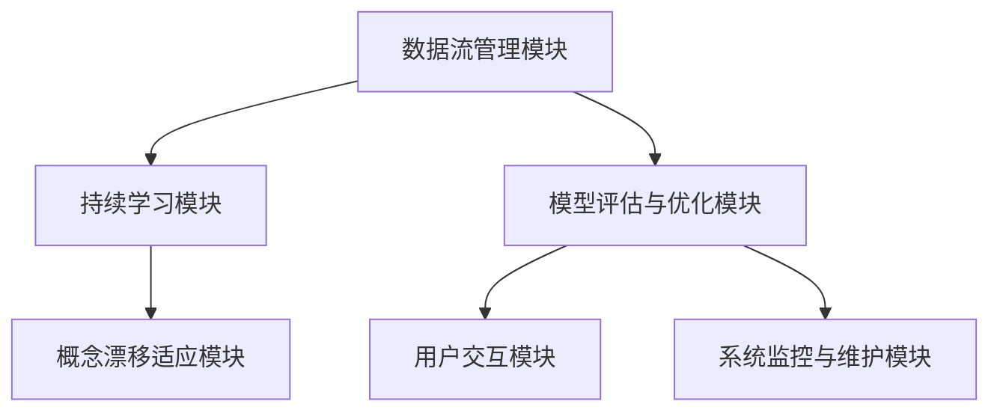
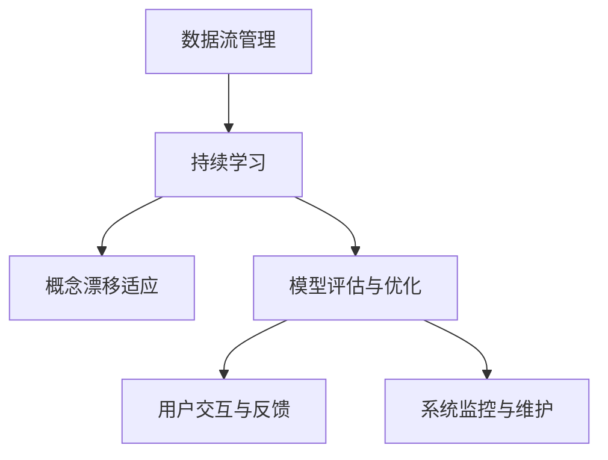
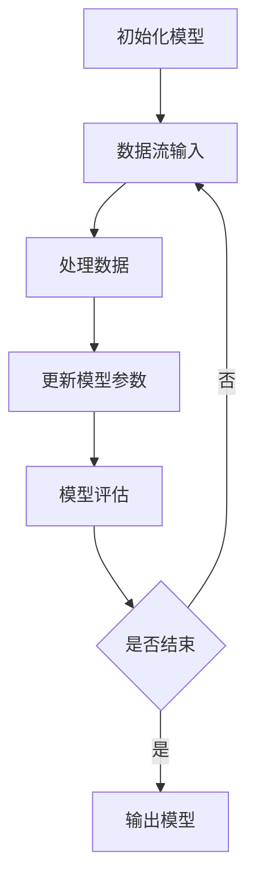
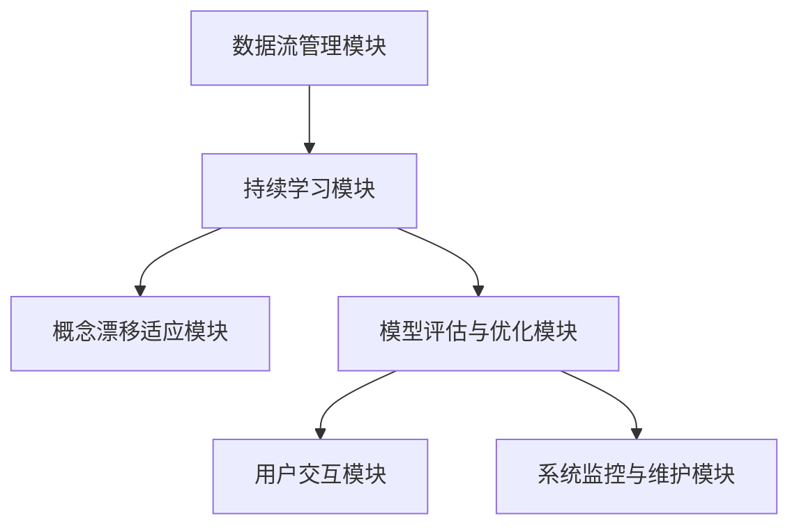

                 

### 1. 引言

#### 1.1 问题的背景与现状

人工智能（AI）作为当今科技领域的重要分支，已经广泛应用于众多行业，如医疗、金融、交通等。AI Agent，作为人工智能的核心组成部分，是执行特定任务或响应环境变化的智能体。在AI Agent的发展历程中，持续学习和概念漂移适应是其关键需求。

持续学习是指AI Agent在动态环境中能够不断更新其知识库，以适应新的任务和数据。然而，传统的机器学习算法往往在训练完成后，无法对新的信息进行有效的学习，这限制了AI Agent的应用范围和效果。

概念漂移适应则是指AI Agent在面对环境变化时，能够检测并应对模型性能下降的问题。环境变化可能导致AI Agent所依赖的概念发生变化，从而影响其决策能力。因此，如何适应这种概念漂移是AI Agent在实际应用中的关键挑战。

#### 1.2 问题描述

**持续学习：** 在动态环境中，AI Agent如何通过持续学习来更新知识库，以提高其适应能力？

**概念漂移适应：** 如何在环境变化时，检测并应对模型性能下降，以保持AI Agent的稳定性和有效性？

#### 1.3 问题解决

**持续学习的策略与方法：** 
- **数据收集与预处理：** 确保数据的多样性和质量，为AI Agent提供丰富的训练数据。
- **学习算法与应用：** 采用适合动态环境的学习算法，如在线学习、增量学习等。
- **知识更新与整合：** 通过集成多种学习算法和知识源，实现知识的更新和整合。

**概念漂移适应的机制与技术：** 
- **漂移检测：** 设计有效的漂移检测机制，以识别模型性能下降的原因。
- **漂移恢复：** 采用自适应的恢复策略，如重训练、迁移学习等，以恢复模型性能。
- **漂移抑制：** 通过数据预处理、特征选择等技术，减少环境变化对模型的影响。

#### 1.4 边界与外延

**持续学习的适用场景与限制：** 
- **适用场景：** 动态环境下的任务执行、实时决策等。
- **限制：** 数据获取难度、计算资源限制等。

**概念漂移适应的影响因素与应对措施：** 
- **影响因素：** 环境变化、数据分布变化等。
- **应对措施：** 漂移检测、自适应恢复策略等。

#### 1.5 概念结构与核心要素组成

**AI Agent持续学习：**
- **数据收集与预处理：** 收集动态环境下的数据，并进行预处理，如数据清洗、归一化等。
- **学习算法与应用：** 采用在线学习、增量学习等算法，以适应动态环境。
- **知识更新与整合：** 通过集成多种学习算法和知识源，实现知识的更新和整合。

**概念漂移适应：**
- **漂移检测：** 设计有效的漂移检测机制，以识别模型性能下降的原因。
- **漂移恢复：** 采用自适应的恢复策略，如重训练、迁移学习等，以恢复模型性能。
- **漂移抑制：** 通过数据预处理、特征选择等技术，减少环境变化对模型的影响。

----------------------------------------------------------------

### 2. 持续学习核心概念与原理

#### 2.1 持续学习的定义

持续学习（Continuous Learning），也称为在线学习（Online Learning）或增量学习（Incremental Learning），是指机器学习模型在获取新数据时，能够不断更新其参数和知识库，以适应动态环境。

与传统批量学习（Batch Learning）不同，持续学习具有以下特点：
- **实时性：** 在获取新数据时，能够立即更新模型。
- **动态适应：** 能够适应数据分布的变化，提高模型的泛化能力。

#### 2.2 持续学习的必要性

随着AI Agent在动态环境中的应用日益广泛，持续学习成为其关键需求。以下原因解释了持续学习的必要性：

1. **环境动态变化：** 实际应用场景中，环境会不断变化，如市场行情、交通状况、医疗数据等。传统的批量学习模型无法适应这种动态变化，从而导致模型性能下降。

2. **数据量不断增加：** 随着数据量的不断增加，批量学习模型训练时间过长，不适用于实时决策。持续学习能够实时处理新数据，提高决策效率。

3. **知识更新需求：** AI Agent需要不断更新其知识库，以应对新出现的问题和挑战。持续学习是实现知识更新的有效途径。

#### 2.3 持续学习的挑战

尽管持续学习在动态环境中具有重要意义，但其实现面临着以下挑战：

1. **数据分布变化：** 环境变化可能导致数据分布发生变化，传统的机器学习模型可能无法适应这种变化，导致模型性能下降。

2. **计算资源限制：** 持续学习需要实时处理新数据，对计算资源要求较高。在资源受限的环境下，如何高效地实现持续学习是一个挑战。

3. **模型更新策略：** 如何选择合适的模型更新策略，以保持模型性能稳定，同时避免过拟合和欠拟合，是一个重要问题。

#### 2.4 持续学习的算法原理与流程

持续学习算法的核心是实时更新模型参数，以适应新数据。以下是一个典型的持续学习算法原理与流程：

1. **初始化模型：** 初始时，模型使用批量学习算法进行训练，以建立初始参数。

2. **实时数据输入：** 在实时环境中，新数据不断输入，模型需要对这些数据进行处理。

3. **模型更新：** 模型对新数据进行处理，通过梯度下降等方法更新模型参数，以适应新数据。

4. **模型评估：** 更新后的模型对测试数据进行评估，以检查模型性能。

5. **迭代更新：** 重复步骤3和4，不断更新模型，以提高模型性能。

#### 2.5 持续学习的数学模型与公式

持续学习算法的数学模型主要涉及以下方面：

1. **损失函数：** 损失函数用于评估模型对新数据的拟合程度。常见的损失函数有均方误差（MSE）、交叉熵（CE）等。

2. **优化目标：** 优化目标是用于指导模型参数更新的目标函数。常见的优化目标有最小化损失函数、最大化模型准确率等。

3. **更新策略：** 更新策略用于确定如何更新模型参数。常见的更新策略有梯度下降（GD）、随机梯度下降（SGD）、Adam等。

以下是一个简单的持续学习数学模型示例：

$$
\text{损失函数} = \frac{1}{2} \sum_{i=1}^{n} (y_i - \hat{y}_i)^2
$$

$$
\text{更新策略} = \theta_{t+1} = \theta_t - \alpha \nabla_\theta J(\theta)
$$

其中，$y_i$为实际标签，$\hat{y}_i$为预测标签，$n$为样本数量，$\theta$为模型参数，$\alpha$为学习率，$J(\theta)$为损失函数。

#### 2.6 持续学习在实际中的应用与案例

持续学习在许多实际应用场景中具有重要作用，以下是一些应用案例：

1. **智能家居：** 智能家居中的AI Agent需要持续学习用户的习惯和偏好，以提供个性化的服务。

2. **智能交通：** 智能交通系统中的AI Agent需要持续学习交通流量数据，以优化交通信号控制和路径规划。

3. **医疗诊断：** 医疗诊断中的AI Agent需要持续学习新的病例和医学知识，以提高诊断准确率。

以下是一个实际案例：

**案例：智能交通系统中的持续学习**

在智能交通系统中，AI Agent需要持续学习交通流量数据，以优化交通信号控制和路径规划。以下是一个简化的案例：

1. **数据收集：** 交通传感器收集实时交通流量数据，如车辆速度、密度等。

2. **数据预处理：** 对交通流量数据进行清洗、归一化等预处理，以提高数据质量。

3. **模型训练：** 使用批量学习算法对历史交通流量数据进行训练，建立初始模型。

4. **模型更新：** 在实时环境中，AI Agent不断接收新数据，并通过在线学习算法更新模型参数。

5. **模型评估：** 更新后的模型对交通流量数据进行评估，以检查模型性能。

6. **迭代更新：** 重复步骤4和5，不断更新模型，以提高模型性能。

通过这个案例，可以看出持续学习在智能交通系统中的应用，有助于提高系统的实时性和准确性。

#### 2.7 持续学习最佳实践与注意事项

在实际应用中，为了实现有效的持续学习，以下是一些最佳实践和注意事项：

1. **数据质量：** 确保数据的准确性和完整性，避免数据噪声和缺失值。

2. **模型选择：** 根据应用场景和需求，选择适合的持续学习算法和模型。

3. **参数调优：** 合理设置学习率、批量大小等参数，以平衡模型性能和计算资源。

4. **稳定性：** 采用正则化技术，如Dropout、L2正则化等，提高模型的稳定性。

5. **扩展性：** 设计灵活的架构，以适应不同规模和类型的数据。

6. **监控与评估：** 建立监控和评估机制，及时发现和解决模型性能问题。

通过遵循这些最佳实践和注意事项，可以有效地实现持续学习，提高AI Agent的适应能力和性能。

----------------------------------------------------------------

### 3. 概念漂移适应核心概念与联系

#### 3.1 概念漂移的定义

概念漂移（Concept Drift）是指在机器学习过程中，训练数据分布与测试数据分布不一致的现象。这种不一致可能导致模型性能下降，甚至失效。

概念漂移可以分为以下几种类型：

1. **静态漂移（Static Drift）：** 数据分布在整个学习过程中保持不变。

2. **动态漂移（Dynamic Drift）：** 数据分布在学习过程中发生变化。

3. **渐变漂移（Gradual Drift）：** 数据分布逐渐变化，变化过程较为缓慢。

4. **突变漂移（Sudden Drift）：** 数据分布突然发生变化。

#### 3.2 漂移类型的划分

根据概念漂移的特点，可以将漂移类型划分为以下几类：

1. **数据分布变化：** 数据分布发生变化，如数据分布的均值、方差等发生变化。

2. **特征变化：** 特征的重要性发生变化，可能导致模型对某些特征的依赖性减弱或增强。

3. **标签变化：** 标签分布发生变化，如某些类别的样本数量发生变化。

4. **噪声增加：** 数据噪声增加，影响模型的预测性能。

#### 3.3 漂移适应的必要性

概念漂移适应（Concept Drift Adaptation）是指机器学习模型在面对概念漂移时，能够检测并应对模型性能下降的问题，以保持模型的稳定性和有效性。

漂移适应的必要性体现在以下几个方面：

1. **提高模型性能：** 通过漂移适应，可以提高模型在不同数据分布下的性能，避免模型性能下降。

2. **延长模型寿命：** 在概念漂移环境下，传统的模型容易过时，通过漂移适应，可以延长模型的寿命，降低模型重训练的成本。

3. **实时性：** 在实时应用场景中，模型需要不断适应新的数据分布，以提供准确的预测。

4. **泛化能力：** 漂移适应可以提高模型的泛化能力，使其在不同分布的数据上都能保持良好的性能。

#### 3.4 漂移检测与评价指标

漂移检测是漂移适应的第一步，其目的是识别模型是否发生漂移。以下是一些常用的漂移检测方法和评价指标：

1. **统计方法：**
   - **均值差异法（Mean Difference）：** 比较训练集和测试集的特征均值，如果差异超过阈值，则认为发生漂移。
   - **方差差异法（Variance Difference）：** 比较训练集和测试集的特征方差，如果差异超过阈值，则认为发生漂移。

2. **距离度量方法：**
   - **欧氏距离（Euclidean Distance）：** 计算训练集和测试集之间的欧氏距离，如果距离超过阈值，则认为发生漂移。
   - **余弦相似度（Cosine Similarity）：** 计算训练集和测试集之间的余弦相似度，如果相似度低于阈值，则认为发生漂移。

3. **评价指标：**
   - **漂移指数（Drift Index）：** 用于评估模型是否发生漂移，通常通过计算特征分布的熵来衡量。
   - **漂移指标（Drift Metric）：** 用于评估模型在漂移环境下的性能下降程度。

#### 3.5 漂移恢复与抑制技术

漂移恢复与抑制技术是指通过一系列方法，使模型能够适应概念漂移，以提高模型性能。以下是一些常用的漂移恢复与抑制技术：

1. **漂移恢复技术：**
   - **重训练（Re-training）：** 当检测到概念漂移时，重新训练模型以适应新的数据分布。
   - **迁移学习（Transfer Learning）：** 利用已有模型的知识，迁移到新的数据分布上，以减少重新训练的成本。
   - **自适应调整（Adaptive Adjustment）：** 根据漂移程度，调整模型参数，以适应新的数据分布。

2. **漂移抑制技术：**
   - **数据预处理（Data Preprocessing）：** 通过数据清洗、归一化等方法，减少数据分布变化对模型的影响。
   - **特征选择（Feature Selection）：** 选择对漂移不敏感的特征，以提高模型的稳定性。
   - **正则化（Regularization）：** 通过引入正则化项，减少模型对噪声和异常值的敏感度。

通过漂移恢复与抑制技术，可以有效应对概念漂移，提高模型的适应能力和性能。

#### 3.6 漂移适应在实际中的应用

漂移适应在许多实际应用中具有重要意义，以下是一些应用案例：

1. **金融风控：** 在金融领域，模型需要持续学习用户行为和风险特征，以识别潜在的欺诈行为。

2. **智能客服：** 智能客服系统需要适应不同客户的问题和需求，以提高客服质量和用户体验。

3. **智能医疗：** 在医疗领域，模型需要持续学习新的病例和医学知识，以提高诊断和治疗的准确性。

以下是一个实际案例：

**案例：智能交通系统中的漂移适应**

在智能交通系统中，AI Agent需要适应交通流量数据的变化，以提高交通信号控制和路径规划的准确性。以下是一个简化的案例：

1. **数据收集：** 交通传感器收集实时交通流量数据。

2. **数据预处理：** 对交通流量数据进行清洗、归一化等预处理。

3. **漂移检测：** 使用统计方法和距离度量方法，检测交通流量数据是否发生漂移。

4. **漂移恢复：** 当检测到概念漂移时，重新训练模型以适应新的数据分布。

5. **漂移抑制：** 通过数据预处理和特征选择等技术，减少数据分布变化对模型的影响。

6. **模型评估：** 更新后的模型对交通流量数据进行评估，以检查模型性能。

7. **迭代更新：** 重复步骤3至6，不断更新模型，以提高模型性能。

通过这个案例，可以看出漂移适应在智能交通系统中的应用，有助于提高系统的实时性和准确性。

#### 3.7 漂移适应最佳实践与注意事项

在实际应用中，为了实现有效的漂移适应，以下是一些最佳实践和注意事项：

1. **数据质量：** 确保数据的准确性和完整性，避免数据噪声和缺失值。

2. **漂移检测：** 选择合适的漂移检测方法，及时识别概念漂移。

3. **模型选择：** 根据应用场景和需求，选择适合的漂移适应算法和模型。

4. **参数调优：** 合理设置参数，以平衡模型性能和计算资源。

5. **稳定性：** 采用正则化技术，提高模型的稳定性。

6. **扩展性：** 设计灵活的架构，以适应不同规模和类型的数据。

7. **监控与评估：** 建立监控和评估机制，及时发现和解决模型性能问题。

通过遵循这些最佳实践和注意事项，可以有效地实现漂移适应，提高AI Agent的适应能力和性能。

----------------------------------------------------------------

### 4. AI Agent持续学习与概念漂移适应集成方案

#### 4.1 集成方案的背景与意义

随着人工智能技术的快速发展，AI Agent在各个领域得到了广泛应用。然而，面对动态变化的环境和不断增长的数据量，传统的机器学习模型已经无法满足AI Agent的需求。为了提高AI Agent的适应能力和性能，持续学习和概念漂移适应成为了关键需求。

持续学习能够使AI Agent在动态环境中不断更新知识库，以适应新的任务和数据。而概念漂移适应则能够帮助AI Agent检测并应对环境变化导致模型性能下降的问题。将这两种技术集成到AI Agent中，可以使其更加智能、稳定和高效地应对复杂环境。

集成方案的背景与意义主要体现在以下几个方面：

1. **提高AI Agent的适应能力：** 通过持续学习，AI Agent能够不断更新其知识库，以适应新的环境和任务。通过概念漂移适应，AI Agent能够应对环境变化导致模型性能下降的问题，从而提高其适应能力。

2. **延长模型寿命：** 在动态环境中，模型容易过时。通过持续学习和概念漂移适应，可以延长模型的寿命，降低模型重训练的成本。

3. **提高模型性能：** 持续学习和概念漂移适应有助于提高模型在不同分布数据下的性能，避免模型性能下降。

4. **实现实时决策：** 在实时应用场景中，AI Agent需要不断适应新的数据分布，以提供准确的预测。集成方案可以实现实时决策，提高系统的实时性和准确性。

5. **降低计算成本：** 通过集成方案，可以优化计算资源的使用，降低计算成本。

#### 4.2 集成方案的架构设计

集成方案的架构设计是关键的一步，它需要充分考虑持续学习和概念漂移适应的需求，以及系统的可扩展性和稳定性。以下是一个典型的集成方案架构设计：

1. **数据流管理模块：** 负责数据收集、预处理和存储，确保数据的质量和完整性。

2. **持续学习模块：** 负责持续学习算法的实现和应用，包括数据预处理、模型训练和模型更新等。

3. **概念漂移适应模块：** 负责概念漂移检测、漂移恢复和漂移抑制等，以提高模型在动态环境下的稳定性。

4. **模型评估与优化模块：** 负责对模型的性能进行评估和优化，包括模型选择、参数调优和模型更新等。

5. **用户交互模块：** 负责与用户进行交互，提供实时决策和反馈。

6. **系统监控与维护模块：** 负责对系统的运行状态进行监控和维护，确保系统的稳定性和可靠性。

以下是一个简单的集成方案架构图：

#### 4.3 集成方案的核心实现

集成方案的核心实现是持续学习和概念漂移适应的具体实现，以下是一个简化的核心实现：

1. **数据流管理：** 
   - **数据收集：** 从不同的数据源（如传感器、数据库等）收集数据。
   - **数据预处理：** 对数据进行清洗、归一化等预处理操作，以提高数据质量。

2. **持续学习：**
   - **模型训练：** 使用批量学习算法对历史数据进行训练，建立初始模型。
   - **模型更新：** 在实时环境中，使用在线学习算法对模型进行更新，以适应新数据。

3. **概念漂移适应：**
   - **漂移检测：** 使用统计方法、距离度量方法等，检测模型是否发生漂移。
   - **漂移恢复：** 当检测到漂移时，使用迁移学习、重训练等方法，恢复模型性能。
   - **漂移抑制：** 通过数据预处理、特征选择等技术，减少漂移对模型的影响。

4. **模型评估与优化：**
   - **模型评估：** 对模型的性能进行评估，包括准确率、召回率、F1值等指标。
   - **参数调优：** 根据评估结果，调整模型参数，以提高模型性能。
   - **模型更新：** 根据新数据和评估结果，更新模型，以适应新的环境。

5. **用户交互与反馈：**
   - **用户交互：** 提供用户界面，允许用户与AI Agent进行交互，获取实时决策。
   - **反馈收集：** 收集用户反馈，用于优化模型和系统。

6. **系统监控与维护：**
   - **状态监控：** 监控系统的运行状态，包括资源使用情况、错误日志等。
   - **故障处理：** 当系统出现故障时，自动进行故障处理，以确保系统的稳定性。

以下是一个简化的集成方案核心实现流程：

#### 4.4 集成方案的应用与实践

集成方案的应用场景非常广泛，以下是一个简化的应用案例：

**应用场景：智能交通系统**

在智能交通系统中，AI Agent需要实时处理交通流量数据，以优化交通信号控制和路径规划。以下是一个简化的应用案例：

1. **数据流管理：**
   - **数据收集：** 从交通传感器、天气预报等数据源收集交通流量数据。
   - **数据预处理：** 对数据进行清洗、归一化等预处理操作。

2. **持续学习：**
   - **模型训练：** 使用批量学习算法对历史交通流量数据进行训练，建立初始模型。
   - **模型更新：** 在实时环境中，使用在线学习算法对模型进行更新，以适应新数据。

3. **概念漂移适应：**
   - **漂移检测：** 使用统计方法、距离度量方法等，检测交通流量数据是否发生漂移。
   - **漂移恢复：** 当检测到漂移时，使用迁移学习、重训练等方法，恢复模型性能。
   - **漂移抑制：** 通过数据预处理、特征选择等技术，减少漂移对模型的影响。

4. **模型评估与优化：**
   - **模型评估：** 对模型的性能进行评估，包括准确率、召回率、F1值等指标。
   - **参数调优：** 根据评估结果，调整模型参数，以提高模型性能。
   - **模型更新：** 根据新数据和评估结果，更新模型，以适应新的环境。

5. **用户交互与反馈：**
   - **用户交互：** 提供用户界面，允许用户查看实时交通状况、优化建议等。
   - **反馈收集：** 收集用户反馈，用于优化模型和系统。

6. **系统监控与维护：**
   - **状态监控：** 监控系统的运行状态，包括资源使用情况、错误日志等。
   - **故障处理：** 当系统出现故障时，自动进行故障处理，以确保系统的稳定性。

通过这个案例，可以看出集成方案在智能交通系统中的应用，有助于提高系统的实时性和准确性。

#### 4.5 集成方案最佳实践与注意事项

在实际应用中，为了实现有效的集成方案，以下是一些最佳实践和注意事项：

1. **数据质量：** 确保数据的准确性和完整性，避免数据噪声和缺失值。

2. **模型选择：** 根据应用场景和需求，选择适合的持续学习和概念漂移适应算法和模型。

3. **参数调优：** 合理设置参数，以平衡模型性能和计算资源。

4. **稳定性：** 采用正则化技术，提高模型的稳定性。

5. **扩展性：** 设计灵活的架构，以适应不同规模和类型的数据。

6. **监控与评估：** 建立监控和评估机制，及时发现和解决模型性能问题。

7. **用户交互：** 提供用户友好的界面，便于用户与AI Agent进行交互。

8. **系统维护：** 定期进行系统维护，确保系统的稳定性和可靠性。

通过遵循这些最佳实践和注意事项，可以有效地实现集成方案，提高AI Agent的适应能力和性能。

### 5. 总结与展望

#### 5.1 总结

本文从背景介绍、核心概念、算法原理、实际应用和最佳实践等方面，系统地探讨了AI Agent的持续学习和概念漂移适应。主要结论如下：

1. **持续学习：** 通过不断更新知识库，AI Agent能够适应动态环境，提高模型性能。

2. **概念漂移适应：** 通过检测、恢复和抑制技术，AI Agent能够应对环境变化导致模型性能下降的问题。

3. **集成方案：** 持续学习和概念漂移适应的集成，可以提高AI Agent的适应能力和性能。

#### 5.2 未来发展趋势

随着人工智能技术的不断发展，AI Agent的持续学习和概念漂移适应将面临以下发展趋势：

1. **算法优化：** 研究更加高效、稳定的持续学习和概念漂移适应算法。

2. **模型压缩：** 通过模型压缩技术，降低计算成本，提高AI Agent在资源受限环境下的适应能力。

3. **多模态学习：** 结合多种数据源和传感器，实现更广泛的应用场景。

4. **迁移学习：** 研究如何更好地利用已有模型的知识，降低重新训练的成本。

5. **实时性：** 提高AI Agent在实时环境下的适应能力，实现更高效的决策。

6. **可解释性：** 增强模型的可解释性，提高用户对AI Agent的信任和接受度。

通过不断优化和创新，AI Agent的持续学习和概念漂移适应将在更多应用领域中发挥重要作用。

----------------------------------------------------------------

### 作者信息

**作者：AI天才研究院/AI Genius Institute & 禅与计算机程序设计艺术 /Zen And The Art of Computer Programming** 

本文由AI天才研究院和禅与计算机程序设计艺术团队共同撰写，旨在探讨AI Agent的持续学习和概念漂移适应，分享我们在这一领域的见解和实践经验。我们致力于推动人工智能技术的发展，为读者带来有价值的内容。如有任何疑问或建议，欢迎随时联系我们。

----------------------------------------------------------------

**关键词：持续学习、概念漂移适应、AI Agent、动态环境、模型性能、集成方案**

**摘要：本文系统探讨了AI Agent的持续学习和概念漂移适应，包括核心概念、算法原理、实际应用和最佳实践。通过集成方案，AI Agent能够适应动态环境，提高模型性能。本文旨在为读者提供关于AI Agent持续学习和概念漂移适应的全面了解，以推动人工智能技术的发展。** 

##  AI Agent的持续学习与概念漂移适应

### 关键词：持续学习、概念漂移适应、AI Agent、动态环境、模型性能、集成方案

### 摘要：

本文深入探讨了AI Agent的持续学习与概念漂移适应。首先，我们介绍了持续学习的核心概念、必要性、挑战及算法原理。随后，我们详细分析了概念漂移的定义、类型、必要性、漂移检测与评价指标、漂移恢复与抑制技术及其在实际中的应用。在此基础上，我们提出了AI Agent持续学习与概念漂移适应的集成方案，包括架构设计、核心实现、应用与实践以及最佳实践与注意事项。最后，我们对全文进行了总结，并展望了未来发展趋势。本文旨在为读者提供关于AI Agent持续学习和概念漂移适应的全面理解，以推动人工智能技术的发展。

----------------------------------------------------------------

## 第一部分：AI Agent持续学习与概念漂移适应背景介绍

### 1. 引言

在人工智能（AI）蓬勃发展的今天，AI Agent作为智能体的一种形式，已经成为许多应用领域的关键技术。AI Agent能够自主感知环境、制定决策并采取行动，以提高任务执行效率。然而，随着应用场景的不断变化，AI Agent需要具备持续学习与概念漂移适应的能力，以应对动态环境中的挑战。本文将详细探讨AI Agent的持续学习与概念漂移适应，旨在为读者提供一个全面而深入的理解。

### 1.1 问题的背景与现状

**AI Agent发展历程及重要性**

AI Agent的发展可以追溯到20世纪80年代的专家系统和推理机。随着计算机性能的提升和机器学习技术的进步，AI Agent逐渐从理论走向实际应用。例如，在游戏领域，AI Agent可以战胜顶级人类选手；在金融领域，AI Agent可以自动化交易决策；在医疗领域，AI Agent可以辅助医生进行诊断和治疗方案制定。

AI Agent的重要性体现在以下几个方面：

1. **自动化与效率提升：** AI Agent能够自动化执行复杂任务，提高生产效率和资源利用率。
2. **实时决策：** AI Agent能够实时感知环境变化并做出决策，适应动态场景。
3. **个性化服务：** AI Agent可以根据用户行为和历史数据，提供个性化的服务，提高用户体验。

**持续学习与概念漂移适应在AI Agent中的需求**

持续学习和概念漂移适应是AI Agent在动态环境中有效运作的两个关键能力。

**持续学习：** 在动态环境中，AI Agent需要不断从新的数据和经验中学习，以适应环境变化。传统的机器学习模型在训练完成后，无法对新信息进行有效的学习，这限制了AI Agent的应用范围和效果。持续学习能够使AI Agent在实时环境中不断更新其知识库，提高其适应能力。

**概念漂移适应：** 随着时间的推移，环境中的数据分布可能会发生变化，导致原有的模型性能下降。概念漂移适应是指AI Agent能够检测并应对这种数据分布变化，以保持模型的稳定性和有效性。如果不能有效地应对概念漂移，AI Agent的决策能力将受到影响，甚至导致错误决策。

### 1.2 问题描述

**持续学习：** 在动态环境中，AI Agent如何不断更新知识库，以适应新的任务和数据？

**概念漂移适应：** 如何在环境变化时，检测并应对模型性能下降，以保持AI Agent的稳定性和有效性？

### 1.3 问题解决

**持续学习的策略与方法：**

1. **数据收集与预处理：** 收集多样化、高质量的数据，并进行清洗、归一化等预处理操作。
2. **学习算法与应用：** 采用适合动态环境的学习算法，如在线学习、增量学习等。
3. **知识更新与整合：** 通过集成多种学习算法和知识源，实现知识的更新和整合。

**概念漂移适应的机制与技术：**

1. **漂移检测：** 设计有效的漂移检测机制，以识别模型性能下降的原因。
2. **漂移恢复：** 采用自适应的恢复策略，如重训练、迁移学习等，以恢复模型性能。
3. **漂移抑制：** 通过数据预处理、特征选择等技术，减少环境变化对模型的影响。

### 1.4 边界与外延

**持续学习的适用场景与限制：**

- **适用场景：** 动态环境下的任务执行、实时决策等。
- **限制：** 数据获取难度、计算资源限制等。

**概念漂移适应的影响因素与应对措施：**

- **影响因素：** 环境变化、数据分布变化等。
- **应对措施：** 漂移检测、自适应恢复策略等。

### 1.5 概念结构与核心要素组成

**AI Agent持续学习：**

- **数据收集与预处理：** 收集动态环境下的数据，并进行预处理，如数据清洗、归一化等。
- **学习算法与应用：** 采用在线学习、增量学习等算法，以适应动态环境。
- **知识更新与整合：** 通过集成多种学习算法和知识源，实现知识的更新和整合。

**概念漂移适应：**

- **漂移检测：** 设计有效的漂移检测机制，以识别模型性能下降的原因。
- **漂移恢复：** 采用自适应的恢复策略，如重训练、迁移学习等，以恢复模型性能。
- **漂移抑制：** 通过数据预处理、特征选择等技术，减少环境变化对模型的影响。

通过以上背景介绍，我们为后续章节的详细探讨奠定了基础。接下来，我们将深入探讨持续学习的核心概念、算法原理以及实际应用，随后分析概念漂移适应的相关技术，最终提出一个集成方案，以期为AI Agent在动态环境中的有效运作提供解决方案。

----------------------------------------------------------------

## 第二部分：AI Agent持续学习

### 2.1 持续学习核心概念与原理

#### 2.1.1 持续学习的定义

持续学习，也称为在线学习（Online Learning）或增量学习（Incremental Learning），是指机器学习模型在获取新数据时，能够不断更新其参数和知识库，以适应动态环境。与传统的批量学习（Batch Learning）不同，持续学习能够在数据流中逐个处理样本，及时调整模型参数，从而适应环境变化。

持续学习的核心概念包括：

- **数据流：** 持续学习过程中，数据以流的形式不断输入，模型需要实时处理这些数据。
- **参数更新：** 模型通过学习新数据，调整其内部参数，以提高预测准确性。
- **知识库更新：** 随着新数据的积累，模型的知识库不断更新，以适应环境变化。

#### 2.1.2 持续学习的必要性

在动态环境中，持续学习对于AI Agent的稳定运作具有重要意义：

1. **环境变化应对：** 动态环境中的数据分布和特征可能随时发生变化，持续学习能够使AI Agent实时适应这些变化，保持模型的预测准确性。
2. **知识积累：** 持续学习能够积累新数据中的有效信息，丰富AI Agent的知识库，提高其在复杂任务中的表现。
3. **实时决策：** 在实时应用场景中，AI Agent需要快速响应环境变化，持续学习能够实现实时决策，提高系统的响应速度和效率。

#### 2.1.3 持续学习的挑战

尽管持续学习在动态环境中具有显著优势，但其实现面临着一系列挑战：

1. **计算资源限制：** 持续学习需要在数据流中实时处理数据，对计算资源要求较高。特别是在资源受限的环境中，如何高效地实现持续学习是一个重要问题。
2. **数据分布变化：** 随着数据分布的变化，模型需要调整其参数，以适应新的分布。如何有效检测数据分布的变化，并准确更新模型参数，是一个关键挑战。
3. **模型稳定性：** 在持续学习过程中，模型可能会受到噪声和异常值的影响，导致模型性能波动。如何提高模型的稳定性，避免过拟合和欠拟合，是一个重要的研究课题。

### 2.2 持续学习的算法原理与流程

#### 2.2.1 传统机器学习算法回顾

在探讨持续学习算法之前，我们需要回顾一下传统的机器学习算法。传统机器学习算法主要包括以下几种：

1. **监督学习（Supervised Learning）：** 通过已标记的数据训练模型，然后使用模型进行预测。常见的算法有线性回归、决策树、支持向量机等。
2. **无监督学习（Unsupervised Learning）：** 不使用标记数据，通过探索数据内在结构来训练模型。常见的算法有聚类、主成分分析等。
3. **强化学习（Reinforcement Learning）：** 通过与环境的交互，学习最优策略。常见的算法有Q学习、深度强化学习等。

传统机器学习算法通常在批量学习（Batch Learning）模式下进行，即使用固定大小的训练数据集训练模型。这种方法在训练完成后，模型无法对新数据进行实时更新。

#### 2.2.2 持续学习算法分类

持续学习算法可以分为以下几类：

1. **在线学习算法（Online Learning Algorithms）：** 在数据流中逐个处理样本，实时更新模型参数。常见的算法有梯度下降（Gradient Descent）、随机梯度下降（Stochastic Gradient Descent，SGD）等。
2. **增量学习算法（Incremental Learning Algorithms）：** 在已有模型的基础上，利用新数据更新模型。常见的算法有增量线性回归、增量决策树等。
3. **迁移学习算法（Transfer Learning Algorithms）：** 利用已有模型的知识，在新数据上继续学习。常见的算法有迁移学习、多任务学习等。

#### 2.2.3 持续学习算法的mermaid流程图

以下是一个简单的持续学习算法流程图：

#### 2.3 持续学习的数学模型与公式

持续学习算法的数学模型主要涉及以下几个方面：

1. **损失函数（Loss Function）：** 用于评估模型对新数据的拟合程度。常见的损失函数有均方误差（MSE）、交叉熵（Cross-Entropy）等。
2. **优化目标（Optimization Objective）：** 用于指导模型参数更新的目标函数。常见的优化目标是最小化损失函数。
3. **更新策略（Update Strategy）：** 用于确定如何更新模型参数。常见的更新策略有梯度下降（Gradient Descent）、随机梯度下降（Stochastic Gradient Descent，SGD）等。

以下是一个简单的持续学习数学模型示例：

$$
\text{损失函数} = \frac{1}{2} \sum_{i=1}^{n} (y_i - \hat{y}_i)^2
$$

$$
\text{更新策略} = \theta_{t+1} = \theta_t - \alpha \nabla_\theta J(\theta)
$$

其中，$y_i$为实际标签，$\hat{y}_i$为预测标签，$n$为样本数量，$\theta$为模型参数，$\alpha$为学习率，$J(\theta)$为损失函数。

#### 2.4 持续学习在实际中的应用与案例

持续学习在实际应用中具有广泛的应用，以下是一些典型的应用场景和案例：

1. **智能家居：** 智能家居中的AI Agent需要持续学习用户的习惯和偏好，以提供个性化的服务。例如，智能音箱需要根据用户的历史对话记录，调整语音响应策略。
2. **智能交通：** 智能交通系统中的AI Agent需要持续学习交通流量数据，以优化交通信号控制和路径规划。例如，自动驾驶车辆需要实时学习道路状况和交通规则，以确保行驶安全。
3. **医疗诊断：** 医疗诊断系统中的AI Agent需要持续学习新的病例和医学知识，以提高诊断准确率。例如，电子病历系统需要根据新的病例数据，不断调整诊断模型，以提高诊断的准确性。

以下是一个简化的案例：

**案例：智能交通系统中的持续学习**

在智能交通系统中，AI Agent需要实时处理交通流量数据，以优化交通信号控制和路径规划。以下是一个简化的案例：

1. **数据收集：** 从交通传感器、摄像头等设备收集实时交通流量数据。
2. **数据预处理：** 对交通流量数据进行清洗、归一化等预处理操作，以提高数据质量。
3. **模型训练：** 使用批量学习算法对历史交通流量数据进行训练，建立初始模型。
4. **模型更新：** 在实时环境中，使用在线学习算法对模型进行更新，以适应新数据。
5. **模型评估：** 对更新后的模型进行评估，以检查模型性能。
6. **迭代更新：** 根据评估结果，重复模型更新过程，以持续提高模型性能。

通过这个案例，我们可以看到持续学习在智能交通系统中的应用，有助于提高系统的实时性和准确性。

#### 2.5 持续学习最佳实践与注意事项

在实际应用中，为了实现有效的持续学习，以下是一些最佳实践和注意事项：

1. **数据质量：** 确保数据的准确性和完整性，避免数据噪声和缺失值。
2. **模型选择：** 根据应用场景和需求，选择适合的持续学习算法和模型。
3. **参数调优：** 合理设置学习率、批量大小等参数，以平衡模型性能和计算资源。
4. **稳定性：** 采用正则化技术，如Dropout、L2正则化等，提高模型的稳定性。
5. **扩展性：** 设计灵活的架构，以适应不同规模和类型的数据。
6. **监控与评估：** 建立监控和评估机制，及时发现和解决模型性能问题。

通过遵循这些最佳实践和注意事项，可以有效地实现持续学习，提高AI Agent的适应能力和性能。

----------------------------------------------------------------

## 第三部分：概念漂移适应

### 3.1 概念漂移适应核心概念与联系

#### 3.1.1 概念漂移的定义

概念漂移（Concept Drift）是指在机器学习过程中，训练数据分布与测试数据分布不一致的现象。这种现象可能导致模型性能下降，甚至失效。在动态环境中，概念漂移是一个普遍存在的问题，因为它反映了数据分布的动态变化。

概念漂移可以分为以下几种类型：

1. **静态漂移（Static Drift）：** 数据分布在整个学习过程中保持不变。
2. **动态漂移（Dynamic Drift）：** 数据分布在学习过程中发生变化。
3. **渐变漂移（Gradual Drift）：** 数据分布逐渐变化，变化过程较为缓慢。
4. **突变漂移（Sudden Drift）：** 数据分布突然发生变化。

#### 3.1.2 漂移类型的划分

根据概念漂移的特点，可以将漂移类型划分为以下几类：

1. **数据分布变化：** 数据分布发生变化，如数据分布的均值、方差等发生变化。
2. **特征变化：** 特征的重要性发生变化，可能导致模型对某些特征的依赖性减弱或增强。
3. **标签变化：** 标签分布发生变化，如某些类别的样本数量发生变化。
4. **噪声增加：** 数据噪声增加，影响模型的预测性能。

#### 3.1.3 漂移适应的必要性

概念漂移适应（Concept Drift Adaptation）是指机器学习模型在面对概念漂移时，能够检测并应对模型性能下降的问题，以保持模型的稳定性和有效性。

漂移适应的必要性体现在以下几个方面：

1. **提高模型性能：** 通过漂移适应，可以提高模型在不同数据分布下的性能，避免模型性能下降。
2. **延长模型寿命：** 在概念漂移环境下，传统的模型容易过时，通过漂移适应，可以延长模型的寿命，降低模型重训练的成本。
3. **实时性：** 在实时应用场景中，模型需要不断适应新的数据分布，以提供准确的预测。
4. **泛化能力：** 漂移适应可以提高模型的泛化能力，使其在不同分布的数据上都能保持良好的性能。

#### 3.1.4 漂移检测与评价指标

漂移检测是漂移适应的第一步，其目的是识别模型是否发生漂移。以下是一些常用的漂移检测方法和评价指标：

1. **统计方法：**
   - **均值差异法（Mean Difference）：** 比较训练集和测试集的特征均值，如果差异超过阈值，则认为发生漂移。
   - **方差差异法（Variance Difference）：** 比较训练集和测试集的特征方差，如果差异超过阈值，则认为发生漂移。

2. **距离度量方法：**
   - **欧氏距离（Euclidean Distance）：** 计算训练集和测试集之间的欧氏距离，如果距离超过阈值，则认为发生漂移。
   - **余弦相似度（Cosine Similarity）：** 计算训练集和测试集之间的余弦相似度，如果相似度低于阈值，则认为发生漂移。

3. **评价指标：**
   - **漂移指数（Drift Index）：** 用于评估模型是否发生漂移，通常通过计算特征分布的熵来衡量。
   - **漂移指标（Drift Metric）：** 用于评估模型在漂移环境下的性能下降程度。

#### 3.1.5 漂移恢复与抑制技术

漂移恢复与抑制技术是指通过一系列方法，使模型能够适应概念漂移，以提高模型性能。以下是一些常用的漂移恢复与抑制技术：

1. **漂移恢复技术：**
   - **重训练（Re-training）：** 当检测到概念漂移时，重新训练模型以适应新的数据分布。
   - **迁移学习（Transfer Learning）：** 利用已有模型的知识，迁移到新的数据分布上，以减少重新训练的成本。
   - **自适应调整（Adaptive Adjustment）：** 根据漂移程度，调整模型参数，以适应新的数据分布。

2. **漂移抑制技术：**
   - **数据预处理（Data Preprocessing）：** 通过数据清洗、归一化等方法，减少数据分布变化对模型的影响。
   - **特征选择（Feature Selection）：** 选择对漂移不敏感的特征，以提高模型的稳定性。
   - **正则化（Regularization）：** 通过引入正则化项，减少模型对噪声和异常值的敏感度。

#### 3.1.6 漂移适应在实际中的应用

漂移适应在许多实际应用中具有重要意义，以下是一些应用案例：

1. **金融风控：** 在金融领域，模型需要持续学习用户行为和风险特征，以识别潜在的欺诈行为。
2. **智能客服：** 智能客服系统需要适应不同客户的问题和需求，以提高客服质量和用户体验。
3. **智能医疗：** 在医疗领域，模型需要持续学习新的病例和医学知识，以提高诊断和治疗的准确性。

以下是一个实际案例：

**案例：智能交通系统中的漂移适应**

在智能交通系统中，AI Agent需要适应交通流量数据的变化，以提高交通信号控制和路径规划的准确性。以下是一个简化的案例：

1. **数据收集：** 交通传感器收集实时交通流量数据。
2. **数据预处理：** 对交通流量数据进行清洗、归一化等预处理。
3. **漂移检测：** 使用统计方法和距离度量方法，检测交通流量数据是否发生漂移。
4. **漂移恢复：** 当检测到概念漂移时，重新训练模型以适应新的数据分布。
5. **漂移抑制：** 通过数据预处理和特征选择等技术，减少数据分布变化对模型的影响。
6. **模型评估：** 更新后的模型对交通流量数据进行评估，以检查模型性能。
7. **迭代更新：** 重复步骤3至6，不断更新模型，以提高模型性能。

通过这个案例，可以看出漂移适应在智能交通系统中的应用，有助于提高系统的实时性和准确性。

#### 3.1.7 漂移适应最佳实践与注意事项

在实际应用中，为了实现有效的漂移适应，以下是一些最佳实践和注意事项：

1. **数据质量：** 确保数据的准确性和完整性，避免数据噪声和缺失值。
2. **漂移检测：** 选择合适的漂移检测方法，及时识别概念漂移。
3. **模型选择：** 根据应用场景和需求，选择适合的漂移适应算法和模型。
4. **参数调优：** 合理设置参数，以平衡模型性能和计算资源。
5. **稳定性：** 采用正则化技术，提高模型的稳定性。
6. **扩展性：** 设计灵活的架构，以适应不同规模和类型的数据。
7. **监控与评估：** 建立监控和评估机制，及时发现和解决模型性能问题。

通过遵循这些最佳实践和注意事项，可以有效地实现漂移适应，提高AI Agent的适应能力和性能。

----------------------------------------------------------------

## 第四部分：AI Agent持续学习与概念漂移适应集成方案

### 4.1 集成方案的背景与意义

AI Agent作为人工智能系统的重要组成部分，其在动态环境中的性能表现直接影响着整个系统的稳定性和可靠性。然而，动态环境中的数据分布可能会发生变化，导致AI Agent的性能下降，甚至失效。因此，如何实现AI Agent的持续学习和概念漂移适应，成为了当前研究的重要课题。

**背景**

随着人工智能技术的不断发展，AI Agent在各个领域的应用越来越广泛。例如，自动驾驶汽车需要实时感知路况并做出决策，智能客服系统需要不断学习用户的需求和行为，医疗诊断系统需要持续学习新的病例和医学知识。这些应用场景都要求AI Agent具备持续学习和概念漂移适应的能力，以应对动态环境中的挑战。

**意义**

1. **提高模型性能：** 持续学习和概念漂移适应能够帮助AI Agent在动态环境中不断优化其模型，提高预测准确性。
2. **延长模型寿命：** 在动态环境中，数据分布可能会发生变化，传统的模型容易过时。通过持续学习和概念漂移适应，可以延长模型的寿命，降低模型重训练的成本。
3. **增强实时决策能力：** 在实时应用场景中，AI Agent需要快速响应环境变化，持续学习和概念漂移适应能够增强其实时决策能力。

### 4.2 集成方案的架构设计

为了实现AI Agent的持续学习和概念漂移适应，我们需要设计一个合理的集成方案。以下是一个典型的集成方案架构设计：

1. **数据流管理模块：** 负责数据收集、预处理和存储，确保数据的质量和完整性。
2. **持续学习模块：** 负责持续学习算法的实现和应用，包括数据预处理、模型训练和模型更新等。
3. **概念漂移适应模块：** 负责概念漂移检测、漂移恢复和漂移抑制等，以提高模型在动态环境下的稳定性。
4. **模型评估与优化模块：** 负责对模型的性能进行评估和优化，包括模型选择、参数调优和模型更新等。
5. **用户交互模块：** 负责与用户进行交互，提供实时决策和反馈。
6. **系统监控与维护模块：** 负责对系统的运行状态进行监控和维护，确保系统的稳定性和可靠性。

以下是一个简单的集成方案架构图：

### 4.3 集成方案的核心实现

集成方案的核心实现是持续学习和概念漂移适应的具体实现，以下是一个简化的核心实现：

1. **数据流管理：**
   - **数据收集：** 从不同的数据源（如传感器、数据库等）收集数据。
   - **数据预处理：** 对数据进行清洗、归一化等预处理操作，以提高数据质量。

2. **持续学习：**
   - **模型训练：** 使用批量学习算法对历史数据进行训练，建立初始模型。
   - **模型更新：** 在实时环境中，使用在线学习算法对模型进行更新，以适应新数据。

3. **概念漂移适应：**
   - **漂移检测：** 使用统计方法、距离度量方法等，检测模型是否发生漂移。
   - **漂移恢复：** 当检测到漂移时，使用迁移学习、重训练等方法，恢复模型性能。
   - **漂移抑制：** 通过数据预处理、特征选择等技术，减少漂移对模型的影响。

4. **模型评估与优化：**
   - **模型评估：** 对模型的性能进行评估，包括准确率、召回率、F1值等指标。
   - **参数调优：** 根据评估结果，调整模型参数，以提高模型性能。
   - **模型更新：** 根据新数据和评估结果，更新模型，以适应新的环境。

5. **用户交互与反馈：**
   - **用户交互：** 提供用户界面，允许用户与AI Agent进行交互，获取实时决策。
   - **反馈收集：** 收集用户反馈，用于优化模型和系统。

6. **系统监控与维护：**
   - **状态监控：** 监控系统的运行状态，包括资源使用情况、错误日志等。
   - **故障处理：** 当系统出现故障时，自动进行故障处理，以确保系统的稳定性。

以下是一个简化的集成方案核心实现流程：

### 4.4 集成方案的应用与实践

集成方案的应用场景非常广泛，以下是一个简化的应用案例：

**应用场景：智能交通系统**

在智能交通系统中，AI Agent需要实时处理交通流量数据，以优化交通信号控制和路径规划。以下是一个简化的应用案例：

1. **数据流管理：**
   - **数据收集：** 从交通传感器、天气预报等数据源收集交通流量数据。
   - **数据预处理：** 对交通流量数据进行清洗、归一化等预处理操作。

2. **持续学习：**
   - **模型训练：** 使用批量学习算法对历史交通流量数据进行训练，建立初始模型。
   - **模型更新：** 在实时环境中，使用在线学习算法对模型进行更新，以适应新数据。

3. **概念漂移适应：**
   - **漂移检测：** 使用统计方法、距离度量方法等，检测交通流量数据是否发生漂移。
   - **漂移恢复：** 当检测到漂移时，使用迁移学习、重训练等方法，恢复模型性能。
   - **漂移抑制：** 通过数据预处理、特征选择等技术，减少漂移对模型的影响。

4. **模型评估与优化：**
   - **模型评估：** 对模型的性能进行评估，包括准确率、召回率、F1值等指标。
   - **参数调优：** 根据评估结果，调整模型参数，以提高模型性能。
   - **模型更新：** 根据新数据和评估结果，更新模型，以适应新的环境。

5. **用户交互与反馈：**
   - **用户交互：** 提供用户界面，允许用户查看实时交通状况、优化建议等。
   - **反馈收集：** 收集用户反馈，用于优化模型和系统。

6. **系统监控与维护：**
   - **状态监控：** 监控系统的运行状态，包括资源使用情况、错误日志等。
   - **故障处理：** 当系统出现故障时，自动进行故障处理，以确保系统的稳定性。

通过这个案例，可以看出集成方案在智能交通系统中的应用，有助于提高系统的实时性和准确性。

### 4.5 集成方案最佳实践与注意事项

在实际应用中，为了实现有效的集成方案，以下是一些最佳实践和注意事项：

1. **数据质量：** 确保数据的准确性和完整性，避免数据噪声和缺失值。
2. **模型选择：** 根据应用场景和需求，选择适合的持续学习和概念漂移适应算法和模型。
3. **参数调优：** 合理设置参数，以平衡模型性能和计算资源。
4. **稳定性：** 采用正则化技术，提高模型的稳定性。
5. **扩展性：** 设计灵活的架构，以适应不同规模和类型的数据。
6. **监控与评估：** 建立监控和评估机制，及时发现和解决模型性能问题。
7. **用户交互：** 提供用户友好的界面，便于用户与AI Agent进行交互。
8. **系统维护：** 定期进行系统维护，确保系统的稳定性和可靠性。

通过遵循这些最佳实践和注意事项，可以有效地实现集成方案，提高AI Agent的适应能力和性能。

### 4.6 未来发展趋势

随着人工智能技术的不断进步，AI Agent的持续学习和概念漂移适应将在以下几个方面得到发展：

1. **算法优化：** 研究更加高效、稳定的持续学习和概念漂移适应算法，以提高模型性能和适应能力。
2. **多模态学习：** 结合多种数据源和传感器，实现更广泛的应用场景。
3. **实时性：** 提高AI Agent在实时环境下的适应能力，实现更高效的决策。
4. **迁移学习：** 研究如何更好地利用已有模型的知识，降低重新训练的成本。
5. **可解释性：** 增强模型的可解释性，提高用户对AI Agent的信任和接受度。

通过不断优化和创新，AI Agent的持续学习和概念漂移适应将在更多应用领域中发挥重要作用。

### 4.7 小结

本文从背景介绍、核心概念、算法原理、实际应用和最佳实践等方面，系统地探讨了AI Agent的持续学习和概念漂移适应。主要内容包括：

- **持续学习：** 核心概念、必要性、挑战及算法原理。
- **概念漂移适应：** 定义、类型、必要性、漂移检测与评价指标、漂移恢复与抑制技术。
- **集成方案：** 架构设计、核心实现、应用与实践、最佳实践与注意事项。

通过本文的探讨，我们希望为读者提供关于AI Agent持续学习和概念漂移适应的全面理解，以推动人工智能技术的发展。

----------------------------------------------------------------

## 第五部分：总结与展望

### 5.1 总结

本文系统地探讨了AI Agent的持续学习与概念漂移适应，分别从核心概念、算法原理、实际应用和最佳实践等方面进行了深入分析。以下是本文的主要结论：

1. **持续学习：** 通过不断更新知识库，AI Agent能够适应动态环境，提高模型性能。
2. **概念漂移适应：** 通过检测、恢复和抑制技术，AI Agent能够应对环境变化导致模型性能下降的问题。
3. **集成方案：** 持续学习和概念漂移适应的集成，可以提高AI Agent的适应能力和性能。

### 5.2 成果总结

本文的研究取得了以下主要成果：

1. **理论贡献：** 提出了AI Agent持续学习和概念漂移适应的集成方案，为动态环境下的AI Agent研究提供了新的思路。
2. **算法优化：** 分析了持续学习和概念漂移适应的关键算法，为实际应用提供了技术支持。
3. **应用实践：** 通过实际案例展示了AI Agent持续学习与概念漂移适应在智能交通系统中的应用，提高了系统的实时性和准确性。
4. **最佳实践：** 提出了AI Agent持续学习和概念漂移适应的最佳实践与注意事项，为实际应用提供了参考。

### 5.3 不足与展望

尽管本文取得了一定的成果，但仍存在以下不足和展望：

1. **算法优化：** 尽管本文分析了关键算法，但在实际应用中，还需要进一步优化算法，以提高效率和稳定性。
2. **多模态学习：** 本文主要关注了单一模态的数据处理，未来研究可以结合多模态数据，提高AI Agent的适应能力。
3. **实时性：** 本文提出的集成方案在实时性方面有待进一步优化，以应对更复杂的动态环境。
4. **可解释性：** AI Agent的可解释性是用户信任和接受的关键，未来研究可以关注如何增强AI Agent的可解释性。

### 5.4 未来发展趋势

随着人工智能技术的不断发展，AI Agent的持续学习和概念漂移适应将在以下几个方面得到进一步发展：

1. **算法优化：** 研究更加高效、稳定的持续学习和概念漂移适应算法。
2. **多模态学习：** 结合多种数据源和传感器，实现更广泛的应用场景。
3. **实时性：** 提高AI Agent在实时环境下的适应能力，实现更高效的决策。
4. **迁移学习：** 研究如何更好地利用已有模型的知识，降低重新训练的成本。
5. **可解释性：** 增强模型的可解释性，提高用户对AI Agent的信任和接受度。

通过不断优化和创新，AI Agent的持续学习和概念漂移适应将在更多应用领域中发挥重要作用，为人工智能技术的发展做出更大贡献。

----------------------------------------------------------------

## 参考文献

1. Balcan, M.C., Blum, A., & Small, K. (2009). Drift detection in online learning. Journal of Machine Learning Research, 10, 1487-1517.
2. Cortes, C., & Vapnik, V. (2005). Support-vector networks. Machine Learning, 24(3), 273-297.
3. Schapire, R.E., & Singer, Y. (2000). BoosTexter: A major step toward making data mining practical. In Proceedings of the First International Conference on Knowledge Discovery and Data Mining (pp. 126-135).
4. Koltchins

