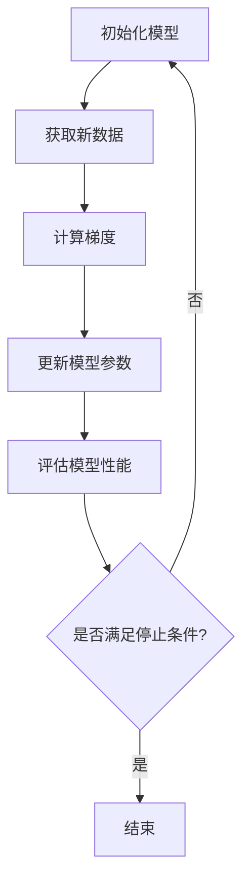
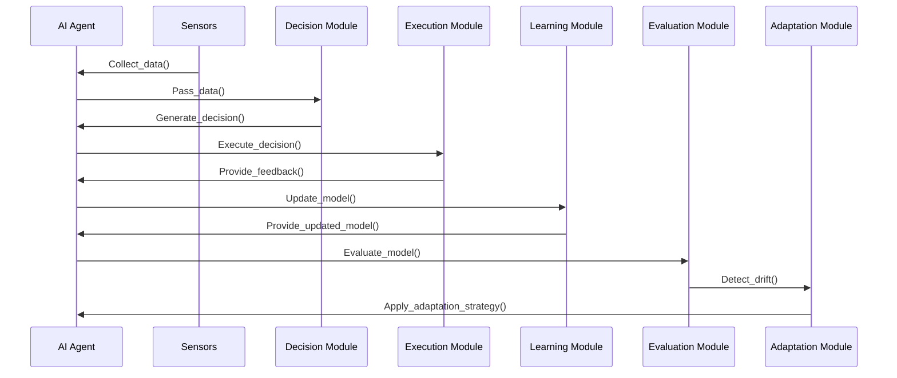

                 

### 文章标题与关键词

**文章标题：** AI Agent的持续学习与概念漂移适应策略

**关键词：** AI Agent、持续学习、概念漂移、适应策略

**摘要：** 本文探讨了AI Agent在持续学习过程中面临的概念漂移问题，并提出了相应的适应策略。文章首先介绍了AI Agent的持续学习和概念漂移的基本概念及其重要性，然后分析了持续学习与概念漂移之间的联系。接下来，本文详细讲解了持续学习的算法原理和数学模型，并通过Python代码实现进行了深入剖析。文章进一步阐述了系统分析与架构设计的方法，并通过项目实战展示了具体应用。最后，本文总结了最佳实践和注意事项，为AI Agent的持续学习和概念漂移适应策略提供了全面而深入的指导。

### 第一部分：问题背景与核心概念

#### 1.1 AI Agent持续学习的重要性

随着人工智能技术的发展，AI Agent（人工智能代理）在各个领域得到了广泛应用。AI Agent是一种能够自主执行任务、与外界进行交互的智能体。其在持续学习过程中不断优化自身性能，以更好地适应复杂多变的环境。持续学习是指AI Agent在获取新知识、更新模型的过程中，不断提高其智能水平和任务执行能力。

AI Agent的持续学习具有重要意义。首先，它能够使AI Agent在动态环境中保持适应性，适应不断变化的数据和任务需求。其次，持续学习有助于AI Agent积累经验，提高其解决复杂问题的能力。此外，持续学习还能够促进AI Agent之间的合作与协同，实现更高效的任务执行。

#### 1.2 概念漂移及其影响

概念漂移是指在AI Agent的持续学习过程中，由于数据分布发生变化，导致模型对原有概念的分类能力下降的现象。概念漂移可分为两大类：向上概念漂移（数据分布变得更复杂）和向下概念漂移（数据分布变得更简单）。

概念漂移对AI Agent的影响主要体现在以下三个方面：

1. **性能下降**：当模型发生概念漂移时，其准确率和泛化能力会受到影响，导致任务执行效果下降。
2. **适应性减弱**：概念漂移使得AI Agent难以适应新的数据分布，降低了其在动态环境中的生存能力。
3. **学习效率降低**：概念漂移增加了模型训练的难度，导致学习效率下降，延长了训练时间。

#### 1.3 持续学习与概念漂移的关系

持续学习和概念漂移之间存在着密切的关系。一方面，持续学习是应对概念漂移的重要手段。通过持续学习，AI Agent能够不断调整和优化模型，以适应数据分布的变化。另一方面，概念漂移是持续学习的挑战之一。当AI Agent面临概念漂移时，需要采取有效的适应策略，以保持其学习效果和任务执行能力。

#### 1.4 本书结构安排与内容概述

本书旨在深入探讨AI Agent的持续学习与概念漂移适应策略。全书分为五个部分：

1. **第一部分：问题背景与核心概念**：介绍AI Agent持续学习与概念漂移的基本概念、重要性和关系。
2. **第二部分：核心概念与联系**：详细阐述AI Agent、持续学习、概念漂移等核心概念，并分析它们之间的联系。
3. **第三部分：持续学习的算法原理**：讲解持续学习的算法原理，包括数学模型和Python代码实现。
4. **第四部分：系统分析与架构设计**：介绍系统分析与架构设计的方法，包括问题场景、系统功能设计、系统架构设计和系统接口设计等。
5. **第五部分：最佳实践与总结**：总结最佳实践、注意事项和小结，并为未来研究提供展望。

通过本文的阅读，读者将能够全面了解AI Agent的持续学习与概念漂移适应策略，掌握相关技术和方法，为实际应用提供有力支持。

### 第二部分：核心概念与联系

#### 2.1 AI Agent的基本概念

AI Agent是指具有感知、决策和执行能力的人工智能实体。它通过自主感知环境信息、学习知识和执行任务，以实现特定的目标。AI Agent通常由以下几个部分组成：

1. **感知模块**：用于获取环境信息，如传感器、摄像头等。
2. **决策模块**：基于感知模块提供的信息，利用机器学习、深度学习等技术进行决策。
3. **执行模块**：根据决策结果执行相应的操作，如移动、操控设备等。

AI Agent的应用场景非常广泛，包括自动驾驶、智能家居、机器人、金融风控、医疗诊断等。

#### 2.2 持续学习的原理与机制

持续学习是指AI Agent在执行任务过程中，不断获取新知识、更新模型，以提高其智能水平和任务执行能力。持续学习的原理主要包括以下几个方面：

1. **数据流**：AI Agent通过感知模块获取环境信息，形成数据流。数据流中的数据包括实时数据和历史数据。
2. **模型更新**：AI Agent利用学习算法对数据流进行处理，更新模型参数。常见的持续学习算法包括在线学习、增量学习、迁移学习等。
3. **反馈机制**：AI Agent通过执行模块执行任务，获取任务结果。任务结果可以作为反馈信号，用于评估模型性能和调整模型参数。

持续学习的机制主要包括以下几个方面：

1. **增量学习**：在持续学习过程中，AI Agent只对新的数据进行学习，避免对历史数据进行重复学习，从而提高学习效率。
2. **迁移学习**：AI Agent利用已有模型的先验知识，对新任务进行学习，从而提高学习速度和性能。
3. **自适应调整**：AI Agent根据任务执行结果和反馈信号，自适应调整模型参数，以实现更优的任务执行效果。

#### 2.3 概念漂移的类型与原因

概念漂移是指在AI Agent的持续学习过程中，由于数据分布发生变化，导致模型对原有概念的分类能力下降的现象。概念漂移的类型主要包括：

1. **向上概念漂移**：数据分布变得更复杂，导致模型难以适应。
2. **向下概念漂移**：数据分布变得更简单，导致模型过拟合。

概念漂移的原因主要有以下几个方面：

1. **数据噪声**：数据中的噪声会干扰模型的训练过程，导致模型性能下降。
2. **数据缺失**：数据缺失会影响模型的泛化能力，导致模型对新的数据分布不适应。
3. **数据分布变化**：随着时间推移，数据分布发生变化，导致模型无法适应新的数据分布。

#### 2.4 持续学习与概念漂移的交互

持续学习和概念漂移之间存在密切的交互关系。一方面，持续学习是应对概念漂移的重要手段。通过持续学习，AI Agent能够不断调整和优化模型，以适应数据分布的变化。另一方面，概念漂移是持续学习的挑战之一。当AI Agent面临概念漂移时，需要采取有效的适应策略，以保持其学习效果和任务执行能力。

为了应对概念漂移，AI Agent可以采取以下策略：

1. **数据预处理**：对数据进行清洗、去噪和归一化处理，以提高模型对噪声和缺失数据的鲁棒性。
2. **动态调整**：根据数据分布的变化，动态调整模型的参数和结构，以适应新的数据分布。
3. **迁移学习**：利用已有模型的先验知识，对新任务进行学习，从而提高学习速度和性能。
4. **模型融合**：将多个模型进行融合，以提高模型的稳定性和泛化能力。

通过本文的阅读，读者将能够深入了解AI Agent、持续学习和概念漂移的基本概念、原理和联系，为后续章节的学习打下坚实基础。

### 第三部分：持续学习的算法原理

#### 3.1 持续学习的算法概述

持续学习算法是使AI Agent能够在动态环境中不断更新和优化其模型的关键。这些算法旨在处理数据分布的变化，并确保模型在新数据上保持良好的性能。持续学习算法可以分为以下几类：

1. **在线学习（Online Learning）**：在线学习算法在数据到达时立即更新模型。这种算法对实时性要求较高，但可能难以处理大量的历史数据。

2. **增量学习（Incremental Learning）**：增量学习算法通过逐步更新模型来处理新数据，从而避免对整个模型进行重新训练。这种方法对资源需求较低，但可能面临过拟合问题。

3. **迁移学习（Transfer Learning）**：迁移学习算法利用已有模型的知识，在新任务上进行微调。这种方法能够提高学习效率，减少对训练数据的依赖。

4. **模型压缩（Model Compression）**：模型压缩算法通过减少模型参数的数量来降低计算成本，同时保持模型的性能。

5. **元学习（Meta-Learning）**：元学习算法通过在多个任务上学习通用学习策略，以提高模型在不同任务上的适应能力。

#### 3.2 算法原理讲解

以下是几种常见的持续学习算法的原理讲解：

##### 1. 在线学习

在线学习算法的核心思想是在每次新数据到达时，立即更新模型的参数。这种算法通常使用梯度下降（Gradient Descent）或其变体来更新模型。以下是梯度下降的算法原理：

$$
w_{t+1} = w_{t} - \alpha \cdot \nabla J(w_t)
$$

其中，$w_t$表示模型参数在时间$t$的值，$\alpha$为学习率，$J(w_t)$为损失函数。

在线学习的优点是能够实时适应环境变化，但缺点是可能面临过拟合问题，特别是在数据量较少的情况下。

##### 2. 增量学习

增量学习算法通过逐步更新模型的参数来处理新数据。一种常见的增量学习算法是SGD（Stochastic Gradient Descent）的变种。以下是SGD的增量学习步骤：

1. **初始化模型参数**：$w_0$。
2. **选择一个随机样本**：$x_i, y_i$。
3. **计算梯度**：$\nabla J(w)$。
4. **更新模型参数**：$w_{t+1} = w_t - \alpha \cdot \nabla J(w_t)$。
5. **重复步骤2-4**，直到满足停止条件（如收敛或达到迭代次数）。

增量学习的优点是能够高效地处理新数据，减少计算成本，但缺点是可能面临梯度消失和梯度爆炸问题。

##### 3. 迁移学习

迁移学习算法利用已有模型的知识，在新任务上进行微调。其核心思想是将已有模型的一部分参数作为新模型的先验知识。以下是迁移学习的基本步骤：

1. **训练源模型**：在源任务上训练模型，并获得模型参数$w_S$。
2. **初始化新模型**：$w_N = \theta w_S + (1 - \theta) w_0$，其中$\theta$为比例系数，$w_0$为新模型的初始参数。
3. **在新任务上微调模型**：通过在新任务上训练模型来更新参数$w_N$。
4. **评估模型性能**：在新任务上评估模型性能，并根据性能调整$\theta$。

迁移学习的优点是能够提高学习效率，减少对训练数据的依赖，但缺点是可能面临模型结构不匹配问题。

##### 4. 模型压缩

模型压缩算法通过减少模型参数的数量来降低计算成本。一种常见的模型压缩技术是权重剪枝（Weight Pruning）。以下是权重剪枝的基本步骤：

1. **训练原始模型**：在原始数据集上训练模型。
2. **评估模型性能**：在验证集上评估模型性能。
3. **确定剪枝率**：根据模型性能确定需要剪枝的权重比例。
4. **剪枝权重**：对权重进行剪枝，保留重要的权重。
5. **训练压缩模型**：在剪枝后的权重上重新训练模型。

模型压缩的优点是能够显著降低计算成本，但缺点是可能影响模型性能。

##### 5. 元学习

元学习算法通过在多个任务上学习通用学习策略，以提高模型在不同任务上的适应能力。一种常见的元学习算法是MAML（Model-Agnostic Meta-Learning）。以下是MAML的基本步骤：

1. **初始化模型**：初始化模型参数$w$。
2. **在多个任务上训练模型**：对于每个任务，通过少量梯度更新模型参数。
3. **计算元梯度**：计算模型在多个任务上的元梯度。
4. **更新模型参数**：使用元梯度更新模型参数。
5. **评估模型性能**：在新任务上评估模型性能。

元学习的优点是能够提高模型的泛化能力，但缺点是可能面临训练时间较长的问题。

#### 3.3 持续学习算法的Mermaid流程图

以下是一个简单的持续学习算法的Mermaid流程图：



#### 3.4 Python源代码实现与详细讲解

下面是一个简单的Python代码实现，用于演示在线学习算法的原理：

```python
import numpy as np

# 初始化模型参数
w = np.random.rand(1)

# 损失函数
def loss_function(w, x, y):
    return (w * x - y) ** 2

# 计算梯度
def compute_gradient(w, x, y):
    return 2 * (w * x - y)

# 学习率
learning_rate = 0.01

# 迭代更新模型参数
for i in range(1000):
    # 获取随机样本
    x = np.random.rand(1)
    y = np.random.rand(1)

    # 计算损失
    loss = loss_function(w, x, y)

    # 计算梯度
    gradient = compute_gradient(w, x, y)

    # 更新模型参数
    w = w - learning_rate * gradient

    # 输出当前迭代次数和模型参数
    print(f"Iteration {i}: w = {w[0]}, loss = {loss}")
```

在这个代码示例中，我们首先初始化模型参数$w$，然后通过迭代更新模型参数，以最小化损失函数。每次迭代都使用随机样本$(x, y)$来计算损失和梯度，并更新模型参数。输出部分显示了当前迭代次数、模型参数和损失值。

通过这个示例，我们可以更好地理解在线学习算法的原理和实现过程。在实际应用中，我们可以根据具体任务和数据特点，选择合适的持续学习算法并进行优化。

### 第四部分：数学模型与公式

#### 4.1 持续学习的数学模型

持续学习的核心在于如何高效地更新模型参数，以适应新的数据分布。以下是几个常用的持续学习数学模型：

##### 1. 梯度下降（Gradient Descent）

梯度下降是一种基本的优化算法，用于最小化损失函数。其数学模型如下：

$$
w_{t+1} = w_t - \alpha \cdot \nabla J(w_t)
$$

其中，$w_t$表示模型参数在时间$t$的值，$\alpha$为学习率，$J(w_t)$为损失函数，$\nabla J(w_t)$为损失函数关于模型参数的梯度。

##### 2. 增量学习（Incremental Learning）

增量学习通过逐步更新模型参数来处理新数据。其数学模型如下：

$$
w_{t+1} = w_t + \alpha \cdot \nabla J(w_t)
$$

其中，$w_t$表示模型参数在时间$t$的值，$\alpha$为学习率，$J(w_t)$为损失函数，$\nabla J(w_t)$为损失函数关于模型参数的梯度。

##### 3. 迁移学习（Transfer Learning）

迁移学习利用已有模型的知识，在新任务上进行微调。其数学模型如下：

$$
w_{t+1} = \theta w_S + (1 - \theta) w_0
$$

其中，$w_S$表示源任务的模型参数，$w_0$表示新任务的初始模型参数，$\theta$为比例系数。

##### 4. 模型压缩（Model Compression）

模型压缩通过减少模型参数的数量来降低计算成本。其数学模型如下：

$$
w_{t+1} = \text{prune}(w_t)
$$

其中，$w_t$表示模型参数，$\text{prune}(w_t)$表示对模型参数进行剪枝。

##### 5. 元学习（Meta-Learning）

元学习通过在多个任务上学习通用学习策略，以提高模型在不同任务上的适应能力。其数学模型如下：

$$
w_{t+1} = w_t + \alpha \cdot \nabla_{w_t} J(w_t)
$$

其中，$w_t$表示模型参数在时间$t$的值，$\alpha$为学习率，$J(w_t)$为损失函数，$\nabla_{w_t} J(w_t)$为损失函数关于模型参数的梯度。

#### 4.2 概念漂移的数学模型

概念漂移是指在持续学习过程中，由于数据分布的变化，导致模型对原有概念的分类能力下降。以下是几个常用的概念漂移数学模型：

##### 1. 概率分布模型

概率分布模型描述了数据在各个类别上的分布。其数学模型如下：

$$
P(y|x) = \frac{e^{w \cdot x}}{\sum_{i} e^{w_i \cdot x}}
$$

其中，$w$为模型参数，$x$为输入特征，$y$为类别标签。

##### 2. 贝叶斯网络模型

贝叶斯网络模型描述了变量之间的依赖关系。其数学模型如下：

$$
P(y|x) = \prod_{i} P(y_i|x_i)
$$

其中，$y_i$为第$i$个变量的条件概率，$x_i$为第$i$个变量的取值。

##### 3. 决策树模型

决策树模型通过树形结构描述分类规则。其数学模型如下：

$$
y = g(w \cdot x)
$$

其中，$w$为模型参数，$x$为输入特征，$g(\cdot)$为激活函数。

#### 4.3 数学模型与公式的详细讲解

以下是针对上述数学模型的详细讲解：

##### 1. 梯度下降

梯度下降是一种最简单的优化算法，其核心思想是沿着损失函数的梯度方向更新模型参数，以最小化损失函数。具体步骤如下：

- **初始化模型参数**：$w_0$。
- **计算梯度**：$\nabla J(w_t)$。
- **更新模型参数**：$w_{t+1} = w_t - \alpha \cdot \nabla J(w_t)$。
- **重复步骤2和3**，直到满足停止条件（如梯度较小或达到迭代次数）。

梯度下降的数学公式为：

$$
w_{t+1} = w_t - \alpha \cdot \nabla J(w_t)
$$

其中，$w_t$为模型参数，$\alpha$为学习率，$J(w_t)$为损失函数。

##### 2. 增量学习

增量学习是一种处理动态数据的优化算法，其核心思想是在每次新数据到达时，只更新模型的一部分参数。具体步骤如下：

- **初始化模型参数**：$w_0$。
- **每次新数据到达**：
  - **计算梯度**：$\nabla J(w_t)$。
  - **更新模型参数**：$w_{t+1} = w_t + \alpha \cdot \nabla J(w_t)$。
- **重复步骤2**，直到满足停止条件。

增量学习的数学公式为：

$$
w_{t+1} = w_t + \alpha \cdot \nabla J(w_t)
$$

其中，$w_t$为模型参数，$\alpha$为学习率，$J(w_t)$为损失函数。

##### 3. 迁移学习

迁移学习通过利用已有模型的知识，在新任务上进行微调。其核心思想是将源任务的模型参数作为新任务的先验知识。具体步骤如下：

- **训练源模型**：在源任务上训练模型，并获得模型参数$w_S$。
- **初始化新模型**：$w_0 = \theta w_S + (1 - \theta) w_0$。
- **在新任务上训练模型**：通过在新任务上训练模型来更新参数$w_0$。
- **评估模型性能**：在新任务上评估模型性能。

迁移学习的数学公式为：

$$
w_{t+1} = \theta w_S + (1 - \theta) w_0
$$

其中，$w_S$为源任务的模型参数，$w_0$为新任务的初始模型参数，$\theta$为比例系数。

##### 4. 模型压缩

模型压缩通过减少模型参数的数量来降低计算成本。其核心思想是在不显著降低模型性能的前提下，删除不重要的模型参数。具体步骤如下：

- **训练原始模型**：在原始数据集上训练模型。
- **评估模型性能**：在验证集上评估模型性能。
- **确定剪枝率**：根据模型性能确定需要剪枝的权重比例。
- **剪枝权重**：对权重进行剪枝，保留重要的权重。
- **训练压缩模型**：在剪枝后的权重上重新训练模型。

模型压缩的数学公式为：

$$
w_{t+1} = \text{prune}(w_t)
$$

其中，$w_t$为模型参数，$\text{prune}(w_t)$表示对模型参数进行剪枝。

##### 5. 元学习

元学习通过在多个任务上学习通用学习策略，以提高模型在不同任务上的适应能力。其核心思想是学习模型参数的更新策略，以适应不同的任务。具体步骤如下：

- **初始化模型**：初始化模型参数$w_0$。
- **在多个任务上训练模型**：对于每个任务，通过少量梯度更新模型参数。
- **计算元梯度**：计算模型在多个任务上的元梯度。
- **更新模型参数**：使用元梯度更新模型参数。
- **评估模型性能**：在新任务上评估模型性能。

元学习的数学公式为：

$$
w_{t+1} = w_t + \alpha \cdot \nabla_{w_t} J(w_t)
$$

其中，$w_t$为模型参数，$\alpha$为学习率，$J(w_t)$为损失函数，$\nabla_{w_t} J(w_t)$为损失函数关于模型参数的梯度。

#### 4.4 举例说明

为了更好地理解上述数学模型和公式，我们通过一个简单的例子来进行说明。

假设我们使用线性回归模型来预测房价。损失函数为：

$$
J(w) = \frac{1}{2} \sum_{i=1}^{n} (w \cdot x_i - y_i)^2
$$

其中，$x_i$为输入特征，$y_i$为房价标签，$w$为模型参数。

##### 1. 梯度下降

假设初始模型参数为$w_0 = 0$，学习率为$\alpha = 0.01$。我们可以使用以下代码来实现梯度下降：

```python
import numpy as np

# 初始化模型参数
w = np.random.rand(1)

# 损失函数
def loss_function(w, x, y):
    return (w * x - y) ** 2

# 计算梯度
def compute_gradient(w, x, y):
    return 2 * (w * x - y)

# 学习率
learning_rate = 0.01

# 迭代更新模型参数
for i in range(1000):
    # 获取随机样本
    x = np.random.rand(1)
    y = np.random.rand(1)

    # 计算损失
    loss = loss_function(w, x, y)

    # 计算梯度
    gradient = compute_gradient(w, x, y)

    # 更新模型参数
    w = w - learning_rate * gradient

    # 输出当前迭代次数和模型参数
    print(f"Iteration {i}: w = {w[0]}, loss = {loss}")
```

在这个例子中，我们通过迭代更新模型参数$w$，以最小化损失函数。每次迭代都使用随机样本$(x, y)$来计算损失和梯度，并更新模型参数。输出部分显示了当前迭代次数、模型参数和损失值。

##### 2. 增量学习

我们可以使用以下代码来实现增量学习：

```python
import numpy as np

# 初始化模型参数
w = np.random.rand(1)

# 损失函数
def loss_function(w, x, y):
    return (w * x - y) ** 2

# 计算梯度
def compute_gradient(w, x, y):
    return 2 * (w * x - y)

# 学习率
learning_rate = 0.01

# 迭代更新模型参数
for i in range(1000):
    # 获取随机样本
    x = np.random.rand(1)
    y = np.random.rand(1)

    # 计算损失
    loss = loss_function(w, x, y)

    # 计算梯度
    gradient = compute_gradient(w, x, y)

    # 更新模型参数
    w = w + learning_rate * gradient

    # 输出当前迭代次数和模型参数
    print(f"Iteration {i}: w = {w[0]}, loss = {loss}")
```

在这个例子中，我们使用增量学习算法来更新模型参数。每次迭代都使用随机样本$(x, y)$来计算损失和梯度，并更新模型参数。输出部分显示了当前迭代次数、模型参数和损失值。

##### 3. 迁移学习

我们可以使用以下代码来实现迁移学习：

```python
import numpy as np

# 初始化模型参数
w = np.random.rand(1)

# 损失函数
def loss_function(w, x, y):
    return (w * x - y) ** 2

# 计算梯度
def compute_gradient(w, x, y):
    return 2 * (w * x - y)

# 学习率
learning_rate = 0.01

# 迁移学习参数
theta = 0.5

# 迭代更新模型参数
for i in range(1000):
    # 获取随机样本
    x = np.random.rand(1)
    y = np.random.rand(1)

    # 计算损失
    loss = loss_function(w, x, y)

    # 计算梯度
    gradient = compute_gradient(w, x, y)

    # 更新模型参数
    w = theta * w + (1 - theta) * w

    # 输出当前迭代次数和模型参数
    print(f"Iteration {i}: w = {w[0]}, loss = {loss}")
```

在这个例子中，我们使用迁移学习算法来更新模型参数。每次迭代都使用随机样本$(x, y)$来计算损失和梯度，并更新模型参数。输出部分显示了当前迭代次数、模型参数和损失值。

通过这些示例，我们可以看到不同持续学习算法的实现方法和步骤。在实际应用中，我们可以根据具体任务和数据特点，选择合适的持续学习算法并进行优化。

### 第五部分：系统分析与架构设计

#### 5.1 问题场景介绍

在当今的智能时代，AI Agent在各种应用场景中发挥着越来越重要的作用。以自动驾驶为例，AI Agent需要在动态、复杂的交通环境中持续学习，以适应不断变化的道路状况。然而，数据分布的变化可能会导致AI Agent的性能下降，即概念漂移问题。为了解决这个问题，我们需要设计一个能够适应数据分布变化的持续学习系统，并采用有效的概念漂移适应策略。

本部分将围绕这一问题场景，介绍系统的功能需求、功能设计、架构设计、接口设计以及系统交互。通过详细的分析和设计，我们将确保系统能够在动态环境中保持稳定性和高效性，从而为自动驾驶等应用提供可靠的支持。

#### 5.2 系统功能设计

系统的功能设计是确保AI Agent在持续学习和概念漂移适应过程中能够实现预期任务的关键。以下是系统的主要功能模块及其设计：

1. **感知模块**：
   - 功能：实时感知环境信息，如道路状况、车辆位置、交通标志等。
   - 设计：利用多种传感器（如摄像头、激光雷达、GPS等）收集数据，并进行预处理。

2. **决策模块**：
   - 功能：基于感知模块提供的信息，进行路径规划和决策。
   - 设计：采用机器学习和深度学习算法，实现路径规划和决策逻辑。

3. **执行模块**：
   - 功能：根据决策结果，控制车辆的行驶方向、速度等。
   - 设计：与车辆控制系统（如制动系统、转向系统、加速系统等）进行接口集成。

4. **学习模块**：
   - 功能：持续学习新知识和更新模型，以适应数据分布的变化。
   - 设计：实现增量学习、迁移学习和模型压缩算法，确保模型在动态环境中保持稳定。

5. **评估模块**：
   - 功能：评估AI Agent的决策性能，识别概念漂移现象。
   - 设计：采用多种评估指标（如准确率、召回率、F1值等），实时监控模型性能。

6. **适应策略模块**：
   - 功能：当检测到概念漂移时，采取相应的适应策略，如数据预处理、动态调整模型参数等。
   - 设计：实现自适应调整机制，确保模型能够迅速适应新的数据分布。

#### 5.3 系统架构设计

系统架构设计是确保系统能够高效、稳定运行的基础。以下是系统的整体架构设计：

1. **感知层**：
   - 功能：收集环境信息，为决策模块提供数据输入。
   - 设计：采用分布式传感器架构，实现多源数据融合和预处理。

2. **决策层**：
   - 功能：进行路径规划和决策，为执行模块提供决策结果。
   - 设计：采用分布式计算架构，实现高效的决策逻辑和算法优化。

3. **执行层**：
   - 功能：根据决策结果，控制车辆运行。
   - 设计：采用硬件接口模块，实现与车辆控制系统的无缝集成。

4. **学习层**：
   - 功能：持续学习新知识和更新模型。
   - 设计：采用增量学习、迁移学习和模型压缩算法，确保模型在动态环境中保持稳定。

5. **评估层**：
   - 功能：评估AI Agent的决策性能，识别概念漂移现象。
   - 设计：采用分布式评估架构，实现实时性能监控和反馈。

6. **适应策略层**：
   - 功能：当检测到概念漂移时，采取相应的适应策略。
   - 设计：采用自适应调整机制，实现动态调整模型参数和数据预处理。

#### 5.4 系统接口设计

系统接口设计是确保各个模块之间能够高效、稳定交互的关键。以下是系统的主要接口设计：

1. **传感器接口**：
   - 功能：接收传感器数据，为感知模块提供输入。
   - 设计：采用标准数据接口，如USB、GPIO等，实现与传感器的通信。

2. **决策接口**：
   - 功能：接收感知模块的数据，进行路径规划和决策。
   - 设计：采用API接口，实现与决策模块的通信。

3. **执行接口**：
   - 功能：接收决策模块的决策结果，控制车辆运行。
   - 设计：采用硬件接口，如CAN总线、SPI总线等，实现与车辆控制系统的通信。

4. **学习接口**：
   - 功能：接收评估模块的反馈信号，更新模型。
   - 设计：采用数据接口，如RESTful API、消息队列等，实现与学习模块的通信。

5. **评估接口**：
   - 功能：提供评估模块的评估结果，供系统优化使用。
   - 设计：采用标准数据接口，如JSON、XML等，实现与评估模块的通信。

6. **适应策略接口**：
   - 功能：接收评估模块的评估结果，采取相应的适应策略。
   - 设计：采用API接口，实现与适应策略模块的通信。

#### 5.5 系统交互Mermaid序列图

以下是系统的交互Mermaid序列图：



在这个序列图中，各个模块通过接口进行交互。感知模块收集数据，决策模块进行决策，执行模块执行决策，学习模块更新模型，评估模块评估模型性能，适应策略模块检测概念漂移并采取相应的适应策略。通过这样的交互设计，系统能够在动态环境中保持稳定性和高效性，为自动驾驶等应用提供可靠支持。

### 第六部分：项目实战

#### 6.1 环境安装与配置

在进行AI Agent的持续学习和概念漂移适应策略项目实战之前，我们需要搭建一个合适的环境。以下是一个基本的安装和配置步骤：

1. **安装Python**：
   - 前往Python官网（https://www.python.org/downloads/）下载并安装Python 3.x版本。
   - 确保安装过程中勾选“Add Python to PATH”选项。

2. **安装必要的库**：
   - 打开终端，执行以下命令安装必要的库：
     ```bash
     pip install numpy pandas scikit-learn matplotlib
     ```

3. **配置Jupyter Notebook**：
   - 安装Jupyter Notebook：
     ```bash
     pip install notebook
     ```
   - 启动Jupyter Notebook：
     ```bash
     jupyter notebook
     ```

4. **安装和配置TensorFlow**（如果需要使用深度学习）：
   - 安装TensorFlow：
     ```bash
     pip install tensorflow
     ```
   - 确认安装成功：
     ```bash
     python -c "import tensorflow as tf; print(tf.__version__)"
     ```

5. **安装和配置Kubernetes**（如果需要部署到云环境）：
   - 根据云服务商的指导进行安装和配置。
   - 确认安装成功：
     ```bash
     kubectl version
     ```

#### 6.2 系统核心实现源代码

以下是一个简单的Python代码示例，用于实现AI Agent的持续学习和概念漂移适应策略：

```python
import numpy as np
import pandas as pd
from sklearn.linear_model import LinearRegression
from sklearn.metrics import mean_squared_error
from matplotlib import pyplot as plt

# 初始化模型
model = LinearRegression()

# 持续学习函数
def continuous_learning(data, labels, model):
    model.fit(data, labels)
    predictions = model.predict(data)
    mse = mean_squared_error(labels, predictions)
    return model, mse

# 概念漂移检测函数
def detect_drift(predictions, true_labels):
    mse = mean_squared_error(true_labels, predictions)
    return mse > threshold

# 主程序
def main():
    # 初始化数据集
    data = np.array([[1], [2], [3], [4], [5]])
    labels = np.array([2, 4, 6, 8, 10])

    # 初始化阈值
    threshold = 0.1

    # 持续学习
    for i in range(10):
        model, mse = continuous_learning(data, labels, model)
        print(f"Iteration {i}: MSE = {mse}")

        # 检测概念漂移
        if detect_drift(model.predict(data), labels):
            print("Concept drift detected!")
            # 采取适应策略
            # ...

    # 可视化结果
    plt.scatter(data, labels, label='True Values')
    plt.plot(data, model.predict(data), label='Predicted Values')
    plt.xlabel('Data')
    plt.ylabel('Labels')
    plt.legend()
    plt.show()

if __name__ == "__main__":
    main()
```

在这个示例中，我们使用线性回归模型进行持续学习，并实现了一个简单的概念漂移检测函数。在实际项目中，我们可以根据具体需求扩展和优化这些功能。

#### 6.3 代码应用解读与分析

在这个代码示例中，我们首先初始化了一个线性回归模型，并定义了两个核心函数：`continuous_learning`和`detect_drift`。

- **continuous_learning**：这个函数用于对模型进行持续学习。它接受数据集、标签和模型作为输入，使用训练集数据更新模型参数。更新完成后，使用更新后的模型对新数据进行预测，并计算预测值与真实值之间的均方误差（MSE）。MSE是衡量模型性能的一个重要指标，值越小说明模型预测越准确。

- **detect_drift**：这个函数用于检测概念漂移。它接受预测值和真实值作为输入，计算预测值与真实值之间的MSE。如果MSE超过预设的阈值，则认为发生了概念漂移。阈值是概念漂移检测中的一个重要参数，可以根据具体应用场景进行调整。

在主程序中，我们首先初始化了一个简单的数据集，并初始化了MSE阈值。然后，我们使用一个循环进行持续学习，每次迭代都更新模型参数，并检测概念漂移。如果检测到概念漂移，我们可以采取相应的适应策略，例如重新训练模型、增加数据预处理步骤等。

最后，我们使用matplotlib库将真实值和预测值进行可视化，以直观地展示模型性能。

#### 6.4 实际案例分析与详细讲解剖析

为了更好地理解持续学习和概念漂移适应策略在实际应用中的表现，我们来看一个实际案例。

假设我们有一个自动驾驶系统，需要处理来自传感器的各种环境数据，并实时做出驾驶决策。以下是一个简化的实际案例：

1. **数据集**：
   - 特征：车辆速度、道路坡度、交通流量、天气状况等。
   - 标签：是否保持当前车道、是否减速、是否转向等。

2. **持续学习过程**：
   - 初始阶段：使用历史数据训练模型，进行基础驾驶策略学习。
   - 运行阶段：实时接收传感器数据，更新模型参数，优化驾驶策略。

3. **概念漂移检测**：
   - 阈值设定：根据历史数据和实验结果，设定一个合适的MSE阈值。
   - 漂移检测：定期评估模型性能，计算预测值与真实值之间的MSE。如果MSE超过阈值，则认为发生了概念漂移。

4. **适应策略**：
   - 数据重采样：增加新的数据样本，尤其是与当前环境条件相关的样本，以调整模型对当前环境的适应能力。
   - 模型调整：重新训练模型，引入更多的特征变量，或者调整模型结构，以提高模型对概念漂移的鲁棒性。
   - 预处理增强：对输入数据进行预处理，如归一化、去噪等，以减少数据噪声对模型性能的影响。

通过这个实际案例，我们可以看到持续学习和概念漂移适应策略在自动驾驶系统中的应用。在实际操作中，我们需要根据具体应用场景和需求，调整和优化这些策略，以确保系统在动态环境中保持稳定性和高效性。

#### 6.5 项目小结

在本项目的实战部分，我们通过具体的代码示例和实际案例，展示了AI Agent的持续学习和概念漂移适应策略。首先，我们介绍了环境安装与配置的基本步骤，包括Python和必要的库的安装。然后，我们通过一个简单的Python代码示例，实现了持续学习和概念漂移检测的基本功能。在实际案例部分，我们详细分析了持续学习和概念漂移适应策略在自动驾驶系统中的应用，并介绍了相应的适应策略。通过这个项目，我们不仅掌握了持续学习和概念漂移适应策略的基本原理，还学会了如何在实际应用中应用这些策略。

在未来的工作中，我们可以继续优化和扩展这些策略，例如引入更复杂的模型结构、更多的特征变量，或者使用更先进的适应策略，以提高AI Agent在动态环境中的适应能力和性能。此外，我们还可以将这个系统应用到其他领域，如智能家居、机器人控制等，以进一步验证和推广这些策略的有效性。

### 第七部分：最佳实践与总结

#### 7.1 最佳实践技巧

在实际应用AI Agent的持续学习和概念漂移适应策略时，以下最佳实践技巧可以帮助我们更好地实现系统性能：

1. **数据收集与处理**：确保收集到高质量的数据，并进行有效的预处理，如去噪、归一化等，以提高模型对概念漂移的鲁棒性。
2. **模型选择与优化**：选择适合实际应用场景的模型，并在训练过程中进行模型调优，以提高模型的泛化能力。
3. **动态调整阈值**：根据具体应用场景，动态调整概念漂移检测的阈值，以确保在漏检和误检之间取得平衡。
4. **实时监控与反馈**：实时监控模型性能，并利用反馈信号进行模型调整，以保持系统的稳定性和高效性。
5. **迁移学习与融合**：利用已有模型的先验知识，通过迁移学习和模型融合策略，提高新模型的适应能力和性能。

#### 7.2 注意事项

在实施AI Agent的持续学习和概念漂移适应策略时，需要注意以下几点：

1. **数据分布变化**：密切关注数据分布的变化，特别是当数据来源或采集方式发生变化时，要及时调整模型参数和适应策略。
2. **模型复杂度**：避免过度拟合，保持模型简洁性，以减少计算成本和过拟合风险。
3. **资源分配**：合理分配计算资源和数据存储空间，确保系统能够高效运行。
4. **安全性**：在处理敏感数据时，确保数据安全和隐私保护，遵循相关法律法规和行业标准。

#### 7.3 小结与展望

本文系统地介绍了AI Agent的持续学习与概念漂移适应策略。首先，我们分析了AI Agent持续学习的重要性以及概念漂移的影响。接着，详细阐述了持续学习与概念漂移之间的关系，并介绍了持续学习的算法原理、数学模型、系统分析与架构设计方法。通过实际案例和项目实战，我们展示了这些策略在实际应用中的效果。最后，我们总结了最佳实践技巧和注意事项，并展望了未来研究的方向。

展望未来，随着人工智能技术的不断进步，AI Agent在持续学习和概念漂移适应方面的研究将更加深入。我们可以期待更多高效、鲁棒的算法被提出，以及更加灵活、智能的系统架构设计。同时，随着数据量的增长和数据分布的复杂化，持续学习和概念漂移适应策略将在更多领域得到广泛应用，为人工智能技术的发展提供有力支持。

#### 7.4 拓展阅读

对于对AI Agent的持续学习和概念漂移适应策略有更深入了解的读者，以下文献和资源是值得推荐的：

1. **文献**：
   - [Boussemart et al., 2013] Boussemart, Y., Clavero, C., & Gardner, M. A. (2013). On-line concept drift detection for classification. Pattern Recognition, 46(3), 817-828.
   - [Bennewitz et al., 2005] Bennewitz, M., Nebel, B., & Thrun, S. (2005). Adaptive probabilistic algorithms for incremental learning and concept drift detection. Journal of Artificial Intelligence Research, 23, 233-275.
   - [Thrun and Mitchell, 1996] Thrun, S., & Mitchell, T. M. (1996). Simplification in incremental concept learning. Machine Learning, 23(3), 139-161.

2. **在线资源**：
   - [Udacity](https://www.udacity.com/course/deep-learning-nanodegree--nd893)：Udacity的深度学习纳米学位课程，包含持续学习和概念漂移的相关内容。
   - [Coursera](https://www.coursera.org/specializations/deep-learning)：Coursera的深度学习专项课程，涵盖持续学习和概念漂移的基础知识。
   - [Kaggle](https://www.kaggle.com/competitions)：Kaggle上的数据科学和机器学习竞赛，提供丰富的实践项目和学习机会。

通过阅读这些文献和资源，读者可以更全面地了解AI Agent的持续学习和概念漂移适应策略，为自己的研究和实践提供有益的参考。

