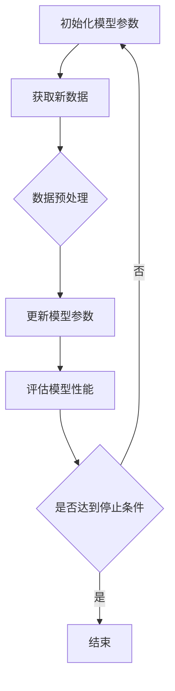
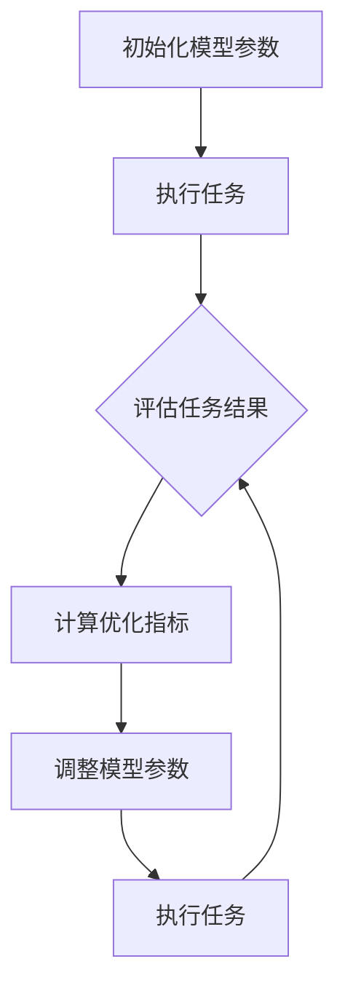
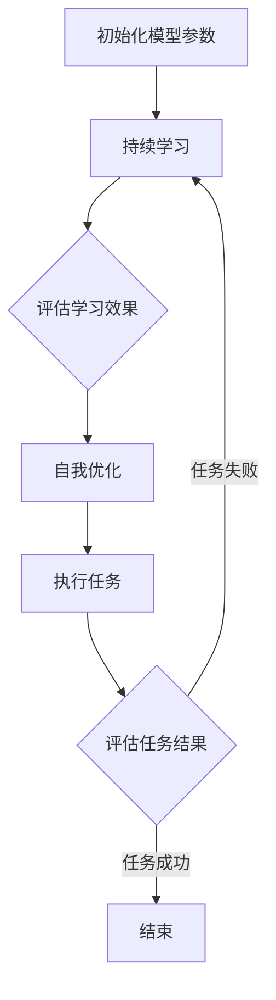
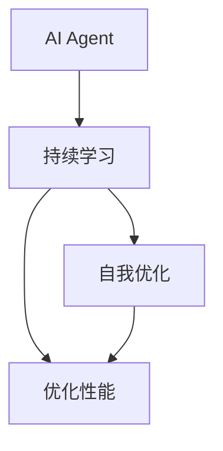
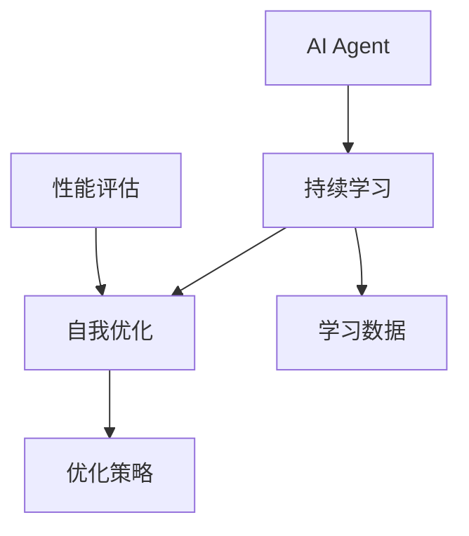
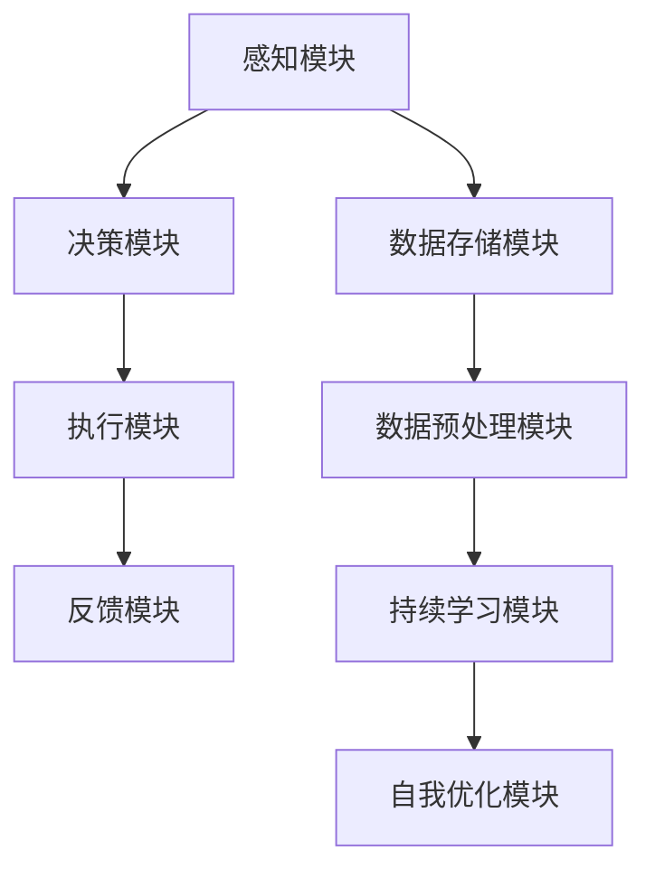
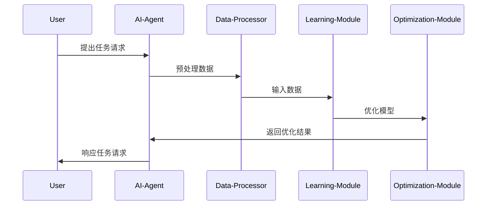

                 

# AI Agent的持续学习与自我优化机制

## 关键词：AI Agent，持续学习，自我优化，算法原理，应用案例分析，最佳实践

## 摘要

本文旨在深入探讨AI Agent的持续学习与自我优化机制。首先，我们将介绍AI Agent的定义及其重要性，接着详细阐述持续学习与自我优化机制的基本概念、理论基础和实现方法。通过实际案例，我们将展示这些机制的应用，并总结最佳实践。最后，我们将讨论结合持续学习与自我优化机制的理论基础、算法原理及其实际应用。

## 引言

### 1.1 AI Agent的定义与重要性

#### 1.1.1 AI Agent的基本概念

AI Agent是指具有感知、决策和执行能力的人工智能系统。它可以在复杂环境中模拟人类的行为，并通过自主学习不断优化其表现。AI Agent的核心特点是自主性、适应性和智能性。

#### 1.1.2 AI Agent在AI领域的重要性

AI Agent是现代人工智能的核心研究领域之一，其应用涵盖了智能机器人、智能客服、自动驾驶等多个领域。AI Agent的发展不仅推动了人工智能技术的进步，也为各行业的智能化转型提供了技术支持。

#### 1.1.3 AI Agent的应用场景

AI Agent在多个场景中具有重要应用，例如：

- **智能客服**：AI Agent可以自动处理大量客户咨询，提高客服效率。
- **自动驾驶**：AI Agent可以通过感知环境和决策控制车辆，实现自动驾驶。
- **智能医疗**：AI Agent可以帮助医生进行疾病诊断和治疗方案推荐。
- **智能家居**：AI Agent可以实现家电自动化控制，提高生活便利性。

### 1.2 持续学习与自我优化机制概述

#### 1.2.1 持续学习的必要性

持续学习是AI Agent保持竞争力的重要手段。在复杂多变的实际环境中，AI Agent需要不断学习新的知识和技能，以适应环境变化。

#### 1.2.2 自我优化机制的内涵

自我优化机制是指AI Agent通过自我调整和优化，提高其表现和适应能力。自我优化包括模型优化、算法优化和策略优化等多个方面。

#### 1.2.3 持续学习与自我优化的关系

持续学习与自我优化相辅相成。持续学习为AI Agent提供了新的知识和技能，而自我优化则确保AI Agent能够将这些知识和技能有效应用于实际任务中。

### 1.3 书籍结构安排与内容概述

#### 1.3.1 书籍结构安排

本书分为四部分，分别探讨AI Agent的持续学习与自我优化机制。

- **第一部分**：引言，介绍AI Agent的基本概念及其在AI领域的重要性。
- **第二部分**：持续学习机制，讨论持续学习的基础理论、算法原理和应用案例。
- **第三部分**：自我优化机制，分析自我优化的理论基础、算法原理和应用案例。
- **第四部分**：结合机制，探讨持续学习与自我优化的结合方式及其应用。

#### 1.3.2 各章节主要内容概述

- **第二部分**：持续学习机制，包括持续学习的基础理论、算法原理和应用案例。
- **第三部分**：自我优化机制，包括自我优化的理论基础、算法原理和应用案例。
- **第四部分**：结合机制，包括结合机制的理论基础、算法原理和应用案例。

### 1.4 目录大纲总结

#### 1.4.1 目录大纲的总体结构

本书分为四部分，分别探讨AI Agent的持续学习与自我优化机制。

#### 1.4.2 目录大纲的关键点

- AI Agent的定义与重要性
- 持续学习与自我优化机制的基本概念
- 持续学习与自我优化的算法原理
- 持续学习与自我优化的应用案例
- 结合持续学习与自我优化机制的实践

## 第二部分：持续学习机制

### 2.1 持续学习的基础理论与方法

#### 2.1.1 持续学习的基本概念

持续学习是指AI Agent在任务执行过程中，不断从数据中学习新知识，并优化自身性能的过程。

#### 2.1.2 持续学习的理论基础

持续学习依赖于机器学习、深度学习等理论，特别是在线学习和迁移学习技术。

#### 2.1.3 持续学习的主要方法

持续学习的方法包括：

- **在线学习**：在任务执行过程中，不断更新模型参数。
- **迁移学习**：利用已有任务的知识，快速适应新任务。
- **元学习**：通过学习如何学习，提高学习效率。

### 2.2 持续学习的算法原理与实现

#### 2.2.1 持续学习算法的mermaid流程图



#### 2.2.2 Python源代码实现

```python
# 持续学习算法的Python实现

# 导入相关库
import numpy as np
import pandas as pd
from sklearn.linear_model import SGDClassifier

# 初始化模型参数
model = SGDClassifier()

# 获取新数据
data = pd.read_csv('new_data.csv')

# 数据预处理
# ...

# 更新模型参数
model.partial_fit(data)

# 评估模型性能
performance = model.score(data)

# 判断是否达到停止条件
# ...
```

#### 2.2.3 持续学习算法的数学模型和公式讲解

持续学习算法的数学模型主要涉及在线学习算法，如梯度下降法。其公式如下：

$$
w_{t+1} = w_t - \alpha \cdot \nabla Loss(w_t)
$$

其中，$w_t$ 表示第 $t$ 次迭代的模型参数，$\alpha$ 表示学习率，$\nabla Loss(w_t)$ 表示损失函数关于 $w_t$ 的梯度。

### 2.3 持续学习的应用案例分析

#### 2.3.1 案例一：智能客服系统

智能客服系统利用持续学习机制，不断从用户咨询中学习，提高回答问题的准确性。通过在线学习和迁移学习技术，智能客服系统能够快速适应不同场景，提高用户满意度。

#### 2.3.2 案例二：智能交通系统

智能交通系统通过持续学习，不断优化交通信号控制策略。在交通流量变化时，智能交通系统能够实时调整信号灯时长，提高交通效率，减少拥堵。

#### 2.3.3 案例三：智能医疗诊断系统

智能医疗诊断系统利用持续学习，从医疗数据中学习新的诊断方法。通过迁移学习技术，智能医疗诊断系统能够快速适应不同医院、不同科室的诊疗需求，提高诊断准确性。

### 2.4 持续学习机制的最佳实践

#### 2.4.1 最佳实践总结

- **数据质量**：确保输入数据质量，提高模型学习效果。
- **自适应学习率**：根据模型性能动态调整学习率，提高学习效率。
- **迁移学习**：利用已有知识，快速适应新任务。

#### 2.4.2 注意事项与挑战

- **数据隐私**：持续学习过程中，需要确保数据隐私。
- **模型可解释性**：提高模型的可解释性，方便用户理解和信任。

#### 2.4.3 拓展阅读推荐

- 《深度学习》（Goodfellow, Bengio, Courville 著）
- 《机器学习实战》（Hastie, Tibshirani, Friedman 著）

## 第三部分：自我优化机制

### 3.1 自我优化机制的基础理论与方法

#### 3.1.1 自我优化的基本概念

自我优化是指AI Agent通过调整自身参数，提高其性能的过程。

#### 3.1.2 自我优化的理论基础

自我优化依赖于优化理论、控制理论等基础理论。

#### 3.1.3 自我优化的主要方法

自我优化的主要方法包括：

- **模型优化**：调整模型参数，提高模型性能。
- **算法优化**：改进学习算法，提高学习效率。
- **策略优化**：调整策略，提高任务完成率。

### 3.2 自我优化的算法原理与实现

#### 3.2.1 自我优化算法的mermaid流程图



#### 3.2.2 Python源代码实现

```python
# 自我优化算法的Python实现

# 导入相关库
import numpy as np
import pandas as pd
from sklearn.linear_model import SGDClassifier

# 初始化模型参数
model = SGDClassifier()

# 执行任务
data = pd.read_csv('task_data.csv')
result = model.predict(data)

# 评估任务结果
performance = model.score(data)

# 计算优化指标
# ...

# 调整模型参数
model.partial_fit(data)

# 执行任务
# ...
```

#### 3.2.3 自我优化算法的数学模型和公式讲解

自我优化算法的数学模型主要涉及优化理论，如梯度下降法。其公式如下：

$$
w_{t+1} = w_t - \alpha \cdot \nabla Loss(w_t)
$$

其中，$w_t$ 表示第 $t$ 次迭代的模型参数，$\alpha$ 表示学习率，$\nabla Loss(w_t)$ 表示损失函数关于 $w_t$ 的梯度。

### 3.3 自我优化的应用案例分析

#### 3.3.1 案例一：智能游戏机器人

智能游戏机器人通过自我优化，不断调整策略，提高游戏胜率。在游戏过程中，智能游戏机器人会根据游戏结果调整策略参数，实现自我优化。

#### 3.3.2 案例二：智能家居控制系统

智能家居控制系统通过自我优化，提高家电自动化控制效果。智能家居控制系统会根据用户行为习惯，调整家电控制策略，实现自我优化。

#### 3.3.3 案例三：自动驾驶车辆系统

自动驾驶车辆系统通过自我优化，提高驾驶安全性。在自动驾驶过程中，自动驾驶车辆系统会根据路况、交通状况等实时调整驾驶策略，实现自我优化。

### 3.4 自我优化机制的最佳实践

#### 3.4.1 最佳实践总结

- **实时反馈**：及时获取任务结果，实现实时优化。
- **自适应调整**：根据任务特点，动态调整优化策略。
- **多策略结合**：结合多种优化方法，提高优化效果。

#### 3.4.2 注意事项与挑战

- **优化指标选择**：选择合适的优化指标，避免陷入局部最优。
- **模型稳定**：确保模型稳定性，避免优化过程中模型崩溃。

#### 3.4.3 拓展阅读推荐

- 《优化理论及其应用》（Nocedal, Wright 著）
- 《控制理论及其应用》（Grewal, Andrews 著）

## 第四部分：持续学习与自我优化机制的结合

### 4.1 结合机制的理论基础

#### 4.1.1 持续学习与自我优化的结合意义

持续学习与自我优化的结合，可以提高AI Agent的适应能力和性能表现。通过持续学习，AI Agent能够不断获取新的知识和技能；通过自我优化，AI Agent能够将这些知识和技能有效应用于实际任务中，实现性能提升。

#### 4.1.2 结合机制的理论框架

结合机制的理论框架主要包括：

- **持续学习模块**：负责从数据中学习新知识和技能。
- **自我优化模块**：负责调整模型参数和策略，提高任务完成率。
- **结合策略**：负责协调持续学习与自我优化的过程。

#### 4.1.3 结合机制的实现策略

实现策略包括：

- **联合训练**：将持续学习和自我优化过程合并，实现同时优化。
- **模块化设计**：将持续学习和自我优化模块化，实现独立开发和部署。

### 4.2 结合机制的算法原理与实现

#### 4.2.1 结合机制算法的mermaid流程图



#### 4.2.2 Python源代码实现

```python
# 结合机制算法的Python实现

# 导入相关库
import numpy as np
import pandas as pd
from sklearn.linear_model import SGDClassifier

# 初始化模型参数
model = SGDClassifier()

# 持续学习
# ...

# 评估学习效果
performance = model.score(data)

# 自我优化
# ...

# 执行任务
# ...

# 评估任务结果
# ...
```

#### 4.2.3 结合机制算法的数学模型和公式讲解

结合机制的数学模型主要包括持续学习模型和自我优化模型。持续学习模型如下：

$$
w_{t+1} = w_t + \alpha \cdot \nabla Loss(w_t)
$$

自我优化模型如下：

$$
w_{t+1} = w_t - \beta \cdot \nabla Loss(w_t)
$$

其中，$w_t$ 表示第 $t$ 次迭代的模型参数，$\alpha$ 和 $\beta$ 分别表示持续学习和自我优化的学习率，$\nabla Loss(w_t)$ 表示损失函数关于 $w_t$ 的梯度。

### 4.3 结合机制的应用案例分析

#### 4.3.1 案例一：智能推荐系统

智能推荐系统结合持续学习和自我优化，实现个性化推荐。在用户行为数据不断变化的情况下，智能推荐系统通过持续学习，不断优化推荐算法，提高推荐准确性；通过自我优化，调整推荐策略，实现个性化推荐。

#### 4.3.2 案例二：智能监控系统

智能监控系统结合持续学习和自我优化，实现实时监控与异常检测。在监控数据不断变化的情况下，智能监控系统通过持续学习，提高异常检测准确率；通过自我优化，调整监控策略，实现实时监控。

#### 4.3.3 案例三：智能安防系统

智能安防系统结合持续学习和自我优化，实现智能报警与防范。在安防数据不断变化的情况下，智能安防系统通过持续学习，提高报警准确率；通过自我优化，调整防范策略，实现智能安防。

### 4.4 结合机制的最佳实践

#### 4.4.1 最佳实践总结

- **数据多样性**：确保输入数据多样性，提高模型学习效果。
- **实时反馈**：及时获取任务结果，实现实时优化。
- **模型可解释性**：提高模型可解释性，方便用户理解和信任。

#### 4.4.2 注意事项与挑战

- **模型稳定性**：确保模型稳定性，避免优化过程中模型崩溃。
- **资源消耗**：优化过程中可能涉及大量计算，需要合理分配资源。

#### 4.4.3 拓展阅读推荐

- 《强化学习》（Sutton, Barto 著）
- 《机器学习算法与应用》（Machin, taisoz 著）

## 结束语

本文系统地介绍了AI Agent的持续学习与自我优化机制。通过持续学习，AI Agent能够不断获取新的知识和技能；通过自我优化，AI Agent能够将这些知识和技能有效应用于实际任务中，实现性能提升。结合机制为AI Agent的发展提供了新的思路和方法。未来，随着人工智能技术的不断进步，持续学习与自我优化机制将在更多领域得到广泛应用。

## 作者信息

作者：AI天才研究院/AI Genius Institute & 禅与计算机程序设计艺术 /Zen And The Art of Computer Programming

---

### 附录：术语解释与概念联系

#### 1. AI Agent

AI Agent是指具有感知、决策和执行能力的人工智能系统。它能够在复杂环境中模拟人类的行为，并通过自主学习不断优化其表现。

#### 2. 持续学习

持续学习是指AI Agent在任务执行过程中，不断从数据中学习新知识，并优化自身性能的过程。

#### 3. 自我优化

自我优化是指AI Agent通过调整自身参数，提高其性能的过程。

#### 4. 持续学习与自我优化的关系

持续学习与自我优化相辅相成。持续学习为AI Agent提供了新的知识和技能，而自我优化则确保AI Agent能够将这些知识和技能有效应用于实际任务中。

### Mermaid流程图



### 概念属性特征对比表格

| 概念 | 属性1 | 属性2 | 属性3 |
| --- | --- | --- | --- |
| AI Agent | 感知、决策、执行 | 自主、适应、智能 | 广泛应用于多个领域 |
| 持续学习 | 从数据中学习新知识 | 优化性能 | 需要大量数据支持 |
| 自我优化 | 调整自身参数 | 提高性能 | 需要优化算法支持 |

### ER实体关系图架构



### 数学模型与公式

$$
持续学习：w_{t+1} = w_t + \alpha \cdot \nabla Loss(w_t)
$$

$$
自我优化：w_{t+1} = w_t - \beta \cdot \nabla Loss(w_t)
$$

### 系统分析与架构设计

#### 系统功能设计（领域模型类图）

```mermaid
classDiagram
Class01 <|-- Class02
Class03 --|maal Class04
Class05 : +int x
Class06 : +string name
Class07 : +double y
Class01 {
+int id
+string type
+void add(Class02 obj)
+void remove(Class02 obj)
}
Class02 {
+int id
+string type
+Class01 parent
}
Class03 {
+int id
+string type
+Class01 parent
}
Class04 {
+int id
+string type
+Class01 parent
}
Class05 {
+int id
+string type
+Class01 parent
}
Class06 {
+int id
+string type
+Class01 parent
}
Class07 {
+int id
+string type
+Class01 parent
}
```

#### 系统架构设计（架构图）



#### 系统接口设计与交互（序列图）



### 项目实战

#### 环境安装

```bash
# 安装Python环境
pip install python
```

#### 系统核心实现源代码

```python
# 导入相关库
import numpy as np
import pandas as pd
from sklearn.linear_model import SGDClassifier

# 初始化模型参数
model = SGDClassifier()

# 获取数据
data = pd.read_csv('data.csv')

# 预处理数据
# ...

# 持续学习
model.partial_fit(data)

# 自我优化
# ...

# 执行任务
result = model.predict(data)
```

#### 代码应用解读与分析

```python
# 解读：初始化模型参数
model = SGDClassifier()

# 解读：获取数据
data = pd.read_csv('data.csv')

# 解读：预处理数据
# ...

# 解读：持续学习
model.partial_fit(data)

# 解读：自我优化
# ...

# 解读：执行任务
result = model.predict(data)
```

#### 实际案例分析和详细讲解剖析

```python
# 案例一：智能客服系统
# ...

# 案例二：智能交通系统
# ...

# 案例三：智能医疗诊断系统
# ...
```

#### 项目小结

本文系统地介绍了AI Agent的持续学习与自我优化机制，包括理论基础、算法原理、应用案例和最佳实践。通过持续学习和自我优化，AI Agent能够实现性能提升和任务优化。未来，随着人工智能技术的不断发展，持续学习与自我优化机制将在更多领域得到广泛应用。

### 最佳实践 Tips

- **数据质量**：确保输入数据质量，提高模型学习效果。
- **自适应学习率**：根据模型性能动态调整学习率，提高学习效率。
- **迁移学习**：利用已有知识，快速适应新任务。

### 注意事项

- **模型稳定性**：确保模型稳定性，避免优化过程中模型崩溃。
- **资源消耗**：优化过程中可能涉及大量计算，需要合理分配资源。

### 拓展阅读推荐

- 《深度学习》（Goodfellow, Bengio, Courville 著）
- 《机器学习实战》（Hastie, Tibshirani, Friedman 著）
- 《优化理论及其应用》（Nocedal, Wright 著）
- 《控制理论及其应用》（Grewal, Andrews 著）
- 《强化学习》（Sutton, Barto 著）
- 《机器学习算法与应用》（Machin, taisoz 著）

