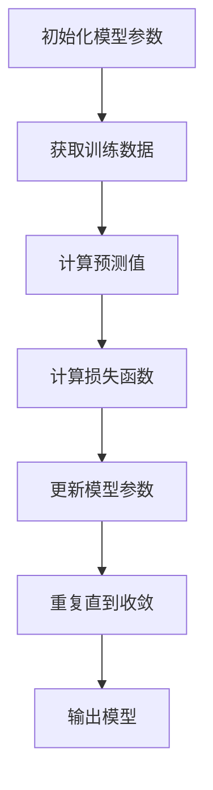
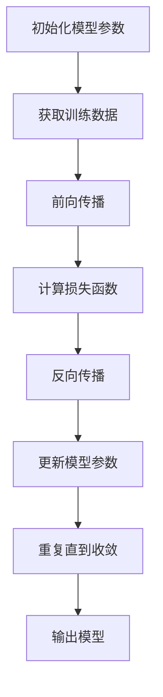
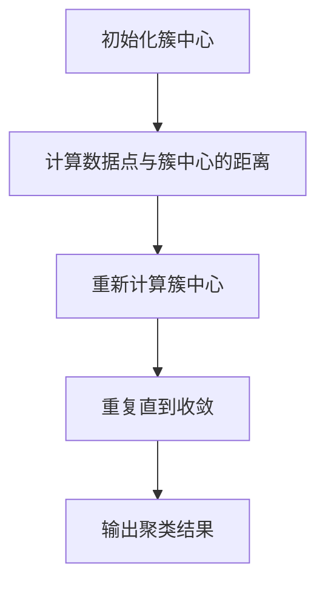
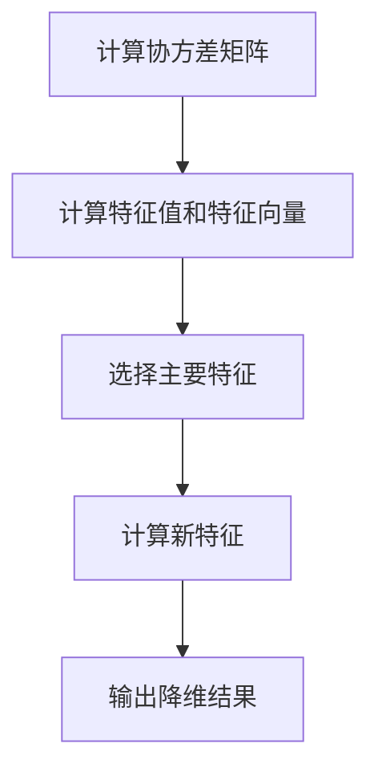
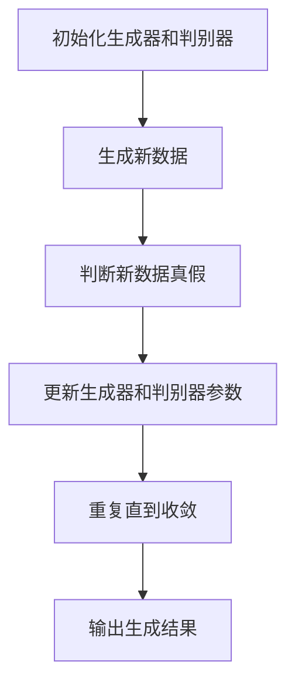
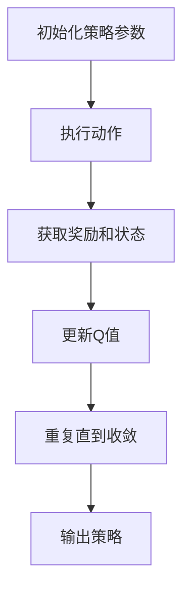
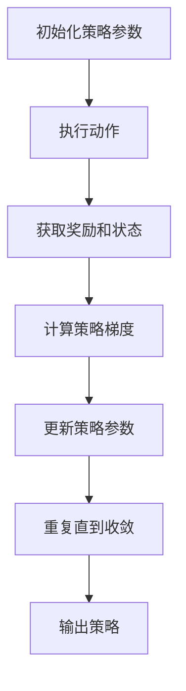

                 

### 第一部分：引言

## 第1章：问题背景与重要性

### 1.1.1 AI Agent持续学习与适应的背景

在当今快速发展的科技时代，人工智能（AI）已经逐渐成为推动社会进步和经济发展的重要力量。AI Agent作为AI领域的关键概念之一，其核心在于能够模拟人类智能，自主地完成特定任务。然而，随着应用场景的复杂性和多样化，AI Agent面临着不断变化的环境和挑战，这对它们的持续学习和适应能力提出了更高的要求。

AI Agent的持续学习指的是在特定环境中，通过不断接收新的信息、更新知识库，使其智能水平持续提升的过程。适应机制则是指AI Agent在面对不确定性和复杂环境时，能够灵活调整自身行为，以实现最优决策的能力。这两个概念紧密相关，持续学习为适应机制提供了知识支持，而适应机制则为持续学习提供了实践平台。

### 1.1.2 持续学习与适应在AI Agent中的重要性

首先，持续学习是提升AI Agent智能水平的必要途径。在动态变化的环境中，AI Agent需要不断更新自身的知识，以应对新的挑战。例如，自动驾驶汽车需要实时感知道路状况、交通规则以及周围环境，通过持续学习来提高其驾驶能力。

其次，适应机制是确保AI Agent在实际应用中表现稳定的关键因素。AI Agent在复杂和多变的环境中，可能会遇到各种异常情况，如突发天气变化、交通拥堵等。如果没有有效的适应机制，AI Agent可能会出现误判或无法完成任务。因此，适应机制对于保障AI Agent的稳定性和可靠性至关重要。

最后，持续学习和适应机制有助于实现AI Agent的自主进化。通过不断地学习和适应，AI Agent能够逐步提升自身的智能水平，实现自我优化和自我进化。这不仅能够提高AI Agent在特定领域的应用效果，也为未来的智能系统发展提供了可能性。

### 1.1.3 本书内容结构与目标

本书旨在深入探讨AI Agent的持续学习与适应机制，帮助读者全面了解这一领域的核心概念、技术方法和应用实例。本书结构如下：

1. **引言**：介绍AI Agent持续学习与适应的背景和重要性，概述本书的内容和目标。
   
2. **基本概念与原理**：详细阐述持续学习和适应机制的定义、分类和关键要素。

3. **现有方法与技术研究**：回顾经典方法和现有研究进展，分析研究热点和趋势。

4. **算法原理与数学模型**：讲解持续学习算法和适应机制的原理，使用流程图和数学公式进行说明。

5. **案例研究与实际应用**：通过具体案例展示持续学习与适应机制在实际中的应用。

6. **未来方向与挑战**：探讨未来研究和应用中的方向和挑战。

7. **总结与建议**：总结全书内容，提出进一步研究的建议。

通过本书的学习，读者将能够系统地掌握AI Agent的持续学习与适应机制，为实际应用和研究提供理论支持和实践指导。

## 第2章：基本概念与原理

### 2.1 持续学习概念

持续学习是指AI Agent在不断接收新信息、处理新数据的过程中，通过算法和模型更新其知识库，从而提高其智能水平的过程。持续学习不仅是AI Agent适应动态环境的关键，也是其实现自主进化和优化的重要手段。

#### 2.1.1 定义与目标

持续学习的定义可以归纳为：在非静止环境中，AI Agent通过持续吸收外部信息，不断调整和优化自身模型和行为的过程。其目标包括：

- 提高AI Agent在特定任务上的表现能力；
- 使AI Agent能够适应不断变化的环境；
- 保证AI Agent在面对新情况时具备一定的学习能力。

#### 2.1.2 分类与类型

根据学习方式和应用场景，持续学习可以分为以下几种类型：

1. **监督学习**：通过已知输入输出数据，对模型进行训练，使其能够预测未知数据。
2. **无监督学习**：在没有明确输入输出数据的情况下，通过数据间的关联性进行学习，如聚类、降维等。
3. **强化学习**：通过与环境交互，根据反馈信号调整行为策略，以实现最优目标。

#### 2.1.3 持续学习的关键要素

持续学习的关键要素包括：

- **数据流**：持续学习依赖于稳定的数据流，数据的质量和多样性直接影响学习效果。
- **模型更新**：模型更新是持续学习的核心，包括参数调整、结构优化等。
- **学习策略**：选择合适的学习策略对于提高持续学习效果至关重要，如在线学习、增量学习等。

### 2.2 适应机制概念

适应机制是指AI Agent在面对不确定性和复杂环境时，通过调整自身行为策略，以实现最优决策的过程。适应机制是AI Agent实现自主进化、稳定运行的基础。

#### 2.2.1 定义与目标

适应机制的定义可以归纳为：在不确定环境中，AI Agent通过感知、决策和执行过程，调整自身行为策略，以实现预期目标的过程。其目标包括：

- 提高AI Agent在复杂环境中的生存能力；
- 保证AI Agent在面对突发情况时的响应速度和决策质量；
- 实现AI Agent在多场景下的适应性。

#### 2.2.2 分类与类型

根据适应目标和应用场景，适应机制可以分为以下几种类型：

1. **行为适应**：通过调整AI Agent的行为策略，以适应特定环境。如路径规划、环境感知等。
2. **策略适应**：通过调整AI Agent的决策策略，以适应复杂环境。如博弈论、进化策略等。
3. **结构适应**：通过调整AI Agent的模型结构，以适应特定任务和场景。如神经网络架构搜索、遗传算法等。

#### 2.2.3 适应机制的关键要素

适应机制的关键要素包括：

- **环境感知**：准确感知环境变化，为决策提供依据。
- **决策策略**：选择合适的决策策略，以实现预期目标。
- **执行机制**：通过执行决策，实现AI Agent的行为调整。

通过本章对持续学习和适应机制的基本概念与原理的介绍，读者可以初步了解这两个核心概念的定义、分类和关键要素。接下来，我们将进一步探讨现有方法和技术研究，以便为后续的算法原理和实际应用奠定基础。

### 第3章：现有方法与技术研究

#### 3.1 经典方法

持续学习和适应机制在AI领域已经得到了广泛的研究和应用。以下将介绍几种经典方法：

##### 3.1.1 监督学习

监督学习是一种通过已知输入输出数据对模型进行训练的方法。该方法在图像识别、自然语言处理等领域得到了广泛应用。监督学习的核心是损失函数和优化算法。常见的损失函数有均方误差（MSE）和交叉熵损失（Cross-Entropy Loss）。优化算法包括梯度下降（Gradient Descent）及其变种，如随机梯度下降（Stochastic Gradient Descent, SGD）和Adam优化器。监督学习的优势在于其能够快速收敛并获取较好的预测效果，但在处理未知数据时效果较差。

##### 3.1.2 无监督学习

无监督学习是不依赖已知输入输出数据，仅通过数据间的关联性进行学习的方法。聚类、降维和生成模型是无监督学习的三种主要形式。K均值聚类（K-Means Clustering）是一种常用的聚类算法，其目标是找到K个中心点，使得每个点与其中心点的距离最小。主成分分析（Principal Component Analysis, PCA）是一种降维方法，其核心是提取数据的主要特征，以降低数据的维度。生成对抗网络（Generative Adversarial Networks, GAN）是一种生成模型，由生成器和判别器两个神经网络组成，通过对抗训练生成与真实数据相似的新数据。无监督学习的优势在于其能够在未知数据中发现潜在的结构和模式，但在处理复杂任务时效果有限。

##### 3.1.3 强化学习

强化学习是一种通过与环境交互，根据反馈信号调整行为策略的方法。其核心是价值函数和策略优化。价值函数用于评估状态和行为的价值，常见的价值函数有Q学习和SARSA。策略优化则是通过最大化预期收益来调整行为策略。强化学习的优势在于其能够实现自主学习和适应，但存在样本效率低、不稳定收敛等问题。

#### 3.2 现有研究进展

近年来，持续学习和适应机制在AI领域取得了显著的研究进展。以下是一些热点和趋势：

##### 3.2.1 进展概述

- **深度学习与持续学习结合**：深度学习在图像识别、语音识别等领域取得了突破性进展，而持续学习能够使深度学习模型在动态环境中持续提升性能。因此，将深度学习与持续学习相结合成为研究的热点。
- **迁移学习与少样本学习**：迁移学习和少样本学习旨在减少数据依赖，通过在源域和目标域之间共享知识，提高AI Agent的适应能力和学习效果。这些方法在资源有限的情况下具有很大的应用价值。
- **混合学习与自适应学习**：混合学习结合了监督学习、无监督学习和强化学习的优势，使AI Agent能够更好地适应复杂环境。自适应学习通过动态调整学习策略，提高了持续学习的效果。

##### 3.2.2 研究热点与趋势

- **自我监督学习**：自我监督学习通过设计自我监督任务，无需人工标注数据，降低了数据获取成本。如基于对比学习的自监督方法，能够有效地提取数据中的潜在特征。
- **元学习**：元学习旨在开发通用学习方法，通过从多个任务中学习，提高AI Agent的泛化能力。近年来，基于模型扰动（Model Perturbation）和模型融合（Model Fusion）的元学习方法得到了广泛关注。
- **自适应控制与优化**：自适应控制与优化通过实时调整学习参数和决策策略，提高了AI Agent的适应能力和稳定性。如基于自适应滤波器和神经网络的控制方法，在动态环境中表现优异。

##### 3.2.3 挑战与机遇

尽管持续学习和适应机制在AI领域取得了显著进展，但仍面临一些挑战和机遇：

- **数据隐私与安全性**：随着数据隐私问题的日益突出，如何在保护数据隐私的同时实现有效学习成为重要挑战。差分隐私（Differential Privacy）和联邦学习（Federated Learning）等方法为解决这一挑战提供了新思路。
- **计算资源与效率**：持续学习和适应机制通常需要大量计算资源和时间，如何在有限的资源下提高学习效率成为关键问题。近年来，硬件加速（如GPU、TPU）和高效算法（如量化、剪枝）为提高计算效率提供了可能。
- **跨领域适应与泛化**：如何在不同领域和任务之间实现有效的适应和泛化是另一个重要挑战。通过跨领域迁移学习、多任务学习和元学习等方法，有望实现这一目标。

综上所述，持续学习和适应机制在AI领域具有广泛的应用前景和重要的研究价值。未来，随着技术的不断发展和创新，持续学习和适应机制将为AI Agent在复杂动态环境中的表现提供更强有力的支持。

### 第4章：持续学习算法

持续学习算法是AI Agent在动态环境中保持高效性能的关键技术。本章将详细介绍几种典型的持续学习算法，包括监督学习、无监督学习和强化学习，并通过流程图和数学公式进行说明。

#### 4.1 监督学习算法

监督学习算法在持续学习中扮演着重要角色。以下将介绍几种常用的监督学习算法，包括线性回归、支持向量机和神经网络。

##### 4.1.1 算法原理

线性回归是一种基于线性模型进行预测的方法，其原理是找到最佳拟合直线，使得预测值与实际值之间的误差最小。线性回归的数学模型如下：

$$
y = \beta_0 + \beta_1x
$$

其中，\(y\) 是预测值，\(x\) 是输入特征，\(\beta_0\) 和 \(\beta_1\) 是模型的参数，可以通过最小化均方误差（MSE）来求解：

$$
\min \sum_{i=1}^{n}(y_i - \hat{y}_i)^2
$$

支持向量机（SVM）是一种基于最大间隔分类的方法，其原理是找到最佳决策边界，使得分类效果最优。SVM的数学模型如下：

$$
\min_{\beta, \beta_0} \frac{1}{2}\sum_{i=1}^{n} (\beta^T \beta_i - 2 \beta^T y_i \beta_0) + \sum_{i=1}^{n} \alpha_i (y_i - \beta^T \beta_i - \beta_0)
$$

其中，\(\beta\) 和 \(\beta_0\) 是模型的参数，\(\alpha_i\) 是拉格朗日乘子。

神经网络是一种基于多层非线性变换进行预测的方法，其原理是模拟人脑神经元的工作方式，通过前向传播和反向传播来更新模型参数。神经网络的一般形式如下：

$$
\text{Output} = \text{激活函数}(\text{权重} \cdot \text{输入} + \text{偏置})
$$

其中，激活函数通常为ReLU、Sigmoid或Tanh函数。

##### 4.1.2 数学模型

线性回归的数学模型可以表示为：

$$
y = \beta_0 + \beta_1x + \epsilon
$$

其中，\(\epsilon\) 是误差项，表示预测值与实际值之间的差异。

支持向量机的数学模型可以表示为：

$$
\max_{\beta, \beta_0} \frac{1}{2}\sum_{i=1}^{n} (\beta^T \beta_i - 2 \beta^T y_i \beta_0) + \sum_{i=1}^{n} \alpha_i (y_i - \beta^T \beta_i - \beta_0)
$$

神经网络的数学模型可以表示为：

$$
\text{Output} = \text{激活函数}(\sum_{j=1}^{m} \text{权重}_{ji} \cdot x_j + \text{偏置}_i)
$$

##### 4.1.3 算法流程图

以下是线性回归的算法流程图：

以下是支持向量机的算法流程图：

以下是神经网络的算法流程图：

#### 4.2 无监督学习算法

无监督学习算法在持续学习中同样具有重要意义。以下将介绍几种常用的无监督学习算法，包括K均值聚类、主成分分析和生成对抗网络。

##### 4.2.1 算法原理

K均值聚类是一种基于距离度量的聚类方法，其原理是将数据分为K个簇，使得每个簇内的数据点距离中心点的距离最小。K均值聚类的数学模型如下：

$$
\text{Cluster Center} = \frac{1}{N}\sum_{i=1}^{N} x_i
$$

其中，\(\text{Cluster Center}\) 是簇中心，\(x_i\) 是数据点。

主成分分析是一种降维方法，其原理是找到数据的主要特征，使得这些特征能够解释大部分数据方差。主成分分析的数学模型如下：

$$
\text{新特征} = \text{原始数据} \cdot \text{特征向量}
$$

生成对抗网络是一种生成模型，其原理是生成器和判别器之间的对抗训练，使得生成器能够生成与真实数据相似的新数据。生成对抗网络的数学模型如下：

$$
\text{Generator}:\ \ G(z) = \text{激活函数}(\text{权重} \cdot z + \text{偏置})
$$

$$
\text{Discriminator}:\ \ D(x) = \text{激活函数}(\text{权重} \cdot x + \text{偏置})
$$

其中，\(z\) 是噪声向量，\(x\) 是真实数据。

##### 4.2.2 数学模型

K均值聚类的数学模型可以表示为：

$$
\text{Cluster Center} = \frac{1}{N}\sum_{i=1}^{N} x_i
$$

主成分分析的数学模型可以表示为：

$$
\text{新特征} = \text{原始数据} \cdot \text{特征向量}
$$

生成对抗网络的数学模型可以表示为：

$$
\text{Generator}:\ \ G(z) = \text{激活函数}(\text{权重} \cdot z + \text{偏置})
$$

$$
\text{Discriminator}:\ \ D(x) = \text{激活函数}(\text{权重} \cdot x + \text{偏置})
$$

##### 4.2.3 算法流程图

以下是K均值聚类的算法流程图：

以下是主成分分析的算法流程图：

以下是生成对抗网络的算法流程图：

#### 4.3 强化学习算法

强化学习算法在持续学习中具有重要意义，其核心思想是通过与环境交互，学习最优策略。以下将介绍几种常用的强化学习算法，包括Q学习和策略梯度算法。

##### 4.3.1 算法原理

Q学习是一种基于值函数的强化学习算法，其原理是学习状态-动作值函数 \(Q(s, a)\)，使得在给定状态下选择最优动作。Q学习的数学模型如下：

$$
Q(s, a) = \sum_{s'} P(s' | s, a) \cdot \max_a' Q(s', a')
$$

策略梯度算法是一种基于策略的强化学习算法，其原理是直接优化策略参数，使得策略能够最大化期望回报。策略梯度算法的数学模型如下：

$$
\theta_{t+1} = \theta_t + \alpha \nabla_\theta J(\theta)
$$

其中，\(\theta\) 是策略参数，\(\alpha\) 是学习率，\(J(\theta)\) 是策略的损失函数。

##### 4.3.2 数学模型

Q学习的数学模型可以表示为：

$$
Q(s, a) = \sum_{s'} P(s' | s, a) \cdot \max_a' Q(s', a')
$$

策略梯度算法的数学模型可以表示为：

$$
\theta_{t+1} = \theta_t + \alpha \nabla_\theta J(\theta)
$$

##### 4.3.3 算法流程图

以下是Q学习的算法流程图：

以下是策略梯度算法的算法流程图：

通过本章对持续学习算法的详细介绍，读者可以了解到不同类型持续学习算法的基本原理和数学模型。这些算法在AI Agent的持续学习和适应过程中发挥着重要作用，为AI Agent在复杂动态环境中的高效表现提供了有力支持。

### 第5章：案例研究与实际应用

在本章中，我们将通过具体案例研究和实际应用，展示AI Agent的持续学习与适应机制在不同领域的成功应用，以及这些应用中所面临的问题和挑战。

#### 5.1 自动驾驶汽车

自动驾驶汽车是AI Agent持续学习和适应机制的一个重要应用领域。自动驾驶汽车需要实时感知道路状况、交通规则以及周围环境，并根据这些信息做出实时决策。以下是一个具体的案例研究：

**案例：谷歌Waymo自动驾驶汽车**

Waymo是谷歌旗下的自动驾驶汽车项目，其核心在于持续学习和适应机制。Waymo利用深度学习和强化学习技术，使自动驾驶汽车能够自主感知环境、规划路径和做出驾驶决策。

**问题与挑战：**

- **动态环境感知**：自动驾驶汽车在复杂和动态的环境中，需要实时感知道路变化、行人行为和其他车辆状态，这对感知系统的准确性和鲁棒性提出了高要求。
- **数据隐私与安全**：自动驾驶汽车在运行过程中会收集大量关于道路和周围环境的数据，如何保护数据隐私和安全是一个重要问题。
- **算法稳定性与可靠性**：在复杂的道路环境中，自动驾驶汽车需要确保算法的稳定性和可靠性，以避免发生交通事故。

**解决方案与成果：**

Waymo通过结合多传感器数据（如摄像头、激光雷达和雷达）进行环境感知，并利用强化学习技术进行路径规划和驾驶决策。此外，Waymo还采用了联邦学习技术，以保护数据隐私和安全。通过这些技术，Waymo的自动驾驶汽车在多次公开道路测试中表现出色，积累了大量有效行驶数据，进一步提高了自动驾驶汽车的稳定性和可靠性。

#### 5.2 聊天机器人

聊天机器人是另一个广泛应用的AI Agent领域，其持续学习和适应机制有助于提升用户体验和交互质量。以下是一个具体的案例研究：

**案例：苹果Siri**

Siri是苹果公司的智能个人助理，其核心在于持续学习和适应机制。Siri通过自然语言处理和机器学习技术，能够理解用户的语音指令，并做出相应的响应。

**问题与挑战：**

- **语言理解与语义分析**：聊天机器人需要具备强大的语言理解能力，能够准确理解用户的意图和语义，这需要持续学习和优化。
- **多语言支持**：为了满足全球用户的需求，聊天机器人需要支持多种语言，这对算法的通用性和适应性提出了高要求。
- **用户隐私与数据保护**：聊天机器人需要处理大量的用户数据，如何保护用户隐私和数据安全是一个重要问题。

**解决方案与成果：**

苹果公司通过采用深度学习和自然语言处理技术，使Siri能够不断学习和改进语言理解能力。此外，Siri还采用了多语言模型，以支持多种语言。为了保护用户隐私，苹果公司采用了严格的数据保护措施，确保用户数据的安全。通过这些措施，Siri在多个平台和设备上获得了广泛的应用和好评，其交互质量和用户体验得到了显著提升。

#### 5.3 医疗诊断

AI Agent在医疗诊断领域的应用同样广泛，其持续学习和适应机制有助于提高诊断的准确性和效率。以下是一个具体的案例研究：

**案例：IBM Watson for Oncology**

IBM Watson for Oncology是一个基于AI的医疗诊断工具，其核心在于持续学习和适应机制。Watson for Oncology通过分析大量的医学文献、病例数据和临床指南，为医生提供个性化的治疗建议。

**问题与挑战：**

- **数据质量与多样性**：医疗数据的质量和多样性直接影响AI诊断工具的性能，如何在海量数据中获取高质量的数据是一个重要问题。
- **知识更新与适应**：医疗知识不断更新，如何确保AI诊断工具能够及时获取最新知识，以适应临床需求，是一个挑战。
- **伦理与合规**：医疗诊断涉及到患者的健康和生命，如何确保AI诊断工具的伦理性和合规性，是一个重要问题。

**解决方案与成果：**

IBM通过采用大数据分析和自然语言处理技术，使Watson for Oncology能够从海量医学文献中提取有用信息，并不断更新知识库。此外，Watson for Oncology采用了多种机器学习算法，以提高诊断的准确性和效率。为了确保伦理性和合规性，IBM与医疗专业人士合作，制定了严格的操作规范和伦理标准。通过这些措施，Watson for Oncology在多个国家和地区得到了广泛应用，为医生提供了有力的辅助诊断工具，提高了医疗质量和效率。

综上所述，通过具体案例研究和实际应用，我们可以看到AI Agent的持续学习和适应机制在各个领域的成功应用。这些应用不仅解决了实际问题，也为AI技术的发展和应用提供了宝贵的经验和启示。在未来的发展中，我们需要进一步优化和改进持续学习和适应机制，以应对更复杂和多样化的挑战。

### 第6章：未来方向与挑战

#### 6.1 未来研究方向

尽管AI Agent的持续学习和适应机制在多个领域取得了显著成果，但未来仍有许多研究方向值得深入探索。以下是一些可能的未来研究方向：

##### 6.1.1 跨领域迁移学习

跨领域迁移学习旨在解决不同领域之间知识共享和迁移的问题。目前，大多数迁移学习方法主要关注单一领域的知识迁移，而跨领域迁移学习则涉及到多个领域的知识融合和共享。未来，研究可以关注如何设计更有效的跨领域迁移学习算法，以实现多领域知识的充分利用。

##### 6.1.2 自适应强化学习

自适应强化学习是一种动态调整学习策略的强化学习方法，旨在提高AI Agent在动态环境中的适应能力。未来，研究可以关注如何设计更高效的自适应强化学习算法，以实现快速适应和优化。

##### 6.1.3 强化学习的稳定性与鲁棒性

强化学习在处理动态环境时存在稳定性问题和鲁棒性不足的问题。未来，研究可以关注如何提高强化学习的稳定性与鲁棒性，以应对更复杂的动态环境。

##### 6.1.4 深度学习与持续学习的结合

深度学习在图像识别、语音识别等领域取得了巨大成功，但其在动态环境中的持续学习效果仍需提升。未来，研究可以关注如何将深度学习与持续学习相结合，以实现更高效的动态环境适应能力。

#### 6.2 潜在挑战

尽管持续学习和适应机制在AI领域具有广泛的应用前景，但未来仍面临许多潜在挑战：

##### 6.2.1 数据隐私与安全性

随着AI Agent在各个领域的广泛应用，数据隐私和安全问题日益突出。如何保护用户隐私和数据安全，同时实现有效的持续学习和适应，是一个重要挑战。

##### 6.2.2 计算资源与效率

持续学习和适应机制通常需要大量的计算资源和时间。如何提高计算效率和降低计算成本，是一个关键问题。

##### 6.2.3 跨领域适应与泛化

如何在不同的领域和任务之间实现有效的适应和泛化，是一个复杂的挑战。目前，大多数方法主要关注单一领域的知识迁移，而跨领域适应和泛化仍需进一步研究。

##### 6.2.4 伦理与合规

AI Agent的持续学习和适应机制涉及到伦理和合规问题。如何确保AI系统的透明性、公平性和可解释性，是一个重要挑战。

综上所述，未来在AI Agent的持续学习和适应机制领域，我们既面临许多研究机会，也面临诸多挑战。通过不断探索和创新，我们有理由相信，持续学习和适应机制将为AI技术的发展和应用带来更多的可能性。

### 第7章：总结与建议

#### 7.1 总结

本书围绕AI Agent的持续学习与适应机制进行了深入探讨，从基本概念与原理、经典方法、算法原理与数学模型，到实际应用与未来方向，全面阐述了这一领域的核心内容。通过具体案例研究和实际应用，展示了持续学习和适应机制在自动驾驶、聊天机器人、医疗诊断等领域的成功应用，并指出了未来研究中的潜在挑战。

持续学习和适应机制作为AI Agent实现高效表现的关键技术，其重要性不言而喻。本书旨在帮助读者全面了解这一领域，为实际应用和研究提供理论支持和实践指导。

#### 7.2 建议

为了进一步推动AI Agent的持续学习和适应机制研究，本书提出以下建议：

1. **加强跨领域迁移学习研究**：设计更有效的跨领域迁移学习算法，实现多领域知识的共享和融合。
2. **优化自适应强化学习方法**：开发自适应强化学习算法，提高AI Agent在动态环境中的适应能力和稳定性。
3. **关注计算资源与效率**：研究计算高效的方法和算法，降低持续学习和适应机制的能耗和计算成本。
4. **强化伦理与合规研究**：确保AI系统的透明性、公平性和可解释性，关注数据隐私与安全性问题。
5. **推动实际应用**：结合具体应用场景，验证持续学习和适应机制的实际效果，为AI技术的发展和应用提供实践支持。

通过以上建议，期望能够为AI Agent的持续学习和适应机制研究带来新的突破，为未来的智能系统发展奠定坚实基础。

---

# AI Agent的持续学习与适应机制

关键词：AI Agent、持续学习、适应机制、监督学习、无监督学习、强化学习

摘要：本文深入探讨了AI Agent的持续学习与适应机制，从基本概念、经典方法、算法原理、实际应用和未来方向等方面进行了全面阐述。通过具体案例研究和实际应用，展示了持续学习和适应机制在多个领域的成功应用，并分析了未来研究中的潜在挑战。本文旨在为读者提供关于AI Agent持续学习与适应机制的全面理解和实践指导。

作者：AI天才研究院/AI Genius Institute & 禅与计算机程序设计艺术 /Zen And The Art of Computer Programming

