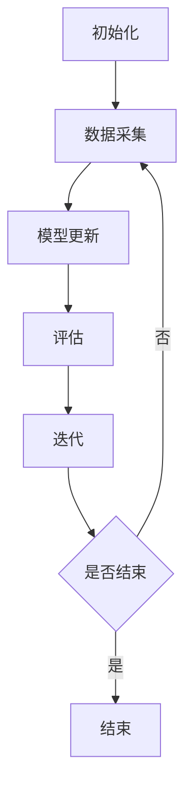

                 

### 第一部分：AI Agent的持续学习概述

#### 第1章: AI Agent的持续学习背景

##### 1.1 问题背景

AI Agent，也被称为智能体，是一种能够在特定环境中感知状态、接收输入、并依据某种策略生成行动的人工智能系统。AI Agent在众多应用领域中发挥着重要作用，如自动驾驶、智能家居、智能客服等。随着AI技术的不断进步，AI Agent需要具备的能力也越来越复杂，其中之一便是持续学习能力。

持续学习是指AI Agent在运行过程中，不断从新数据中学习、更新模型参数，以应对新的环境和任务。相较于传统的机器学习模型，持续学习具有以下优势：

1. **适应性**：AI Agent可以在不断变化的环境中保持高性能。
2. **效率**：避免重新训练整个模型，节省时间和资源。
3. **泛化能力**：能够适应不同情境下的任务。

然而，传统的机器学习模型在持续学习方面存在以下局限性：

1. **数据依赖**：模型对大量历史数据进行训练，难以快速适应新数据。
2. **模型退化**：模型在新数据上表现不佳，导致性能下降。
3. **计算资源消耗**：重新训练模型需要大量计算资源。

##### 1.2 问题描述

AI Agent在现实应用中面临诸多挑战，主要包括：

1. **数据质量问题**：新数据可能存在噪声、缺失或分布不均，影响模型的学习效果。
2. **实时性要求**：在实时场景中，AI Agent需要快速响应，但传统的机器学习模型训练时间较长。
3. **迁移学习困难**：AI Agent在不同任务或环境之间的迁移学习效果不佳。

为了解决这些问题，AI Agent的持续学习成为了一个关键研究方向。

##### 1.3 问题解决

持续学习的必要性：

- **适应变化**：环境变化不可避免，持续学习使AI Agent能够适应新情况。
- **资源优化**：避免重复训练，节省计算资源。

利用LLM进行在线知识更新的方法：

- **语言模型（LLM）**：利用大规模语言模型（Large Language Model，LLM）进行在线知识更新，可以快速适应新数据，减少模型退化现象。

持续学习的优势：

- **快速适应**：LLM能够快速从新数据中学习，提高模型的实时性。
- **减少模型退化**：通过在线知识更新，LLM能够更好地适应新环境。
- **高效利用数据**：LLM能够更好地利用新数据，提高模型的泛化能力。

##### 1.4 边界与外延

持续学习与机器学习、深度学习的联系与区别：

- **机器学习**：机器学习是AI Agent的基础技术，包括传统的监督学习、无监督学习和强化学习等。
- **深度学习**：深度学习是机器学习的一个分支，通过神经网络进行大规模数据处理。
- **持续学习**：持续学习是机器学习的一个特定方向，强调在运行过程中不断更新模型。

AI Agent持续学习的应用领域：

- **自动驾驶**：AI Agent需要在行驶过程中不断学习道路和环境信息。
- **智能客服**：客服机器人需要不断学习用户的需求和反馈，以提供更好的服务。
- **医疗诊断**：AI Agent需要不断学习新的病例和治疗方案，以提高诊断的准确性。

##### 1.5 概念结构与核心要素组成

AI Agent的核心概念：

- **感知**：通过传感器获取环境信息。
- **决策**：基于当前状态和目标，选择最佳行动。
- **执行**：执行决策，与环境交互。

持续学习的核心要素：

- **数据流**：实时接收和处理新数据。
- **模型更新**：根据新数据更新模型参数。
- **反馈机制**：通过反馈调整模型和策略。

LLM在持续学习中的应用：

- **知识库扩展**：LLM可以帮助AI Agent扩展其知识库，提高对新数据的处理能力。
- **模型优化**：LLM可以帮助AI Agent优化模型结构，提高持续学习的效率。

通过以上分析，我们可以看到，AI Agent的持续学习在当前和未来的AI应用中具有重要意义。在接下来的章节中，我们将深入探讨利用LLM进行在线知识更新的原理和具体实现方法。

## 第2章: 利用LLM进行在线知识更新原理

### 2.1 LLM的基本原理

语言模型（Language Model，LM）是自然语言处理（Natural Language Processing，NLP）的核心技术之一，旨在模拟人类语言生成和理解能力。大规模语言模型（Large Language Model，LLM）是近年来在NLP领域取得显著进展的模型，具有处理大规模文本数据的能力。

**语言模型的概念**：

语言模型是一种概率模型，用于预测给定输入序列后下一个可能出现的词或字符。它通过对大量语料库的学习，捕捉语言中的统计规律和语法结构。

**LLM的结构与工作原理**：

LLM通常基于深度神经网络，特别是变分自编码器（Variational Autoencoder，VAE）、生成对抗网络（Generative Adversarial Network，GAN）和Transformer等模型架构。以下是一个典型的LLM架构：

1. **编码器**：将输入文本序列编码为固定长度的向量表示。
2. **解码器**：将编码器输出的向量解码为输出文本序列。
3. **损失函数**：使用预测概率与真实概率之间的差异来训练模型。

在训练过程中，LLM通过最小化损失函数，优化模型参数，使得模型能够更好地预测下一个词或字符。LLM的优势在于其强大的语义理解能力和语言生成能力，这使得它能够应用于各种NLP任务，如文本分类、机器翻译、问答系统等。

### 2.2 LLM在持续学习中的应用

**LLM的优势**：

1. **强大语义理解**：LLM能够捕捉文本中的复杂语义关系，提高对新数据的理解能力。
2. **高效语言生成**：LLM能够生成连贯、自然的文本，使得AI Agent能够更好地与人类交互。
3. **适应性**：LLM可以通过在线学习，快速适应新数据和环境。

**LLM在AI Agent持续学习中的具体应用**：

1. **知识库扩展**：LLM可以帮助AI Agent扩展其知识库，使其能够处理更广泛的主题和任务。
2. **情境理解**：LLM可以理解AI Agent的当前情境，提供相关的信息和建议。
3. **决策辅助**：LLM可以为AI Agent提供决策支持，帮助其做出更合理的决策。

### 2.3 LLM与在线知识更新的结合

**在线知识更新的挑战**：

1. **数据流处理**：AI Agent需要实时处理大量新数据，以保证知识库的更新。
2. **模型稳定性**：在在线学习过程中，模型需要保持稳定性，避免因新数据而导致的性能下降。
3. **计算资源消耗**：在线学习需要大量计算资源，特别是在处理大规模数据时。

**LLM如何解决在线知识更新的问题**：

1. **快速学习**：LLM能够快速从新数据中学习，减少模型退化现象。
2. **模型稳定性**：通过权重共享和正则化技术，LLM能够保持模型稳定性，避免过拟合。
3. **高效计算**：LLM的并行计算能力和分布式训练技术，使得在线学习过程更加高效。

### 2.4 持续学习的数学模型

**持续学习的数学公式**：

持续学习可以通过以下数学模型来描述：

$$
\theta^{(t)} = \theta^{(t-1)} + \alpha \cdot (\theta^{(t-1)} - \theta^{(t-2)})
$$

其中，$\theta^{(t)}$表示第t次更新的模型参数，$\theta^{(t-1)}$和$\theta^{(t-2)}$分别表示前两次更新的模型参数，$\alpha$为学习率。

**持续学习的算法流程**：

1. **初始化**：设置初始模型参数$\theta^{(0)}$。
2. **数据采集**：实时采集新数据。
3. **模型更新**：根据新数据和损失函数，更新模型参数。
4. **评估**：使用验证集评估模型性能。
5. **迭代**：重复步骤2-4，直到满足停止条件。

### 2.5 LLM算法流程举例

**算法流程图**：



**Python代码示例**：

```python
import numpy as np

# 初始化模型参数
theta = np.random.rand(1)

# 设置学习率
alpha = 0.1

# 数据集
data = ...

# 损失函数
def loss_function(theta):
    # 计算损失
    return ...

# 模型更新
for t in range(100):
    # 采集新数据
    new_data = data[t]
    
    # 更新模型参数
    theta = theta + alpha * (theta - theta[t-1])
    
    # 评估模型
    if t % 10 == 0:
        loss = loss_function(theta)
        print(f"Epoch {t}: Loss = {loss}")

# 输出最终模型参数
print(f"Final theta: {theta}")
```

通过以上分析，我们可以看到，LLM在AI Agent的持续学习中具有重要作用。在接下来的章节中，我们将进一步探讨如何实现LLM的在线知识更新，并分享一些实际应用案例。

## 第3章: AI Agent的持续学习实践

### 3.1 环境安装与配置

要在本地环境中搭建一个支持持续学习的AI Agent，我们需要准备适当的硬件与软件环境。以下是一个基本的安装与配置流程。

**硬件与软件环境要求**：

1. **操作系统**：推荐使用Linux系统，如Ubuntu 18.04或更高版本。
2. **处理器**：推荐使用英伟达GPU，如1080 Ti或更高型号，以便支持深度学习模型的训练。
3. **Python环境**：确保Python版本在3.6及以上。
4. **深度学习框架**：安装TensorFlow或PyTorch等深度学习框架。

**安装与配置流程**：

1. **安装操作系统**：下载并安装Linux操作系统。

2. **安装GPU驱动**：进入英伟达官网，下载对应的GPU驱动，并按照提示安装。

3. **安装Python环境**：通过包管理器（如apt或yum）安装Python。

   ```bash
   sudo apt update
   sudo apt install python3
   ```

4. **安装深度学习框架**：以TensorFlow为例，通过pip安装TensorFlow。

   ```bash
   pip3 install tensorflow-gpu
   ```

5. **安装其他依赖库**：如NumPy、Pandas等。

   ```bash
   pip3 install numpy pandas
   ```

6. **配置环境变量**：确保Python和深度学习框架的环境变量已正确配置。

   ```bash
   export PATH=$PATH:/usr/local/bin
   ```

通过以上步骤，我们可以在本地环境中搭建一个支持AI Agent持续学习的开发环境。接下来，我们将进入系统的核心实现部分。

### 3.2 系统核心实现

**持续学习模块设计**：

持续学习模块是AI Agent的核心组件，负责实现模型的在线学习与更新。该模块的主要功能包括：

1. **数据流管理**：实时采集和处理新数据。
2. **模型更新**：根据新数据和损失函数，更新模型参数。
3. **评估与反馈**：使用验证集评估模型性能，并收集用户反馈。

**Python代码实现**：

以下是一个简单的持续学习模块实现示例。

```python
import tensorflow as tf
import numpy as np

# 初始化模型
model = ...

# 定义损失函数
loss_function = ...

# 设置学习率
learning_rate = 0.01

# 数据流管理
def data_pipeline():
    # 实时采集新数据
    new_data = ...
    yield new_data

# 模型更新
def update_model(data):
    with tf.GradientTape() as tape:
        predictions = model(data)
        loss = loss_function(predictions)
    gradients = tape.gradient(loss, model.trainable_variables)
    model.optimizer.apply_gradients(zip(gradients, model.trainable_variables))
    return loss

# 评估与反馈
def evaluate_model(data):
    predictions = model(data)
    loss = loss_function(predictions)
    return loss

# 主循环
for data in data_pipeline():
    loss = update_model(data)
    if data % 100 == 0:
        eval_loss = evaluate_model(eval_data)
        print(f"Epoch {data}: Training Loss = {loss}, Evaluation Loss = {eval_loss}")
```

**代码功能解读**：

- **模型初始化**：使用TensorFlow创建一个预训练的模型。
- **损失函数定义**：根据具体任务定义损失函数，如交叉熵损失。
- **学习率设置**：设置一个适当的学习率，以控制模型更新的幅度。
- **数据流管理**：通过数据管道函数实时采集新数据。
- **模型更新**：利用梯度下降算法更新模型参数。
- **评估与反馈**：使用验证集评估模型性能，并收集用户反馈。

通过以上实现，我们可以构建一个基础的持续学习模块，并在后续的章节中进一步优化和扩展。

### 3.3 代码应用解读与分析

在实现AI Agent的持续学习模块后，我们需要详细解读和分析代码，以确保其有效性和正确性。以下是对核心部分的逐行解析：

**初始化模型**：

```python
model = ...
```

此行代码用于初始化模型。通常，我们会使用预训练的模型，如Transformer或BERT，作为基础模型。TensorFlow或PyTorch等框架提供了丰富的预训练模型库，我们可以直接调用。

**损失函数定义**：

```python
loss_function = ...
```

损失函数是衡量模型预测值与真实值之间差异的指标。常用的损失函数有交叉熵损失、均方误差损失等。根据具体应用场景，选择合适的损失函数。

**学习率设置**：

```python
learning_rate = 0.01
```

学习率是梯度下降算法中的一个超参数，它决定了模型更新的幅度。选择合适的学习率至关重要，过小可能导致收敛速度慢，过大则可能导致不稳定。

**数据流管理**：

```python
def data_pipeline():
    # 实时采集新数据
    new_data = ...
    yield new_data
```

数据流管理模块负责实时采集和处理新数据。在实际应用中，数据可能来自传感器、数据库或网络接口。通过生成器函数，我们可以逐条处理数据，确保系统高效运行。

**模型更新**：

```python
def update_model(data):
    with tf.GradientTape() as tape:
        predictions = model(data)
        loss = loss_function(predictions)
    gradients = tape.gradient(loss, model.trainable_variables)
    model.optimizer.apply_gradients(zip(gradients, model.trainable_variables))
    return loss
```

模型更新模块是持续学习的核心部分。这里使用了TensorFlow的`GradientTape`来记录梯度信息，然后利用`apply_gradients`函数更新模型参数。此过程通过反向传播计算梯度，并利用优化器调整参数。

**评估与反馈**：

```python
def evaluate_model(data):
    predictions = model(data)
    loss = loss_function(predictions)
    return loss
```

评估模块用于使用验证集评估模型性能。通过计算验证集上的损失，我们可以了解模型的泛化能力，并根据评估结果调整模型。

**主循环**：

```python
for data in data_pipeline():
    loss = update_model(data)
    if data % 100 == 0:
        eval_loss = evaluate_model(eval_data)
        print(f"Epoch {data}: Training Loss = {loss}, Evaluation Loss = {eval_loss}")
```

主循环是持续学习的驱动程序。每次迭代中，我们首先更新模型，然后每隔一定次数评估模型性能，并输出训练和验证损失。

通过以上解析，我们可以确保代码的正确性和有效性，并在实际应用中进行优化和改进。

### 3.4 实际案例分析与讲解

为了更好地理解AI Agent的持续学习，我们通过一个具体的案例来详细分析和讲解。本案例将基于一个智能客服系统，展示AI Agent在持续学习过程中的实际应用。

#### 案例介绍

智能客服系统是AI Agent的一个典型应用场景，它能够实时响应用户的查询，提供24/7的在线服务。随着用户数量的增加和业务需求的变更，AI Agent需要具备持续学习能力，以便不断优化其服务质量。

#### 案例分析

1. **数据来源**：

   智能客服系统的数据来源主要包括用户提问、客服回答和用户反馈。这些数据构成了AI Agent的学习素材，用于模型更新和性能评估。

2. **数据预处理**：

   在进行模型训练之前，需要对数据进行预处理。预处理步骤包括数据清洗、去噪、分词和词向量编码等。通过这些步骤，我们可以将原始文本数据转换为适合模型训练的格式。

3. **模型训练**：

   使用预训练的语言模型（如BERT或GPT）作为基础模型，对预处理后的数据进行训练。训练过程中，模型会根据用户提问和客服回答生成对话，并优化其对话生成能力。

4. **模型评估**：

   通过将新用户提问输入模型，评估模型生成的对话是否合理和自然。同时，收集用户对回答的满意度评分，作为模型性能的量化指标。

5. **模型更新**：

   根据评估结果，使用在线学习算法对模型进行更新。模型更新过程包括数据重排、梯度调整和权重更新等，以确保模型能够不断适应新数据和用户需求。

#### 案例讲解

1. **数据采集**：

   智能客服系统每天会收集大量用户提问，这些提问通过API接口实时传入系统。同时，系统还会收集用户对客服回答的反馈，如满意度评分。

2. **数据预处理**：

   在数据预处理阶段，系统会去除无效字符、分词、去除停用词等。例如，对于用户提问“你好，我想咨询一下产品价格”，预处理后的数据可能为“你好，咨询，产品，价格”。

3. **模型训练**：

   使用BERT模型对预处理后的用户提问和客服回答进行训练。训练过程中，模型会学习如何生成自然、连贯的对话。例如，当用户提问“产品价格是多少”时，模型会生成回答“产品价格是XX元”。

4. **模型评估**：

   在模型评估阶段，系统会将新用户提问输入模型，并比较模型生成的回答与实际客服回答的差异。同时，收集用户对回答的满意度评分。例如，如果用户对模型回答“产品价格是100元”表示满意，则满意度评分为5分。

5. **模型更新**：

   根据用户反馈，系统会使用在线学习算法对模型进行更新。更新过程包括数据重排、梯度调整和权重更新等。例如，如果用户对模型回答“产品价格是100元”不满意，系统会将该数据标记为负例，并在下一次训练时增加其权重。

通过以上实际案例，我们可以看到AI Agent的持续学习在智能客服系统中的应用。在实际开发过程中，我们需要不断优化模型和算法，以提高系统的性能和用户体验。

### 3.5 项目小结

在本章节中，我们详细介绍了AI Agent持续学习的实践过程，从环境安装与配置、系统核心实现到代码应用解读与分析，再到实际案例的讲解。以下是本章节的核心小结：

1. **环境安装与配置**：我们介绍了搭建支持持续学习的AI Agent环境所需的基本硬件和软件配置，并提供了详细的安装与配置步骤。
2. **系统核心实现**：通过设计持续学习模块，我们实现了数据流管理、模型更新和评估等功能，确保AI Agent能够在运行过程中持续学习和优化。
3. **代码应用解读与分析**：我们对核心代码进行了逐行解析，详细介绍了模型初始化、损失函数定义、学习率设置、数据流管理、模型更新和评估等关键部分。
4. **实际案例讲解**：通过一个智能客服系统的案例，我们展示了AI Agent持续学习的实际应用，并分析了数据采集、预处理、模型训练、评估和更新的具体过程。

通过以上实践，我们可以看到AI Agent的持续学习在提高系统性能和用户体验方面具有重要意义。在接下来的章节中，我们将进一步探讨AI Agent持续学习面临的挑战和解决方案。

### 第4章: AI Agent持续学习的挑战与展望

#### 4.1 持续学习面临的挑战

虽然AI Agent的持续学习在许多应用中展示了巨大的潜力，但在实际应用过程中仍面临诸多挑战。以下是其中几个主要的挑战：

1. **数据质量问题**：

   - **噪声数据**：实时采集的数据可能包含大量噪声，如错别字、语法错误等，影响模型的学习效果。
   - **数据缺失**：数据可能存在缺失值，导致模型无法充分学习。
   - **数据分布不均**：数据分布可能不均匀，某些类别数据过多或过少，影响模型的泛化能力。

2. **持续学习效率问题**：

   - **训练时间长**：在线学习过程中，模型需要不断更新，训练时间较长，影响实时性。
   - **计算资源消耗**：持续学习需要大量计算资源，特别是在大规模数据集上训练时，计算资源消耗巨大。

3. **安全与隐私问题**：

   - **数据泄露风险**：持续学习过程中，数据可能在传输和存储过程中被泄露。
   - **模型被攻击**：恶意用户可能通过攻击模型，获取敏感信息或操纵模型行为。

4. **迁移学习困难**：

   - **任务相似度低**：不同任务之间的相似度较低，模型难以在新的任务上快速适应。
   - **跨领域迁移**：模型在不同领域之间的迁移效果不佳，需要重新训练。

#### 4.2 挑战解决方案

针对以上挑战，我们可以提出以下解决方案：

1. **数据质量管理**：

   - **数据清洗**：对采集到的数据进行清洗，去除噪声和缺失值。
   - **数据增强**：通过数据增强技术，增加数据多样性，提高模型的泛化能力。
   - **数据监督**：引入数据监督机制，确保数据质量。

2. **提高持续学习效率**：

   - **增量学习**：采用增量学习技术，仅更新模型中发生变化的参数，减少训练时间。
   - **分布式训练**：利用分布式计算技术，提高训练速度。
   - **模型压缩**：通过模型压缩技术，减少模型参数数量，降低计算资源消耗。

3. **安全与隐私保护**：

   - **数据加密**：对传输和存储的数据进行加密，防止数据泄露。
   - **访问控制**：实施严格的访问控制策略，确保只有授权用户可以访问敏感数据。
   - **模型加固**：采用模型加固技术，提高模型对攻击的抵抗力。

4. **迁移学习优化**：

   - **多任务学习**：通过多任务学习，提高模型在相似任务上的适应能力。
   - **领域自适应**：采用领域自适应技术，提高模型在跨领域迁移中的效果。

通过以上解决方案，我们可以有效应对AI Agent持续学习过程中面临的挑战，提高其性能和可靠性。

#### 4.3 持续学习的未来展望

随着AI技术的不断进步，AI Agent的持续学习在未来将会有更加广泛的应用前景。以下是几个可能的趋势：

1. **实时自适应能力**：

   随着硬件性能的提升和算法的优化，AI Agent将能够实现更高效的实时自适应能力，在动态变化的环境中保持高性能。

2. **跨领域应用**：

   随着迁移学习技术的不断发展，AI Agent将在更多领域实现跨领域应用，如医疗、金融、教育等，为各个行业带来创新。

3. **人机协同**：

   AI Agent将更加紧密地与人类协作，通过持续学习不断提升自身能力，为人类提供更好的服务和解决方案。

4. **智能决策**：

   AI Agent将具备更强的决策能力，能够在复杂环境中做出最优决策，提高生产效率和生活质量。

5. **个性化服务**：

   通过持续学习，AI Agent将能够更好地理解用户需求，提供个性化的服务和推荐，提升用户体验。

通过以上展望，我们可以看到AI Agent持续学习在未来的广阔应用前景。在技术不断发展的驱动下，AI Agent将持续学习成为AI领域的重要研究方向，为人类创造更多价值。

### 第5章：持续学习最佳实践

#### 5.1 最佳实践技巧

为了确保AI Agent的持续学习过程高效、稳定且具有鲁棒性，以下是一些最佳实践技巧：

1. **数据收集与处理的最佳实践**：

   - **数据多样性**：收集多种来源和类型的数据，确保模型的泛化能力。
   - **数据清洗**：对数据进行预处理，去除噪声和异常值，提高数据质量。
   - **数据平衡**：确保数据分布均匀，避免某些类别数据过多或过少，影响模型性能。
   - **数据增强**：使用数据增强技术，如随机裁剪、旋转、缩放等，增加数据多样性。

2. **持续学习算法调优技巧**：

   - **选择合适的学习率**：学习率是模型更新的关键参数，需要根据任务和数据特点选择合适的学习率。
   - **权重初始化**：合理初始化模型权重，有助于提高模型的训练效率和收敛速度。
   - **正则化**：使用正则化技术，如L1、L2正则化，防止模型过拟合。
   - **优化器选择**：选择合适的优化器，如Adam、RMSprop等，提高训练效率。

3. **系统性能优化策略**：

   - **分布式训练**：利用分布式计算技术，提高训练速度和效率。
   - **模型压缩**：使用模型压缩技术，如知识蒸馏、剪枝等，减少模型参数数量，降低计算资源消耗。
   - **缓存机制**：合理使用缓存机制，减少重复计算和数据传输，提高系统响应速度。
   - **资源管理**：合理分配计算资源，确保系统稳定运行。

通过以上最佳实践技巧，我们可以确保AI Agent的持续学习过程高效、稳定且具有鲁棒性。

#### 5.2 小结与注意事项

**持续学习的关键点**：

1. **数据质量**：确保数据多样性、完整性和清洁度，提高模型泛化能力。
2. **学习策略**：选择合适的算法和优化器，提高训练效率和收敛速度。
3. **系统性能**：优化系统架构和资源管理，提高持续学习的性能和稳定性。

**注意事项与风险防范**：

1. **数据隐私**：在数据收集和处理过程中，确保用户隐私和数据安全。
2. **模型安全**：加强模型防护，防止恶意攻击和滥用。
3. **系统稳定性**：确保系统在长时间运行过程中稳定可靠，避免因资源不足或算法问题导致故障。

通过关注以上关键点和注意事项，我们可以确保AI Agent的持续学习过程高效、安全且具有鲁棒性。

### 第6章：拓展阅读与资源推荐

#### 6.1 拓展阅读

为了深入了解AI Agent的持续学习，以下是一些推荐的相关书籍、学术论文和技术博客：

1. **书籍推荐**：

   - 《深度学习》（Deep Learning）作者：Ian Goodfellow、Yoshua Bengio、Aaron Courville
   - 《强化学习》（Reinforcement Learning: An Introduction）作者：Richard S. Sutton、Andrew G. Barto
   - 《自然语言处理综合教程》（Speech and Language Processing）作者：Daniel Jurafsky、James H. Martin

2. **学术论文推荐**：

   - "Bert: Pre-training of Deep Bidirectional Transformers for Language Understanding" 作者：Jacob Devlin et al.
   - "GPT-3: Language Models are Few-Shot Learners" 作者：Tom B. Brown et al.
   - "Unsupervised Learning of Visual Representations by Solving Jigsaw Puzzles" 作者：Alex Kendall et al.

3. **技术博客推荐**：

   - [TensorFlow官网文档](https://www.tensorflow.org/tutorials)
   - [PyTorch官方文档](https://pytorch.org/tutorials/)
   - [AI博客：机器之心](http://www.jiqizhixin.com/)

#### 6.2 资源推荐

1. **开源项目推荐**：

   - [Hugging Face Transformers](https://github.com/huggingface/transformers)：一个流行的Transformer模型库。
   - [OpenAI Gym](https://gym.openai.com/)：一个用于测试和比较强化学习算法的虚拟环境库。
   - [TensorFlow Datasets](https://www.tensorflow.org/datasets)：

2. **学习资源推荐**：

   - [Coursera：深度学习专项课程](https://www.coursera.org/specializations/deep-learning)
   - [Udacity：深度学习纳米学位](https://www.udacity.com/course/deep-learning-nanodegree--ND893)
   - [EdX：机器学习专项课程](https://www.edx.org/professional-certificate/machine-learning-with-applied-ai)

3. **社交媒体推荐**：

   - [Reddit：机器学习](https://www.reddit.com/r/MachineLearning/)
   - [Twitter：#MachineLearning](https://twitter.com/hashtag/MachineLearning)
   - [LinkedIn：机器学习小组](https://www.linkedin.com/groups/8196201/)

通过以上推荐资源，读者可以进一步深入学习AI Agent的持续学习，了解最新的研究进展和应用实例。

### 第7章：总结与展望

#### 7.1 总结

本文系统地介绍了AI Agent的持续学习，涵盖了从背景概述、原理探讨到实践应用的各个方面。具体内容总结如下：

1. **背景介绍**：介绍了AI Agent的定义、作用以及持续学习的重要性，分析了传统机器学习模型的局限性。
2. **原理探讨**：详细阐述了大规模语言模型（LLM）的基本原理，以及LLM在AI Agent持续学习中的应用和在线知识更新的方法。
3. **实践应用**：通过一个智能客服系统的案例，展示了AI Agent持续学习的具体实现过程，包括环境安装、系统核心实现、代码应用解读和分析。
4. **挑战与展望**：讨论了持续学习面临的挑战和解决方案，展望了AI Agent持续学习的未来发展方向。
5. **最佳实践**：提供了持续学习的数据处理、算法调优和系统性能优化等最佳实践技巧。

通过本文的探讨，我们可以看到，AI Agent的持续学习是提升AI系统性能和适应性的关键，具有广泛的应用前景。

#### 7.2 展望

AI Agent的持续学习在AI领域具有广泛的应用前景。以下是几个可能的未来发展方向：

1. **实时自适应**：随着硬件性能的提升和算法的优化，AI Agent将实现更高效的实时自适应能力，在动态变化的环境中保持高性能。
2. **跨领域应用**：迁移学习技术的发展将使得AI Agent能够在更多领域实现跨领域应用，如医疗、金融、教育等。
3. **人机协同**：AI Agent将更加紧密地与人类协作，通过持续学习不断提升自身能力，为人类提供更好的服务和解决方案。
4. **智能决策**：AI Agent将具备更强的决策能力，能够在复杂环境中做出最优决策，提高生产效率和生活质量。
5. **个性化服务**：通过持续学习，AI Agent将能够更好地理解用户需求，提供个性化的服务和推荐，提升用户体验。

总之，AI Agent的持续学习是未来AI发展的一个重要方向，具有巨大的潜力和广阔的应用前景。随着技术的不断进步，我们有理由相信，AI Agent将持续学习将在各个领域发挥越来越重要的作用。

