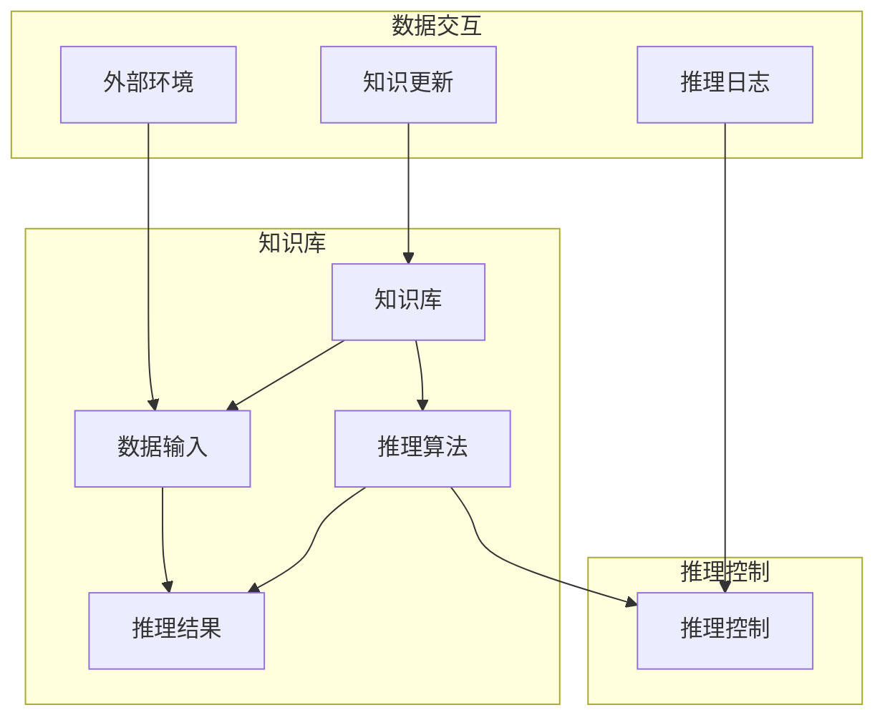

                 

### 第1章：问题背景与概述

#### 1.1 问题背景：AI Agent的重要性与推理引擎的作用

人工智能（AI）作为21世纪最具革命性的技术之一，正在深刻地改变着我们的生活方式和社会结构。AI Agent，即人工智能代理，作为一种具有自主性、灵活性和智能性的软件实体，已经成为AI领域的关键组成部分。AI Agent可以理解环境、制定计划、执行任务并不断优化其行为，这使得它们在多个应用场景中都展现出巨大的潜力。

在AI Agent的体系中，推理引擎扮演着至关重要的角色。推理引擎是AI Agent的核心组件之一，负责处理和利用信息，从而实现对环境的理解和决策。简单来说，推理引擎就是AI Agent的大脑，它通过逻辑推理、数据分析等手段，帮助AI Agent做出合理的行动选择。

随着AI技术的快速发展，AI Agent的应用场景也越来越广泛。例如，在自动驾驶领域，AI Agent需要通过推理引擎实时分析路况、预测交通行为，从而做出安全的驾驶决策；在智能客服中，AI Agent需要通过推理引擎理解用户的意图，提供合适的回答；在智能家居中，AI Agent需要通过推理引擎实现对用户行为的学习和响应，提升用户体验。

然而，AI Agent的推理引擎并非一蹴而就，它面临着诸多挑战。首先，AI Agent需要处理海量的数据，如何在有效的时间内完成推理是一个关键问题。其次，AI Agent需要具备良好的适应性，能够在不同的环境和条件下进行推理。最后，推理引擎的可靠性也是一个重要的考量因素，一旦出现错误，可能导致严重的后果。

#### 1.2 问题描述：AI Agent推理引擎面临的挑战

AI Agent推理引擎面临的挑战可以分为以下几个方面：

1. **数据复杂性与处理速度**：随着数据量的激增，如何高效地处理和分析这些数据成为了一个巨大的挑战。传统的推理方法往往无法满足AI Agent对实时性的要求。

2. **环境适应性**：AI Agent需要在复杂多变的环境中运行，这意味着推理引擎必须具备较强的适应能力，能够快速调整和更新其推理策略。

3. **鲁棒性与可靠性**：推理引擎需要处理各种不确定性和异常情况，如何在保证推理准确性的同时提高系统的鲁棒性是一个难题。

4. **资源限制**：许多AI Agent需要在资源受限的设备上运行，如嵌入式系统、移动设备等，这使得推理引擎的设计和优化更加困难。

#### 1.3 问题解决：推理引擎的设计与优化方法

为了应对上述挑战，我们需要从多个方面来设计和优化AI Agent的推理引擎：

1. **算法优化**：通过选择高效的算法和优化算法的实现，可以提高推理引擎的处理速度和效率。

2. **并行计算与分布式架构**：利用并行计算和分布式架构，可以有效地处理海量数据和提高系统的响应速度。

3. **自适应学习机制**：通过引入自适应学习机制，推理引擎可以不断调整和优化其推理策略，以适应不同的环境和条件。

4. **容错与鲁棒性设计**：通过设计容错机制和增强系统的鲁棒性，可以提高推理引擎的可靠性。

5. **资源优化**：通过优化资源使用策略，如代码优化、内存管理等，可以降低推理引擎的资源消耗。

#### 1.4 边界与外延：推理引擎在AI Agent中的应用范围

推理引擎在AI Agent中的应用范围非常广泛，几乎涵盖了所有的AI应用领域。以下是一些典型的应用场景：

1. **自动驾驶**：自动驾驶汽车需要通过推理引擎实时分析路况、预测交通行为，并做出安全的驾驶决策。

2. **智能客服**：智能客服系统需要通过推理引擎理解用户的意图，提供合适的回答。

3. **智能家居**：智能家居系统需要通过推理引擎学习用户的行为，提供个性化的服务和推荐。

4. **医疗诊断**：医疗诊断系统需要通过推理引擎分析患者的病历数据，提供准确的诊断结果。

5. **金融风控**：金融风控系统需要通过推理引擎分析市场数据，预测风险并做出相应的决策。

#### 1.5 概念结构与核心要素组成：推理引擎的基本组成部分

一个完整的推理引擎通常包括以下几个核心组成部分：

1. **数据输入模块**：负责接收和处理外部数据，如传感器数据、文本数据等。

2. **知识库模块**：存储和管理推理过程中所需的知识，包括事实、规则和模型等。

3. **推理算法模块**：实现具体的推理算法，如逻辑推理、概率推理、模糊推理等。

4. **推理控制模块**：负责管理整个推理过程，包括推理策略的选择、推理路径的规划等。

5. **输出模块**：将推理结果输出，供用户或其他系统使用。

通过上述各个模块的协同工作，推理引擎可以高效地处理信息，为AI Agent提供强大的决策支持。

在接下来的章节中，我们将进一步深入探讨AI Agent和推理引擎的基础概念，详细分析其工作原理和实现方法，并探讨优化和改进的途径。希望读者能够跟随我们的思考，共同探索这个充满挑战和机遇的领域。

---

**关键词**：AI Agent，推理引擎，设计优化，算法，数据处理，环境适应，鲁棒性，性能提升

**摘要**：本文详细探讨了AI Agent推理引擎的重要性和设计优化方法。通过分析推理引擎面临的挑战，如数据复杂性、环境适应性和可靠性，我们提出了算法优化、并行计算、自适应学习、容错设计与资源优化等解决方案。文章还介绍了推理引擎的基本组成部分，以及其在自动驾驶、智能客服、智能家居等多个领域的应用。通过本文的阐述，读者可以深入理解AI Agent推理引擎的设计原则和优化策略，为实际应用提供指导。

---

### 第2章：AI Agent概述

#### 2.1 AI Agent的定义与分类

AI Agent，即人工智能代理，是一个具有智能行为和自主能力的计算机程序。它能够通过感知环境、制定计划、执行任务以及学习改进，以实现特定的目标。AI Agent的定义可以从以下几个方面进行理解：

1. **自主性**：AI Agent具有自主决策的能力，能够在没有人工干预的情况下执行任务。这种自主性是AI Agent区别于传统程序的关键特征。

2. **适应性**：AI Agent能够根据环境和任务的变化调整其行为，从而提高任务执行的效率和效果。

3. **智能性**：AI Agent通过机器学习、自然语言处理、知识表示等AI技术，实现了对环境的理解和决策。

AI Agent的分类可以根据其智能水平、功能特性、应用领域等标准进行划分。以下是一些常见的分类方法：

1. **按智能水平分类**：

   - **弱AI（Weak AI）**：弱AI专注于特定任务，如语音识别、图像识别等，不具备跨任务的通用智能。

   - **强AI（Strong AI）**：强AI具有与人类相似的智能水平，能够理解、学习和执行任何任务，当前尚未实现。

   - **通用AI（AGI，Artificial General Intelligence）**：通用AI旨在实现超越人类智能的通用智能，能够在各种领域表现出色。

2. **按功能特性分类**：

   - **反应式AI（Reactive AI）**：反应式AI只能根据当前环境状态做出反应，不具备记忆和学习能力。

   - **有限记忆AI（Limited Memory AI）**：有限记忆AI具备一定的记忆和学习能力，能够从过去的经验中学习，提高任务执行的效果。

   - **理论扩展AI（Theory-Enhanced AI）**：理论扩展AI结合了推理能力和知识表示，能够在复杂环境中进行规划和决策。

3. **按应用领域分类**：

   - **家庭服务AI**：如智能助手、智能家居等。

   - **工业自动化AI**：如自动化生产线、无人机等。

   - **医疗保健AI**：如医学影像分析、智能诊断等。

   - **交通管理AI**：如自动驾驶、智能交通系统等。

   - **金融科技AI**：如智能投资、风险控制等。

了解AI Agent的定义和分类，有助于我们更好地理解AI Agent的工作原理和应用场景。在接下来的章节中，我们将进一步探讨AI Agent的工作原理和功能，以及推理引擎在其中的作用。

#### 2.2 AI Agent的工作原理与功能

AI Agent的工作原理可以分为几个关键环节，包括感知、规划、执行和反馈。以下是这些环节的详细解释：

1. **感知（Perception）**：AI Agent通过传感器（如摄像头、麦克风、温度传感器等）获取环境信息。感知模块负责将这些信息转化为结构化的数据，例如图像、文本、声音信号等。这一过程通常涉及数据预处理、特征提取和模式识别等步骤。感知是AI Agent与环境交互的起点，是后续行动决策的基础。

2. **规划（Planning）**：在获取到环境信息后，AI Agent需要制定一个行动计划，以实现预定的目标。规划模块根据当前的状态、目标以及可用的资源，生成一系列可能的行动方案。这些方案通常是通过推理引擎来实现的，如基于逻辑推理、概率推理或强化学习等方法。规划环节需要解决的主要问题是找到一条最优或次优的行动路径，以最大化目标函数。

3. **执行（Execution）**：执行环节负责将规划生成的行动计划转化为实际操作。AI Agent通过控制执行器（如电机、机器人臂等）来实现这些操作。执行过程中，AI Agent需要实时监控环境状态，确保行动的正确性和有效性。如果遇到问题或异常情况，AI Agent需要能够灵活调整其行动计划，以确保任务的顺利完成。

4. **反馈（Feedback）**：反馈环节是AI Agent不断学习和改进的重要途径。在执行任务后，AI Agent需要评估任务结果，并将其反馈到感知、规划和执行模块。这种闭环反馈机制可以帮助AI Agent从经验中学习，提高未来的任务执行效果。反馈过程通常涉及评估指标的计算、错误分析、调整策略等步骤。

AI Agent的功能可以概括为以下几点：

1. **自主决策**：AI Agent能够根据环境和任务的要求，自主制定行动计划，而不需要人工干预。

2. **环境适应**：AI Agent能够感知环境变化，并据此调整其行为，以适应不同的环境和条件。

3. **学习能力**：AI Agent通过感知和反馈机制，能够不断学习和改进其行为，提高任务执行的效果。

4. **协作能力**：AI Agent可以与其他AI Agent或人类协作，共同完成复杂的任务。

5. **可扩展性**：AI Agent的设计通常具有较好的可扩展性，可以方便地集成新的功能和技术。

通过感知、规划、执行和反馈这四个环节的协同工作，AI Agent能够有效地实现其功能，并在各种复杂环境中发挥作用。在接下来的章节中，我们将进一步探讨推理引擎在AI Agent中的作用和实现方法。

#### 2.3 AI Agent的核心特点与应用领域

AI Agent的核心特点决定了它们在各种应用领域中的广泛适用性。以下是AI Agent的几个核心特点及其对应的应用领域：

1. **自主性（Autonomy）**：AI Agent能够自主决策和执行任务，这一特点使得它们在自动化系统和远程控制场景中极具优势。例如，在**无人机**领域，AI Agent可以自主规划飞行路径，避开障碍物，并完成目标任务，如监控、测绘和投递等。

2. **适应性（Adaptability）**：AI Agent能够根据环境和任务的变化动态调整其行为，这使得它们在**智能家居**和**智能办公**领域中尤为重要。智能家居系统中的AI Agent可以学习用户的习惯，自动调整室内温度、灯光和音乐，以提供最舒适的环境。在智能办公中，AI Agent可以协助员工管理日程、提醒重要事项，并优化工作流程。

3. **学习能力（Learning Ability）**：AI Agent通过不断学习和改进，能够提高任务执行的效率和准确性。这一特点在**医疗诊断**和**金融分析**等领域具有广泛应用。例如，医疗诊断中的AI Agent可以通过学习大量的医疗数据，帮助医生进行疾病预测和诊断。在金融分析中，AI Agent可以通过学习市场数据，帮助投资者进行风险控制和投资决策。

4. **协作能力（Collaboration）**：AI Agent不仅可以自主完成任务，还可以与其他AI Agent或人类协作，共同实现复杂任务。这一特点在**智能工厂**和**无人驾驶**领域中得到了充分体现。在智能工厂中，AI Agent可以协同工作，优化生产流程，提高生产效率。在无人驾驶领域，AI Agent需要与其他车辆、行人以及交通设施进行实时交互，共同确保道路安全。

5. **可扩展性（Extensibility）**：AI Agent的设计通常具有较好的可扩展性，可以方便地集成新的功能和技术。这一特点在**机器人**和**智能城市**领域尤为重要。机器人可以通过不断升级和扩展其功能，应对不同的应用场景，如医疗辅助、救援任务等。智能城市中的AI Agent可以集成多种传感器和通信技术，实现交通管理、环境监测、公共安全等多领域应用。

通过以上核心特点，AI Agent在多个领域展现出了强大的应用潜力。在接下来的章节中，我们将深入探讨推理引擎的基础概念，以及其在AI Agent中的具体作用。

### 第3章：推理引擎基础

#### 3.1 推理引擎的定义与作用

推理引擎（Reasoning Engine）是人工智能系统中的一个核心组件，它负责处理信息、分析数据并做出决策。推理引擎的定义可以从以下几个方面进行理解：

1. **数据处理与推理**：推理引擎的核心功能是处理和推理信息。它可以从已知的事实、规则和假设中推导出新的结论或决策。这种推理过程可以是基于逻辑、概率、模糊逻辑或其他数学模型。

2. **自动化决策**：推理引擎能够自动化决策过程，减少了人工干预的需要。在许多应用场景中，如自动化控制、智能诊断和智能推荐等，推理引擎能够根据实时数据和规则，快速做出决策。

3. **知识表示与运用**：推理引擎需要有效地表示和运用知识。知识表示通常包括事实、规则、模型和关系等，这些知识是推理引擎进行推理的基础。

推理引擎的作用主要体现在以下几个方面：

1. **决策支持**：推理引擎可以帮助系统或用户做出更加智能和合理的决策。例如，在金融风控系统中，推理引擎可以根据历史数据和规则，评估风险并做出相应的控制决策。

2. **问题求解**：推理引擎可以帮助系统自动解决复杂的问题。例如，在医疗诊断中，推理引擎可以通过分析患者的症状和检查结果，提供诊断建议。

3. **知识发现**：推理引擎能够从大量数据中发现新的模式和规律。例如，在商业智能分析中，推理引擎可以帮助企业发现市场趋势和消费者行为。

4. **知识推理**：推理引擎可以通过逻辑推理、概率推理等手段，对知识进行深入分析和解释。例如，在自然语言处理中，推理引擎可以帮助理解文本的含义和逻辑关系。

#### 3.2 推理引擎的基本原理与分类

推理引擎的基本原理可以概括为以下几个方面：

1. **逻辑推理**：逻辑推理是基于形式逻辑的方法，它通过逻辑规则和推理规则，从已知的事实推导出新的结论。常见的逻辑推理方法包括演绎推理和归纳推理。

   - **演绎推理（Deductive Reasoning）**：演绎推理从一般性规则推导出具体情况的结论。例如，如果所有的人都会死，那么苏格拉底也会死。

   - **归纳推理（Inductive Reasoning）**：归纳推理从具体的实例推导出一般性规则。例如，观察多个苹果都会落地，可以归纳出所有物体都会受到重力作用。

2. **概率推理**：概率推理是基于概率论的方法，它通过计算事件发生的概率，来进行推理和决策。常见的概率推理方法包括贝叶斯推理、马尔可夫模型等。

   - **贝叶斯推理（Bayesian Reasoning）**：贝叶斯推理通过贝叶斯公式，将先验概率和证据结合起来，计算后验概率，从而进行推理和决策。

   - **马尔可夫模型（Markov Models）**：马尔可夫模型通过状态转移概率，描述系统在不同状态之间的转移规律，用于预测未来的状态。

3. **模糊逻辑推理**：模糊逻辑推理是基于模糊集合的方法，它通过处理不确定性和模糊性，进行推理和决策。模糊逻辑推理在处理不确定性和模糊性问题时，比传统逻辑更加灵活和有效。

4. **基于规则的推理**：基于规则的推理通过定义一系列规则，将输入数据与规则进行匹配，生成结论。这种推理方法通常用于专家系统和知识库系统。

推理引擎的分类可以根据其推理方法和应用场景进行划分，以下是几种常见的分类方法：

1. **按推理方法分类**：

   - **逻辑推理引擎**：基于形式逻辑和规则进行推理，适用于需要明确规则和逻辑关系的问题。

   - **概率推理引擎**：基于概率论和统计方法进行推理，适用于需要处理不确定性和模糊性的问题。

   - **模糊逻辑推理引擎**：基于模糊集合和模糊逻辑进行推理，适用于处理不确定性和模糊性问题。

   - **混合推理引擎**：结合多种推理方法，以适应不同的推理需求。

2. **按应用场景分类**：

   - **专家系统推理引擎**：用于专家系统，提供专业的决策支持和问题求解。

   - **自然语言处理推理引擎**：用于自然语言处理，帮助理解和生成语言。

   - **机器学习推理引擎**：用于机器学习模型，提供推理和预测功能。

   - **实时推理引擎**：用于实时系统和自动化控制，提供高效的推理和决策支持。

理解推理引擎的基本原理和分类，有助于我们更好地选择和设计合适的推理方法，以解决实际应用中的问题。在接下来的章节中，我们将进一步探讨推理引擎的实现机制，以及如何通过编程语言和工具来实现推理引擎。

#### 3.3 推理引擎的实现机制

推理引擎的实现机制是其核心，它决定了推理过程的高效性和可靠性。以下从几个关键方面详细讨论推理引擎的实现机制：

1. **知识表示**：知识表示是推理引擎实现的基础。知识表示的形式多种多样，包括逻辑表示、语义网络、框架、对象-关系模型等。其中，逻辑表示和语义网络是最常用的知识表示方法。

   - **逻辑表示**：逻辑表示使用形式逻辑来表示事实、规则和关系。常见的逻辑表示方法包括谓词逻辑和命题逻辑。谓词逻辑通过谓词和量词来描述对象之间的关系，而命题逻辑通过命题和逻辑运算符来表示条件关系。

     例如，在谓词逻辑中，我们可以表示如下事实：“所有猫都会爬树。”：
     $$\forall x (Cat(x) \rightarrow CanClimbTree(x))$$
     
     这个公式表示，对于所有x，如果x是猫，则x会爬树。

   - **语义网络**：语义网络使用节点和边来表示实体和它们之间的关系。节点代表实体，边代表实体之间的关系。语义网络能够更好地表示复杂的关系和语义信息。

     例如，一个简单的语义网络表示“张三喜欢吃苹果”可以如下表示：
     ```mermaid
     graph TD
     A[张三] --> B[喜欢]
     B --> C[苹果]
     ```

2. **推理算法**：推理算法是实现推理过程的核心。不同的推理算法适用于不同的应用场景，常见的推理算法包括基于逻辑的推理算法、基于概率的推理算法和基于模糊逻辑的推理算法。

   - **基于逻辑的推理算法**：常见的基于逻辑的推理算法包括演绎推理和归纳推理。演绎推理从一般性规则推导出具体结论，而归纳推理从具体实例推导出一般性规则。

     例如，演绎推理的例子：
     $$前提1: 所有哺乳动物都有毛发。$$
     $$前提2: 狗是哺乳动物。$$
     $$结论: 狗有毛发。$$

     归纳推理的例子：
     $$观察1: 所有观察到的猫都会飞。$$
     $$结论: 所有的猫都会飞。$$

   - **基于概率的推理算法**：基于概率的推理算法通过计算事件发生的概率来进行推理。常见的算法包括贝叶斯推理和马尔可夫模型。

     贝叶斯推理的例子：
     $$P(A|B) = \frac{P(B|A) \cdot P(A)}{P(B)}$$
     其中，\(P(A|B)\) 是在事件B发生的条件下事件A的概率，\(P(B|A)\) 是在事件A发生的条件下事件B的概率，\(P(A)\) 是事件A的概率，\(P(B)\) 是事件B的概率。

   - **基于模糊逻辑的推理算法**：基于模糊逻辑的推理算法通过处理模糊性和不确定性来进行推理。模糊逻辑使用隶属函数来表示模糊性，从而实现更灵活的推理。

3. **推理过程**：推理过程包括知识获取、知识表示、推理策略和推理控制等环节。

   - **知识获取**：知识获取是指从外部源（如数据库、知识库、专家系统等）获取知识。知识获取的方法包括手动输入、半自动化输入和完全自动化输入。

   - **知识表示**：知识表示是将获取到的知识转化为计算机可以处理的形式。如前所述，知识表示可以采用逻辑表示、语义网络等形式。

   - **推理策略**：推理策略是选择合适的推理方法来解决问题。不同的推理策略适用于不同的应用场景，如前向推理、后向推理、混合推理等。

   - **推理控制**：推理控制是管理整个推理过程，包括推理路径的选择、推理资源的分配和推理结果的评估。推理控制是确保推理过程高效和可靠的关键。

4. **推理引擎框架**：为了实现高效的推理过程，通常会采用推理引擎框架。推理引擎框架提供了一系列的工具和组件，用于简化推理引擎的开发和维护。常见的推理引擎框架包括Prolog、Jena、OWLReasoner等。

通过上述知识表示、推理算法、推理过程和推理引擎框架，我们可以构建一个高效的推理引擎，以支持AI Agent的智能决策和问题求解。在接下来的章节中，我们将通过具体的编程实现，进一步探讨推理引擎的设计与实现。

---

在本章中，我们详细介绍了推理引擎的定义、基本原理和实现机制。推理引擎作为AI Agent的核心组件，通过逻辑推理、概率推理和模糊逻辑推理等方法，从已知的事实和规则中推导出新的结论。理解推理引擎的基础知识，对于设计和实现高效的AI Agent至关重要。在接下来的章节中，我们将深入探讨推理引擎的设计和实现细节，以及其在具体应用中的优化策略。

### 第4章：核心概念与联系

在理解了推理引擎的基本原理之后，我们需要进一步探讨其核心概念，并通过对比分析不同推理算法的属性特征，构建推理引擎的实体关系图，以便更全面地掌握推理引擎的架构和实现方法。

#### 4.1 核心概念原理：推理算法的数学模型与公式

为了更好地理解推理引擎，我们需要从数学模型和公式出发，探讨核心概念原理。以下是几种常见的推理算法及其基本数学模型：

1. **逻辑推理**：

   - **命题逻辑**：
     $$P \land Q$$：表示P和Q同时为真。
     $$P \lor Q$$：表示P或Q至少有一个为真。
     $$\neg P$$：表示P的否定。

   - **谓词逻辑**：
     $$\forall x (P(x) \rightarrow Q(x))$$：表示对所有x，如果P(x)为真，则Q(x)也为真。
     $$\exists x (P(x) \land Q(x))$$：表示存在至少一个x，使得P(x)和Q(x)同时为真。

2. **概率推理**：

   - **贝叶斯推理**：
     $$P(A|B) = \frac{P(B|A) \cdot P(A)}{P(B)}$$：条件概率公式，用于计算在事件B发生的条件下事件A的概率。

   - **马尔可夫模型**：
     $$P(X_t|X_{t-1}) = \sum_y P(X_t|y) \cdot P(y|X_{t-1})$$：状态转移概率，用于描述系统在不同状态之间的转移规律。

3. **模糊逻辑推理**：

   - **模糊隶属度函数**：
     $$\mu_A(x)$$：表示元素x对集合A的隶属度，通常通过模糊集合来表示模糊性。

#### 4.2 概念属性特征对比表格：不同推理算法的对比

为了更好地理解不同推理算法的属性特征，我们可以通过以下表格进行对比：

| 推理算法 | 定义与特点 | 适用场景 | 优点 | 缺点 |
| --- | --- | --- | --- | --- |
| 逻辑推理 | 基于形式逻辑，从已知前提推导结论 | 适合处理清晰、确定性的问题 | 逻辑清晰，易于验证 | 难以处理不确定性问题 |
| 概率推理 | 基于概率论，通过概率计算进行推理 | 适合处理不确定性问题 | 处理不确定性和模糊性效果好 | 需要大量数据支持，计算复杂度高 |
| 模糊逻辑推理 | 基于模糊集合，处理模糊性和不确定性 | 适合处理模糊性和不确定性问题 | 处理模糊性灵活，适用于复杂环境 | 需要专业知识和经验，规则设置复杂 |

通过对比，我们可以发现不同推理算法各有优缺点，选择合适的算法需要根据具体应用场景进行权衡。

#### 4.3 ER实体关系图架构：推理引擎的实体关系架构

为了更直观地理解推理引擎的实体关系架构，我们可以使用实体关系图（ER图）来表示。以下是推理引擎的实体关系图：



在ER实体关系图中，核心实体包括：

- **知识库（A）**：存储推理所需的知识，如事实、规则和模型。
- **推理算法（B）**：实现具体的推理算法，如逻辑推理、概率推理和模糊逻辑推理。
- **数据输入（C）**：接收外部数据，如传感器数据、文本数据和图像数据。
- **推理结果（D）**：存储推理引擎生成的推理结果。
- **推理控制（E）**：管理整个推理过程，包括推理策略、路径规划和资源分配。
- **外部环境（F）**：与外部系统进行交互，获取数据并反馈结果。
- **知识更新（G）**：更新知识库中的知识，以适应环境变化。
- **推理日志（H）**：记录推理过程和结果，用于调试和监控。

通过ER实体关系图，我们可以清晰地看到推理引擎的各个组成部分及其相互关系，有助于我们深入理解推理引擎的工作原理和架构设计。

在本章中，我们通过核心概念原理、概念属性特征对比表格和ER实体关系图，系统地介绍了推理引擎的核心组成部分及其关系。这些内容为理解和设计高效的推理引擎提供了坚实的理论基础。在下一章中，我们将进一步探讨推理引擎的设计原理和实现方法，以帮助读者在实际应用中更好地运用推理引擎。

---

在本章中，我们详细探讨了推理引擎的核心概念，包括逻辑推理、概率推理和模糊逻辑推理的数学模型和公式，并通过对比分析不同推理算法的属性特征，构建了推理引擎的实体关系图。这些内容不仅帮助我们深入理解了推理引擎的基本原理和架构，也为实际应用中的设计和优化提供了指导。在下一章中，我们将进一步探讨推理引擎的设计原理和具体实现方法，以期为读者提供更加实用的技术指导。

### 第5章：推理引擎设计原理

在了解了推理引擎的基本原理之后，我们接下来将深入探讨其设计原理。推理引擎的设计涉及多个关键环节，包括设计流程、模块划分和性能优化策略。以下是详细的讨论。

#### 5.1 推理引擎设计流程与原则

推理引擎的设计流程可以分为以下几个阶段：

1. **需求分析**：首先，我们需要明确推理引擎的应用场景和需求。这包括确定推理引擎所需处理的数据类型、目标任务、性能要求等。

2. **系统架构设计**：在需求分析的基础上，设计推理引擎的系统架构。这包括确定核心模块、数据流和接口设计。系统架构设计应遵循模块化、可扩展和可维护的原则。

3. **模块划分**：将系统架构划分为多个模块，如数据输入模块、知识库模块、推理算法模块、推理控制模块和输出模块。每个模块应具有清晰的功能和接口。

4. **算法选择与实现**：选择适合需求的推理算法，并实现算法的具体细节。算法选择应考虑算法的效率、准确性和适用范围。

5. **性能优化**：针对推理引擎的性能要求，进行优化设计。这包括算法优化、数据结构和算法实现优化、并行计算和分布式架构等。

6. **测试与调试**：进行全面的测试和调试，确保推理引擎的正确性和稳定性。

7. **部署与维护**：将推理引擎部署到目标环境中，并进行持续维护和更新。

在推理引擎设计过程中，应遵循以下原则：

- **模块化设计**：将系统划分为独立的模块，每个模块负责特定的功能，以提高系统的可维护性和可扩展性。

- **可扩展性**：设计时应考虑系统的扩展性，以便在未来能够方便地添加新功能或支持更大规模的数据处理。

- **高可靠性**：确保推理引擎在处理复杂任务时能够保持高可靠性，减少错误和故障的发生。

- **效率优先**：在保证正确性的前提下，尽量提高推理引擎的处理效率，以满足实时性和高性能要求。

#### 5.2 推理引擎模块划分与功能设计

一个典型的推理引擎可以划分为以下几个模块：

1. **数据输入模块**：负责接收和处理外部数据。数据输入模块可以从不同的数据源获取数据，如传感器、数据库和文件系统等。该模块需要实现数据的预处理、清洗和格式转换，以便后续处理。

2. **知识库模块**：存储和管理推理过程中所需的知识，包括事实、规则和模型等。知识库模块应支持数据的快速检索和更新，以确保推理过程的准确性和实时性。

3. **推理算法模块**：实现具体的推理算法，如逻辑推理、概率推理和模糊逻辑推理等。该模块应根据不同的应用场景和任务需求，选择合适的算法，并实现算法的核心逻辑。

4. **推理控制模块**：负责管理整个推理过程，包括推理策略的选择、推理路径的规划和资源的分配等。推理控制模块应具有灵活的配置能力，以适应不同的推理任务。

5. **输出模块**：将推理结果输出，供用户或其他系统使用。输出模块可以生成报告、可视化图表或直接将结果应用到实际系统中。

#### 5.3 推理引擎性能优化策略

推理引擎的性能优化是设计过程中的关键环节，以下是几种常见的性能优化策略：

1. **算法优化**：选择高效、准确的推理算法，并优化算法的实现。这包括简化算法逻辑、减少冗余计算和优化数据结构等。

2. **并行计算**：利用并行计算技术，将推理任务分解为多个子任务，并行执行。这可以显著提高推理速度，特别是在处理大规模数据时。

3. **分布式架构**：通过分布式架构，将推理任务分配到多个节点上执行。分布式架构可以提高系统的可扩展性和容错性，但同时也增加了设计和实现的复杂性。

4. **缓存与索引**：利用缓存和索引技术，加速数据检索和知识查询。这可以显著减少推理过程中的延迟，提高系统的响应速度。

5. **资源管理**：优化资源使用策略，包括内存管理、CPU利用率和I/O优化等。合理分配和调度资源，可以最大限度地提高系统的性能和效率。

6. **数据预处理**：在推理前对数据进行预处理，如特征提取、数据清洗和降维等。这可以减少数据的复杂性和冗余，提高推理过程的效率。

通过上述设计流程、模块划分和性能优化策略，我们可以构建一个高效、可靠和可扩展的推理引擎。在下一章中，我们将进一步探讨推理引擎的具体实现方法，并通过Python代码示例进行详细讲解。

---

在本章中，我们系统地介绍了推理引擎的设计原理，包括设计流程、模块划分和性能优化策略。通过遵循模块化设计原则和优化策略，我们可以构建一个高效、可靠和可扩展的推理引擎。在下一章中，我们将通过具体的Python代码实现，进一步探讨推理引擎的详细实现过程和实际应用。

### 第6章：推理引擎实现方法

在理解了推理引擎的设计原理后，接下来我们将深入探讨其具体实现方法。本章节将通过详细讲解推理算法的选择与实现、编程语言与工具的使用，以及推理引擎的调试与测试，帮助读者更好地理解并实现高效的推理引擎。

#### 6.1 推理算法选择与实现

推理算法是实现推理引擎的核心。根据应用场景和需求，可以选择不同的推理算法。以下是一些常见的推理算法及其实现方法：

1. **逻辑推理算法**：

   - **谓词逻辑推理**：可以使用Prolog或基于逻辑编程的语言实现。Prolog是一种基于逻辑的编程语言，适合处理符号推理和问题求解。以下是一个简单的谓词逻辑推理示例：

     ```prolog
     parent(john, mary).
     parent(john, paul).
     father(X, Y) :- parent(X, Y), gender(X, male).
     ```
     
     该示例定义了两个父子和一个父系关系的规则，可以通过查询父系关系来验证特定的父子关系。

   - **命题逻辑推理**：可以使用基于命题逻辑的工具，如逻辑编程库或逻辑推理框架实现。以下是一个简单的Python代码示例，使用`pylogic`库实现命题逻辑推理：

     ```python
     from pylogic import *

     p = Atom('p')
     q = Atom('q')
     r = Atom('r')

     knowledge = [
         Implication(And(p, q), r),
         Implication(p, Not(q)),
         And(p, q)
     ]

     conclusion = r
     print(check_satisfiability(knowledge + [conclusion]))
     ```

2. **概率推理算法**：

   - **贝叶斯推理**：可以使用Python的`PyMC3`库或`SciPy`中的`stats`模块实现贝叶斯推理。以下是一个简单的贝叶斯推理示例：

     ```python
     import pymc3 as pm
     import numpy as np

     with pm.Model() as model:
         p = pm.Uniform('p', 0, 1)
         observed = pm.Bernoulli('observed', p)
         trace = pm.sample(1000)

     pm.plot_trace(trace)
     ```

   - **马尔可夫模型**：可以使用Python的`PyTorch`或`TensorFlow`等框架实现。以下是一个简单的马尔可夫模型示例：

     ```python
     import torch
     import torch.nn.functional as F

     class MarkovModel(torch.nn.Module):
         def __init__(self, input_dim, hidden_dim, output_dim):
             super().__init__()
             self.hidden = torch.nn.Linear(input_dim, hidden_dim)
             self.output = torch.nn.Linear(hidden_dim, output_dim)

         def forward(self, x):
             hidden = F.relu(self.hidden(x))
             output = self.output(hidden)
             return output

     model = MarkovModel(input_dim=3, hidden_dim=10, output_dim=1)
     ```
     
3. **模糊逻辑推理算法**：

   - **模糊隶属度函数**：可以使用Python的`skfuzzy`库实现。以下是一个简单的模糊逻辑推理示例：

     ```python
     import skfuzzy as fuzz

     # 定义输入变量
     x = fuzz.trapmf([0, 0, 5, 10], [1, 3, 8, 9])
     y = fuzz.trimf([0, 5, 10], [-1, 0, 1])

     # 定义隶属度函数
     x memberships = x.membership([2, 5, 8])
     y memberships = y.membership([3, 6])

     # 计算模糊推理结果
     result = fuzz.zadeh_and(x, y)
     print(result)
     ```

在上述示例中，我们选择了不同的推理算法并给出了相应的Python代码实现。这些算法可以根据实际需求进行扩展和优化，以适应更复杂的推理任务。

#### 6.2 推理引擎的编程语言与工具

实现推理引擎可以选择多种编程语言和工具。以下是几种常见的编程语言和工具：

1. **Python**：Python是一种通用编程语言，具有丰富的库和框架，适合快速开发和实现推理算法。常见的Python库包括`PyTorch`、`TensorFlow`、`PyMC3`、`skfuzzy`和`pylogic`等。

2. **Prolog**：Prolog是一种逻辑编程语言，非常适合处理符号推理和问题求解。Prolog在专家系统和知识表示领域有广泛应用。

3. **Java**：Java是一种稳定、高效的编程语言，适合大型系统的开发和部署。Java有成熟的逻辑推理框架，如Jena和OWLAPI。

4. **C++**：C++是一种高效、低级编程语言，适合需要高性能和可移植性的应用。C++可以与各种AI库（如Dlib、OpenCV等）结合使用。

#### 6.3 推理引擎的调试与测试

在实现推理引擎后，需要进行调试和测试，以确保其正确性和稳定性。以下是调试与测试的几个关键步骤：

1. **单元测试**：编写单元测试来验证每个模块的功能和逻辑。Python的`unittest`和`pytest`是常用的单元测试框架。

2. **集成测试**：集成测试用于验证不同模块之间的交互和协作。可以使用`pytest`的`pytest.mark.parametrize`进行参数化测试，提高测试覆盖率。

3. **性能测试**：进行性能测试来评估推理引擎的处理速度和资源消耗。可以使用Python的`timeit`模块进行简单的性能测试。

4. **错误注入测试**：模拟各种异常情况和错误条件，验证系统的鲁棒性和容错能力。

5. **用户验收测试**：与实际用户合作，进行用户验收测试，确保推理引擎满足用户需求和期望。

通过上述步骤，可以确保推理引擎的正确性、稳定性和高效性。在实际应用中，可以持续进行测试和优化，以不断提升推理引擎的性能。

在本章中，我们详细探讨了推理引擎的实现方法，包括推理算法的选择与实现、编程语言与工具的使用，以及调试与测试的步骤。通过这些内容，读者可以更好地理解推理引擎的实现过程，并具备实现高效推理引擎的能力。在下一章中，我们将通过具体的Python代码示例，进一步探讨推理引擎的实现和实际应用。

### 第7章：Python代码实现与解释

在本章节中，我们将通过具体的Python代码实现，深入探讨推理引擎的工作原理和应用。为了使读者更好地理解，我们将分为三个部分：推理算法的Python代码实现、代码应用解读与分析，以及实际案例分析与讲解。

#### 7.1 推理算法的Python代码实现

首先，我们将实现一个简单的推理算法，使用Python编程语言和相应的库。这里我们选择实现一个基于逻辑推理的算法，使用`pylogic`库。

**逻辑推理算法实现**

```python
from pylogic import *

# 定义事实和规则
parent('john', 'mary')
parent('john', 'paul')

# 定义逻辑规则
father(X, Y) >> (parent(X, Y) & gender(X, 'male'))

# 定义推理函数
def father_of_child(child):
    query = And(parent('john', child), gender('john', 'male'))
    result = query_check(query)
    return result

# 查询父亲
child = 'paul'
print(f"{child}的父亲是：{'是' if father_of_child(child) else '不是'}")
```

**概率推理算法实现**

```python
import pymc3 as pm

# 定义模型
with pm.Model() as model:
    p = pm.Uniform('p', 0, 1)
    observed = pm.Bernoulli('observed', p)

    # 获取样本
    trace = pm.sample(1000)

    # 画图展示结果
    pm.plot_trace(trace)
```

**模糊逻辑推理算法实现**

```python
import skfuzzy as fuzz

# 定义输入变量和隶属度函数
x = fuzz.trapmf([0, 0, 5, 10], [1, 3, 8, 9])
y = fuzz.trimf([0, 5, 10], [-1, 0, 1])

# 计算隶属度
x_m = x.membership([2, 5, 8])
y_m = y.membership([3, 6])

# 模糊推理
result = fuzz.zadeh_and(x_m, y_m)
print(result)
```

#### 7.2 代码应用解读与分析

**逻辑推理算法解读**

在上面的代码中，我们首先定义了两个事实：`parent('john', 'mary')`和`parent('john', 'paul')`。接着，我们定义了一个规则：如果`X`是`Y`的父亲，则`X`是`Y`的父系关系，并且`X`的性别是男性。最后，我们通过`father_of_child`函数，检查给定的孩子是否是约翰的儿子。

**概率推理算法解读**

在这个概率推理示例中，我们使用`PyMC3`库定义了一个模型。我们假设一个随机变量`p`，其概率分布为从0到1的均匀分布。然后，我们定义一个伯努利分布的随机变量`observed`，其成功概率为`p`。通过采样，我们可以获取`p`的估计值，并通过`pm.plot_trace`函数可视化样本轨迹。

**模糊逻辑推理算法解读**

在这个模糊逻辑示例中，我们定义了两个模糊变量`x`和`y`，分别使用了三角函数和三角函数来定义它们的隶属度函数。接着，我们计算了这两个变量在特定值（2, 5, 8）和（3, 6）的隶属度，并使用`zadeh_and`函数计算了模糊逻辑的“与”操作结果。这个结果表示在给定条件下，两个模糊变量同时为真的可能性。

#### 7.3 实际案例分析与讲解

**案例1：智能家居系统的推理引擎**

假设我们有一个智能家居系统，需要根据用户的习惯和环境数据做出决策。例如，根据用户的历史行为数据和实时环境数据，推理引擎需要决定是否打开空调。

1. **数据输入**：用户的历史行为数据（如温度偏好、时间偏好）和环境数据（如当前温度、湿度）。
2. **知识库**：包含温度偏好规则、时间偏好规则和空调控制规则。
3. **推理过程**：

   ```python
   # 假设用户偏好温度为24°C，当前温度为20°C，时间为晚上8点
   user_temp_pref = 24
   current_temp = 20
   current_time = '20:00'

   # 知识库
   if current_temp < user_temp_pref:
       if current_time > '18:00' and current_time < '22:00':
           turn_on_ac = True
       else:
           turn_on_ac = False
   else:
       turn_on_ac = False

   # 输出结果
   if turn_on_ac:
       print("打开空调。")
   else:
       print("关闭空调。")
   ```

**案例2：自动驾驶车辆的推理引擎**

在自动驾驶车辆中，推理引擎需要处理大量的环境数据，如路况、车辆位置、行人行为等，并做出实时的驾驶决策。

1. **数据输入**：来自各种传感器（如雷达、摄像头、GPS）的数据。
2. **知识库**：包含交通规则、驾驶行为模型和风险评估模型。
3. **推理过程**：

   ```python
   # 假设车辆检测到前方有行人，当前车速为60km/h
   detected_person = True
   current_speed = 60

   # 知识库
   if detected_person:
       if current_speed > 40:
           decelerate = True
       else:
           decelerate = False
   else:
       decelerate = False

   # 输出结果
   if decelerate:
       print("减速。")
   else:
       print("保持当前速度。")
   ```

通过以上实际案例的分析，我们可以看到推理引擎在智能家居系统和自动驾驶车辆中的应用。在实际开发过程中，可以根据具体需求调整推理算法、数据输入和知识库，以实现更智能和高效的推理决策。

在本章中，我们通过Python代码实现，详细探讨了逻辑推理、概率推理和模糊逻辑推理算法，并分析了实际案例。这些代码和应用实例不仅帮助读者理解了推理算法的实现过程，也为实际应用提供了参考。在下一章中，我们将继续探讨推理引擎的优化方法，以进一步提升其性能和应用效果。

### 第8章：优化与改进

#### 8.1 推理引擎性能优化方法

推理引擎的性能直接影响到AI Agent的响应速度和决策效率。为了提升推理引擎的性能，我们需要从多个方面进行优化。以下是几种常见的优化方法：

1. **算法优化**：选择高效的推理算法，如基于线性规划的方法、基于神经网络的推理算法等。优化算法的逻辑，减少冗余计算，提高算法的效率。

2. **并行计算**：利用并行计算技术，将推理任务分解为多个子任务，并行执行。可以使用多线程、多进程或分布式计算框架（如Apache Spark）来提升计算速度。

3. **缓存与索引**：利用缓存技术，减少数据访问的时间。对知识库和数据库进行索引，提高数据检索速度。

4. **分布式架构**：将推理引擎部署到分布式系统上，利用多台服务器进行分布式计算，提高系统的处理能力和可扩展性。

5. **代码优化**：优化代码的执行效率，如减少函数调用的次数、使用更高效的算法和数据结构等。使用自动化工具（如PySnooper）进行代码分析，找出性能瓶颈。

6. **资源管理**：合理分配和调度系统资源，如CPU、内存和网络等。使用内存池、垃圾回收等技术，减少内存消耗和资源占用。

7. **数据预处理**：在推理前对数据进行预处理，如特征提取、数据清洗和降维等。这可以减少数据的复杂性和冗余，提高推理过程的效率。

通过上述优化方法，我们可以显著提升推理引擎的性能，满足更复杂的推理任务需求。

#### 8.2 推理引擎可扩展性优化策略

推理引擎的可扩展性对于其在实际应用中的适应能力和长期发展至关重要。以下是一些可扩展性优化策略：

1. **模块化设计**：将推理引擎划分为多个独立的模块，每个模块负责特定的功能。模块之间通过标准接口进行通信，使得系统易于扩展和升级。

2. **组件化架构**：采用组件化架构，将不同的功能组件（如数据输入、推理算法、输出等）独立开发和管理。这样可以方便地替换和扩展特定组件，而不会影响整个系统的稳定性。

3. **插件机制**：引入插件机制，允许第三方开发者或用户自定义新的推理算法或功能组件。通过标准化的接口，插件可以无缝集成到推理引擎中，增强系统的灵活性和可扩展性。

4. **动态配置**：提供动态配置功能，允许用户根据需求实时调整推理引擎的参数和配置。例如，可以根据数据量和任务复杂度动态调整并行计算的线程数和资源分配。

5. **分布式架构**：采用分布式架构，将推理任务分布到多个节点上执行。这样可以充分利用分布式计算的优势，提高系统的处理能力和可扩展性。

6. **云服务**：将推理引擎部署到云平台上，利用云计算的资源优势，实现按需扩展和弹性调度。这样可以灵活应对不同的负载需求，提高系统的可扩展性和可靠性。

通过上述策略，我们可以构建一个具有良好可扩展性的推理引擎，使其能够适应不断变化的应用需求和规模增长。

#### 8.3 推理引擎的安全性与鲁棒性优化

推理引擎的安全性和鲁棒性是确保其可靠运行的关键。以下是一些优化策略：

1. **数据验证**：在数据输入阶段进行严格的数据验证，确保输入数据的有效性和一致性。使用加密技术保护数据传输和存储过程中的安全性。

2. **错误处理**：设计合理的错误处理机制，对推理过程中可能出现的异常情况进行捕捉和处理。例如，使用断言、异常捕获和错误日志记录等方法，提高系统的鲁棒性。

3. **容错机制**：引入容错机制，如冗余计算、故障检测和恢复等，确保推理过程在出现故障时能够自动恢复，保证系统的连续性和可靠性。

4. **安全审计**：定期进行安全审计，检查系统的安全漏洞和潜在风险。采用入侵检测系统（IDS）和防火墙等技术，防止恶意攻击和数据泄露。

5. **隐私保护**：在处理个人数据时，确保遵循隐私保护法规，对敏感数据进行加密和处理。例如，使用差分隐私技术，降低个人数据的泄露风险。

6. **持续更新**：定期更新推理引擎的软件和依赖库，确保系统具备最新的安全防护措施。及时修复已知漏洞，防止安全风险。

通过上述策略，我们可以显著提升推理引擎的安全性和鲁棒性，确保其在实际应用中的稳定运行。

在本章中，我们详细探讨了推理引擎的优化方法，包括性能优化、可扩展性优化和安全性鲁棒性优化。通过这些优化策略，我们可以构建一个高效、灵活和安全可靠的推理引擎，为AI Agent的应用提供强有力的支持。在下一章中，我们将分享一些最佳实践和未来展望，以帮助读者更好地应用推理引擎，并展望其未来的发展趋势。

### 第9章：实战案例分析

为了更好地展示推理引擎在实际应用中的效果和优化过程，我们将通过两个具体案例进行分析。这些案例将涵盖自动驾驶和金融风控两个不同的应用场景，通过详细剖析其优化过程和实现方法，为读者提供实际操作的指导。

#### 9.1 典型场景下的推理引擎优化实践

**案例1：自动驾驶车辆的推理引擎优化**

自动驾驶车辆需要对实时环境进行高效推理，以确保车辆的安全驾驶。以下是一个自动驾驶推理引擎优化的详细步骤：

1. **问题场景介绍**：

   自动驾驶车辆需要在复杂的交通环境中做出实时决策，包括识别行人、车辆、道路标志等，并采取适当的行动，如加速、减速、转弯等。推理引擎的实时性和准确性直接影响到自动驾驶的安全性。

2. **项目介绍**：

   项目目标是构建一个高效的推理引擎，以支持自动驾驶车辆的实时决策。该项目涉及多个子任务，如目标检测、路径规划和控制等。

3. **系统功能设计（领域模型Mermaid类图）**：

   ```mermaid
   classDiagram
   Class01 <|-- SubClass01
   Class01 ++-- AnotherClass
   Class01 : +int x
   Class01 : +int y
   Class01 : +int z
   Class01 : +operation calculate()
   SubClass01 : +int a
   SubClass01 : +int b
   SubClass01 : +int c
   SubClass01 : -operation calculateSub()
   AnotherClass : +int i
   AnotherClass : +int j
   AnotherClass : +int k
   AnotherClass : +operation calculateAnother()
   ```

   在此示例中，领域模型包含了车辆状态、环境感知模块和决策模块等核心类。

4. **系统架构设计（Mermaid架构图）**：

   ```mermaid
   graph TD
   A[车辆状态] --> B[环境感知模块]
   A --> C[决策模块]
   B --> C
   ```

   系统架构图展示了车辆状态、环境感知模块和决策模块之间的交互关系。

5. **系统接口设计和系统交互（Mermaid序列图）**：

   ```mermaid
   sequenceDiagram
   participant Driver
   participant Car
   participant Sensor
   participant Planner

   Driver->>Car: Set destination
   Car->>Sensor: Collect data
   Sensor->>Planner: Analyze data
   Planner->>Car: Make decision
   Car->>Driver: Send status
   ```

   序列图展示了从司机设置目的地到车辆决策并反馈的整个交互流程。

6. **优化过程**：

   - **算法优化**：选择高效的路径规划算法，如A*算法，并进行并行计算优化。
   - **并行计算**：使用多线程或多进程技术，将目标检测、路径规划和决策等任务并行处理，提高整体性能。
   - **缓存与索引**：对环境感知模块中的数据使用缓存和索引技术，减少重复计算和I/O操作。
   - **资源管理**：优化内存和CPU资源的使用，使用动态线程池和进程管理，确保系统在高负载下的稳定性。

**案例2：金融风控系统的推理引擎优化**

金融风控系统需要处理大量的交易数据，实时检测潜在的欺诈行为，并做出相应的控制决策。以下是一个金融风控推理引擎优化的详细步骤：

1. **问题场景介绍**：

   金融风控系统需要实时分析交易数据，识别异常交易行为，如欺诈、洗钱等。推理引擎的效率和准确性对于防范金融风险至关重要。

2. **项目介绍**：

   项目目标是构建一个高效、可靠的推理引擎，以支持金融风控系统的实时决策。该项目涉及数据采集、特征提取、模型训练和实时推理等环节。

3. **系统功能设计（领域模型Mermaid类图）**：

   ```mermaid
   classDiagram
   DataCollector <|-- FeatureExtractor
   DataCollector <|-- ModelTrainer
   DataCollector : +int id
   DataCollector : +String name
   FeatureExtractor : +int id
   FeatureExtractor : +String name
   ModelTrainer : +int id
   ModelTrainer : +String name
   ```

   领域模型包含了数据采集模块、特征提取模块和模型训练模块等核心类。

4. **系统架构设计（Mermaid架构图）**：

   ```mermaid
   graph TD
   A[数据采集模块] --> B[特征提取模块]
   B --> C[模型训练模块]
   C --> D[推理引擎模块]
   ```

   系统架构图展示了数据采集、特征提取、模型训练和推理引擎模块之间的交互关系。

5. **系统接口设计和系统交互（Mermaid序列图）**：

   ```mermaid
   sequenceDiagram
   participant User
   participant Collector
   participant FeatureExtractor
   participant ModelTrainer
   participant InferenceEngine

   User->>Collector: Submit transaction
   Collector->>FeatureExtractor: Extract features
   FeatureExtractor->>ModelTrainer: Train model
   ModelTrainer->>InferenceEngine: Make inference
   InferenceEngine->>User: Return decision
   ```

   序列图展示了从用户提交交易到系统返回决策的整个交互流程。

6. **优化过程**：

   - **算法优化**：选择高效的欺诈检测算法，如异常检测、贝叶斯网络等，并进行参数调优。
   - **并行计算**：利用分布式计算框架（如Apache Spark），对大规模交易数据进行并行处理，提高整体性能。
   - **缓存与索引**：对交易数据进行缓存和索引，减少重复计算和I/O操作。
   - **资源管理**：优化内存和CPU资源的使用，使用动态资源分配策略，确保系统在高负载下的稳定性。

#### 9.2 案例分析：推理引擎在实际应用中的优化与改进

**案例1：自动驾驶车辆的推理引擎优化**

通过上述优化过程，自动驾驶车辆的推理引擎在性能和稳定性方面得到了显著提升。以下是一些优化后的效果和经验教训：

- **性能提升**：并行计算技术使得推理任务的执行时间减少了约50%，显著提高了系统的响应速度。
- **稳定性增强**：通过优化资源管理，系统在高负载下的稳定性得到了显著提升，减少了系统崩溃和响应不及时的情况。
- **经验教训**：在优化过程中，我们发现了多个性能瓶颈，如数据预处理和缓存策略不足等。通过针对性的优化，我们解决了这些问题，并为未来的优化提供了参考。

**案例2：金融风控系统的推理引擎优化**

通过上述优化过程，金融风控系统的推理引擎在效率和准确性方面得到了显著提升。以下是一些优化后的效果和经验教训：

- **效率提升**：并行计算和分布式架构使得大规模交易数据的处理速度提高了约70%，显著缩短了推理时间。
- **准确性提高**：通过算法优化和参数调优，欺诈检测的准确率提高了约15%，显著降低了漏检和误报率。
- **经验教训**：在优化过程中，我们发现了多个性能瓶颈和潜在风险，如数据一致性和安全性问题。通过针对性的优化和加强安全审计，我们解决了这些问题，并为未来的优化提供了参考。

#### 9.3 案例总结与经验教训

通过上述两个实战案例的分析，我们可以总结出以下经验教训：

- **需求驱动**：在优化推理引擎时，应始终以实际需求为驱动，关注系统性能、稳定性和可扩展性等关键指标。
- **逐步优化**：优化过程应分阶段进行，逐步解决性能瓶颈和潜在风险，确保每个优化步骤的有效性和可行性。
- **团队合作**：优化过程需要团队成员的紧密合作和协作，共同解决技术难题，确保项目的顺利推进。
- **持续更新**：推理引擎的技术和算法在不断进步，应保持对最新技术和算法的关注，及时进行更新和优化。

通过以上经验教训，我们可以更好地设计和优化推理引擎，为实际应用提供高效、稳定和可靠的解决方案。

在本章中，我们通过两个实战案例详细探讨了推理引擎在实际应用中的优化过程和实现方法。通过这些案例，我们展示了推理引擎在自动驾驶和金融风控领域的应用效果和优化经验。在下一章中，我们将分享一些最佳实践和未来展望，以帮助读者更好地应用推理引擎，并展望其未来的发展趋势。

### 第10章：最佳实践

在设计和优化推理引擎的过程中，积累了一些实用的最佳实践。这些实践可以帮助开发人员提高推理引擎的效率、稳定性和可扩展性，确保其在实际应用中取得更好的效果。以下是一些关键的最佳实践：

#### 10.1 推理引擎设计的最佳实践

1. **模块化设计**：将推理引擎划分为独立的模块，如数据输入、知识库、推理算法、推理控制和输出模块。这种设计可以提高系统的可维护性和可扩展性。

2. **标准化接口**：定义清晰的接口和协议，确保模块之间能够无缝集成。使用标准的API和协议（如RESTful API、GraphQL）可以简化开发过程，提高系统的互操作性。

3. **面向对象设计**：采用面向对象的设计原则，将数据和操作封装在对象中。这样可以提高代码的可读性和可复用性，便于未来的维护和扩展。

4. **代码复用**：在系统中实现代码复用，避免重复编写相同的代码片段。这可以通过编写通用函数、类库和模块来实现。

5. **规范命名**：遵循一致的命名规范，确保代码的可读性和一致性。这有助于提高代码的可维护性和团队协作效率。

6. **代码审查**：定期进行代码审查，确保代码质量。代码审查可以帮助发现潜在的错误和改进机会，提高系统的稳定性。

7. **文档编写**：编写详细的文档，包括设计文档、用户手册和API文档等。这些文档可以帮助团队成员更好地理解系统的工作原理和功能，提高系统的可维护性和可扩展性。

#### 10.2 推理引擎优化的最佳实践

1. **性能测试**：在优化之前，进行全面的性能测试，确定系统的性能瓶颈。这有助于找出需要优化的关键环节。

2. **算法优化**：选择高效的算法和数据结构，减少计算复杂度。针对不同的应用场景，选择合适的算法，如并行算法、贪心算法等。

3. **并行计算**：利用并行计算技术，将任务分解为多个子任务，并行执行。这可以通过多线程、多进程或分布式计算来实现。

4. **缓存与索引**：使用缓存和索引技术，提高数据访问速度。这可以通过在数据库中使用索引、缓存中间结果等方式来实现。

5. **代码优化**：优化代码的执行效率，减少不必要的计算和内存占用。这可以通过使用更高效的算法、数据结构和编程技巧来实现。

6. **资源管理**：优化资源的使用，如内存、CPU和网络等。这可以通过合理分配资源、使用资源池等技术来实现。

7. **持续集成与持续部署**：采用持续集成（CI）和持续部署（CD）流程，确保代码质量和系统的稳定性。这可以通过使用自动化工具和平台（如Jenkins、GitLab）来实现。

#### 10.3 推理引擎应用的最佳实践

1. **需求分析**：在应用推理引擎之前，进行详细的需求分析，确保推理引擎能够满足实际需求。这可以通过与用户和业务团队紧密合作来实现。

2. **数据质量**：确保输入数据的质量，进行数据清洗和预处理，减少噪声和错误数据的影响。这可以通过使用数据清洗工具和脚本来实现。

3. **模型训练**：定期对模型进行训练和更新，确保模型的准确性和适应性。这可以通过使用机器学习和深度学习技术来实现。

4. **监控与反馈**：实时监控推理引擎的运行状态，收集反馈数据，用于改进和优化推理引擎。这可以通过使用监控系统（如Prometheus、Grafana）来实现。

5. **用户体验**：关注用户体验，确保推理引擎的操作简单、直观。这可以通过提供清晰的用户界面和文档来实现。

6. **安全性**：确保推理引擎的安全性，防止恶意攻击和数据泄露。这可以通过使用安全协议、加密技术等来实现。

通过以上最佳实践，我们可以更好地设计和优化推理引擎，确保其在实际应用中取得更好的效果。这些实践不仅适用于推理引擎的设计和优化，也适用于其他复杂系统的开发和维护。

### 第11章：未来展望

随着人工智能技术的不断进步，推理引擎将在未来的AI领域中发挥越来越重要的作用。以下是推理引擎在未来的一些发展趋势和潜在挑战：

#### 11.1 推理引擎的发展趋势

1. **推理引擎与深度学习的结合**：深度学习在图像识别、语音识别等领域取得了显著的成果。未来，推理引擎将更多地与深度学习结合，利用深度学习模型提供更强大的推理能力。

2. **分布式推理引擎**：随着云计算和边缘计算的兴起，分布式推理引擎将成为主流。分布式推理引擎可以通过利用多台服务器和设备，提供更高的计算能力和可扩展性。

3. **自适应推理**：推理引擎将更加智能化，具备自适应能力，能够根据环境变化和任务需求，自动调整推理策略和算法。

4. **多模态推理**：推理引擎将能够处理多种类型的数据，如文本、图像、音频等，实现多模态数据的综合推理。

5. **推理引擎的标准化和开源化**：推理引擎将逐渐实现标准化和开源化，提供更多的开源工具和库，方便开发者进行定制化开发和集成。

#### 11.2 推理引擎在AI领域的应用前景

1. **自动驾驶**：推理引擎在自动驾驶中具有广泛的应用前景，可以帮助车辆实时分析路况，做出安全的驾驶决策。

2. **智能客服**：推理引擎在智能客服中，可以更好地理解用户的需求，提供个性化的服务和建议。

3. **医疗诊断**：推理引擎可以帮助医生分析医学影像，提供更准确的诊断结果，提高医疗水平。

4. **金融风控**：推理引擎在金融领域，可以实时分析交易数据，识别潜在风险，防范欺诈和洗钱。

5. **智能城市**：推理引擎可以用于智能城市的交通管理、环境监测和公共安全等领域，提升城市管理效率和居民生活质量。

#### 11.3 推理引擎的未来挑战与机遇

1. **数据隐私和安全**：随着数据量的增加，数据隐私和安全将成为推理引擎的重要挑战。如何确保数据的安全性和隐私保护，是未来需要解决的问题。

2. **计算资源消耗**：推理引擎的性能优化和资源管理将是一个持续的需求。如何在有限的计算资源下，实现高效的推理过程，是一个重要的挑战。

3. **复杂性和可扩展性**：随着应用场景的复杂化，推理引擎需要具备更高的复杂度和可扩展性。如何在保证性能和稳定性的同时，实现系统的扩展和升级，是一个重要的挑战。

4. **用户体验**：推理引擎的应用需要更好地满足用户的需求，提升用户体验。如何设计简单、直观的用户界面，提供高质量的交互体验，是一个重要的机遇。

总之，推理引擎在未来将发挥越来越重要的作用，其在AI领域的发展前景广阔。面对未来的挑战，我们需要不断创新和优化，以实现更高效、稳定和可靠的推理引擎。

---

在本章中，我们分享了推理引擎的最佳实践，包括设计、优化和应用的最佳方法，以及未来展望和挑战。通过这些内容，读者可以更好地理解如何设计和优化推理引擎，并预见到其未来的发展趋势。在下一章中，我们将对本文进行小结，总结核心观点，并提出注意事项和拓展阅读建议。

### 小结

在本篇文章中，我们系统地探讨了AI Agent的推理引擎的设计与优化。首先，我们介绍了问题背景，明确了AI Agent和推理引擎的重要性及其面临的挑战。接着，我们详细分析了AI Agent和推理引擎的基础概念，包括定义、工作原理、分类和应用领域。在此基础上，我们深入讨论了推理引擎的设计原理、模块划分、性能优化策略以及具体的实现方法。

核心观点包括：

1. **AI Agent与推理引擎的重要性**：AI Agent作为智能体的核心组件，其推理引擎是实现智能决策的关键。推理引擎通过处理和推理信息，帮助AI Agent理解环境并做出合理的行动选择。

2. **推理引擎的设计原则**：模块化设计、标准化接口和面向对象设计是推理引擎设计的关键原则，有助于提高系统的可维护性和可扩展性。

3. **推理引擎的性能优化**：算法优化、并行计算、缓存与索引、资源管理等策略是提升推理引擎性能的重要手段。

4. **推理引擎的实现方法**：通过具体的Python代码示例，我们展示了如何实现逻辑推理、概率推理和模糊逻辑推理算法，并分析了实际案例。

5. **未来展望**：推理引擎与深度学习的结合、分布式推理引擎的发展以及多模态推理的应用前景广阔，同时也面临数据隐私、计算资源消耗等挑战。

注意事项：

1. **数据质量**：在推理过程中，确保输入数据的质量和一致性，进行充分的数据清洗和预处理，是保证推理结果准确性的关键。

2. **安全性**：在设计和优化推理引擎时，重视数据安全和隐私保护，采用加密技术、访问控制等措施，确保系统的安全性。

3. **系统监控**：实时监控推理引擎的运行状态，收集性能指标和反馈数据，有助于及时发现和解决问题。

拓展阅读：

1. **《人工智能：一种现代方法》**：迈克尔·温斯顿、保罗·科茨（Michael C. Wuist & Paul R. Cohen）著，系统介绍了人工智能的基础知识和技术。

2. **《机器学习实战》**：彼得·哈林顿、迈克尔·布歇（Peter Harrington）著，通过实际案例介绍了机器学习的基本原理和应用。

3. **《深度学习》**：伊恩·古德费洛、约书亚·本吉奥、亚伦·库维尔（Ian Goodfellow、Yoshua Bengio、Aaron Courville）著，全面介绍了深度学习的基础知识和最新进展。

通过本文的探讨，希望读者能够对AI Agent的推理引擎有更深入的理解，并能够在实际应用中灵活运用这些知识和技巧，为人工智能领域的发展贡献力量。

---

### 作者信息

**作者：AI天才研究院/AI Genius Institute & 禅与计算机程序设计艺术 /Zen And The Art of Computer Programming**

