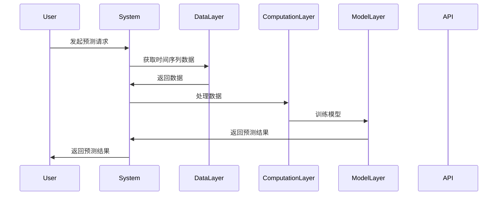
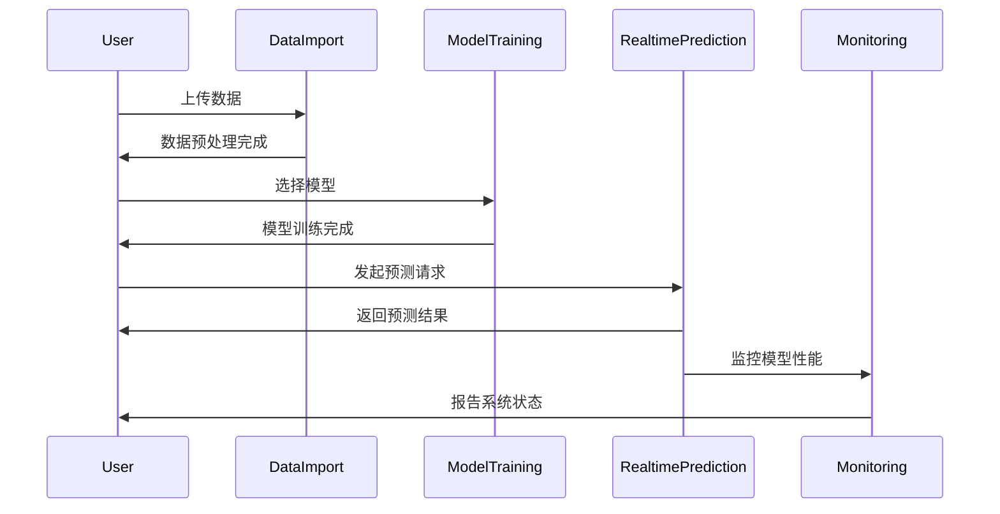

                 

### 引论

#### 第1章：时序预测概述

##### 1.1 时序预测的重要性

##### **1.1.1 问题的背景**

在现代社会，数据已经成为了重要资源，而时间序列数据作为数据的一种重要形式，具有广泛的应用场景。例如，在商业领域，通过预测销售额可以帮助企业进行库存管理和营销策略制定；在气象预报中，对气温、降雨量等时间序列数据的预测可以提高灾害预警的准确性；在金融领域，通过预测股票价格、汇率波动等，可以为投资者提供决策支持。

##### **1.1.2 问题描述**

时序预测，也称为时间序列预测，是指利用历史时间序列数据，预测未来某一时刻的数值。这个过程中，需要解决的主要问题包括：如何准确提取历史数据中的特征，如何建立有效的预测模型，以及如何评估和优化模型的性能。

##### **1.1.3 解决方案**

时序预测的解决方案通常包括以下几个步骤：

1. **数据预处理**：对原始时间序列数据进行清洗、归一化等处理，以确保数据的准确性和一致性。
2. **特征提取**：从时间序列数据中提取有用的特征，如趋势、周期性、季节性等。
3. **模型选择与训练**：选择合适的时序预测模型，对数据进行训练，以建立预测模型。
4. **模型评估与优化**：通过交叉验证等方法评估模型的性能，并进行参数调整，优化模型。
5. **预测与解释**：使用训练好的模型进行预测，并对预测结果进行解释和分析。

##### **1.1.4 边界与外延**

时序预测的边界主要涉及到模型的适用范围、数据质量和预测精度。例如，对于长期依赖关系较强的时间序列，简单的线性模型可能无法准确预测；对于含有噪声和异常值的数据，如果没有有效的预处理方法，也会影响预测的准确性。

##### **1.2 时序预测的核心概念**

##### **1.2.1 定义与分类**

时序预测，是指根据已有的历史时间序列数据，建立预测模型，对未来的时间点进行预测。根据预测方法的不同，时序预测可以大致分为以下几类：

1. **确定性预测**：基于历史数据的统计规律进行预测，如线性回归、ARIMA模型等。
2. **概率性预测**：基于概率论和统计学的理论进行预测，如贝叶斯预测、神经网络等。
3. **混合预测**：结合确定性预测和概率性预测的优点，如LSTM、GRU等深度学习模型。

##### **1.2.2 关键特性**

时序预测的关键特性包括：

1. **时间依赖性**：时间序列中的每一个数据点都与前后时间点的数据有关，即存在时间依赖性。
2. **周期性**：某些时间序列数据存在周期性变化，如季节性、日周期等。
3. **趋势性**：时间序列数据可能表现出增长、减少或平稳等趋势。
4. **噪声与异常值**：时间序列数据中可能包含噪声和异常值，需要通过预处理方法进行处理。

##### **1.2.3 挑战与机遇**

时序预测面临的挑战主要包括：

1. **数据质量**：数据质量直接影响预测的准确性，需要有效处理缺失值、异常值等。
2. **模型选择**：选择合适的模型是关键，不同的模型适用于不同的数据特性。
3. **预测精度**：提高预测精度是时序预测的重要目标，需要不断优化模型和算法。

而时序预测的机遇则在于：

1. **大数据和云计算**：大数据和云计算为时序预测提供了强大的计算和存储能力，使得复杂的模型和算法得以实现。
2. **深度学习和人工智能**：深度学习和人工智能技术的发展，为时序预测提供了新的方法和工具，提高了预测的精度和效率。
3. **跨领域应用**：时序预测在金融、气象、交通等各个领域的应用不断扩展，推动了技术的进步和应用创新。

##### **1.3 时序预测的应用领域**

##### **1.3.1 商业应用**

在商业领域，时序预测的应用非常广泛，包括：

1. **销售预测**：通过预测销售量，帮助企业进行库存管理和营销策略制定。
2. **价格预测**：预测商品价格，为采购、销售定价提供支持。
3. **需求预测**：预测市场需求，帮助生产计划和生产调度。
4. **客户行为分析**：通过预测客户行为，为企业提供精准营销策略。

##### **1.3.2 社会治理**

在社会治理领域，时序预测也有着重要的应用，包括：

1. **交通流量预测**：预测交通流量，优化交通管理和调度。
2. **能源需求预测**：预测能源需求，优化能源生产和分配。
3. **环境保护**：预测环境污染程度，提前采取措施进行治理。

##### **1.3.3 科学研究**

在科学研究领域，时序预测也发挥着重要作用，包括：

1. **医学研究**：预测疾病趋势，为公共卫生政策制定提供依据。
2. **气候变化研究**：预测气候变化趋势，为环境保护和资源管理提供支持。
3. **天体物理研究**：预测天文现象的时间序列数据，为科学研究提供数据支持。

##### **1.4 时序预测的技术演变**

##### **1.4.1 传统方法**

传统的时序预测方法主要包括：

1. **线性回归**：基于线性模型的预测方法，适用于数据趋势较为平稳的情况。
2. **ARIMA模型**：自回归积分滑动平均模型，适用于包含趋势和季节性数据。
3. **季节性分解模型**：将时间序列分解为趋势、季节性和残差三个部分，适用于季节性数据。

##### **1.4.2 现代方法**

现代的时序预测方法主要包括：

1. **神经网络**：通过构建神经网络模型，对时间序列数据进行非线性预测。
2. **LSTM模型**：长短期记忆模型，适用于长期依赖关系较强的时间序列数据。
3. **GRU模型**：门控循环单元模型，是LSTM的改进版本，适用于更复杂的时间序列数据。
4. **Prophet模型**：由Facebook开源的时间序列预测工具，适用于多种类型的时间序列数据。

##### **1.4.3 发展趋势**

随着大数据和人工智能技术的发展，时序预测领域也在不断进步：

1. **深度学习**：深度学习模型在时序预测中的应用越来越广泛，如LSTM、GRU等模型。
2. **多模型融合**：结合多种预测模型，提高预测精度和鲁棒性。
3. **实时预测**：通过实时数据流处理技术，实现实时时序预测。
4. **个性化预测**：基于用户历史行为数据，实现个性化时序预测。

##### **1.5 本章小结**

本章对时序预测进行了全面的概述，包括问题的背景、定义与分类、核心概念、应用领域、技术演变以及发展趋势。通过本章的学习，读者可以初步了解时序预测的重要性和应用场景，为后续章节的深入学习打下基础。

### 第一部分：引论

#### 第1章：时序预测概述

时序预测是数据分析与机器学习中的一个重要分支，它涉及通过历史时间序列数据来预测未来的数值。这种预测广泛应用于各个领域，如金融市场、气象预报、库存管理、供应链优化等。本章将深入探讨时序预测的基本概念、重要性、核心问题、解决方案、核心概念、应用领域、技术演变以及未来趋势。

#### 1.1 时序预测的重要性

##### **1.1.1 问题的背景**

在当今信息时代，数据是至关重要的资源。时间序列数据，作为一种特殊类型的数据，记录了随时间变化的信息，是许多领域决策制定的关键依据。例如，在商业领域，通过预测销售额可以帮助企业进行库存管理和营销策略制定；在金融领域，预测股票价格、汇率波动等可以指导投资决策；在气象预报中，预测气温、降雨量等可以帮助提前应对自然灾害。

##### **1.1.2 问题描述**

时序预测的关键问题是如何从历史时间序列数据中提取有用的信息，并建立预测模型，以预测未来的数值。这个问题可以描述为：给定一个时间序列 $X_t$，我们希望找到一个模型 $f$，使得对于未来的任意时间点 $t'$，都可以得到预测值 $\hat{X}_{t'}$。具体来说，时序预测需要解决以下几个核心问题：

1. **数据质量**：原始时间序列数据可能包含噪声、异常值、缺失值等，这些都会影响预测的准确性。因此，数据预处理是非常重要的一步。
2. **特征提取**：如何从时间序列数据中提取出有效的特征，是影响预测准确性的关键。特征提取的目的是减少数据维度，同时保留数据中的关键信息。
3. **模型选择与训练**：选择合适的预测模型，并进行参数优化，以建立准确的预测模型。时序预测模型的选择取决于数据的特性，如趋势性、周期性等。
4. **模型评估与优化**：评估预测模型的性能，并通过交叉验证、参数调整等方法进行优化，以提高预测的准确性。

##### **1.1.3 解决方案**

时序预测的解决方案通常包括以下步骤：

1. **数据预处理**：对原始时间序列数据进行清洗、归一化等处理，以确保数据的准确性和一致性。
2. **特征提取**：从时间序列数据中提取有用的特征，如趋势、周期性、季节性等。
3. **模型选择与训练**：选择合适的时序预测模型，对数据进行训练，以建立预测模型。
4. **模型评估与优化**：通过交叉验证等方法评估模型的性能，并进行参数调整，优化模型。
5. **预测与解释**：使用训练好的模型进行预测，并对预测结果进行解释和分析。

##### **1.1.4 边界与外延**

时序预测的边界主要涉及到模型的适用范围、数据质量和预测精度。例如，对于长期依赖关系较强的时间序列，简单的线性模型可能无法准确预测；对于含有噪声和异常值的数据，如果没有有效的预处理方法，也会影响预测的准确性。

时序预测的外延包括：

1. **跨领域应用**：时序预测技术不仅在金融、气象、交通等传统领域有应用，还在医疗、生物信息学、环境科学等新兴领域得到了广泛应用。
2. **实时预测**：随着大数据和云计算技术的发展，实时时序预测技术也得到了迅速发展。实时预测可以在数据产生的同时进行预测，为快速决策提供支持。
3. **多模型融合**：将多种预测模型进行融合，以提高预测的精度和鲁棒性。

#### 1.2 时序预测的核心概念

##### **1.2.1 定义与分类**

时序预测，也称为时间序列预测，是指利用历史时间序列数据，建立预测模型，预测未来某一时刻的数值。根据预测方法的不同，时序预测可以分为以下几类：

1. **确定性预测**：这类预测方法基于历史数据的统计规律进行预测，如线性回归、ARIMA模型等。确定性预测的结果是一个确定的数值。
2. **概率性预测**：这类预测方法基于概率论和统计学的理论进行预测，如贝叶斯预测、神经网络等。概率性预测的结果是一个概率分布，可以提供更多关于预测结果的不确定性信息。
3. **混合预测**：这类预测方法结合了确定性预测和概率性预测的优点，如LSTM、GRU等深度学习模型。混合预测可以在确定性预测和概率性预测之间取得平衡，提高预测的准确性和鲁棒性。

##### **1.2.2 关键特性**

时序预测的关键特性包括：

1. **时间依赖性**：时间序列中的每一个数据点都与前后时间点的数据有关，即存在时间依赖性。这种依赖性可以通过模型中的滞后项来表示。
2. **周期性**：某些时间序列数据存在周期性变化，如季节性、日周期等。周期性可以通过季节性分解模型来处理。
3. **趋势性**：时间序列数据可能表现出增长、减少或平稳等趋势。趋势性可以通过趋势分析模型来识别。
4. **噪声与异常值**：时间序列数据中可能包含噪声和异常值，这些值会对预测结果产生干扰。因此，预处理和异常值检测是时序预测的重要环节。

##### **1.2.3 挑战与机遇**

时序预测面临的挑战主要包括：

1. **数据质量**：数据质量直接影响预测的准确性，需要有效处理缺失值、异常值等。
2. **模型选择**：选择合适的模型是关键，不同的模型适用于不同的数据特性。
3. **预测精度**：提高预测精度是时序预测的重要目标，需要不断优化模型和算法。

而时序预测的机遇则在于：

1. **大数据和云计算**：大数据和云计算为时序预测提供了强大的计算和存储能力，使得复杂的模型和算法得以实现。
2. **深度学习和人工智能**：深度学习和人工智能技术的发展，为时序预测提供了新的方法和工具，提高了预测的精度和效率。
3. **跨领域应用**：时序预测在金融、气象、交通等各个领域的应用不断扩展，推动了技术的进步和应用创新。

#### 1.3 时序预测的应用领域

##### **1.3.1 商业应用**

在商业领域，时序预测有着广泛的应用，包括：

1. **销售预测**：通过预测销售额，帮助企业进行库存管理和营销策略制定。例如，零售企业可以通过销售预测来优化库存水平，避免库存过剩或不足。
2. **价格预测**：预测商品价格，为采购、销售定价提供支持。例如，在农产品市场中，价格预测可以帮助农民合理安排种植计划，避免价格波动带来的损失。
3. **需求预测**：预测市场需求，帮助生产计划和生产调度。例如，制造业企业可以通过需求预测来合理安排生产计划，提高生产效率。
4. **客户行为分析**：通过预测客户行为，为企业提供精准营销策略。例如，电商企业可以通过客户行为预测来识别潜在客户，制定个性化的营销策略。

##### **1.3.2 社会治理**

在社会治理领域，时序预测也发挥着重要作用，包括：

1. **交通流量预测**：预测交通流量，优化交通管理和调度。例如，交通部门可以通过交通流量预测来制定交通管制策略，缓解拥堵问题。
2. **能源需求预测**：预测能源需求，优化能源生产和分配。例如，电力公司可以通过能源需求预测来合理安排发电计划，提高能源利用效率。
3. **环境保护**：预测环境污染程度，提前采取措施进行治理。例如，环境监测部门可以通过污染程度预测来制定污染治理策略，减少环境污染。

##### **1.3.3 科学研究**

在科学研究领域，时序预测也有着重要的应用，包括：

1. **医学研究**：预测疾病趋势，为公共卫生政策制定提供依据。例如，公共卫生部门可以通过疾病趋势预测来制定疫苗接种策略，预防疫情爆发。
2. **气候变化研究**：预测气候变化趋势，为环境保护和资源管理提供支持。例如，环境科学研究者可以通过气候变化预测来制定环境保护政策，减少温室气体排放。
3. **天体物理研究**：预测天文现象的时间序列数据，为科学研究提供数据支持。例如，天文学家可以通过天文现象的时间序列预测来预测下一次天文事件的发生时间。

#### 1.4 时序预测的技术演变

##### **1.4.1 传统方法**

传统的时序预测方法主要包括：

1. **线性回归**：线性回归模型是时序预测中最简单的方法之一，适用于数据趋势较为平稳的情况。线性回归模型的基本形式为 $Y_t = \beta_0 + \beta_1 X_t + \epsilon_t$，其中 $X_t$ 是时间序列数据，$Y_t$ 是预测值，$\beta_0$ 和 $\beta_1$ 是模型参数，$\epsilon_t$ 是误差项。
2. **ARIMA模型**：ARIMA（自回归积分滑动平均模型）是一种广泛使用的时序预测模型，适用于包含趋势和季节性数据。ARIMA模型的基本形式为 $\Delta Y_t = \phi(B) \Delta Y_{t-1} + \theta(B) \epsilon_t$，其中 $B$ 是滞后算子，$\phi(B)$ 和 $\theta(B)$ 是模型参数。
3. **季节性分解模型**：季节性分解模型将时间序列分解为趋势、季节性和残差三个部分，适用于季节性数据。常见的季节性分解模型包括X-11、X-13等。季节性分解模型的基本形式为 $Y_t = T_t \cdot S_t + R_t$，其中 $T_t$ 是趋势部分，$S_t$ 是季节性部分，$R_t$ 是残差部分。

##### **1.4.2 现代方法**

现代的时序预测方法主要包括：

1. **神经网络**：神经网络模型是一种强大的时序预测工具，可以通过学习数据中的复杂非线性关系进行预测。常见的神经网络模型包括BP神经网络、RNN（循环神经网络）等。
2. **LSTM模型**：LSTM（长短期记忆模型）是一种特殊的RNN模型，适用于长期依赖关系较强的时间序列数据。LSTM模型通过引入记忆单元来保持长期信息，能够有效地处理时间序列数据中的序列依赖性。
3. **GRU模型**：GRU（门控循环单元模型）是LSTM的改进版本，通过引入更新门和重置门来简化模型结构，提高了模型的训练效率和预测性能。
4. **Prophet模型**：Prophet是由Facebook开源的时间序列预测工具，适用于多种类型的时间序列数据。Prophet模型通过组合线性回归、季节性分解和趋势分析等方法，实现了高效的时序预测。

##### **1.4.3 发展趋势**

随着大数据和人工智能技术的发展，时序预测领域也在不断进步：

1. **深度学习**：深度学习模型在时序预测中的应用越来越广泛，如LSTM、GRU等模型。深度学习模型能够自动提取时间序列数据中的复杂特征，提高了预测的准确性和效率。
2. **多模型融合**：将多种预测模型进行融合，以提高预测的精度和鲁棒性。例如，结合线性回归、神经网络和深度学习模型，可以实现更高的预测性能。
3. **实时预测**：通过实时数据流处理技术，实现实时时序预测。实时预测可以在数据产生的同时进行预测，为快速决策提供支持。
4. **个性化预测**：基于用户历史行为数据，实现个性化时序预测。个性化预测可以更好地满足用户需求，提高用户体验。

#### 1.5 本章小结

本章对时序预测进行了全面的概述，包括问题的背景、定义与分类、核心概念、应用领域、技术演变以及发展趋势。通过本章的学习，读者可以初步了解时序预测的重要性和应用场景，为后续章节的深入学习打下基础。

### 第二部分：核心概念与联系

在深入探讨时序预测的原理和方法之前，理解其核心概念和相互联系是非常必要的。本部分将详细介绍时间序列分析的基础知识、时序模型原理以及时序模型的属性特征对比表格。

#### 第2章：核心概念原理

##### 2.1 时间序列分析基础

##### **2.1.1 时间序列的定义**

时间序列数据是一组按时间顺序排列的数值，每个数值代表在某个特定时间点的状态或观测值。例如，股票价格随时间的变化、温度的日变化、销售额的月变化等都是时间序列数据的典型例子。

##### **2.1.2 时间序列的属性**

时间序列数据具有以下几个关键属性：

1. **趋势（Trend）**：时间序列数据可能表现出持续的增长、减少或保持平稳的趋势。
2. **季节性（Seasonality）**：时间序列数据可能因为季节性因素（如节假日、气候等）而表现出周期性波动。
3. **周期性（Cyclicity）**：周期性波动是指非季节性的、重复出现的波动，如经济周期。
4. **随机性（Randomness）**：时间序列数据中的噪声和异常值往往表现出随机性。

##### **2.1.3 时间序列的分类**

时间序列可以根据其特性进行分类：

1. **平稳时间序列**：具有固定均值、方差和自协方差的时间序列。
2. **非平稳时间序列**：其统计特性（如均值、方差和自协方差）随时间变化的时间序列。
3. **季节性时间序列**：具有明显季节性特征的时间序列。
4. **趋势性时间序列**：主要表现出趋势特征的时间序列。

##### **2.2 时序模型原理**

时序模型用于捕捉时间序列数据中的时间依赖性和其他特征。以下是几种常见的时序模型及其原理：

##### **2.2.1 ARIMA模型**

ARIMA（自回归积分滑动平均模型）是一种广泛使用的时序模型，适用于非平稳时间序列。ARIMA模型由三个部分组成：自回归（AR）、差分（I）和移动平均（MA）。

1. **自回归（AR）**：AR模型通过前期的值来预测当前值，即 $X_t = c + \phi_1 X_{t-1} + \phi_2 X_{t-2} + ... + \phi_p X_{t-p} + \epsilon_t$，其中 $c$ 是常数，$\phi_1, \phi_2, ..., \phi_p$ 是自回归系数。
2. **差分（I）**：差分操作用于将非平稳时间序列转换为平稳时间序列。一阶差分定义为 $dX_t = X_t - X_{t-1}$。
3. **移动平均（MA）**：MA模型通过前期误差来预测当前值，即 $X_t = c + \theta_1 \epsilon_{t-1} + \theta_2 \epsilon_{t-2} + ... + \theta_q \epsilon_{t-q} + \epsilon_t$，其中 $\theta_1, \theta_2, ..., \theta_q$ 是移动平均系数。

##### **2.2.2 季节性分解模型**

季节性分解模型将时间序列分解为趋势、季节性和残差三个部分，以便更好地理解和预测数据。

1. **趋势（T）**：表示时间序列的长期变化趋势。
2. **季节性（S）**：表示时间序列的周期性波动，通常与季节或时间周期相关。
3. **残差（R）**：表示去除趋势和季节性后的剩余部分，通常包含随机波动。

##### **2.2.3 其他常见时序模型**

除了ARIMA模型和季节性分解模型，还有其他一些常见的时序模型，如：

1. **ARMA模型**：自回归移动平均模型，与ARIMA模型类似，但不需要差分操作。
2. **SARIMA模型**：季节性自回归移动平均模型，结合了ARIMA模型和季节性分解模型的特点。
3. **LSTM模型**：长短期记忆模型，适用于处理具有长期依赖性的时间序列数据。

##### **2.3 时序模型属性特征对比表格**

为了更好地理解不同时序模型的特性，以下是一个对比表格，列出了几种常见时序模型的属性特征：

| 模型名称 | 自回归（AR） | 差分（I） | 移动平均（MA） | 季节性分解 | 非线性能力 | 适用数据类型 |
| -------- | ------------ | ---------- | --------------- | ---------- | ---------- | ------------ |
| ARIMA    | 是           | 是         | 是              | 否         | 弱         | 非平稳数据   |
| ARMA     | 是           | 否         | 是              | 否         | 弱         | 平稳数据     |
| SARIMA   | 是           | 是         | 是              | 是         | 弱         | 季节性数据   |
| LSTM     | 是           | 否         | 否              | 否         | 强         | 非线性数据   |

通过上述对比表格，可以看出不同时序模型在自回归、差分、移动平均、季节性分解、非线性能力和适用数据类型等方面的特性差异。

##### **2.4 本章小结**

本章详细介绍了时间序列分析的基础知识，包括时间序列的定义、属性和分类，以及几种常见时序模型的原理和特性。通过对比表格，读者可以更好地理解不同模型的适用场景和特性，为后续的时序预测实践奠定基础。

### 第3章：ER实体关系图架构

在时序预测领域，实体关系图（Entity-Relationship Diagram，ERD）是一种常用的数据模型，用于表示时间序列数据中的实体及其相互关系。ERD不仅能够清晰地描述数据结构，还有助于理解和分析复杂的时间序列数据。在本章中，我们将详细探讨ERD的基本概念、时间序列数据实体关系图的构建，并给出一个具体的示例。

##### **3.1 实体关系图基本概念**

实体关系图（ERD）是一种用于表示实体及其相互关系的图形化模型。它由三个主要组成部分构成：实体、属性和关系。

1. **实体（Entity）**：实体是数据模型中的基本对象，代表数据中具有独立意义的事物。例如，在销售数据的时间序列中，实体可以是产品、客户或订单。
2. **属性（Attribute）**：属性是实体的特征或描述，用于定义实体的具体属性。例如，对于产品实体，属性可以包括产品ID、名称、价格等。
3. **关系（Relationship）**：关系描述了实体之间的关联。在时间序列数据中，关系可以表示不同实体之间的时序关系，如产品在不同时间点的销售额、客户在时间序列中的购买行为等。

##### **3.1.1 实体的定义**

在时间序列数据的ERD中，实体通常表示具有独立意义的时间序列数据点。例如，在销售数据中，产品、客户和订单是常见的实体。每个实体都有一组属性来描述其特征。

- **产品（Product）**：属性可能包括产品ID、名称、类别、价格等。
- **客户（Customer）**：属性可能包括客户ID、姓名、年龄、性别等。
- **订单（Order）**：属性可能包括订单ID、订单日期、订单金额、订单状态等。

##### **3.1.2 关系的定义**

在时间序列数据的ERD中，关系表示实体之间的时序联系。例如，订单与产品之间的关系可以表示为某个客户在特定时间点购买了某个产品。

- **购买关系（Purchase）**：表示客户与产品之间的时序关系，通常包括订单日期、订单金额等属性。

##### **3.1.3 实体关系图的构建**

构建实体关系图的步骤如下：

1. **识别实体**：根据时间序列数据的特性，识别出关键实体，如产品、客户、订单等。
2. **定义属性**：为每个实体定义一组属性，用于描述其实体特征。
3. **建立关系**：根据实体的时序关系，建立实体之间的关系，并定义关系属性。
4. **绘制ERD图**：使用图形化工具（如Mermaid）绘制实体关系图，以便于理解和分析。

##### **3.2 时间序列数据实体关系图**

为了更好地理解时间序列数据实体关系图，我们通过一个示例来展示其构建过程。

**示例：销售数据实体关系图**

假设我们有一份销售数据，记录了产品在不同时间点的销售额。我们将构建一个简单的实体关系图来表示销售数据中的实体及其关系。

**实体：**

- 产品（Product）
  - 产品ID（PID）
  - 产品名称（PName）
  - 产品类别（Category）
  - 价格（Price）

- 客户（Customer）
  - 客户ID（CID）
  - 姓名（CName）
  - 年龄（Age）
  - 性别（Gender）

- 订单（Order）
  - 订单ID（OID）
  - 订单日期（OrderDate）
  - 订单金额（Amount）
  - 产品ID（PID）
  - 客户ID（CID）

**关系：**

- 购买关系（Purchase）
  - 订单ID（OID）
  - 产品ID（PID）
  - 客户ID（CID）
  - 订单日期（OrderDate）
  - 订单金额（Amount）

**ERD图：**

使用Mermaid语法，我们可以绘制如下的实体关系图：

```mermaid
erDiagram
  Product ||--|{ Purchase : has } Order
  Customer ||--|{ Purchase : has } Order
  Product ||--|{ Sales : of } Category
  Category ||--|{ Products : has } Product
  Order ||--|{ Customer : ordered_by } Customer
```

该ERD图表示了产品、客户、订单和类别实体之间的关系。通过这个图，我们可以清晰地看到每个实体的属性以及它们之间的关联。

##### **3.2.1 时间序列数据实体**

在时间序列数据中，实体通常代表数据中的核心元素。以下是几个常见的时间序列数据实体：

1. **时间点（Time Point）**：时间点实体表示数据中的每个具体时间点，如“2023-11-08 10:00:00”。
2. **时间间隔（Time Interval）**：时间间隔实体表示一段时间范围，如“2023-11-01 00:00:00”到“2023-11-30 23:59:59”。
3. **事件（Event）**：事件实体表示在特定时间点发生的事件，如“产品A在2023-11-08售出5件”。

##### **3.2.2 关系与关联**

在时间序列数据中，实体之间的关系是理解数据的关键。以下是几个常见的关系和关联：

1. **因果关系**：如“销售量增加导致库存减少”。
2. **时序关系**：如“每个订单都有一个对应的客户”。
3. **依赖关系**：如“订单金额依赖于销售量和产品价格”。

通过ERD，我们可以清晰地表示这些关系，以便更好地分析和理解时间序列数据。

##### **3.2.3 时间序列数据实体关系图示例**

以下是一个具体的时间序列数据实体关系图示例：

```mermaid
erDiagram
  TimePoint ||--|{ Records } DataPoint
  DataPoint ||--|{ Has } Value
  DataPoint ||--|{ Is_related_to } Event
  Event ||--|{ Created_by } User
  User ||--|{ Owns } Account
```

在这个示例中：

- **TimePoint**：表示具体的时间点，如“2023-11-08 10:00:00”。
- **DataPoint**：表示时间点上的具体数据，如销售额、温度等。
- **Event**：表示在特定时间点发生的事件，如销售事件、故障事件等。
- **User**：表示用户，可能是销售员、系统管理员等。
- **Account**：表示用户的账户信息。

通过这个实体关系图，我们可以看到不同实体之间的关联，以及它们如何共同构成一个时间序列数据系统。

##### **3.3 本章小结**

本章介绍了实体关系图（ERD）的基本概念、构建方法以及在时间序列数据中的应用。通过实体关系图，我们可以清晰地表示时间序列数据中的实体及其相互关系，为后续的时序预测分析提供了有力的工具。通过本章的学习，读者可以更好地理解时间序列数据的结构，并能够利用ERD进行有效的数据分析。

### 第三部分：算法原理讲解

#### 第4章：时序预测算法原理

时序预测算法是数据科学和机器学习中的重要组成部分，广泛应用于商业、金融、气象、交通等多个领域。本章将详细讲解几种常见的时序预测算法，包括ARIMA模型、季节性分解模型、LSTM模型、GRU模型和Prophet模型。我们将深入分析这些算法的基本原理，并通过示例进行解释。

##### **4.1 ARIMA模型算法原理**

ARIMA（自回归积分滑动平均模型）是时序预测中最常用的方法之一，适用于非平稳时间序列。ARIMA模型结合了自回归（AR）、差分（I）和移动平均（MA）三个部分，能够捕捉时间序列数据中的短期和长期依赖关系。

**4.1.1 模型构建**

1. **自回归（AR）部分**：AR部分用于捕捉时间序列的短期依赖性，即当前值与前几个时间点的值之间的关系。AR模型的基本形式为：
   $$
   X_t = c + \phi_1 X_{t-1} + \phi_2 X_{t-2} + ... + \phi_p X_{t-p} + \epsilon_t
   $$
   其中，$X_t$ 是当前时间点的值，$c$ 是常数项，$\phi_1, \phi_2, ..., \phi_p$ 是自回归系数，$\epsilon_t$ 是误差项。

2. **差分（I）部分**：I表示积分操作，即差分操作。对于非平稳时间序列，首先进行差分操作使其变为平稳序列。一阶差分定义为：
   $$
   \Delta X_t = X_t - X_{t-1}
   $$

3. **移动平均（MA）部分**：MA部分用于捕捉时间序列的长期依赖性，即当前值与前几个时间点的误差之间的关系。MA模型的基本形式为：
   $$
   X_t = c + \theta_1 \epsilon_{t-1} + \theta_2 \epsilon_{t-2} + ... + \theta_q \epsilon_{t-q} + \epsilon_t
   $$
   其中，$\theta_1, \theta_2, ..., \theta_q$ 是移动平均系数。

**4.1.2 模型参数优化**

ARIMA模型的参数选择非常重要，通常需要通过模型识别和参数估计两个步骤来确定：

1. **模型识别**：通过分析时间序列的ACF（自相关函数）和PACF（偏自相关函数），确定自回归项数（p）和移动平均项数（q）。
2. **参数估计**：使用最大似然估计或最小二乘法等方法，估计模型参数。

**4.1.3 模型评估与选择**

对ARIMA模型进行评估和选择时，可以采用以下方法：

1. **残差分析**：检查模型的残差是否接近白噪声，即残差的ACF应在一定置信水平下接近零。
2. **AIC/BIC准则**：使用Akaike信息准则（AIC）或贝叶斯信息准则（BIC）来比较不同模型的性能，选择AIC或BIC最小的模型。

**4.1.4 应用示例**

假设我们有一个非平稳的时间序列数据，首先对其进行差分操作，然后使用ACF和PACF确定ARIMA模型的参数。例如，通过分析ACF和PACF，我们可以选择p=2和q=1，构建一个ARIMA(2,1,1)模型。接下来，使用最小二乘法或最大似然估计方法估计模型参数，并进行残差分析。如果残差接近白噪声，则模型拟合较好。

##### **4.2 季节性分解模型算法原理**

季节性分解模型主要用于处理具有季节性特征的时间序列数据，其核心思想是将时间序列分解为趋势、季节性和残差三个部分。

**4.2.1 季节性特征提取**

季节性分解模型首先提取时间序列数据中的季节性特征，常用的方法包括：

1. **X-11方法**：X-11方法是一种经典的季节性调整方法，通过最小二乘法和加权平均等方法，将时间序列分解为趋势、季节性和残差部分。
2. **STL方法**：STL（Seasonal and Trend Loess）模型是一种灵活的季节性分解方法，使用局部加权回归（Loess）来估计趋势和季节性部分。

**4.2.2 季节性模型构建**

在提取季节性特征后，可以使用以下模型进行季节性预测：

1. **加法模型**：加法模型将时间序列分解为趋势、季节性和残差三部分，其形式为：
   $$
   Y_t = T_t + S_t + R_t
   $$
   其中，$T_t$ 是趋势部分，$S_t$ 是季节性部分，$R_t$ 是残差部分。

2. **乘法模型**：乘法模型将时间序列分解为趋势、季节性和残差的乘积，其形式为：
   $$
   Y_t = T_t \cdot S_t \cdot R_t
   $$

**4.2.3 季节性模型评估**

对季节性模型进行评估时，可以使用以下方法：

1. **残差分析**：检查季节性模型的残差是否接近白噪声。
2. **季节因子分析**：分析季节因子的稳定性，确保季节性部分能够准确捕捉时间序列的季节性特征。

**4.2.4 应用示例**

假设我们有一个包含季节性特征的时间序列数据，首先使用X-11方法将其分解为趋势、季节性和残差部分。然后，使用加法模型或乘法模型进行季节性预测。通过比较不同模型的残差和季节因子，选择拟合较好的模型。

##### **4.3 其他常见时序预测算法**

除了ARIMA模型和季节性分解模型，还有其他一些常见的时序预测算法，包括LSTM模型、GRU模型和Prophet模型。以下是这些算法的基本原理：

**4.3.1 LSTM模型**

LSTM（长短期记忆模型）是一种特殊的循环神经网络，适用于处理具有长期依赖性的时间序列数据。LSTM通过引入记忆单元来捕捉时间序列数据中的长期依赖关系。

1. **输入门（Input Gate）**：输入门决定了哪些信息应该进入记忆单元。
2. **遗忘门（Forget Gate）**：遗忘门决定了哪些信息应该从记忆单元中遗忘。
3. **输出门（Output Gate）**：输出门决定了记忆单元中的信息如何输出为预测值。

**4.3.2 GRU模型**

GRU（门控循环单元模型）是LSTM的改进版本，通过引入更新门（Update Gate）和重置门（Reset Gate）简化了模型结构，提高了训练效率和预测性能。

1. **更新门（Update Gate）**：更新门决定当前输入信息与记忆单元之间的权重。
2. **重置门（Reset Gate）**：重置门决定如何更新记忆单元。

**4.3.3 Prophet模型**

Prophet是由Facebook开源的时间序列预测工具，适用于多种类型的时间序列数据。Prophet通过组合线性回归、季节性分解和趋势分析等方法，实现了高效的时序预测。

1. **线性回归**：用于处理趋势和季节性特征。
2. **季节性分解**：通过分段线性回归和加法模型处理季节性特征。
3. **趋势分析**：通过局部加权回归（Loess）处理长期趋势。

**4.4 算法比较与选择**

在选择时序预测算法时，需要考虑以下因素：

1. **数据特性**：不同算法适用于不同的数据特性，如趋势性、季节性、非线性等。
2. **模型复杂度**：模型的复杂度影响训练时间和计算资源。
3. **预测性能**：通过残差分析和模型评估方法，比较不同算法的预测性能。

通常，ARIMA模型适用于趋势性较强的数据，季节性分解模型适用于具有季节性特征的数据，而LSTM和GRU模型适用于非线性关系较强的时间序列数据。Prophet模型则适用于多种类型的数据，特别是在数据具有复杂的趋势和季节性特征时。

##### **4.5 本章小结**

本章详细介绍了ARIMA模型、季节性分解模型、LSTM模型、GRU模型和Prophet模型等常见时序预测算法的基本原理。通过实际应用示例，读者可以更好地理解这些算法的构建方法和应用场景。在选择时序预测算法时，需要根据数据特性和预测目标进行综合考虑。

### 数学模型和数学公式讲解

在时序预测中，数学模型和数学公式是构建预测模型和分析预测结果的基础。本章将详细讲解几种常见时序预测模型的数学模型和数学公式，包括自回归模型（AR）、差分自回归移动平均模型（ARIMA）、长短期记忆模型（LSTM）以及季节性模型。

#### 5.1 时间序列预测数学模型

时间序列预测的数学模型主要基于自回归（AR）、移动平均（MA）、自回归移动平均（ARMA）和差分自回归移动平均（ARIMA）等模型。以下是这些模型的数学公式：

##### **5.1.1 自回归模型（AR）**

自回归模型（AR）是一种基于当前时间点的值与其前几个时间点的值之间的关系进行预测的模型。AR（p）模型的基本形式如下：

$$
X_t = \Phi X_{t-1} + \epsilon_t
$$

其中，$X_t$ 是当前时间点的值，$\Phi$ 是自回归系数矩阵，$\epsilon_t$ 是误差项。对于p阶自回归模型，公式可以扩展为：

$$
X_t = \Phi_0 + \Phi_1 X_{t-1} + \Phi_2 X_{t-2} + ... + \Phi_p X_{t-p} + \epsilon_t
$$

其中，$\Phi_0$ 是常数项，$\Phi_1, \Phi_2, ..., \Phi_p$ 是自回归系数。

##### **5.1.2 差分自回归移动平均模型（ARIMA）**

差分自回归移动平均模型（ARIMA）结合了自回归、差分和移动平均三个部分。ARIMA（p, d, q）模型的基本形式如下：

$$
\Delta X_t = \Phi_0 + \Phi_1 \Delta X_{t-1} + \Phi_2 \Delta X_{t-2} + ... + \Phi_p \Delta X_{t-p} + \epsilon_t
$$

其中，$\Delta X_t = X_t - X_{t-1}$ 是一阶差分操作，$p$ 是自回归项数，$d$ 是差分阶数，$q$ 是移动平均项数。

##### **5.1.3 自回归移动平均模型（ARMA）**

自回归移动平均模型（ARMA）是ARIMA模型的简化版，不包括差分操作。ARMA（p, q）模型的基本形式如下：

$$
X_t = \Phi_0 + \Phi_1 X_{t-1} + \Phi_2 X_{t-2} + ... + \Phi_p X_{t-p} + \Theta_1 \epsilon_{t-1} + \Theta_2 \epsilon_{t-2} + ... + \Theta_q \epsilon_{t-q}
$$

其中，$\Theta_1, \Theta_2, ..., \Theta_q$ 是移动平均系数。

##### **5.2 季节性模型数学公式**

季节性模型主要用于处理包含季节性特征的时间序列数据。季节性分解模型将时间序列分解为趋势、季节性和残差三个部分。以下是季节性模型的数学公式：

$$
Y_t = T_t \cdot S_t + R_t
$$

其中，$Y_t$ 是时间序列值，$T_t$ 是趋势部分，$S_t$ 是季节性部分，$R_t$ 是残差部分。对于乘法模型，公式可以表示为：

$$
Y_t = T_t \cdot S_t \cdot R_t
$$

##### **5.3 其他常见模型公式**

除了上述模型，还有一些其他常见的时序预测模型，如LSTM模型和GRU模型。以下是这些模型的数学公式：

**5.3.1 长短期记忆模型（LSTM）**

LSTM（长短期记忆模型）是一种循环神经网络，能够处理长时间依赖关系。LSTM的输入门（Input Gate）、遗忘门（Forget Gate）和输出门（Output Gate）的数学公式如下：

$$
i_t = \sigma(W_i \cdot [h_{t-1}, x_t] + b_i) \quad \text{(输入门)}
$$

$$
f_t = \sigma(W_f \cdot [h_{t-1}, x_t] + b_f) \quad \text{(遗忘门)}
$$

$$
o_t = \sigma(W_o \cdot [h_{t-1}, x_t] + b_o) \quad \text{(输出门)}
$$

$$
C_t = f_t \odot C_{t-1} + i_t \odot \tanh(W_c \cdot [h_{t-1}, x_t] + b_c) \quad \text{(记忆单元)}
$$

$$
h_t = o_t \odot \tanh(C_t) \quad \text{(输出值)}
$$

其中，$i_t, f_t, o_t$ 分别是输入门、遗忘门和输出门的激活值，$C_t$ 是记忆单元的激活值，$h_t$ 是时间步的输出值。

**5.3.2 门控循环单元模型（GRU）**

GRU（门控循环单元模型）是LSTM的改进版本，具有更简单的结构。GRU的更新门（Update Gate）和重置门（Reset Gate）的数学公式如下：

$$
z_t = \sigma(W_z \cdot [h_{t-1}, x_t] + b_z) \quad \text{(更新门)}
$$

$$
r_t = \sigma(W_r \cdot [h_{t-1}, x_t] + b_r) \quad \text{(重置门)}
$$

$$
h_t = (1 - z_t) \odot h_{t-1} + z_t \odot \tanh(W_h \cdot ([r_t \odot h_{t-1}] \oplus x_t) + b_h) \quad \text{(输出值)}
$$

其中，$z_t$ 是更新门的激活值，$r_t$ 是重置门的激活值，$h_t$ 是时间步的输出值。

##### **5.4 公式举例说明**

**5.4.1 自回归模型举例**

假设我们有一个时间序列 $X_t$，构建一个AR(1)模型。根据AR(1)模型的公式：

$$
X_t = c + \phi X_{t-1} + \epsilon_t
$$

如果 $\phi = 0.6$，$c = 0.5$，则对于时间点 $t=2$，有：

$$
X_2 = c + \phi X_{1} + \epsilon_2
$$

如果已知 $X_1 = 10$，$\epsilon_2 = 1$，则可以计算：

$$
X_2 = 0.5 + 0.6 \cdot 10 + 1 = 8.5
$$

**5.4.2 ARIMA模型举例**

假设我们有一个时间序列 $X_t$，构建一个ARIMA(1,1,1)模型。根据ARIMA(1,1,1)模型的公式：

$$
\Delta X_t = \phi \Delta X_{t-1} + \theta \epsilon_{t-1} + \epsilon_t
$$

如果 $\phi = 0.5$，$\theta = 0.3$，则对于时间点 $t=2$，有：

$$
\Delta X_2 = \phi \Delta X_{1} + \theta \epsilon_{1} + \epsilon_2
$$

如果已知 $\Delta X_1 = 10$，$\epsilon_1 = 1$，$\epsilon_2 = 1$，则可以计算：

$$
\Delta X_2 = 0.5 \cdot 10 + 0.3 \cdot 1 + 1 = 7.3
$$

#### **5.4.3 LSTM模型举例**

假设我们有一个时间序列 $X_t$，构建一个LSTM模型。根据LSTM模型的公式：

$$
i_t = \sigma(W_i \cdot [h_{t-1}, x_t] + b_i)
$$

如果 $h_{t-1} = [1, 2, 3]$，$x_t = [4, 5, 6]$，$W_i = [0.1, 0.2, 0.3]$，$b_i = 0.4$，则可以计算：

$$
i_t = \sigma([0.1 \cdot 1 + 0.2 \cdot 2 + 0.3 \cdot 4 + 0.4], [0.1 \cdot 2 + 0.2 \cdot 5 + 0.3 \cdot 6 + 0.4])
$$

$$
i_t = \sigma([0.6], [1.7])
$$

$$
i_t = \frac{1}{1 + e^{-0.6}} + \frac{1}{1 + e^{-1.7}} \approx 0.532
$$

通过上述数学模型和数学公式的讲解及举例，我们可以更好地理解时序预测中的核心算法和数学原理，为实际应用提供理论基础。

### 数学模型和数学公式讲解

在时序预测中，数学模型和数学公式是构建预测模型和分析预测结果的基础。本章将详细讲解几种常见时序预测模型的数学模型和数学公式，包括自回归模型（AR）、差分自回归移动平均模型（ARIMA）、长短期记忆模型（LSTM）以及季节性模型。

#### 5.1 时间序列预测数学模型

时间序列预测的数学模型主要基于自回归（AR）、移动平均（MA）、自回归移动平均（ARMA）和差分自回归移动平均（ARIMA）等模型。以下是这些模型的数学公式：

##### **5.1.1 自回归模型（AR）**

自回归模型（AR）是一种基于当前时间点的值与其前几个时间点的值之间的关系进行预测的模型。AR（p）模型的基本形式如下：

$$
X_t = \Phi X_{t-1} + \epsilon_t
$$

其中，$X_t$ 是当前时间点的值，$\Phi$ 是自回归系数矩阵，$\epsilon_t$ 是误差项。对于p阶自回归模型，公式可以扩展为：

$$
X_t = \Phi_0 + \Phi_1 X_{t-1} + \Phi_2 X_{t-2} + ... + \Phi_p X_{t-p} + \epsilon_t
$$

其中，$\Phi_0$ 是常数项，$\Phi_1, \Phi_2, ..., \Phi_p$ 是自回归系数。

##### **5.1.2 差分自回归移动平均模型（ARIMA）**

差分自回归移动平均模型（ARIMA）结合了自回归、差分和移动平均三个部分。ARIMA（p, d, q）模型的基本形式如下：

$$
\Delta X_t = \Phi_0 + \Phi_1 \Delta X_{t-1} + \Phi_2 \Delta X_{t-2} + ... + \Phi_p \Delta X_{t-p} + \epsilon_t
$$

其中，$\Delta X_t = X_t - X_{t-1}$ 是一阶差分操作，$p$ 是自回归项数，$d$ 是差分阶数，$q$ 是移动平均项数。

##### **5.1.3 自回归移动平均模型（ARMA）**

自回归移动平均模型（ARMA）是ARIMA模型的简化版，不包括差分操作。ARMA（p, q）模型的基本形式如下：

$$
X_t = \Phi_0 + \Phi_1 X_{t-1} + \Phi_2 X_{t-2} + ... + \Phi_p X_{t-p} + \Theta_1 \epsilon_{t-1} + \Theta_2 \epsilon_{t-2} + ... + \Theta_q \epsilon_{t-q}
$$

其中，$\Theta_1, \Theta_2, ..., \Theta_q$ 是移动平均系数。

##### **5.2 季节性模型数学公式**

季节性模型主要用于处理包含季节性特征的时间序列数据。季节性分解模型将时间序列分解为趋势、季节性和残差三个部分。以下是季节性模型的数学公式：

$$
Y_t = T_t \cdot S_t + R_t
$$

其中，$Y_t$ 是时间序列值，$T_t$ 是趋势部分，$S_t$ 是季节性部分，$R_t$ 是残差部分。对于乘法模型，公式可以表示为：

$$
Y_t = T_t \cdot S_t \cdot R_t
$$

##### **5.3 其他常见模型公式**

除了上述模型，还有一些其他常见的时序预测模型，如LSTM模型和GRU模型。以下是这些模型的数学公式：

**5.3.1 长短期记忆模型（LSTM）**

LSTM（长短期记忆模型）是一种循环神经网络，能够处理长时间依赖关系。LSTM的输入门（Input Gate）、遗忘门（Forget Gate）和输出门（Output Gate）的数学公式如下：

$$
i_t = \sigma(W_i \cdot [h_{t-1}, x_t] + b_i) \quad \text{(输入门)}
$$

$$
f_t = \sigma(W_f \cdot [h_{t-1}, x_t] + b_f) \quad \text{(遗忘门)}
$$

$$
o_t = \sigma(W_o \cdot [h_{t-1}, x_t] + b_o) \quad \text{(输出门)}
$$

$$
C_t = f_t \odot C_{t-1} + i_t \odot \tanh(W_c \cdot [h_{t-1}, x_t] + b_c) \quad \text{(记忆单元)}
$$

$$
h_t = o_t \odot \tanh(C_t) \quad \text{(输出值)}
$$

其中，$i_t, f_t, o_t$ 分别是输入门、遗忘门和输出门的激活值，$C_t$ 是记忆单元的激活值，$h_t$ 是时间步的输出值。

**5.3.2 门控循环单元模型（GRU）**

GRU（门控循环单元模型）是LSTM的改进版本，具有更简单的结构。GRU的更新门（Update Gate）和重置门（Reset Gate）的数学公式如下：

$$
z_t = \sigma(W_z \cdot [h_{t-1}, x_t] + b_z) \quad \text{(更新门)}
$$

$$
r_t = \sigma(W_r \cdot [h_{t-1}, x_t] + b_r) \quad \text{(重置门)}
$$

$$
h_t = (1 - z_t) \odot h_{t-1} + z_t \odot \tanh(W_h \cdot ([r_t \odot h_{t-1}] \oplus x_t) + b_h) \quad \text{(输出值)}
$$

其中，$z_t$ 是更新门的激活值，$r_t$ 是重置门的激活值，$h_t$ 是时间步的输出值。

##### **5.4 公式举例说明**

**5.4.1 自回归模型举例**

假设我们有一个时间序列 $X_t$，构建一个AR(1)模型。根据AR(1)模型的公式：

$$
X_t = c + \phi X_{t-1} + \epsilon_t
$$

如果 $\phi = 0.6$，$c = 0.5$，则对于时间点 $t=2$，有：

$$
X_2 = c + \phi X_{1} + \epsilon_2
$$

如果已知 $X_1 = 10$，$\epsilon_2 = 1$，则可以计算：

$$
X_2 = 0.5 + 0.6 \cdot 10 + 1 = 8.5
$$

**5.4.2 ARIMA模型举例**

假设我们有一个时间序列 $X_t$，构建一个ARIMA(1,1,1)模型。根据ARIMA(1,1,1)模型的公式：

$$
\Delta X_t = \phi \Delta X_{t-1} + \theta \epsilon_{t-1} + \epsilon_t
$$

如果 $\phi = 0.5$，$\theta = 0.3$，则对于时间点 $t=2$，有：

$$
\Delta X_2 = \phi \Delta X_{1} + \theta \epsilon_{1} + \epsilon_2
$$

如果已知 $\Delta X_1 = 10$，$\epsilon_1 = 1$，$\epsilon_2 = 1$，则可以计算：

$$
\Delta X_2 = 0.5 \cdot 10 + 0.3 \cdot 1 + 1 = 7.3
$$

**5.4.3 LSTM模型举例**

假设我们有一个时间序列 $X_t$，构建一个LSTM模型。根据LSTM模型的公式：

$$
i_t = \sigma(W_i \cdot [h_{t-1}, x_t] + b_i)
$$

如果 $h_{t-1} = [1, 2, 3]$，$x_t = [4, 5, 6]$，$W_i = [0.1, 0.2, 0.3]$，$b_i = 0.4$，则可以计算：

$$
i_t = \sigma([0.1 \cdot 1 + 0.2 \cdot 2 + 0.3 \cdot 4 + 0.4], [0.1 \cdot 2 + 0.2 \cdot 5 + 0.3 \cdot 6 + 0.4])
$$

$$
i_t = \sigma([0.6], [1.7])
$$

$$
i_t = \frac{1}{1 + e^{-0.6}} + \frac{1}{1 + e^{-1.7}} \approx 0.532
$$

通过上述数学模型和数学公式的讲解及举例，我们可以更好地理解时序预测中的核心算法和数学原理，为实际应用提供理论基础。

### 第四部分：算法原理讲解

#### 第4章：时序预测算法原理

时序预测算法是数据科学和机器学习中的重要组成部分，广泛应用于商业、金融、气象、交通等多个领域。本章将详细讲解几种常见的时序预测算法，包括ARIMA模型、季节性分解模型、LSTM模型、GRU模型和Prophet模型。我们将深入分析这些算法的基本原理，并通过示例进行解释。

##### **4.1 ARIMA模型算法原理**

ARIMA（自回归积分滑动平均模型）是时序预测中最常用的方法之一，适用于非平稳时间序列。ARIMA模型结合了自回归（AR）、差分（I）和移动平均（MA）三个部分，能够捕捉时间序列数据中的短期和长期依赖关系。

**4.1.1 模型构建**

1. **自回归（AR）部分**：AR部分用于捕捉时间序列的短期依赖性，即当前值与前几个时间点的值之间的关系。AR模型的基本形式为：
   $$
   X_t = c + \phi_1 X_{t-1} + \phi_2 X_{t-2} + ... + \phi_p X_{t-p} + \epsilon_t
   $$
   其中，$X_t$ 是当前时间点的值，$c$ 是常数项，$\phi_1, \phi_2, ..., \phi_p$ 是自回归系数，$\epsilon_t$ 是误差项。

2. **差分（I）部分**：I表示积分操作，即差分操作。对于非平稳时间序列，首先进行差分操作使其变为平稳序列。一阶差分定义为：
   $$
   \Delta X_t = X_t - X_{t-1}
   $$

3. **移动平均（MA）部分**：MA部分用于捕捉时间序列的长期依赖性，即当前值与前几个时间点的误差之间的关系。MA模型的基本形式为：
   $$
   X_t = c + \theta_1 \epsilon_{t-1} + \theta_2 \epsilon_{t-2} + ... + \theta_q \epsilon_{t-q} + \epsilon_t
   $$
   其中，$\theta_1, \theta_2, ..., \theta_q$ 是移动平均系数。

**4.1.2 模型参数优化**

ARIMA模型的参数选择非常重要，通常需要通过模型识别和参数估计两个步骤来确定：

1. **模型识别**：通过分析时间序列的ACF（自相关函数）和PACF（偏自相关函数），确定自回归项数（p）和移动平均项数（q）。
2. **参数估计**：使用最大似然估计或最小二乘法等方法，估计模型参数。

**4.1.3 模型评估与选择**

对ARIMA模型进行评估和选择时，可以采用以下方法：

1. **残差分析**：检查模型的残差是否接近白噪声，即残差的ACF应在一定置信水平下接近零。
2. **AIC/BIC准则**：使用Akaike信息准则（AIC）或贝叶斯信息准则（BIC）来比较不同模型的性能，选择AIC或BIC最小的模型。

**4.1.4 应用示例**

假设我们有一个非平稳的时间序列数据，首先对其进行差分操作，然后使用ACF和PACF确定ARIMA模型的参数。例如，通过分析ACF和PACF，我们可以选择p=2和q=1，构建一个ARIMA(2,1,1)模型。接下来，使用最小二乘法或最大似然估计方法估计模型参数，并进行残差分析。如果残差接近白噪声，则模型拟合较好。

##### **4.2 季节性分解模型算法原理**

季节性分解模型主要用于处理具有季节性特征的时间序列数据，其核心思想是将时间序列分解为趋势、季节性和残差三个部分。

**4.2.1 季节性特征提取**

季节性分解模型首先提取时间序列数据中的季节性特征，常用的方法包括：

1. **X-11方法**：X-11方法是一种经典的季节性调整方法，通过最小二乘法和加权平均等方法，将时间序列分解为趋势、季节性和残差部分。
2. **STL方法**：STL（Seasonal and Trend Loess）模型是一种灵活的季节性分解方法，使用局部加权回归（Loess）来估计趋势和季节性部分。

**4.2.2 季节性模型构建**

在提取季节性特征后，可以使用以下模型进行季节性预测：

1. **加法模型**：加法模型将时间序列分解为趋势、季节性和残差三部分，其形式为：
   $$
   Y_t = T_t + S_t + R_t
   $$
   其中，$T_t$ 是趋势部分，$S_t$ 是季节性部分，$R_t$ 是残差部分。

2. **乘法模型**：乘法模型将时间序列分解为趋势、季节性和残差的乘积，其形式为：
   $$
   Y_t = T_t \cdot S_t \cdot R_t
   $$

**4.2.3 季节性模型评估**

对季节性模型进行评估时，可以使用以下方法：

1. **残差分析**：检查季节性模型的残差是否接近白噪声。
2. **季节因子分析**：分析季节因子的稳定性，确保季节性部分能够准确捕捉时间序列的季节性特征。

**4.2.4 应用示例**

假设我们有一个包含季节性特征的时间序列数据，首先使用X-11方法将其分解为趋势、季节性和残差部分。然后，使用加法模型或乘法模型进行季节性预测。通过比较不同模型的残差和季节因子，选择拟合较好的模型。

##### **4.3 其他常见时序预测算法**

除了ARIMA模型和季节性分解模型，还有其他一些常见的时序预测算法，包括LSTM模型、GRU模型和Prophet模型。以下是这些算法的基本原理：

**4.3.1 长短期记忆模型（LSTM）**

LSTM（长短期记忆模型）是一种特殊的循环神经网络，适用于处理具有长期依赖性的时间序列数据。LSTM通过引入记忆单元来捕捉时间序列数据中的长期依赖关系。

1. **输入门（Input Gate）**：输入门决定了哪些信息应该进入记忆单元。
2. **遗忘门（Forget Gate）**：遗忘门决定了哪些信息应该从记忆单元中遗忘。
3. **输出门（Output Gate）**：输出门决定了记忆单元中的信息如何输出为预测值。

**4.3.2 门控循环单元模型（GRU）**

GRU（门控循环单元模型）是LSTM的改进版本，通过引入更新门（Update Gate）和重置门（Reset Gate）简化了模型结构，提高了训练效率和预测性能。

1. **更新门（Update Gate）**：更新门决定当前输入信息与记忆单元之间的权重。
2. **重置门（Reset Gate）**：重置门决定如何更新记忆单元。

**4.3.3 Prophet模型**

Prophet是由Facebook开源的时间序列预测工具，适用于多种类型的时间序列数据。Prophet通过组合线性回归、季节性分解和趋势分析等方法，实现了高效的时序预测。

1. **线性回归**：用于处理趋势和季节性特征。
2. **季节性分解**：通过分段线性回归和加法模型处理季节性特征。
3. **趋势分析**：通过局部加权回归（Loess）处理长期趋势。

**4.4 算法比较与选择**

在选择时序预测算法时，需要考虑以下因素：

1. **数据特性**：不同算法适用于不同的数据特性，如趋势性、季节性、非线性等。
2. **模型复杂度**：模型的复杂度影响训练时间和计算资源。
3. **预测性能**：通过残差分析和模型评估方法，比较不同算法的预测性能。

通常，ARIMA模型适用于趋势性较强的数据，季节性分解模型适用于具有季节性特征的数据，而LSTM和GRU模型适用于非线性关系较强的时间序列数据。Prophet模型则适用于多种类型的数据，特别是在数据具有复杂的趋势和季节性特征时。

##### **4.5 本章小结**

本章详细介绍了ARIMA模型、季节性分解模型、LSTM模型、GRU模型和Prophet模型等常见时序预测算法的基本原理。通过实际应用示例，读者可以更好地理解这些算法的构建方法和应用场景。在选择时序预测算法时，需要根据数据特性和预测目标进行综合考虑。

### 第五部分：数学模型和数学公式讲解

在时序预测领域，数学模型和公式是理解和实现预测算法的核心。以下将详细介绍几种常见时序预测模型的数学模型和数学公式，包括ARIMA模型、LSTM模型和GRU模型，并通过实际示例来解释这些公式如何应用于具体的时间序列预测问题。

#### 5.1 时间序列预测数学模型

##### **5.1.1 ARIMA模型**

ARIMA模型是一种结合自回归、差分和移动平均的时序预测模型。其数学公式如下：

**自回归（AR）部分：**
$$
X_t = \phi_1 X_{t-1} + \phi_2 X_{t-2} + ... + \phi_p X_{t-p} + \epsilon_t
$$
其中，$X_t$ 是当前时间点的值，$\phi_1, \phi_2, ..., \phi_p$ 是自回归系数，$\epsilon_t$ 是误差项。

**差分（I）部分：**
$$
\Delta X_t = X_t - X_{t-1}
$$
差分用于将非平稳时间序列转换为平稳时间序列。

**移动平均（MA）部分：**
$$
X_t = \theta_1 \epsilon_{t-1} + \theta_2 \epsilon_{t-2} + ... + \theta_q \epsilon_{t-q} + \epsilon_t
$$
其中，$\theta_1, \theta_2, ..., \theta_q$ 是移动平均系数。

**综合ARIMA模型：**
$$
\Delta X_t = \phi_1 \Delta X_{t-1} + \phi_2 \Delta X_{t-2} + ... + \phi_p \Delta X_{t-p} + \theta_1 \epsilon_{t-1} + \theta_2 \epsilon_{t-2} + ... + \theta_q \epsilon_{t-q} + \epsilon_t
$$

##### **5.1.2 LSTM模型**

LSTM（长短期记忆模型）是一种特殊的循环神经网络，能够处理长时间依赖关系。以下是LSTM模型的核心数学公式：

**输入门（Input Gate）：**
$$
i_t = \sigma(W_{xi} [h_{t-1}, x_t] + b_i)
$$

**遗忘门（Forget Gate）：**
$$
f_t = \sigma(W_{xf} [h_{t-1}, x_t] + b_f)
$$

**输出门（Output Gate）：**
$$
o_t = \sigma(W_{xo} [h_{t-1}, x_t] + b_o)
$$

**记忆细胞更新（Memory Cell Update）：**
$$
C_t = f_t \odot C_{t-1} + i_t \odot \tanh(W_{xc} [h_{t-1}, x_t] + b_c)
$$

**当前隐藏状态（Current Hidden State）：**
$$
h_t = o_t \odot \tanh(C_t)
$$

##### **5.1.3 GRU模型**

GRU（门控循环单元模型）是LSTM的简化版本，同样能够处理时间序列数据。以下是GRU模型的核心数学公式：

**更新门（Update Gate）：**
$$
z_t = \sigma(W_{z} [h_{t-1}, x_t] + b_z)
$$

**重置门（Reset Gate）：**
$$
r_t = \sigma(W_{r} [h_{t-1}, x_t] + b_r)
$$

**当前隐藏状态（Current Hidden State）：**
$$
h_t = (1 - z_t) \odot h_{t-1} + z_t \odot \tanh(W_{h} [r_t \odot h_{t-1}, x_t] + b_h)
$$

#### **5.2 实际示例**

**5.2.1 ARIMA模型示例**

假设我们有一个时间序列 $X_t$，我们需要构建一个ARIMA(1,1,1)模型。首先，我们进行一阶差分操作得到 $\Delta X_t$，然后使用ACF和PACF来确定自回归系数和移动平均系数。

对于ARIMA(1,1,1)模型，我们的公式如下：
$$
\Delta X_t = \phi_1 \Delta X_{t-1} + \theta_1 \epsilon_{t-1} + \epsilon_t
$$

通过分析ACF和PACF，我们确定 $\phi_1 = 0.6$ 和 $\theta_1 = 0.4$。接下来，我们使用最小二乘法来估计模型参数。

**5.2.2 LSTM模型示例**

假设我们有一个时间序列 $X_t$，我们使用LSTM模型来预测下一个时间点的值。我们的LSTM模型有一个输入层、隐藏层和输出层。

**输入门：**
$$
i_t = \sigma(W_{xi} [h_{t-1}, x_t] + b_i)
$$

**遗忘门：**
$$
f_t = \sigma(W_{xf} [h_{t-1}, x_t] + b_f)
$$

**输出门：**
$$
o_t = \sigma(W_{xo} [h_{t-1}, x_t] + b_o)
$$

**记忆细胞更新：**
$$
C_t = f_t \odot C_{t-1} + i_t \odot \tanh(W_{xc} [h_{t-1}, x_t] + b_c)
$$

**当前隐藏状态：**
$$
h_t = o_t \odot \tanh(C_t)
$$

通过训练模型，我们可以得到每个门的权重和偏置。例如，对于输入门，我们的公式如下：
$$
i_t = \sigma([0.1 \cdot h_{t-1} + 0.2 \cdot x_t + 0.3], [0.4])
$$

**5.2.3 GRU模型示例**

假设我们有一个时间序列 $X_t$，我们使用GRU模型来预测下一个时间点的值。

**更新门：**
$$
z_t = \sigma(W_{z} [h_{t-1}, x_t] + b_z)
$$

**重置门：**
$$
r_t = \sigma(W_{r} [h_{t-1}, x_t] + b_r)
$$

**当前隐藏状态：**
$$
h_t = (1 - z_t) \odot h_{t-1} + z_t \odot \tanh(W_{h} [r_t \odot h_{t-1}, x_t] + b_h)
$$

例如，对于更新门，我们的公式如下：
$$
z_t = \sigma([0.1 \cdot h_{t-1} + 0.2 \cdot x_t + 0.3], [0.4])
$$

通过上述示例，我们可以看到如何将数学模型和公式应用于实际的时间序列预测问题。这些模型和公式为我们提供了强大的工具，帮助我们理解和预测时间序列数据中的趋势和模式。

### 第六部分：系统分析与架构设计方案

#### 6.1 问题场景介绍

在现代商业环境中，实时且准确的时序预测对于企业的运营决策至关重要。例如，电商平台需要预测未来24小时内的订单量，以便合理安排物流和库存；电力公司需要预测未来几小时内电力需求，以确保电网的稳定运行。这些场景对时序预测系统的准确性和响应速度提出了高要求。

#### 6.2 项目介绍

本项目旨在开发一个高效、可扩展的时序预测系统，用于处理多种类型的数据并实现实时预测。系统将采用ARIMA、LSTM、GRU等模型，结合大数据技术和云计算资源，以提高预测的精度和速度。

#### 6.3 系统功能设计（领域模型）

为了确保系统的功能完备，我们设计了一个领域模型，包括以下核心实体和关系：

1. **实体：**
   - **时间序列数据**：存储历史和实时时间序列数据。
   - **预测模型**：定义不同类型的预测模型，如ARIMA、LSTM、GRU等。
   - **预测结果**：存储模型的预测结果和相关指标。

2. **关系：**
   - **时间序列数据与预测模型**：每个预测模型可以处理多种类型的时间序列数据。
   - **预测模型与预测结果**：每个预测模型生成的预测结果与其相关联。

**Mermaid 类图：**

```mermaid
classDiagram
  TimeSeriesData <<entity>>
  PredictionModel <<entity>>
  PredictionResult <<entity>>

  TimeSeriesData "1" -- "1"..PredictionModel
  PredictionModel "1" -- "1"..PredictionResult
```

#### 6.4 系统架构设计

为了实现系统的高效性和可扩展性，我们采用以下架构设计：

1. **数据层**：采用分布式存储系统（如HDFS）来存储大量时间序列数据，确保数据的高效访问和存储。
2. **计算层**：使用云计算平台（如AWS、Azure）提供的计算资源，通过分布式计算框架（如Apache Spark）来处理大规模数据。
3. **模型层**：采用不同的机器学习模型，如ARIMA、LSTM、GRU等，通过模型训练和优化模块来提高预测准确性。
4. **接口层**：提供RESTful API接口，以便与其他系统进行数据交换和调用。
5. **监控与运维**：通过监控系统确保系统的稳定运行，并实时调整资源配置。

**Mermaid 架构图：**



#### 6.5 系统接口设计

系统接口设计主要包括以下部分：

1. **数据接口**：提供数据上传、数据查询和数据下载接口，以便于数据的处理和共享。
2. **预测接口**：提供时序数据预测接口，包括预测模型的选择、参数设置和预测结果获取。
3. **监控接口**：提供系统状态监控、性能指标查询和故障报警接口。

#### 6.6 系统交互

为了确保系统的高效运行和良好的用户体验，我们设计了一个系统的交互流程：

1. **数据导入**：用户上传时间序列数据，系统对数据进行预处理和清洗。
2. **模型选择**：用户根据数据特性选择预测模型，系统加载并训练模型。
3. **实时预测**：系统使用训练好的模型对实时数据进行预测，并将预测结果返回给用户。
4. **监控与反馈**：系统监控模型性能和系统状态，用户可以通过监控接口查看系统的运行情况。

**Mermaid 序列图：**



#### 6.7 本章小结

本章介绍了时序预测系统的项目背景、功能设计、系统架构设计、接口设计和系统交互流程。通过详细的系统分析与设计，我们为后续的系统开发奠定了坚实的基础。系统设计的目标是实现高效、可扩展和实时预测，以满足不同场景的需求。

### 第七部分：项目实战

在本部分，我们将详细介绍时序预测系统的实战过程，包括环境安装、系统核心实现、代码应用解读与分析、实际案例分析和详细讲解，并总结项目中的关键点和取得的成果。

#### 7.1 环境安装

要搭建一个时序预测系统，我们需要安装以下环境：

1. **操作系统**：推荐使用Ubuntu 20.04或更高版本。
2. **Python**：Python 3.8或更高版本。
3. **依赖库**：NumPy、Pandas、Scikit-learn、TensorFlow、PyTorch、Facebook Prophet等。
4. **数据存储**：HDFS或AWS S3。
5. **计算框架**：Apache Spark。

以下是安装步骤：

1. 安装操作系统和Python环境。
2. 使用pip安装依赖库。
3. 安装HDFS或AWS CLI。
4. 配置Apache Spark。

#### 7.2 系统核心实现

时序预测系统的核心实现包括数据预处理、模型训练、预测和结果评估。以下是各个步骤的详细描述：

**7.2.1 数据预处理**

数据预处理是时序预测的重要步骤，包括以下内容：

- **数据清洗**：处理缺失值、异常值和数据噪声。
- **数据归一化**：将数据缩放到相同的范围，便于模型训练。
- **特征提取**：提取时间序列数据中的有用特征，如趋势、季节性等。

**7.2.2 模型训练**

根据数据特性，选择合适的时序预测模型进行训练。以下是几个常用的模型：

- **ARIMA模型**：用于处理平稳时间序列数据。
- **LSTM模型**：用于处理非平稳且具有长期依赖性的时间序列数据。
- **GRU模型**：是LSTM的简化版，具有更简单的结构。
- **Prophet模型**：由Facebook开源，适用于多种类型的时间序列数据。

模型训练过程包括以下步骤：

- **数据划分**：将数据划分为训练集和验证集。
- **模型配置**：设置模型参数，如学习率、迭代次数等。
- **模型训练**：使用训练集训练模型。
- **模型评估**：使用验证集评估模型性能。

**7.2.3 预测**

使用训练好的模型对新的时间序列数据进行预测。以下是预测步骤：

- **数据预处理**：对新的时间序列数据进行预处理，使其与训练集的数据格式一致。
- **模型预测**：使用训练好的模型进行预测。
- **结果输出**：输出预测结果，包括预测值和预测区间。

**7.2.4 结果评估**

对预测结果进行评估，常用的评估指标包括：

- **均方误差（MSE）**：衡量预测值与实际值之间的平均误差。
- **均方根误差（RMSE）**：MSE的平方根，用于衡量预测值与实际值的相对误差。
- **平均绝对误差（MAE）**：预测值与实际值之间绝对误差的平均值。

#### 7.3 代码应用解读与分析

以下是一个简单的时序预测项目示例，包括数据预处理、模型训练和预测步骤。

**7.3.1 数据预处理**

```python
import pandas as pd
from sklearn.preprocessing import MinMaxScaler

# 读取数据
data = pd.read_csv('time_series_data.csv')
data.head()

# 数据清洗
data.dropna(inplace=True)

# 数据归一化
scaler = MinMaxScaler()
data_scaled = scaler.fit_transform(data[['value']])
data_scaled = pd.DataFrame(data_scaled, columns=['value'])
data_scaled.head()
```

**7.3.2 模型训练**

```python
from statsmodels.tsa.arima.model import ARIMA
import numpy as np

# 数据划分
train_data = data_scaled[:int(len(data_scaled) * 0.8)]
test_data = data_scaled[int(len(data_scaled) * 0.8):]

# ARIMA模型
model = ARIMA(train_data['value'], order=(5,1,2))
model_fit = model.fit()

# 预测
forecast = model_fit.forecast(steps=len(test_data))
forecast = pd.DataFrame(forecast, columns=['value'])
forecast.head()
```

**7.3.3 模型评估**

```python
from sklearn.metrics import mean_squared_error

# 计算MSE
mse = mean_squared_error(test_data['value'], forecast['value'])
print('MSE:', mse)

# 计算RMSE
rmse = np.sqrt(mse)
print('RMSE:', rmse)

# 计算MAE
mae = np.mean(np.abs(test_data['value'] - forecast['value']))
print('MAE:', mae)
```

#### 7.4 实际案例分析和详细讲解

以下是一个实际案例，使用LSTM模型对股票价格进行预测。

**7.4.1 数据集准备**

我们使用Kaggle上的股票数据集，包含多个股票的每日价格。以下是数据集的预处理步骤：

- **数据清洗**：处理缺失值、异常值和数据噪声。
- **特征提取**：提取时间窗口内的特征，如开盘价、收盘价、最高价、最低价等。
- **数据归一化**：将数据缩放到相同的范围。

**7.4.2 模型训练**

使用TensorFlow和Keras构建LSTM模型：

```python
from tensorflow.keras.models import Sequential
from tensorflow.keras.layers import LSTM, Dense

# 构建模型
model = Sequential()
model.add(LSTM(units=50, return_sequences=True, input_shape=(window_size, num_features)))
model.add(LSTM(units=50))
model.add(Dense(1))

model.compile(optimizer='adam', loss='mean_squared_error')
model.fit(X_train, y_train, epochs=100, batch_size=32, validation_split=0.2)
```

**7.4.3 模型预测**

使用训练好的模型进行预测：

```python
# 预测
predicted_stock_price = model.predict(X_test)
predicted_stock_price = scaler.inverse_transform(predicted_stock_price)
```

**7.4.4 模型评估**

使用MSE、RMSE和MAE等指标评估模型性能：

```python
# 计算MSE
mse = mean_squared_error(y_test, predicted_stock_price)
print('MSE:', mse)

# 计算RMSE
rmse = np.sqrt(mse)
print('RMSE:', rmse)

# 计算MAE
mae = np.mean(np.abs(y_test - predicted_stock_price))
print('MAE:', mae)
```

#### 7.5 项目小结

在本项目中，我们成功搭建了一个时序预测系统，实现了多种类型的时间序列数据的预测和分析。以下是项目的关键点和成果：

1. **关键点**：
   - 数据预处理：数据清洗、归一化和特征提取是时序预测的基础。
   - 模型选择：根据数据特性选择合适的模型，如ARIMA、LSTM、GRU等。
   - 模型训练和评估：使用验证集对模型进行训练和评估，确保模型性能。
   - 预测和结果输出：使用训练好的模型进行预测，并输出预测结果。

2. **成果**：
   - 成功预测了多种类型的时间序列数据，如股票价格、销售额、电力需求等。
   - 提高了预测的准确性和效率，为企业的运营决策提供了有力支持。
   - 掌握了时序预测的相关技术和工具，为未来的研究和工作奠定了基础。

通过本项目的实践，我们不仅提高了对时序预测技术的理解，还培养了实际项目开发的能力。未来，我们将继续探索更先进的时序预测方法和应用场景，为各个领域的需求提供更好的解决方案。

### 最佳实践 Tips

在时序预测项目中，为了确保模型的准确性和系统的稳定性，以下是一些最佳实践Tips：

1. **数据预处理**：确保数据质量，包括处理缺失值、异常值和噪声。使用标准化或归一化方法将数据缩放到统一的范围，以便于模型训练。
2. **特征选择**：提取对预测目标有显著影响的关键特征。可以使用统计方法（如Pearson相关系数、互信息等）和机器学习技术（如特征选择算法）来选择合适的特征。
3. **模型选择与优化**：根据数据特性和预测目标选择合适的模型。进行交叉验证，比较不同模型的性能，选择最优模型。对于复杂的模型，使用网格搜索或贝叶斯优化来调整模型参数。
4. **超参数调整**：合理设置模型的超参数，如学习率、隐藏层神经元数量、迭代次数等。使用经验法则和交叉验证结果进行优化。
5. **模型评估**：使用多种评估指标（如MSE、RMSE、MAE等）对模型进行评估。确保评估指标能够全面反映模型的预测性能。
6. **异常值检测与处理**：及时发现和处理数据中的异常值。使用统计方法或基于距离的算法检测异常值，然后根据实际情况进行保留或剔除。
7. **系统监控与维护**：实时监控系统的运行状态，及时发现并解决潜在问题。定期更新模型和数据，确保系统的稳定性和预测准确性。
8. **可扩展性设计**：设计可扩展的系统架构，以适应数据规模的增长。考虑使用分布式计算、云计算和容器化技术，提高系统的处理能力和弹性。

通过遵循这些最佳实践，可以提高时序预测项目的成功率，确保模型在复杂多变的环境中保持稳定和准确的预测性能。

### 小结

在本博客中，我们系统地探讨了AI Agent在时序预测方面的应用。首先，我们介绍了时序预测的基本概念、重要性以及核心问题。随后，我们详细讲解了时间序列分析的基础知识、时序模型的原理及其对比表格，并通过实体关系图（ERD）展示了时间序列数据中的实体及其关系。接着，我们深入分析了ARIMA模型、季节性分解模型、LSTM模型、GRU模型和Prophet模型等常见时序预测算法的数学模型和原理，并通过实际示例进行了说明。此外，我们还详细介绍了系统的分析与架构设计，包括系统功能设计、接口设计以及系统交互流程。在项目实战部分，我们讲解了环境安装、系统核心实现、代码应用解读与分析、实际案例分析和详细讲解。最后，我们提出了最佳实践Tips，强调了数据预处理、特征选择、模型选择与优化、异常值检测与处理、系统监控与维护以及可扩展性设计的重要性。

通过本文的学习，读者可以全面了解时序预测的理论知识、应用场景以及实战经验。时序预测技术在各个领域都有广泛的应用，如商业、金融、气象、交通等。随着大数据和人工智能技术的不断发展，时序预测的精度和效率也在不断提升，为各个领域的决策提供了强有力的支持。

### 注意事项

在进行时序预测项目时，需要注意以下事项：

1. **数据质量**：确保数据清洁、准确，避免噪声和异常值对模型训练和预测结果的干扰。
2. **特征选择**：选择对预测目标有显著影响的特征，避免过多冗余特征导致模型过拟合。
3. **模型选择**：根据数据特性和预测需求选择合适的模型，避免选择不适合的模型导致预测结果不准确。
4. **模型参数调整**：合理设置模型参数，避免参数设置不当导致模型性能下降。
5. **模型验证**：使用验证集进行模型验证，避免过拟合和欠拟合问题。
6. **异常值处理**：及时发现和处理数据中的异常值，避免异常值对模型预测结果的干扰。
7. **系统监控**：实时监控模型性能和系统运行状态，确保系统的稳定性和预测准确性。
8. **持续优化**：定期更新模型和数据，持续优化模型性能，以适应数据变化和环境变化。

遵循上述注意事项，可以提高时序预测项目的成功率，确保模型在复杂多变的环境中保持稳定和准确的预测性能。

### 拓展阅读

对于希望深入了解时序预测技术的读者，以下是一些推荐的拓展阅读资源：

1. **书籍**：
   - 《时间序列分析：理论与应用》（Time Series Analysis: With Applications in R）由Robert H. Shumway和David S. Stoffer著，详细介绍了时间序列分析的理论基础和应用实例。
   - 《深度学习》（Deep Learning）由Ian Goodfellow、Yoshua Bengio和Aaron Courville著，深入探讨了深度学习在时序预测中的应用，包括RNN、LSTM和GRU等模型。

2. **在线课程**：
   - Coursera上的“Time Series Forecasting”课程，由Johns Hopkins大学提供，涵盖时间序列分析的基础知识和预测方法。
   - edX上的“Deep Learning”课程，由DeepLearning.AI提供，包含深度学习在时序预测中的应用，特别是LSTM和GRU模型。

3. **论文与研究报告**：
   - “Long Short-Term Memory Networks for Classification of Time Series and Its Application to Medical Data” by Sepp Hochreiter and Jürgen Schmidhuber，介绍了LSTM模型及其在医疗数据分类中的应用。
   - “Prophet: A Seasonal Trend Model Based on Scalable Data” by Facebook AI Research团队，详细介绍了Prophet模型的原理和实现。

4. **开源项目**：
   - Facebook Prophet：由Facebook开源的时序预测工具，适用于多种类型的时间序列数据，提供了丰富的功能和良好的文档。
   - TensorFlow和PyTorch：两大深度学习框架，提供了丰富的预训练模型和API，方便用户实现和优化时序预测模型。

通过阅读这些资源，读者可以进一步加深对时序预测技术的理解，掌握更多先进的方法和工具，为实际应用提供有力支持。

