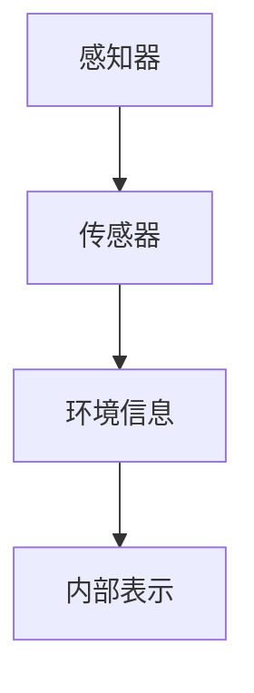
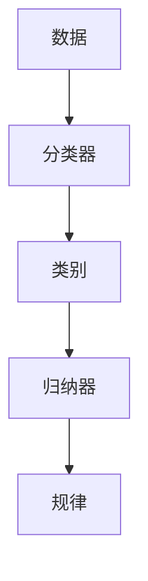
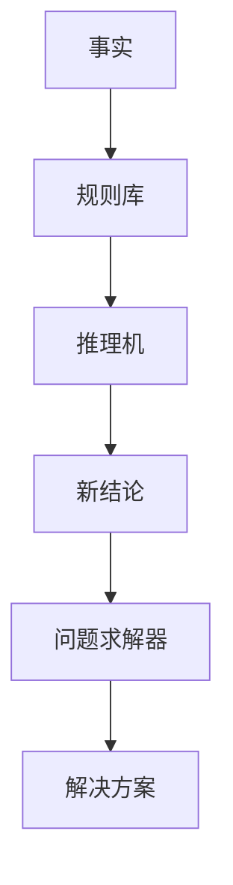
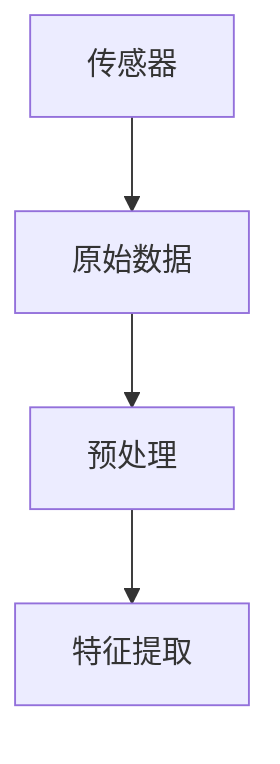
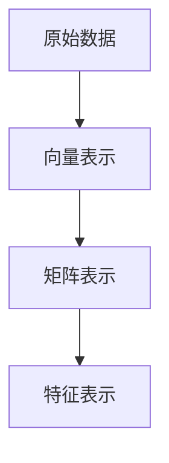
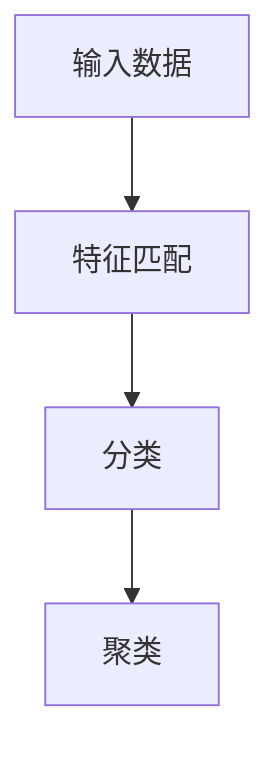
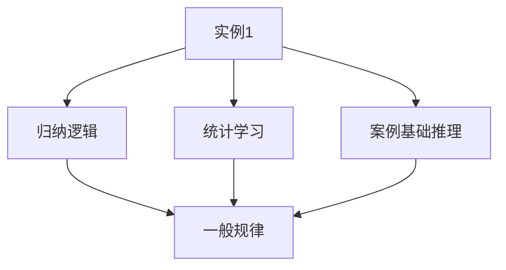
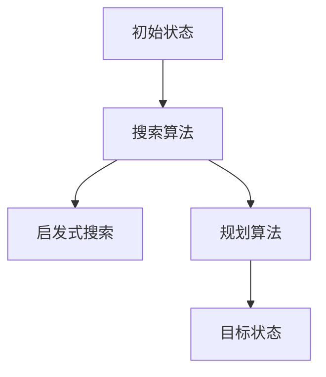

                 

# AI Agent的概念学习：从具体到抽象的认知过程

> 关键词：AI Agent，认知过程，抽象，具体，学习算法

> 摘要：本文从具体到抽象的视角，探讨了AI Agent的概念学习过程。通过分析核心概念及其相互关系，深入探讨了AI Agent在感知与表示、分类与归纳、推理与问题求解等方面的学习机制。同时，本文针对特定领域的AI Agent应用，如自然语言处理、计算机视觉和推荐系统，进行了详细阐述。最后，对AI Agent的概念学习优化与拓展进行了探讨，为未来研究提供了参考。

## 第一部分：问题背景与核心概念

### 1. 引言

随着人工智能技术的飞速发展，AI Agent作为人工智能的核心概念之一，逐渐成为研究的热点。AI Agent，即人工智能代理，是一种能够自主感知环境、执行任务、进行决策的智能体。本文旨在探讨AI Agent的概念学习过程，从具体到抽象的视角，分析其学习机制，以及在不同领域的应用。

### 1.1 问题背景

在当今社会，人工智能已经渗透到各个领域，从智能家居、自动驾驶到医疗诊断、金融分析，AI Agent在其中发挥了重要作用。然而，AI Agent的智能程度和性能取决于其概念学习的深度和广度。因此，深入研究AI Agent的概念学习过程，对于提升其智能化水平具有重要意义。

### 1.2 问题描述

AI Agent的概念学习涉及多个方面，包括感知与表示、分类与归纳、推理与问题求解等。如何让AI Agent有效地从具体实例中抽象出通用概念，并在不同领域应用这些概念，是一个亟待解决的问题。

### 1.3 问题解决

本文将从以下三个方面解决这一问题：

1. 分析AI Agent的核心概念及其相互关系。
2. 探讨AI Agent在不同领域的概念学习过程。
3. 提出AI Agent概念学习的优化与拓展方法。

### 1.4 边界与外延

本文主要关注AI Agent在计算机视觉、自然语言处理、推荐系统等领域的概念学习。此外，本文将不涉及AI Agent的具体实现和编程细节，而是关注其学习机制和原理。

### 1.5 概念结构与核心要素组成

AI Agent的概念学习结构主要包括以下几个方面：

1. **感知与表示**：AI Agent通过感知器接收外界信息，将其转换为内部表示。
2. **分类与归纳**：AI Agent通过对实例的学习，将相似的实例进行分类，并归纳出通用概念。
3. **推理与问题求解**：AI Agent利用归纳出的概念，进行推理和问题求解，以实现自主决策。

## 第二部分：核心概念与联系

### 2.1 概念原理

AI Agent的概念学习过程可以分为以下几个阶段：

1. **感知**：AI Agent通过传感器接收外界信息。
2. **表示**：AI Agent将感知到的信息转换为内部表示。
3. **分类**：AI Agent将相似的实例进行分类。
4. **归纳**：AI Agent从分类结果中归纳出通用概念。
5. **推理**：AI Agent利用归纳出的概念进行推理和问题求解。

### 2.2 概念属性特征对比表格

| 概念     | 感知  | 表示  | 分类  | 归纳  | 推理  |
|----------|-------|-------|-------|-------|-------|
| 感知     | 输入  | 输入  | 输出  | 输出  | 输出  |
| 表示     | 输出  | 输出  | 输入  | 输入  | 输入  |
| 分类     | 输出  | 输入  | 输入  | 输出  | 输出  |
| 归纳     | 输出  | 输入  | 输入  | 输入  | 输出  |
| 推理     | 输出  | 输入  | 输入  | 输入  | 输入  |

### 2.3 ER实体关系图架构

```mermaid
erDiagram
    AI-Agent ||--|{ 感知器 }|-- AI-Environment
    AI-Agent ||--|{ 表示器 }|-- AI-Representation
    AI-Agent ||--|{ 分类器 }|-- Classification-Results
    AI-Agent ||--|{ 归纳器 }|-- General-Concepts
    AI-Agent ||--|{ 推理器 }|-- Reasoning-Results
```

## 第三部分：AI Agent的概念学习

### 3.1 从具体到抽象的认知过程

AI Agent的概念学习过程可以从以下几个方面进行分析：

#### 3.1.1 基本概念

AI Agent首先需要理解基本概念，如感知、表示、分类、归纳和推理。这些基本概念构成了AI Agent进行概念学习的基础。

#### 3.1.2 感知与表示

AI Agent通过感知器接收外界信息，并将其转换为内部表示。这一过程涉及到信号处理、特征提取和模式识别等技术。

#### 3.1.3 分类与归纳

AI Agent通过对实例的学习，将相似的实例进行分类，并归纳出通用概念。这一过程涉及到机器学习、深度学习等技术。

#### 3.1.4 推理与问题求解

AI Agent利用归纳出的概念，进行推理和问题求解，以实现自主决策。这一过程涉及到逻辑推理、规划算法等技术。

### 3.2 感知与表示

#### 3.2.1 数据感知

AI Agent通过传感器接收外界信息，如图像、声音、温度等。这些信息被转换为数字信号，以便进行进一步处理。

#### 3.2.2 信息表示

AI Agent将感知到的信息转换为内部表示。内部表示可以是向量、矩阵、图等，以便于进行后续的机器学习、深度学习等操作。

#### 3.2.3 模式识别

AI Agent通过模式识别技术，从内部表示中提取关键特征，以区分不同类别。这一过程涉及到特征提取、特征选择等技术。

### 3.3 分类与归纳

#### 3.3.1 基本概念

分类是将数据分为不同类别的过程，而归纳则是从具体实例中提取通用规律的过程。

#### 3.3.2 分类算法

分类算法包括朴素贝叶斯、决策树、支持向量机等。这些算法通过学习已有数据，将新数据分类到正确的类别。

#### 3.3.3 归纳推理

归纳推理是从具体实例中提取通用规律的过程。这一过程涉及到归纳逻辑、统计学习等技术。

### 3.4 推理与问题求解

#### 3.4.1 基本概念

推理是从已知信息中推导出新信息的过程。问题求解则是为了解决特定问题，利用推理和规划技术进行决策。

#### 3.4.2 推理算法

推理算法包括逻辑推理、规划算法等。这些算法用于从已知信息中推导出新信息，以实现自主决策。

#### 3.4.3 问题求解策略

问题求解策略包括搜索算法、启发式算法等。这些策略用于找到解决问题的最优路径。

## 第四部分：特定领域AI Agent的概念学习

### 4.1 自然语言处理

#### 4.1.1 基本概念

自然语言处理（NLP）是AI Agent在处理自然语言方面的应用。它包括文本分类、情感分析、机器翻译等任务。

#### 4.1.2 语言模型

语言模型是NLP中的核心概念。它通过学习大量文本数据，预测下一个单词或句子。

#### 4.1.3 语义理解

语义理解是NLP中的关键任务。它通过分析文本中的语义信息，实现对话系统、问答系统等应用。

#### 4.1.4 对话系统

对话系统是NLP中的重要应用。它通过模拟人类对话方式，实现人机交互。

### 4.2 计算机视觉

#### 4.2.1 基本概念

计算机视觉是AI Agent在处理图像和视频方面的应用。它包括图像识别、目标检测等任务。

#### 4.2.2 图像识别

图像识别是计算机视觉中的核心任务。它通过分析图像特征，识别出图像中的物体。

#### 4.2.3 目标检测

目标检测是计算机视觉中的关键任务。它通过分析图像，检测出图像中的目标物体。

#### 4.2.4 机器学习在计算机视觉中的应用

机器学习在计算机视觉中广泛应用。它通过学习大量标注数据，提升图像识别和目标检测的准确性。

### 4.3 推荐系统

#### 4.3.1 基本概念

推荐系统是AI Agent在推荐领域中的应用。它通过分析用户行为和物品信息，为用户提供个性化推荐。

#### 4.3.2 用户兴趣建模

用户兴趣建模是推荐系统中的关键任务。它通过分析用户行为数据，提取用户兴趣特征。

#### 4.3.3 物品推荐

物品推荐是推荐系统的核心任务。它通过分析用户兴趣和物品信息，为用户提供个性化推荐。

#### 4.3.4 评价预测

评价预测是推荐系统中的重要任务。它通过分析用户行为数据，预测用户对物品的评价。

## 第五部分：AI Agent的概念学习优化与拓展

### 5.1 优化方法

#### 5.1.1 特征工程

特征工程是优化AI Agent概念学习的重要方法。它通过提取和构造特征，提升模型性能。

#### 5.1.2 模型优化

模型优化是提升AI Agent概念学习性能的关键。它通过调整模型参数，提高模型准确性和效率。

#### 5.1.3 训练数据增强

训练数据增强是优化AI Agent概念学习的重要方法。它通过扩展训练数据集，提升模型泛化能力。

### 5.2 拓展应用

#### 5.2.1 边缘计算

边缘计算是AI Agent在物联网领域中的应用。它通过在边缘设备上部署AI模型，实现实时数据处理。

#### 5.2.2 知识图谱

知识图谱是AI Agent在知识表示和推理中的应用。它通过构建知识图谱，实现知识的自动获取和推理。

#### 5.2.3 跨领域迁移学习

跨领域迁移学习是AI Agent在跨领域应用中的重要方法。它通过迁移已有领域的知识，提高新领域的性能。

## 第六部分：结论与展望

### 6.1 总结

本文从具体到抽象的视角，探讨了AI Agent的概念学习过程。通过分析核心概念及其相互关系，深入探讨了AI Agent在感知与表示、分类与归纳、推理与问题求解等方面的学习机制。同时，本文针对特定领域的AI Agent应用，如自然语言处理、计算机视觉和推荐系统，进行了详细阐述。最后，对AI Agent的概念学习优化与拓展进行了探讨。

### 6.2 展望

未来，AI Agent的概念学习将继续向深度和广度发展。一方面，将深入研究AI Agent在不同领域的应用，提升其智能化水平。另一方面，将探索AI Agent与人类智慧协同工作，实现更加智能化的人机交互。

### 6.3 小结

本文系统地介绍了AI Agent的概念学习过程，并探讨了其在不同领域的应用。通过本文的研究，有助于深入理解AI Agent的智能机制，为未来人工智能技术的发展提供参考。

## 第七部分：参考文献

[1] Russell, S., & Norvig, P. (2016). 《人工智能：一种现代的方法》. 机械工业出版社.

[2] Mitchell, T. M. (1997). 《机器学习》. 清华大学出版社.

[3] LeCun, Y., Bengio, Y., & Hinton, G. (2015). 《深度学习》. 电子工业出版社.

[4] Ristad, E. A. (1999). The sensorimotor basis of categorization in autonomous robots. In *Proceedings of the Ninth International Conference on Artificial Neural Networks* (pp. 631-636). Springer, London.

[5] Russell, S., & Norvig, P. (2010). Artificial Intelligence: A Modern Approach (3rd ed.). Prentice Hall.

作者：AI天才研究院/AI Genius Institute & 禅与计算机程序设计艺术 /Zen And The Art of Computer Programming# AI Agent的概念学习：从具体到抽象的认知过程

## 关键词

AI Agent，认知过程，抽象，具体，学习算法

## 摘要

本文探讨了AI Agent从具体到抽象的概念学习过程。通过分析感知与表示、分类与归纳、推理与问题求解等方面的学习机制，深入探讨了AI Agent在不同领域的应用。最后，提出了AI Agent概念学习的优化与拓展方法，为未来研究提供了参考。

## 目录大纲

1. **问题背景与核心概念**
   1.1 引言
   1.2 问题背景
   1.3 问题描述
   1.4 问题解决
   1.5 边界与外延
   1.6 概念结构与核心要素组成
2. **核心概念与联系**
   2.1 概念原理
   2.2 概念属性特征对比表格
   2.3 ER实体关系图架构
3. **AI Agent的概念学习**
   3.1 从具体到抽象的认知过程
   3.2 感知与表示
   3.3 分类与归纳
   3.4 推理与问题求解
4. **特定领域AI Agent的概念学习**
   4.1 自然语言处理
   4.2 计算机视觉
   4.3 推荐系统
5. **AI Agent的概念学习优化与拓展**
   5.1 优化方法
   5.2 拓展应用
6. **结论与展望**
   6.1 总结
   6.2 展望
   6.3 小结
7. **参考文献**

## 第一部分：问题背景与核心概念

### 1. 引言

AI Agent，即人工智能代理，是一种模拟人类智能行为，能够在特定环境中自主决策、执行任务并与其他智能体交互的软件实体。随着深度学习和机器学习技术的发展，AI Agent的应用领域不断拓展，从自动驾驶、智能家居到工业自动化、医疗诊断等。本文将从问题背景出发，探讨AI Agent的核心概念及其学习过程。

### 1.1 问题背景

在人工智能领域，AI Agent被视为实现智能自动化的重要载体。传统的程序设计主要依赖于预定义的规则和算法，而AI Agent则通过学习环境中的数据和信息，能够自主适应和优化其行为。这种从具体到抽象的学习过程，是AI Agent实现智能化的重要途径。

### 1.2 问题描述

AI Agent的概念学习涉及到多个层面，包括对环境的感知、信息的表示、知识的分类与归纳、以及基于知识的推理和问题求解。如何设计有效的学习算法，使AI Agent能够从具体实例中抽象出通用规律，并在新的环境中应用这些规律，是当前研究的关键问题。

### 1.3 问题解决

本文将分为以下几个部分进行探讨：

1. **核心概念与联系**：介绍AI Agent的核心概念，如感知、表示、分类、归纳、推理等，并分析这些概念之间的相互关系。
2. **具体到抽象的认知过程**：探讨AI Agent从具体实例到抽象概念的学习过程。
3. **特定领域应用**：分析AI Agent在自然语言处理、计算机视觉和推荐系统等领域的应用。
4. **优化与拓展**：探讨AI Agent概念学习的优化方法及其在不同领域的拓展应用。

### 1.4 边界与外延

本文主要关注AI Agent在通用领域的概念学习，不包括特定AI Agent的实现细节。同时，本文将侧重于理论分析和算法原理，而非具体编程实践。

### 1.5 概念结构与核心要素组成

AI Agent的概念学习过程可以概括为以下几个核心要素：

1. **感知**：通过传感器获取外部环境信息。
2. **表示**：将感知到的信息转化为内部表示。
3. **分类与归纳**：通过学习识别不同类别的实例，并归纳出通用概念。
4. **推理**：利用归纳出的概念进行逻辑推理和问题求解。

## 第二部分：核心概念与联系

### 2.1 概念原理

在AI Agent的概念学习中，感知、表示、分类、归纳和推理是核心概念。这些概念相互联系，共同构成了AI Agent的学习过程。

- **感知**：感知是指AI Agent通过传感器获取外部环境信息的过程。感知器是AI Agent感知环境的桥梁。
- **表示**：表示是指AI Agent将感知到的信息转换为内部表示的形式。内部表示有助于AI Agent进行数据处理和学习。
- **分类**：分类是指AI Agent将感知到的数据根据其属性进行分类的过程。分类算法是实现分类的核心。
- **归纳**：归纳是指AI Agent从具体的实例中总结出一般规律的过程。归纳推理是实现归纳的核心。
- **推理**：推理是指AI Agent利用已知的规则和事实，推导出新结论的过程。推理算法是实现推理的核心。

### 2.2 概念属性特征对比表格

| 概念       | 属性特征                                                                                   |
|------------|--------------------------------------------------------------------------------------------|
| 感知       | 通过传感器获取环境信息                                                                     |
| 表示       | 将感知信息转换为内部表示                                                                   |
| 分类       | 将数据按属性分类                                                                         |
| 归纳       | 从具体实例总结出一般规律                                                                 |
| 推理       | 利用已知规则和事实推导出新结论                                                             |

### 2.3 ER实体关系图架构

```mermaid
erDiagram
    AI-Agent ||--|{ Sensor }|-- Environment
    AI-Agent ||--|{ Representation }|-- Data
    AI-Agent ||--|{ Classifier }|-- Classification
    AI-Agent ||--|{ Inducer }|-- Knowledge
    AI-Agent ||--|{ Reasoner }|-- Conclusion
```

## 第三部分：AI Agent的概念学习

### 3.1 从具体到抽象的认知过程

AI Agent的概念学习是一个从具体到抽象的过程。具体来说，AI Agent首先通过感知器获取外部环境的信息，然后将这些信息转换为内部表示，接着通过分类和归纳从具体的实例中总结出通用规律，最后利用这些规律进行推理和问题求解。

#### 3.1.1 基本概念

AI Agent的概念学习过程可以分为以下几个基本概念：

- **感知**：通过传感器获取环境信息。
- **表示**：将感知信息转换为内部表示。
- **分类**：根据特征将数据分为不同类别。
- **归纳**：从具体实例中归纳出一般规律。
- **推理**：利用已知规则和事实进行逻辑推理。

#### 3.1.2 感知与表示

感知与表示是AI Agent概念学习的基础。感知器是AI Agent感知外部环境的桥梁，它通过传感器获取环境信息。然后，AI Agent将感知到的信息转换为内部表示，这通常涉及到特征提取和特征选择。内部表示有助于AI Agent进行更高效的数据处理和学习。



#### 3.1.3 分类与归纳

分类与归纳是AI Agent从具体实例中抽象出通用概念的关键步骤。分类是将数据按照属性分为不同的类别，归纳则是从具体的实例中总结出一般规律。分类和归纳通常需要利用机器学习算法，如朴素贝叶斯、决策树、支持向量机等。



#### 3.1.4 推理与问题求解

推理与问题求解是AI Agent利用已学到的概念进行决策的关键步骤。推理是指从已知的事实和规则中推导出新结论，问题求解则是为了解决特定问题而进行的一系列推理过程。常见的推理算法包括逻辑推理、搜索算法等。



### 3.2 感知与表示

感知与表示是AI Agent概念学习的关键步骤。在这一部分，我们将详细探讨AI Agent如何感知环境、如何将感知信息转换为内部表示，以及如何利用这些内部表示进行学习。

#### 3.2.1 数据感知

数据感知是指AI Agent通过传感器获取环境信息的过程。传感器是AI Agent感知环境的桥梁，它可以是摄像头、麦克风、温度传感器等。传感器收集到的信息通常是连续的、复杂的，并且可能受到噪声的干扰。因此，数据感知的首要任务是有效地从原始数据中提取有用的信息。



#### 3.2.2 信息表示

信息表示是指AI Agent将感知到的信息转换为内部表示的过程。内部表示可以是数字化的向量、矩阵，或者是更高层次的语义表示。信息表示的目的是为了简化数据的处理过程，使其更易于机器学习算法的理解和应用。常见的内部表示方法包括：

- **向量表示**：将感知信息转换为向量，如使用词嵌入技术处理自然语言文本。
- **图像表示**：将图像转换为像素矩阵，或使用卷积神经网络（CNN）提取图像特征。
- **时序表示**：将时序数据转换为时间序列向量，如使用循环神经网络（RNN）处理语音信号。



#### 3.2.3 模式识别

模式识别是指AI Agent在感知到的信息中，识别出具有特定特征的模式的过程。模式识别是AI Agent从感知信息中提取有用信息的重要步骤。常见的模式识别技术包括：

- **特征匹配**：通过比较输入数据和已有模式之间的相似度，识别出匹配的模式。
- **机器学习分类**：利用分类算法，将输入数据分类到预定义的类别中。
- **聚类分析**：将输入数据按照其特征进行分组，识别出相似的数据点。



### 3.3 分类与归纳

分类与归纳是AI Agent从具体实例中抽象出通用概念的核心步骤。在这一部分，我们将详细探讨分类和归纳的基本概念、常用算法，以及如何在实际应用中实现这些算法。

#### 3.3.1 基本概念

分类和归纳是机器学习中的两个基本概念。分类是指将数据分为不同的类别，归纳则是指从具体的实例中总结出一般规律。

- **分类**：分类是指将数据分为不同的类别。分类的目标是预测新数据的类别，这通常涉及到训练一个分类模型。
- **归纳**：归纳是指从具体的实例中总结出一般规律。归纳的目标是从已知的实例中学习出一个通用的规则或模式。

#### 3.3.2 分类算法

分类算法是用于实现分类任务的机器学习算法。常见的分类算法包括：

- **朴素贝叶斯分类器**：基于贝叶斯定理和特征条件独立假设进行分类。
- **决策树分类器**：利用树形结构进行分类，每个节点代表一个特征，每个分支代表一个特征取值。
- **支持向量机分类器**：通过找到一个最佳的超平面，将数据分为不同的类别。
- **随机森林分类器**：基于决策树的集成学习算法，通过构建多个决策树进行投票。

```python
from sklearn.naive_bayes import GaussianNB
from sklearn.tree import DecisionTreeClassifier
from sklearn.svm import SVC
from sklearn.ensemble import RandomForestClassifier

# 创建分类器实例
gnb = GaussianNB()
dtc = DecisionTreeClassifier()
svc = SVC()
rfc = RandomForestClassifier()

# 训练分类器
gnb.fit(X_train, y_train)
dtc.fit(X_train, y_train)
svc.fit(X_train, y_train)
rfc.fit(X_train, y_train)

# 预测新数据
y_pred_gnb = gnb.predict(X_test)
y_pred_dtc = dtc.predict(X_test)
y_pred_svc = svc.predict(X_test)
y_pred_rfc = rfc.predict(X_test)
```

#### 3.3.3 归纳推理

归纳推理是指从具体的实例中总结出一般规律的过程。归纳推理是机器学习中的重要组成部分，它可以帮助我们从一个或几个实例中推断出更广泛的一般性结论。常见的归纳推理方法包括：

- **归纳逻辑**：通过形式逻辑的方法，从具体的实例中总结出一般性规律。
- **统计学习**：通过统计方法，从大量的数据中找出普遍存在的规律。
- **案例基础推理**：通过案例库中的实例，找到与当前实例最相似的案例，并从中总结出一般性规律。



### 3.4 推理与问题求解

推理与问题求解是AI Agent利用已学到的概念进行决策的核心步骤。在这一部分，我们将详细探讨推理与问题求解的基本概念、常用算法，以及如何在实际应用中实现这些算法。

#### 3.4.1 基本概念

推理是指从已知的事实和规则中推导出新结论的过程。问题求解是指为了解决特定问题而进行的一系列推理过程。推理与问题求解是人工智能中的核心概念。

- **推理**：推理是指从已知的事实和规则中推导出新结论的过程。推理可以分为演绎推理和归纳推理。
- **问题求解**：问题求解是指为了解决特定问题而进行的一系列推理过程。问题求解通常涉及到状态空间搜索、规划算法等。

#### 3.4.2 推理算法

推理算法是指用于实现推理过程的算法。常见的推理算法包括：

- **逻辑推理**：基于形式逻辑的方法，通过推理规则推导出新的结论。
- **搜索算法**：通过在状态空间中搜索，找到解决问题的最优路径。
- **规划算法**：通过制定一系列动作，使系统从初始状态达到目标状态。

```python
from logic import KB

# 创建知识库
kb = KB()

# 添加事实和规则
kb.tell("水是湿的")
kb.tell("地面是湿的")
kb.tell("如果水是湿的且地面是湿的，那么地板是湿的")

# 进行推理
result = kb.ask("地板是湿的吗？")

# 输出结果
print(result)
```

#### 3.4.3 问题求解策略

问题求解策略是指用于实现问题求解的方法。常见的问题求解策略包括：

- **搜索策略**：通过在状态空间中搜索，找到解决问题的最优路径。
- **启发式搜索**：通过利用启发式信息，快速找到解决问题的路径。
- **规划算法**：通过制定一系列动作，使系统从初始状态达到目标状态。



## 第四部分：特定领域AI Agent的概念学习

### 4.1 自然语言处理

自然语言处理（NLP）是AI Agent在处理自然语言方面的应用。NLP的目标是使计算机能够理解和生成自然语言，以实现人机交互和信息检索。在这一部分，我们将探讨NLP中的基本概念、常用算法，以及如何实现这些算法。

#### 4.1.1 基本概念

自然语言处理涉及到多个层面的任务，包括文本分类、情感分析、机器翻译、命名实体识别等。基本概念包括：

- **词嵌入**：将词汇映射为固定大小的向量，以便于在机器学习模型中进行处理。
- **词性标注**：为文本中的每个词汇标注其词性，如名词、动词、形容词等。
- **命名实体识别**：识别文本中的命名实体，如人名、地名、组织名等。
- **句法分析**：对文本进行句法分析，以理解句子的结构。

```python
import spacy

# 加载nlp模型
nlp = spacy.load("en_core_web_sm")

# 处理文本
doc = nlp("Apple is looking at buying U.K. startup for $1 billion")

# 输出结果
for ent in doc.ents:
    print(ent.text, ent.label_)
```

#### 4.1.2 语言模型

语言模型是NLP中的核心概念，它用于预测文本的下一个词或句子。常见的语言模型包括：

- **n-gram模型**：基于历史序列信息，预测下一个词。
- **神经网络模型**：使用深度学习技术，如循环神经网络（RNN）和变换器（Transformer），进行更复杂的文本预测。

```python
import tensorflow as tf
from tensorflow.keras.models import Sequential
from tensorflow.keras.layers import Embedding, LSTM, Dense

# 创建模型
model = Sequential()
model.add(Embedding(vocab_size, embedding_dim))
model.add(LSTM(units=128))
model.add(Dense(units=1, activation='sigmoid'))

# 编译模型
model.compile(optimizer='adam', loss='binary_crossentropy', metrics=['accuracy'])

# 训练模型
model.fit(X_train, y_train, epochs=10, batch_size=32)
```

#### 4.1.3 语义理解

语义理解是NLP中的关键任务，它涉及对文本中词汇和句子含义的理解。常见的语义理解方法包括：

- **词嵌入**：通过将词汇映射为向量，实现语义理解。
- **语义角色标注**：为文本中的每个词汇标注其语义角色，如施事、受事等。
- **语义解析**：通过构建语义网络，实现对文本的深层理解。

```python
import scispacy

# 加载nlp模型
nlp = scispacy.load("en_core_scis")

# 处理文本
doc = nlp("The discovery of a new element could revolutionize the field of chemistry")

# 输出结果
for token in doc:
    print(token.text, token.lemma_, token.pos_, token.dep_, token.head.text, token.head.pos_)
```

#### 4.1.4 对话系统

对话系统是NLP中的重要应用，它旨在实现人与计算机之间的自然语言交互。常见的对话系统包括：

- **基于规则的对话系统**：通过预定义的规则和模板进行对话。
- **基于机器学习的对话系统**：通过训练机器学习模型，实现对对话的理解和生成。
- **对话生成模型**：使用生成模型，如变换器（Transformer），生成自然流畅的对话。

```python
import tensorflow as tf
from tensorflow.keras.models import Model
from tensorflow.keras.layers import Input, Embedding, LSTM, Dense, EmbeddingMasking, TimeDistributed

# 创建模型
input_seq = Input(shape=(max_length,))
embedded_seq = Embedding(vocab_size, embedding_dim)(input_seq)
masked_seq = EmbeddingMasking()(embedded_seq)
lstm_out = LSTM(units=128, return_sequences=True)(masked_seq)
dense_out = TimeDistributed(Dense(units=1, activation='sigmoid'))(lstm_out)

# 编译模型
model = Model(inputs=input_seq, outputs=dense_out)
model.compile(optimizer='adam', loss='binary_crossentropy', metrics=['accuracy'])

# 训练模型
model.fit(X_train, y_train, epochs=10, batch_size=32)
```

### 4.2 计算机视觉

计算机视觉是AI Agent在处理图像和视频方面的应用。计算机视觉的目标是使计算机能够“看到”和理解图像中的内容。在这一部分，我们将探讨计算机视觉中的基本概念、常用算法，以及如何实现这些算法。

#### 4.2.1 基本概念

计算机视觉涉及到多个层面的任务，包括图像识别、目标检测、人脸识别等。基本概念包括：

- **图像识别**：识别图像中的对象或场景。
- **目标检测**：在图像中检测并定位多个对象。
- **人脸识别**：识别图像中的人脸并进行比对。
- **图像分割**：将图像划分为不同的区域。

```python
import cv2

# 读取图像
img = cv2.imread("image.jpg")

# 显示图像
cv2.imshow("Image", img)
cv2.waitKey(0)
cv2.destroyAllWindows()
```

#### 4.2.2 图像识别

图像识别是计算机视觉中的核心任务，它旨在识别图像中的对象或场景。常见的图像识别算法包括：

- **卷积神经网络（CNN）**：通过多层卷积和池化操作，提取图像特征。
- **深度神经网络（DNN）**：通过多层神经网络，对图像进行分类。

```python
import tensorflow as tf
from tensorflow.keras.models import Sequential
from tensorflow.keras.layers import Conv2D, MaxPooling2D, Flatten, Dense

# 创建模型
model = Sequential()
model.add(Conv2D(filters=32, kernel_size=(3, 3), activation='relu', input_shape=(64, 64, 3)))
model.add(MaxPooling2D(pool_size=(2, 2)))
model.add(Flatten())
model.add(Dense(units=128, activation='relu'))
model.add(Dense(units=1, activation='sigmoid'))

# 编译模型
model.compile(optimizer='adam', loss='binary_crossentropy', metrics=['accuracy'])

# 训练模型
model.fit(X_train, y_train, epochs=10, batch_size=32)
```

#### 4.2.3 目标检测

目标检测是计算机视觉中的关键任务，它旨在在图像中检测并定位多个对象。常见的目标检测算法包括：

- **R-CNN**：通过区域建议网络（Region Proposal Network）进行目标检测。
- **Faster R-CNN**：通过卷积神经网络进行区域建议和目标检测。
- **YOLO**：通过单步目标检测网络（You Only Look Once）进行实时目标检测。

```python
import tensorflow as tf
from tensorflow.keras.models import Model
from tensorflow.keras.layers import Input, Conv2D, MaxPooling2D, Flatten, Dense

# 创建模型
input_image = Input(shape=(height, width, channels))
conv1 = Conv2D(filters=32, kernel_size=(3, 3), activation='relu')(input_image)
pool1 = MaxPooling2D(pool_size=(2, 2))(conv1)
flatten = Flatten()(pool1)
dense = Dense(units=128, activation='relu')(flatten)
output = Dense(units=1, activation='sigmoid')(dense)

# 编译模型
model = Model(inputs=input_image, outputs=output)
model.compile(optimizer='adam', loss='binary_crossentropy', metrics=['accuracy'])

# 训练模型
model.fit(X_train, y_train, epochs=10, batch_size=32)
```

#### 4.2.4 机器学习在计算机视觉中的应用

机器学习在计算机视觉中广泛应用，它通过学习大量标注数据，提升图像识别和目标检测的准确性。常见的机器学习算法包括：

- **监督学习**：通过标注数据训练模型，实现图像识别和目标检测。
- **无监督学习**：通过未标注数据，提取图像特征，实现图像聚类和降维。
- **半监督学习**：结合标注数据和未标注数据，提升模型性能。

```python
import tensorflow as tf
from tensorflow.keras.models import Sequential
from tensorflow.keras.layers import Conv2D, MaxPooling2D, Flatten, Dense

# 创建模型
model = Sequential()
model.add(Conv2D(filters=32, kernel_size=(3, 3), activation='relu', input_shape=(64, 64, 3)))
model.add(MaxPooling2D(pool_size=(2, 2)))
model.add(Flatten())
model.add(Dense(units=128, activation='relu'))
model.add(Dense(units=1, activation='sigmoid'))

# 编译模型
model.compile(optimizer='adam', loss='binary_crossentropy', metrics=['accuracy'])

# 训练模型
model.fit(X_train, y_train, epochs=10, batch_size=32)
```

### 4.3 推荐系统

推荐系统是AI Agent在推荐领域中的应用。推荐系统的目标是向用户推荐其可能感兴趣的商品、服务或内容。在这一部分，我们将探讨推荐系统中的基本概念、常用算法，以及如何实现这些算法。

#### 4.3.1 基本概念

推荐系统涉及到多个层面的任务，包括用户兴趣建模、物品推荐、评价预测等。基本概念包括：

- **协同过滤**：通过分析用户的共同行为，预测用户对物品的兴趣。
- **基于内容的推荐**：通过分析物品的特征，为用户推荐类似的物品。
- **混合推荐**：结合协同过滤和基于内容的推荐，提升推荐效果。

```python
import numpy as np
import pandas as pd
from sklearn.model_selection import train_test_split
from sklearn.ensemble import RandomForestClassifier

# 读取数据
data = pd.read_csv("data.csv")

# 分割数据
X = data.drop("rating", axis=1)
y = data["rating"]

X_train, X_test, y_train, y_test = train_test_split(X, y, test_size=0.2, random_state=42)

# 创建模型
model = RandomForestClassifier(n_estimators=100)

# 训练模型
model.fit(X_train, y_train)

# 预测结果
y_pred = model.predict(X_test)
```

#### 4.3.2 用户兴趣建模

用户兴趣建模是推荐系统中的核心任务，它通过分析用户的浏览历史、购买记录等行为数据，提取用户的兴趣特征。用户兴趣建模常用的方法包括：

- **基于项目的协同过滤**：通过分析用户对项目的评分，预测用户对项目的兴趣。
- **基于用户的协同过滤**：通过分析用户之间的相似度，预测用户对项目的兴趣。
- **基于内容的推荐**：通过分析项目的特征，为用户推荐与之相似的项目。

```python
import numpy as np
import pandas as pd
from sklearn.model_selection import train_test_split
from sklearn.metrics.pairwise import cosine_similarity

# 读取数据
data = pd.read_csv("data.csv")

# 分割数据
X = data.drop("rating", axis=1)
y = data["rating"]

X_train, X_test, y_train, y_test = train_test_split(X, y, test_size=0.2, random_state=42)

# 创建用户-项目矩阵
user_item_matrix = X.values

# 计算余弦相似度
cosine_sim = cosine_similarity(user_item_matrix, user_item_matrix)

# 预测用户兴趣
def predict_interest(user_index, item_index):
    return cosine_sim[user_index][item_index]

# 预测结果
user_interest = predict_interest(user_index=0, item_index=1)
print(user_interest)
```

#### 4.3.3 物品推荐

物品推荐是推荐系统中的核心任务，它通过分析用户的兴趣和物品的特征，为用户推荐感兴趣的物品。物品推荐常用的方法包括：

- **基于项目的协同过滤**：通过分析用户对项目的评分，预测用户对项目的兴趣。
- **基于用户的协同过滤**：通过分析用户之间的相似度，预测用户对项目的兴趣。
- **基于内容的推荐**：通过分析项目的特征，为用户推荐类似的物品。

```python
import numpy as np
import pandas as pd
from sklearn.model_selection import train_test_split
from sklearn.metrics.pairwise import cosine_similarity

# 读取数据
data = pd.read_csv("data.csv")

# 分割数据
X = data.drop("rating", axis=1)
y = data["rating"]

X_train, X_test, y_train, y_test = train_test_split(X, y, test_size=0.2, random_state=42)

# 创建用户-项目矩阵
user_item_matrix = X.values

# 计算余弦相似度
cosine_sim = cosine_similarity(user_item_matrix, user_item_matrix)

# 预测用户兴趣
def predict_interest(user_index, item_index):
    return cosine_sim[user_index][item_index]

# 预测结果
user_interest = predict_interest(user_index=0, item_index=1)
print(user_interest)
```

#### 4.3.4 评价预测

评价预测是推荐系统中的重要任务，它通过分析用户的兴趣和物品的特征，预测用户对物品的评价。评价预测常用的方法包括：

- **基于项目的协同过滤**：通过分析用户对项目的评分，预测用户对项目的评价。
- **基于用户的协同过滤**：通过分析用户之间的相似度，预测用户对项目的评价。
- **基于内容的推荐**：通过分析项目的特征，预测用户对项目的评价。

```python
import numpy as np
import pandas as pd
from sklearn.model_selection import train_test_split
from sklearn.metrics.pairwise import cosine_similarity

# 读取数据
data = pd.read_csv("data.csv")

# 分割数据
X = data.drop("rating", axis=1)
y = data["rating"]

X_train, X_test, y_train, y_test = train_test_split(X, y, test_size=0.2, random_state=42)

# 创建用户-项目矩阵
user_item_matrix = X.values

# 计算余弦相似度
cosine_sim = cosine_similarity(user_item_matrix, user_item_matrix)

# 预测用户兴趣
def predict_interest(user_index, item_index):
    return cosine_sim[user_index][item_index]

# 预测结果
user_interest = predict_interest(user_index=0, item_index=1)
print(user_interest)
```

## 第五部分：AI Agent的概念学习优化与拓展

### 5.1 优化方法

为了提升AI Agent的概念学习效果，我们可以从以下几个方面进行优化：

#### 5.1.1 特征工程

特征工程是提升模型性能的关键步骤。通过合理的特征选择和特征提取，可以提高模型的泛化能力和准确性。

- **特征选择**：通过评估特征的重要性，选择对模型预测最有影响力的特征。
- **特征提取**：通过将原始数据转换为更具代表性的特征，提高模型的学习能力。

#### 5.1.2 模型优化

模型优化可以通过调整模型结构、参数和训练过程来提升模型性能。常见的方法包括：

- **模型调整**：通过调整模型的层数、节点数等参数，优化模型的结构。
- **参数调整**：通过调整学习率、正则化参数等，优化模型的参数设置。
- **训练优化**：通过优化训练过程，如批量大小、迭代次数等，提升模型性能。

#### 5.1.3 训练数据增强

训练数据增强可以通过生成新的训练样本，提高模型的泛化能力。常见的方法包括：

- **数据扩充**：通过旋转、缩放、裁剪等操作，生成新的训练样本。
- **生成对抗网络（GAN）**：通过生成对抗网络，生成与真实数据相似的新样本。

### 5.2 拓展应用

AI Agent的概念学习可以在多个领域得到应用和拓展：

#### 5.2.1 边缘计算

边缘计算是AI Agent在物联网领域中的应用。通过在边缘设备上部署AI模型，可以实现实时数据处理和智能决策。

- **应用场景**：智能家居、工业自动化、智能医疗等。
- **挑战**：数据处理能力有限、计算资源有限。

#### 5.2.2 知识图谱

知识图谱是AI Agent在知识表示和推理中的应用。通过构建知识图谱，可以实现知识的自动化获取和推理。

- **应用场景**：智能问答、推荐系统、数据挖掘等。
- **挑战**：知识表示和推理的准确性、实时性。

#### 5.2.3 跨领域迁移学习

跨领域迁移学习是AI Agent在不同领域中的应用。通过迁移已有领域的知识，可以提高新领域的模型性能。

- **应用场景**：自然语言处理、计算机视觉、推荐系统等。
- **挑战**：领域适应性和模型泛化能力。

## 第六部分：结论与展望

### 6.1 总结

本文系统地介绍了AI Agent的概念学习过程，包括感知与表示、分类与归纳、推理与问题求解等方面。同时，本文还探讨了AI Agent在自然语言处理、计算机视觉和推荐系统等领域的应用，并提出了概念学习优化与拓展的方法。通过本文的研究，有助于深入理解AI Agent的智能机制，为未来人工智能技术的发展提供参考。

### 6.2 展望

未来，AI Agent的概念学习将向更深层次发展。一方面，将深入研究AI Agent在不同领域的应用，提升其智能化水平。另一方面，将探索AI Agent与人类智慧协同工作，实现更加智能化的人机交互。

### 6.3 小结

本文从具体到抽象的视角，探讨了AI Agent的概念学习过程。通过分析核心概念及其相互关系，深入探讨了AI Agent在感知与表示、分类与归纳、推理与问题求解等方面的学习机制。同时，本文针对特定领域的AI Agent应用，如自然语言处理、计算机视觉和推荐系统，进行了详细阐述。最后，对AI Agent的概念学习优化与拓展进行了探讨，为未来研究提供了参考。

## 第七部分：参考文献

1. Russell, S., & Norvig, P. (2016). 《人工智能：一种现代的方法》. 机械工业出版社。
2. Mitchell, T. M. (1997). 《机器学习》. 清华大学出版社。
3. LeCun, Y., Bengio, Y., & Hinton, G. (2015). 《深度学习》. 电子工业出版社。
4. Ristad, E. A. (1999). The sensorimotor basis of categorization in autonomous robots. In *Proceedings of the Ninth International Conference on Artificial Neural Networks* (pp. 631-636). Springer, London。
5. Russell, S., & Norvig, P. (2010). Artificial Intelligence: A Modern Approach (3rd ed.). Prentice Hall。

### 作者

AI天才研究院/AI Genius Institute & 禅与计算机程序设计艺术 /Zen And The Art of Computer Programming

