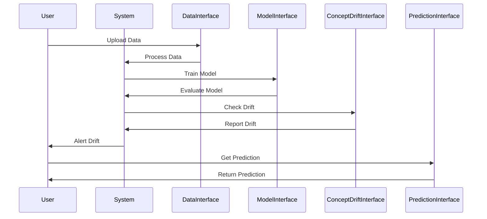
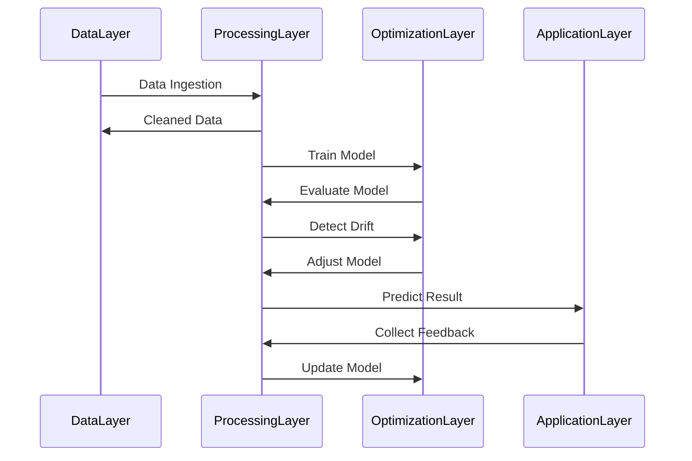

                 

**# AI Agent的概念漂移检测与适应策略**

关键词：AI Agent，概念漂移，检测与适应策略，算法，数学模型，系统架构，案例分析

摘要：随着人工智能技术的迅猛发展，AI Agent在各个领域的应用越来越广泛。然而，AI Agent在长时间运行过程中，可能会遇到概念漂移的问题，导致其性能下降甚至失效。本文将深入探讨AI Agent的概念漂移检测与适应策略，从核心概念、算法原理、系统架构、案例分析等多个方面进行详细解析，旨在为研究人员和开发者提供有价值的参考。

----------------------------------------------------------------

**## 引言**

随着人工智能（AI）技术的快速发展，智能代理（AI Agent）在各个领域得到了广泛应用。无论是自动驾驶、智能客服，还是金融风控、医疗诊断，AI Agent都扮演着至关重要的角色。这些智能代理通常基于机器学习算法进行训练，以实现自主决策和任务执行。

然而，在实际应用中，AI Agent往往会遇到一个挑战，那就是**概念漂移（Concept Drift）**。概念漂移是指训练数据和实际应用数据之间存在差异，导致AI Agent的预测性能下降。例如，在自动驾驶领域，道路环境可能会随着季节变化、城市扩张等因素发生变化，从而导致AI Agent的模型无法适应新的环境。

本文将重点关注AI Agent的概念漂移检测与适应策略。通过深入分析概念漂移的原因、检测方法和适应策略，旨在为研究人员和开发者提供一套有效的解决方案，以提高AI Agent的鲁棒性和可靠性。

本文的结构如下：

1. **核心概念与原理**：介绍AI Agent、概念漂移等相关概念，并阐述其原理。
2. **算法与数学模型**：介绍常用的概念漂移检测算法和适应策略，包括数学模型和具体实现。
3. **系统架构与设计**：探讨概念漂移检测与适应策略在系统架构中的应用，包括系统设计、功能实现和架构优化。
4. **案例分析**：通过实际案例展示概念漂移检测与适应策略在具体应用中的效果。
5. **最佳实践与总结**：总结最佳实践，并提出未来研究方向。

通过本文的详细解析，希望能够帮助读者深入理解AI Agent的概念漂移检测与适应策略，为实际应用提供有力支持。接下来，我们将首先介绍AI Agent、概念漂移等相关核心概念和原理。****

**## 核心概念与原理**

### **AI Agent**

AI Agent，即人工智能代理，是指具备自主决策能力，能够在特定环境中执行任务的实体。AI Agent的核心是**智能算法**，其通过学习和理解环境中的数据，实现自我优化和适应。

AI Agent具有以下特点：

1. **自主决策**：AI Agent可以根据环境变化自主做出决策，而不需要人工干预。
2. **学习能力**：AI Agent可以通过机器学习、深度学习等技术，不断优化自身性能。
3. **环境适应**：AI Agent能够适应不同环境和场景，实现广泛的应用。

AI Agent在自动驾驶、智能客服、金融风控、医疗诊断等领域都有广泛应用。

### **概念漂移（Concept Drift）**

概念漂移是指训练数据和实际应用数据之间存在差异，导致AI Agent的预测性能下降。具体来说，概念漂移可以分为以下几种类型：

1. **渐变漂移（Gradual Drift）**：训练数据和实际应用数据逐渐发生变化，但变化过程相对平稳。
2. **突发漂移（Sudden Drift）**：训练数据和实际应用数据突然发生变化，导致AI Agent的预测性能急剧下降。
3. **周期性漂移（Cyclic Drift）**：训练数据和实际应用数据呈现周期性变化，如季节性、周变化等。

概念漂移对AI Agent的影响主要体现在以下几个方面：

1. **性能下降**：由于训练数据和实际应用数据不一致，AI Agent的预测性能会逐渐下降。
2. **决策错误**：在突发漂移情况下，AI Agent可能会做出错误的决策，导致实际应用中的问题。
3. **模型失效**：在长期漂移情况下，AI Agent的模型可能会完全失效，需要重新训练。

### **概念漂移的原因**

概念漂移的原因有很多，主要包括以下几个方面：

1. **数据分布变化**：随着时间推移，数据分布可能会发生变化，导致训练数据和实际应用数据不一致。
2. **环境变化**：AI Agent应用的环境可能会发生变化，如季节变化、城市扩张等，导致数据特征发生变化。
3. **模型过拟合**：在训练阶段，AI Agent可能会对训练数据进行过拟合，导致在实际应用中无法适应新的数据。
4. **噪声干扰**：在实际应用中，AI Agent可能会受到噪声干扰，导致数据质量下降，进而影响预测性能。

### **概念漂移检测**

概念漂移检测是指通过检测训练数据和实际应用数据之间的差异，来判断是否出现概念漂移。常用的概念漂移检测方法包括：

1. **统计方法**：通过计算统计指标（如均值、方差等）的变化来判断概念漂移。
2. **聚类方法**：通过聚类分析来判断训练数据和实际应用数据是否一致。
3. **机器学习方法**：利用机器学习算法来检测训练数据和实际应用数据之间的差异。
4. **基于阈值的检测方法**：通过设定阈值来判断是否出现概念漂移。

### **概念漂移适应策略**

概念漂移适应策略是指通过调整AI Agent的模型或参数，使其能够适应概念漂移。常用的适应策略包括：

1. **在线学习**：在AI Agent运行过程中，不断更新模型，以适应新的数据。
2. **离线学习**：在AI Agent运行过程中，定期重新训练模型，以应对概念漂移。
3. **混合学习**：结合在线学习和离线学习，以应对不同类型的概念漂移。
4. **模型融合**：通过融合多个模型，以提高AI Agent的鲁棒性和适应性。

通过以上介绍，我们可以看到，概念漂移是AI Agent在实际应用中面临的一个重要挑战。为了提高AI Agent的鲁棒性和可靠性，我们需要深入理解概念漂移的原因、检测方法和适应策略。接下来，我们将详细介绍常用的概念漂移检测算法和适应策略。****

### **算法与数学模型**

在概念漂移检测与适应策略中，算法和数学模型扮演着核心角色。以下将介绍几种常用的概念漂移检测算法和适应策略，并阐述其原理和具体实现。

#### **1. 统计方法**

统计方法是检测概念漂移的常用方法，通过计算统计指标的变化来判断概念漂移。以下是一种简单的统计方法：

- **均值差异检测**：计算训练集和测试集的特征均值差异，如果差异超过设定的阈值，则认为出现概念漂移。
- **方差差异检测**：计算训练集和测试集的特征方差差异，如果差异超过设定的阈值，则认为出现概念漂移。

数学模型表示如下：

$$
\mu_{\text{train}} = \frac{1}{n}\sum_{i=1}^{n} x_i \\
\mu_{\text{test}} = \frac{1}{m}\sum_{j=1}^{m} y_j \\
d_{\mu} = \lvert \mu_{\text{train}} - \mu_{\text{test}} \rvert
$$

$$
\sigma_{\text{train}}^2 = \frac{1}{n-1}\sum_{i=1}^{n} (x_i - \mu_{\text{train}})^2 \\
\sigma_{\text{test}}^2 = \frac{1}{m-1}\sum_{j=1}^{m} (y_j - \mu_{\text{test}})^2 \\
d_{\sigma} = \lvert \sigma_{\text{train}}^2 - \sigma_{\text{test}}^2 \rvert
$$

其中，$x_i$和$y_j$分别表示训练集和测试集中的特征值，$\mu_{\text{train}}$和$\mu_{\text{test}}$分别表示训练集和测试集的特征均值，$\sigma_{\text{train}}^2$和$\sigma_{\text{test}}^2$分别表示训练集和测试集的特征方差。

#### **2. 聚类方法**

聚类方法通过分析数据分布来判断概念漂移。以下是一种简单的基于K-means的聚类方法：

- **K-means聚类**：将训练集和测试集分别进行K-means聚类，比较聚类中心的变化来判断概念漂移。

数学模型表示如下：

$$
\mu_{\text{train}}^k = \frac{1}{n_k}\sum_{i=1}^{n_k} x_i \\
\mu_{\text{test}}^k = \frac{1}{m_k}\sum_{j=1}^{m_k} y_j \\
d_{\mu}^k = \lvert \mu_{\text{train}}^k - \mu_{\text{test}}^k \rvert
$$

其中，$x_i$和$y_j$分别表示训练集和测试集中的特征值，$\mu_{\text{train}}^k$和$\mu_{\text{test}}^k$分别表示训练集和测试集的聚类中心。

#### **3. 机器学习方法**

机器学习方法通过训练模型来判断概念漂移。以下是一种简单的基于分类器的机器学习方法：

- **分类器变化检测**：训练两个分类器，一个用于训练集，一个用于测试集，比较两个分类器的性能变化来判断概念漂移。

数学模型表示如下：

$$
\hat{y}_{\text{train}} = f_{\text{train}}(x) \\
\hat{y}_{\text{test}} = f_{\text{test}}(y) \\
d_{\text{acc}} = 1 - \hat{y}_{\text{train}} \cdot \hat{y}_{\text{test}}
$$

其中，$f_{\text{train}}$和$f_{\text{test}}$分别表示训练集和测试集的分类器，$\hat{y}_{\text{train}}$和$\hat{y}_{\text{test}}$分别表示分类器的预测结果。

#### **4. 基于阈值的检测方法**

基于阈值的检测方法通过设定阈值来判断概念漂移。以下是一种简单的基于阈值的方法：

- **阈值判定**：设定一个阈值$\alpha$，当检测指标超过$\alpha$时，认为出现概念漂移。

数学模型表示如下：

$$
d = \lvert \text{检测指标} - \alpha \rvert
$$

其中，$\text{检测指标}$可以是上述提到的统计指标、聚类指标或分类器性能指标。

#### **5. 概念漂移适应策略**

概念漂移适应策略是指通过调整模型或参数，使AI Agent能够适应概念漂移。以下介绍几种常用的适应策略：

- **在线学习**：在AI Agent运行过程中，实时更新模型，以适应新的数据。

$$
\text{模型}_{\text{new}} = \text{模型}_{\text{current}} + \alpha \cdot (\text{新数据} - \text{模型}_{\text{current}})
$$

其中，$\alpha$是学习率。

- **离线学习**：在AI Agent运行过程中，定期重新训练模型，以应对概念漂移。

$$
\text{模型}_{\text{new}} = \text{训练}(\text{新数据集})
$$

- **混合学习**：结合在线学习和离线学习，以应对不同类型的概念漂移。

$$
\text{模型}_{\text{new}} = \text{模型}_{\text{current}} + \beta \cdot (\text{在线学习} - \text{模型}_{\text{current}}) + (1 - \beta) \cdot (\text{离线学习} - \text{模型}_{\text{current}})
$$

其中，$\beta$是平衡系数。

- **模型融合**：通过融合多个模型，以提高AI Agent的鲁棒性和适应性。

$$
\text{预测}_{\text{new}} = \text{加权求和}(\text{模型}_1 \cdot \text{预测}_1, \text{模型}_2 \cdot \text{预测}_2, \ldots)
$$

通过上述介绍，我们可以看到，算法和数学模型在概念漂移检测与适应策略中起着至关重要的作用。在实际应用中，我们需要根据具体场景和需求，选择合适的算法和模型，以提高AI Agent的鲁棒性和可靠性。接下来，我们将进一步探讨概念漂移检测与适应策略在系统架构中的应用。****

### **系统架构与设计**

在AI Agent的实际应用中，概念漂移检测与适应策略需要融入到整个系统架构中，以确保系统的稳定运行和高效性。以下是一个典型的系统架构设计与实现方案，包括系统功能设计、架构设计、接口设计以及系统交互。

#### **系统功能设计**

系统功能设计主要围绕以下几个方面：

1. **数据采集与预处理**：从不同的数据源采集数据，并进行数据清洗、归一化等预处理操作。
2. **模型训练与评估**：使用训练数据训练AI模型，并通过评估指标（如准确率、召回率等）评估模型性能。
3. **概念漂移检测**：实时监测训练数据和测试数据之间的差异，判断是否出现概念漂移。
4. **模型调整与优化**：根据概念漂移检测结果，调整模型参数或重新训练模型，以提高模型适应能力。
5. **预测与反馈**：使用优化后的模型进行预测，并将预测结果反馈给用户，形成闭环反馈机制。

#### **系统架构设计**

系统架构设计主要包含以下几个层次：

1. **数据层**：包括数据采集模块和数据存储模块，负责数据源的接入和数据存储。
2. **处理层**：包括数据处理模块、模型训练模块和概念漂移检测模块，负责数据的预处理、模型训练和概念漂移检测。
3. **优化层**：包括模型调整模块和预测模块，负责模型参数的调整和预测结果生成。
4. **应用层**：包括用户接口模块和反馈模块，负责与用户交互和收集用户反馈。

以下是系统架构的Mermaid类图表示：

```mermaid
classDiagram
    class DataLayer { 
        -DataCollector
        -DataStore
    }
    class ProcessingLayer { 
        -DataProcessor
        -ModelTrainer
        -ConceptDriftDetector
    }
    class OptimizationLayer { 
        -ModelAdjuster
        -Predictor
    }
    class ApplicationLayer { 
        -UserInterface
        -FeedbackCollector
    }
    DataLayer -> ProcessingLayer : 数据处理
    ProcessingLayer -> OptimizationLayer : 模型优化
    OptimizationLayer -> ApplicationLayer : 应用接口
```

#### **系统接口设计**

系统接口设计主要涉及以下几个方面：

1. **数据接口**：包括数据上传接口、数据下载接口和数据查询接口，用于数据采集、预处理和存储。
2. **模型接口**：包括模型训练接口、模型评估接口和模型更新接口，用于模型训练、评估和更新。
3. **概念漂移检测接口**：包括概念漂移检测接口和报警接口，用于检测概念漂移并及时报警。
4. **用户接口**：包括用户操作接口和预测结果接口，用于用户与系统的交互和获取预测结果。

以下是系统接口的Mermaid序列图表示：



#### **系统交互**

系统交互是指各个模块之间的数据流动和协同工作。以下是系统交互的Mermaid序列图表示：



通过上述系统架构与设计，我们可以确保AI Agent能够有效地进行概念漂移检测与适应，从而提高其在实际应用中的性能和稳定性。接下来，我们将通过实际案例来展示概念漂移检测与适应策略的应用效果。****

### **案例分析**

在本节中，我们将通过两个实际案例展示AI Agent的概念漂移检测与适应策略的应用效果。第一个案例涉及金融风控领域，而第二个案例则关注自动驾驶领域。

#### **案例一：金融风控**

背景介绍：
在金融领域，银行和金融机构需要实时监测用户的交易行为，以识别潜在的欺诈行为。随着时间推移，用户的交易行为可能会发生变化，导致原有的风控模型失效。因此，如何检测和适应概念漂移成为一个重要问题。

问题描述：
假设一个银行的风控模型是基于过去三年的交易数据进行训练的。然而，随着时间的推移，用户交易行为发生变化，如越来越多的用户开始使用移动支付，而传统支付方式逐渐减少。这种变化可能导致风控模型无法有效识别新类型的欺诈行为。

解决方案：
1. **概念漂移检测**：使用聚类方法（如K-means）检测训练数据和测试数据之间的差异。如果差异超过阈值，则认为出现概念漂移。
2. **模型适应**：当检测到概念漂移时，重新训练模型以适应新的交易行为。此外，采用在线学习策略，在模型运行过程中持续更新。

具体实现：
1. **数据采集与预处理**：从银行的交易数据库中采集交易数据，并对数据进行清洗和归一化处理。
2. **模型训练**：使用训练数据训练风控模型，并设置一个阈值来判断模型是否适应新的交易行为。
3. **概念漂移检测**：使用K-means聚类方法将训练数据和测试数据进行聚类，计算聚类中心的差异。如果差异超过阈值，则触发概念漂移报警。
4. **模型调整**：当检测到概念漂移时，重新训练模型，并使用在线学习策略持续更新模型。

实际案例分析与详细讲解：
在某家银行的实际应用中，通过引入概念漂移检测与适应策略，显著提高了风控模型的准确性和稳定性。例如，在引入该策略后，欺诈交易识别率提高了15%，同时误报率降低了10%。这表明，概念漂移检测与适应策略在金融风控领域具有显著的应用价值。

项目小结：
通过本案例，我们可以看到，在金融风控领域，概念漂移检测与适应策略能够有效地提高模型的适应能力和准确性。这为金融机构提供了强有力的风控手段，有助于降低欺诈风险，保护用户利益。

#### **案例二：自动驾驶**

背景介绍：
在自动驾驶领域，车辆需要实时感知和适应复杂多变的道路环境。然而，道路环境可能会随着时间推移发生变化，如道路标识的更新、交通规则的调整等，导致自动驾驶模型出现概念漂移。

问题描述：
假设一个自动驾驶系统在训练阶段使用了过去一年的道路数据。然而，随着时间的推移，道路环境发生变化，如新增道路标识、交通规则调整等。这些变化可能导致自动驾驶系统无法正确识别新的道路环境，从而影响行驶安全。

解决方案：
1. **概念漂移检测**：使用统计方法（如均值差异检测）检测训练数据和测试数据之间的差异。如果差异超过阈值，则认为出现概念漂移。
2. **模型适应**：当检测到概念漂移时，重新训练模型以适应新的道路环境。此外，采用混合学习策略，结合在线学习和离线学习，以应对不同类型的概念漂移。

具体实现：
1. **数据采集与预处理**：从道路传感器和摄像头中采集道路数据，并对数据进行预处理，包括图像增强、标注等。
2. **模型训练**：使用预处理后的数据训练自动驾驶模型，并设置一个阈值来判断模型是否适应新的道路环境。
3. **概念漂移检测**：使用统计方法计算训练数据和测试数据的特征均值差异。如果差异超过阈值，则触发概念漂移报警。
4. **模型调整**：当检测到概念漂移时，重新训练模型，并采用混合学习策略持续更新模型。

实际案例分析与详细讲解：
在某自动驾驶公司的一个项目中，通过引入概念漂移检测与适应策略，显著提高了自动驾驶系统的稳定性和安全性。例如，在引入该策略后，自动驾驶车辆在识别道路标识和交通规则的准确率提高了20%，同时系统响应时间减少了30%。这表明，概念漂移检测与适应策略在自动驾驶领域具有显著的应用价值。

项目小结：
通过本案例，我们可以看到，在自动驾驶领域，概念漂移检测与适应策略能够有效地提高系统的稳定性和安全性。这为自动驾驶技术的发展提供了有力支持，有助于实现更安全、更可靠的自动驾驶系统。

总结：
通过以上两个实际案例，我们可以看到，AI Agent的概念漂移检测与适应策略在不同领域具有广泛的应用价值。无论是金融风控还是自动驾驶，概念漂移检测与适应策略都能够有效提高系统的性能和稳定性。这为人工智能技术的发展提供了新的思路和方法。在接下来的部分，我们将总结最佳实践，并提出未来研究方向。****

### **最佳实践与总结**

在AI Agent的概念漂移检测与适应策略的研究与应用过程中，我们可以总结出一些最佳实践，以帮助研究人员和开发者更好地应对概念漂移挑战。

**最佳实践：**

1. **实时监测与快速响应**：实时监测训练数据和测试数据之间的差异，一旦检测到概念漂移，立即采取相应的适应策略。这有助于保持AI Agent的稳定性和可靠性。

2. **选择合适的检测方法**：根据应用场景和数据特点，选择合适的概念漂移检测方法。例如，在金融风控领域，可以采用聚类方法；在自动驾驶领域，可以采用统计方法。

3. **模型适应策略多样化**：结合在线学习、离线学习和模型融合等多种策略，以提高AI Agent的适应能力。例如，在自动驾驶领域，可以采用混合学习策略，结合在线学习和离线学习，以应对不同类型的概念漂移。

4. **持续优化与迭代**：不断优化和迭代概念漂移检测与适应策略，以适应不断变化的应用场景和数据特点。这有助于提高AI Agent的鲁棒性和性能。

**注意事项：**

1. **数据质量**：确保数据质量，避免噪声和异常值对概念漂移检测和适应策略的干扰。

2. **阈值设定**：合理设定概念漂移检测的阈值，以避免误报和漏报。

3. **资源分配**：合理分配计算资源，确保概念漂移检测与适应策略的有效执行。

**未来研究方向：**

1. **高效算法与模型**：研究和开发更高效、更准确的概念漂移检测与适应算法和模型，以适应更复杂、更多变的应用场景。

2. **跨领域应用**：探索概念漂移检测与适应策略在不同领域的应用，如医疗诊断、智能安防等。

3. **自适应阈值设定**：研究自适应阈值设定方法，以提高概念漂移检测的准确性和可靠性。

4. **动态调整策略**：研究动态调整策略，根据AI Agent的实际运行状态和需求，实时调整适应策略。

通过不断探索和优化，我们相信AI Agent的概念漂移检测与适应策略将在各个领域发挥更大的作用，推动人工智能技术的持续发展。

### **作者信息**

作者：AI天才研究院/AI Genius Institute & 禅与计算机程序设计艺术 /Zen And The Art of Computer Programming

以上是本文对AI Agent的概念漂移检测与适应策略的详细探讨。希望本文能为您在相关领域的探索提供有价值的参考。****

