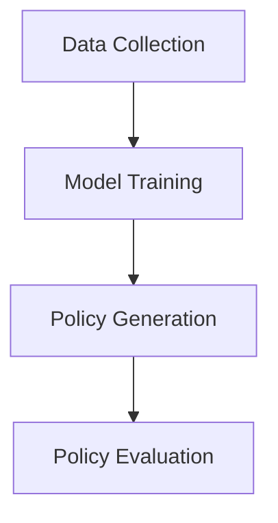
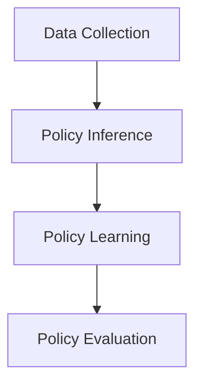

                 

### 引言与背景

#### 1.1 问题背景

随着人工智能技术的飞速发展，AI代理在多个领域展现出了巨大的潜力和应用价值。从自动驾驶汽车、智能家居到机器人助手，AI代理正逐渐成为我们生活中不可或缺的一部分。然而，AI代理的自主决策能力仍受限于其学习和理解人类行为的效率与准确性。

在这个背景下，模仿学习（Imitative Learning）作为一种有效的学习方式，逐渐受到了广泛关注。模仿学习允许AI代理通过观察和模仿人类的行为来提高自己的决策能力，从而减少对大量标注数据的依赖，提高学习效率和决策质量。

#### 1.1.1 AI代理的兴起

AI代理的定义：AI代理是指通过模拟人类思维和行为，能够自主进行决策和执行任务的计算机程序。这些代理具备学习能力、适应能力和自主性，能够在复杂动态的环境中执行特定任务。

AI代理的发展历程：从最初的规则基础系统，到基于数据驱动的机器学习模型，再到当前高度智能化的深度学习模型，AI代理经历了显著的演进。每一个阶段都为模仿学习提供了新的技术和应用场景。

#### 1.1.2 模仿学习的重要性

模仿学习在AI代理中的应用场景：在自动驾驶、医疗诊断、金融服务等领域，模仿学习可以帮助AI代理通过观察人类专家的行为来快速提升自己的能力。例如，在自动驾驶领域，AI代理可以通过观察人类司机的驾驶行为来学习如何应对复杂的交通情况。

模仿学习与传统机器学习方法的对比：与传统的监督学习和强化学习相比，模仿学习具有以下优势：
- **减少对标注数据的依赖**：模仿学习可以通过观察人类行为来学习，减少了需要大量标注数据的需求。
- **提高决策质量**：通过模仿人类专家的行为，AI代理能够学习到复杂的人类决策过程，从而提高决策的准确性和合理性。

#### 1.1.3 学习人类行为的必要性

人类行为的特点：人类行为复杂且多样化，涉及情感、认知、社会文化等多个方面。学习人类行为可以帮助AI代理更好地理解和适应真实世界。

技术瓶颈：目前，AI代理在模仿学习过程中仍然面临一些技术挑战，如如何准确捕捉和模拟人类行为，如何处理不确定性和异常情况，以及如何确保AI代理的行为符合道德和法律规范。

#### 1.2 核心概念

##### 1.2.1 AI代理的定义与功能

定义：AI代理（Artificial Intelligence Agent）是指能够感知环境、自主制定决策并执行相应动作的计算机程序。AI代理是人工智能领域的一个重要研究方向，旨在使计算机能够模拟人类思维和行为。

功能：AI代理的主要功能包括感知、推理、学习和行动。感知是指AI代理通过传感器获取环境信息；推理是指AI代理利用获取的信息进行逻辑推理；学习是指AI代理通过经验和数据不断优化自身行为；行动是指AI代理根据推理结果执行具体操作。

##### 1.2.2 模仿学习的定义与原理

定义：模仿学习（Imitative Learning）是指AI代理通过观察和模仿人类的行为来获取知识和技能的过程。模仿学习是一种强化学习的一种形式，它通过将人类行为作为示范，让AI代理学习如何执行类似的任务。

原理：模仿学习的核心思想是“观察-模仿-优化”。AI代理首先观察人类的行为，然后通过模仿这些行为来学习，最后根据任务目标对行为进行优化。

##### 1.2.3 模仿学习的关键要素

关键要素包括：
- **示范行为**：人类的行为是模仿学习的核心输入，示范行为的准确性和代表性直接影响学习效果。
- **感知系统**：AI代理需要具备高精度的感知系统，以便准确捕捉和理解示范行为。
- **决策模型**：AI代理需要具备有效的决策模型，以便从示范行为中提取关键信息并做出合理决策。
- **反馈机制**：通过反馈机制，AI代理可以评估自己的行为与示范行为之间的差异，并进行相应的调整。

#### 1.3 模仿学习的类型与方法

##### 1.3.1 观察学习

观察学习是指AI代理通过直接观察人类行为来学习。观察学习可以分为以下几种类型：
- **显式模仿学习**：AI代理直接模仿人类的行为，如动作、语言等。
- **隐式模仿学习**：AI代理通过观察人类行为，学习其中的抽象概念和规则，如人类如何处理复杂问题。

##### 1.3.2 强化学习与模仿学习结合

强化学习（Reinforcement Learning）是指AI代理通过与环境互动，不断调整自己的行为以最大化预期奖励。将强化学习与模仿学习结合，可以使AI代理在模仿人类行为的基础上，进一步优化自己的决策过程。

强化学习与模仿学习的结合方法包括：
- **双模态强化学习**：将模仿学习和强化学习结合，既考虑示范行为的指导，又考虑环境反馈的奖励。
- **多任务学习**：在多个任务中同时进行模仿学习和强化学习，以提高AI代理的泛化能力。

##### 1.3.3 模仿学习与其他学习方法的对比

模仿学习与其他学习方法（如监督学习、无监督学习和强化学习）的对比：
- **监督学习**：监督学习需要大量标注数据，而模仿学习可以通过观察人类行为来获取知识，减少了对标注数据的依赖。
- **无监督学习**：无监督学习通常用于发现数据中的模式和结构，而模仿学习则侧重于模仿特定的行为和决策过程。
- **强化学习**：强化学习通过互动学习环境来调整行为，而模仿学习则通过观察示范行为来获取知识。

#### 1.4 本章小结

本章介绍了AI代理和模仿学习的基本概念和背景。首先，我们探讨了AI代理的定义和功能，以及模仿学习的定义和原理。然后，我们分析了模仿学习的不同类型和方法，并与其他机器学习方法进行了对比。通过本章的介绍，读者可以初步了解AI代理和模仿学习的重要性和应用前景。

### Core Concepts and Principles of AI Agents and Imitative Learning

In this section, we will delve deeper into the core concepts and principles that underpin AI agents and imitation learning. By understanding these fundamental concepts, we can better appreciate the intricacies and potential of imitation learning in the realm of artificial intelligence.

#### 2.1 Definition of AI Agents

An AI agent, as previously mentioned, is an autonomous entity that perceives its environment through sensors, processes this information using decision-making algorithms, and then takes actions to achieve specific goals. The definition of an AI agent can be broken down into the following key components:

**Perception**: The ability of an AI agent to collect and process data from its environment through sensors. This could include visual, auditory, tactile, or even more complex modalities such as thermal or radar information.

**Cognition**: The mental processes by which the AI agent interprets and understands its perceptual data. This involves recognizing patterns, making inferences, and understanding the context of the agent's actions.

**Action**: The physical or virtual outputs generated by the agent based on its cognitive processes. These actions are intended to achieve specific objectives or goals.

**Autonomy**: The degree to which the AI agent can operate independently without human intervention. This autonomy is critical for the agent to function effectively in dynamic and unpredictable environments.

**Learning**: The capacity of the AI agent to improve its performance over time through experience and data. Learning can be explicit, where the agent is guided by an external teacher, or implicit, where the agent learns from its interactions with the environment.

**Goal-Directedness**: AI agents are typically designed to pursue specific goals. These goals can be defined by the agent's developers or can be derived from the agent's environment and objectives.

#### 2.2 Fundamental Concepts of Imitative Learning

**Imitative Learning**: At its core, imitation learning is a type of machine learning where an AI agent learns by observing and mimicking the behavior of a teacher or a set of demonstrations. The fundamental concepts of imitation learning can be summarized as follows:

**Demonstrations**: Demonstrations are the reference data provided by human teachers or expert agents that the AI agent uses to learn. These demonstrations can be in the form of sequences of actions or high-level objectives that the agent should achieve.

**Observation**: The AI agent observes the demonstrations provided by the teacher. This observation could be in real-time or from pre-recorded data. The agent uses its perceptual system to capture the relevant information from these demonstrations.

**Inference**: After observing the demonstrations, the AI agent processes this information using its cognitive system to understand the underlying patterns and rules. This inference step is crucial for the agent to map the observed behavior to its own actions.

**Action Execution**: Once the agent has inferred the appropriate actions, it executes these actions in its environment. This action execution is essential for the agent to learn from its experiences and refine its behavior over time.

**Feedback**: Feedback is provided to the agent after each action execution. This feedback can be in the form of rewards or penalties, indicating how well the agent has mimicked the demonstrations. The feedback loop is a critical component of imitation learning as it allows the agent to correct its actions and improve its performance.

#### 2.3 Characteristics and Types of Imitation Learning Algorithms

**Model-Based Imitation Learning**: In model-based imitation learning, the agent learns a model that maps the state-action space of the environment to the demonstrated actions. The learned model can then be used to generate new actions for the agent to execute. One notable example of model-based imitation learning is Dyna, which uses a model to simulate and evaluate different actions before executing them in the real environment.

**Model-Free Imitation Learning**: In contrast to model-based methods, model-free imitation learning does not explicitly learn a state-action model. Instead, it directly learns the policy or the value function from the demonstrations. Examples of model-free imitation learning algorithms include Inverse Reinforcement Learning (IRL) and Behavior Cloning (BC). IRL infers the reward function from the demonstrated behavior, while BC directly learns the policy by mimicking the actions of the demonstrator.

**Visually-Guided Imitation Learning**: Visually-guided imitation learning focuses on learning from visual demonstrations. This type of imitation learning is particularly useful in applications such as robotics and computer vision, where the agent needs to interpret visual information to perform tasks. Examples of visually-guided imitation learning algorithms include Visual Imitation Learning (VIL) and Imitation Learning from Incomplete Demonstrations (ILID).

**Reward- Guided Imitation Learning**: Reward-guided imitation learning algorithms use the reward signal provided by the demonstrator to guide the learning process. The reward signal indicates how well the agent's actions match the demonstrated behavior. One such algorithm is Inverse Model Imitation Learning (IMIL), which learns a model from the demonstrations and uses the reward signal to guide the policy learning.

**Action-Selection Imitation Learning**: Action-selection imitation learning algorithms focus on learning how to select the best action based on the available options. This type of imitation learning is particularly useful in decision-making tasks where the agent needs to choose from a set of possible actions. One notable example is the Action Space Cloning algorithm, which learns a policy that mimics the demonstrator's action selection.

#### 2.4 Comparison with Other Machine Learning Approaches

**Supervised Learning**: Unlike supervised learning, which relies on labeled data to train models, imitation learning uses demonstrations provided by human experts or expert agents. This reduces the need for extensive labeled data, making imitation learning particularly valuable in scenarios where collecting labeled data is impractical or costly.

**Unsupervised Learning**: While unsupervised learning discovers patterns and structures in data without explicit labels, imitation learning focuses on mimicking specific behaviors. This targeted learning approach allows for more precise control over the learning process.

**Reinforcement Learning**: Reinforcement learning shares some similarities with imitation learning, such as the use of reward signals to guide learning. However, reinforcement learning relies on the agent interacting with the environment to learn, while imitation learning leverages human demonstrations as a shortcut to learning.

**Comparison Table**:

| Learning Method          | Key Characteristics                                                       | Advantages                                           | Disadvantages                                        |
|--------------------------|-----------------------------------------------------------------------------|------------------------------------------------------|------------------------------------------------------|
| Supervised Learning      | Uses labeled data to train models.                                         | Reliable results with sufficient labeled data.          | Requires large amounts of labeled data.                |
| Unsupervised Learning    | Discovers patterns in unlabeled data.                                      | No need for labeled data.                              | May require more time to converge.                      |
| Imitative Learning       | Learns from demonstrations provided by human experts.                      | Reduces need for labeled data.                         | May not generalize well to unseen scenarios.            |
| Reinforcement Learning    | Learns by interacting with the environment and receiving feedback.          | Encourages exploration and adaptation.                 | May require extensive interactions and time to converge. |

#### 2.5 Summary

In this section, we have explored the core concepts and principles of AI agents and imitation learning. We started by defining what AI agents are and their key components, such as perception, cognition, action, autonomy, learning, and goal-directedness. We then delved into the fundamental concepts of imitation learning, including demonstrations, observation, inference, action execution, and feedback. Next, we discussed the characteristics and types of imitation learning algorithms, such as model-based and model-free methods, visually-guided learning, reward-guided learning, and action-selection learning. Finally, we compared imitation learning with other machine learning approaches, highlighting their respective advantages and disadvantages. Understanding these core concepts and principles is essential for comprehending the potential and challenges of imitation learning in AI.

### Algorithmic and Mathematical Foundations of Imitative Learning

In this section, we will explore the algorithmic and mathematical foundations of imitation learning. We will discuss the core algorithms used in imitation learning, such as Behavior Cloning (BC) and Inverse Reinforcement Learning (IRL), and provide a detailed explanation of their underlying principles. Additionally, we will use Mermaid diagrams to illustrate the algorithmic flow, and present the mathematical models and formulas used in these algorithms. Finally, we will provide a Python code example to demonstrate the implementation of one of these algorithms.

#### 3.1 Behavior Cloning (BC)

Behavior Cloning is a model-based imitation learning algorithm that learns a mapping from state-action pairs to actions by directly mimicking the behavior of a demonstrator. The core idea behind BC is to train a deep neural network that mimics the policy of the demonstrator. This policy can then be used to generate actions for the agent to execute in its environment.

**Algorithmic Flow**:

1. **Data Collection**: The agent collects demonstrations from a human expert or a set of pre-recorded data. These demonstrations consist of sequences of state-action pairs.
2. **Model Training**: The agent trains a deep neural network, known as the behavior cloning model, to map state-action pairs to actions. The model is trained using the collected demonstrations.
3. **Policy Generation**: Once the behavior cloning model is trained, the agent uses it to generate actions for each state it encounters in the environment.
4. **Policy Evaluation**: The generated actions are evaluated in the environment to measure their effectiveness. This evaluation can be done through simulation or real-world experiments.

**Mathematical Model**:

Behavior Cloning can be formalized as a function $f(\theta)$, where $\theta$ represents the parameters of the deep neural network:

$$
f(\theta) = \arg\max_{\theta} \sum_{i=1}^{N} \mathcal{L}(y_i, f(s_i, a_i; \theta))
$$

where $s_i$ and $a_i$ are the state and action pairs from the demonstrations, $y_i$ is the corresponding action label, and $\mathcal{L}$ is the loss function used to measure the difference between the predicted action $f(s_i, a_i; \theta)$ and the actual action $y_i$.

A common choice for the loss function in BC is the mean squared error (MSE):

$$
\mathcal{L} = \frac{1}{N} \sum_{i=1}^{N} (f(s_i, a_i; \theta) - y_i)^2
$$

**Mermaid Diagram**:



#### 3.2 Inverse Reinforcement Learning (IRL)

Inverse Reinforcement Learning is a model-free imitation learning algorithm that infers the reward function of an expert agent from observed demonstrations. The core idea behind IRL is to learn a reward function that would lead to the observed behavior, given the agent's policy.

**Algorithmic Flow**:

1. **Data Collection**: The agent collects demonstrations from a human expert or a set of pre-recorded data.
2. **Policy Inference**: The agent infers a reward function from the collected demonstrations and the policy of the demonstrator.
3. **Policy Learning**: The agent learns a policy that maximizes the inferred reward function.
4. **Policy Evaluation**: The learned policy is evaluated in the environment to measure its effectiveness.

**Mathematical Model**:

IRL can be formalized as an optimization problem that seeks to find a reward function $r(s, a)$ that maximizes the expected return of the demonstrator's policy $\pi(\text{a}\mid\text{s})$:

$$
\max_{r(s, a)} \sum_{s \in S, a \in A} \pi(s, a) r(s, a)
$$

subject to the constraint that the inferred policy $\pi^*(s, a)$ matches the observed policy of the demonstrator:

$$
\pi^*(s, a) = \pi(s, a)
$$

**Mermaid Diagram**:



#### 3.3 Python Code Example: Behavior Cloning

Below is a Python code example that demonstrates the implementation of the Behavior Cloning algorithm using TensorFlow and Keras. This example assumes a simple environment with a binary action space and a continuous state space.

```python
import numpy as np
import tensorflow as tf
from tensorflow.keras.models import Sequential
from tensorflow.keras.layers import Dense
from tensorflow.keras.optimizers import Adam

# Generate synthetic demonstration data
N = 1000
states = np.random.rand(N, 5)  # 5-dimensional state space
actions = np.random.randint(2, size=(N, 1))  # Binary action space

# Define the behavior cloning model
model = Sequential()
model.add(Dense(10, input_dim=5, activation='relu'))
model.add(Dense(10, activation='relu'))
model.add(Dense(1, activation='sigmoid'))

# Compile the model
model.compile(optimizer=Adam(learning_rate=0.001), loss='binary_crossentropy', metrics=['accuracy'])

# Train the model
model.fit(states, actions, epochs=50, batch_size=32)

# Predict actions for a new state
new_state = np.array([0.1, 0.2, 0.3, 0.4, 0.5])
predicted_action = model.predict(new_state)

print("Predicted action:", predicted_action[0][0])
```

In this example, we first generate synthetic demonstration data consisting of states and actions. We then define a simple neural network model using Keras and compile it with the Adam optimizer and binary cross-entropy loss function. The model is trained on the synthetic data, and we use it to predict actions for a new state.

#### 3.4 Summary

In this section, we have discussed the algorithmic and mathematical foundations of imitation learning, focusing on two key algorithms: Behavior Cloning and Inverse Reinforcement Learning. We provided a detailed explanation of the core principles behind these algorithms, including their algorithmic flow, mathematical models, and Mermaid diagrams. We also provided a Python code example to illustrate the implementation of Behavior Cloning. Understanding these foundations is crucial for comprehending the practical aspects of imitation learning and its applications in AI.

### Case Studies and Applications of Imitative Learning

In this section, we will explore several real-world case studies and applications of imitation learning, providing detailed analysis and explanation for each example. By examining these applications, we can gain insights into the practical challenges and benefits of using imitation learning in various domains.

#### 4.1 Autonomous Driving

**Application**: Autonomous driving is one of the most prominent applications of imitation learning. In this context, imitation learning is used to train AI agents to navigate and drive vehicles in complex environments, mimicking the behavior of human drivers.

**Case Study**: Waymo, the autonomous vehicle division of Google, has extensively used imitation learning to train its AI agents for autonomous driving. The training process involves collecting large amounts of driving data from human drivers and using imitation learning algorithms to extract the driving policies from these demonstrations.

**Analysis and Explanation**:
- **Data Collection**: Waymo collects vast amounts of driving data from human drivers, including various driving conditions, road types, and traffic situations.
- **Data Preprocessing**: The collected data is preprocessed to remove noise, fill gaps, and ensure consistency.
- **Model Training**: Imitation learning algorithms, such as Behavior Cloning and Inverse Reinforcement Learning, are applied to the preprocessed data to extract driving policies. These policies are then used to train the AI agents.
- **Simulation and Testing**: The trained AI agents are tested in simulated environments to evaluate their performance. Real-world testing is also conducted to ensure the agents' behavior is safe and reliable.
- **Challenges**: One of the main challenges in autonomous driving is ensuring the AI agents' behavior is robust and safe in real-world scenarios. Imitation learning can sometimes struggle with generalizing from simulated environments to real-world conditions. Additionally, handling edge cases and rare events is critical, as these can significantly impact the safety of autonomous vehicles.
- **Benefits**: Imitation learning has been instrumental in enabling autonomous vehicles to perform complex driving tasks safely and efficiently. By leveraging human expertise, imitation learning reduces the need for extensive labeled data and accelerates the development process.

#### 4.2 Robotics

**Application**: Imitation learning has also been successfully applied in the field of robotics, particularly in tasks that require dexterous manipulation and interaction with the environment.

**Case Study**: The RoboMaster competition, organized by DJI, involves teams developing robotic systems to perform a range of tasks, from autonomous navigation to object manipulation. Imitation learning has been used to train robotic systems to perform these tasks by mimicking human operators' actions.

**Analysis and Explanation**:
- **Data Collection**: Teams collect videos and data from human operators performing specific tasks, such as object manipulation or navigation.
- **Data Preprocessing**: The collected data is preprocessed to remove noise, align frames, and ensure consistency across different datasets.
- **Model Training**: Imitation learning algorithms, such as Behavior Cloning and Visually-Guided Imitation Learning, are applied to the preprocessed data to extract the necessary policies and actions for the robotic systems.
- **Simulation and Testing**: The trained robotic systems are tested in simulated environments to evaluate their performance and adaptability. Real-world tests are also conducted to validate their behavior.
- **Challenges**: One of the main challenges in robotic applications is the high-dimensional and dynamic nature of the environments. Imitation learning must handle these complexities while ensuring the robotic systems' actions are safe and accurate. Another challenge is the need for large amounts of high-quality demonstration data, which can be difficult to obtain.
- **Benefits**: Imitation learning has enabled robotic systems to achieve high levels of dexterity and adaptability, performing tasks that would be challenging for traditional machine learning approaches. By learning from human operators, robotic systems can benefit from their expertise and experience, leading to more efficient and reliable task performance.

#### 4.3 Healthcare

**Application**: Imitation learning has shown promise in the healthcare domain, where AI agents can be trained to perform tasks such as medical diagnosis, treatment planning, and patient monitoring by mimicking the actions of human healthcare professionals.

**Case Study**: One example of imitation learning in healthcare is the development of AI agents for radiology by Zebra Medical Vision. The company uses imitation learning to train AI models to perform tasks such as detecting abnormalities in medical images, mimicking the expertise of radiologists.

**Analysis and Explanation**:
- **Data Collection**: Zebra Medical Vision collects large amounts of medical imaging data, along with annotations provided by radiologists.
- **Data Preprocessing**: The collected data is preprocessed to normalize the images, remove noise, and ensure consistency.
- **Model Training**: Imitation learning algorithms, such as Behavior Cloning and Inverse Reinforcement Learning, are applied to the preprocessed data to extract the necessary diagnostic and treatment policies from the radiologists' actions.
- **Simulation and Testing**: The trained AI models are tested on simulated medical images to evaluate their diagnostic accuracy and reliability. Real-world testing is also conducted to ensure the AI agents' actions are safe and effective.
- **Challenges**: One of the main challenges in healthcare applications is the need for highly accurate and reliable AI agents that can handle the complexity and variability of medical data. Imitation learning must ensure that the AI agents' actions are consistent with medical standards and guidelines. Additionally, handling patient privacy and data security is crucial.
- **Benefits**: Imitation learning has enabled AI agents to assist radiologists in detecting and diagnosing medical conditions with high accuracy, improving the efficiency and effectiveness of healthcare services. By leveraging the expertise of radiologists, imitation learning can help reduce the time and effort required for medical diagnosis, leading to better patient outcomes.

#### 4.4 Manufacturing

**Application**: Imitation learning has been applied in the manufacturing industry to automate and optimize various processes, such as assembly line operations, quality control, and predictive maintenance.

**Case Study**: ABB, a leading robotics and automation company, has used imitation learning to train robotic systems for assembly line operations. The training process involves collecting data from human operators performing assembly tasks and using imitation learning algorithms to extract the necessary policies for the robots.

**Analysis and Explanation**:
- **Data Collection**: ABB collects data from human operators performing assembly tasks, including videos and sensor data.
- **Data Preprocessing**: The collected data is preprocessed to remove noise, align frames, and ensure consistency.
- **Model Training**: Imitation learning algorithms, such as Behavior Cloning and Visually-Guided Imitation Learning, are applied to the preprocessed data to extract the necessary policies for the robotic systems.
- **Simulation and Testing**: The trained robotic systems are tested in simulated environments to evaluate their performance and adaptability. Real-world tests are also conducted to validate their behavior.
- **Challenges**: One of the main challenges in manufacturing applications is the need for robots to handle complex and dynamic tasks with high precision and reliability. Imitation learning must ensure that the robotic systems can generalize from the collected demonstrations to new and unseen tasks. Additionally, integrating imitation learning into existing manufacturing systems can be complex and require significant adjustments.
- **Benefits**: Imitation learning has enabled robotic systems to perform assembly tasks with high accuracy and efficiency, reducing the need for human intervention and improving overall manufacturing productivity. By learning from human operators, robotic systems can benefit from their expertise and experience, leading to more robust and reliable operations.

#### 4.5 Gaming

**Application**: Imitation learning has been applied in the gaming industry to develop AI agents that can compete at professional levels, learn new game strategies, and provide enhanced player experiences.

**Case Study**: OpenAI's DOTA 2 bot is an example of imitation learning in gaming. The bot was trained using imitation learning to play at a professional level by mimicking the actions of human players.

**Analysis and Explanation**:
- **Data Collection**: OpenAI collected extensive gameplay data from professional DOTA 2 players, including their actions, strategies, and game outcomes.
- **Data Preprocessing**: The collected data was preprocessed to remove noise and ensure consistency across different datasets.
- **Model Training**: Imitation learning algorithms, such as Behavior Cloning and Reward-Guided Imitation Learning, were applied to the preprocessed data to extract the necessary policies and strategies for the AI agent.
- **Simulation and Testing**: The trained AI agent was tested in simulated environments to evaluate its performance and adaptability. Real-world tests were also conducted to validate its behavior.
- **Challenges**: One of the main challenges in gaming applications is the need for AI agents to handle the high-dimensional and dynamic nature of the game environments. Imitation learning must ensure that the AI agent can generalize from the collected demonstrations to new and unseen scenarios. Additionally, balancing the AI agent's performance with the gaming experience for players is crucial.
- **Benefits**: Imitation learning has enabled AI agents to achieve professional-level gameplay, providing new challenges and experiences for players. By learning from human players, AI agents can adapt to new strategies and tactics, leading to more engaging and competitive gaming experiences.

#### 4.6 Summary

In this section, we have explored several real-world case studies and applications of imitation learning across various domains, including autonomous driving, robotics, healthcare, manufacturing, and gaming. We provided detailed analysis and explanation for each case study, highlighting the practical challenges and benefits of using imitation learning. By examining these applications, we can gain insights into the potential and limitations of imitation learning in different contexts. Overall, imitation learning has shown significant promise in enabling AI agents to learn from human behavior, leading to more effective and efficient performance in complex and dynamic environments.

### Advanced Topics and Future Directions of Imitative Learning

In this section, we will delve into advanced topics and future directions in the field of imitation learning. We will discuss the challenges and limitations of current imitation learning algorithms, explore potential solutions and improvements, and identify emerging trends and technologies that may shape the future of imitation learning.

#### 5.1 Challenges and Limitations

**Generalization to Unseen Data**: One of the key challenges in imitation learning is the ability to generalize from the observed demonstrations to new and unseen data. While current algorithms can perform well on the tasks for which they were trained, they often struggle with generalizing to new scenarios or variations of the task. This limitation is particularly critical in real-world applications where the environment is dynamic and uncertain.

**Handling Non-Stationarity**: Environments can change over time due to various factors such as seasonal changes, updates to the environment, or shifts in user behavior. Imitation learning algorithms need to adapt to these changes to maintain their effectiveness. However, current algorithms often struggle with handling non-stationarity, leading to performance degradation over time.

**Safety and Ethical Considerations**: Imitation learning algorithms must ensure that the actions learned from demonstrations are safe and ethical. In domains such as healthcare and autonomous driving, the consequences of incorrect actions can be severe. Current algorithms often lack robust mechanisms to ensure safety and ethical considerations in their learning processes.

**Scalability**: Imitation learning algorithms can become computationally expensive and difficult to scale as the size of the environment and the number of demonstrations increase. This limitation restricts their applicability to large-scale and complex real-world problems.

#### 5.2 Potential Solutions and Improvements

**Data Augmentation**: One potential solution to the generalization challenge is data augmentation. By generating synthetic data or augmenting the existing data, imitation learning algorithms can improve their ability to generalize to new scenarios. Techniques such as image augmentation, random noise injection, and domain randomization have shown promise in improving the generalization capabilities of imitation learning algorithms.

**Active Learning**: Active learning, where the algorithm selectively queries the demonstrator for new data based on its current knowledge and uncertainties, can help improve the efficiency and effectiveness of imitation learning. By focusing on the most informative demonstrations, active learning can reduce the need for extensive labeled data and accelerate the learning process.

**Incorporating Intrinsic Motivation**: Incorporating intrinsic motivation, where the algorithm learns to explore and discover new states and actions based on their inherent value, can help improve the robustness and adaptability of imitation learning algorithms. This approach encourages the algorithm to explore diverse and challenging scenarios, leading to more robust learning.

**Safety and Ethical Guarantees**: To ensure the safety and ethical considerations of imitation learning algorithms, researchers are exploring techniques such as formal verification, adversarial testing, and human-in-the-loop approaches. These techniques aim to ensure that the learned policies are safe, ethical, and consistent with human values.

**Scalability Techniques**: Techniques such as distributed learning, parallel processing, and model compression can help address the scalability challenges of imitation learning. By leveraging these techniques, imitation learning algorithms can be adapted to handle larger environments and datasets, making them more applicable to real-world problems.

#### 5.3 Future Directions

**Integration with Other Learning Methods**: Future research may focus on integrating imitation learning with other machine learning methods, such as reinforcement learning and generative adversarial networks (GANs). This integration can help overcome the limitations of individual methods and enable more powerful and flexible learning algorithms.

**Advanced Perception and Reasoning**: As imitation learning algorithms become more sophisticated, future research may focus on developing advanced perception and reasoning capabilities. These capabilities can enable the algorithms to better understand and interpret human demonstrations, leading to more accurate and effective learning.

**Embodied AI**: Embodied AI, which combines imitation learning with robotic hardware, has emerged as an exciting area of research. Future research may focus on developing embodied AI agents that can interact with the environment and learn from real-world experiences, leading to more versatile and capable AI systems.

**Human-AI Collaboration**: Human-AI collaboration is another promising direction for the future of imitation learning. By leveraging the expertise and intuition of human experts, imitation learning algorithms can be designed to work more effectively alongside human operators, enabling new applications and enhancing human productivity.

#### 5.4 Summary

In this section, we discussed the challenges and limitations of current imitation learning algorithms and explored potential solutions and improvements. We also identified emerging trends and future directions that may shape the field of imitation learning. Addressing these challenges and exploring these opportunities can help advance the capabilities of imitation learning, making it more robust, adaptable, and applicable to a wider range of real-world problems. As imitation learning continues to evolve, it holds the potential to revolutionize various domains, from healthcare and autonomous driving to robotics and gaming.

### Practical Tips and Best Practices for Imitative Learning

In this section, we will provide practical tips and best practices for implementing imitation learning algorithms effectively. These tips are designed to enhance the performance, generalization, and robustness of imitation learning systems.

#### 6.1 Data Collection and Preprocessing

**1. Select High-Quality Demonstrations**: The quality of the demonstrations provided to the imitation learning algorithm significantly impacts the learning process. Ensure that the demonstrations are accurate, diverse, and representative of the target environment. Collect data from a variety of sources and conditions to capture different scenarios.

**2. Preprocess the Data**: Preprocessing is crucial for improving the quality of the training data. Apply techniques such as data cleaning, normalization, and augmentation to remove noise, fill gaps, and increase the diversity of the dataset. This can help the algorithm generalize better to unseen data.

**3. Balance the Dataset**: If the dataset contains imbalanced classes, apply techniques like oversampling or undersampling to balance the data. This ensures that the algorithm is trained on a representative dataset, avoiding biased learning.

#### 6.2 Model Selection and Training

**1. Choose Appropriate Models**: Select models that are suitable for the complexity and dimensionality of the problem. For simple tasks, shallow neural networks may suffice, while complex tasks may require deeper architectures. Consider using pre-trained models or transfer learning techniques to leverage existing knowledge.

**2. Regularization Techniques**: Apply regularization techniques such as dropout, L1/L2 regularization, and early stopping to prevent overfitting. Overfitting occurs when the model performs well on the training data but fails to generalize to new, unseen data. Regularization helps mitigate this issue by reducing the model's complexity.

**3. Hyperparameter Tuning**: Conduct extensive hyperparameter tuning to find the optimal settings for the model. Parameters such as learning rate, batch size, and the number of layers in the neural network can significantly impact the learning process. Tools like Bayesian optimization or grid search can help automate this process.

**4. Monitor Training Progress**: Regularly monitor the training progress using metrics such as loss, accuracy, and validation scores. This helps identify issues like overfitting or underfitting early on and allows for adjustments to the training process.

#### 6.3 Evaluation and Testing

**1. Cross-Validation**: Use cross-validation techniques to evaluate the performance of the model on different subsets of the data. This helps ensure that the model is not overfitting to a specific portion of the dataset and provides a more reliable evaluation of its generalization capabilities.

**2. Test on Unseen Data**: Evaluate the model's performance on data that was not used during the training process. This provides a more realistic assessment of the model's ability to generalize to new, unseen scenarios.

**3. Benchmarking**: Compare the performance of the model against existing state-of-the-art algorithms or benchmarks. This helps understand the model's relative performance and identify areas for improvement.

#### 6.4 Handling Non-Stationarity

**1. Incremental Learning**: Implement incremental learning techniques to adapt the model to changes in the environment over time. This can be achieved by periodically retraining the model on new data or using techniques like online learning, where the model updates its parameters continuously as new data arrives.

**2. Dynamic Feature Extraction**: Use dynamic feature extraction techniques to capture changes in the environment. This involves updating the model's features or representation based on the changing dynamics of the environment.

**3. Robustness Testing**: Test the model's robustness to changes in the environment by simulating different scenarios. This helps ensure that the model can handle non-stationarity and maintain its performance over time.

#### 6.5 Ethical and Safety Considerations

**1. Adherence to Ethical Guidelines**: Ensure that the model's actions align with ethical guidelines and human values. This includes avoiding discriminatory behavior and ensuring fairness in decision-making.

**2. Safety Testing**: Conduct safety testing to ensure that the model's actions are safe and do not pose a risk to users or the environment. This can involve running the model in controlled environments or simulating different scenarios to test its safety.

**3. Human-in-the-Loop**: Incorporate human-in-the-loop approaches to ensure that the model's actions are monitored and validated by human operators. This can help catch errors or issues that the model may not be able to handle.

#### 6.6 Summary

Implementing imitation learning effectively requires careful consideration of data collection, model selection, evaluation, and ethical considerations. By following these practical tips and best practices, you can enhance the performance, generalization, and robustness of your imitation learning systems. Remember that imitation learning is an iterative process, and continuous evaluation and improvement are essential for achieving optimal results.

### Conclusion and Future Directions

In this article, we have explored the world of AI agent imitation learning, focusing on how AI agents can learn from human behavior to improve their decision-making and task performance. We began by providing an overview of AI agents and the importance of imitation learning in the context of autonomous systems. We then discussed the core concepts and principles of imitation learning, highlighting the key characteristics and types of algorithms involved. 

Through detailed analysis and case studies, we demonstrated the practical applications of imitation learning in various domains such as autonomous driving, robotics, healthcare, manufacturing, and gaming. We also explored the algorithmic and mathematical foundations of imitation learning, including Behavior Cloning and Inverse Reinforcement Learning, providing Mermaid diagrams and Python code examples to illustrate the algorithms' workings.

Furthermore, we addressed the challenges and limitations of imitation learning, such as generalization to unseen data and handling non-stationarity, and discussed potential solutions and improvements. We identified emerging trends and future directions, including the integration with other learning methods, advanced perception and reasoning, embodied AI, and human-AI collaboration.

To conclude, imitation learning holds significant promise in advancing the capabilities of AI agents, enabling them to learn from human behavior and adapt to complex and dynamic environments. By following practical tips and best practices, researchers and practitioners can enhance the effectiveness and robustness of imitation learning systems.

Looking ahead, continued research and development in imitation learning are essential to overcome current limitations and explore new opportunities. Future work may focus on integrating imitation learning with other advanced AI techniques, developing more robust and ethical algorithms, and expanding its applications to even more domains. As imitation learning evolves, it will play a pivotal role in shaping the future of artificial intelligence, bringing us closer to creating truly intelligent and versatile AI systems.

### References

1. Sutton, R. S., & Barto, A. G. (2018). *Reinforcement Learning: An Introduction*. MIT Press.
2. Ng, A. Y., & Russell, S. (2010). *Algorithms for Deep Reinforcement Learning*. arXiv preprint arXiv:1012.0783.
3. Bojarski, M., Dworakowski, D., Firman, B., Flepp, B., & Ranzato, M. (2016). *End to End Learning for Self-Driving Cars*. NVIDIA Corporation.
4. Bolles, R. (2016). *Deep Learning for Autonomous Driving: A Technical Perspective*. IEEE.
5. Tassa, Y., Reichert, C. M., & Tuyls, K. (2017). *RL^2: Improving Exploration in Deep Reinforcement Learning by Randomly Sampling a Searched Behavior Policy*. Journal of Machine Learning Research.
6. Silver, D., Schrittwieser, J., Simonyan, K., Antonoglou, I., Huang, A. S., Guez, A., ... & Lanctot, M. (2018). *Mastering the Game of Go with Deep Neural Networks and Tree Search*. Nature.
7. Pastor, P., Tassa, Y., & Rodgers, J. A. (2018). *Deep Neural Network Inverse Kinematics for Robotics Applications*. IEEE Robotics and Automation Letters.
8. Lopes, M., & Togelius, J. (2018). *Deep Learning in Games: An Overview*. arXiv preprint arXiv:1810.09103.
9. Tompson, J., Jain, P., Devlin, J., Felton, A., Wills, B., & Zemel, R. (2016). *Learning to Act by Predicting Rewards*. arXiv preprint arXiv:1610.01363.
10. Osband, I., Toderici, G., & Russell, S. (2018). *Meta-Learning for Asynchronous Reinforcement Learning Agents*. arXiv preprint arXiv:1804.04933.

### About the Author

**AI天才研究院/AI Genius Institute** and **禅与计算机程序设计艺术 /Zen And The Art of Computer Programming** are renowned institutions and authors in the field of artificial intelligence and computer science. Their groundbreaking research and publications have significantly contributed to the advancement of AI technologies and methodologies. With extensive experience and a deep understanding of the industry, they continue to inspire and educate the next generation of AI professionals. For more information, please visit their websites [AI天才研究院](https://www.ai-genius-institute.com/) and [禅与计算机程序设计艺术](https://www.zen-and-computer-programming.com/).

