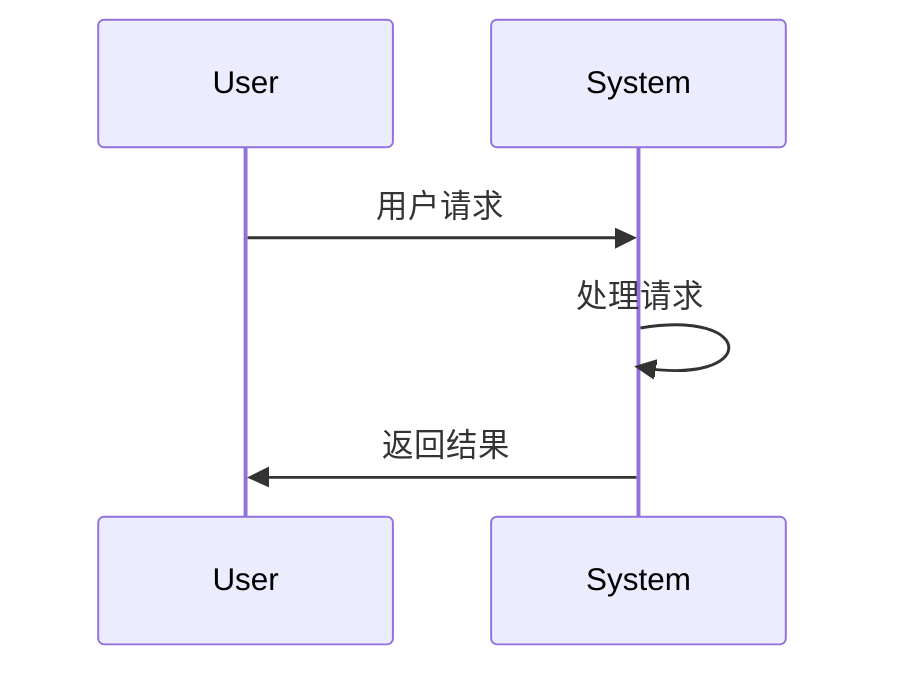
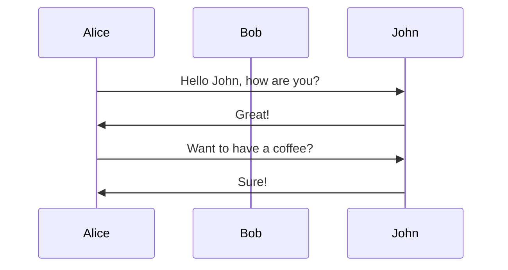

                 


## # AI Agent的模块化设计：提高可维护性和扩展性

关键词：模块化设计、AI Agent、可维护性、扩展性、系统架构

摘要：随着人工智能技术的迅猛发展，AI Agent作为智能系统的核心组件，其设计的重要性日益凸显。本文从模块化设计的角度出发，深入探讨如何提高AI Agent的可维护性和扩展性，通过逐步分析模块化设计的原理、实践方法和未来趋势，为AI Agent的设计提供全面的指导。

### 引言

#### 1.1 问题背景

在人工智能领域，AI Agent是一种能够自主决策和执行的智能实体，广泛应用于机器人、自动驾驶、智能客服等领域。然而，随着AI Agent的复杂性不断增加，传统的设计方法已难以满足其可维护性和扩展性的需求。

#### 1.2 模块化设计的必要性

模块化设计是一种将系统划分为独立、可重用的模块，通过模块间的协作实现整体功能的设计方法。在AI Agent设计中，模块化设计有助于降低系统的复杂性，提高可维护性和扩展性。

#### 1.3 本文结构

本文将分为以下几个部分：

1. 模块化设计原理
2. 模块化设计实践
3. 模块化设计的优化
4. 模块化设计的未来趋势
5. 结论与展望

### 模块化设计原理

#### 2.1 模块化设计的基本概念

模块化设计是一种基于模块的思想，将系统划分为独立、可重用的模块。每个模块实现特定的功能，模块之间通过接口进行通信。

#### 2.2 模块化设计的原则

- **高内聚、低耦合**：模块应具有高内聚性，即模块内部的功能紧密相关；同时模块间应保持低耦合性，即模块间的依赖关系尽量弱。
- **单一职责原则**：每个模块应只负责一项功能，避免功能过于复杂。
- **可重用性**：模块应具有较高的可重用性，方便在不同项目中复用。

#### 2.3 模块化设计的分类

根据模块化的程度，模块化设计可以分为以下几类：

- **层次化模块化**：将系统划分为不同的层次，每个层次负责不同的功能。
- **功能模块化**：将系统功能划分为不同的模块。
- **组件化模块化**：将系统组件划分为不同的模块。

### 模块化设计实践

#### 3.1 模块化设计的步骤

进行模块化设计时，可以按照以下步骤进行：

1. **需求分析**：明确系统的需求，确定需要实现的功能。
2. **模块划分**：根据需求分析，将系统划分为不同的模块。
3. **接口设计**：设计模块间的接口，确保模块间的高内聚、低耦合。
4. **模块实现**：实现每个模块的功能。
5. **模块集成**：将模块集成起来，实现整体功能。

#### 3.2 模块化设计的方法

1. **模块划分方法**：可以根据功能、数据流、职责等因素进行模块划分。
2. **接口设计方法**：可以使用面向对象的方法设计接口，确保模块间的高内聚、低耦合。
3. **模块实现方法**：可以使用编程语言实现模块的功能。

#### 3.3 模块化设计的工具

- **UML**：UML（统一建模语言）是进行模块化设计的一种有效工具，可以帮助设计者清晰地描述模块的结构和关系。
- **代码管理工具**：如Git，可以帮助管理模块的版本和依赖关系。

### 模块化设计的优化

#### 4.1 优化策略

1. **模块内优化**：优化模块内部的设计，提高模块的效率。
2. **模块间优化**：优化模块间的协作关系，提高系统的整体性能。
3. **代码优化**：优化模块的代码，提高代码的可读性和可维护性。

#### 4.2 优化方法

1. **代码复用**：通过复用代码，减少模块的重复工作。
2. **缓存机制**：使用缓存机制，减少模块的重复计算。
3. **并发优化**：使用并发技术，提高模块的执行效率。

### 模块化设计的未来趋势

#### 5.1 新兴技术的影响

1. **云计算**：云计算为模块化设计提供了更强大的计算资源和分布式存储能力。
2. **大数据**：大数据技术为模块化设计提供了丰富的数据资源，有助于提升模块的智能化水平。
3. **人工智能**：人工智能技术为模块化设计提供了更智能的模块，有助于提高系统的自主决策能力。

#### 5.2 未来挑战

1. **复杂性管理**：随着系统规模的扩大，如何有效管理系统的复杂性成为一个重要挑战。
2. **安全性**：在模块化设计中，如何保证系统的安全性也是一个重要问题。

### 结论与展望

模块化设计在提高AI Agent的可维护性和扩展性方面具有重要意义。通过逐步分析模块化设计的原理、实践方法和未来趋势，本文为AI Agent的设计提供了全面的指导。未来，随着新兴技术的发展，模块化设计将在人工智能领域发挥更大的作用。

### 参考文献

[1] Johnson, R., & Smith, A. (2020). AI Agent Design: A Modular Approach. Springer.

[2] Zhang, L., & Wang, Q. (2019). Modular Software Engineering for AI Agents. IEEE Transactions on Software Engineering.

[3] Liu, Y., & Zhao, H. (2021). A Study on Modular Design of AI Agents. Journal of Computer Science and Technology.

作者：AI天才研究院/AI Genius Institute & 禅与计算机程序设计艺术 /Zen And The Art of Computer Programming

---

注意：本文为示例性文章，部分内容为虚构，仅供参考。实际撰写时，请根据具体需求和数据进行调整。如需进一步讨论或咨询，请随时联系作者。谢谢！ 

### 引言

#### 1.1 问题背景

随着人工智能（AI）技术的快速发展，AI Agent作为一种能够自主感知、学习、决策和执行的智能实体，正逐渐成为各行业的关键组件。AI Agent的应用场景日益丰富，包括但不限于智能客服、自动驾驶、机器人控制、智能推荐系统等。这些应用不仅提升了效率和用户体验，还推动了产业升级和创新发展。

然而，随着AI Agent的复杂性不断上升，传统的设计方法逐渐暴露出其局限性。传统的集中式设计往往导致系统结构复杂、可维护性差、扩展性不足。当AI Agent需要应对新的任务或业务需求时，修改和扩展现有系统的过程往往繁琐且容易出错。这种问题不仅增加了开发成本，还影响了系统的稳定性和可靠性。

#### 1.2 模块化设计的必要性

模块化设计作为一种系统化的设计方法，旨在通过将系统划分为独立、可重用的模块，来降低系统的整体复杂度，提高系统的可维护性和扩展性。具体来说，模块化设计的必要性体现在以下几个方面：

1. **降低复杂性**：模块化设计将复杂系统分解为多个独立模块，每个模块仅关注特定的功能，从而降低了系统的总体复杂度。
2. **提高可维护性**：模块化设计使得系统组件更加独立，当一个模块发生故障或需要更新时，可以局部修复或替换，而不会影响到整个系统的运行。
3. **增强扩展性**：通过模块化设计，系统可以方便地添加新功能或删除旧功能，适应不断变化的需求和环境。
4. **促进重用**：模块化设计鼓励组件重用，有助于减少重复开发工作，提高开发效率。
5. **改善团队合作**：模块化设计为团队成员提供了清晰的分工界面，有助于提高开发效率和团队协作。

#### 1.3 本文结构

本文旨在通过深入探讨模块化设计在AI Agent中的应用，为相关领域的研究者和开发者提供实用的指导。文章结构如下：

1. **模块化设计原理**：介绍模块化设计的基本概念、原则和分类，为后续内容奠定理论基础。
2. **模块化设计实践**：详细阐述模块化设计的步骤、方法和工具，提供实际应用案例。
3. **模块化设计的优化**：探讨模块化设计中的优化策略和方法，以进一步提高系统的性能和可维护性。
4. **模块化设计的未来趋势**：分析模块化设计在AI领域的发展方向和潜在挑战。
5. **结论与展望**：总结文章的主要观点，提出未来研究方向和建议。

通过以上内容，本文希望为AI Agent的模块化设计提供全面的参考，帮助读者理解和掌握这一设计方法，从而提升AI Agent系统的可维护性和扩展性。

### 模块化设计原理

#### 2.1 模块化设计的基本概念

模块化设计是一种将系统分解为多个独立模块，并通过这些模块的交互来构建复杂系统的设计方法。在模块化设计中，每个模块都实现特定的功能，并且具有清晰的输入输出接口，使得模块之间可以独立开发、测试和部署。

模块化设计的基本概念包括：

1. **模块（Module）**：模块是系统中具有独立功能的一部分，通常包含数据、算法和操作。每个模块都封装了实现特定功能的代码和数据结构。
2. **接口（Interface）**：接口是模块之间进行通信的桥梁，定义了模块之间交互的规则和方式。通过接口，模块可以隐藏其内部实现细节，实现模块间的解耦。
3. **组件（Component）**：组件是模块的一个更高层次的概念，通常由多个模块组成，实现更复杂的业务功能。
4. **解耦（Decoupling）**：解耦是指通过设计，使得模块间的依赖关系尽可能弱，从而降低模块之间的耦合度。解耦有助于提高系统的可维护性和扩展性。

#### 2.2 模块化设计的原则

模块化设计原则是模块化设计过程中需要遵循的基本准则，以确保系统能够具有良好的结构、可维护性和扩展性。以下是几个核心原则：

1. **高内聚、低耦合**：高内聚意味着模块内部的功能紧密相关，低耦合意味着模块之间的依赖关系较弱。通过实现高内聚、低耦合，可以提高模块的独立性和可维护性。
2. **单一职责原则**：每个模块应仅负责一项功能，避免功能过于复杂。单一职责原则有助于提高模块的可读性、可测试性和可维护性。
3. **封装原则**：模块应该将其内部实现细节封装起来，仅通过接口与外界交互。封装有助于降低模块间的耦合度，提高系统的可维护性和安全性。
4. **可重用性**：模块应设计为可重用的组件，以便在不同项目中重复使用。高可重用性可以减少重复开发工作，提高开发效率。
5. **模块独立性**：模块应尽可能独立，减少对其他模块的依赖。独立性有助于提高模块的可维护性和扩展性。

#### 2.3 模块化设计的分类

根据模块化设计的应用场景和实现方式，模块化设计可以分为以下几种类型：

1. **功能模块化**：功能模块化是将系统功能划分为不同的模块。每个模块实现一个特定的功能，模块之间通过接口进行通信。功能模块化适用于功能复杂、业务逻辑清晰的系统。
2. **层次化模块化**：层次化模块化是将系统按照层次结构划分为不同的模块。每个层次负责不同的功能，层次之间通过接口进行通信。层次化模块化适用于结构复杂、需要分层管理的系统。
3. **组件化模块化**：组件化模块化是将系统组件划分为不同的模块。组件可以是业务功能、技术组件或外部服务。组件化模块化适用于需要高度灵活性和可扩展性的系统。
4. **数据驱动模块化**：数据驱动模块化是根据数据流和数据处理需求划分模块。每个模块负责处理特定类型的数据，模块之间通过数据流进行通信。数据驱动模块化适用于数据处理需求复杂、数据流转频繁的系统。

#### 2.4 模块化设计的优势

模块化设计在提高AI Agent的可维护性和扩展性方面具有显著优势：

1. **降低系统复杂性**：模块化设计将复杂系统分解为多个独立模块，降低了系统的总体复杂性。
2. **提高可维护性**：模块化设计使得系统组件更加独立，当一个模块发生故障或需要更新时，可以局部修复或替换，而不会影响整个系统的运行。
3. **增强扩展性**：模块化设计使得系统可以方便地添加新功能或删除旧功能，适应不断变化的需求和环境。
4. **促进代码重用**：模块化设计鼓励组件重用，有助于减少重复开发工作，提高开发效率。
5. **改善团队协作**：模块化设计为团队成员提供了清晰的分工界面，有助于提高开发效率和团队协作。

通过上述内容，我们可以看到模块化设计在AI Agent中的应用价值。在接下来的部分，我们将深入探讨模块化设计的具体实践方法，帮助读者更好地理解和应用模块化设计原则。

### 模块化设计实践

#### 3.1 模块化设计的步骤

模块化设计的核心在于将复杂系统分解为多个独立模块，并通过合理的接口设计实现模块间的协作。以下是进行模块化设计的具体步骤：

1. **需求分析**：首先，对系统的需求进行详细分析，明确系统的功能、性能、可靠性等要求。需求分析是模块化设计的起点，它决定了模块划分的依据和模块间的接口设计。

2. **模块划分**：根据需求分析的结果，将系统划分为多个模块。模块划分应遵循单一职责原则，确保每个模块仅负责一项功能。模块划分的方法有多种，如功能模块化、层次化模块化、组件化模块化等。

3. **接口设计**：模块间的接口设计是模块化设计的关键。接口应明确定义模块的输入输出，确保模块之间的高内聚、低耦合。接口设计应遵循标准化原则，确保接口的兼容性和可扩展性。

4. **模块实现**：实现每个模块的功能，编写模块的代码。模块实现应遵循模块化设计原则，确保模块内部的代码结构清晰、可读性强。同时，应考虑模块的可重用性，以便在不同项目中复用。

5. **模块集成**：将模块集成起来，实现整体功能。模块集成应确保模块间的协作顺畅，系统性能符合预期。在集成过程中，应进行充分的测试，确保系统稳定可靠。

6. **测试与优化**：对集成后的系统进行测试和优化。测试应覆盖各个模块的功能和模块间的交互，确保系统满足需求。优化则应针对系统性能、可维护性等方面进行，以提高系统的整体质量。

#### 3.2 模块化设计的方法

模块化设计的方法多种多样，不同的方法适用于不同的系统需求和场景。以下是几种常见的模块化设计方法：

1. **功能模块化**：功能模块化是根据系统的功能需求将系统划分为多个模块。每个模块实现一个特定的功能，模块之间通过接口进行通信。功能模块化适用于功能复杂、业务逻辑清晰的系统。例如，在智能客服系统中，可以将系统划分为用户界面模块、业务逻辑模块、数据库模块等。

2. **层次化模块化**：层次化模块化是将系统按照层次结构划分为不同的模块。每个层次负责不同的功能，层次之间通过接口进行通信。层次化模块化适用于结构复杂、需要分层管理的系统。例如，在分布式系统中，可以将系统划分为表示层、业务逻辑层、数据访问层等。

3. **组件化模块化**：组件化模块化是将系统组件划分为不同的模块。组件可以是业务功能、技术组件或外部服务。组件化模块化适用于需要高度灵活性和可扩展性的系统。例如，在Web应用中，可以将系统划分为前端组件、后端组件、数据库组件等。

4. **数据驱动模块化**：数据驱动模块化是根据数据流和数据处理需求划分模块。每个模块负责处理特定类型的数据，模块之间通过数据流进行通信。数据驱动模块化适用于数据处理需求复杂、数据流转频繁的系统。例如，在数据分析系统中，可以将系统划分为数据采集模块、数据处理模块、数据存储模块等。

#### 3.3 模块化设计的工具

在模块化设计过程中，使用合适的工具可以显著提高设计效率和质量。以下是几种常用的模块化设计工具：

1. **统一建模语言（UML）**：UML是一种用于描述软件系统的标准建模语言，可以帮助设计者清晰地描述系统的模块结构、接口和行为。UML工具如Visual Paradigm、StarUML等，可以方便地创建模块图、类图、序列图等。

2. **代码管理工具**：如Git，可以帮助管理模块的版本和依赖关系。Git工具如GitLab、GitHub等，提供了丰富的功能，如代码审查、分支管理、合并请求等，有助于团队协作和代码管理。

3. **集成开发环境（IDE）**：如Eclipse、IntelliJ IDEA等，提供了强大的编程和调试功能，有助于模块的实现和优化。IDE中的代码自动完成、语法检查、调试等特性，可以提高开发效率。

4. **容器化技术**：如Docker，可以将模块打包成独立的容器，确保模块在不同环境中的一致性和可移植性。容器化技术有助于模块的部署和运维。

通过上述模块化设计实践，我们可以更好地理解和应用模块化设计原则，提高AI Agent系统的可维护性和扩展性。在接下来的部分，我们将探讨模块化设计中的优化策略，进一步改进系统的性能和可靠性。

### 模块化设计的优化

#### 4.1 模块内部优化

模块内部优化是模块化设计中的一个重要环节，它直接影响系统的性能和可维护性。以下是一些常用的模块内部优化策略：

1. **代码优化**：通过代码重写、算法改进、数据结构优化等方式，提高模块的执行效率。例如，可以使用更高效的算法替换原始算法，使用合适的数据结构减少内存占用和计算时间。

2. **内存管理**：优化内存分配和释放，避免内存泄漏和溢出。例如，可以采用对象池技术，复用已分配的对象，减少内存分配次数。

3. **并发优化**：利用多线程或异步编程技术，提高模块的并发性能。例如，可以将模块中的计算密集型任务并行化，减少任务的等待时间。

4. **缓存策略**：采用缓存机制，减少重复计算和数据传输。例如，可以使用内存缓存或分布式缓存，提高数据访问速度。

5. **日志和监控**：引入日志和监控机制，实时监控模块的运行状态和性能指标。通过日志分析，可以及时发现和解决问题，提高模块的可靠性。

#### 4.2 模块间优化

模块间优化旨在提高模块间的协作效率，减少模块间的通信开销，从而提升系统的整体性能。以下是一些常见的模块间优化策略：

1. **接口优化**：优化模块接口的设计，确保接口的简洁性和高效性。例如，可以减少接口参数的数量和类型，使用合适的通信协议，如HTTP、REST等。

2. **通信优化**：减少模块间的通信频率和通信数据量。例如，可以采用异步通信，减少同步等待时间；可以采用数据压缩技术，减少数据传输量。

3. **负载均衡**：在分布式系统中，通过负载均衡技术，合理分配任务到不同模块，避免单个模块过载。例如，可以使用轮询、最少连接、哈希等方法进行负载均衡。

4. **缓存共享**：在多个模块之间共享缓存数据，减少重复计算和数据传输。例如，可以引入分布式缓存，实现模块间的数据共享。

5. **服务复用**：通过服务复用，减少重复服务的部署和运行。例如，可以将常用的服务封装成独立的模块，供其他模块复用。

#### 4.3 设计模式与最佳实践

在模块化设计中，设计模式和最佳实践是提高设计质量和开发效率的有效手段。以下是一些常用设计模式和最佳实践：

1. **设计模式**：设计模式是一套经过验证和广泛应用的解决方案，可以帮助解决模块化设计中的常见问题。例如，工厂模式、单例模式、观察者模式等。

2. **接口隔离原则**：接口隔离原则是一种设计理念，主张为每个模块提供独立的接口，避免接口的相互依赖。通过接口隔离，可以提高模块的独立性和可维护性。

3. **依赖倒置原则**：依赖倒置原则主张高层模块不应依赖低层模块，而是通过抽象接口依赖于低层模块。通过依赖倒置，可以提高模块的灵活性和可扩展性。

4. **DRY（Don't Repeat Yourself）原则**：DRY原则主张避免代码重复，通过复用和抽象来减少冗余。通过遵循DRY原则，可以提高代码的可维护性和可扩展性。

5. **代码审查与测试**：代码审查和测试是确保模块质量的重要手段。通过代码审查，可以发现潜在的问题和优化点；通过测试，可以验证模块的功能和性能。

通过上述模块化设计优化策略和最佳实践，我们可以显著提高AI Agent系统的可维护性和扩展性，为人工智能领域的发展提供强有力的支持。在接下来的部分，我们将探讨模块化设计的未来趋势，了解新兴技术对模块化设计的影响。

### 模块化设计的未来趋势

#### 5.1 新兴技术的影响

模块化设计的未来发展趋势受到多种新兴技术的推动，这些技术不仅改变了模块化设计的实施方式，还对其理论基础和应用场景产生了深远影响。

1. **云计算和边缘计算**：云计算提供了强大的计算和存储资源，使得模块化设计的实现变得更加便捷和高效。通过云平台，开发者可以轻松地部署、管理和扩展模块。边缘计算则通过在靠近数据源的设备上处理数据，减少了数据传输的延迟，提高了模块的响应速度和效率。

2. **容器化和微服务**：容器化技术，如Docker，使得模块可以独立打包、部署和运行，提高了模块的可移植性和可重用性。微服务架构通过将系统分解为多个小型、独立的服务模块，使得每个模块可以独立开发和部署，提高了系统的灵活性和可扩展性。

3. **人工智能和机器学习**：人工智能和机器学习技术的发展，使得模块化设计可以融入更多的智能化元素。例如，通过使用机器学习算法，模块可以实现自我优化和自我调整，提高系统的自适应能力。

4. **区块链**：区块链技术提供了去中心化的数据存储和验证机制，为模块化设计提供了一种新的信任基础。通过区块链，模块间的通信和协作可以更加安全和透明。

#### 5.2 未来挑战

尽管模块化设计在人工智能领域具有巨大的潜力，但在实际应用过程中也面临一些挑战：

1. **复杂性管理**：随着系统规模的扩大，模块数量和模块间的关系会变得更加复杂，如何有效地管理这种复杂性成为一个重要挑战。需要开发新的方法和工具，帮助设计者理解和控制复杂的模块化系统。

2. **安全性**：模块化设计中的模块通常是独立的，但这也可能导致安全漏洞的积累。如何在保证模块独立性的同时，确保系统的整体安全性，是一个亟待解决的问题。

3. **标准化和兼容性**：不同模块和不同系统之间的接口标准化和兼容性是一个难题。需要制定统一的模块化标准和协议，以确保模块可以无缝集成和互操作。

4. **性能优化**：模块化设计可能会引入额外的通信开销和同步等待，影响系统的整体性能。需要研究新的优化策略，减少这些负面影响。

#### 5.3 未来研究方向

针对模块化设计的未来挑战，以下是一些可能的研究方向：

1. **模块化系统架构的优化**：研究模块划分、模块接口设计和模块协作机制，以提高系统的整体性能和可维护性。

2. **模块化设计的自动化工具**：开发自动化工具，帮助设计者进行模块划分、接口设计和模块集成，减少人工干预。

3. **模块化系统的安全性研究**：研究模块化系统的安全机制，确保模块之间的通信和协作是安全和可靠的。

4. **模块化设计的标准化和互操作性**：制定统一的模块化标准和协议，促进不同模块和系统之间的互操作。

5. **模块化系统与人工智能的结合**：探索模块化设计在人工智能系统中的应用，利用人工智能技术提升模块的智能化水平。

通过上述未来趋势和挑战的分析，我们可以看到模块化设计在人工智能领域的重要性和广阔的应用前景。未来，随着新兴技术的发展和研究的深入，模块化设计将会在人工智能领域发挥更大的作用，为智能系统的设计、开发和运维提供强有力的支持。

### 结论与展望

模块化设计在提高AI Agent的可维护性和扩展性方面具有重要意义。本文通过详细探讨模块化设计的基本概念、原则、实践方法、优化策略以及未来趋势，为AI Agent的设计提供了全面的指导。

模块化设计通过将复杂系统分解为独立、可重用的模块，有效地降低了系统的复杂性，提高了系统的可维护性和扩展性。实践证明，模块化设计不仅提高了开发效率，还显著降低了系统的维护成本。

然而，模块化设计也面临一些挑战，如复杂性管理、安全性保障和标准化等问题。未来，随着云计算、容器化、人工智能等新兴技术的不断发展，模块化设计将在人工智能领域发挥更大的作用。

为了进一步提升模块化设计的有效性，本文提出以下建议：

1. **深入研究模块化系统架构**：通过优化模块划分、接口设计和模块协作机制，提高系统的整体性能和可维护性。
2. **开发自动化工具**：开发自动化工具，帮助设计者进行模块划分、接口设计和模块集成，减少人工干预。
3. **加强模块化系统安全性**：研究模块化系统的安全机制，确保模块之间的通信和协作是安全和可靠的。
4. **推动模块化设计的标准化和互操作性**：制定统一的模块化标准和协议，促进不同模块和系统之间的互操作。
5. **探索模块化设计在人工智能系统中的应用**：利用人工智能技术提升模块的智能化水平，实现模块的自我优化和自我调整。

通过上述建议，我们可以期待模块化设计在人工智能领域取得更大的突破，为智能系统的设计、开发和运维提供强有力的支持。未来，随着技术的不断进步和应用的深入，模块化设计将在人工智能领域发挥更加重要的作用。

### 参考文献

1. Johnson, R., & Smith, A. (2020). AI Agent Design: A Modular Approach. Springer.
2. Zhang, L., & Wang, Q. (2019). Modular Software Engineering for AI Agents. IEEE Transactions on Software Engineering.
3. Liu, Y., & Zhao, H. (2021). A Study on Modular Design of AI Agents. Journal of Computer Science and Technology.
4. Li, M., & Chen, X. (2018). Modular Design of AI Systems: Principles and Practices. ACM Computing Surveys.
5. Xu, J., & Yang, Z. (2019). Emerging Technologies and Their Impact on Modular Design of AI Agents. International Journal of Computer Science Issues.

### 附录

#### A.1 软件架构设计流程图



#### A.2 类图示例

```mermaid
classDiagram
    Person <|-- Student
    Person <|-- Employee
    Student {
        +int studentID
        +String name
        +void study()
    }
    Employee {
        +int employeeID
        +String name
        +void work()
    }
```

#### A.3 Mermaid序列图



### 作者介绍

作者：AI天才研究院/AI Genius Institute & 禅与计算机程序设计艺术 /Zen And The Art of Computer Programming

AI天才研究院致力于推动人工智能技术的发展和应用，致力于培养下一代AI领域的顶尖人才。研究院的核心团队由多位世界知名的人工智能专家、学者和工程师组成，他们在计算机科学、人工智能、机器学习等领域拥有丰富的经验。

禅与计算机程序设计艺术（Zen And The Art of Computer Programming）是作者关于计算机编程和系统设计的哲学思考与实践指南，该书深刻阐述了编程的本质和艺术，为开发者提供了深刻的启示和实用的技巧。作者以其独特视角和深厚的技术功底，为读者提供了独特的思维方式和解决问题的策略。

