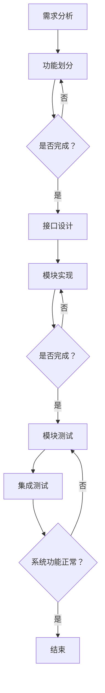
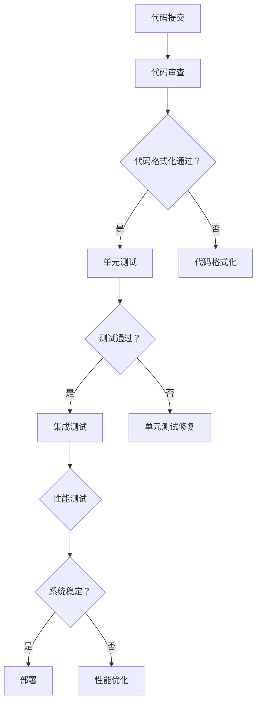
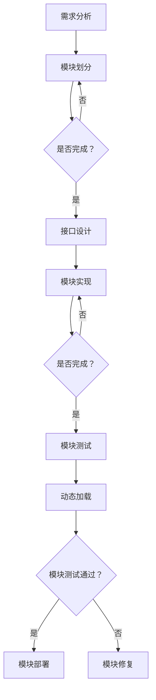

                 


## AI Agent的模块化设计：提高系统可维护性和扩展性

---

**关键词：** AI Agent，模块化设计，系统可维护性，扩展性，编程实践

**摘要：** 本技术博客文章深入探讨了AI Agent的模块化设计，旨在提升系统的可维护性和扩展性。文章首先介绍了AI Agent的概念和模块化设计的重要性，接着详细讲解了模块化设计的原理和实践方法。通过一个具体的案例研究，展示了模块化设计的实际应用和效果。文章最后讨论了模块化设计的未来发展趋势和面临的挑战。

---

### 引言

在人工智能（AI）技术飞速发展的今天，AI Agent已成为智能系统构建的核心组件。AI Agent是指能够感知环境、做出决策并采取行动的智能实体。随着AI应用的不断增多，AI Agent的复杂性也在逐渐增加。传统的集中式设计方法在面对复杂的任务和不断变化的需求时，往往表现出较低的灵活性和可维护性。因此，模块化设计成为了提高系统可维护性和扩展性的有效途径。

模块化设计是一种将系统分解为多个独立模块，并通过这些模块之间的协作实现整体功能的设计方法。模块化设计的核心思想是将系统的各个功能组件独立出来，使得每个模块都能独立开发、测试和维护。这种方法不仅可以提高系统的可维护性，还能为系统的扩展提供便利。

本文将围绕AI Agent的模块化设计进行深入探讨，旨在为读者提供一套实用的设计原则和实践方法。文章将分为以下几个部分：

1. **背景介绍与核心概念**：介绍AI Agent的概念，模块化设计的优势，以及本书的目的和读者对象。
2. **模块化设计原理**：详细讲解AI Agent模块化设计的原理，包括模块的分类与职责、模块的接口定义、模块的独立性与协作等。
3. **可维护性设计**：探讨如何通过设计模式和支持工具提高系统的可维护性。
4. **扩展性设计**：介绍如何设计具有良好扩展性的AI Agent系统。
5. **模块化设计实践**：通过一个具体的案例研究，展示模块化设计的实际应用。
6. **高级话题与未来展望**：讨论模块化设计的未来发展趋势和面临的挑战。

接下来，我们将逐步分析每一个部分，帮助读者深入了解AI Agent的模块化设计。

---

### 第一部分：背景介绍与核心概念

在探讨AI Agent的模块化设计之前，我们需要先了解AI Agent的概念及其在智能系统中的作用。AI Agent是指能够在特定环境中自主行动，并根据环境变化做出相应决策的实体。它通常由感知、决策和执行三个主要部分组成。

#### 1.1 问题的背景与描述

**1.1.1 传统的AI系统面临的挑战**

传统的AI系统往往采用集中式设计，即将所有功能集成在一个单一的系统中。这种设计方法在系统规模较小时效果尚可，但随着系统复杂度的增加，其弊端逐渐显现：

- **系统可维护性降低**：随着系统规模的扩大，代码复杂度增加，使得维护和更新变得更加困难。
- **系统扩展性不足**：集中式设计在面临新功能需求时，往往需要大规模重构，导致扩展成本高昂。
- **测试和部署难度大**：由于系统的紧密耦合，测试和部署变得更加复杂，错误传播的风险增加。

**1.1.2 模块化设计的优势**

模块化设计通过将系统分解为多个独立的模块，每个模块负责特定的功能，从而解决了上述问题：

- **提高可维护性**：模块化的设计使得每个模块都可以独立开发、测试和维护，降低了系统的整体复杂度。
- **增强扩展性**：模块化设计为新功能的添加和旧功能的修改提供了方便，无需大规模重构。
- **简化测试和部署**：模块化设计使得测试和部署更加灵活，可以单独对某个模块进行测试和部署，减少了错误传播的风险。

**1.1.3 本书的目的与读者对象**

本书的目的是为读者提供一套完整的AI Agent模块化设计指南，帮助开发者理解模块化设计的基本原理，并掌握实际应用方法。本书适合以下读者：

- 对AI和智能系统开发有兴趣的程序员和工程师。
- 在AI项目中负责系统设计和架构的CTO和技术领导。
- 想要提升系统可维护性和扩展性的项目经理和团队领导。

#### 1.2 核心概念与联系

**1.2.1 AI Agent的定义与特征**

AI Agent是具备以下特征的计算实体：

- **自主性**：能够独立执行任务，无需外部干预。
- **感知性**：能够感知和理解其环境。
- **反应性**：能够对环境变化做出实时反应。
- **主动性**：能够主动探索环境并采取行动。

**1.2.2 模块化设计的概念**

模块化设计是将系统分解为多个功能独立的模块，每个模块负责特定的任务。这些模块通过明确的接口进行通信和协作，共同实现系统的整体功能。

**1.2.3 可维护性与扩展性的重要性**

可维护性是指系统能够被轻松地修改和维护。扩展性是指系统能够在不影响现有功能的前提下添加新功能。对于AI Agent这样的智能系统来说，可维护性和扩展性至关重要：

- **可维护性**：AI Agent的复杂性决定了其维护的难度。良好的可维护性能够降低维护成本，提高开发效率。
- **扩展性**：AI Agent的应用场景不断变化，良好的扩展性能够快速响应用户需求，提升系统的竞争力。

**1.2.4 Mermaid流程图：模块化设计的ER图**

ER图（Entity-Relationship Diagram）是用于描述实体及其之间关系的图形表示。下面是一个简单的ER图，展示了AI Agent模块化设计中的主要实体和它们之间的关系：

```mermaid
erDiagram
  AI-Agent ||--|{ Environment : 监测环境}
  AI-Agent ||--|{ Decision-Maker : 做出决策}
  AI-Agent ||--|{ Action-Executor : 执行动作}
```

在这个ER图中，`AI-Agent` 是核心实体，它通过接口与 `Environment`（环境监测模块）、`Decision-Maker`（决策模块）和 `Action-Executor`（动作执行模块）进行交互。

#### 1.3 模块化设计的基本原则

模块化设计需要遵循以下基本原则：

- **高内聚，低耦合**：每个模块应该具有高度的内聚性，即模块内部的功能紧密相关，同时模块之间的耦合性应尽量低，即模块之间的依赖关系应尽量减少。
- **单一职责**：每个模块应该只负责一项特定的功能，避免模块功能的重叠和复杂性。
- **松散耦合**：模块之间通过明确的接口进行通信，减少直接依赖，使得模块可以独立开发、测试和维护。

通过以上背景介绍和核心概念，我们对AI Agent和模块化设计有了初步的了解。接下来，我们将进一步探讨模块化设计的原理和方法。

---

### 第二部分：模块化设计原理

在了解了模块化设计的核心概念和重要性之后，接下来我们将深入探讨模块化设计的基本原理，这些原理将指导我们如何有效地实现AI Agent的模块化设计。

#### 2.1 AI Agent的模块化设计原理

模块化设计的关键在于如何将AI Agent分解为多个功能独立的模块，并确保这些模块能够高效地协作。以下是一些关键的原则和步骤：

**2.1.1 模块的分类与职责**

在模块化设计中，首先需要对系统进行功能划分，将整体任务分解为若干个独立的子任务。根据子任务的不同，可以将模块分为以下几类：

- **感知模块**：负责收集和分析环境信息，为决策模块提供数据支持。
- **决策模块**：根据感知模块提供的信息，制定相应的行动策略。
- **执行模块**：根据决策模块的策略，执行具体的动作。

**2.1.2 模块的接口定义**

接口是模块之间通信的桥梁，定义了模块之间的输入和输出关系。一个良好的接口设计需要满足以下条件：

- **明确性**：接口的定义应该清晰明确，确保模块之间的交互无歧义。
- **简洁性**：接口应该尽量简洁，避免过多的参数和复杂的数据结构。
- **兼容性**：接口设计应考虑未来的扩展性，确保在新增功能时不会破坏现有接口。

**2.1.3 模块的独立性与协作**

模块的独立性是指每个模块都应该能够独立运行和测试，不受其他模块的影响。模块之间的协作是通过接口实现的，模块之间通过调用接口来完成协同工作。为了确保模块的独立性，需要遵循以下原则：

- **信息隐藏**：模块应该只暴露必要的接口，内部实现细节应被隐藏，避免模块间的直接依赖。
- **独立测试**：每个模块都应该能够单独测试，验证其功能是否正确。
- **松散耦合**：模块之间应通过松散耦合的方式交互，减少直接依赖。

**2.1.4 模块化设计的方法论**

模块化设计需要一套方法论来指导具体的设计过程。以下是一种常见的方法论：

1. **需求分析**：明确系统的需求，确定需要实现的功能。
2. **功能划分**：将整体任务分解为若干个子任务，为每个子任务划分模块。
3. **接口设计**：定义模块之间的接口，确保接口的明确性和简洁性。
4. **模块实现**：根据模块的职责，独立实现每个模块。
5. **模块测试**：对每个模块进行独立测试，验证其功能是否正确。
6. **集成测试**：将所有模块集成起来，进行整体测试，确保系统功能正常。

**2.1.5 Mermaid流程图：模块化设计流程**

为了更好地理解模块化设计的过程，我们可以使用Mermaid流程图来展示模块化设计的流程：



在这个流程图中，从需求分析开始，经过功能划分、接口设计、模块实现、模块测试，最终进行集成测试，形成一个闭环，确保系统的功能正常。

#### 2.2 可维护性设计

可维护性是模块化设计的核心目标之一。良好的可维护性能够降低系统的维护成本，提高开发效率。以下是一些提高系统可维护性的设计原则和方法：

**2.2.1 可维护性的关键要素**

- **模块独立性**：模块应该能够独立运行和测试，降低模块之间的依赖关系。
- **代码简洁性**：代码应该简洁易读，避免复杂的逻辑和冗余代码。
- **文档完备性**：系统应该有详细的文档，包括设计文档、使用手册和测试报告等。
- **错误处理机制**：系统应该有完善的错误处理机制，能够快速定位和修复错误。

**2.2.2 设计模式与最佳实践**

设计模式是一套经过验证的解决方案，可以帮助我们解决特定的设计问题。以下是一些常用的设计模式：

- **工厂模式**：用于创建对象，将对象的创建和使用分离，提高系统的灵活性。
- **单例模式**：确保一个类只有一个实例，并提供一个全局访问点，用于资源的管理和控制。
- **观察者模式**：用于实现模块之间的通信，当一个模块的状态发生变化时，其他模块能够及时响应。

最佳实践包括：

- **代码审查**：定期进行代码审查，确保代码的质量和一致性。
- **代码格式化**：统一代码格式，提高代码的可读性。
- **持续集成**：通过持续集成工具，自动化测试和部署，提高开发效率。

**2.2.3 测试与持续集成**

测试是确保系统质量的关键环节。以下是一些常用的测试方法：

- **单元测试**：对单个模块进行测试，确保其功能正确。
- **集成测试**：将多个模块集成起来进行测试，确保它们能够协同工作。
- **性能测试**：测试系统的性能和响应时间，确保系统能够满足性能要求。

持续集成是一种软件开发实践，通过自动化工具将代码集成和测试，确保代码库的持续稳定性。以下是一些常用的持续集成工具：

- **Jenkins**：一个开源的持续集成工具，支持多种插件，能够与各种开发工具集成。
- **GitLab CI/CD**：GitLab内置的持续集成和持续部署工具，支持多种编程语言和平台。
- **Travis CI**：一个基于云的持续集成服务，支持多种编程语言，易于配置和使用。

**2.2.4 Mermaid流程图：可维护性测试流程**

为了更好地理解可维护性测试的流程，我们可以使用Mermaid流程图来展示：



在这个流程图中，从代码提交开始，经过代码审查、代码格式化、单元测试、集成测试和性能测试，最终进行部署，形成一个闭环，确保系统的质量。

#### 2.3 扩展性设计

扩展性是模块化设计的另一个重要目标。良好的扩展性能够使系统能够灵活地应对新的需求，提高系统的竞争力。以下是一些提高系统扩展性的设计原则和方法：

**2.3.1 系统扩展的需求**

系统扩展的需求通常包括：

- **功能扩展**：添加新的功能模块，以满足用户的需求。
- **性能扩展**：提升系统的性能，以满足更高的负载需求。
- **资源扩展**：增加系统的硬件资源，如CPU、内存等，以支持更大的数据处理量。

**2.3.2 设计模式支持扩展性**

以下是一些支持系统扩展性的设计模式：

- **策略模式**：用于在运行时动态切换算法或策略，实现功能的扩展。
- **工厂模式**：用于创建对象，支持不同的产品类别，实现功能的扩展。
- **抽象工厂模式**：在工厂模式的基础上，提供多个工厂类，支持不同类型的对象创建，实现更复杂的扩展。

**2.3.3 动态模块加载与卸载**

动态模块加载与卸载是一种在运行时加载和卸载模块的技术，可以实现系统的灵活扩展。以下是一些关键点：

- **模块的独立性**：模块应该能够独立运行，不依赖于其他模块。
- **模块的接口**：模块的接口应该明确，确保模块能够与其他模块协同工作。
- **模块的加载与卸载**：系统应提供相应的接口和工具，用于动态加载和卸载模块。

**2.3.4 Mermaid流程图：扩展性实现步骤**

为了更好地理解扩展性的实现步骤，我们可以使用Mermaid流程图来展示：



在这个流程图中，从需求分析开始，经过模块划分、接口设计、模块实现、模块测试、动态加载，最终进行模块部署，形成一个闭环，确保系统的扩展性。

通过以上对模块化设计原理的详细探讨，我们为AI Agent的模块化设计奠定了理论基础。接下来，我们将通过一个具体的案例研究，展示模块化设计的实际应用。

---

### 第三部分：模块化设计实践

在前两部分的背景介绍和理论探讨之后，本部分将结合具体案例，深入讲解如何在实际项目中应用模块化设计，以提高系统的可维护性和扩展性。

#### 3.1 实践准备

在进行模块化设计实践之前，我们需要做好以下准备工作：

**3.1.1 环境搭建**

为了能够顺利进行模块化设计，我们需要搭建一个合适的环境。这个环境应包括：

- **开发工具**：选择合适的编程语言和开发工具，如Python、IDEA等。
- **版本控制**：使用Git等版本控制工具，确保代码的可维护性和协作性。
- **测试工具**：选择合适的测试工具，如Junit、Selenium等，用于单元测试和集成测试。
- **持续集成工具**：选择合适的持续集成工具，如Jenkins、GitLab CI等，用于自动化测试和部署。

**3.1.2 开发工具与框架**

在开发工具和框架的选择上，我们通常会考虑以下几个因素：

- **编程语言**：Python由于其简洁性和丰富的库支持，是AI开发的常用语言。
- **框架**：选择一个合适的框架，可以大大简化开发工作。对于AI Agent的开发，可以选择TensorFlow、PyTorch等深度学习框架。
- **数据库**：根据项目需求选择合适的数据库，如MySQL、MongoDB等，用于存储和管理数据。

#### 3.2 案例研究：模块化AI Agent开发

**3.2.1 案例背景与需求**

本案例研究的背景是一个智能监控系统，该系统需要实现对多个监控区域的实时监测和智能分析。具体需求包括：

- **实时监测**：系统需要实时收集各个监控区域的数据。
- **智能分析**：系统需要根据收集到的数据，进行智能分析，识别异常情况并发出警报。
- **远程控制**：系统需要支持远程控制，以便在出现异常情况时，及时采取应对措施。

**3.2.2 系统设计与模块划分**

根据需求，我们可以将系统划分为以下几个模块：

- **感知模块**：负责实时收集各个监控区域的数据。
- **数据处理模块**：负责对收集到的数据进行分析和处理。
- **决策模块**：根据数据分析结果，制定相应的决策策略。
- **执行模块**：根据决策策略，执行具体的控制操作。
- **用户界面模块**：提供用户交互界面，用于展示系统状态和操作控制。

**3.2.3 模块实现与接口设计**

以下是各个模块的具体实现和接口设计：

- **感知模块**：使用Python的WebSocket库，实现与监控设备的实时通信，获取监控数据。
- **数据处理模块**：使用TensorFlow框架，实现数据预处理和特征提取。
- **决策模块**：使用PyTorch框架，实现基于深度学习的异常检测算法。
- **执行模块**：使用Python的GPIO库，实现与监控设备的远程控制。
- **用户界面模块**：使用Web前端框架，实现用户交互界面。

接口设计方面，每个模块的接口应定义清晰，确保模块之间的通信无歧义。以下是一个简单的接口设计示例：

```python
class SensorInterface:
    def get_data(self):
        pass

class ProcessorInterface:
    def process_data(self, data):
        pass

class DecisionInterface:
    def make_decision(self, processed_data):
        pass

class ExecutorInterface:
    def execute_action(self, action):
        pass
```

**3.2.4 测试与调试**

在模块实现完成后，我们需要进行全面的测试和调试，确保每个模块的功能正确，并确保模块之间的协作正常。以下是一些测试和调试的方法：

- **单元测试**：对每个模块进行单元测试，确保其功能正确。例如，对感知模块的WebSocket通信进行测试，对数据处理模块的特征提取进行测试等。
- **集成测试**：将各个模块集成起来，进行集成测试，确保模块之间的协作正常。例如，测试数据处理模块与决策模块的交互，测试执行模块的控制操作等。
- **性能测试**：对系统进行性能测试，确保其在高负载下的稳定性和响应时间。例如，测试系统在多个监控区域同时工作的性能，测试系统的实时性等。
- **调试**：使用调试工具，如Python的pdb模块，进行调试，定位和修复代码中的错误。

**3.2.5 扩展性实践**

为了提高系统的扩展性，我们需要设计一个灵活的架构，支持新的功能和需求。以下是一些扩展性实践：

- **模块化架构**：采用模块化架构，每个模块都可以独立扩展和替换。例如，可以设计一个插件系统，支持用户自定义插件，实现新的功能。
- **动态加载**：使用动态加载技术，可以实现模块的实时加载和卸载，无需重启系统。例如，可以使用Python的importlib库，实现模块的动态加载和卸载。
- **云服务**：将系统部署到云服务上，可以提供更高的扩展性和可靠性。例如，可以使用AWS、Azure等云服务，实现系统的弹性扩展。

**3.2.6 模块化设计评估**

在模块化设计实践完成后，我们需要对设计进行评估，以确保其达到预期的效果。以下是一些评估指标：

- **可维护性**：评估系统的可维护性，包括代码的简洁性、文档的完备性等。
- **扩展性**：评估系统的扩展性，包括模块的独立性、动态加载的能力等。
- **性能**：评估系统的性能，包括系统的响应时间、处理能力等。
- **可靠性**：评估系统的可靠性，包括系统的稳定性、错误处理能力等。

通过以上评估，我们可以得出模块化设计的效果，并根据评估结果进行改进。

#### 3.3 模块化设计评估

通过对模块化设计实践的详细讲解，我们可以看到模块化设计在提高系统可维护性和扩展性方面具有显著优势。以下是对模块化设计评估的总结：

- **可维护性**：模块化设计使得每个模块都可以独立开发、测试和维护，大大降低了系统的复杂度，提高了代码的可读性和可维护性。
- **扩展性**：模块化设计提供了灵活的扩展机制，使得系统可以方便地添加新功能或修改旧功能，无需大规模重构，提高了系统的灵活性和适应性。
- **性能**：模块化设计通过优化模块间的通信和协作，减少了系统的复杂度，提高了系统的性能和响应速度。
- **可靠性**：模块化设计通过独立的模块测试和集成测试，确保了系统的稳定性和可靠性，降低了错误传播的风险。

总之，模块化设计是一种有效的系统设计方法，适用于AI Agent等复杂系统的开发。通过模块化设计，我们可以提高系统的可维护性和扩展性，提高开发效率，降低维护成本，从而为系统的长期发展提供有力支持。

---

### 第四部分：高级话题与未来展望

在前三部分的深入探讨和实践基础上，本部分将讨论模块化设计的更高层次话题，包括高级模块化设计技巧、未来发展趋势以及模块化设计在行业应用中的展望。

#### 4.1 高级模块化设计技巧

随着AI Agent系统的复杂度不断增加，高级模块化设计技巧变得尤为重要。以下是一些高级模块化设计技巧：

**4.1.1 模块化与云计算的结合**

云计算为模块化设计提供了强大的支持。通过将模块部署在云端，可以充分利用云计算的资源弹性，实现动态扩展和负载均衡。以下是一些关键技巧：

- **分布式模块**：将模块部署在多个云节点上，实现分布式计算，提高系统的性能和可靠性。
- **容器化**：使用Docker等容器技术，将模块容器化，实现快速部署和迁移，提高模块的独立性和可维护性。
- **服务化**：将模块设计为微服务，通过API进行通信，实现模块间的松散耦合。

**4.1.2 分布式系统的模块化设计**

在分布式系统中，模块化设计需要考虑网络通信、数据一致性和故障处理等问题。以下是一些关键技巧：

- **服务发现**：使用服务发现机制，确保分布式模块能够快速发现和连接其他模块。
- **数据一致性**：采用分布式事务管理，确保数据的一致性和可靠性。
- **故障处理**：设计容错机制，确保在模块故障时，系统能够快速恢复。

**4.1.3 模块化设计的动态调整**

在动态环境中，系统需求可能会不断变化，模块化设计需要能够灵活调整。以下是一些关键技巧：

- **模块扩展性**：设计模块时，考虑未来的扩展性，确保模块能够适应新的需求。
- **模块热插拔**：实现模块的热插拔，无需重启系统，提高系统的灵活性。
- **模块自调整**：使用机器学习等技术，使模块能够自动调整其行为，适应环境变化。

#### 4.2 未来发展趋势

模块化设计在AI Agent系统中的应用正逐渐成熟，未来发展趋势包括：

**4.2.1 模块化设计与AI技术的发展**

随着AI技术的不断发展，模块化设计将更加融入AI系统的核心。以下是一些趋势：

- **智能化模块**：模块将具备一定的智能化能力，能够自主学习和优化。
- **协同模块**：模块将能够通过协同工作，实现更复杂的任务。
- **自适应模块**：模块将能够根据环境变化，自动调整其行为。

**4.2.2 模块化设计在行业应用中的展望**

模块化设计在各个行业中的应用前景广阔，以下是一些展望：

- **智能制造**：模块化设计将用于构建智能工厂，实现生产线的自动化和智能化。
- **智慧城市**：模块化设计将用于构建智慧城市系统，实现城市管理的智能化和高效化。
- **智能医疗**：模块化设计将用于构建智能医疗系统，实现医疗服务的智能化和个性化。

#### 4.3 拓展阅读与讨论

为了进一步深入理解和应用模块化设计，以下是一些建议的拓展阅读和讨论话题：

**4.3.1 推荐读物**

- 《Design Patterns: Elements of Reusable Object-Oriented Software》
- 《Clean Code: A Handbook of Agile Software Craftsmanship》
- 《Cloud Native Application Architecture》

**4.3.2 研究热点与前沿技术**

- **基于AI的模块化设计**：探讨如何将AI技术与模块化设计相结合，实现更智能、更灵活的模块化系统。
- **增量式模块化设计**：研究如何在模块更新时不影响系统正常运行，实现增量式模块化设计。

**4.3.3 读者讨论与反馈**

- 请读者分享您在模块化设计实践中的经验和挑战。
- 讨论如何更好地将模块化设计与AI技术结合，实现智能化模块化系统。

通过以上高级话题和未来展望的探讨，我们为模块化设计在AI Agent系统中的应用提供了更广阔的视野。模块化设计不仅是当前AI系统开发的重要手段，也将是未来智能系统发展的重要方向。

---

### 总结

本文通过详细的探讨和实践案例，全面阐述了AI Agent的模块化设计原理和实践方法。模块化设计不仅能够显著提高系统的可维护性和扩展性，还能为系统的长期发展提供有力支持。以下是本文的核心要点和注意事项：

1. **模块化设计的优势**：模块化设计通过将系统分解为独立的模块，提高了系统的可维护性和扩展性，简化了测试和部署过程。
2. **模块分类与接口设计**：感知模块、决策模块和执行模块是AI Agent的核心模块，接口设计需要明确、简洁、兼容性良好。
3. **可维护性和扩展性设计**：采用设计模式、测试与持续集成工具，以及动态加载与卸载技术，是实现系统可维护性和扩展性的关键。
4. **实际案例研究**：通过智能监控系统的模块化设计实践，展示了模块化设计在实际项目中的应用效果。
5. **注意事项**：模块化设计需要考虑模块间的耦合性和依赖关系，确保每个模块的独立性。

为了进一步深化对模块化设计的理解，以下是一些建议的拓展阅读和讨论：

- **拓展阅读**：《Design Patterns》和《Clean Code》等经典书籍，提供深入的设计模式和编程实践。
- **讨论话题**：探讨如何将模块化设计与云计算、分布式系统相结合，实现更灵活的模块化架构。

**作者**：AI天才研究院/AI Genius Institute & 禅与计算机程序设计艺术 /Zen And The Art of Computer Programming

---

通过本文的阅读和实践，相信读者已经对AI Agent的模块化设计有了更深入的理解。模块化设计不仅是AI系统开发中的重要手段，也是未来智能系统发展的重要方向。希望本文能为读者的项目开发和学术研究提供有益的启示和指导。

