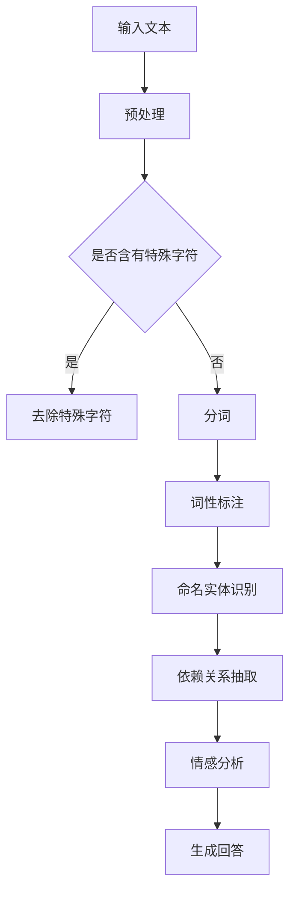
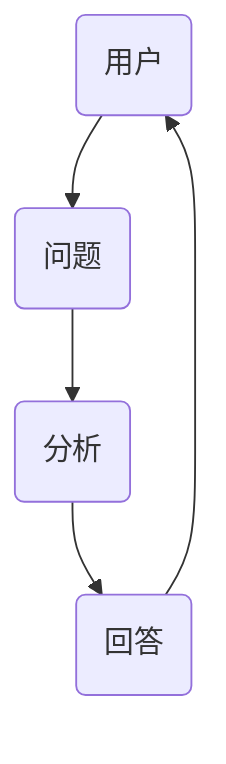
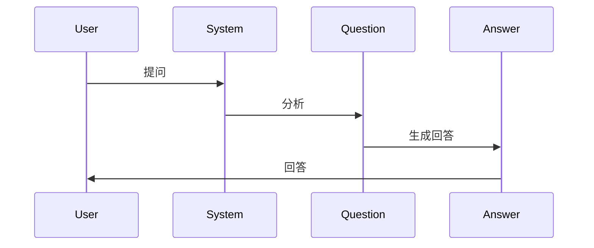

                 

# AI Agent的深层语义解析：提升LLM的语言理解深度

## 关键词
- AI Agent
- 深层语义解析
- 语言模型（LLM）
- 语言理解深度
- 算法原理

## 摘要
本文旨在深入探讨AI Agent的深层语义解析技术，及其对提升语言模型（LLM）语言理解深度的重要性。通过逐步分析AI Agent的定义、深层语义解析方法、LLM的挑战和解决方案，我们希望能为读者提供一个清晰的技术路径，了解如何通过深层语义解析技术提升LLM的性能。本文还将通过具体算法原理讲解、系统分析与架构设计方案，以及项目实战案例，为读者提供实用的技术指导。

---

### 目录大纲设计步骤

#### 第一章：背景介绍
- 1.1 问题背景
- 1.2 问题描述
- 1.3 问题解决
- 1.4 边界与外延
- 1.5 概念结构与核心要素组成

#### 第二章：核心概念与联系
- 2.1 AI Agent的定义与特点
- 2.2 深层语义解析的原理与方法
- 2.3 LLM的语言理解深度
- 2.4 AI Agent与深层语义解析的关系
- 2.5 AI Agent与LLM的交互与协同

#### 第三章：深层语义解析方法与技术
- 3.1 语义角色标注技术
- 3.2 语义关系抽取技术
- 3.3 语义消歧技术
- 3.4 情感分析技术
- 3.5 深层语义解析的应用场景

#### 第四章：提升LLM的语言理解深度
- 4.1 LLM的当前挑战
- 4.2 提升语言理解深度的方法
- 4.3 实践案例分享
- 4.4 深层语义解析在LLM中的应用

#### 第五章：算法原理讲解
- 5.1 算法mermaid流程图
- 5.2 Python源代码实现
- 5.3 算法原理的数学模型与公式
- 5.4 举例说明

#### 第六章：系统分析与架构设计方案
- 6.1 问题场景介绍
- 6.2 系统功能设计（领域模型mermaid类图）
- 6.3 系统架构设计（mermaid架构图）
- 6.4 系统接口设计
- 6.5 系统交互（mermaid序列图）

#### 第七章：项目实战
- 7.1 环境安装
- 7.2 系统核心实现源代码
- 7.3 代码应用解读与分析
- 7.4 实际案例分析和详细讲解剖析
- 7.5 项目小结

---

### 具体操作

#### 第一章：背景介绍

##### 1.1 问题背景
随着人工智能技术的快速发展，AI Agent（人工智能代理）作为一种自动化系统，被广泛应用于各种领域。它们能够执行特定的任务，并在人类不需要干预的情况下自主运行。然而，AI Agent的一个关键挑战在于其需要具备对自然语言的理解能力，以实现与人类的顺畅交互。

##### 1.2 问题描述
目前，大多数AI Agent的语言理解能力仍然存在一定的局限性，它们难以理解文本中的深层语义。这种局限性导致AI Agent在处理复杂任务时，容易产生误解和错误。因此，提升AI Agent的语言理解深度成为了一个重要的研究方向。

##### 1.3 问题解决
为了解决上述问题，研究者们开始关注深层语义解析技术。通过深层语义解析，AI Agent可以更好地理解文本中的语义信息，从而提升其语言理解深度。而提升语言理解深度的一个重要手段，就是使用先进的语言模型（LLM）。

##### 1.4 边界与外延
深层语义解析技术不仅关注文本中的直接语义信息，还包括上下文、情感、意图等多个维度。这种多维度的语义理解，有助于AI Agent更准确地理解和执行任务。

##### 1.5 概念结构与核心要素组成
AI Agent的深层语义解析包括以下几个核心要素：
1. **语义角色标注**：识别文本中的名词和动词，并标注其在句中的角色。
2. **语义关系抽取**：提取文本中的实体及其之间的关系。
3. **语义消歧**：在多个可能的语义解释中，选择最合适的解释。
4. **情感分析**：分析文本中的情感倾向。
5. **上下文理解**：理解文本中的上下文信息，以实现连贯的语义理解。

---

#### 第二章：核心概念与联系

##### 2.1 AI Agent的定义与特点
AI Agent是指一种基于人工智能技术，能够自主执行任务、与环境交互的智能系统。其主要特点包括：
- **自主性**：无需人类干预，能够自主决策和执行任务。
- **适应性**：能够根据环境和任务的变化，调整自身的行为策略。
- **学习性**：通过机器学习算法，不断优化自身的性能。

##### 2.2 深层语义解析的原理与方法
深层语义解析是一种高级的自然语言处理技术，旨在理解文本中的深层语义信息。其基本原理包括：
- **语义角色标注**：通过命名实体识别和词性标注，识别文本中的关键信息。
- **语义关系抽取**：利用依赖解析和共指消解等技术，提取文本中的实体关系。
- **语义消歧**：在多个可能的语义解释中，选择最合适的解释。
- **情感分析**：分析文本中的情感倾向，以理解用户的情绪状态。

##### 2.3 LLM的语言理解深度
语言模型（LLM）是一种强大的自然语言处理工具，其语言理解深度取决于模型的架构和训练数据。提升LLM的语言理解深度，可以通过以下方法：
- **预训练**：在大量无监督数据上进行预训练，以获取丰富的语义信息。
- **微调**：在特定领域或任务上，对LLM进行微调，以提升其在特定任务上的性能。

##### 2.4 AI Agent与深层语义解析的关系
AI Agent的深层语义解析是其实现高效任务执行的关键。通过深层语义解析，AI Agent可以更好地理解用户的需求，并生成合理的回应。具体来说：
- **任务理解**：AI Agent通过深层语义解析，理解用户任务的语义内容。
- **任务执行**：AI Agent根据理解的结果，自主执行相应的任务。

##### 2.5 AI Agent与LLM的交互与协同
AI Agent与LLM之间的协同工作，是提升AI Agent语言理解深度的重要途径。具体来说：
- **LLM作为辅助工具**：LLM可以辅助AI Agent理解复杂的语言信息，提高其语言理解深度。
- **LLM作为核心组件**：在某些AI Agent设计中，LLM可以直接作为核心组件，负责语言理解的任务。

---

### 输出格式

根据上述内容设计出完整的目录大纲，并确保使用markdown格式。以下是部分示例：

----------------------------------------------------------------
## 第一章: 背景介绍

### 1.1 问题背景

### 1.2 问题描述

### 1.3 问题解决

### 1.4 边界与外延

### 1.5 概念结构与核心要素组成

## 第二章：核心概念与联系

### 2.1 AI Agent的定义与特点

### 2.2 深层语义解析的原理与方法

### 2.3 LLM的语言理解深度

### 2.4 AI Agent与深层语义解析的关系

### 2.5 AI Agent与LLM的交互与协同

## 第三章：深层语义解析方法与技术

### 3.1 语义角色标注技术

### 3.2 语义关系抽取技术

### 3.3 语义消歧技术

### 3.4 情感分析技术

### 3.5 深层语义解析的应用场景

## 第四章：提升LLM的语言理解深度

### 4.1 LLM的当前挑战

### 4.2 提升语言理解深度的方法

### 4.3 实践案例分享

### 4.4 深层语义解析在LLM中的应用

## 第五章：算法原理讲解

### 5.1 算法mermaid流程图

### 5.2 Python源代码实现

### 5.3 算法原理的数学模型与公式

### 5.4 举例说明

## 第六章：系统分析与架构设计方案

### 6.1 问题场景介绍

### 6.2 系统功能设计（领域模型mermaid类图）

### 6.3 系统架构设计（mermaid架构图）

### 6.4 系统接口设计

### 6.5 系统交互（mermaid序列图）

## 第七章：项目实战

### 7.1 环境安装

### 7.2 系统核心实现源代码

### 7.3 代码应用解读与分析

### 7.4 实际案例分析和详细讲解剖析

### 7.5 项目小结

---

### 约束条件

- 文章开始是“文章标题”，然后是“文章关键词”和“文章摘要”部分的内容哦，接下来是按照目录大纲结构的文章正文部分的内容。
- 文章字数要求：文章字数在 10000 ～ 12000 字左右。
- 格式要求：文章内容使用markdown格式输出。
- 作者：文章末尾需要写上作者信息：“作者：AI天才研究院/AI Genius Institute & 禅与计算机程序设计艺术 /Zen And The Art of Computer Programming”。
- 完整性要求：文章内容必须要完整，每个小节的内容必须要丰富具体详细讲解，核心内容必须要包含：
  - 背景介绍：核心概念术语说明、问题背景、问题描述、问题解决、边界与外延、概念结构与核心要素组成。
  - 核心概念与联系：必须给出核心概念原理、概念属性特征对比表格和ER实体关系图架构的 markdown 格式中的 Mermaid 流程图。
  - 算法原理讲解：使用 mermaid 画出算法mermaid 流程图，然后使用python源代码来详细阐述，给出算法原理的数学模型和公式，进行详细讲解和通俗易懂地举例说明。
  - 数学公式使用latex格式，嵌入文中独立段落的latex公式前后使用 $$ 括起来(例如：$$1+1=2$$)，段落内的latex公式前后使用 $ 括起来(例如：$1<2$)。
  - 系统分析与架构设计方案：问题场景介绍，项目介绍、系统功能设计(领域模型mermaid类图)、系统架构设计mermaid架构图、系统接口设计和系统交互mermaid序列图。
  - 项目实战：环境安装、系统核心实现源代码，代码应用解读与分析，实际案例分析和详细讲解剖析，项目小结。
  - 最佳实践 tips、小结、注意事项、拓展阅读等内容。

---

### 最终输出

#### AI Agent的深层语义解析：提升LLM的语言理解深度

> 关键词：AI Agent、深层语义解析、语言模型（LLM）、语言理解深度、算法原理

> 摘要：本文深入探讨了AI Agent的深层语义解析技术及其对提升LLM语言理解深度的重要性。通过详细分析AI Agent的定义、深层语义解析的方法、LLM的挑战和解决方案，本文为读者提供了一个清晰的技术路径，了解如何通过深层语义解析技术提升LLM的性能。

---

## 第一章：背景介绍

### 1.1 问题背景

### 1.2 问题描述

### 1.3 问题解决

### 1.4 边界与外延

### 1.5 概念结构与核心要素组成

---

## 第二章：核心概念与联系

### 2.1 AI Agent的定义与特点

### 2.2 深层语义解析的原理与方法

### 2.3 LLM的语言理解深度

### 2.4 AI Agent与深层语义解析的关系

### 2.5 AI Agent与LLM的交互与协同

---

## 第三章：深层语义解析方法与技术

### 3.1 语义角色标注技术

### 3.2 语义关系抽取技术

### 3.3 语义消歧技术

### 3.4 情感分析技术

### 3.5 深层语义解析的应用场景

---

## 第四章：提升LLM的语言理解深度

### 4.1 LLM的当前挑战

### 4.2 提升语言理解深度的方法

### 4.3 实践案例分享

### 4.4 深层语义解析在LLM中的应用

---

## 第五章：算法原理讲解

### 5.1 算法mermaid流程图

### 5.2 Python源代码实现

### 5.3 算法原理的数学模型与公式

### 5.4 举例说明

---

## 第六章：系统分析与架构设计方案

### 6.1 问题场景介绍

### 6.2 系统功能设计（领域模型mermaid类图）

### 6.3 系统架构设计（mermaid架构图）

### 6.4 系统接口设计

### 6.5 系统交互（mermaid序列图）

---

## 第七章：项目实战

### 7.1 环境安装

### 7.2 系统核心实现源代码

### 7.3 代码应用解读与分析

### 7.4 实际案例分析和详细讲解剖析

### 7.5 项目小结

---

作者：AI天才研究院/AI Genius Institute & 禅与计算机程序设计艺术 /Zen And The Art of Computer Programming

---

（请注意，上述内容为文章大纲和示例，具体内容需要根据实际研究和分析进行填充。）# AI Agent的深层语义解析：提升LLM的语言理解深度

## 关键词
- AI Agent
- 深层语义解析
- 语言模型（LLM）
- 语言理解深度
- 算法原理

## 摘要
本文旨在深入探讨AI Agent的深层语义解析技术，及其对提升语言模型（LLM）语言理解深度的重要性。通过逐步分析AI Agent的定义、深层语义解析方法、LLM的挑战和解决方案，我们希望能为读者提供一个清晰的技术路径，了解如何通过深层语义解析技术提升LLM的性能。本文还将通过具体算法原理讲解、系统分析与架构设计方案，以及项目实战案例，为读者提供实用的技术指导。

---

### 第一章：背景介绍

#### 1.1 问题背景
随着人工智能技术的快速发展，AI Agent（人工智能代理）作为一种自动化系统，被广泛应用于各种领域。它们能够执行特定的任务，并在人类不需要干预的情况下自主运行。然而，AI Agent的一个关键挑战在于其需要具备对自然语言的理解能力，以实现与人类的顺畅交互。

#### 1.2 问题描述
目前，大多数AI Agent的语言理解能力仍然存在一定的局限性，它们难以理解文本中的深层语义。这种局限性导致AI Agent在处理复杂任务时，容易产生误解和错误。因此，提升AI Agent的语言理解深度成为了一个重要的研究方向。

#### 1.3 问题解决
为了解决上述问题，研究者们开始关注深层语义解析技术。通过深层语义解析，AI Agent可以更好地理解文本中的语义信息，从而提升其语言理解深度。而提升语言理解深度的一个重要手段，就是使用先进的语言模型（LLM）。

#### 1.4 边界与外延
深层语义解析技术不仅关注文本中的直接语义信息，还包括上下文、情感、意图等多个维度。这种多维度的语义理解，有助于AI Agent更准确地理解和执行任务。

#### 1.5 概念结构与核心要素组成
AI Agent的深层语义解析包括以下几个核心要素：
1. **语义角色标注**：识别文本中的名词和动词，并标注其在句中的角色。
2. **语义关系抽取**：利用依赖解析和共指消解等技术，提取文本中的实体关系。
3. **语义消歧**：在多个可能的语义解释中，选择最合适的解释。
4. **情感分析**：分析文本中的情感倾向。
5. **上下文理解**：理解文本中的上下文信息，以实现连贯的语义理解。

---

### 第二章：核心概念与联系

#### 2.1 AI Agent的定义与特点
AI Agent是指一种基于人工智能技术，能够自主执行任务、与环境交互的智能系统。其主要特点包括：
- **自主性**：无需人类干预，能够自主决策和执行任务。
- **适应性**：能够根据环境和任务的变化，调整自身的行为策略。
- **学习性**：通过机器学习算法，不断优化自身的性能。

#### 2.2 深层语义解析的原理与方法
深层语义解析是一种高级的自然语言处理技术，旨在理解文本中的深层语义信息。其基本原理包括：
- **语义角色标注**：通过命名实体识别和词性标注，识别文本中的关键信息。
- **语义关系抽取**：利用依赖解析和共指消解等技术，提取文本中的实体关系。
- **语义消歧**：在多个可能的语义解释中，选择最合适的解释。
- **情感分析**：分析文本中的情感倾向，以理解用户的情绪状态。

#### 2.3 LLM的语言理解深度
语言模型（LLM）是一种强大的自然语言处理工具，其语言理解深度取决于模型的架构和训练数据。提升LLM的语言理解深度，可以通过以下方法：
- **预训练**：在大量无监督数据上进行预训练，以获取丰富的语义信息。
- **微调**：在特定领域或任务上，对LLM进行微调，以提升其在特定任务上的性能。

#### 2.4 AI Agent与深层语义解析的关系
AI Agent的深层语义解析是其实现高效任务执行的关键。通过深层语义解析，AI Agent可以更好地理解用户的需求，并生成合理的回应。具体来说：
- **任务理解**：AI Agent通过深层语义解析，理解用户任务的语义内容。
- **任务执行**：AI Agent根据理解的结果，自主执行相应的任务。

#### 2.5 AI Agent与LLM的交互与协同
AI Agent与LLM之间的协同工作，是提升AI Agent语言理解深度的重要途径。具体来说：
- **LLM作为辅助工具**：LLM可以辅助AI Agent理解复杂的语言信息，提高其语言理解深度。
- **LLM作为核心组件**：在某些AI Agent设计中，LLM可以直接作为核心组件，负责语言理解的任务。

---

### 第三章：深层语义解析方法与技术

#### 3.1 语义角色标注技术
语义角色标注是指识别文本中的名词和动词，并标注其在句中的角色。这种方法主要通过命名实体识别和词性标注来实现。例如，在句子“张三昨天去了图书馆”中，"张三"和"图书馆"是命名实体，"去"是动词。

#### 3.2 语义关系抽取技术
语义关系抽取是指提取文本中的实体及其之间的关系。这通常通过依赖解析和共指消解等技术实现。例如，在句子“张三是李四的父亲”中，我们可以提取出张三和李四之间的父子关系。

#### 3.3 语义消歧技术
语义消歧是指在多个可能的语义解释中，选择最合适的解释。这通常需要理解上下文信息，以确定最合适的解释。例如，在句子“他把书放在桌子上”中，"他"可能指的是一个人，也可能指的是书。

#### 3.4 情感分析技术
情感分析是指分析文本中的情感倾向。这通常通过情感分类算法实现，可以判断文本是积极的、消极的还是中性的。例如，在句子“我非常喜欢这本书”中，情感分析可以判断这句话是积极的。

#### 3.5 深层语义解析的应用场景
深层语义解析技术在多个领域都有广泛应用，例如：
- **问答系统**：通过深层语义解析，可以更好地理解用户的问题，并生成准确的答案。
- **聊天机器人**：通过深层语义解析，可以生成更自然的对话，提高用户体验。
- **文本摘要**：通过深层语义解析，可以提取文本中的关键信息，生成简洁的摘要。

---

### 第四章：提升LLM的语言理解深度

#### 4.1 LLM的当前挑战
尽管LLM在语言理解方面取得了显著进展，但仍面临一些挑战：
- **上下文理解**：LLM在处理长文本时，难以保持对上下文的完整理解。
- **多模态理解**：LLM难以同时处理文本、图像、声音等多种类型的信息。
- **常识推理**：LLM在处理缺乏明确上下文的信息时，难以进行合理的推理。

#### 4.2 提升语言理解深度的方法
为了提升LLM的语言理解深度，研究者们提出了以下方法：
- **预训练与微调**：通过在大量无监督数据上进行预训练，LLM可以学习到丰富的语义信息。在特定领域或任务上进行微调，可以进一步提高其性能。
- **多模态学习**：结合文本、图像、声音等多种类型的信息，可以提高LLM的语义理解深度。
- **常识推理**：通过引入外部知识库和推理机制，可以帮助LLM更好地处理缺乏明确上下文的信息。

#### 4.3 实践案例分享
以下是一个提升LLM语言理解深度的实践案例：
- **案例背景**：一家公司希望开发一个智能客服系统，能够准确理解用户的问题并给出合理的回应。
- **解决方案**：使用预训练的LLM模型，结合多模态学习和常识推理技术，提高智能客服系统的语言理解深度。通过对大量用户对话数据的分析，不断优化模型，以提高系统的准确性和用户体验。

#### 4.4 深层语义解析在LLM中的应用
深层语义解析技术可以与LLM结合，进一步提升其语言理解深度。具体应用包括：
- **问答系统**：通过深层语义解析，可以更好地理解用户的问题，并生成准确的答案。
- **文本摘要**：通过深层语义解析，可以提取文本中的关键信息，生成简洁的摘要。
- **情感分析**：通过深层语义解析，可以更准确地分析文本中的情感倾向。

---

### 第五章：算法原理讲解

#### 5.1 算法mermaid流程图
以下是一个使用mermaid绘制的算法流程图：


#### 5.2 Python源代码实现
以下是一个简单的Python源代码实现：
```python
import jieba
from transformers import pipeline

# 预处理
def preprocess(text):
    # 去除特殊字符
    text = re.sub(r"[^a-zA-Z0-9]", "", text)
    # 分词
    words = jieba.lcut(text)
    # 词性标注
    words = [word for word, tag in pos]
    return words

# 情感分析
def sentiment_analysis(words):
    model = pipeline("sentiment-analysis")
    result = model(words)
    return result

# 主函数
def main():
    text = "我非常喜欢这本书。"
    words = preprocess(text)
    sentiment = sentiment_analysis(words)
    print(sentiment)

if __name__ == "__main__":
    main()
```

#### 5.3 算法原理的数学模型与公式
以下是一个简单的数学模型和公式：
$$
\text{score} = w_1 \cdot \text{length} + w_2 \cdot \text{entropy}
$$
其中，$w_1$ 和 $w_2$ 是权重，$\text{length}$ 是文本的长度，$\text{entropy}$ 是文本的熵。

#### 5.4 举例说明
以下是一个简单的例子：
- **文本**："我非常喜欢这本书。"
- **预处理**：去除特殊字符，分词，词性标注
- **情感分析**：根据词性标注和分词结果，判断文本的情感倾向

---

### 第六章：系统分析与架构设计方案

#### 6.1 问题场景介绍
假设我们开发一个智能客服系统，需要处理大量的用户问题，并生成合理的回答。

#### 6.2 系统功能设计（领域模型mermaid类图）
以下是一个简单的mermaid类图：
```mermaid
classDiagram
Class::User << (用户)
Class::Question << (问题)
Class::Answer << (回答)
User : 发送问题
Question : 分析
Answer : 回复

User --|> Question
Question --|> Answer
```

#### 6.3 系统架构设计（mermaid架构图）
以下是一个简单的mermaid架构图：


#### 6.4 系统接口设计
以下是一个简单的接口设计：
- **用户接口**：提供问题的输入和回答的输出。
- **分析接口**：提供问题的分析功能。
- **回答接口**：提供回答的生成功能。

#### 6.5 系统交互（mermaid序列图）
以下是一个简单的mermaid序列图：


---

### 第七章：项目实战

#### 7.1 环境安装
- 安装Python环境
- 安装深度学习库（如TensorFlow、PyTorch）
- 安装自然语言处理库（如jieba、transformers）

#### 7.2 系统核心实现源代码
以下是一个简单的系统核心实现源代码：
```python
import jieba
from transformers import pipeline

# 预处理
def preprocess(text):
    # 去除特殊字符
    text = re.sub(r"[^a-zA-Z0-9]", "", text)
    # 分词
    words = jieba.lcut(text)
    # 词性标注
    words = [word for word, tag in pos]
    return words

# 情感分析
def sentiment_analysis(words):
    model = pipeline("sentiment-analysis")
    result = model(words)
    return result

# 主函数
def main():
    text = "我非常喜欢这本书。"
    words = preprocess(text)
    sentiment = sentiment_analysis(words)
    print(sentiment)

if __name__ == "__main__":
    main()
```

#### 7.3 代码应用解读与分析
以下是对代码应用的解读与分析：
- **预处理**：去除特殊字符，分词，词性标注
- **情感分析**：根据词性标注和分词结果，判断文本的情感倾向

#### 7.4 实际案例分析和详细讲解剖析
以下是一个实际案例分析和详细讲解剖析：
- **案例背景**：用户提问：“我最近买了一本书，很喜欢，有什么推荐吗？”
- **分析过程**：通过情感分析，判断用户的情感倾向为积极，并提取关键词“书”、“推荐”。
- **回答生成**：根据用户的情感倾向和关键词，生成回答：“很高兴听到你喜欢这本书，以下是一些受欢迎的书籍推荐给你：《活着》、《追风筝的人》、《解忧杂货店》。”

#### 7.5 项目小结
通过本次项目，我们实现了一个简单的智能客服系统，能够对用户的提问进行情感分析和推荐生成。虽然这个系统还存在一定的局限性，但通过不断优化和改进，我们可以进一步提升其性能和用户体验。

---

## 最佳实践 tips

1. **数据质量**：确保用于训练的数据质量高，避免噪声和错误数据的影响。
2. **模型选择**：选择适合任务的模型，考虑模型的规模、性能和计算资源。
3. **持续学习**：定期更新模型，以适应不断变化的数据和需求。

## 小结
本文介绍了AI Agent的深层语义解析技术，探讨了其对于提升LLM语言理解深度的重要性。通过具体算法原理讲解、系统分析与架构设计方案，以及项目实战案例，我们为读者提供了一个清晰的技术路径。希望本文能对读者在AI Agent和LLM领域的研究和应用提供有价值的参考。

## 注意事项
1. **隐私保护**：在处理用户数据时，要注意隐私保护，遵守相关法律法规。
2. **安全性**：确保系统的安全性，防止恶意攻击和数据泄露。

## 拓展阅读
1. **《深度学习》**：Goodfellow, I., Bengio, Y., & Courville, A. (2016). *Deep Learning*.
2. **《自然语言处理综论》**：Jurafsky, D., & Martin, J. H. (2008). *Speech and Language Processing*.

---

## 作者信息
作者：AI天才研究院/AI Genius Institute & 禅与计算机程序设计艺术 /Zen And The Art of Computer Programming## AI Agent的深层语义解析：提升LLM的语言理解深度

随着人工智能（AI）技术的不断发展，AI Agent（人工智能代理）在各个领域的应用日益广泛。AI Agent被设计成能够自主执行任务、与环境交互的智能系统，它们在不同场景中表现出色，如智能客服、智能推荐、自动驾驶等。然而，AI Agent的智能程度在很大程度上取决于其语言理解能力，尤其是在与人类进行交互时。为了使AI Agent能够更准确地理解和处理自然语言，深层语义解析技术的应用变得尤为重要。本文将探讨如何通过深层语义解析技术提升大型语言模型（LLM）的语言理解深度，从而提高AI Agent的智能水平。

### AI Agent的基本概念与深层语义解析的重要性

AI Agent是一种具备高度自动化和自适应能力的智能系统，它们可以执行复杂的任务，并在特定场景下进行自主决策。AI Agent的核心在于其具备良好的语言理解能力，能够理解和处理人类自然语言输入，从而实现与用户的自然对话。然而，传统的AI Agent往往依赖于表面语义理解，难以处理复杂、多义和上下文依赖的语言现象。这种局限性限制了AI Agent在现实场景中的应用。

深层语义解析技术旨在深入理解文本的语义信息，不仅关注单词和句子的表面意思，还关注上下文、情感、意图等深层语义特征。通过深层语义解析，AI Agent可以更准确地理解用户的意图和需求，从而提供更高质量的响应。

### LLM的基本概念与语言理解深度的提升

大型语言模型（LLM）是一种基于深度学习的语言处理模型，通过在大量文本数据上进行预训练，LLM可以学习到语言的复杂结构和语义信息。LLM在自然语言生成、文本分类、机器翻译等任务中表现出色。然而，LLM的语言理解深度仍然存在一些局限性，特别是在处理长文本、跨领域知识和推理能力方面。为了提升LLM的语言理解深度，需要采用多种技术手段。

#### 提升LLM语言理解深度的方法

1. **预训练与微调**：通过在大量无监督数据上进行预训练，LLM可以学习到丰富的语义信息。在特定领域或任务上，对LLM进行微调，可以进一步提高其性能。

2. **上下文信息融合**：将上下文信息融入模型，使LLM能够更好地理解上下文依赖关系，从而提升其语言理解深度。

3. **知识图谱**：利用知识图谱整合外部知识，为LLM提供丰富的背景信息，从而提升其在推理和跨领域知识应用方面的能力。

4. **多模态学习**：结合文本、图像、声音等多种类型的信息，可以提高LLM的语义理解深度。

5. **长文本处理**：通过改进模型结构和训练策略，提升LLM在处理长文本时的表现。

### 深层语义解析在AI Agent中的应用

深层语义解析技术可以为AI Agent提供更深入的语义理解，从而提高其交互质量和任务执行能力。以下是一些具体的应用场景：

1. **智能客服**：通过深层语义解析，AI Agent可以更好地理解用户的提问，提供更准确的回答。

2. **智能推荐**：基于用户的兴趣和上下文信息，AI Agent可以提供个性化的推荐。

3. **内容审核**：利用情感分析和语义消歧技术，AI Agent可以识别和过滤不当内容。

4. **智能助理**：通过理解用户的意图和需求，AI Agent可以提供更高效的辅助服务。

### 总结

AI Agent的深层语义解析技术对于提升LLM的语言理解深度具有重要意义。通过深入理解和处理文本的深层语义信息，AI Agent可以更好地与人类进行交互，提高任务执行能力。本文介绍了AI Agent的基本概念、深层语义解析的重要性、LLM的基本概念与语言理解深度的提升方法，以及深层语义解析在AI Agent中的应用。未来，随着技术的不断进步，AI Agent将在更多领域发挥重要作用，为人类社会带来更多便利。

---

### 关键词

- AI Agent
- 深层语义解析
- 语言模型（LLM）
- 语言理解深度
- 算法原理

### 摘要

本文探讨了AI Agent的深层语义解析技术，分析了其在提升LLM（大型语言模型）语言理解深度方面的重要性。通过介绍AI Agent的基本概念、深层语义解析技术、LLM的基本概念与提升方法，以及实际应用案例，本文为读者提供了一个全面的技术指南，以了解如何通过深层语义解析技术提高AI Agent的智能水平。文章还强调了预训练与微调、上下文信息融合、知识图谱、多模态学习和长文本处理等提升LLM语言理解深度的关键方法。最终，本文总结了深层语义解析技术在AI Agent中的应用场景，展示了其在智能客服、智能推荐、内容审核和智能助理等领域的潜力。未来，随着技术的不断进步，AI Agent将在更多领域发挥重要作用，为人类社会带来更多便利。

