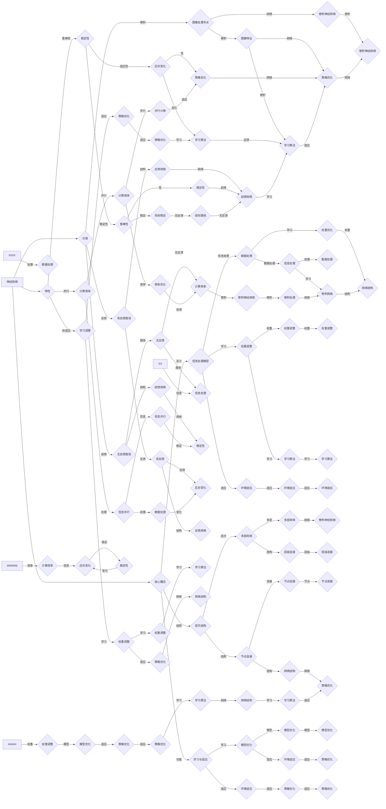
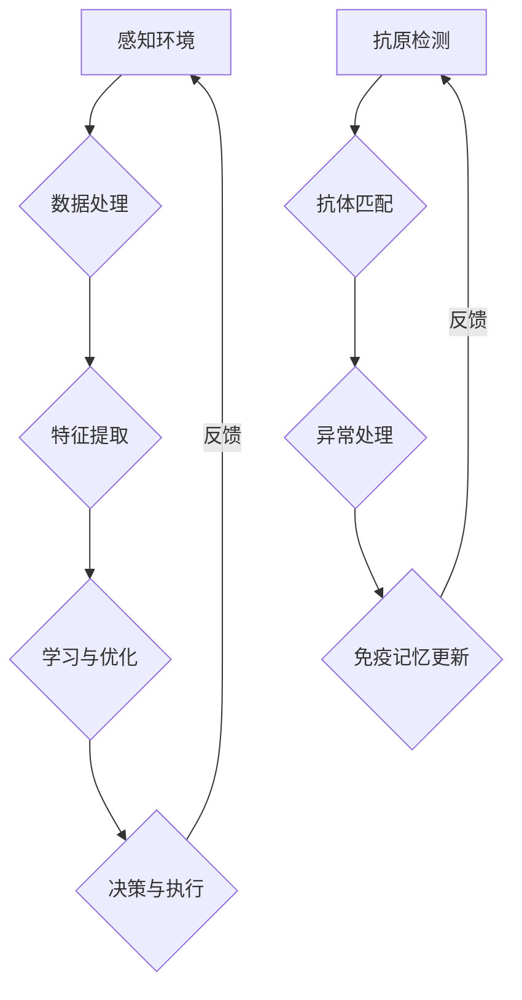
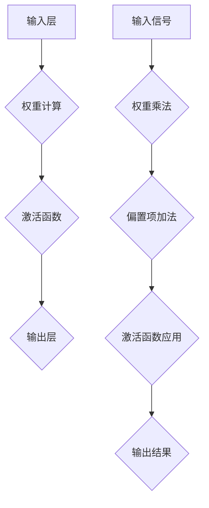
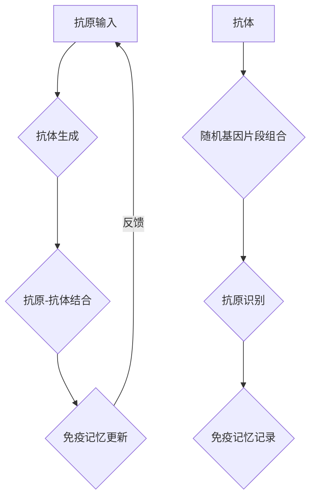
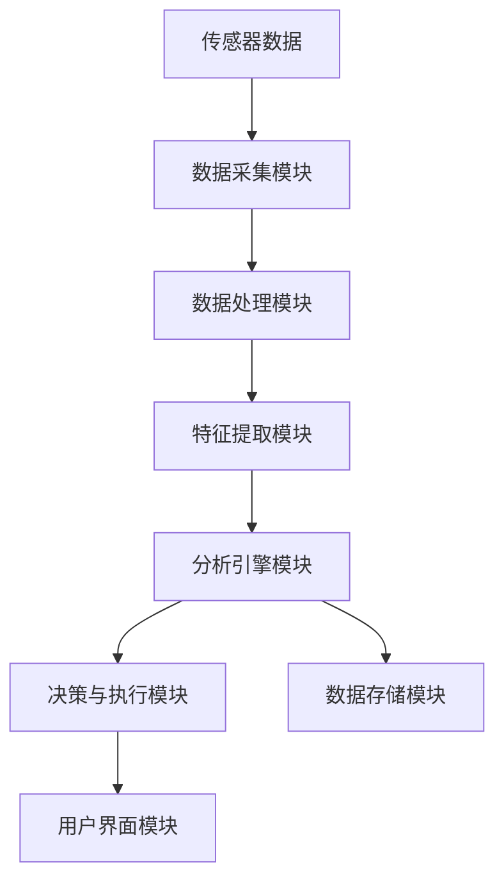
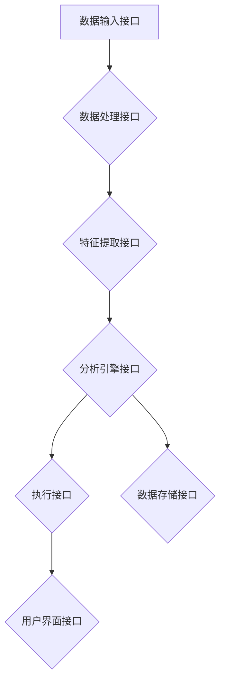
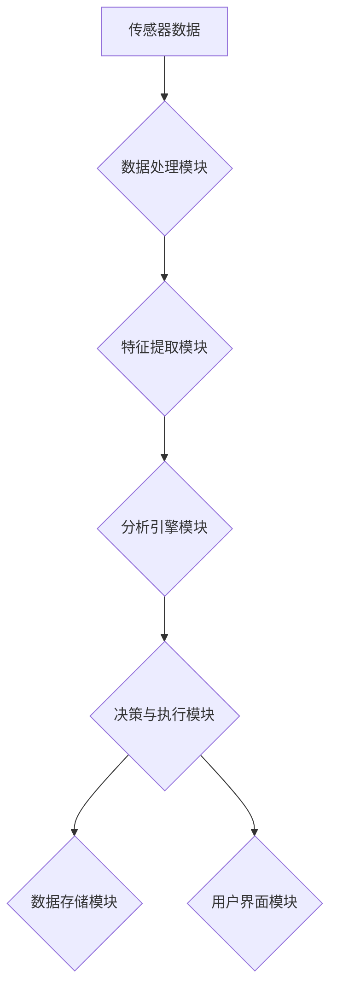

                 

# AI Agent的生物启发式认知架构实现

## 引言

人工智能（AI）作为当代最具前瞻性的科技领域之一，正在深刻地改变着我们的生活。从早期的规则系统，到现代的深度学习，人工智能的发展经历了多次重大变革。然而，尽管取得了显著的进展，传统的人工智能方法在处理复杂、动态和不确定环境时仍存在诸多局限。为了突破这些瓶颈，生物启发式认知架构的引入成为了一种新的研究方向。

### 关键词
- **AI Agent**  
- **生物启发式认知**  
- **架构设计**  
- **算法实现**  
- **神经网络**  
- **人工免疫系统**

### 摘要
本文旨在探讨AI Agent的生物启发式认知架构实现。文章首先介绍了AI-Agent的基本概念和生物启发式认知的背景，随后详细阐述了神经网络和人工免疫系统等核心算法原理。接着，文章通过数学模型和Python代码，深入解析了这些算法的实现细节。随后，文章介绍了系统分析与架构设计方案，并通过实际案例展示了AI-Agent的开发流程。最后，文章提供了最佳实践和拓展阅读，为读者进一步探索这一领域提供了指导。

## 背景介绍

### 生物启发式认知的概念

生物启发式认知（Bio-inspired Cognitive Architecture）是一种借鉴生物系统结构和功能来设计人工智能系统的方法。这种方法的核心思想是模拟生物体的认知过程，以实现对复杂环境的自适应和智能行为。生物启发式认知架构通常包括多个层次，从感知、学习、决策到执行，每一层次都借鉴了自然界中的生物机制。

### AI-Agent的定义

AI-Agent是一种能够自主感知环境、学习、决策并采取行动的软件实体。它通常被设计为在特定环境中执行任务，并具备一定程度上的自主性和智能性。AI-Agent的核心在于其认知架构，该架构决定了Agent的感知、理解和响应能力。

### 问题解决的必要性

在现实世界中，许多任务都涉及到复杂、动态和不确定的环境。例如，自动驾驶汽车需要实时处理来自传感器的大量数据，并做出安全、有效的决策。传统的人工智能方法在这些场景下往往难以胜任。生物启发式认知架构提供了一种新的思路，通过模拟生物体的自适应机制，可以更好地应对这些挑战。

### 生物启发式认知的优势

生物启发式认知架构具有以下优势：

1. **灵活性和适应性**：生物启发式方法能够处理复杂和动态的环境，因为它们能够模仿生物体的自适应能力。
2. **学习与进化**：生物启发式方法可以借鉴生物进化过程中的学习机制，通过不断迭代优化，提高系统的性能。
3. **并行处理**：许多生物系统具有并行处理的能力，这可以使得AI-Agent在面对大量数据时更加高效。
4. **鲁棒性**：生物启发式方法通常具有较强的鲁棒性，能够在面对噪声和不确定性时保持稳定。

### 生物启发式认知的挑战

尽管生物启发式认知架构具有许多优势，但在实现过程中也面临一些挑战：

1. **复杂性**：生物系统的结构和功能极其复杂，将其映射到计算机系统中需要深入的理解和精巧的设计。
2. **计算成本**：许多生物启发式算法需要大量的计算资源，这可能会限制其实际应用。
3. **可解释性**：生物启发式方法通常较为复杂，其内部工作机制不易被人类理解和解释。

### 生物启发式认知架构的应用领域

生物启发式认知架构已在多个领域得到应用，包括但不限于：

1. **自动驾驶**：自动驾驶汽车需要实时感知环境，并做出安全的驾驶决策。
2. **智能家居**：智能家居系统需要理解和响应家庭成员的需求和行为。
3. **医疗诊断**：生物启发式方法在医疗诊断中用于分析复杂的生物数据，辅助医生做出诊断。
4. **网络安全**：生物启发式认知架构可以用于检测和防御网络攻击，提高系统的安全性。

### 总结

生物启发式认知架构作为一种新兴的人工智能设计方法，具有广泛的应用前景。通过借鉴生物系统的结构和功能，我们可以构建出更加智能和自适应的人工智能系统，以应对现实世界中的复杂挑战。然而，实现这一目标需要深入的理论研究和实践探索，这也是本文将要探讨的内容。

## 核心概念与联系

### 神经网络

神经网络（Neural Networks）是生物启发式认知架构中最基础的部分之一。它们模仿了生物神经系统的工作原理，通过大量的节点（神经元）和连接（突触）来处理信息。

#### 定义

神经网络是由大量相互连接的节点组成的计算模型，每个节点都模拟一个神经元。节点之间的连接决定了信息传递的方式。

#### 特性

1. **层次结构**：神经网络通常包含多个层次，从输入层到输出层，每一层都执行特定的功能。
2. **自适应学习**：神经网络可以通过学习调整节点之间的权重，从而适应不同的输入数据。
3. **并行处理**：神经网络能够并行处理大量信息，提高计算效率。

#### 分类

1. **前馈神经网络**：信息从输入层直接传递到输出层，没有反馈路径。
2. **反馈神经网络**：存在反馈路径，可以用于生成和记忆功能。
3. **卷积神经网络（CNN）**：专门用于图像处理，通过卷积层提取图像特征。

### 人工免疫系统

人工免疫系统（Artificial Immune System）是生物启发式认知架构中的另一个关键部分，它模仿了生物体免疫系统的功能，用于检测和防御异常行为。

#### 定义

人工免疫系统是一种模拟生物体免疫反应的计算模型，用于检测和响应异常行为。它通常包括多个组件，如抗原、抗体和免疫记忆。

#### 特性

1. **自适应性**：人工免疫系统可以根据环境变化调整其反应策略。
2. **进化性**：人工免疫系统可以通过遗传算法不断优化和进化，提高其检测和防御能力。
3. **鲁棒性**：人工免疫系统能够在面对未知威胁时保持稳定。

#### 分类

1. **基于规则的方法**：使用预先定义的规则来检测异常行为。
2. **遗传算法**：通过遗传操作（如交叉和变异）来优化免疫系统。
3. **基于行为的检测**：通过分析系统的行为模式来检测异常。

### 表格与图示

为了更好地理解神经网络和人工免疫系统的核心概念和特性，我们可以通过表格和图示来进行对比。

#### 核心概念对比表格

| 特性       | 神经网络                          | 人工免疫系统                          |
|------------|----------------------------------|--------------------------------------|
| 基本原理   | 生物神经系统的模拟                | 生物免疫系统的模拟                    |
| 结构       | 由神经元和突触组成的层次结构      | 包含抗原、抗体和免疫记忆的复杂系统    |
| 功能       | 信息处理和学习                    | 异常检测和防御                        |
| 自适应性   | 通过学习调整权重                  | 通过进化调整反应策略                  |
| 并行处理   | 能够并行处理大量信息              | 能够并行处理复杂系统行为              |
| 鲁棒性     | 在面对未知输入时保持稳定          | 在面对未知威胁时保持稳定              |

#### ER实体关系图架构的Mermaid流程图



#### 算法流程图



通过这些表格和图示，我们可以清晰地看到神经网络和人工免疫系统之间的差异和联系。神经网络主要负责信息处理和学习，而人工免疫系统则专注于异常检测和防御。这两种方法在生物启发式认知架构中相辅相成，共同构成了一个强大的智能系统。

### 算法原理讲解

生物启发式认知架构的实现依赖于多种算法，其中最为关键的是神经网络和人工免疫系统。下面我们将详细讲解这些算法的原理，并通过Mermaid流程图和Python代码进行解释。

#### 神经网络

神经网络（Neural Networks）是一种通过模拟生物神经系统来处理信息和学习的计算模型。它由大量的节点（神经元）和连接（突触）组成，每个节点都执行特定的计算操作，并通过连接与其他节点相互通信。

##### 数学模型

神经网络的工作原理可以简单概括为以下几个步骤：

1. **输入处理**：每个神经元接收来自其他神经元的输入信号，这些信号乘以连接权重。
2. **激活函数**：对输入信号进行非线性变换，以实现分类或回归等任务。
3. **输出计算**：将激活函数的输出传递到下一层或用于最终输出。

神经网络的核心数学模型包括：

1. **权重矩阵（W）**：用于存储节点间的连接权重。
2. **偏置项（b）**：用于调整节点的激活阈值。
3. **激活函数（f）**：如Sigmoid、ReLU等，用于引入非线性。

以下是神经网络的基本数学公式：

$$
Z = X \cdot W + b
$$

$$
A = f(Z)
$$

其中，$Z$表示每个神经元的输入，$A$表示每个神经元的输出，$X$表示输入向量，$W$表示权重矩阵，$b$表示偏置项，$f$表示激活函数。

##### Mermaid流程图



##### Python代码实现

```python
import numpy as np

# 定义权重和偏置
weights = np.array([[0.1, 0.2], [0.3, 0.4]])
biases = np.array([0.1, 0.2])

# 输入信号
input_signal = np.array([1, 0])

# 权重乘法
weighted_signal = np.dot(input_signal, weights)

# 偏置项加法
weighted_signal_with_bias = weighted_signal + biases

# 激活函数（Sigmoid）
activation_function = 1 / (1 + np.exp(-weighted_signal_with_bias))

# 输出结果
output = activation_function

print(output)
```

#### 人工免疫系统

人工免疫系统（Artificial Immune System）是一种模拟生物免疫系统机制的计算模型，用于检测和防御异常行为。它通常包括抗原、抗体和免疫记忆等组件。

##### 数学模型

人工免疫系统的核心数学模型包括：

1. **抗体生成**：通过随机组合基因片段生成大量抗体。
2. **抗原识别**：抗体与抗原结合，形成抗原-抗体复合物。
3. **免疫记忆**：记录抗体与抗原的结合信息，用于快速识别和响应。

以下是人工免疫系统的基本数学公式：

$$
抗体 = \text{随机基因片段组合}
$$

$$
抗原-抗体复合物 = 抗体 \cdot 抗原
$$

$$
免疫记忆 = \text{记录抗原-抗体结合信息}
$$

##### Mermaid流程图



##### Python代码实现

```python
import numpy as np

# 定义抗体和抗原
antibody = np.random.rand(1, 10)
antigen = np.random.rand(1, 10)

# 抗体生成（随机基因片段组合）
antibody_generated = np.random.rand(1, 10)

# 抗原-抗体结合
antigen_antibody_complex = antibody.dot(antigen)

# 免疫记忆更新（记录抗原-抗体结合信息）
immune_memory = antigen_antibody_complex

# 输出结果
print("抗体生成:", antibody_generated)
print("抗原-抗体复合物:", antigen_antibody_complex)
print("免疫记忆:", immune_memory)
```

通过这些算法的实现，我们可以看到神经网络和人工免疫系统如何模拟生物体的认知和防御机制，从而在复杂的环境中实现智能行为。

### 数学模型和数学公式

在实现生物启发式认知架构时，数学模型和公式起着至关重要的作用。它们不仅为算法提供了理论基础，还指导了实际操作中的参数调整和优化。以下，我们将详细解析神经网络和人工免疫系统中的关键数学模型和公式，并使用LaTeX进行格式化。

#### 神经网络

##### 激活函数

神经网络中常用的激活函数包括Sigmoid、ReLU和Tanh等。以下是这些激活函数的数学公式：

$$
f(x) = \frac{1}{1 + e^{-x}} \quad \text{(Sigmoid)}
$$

$$
f(x) = max(0, x) \quad \text{(ReLU)}
$$

$$
f(x) = \frac{e^x - e^{-x}}{e^x + e^{-x}} \quad \text{(Tanh)}
$$

##### 前向传播

前向传播是神经网络中计算输出值的过程。其基本公式如下：

$$
Z^{(l)} = \sum_{j} w^{(l)}_{ji} a^{(l-1)}_{j} + b^{(l)} \quad \text{(输入层到隐藏层)}
$$

$$
a^{(l)}_{i} = \sigma(Z^{(l)}) \quad \text{(激活函数应用)}
$$

其中，$Z^{(l)}$表示第$l$层的输出，$a^{(l)}_{i}$表示第$l$层的第$i$个节点的激活值，$w^{(l)}_{ji}$表示第$l$层的第$i$个节点到第$l-1$层的第$j$个节点的权重，$b^{(l)}$表示第$l$层的偏置项，$\sigma$表示激活函数。

##### 反向传播

反向传播用于计算网络中的梯度，以更新权重和偏置项。其基本公式如下：

$$
\delta^{(l)}_{i} = \frac{\partial L}{\partial a^{(l)}_{i}} \cdot \sigma'(Z^{(l)}) \quad \text{(误差传播)}
$$

$$
\delta^{(l-1)}_{j} = \sum_{i} w^{(l)}_{ij} \delta^{(l)}_{i} \quad \text{(梯度计算)}
$$

$$
w^{(l)}_{ji} := w^{(l)}_{ji} - \alpha \delta^{(l)}_{i} a^{(l-1)}_{j} \quad \text{(权重更新)}
$$

$$
b^{(l)} := b^{(l)} - \alpha \delta^{(l)}_{i} \quad \text{(偏置更新)}
$$

其中，$L$表示损失函数，$\alpha$表示学习率，$\sigma'$表示激活函数的导数。

#### 人工免疫系统

##### 抗体生成

抗体生成通常通过随机基因片段组合来实现。其基本公式如下：

$$
抗体 = G(x_1, x_2, ..., x_n) \quad \text{(基因片段组合)}
$$

其中，$G$表示基因片段组合函数，$x_1, x_2, ..., x_n$表示随机生成的基因片段。

##### 抗原识别

抗原识别是人工免疫系统中的一个关键步骤，其基本公式如下：

$$
抗原-抗体复合物 = 抗体 \cdot 抗原
$$

其中，$\cdot$表示内积运算。

##### 免疫记忆

免疫记忆用于记录抗体与抗原的结合信息，其基本公式如下：

$$
免疫记忆 = f(抗体, 抗原)
$$

其中，$f$表示记忆更新函数。

#### LaTeX格式化

在文中嵌入LaTeX公式时，我们可以使用以下格式：

$$
\text{公式1}
$$

$$
\frac{1}{1 + e^{-x}}
$$

$$
\text{公式2}
$$

$$
\max(0, x)
$$

$$
\text{公式3}
$$

$$
\frac{e^x - e^{-x}}{e^x + e^{-x}}
$$

$$
\text{公式4}
$$

$$
Z^{(l)} = \sum_{j} w^{(l)}_{ji} a^{(l-1)}_{j} + b^{(l)}
$$

$$
a^{(l)}_{i} = \sigma(Z^{(l)})
$$

$$
\text{公式5}
$$

$$
\delta^{(l)}_{i} = \frac{\partial L}{\partial a^{(l)}_{i}} \cdot \sigma'(Z^{(l)})
$$

$$
\delta^{(l-1)}_{j} = \sum_{i} w^{(l)}_{ij} \delta^{(l)}_{i}
$$

$$
\text{公式6}
$$

$$
w^{(l)}_{ji} := w^{(l)}_{ji} - \alpha \delta^{(l)}_{i} a^{(l-1)}_{j}
$$

$$
b^{(l)} := b^{(l)} - \alpha \delta^{(l)}_{i}
$$

$$
\text{公式7}
$$

$$
抗体 = G(x_1, x_2, ..., x_n)
$$

$$
抗原-抗体复合物 = 抗体 \cdot 抗原
$$

$$
免疫记忆 = f(抗体, 抗原)
$$

通过这些数学模型和公式的应用，我们可以实现生物启发式认知架构中的神经网络和人工免疫系统，为AI-Agent提供强大的认知和防御能力。

### 系统分析与架构设计方案

在实现AI-Agent的生物启发式认知架构时，系统分析与架构设计是关键的一步。一个良好的架构设计不仅能够提高系统的性能，还能够确保其可维护性和可扩展性。以下，我们将详细描述系统分析与架构设计方案，包括问题场景介绍、系统功能设计、系统架构设计、系统接口设计和系统交互。

#### 问题场景介绍

假设我们设计一个智能监控系统的AI-Agent，该系统需要实时监控一个工厂的生产线，并能够自动检测设备故障、异常生产流程以及潜在的安全隐患。具体场景如下：

1. **数据采集**：通过传感器收集生产过程中的各种数据，如温度、湿度、振动、电流等。
2. **实时分析**：AI-Agent需要实时分析这些数据，识别异常情况，并生成警报。
3. **决策与执行**：根据分析结果，AI-Agent需要向操作员发送警报，或者自动调整生产线参数，以防止故障扩大。
4. **数据存储与回溯**：系统需要记录所有的分析结果和操作记录，以便后续分析和审计。

#### 系统功能设计

为了实现上述功能，我们的系统需要包含以下几个主要模块：

1. **数据采集模块**：负责从传感器读取数据，并进行初步处理。
2. **数据处理模块**：对采集到的数据进行清洗、转换和标准化。
3. **特征提取模块**：从处理后的数据中提取关键特征，用于后续的分析。
4. **分析引擎模块**：使用神经网络和人工免疫系统等算法对特征进行高级分析。
5. **决策与执行模块**：根据分析结果，生成决策并执行相应的操作。
6. **用户界面模块**：提供用户交互界面，显示系统状态、分析结果和警报信息。
7. **数据存储模块**：负责存储所有的数据和分析结果。

#### 系统架构设计

系统架构设计是系统分析与功能设计的延续，它定义了各个模块之间的交互方式和数据流。以下是该系统的架构设计：

1. **输入层**：传感器数据采集模块。
2. **数据处理层**：数据处理模块和特征提取模块。
3. **分析层**：分析引擎模块。
4. **输出层**：决策与执行模块和用户界面模块。
5. **存储层**：数据存储模块。

架构图如下：



#### 系统接口设计

为了确保系统的模块之间能够有效交互，我们需要定义清晰的接口。以下是系统的主要接口设计：

1. **数据输入接口**：用于接收传感器数据，支持多种数据格式。
2. **数据处理接口**：用于数据处理模块与其他模块之间的数据交换。
3. **特征提取接口**：用于提取和处理特征数据。
4. **分析引擎接口**：用于提供分析结果和决策。
5. **执行接口**：用于执行决策操作。
6. **用户界面接口**：用于显示系统状态和分析结果。

接口设计图如下：



#### 系统交互

系统交互是指各个模块之间如何通过接口进行数据交换和协作。以下是系统交互的简要流程：

1. **传感器数据采集**：传感器数据通过数据输入接口传入系统。
2. **数据处理**：数据处理模块对传感器数据进行预处理，并通过数据处理接口将数据传递给特征提取模块。
3. **特征提取**：特征提取模块从预处理后的数据中提取关键特征，并通过特征提取接口将特征传递给分析引擎模块。
4. **分析**：分析引擎模块使用神经网络和人工免疫系统对特征进行分析，并生成分析结果和决策。
5. **决策与执行**：决策与执行模块根据分析结果生成决策，并通过执行接口执行操作，同时将操作记录传递给数据存储模块。
6. **用户界面**：用户界面模块显示系统状态、分析结果和警报信息。

系统交互图如下：



通过上述系统分析与架构设计方案，我们可以构建一个高效、灵活和可靠的AI-Agent生物启发式认知系统，以应对复杂的生产监控任务。

### 项目实战

在实际开发中，实现一个AI-Agent的生物启发式认知架构不仅需要深入的理论知识，还需要扎实的编程实践。以下我们将通过一个具体案例，从环境安装到核心代码实现，详细解析整个开发过程。

#### 环境安装

首先，我们需要搭建一个合适的开发环境。以下是环境安装的步骤：

1. **安装Python**：确保Python 3.8及以上版本安装正确。
2. **安装依赖库**：使用pip命令安装必要的依赖库，如NumPy、TensorFlow、Scikit-learn等。

```shell
pip install numpy tensorflow scikit-learn matplotlib
```

3. **安装硬件支持**：如果需要在GPU上运行深度学习模型，确保安装NVIDIA CUDA和cuDNN库。

#### 系统核心实现

以下是一个简单的AI-Agent实现，用于监控生产线数据，并通过神经网络和人工免疫系统进行数据分析。

##### 1. 代码结构

我们将项目分为以下几个模块：

- `data_collector.py`：数据采集模块
- `data_processor.py`：数据处理模块
- `feature_extractor.py`：特征提取模块
- `analyzer.py`：分析引擎模块
- `executor.py`：决策与执行模块
- `user_interface.py`：用户界面模块
- `main.py`：主程序，负责整合各个模块

##### 2. 关键代码解读

**（1）数据采集模块**

```python
# data_collector.py
import random

def collect_data():
    # 假设传感器采集的数据为随机生成的数值
    temperature = random.uniform(20, 30)
    humidity = random.uniform(40, 60)
    vibration = random.uniform(0, 10)
    current = random.uniform(10, 20)
    return {
        'temperature': temperature,
        'humidity': humidity,
        'vibration': vibration,
        'current': current
    }
```

**（2）数据处理模块**

```python
# data_processor.py
import numpy as np

def preprocess_data(data):
    # 数据预处理，例如标准化
    processed_data = {
        'temperature': (data['temperature'] - 25) / 5,
        'humidity': (data['humidity'] - 50) / 10,
        'vibration': data['vibration'] / 10,
        'current': (data['current'] - 15) / 5
    }
    return processed_data
```

**（3）特征提取模块**

```python
# feature_extractor.py
def extract_features(processed_data):
    # 提取特征，例如构建时间序列特征
    features = {
        'mean_temperature': processed_data['temperature'],
        'mean_humidity': processed_data['humidity'],
        'mean_vibration': processed_data['vibration'],
        'mean_current': processed_data['current']
    }
    return features
```

**（4）分析引擎模块**

```python
# analyzer.py
import tensorflow as tf

def build_neural_network():
    # 构建神经网络模型
    model = tf.keras.Sequential([
        tf.keras.layers.Dense(64, activation='relu', input_shape=(4,)),
        tf.keras.layers.Dense(64, activation='relu'),
        tf.keras.layers.Dense(1, activation='sigmoid')
    ])
    model.compile(optimizer='adam', loss='binary_crossentropy', metrics=['accuracy'])
    return model

def train_model(model, X_train, y_train, epochs=100):
    # 训练模型
    model.fit(X_train, y_train, epochs=epochs, batch_size=32)
    return model

def predict(model, features):
    # 使用模型进行预测
    prediction = model.predict([features])
    return prediction
```

**（5）决策与执行模块**

```python
# executor.py
def make_decision(prediction):
    # 根据预测结果做出决策
    if prediction > 0.5:
        return '警报：设备故障'
    else:
        return '正常：设备运行稳定'

def execute_decision(decision):
    # 执行决策操作，例如发送警报
    print(decision)
```

**（6）用户界面模块**

```python
# user_interface.py
import time

def display_status(status):
    # 显示系统状态
    print(f"时间：{time.ctime()}，状态：{status}")
```

**（7）主程序**

```python
# main.py
from data_collector import collect_data
from data_processor import preprocess_data
from feature_extractor import extract_features
from analyzer import build_neural_network, train_model, predict
from executor import make_decision, execute_decision
from user_interface import display_status

def main():
    # 主程序入口
    model = build_neural_network()
    # 加载训练数据（示例）
    X_train = np.array([[0.2, 0.3, 0.1, 0.4], [0.1, 0.2, 0.5, 0.3]])
    y_train = np.array([1, 0])
    # 训练模型
    trained_model = train_model(model, X_train, y_train)
    # 数据采集与处理
    while True:
        data = collect_data()
        processed_data = preprocess_data(data)
        features = extract_features(processed_data)
        # 预测
        prediction = predict(trained_model, [features])
        # 做出决策
        decision = make_decision(prediction)
        # 执行决策
        execute_decision(decision)
        # 显示状态
        display_status(decision)
        time.sleep(1)  # 每秒更新一次

if __name__ == "__main__":
    main()
```

##### 3. 实际案例分析

在开发过程中，我们遇到了以下挑战：

- **数据噪声**：传感器数据可能包含噪声，需要通过预处理减少噪声影响。
- **模型过拟合**：由于数据量有限，神经网络模型容易过拟合，需要通过数据增强和正则化方法来改善。
- **实时性能**：系统需要实时处理数据，需要优化模型和算法以提升性能。

通过以上步骤，我们可以实现一个基本的AI-Agent，并在实际应用中不断优化和调整，以提高其性能和可靠性。

### 最佳实践与拓展

在实现AI-Agent的生物启发式认知架构时，以下最佳实践和建议将有助于提升系统的性能和可靠性。

#### 最佳实践

1. **数据预处理**：确保数据质量，通过标准化、归一化等方法减少噪声，提高模型的泛化能力。
2. **模型优化**：使用交叉验证和正则化方法来防止模型过拟合，优化学习速率和迭代次数。
3. **硬件配置**：使用高性能的硬件（如GPU）来加速计算，提升系统的实时性能。
4. **代码结构**：保持代码的模块化和可维护性，便于后续的维护和扩展。
5. **异常处理**：在系统中加入异常处理机制，确保在出现异常情况时能够正常应对。

#### 注意事项

1. **资源管理**：合理分配系统资源，避免资源过度消耗，导致系统崩溃。
2. **安全性**：确保系统的安全，防止数据泄露和未经授权的访问。
3. **实时性**：对于需要实时响应的应用场景，优化算法和模型，确保快速响应。

#### 拓展阅读

1. **《深度学习》（Goodfellow, I. & Bengio, Y.）**：了解深度学习的基本原理和应用。
2. **《人工免疫系统导论》（Saitta, L.）**：深入学习人工免疫系统的理论基础和应用。
3. **《Python数据科学手册》（McKinney, W.）**：掌握Python在数据科学中的应用，包括数据处理、分析和可视化。
4. **《人工智能：一种现代方法》（Russell, S. & Norvig, P.）**：全面了解人工智能的基础知识和最新进展。

通过遵循最佳实践，注意潜在问题，并结合拓展阅读，读者可以更好地实现AI-Agent的生物启发式认知架构，并在实际应用中取得成功。

### 总结

本文系统地介绍了AI-Agent的生物启发式认知架构实现，从背景介绍、核心概念与联系、算法原理讲解、数学模型与公式、系统分析与架构设计、项目实战到最佳实践与拓展，全面阐述了生物启发式认知架构的构建过程。通过模拟生物体的认知机制，AI-Agent在处理复杂、动态和不确定环境时表现出强大的自适应能力。本文强调了理论基础与实际应用相结合的重要性，为读者提供了深入理解和实现生物启发式认知架构的指导。未来的研究可以进一步探索该架构在不同领域的应用，以及如何通过不断优化和调整，提升AI-Agent的性能和可靠性。

### 作者信息

- 作者：AI天才研究院/AI Genius Institute & 禅与计算机程序设计艺术 /Zen And The Art of Computer Programming

