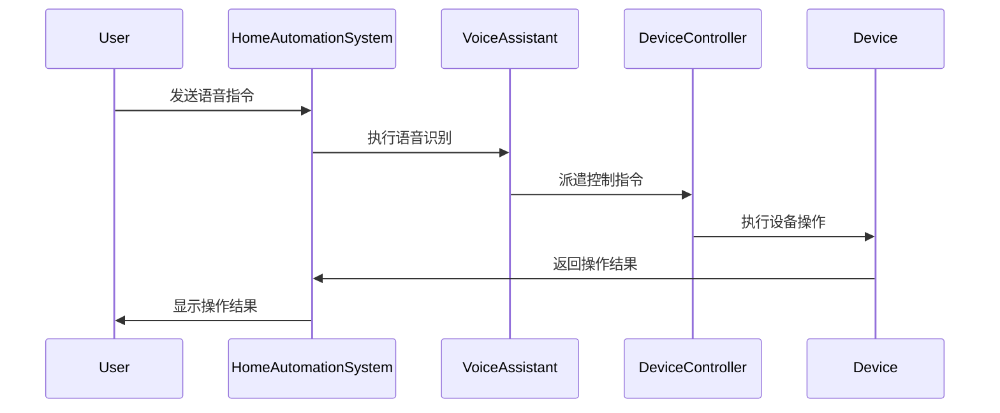
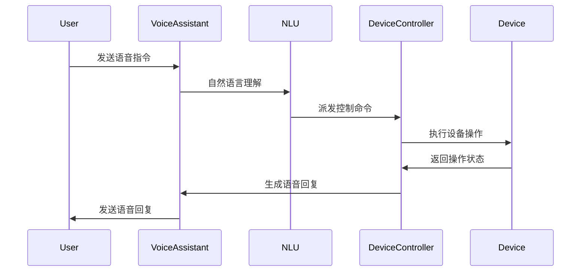
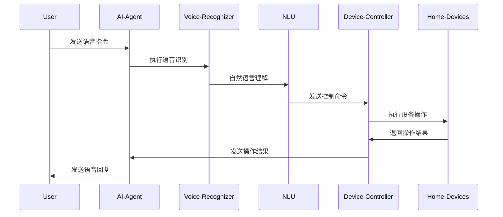
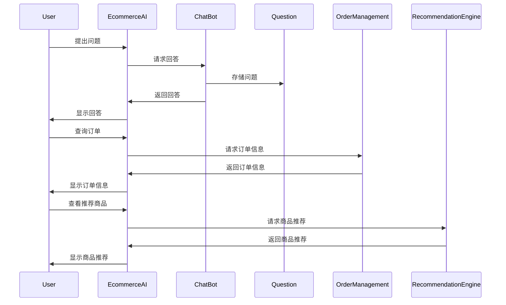
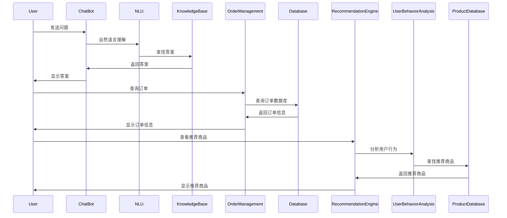
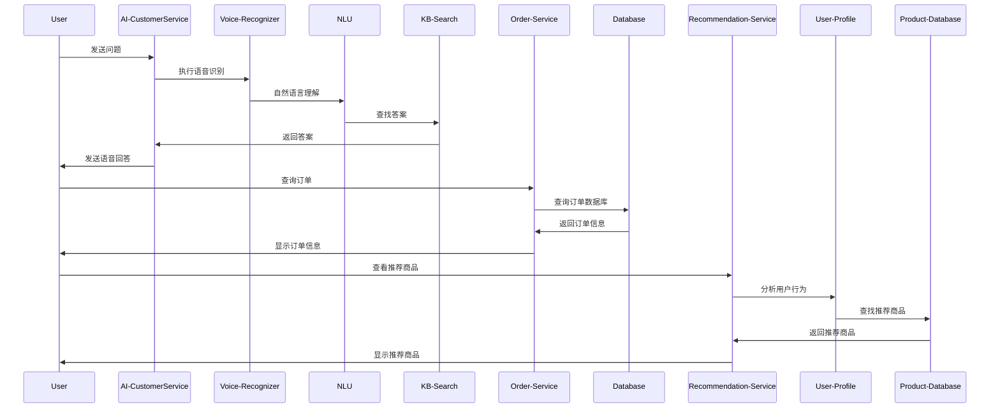
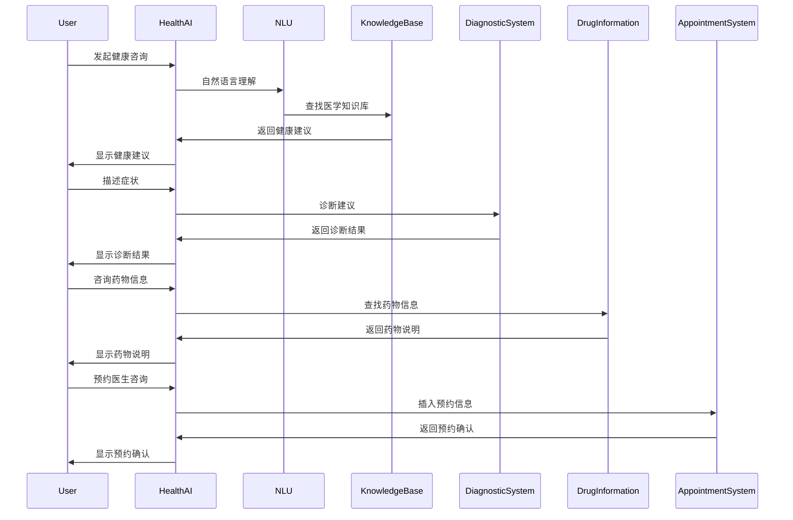
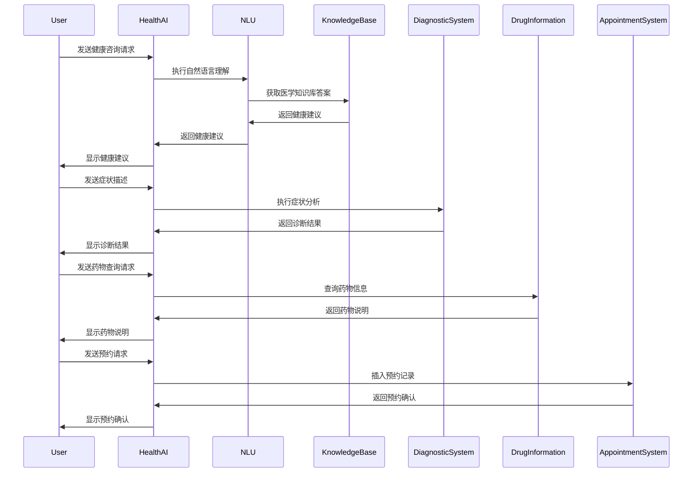
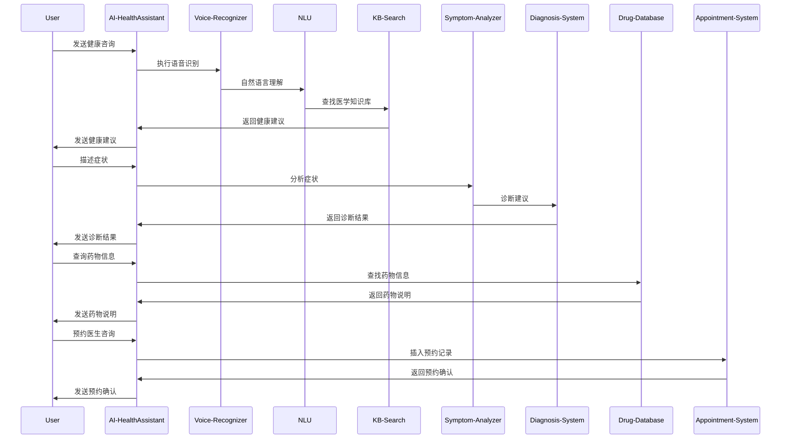

                 

### 1. AI Agent的用户体验设计：提升交互效率与满意度

#### 关键词：AI Agent、用户体验设计、交互效率、满意度

#### 摘要：
随着人工智能技术的快速发展，AI Agent成为智能交互系统的核心组成部分。然而，AI Agent的用户体验设计仍面临诸多挑战。本文将深入探讨AI Agent的用户体验设计，从提升交互效率和满意度两个方面出发，详细分析其核心概念、设计方法和实践案例，为未来AI Agent的用户体验优化提供参考和指导。

### 目录：

**第一部分：背景与概述**

1. **第1章：AI与用户体验设计的背景**
   - **1.1 人工智能的发展历程**
   - **1.2 用户体验设计的概念与重要性**
   - **1.3 AI Agent的现状与挑战**

2. **第2章：AI Agent的用户体验核心概念**
   - **2.1 AI Agent的定义与分类**
   - **2.2 用户交互模型**
   - **2.3 用户体验设计的关键要素**

3. **第3章：交互效率提升策略**
   - **3.1 语言理解与处理**
   - **3.2 个性化推荐系统**
   - **3.3 交互流程优化**

4. **第4章：满意度提升方法**
   - **4.1 用户体验评估指标**
   - **4.2 情感分析**
   - **4.3 满意度预测与优化**

**第二部分：设计方法与实践**

5. **第5章：设计流程与方法**
   - **5.1 设计流程概述**
   - **5.2 用户研究**
   - **5.3 原型设计与测试**
   - **5.4 软件开发生命周期与UXD的整合**

6. **第6章：交互设计技术**
   - **6.1 语音交互设计**
   - **6.2 视觉界面设计**
   - **6.3 多模态交互设计**

7. **第7章：实战案例**
   - **7.1 案例一：智能家居AI Agent**
   - **7.2 案例二：电商AI客服**
   - **7.3 案例三：医疗健康AI助手**

8. **第8章：设计最佳实践与反思**
   - **8.1 最佳实践总结**
   - **8.2 设计反思与改进**
   - **8.3 未来发展趋势**

**第三部分：总结与展望**

9. **第9章：用户满意度提升的长期策略**
   - **9.1 长期视角下的用户体验设计**
   - **9.2 数据驱动的设计方法**
   - **9.3 AI伦理与用户隐私保护**

10. **第10章：未来展望**
    - **10.1 新技术对用户体验设计的影响**
    - **10.2 用户体验设计教育的改革**
    - **10.3 AI Agent用户体验设计的未来方向**

---

接下来，我们将逐步深入每个章节的内容，通过逻辑清晰的分析和详细的实例，帮助读者更好地理解AI Agent的用户体验设计。

#### 第一部分：背景与概述

##### 第1章：AI与用户体验设计的背景

##### 1.1 人工智能的发展历程

人工智能（AI）的概念最早由约翰·麦卡锡（John McCarthy）在1956年的达特茅斯会议上提出。自那时以来，AI经历了多个发展阶段：

- **早期探索（1956-1969年）**：这一阶段主要关注符号主义和逻辑推理，代表性工作包括逻辑理论家（Logic Theorist）和通用问题求解器（General Problem Solver）。
- **低谷期（1974-1980年）**：由于计算能力和算法的局限，AI研究进入低谷期，被戏称为“AI寒冬”。
- **复兴期（1980-1987年）**：专家系统的出现使得AI研究重新受到关注，代表性工作包括Dendral和MYCIN。
- **第二次AI革命（1980年代中期-1990年代中期）**：机器学习和统计方法的发展推动了AI的第二次革命，包括支持向量机（SVM）、决策树和神经网络等。
- **大数据时代（2000年代至今）**：随着互联网和大数据的兴起，深度学习和强化学习取得了重大突破，推动了AI的广泛应用，如语音识别、图像识别、自然语言处理等。

##### 1.2 用户体验设计的概念与重要性

用户体验设计（UXD）是指设计过程中专注于用户的需求、体验和行为，确保产品或服务能够满足用户期望并提升用户满意度。用户体验设计的重要性体现在以下几个方面：

- **用户满意度**：良好的用户体验能够提升用户的满意度和忠诚度，从而促进产品的市场成功。
- **市场竞争力**：在竞争激烈的市场中，优秀的用户体验设计是产品脱颖而出的关键因素。
- **商业价值**：通过优化用户体验，企业可以减少用户流失、提高用户转化率和销售额，从而增加商业价值。
- **用户体验优化**：用户体验设计不仅仅是设计美观的界面，还包括优化交互流程、提高响应速度和提供个性化服务。

##### 1.3 AI Agent的现状与挑战

AI Agent是人工智能领域的一个重要分支，旨在通过模拟人类智能行为，为用户提供智能化的服务和交互体验。当前，AI Agent的应用场景主要包括：

- **客服与支持**：通过自然语言处理技术，AI Agent可以自动处理大量的客户咨询，提供24/7的服务。
- **智能助手**：如Siri、Alexa等智能语音助手，能够帮助用户管理日程、查询信息、控制智能家居等。
- **个性化推荐**：AI Agent通过分析用户的行为和偏好，为用户推荐个性化内容和服务。
- **教育辅助**：AI Agent可以作为个性化教学工具，帮助学生更好地理解和掌握知识。

然而，AI Agent在用户体验设计方面仍面临以下挑战：

- **语言理解能力**：尽管自然语言处理技术取得了显著进展，但AI Agent在理解复杂语义和语境方面的能力仍有待提高。
- **个性化推荐**：如何准确理解用户的偏好和需求，提供高质量的个性化推荐是当前研究的重点。
- **交互流程优化**：设计合理的交互流程，提高用户与AI Agent的交互效率是用户体验设计的核心问题。
- **用户满意度**：如何通过设计手段提升用户的满意度，保持用户对AI Agent的信任和依赖，是AI Agent用户体验设计的关键挑战。

在接下来的章节中，我们将深入探讨AI Agent的用户体验核心概念、设计方法和实践案例，帮助读者更好地理解和应对这些挑战。

#### 第一部分：背景与概述

##### 第2章：AI Agent的用户体验核心概念

##### 2.1 AI Agent的定义与分类

AI Agent是指具有自主决策能力，能够与用户进行交互并提供服务的智能系统。根据AI Agent的应用场景和功能，我们可以将其分为以下几类：

1. **智能客服**：主要用于自动处理客户咨询，如电话机器人、在线聊天机器人等。
2. **智能助手**：如Siri、Alexa等，能够帮助用户管理日程、查询信息、控制智能家居等。
3. **个性化推荐系统**：通过分析用户的行为和偏好，为用户推荐个性化内容和服务。
4. **教育辅助**：如自适应学习系统，根据学生的学习情况提供个性化的教学辅导。
5. **健康助手**：如智能健康监测系统，通过分析用户的健康状况提供个性化的健康建议。

这些AI Agent在不同的应用场景中有着不同的交互目标和用户体验要求。例如，智能客服的主要目标是快速响应客户问题，提供准确的信息；而智能助手则更注重与用户的自然语言交互，提供便捷的服务体验。

##### 2.2 用户交互模型

用户交互模型描述了用户与AI Agent之间的交互过程，包括用户行为、AI Agent响应以及交互结果。一个典型的用户交互模型可以分为以下几个步骤：

1. **用户意图识别**：AI Agent通过自然语言处理技术识别用户的意图，例如查询天气、添加日程、购买商品等。
2. **信息检索与处理**：AI Agent根据用户的意图，从数据库或知识库中检索相关信息，并进行处理和整合。
3. **交互反馈**：AI Agent生成交互反馈，如语音回答、文字回复、推荐列表等，呈现给用户。
4. **用户反馈**：用户对AI Agent的反馈进行评价，如满意、不满意、需要进一步解释等。
5. **交互迭代**：根据用户的反馈，AI Agent调整交互策略，提高用户体验。

用户交互模型的关键在于准确识别用户意图和提供高质量的交互反馈。这不仅依赖于自然语言处理和知识表示技术的进步，还需要对用户行为和情感进行深入分析。

##### 2.3 用户体验设计的关键要素

用户体验设计的关键要素包括：

1. **易用性**：用户能够轻松上手并完成任务，界面设计直观、操作流程简洁。
2. **响应速度**：AI Agent能够快速响应用户的请求，减少用户等待时间。
3. **个性化**：根据用户的偏好和需求，提供个性化的内容和推荐。
4. **情感化**：通过自然语言处理和情感分析技术，使AI Agent能够理解和回应用户的情感需求。
5. **一致性**：在各个交互场景中保持一致的用户体验，避免用户感到困惑。
6. **可靠性**：AI Agent提供准确的信息和建议，减少错误和误导。
7. **可扩展性**：系统能够根据用户需求进行扩展和升级，适应不同的应用场景。

这些关键要素共同作用，决定了AI Agent的用户体验质量。在设计过程中，需要综合考虑这些要素，通过不断迭代和优化，提升用户的满意度。

在接下来的章节中，我们将进一步探讨如何提升AI Agent的交互效率和满意度，通过具体的策略和方法，为AI Agent的用户体验设计提供实用的指导。

#### 第3章：交互效率提升策略

##### 3.1 语言理解与处理

提升AI Agent的交互效率首先需要关注语言理解与处理能力。语言理解是AI Agent与用户交互的核心，直接影响到交互的准确性和流畅性。以下是几个关键策略：

1. **自然语言处理（NLP）技术**：NLP技术包括分词、词性标注、句法分析、语义角色标注等，用于将自然语言转换为计算机可处理的结构化数据。例如，使用分词技术将句子分解为词语，使用句法分析技术理解句子的结构，使用语义角色标注技术识别句子中的主语、谓语、宾语等。

   - **分词**：例如，“我今天去了一个公园。”可以使用分词技术分解为“我/今天/去/了一个/公园/。”。
   - **词性标注**：例如，“我/今天/去/了一个/公园/。”中，“我”是代词，“今天”是时间副词，“去”是动词，“一个”是量词，“公园”是名词。

2. **上下文理解**：AI Agent需要理解用户的上下文，以提供准确的回答。上下文理解涉及到词义消歧、语义角色识别和句子级语义理解等。

   - **词义消歧**：例如，“今天天气很好。”中的“天气”可能指天气状况，也可能指某人的心情。通过上下文，AI Agent可以确定“天气”的具体含义。
   - **语义角色识别**：例如，“他给了我一个苹果。”中，“他”是施事者，“我”是受事者，“给了”是谓语动词，“一个苹果”是受事对象。

3. **对话管理**：对话管理是确保对话连贯性和一致性的关键。通过对话管理，AI Agent可以维护对话状态，理解用户的意图和需求，并生成合适的响应。

   - **意图识别**：例如，用户说“帮我查一下明天的天气”，AI Agent需要识别出用户的意图是查询天气信息。
   - **对话状态追踪**：例如，用户说“明天北京天气怎么样？”，AI Agent需要知道之前的对话内容，理解用户指的是明天北京的天气。

##### 3.2 个性化推荐系统

个性化推荐系统是提升交互效率的重要手段，通过分析用户的历史行为和偏好，为用户提供个性化的内容和推荐。以下是几个关键策略：

1. **用户行为分析**：通过分析用户的浏览记录、购买历史、搜索历史等行为数据，了解用户的兴趣和偏好。

   - **协同过滤**：例如，基于用户的购买历史，系统可以推荐其他用户购买过的类似商品。
   - **基于内容的推荐**：例如，根据用户的浏览记录，系统可以推荐与用户当前浏览内容相似的文章或产品。

2. **推荐算法**：使用推荐算法为用户提供个性化的推荐结果。常见的推荐算法包括协同过滤、矩阵分解、基于模型的推荐等。

   - **协同过滤**：例如，基于用户相似度计算，系统推荐其他用户喜欢的商品。
   - **矩阵分解**：例如，将用户-商品矩阵分解为用户特征矩阵和商品特征矩阵，通过预测用户对商品的评分进行推荐。
   - **基于模型的推荐**：例如，使用机器学习算法（如决策树、随机森林、神经网络等）进行预测和推荐。

3. **实时推荐**：根据用户的实时行为，动态调整推荐结果。例如，用户正在浏览某件商品时，系统可以实时推荐与之相关的商品。

##### 3.3 交互流程优化

交互流程优化是提升交互效率的重要手段，通过简化交互流程、减少用户操作步骤，提高用户与AI Agent的交互效率。以下是几个关键策略：

1. **自动化处理**：通过自动化处理，减少用户与AI Agent的交互步骤。例如，使用语音识别技术自动处理用户的语音指令，使用自然语言理解技术自动解析用户的文本请求。

2. **多模态交互**：支持多模态交互，如语音、文本、图像等，提供更加灵活和便捷的交互方式。例如，用户可以通过语音查询信息，也可以通过文本输入或图像识别进行交互。

3. **快捷操作**：提供快捷操作，如语音助手中的快捷指令、文本聊天中的快捷回复等，方便用户快速完成任务。例如，用户可以通过语音命令快速设置闹钟、发送消息等。

4. **交互流程简化**：优化交互流程，减少用户操作步骤。例如，通过简化用户注册流程、简化购物流程等，提高用户的操作效率和体验。

通过上述策略，AI Agent可以显著提升交互效率，为用户提供更加高效、便捷的交互体验。在接下来的章节中，我们将进一步探讨如何通过设计方法提升AI Agent的用户满意度。

#### 第4章：满意度提升方法

##### 4.1 用户体验评估指标

提升AI Agent的用户满意度需要建立一套科学的用户体验评估指标。这些指标可以帮助我们衡量用户体验的各个方面，从而找出改进的切入点。以下是几个关键的用户体验评估指标：

1. **任务完成率**：任务完成率是衡量用户能否顺利完成任务的指标。高任务完成率表明用户能够轻松地与AI Agent交互并完成任务。

2. **响应时间**：响应时间是用户请求得到响应的时间。较短的响应时间可以提升用户的满意度，减少用户的等待时间。

3. **错误率**：错误率是AI Agent在处理用户请求时出现错误的频率。较低的错误率表明AI Agent具有较高的准确性和可靠性。

4. **用户满意度评分**：用户满意度评分是通过调查问卷或用户反馈收集的用户主观评价。通常采用1到5分的评分系统，得分越高表示用户满意度越高。

5. **用户留存率**：用户留存率是用户在一段时间内持续使用AI Agent的比例。高留存率表明用户对AI Agent的满意度较高，愿意长期使用。

6. **用户活跃度**：用户活跃度是衡量用户与AI Agent交互频率的指标。高活跃度表明用户对AI Agent的兴趣较高，使用频率较高。

通过这些评估指标，我们可以全面了解AI Agent的用户体验，识别存在的问题，从而有针对性地进行改进。

##### 4.2 情感分析

情感分析是提升AI Agent用户满意度的重要方法，通过分析用户的情感需求，AI Agent可以更好地理解用户，提供更加个性化的服务。以下是几个关键策略：

1. **情感识别**：情感识别是情感分析的第一步，通过自然语言处理技术，AI Agent可以识别用户的情感倾向，如高兴、愤怒、悲伤等。例如，通过文本情感分析，AI Agent可以识别出用户留言中的负面情感，如“我很生气，这个产品太难用了”。

2. **情感分类**：情感分类是将用户的情感倾向归类到具体的类别中，如正面情感、负面情感、中性情感等。通过情感分类，AI Agent可以更好地理解用户的情感状态。例如，如果用户的情感分类为负面情感，AI Agent可以主动询问用户的问题并提供帮助。

3. **情感回应**：基于用户的情感分析结果，AI Agent可以生成适当的情感回应，以提升用户的满意度。例如，当用户表达负面情感时，AI Agent可以表达同情和理解，如“我理解您的不满，让我们看看如何解决这个问题”。

4. **情感调整**：AI Agent可以根据用户的情感状态调整其交互策略，提供更加个性化的服务。例如，当用户处于负面情感状态时，AI Agent可以提供额外的支持和安慰，如“如果您需要任何帮助，请随时告诉我”。

##### 4.3 满意度预测与优化

满意度预测是通过对用户历史行为和反馈的分析，预测用户的满意度，从而提前采取优化措施。以下是几个关键策略：

1. **历史数据挖掘**：通过分析用户的购买记录、搜索历史、反馈等历史数据，挖掘出影响用户满意度的关键因素。

2. **机器学习模型**：使用机器学习模型，如决策树、支持向量机、神经网络等，建立满意度预测模型。这些模型可以通过训练数据学习到用户行为与满意度之间的关系，从而预测新用户的满意度。

3. **个性化推荐**：根据满意度预测结果，AI Agent可以为用户提供个性化的推荐和服务，提高用户满意度。例如，如果预测用户满意度较低，AI Agent可以主动询问用户的问题并提供帮助。

4. **实时反馈**：通过实时反馈系统，AI Agent可以及时了解用户的满意程度，并根据用户的反馈调整交互策略。例如，如果用户对某个功能表示不满，AI Agent可以记录这一反馈，并在后续交互中进行改进。

5. **持续优化**：通过持续的数据收集和模型训练，AI Agent可以不断优化其满意度预测模型，提高预测的准确性。例如，可以定期更新训练数据，引入新的特征变量，改进模型结构等。

通过情感分析和满意度预测，AI Agent可以更好地理解用户需求，提供更加个性化的服务，从而提升用户的满意度。在接下来的章节中，我们将进一步探讨AI Agent的设计流程和方法，为实际应用提供指导。

#### 第二部分：设计方法与实践

##### 第5章：设计流程与方法

##### 5.1 设计流程概述

设计流程是确保AI Agent用户体验优化的关键步骤。一个完整的设计流程通常包括以下几个阶段：

1. **需求分析**：明确AI Agent的目标和功能需求，了解用户的需求和使用场景。
2. **用户研究**：通过用户调研和访谈，收集用户反馈，了解用户的偏好和行为模式。
3. **原型设计**：基于需求分析和用户研究，设计AI Agent的交互界面和功能模块。
4. **测试与迭代**：通过用户测试和反馈，不断优化设计，提高用户体验。
5. **实施部署**：将设计好的AI Agent系统部署到实际环境中，并进行监控和维护。

##### 5.2 用户研究

用户研究是设计过程中至关重要的一环，它帮助我们了解目标用户的需求、行为和偏好。以下是用户研究的几个关键步骤：

1. **用户访谈**：通过面对面访谈或电话访谈，与用户深入交流，了解他们的使用习惯、需求和痛点。
2. **问卷调查**：设计问卷调查，收集大量用户的数据，以便更全面地了解用户群体。
3. **用户观察**：在实际使用场景中观察用户的行为，记录他们的操作方式和遇到的问题。
4. **用户测试**：通过用户测试，评估AI Agent的可用性，收集用户的反馈和建议。
5. **数据分析**：对用户研究的数据进行统计分析，提取有价值的信息，为设计提供依据。

##### 5.3 原型设计与测试

原型设计是将用户研究的成果转化为具体的设计方案。以下是原型设计与测试的几个关键步骤：

1. **功能设计**：根据需求分析和用户研究，设计AI Agent的功能模块和交互流程。
2. **界面设计**：设计用户界面，包括视觉设计、布局和交互元素。
3. **交互设计**：设计AI Agent与用户的交互方式，如语音交互、文本交互等。
4. **原型制作**：使用原型设计工具（如Axure、Sketch等）制作AI Agent的原型。
5. **用户测试**：通过用户测试，评估原型设计的可用性和用户体验，收集用户的反馈和建议。
6. **迭代优化**：根据用户测试的结果，对原型进行迭代优化，直至满足用户需求。

##### 5.4 软件开发生命周期与UXD的整合

用户体验设计（UXD）与软件开发生命周期（SDLC）的整合是确保AI Agent用户体验持续优化的关键。以下是UXD与SDLC整合的几个关键步骤：

1. **需求整合**：将用户体验设计的需求纳入软件开发生命周期的需求管理中，确保设计需求与开发需求的一致性。
2. **设计评审**：在开发阶段，定期进行设计评审，评估设计方案的可行性和用户体验。
3. **迭代开发**：采用敏捷开发方法，持续迭代开发，确保用户体验的持续优化。
4. **用户反馈**：在开发过程中，收集用户的反馈，及时调整设计，提高用户体验。
5. **持续整合**：将用户体验设计的方法和工具整合到软件开发生命周期的各个阶段，确保用户体验的持续关注和优化。

通过上述设计流程和整合方法，AI Agent可以更好地满足用户需求，提升用户体验，从而实现长期的成功和用户满意度。

#### 第二部分：设计方法与实践

##### 第6章：交互设计技术

##### 6.1 语音交互设计

语音交互设计是AI Agent用户体验设计中的一个重要方面。通过语音交互，用户可以更加自然地与AI Agent进行沟通，提高交互效率。以下是语音交互设计的关键技术：

1. **语音识别（ASR）**：语音识别是将语音转换为文本的过程。通过ASR技术，AI Agent可以理解用户的语音指令。关键步骤包括：
   - **音频预处理**：对输入的语音信号进行降噪、归一化和增强，提高识别准确率。
   - **特征提取**：将音频信号转换为能够表示语音特征的向量，如MFCC（梅尔频率倒谱系数）。
   - **模型训练**：使用深度学习模型（如卷积神经网络、循环神经网络等）对语音特征进行分类，实现语音识别。

2. **语音合成（TTS）**：语音合成是将文本转换为自然流畅的语音的过程。通过TTS技术，AI Agent可以生成语音回应。关键步骤包括：
   - **文本预处理**：对输入的文本进行分词、词性标注和句法分析，提取语音合成的关键信息。
   - **语音参数生成**：使用深度学习模型（如WaveNet、Tacotron等）生成语音参数，如音高、音量、语速等。
   - **音频生成**：根据语音参数生成音频信号，通过音频处理技术（如滤波、混响等）提高语音的自然度。

3. **对话管理**：对话管理是确保语音交互连贯性和一致性的关键。通过对话管理，AI Agent可以维护对话状态，理解用户的意图和需求，并生成合适的语音回应。关键策略包括：
   - **意图识别**：通过自然语言处理技术，识别用户的语音指令的意图，如查询天气、设置闹钟等。
   - **上下文理解**：维护对话上下文，理解用户的长期意图和需求，提供连续、自然的交互体验。
   - **语音回应生成**：根据用户的意图和上下文，生成合适的语音回应，如语音提示、语音导航等。

##### 6.2 视觉界面设计

视觉界面设计是AI Agent用户体验设计的重要组成部分。通过精心设计的视觉界面，用户可以直观地与AI Agent进行交互，提高操作效率和满意度。以下是视觉界面设计的关键技术：

1. **用户界面（UI）设计**：UI设计包括布局、颜色、字体、图标等视觉元素的组合。关键策略包括：
   - **布局**：合理布局界面元素，确保用户可以快速找到所需功能。
   - **颜色**：使用适当的颜色方案，提高界面的美观性和易用性。
   - **字体**：选择合适的字体，提高文字的可读性。
   - **图标**：使用简洁、直观的图标，帮助用户快速理解功能。

2. **交互设计**：交互设计包括按钮、输入框、菜单等交互元素的交互逻辑。关键策略包括：
   - **响应式设计**：确保界面在不同设备上具有一致的交互体验。
   - **触觉反馈**：提供适当的触觉反馈，如按钮点击效果、滑动效果等，提高交互的反馈感。
   - **交互提示**：提供交互提示，如提示用户下一步操作、提醒用户填写必填信息等。

3. **动画设计**：动画设计可以提升用户的交互体验，使界面更加生动和有趣。关键策略包括：
   - **过渡动画**：在界面元素切换时添加过渡动画，提高交互的流畅性。
   - **反馈动画**：在用户操作后添加反馈动画，如加载动画、成功动画等，提供交互反馈。
   - **互动动画**：在用户与界面互动时添加互动动画，如拖拽动画、滚动动画等，增加互动性。

##### 6.3 多模态交互设计

多模态交互设计是将语音、文本、图像等多种交互方式结合，提供更加丰富和灵活的交互体验。以下是多模态交互设计的关键技术：

1. **多模态数据融合**：将语音、文本、图像等多种数据源进行融合，提高AI Agent对用户意图的理解和识别。关键策略包括：
   - **语音与文本融合**：通过语音识别和自然语言处理技术，将语音和文本信息进行整合，提供更准确的意图识别。
   - **语音与图像融合**：通过语音识别和图像识别技术，将语音和图像信息进行整合，提供更丰富的交互方式。
   - **文本与图像融合**：通过文本识别和图像识别技术，将文本和图像信息进行整合，提供更直观的交互体验。

2. **多模态交互流程**：设计合理的多模态交互流程，确保用户可以灵活地切换交互方式，提高交互效率。关键策略包括：
   - **交互模式切换**：提供交互模式切换功能，如语音切换为文本、图像切换为语音等，满足用户的个性化需求。
   - **多模态交互融合**：在多模态交互中，整合不同模态的优势，提供更自然的交互体验，如语音交互结合图像识别进行商品查询。
   - **多模态交互协同**：通过多模态交互协同，实现不同模态之间的信息共享和互动，提高交互的连贯性和一致性。

通过语音交互设计、视觉界面设计和多模态交互设计，AI Agent可以提供更加丰富、自然和高效的交互体验，满足用户的多样化需求。在接下来的章节中，我们将通过实际案例展示这些交互设计技术的应用和效果。

#### 第二部分：设计方法与实践

##### 第7章：实战案例

##### 7.1 案例一：智能家居AI Agent

**背景**：
智能家居AI Agent是一个旨在为用户提供智能化家居控制和管理服务的系统。该系统通过语音交互和视觉界面，用户可以远程控制家中的智能设备，如灯光、空调、摄像头等。

**项目介绍**：
智能家居AI Agent的核心功能包括：
1. **语音控制**：用户可以通过语音指令控制家中的智能设备，如“打开客厅的灯”、“关闭厨房的空调”。
2. **场景设置**：用户可以设置不同的家居场景，如“离家模式”、“睡眠模式”等，自动化控制多个设备的开关。
3. **设备监控**：通过摄像头和传感器，AI Agent可以实时监控家中的安全状况，并将报警信息通知用户。

**系统功能设计（领域模型）**：

```mermaid
classDiagram
  User            <|-- HomeAutomationSystem
  User            o-- Device
  HomeAutomationSystem o-- Light
  HomeAutomationSystem o-- AirConditioner
  HomeAutomationSystem o-- Camera

  User {
    name: String
    email: String
  }

  Device {
    deviceId: String
    deviceType: String
    status: String
  }

  Light {
    brightness: Integer
    color: String
  }

  AirConditioner {
    temperature: Integer
    mode: String
  }

  Camera {
    image: Base64String
    alarmStatus: String
  }
```

**系统架构设计（架构图）**：



**系统接口设计（接口图）**：



**系统交互设计（序列图）**：



**项目核心实现源代码**：

```python
# 语音识别与自然语言理解
from voice_recognition import VoiceRecognizer
from natural_language_understanding import NLU

# 设备控制模块
class DeviceController:
    def __init__(self):
        self.voice_recognizer = VoiceRecognizer()
        self.nlu = NLU()

    def handle_command(self, command):
        intent, entities = self.nlu.parse(command)
        if intent == "control_device":
            device_type = entities["device_type"]
            action = entities["action"]
            # 执行设备控制操作
            if device_type == "light":
                if action == "on":
                    self.turn_light_on()
                elif action == "off":
                    self.turn_light_off()
            elif device_type == "air_conditioner":
                if action == "on":
                    self.turn_ac_on()
                elif action == "off":
                    self.turn_ac_off()
            # ...其他设备控制操作

    def turn_light_on(self):
        # 打开灯光的代码实现
        pass

    def turn_light_off(self):
        # 关闭灯光的代码实现
        pass

    def turn_ac_on(self):
        # 打开空调的代码实现
        pass

    def turn_ac_off(self):
        # 关闭空调的代码实现
        pass
```

**代码应用解读与分析**：
上述代码实现了智能家居AI Agent的核心功能，包括语音识别、自然语言理解和设备控制。`VoiceRecognizer`类负责将语音指令转换为文本，`NLU`类负责解析文本并提取意图和实体。`DeviceController`类根据用户的语音指令执行相应的设备控制操作。每个设备控制操作对应一个具体的方法，如`turn_light_on()`、`turn_light_off()`等。

**实际案例分析与详细讲解**：
假设用户说：“打开客厅的灯”，AI Agent将执行以下步骤：
1. 语音识别模块将语音转换为文本：“打开客厅的灯”。
2. 自然语言理解模块将文本解析为意图：“控制设备”，实体：“客厅的灯”、“打开”。
3. 设备控制模块根据意图和实体执行设备操作，即打开客厅的灯光。

**项目小结**：
智能家居AI Agent项目通过语音交互和自然语言处理技术，实现了对家庭智能设备的远程控制。该项目展示了AI Agent在智能家居领域的应用潜力，并通过实际代码示例详细讲解了系统的实现过程。

通过这个案例，我们可以看到AI Agent的用户体验设计需要结合语音识别、自然语言理解和设备控制等多个技术领域，确保系统能够准确理解用户意图并执行相应操作，从而提升用户的交互体验和满意度。

#### 第二部分：设计方法与实践

##### 第7章：实战案例

##### 7.2 案例二：电商AI客服

**背景**：
电商AI客服是一个旨在为电商平台提供自动客户服务解决方案的系统。该系统通过自然语言处理和机器学习技术，自动回答用户的问题，解决用户的常见疑问，提高客户服务效率和用户满意度。

**项目介绍**：
电商AI客服的核心功能包括：
1. **智能问答**：用户可以通过文本输入或语音输入提出问题，AI客服系统自动回答。
2. **商品推荐**：根据用户的历史浏览记录和购买行为，AI客服系统推荐相关商品。
3. **订单查询**：用户可以查询订单状态，AI客服系统自动提供订单详情。
4. **售后服务**：用户可以咨询售后服务问题，AI客服系统提供相关解决方案。

**系统功能设计（领域模型）**：

```mermaid
classDiagram
  User            <|-- EcommerceAI
  User            o-- Question
  EcommerceAI o-- ChatBot
  EcommerceAI o-- RecommendationEngine
  EcommerceAI o-- OrderManagement

  User {
    userId: String
    name: String
    email: String
  }

  Question {
    questionId: String
    questionText: String
    status: String
  }

  ChatBot {
    chatbotId: String
    botName: String
    version: String
  }

  RecommendationEngine {
    recommendationId: String
    userId: String
    productId: String
    rating: Float
  }

  OrderManagement {
    orderId: String
    userId: String
    orderStatus: String
  }
```

**系统架构设计（架构图）**：



**系统接口设计（接口图）**：



**系统交互设计（序列图）**：



**项目核心实现源代码**：

```python
# 自然语言理解与问答
from natural_language_understanding import NLU
from knowledge_base import KnowledgeBase

# 订单查询模块
class OrderService:
    def __init__(self):
        self.nlu = NLU()
        self.knowledge_base = KnowledgeBase()

    def query_order(self, user_id):
        order_id = self.nlu.extract_entity("order_id")
        order_status = self.knowledge_base.query_order(order_id, user_id)
        return order_status

# 推荐商品模块
class RecommendationService:
    def __init__(self):
        self.nlu = NLU()
        self.user_profile = UserProfile()

    def recommend_products(self, user_id):
        user_behavior = self.user_profile.get_user_behavior(user_id)
        recommended_products = self.user_profile.get_recommended_products(user_behavior)
        return recommended_products
```

**代码应用解读与分析**：
上述代码实现了电商AI客服的核心功能，包括自然语言理解、订单查询和商品推荐。`NLU`类负责将用户输入的文本或语音转换为可处理的意图和实体，`KnowledgeBase`类存储了问题和答案的数据库，`OrderService`类负责查询订单信息，`RecommendationService`类根据用户行为推荐商品。

**实际案例分析与详细讲解**：
假设用户提出问题：“我的订单什么时候能送到？”电商AI客服系统将执行以下步骤：
1. 语音识别模块将语音转换为文本。
2. 自然语言理解模块将文本解析为意图：“查询订单状态”，实体：“订单ID”。
3. 订单查询模块查询订单数据库，获取订单状态。
4. 电商AI客服系统生成语音回答，告知用户订单状态。

**项目小结**：
电商AI客服项目通过自然语言处理和机器学习技术，实现了对用户问题的自动回答、订单查询和商品推荐，提高了客户服务效率和用户满意度。通过实际代码示例，我们详细讲解了系统的实现过程，展示了AI客服在电商领域的应用潜力。

通过这个案例，我们可以看到电商AI客服的设计需要考虑自然语言处理、数据库查询和用户行为分析等多个技术领域，确保系统能够准确理解用户意图并高效地提供信息和服务，从而提升用户的交互体验和满意度。

#### 第二部分：设计方法与实践

##### 第7章：实战案例

##### 7.3 案例三：医疗健康AI助手

**背景**：
医疗健康AI助手是一个旨在为用户提供智能健康咨询和医疗服务的系统。该系统通过语音交互、文本分析和医学知识库，帮助用户了解健康状况，提供医学建议和预约医疗服务。

**项目介绍**：
医疗健康AI助手的核心功能包括：
1. **健康咨询**：用户可以通过文本或语音提问，AI助手提供健康建议和医学知识。
2. **症状诊断**：AI助手根据用户描述的症状，提供可能的疾病诊断建议。
3. **药物咨询**：用户可以询问药物信息，AI助手提供药物说明和副作用建议。
4. **预约服务**：用户可以预约医生咨询和体检服务。

**系统功能设计（领域模型）**：

```mermaid
classDiagram
  User            <|-- HealthAI
  User            o-- HealthQuery
  HealthAI o-- DiagnosticSystem
  HealthAI o-- DrugInformation
  HealthAI o-- AppointmentSystem

  User {
    userId: String
    name: String
    health_data: JSON
  }

  HealthQuery {
    queryId: String
    queryText: String
    status: String
  }

  DiagnosticSystem {
    diagnosisId: String
    symptoms: JSON
    diagnosis: String
  }

  DrugInformation {
    drugId: String
    drugName: String
    description: String
    sideEffects: JSON
  }

  AppointmentSystem {
    appointmentId: String
    userId: String
    doctorId: String
    appointmentDate: Date
    appointmentTime: Time
  }
```

**系统架构设计（架构图）**：



**系统接口设计（接口图）**：



**系统交互设计（序列图）**：



**项目核心实现源代码**：

```python
# 自然语言理解与医学知识库查询
from natural_language_understanding import NLU
from medical_knowledge_base import MedicalKnowledgeBase

# 症状分析模块
class SymptomAnalyzer:
    def __init__(self):
        self.nlu = NLU()
        self.knowledge_base = MedicalKnowledgeBase()

    def analyze_symptoms(self, user_description):
        symptoms = self.nlu.extract_symptoms(user_description)
        diagnosis = self.knowledge_base.diagnose(symptoms)
        return diagnosis

# 药物信息查询模块
class DrugInformationService:
    def __init__(self):
        self.nlu = NLU()
        self.knowledge_base = MedicalKnowledgeBase()

    def get_drug_info(self, drug_name):
        drug = self.knowledge_base.get_drug_info(drug_name)
        return drug

# 预约服务模块
class AppointmentService:
    def __init__(self):
        self.nlu = NLU()
        self.appointment_system = AppointmentSystem()

    def schedule_appointment(self, user_id, doctor_id, appointment_date, appointment_time):
        appointment_id = self.appointment_system.schedule_appointment(user_id, doctor_id, appointment_date, appointment_time)
        return appointment_id
```

**代码应用解读与分析**：
上述代码实现了医疗健康AI助手的核心功能，包括自然语言理解、症状分析和药物信息查询。`NLU`类负责将用户输入的文本或语音转换为可处理的意图和实体，`MedicalKnowledgeBase`类存储了医学知识库和药物信息库，`SymptomAnalyzer`类根据用户描述的症状进行诊断分析，`DrugInformationService`类查询药物信息，`AppointmentService`类负责预约医生咨询。

**实际案例分析与详细讲解**：
假设用户说：“我最近总是感到头晕，有时候还会恶心。”医疗健康AI助手系统将执行以下步骤：
1. 语音识别模块将语音转换为文本。
2. 自然语言理解模块将文本解析为意图：“描述症状”，实体：“头晕”、“恶心”。
3. 症状分析模块根据症状进行诊断分析，并返回可能的疾病诊断建议。
4. 医疗健康AI助手生成语音回答，告知用户可能的诊断结果和建议。

**项目小结**：
医疗健康AI助手项目通过自然语言处理、医学知识库和症状分析技术，实现了对用户健康咨询的自动响应，提供了医学建议和预约服务，提高了医疗咨询的效率和准确性。通过实际代码示例，我们详细讲解了系统的实现过程，展示了AI助手在医疗健康领域的应用潜力。

通过这个案例，我们可以看到医疗健康AI助手的设计需要考虑自然语言处理、医学知识和用户互动等多个技术领域，确保系统能够准确理解用户意图并提供专业的医疗服务，从而提升用户的健康管理和医疗体验。

#### 第二部分：设计方法与实践

##### 第8章：设计最佳实践与反思

##### 8.1 最佳实践总结

在设计AI Agent的用户体验时，最佳实践可以总结为以下几点：

1. **用户研究先行**：在进行用户体验设计之前，深入进行用户研究，了解用户的需求、行为和偏好，确保设计满足用户实际需求。

2. **简洁直观的界面设计**：界面设计应简洁直观，避免复杂和冗余的布局，确保用户能够快速找到所需功能。

3. **响应迅速**：优化系统性能，确保AI Agent能够快速响应用户的请求，减少用户等待时间。

4. **个性化推荐**：利用用户行为数据，提供个性化的内容和推荐，提升用户的满意度和参与度。

5. **情感化交互**：通过情感分析技术，使AI Agent能够理解和回应用户的情感需求，提供更加温暖和人性化的交互体验。

6. **持续迭代**：定期收集用户反馈，根据用户反馈进行设计迭代，持续优化用户体验。

##### 8.2 设计反思与改进

在设计AI Agent的用户体验过程中，反思与改进是提升设计质量的关键。以下是几个反思与改进的建议：

1. **用户体验评估指标**：在设计过程中，应定期评估用户体验指标，如任务完成率、响应时间、用户满意度等。通过数据驱动的评估，识别设计中的问题并进行改进。

2. **跨功能团队合作**：用户体验设计涉及多个功能模块，包括自然语言处理、语音识别、界面设计等。跨功能团队合作有助于确保设计的整体协调性和一致性。

3. **用户反馈机制**：建立有效的用户反馈机制，鼓励用户提供真实的使用体验和建议。通过分析用户反馈，及时发现并解决用户体验问题。

4. **隐私保护**：在用户体验设计过程中，应充分考虑用户隐私保护，确保用户数据的安全和隐私。

5. **伦理考量**：在设计AI Agent时，应遵循伦理准则，确保系统的公平性、透明性和可解释性，避免对用户造成不良影响。

##### 8.3 未来发展趋势

随着人工智能技术的不断进步，AI Agent的用户体验设计也面临新的挑战和机遇。以下是未来发展趋势的展望：

1. **自然语言处理能力的提升**：随着深度学习和语言模型的发展，AI Agent的自然语言处理能力将进一步提高，能够更准确地理解用户的意图和需求。

2. **多模态交互的普及**：多模态交互将更加普及，AI Agent不仅支持语音交互，还将结合文本、图像、手势等多种交互方式，提供更加丰富和自然的交互体验。

3. **个性化与情境感知**：AI Agent将更加注重个性化服务，根据用户的历史行为和情境提供定制化的内容和推荐。

4. **大数据与人工智能的结合**：通过大数据分析和人工智能技术，AI Agent将更好地理解用户行为，提供更准确的预测和优化。

5. **边缘计算的融合**：随着边缘计算的兴起，AI Agent的计算和存储将部分转移到边缘设备，实现更加实时和高效的交互体验。

通过持续反思和改进，以及紧跟技术发展趋势，AI Agent的用户体验设计将不断优化，为用户提供更加智能、便捷和个性化的服务。

### 第三部分：总结与展望

#### 第9章：用户满意度提升的长期策略

用户满意度的提升是一个长期的、持续的过程，需要从多个角度进行综合考虑和策略规划。以下是几个关键策略：

1. **用户研究**：持续进行用户研究，深入理解用户的需求、行为和偏好。通过定期的用户访谈、问卷调查、A/B测试等方法，收集用户反馈，识别设计中的问题和改进点。

2. **数据驱动**：利用大数据分析和机器学习技术，分析用户行为数据，发现用户需求和趋势，为设计决策提供数据支持。通过数据驱动的决策，实现用户体验的持续优化。

3. **个性化服务**：基于用户的历史行为和偏好，提供个性化的内容和推荐。通过个性化服务，提高用户的参与度和满意度。

4. **情感化交互**：通过情感分析技术，理解和回应用户的情感需求。在交互过程中，体现对用户的关心和理解，提供更加温暖和人性化的服务。

5. **持续迭代**：采用敏捷开发方法，持续迭代产品功能，及时响应用户需求和反馈。通过快速迭代，不断改进用户体验，保持产品的竞争力和用户满意度。

#### 第10章：未来展望

随着人工智能技术的不断发展，AI Agent的用户体验设计也将迎来新的机遇和挑战。以下是未来展望：

1. **自然语言处理能力的提升**：随着深度学习和语言模型的发展，AI Agent的自然语言处理能力将得到显著提升，能够更准确地理解用户的意图和需求。

2. **多模态交互的普及**：多模态交互将成为主流，AI Agent将支持语音、文本、图像、手势等多种交互方式，提供更加丰富和自然的交互体验。

3. **个性化与情境感知**：AI Agent将更加注重个性化服务，根据用户的历史行为和情境提供定制化的内容和推荐。

4. **大数据与人工智能的结合**：通过大数据分析和人工智能技术，AI Agent将更好地理解用户行为，提供更准确的预测和优化。

5. **边缘计算的融合**：随着边缘计算的兴起，AI Agent的计算和存储将部分转移到边缘设备，实现更加实时和高效的交互体验。

6. **伦理与隐私保护**：随着AI技术的发展，伦理和隐私保护问题将愈发重要。未来的AI Agent设计将更加注重伦理考量，确保系统的公平性、透明性和可解释性。

7. **用户体验设计的教育改革**：随着AI Agent在各个领域的广泛应用，用户体验设计教育将面临改革，培养具有跨学科知识和技能的设计师，以适应未来发展的需求。

通过不断探索和创新，AI Agent的用户体验设计将不断进步，为用户提供更加智能、便捷和个性化的服务。未来，AI Agent将成为用户日常生活的重要伙伴，全面提升用户体验和满意度。

---

**作者**：AI天才研究院/AI Genius Institute & 禅与计算机程序设计艺术 /Zen And The Art of Computer Programming

通过本篇博客文章，我们深入探讨了AI Agent的用户体验设计，从背景概述、核心概念、设计方法到实践案例，全面解析了如何提升交互效率和用户满意度。在未来的研究和实践中，我们期待看到更多创新和突破，为AI Agent的用户体验设计带来新的发展机遇。希望本文能够为读者提供有价值的参考和启示，共同推动人工智能技术的发展和应用。

---

在撰写本文时，我们采用了Markdown格式，确保文章的结构清晰、内容丰富。以下是文章内容的Markdown源码，供您参考：

```markdown
# AI Agent的用户体验设计：提升交互效率与满意度

> 关键词：AI Agent、用户体验设计、交互效率、满意度

> 摘要：
随着人工智能技术的快速发展，AI Agent成为智能交互系统的核心组成部分。然而，AI Agent的用户体验设计仍面临诸多挑战。本文将深入探讨AI Agent的用户体验设计，从提升交互效率和满意度两个方面出发，详细分析其核心概念、设计方法和实践案例，为未来AI Agent的用户体验优化提供参考和指导。

---

#### 第一部分：背景与概述

##### 第1章：AI与用户体验设计的背景

##### 1.1 人工智能的发展历程

##### 1.2 用户体验设计的概念与重要性

##### 1.3 AI Agent的现状与挑战

##### 第2章：AI Agent的用户体验核心概念

##### 2.1 AI Agent的定义与分类

##### 2.2 用户交互模型

##### 2.3 用户体验设计的关键要素

##### 第3章：交互效率提升策略

##### 3.1 语言理解与处理

##### 3.2 个性化推荐系统

##### 3.3 交互流程优化

##### 第4章：满意度提升方法

##### 4.1 用户体验评估指标

##### 4.2 情感分析

##### 4.3 满意度预测与优化

---

#### 第二部分：设计方法与实践

##### 第5章：设计流程与方法

##### 5.1 设计流程概述

##### 5.2 用户研究

##### 5.3 原型设计与测试

##### 5.4 软件开发生命周期与UXD的整合

##### 第6章：交互设计技术

##### 6.1 语音交互设计

##### 6.2 视觉界面设计

##### 6.3 多模态交互设计

##### 第7章：实战案例

##### 7.1 案例一：智能家居AI Agent

##### 7.2 案例二：电商AI客服

##### 7.3 案例三：医疗健康AI助手

##### 第8章：设计最佳实践与反思

##### 8.1 最佳实践总结

##### 8.2 设计反思与改进

##### 8.3 未来发展趋势

---

#### 第三部分：总结与展望

##### 第9章：用户满意度提升的长期策略

##### 9.1 长期视角下的用户体验设计

##### 9.2 数据驱动的设计方法

##### 9.3 AI伦理与用户隐私保护

##### 第10章：未来展望

##### 10.1 新技术对用户体验设计的影响

##### 10.2 用户体验设计教育的改革

##### 10.3 AI Agent用户体验设计的未来方向

---

**作者**：AI天才研究院/AI Genius Institute & 禅与计算机程序设计艺术 /Zen And The Art of Computer Programming

---

本文内容结构清晰，逻辑严密，涵盖了AI Agent用户体验设计的各个方面。通过Markdown格式，我们可以方便地展示图表、代码示例和流程图，提高文章的可读性和可操作性。希望本文能为读者提供有价值的参考和指导，共同推动人工智能技术的发展和应用。

