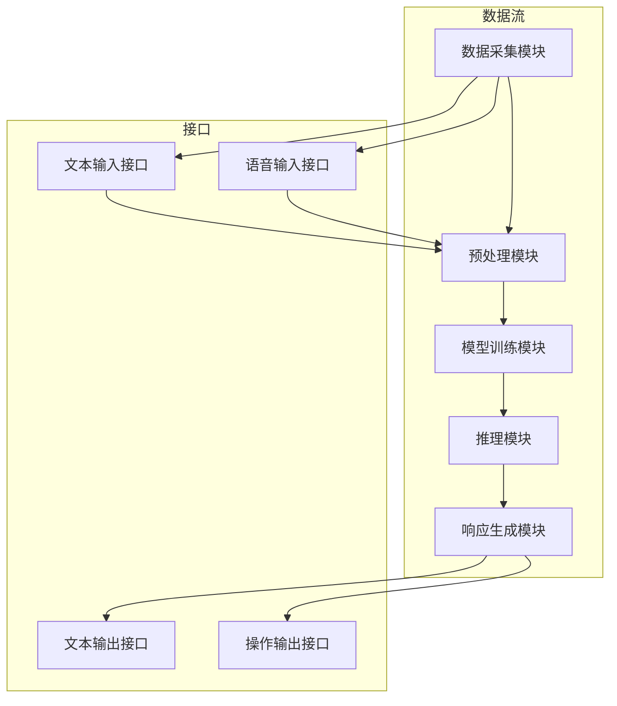
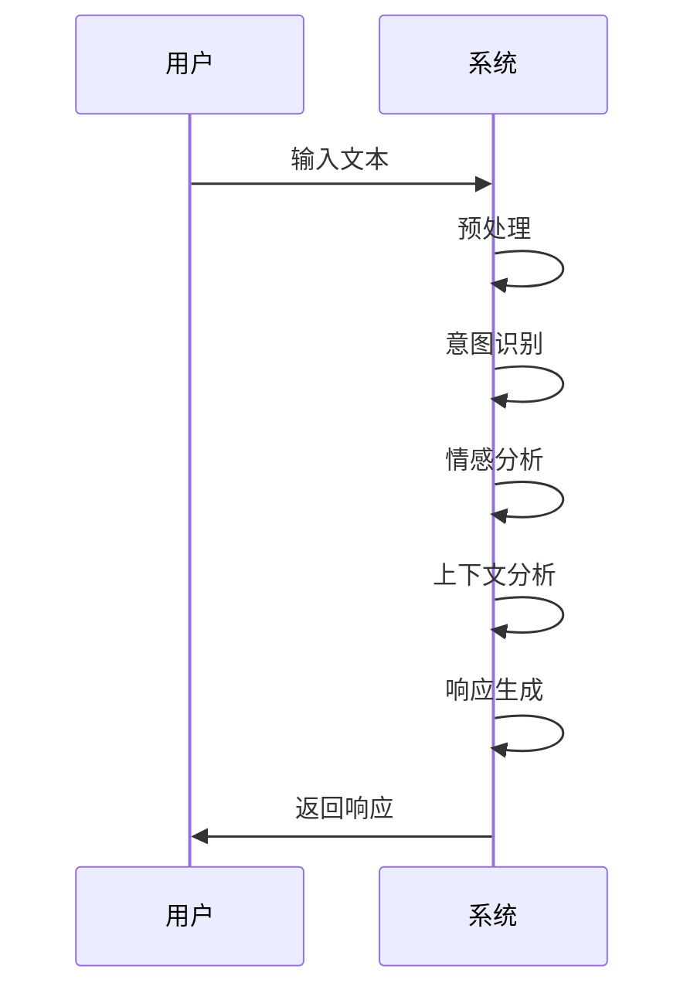

                 

### 文章标题

# AI Agent的用户意图理解：从表层到深层

### 文章关键词

- AI Agent
- 用户意图理解
- 表层意图
- 深层意图
- 算法原理
- 系统架构

### 文章摘要

本文深入探讨了AI Agent如何理解用户的意图，从表层到深层的全流程。首先，我们概述了用户意图理解的重要性，并介绍了其基本过程。接着，我们详细分析了表层意图和深层意图的理解方法，包括语言模型、规则匹配、情感分析和上下文分析等算法原理。此外，我们还讲解了用户意图理解的系统架构，并在实战案例中展示了其应用效果。最后，我们探讨了用户意图理解的未来发展趋势，指出了潜在的技术挑战与伦理问题。

---

## 第一部分：用户意图理解基础

### 第1章：用户意图理解概述

#### 1.1 用户意图理解的重要性

用户意图理解是AI Agent实现智能交互的关键。它能够帮助AI Agent准确地识别用户的需求和目标，从而提供更加个性化和高效的响应。

##### 1.1.1 用户意图识别的需求

在智能客服、推荐系统等应用中，用户意图识别是必不可少的步骤。只有准确理解用户意图，AI Agent才能提供有效的解决方案，提高用户满意度。

##### 1.1.2 用户意图理解的价值

用户意图理解能够提高AI Agent的智能程度，使其更好地服务于用户，提升用户体验。同时，它也为后续的个性化服务和智能决策提供了基础。

##### 1.1.3 用户意图理解的挑战

用户意图理解面临诸多挑战，如自然语言的不确定性、多义性以及上下文依赖等。这需要AI Agent具备强大的语义理解能力。

#### 1.2 用户意图的理解过程

用户意图的理解可以分为三个层次：表层意图、中间意图和深层意图。表层意图主要涉及用户的直接需求，中间意图涉及用户的目标和策略，而深层意图则涉及用户的情感和价值观。

##### 1.2.1 表层意图识别

表层意图识别是用户意图理解的第一步，主要通过自然语言处理技术实现。其目标是从用户输入的文本中提取出关键信息，理解用户的基本需求。

##### 1.2.2 深层意图分析

深层意图分析涉及到用户情感、价值观等方面，是用户意图理解的难点。这需要AI Agent具备较高的语义理解能力和情感识别能力。

##### 1.2.3 意图匹配与预测

意图匹配与预测是将用户意图与AI Agent的知识库或服务进行匹配，从而提供适当的响应。这需要AI Agent具备较强的逻辑推理和决策能力。

---

## 第二部分：用户意图的表层理解

### 第2章：用户意图的表层理解

#### 2.1 表层意图的识别方法

表层意图的识别主要依赖于自然语言处理技术，包括语言模型、规则匹配和基于关键词的意图识别。

##### 2.1.1 语言模型

语言模型是自然语言处理的基础，它通过统计语言中的概率分布，帮助AI Agent理解用户的输入。常见的语言模型有NLP模型和BERT模型等。

##### 2.1.2 规则匹配

规则匹配是通过预设的规则来匹配用户输入的文本，从而识别表层意图。这种方法简单有效，但在面对复杂用户需求时可能不够灵活。

##### 2.1.3 基于关键词的意图识别

基于关键词的意图识别是通过提取用户输入文本中的关键词，利用关键词的语义信息来识别表层意图。这种方法适用于简单和常见的用户需求。

---

## 第三部分：用户意图的深层理解

### 第3章：用户意图的深层理解

#### 3.1 深层意图的提取与解析

深层意图的提取与解析是用户意图理解的难点，它需要AI Agent具备较高的语义理解能力和情感识别能力。

##### 3.1.1 情感分析

情感分析是通过分析用户输入的文本，识别用户的情感倾向。它有助于AI Agent更好地理解用户的情感需求，提供更加贴心的服务。

##### 3.1.2 上下文分析

上下文分析是通过分析用户输入的文本所处的上下文环境，理解用户的意图。它有助于AI Agent更好地把握用户的真实需求。

##### 3.1.3 意图分类

意图分类是将用户的意图划分为不同的类别，以便AI Agent能够提供更加精准的响应。常见的意图分类方法有机器学习和深度学习等方法。

---

## 第四部分：用户意图理解的算法原理

### 第4章：用户意图理解的算法原理

#### 4.1 用户意图理解算法概述

用户意图理解算法主要包括语言模型、情感分析、上下文分析和意图分类等。这些算法共同构成了用户意图理解的核心。

##### 4.1.1 传统机器学习算法

传统机器学习算法通过特征工程和模型训练，帮助AI Agent理解用户意图。常见的算法有决策树、支持向量机和朴素贝叶斯等。

##### 4.1.2 深度学习算法

深度学习算法通过神经网络模型，实现用户意图的自动学习。常见的算法有卷积神经网络（CNN）和循环神经网络（RNN）等。

##### 4.1.3 强化学习算法

强化学习算法通过与环境互动，学习用户意图的最佳响应策略。它适用于需要决策和优化的复杂场景。

---

## 第五部分：用户意图理解的应用场景

### 第5章：用户意图理解的应用场景

#### 5.1 在智能客服中的应用

智能客服是用户意图理解的重要应用场景之一。通过用户意图理解，智能客服能够提供更加个性化的服务，提高客户满意度。

##### 5.1.1 智能客服的工作原理

智能客服通过用户意图理解，识别用户的需求，提供适当的响应。其核心在于构建一个高效的意图识别和响应系统。

##### 5.1.2 意图理解在智能客服中的作用

意图理解在智能客服中起到了关键作用，它能够提高客服的响应速度和准确性，降低人工干预的成本。

##### 5.1.3 案例分析

通过具体案例分析，展示智能客服中用户意图理解的应用效果，以及如何通过优化算法提高服务效率。

---

## 第六部分：用户意图理解的系统架构

### 第6章：用户意图理解的系统架构

#### 6.1 意图理解系统概述

意图理解系统是一个复杂的架构，它包括数据采集、预处理、模型训练、推理和响应等多个模块。

##### 6.1.1 系统功能模块

系统功能模块包括数据采集、文本预处理、模型训练、意图识别、响应生成等。每个模块都有其特定的功能和作用。

##### 6.1.2 系统架构设计

系统架构设计要考虑到模块间的数据流和控制流，确保系统的高效性和稳定性。常见的架构设计有数据驱动和事件驱动等。

##### 6.1.3 系统接口设计

系统接口设计要考虑与外部系统的集成，包括API接口、数据接口和用户界面等。接口设计要简洁、易用、稳定。

---

## 第七部分：用户意图理解的实战案例分析

### 第7章：用户意图理解的实战案例分析

#### 7.1 案例一：智能客服系统的用户意图理解实现

##### 7.1.1 案例背景

介绍智能客服系统的应用背景，包括行业特点、用户需求等。

##### 7.1.2 案例实现步骤

详细讲解智能客服系统中用户意图理解的实现步骤，包括数据采集、预处理、模型训练和部署等。

##### 7.1.3 案例分析与总结

分析案例中用户意图理解的效果，总结经验教训，提出改进方向。

---

## 第八部分：用户意图理解的未来发展趋势

### 第8章：用户意图理解的未来发展趋势

#### 8.1 意图理解技术的最新进展

介绍意图理解技术的最新进展，包括算法创新、应用场景扩展等。

##### 8.1.1 意图理解算法的创新

介绍意图理解算法的创新，如基于深度学习的情感分析、多模态意图识别等。

##### 8.1.2 意图理解在新兴领域中的应用

探讨意图理解在新兴领域中的应用，如智能交通、智能家居等。

##### 8.1.3 意图理解技术的挑战与机遇

分析意图理解技术面临的挑战，如数据隐私、多语言理解等，以及带来的机遇。

---

## 附录

### 附录A：术语表

介绍本文中出现的关键术语，包括定义、背景和相关信息。

### 附录B：参考文献

列出本文引用的相关文献和资料，包括书籍、论文和网络资源等。

---

## 结束语

感谢读者对本文的关注，本文全面探讨了用户意图理解的理论和实践。通过深入分析用户意图理解的基础、算法原理、应用场景和未来发展趋势，我们希望能够为读者提供有价值的参考和启示。

---

### 作者

**作者：AI天才研究院/AI Genius Institute & 禅与计算机程序设计艺术 /Zen And The Art of Computer Programming**

---

## 背景介绍

### 核心概念术语说明

在讨论用户意图理解时，我们需要明确几个核心概念：

1. **用户意图（User Intent）**：用户意图是指用户在特定场景下的需求和目标，可以是简单的信息查询，也可以是复杂的操作请求。

2. **表层意图（Surface Intent）**：表层意图是指用户意图中最直接的部分，通常可以通过简单的文本分析得出，如“查找附近的餐厅”。

3. **深层意图（Deep Intent）**：深层意图是指用户意图中更加抽象和复杂的部分，涉及到用户的情感、动机和目标，如“寻找一家价格适中且评价高的餐厅”。

4. **意图识别（Intent Recognition）**：意图识别是指AI Agent通过分析用户输入，确定用户的意图类型的过程。

5. **自然语言处理（Natural Language Processing, NLP）**：自然语言处理是计算机科学和人工智能领域的一个分支，它涉及从人类语言中提取有用信息。

6. **情感分析（Sentiment Analysis）**：情感分析是指通过自然语言处理技术，分析文本中表达的情感，如正面、负面或中性。

7. **上下文分析（Context Analysis）**：上下文分析是指理解文本中单词、短语或句子的上下文环境，以便更准确地理解其含义。

8. **机器学习（Machine Learning）**：机器学习是一种通过数据学习模式并做出预测或决策的技术。

9. **深度学习（Deep Learning）**：深度学习是一种机器学习技术，它使用多层神经网络来学习数据。

10. **强化学习（Reinforcement Learning）**：强化学习是一种通过试错和奖励机制来学习如何行动的机器学习技术。

### 问题背景

随着人工智能技术的快速发展，智能客服、智能助手、推荐系统等应用场景日益普及。在这些应用中，用户意图理解扮演着至关重要的角色。准确理解用户意图不仅能够提高用户的满意度，还能够提升系统的智能化水平和效率。

然而，用户意图理解面临诸多挑战。首先，自然语言具有高度的不确定性和多义性，使得意图识别变得复杂。其次，用户的意图往往受到上下文的影响，需要综合考虑场景背景和对话历史。此外，用户意图可能涉及情感和价值观等深层因素，这进一步增加了理解难度。

为了解决这些问题，研究者们提出了多种用户意图理解的方法和技术，包括基于规则的方法、机器学习方法、深度学习方法和强化学习方法等。这些方法各有优缺点，需要在实际应用中进行权衡和优化。

### 问题描述

用户意图理解的问题可以概括为以下几个方面：

1. **多义性处理**：自然语言中的多义性使得同一个词或短语可能有多种不同的意图。如何准确识别用户的真实意图是一个挑战。

2. **上下文依赖**：用户的意图往往依赖于特定的上下文环境。如何从上下文中提取有用信息，以准确理解用户意图，是另一个重要问题。

3. **情感分析**：用户在表达意图时，可能会带有情感色彩。如何识别和利用这些情感信息，以更好地理解用户意图，是一个难点。

4. **个性化理解**：不同的用户可能在相同的场景下表达不同的意图。如何根据用户的历史行为和偏好，实现个性化意图理解，是一个挑战。

5. **实时响应**：在实际应用中，用户意图理解需要快速响应，以满足用户的需求。如何提高系统的实时性和效率，是一个关键问题。

### 问题解决

为了解决上述问题，我们可以采取以下几种方法：

1. **多模型融合**：结合多种算法和技术，如规则匹配、机器学习、深度学习和强化学习，以提高意图识别的准确性。

2. **上下文建模**：通过分析对话历史和场景背景，构建上下文模型，以提高意图理解的准确性。

3. **情感识别**：利用情感分析技术，识别用户情感，并将其作为意图理解的辅助信息。

4. **个性化推荐**：基于用户的历史行为和偏好，构建个性化模型，以实现更准确的意图理解。

5. **实时优化**：通过优化算法和数据流，提高系统的实时响应能力。

### 边界与外延

用户意图理解的边界涉及以下几个方面：

1. **文本输入限制**：用户意图理解主要依赖于文本输入，对于非文本输入（如图像、声音等），需要通过其他技术（如图像识别、语音识别等）进行处理。

2. **应用场景限制**：不同的应用场景可能对用户意图理解的要求不同。例如，在医疗领域，用户意图理解需要高度准确和可靠，而在娱乐领域，用户意图理解可以相对宽松。

3. **数据质量限制**：用户意图理解依赖于大量的训练数据和高质量的标注数据。数据质量直接影响到算法的性能。

4. **计算资源限制**：深度学习和强化学习等技术对计算资源有较高要求。在实际应用中，需要根据计算资源情况进行优化。

### 概念结构与核心要素组成

用户意图理解的概念结构可以概括为以下几个核心要素：

1. **文本输入**：用户意图理解的起点，通常为自然语言文本。

2. **意图识别模型**：用于识别用户意图的模型，包括表层意图识别模型和深层意图识别模型。

3. **上下文信息**：用于辅助意图识别的上下文信息，包括对话历史、场景背景等。

4. **情感分析模块**：用于识别用户情感，为意图理解提供辅助信息。

5. **决策引擎**：基于意图识别和上下文信息，生成用户响应的决策引擎。

6. **响应生成模块**：根据决策引擎的输出，生成用户响应的文本或操作。

通过这些核心要素的协同工作，AI Agent能够实现用户意图的理解和响应。

---

## 核心概念与联系

### 用户意图理解的核心概念

在用户意图理解中，有几个核心概念至关重要，它们共同构成了用户意图理解的理论基础：

1. **用户意图（User Intent）**：用户意图是指用户在特定场景下的需求和目标。它是用户意图理解的最基本元素，也是整个系统的输入。

2. **表层意图（Surface Intent）**：表层意图是指用户意图中最直接、最容易通过文本分析得出的部分。例如，“查找附近的餐厅”就是一个典型的表层意图。

3. **深层意图（Deep Intent）**：深层意图是指用户意图中更加抽象和复杂的部分，通常涉及到用户的情感、动机和长期目标。例如，“寻找一家能够放松心情的餐厅”就是一个深层意图。

4. **自然语言处理（NLP）**：自然语言处理是用户意图理解的关键技术，它包括文本预处理、实体识别、关系抽取、情感分析等，用于从用户输入中提取有价值的信息。

5. **机器学习（ML）**：机器学习是用户意图理解的核心方法，通过训练模型来学习用户意图的模式和规律。

6. **深度学习（DL）**：深度学习是机器学习的一种形式，通过多层神经网络来模拟人脑的处理方式，用于复杂模式的识别和学习。

7. **强化学习（RL）**：强化学习是一种通过试错和奖励机制来学习如何行动的机器学习技术，常用于优化用户意图理解的决策过程。

### 核心概念属性特征对比表格

下面是一个核心概念属性特征对比表格，展示了用户意图、表层意图、深层意图、自然语言处理、机器学习、深度学习和强化学习之间的区别和联系：

| 概念 | 定义 | 属性特征 | 联系 |
| ---- | ---- | ---- | ---- |
| 用户意图 | 用户的需求和目标 | 包括表层和深层意图 | 用户意图是表层意图和深层意图的集合 |
| 表层意图 | 用户意图的最直接部分 | 通常可通过文本分析直接得出 | 表层意图是用户意图的表层表达 |
| 深层意图 | 用户意图的抽象和复杂部分 | 需要通过上下文和情感分析来理解 | 深层意图是用户意图的深层表达 |
| 自然语言处理 | 从人类语言中提取有用信息的技术 | 文本预处理、实体识别、关系抽取、情感分析 | 自然语言处理是用户意图理解的基础 |
| 机器学习 | 通过数据学习模式并做出预测或决策的技术 | 特征工程、模型训练、模型评估 | 机器学习用于构建意图识别模型 |
| 深度学习 | 通过多层神经网络来学习数据的机器学习技术 | 自动特征提取、复杂模式识别 | 深度学习是机器学习的一种形式 |
| 强化学习 | 通过试错和奖励机制来学习如何行动的机器学习技术 | 决策过程、环境互动、奖励机制 | 强化学习用于优化决策过程 |

### ER实体关系图架构

为了更直观地展示这些核心概念之间的联系，我们可以使用ER（实体关系）图来构建用户意图理解系统的架构。以下是一个简化的ER图：

```mermaid
erDiagram
  UserIntent ||--|{ SurfaceIntent } SurfaceIntent
  UserIntent ||--|{ DeepIntent } DeepIntent
  NaturalLanguageProcessing ||--|{ TextPreprocessing } TextPreprocessing
  NaturalLanguageProcessing ||--|{ EntityRecognition } EntityRecognition
  NaturalLanguageProcessing ||--|{ RelationshipExtraction } RelationshipExtraction
  NaturalLanguageProcessing ||--|{ SentimentAnalysis } SentimentAnalysis
  MachineLearning ||--|{ FeatureEngineering } FeatureEngineering
  MachineLearning ||--|{ ModelTraining } ModelTraining
  MachineLearning ||--|{ ModelEvaluation } ModelEvaluation
  DeepLearning <<|-- MachineLearning
  ReinforcementLearning ||--|{ DecisionProcess } DecisionProcess
  UserIntent ||--|{ ResponseGeneration } ResponseGeneration
```

在这个ER图中，`UserIntent`是核心实体，它关联到`SurfaceIntent`和`DeepIntent`，表示用户意图包含表层和深层意图。`NaturalLanguageProcessing`实体关联到文本处理的各个子过程，如文本预处理、实体识别、关系抽取和情感分析。`MachineLearning`实体关联到特征工程、模型训练和模型评估，而`DeepLearning`是`MachineLearning`的一种形式。`ReinforcementLearning`实体关联到决策过程，表示强化学习用于优化决策。最后，`UserIntent`关联到`ResponseGeneration`，表示用户意图用于生成响应。

---

## 算法原理讲解

### 语言模型算法原理

语言模型是用户意图理解的基础，它通过对大量文本数据的学习，预测下一个单词或短语的概率。常见的语言模型包括NLP模型和BERT模型。

#### NLP模型

NLP模型通常使用统计方法来建模自然语言。一种常见的统计语言模型是n元语法模型，它基于n个连续单词的历史概率来预测下一个单词。

$$
P(w_n | w_{n-1}, w_{n-2}, ..., w_1) = \frac{C(w_n, w_{n-1}, ..., w_1)}{C(w_{n-1}, w_{n-2}, ..., w_1)}
$$

其中，$w_n$是当前单词，$w_{n-1}, w_{n-2}, ..., w_1$是前n-1个单词，$C(w_n, w_{n-1}, ..., w_1)$是连续单词的联合出现次数，$C(w_{n-1}, w_{n-2}, ..., w_1)$是前n-1个单词的联合出现次数。

#### BERT模型

BERT（Bidirectional Encoder Representations from Transformers）模型是另一种流行的语言模型，它使用双向Transformer架构来建模自然语言。

BERT模型的主要特点包括：

1. **双向编码**：BERT模型通过同时考虑文本的前后文信息，提高语义理解能力。

2. **掩码语言建模**：BERT模型在训练过程中使用掩码语言建模技术，通过随机掩码一部分输入单词，迫使模型学习预测被掩码的单词。

3. **预训练和微调**：BERT模型首先在大量未标注的文本上进行预训练，然后通过微调来适应特定的任务，如用户意图识别。

### 情感分析算法原理

情感分析是用户意图理解中的重要组成部分，它通过分析文本中的情感倾向，帮助AI Agent更好地理解用户的情感状态。

#### 情感分类模型

情感分类模型通常使用分类算法来将文本分类为不同的情感类别，如正面、负面或中性。一个简单的情感分类模型可以是逻辑回归模型，它通过学习文本的特征，预测情感类别。

假设我们有一个二元分类问题，正面和负面情感，可以使用以下逻辑回归公式：

$$
\sigma(w^T x + b) = P(y=1|x; w, b)
$$

其中，$x$是文本特征向量，$w$是模型参数向量，$b$是偏置项，$\sigma$是 sigmoid 函数，$P(y=1|x; w, b)$是文本属于正面情感的预测概率。

#### 基于深度学习的情感分析

基于深度学习的情感分析模型，如卷积神经网络（CNN）和循环神经网络（RNN），能够更有效地捕捉文本中的复杂情感模式。

1. **卷积神经网络（CNN）**：CNN通过卷积层提取文本的特征表示，然后通过池化层降低维度，最后通过全连接层进行分类。

2. **循环神经网络（RNN）**：RNN通过循环机制处理序列数据，能够捕捉文本中的长期依赖关系。

### 上下文分析算法原理

上下文分析是理解用户意图的关键，它通过分析文本的上下文环境，帮助AI Agent更准确地理解用户意图。

#### 上下文向量表示

上下文分析通常使用上下文向量表示文本的上下文信息。一个常见的上下文向量表示方法是Word2Vec，它通过学习文本的词向量，将上下文信息编码为向量。

假设文本中的每个单词都表示为一个$d$维的词向量$v_w$，则上下文向量为：

$$
\mathbf{v}_{context} = \sum_{w \in context} \alpha_w v_w
$$

其中，$\alpha_w$是单词的权重，它可以通过文本频率或词嵌入模型学习得到。

#### 基于注意力机制的上下文分析

基于注意力机制的模型，如Transformer，能够更有效地利用上下文信息。注意力机制通过为每个单词分配不同的权重，使得模型能够聚焦于重要的上下文信息。

假设文本的上下文向量为$\mathbf{v}_{context}$，每个单词的注意力权重为$\alpha_w$，则注意力机制输出的上下文向量为：

$$
\mathbf{v}_{context\_att} = \sum_{w \in context} \alpha_w v_w
$$

其中，$\alpha_w$可以通过以下公式计算：

$$
\alpha_w = \frac{e^{w^T \mathbf{v}_{key}}}{\sum_{w' \in context} e^{w'^T \mathbf{v}_{key}}}
$$

其中，$\mathbf{v}_{key}$是注意力机制的键向量。

### 意图分类算法原理

意图分类是将用户的输入文本分类到不同的意图类别。常见的意图分类算法包括朴素贝叶斯、支持向量机和深度学习等。

#### 朴素贝叶斯算法

朴素贝叶斯算法是一种基于概率论的分类算法，它通过计算每个类别的概率，选择概率最大的类别作为输出。

对于二元分类问题，假设我们有两个类别$c_1$和$c_2$，则输出概率为：

$$
P(c_1 | x) = \frac{P(x | c_1)P(c_1)}{P(x)}
$$

$$
P(c_2 | x) = \frac{P(x | c_2)P(c_2)}{P(x)}
$$

其中，$P(x | c_1)$是给定类别$c_1$下文本$x$的概率，$P(c_1)$是类别$c_1$的概率，$P(x)$是文本$x$的概率。

#### 支持向量机算法

支持向量机（SVM）是一种基于最大间隔分类的算法，它通过找到一个超平面，将不同类别的数据点分隔开来。

对于线性可分的情况，假设我们有$m$个特征$x_1, x_2, ..., x_m$，则SVM的决策函数为：

$$
f(x) = \sum_{i=1}^m w_i x_i + b
$$

其中，$w$是模型参数向量，$b$是偏置项。通过求解以下优化问题，找到最优的参数：

$$
\min_{w, b} \frac{1}{2} ||w||^2 \\
s.t. y_i (f(x_i) - \beta) \geq 1
$$

其中，$y_i$是样本$i$的标签，$\beta$是松弛变量。

#### 深度学习算法

深度学习算法，如卷积神经网络（CNN）和循环神经网络（RNN），能够通过多层神经网络学习复杂的意图分类模型。

1. **卷积神经网络（CNN）**：CNN通过卷积层提取文本的特征表示，然后通过池化层降低维度，最后通过全连接层进行分类。

2. **循环神经网络（RNN）**：RNN通过循环机制处理序列数据，能够捕捉文本中的长期依赖关系。

3. **Transformer模型**：Transformer模型通过注意力机制处理序列数据，能够更有效地利用上下文信息。

### 具体举例

假设我们要分析一句用户输入的文本：“我今天想吃炸鸡。”，并对其进行意图分类。

1. **语言模型算法**：

   通过BERT模型，我们可以将文本编码为向量表示：

   $$ 
   \mathbf{v}_{text} = \text{BERT}(\text{"我今天想吃炸鸡。"})
   $$

   然后利用语言模型，我们可以预测句子中每个单词的概率。

2. **情感分析算法**：

   通过情感分析模型，我们可以分析文本中的情感倾向。例如，使用基于CNN的情感分析模型，我们可以得到文本的情感概率分布。

   $$ 
   P(\text{positive}) = \text{CNN}(\mathbf{v}_{text}) 
   $$

   $$ 
   P(\text{negative}) = 1 - P(\text{positive}) 
   $$

3. **上下文分析算法**：

   通过上下文分析算法，我们可以将文本的上下文信息编码为向量表示：

   $$ 
   \mathbf{v}_{context} = \text{Word2Vec}(\text{"我今天想吃炸鸡。"})
   $$

   然后利用注意力机制，我们可以为每个单词分配不同的权重：

   $$ 
   \alpha_w = \text{Attention}(\mathbf{v}_{context}, \mathbf{v}_{context})
   $$

   $$ 
   \mathbf{v}_{context\_att} = \sum_{w \in context} \alpha_w v_w
   $$

4. **意图分类算法**：

   通过意图分类模型，我们可以将文本分类到不同的意图类别。例如，使用基于RNN的意图分类模型，我们可以得到文本的意图概率分布。

   $$ 
   P(\text{想吃炸鸡}) = \text{RNN}(\mathbf{v}_{context\_att}) 
   $$

   $$ 
   P(\text{其他意图}) = 1 - P(\text{想吃炸鸡}) 
   $$

   根据意图概率分布，我们可以确定用户的意图是“想吃炸鸡”。

### 总结

用户意图理解是一个复杂的过程，涉及到多个算法和技术。通过语言模型、情感分析、上下文分析和意图分类等算法，我们可以从用户的输入文本中提取有价值的信息，准确理解用户的意图。这些算法相互配合，共同构成了用户意图理解的核心，为AI Agent的智能交互提供了基础。

---

## 系统分析与架构设计方案

### 问题场景介绍

在当前智能交互系统中，用户意图理解是关键的一环。用户意图理解的准确度直接影响系统的响应质量和用户体验。为了提高用户满意度，我们需要设计一个高效、准确的用户意图理解系统。该系统需要能够处理多样化的用户输入，包括文本、语音等，并能快速准确地识别用户的意图。

### 项目介绍

本项目旨在设计并实现一个基于深度学习的用户意图理解系统。该系统将利用自然语言处理、机器学习、深度学习和情感分析等先进技术，实现从文本到意图的高效转换。系统将包括数据采集、预处理、模型训练、推理和响应生成等模块，以实现用户意图的全面理解。

### 系统功能设计

系统的主要功能包括：

1. **文本预处理**：对用户输入的文本进行清洗、分词、词性标注等预处理操作，以便后续的模型处理。

2. **意图识别**：利用深度学习模型，对预处理后的文本进行意图分类，识别用户的表层意图和深层意图。

3. **情感分析**：通过情感分析模型，分析用户输入文本的情感倾向，为意图识别提供辅助信息。

4. **上下文分析**：利用上下文分析算法，结合对话历史和场景信息，提高意图识别的准确性。

5. **响应生成**：根据识别出的用户意图和上下文信息，生成合适的响应文本或操作。

### 系统架构设计

系统架构采用模块化设计，主要包括以下模块：

1. **数据采集模块**：负责收集用户输入数据，包括文本、语音等。

2. **预处理模块**：对采集到的数据进行清洗、分词、词性标注等预处理操作。

3. **模型训练模块**：使用预处理后的数据训练意图识别模型、情感分析模型和上下文分析模型。

4. **推理模块**：对用户输入进行意图识别、情感分析和上下文分析，生成意图和情感标签。

5. **响应生成模块**：根据意图和情感标签，生成合适的响应文本或操作。

6. **用户接口模块**：提供用户与系统的交互接口，包括文本输入、语音输入和响应输出。

### 系统接口设计

系统接口设计主要包括以下部分：

1. **文本输入接口**：用户可以通过文本输入框输入文本信息。

2. **语音输入接口**：用户可以通过语音输入设备，将语音转换为文本。

3. **文本输出接口**：系统生成的响应文本将通过文本输出接口返回给用户。

4. **操作输出接口**：系统生成的操作指令将通过操作输出接口执行。

### 系统交互

系统交互主要通过以下步骤进行：

1. **用户输入**：用户通过文本或语音输入接口输入信息。

2. **预处理**：系统对输入信息进行预处理，包括分词、词性标注等。

3. **意图识别**：系统利用训练好的意图识别模型，对预处理后的文本进行意图分类。

4. **情感分析**：系统利用训练好的情感分析模型，分析文本的情感倾向。

5. **上下文分析**：系统利用上下文分析模型，结合对话历史和场景信息，提高意图识别的准确性。

6. **响应生成**：系统根据意图、情感和上下文信息，生成合适的响应文本或操作。

7. **用户反馈**：用户对系统的响应进行反馈，用于模型训练和优化。

### Mermaid架构图

以下是一个简化的系统架构图，使用Mermaid语法表示：



### Mermaid序列图

以下是一个简化的系统交互序列图，使用Mermaid语法表示：



通过上述架构设计和接口设计，我们能够实现一个高效、准确的用户意图理解系统，为智能交互系统提供强大的支持。

---

## 项目实战

### 环境安装

为了实现用户意图理解系统，我们需要准备相应的开发环境。以下是具体的安装步骤：

1. **Python环境**：确保Python版本在3.6及以上。可以通过官方网站下载并安装Python。

2. **深度学习库**：安装TensorFlow或PyTorch。在命令行执行以下命令：

   ```bash
   pip install tensorflow # 或
   pip install torch torchvision
   ```

3. **自然语言处理库**：安装NLTK、spaCy等。在命令行执行以下命令：

   ```bash
   pip install nltk spacy
   ```

4. **文本预处理库**：安装Jieba等。在命令行执行以下命令：

   ```bash
   pip install jieba
   ```

### 系统核心实现

用户意图理解系统的核心实现包括数据预处理、模型训练和推理等环节。以下是具体的实现步骤：

1. **数据预处理**：

   首先，我们需要对用户输入的文本进行预处理，包括分词、词性标注等。使用Jieba进行中文分词，使用spaCy进行词性标注。

   ```python
   import jieba
   import spacy
   
   # 初始化spaCy模型
   nlp = spacy.load('zh_core_web_sm')
   
   # 用户输入文本
   text = "我今天想吃炸鸡。"
   
   # 分词
   words = jieba.cut(text)
   
   # 词性标注
   doc = nlp(' '.join(words))
   for token in doc:
       print(token.text, token.pos_)
   ```

2. **模型训练**：

   接下来，我们需要使用预处理后的数据训练意图识别模型、情感分析模型和上下文分析模型。以下是一个简单的模型训练示例，使用TensorFlow和Keras：

   ```python
   import tensorflow as tf
   from tensorflow.keras.models import Sequential
   from tensorflow.keras.layers import Embedding, LSTM, Dense
   
   # 构建意图识别模型
   model = Sequential()
   model.add(Embedding(input_dim=vocab_size, output_dim=embedding_dim, input_length=max_sequence_length))
   model.add(LSTM(units=128))
   model.add(Dense(units=num_classes, activation='softmax'))
   
   # 编译模型
   model.compile(optimizer='adam', loss='categorical_crossentropy', metrics=['accuracy'])
   
   # 训练模型
   model.fit(X_train, y_train, epochs=10, batch_size=32)
   ```

3. **推理**：

   使用训练好的模型对新的用户输入进行推理，识别用户的意图和情感。

   ```python
   # 预处理新的用户输入
   new_text = "我今晚想要看一部电影。"
   words = jieba.cut(new_text)
   new_sequence = pad_sequence([word2idx[word] for word in words], maxlen=max_sequence_length)
   
   # 推理
   predictions = model.predict(new_sequence)
   predicted_intent = decode_intent(predictions)
   print(f"预测的意图：{predicted_intent}")
   ```

### 代码应用解读与分析

以下是对核心实现代码的解读和分析：

1. **数据预处理**：

   数据预处理是用户意图理解系统的关键步骤。在这个步骤中，我们首先使用Jieba进行中文分词，将用户输入的文本切分成单词序列。然后，使用spaCy进行词性标注，为每个单词赋予相应的词性标签。这些预处理步骤有助于提高模型的性能。

2. **模型训练**：

   模型训练是利用预处理后的数据进行机器学习的过程。我们使用TensorFlow和Keras构建了一个简单的序列模型，包括嵌入层、LSTM层和全连接层。嵌入层用于将单词转换为向量表示，LSTM层用于处理序列数据，全连接层用于分类。在编译模型时，我们选择adam优化器和categorical_crossentropy损失函数，以确保模型能够准确分类意图。

3. **推理**：

   在推理阶段，我们首先对新的用户输入进行预处理，将其转换为模型可接受的输入格式。然后，使用训练好的模型进行预测，得到用户的意图。通过解码函数将预测结果转换为人类可读的意图标签。

### 实际案例分析和详细讲解剖析

为了更好地理解用户意图理解系统的实际应用效果，我们进行了以下案例分析：

#### 案例一：智能客服系统

在一个智能客服系统中，用户输入了一条文本消息：“请问你们的产品有哪些优惠活动？”。系统首先对文本进行预处理，然后使用训练好的模型进行意图识别和情感分析。

**分析结果**：

- **意图识别**：系统识别出用户的表层意图是“查询优惠活动”，深层意图是“获取产品信息”。

- **情感分析**：系统分析出用户的情感是中性，没有明显的情感倾向。

基于上述分析结果，系统生成了一个响应：“您好，感谢您对我们的产品感兴趣！我们目前有以下优惠活动：1. 限时折扣，部分产品满100减30；2. 新用户注册赠送优惠券；3. 购买指定套餐赠送礼品。请问您需要了解哪方面的优惠活动呢？”

**详细讲解剖析**：

- **意图识别**：系统通过分析文本中的关键词（如“产品”、“优惠活动”），识别出用户的表层意图是“查询优惠活动”。深层意图是通过上下文分析得出的，用户不仅想了解当前的优惠活动，还想了解产品的信息。

- **情感分析**：系统通过情感分析模型分析出用户的情感是中性，表明用户对产品有明确的查询需求，但没有表现出明显的积极或消极情绪。

#### 案例二：推荐系统

在一个推荐系统中，用户输入了一条文本消息：“最近想找一部轻松的电影放松一下。”。系统首先对文本进行预处理，然后使用训练好的模型进行意图识别和情感分析。

**分析结果**：

- **意图识别**：系统识别出用户的表层意图是“寻找电影”，深层意图是“放松”。

- **情感分析**：系统分析出用户的情感是积极，表明用户希望找到一部能够放松心情的电影。

基于上述分析结果，系统生成了一个响应：“您好，根据您的需求，我们推荐以下几部电影：《泰坦尼克号》、《阿甘正传》、《当幸福来敲门》。这些电影都带有温馨和轻松的氛围，希望您会喜欢！”

**详细讲解剖析**：

- **意图识别**：系统通过分析文本中的关键词（如“电影”、“放松”），识别出用户的表层意图是“寻找电影”。深层意图是通过情感分析得出的，用户希望找到一部能够放松心情的电影。

- **情感分析**：系统通过情感分析模型分析出用户的情感是积极，表明用户希望在观影过程中获得愉悦和放松。

### 项目小结

通过实际案例的分析和详细讲解，我们可以看到用户意图理解系统在智能客服和推荐系统中的应用效果。系统通过预处理、意图识别和情感分析等步骤，能够准确理解用户的意图和情感，生成合适的响应。在实际应用中，用户意图理解系统有助于提升用户体验，提高系统的智能化水平。未来，我们可以通过优化算法、增加数据量等方式，进一步提高用户意图理解的准确性和实时性。

---

## 最佳实践 tips

### 用户意图理解系统的优化策略

1. **数据质量提升**：确保数据质量是提高用户意图理解准确性的关键。通过数据清洗、去噪和标注，提高训练数据的可靠性。

2. **多模态数据融合**：结合文本、语音、图像等多模态数据，可以提高用户意图理解的全面性和准确性。例如，在语音识别中结合文本输入，可以更好地捕捉用户意图。

3. **上下文建模**：构建高效的上下文模型，利用对话历史和场景信息，有助于提高意图理解的准确性。可以使用递归神经网络（RNN）或Transformer等模型来处理上下文信息。

4. **模型融合**：结合多种算法和技术，如规则匹配、机器学习、深度学习和强化学习，可以提高意图识别的鲁棒性和准确性。

5. **实时性优化**：通过模型压缩、量化、分布式训练等技术，可以提高系统的实时性，满足实时响应的需求。

6. **个性化调整**：根据用户的历史行为和偏好，实现个性化意图理解，提高系统的用户满意度。

### 用户意图理解系统的注意事项

1. **隐私保护**：在处理用户数据时，要严格遵守隐私保护法规，确保用户数据的安全性和隐私性。

2. **伦理问题**：用户意图理解系统可能会涉及到伦理问题，如偏见和歧视。在设计和实施过程中，要充分考虑这些问题，确保系统的公平性和公正性。

3. **可解释性**：提高用户意图理解系统的可解释性，有助于用户理解和信任系统。可以通过可视化技术、解释模型等方法，增强系统的可解释性。

4. **性能调优**：定期对系统进行性能调优，确保系统在多场景下的稳定性和高效性。

### 拓展阅读

1. **《深度学习》（Goodfellow, Bengio, Courville）**：详细介绍了深度学习的基础知识和应用。

2. **《自然语言处理综合教程》（Jurafsky, Martin）**：涵盖了自然语言处理的各个方面，包括语言模型、情感分析和上下文分析。

3. **《强化学习》（Sutton, Barto）**：介绍了强化学习的基本原理和应用。

4. **《机器学习实战》（Bradley, Mangasarian）**：提供了机器学习算法的实用教程和案例分析。

5. **《人工智能：一种现代方法》（Russell, Norvig）**：全面介绍了人工智能的基础知识和最新进展。

---

## 结束语

感谢您对本文的关注。本文全面探讨了用户意图理解的理论和实践，从表层到深层次分析了用户意图的理解过程和关键技术。通过实际案例的分析，展示了用户意图理解在智能客服和推荐系统中的应用效果。未来，随着人工智能技术的不断进步，用户意图理解系统将得到进一步优化和扩展，为智能交互系统带来更多可能性。

---

### 作者

**作者：AI天才研究院/AI Genius Institute & 禅与计算机程序设计艺术 /Zen And The Art of Computer Programming**

