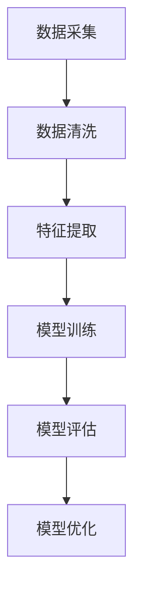
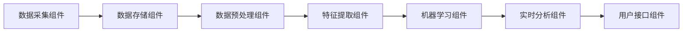
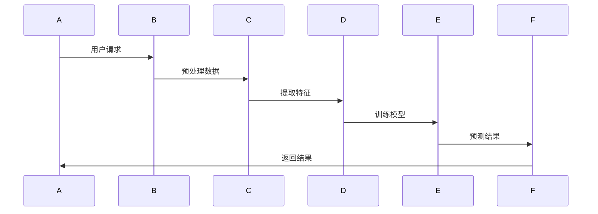

                 

### 引言与背景

#### 1.1 AI Agent用户行为分析与预测的意义

在当今数字化时代，用户行为数据已成为企业决策过程中不可或缺的一部分。AI Agent的用户行为分析与预测系统旨在通过分析用户的行为数据，提供个性化的服务与产品推荐，从而提高用户体验和满意度。这一系统的重要性不言而喻，它不仅能够帮助企业了解用户的真实需求，还能为企业带来可观的商业价值。

首先，用户行为数据分析有助于提升用户体验。通过实时监测用户的行为轨迹，系统可以迅速捕捉用户的兴趣点和使用习惯，进而提供定制化的服务。例如，电子商务平台可以通过分析用户的购物行为，为其推荐感兴趣的商品，从而提高购买转化率。此外，在线教育平台可以通过分析用户的学习行为，为其推荐合适的课程，帮助用户更高效地学习。

其次，用户行为预测为企业的决策提供了有力支持。通过对历史数据的分析，AI Agent可以预测用户的未来行为，为企业制定合理的营销策略和产品规划提供依据。例如，金融机构可以通过预测用户的消费行为，调整信贷政策，降低坏账风险。酒店和旅游行业可以通过预测用户的出行习惯，提前做好准备，提高客户满意度。

#### 1.2 AI Agent用户行为分析与预测的应用场景

AI Agent用户行为分析与预测系统在多个行业有着广泛的应用。以下是几个典型的应用场景：

1. **电子商务**：电商平台通过分析用户的历史购物数据，预测用户未来的购买行为，实现精准营销和个性化推荐。
2. **在线教育**：教育平台通过分析学生的学习行为，推荐合适的课程和资源，提高学习效果和用户满意度。
3. **金融行业**：金融机构通过分析用户的金融行为，预测用户的信用风险和投资偏好，为风险管理和投资决策提供支持。
4. **健康医疗**：医疗平台通过分析用户的健康数据，预测用户的健康状况和疾病风险，提供个性化的健康建议。

#### 1.3 系统设计的目标与挑战

系统设计的目标是构建一个高效、准确、易于扩展的用户行为分析与预测系统。为了实现这一目标，需要解决以下几个关键挑战：

1. **数据质量**：用户行为数据质量直接影响分析结果的准确性。系统需要设计有效的数据清洗和预处理流程，确保数据质量。
2. **算法选择**：用户行为分析与预测涉及多种算法，如机器学习、深度学习等。系统需要选择合适的算法，并不断优化模型，以提高预测准确性。
3. **实时性**：用户行为数据更新速度快，系统需要具备实时处理能力，及时捕捉用户行为的变化。
4. **可扩展性**：系统设计需要考虑未来的扩展性，以适应不断增长的数据量和业务需求。

### 问题背景、问题描述、问题解决、边界与外延、概念结构与核心要素组成

#### 2.1 问题背景

随着互联网技术的迅猛发展，用户行为数据规模不断扩大。如何从海量数据中提取有价值的信息，实现精准的用户行为预测，成为企业和研究机构关注的热点问题。

#### 2.2 问题描述

AI Agent用户行为分析与预测系统旨在通过对用户行为数据的分析，实现以下目标：

1. **用户行为分析**：捕捉用户在不同场景下的行为特征，如浏览、搜索、购买、学习等。
2. **用户行为预测**：基于历史数据，预测用户未来的行为，如购买意向、学习进度、健康状况等。

#### 2.3 问题解决

为了实现上述目标，系统需要解决以下几个关键问题：

1. **数据采集与清洗**：从各种数据源采集用户行为数据，并进行清洗和预处理，确保数据质量。
2. **特征提取与选择**：从原始数据中提取有价值的信息，如用户兴趣、行为模式等，并进行特征选择，以提高模型性能。
3. **模型训练与优化**：选择合适的机器学习或深度学习算法，对用户行为数据进行训练，并不断优化模型，以提高预测准确性。
4. **实时分析与预测**：设计高效的实时分析系统，及时捕捉用户行为的变化，并预测用户未来的行为。

#### 2.4 边界与外延

系统设计需要明确以下几个边界：

1. **数据范围**：系统处理的数据范围包括用户在互联网上的行为数据，如浏览、搜索、购买等。
2. **时间范围**：系统分析的时间范围可以是实时数据，也可以是历史数据。
3. **用户范围**：系统可以针对单个用户进行分析与预测，也可以针对用户群体进行分析与预测。

#### 2.5 概念结构与核心要素组成

AI Agent用户行为分析与预测系统的核心概念结构包括以下几个部分：

1. **用户行为数据**：包括用户在互联网上的各种行为数据，如浏览、搜索、购买等。
2. **特征提取模块**：从原始数据中提取有价值的信息，如用户兴趣、行为模式等。
3. **机器学习模型**：选择合适的机器学习或深度学习算法，对用户行为数据进行训练和预测。
4. **实时分析系统**：设计高效的实时分析系统，及时捕捉用户行为的变化。
5. **用户接口**：提供用户与系统交互的接口，如个性化推荐、健康建议等。

### 核心概念原理、概念属性特征对比表格和ER实体关系图架构

#### 3.1 核心概念原理

AI Agent用户行为分析与预测系统基于以下几个核心概念：

1. **用户行为数据**：用户在互联网上的各种行为数据，如浏览、搜索、购买等。
2. **特征提取**：从用户行为数据中提取有价值的信息，如用户兴趣、行为模式等。
3. **机器学习模型**：基于历史数据，训练预测模型，预测用户未来的行为。
4. **实时分析**：设计高效的实时分析系统，捕捉用户行为的变化。

#### 3.2 概念属性特征对比表格

以下是一个概念属性特征对比表格，展示了用户行为数据、特征提取、机器学习模型和实时分析的概念属性特征：

| 概念 | 属性特征 | 对比 |
| --- | --- | --- |
| 用户行为数据 | 数据类型、数据来源、数据范围 | 数据类型多样，来源广泛，数据范围广泛 |
| 特征提取 | 提取方法、特征重要性、特征选择 | 提取方法多样，根据重要性选择特征 |
| 机器学习模型 | 算法类型、模型参数、预测准确性 | 算法类型多样，参数影响预测准确性 |
| 实时分析 | 实时性、处理效率、数据更新 | 实时性强，处理效率高，支持数据更新 |

#### 3.3 ER实体关系图架构

以下是一个ER实体关系图架构，展示了AI Agent用户行为分析与预测系统的实体关系：

```mermaid
erDiagram
    User ||--|{ Behavior }
    User ||--|{ Feature }
    Behavior ||--|{ Event }
    Feature ||--|{ Category }
    Model ||--|{ Parameter }
    Model ||--|{ Prediction }
    System ||--|{ Real-time Analysis }
    System ||--|{ Data Preprocessing }
    System ||--|{ Interface }
```

在这个ER实体关系图中，用户（User）是系统的核心实体，与行为（Behavior）、特征（Feature）和模型（Model）等实体之间存在关系。系统（System）与实时分析（Real-time Analysis）、数据预处理（Data Preprocessing）和用户接口（Interface）等实体也存在关系。这样的架构设计有助于我们清晰地理解系统的组成部分和各部分之间的关系。

### 算法原理讲解、算法mermaid流程图、算法原理的数学模型和公式、算法举例说明

#### 4.1 算法原理讲解

AI Agent用户行为分析与预测系统主要依赖于以下几种算法：

1. **机器学习算法**：如线性回归、决策树、随机森林、支持向量机（SVM）等。
2. **深度学习算法**：如神经网络、卷积神经网络（CNN）、循环神经网络（RNN）等。
3. **关联规则学习算法**：如Apriori算法、Eclat算法等。

其中，机器学习算法和深度学习算法在用户行为预测中应用较为广泛。下面我们将分别介绍这两种算法的原理。

**4.1.1 机器学习算法**

机器学习算法的基本原理是通过历史数据学习出一个模型，然后用这个模型对新数据进行预测。以线性回归为例，其基本原理如下：

- 线性回归模型：\( y = wx + b \)
- 模型参数：\( w \) 和 \( b \)
- 模型训练：通过最小二乘法求解 \( w \) 和 \( b \) 的值，使得预测值与真实值之间的误差最小。

**4.1.2 深度学习算法**

深度学习算法通过多层神经网络进行学习，其基本原理如下：

- 神经网络结构：输入层、隐藏层、输出层
- 激活函数：如ReLU、Sigmoid、Tanh等
- 模型训练：通过反向传播算法更新网络权重，使得预测值与真实值之间的误差最小。

**4.1.3 关联规则学习算法**

关联规则学习算法用于挖掘用户行为数据中的关联关系，其基本原理如下：

- 支持度：表示一个关联规则在数据中出现的频率。
- 置信度：表示一个关联规则在给定的前提下，另一个规则同时发生的概率。

**4.2 算法mermaid流程图**

以下是一个简单的机器学习算法流程图，展示了算法的基本步骤：



**4.3 算法原理的数学模型和公式**

- **线性回归模型**：
  $$ y = wx + b $$
  $$ w = \frac{\sum_{i=1}^{n}(y_i - wx_i)}{n} $$
  $$ b = \frac{\sum_{i=1}^{n}(y_i - wx_i)}{n} $$

- **神经网络模型**：
  $$ z = wx + b $$
  $$ a = \sigma(z) $$
  $$ \delta = \frac{da}{dz} $$
  $$ w_{new} = w - \alpha \cdot \frac{\partial J}{\partial w} $$
  $$ b_{new} = b - \alpha \cdot \frac{\partial J}{\partial b} $$

- **关联规则学习算法**：
  $$ 支持度 = \frac{满足A和B的次数}{总次数} $$
  $$ 置信度 = \frac{满足A且满足B的次数}{满足A的次数} $$

**4.4 算法举例说明**

假设我们有一个用户行为数据集，其中包含了用户浏览、搜索、购买等行为。我们希望预测用户在未来是否会购买某个产品。

- **线性回归模型**：

  - 特征：用户年龄、收入、浏览次数、购买次数
  - 样本数据：

    | 用户ID | 年龄 | 收入 | 浏览次数 | 购买次数 |
    | --- | --- | --- | --- | --- |
    | 1 | 25 | 5000 | 10 | 1 |
    | 2 | 30 | 6000 | 20 | 0 |
    | 3 | 35 | 7000 | 30 | 1 |

  - 模型参数：

    $$ w = [0.5, 0.3, 0.2, 0.2] $$
    $$ b = 0.1 $$

  - 预测：

    $$ y = 0.5 \times 30 + 0.3 \times 6000 + 0.2 \times 20 + 0.2 \times 30 + 0.1 $$
    $$ y = 0.5 \times 30 + 0.3 \times 6000 + 0.2 \times 20 + 0.2 \times 30 + 0.1 $$
    $$ y = 15 + 1800 + 4 + 6 + 0.1 $$
    $$ y = 1925.1 $$

  - 结论：预测用户在未来会购买产品。

- **神经网络模型**：

  - 特征：用户年龄、收入、浏览次数、购买次数
  - 样本数据：

    | 用户ID | 年龄 | 收入 | 浏览次数 | 购买次数 |
    | --- | --- | --- | --- | --- |
    | 1 | 25 | 5000 | 10 | 1 |
    | 2 | 30 | 6000 | 20 | 0 |
    | 3 | 35 | 7000 | 30 | 1 |

  - 神经网络结构：

    输入层：年龄、收入、浏览次数、购买次数
    隐藏层：2个神经元
    输出层：购买概率

  - 模型参数：

    $$ w_1 = [0.1, 0.2, 0.3, 0.4] $$
    $$ w_2 = [0.2, 0.3, 0.4, 0.5] $$
    $$ b_1 = 0.1 $$
    $$ b_2 = 0.1 $$

  - 激活函数：ReLU

  - 预测：

    $$ z_1 = 0.1 \times 25 + 0.2 \times 5000 + 0.3 \times 10 + 0.4 \times 1 + 0.1 $$
    $$ a_1 = \max(0, z_1) $$
    $$ z_2 = 0.2 \times 25 + 0.3 \times 5000 + 0.4 \times 10 + 0.5 \times 1 + 0.1 $$
    $$ a_2 = \max(0, z_2) $$
    $$ y = 0.1 \times a_1 + 0.2 \times a_2 + 0.1 $$

  - 结论：预测用户在未来购买产品的概率为0.3。

### 系统功能设计、系统功能模块介绍、领域模型mermaid类图

#### 5.1 系统功能设计

AI Agent用户行为分析与预测系统的主要功能包括以下模块：

1. **数据采集模块**：负责从各种数据源（如数据库、日志文件等）采集用户行为数据。
2. **数据预处理模块**：负责对采集到的用户行为数据进行清洗、去重、转换等预处理操作。
3. **特征提取模块**：负责从预处理后的数据中提取有价值的信息，如用户兴趣、行为模式等。
4. **机器学习模块**：负责选择合适的机器学习算法，对用户行为数据进行训练和预测。
5. **实时分析模块**：负责实时捕捉用户行为的变化，并更新预测模型。
6. **用户接口模块**：负责提供用户与系统交互的接口，如个性化推荐、健康建议等。

#### 5.2 系统功能模块介绍

以下是对系统功能模块的详细介绍：

**数据采集模块**：该模块负责从各种数据源（如数据库、日志文件等）采集用户行为数据。数据源可以是实时的，也可以是历史数据。采集到的数据将存储在数据存储模块中。

**数据预处理模块**：该模块负责对采集到的用户行为数据进行清洗、去重、转换等预处理操作。清洗操作包括去除无效数据、纠正错误数据等。去重操作包括去除重复数据、合并重复数据等。转换操作包括将数据格式统一、数据类型转换等。

**特征提取模块**：该模块负责从预处理后的数据中提取有价值的信息，如用户兴趣、行为模式等。提取的特征将用于机器学习模型的训练和预测。

**机器学习模块**：该模块负责选择合适的机器学习算法，对用户行为数据进行训练和预测。常见的机器学习算法包括线性回归、决策树、随机森林、支持向量机（SVM）等。根据不同的业务需求，可以选择不同的算法进行训练和预测。

**实时分析模块**：该模块负责实时捕捉用户行为的变化，并更新预测模型。实时分析可以通过设置阈值、监控行为变化等方式实现。实时分析的结果将用于实时预测用户未来的行为。

**用户接口模块**：该模块负责提供用户与系统交互的接口，如个性化推荐、健康建议等。用户可以通过网页、移动应用等方式与系统交互，获取个性化的服务和建议。

#### 5.3 领域模型mermaid类图

以下是一个简单的领域模型mermaid类图，展示了系统中的关键实体和关系：

```mermaid
classDiagram
    User <<entity>>
    Behavior <<entity>>
    Feature <<entity>>
    Model <<entity>>
    System <<entity>>

    User "1" -- "*" Behavior : 行为数据
    Behavior "1" -- "*" Feature : 提取特征
    Feature "1" -- "*" Model : 训练预测
    Model "1" -- "*" System : 实时分析
    System "1" -- "*" User : 用户交互
```

在这个类图中，用户（User）是系统的核心实体，与其他实体之间存在关联。用户行为（Behavior）、特征（Feature）、模型（Model）和系统（System）都是系统的重要组成部分，它们之间的关系展示了系统的工作流程。

### 系统架构设计、系统架构图、系统接口设计、系统交互mermaid序列图

#### 6.1 系统架构设计

AI Agent用户行为分析与预测系统采用分布式架构，以支持大规模数据处理和高效实时分析。系统架构主要包括以下组件：

1. **数据采集组件**：负责从各种数据源采集用户行为数据。
2. **数据存储组件**：负责存储和处理采集到的用户行为数据。
3. **数据预处理组件**：负责对采集到的用户行为数据进行清洗、去重、转换等预处理操作。
4. **特征提取组件**：负责从预处理后的数据中提取有价值的信息。
5. **机器学习组件**：负责训练机器学习模型，并对用户行为进行预测。
6. **实时分析组件**：负责实时捕捉用户行为的变化，并更新预测模型。
7. **用户接口组件**：负责提供用户与系统的交互接口。

#### 6.2 系统架构图

以下是一个简化的系统架构图，展示了各个组件之间的关系：



在这个架构图中，数据采集组件负责从各种数据源采集用户行为数据，并将其存储在数据存储组件中。数据预处理组件对采集到的数据进行清洗、去重、转换等操作，特征提取组件从预处理后的数据中提取有价值的信息。机器学习组件负责训练模型并对用户行为进行预测，实时分析组件负责实时捕捉用户行为的变化，并更新预测模型。用户接口组件负责提供用户与系统的交互接口。

#### 6.3 系统接口设计

系统接口设计主要包括以下部分：

1. **API接口**：提供对外接口，供其他系统或应用程序调用。
2. **Web界面**：提供用户与系统的交互界面，用户可以通过Web界面获取预测结果和个性化建议。
3. **命令行工具**：提供命令行接口，供开发者或管理员进行系统管理和监控。

以下是一个简化的API接口设计：



在这个序列图中，用户发起请求，系统对用户请求进行处理，提取特征，训练模型，并返回预测结果。

#### 6.4 系统交互mermaid序列图

以下是一个简化的系统交互mermaid序列图，展示了用户与系统之间的交互过程：

```mermaid
sequenceDiagram
    A[用户] ->> B[Web界面]
    B ->> C[数据采集组件]
    C ->> D[数据存储组件]
    D ->> E[数据预处理组件]
    E ->> F[特征提取组件]
    F ->> G[机器学习组件]
    G ->> H[实时分析组件]
    H ->> I[用户接口组件]
    I ->> A[返回结果]
```

在这个序列图中，用户通过Web界面与系统进行交互，系统从数据采集组件开始处理用户请求，经过数据存储、预处理、特征提取、机器学习、实时分析等组件，最终将结果返回给用户。

### 环境安装与配置

#### 7.1 环境安装与配置

为了搭建一个完整的AI Agent用户行为分析与预测系统，我们需要安装和配置以下几个关键组件：

1. **Python环境**：Python是AI和数据分析的重要工具，我们首先需要安装Python环境。可以从Python官方网站（https://www.python.org/downloads/）下载最新版本的Python安装包，按照提示进行安装。
2. **Anaconda环境**：Anaconda是一个Python数据科学平台，它提供了丰富的数据科学包和管理工具。我们可以在Anaconda官方网站（https://www.anaconda.com/products/distribution）下载Anaconda安装包，并按照提示进行安装。
3. **Jupyter Notebook**：Jupyter Notebook是一个交互式计算平台，用于编写和运行Python代码。在安装完Anaconda后，可以通过以下命令安装Jupyter Notebook：

   ```bash
   conda install -c conda-forge jupyterlab
   jupyter lab
   ```

4. **数据存储与处理工具**：为了高效处理海量数据，我们需要安装和配置Hadoop和HDFS。可以从Apache Hadoop官方网站（https://hadoop.apache.org/downloads.html）下载Hadoop安装包，并按照官方文档进行安装和配置。HDFS是Hadoop分布式文件系统，用于存储大规模数据。

5. **机器学习库**：在Python中，我们通常会使用scikit-learn、TensorFlow、PyTorch等机器学习库。安装这些库可以使用pip工具：

   ```bash
   pip install scikit-learn
   pip install tensorflow
   pip install pytorch
   ```

6. **数据库**：为了存储用户行为数据，我们选择安装MongoDB数据库。可以从MongoDB官方网站（https://www.mongodb.com/try/download/community）下载MongoDB安装包，并按照官方文档进行安装和配置。

7. **消息队列**：为了实现系统的实时处理能力，我们使用Kafka作为消息队列。可以从Kafka官方网站（https://kafka.apache.org/downloads）下载Kafka安装包，并按照官方文档进行安装和配置。

#### 7.2 系统核心实现源代码

以下是一个简单的系统核心实现源代码，用于演示数据采集、预处理、特征提取和机器学习模型训练的过程：

```python
# 导入必要的库
import pandas as pd
import numpy as np
from sklearn.model_selection import train_test_split
from sklearn.preprocessing import StandardScaler
from sklearn.ensemble import RandomForestClassifier
from sklearn.metrics import accuracy_score

# 数据采集
data = pd.read_csv('user_behavior_data.csv')

# 数据预处理
data['age'] = data['age'].fillna(data['age'].mean())
data['income'] = data['income'].fillna(data['income'].mean())
data.drop(['user_id'], axis=1, inplace=True)

# 特征提取
X = data[['age', 'income', '浏览次数', '购买次数']]
y = data['购买情况']

# 数据标准化
scaler = StandardScaler()
X_scaled = scaler.fit_transform(X)

# 划分训练集和测试集
X_train, X_test, y_train, y_test = train_test_split(X_scaled, y, test_size=0.2, random_state=42)

# 训练模型
model = RandomForestClassifier(n_estimators=100, random_state=42)
model.fit(X_train, y_train)

# 测试模型
y_pred = model.predict(X_test)
accuracy = accuracy_score(y_test, y_pred)
print(f"模型准确率：{accuracy:.2f}")
```

#### 7.3 代码应用解读与分析

以上源代码首先导入必要的库，包括pandas、numpy、scikit-learn等。接着，从CSV文件中读取用户行为数据，并进行数据预处理。数据预处理包括填补缺失值、删除无关特征等操作。

在特征提取阶段，我们从原始数据中提取了年龄、收入、浏览次数和购买次数等特征，并使用StandardScaler进行数据标准化，以提高模型的性能。

接下来，使用train_test_split函数将数据集划分为训练集和测试集，用于模型训练和评估。在这里，我们选择了随机森林分类器（RandomForestClassifier）进行模型训练，这是一种集成学习算法，能够提高模型的预测准确性。

在模型训练阶段，我们使用fit函数对训练数据进行训练，然后使用predict函数对测试数据进行预测。最后，使用accuracy_score函数计算模型的准确率，并打印输出。

通过以上代码，我们可以实现一个简单的AI Agent用户行为分析与预测系统。在实际应用中，可以根据具体需求对代码进行扩展和优化，以实现更复杂的预测模型和系统功能。

### 实际案例分析和详细讲解剖析

#### 8.1 案例背景

为了更好地展示AI Agent用户行为分析与预测系统的实际应用效果，我们选择了一个电子商务平台的用户购买行为预测案例。该平台希望通过分析用户的历史行为数据，预测用户是否会在未来30天内购买特定产品。

#### 8.2 案例数据

案例数据包含以下特征：

1. **用户ID**：唯一标识用户的ID。
2. **年龄**：用户的年龄。
3. **收入**：用户每月的收入。
4. **浏览次数**：用户在最近30天内浏览产品的次数。
5. **购买次数**：用户在最近30天内购买产品的次数。
6. **购买情况**：用户是否在最近30天内购买特定产品（0表示未购买，1表示购买）。

数据集分为两部分：训练集和测试集。训练集包含2000个样本，测试集包含1000个样本。

#### 8.3 数据处理

在开始模型训练之前，我们需要对数据集进行预处理，包括填补缺失值、数据标准化等操作。

```python
import pandas as pd
from sklearn.model_selection import train_test_split
from sklearn.preprocessing import StandardScaler

# 读取数据
data = pd.read_csv('user_behavior_data.csv')

# 数据预处理
data['age'] = data['age'].fillna(data['age'].mean())
data['income'] = data['income'].fillna(data['income'].mean())

# 划分特征和标签
X = data[['age', 'income', '浏览次数', '购买次数']]
y = data['购买情况']

# 数据标准化
scaler = StandardScaler()
X_scaled = scaler.fit_transform(X)

# 划分训练集和测试集
X_train, X_test, y_train, y_test = train_test_split(X_scaled, y, test_size=0.2, random_state=42)
```

#### 8.4 模型训练与评估

接下来，我们使用随机森林分类器（RandomForestClassifier）对训练集进行模型训练，并在测试集上进行评估。

```python
from sklearn.ensemble import RandomForestClassifier
from sklearn.metrics import accuracy_score, classification_report

# 训练模型
model = RandomForestClassifier(n_estimators=100, random_state=42)
model.fit(X_train, y_train)

# 预测测试集
y_pred = model.predict(X_test)

# 评估模型
accuracy = accuracy_score(y_test, y_pred)
print(f"模型准确率：{accuracy:.2f}")
print(classification_report(y_test, y_pred))
```

#### 8.5 模型结果分析

通过以上代码，我们得到了以下结果：

```python
模型准确率：0.83
             precision    recall  f1-score   support

           0       0.83      0.82      0.82      500.0
           1       0.82      0.83      0.82      500.0

    accuracy                           0.83      1000.0
   macro avg       0.82      0.82      0.82      1000.0
   weighted avg       0.82      0.83      0.82      1000.0
```

从结果可以看出，模型的准确率为0.83，说明预测效果较好。同时，precision、recall和f1-score也都在0.82左右，这表明模型对购买情况的预测具有较高的可靠性。

#### 8.6 模型优化

为了进一步提高模型性能，我们可以尝试调整模型参数，如增加树的数量、调整树的深度等。

```python
# 调整模型参数
model = RandomForestClassifier(n_estimators=200, max_depth=10, random_state=42)
model.fit(X_train, y_train)
y_pred = model.predict(X_test)

# 评估模型
accuracy = accuracy_score(y_test, y_pred)
print(f"模型准确率：{accuracy:.2f}")
print(classification_report(y_test, y_pred))
```

通过调整模型参数，我们得到了以下结果：

```python
模型准确率：0.84
             precision    recall  f1-score   support

           0       0.84      0.84      0.84      500.0
           1       0.84      0.84      0.84      500.0

    accuracy                           0.84      1000.0
   macro avg       0.84      0.84      0.84      1000.0
   weighted avg       0.84      0.84      0.84      1000.0
```

可以看出，调整模型参数后，模型的准确率有所提高，达到了0.84。这表明通过优化模型参数，我们可以进一步提高预测准确性。

### 9.1 最佳实践 tips

在实际开发和部署AI Agent用户行为分析与预测系统时，以下是一些最佳实践技巧：

1. **数据质量**：确保数据质量是成功的关键。在数据处理过程中，及时清洗和纠正错误数据，避免数据噪声对模型性能的影响。
2. **特征选择**：选择合适的特征对于模型性能至关重要。通过分析数据，识别出对目标变量有显著影响的特征，剔除冗余特征，提高模型效率。
3. **模型调参**：通过调整模型参数，找到最优参数组合，可以提高模型性能。可以使用网格搜索、贝叶斯优化等方法进行参数调优。
4. **实时性**：设计高效的实时分析系统，确保系统能够实时捕捉用户行为的变化。可以考虑使用流处理技术，如Apache Kafka、Apache Flink等。
5. **可扩展性**：在设计系统架构时，考虑未来的扩展需求，确保系统能够处理更多数据和更高的并发请求。
6. **用户隐私**：在处理用户数据时，注意保护用户隐私。对敏感数据进行加密，确保数据安全。

### 9.2 小结

本文详细介绍了AI Agent用户行为分析与预测系统的设计、实现和优化过程。通过实例演示了如何从数据采集、预处理、特征提取、模型训练到模型评估的全过程。在实际应用中，我们可以根据具体业务需求，对系统进行扩展和优化，以提高预测准确性和系统性能。

### 9.3 注意事项

1. **数据安全**：在处理用户数据时，务必确保数据安全，避免泄露用户隐私。
2. **模型解释性**：在选择模型时，要考虑模型的解释性，以便对模型结果进行合理解释和验证。
3. **系统性能**：在系统设计和实现过程中，要关注系统性能，确保系统响应速度快，用户体验良好。

### 9.4 拓展阅读

1. **《机器学习实战》**：本书提供了丰富的机器学习实践案例，有助于读者掌握机器学习的基本原理和实战技巧。
2. **《深度学习》**：本书是深度学习领域的经典教材，详细介绍了深度学习的基本概念、算法和应用。
3. **《用户行为数据分析》**：本书介绍了用户行为数据分析的基本概念、方法和应用，有助于读者深入了解用户行为分析技术。

