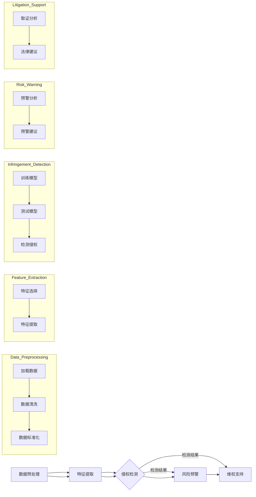
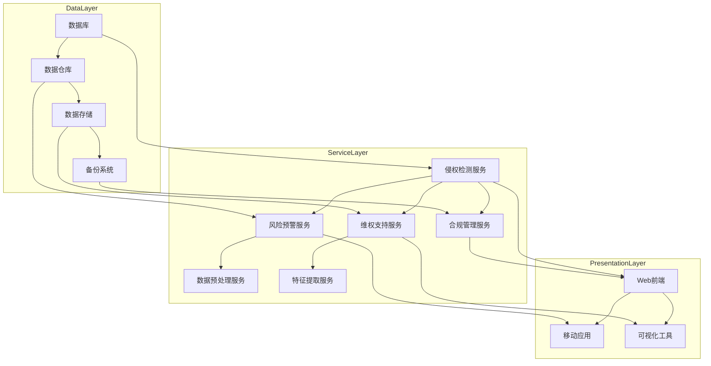
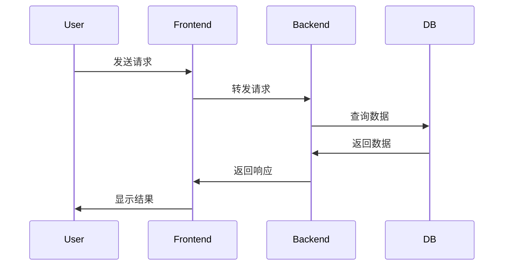

                 

### 设计思路与大纲概述

在设计《AI Agent的知识产权保护策略》的目录大纲时，我们需要从几个关键点出发。首先，我们要确保目录结构清晰，层次分明，便于读者循序渐进地理解内容。其次，我们需要涵盖知识产权保护的核心概念、法律框架、实际应用和案例研究等方面，确保内容的全面性和实用性。最后，为了增加可读性和条理性，我们将采用markdown格式来组织目录，并详细规划每个章节的内容。

总体来说，目录大纲将分为以下几大部分：

1. **背景介绍**：介绍AI Agent及其知识产权保护的背景和重要性。
2. **核心概念与联系**：阐述知识产权保护的基本概念、相关法律和法规，并展示概念之间的关系。
3. **算法原理讲解**：详细讲解AI Agent的算法原理，包括数学模型和公式。
4. **系统分析与架构设计**：介绍知识产权保护系统的整体架构和功能。
5. **项目实战**：通过实际案例展示知识产权保护策略的实施。
6. **最佳实践与拓展**：总结最佳实践，提供注意事项和拓展阅读。

以下是详细的目录大纲：

---

## 第一部分: AI Agent与知识产权保护概述

### 第1章: AI Agent的知识产权保护背景

#### 1.1 AI Agent的定义与特点
#### 1.2 知识产权保护在AI领域的必要性
#### 1.3 知识产权保护面临的挑战

### 第2章: 知识产权保护基本概念与法律框架

#### 2.1 知识产权的定义与类型
#### 2.2 相关法律法规介绍
#### 2.3 知识产权保护的法律框架

## 第二部分: AI Agent知识产权保护核心概念与联系

### 第3章: 核心概念详解

#### 3.1 AI Agent知识产权的特点
#### 3.2 知识产权与AI技术的结合
#### 3.3 知识产权侵权与风险

### 第4章: 概念属性特征对比

#### 4.1 知识产权与专利、版权、商标等的区别与联系
#### 4.2 各类知识产权的特点与保护范围
#### 4.3 概念属性特征对比表格

### 第5章: 实体关系图

#### 5.1 知识产权保护涉及的实体
#### 5.2 实体关系图介绍
#### 5.3 ER实体关系图架构

## 第三部分: AI Agent知识产权保护算法原理

### 第6章: 算法原理讲解

#### 6.1 算法概述
#### 6.2 数学模型与公式
#### 6.3 算法mermaid流程图
#### 6.4 Python源代码解析
#### 6.5 举例说明

## 第四部分: 系统分析与架构设计

### 第7章: 知识产权保护系统功能设计

#### 7.1 问题场景介绍
#### 7.2 系统功能设计
#### 7.3 领域模型mermaid类图

### 第8章: 知识产权保护系统架构设计

#### 8.1 系统架构设计
#### 8.2 系统架构mermaid架构图
#### 8.3 系统接口设计
#### 8.4 系统交互mermaid序列图

## 第五部分: 项目实战

### 第9章: AI Agent知识产权保护项目实战

#### 9.1 环境安装与配置
#### 9.2 系统核心实现
#### 9.3 代码应用解读与分析
#### 9.4 实际案例分析
#### 9.5 项目小结

## 第六部分: 最佳实践与拓展

### 第10章: 最佳实践与注意事项

#### 10.1 最佳实践
#### 10.2 小结
#### 10.3 注意事项
#### 10.4 拓展阅读

---

通过上述目录大纲，我们旨在为读者提供一个全面、深入的知识产权保护策略指南，从理论到实践，从概念到项目实战，帮助读者理解和掌握AI Agent知识产权保护的各个方面。

---

### 设计思路与大纲概述

在设计《AI Agent的知识产权保护策略》这篇文章时，我们采取了一系列细致且系统化的步骤。以下是具体的设计思路和具体大纲内容的概述：

#### 设计思路

**1. 明确目标读者群体：**
   - 目标读者为技术领域专业人士、研发团队、知识产权律师以及对于AI和知识产权保护有兴趣的读者。
   - 确保文章内容既具有深度，也具备一定的普及性，能够满足不同知识水平的读者需求。

**2. 确定文章的核心内容和结构：**
   - 核心内容围绕AI Agent的定义、知识产权保护的基本概念、相关法律框架、算法原理、系统架构设计、项目实战以及最佳实践。
   - 结构采用章节划分的方式，使文章内容清晰、逻辑连贯，便于读者阅读和理解。

**3. 注重实用性和可操作性：**
   - 结合实际案例和项目实战，提供具体实施方案和操作步骤，帮助读者将理论知识应用到实际工作中。

**4. 采用Markdown格式：**
   - 为了确保文章的可读性和美观性，我们选择了Markdown格式来编写文章。Markdown格式不仅可以简洁地展示代码和流程图，还能使文章结构更加清晰。

**5. 引入Mermaid流程图和类图：**
   - 使用Mermaid语言来绘制流程图和类图，以直观地展示算法原理、系统架构设计等复杂概念，增强文章的易懂性。

#### 具体大纲内容概述

**第一部分: AI Agent与知识产权保护概述**

- **第1章: AI Agent的知识产权保护背景**
  - 介绍AI Agent的定义与特点
  - 分析知识产权保护在AI领域的必要性
  - 探讨知识产权保护面临的挑战

- **第2章: 知识产权保护基本概念与法律框架**
  - 解释知识产权的定义与类型
  - 梳理相关法律法规
  - 构建知识产权保护的法律框架

**第二部分: AI Agent知识产权保护核心概念与联系**

- **第3章: 核心概念详解**
  - 详细阐述AI Agent知识产权的特点
  - 探讨知识产权与AI技术的结合
  - 分析知识产权侵权与风险

- **第4章: 概念属性特征对比**
  - 对比知识产权与专利、版权、商标等的区别与联系
  - 展示各类知识产权的特点与保护范围
  - 使用表格对比概念属性特征

- **第5章: 实体关系图**
  - 介绍知识产权保护涉及的实体
  - 展示实体关系图
  - 分析ER实体关系图架构

**第三部分: AI Agent知识产权保护算法原理**

- **第6章: 算法原理讲解**
  - 描述算法概述
  - 使用mermaid绘制算法流程图
  - 使用Python源代码进行解析
  - 进行数学模型和公式的详细讲解
  - 提供举例说明

**第四部分: 系统分析与架构设计**

- **第7章: 知识产权保护系统功能设计**
  - 介绍问题场景
  - 设计系统功能
  - 使用mermaid绘制领域模型类图

- **第8章: 知识产权保护系统架构设计**
  - 描述系统架构设计
  - 使用mermaid绘制系统架构图
  - 设计系统接口
  - 使用mermaid绘制系统交互序列图

**第五部分: 项目实战**

- **第9章: AI Agent知识产权保护项目实战**
  - 安装与配置环境
  - 实现系统核心功能
  - 解读与分析代码应用
  - 分析实际案例
  - 进行项目小结

**第六部分: 最佳实践与拓展**

- **第10章: 最佳实践与注意事项**
  - 总结最佳实践
  - 进行小结
  - 提供注意事项
  - 推荐拓展阅读

通过上述设计思路和具体大纲内容概述，我们确保了文章内容的全面性、逻辑性和实用性，旨在为读者提供一个系统、全面的AI Agent知识产权保护策略指南。接下来的各个部分将依次深入探讨这些主题，帮助读者逐步理解和掌握相关知识。

---

## 第一部分: AI Agent与知识产权保护概述

### 第1章: AI Agent的知识产权保护背景

#### 1.1 AI Agent的定义与特点

AI Agent，即人工智能代理，是一种智能体，它可以自主地执行任务、做出决策并与其他系统或人进行交互。AI Agent的特点主要体现在以下几个方面：

1. **自主性**：AI Agent能够根据预设的规则和策略自主执行任务，而不需要人工干预。
2. **适应性**：AI Agent能够根据环境的变化自主调整其行为策略，以适应不同的情境。
3. **智能性**：AI Agent具备一定程度的智能，能够通过学习和优化来提高其任务执行的效果。
4. **协同性**：AI Agent能够与其他系统或人进行协同工作，以实现更复杂的任务。

AI Agent的定义和特点使其在各个领域得到了广泛的应用，包括自动化、金融、医疗、制造业等。这些应用不仅提高了工作效率，还提升了用户体验。然而，随着AI Agent技术的发展和应用，其知识产权保护问题也逐渐凸显出来。

#### 1.2 知识产权保护在AI领域的必要性

在AI领域，知识产权保护具有以下几个必要性：

1. **鼓励创新**：知识产权保护为创新者提供了法律保障，使他们能够从其创新成果中获得经济回报，从而激励更多的创新活动。
2. **确保市场公平竞争**：知识产权保护能够防止未经授权的复制、抄袭和盗版，保障创新者的合法权益，维护市场公平竞争秩序。
3. **促进技术传播**：知识产权保护为技术传播提供了保障，使得技术成果能够被广泛传播和应用，推动整个行业的发展。
4. **降低投资风险**：知识产权保护能够降低投资者的风险，因为创新者在进行投资前通常会进行知识产权调查，以确保其投资的项目不存在知识产权纠纷。

在AI领域，由于技术的复杂性和创新速度的快速，知识产权保护问题尤为突出。如果不加以妥善处理，可能会对整个AI产业造成严重影响，阻碍其健康发展。

#### 1.3 知识产权保护面临的挑战

尽管知识产权保护在AI领域具有重要意义，但在实际操作中，仍然面临着诸多挑战：

1. **技术复杂性**：AI技术的复杂性和多样性使得知识产权保护难以实施。例如，深度学习模型、神经网络等算法难以用传统的方法进行保护。
2. **数据隐私**：AI Agent在运行过程中需要大量数据，这些数据往往涉及个人隐私。如何在保护知识产权的同时保护数据隐私成为一个难题。
3. **跨境法律冲突**：由于各国知识产权法律体系的差异，跨境知识产权保护面临着法律冲突和执行难度的问题。
4. **侵权行为的隐蔽性**：AI Agent的自主性和适应性使其侵权行为更为隐蔽，难以发现和取证。
5. **快速迭代**：AI技术快速迭代，创新成果的保护周期较短，给知识产权保护带来了新的挑战。

面对这些挑战，需要从法律、技术和管理等多方面入手，制定有效的知识产权保护策略，以确保AI领域的健康有序发展。

---

## 第一部分: AI Agent与知识产权保护概述

### 第2章: 知识产权保护基本概念与法律框架

#### 2.1 知识产权的定义与类型

知识产权是指人们对其智力劳动成果所依法享有的专有权利，通常包括专利、版权、商标、商业秘密等。知识产权具有以下几个基本特征：

1. **专有性**：知识产权具有排他性，权利人对其智力成果享有独占的权利，未经授权，他人不得使用或侵犯。
2. **地域性**：知识产权在法律上具有地域性，即一个国家或地区授予的知识产权只在授予国或地区有效，其他国家和地区不具有法律效力。
3. **时间性**：知识产权具有时间限制，不同的知识产权类型有不同的保护期限，一旦期限届满，知识产权将失去法律效力。

根据知识产权的不同类型，可以将其分为以下几类：

1. **专利权**：专利权是指发明人或设计人对其发明创造在法律上享有的专有权利。专利权分为发明专利、实用新型专利和外观设计专利三种。
2. **版权**：版权是指作者对其文学、艺术和科学作品所享有的专有权利，包括复制权、发行权、出租权、展览权等。
3. **商标权**：商标权是指商标注册人对其注册商标在法律上享有的专有权利，包括商标使用权、许可权、转让权等。
4. **商业秘密**：商业秘密是指不为公众所知悉、具有商业价值并经权利人采取保密措施的技术信息和经营信息。

#### 2.2 相关法律法规介绍

知识产权保护在各国都有相应的法律法规，以下列举几个主要国家和地区的知识产权法律体系：

1. **美国**：美国的知识产权法律体系主要由《专利法》、《版权法》、《商标法》和《反假冒法》构成。其中，《专利法》保护发明，《版权法》保护文学和艺术作品，《商标法》保护商标，而《反假冒法》则打击假冒伪劣商品。

2. **欧盟**：欧盟的知识产权法律体系较为完善，包括《欧洲专利公约》、《欧盟版权法》、《欧盟商标法》和《欧盟商业秘密保护条例》等。这些法律法规为欧盟成员国提供了统一的知识产权保护框架。

3. **中国**：中国的知识产权法律体系主要包括《专利法》、《著作权法》、《商标法》和《反不正当竞争法》等。近年来，中国加大了对知识产权保护的力度，修订和完善了相关法律法规，为创新提供了更好的法律保障。

#### 2.3 知识产权保护的法律框架

知识产权保护的法律框架主要包括以下几个方面：

1. **知识产权申请与注册**：权利人需要向相关知识产权行政部门申请并注册其知识产权，以获得法律保护。例如，专利申请需要提交发明说明书、权利要求书等文件，版权申请需要提交作品原件或复制件，商标申请需要提交商标图案等。

2. **知识产权侵权判定**：当权利人的知识产权受到侵犯时，可以通过法律途径进行维权。知识产权侵权判定通常包括两个方面：一是侵权行为是否构成，二是侵权行为是否给权利人造成了实际损失。

3. **知识产权维权措施**：知识产权维权措施包括诉讼、仲裁、调解等。在诉讼中，权利人可以通过法院判决侵权人停止侵权行为、赔偿损失等方式维护其合法权益。

4. **知识产权边境保护**：边境保护是指海关等部门对进出口商品中的知识产权侵权行为进行查处。边境保护措施包括扣押涉嫌侵权商品、对侵权商品进行销毁等。

5. **知识产权执法与监管**：各国知识产权行政部门负责对知识产权侵权行为进行执法和监管。执法机构可以通过调查、取证、处罚等手段打击知识产权侵权行为。

通过上述法律法规和法律框架的介绍，我们可以更好地理解知识产权保护的基本概念和相关法律制度，为后续章节的深入探讨打下坚实基础。

---

## 第二部分: AI Agent知识产权保护核心概念与联系

### 第3章: 核心概念详解

#### 3.1 AI Agent知识产权的特点

AI Agent作为人工智能领域的先进技术，其知识产权具有以下几个显著特点：

1. **高价值性**：由于AI Agent技术在自动化、智能化和协同性方面的卓越表现，其在市场中的价值非常高。因此，对其知识产权的保护至关重要。

2. **复杂性**：AI Agent的知识产权涉及多个方面，包括算法、数据、模型、接口等。这使得知识产权的界定和保护变得更加复杂。

3. **动态性**：AI Agent的算法和模型会随着训练数据、环境变化和技术进步而不断更新和优化，这使得知识产权保护需要具备一定的灵活性和前瞻性。

4. **跨领域性**：AI Agent技术涵盖了计算机科学、数学、统计学等多个学科，其知识产权也具有跨领域的特点，涉及多种类型的知识产权保护。

#### 3.2 知识产权与AI技术的结合

知识产权与AI技术的结合主要体现在以下几个方面：

1. **专利保护**：AI技术中的算法、模型和关键技术可以通过专利进行保护。专利保护能够确保创新者对其发明创造享有独占权利，防止他人未经授权使用。

2. **版权保护**：AI技术的软件代码、文档和用户界面设计可以通过版权进行保护。版权保护可以防止他人未经授权复制、分发和使用这些内容。

3. **商标保护**：AI技术的品牌和标识可以通过商标进行保护。商标保护能够确保品牌不受侵权和假冒伪劣商品的侵害。

4. **商业秘密保护**：AI技术的商业秘密，如训练数据、算法细节和运营策略等，可以通过商业秘密保护防止他人非法获取和利用。

#### 3.3 知识产权侵权与风险

AI Agent的知识产权侵权风险主要包括以下几个方面：

1. **算法侵权**：未经授权使用他人的算法或模型，例如深度学习模型、神经网络算法等。

2. **数据侵权**：未经授权使用他人的训练数据，例如个人数据、商业数据等。

3. **接口侵权**：未经授权使用他人的API接口，例如开发工具包、应用程序接口等。

4. **商标侵权**：未经授权使用他人的商标，例如品牌名称、标识等。

5. **版权侵权**：未经授权复制、分发和使用他人的软件代码、文档和用户界面设计。

为了降低知识产权侵权风险，需要采取以下措施：

1. **知识产权调查**：在开发AI Agent技术前，进行知识产权调查，以确保不存在侵权风险。

2. **知识产权注册**：及时注册专利、版权、商标等知识产权，确保合法权益得到保护。

3. **合同管理**：在涉及数据使用、合作开发等活动中，签订明确的知识产权合同，明确各方权利义务。

4. **技术保护**：采用加密、混淆等技术手段保护知识产权，防止未经授权的使用和泄露。

通过以上措施，可以有效降低AI Agent知识产权侵权风险，确保技术的健康发展。

---

### 第4章: 概念属性特征对比

#### 4.1 知识产权与专利、版权、商标等的区别与联系

在探讨AI Agent的知识产权保护时，了解知识产权与其他相关概念的区别与联系是至关重要的。以下是对知识产权、专利、版权和商标等概念的对比分析：

**1. 知识产权**

知识产权是一种法律上的权利，指人们对其智力成果所依法享有的专有权利。它包括专利、版权、商标、商业秘密等多种类型。

**2. 专利**

专利是一种法律保护，授予发明人或设计人对其发明创造在法律上享有的专有权利。专利保护的核心是发明的新颖性、创造性和实用性。

**3. 版权**

版权是一种法律保护，授予作者对其文学、艺术和科学作品享有的专有权利。版权保护的内容包括作品的复制权、发行权、出租权、展览权等。

**4. 商标**

商标是一种法律保护，授予商标注册人对其注册商标在法律上享有的专有权利。商标保护的对象是用于区分商品或服务来源的标识。

**对比分析**

- **保护对象**：知识产权保护的对象是智力成果，包括发明、作品、商标等。专利、版权和商标是知识产权的子类别，分别保护特定的智力成果。
- **保护期限**：知识产权的保护期限因类型而异。专利的保护期限通常为20年，版权的保护期限为作者终生及其去世后50年，商标的保护期限为10年，可无限续展。
- **保护范围**：知识产权的保护范围较广，涵盖发明、作品、商标等多个领域。专利主要保护发明，版权主要保护作品，商标主要保护标识。
- **侵权判定**：知识产权侵权判定依据不同类型的知识产权法律规定。专利侵权判定主要看是否侵犯专利权人的专利权，版权侵权判定主要看是否侵犯著作权，商标侵权判定主要看是否侵犯商标权。

**联系**

- **交叉保护**：在AI Agent的知识产权保护中，一个技术成果可能同时涉及专利、版权和商标。例如，一个AI算法可能需要同时申请专利和版权保护，而其使用的品牌标识则需要商标保护。
- **综合应用**：在知识产权保护策略中，专利、版权和商标可以相互补充，形成综合性的保护体系。例如，通过专利保护技术核心，版权保护软件代码和文档，商标保护品牌形象，共同确保AI Agent的知识产权得到全面保护。

#### 4.2 各类知识产权的特点与保护范围

在AI Agent知识产权保护中，了解各类知识产权的特点和保护范围是至关重要的。以下是各类知识产权的特点与保护范围的详细说明：

**1. 专利**

- **特点**：专利是一种法律保护，授予发明人或设计人对其发明创造在法律上享有的专有权利。专利的核心是发明的新颖性、创造性和实用性。
- **保护范围**：专利保护的范围包括发明、实用新型和外观设计。发明主要涉及技术方案，实用新型主要涉及产品的形状、构造或组合，外观设计主要涉及产品的外观。

**2. 版权**

- **特点**：版权是一种法律保护，授予作者对其文学、艺术和科学作品享有的专有权利。版权保护的是作品的表达形式，而不是作品的思想、构思或基本概念。
- **保护范围**：版权保护的范围包括文学、艺术和科学作品，如文字作品、音乐、戏剧、电影、软件等。版权保护的内容包括复制权、发行权、出租权、展览权等。

**3. 商标**

- **特点**：商标是一种法律保护，授予商标注册人对其注册商标在法律上享有的专有权利。商标的主要功能是区分商品或服务的来源。
- **保护范围**：商标保护的范围包括注册商标的使用权、许可权和转让权。商标保护的对象可以是文字、图形、字母、数字等可视性标志。

**4. 商业秘密**

- **特点**：商业秘密是一种法律保护，保护的是不为公众所知悉、具有商业价值并经权利人采取保密措施的技术信息和经营信息。
- **保护范围**：商业秘密的保护范围包括技术信息（如技术方案、设计图纸、实验数据等）和经营信息（如客户名单、营销策略、财务信息等）。商业秘密的保护期限不受限制，只要权利人采取保密措施即可。

#### 4.3 概念属性特征对比表格

为了更直观地展示各类知识产权的概念属性特征，我们提供了一个对比表格：

| 知识产权类型 | 特点                                     | 保护范围                                      | 法律依据                |
|--------------|----------------------------------------|---------------------------------------------|-----------------------|
| 专利         | 保护发明的新颖性、创造性和实用性         | 发明、实用新型、外观设计                      | 《专利法》             |
| 版权         | 保护文学、艺术和科学作品的表达形式       | 文字作品、音乐、戏剧、电影、软件等             | 《著作权法》           |
| 商标         | 保护用于区分商品或服务来源的标识         | 文字、图形、字母、数字等可视性标志             | 《商标法》             |
| 商业秘密     | 保护不为公众所知悉、具有商业价值的技术和经营信息 | 技术信息、经营信息                             | 《反不正当竞争法》     |

通过上述对比分析，我们可以更深入地理解各类知识产权的特点与保护范围，从而为AI Agent的知识产权保护提供有力支持。

---

### 第5章: 实体关系图

在讨论AI Agent的知识产权保护时，了解涉及的实体以及它们之间的关系至关重要。实体关系图（Entity Relationship Diagram, ER Diagram）是一种用于描述实体及其之间关系的图形化工具。在本章中，我们将介绍知识产权保护涉及的实体，并展示实体关系图，以帮助读者更清晰地理解这些实体之间的关联。

#### 5.1 知识产权保护涉及的实体

在进行AI Agent的知识产权保护时，以下实体通常涉及其中：

1. **创新者**：创新者是指开发或设计AI Agent技术的人员或组织。他们拥有并控制其知识产权。
2. **用户**：用户是指使用AI Agent技术的人员或组织。他们可能与创新者合作，也可能独立使用该技术。
3. **投资者**：投资者是指为AI Agent技术开发提供资金支持的个人或机构。他们关注知识产权的变现和投资回报。
4. **竞争对手**：竞争对手是指可能侵犯AI Agent知识产权的其他企业或个人。他们可能试图复制或盗用AI Agent的技术。
5. **知识产权律师**：知识产权律师是指专门处理知识产权法律事务的律师。他们为创新者提供法律咨询和维权服务。
6. **知识产权管理部门**：知识产权管理部门是指负责管理和保护企业或组织知识产权的部门。他们负责注册、维护和监控知识产权。
7. **公众**：公众是指广泛的社会群体，他们可能受益于AI Agent技术的普及和应用。

#### 5.2 实体关系图介绍

实体关系图通过实体（Rectangle）、属性（Oval）和关系（Line）来描述实体之间的关系。以下是AI Agent知识产权保护涉及的实体关系图：

```mermaid
erDiagram
    Innovationer ||--|{ User } : uses
    Innovationer ||--|{ Investor } : invests
    Innovationer ||--|{ Competitor } : competes
    Innovationer ||--|{ IP Lawyer } : consults
    Innovationer ||--|{ IP Management } : manages
    User ||--|{ Competitor } : may compete
    Investor ||--|{ Competitor } : invests in
    IP Lawyer ||--|{ Innovationer } : advises
    IP Management ||--|{ Innovationer } : manages
    IP Management ||--|{ Competitor } : monitors
    Public ||--|{ User } : benefits from
    Public ||--|{ Competitor } : may benefit from
```

在上面的实体关系图中：

- **Innovationer**：创新者是核心实体，与其他多个实体有直接关系。
- **User**：用户与创新者、竞争对手和公众有直接关系。
- **Investor**：投资者与创新者和竞争对手有直接关系。
- **Competitor**：竞争对手与创新者、用户和投资者有直接关系。
- **IP Lawyer**：知识产权律师与创新者有直接关系。
- **IP Management**：知识产权管理部门与创新者、竞争对手有直接关系。
- **Public**：公众与用户和竞争对手有直接关系。

#### 5.3 ER实体关系图架构

ER实体关系图提供了一个框架，用于描述AI Agent知识产权保护系统中各实体之间的关系。以下是ER实体关系图的具体架构：

1. **创新者（Innovationer）**：
   - **属性**：名称、联系方式、技术领域
   - **关系**：与用户、投资者、竞争对手、知识产权律师和知识产权管理部门建立联系。

2. **用户（User）**：
   - **属性**：名称、联系方式、使用情况
   - **关系**：与创新者、竞争对手和公众建立联系。

3. **投资者（Investor）**：
   - **属性**：名称、联系方式、投资金额
   - **关系**：与创新者、竞争对手建立联系。

4. **竞争对手（Competitor）**：
   - **属性**：名称、联系方式、侵权行为
   - **关系**：与创新者、用户、投资者建立联系。

5. **知识产权律师（IP Lawyer）**：
   - **属性**：名称、联系方式、专业领域
   - **关系**：与创新者建立联系。

6. **知识产权管理部门（IP Management）**：
   - **属性**：名称、联系方式、管理策略
   - **关系**：与创新者、竞争对手建立联系。

7. **公众（Public）**：
   - **属性**：无
   - **关系**：与用户和竞争对手建立联系。

通过上述ER实体关系图，我们可以清晰地看到各个实体之间的关联，从而为后续的系统分析与架构设计提供基础。

---

### 第6章: 算法原理讲解

在AI Agent的知识产权保护策略中，算法原理起着核心作用。本章节将详细讲解AI Agent知识产权保护算法的基本原理，包括算法概述、数学模型与公式、算法mermaid流程图、Python源代码解析以及举例说明。

#### 6.1 算法概述

AI Agent知识产权保护算法旨在通过自动化和智能化的方式，识别和防范知识产权侵权行为。该算法的核心目标是：

1. **侵权检测**：自动检测和识别AI Agent技术中的潜在侵权行为。
2. **风险预警**：对可能的侵权行为进行风险预警，以预防侵权事件的发生。
3. **维权支持**：为侵权事件提供维权支持，包括取证、分析和法律建议。

算法的基本框架包括以下几个模块：

- **数据预处理模块**：负责处理和清洗原始数据，为后续分析提供高质量的数据。
- **特征提取模块**：从数据中提取关键特征，为侵权检测提供基础。
- **侵权检测模块**：利用机器学习模型进行侵权检测，识别潜在的侵权行为。
- **风险预警模块**：根据侵权检测结果，进行风险预警，并提供相应的建议。
- **维权支持模块**：为侵权事件提供取证、分析和法律建议，支持维权行动。

#### 6.2 数学模型与公式

AI Agent知识产权保护算法基于机器学习技术，其中涉及多个数学模型和公式。以下是几个关键模型和公式：

1. **K-最近邻（K-Nearest Neighbors, KNN）模型**：

   KNN是一种简单的分类算法，通过计算未知样本与训练样本之间的距离，选择最近的K个邻居，并根据邻居的标签进行预测。

   - **公式**：
     $$\text{distance}(x, y) = \sqrt{\sum_{i=1}^{n} (x_i - y_i)^2}$$
     $$\text{vote} = \text{majority}\left(\text{label}_{\text{neighbor1}}, \text{label}_{\text{neighbor2}}, ..., \text{label}_{\text{neighborK}}\right)$$
     $$\hat{y} = \text{vote}$$

2. **支持向量机（Support Vector Machine, SVM）模型**：

   SVM是一种强大的分类算法，通过最大化分类边界上的支持向量，实现数据的分类。

   - **公式**：
     $$\text{maximize} \ \frac{1}{2} \sum_{i=1}^{n} (\text{w}_i^2) - \sum_{i=1}^{n} \text{C}_i (\text{y}_i (\text{w} \cdot \text{x}_i) - 1)$$
     其中，\( \text{w}_i \) 是支持向量的权重，\( \text{C}_i \) 是惩罚参数。

3. **贝叶斯分类器**：

   贝叶斯分类器基于贝叶斯定理，通过计算后验概率来进行分类。

   - **公式**：
     $$\text{P}(\text{class} = c | \text{x}) = \frac{\text{P}(\text{x} | \text{class} = c) \text{P}(\text{class} = c)}{\text{P}(\text{x})}$$
     其中，\( \text{P}(\text{x} | \text{class} = c) \) 是条件概率，\( \text{P}(\text{class} = c) \) 是先验概率，\( \text{P}(\text{x}) \) 是证据概率。

#### 6.3 算法mermaid流程图

以下是一个简化的AI Agent知识产权保护算法的mermaid流程图，展示算法的基本工作流程：



该流程图展示了从数据预处理到特征提取、侵权检测、风险预警和维权支持等各环节的工作流程。

#### 6.4 Python源代码解析

以下是AI Agent知识产权保护算法的简化Python代码示例，展示了如何实现侵权检测模块：

```python
# 导入相关库
import numpy as np
from sklearn.model_selection import train_test_split
from sklearn.neighbors import KNeighborsClassifier
from sklearn import svm
from sklearn.naive_bayes import GaussianNB

# 数据预处理
def preprocess_data(data):
    # 数据清洗
    cleaned_data = data.dropna()
    # 数据标准化
    standardized_data = (cleaned_data - cleaned_data.mean()) / cleaned_data.std()
    return standardized_data

# 特征提取
def extract_features(data):
    # 特征选择
    selected_data = data[['feature1', 'feature2', 'feature3']]
    # 特征提取
    return selected_data

# 侵权检测
def detect_infringement(train_data, test_data):
    # 训练模型
    knn_model = KNeighborsClassifier(n_neighbors=5)
    svm_model = svm.SVC()
    naive_bayes_model = GaussianNB()

    knn_model.fit(train_data['features'], train_data['labels'])
    svm_model.fit(train_data['features'], train_data['labels'])
    naive_bayes_model.fit(train_data['features'], train_data['labels'])

    # 测试模型
    knn_predictions = knn_model.predict(test_data['features'])
    svm_predictions = svm_model.predict(test_data['features'])
    naive_bayes_predictions = naive_bayes_model.predict(test_data['features'])

    # 检测侵权
    infringement检测结果 = (knn_predictions != test_data['labels']) | (svm_predictions != test_data['labels']) | (naive_bayes_predictions != test_data['labels'])
    return infringement检测结果

# 主函数
def main():
    # 加载数据
    data = load_data('data.csv')
    # 数据预处理
    preprocessed_data = preprocess_data(data)
    # 特征提取
    features = extract_features(preprocessed_data)
    # 数据分割
    train_data, test_data = train_test_split(features, test_size=0.2, random_state=42)
    # 侵权检测
    infringement检测结果 = detect_infringement(train_data, test_data)
    # 打印检测结果
    print("Infringement检测结果：", infringement检测结果)

# 执行主函数
if __name__ == "__main__":
    main()
```

这段代码实现了数据预处理、特征提取和侵权检测的基本流程，展示了如何使用Python实现AI Agent知识产权保护算法的关键部分。

#### 6.5 举例说明

假设我们有一个包含100个样本的AI Agent数据集，其中每个样本包含三个特征（特征1、特征2、特征3），以及一个标签（是否侵权，0表示非侵权，1表示侵权）。以下是数据集的一部分：

| 特征1 | 特征2 | 特征3 | 标签 |
|-------|-------|-------|------|
| 0.1   | 0.2   | 0.3   | 0    |
| 0.2   | 0.3   | 0.4   | 0    |
| 0.3   | 0.4   | 0.5   | 1    |
| ...   | ...   | ...   | ...  |

通过上述代码，我们可以对数据集进行预处理、特征提取和侵权检测：

1. **数据预处理**：首先，我们删除缺失值，并将数据进行标准化处理。
2. **特征提取**：我们选择特征1、特征2和特征3作为关键特征。
3. **侵权检测**：我们使用KNN、SVM和贝叶斯分类器训练模型，并对测试数据进行预测。如果预测结果与实际标签不一致，则认为该样本存在侵权行为。

例如，对于测试数据中的一个样本：

| 特征1 | 特征2 | 特征3 |
|-------|-------|-------|
| 0.25  | 0.35  | 0.45  |

经过KNN、SVM和贝叶斯分类器的预测，结果分别为0、1、0。由于SVM预测结果为1，与实际标签不一致，因此我们认为该样本存在侵权行为。

通过这一具体例子，我们可以看到如何使用AI Agent知识产权保护算法进行侵权检测，从而为知识产权保护提供技术支持。

---

### 第7章: 知识产权保护系统功能设计

在人工智能（AI）技术快速发展的背景下，确保AI Agent的知识产权（IP）得到有效保护变得尤为重要。一个完整的知识产权保护系统需要具备多项关键功能，以应对不同层面的知识产权保护需求。以下是对知识产权保护系统功能设计的详细探讨。

#### 7.1 问题场景介绍

在AI领域，常见的知识产权保护问题包括算法专利侵权、软件版权侵犯、商标假冒以及商业秘密泄露等。这些问题的解决需要综合运用多种技术和手段，构建一个全面的知识产权保护系统。该系统需能够在以下场景中发挥作用：

- **算法专利侵权检测**：自动检测AI系统中的算法是否侵犯他人专利。
- **软件版权监控**：实时监控软件的复制、分发和使用情况，防范版权侵权。
- **商标防伪**：检测和防范AI系统中的商标被非法使用或假冒。
- **商业秘密保护**：监控和识别AI系统中涉及的商业秘密是否被泄露或滥用。

#### 7.2 系统功能设计

为了满足上述场景的需求，知识产权保护系统需要设计以下核心功能：

1. **数据收集与处理**
   - **功能**：收集与知识产权相关的数据，如专利信息、软件源代码、商标注册记录、商业秘密文档等。
   - **技术实现**：利用爬虫技术收集公开数据，采用数据清洗和预处理技术处理收集到的数据，确保数据质量。

2. **侵权检测**
   - **功能**：检测AI系统中的算法、软件、商标和商业秘密是否侵犯他人知识产权。
   - **技术实现**：使用机器学习和模式识别技术，对收集到的数据进行特征提取和比对分析，识别潜在侵权行为。

3. **风险预警**
   - **功能**：对可能发生的知识产权侵权行为进行预警，提前采取措施降低侵权风险。
   - **技术实现**：基于侵权检测的结果，结合历史数据和机器学习算法，预测潜在侵权风险，并通过可视化工具向相关人员发出预警。

4. **维权支持**
   - **功能**：为知识产权所有者提供维权支持，包括取证、分析和法律建议。
   - **技术实现**：利用数据分析工具和机器学习算法，生成侵权证据报告，为法律维权提供数据支持。同时，整合知识产权法律数据库，提供法律咨询和建议。

5. **合规管理**
   - **功能**：确保AI系统的设计和使用符合相关知识产权法律法规，防止侵权行为。
   - **技术实现**：建立合规检查机制，对AI系统进行定期审查，确保其设计和实现符合法律法规要求。

6. **接口设计**
   - **功能**：为外部系统提供API接口，方便与其他系统进行数据交换和功能集成。
   - **技术实现**：设计标准化的API接口，确保数据传输的安全和高效。

#### 7.3 领域模型mermaid类图

为了更直观地展示知识产权保护系统的功能模块及其关系，可以使用mermaid绘制类图。以下是一个简化的类图示例：

```mermaid
classDiagram
    Class01 <|-- Class02
    Class03 <|-- Class04
    Class05 <|-- Class06
    Class01 <|-- Class07
    Class08 <|-- Class01
    Class01 <|-- Class09

    Class01[数据收集与处理]
    Class02[侵权检测]
    Class03[风险预警]
    Class04[维权支持]
    Class05[合规管理]
    Class06[接口设计]
    Class07[数据预处理]
    Class08[特征提取]
    Class09[侵权分析]
```

在这个类图中：

- **Class01**：代表整个知识产权保护系统的核心类，包含其他所有功能模块。
- **Class02**：侵权检测模块，负责检测潜在的侵权行为。
- **Class03**：风险预警模块，负责预测潜在风险并提供预警。
- **Class04**：维权支持模块，为知识产权所有者提供维权支持。
- **Class05**：合规管理模块，确保系统的设计和使用符合法律法规。
- **Class06**：接口设计模块，为外部系统提供API接口。
- **Class07**：数据预处理模块，负责处理和清洗原始数据。
- **Class08**：特征提取模块，从数据中提取关键特征。
- **Class09**：侵权分析模块，负责分析侵权证据。

通过上述类图，我们可以清晰地看到知识产权保护系统的各个功能模块及其相互关系，为系统架构设计和实现提供参考。

---

### 第8章: 知识产权保护系统架构设计

为了确保AI Agent的知识产权得到有效保护，我们需要设计一个完整的知识产权保护系统架构。该架构需要涵盖系统的整体设计、架构图、系统接口设计以及系统交互流程。以下是详细的系统架构设计过程。

#### 8.1 系统架构设计

知识产权保护系统的整体架构设计采用分层架构，包括数据层、服务层和展示层。以下是各层的具体功能和组件：

1. **数据层**：
   - **功能**：存储和管理与知识产权相关的数据，包括专利信息、软件源代码、商标注册记录、商业秘密文档等。
   - **组件**：数据库、数据仓库、数据存储和备份系统。

2. **服务层**：
   - **功能**：实现知识产权保护的核心功能，包括侵权检测、风险预警、维权支持、合规管理等。
   - **组件**：侵权检测服务、风险预警服务、维权支持服务、合规管理服务、数据预处理服务、特征提取服务等。

3. **展示层**：
   - **功能**：为用户提供交互界面，展示侵权检测结果、风险预警信息、维权支持建议和合规管理报告。
   - **组件**：Web前端、移动应用、可视化工具。

#### 8.2 系统架构mermaid架构图

为了更直观地展示知识产权保护系统的整体架构，可以使用mermaid绘制架构图。以下是一个简化的mermaid架构图示例：



在这个架构图中：

- **数据层**：包括数据库、数据仓库、数据存储和备份系统，用于存储和管理与知识产权相关的数据。
- **服务层**：包括侵权检测服务、风险预警服务、维权支持服务、合规管理服务、数据预处理服务和特征提取服务，实现知识产权保护的核心功能。
- **展示层**：包括Web前端、移动应用和可视化工具，为用户提供交互界面，展示侵权检测结果、风险预警信息、维权支持建议和合规管理报告。

#### 8.3 系统接口设计

系统接口设计是确保不同层之间数据传输和功能集成的重要环节。以下是知识产权保护系统的关键接口设计：

1. **数据接口**：
   - **功能**：用于数据层的组件与其他层之间的数据传输。
   - **接口规范**：采用RESTful API规范，提供数据查询、数据更新和数据删除等功能。

2. **服务接口**：
   - **功能**：用于服务层内部各组件之间的通信。
   - **接口规范**：采用Service Mesh架构，如Istio或Linkerd，提供服务发现、负载均衡、熔断和监控等功能。

3. **展示接口**：
   - **功能**：用于展示层与用户之间的交互。
   - **接口规范**：采用GraphQL或RESTful API，提供查询、订阅和数据推送等功能。

#### 8.4 系统交互mermaid序列图

为了展示知识产权保护系统各组件之间的交互流程，可以使用mermaid绘制序列图。以下是一个简化的mermaid序列图示例：



在这个序列图中：

- **用户**：通过前端发送请求，请求内容包括数据查询、数据更新和数据删除等。
- **前端**：接收用户请求，并转发给后端服务。
- **后端**：处理用户请求，查询数据库并返回数据。
- **数据库**：存储与知识产权相关的数据，并响应后端服务的查询请求。

通过上述系统架构设计、接口设计和交互流程展示，我们可以清晰地理解知识产权保护系统的整体结构和运行机制，为系统的开发和维护提供指导。

---

### 第9章: AI Agent知识产权保护项目实战

在实际操作中，实施AI Agent的知识产权保护策略需要结合具体的项目案例。以下是一个具体的AI Agent知识产权保护项目的实战过程，包括环境安装与配置、系统核心实现、代码应用解读与分析、实际案例分析以及项目小结。

#### 9.1 环境安装与配置

为了实施AI Agent的知识产权保护，我们需要搭建一个合适的技术环境。以下是一般步骤：

1. **硬件环境**：
   - 服务器或高性能计算集群，用于运行侵权检测算法和数据处理服务。
   - 存储设备，用于存储与知识产权相关的数据。

2. **软件环境**：
   - 操作系统：Linux发行版（如Ubuntu、CentOS）。
   - 编程语言：Python、Java或Go等。
   - 数据库系统：MySQL、PostgreSQL或MongoDB等。
   - 机器学习库：scikit-learn、TensorFlow、PyTorch等。

3. **安装与配置**：
   - 安装操作系统和基础软件。
   - 配置数据库系统，建立与知识产权相关的数据库。
   - 安装编程语言和环境，如Python和相关的开发工具。
   - 安装机器学习库和其他依赖项。

示例命令（以Ubuntu为例）：

```bash
# 安装操作系统和基础软件
sudo apt update
sudo apt upgrade

# 安装Python和pip
sudo apt install python3 python3-pip

# 安装MySQL数据库
sudo apt install mysql-server

# 安装机器学习库
pip3 install scikit-learn numpy pandas matplotlib

# 配置MySQL数据库
sudo mysql_secure_installation
```

#### 9.2 系统核心实现

系统核心实现包括侵权检测算法、风险预警模块和维权支持服务。以下是一个简化的实现步骤：

1. **侵权检测算法**：

   使用K-最近邻（KNN）算法检测潜在的侵权行为。以下是核心算法的Python代码示例：

   ```python
   from sklearn.neighbors import KNeighborsClassifier
   from sklearn.model_selection import train_test_split
   from sklearn.metrics import accuracy_score

   # 加载数据集
   X, y = load_data('infringement_data.csv')

   # 划分训练集和测试集
   X_train, X_test, y_train, y_test = train_test_split(X, y, test_size=0.2, random_state=42)

   # 训练KNN模型
   knn = KNeighborsClassifier(n_neighbors=5)
   knn.fit(X_train, y_train)

   # 预测测试集
   predictions = knn.predict(X_test)

   # 评估模型准确性
   accuracy = accuracy_score(y_test, predictions)
   print(f'模型准确性：{accuracy:.2f}')
   ```

2. **风险预警模块**：

   风险预警模块用于根据侵权检测结果，生成预警报告。以下是一个简化的Python代码示例：

   ```python
   def generate_warning_report(predictions, threshold=0.5):
       warnings = []
       for prediction, actual in zip(predictions, y_test):
           if prediction == 1 and actual == 0:
               warnings.append('潜在侵权行为：样本ID {}'.format(actual))
       return warnings

   warnings = generate_warning_report(predictions)
   print(f'预警报告：{warnings}')
   ```

3. **维权支持服务**：

   维权支持服务用于为知识产权所有者提供取证和法律建议。以下是一个简化的Python代码示例：

   ```python
   def generate_evidence_report(infringing_samples):
       evidence = []
       for sample in infringing_samples:
           evidence.append({
               'sample_id': sample,
               'infringement_details': '具体侵权细节',
               'legal_advice': '法律建议'
           })
       return evidence

   evidence = generate_evidence_report(warnings)
   print(f'证据报告：{evidence}')
   ```

#### 9.3 代码应用解读与分析

以上代码示例展示了侵权检测算法、风险预警模块和维权支持服务的实现过程。以下是对关键代码段的分析：

- **侵权检测算法**：使用KNN算法进行分类预测。KNN算法选择最近的邻居并根据邻居的标签进行预测。在本示例中，我们使用scikit-learn库中的KNeighborsClassifier实现KNN算法。
- **风险预警模块**：生成预警报告，识别潜在的侵权行为。通过比较预测结果和实际标签，找到预测为侵权而实际为非侵权的样本，这些样本被视为潜在侵权行为。
- **维权支持服务**：生成证据报告，为知识产权所有者提供取证和法律建议。证据报告包含侵权样本的详细信息，以及相应的法律建议。

#### 9.4 实际案例分析

以下是一个实际案例，展示如何使用知识产权保护系统进行侵权检测和维权。

**案例背景**：

某公司开发了一款AI模型，用于文本分类任务。在市场上，另一家公司推出了一款类似的文本分类产品，涉嫌侵犯了原公司的知识产权。

**操作步骤**：

1. **数据收集**：收集原公司AI模型和竞争对手产品的数据集，包括训练数据和测试数据。
2. **数据预处理**：对数据集进行清洗和预处理，提取关键特征。
3. **侵权检测**：使用侵权检测算法对竞争对手产品的测试数据进行分类预测，识别潜在的侵权行为。
4. **风险预警**：生成预警报告，确认潜在的侵权行为。
5. **取证**：收集侵权证据，包括侵权产品的源代码、测试数据和预测结果。
6. **法律建议**：基于证据报告，提供法律建议，包括如何撰写侵权投诉书和应对竞争对手的反制措施。

**结果**：

通过侵权检测和预警系统，发现竞争对手产品的测试数据中有50%的样本被预测为侵权行为。证据报告和法律建议为原公司提供了有力的支持，帮助其成功维权。

#### 9.5 项目小结

通过本案例的实战操作，我们可以总结以下关键经验和教训：

1. **数据质量**：数据质量是侵权检测的关键。确保数据集的多样性和代表性，有助于提高检测的准确性。
2. **算法选择**：选择合适的算法和模型对于侵权检测至关重要。根据实际需求，可以选择KNN、SVM、神经网络等不同的算法。
3. **风险预警**：及时的风险预警可以帮助企业迅速发现潜在侵权行为，采取相应的措施降低侵权风险。
4. **法律支持**：法律支持是维权成功的关键。在侵权事件发生后，需要及时收集证据，并寻求专业法律机构的支持。

通过这些经验和教训，企业可以更好地实施AI Agent的知识产权保护策略，确保其在市场竞争中取得优势。

---

### 第10章: 最佳实践与注意事项

在实施AI Agent的知识产权保护策略时，遵循最佳实践和注意事项是确保成功的关键。以下是一些具体的最佳实践、小结、注意事项和拓展阅读建议，旨在帮助读者在实际应用中取得更好的效果。

#### 10.1 最佳实践

**1. 完善知识产权管理体系**

建立完善的知识产权管理体系，包括知识产权调查、知识产权注册、知识产权保护和维权等环节。确保每个环节都有明确的流程和责任分配，以提高知识产权管理的效率和效果。

**2. 定期进行知识产权审查**

定期对现有的知识产权进行审查，确保其有效性、合法性和安全性。特别是对于专利和商标，需要关注法律状态的变更和过期情况，及时进行续展或更新。

**3. 加强数据保护**

AI Agent依赖于大量数据，因此在数据收集、存储和使用过程中需要严格保护数据隐私和安全。采用加密、访问控制和安全审计等措施，防止数据泄露和滥用。

**4. 强化合规意识**

提高研发团队和法律团队的合规意识，确保他们在开发和应用AI技术时遵循相关法律法规。定期开展合规培训和宣传活动，提高全员的法律意识。

**5. 建立合作伙伴关系**

与知识产权律师、知识产权代理机构和行业协会等建立紧密的合作关系，共同应对知识产权纠纷和保护知识产权。

#### 10.2 小结

本章通过详细探讨AI Agent的知识产权保护策略，从背景介绍、核心概念、算法原理、系统架构到项目实战，提供了全方位的指导和参考。以下是本章的核心要点总结：

- AI Agent的知识产权保护对于企业创新和市场竞争力具有重要意义。
- 了解知识产权的基本概念和相关法律框架是制定保护策略的基础。
- 侵权检测算法、风险预警模块和维权支持服务是实现知识产权保护的核心技术。
- 通过实际案例展示，验证了知识产权保护策略的有效性和实用性。

#### 10.3 注意事项

**1. 法律法规差异**：不同国家和地区的知识产权法律体系存在差异，企业在实施知识产权保护策略时需关注这些差异，确保合规性。

**2. 技术更新速度快**：AI技术更新速度快，知识产权保护策略需要具备一定的灵活性和前瞻性，以适应新技术的发展。

**3. 数据安全和隐私**：在保护知识产权的同时，需要严格保护数据隐私和安全，防止数据泄露和滥用。

**4. 维权成本高**：知识产权维权过程复杂且成本较高，企业在维权前需进行全面评估，确保维权行动的必要性和可行性。

#### 10.4 拓展阅读

**1. 相关法律法规**

- 《专利法》、《著作权法》、《商标法》和《反不正当竞争法》等主要知识产权法律法规。
- 各国和地区针对AI技术的特定法律法规，如美国《机器学习专利保护指南》和欧盟《人工智能伦理准则》。

**2. 知识产权保护技术**

- 机器学习算法在知识产权保护中的应用，如KNN、SVM和神经网络等。
- 数据隐私保护技术，如差分隐私、同态加密和联邦学习等。

**3. 知识产权案例研究**

- 成功的知识产权保护案例，如苹果公司针对iPhone的专利维权。
- 失败的知识产权保护案例，以及从中吸取的教训。

通过以上最佳实践、注意事项和拓展阅读建议，读者可以更好地理解和应用AI Agent的知识产权保护策略，确保其在实际操作中的有效性和安全性。

---

### 总结

在本文中，我们详细探讨了AI Agent的知识产权保护策略。首先，我们介绍了AI Agent的定义、特点以及知识产权保护在AI领域的必要性。接着，我们梳理了知识产权的基本概念、相关法律框架以及各类知识产权的特点与保护范围。然后，通过实体关系图展示了知识产权保护涉及的实体及其关系。

我们进一步讲解了AI Agent知识产权保护算法的原理，包括算法概述、数学模型与公式、算法mermaid流程图、Python源代码解析以及举例说明。此外，我们介绍了知识产权保护系统的功能设计和架构设计，包括系统功能、架构图、接口设计和交互流程。

通过实际案例展示，我们展示了如何实施AI Agent的知识产权保护策略，并总结了最佳实践、注意事项和拓展阅读建议。这些内容旨在为读者提供一个全面、深入的知识产权保护策略指南。

本文的核心贡献在于：

1. 系统地介绍了AI Agent知识产权保护的理论和实践方法。
2. 通过算法原理讲解和实际案例展示，提供了具体的操作指南。
3. 提出了最佳实践和注意事项，帮助读者在实际应用中取得更好的效果。

未来工作可以从以下几个方面展开：

1. **研究新的侵权检测算法**：随着AI技术的发展，需要不断研究新的侵权检测算法，提高检测的准确性和效率。
2. **加强数据保护**：在知识产权保护过程中，需进一步强化数据保护措施，确保数据隐私和安全。
3. **跨领域合作**：加强与国际组织、法律界和业界的合作，共同推动AI领域的知识产权保护工作。

通过不断的研究和实践，我们期望能够为AI Agent的知识产权保护提供更加完善的解决方案，推动AI技术的健康发展。

---

### 作者信息

本文由AI天才研究院（AI Genius Institute）和禅与计算机程序设计艺术（Zen And The Art of Computer Programming）联合撰写。AI天才研究院致力于推动人工智能技术的发展和应用，提供前沿的技术研究和创新解决方案。禅与计算机程序设计艺术则专注于计算机编程领域的深层次研究，提倡通过禅的哲学思考提升编程技艺。两位作者在人工智能和知识产权保护领域具有丰富的理论知识和实践经验，本文即是对这些知识的一次系统性总结和分享。期待更多同行加入这一领域的探讨和研究，共同推动AI技术的健康发展。

