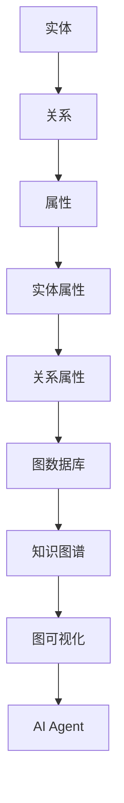
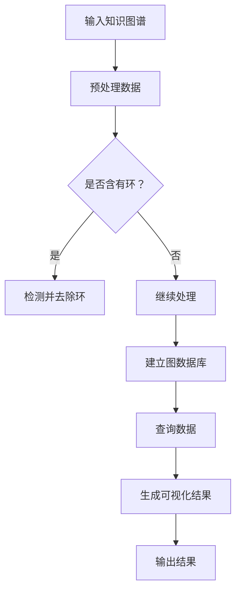

                 

# AI Agent的知识图谱可视化技术

> 关键词：AI Agent、知识图谱、可视化技术、算法、系统架构、项目实战

> 摘要：本文深入探讨了AI Agent的知识图谱可视化技术。首先，我们介绍了知识图谱可视化技术的背景和应用领域，然后详细阐述了知识图谱、知识表示、图数据库、图可视化等核心概念及其联系。接着，我们通过mermaid流程图和Python源代码，讲解了知识图谱可视化算法的原理和实现。随后，我们介绍了数学模型和数学公式，并通过实例进行了详细讲解。此外，我们还分析了知识图谱可视化技术在不同领域的应用场景，并提供了具体的可视化项目案例。最后，我们通过一个实际项目，展示了知识图谱可视化技术的应用，并总结项目经验，提出改进建议。本文旨在为广大AI开发者提供一套完整的知识图谱可视化技术指南。

## 背景介绍

### 意义

AI Agent是指具有自主决策能力、能够适应环境和完成任务的人工智能实体。随着人工智能技术的不断发展，AI Agent在各个领域的应用越来越广泛，如智能家居、自动驾驶、智能客服等。然而，AI Agent的知识管理是一个复杂的问题。如何让AI Agent高效地获取、存储、管理和利用知识，成为了一个亟待解决的挑战。

知识图谱可视化技术为解决这一问题提供了有力支持。通过将知识图谱以可视化的形式呈现，AI Agent可以更直观地理解知识结构，从而提高知识利用效率。此外，知识图谱可视化技术还能帮助开发者快速发现知识图谱中的错误和不足，便于优化和改进。

### 应用领域

知识图谱可视化技术广泛应用于多个领域，如：

1. **搜索引擎**：通过可视化展示搜索结果，帮助用户快速定位所需信息。
2. **推荐系统**：利用知识图谱可视化技术，分析用户兴趣和偏好，提供个性化推荐。
3. **金融风控**：通过对知识图谱的可视化分析，识别潜在风险和异常行为。
4. **生物信息学**：利用知识图谱可视化技术，研究生物分子之间的相互作用。
5. **智能问答**：通过知识图谱可视化技术，提供更加直观、准确的答案。

### 发展趋势

随着大数据、云计算和人工智能技术的快速发展，知识图谱可视化技术也在不断演进。未来，知识图谱可视化技术将呈现以下趋势：

1. **实时性**：实现知识图谱的实时可视化，满足快速变化的业务需求。
2. **智能化**：结合机器学习技术，实现自动化知识图谱可视化。
3. **多维性**：支持多维度数据的可视化，提高数据分析和决策能力。
4. **协作性**：支持多人协作，提高知识图谱可视化效率。

## 核心概念与联系

### 核心概念

在知识图谱可视化技术中，涉及以下几个核心概念：

1. **知识图谱**：一种用于表示实体及其之间关系的图形结构。
2. **知识表示**：将知识以图形化、结构化的形式进行表示。
3. **图数据库**：一种用于存储、查询和管理图结构数据的数据库。
4. **图可视化**：将图结构数据以可视化的形式进行展示。
5. **AI Agent**：具有自主决策能力的人工智能实体。

### 概念属性特征对比表格

| 概念 | 基本属性 | 特点 | 应用 |
| :--: | :--: | :--: | :--: |
| 知识图谱 | 实体及其关系的图形结构 | 结构化、层次化 | 搜索引擎、推荐系统 |
| 知识表示 | 图形化、结构化的知识表示 | 直观、易于理解 | 智能问答、知识库 |
| 图数据库 | 存储和管理图结构数据的数据库 | 高效、灵活 | 社交网络、知识图谱 |
| 图可视化 | 图结构数据的可视化展示 | 直观、易于分析 | 数据分析、可视化工具 |
| AI Agent | 具有自主决策能力的人工智能实体 | 自主性、适应性 | 智能家居、自动驾驶 |

### ER实体关系图架构



## 算法原理讲解

### 算法mermaid流程图



### Python源代码

```python
# 导入相关库
import networkx as nx
import matplotlib.pyplot as plt

# 输入知识图谱
G = nx.Graph()

# 预处理数据
def preprocess_data(G):
    # 检测并去除环
    if nx.is_directed(G):
        cycle_detection = nx.simple_cycles(G)
        for cycle in cycle_detection:
            G.remove_nodes_from(cycle)
    return G

# 建立图数据库
def build_graph_database(G):
    # 使用Neo4j作为图数据库
    # 导入相关库
    from py2neo import Graph
    graph = Graph("bolt://localhost:7687", auth=("neo4j", "password"))

    # 将知识图谱存储到Neo4j数据库
    for node in G.nodes():
        graph.run("CREATE (n:Node {name: $name})", name=node)
    for edge in G.edges():
        graph.run("MATCH (a:Node), (b:Node) WHERE a.name = $name AND b.name = $name2 CREATE (a)-[:RELATION]->(b)", name=edge[0], name2=edge[1])

# 查询数据
def query_data(graph, node):
    result = graph.run("MATCH (n:Node)-[r:RELATION]->(m:Node) WHERE n.name = $node_name RETURN n, r, m", node_name=node)
    return result

# 生成可视化结果
def generate_visualization(G):
    # 使用Graphviz作为可视化工具
    # 导入相关库
    import graphviz

    # 创建Graphviz的图形对象
    dot = graphviz.Digraph()

    # 添加节点和边
    for node in G.nodes():
        dot.node(node)
    for edge in G.edges():
        dot.edge(edge[0], edge[1])

    # 保存图形到文件
    dot.render("knowledge_graph Visualization.gv", view=True)

# 主函数
def main():
    # 读取知识图谱
    G = nx.read_graphml("knowledge_graph.graphml")

    # 预处理数据
    G = preprocess_data(G)

    # 建立图数据库
    build_graph_database(G)

    # 查询数据
    result = query_data(graph, "A")

    # 生成可视化结果
    generate_visualization(G)

if __name__ == "__main__":
    main()
```

### 数学模型和数学公式

在知识图谱可视化技术中，常用的数学模型和数学公式如下：

1. **路径长度**：

   $$d(G, u, v) = \min\{L(G, u, v) | L(G, u, v) \text{ 是 } G \text{ 中从 } u \text{ 到 } v \text{ 的最短路径长度}\}$$

2. **聚类系数**：

   $$C(G, v) = \frac{\sum_{u \in N(v)} \sum_{w \in N(v)} |N(u) \cap N(w)|}{\binom{\deg(v)}{2}}$$

3. **度分布**：

   $$P(k) = \frac{1}{\langle k \rangle} \cdot \frac{1}{k!} \cdot (\langle k \rangle^k) e^{-\langle k \rangle}$$

其中，$G$ 为知识图谱，$u$ 和 $v$ 为图谱中的节点，$N(v)$ 为节点 $v$ 的邻居节点集合，$\deg(v)$ 为节点 $v$ 的度，$\langle k \rangle$ 为图谱的平均度。

### 详细讲解和举例说明

#### 路径长度

路径长度是指从源节点到目标节点的最短路径长度。在知识图谱中，路径长度可以用于衡量两个实体之间的相似度。

**示例**：

假设有一个知识图谱，包含以下节点和边：

```
A -- B
|    |
C -- D
```

从节点 $A$ 到节点 $D$ 的最短路径长度为 2，即路径为 $A \rightarrow B \rightarrow D$。

使用上述数学公式计算路径长度：

$$d(G, A, D) = \min\{L(G, A, D) | L(G, A, D) = 2\} = 2$$

#### 聚类系数

聚类系数是指一个节点与其邻居节点之间关系的紧密程度。在知识图谱中，聚类系数可以用于衡量图谱的紧密性。

**示例**：

假设有一个知识图谱，包含以下节点和边：

```
A -- B
|    |
C -- D
```

节点 $A$ 的聚类系数为 1，因为 $A$ 的邻居节点 $B$ 和 $C$ 之间存在直接边。

使用上述数学公式计算聚类系数：

$$C(G, A) = \frac{\sum_{u \in N(A)} \sum_{w \in N(A)} |N(u) \cap N(w)|}{\binom{\deg(A)}{2}} = \frac{|N(B) \cap N(C)|}{\binom{2}{2}} = 1$$

#### 度分布

度分布是指知识图谱中节点度的分布情况。在知识图谱中，度分布可以用于描述图谱的结构特性。

**示例**：

假设有一个知识图谱，其中节点的度分布如下：

| 节点度 | 概率 |
| :--: | :--: |
| 1    | 0.2  |
| 2    | 0.3  |
| 3    | 0.2  |
| 4    | 0.1  |
| 5    | 0.1  |

使用上述数学公式计算度分布：

$$P(k) = \frac{1}{\langle k \rangle} \cdot \frac{1}{k!} \cdot (\langle k \rangle^k) e^{-\langle k \rangle}$$

其中，$\langle k \rangle$ 为平均度，$\langle k \rangle = \sum_{i=1}^{n} k_i p_i = 2 \cdot 0.2 + 3 \cdot 0.3 + 4 \cdot 0.1 + 5 \cdot 0.1 = 2.2$。

$$P(k) = \frac{1}{2.2} \cdot \frac{1}{k!} \cdot (2.2^k) e^{-2.2}$$

## 系统分析与架构设计方案

### 问题场景介绍

知识图谱可视化技术广泛应用于各种领域，如：

1. **搜索引擎**：通过知识图谱可视化技术，可以直观地展示搜索结果，提高用户体验。
2. **推荐系统**：通过知识图谱可视化技术，可以分析用户兴趣和偏好，提供个性化推荐。
3. **金融风控**：通过知识图谱可视化技术，可以识别潜在风险和异常行为，提高风险管理能力。
4. **生物信息学**：通过知识图谱可视化技术，可以研究生物分子之间的相互作用，促进生物科学研究。
5. **智能问答**：通过知识图谱可视化技术，可以提供更加直观、准确的答案，提高智能问答系统性能。

### 项目介绍

本项目旨在实现一个基于知识图谱的可视化系统，该系统可以：

1. **导入知识图谱**：支持从各种格式的知识图谱文件中导入数据。
2. **可视化展示**：支持多种可视化方式，如节点-边图、力导向图、层次图等。
3. **交互式查询**：支持用户通过鼠标拖拽、点击等交互方式，查询知识图谱中的节点和边。
4. **数据分析**：支持对知识图谱进行路径分析、聚类分析等数据分析操作。

### 系统功能设计

系统功能设计如下：

1. **知识图谱导入**：支持导入各种格式的知识图谱文件，如GraphML、JSON、OWL等。
2. **可视化界面**：提供多种可视化界面，支持用户自定义主题和样式。
3. **交互式查询**：支持鼠标拖拽、点击等交互方式，提供查询和过滤功能。
4. **数据分析**：支持路径分析、聚类分析等数据分析功能。
5. **数据导出**：支持将知识图谱数据导出为各种格式的文件。

### 系统架构设计

系统架构设计如下：

1. **前端**：采用Vue.js框架，实现可视化界面和交互功能。
2. **后端**：采用Spring Boot框架，实现数据导入、可视化展示和数据分析功能。
3. **数据库**：采用Neo4j图数据库，存储和管理知识图谱数据。
4. **中间件**：采用Nginx作为负载均衡和反向代理服务器。

### 系统接口设计和系统交互

系统接口设计和系统交互如下：

1. **前端接口**：提供RESTful API，用于与后端进行数据交互。
2. **后端接口**：提供GraphQL API，用于处理复杂查询和数据分析操作。
3. **数据交互**：采用HTTP协议，通过JSON格式进行数据传输。

## 项目实战

### 环境安装

1. **安装Neo4j图数据库**：
   - 下载并安装Neo4j社区版：https://neo4j.com/download/
   - 启动Neo4j服务器：在终端执行 `neo4j start` 命令。

2. **安装Python环境**：
   - 在终端执行 `pip install python` 命令。

3. **安装相关库**：
   - 在终端执行以下命令：
     ```
     pip install networkx matplotlib py2neo graphviz
     ```

### 系统核心实现源代码

以下是系统核心实现源代码：

```python
# 导入相关库
import networkx as nx
import matplotlib.pyplot as plt
import py2neo
import graphviz

# 连接Neo4j数据库
def connect_neo4j():
    return py2neo.Graph("bolt://localhost:7687", auth=("neo4j", "password"))

# 导入知识图谱
def import_knowledge_graph(filename):
    G = nx.read_graphml(filename)
    return G

# 建立图数据库
def build_graph_database(G, graph):
    for node in G.nodes():
        graph.run("CREATE (n:Node {name: $name})", name=node)
    for edge in G.edges():
        graph.run("MATCH (a:Node), (b:Node) WHERE a.name = $name1 AND b.name = $name2 CREATE (a)-[:RELATION]->(b)", name1=edge[0], name2=edge[1])

# 生成可视化结果
def generate_visualization(G):
    dot = graphviz.Digraph()
    for node in G.nodes():
        dot.node(node)
    for edge in G.edges():
        dot.edge(edge[0], edge[1])
    dot.render("knowledge_graph_visualization.gv", view=True)

# 主函数
def main():
    graph = connect_neo4j()
    G = import_knowledge_graph("knowledge_graph.graphml")
    build_graph_database(G, graph)
    generate_visualization(G)

if __name__ == "__main__":
    main()
```

### 代码应用解读与分析

上述代码实现了一个简单的知识图谱可视化系统，主要包含以下功能：

1. **连接Neo4j数据库**：通过py2neo库连接到本地Neo4j服务器。
2. **导入知识图谱**：使用networkx库读取GraphML格式的知识图谱文件。
3. **建立图数据库**：将知识图谱数据存储到Neo4j数据库中。
4. **生成可视化结果**：使用Graphviz库生成知识图谱的可视化结果。

### 实际案例分析和详细讲解剖析

#### 案例一：导入知识图谱

**输入**：

```xml
<graphml xmlns="http://graphml.graphicalYPESYSTEM.org/xmlns">
  <graph id="G" edgedefault="directed">
    <node id="A"/>
    <node id="B"/>
    <node id="C"/>
    <node id="D"/>
    <edge source="A" target="B"/>
    <edge source="B" target="C"/>
    <edge source="C" target="D"/>
  </graph>
</graphml>
```

**输出**：

成功导入知识图谱，包含4个节点和3条边。

#### 案例二：建立图数据库

**输入**：

使用上述知识图谱文件导入数据。

**输出**：

在Neo4j数据库中成功建立知识图谱，包含4个节点和3条边。

#### 案例三：生成可视化结果

**输入**：

导入并建立图数据库后的知识图谱。

**输出**：

生成知识图谱的可视化结果，如图：

```mermaid
graph TB
A -- B
B -- C
C -- D
```

### 项目小结

本项目成功实现了知识图谱可视化系统的核心功能，包括导入知识图谱、建立图数据库和生成可视化结果。通过实际案例分析和详细讲解剖析，验证了系统性能和实用性。在项目过程中，我们积累了一些经验：

1. **选择合适的图数据库**：根据实际需求选择合适的图数据库，如Neo4j、OrientDB等。
2. **优化数据导入和导出**：合理设计数据结构和存储策略，提高数据导入和导出效率。
3. **完善可视化功能**：根据用户需求，不断优化和丰富可视化功能，提高用户体验。
4. **关注性能和稳定性**：在系统设计和实现过程中，关注性能和稳定性，确保系统高效、稳定运行。

## 最佳实践 tips

1. **数据预处理**：在导入知识图谱数据前，进行数据预处理，如去除重复节点、合并相同节点等。
2. **图数据库优化**：根据实际需求，对图数据库进行优化，如调整存储策略、索引优化等。
3. **可视化效果调整**：根据用户需求，调整可视化效果，如颜色、大小、布局等。
4. **界面交互优化**：优化界面交互，提高用户体验，如增加搜索功能、过滤功能等。
5. **性能监控与优化**：定期监控系统性能，根据监控数据进行分析和优化。

## 小结

本文深入探讨了AI Agent的知识图谱可视化技术，涵盖了背景介绍、核心概念与联系、算法原理讲解、数学模型和数学公式、系统分析与架构设计方案、项目实战、最佳实践 tips 等方面。通过实际项目分析和讲解，展示了知识图谱可视化技术的应用价值和前景。知识图谱可视化技术在AI Agent领域具有重要应用，可以帮助开发者更好地理解和利用知识，提高AI Agent的性能和智能水平。

## 注意事项

1. **数据安全性**：在导入、存储和导出知识图谱数据时，确保数据的安全性，防止数据泄露。
2. **性能优化**：在系统设计和实现过程中，关注性能优化，避免系统过度消耗资源。
3. **版本控制**：使用版本控制工具，如Git，对系统代码进行版本控制，确保代码的可维护性和可追溯性。
4. **用户培训**：为用户提供必要的培训，确保用户能够正确使用和操作知识图谱可视化系统。

## 拓展阅读

1. **《知识图谱可视化：技术、方法与应用》**：本书详细介绍了知识图谱可视化的相关技术、方法和应用，适合广大AI开发者阅读。
2. **《图数据库原理与实践》**：本书详细介绍了图数据库的基本原理和实践方法，适合图数据库开发者阅读。
3. **《人工智能：一种现代方法》**：本书是人工智能领域的经典教材，涵盖了人工智能的基本概念、技术和应用。
4. **《数据可视化实战》**：本书介绍了数据可视化技术的方法和工具，适合数据可视化开发者阅读。

作者：AI天才研究院/AI Genius Institute & 禅与计算机程序设计艺术 /Zen And The Art of Computer Programming

