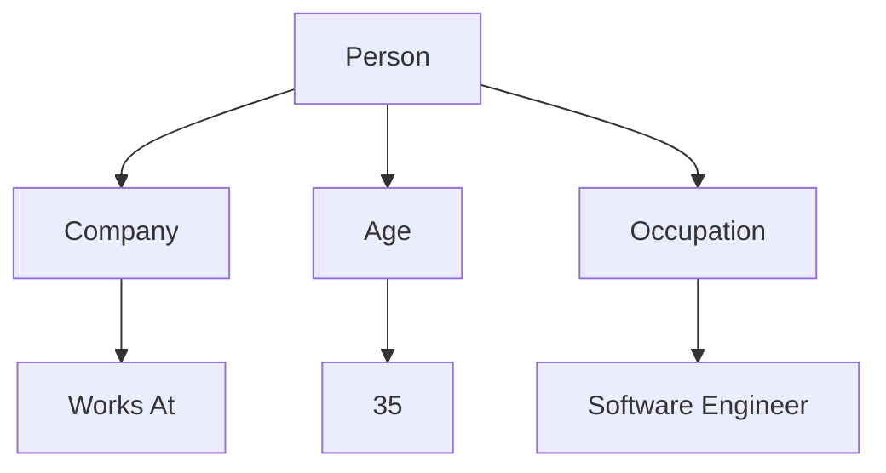

                 

### 文章标题

### 关键词

- AI Agent
- 知识图谱
- 问答系统
- 应用
- 优化策略

### 摘要

本文详细探讨了AI Agent与知识图谱在问答系统中的应用。首先，从AI Agent的概述入手，分析了其核心概念、技术架构和应用场景。接着，介绍了知识图谱的基本概念、构建方法和应用，着重解释了知识图谱中的实体关系表示。随后，深入探讨了知识图谱在问答系统中的工作原理和实际应用，分析了问答系统的性能优化策略。最后，展望了知识图谱问答系统的未来发展趋势和挑战，并提出了优化建议。本文旨在为读者提供一个全面而深入的了解，帮助其在AI领域有所建树。

## 第一部分: AI Agent与知识图谱基础

### 第1章: AI Agent概述

#### 1.1 问题背景与意义

AI Agent，即人工智能代理，是一种可以自主执行任务、与环境交互并做出决策的智能体。随着人工智能技术的迅猛发展，AI Agent在多个领域得到了广泛应用，如智能家居、自动驾驶、智能客服等。这些应用不仅提高了生产效率，还改善了人们的生活质量。

首先，让我们来探讨AI Agent的定义和作用。AI Agent可以定义为一种具有自我意识和自主行动能力的计算实体，能够在没有人类干预的情况下执行特定任务。它具有感知、决策、执行和反馈四个基本功能，类似于人类的思维过程。

AI Agent的定义：

- 感知：AI Agent能够接收并理解环境中的信息。
- 决策：基于感知信息，AI Agent能够自主做出决策。
- 执行：AI Agent能够执行决策结果。
- 反馈：AI Agent能够根据执行结果调整自身行为。

AI Agent的作用：

- 提高生产效率：通过自动化和智能化，AI Agent可以大幅减少人力成本，提高生产效率。
- 优化服务质量：AI Agent可以提供24/7的智能服务，提升用户体验。
- 改善生活质量：AI Agent可以在日常生活中帮助人们解决各种问题，如智能家居、健康监测等。

接下来，我们回顾一下AI Agent的发展历程。AI Agent的发展可以追溯到20世纪50年代，当时人工智能（AI）的概念首次被提出。从最初的规则系统、专家系统，到后来的机器学习和深度学习，AI Agent的技术不断演进。

发展历程：

- 1950s：人工智能概念提出，初期研究主要集中在逻辑推理和问题求解。
- 1960s-1970s：专家系统兴起，基于知识表示和推理算法，能够解决特定领域的问题。
- 1980s-1990s：机器学习出现，通过数据驱动的方式训练模型，提高了AI Agent的自主能力。
- 2000s：深度学习和强化学习发展，AI Agent在视觉识别、自然语言处理等领域取得突破。
- 2010s-至今：AI Agent在实际应用中广泛部署，如自动驾驶、智能客服等。

通过以上分析，我们可以看出，AI Agent在现代科技中的重要性不言而喻。它不仅代表了人工智能技术的发展方向，还将在未来的各个领域发挥重要作用。

#### 1.2 AI Agent的核心概念与联系

接下来，我们将深入探讨AI Agent的核心概念，包括其基本结构、功能和工作原理，并对比其他智能系统，如机器人、自动驾驶等。

**核心概念**：

AI Agent的基本结构主要包括感知模块、决策模块和执行模块。感知模块负责接收和处理环境中的信息，如视觉、听觉和触觉等；决策模块基于感知模块提供的信息，利用机器学习算法或逻辑推理进行决策；执行模块则负责将决策结果转化为实际行动。

AI Agent的功能包括：

- 自主感知：实时获取环境信息。
- 自主决策：基于感知信息进行推理和决策。
- 自主导行：根据决策结果执行任务。
- 自主适应：在执行任务过程中不断调整自身行为，以适应环境变化。

**工作原理**：

AI Agent的工作原理可以概括为感知-决策-执行三个环节。首先，感知模块收集环境信息，然后决策模块对这些信息进行分析和处理，生成决策结果；最后，执行模块根据决策结果执行具体的任务。这三个环节相互配合，使AI Agent能够自主地与环境交互，并完成任务。

**联系与对比**：

与其他智能系统（如机器人、自动驾驶等）相比，AI Agent具有以下异同点：

- 相同点：
  - 都具有感知、决策和执行功能。
  - 都可以自主地与环境交互。
  - 都能够在没有人类干预的情况下完成任务。

- 不同点：
  - AI Agent更侧重于抽象的决策和推理，而机器人更侧重于具体的执行。
  - 自动驾驶系统通常需要实时处理大量的感知信息，而AI Agent则更注重决策和执行过程的优化。
  - AI Agent具有更强的自适应能力，能够在复杂多变的环境中生存和进化。

通过以上分析，我们可以看到，AI Agent作为一种新兴的智能系统，具有广泛的应用前景和发展潜力。它在多个领域都能发挥重要作用，是未来人工智能技术发展的重要方向。

#### 1.3 AI Agent的技术架构与实现

在了解了AI Agent的基本概念和作用之后，我们接下来讨论AI Agent的技术架构与实现。AI Agent的技术架构主要包括感知模块、决策模块和执行模块，这些模块相互作用，共同实现AI Agent的功能。

**技术架构**：

1. **感知模块**：感知模块是AI Agent与外界环境交互的接口，负责收集和处理环境信息。常见的感知方式包括视觉、听觉、触觉等。感知模块通常由传感器和信号处理算法组成。传感器可以收集图像、声音、温度等信息，信号处理算法则对这些信息进行预处理，以便后续处理。

2. **决策模块**：决策模块是AI Agent的核心，负责根据感知模块提供的信息进行推理和决策。决策模块通常使用机器学习算法或逻辑推理算法。机器学习算法可以训练模型，从大量数据中提取特征，进行分类或回归任务；逻辑推理算法则基于规则的推理，能够处理复杂的问题。

3. **执行模块**：执行模块是AI Agent将决策结果转化为实际行动的部分。执行模块通常由执行器组成，如电机、机器人手臂等。执行模块根据决策模块的决策结果，控制执行器的动作，完成具体的任务。

**实现方法**：

AI Agent的实现方法主要包括以下几个步骤：

1. **数据收集**：收集用于训练模型的原始数据。这些数据可以来自传感器、历史记录等。

2. **数据预处理**：对收集到的数据进行清洗、归一化等处理，以便模型能够更好地学习。

3. **模型训练**：使用机器学习算法训练模型。常用的算法包括决策树、支持向量机、神经网络等。训练过程包括数据集划分、模型参数调整等。

4. **模型评估**：评估模型的性能，包括准确率、召回率等指标。如果模型性能不满足要求，需要返回步骤3进行重新训练。

5. **模型部署**：将训练好的模型部署到AI Agent中，使其具备自主决策和执行能力。

6. **实时更新**：根据环境变化和任务需求，定期更新模型，以保持其适应性和准确性。

**关键技术在AI Agent中的重要性**：

- **机器学习**：机器学习是AI Agent的核心技术之一，能够从数据中提取特征，实现自动学习和决策。常用的机器学习算法包括线性回归、决策树、支持向量机、神经网络等。

- **自然语言处理**：自然语言处理技术使AI Agent能够理解和处理人类语言，从而实现更自然的人机交互。常用的自然语言处理技术包括词向量、语法分析、机器翻译等。

- **计算机视觉**：计算机视觉技术使AI Agent能够理解和解析图像和视频信息，从而实现视觉感知和识别。常用的计算机视觉技术包括图像识别、目标检测、人脸识别等。

通过以上分析，我们可以看到，AI Agent的技术架构与实现涉及多个领域的技术，包括机器学习、自然语言处理、计算机视觉等。这些技术的融合与协同，使AI Agent具备了强大的自主决策和执行能力，为各领域的智能化应用提供了有力支持。

#### 1.4 AI Agent的应用场景

AI Agent在各个领域的应用越来越广泛，其独特的自主决策和执行能力为各行业带来了巨大变革。以下是AI Agent在不同领域的应用案例，以及这些应用所带来的价值与挑战。

**1. 智能家居**

智能家居是AI Agent应用的一个重要领域。通过感知模块收集环境数据，如温度、湿度、光照等，AI Agent可以自动调整家庭设备的运行状态，提高家居环境的舒适度。例如，智能恒温器可以根据室内外温度自动调节暖气或空调，智能照明可以根据环境光照自动调节亮度。这些应用不仅提高了生活质量，还节省了能源。

**价值**：提高了家居环境的舒适度和能源效率，降低了生活成本。

**挑战**：需要大量的数据收集和处理，对数据的隐私和安全提出了更高的要求。

**2. 自动驾驶**

自动驾驶是AI Agent在交通领域的应用，通过感知模块收集路况信息，如交通流量、障碍物等，AI Agent可以自主驾驶车辆。自动驾驶不仅可以提高交通安全，减少交通事故，还可以提高交通效率，减少拥堵。

**价值**：提高了交通安全和交通效率，减少了交通拥堵。

**挑战**：需要高精度的感知技术，如激光雷达、摄像头等，成本较高；在复杂环境下的决策和执行仍然存在挑战。

**3. 智能客服**

智能客服是AI Agent在服务行业的应用，通过自然语言处理技术理解和处理用户的问题，AI Agent可以提供24/7的智能服务，提高客户满意度。智能客服不仅可以处理大量的客户咨询，还可以自动分类和分配任务，提高服务效率。

**价值**：提供了高效的客户服务，提高了客户满意度。

**挑战**：需要处理大量的非结构化数据，自然语言处理技术尚需提高；如何保证AI Agent的回答准确性和人性化也是一个挑战。

**4. 健康监测**

AI Agent在健康监测领域的应用，通过感知模块收集人体生理数据，如心率、血压等，AI Agent可以实时监测健康状况，并提供健康建议。例如，智能手环、智能手表等设备已经广泛应用于健康监测。

**价值**：实时监测健康状况，提供个性化健康建议，提高了健康水平。

**挑战**：需要准确的感知技术和数据处理方法，对数据的隐私保护提出了更高的要求。

**5. 物流与仓储**

AI Agent在物流与仓储领域的应用，通过感知模块收集运输和仓储过程中的信息，如货物状态、库存量等，AI Agent可以自动调度货物，优化物流流程。例如，无人机物流、智能仓储机器人等已经得到了广泛应用。

**价值**：提高了物流效率，减少了人力成本。

**挑战**：需要高精度的感知技术和复杂的调度算法，对系统的可靠性和稳定性提出了更高的要求。

通过以上分析，我们可以看到，AI Agent在各个领域的应用都带来了巨大的价值，但同时也面临着一些挑战。随着技术的不断进步和应用的深入，AI Agent将在未来发挥更加重要的作用，推动各行业向智能化、自动化方向发展。

### 第2章: 知识图谱的概念与架构

#### 2.1 知识图谱概述

知识图谱是一种用于表达实体及其相互关系的数据结构，通过图形化的方式将实体和关系进行组织，使得信息更加直观和易于理解。知识图谱在人工智能、数据挖掘、语义搜索等领域具有重要的应用价值。

**定义**：

知识图谱（Knowledge Graph）是一种用于表示实体（如人、地点、事物等）及其相互关系的语义网络，它通过实体、属性和关系的三角模型来构建，使得数据具有语义关联性和可解释性。

**作用**：

1. **信息组织与检索**：知识图谱将大量的数据组织成一个结构化的网络，使得信息检索更加高效和准确。
2. **语义理解**：知识图谱提供了实体和关系之间的语义关联，有助于自然语言处理和语义搜索。
3. **智能推荐**：基于知识图谱的推荐系统可以更好地理解用户需求和偏好，提供个性化的推荐。
4. **决策支持**：知识图谱可以帮助企业和组织更好地理解业务数据，提供决策支持。

**重要性**：

知识图谱的重要性在于它能够将海量的非结构化数据转化为结构化的知识库，使得数据具有更高的利用价值和可解释性。在人工智能时代，知识图谱是实现智能推荐、语义搜索和决策支持的关键技术之一。

**发展历程**：

知识图谱的发展可以分为三个阶段：

1. **早期阶段（1980s-1990s）**：这一阶段主要以本体论（Ontology）和知识表示（Knowledge Representation）为主要研究方向，主要目标是建立形式化的知识表示框架。
2. **中间阶段（2000s）**：这一阶段随着语义网（Semantic Web）和链接数据（Linked Data）的兴起，知识图谱开始得到广泛应用。Google知识图谱、Freebase等大规模知识图谱的构建标志着知识图谱进入实用阶段。
3. **现阶段（2010s至今）**：随着大数据、人工智能技术的不断发展，知识图谱的应用范围进一步扩大。知识图谱在自然语言处理、智能推荐、智能搜索等领域取得了显著成果。

#### 2.2 知识图谱的组成与结构

知识图谱由实体、属性和关系三个基本元素组成，这些元素通过图结构进行组织，形成了知识图谱的层次化和网络化结构。

**知识表示**：

知识图谱的基本表示方法包括：

1. **RDF（Resource Description Framework）**：RDF是一种用于表达知识图谱的框架，它使用三元组（主体、谓词、客体）来表示实体和关系。
2. **OWL（Web Ontology Language）**：OWL是一种用于定义本体和知识图谱的语言，它提供了更加丰富的语义描述能力。
3. **图数据库**：图数据库（如Neo4j、JanusGraph等）专门用于存储和管理知识图谱，具有高效的数据查询和图分析功能。

**实体关系表示**：

在知识图谱中，实体和关系通过图结构进行组织，形成了实体关系网络。实体表示为图中的节点，关系表示为图中的边。

实体（Entity）：实体是知识图谱中的基本元素，如人、地点、事物等。实体可以具有多个属性，如姓名、年龄、职业等。

关系（Relationship）：关系表示实体之间的相互作用或关联。例如，"工作于"表示一个人与一个公司的关系，"居住于"表示一个人与一个地点的关系。

实体关系图（Entity-Relationship Graph，ERG）：实体关系图是一种常见的知识图谱表示方法，它通过节点（实体）和边（关系）来表示实体及其相互关系。以下是实体关系图的Mermaid表示：

在这个例子中，A表示一个实体（Person），B表示另一个实体（Company），C表示实体之间的关系（Works At）。其他实体和关系也可以类似地表示。

通过以上分析，我们可以看到，知识图谱的概念与架构是人工智能领域的一个重要组成部分。它通过图形化的方式组织数据，使得信息更加直观和易于理解，为语义搜索、智能推荐、决策支持等领域提供了强大的支持。

### 第3章: 知识图谱在问答系统中的应用

#### 3.1 问答系统的概述

问答系统（Question Answering System）是一种人工智能技术，能够自动理解用户的问题，并从大量数据中检索出相关答案。问答系统广泛应用于搜索引擎、智能客服、智能助手等场景，为用户提供了便捷的信息获取服务。

**定义**：

问答系统是一种基于自然语言处理（NLP）和知识图谱技术，能够自动理解用户问题并生成答案的人工智能系统。它包括问题理解、答案检索和答案生成三个主要环节。

**工作流程**：

问答系统的工作流程通常包括以下步骤：

1. **问题理解**：接收并分析用户提出的问题，将其转化为计算机可以处理的形式。
2. **答案检索**：在知识库或互联网上检索与问题相关的信息。
3. **答案生成**：根据检索结果生成符合用户需求的答案。

**发展历程**：

问答系统的发展可以分为以下几个阶段：

1. **基于规则的方法**：早期的问答系统主要依赖于手工编写的规则，通过模式匹配和条件判断来回答简单的问题。
2. **基于知识的方法**：随着知识表示和推理技术的发展，问答系统开始引入知识图谱，通过语义理解和知识检索来回答复杂的问题。
3. **基于统计的方法**：基于统计的问答系统利用机器学习算法从大量数据中学习并生成答案，提高了问答系统的准确性和泛化能力。
4. **基于深度学习的方法**：深度学习技术的引入，使得问答系统在理解问题和生成答案方面取得了显著进展。深度学习方法通过神经网络模型，实现了对复杂语义的精确理解和生成。

#### 3.2 知识图谱问答系统的工作原理

知识图谱问答系统（Knowledge Graph Question Answering System，KGQA）是一种结合知识图谱和问答系统的新型技术，它通过知识图谱中的实体和关系，实现对问题的精确理解和答案的生成。

**知识表示**：

在知识图谱问答系统中，知识表示是关键的一步。知识图谱中的实体、属性和关系构成了问题的语义表示。知识表示的方法包括：

1. **RDF（Resource Description Framework）**：RDF使用三元组（主体、谓词、客体）来表示实体和关系，是知识图谱的基本表示方法。
2. **OWL（Web Ontology Language）**：OWL是一种用于定义本体和知识图谱的语言，提供了更加丰富的语义描述能力。
3. **图数据库**：图数据库（如Neo4j、JanusGraph等）用于存储和管理知识图谱，具有高效的数据查询和图分析功能。

**知识检索**：

知识检索是在知识图谱问答系统中检索与问题相关的信息。知识检索的方法包括：

1. **基于关键字匹配**：通过匹配用户问题和知识图谱中的实体和关系，检索相关答案。
2. **基于图谱搜索**：通过在知识图谱中搜索与问题相关的路径，找到相关答案。
3. **基于语义匹配**：使用自然语言处理技术，对用户问题和知识图谱中的实体、属性和关系进行语义匹配，找到相关答案。

**推理机制**：

知识图谱问答系统的推理机制是基于知识图谱的推理算法。推理机制的方法包括：

1. **路径推理**：通过在知识图谱中搜索与问题相关的路径，找到相关答案。
2. **逻辑推理**：使用逻辑推理算法，如谓词逻辑、归纳推理等，对知识图谱中的信息进行推理，生成答案。
3. **混合推理**：结合多种推理方法，如路径推理和逻辑推理，提高问答系统的准确性和鲁棒性。

**实现方法**：

知识图谱问答系统的实现方法包括以下几个步骤：

1. **知识图谱构建**：收集和整理相关领域的知识，构建知识图谱。
2. **问题预处理**：对用户提出的问题进行预处理，如分词、词性标注等。
3. **知识检索**：在知识图谱中检索与问题相关的实体和关系。
4. **答案生成**：根据检索结果，使用推理机制生成答案。

通过以上分析，我们可以看到，知识图谱问答系统通过知识表示、知识检索和推理机制，实现对问题的精确理解和答案的生成。它在搜索引擎、智能客服、智能助手等领域具有广泛的应用前景。

#### 3.3 知识图谱问答系统的实际应用案例

知识图谱问答系统（KGQA）在多个实际应用场景中取得了显著成果，以下是一些典型的应用案例，以及它们在实际应用中的表现和效果。

**1. 智能客服**

智能客服是知识图谱问答系统最典型的应用之一。通过构建一个包含大量业务知识和常见问题的知识图谱，智能客服系统能够自动回答用户的查询，提高客户服务效率和满意度。例如，一个银行智能客服系统可以通过知识图谱回答用户关于账户余额、转账、贷款等问题的查询。

**应用效果**：

- **提高响应速度**：智能客服系统可以在几秒钟内回答用户问题，大大缩短了用户的等待时间。
- **降低人力成本**：智能客服系统可以处理大量的客户咨询，减轻了人工客服的工作负担，降低了企业的人力成本。
- **提升客户满意度**：智能客服系统能够准确回答用户问题，提高了客户的满意度。

**案例挑战**：

- **复杂问题的处理**：某些复杂的问题需要高级的推理能力，现有技术可能无法完全解决。
- **知识图谱的构建和维护**：构建和维护一个全面、准确的知识图谱需要大量的时间和资源。

**2. 智能搜索**

知识图谱问答系统在智能搜索中的应用，可以显著提高搜索的准确性和相关性。通过在搜索引擎中集成知识图谱，用户提出的问题可以与知识图谱中的实体和关系进行匹配，从而提供更加精准的搜索结果。

**应用效果**：

- **提高搜索精度**：知识图谱问答系统可以精确理解用户的问题，提供与问题高度相关的搜索结果。
- **增强搜索体验**：用户可以通过自然语言提问，获取更直观、更易理解的搜索结果。
- **优化搜索引擎排名**：通过知识图谱的关联信息，搜索引擎可以更准确地判断网页的相关性，优化搜索结果的排名。

**案例挑战**：

- **图谱数据的准确性和实时性**：知识图谱中的数据需要保持准确和实时，否则会影响搜索的准确性和用户体验。
- **查询优化**：如何在高维度、大规模的知识图谱中进行高效查询，是技术上的一个挑战。

**3. 医疗健康**

在医疗健康领域，知识图谱问答系统可以用于医疗咨询、病情诊断等应用。通过构建包含医学知识、症状、治疗方法等知识的图谱，系统可以回答用户关于健康问题的问题，提供专业的医疗建议。

**应用效果**：

- **提高医疗咨询效率**：医生可以通过知识图谱问答系统快速获取患者的历史记录、症状等信息，提高咨询效率。
- **辅助病情诊断**：系统可以根据患者的症状和体征，提供初步的诊断建议，辅助医生进行诊断。
- **提升患者满意度**：系统可以提供个性化的健康建议，提升患者的满意度。

**案例挑战**：

- **医学知识的复杂性**：医学知识非常复杂，知识图谱的构建和维护需要专业的医学知识和经验。
- **隐私保护**：患者的健康数据涉及到隐私问题，需要采取有效的保护措施，确保数据的安全和隐私。

**4. 教育辅导**

知识图谱问答系统在教育辅导中的应用，可以为学生提供个性化的学习建议、作业解答等。通过构建包含学科知识、题型、解题方法等知识的图谱，系统可以为学生提供精准的学习支持。

**应用效果**：

- **提高学习效率**：系统可以根据学生的提问，提供针对性的学习资源和解答，提高学习效率。
- **个性化学习**：系统可以分析学生的学习情况和偏好，为学生提供个性化的学习建议。
- **减轻教师负担**：系统可以自动处理大量的学生问题，减轻教师的工作负担。

**案例挑战**：

- **知识图谱的构建**：教育知识的图谱构建需要大量的时间和资源，确保知识的准确性和完整性。
- **系统的自适应能力**：系统需要具备良好的自适应能力，能够根据学生的学习情况不断调整和优化。

通过以上分析，我们可以看到，知识图谱问答系统在智能客服、智能搜索、医疗健康、教育辅导等多个领域具有广泛的应用前景和显著的应用效果。然而，在实际应用中仍面临一些挑战，需要进一步的技术研究和优化。

#### 3.4 知识图谱问答系统的优化策略

知识图谱问答系统的性能优化是一个多方面的问题，涉及查询优化、数据预处理和系统扩展等多个方面。以下是一些有效的优化策略，以提升问答系统的响应速度和准确性。

**查询优化**

查询优化是提高知识图谱问答系统性能的关键环节。以下是一些常见的查询优化策略：

1. **索引技术**：使用索引技术可以显著提高查询效率。例如，基于B树或哈希表的索引可以快速定位到相关的实体和关系。

2. **缓存机制**：通过缓存常用查询的结果，可以减少对数据库的直接访问，从而提高系统的响应速度。

3. **查询重写**：优化查询语句的结构，减少查询的复杂度，例如使用联合查询代替嵌套查询，可以减少查询的执行时间。

4. **并行处理**：对于大规模的数据集，可以通过并行处理技术将查询任务分配到多个处理器上同时执行，从而提高查询效率。

**数据预处理**

数据预处理是确保知识图谱质量和性能的重要步骤。以下是一些常见的数据预处理策略：

1. **数据清洗**：清洗数据集中的噪声和错误，例如去除重复的实体和关系，修正错误的属性值等。

2. **数据标准化**：将不同来源的数据进行统一格式处理，例如将日期格式统一为YYYY-MM-DD，将数字格式统一为浮点数等。

3. **数据丰富**：通过数据融合和实体链接等技术，扩展知识图谱的规模和内容，提高数据的质量和完整性。

4. **数据缓存**：对于频繁访问的数据，可以将其缓存到内存中，减少对磁盘的访问次数，从而提高系统的性能。

**知识图谱的扩展与更新**

知识图谱的扩展与更新是保持系统性能和准确性的关键。以下是一些常见的策略：

1. **自动扩展**：通过数据挖掘和实体链接等技术，自动发现新的实体和关系，并加入知识图谱中。

2. **增量更新**：只对知识图谱中的新数据和变更进行更新，而不是每次都全量更新，从而减少系统的维护成本。

3. **分布式更新**：对于大规模的知识图谱，可以通过分布式系统进行更新，从而提高更新效率。

4. **版本控制**：对知识图谱的更新进行版本控制，以便在需要时可以回滚到以前的版本，保证系统的稳定性。

**跨领域知识融合**

跨领域知识融合是提高知识图谱问答系统适应性的重要手段。以下是一些常见的策略：

1. **异构数据融合**：将不同来源、不同格式的异构数据进行融合，构建统一的知识图谱。

2. **多语言处理**：对于多语言的知识图谱，可以使用机器翻译和自然语言处理技术，将不同语言的信息进行融合。

3. **语义匹配**：通过语义匹配技术，将不同领域的信息进行关联，构建跨领域的知识图谱。

通过以上优化策略，知识图谱问答系统的性能可以得到显著提升，从而更好地满足用户的需求。然而，这些策略需要根据具体的应用场景和需求进行选择和调整。

#### 3.5 跨领域问答系统的构建

跨领域问答系统是知识图谱问答系统的一个重要发展方向，它能够处理多个领域的查询，提供更为广泛的回答。以下是一些构建跨领域问答系统的关键步骤、技术方法和策略。

**关键步骤**：

1. **领域选择与划分**：首先，需要明确要构建的跨领域问答系统将覆盖哪些领域。可以通过专家评审、关键词提取和数据分析等方法进行领域划分。

2. **知识图谱构建**：对于每个领域，构建独立的领域知识图谱。这些知识图谱需要涵盖领域内的主要实体、属性和关系，并确保数据的准确性和一致性。

3. **知识融合**：将不同领域的知识图谱进行融合，构建一个统一的多领域知识图谱。知识融合的关键在于解决领域间的异构性和冲突。

4. **查询处理**：设计跨领域的查询处理流程，包括问题解析、多领域知识检索和答案生成。需要确保系统能够有效地处理跨领域的查询。

**技术方法**：

1. **实体链接**：通过实体链接技术，将不同领域中的同一名实体进行统一标识，从而实现知识图谱的融合。例如，可以使用基于本体的实体链接方法，或者基于机器学习的方法，如神经网络模型。

2. **多语言处理**：对于涉及多语言的查询，可以使用机器翻译和自然语言处理技术，将不同语言的信息进行统一处理。例如，可以使用神经网络机器翻译（NMT）技术进行语言转换，使用命名实体识别（NER）和词性标注等技术进行语义分析。

3. **语义匹配**：通过语义匹配技术，将不同领域的实体和关系进行关联，构建跨领域的知识图谱。例如，可以使用基于词向量的语义匹配方法，或者基于知识图谱的语义匹配算法。

**策略**：

1. **领域模型融合**：构建领域模型融合框架，将不同领域的知识表示方法进行统一。例如，可以使用本体工程方法，定义跨领域的统一本体模型，从而实现知识图谱的融合。

2. **知识图谱扩展**：通过自动扩展技术，不断丰富跨领域知识图谱的内容。例如，可以使用数据挖掘方法，从外部数据源中提取新的实体和关系，并加入到知识图谱中。

3. **查询优化**：针对跨领域的查询，设计高效的查询处理算法和优化策略。例如，可以使用基于图算法的查询优化方法，或者使用分布式计算技术，提高查询的响应速度。

通过以上关键步骤、技术方法和策略，可以构建一个高效、准确的跨领域问答系统。这样的系统不仅能够处理多领域的查询，提供广泛的回答，还能够不断学习和适应新的领域知识，从而提高其应用价值和实用性。

### 第4章: 知识图谱问答系统的评估与优化

#### 4.1 评估指标与方法

在评估知识图谱问答系统的性能时，选择合适的评估指标和评估方法是至关重要的。以下是一些常用的评估指标和方法，这些指标和方法可以帮助我们全面了解问答系统的性能，并为进一步优化提供依据。

**评估指标**：

1. **准确率（Accuracy）**：准确率是衡量问答系统性能的一个基本指标，它表示系统生成的答案与真实答案一致的比例。公式为：

   $$ Accuracy = \frac{TP + TN}{TP + TN + FP + FN} $$

   其中，TP表示正确预测的答案，TN表示正确未预测的答案，FP表示错误预测的答案，FN表示错误未预测的答案。

2. **召回率（Recall）**：召回率衡量了系统在所有真实答案中正确识别出的比例。公式为：

   $$ Recall = \frac{TP}{TP + FN} $$

3. **精确率（Precision）**：精确率衡量了系统预测的答案中正确答案的比例。公式为：

   $$ Precision = \frac{TP}{TP + FP} $$

4. **F1值（F1 Score）**：F1值是精确率和召回率的调和平均值，能够综合考虑系统的准确性和全面性。公式为：

   $$ F1 Score = 2 \times \frac{Precision \times Recall}{Precision + Recall} $$

**评估方法**：

1. **人工评估**：人工评估是评估问答系统性能的一种直接方法。通过专家或用户对系统生成的答案进行主观评估，判断其准确性和可读性。这种方法虽然主观性较强，但能够提供详细的评估结果。

2. **自动化评估**：自动化评估是使用算法和工具对问答系统进行客观评估的方法。常用的自动化评估方法包括：

   - **基于答案的评估**：通过比较系统生成的答案与标准答案，计算准确率、召回率、精确率和F1值等指标。
   - **基于用户反馈的评估**：通过用户的反馈评分，计算系统的平均评分，从而评估系统的性能。
   - **基于数据集的评估**：使用预定义的数据集对系统进行测试，通过计算各项评估指标，评估系统的整体性能。

**应用场景**：

- **开发阶段**：在系统开发过程中，定期使用评估指标和评估方法对系统进行性能评估，以便及时发现和修复问题。
- **发布阶段**：在系统发布前，进行全面评估，确保系统性能达到预期标准。
- **持续优化**：在系统运行过程中，定期评估性能，并根据评估结果进行持续优化。

通过以上评估指标和评估方法，我们可以对知识图谱问答系统的性能进行全面评估，从而确保系统的高效性和可靠性。

#### 4.2 实际案例分析

在知识图谱问答系统的实际应用中，有许多成功案例和挑战。以下将分析几个典型的实际应用案例，讨论这些案例的成功经验和面临的挑战，并提出相应的优化建议。

**案例1：智能客服系统**

**应用背景**：某大型电商平台在其智能客服系统中引入了知识图谱问答技术，以提高客服响应速度和准确度。

**成功经验**：

- **高响应速度**：通过知识图谱的快速检索，智能客服系统能够在几秒钟内回答用户的问题，大大缩短了用户的等待时间。
- **提高客服效率**：智能客服系统能够自动分类和分配用户问题，减轻了人工客服的工作负担，提高了整体客服效率。
- **增强用户体验**：智能客服系统能够准确回答用户问题，提高了用户的满意度和忠诚度。

**挑战**：

- **复杂问题的处理**：对于一些复杂的用户问题，现有技术可能无法完全解决，需要进一步优化算法和知识图谱。
- **知识图谱的构建和维护**：构建和维护一个全面、准确的知识图谱需要大量的时间和资源，尤其在动态环境中，如何实时更新和扩展知识图谱是一个挑战。

**优化建议**：

- **增强推理能力**：通过引入更多的推理算法，提高系统对复杂问题的处理能力。
- **动态知识更新**：采用增量更新策略，实时更新知识图谱，确保数据的准确性和实时性。

**案例2：智能搜索系统**

**应用背景**：某搜索引擎公司在其智能搜索系统中集成了知识图谱问答技术，以提供更加精准的搜索结果。

**成功经验**：

- **提高搜索精度**：知识图谱问答系统能够精确理解用户的问题，提供与问题高度相关的搜索结果，显著提高了搜索的准确性和相关性。
- **增强用户体验**：用户可以通过自然语言提问，获取更加直观、易理解的搜索结果，提高了搜索体验。
- **优化搜索排名**：知识图谱问答系统可以更准确地判断网页的相关性，优化搜索结果的排名。

**挑战**：

- **图谱数据的准确性和实时性**：知识图谱中的数据需要保持准确和实时，否则会影响搜索的准确性和用户体验。
- **查询优化**：如何在高维度、大规模的知识图谱中进行高效查询，是技术上的一个挑战。

**优化建议**：

- **实时数据更新**：采用分布式系统和实时数据流处理技术，确保知识图谱数据的实时性和准确性。
- **高效查询算法**：优化查询处理算法，提高查询效率，减少响应时间。

**案例3：医疗健康问答系统**

**应用背景**：某医疗机构开发了一款基于知识图谱问答的医疗健康问答系统，为患者提供医疗咨询和健康建议。

**成功经验**：

- **提高医疗咨询效率**：医生可以通过知识图谱问答系统快速获取患者的历史记录、症状等信息，提高咨询效率。
- **辅助病情诊断**：系统可以根据患者的症状和体征，提供初步的诊断建议，辅助医生进行诊断。
- **提升患者满意度**：系统可以提供个性化的健康建议，提升患者的满意度。

**挑战**：

- **医学知识的复杂性**：医学知识非常复杂，知识图谱的构建和维护需要专业的医学知识和经验。
- **隐私保护**：患者的健康数据涉及到隐私问题，需要采取有效的保护措施，确保数据的安全和隐私。

**优化建议**：

- **医学知识库构建**：与医学专家合作，构建全面、准确的医学知识库，确保系统的准确性和权威性。
- **数据隐私保护**：采用加密技术和访问控制策略，确保患者的健康数据安全。

通过以上案例分析，我们可以看到，知识图谱问答系统在实际应用中取得了显著成果，但也面临一些挑战。优化策略和技术的应用，可以进一步提升系统的性能和用户体验，推动知识图谱问答系统的广泛应用。

### 第5章: 未来发展趋势与挑战

#### 6.1 知识图谱问答系统的发展趋势

随着人工智能技术的不断进步，知识图谱问答系统（KGQA）在未来有望实现更多突破，以下是几个关键趋势：

**1. 多模态融合**

未来的知识图谱问答系统将不仅仅依赖于文本信息，还将整合多模态数据，如图像、音频、视频等。这种多模态融合可以提供更丰富的信息来源，使系统在处理复杂问题时更加准确和全面。

**2. 知识图谱的动态更新**

当前的知识图谱往往是静态的，难以适应快速变化的环境。未来，知识图谱问答系统将引入动态更新机制，通过实时数据流处理和增量学习，不断更新和扩展知识图谱，以保持其准确性和时效性。

**3. 强化学习与知识图谱的融合**

强化学习（RL）在决策优化方面具有显著优势。将强化学习与知识图谱问答系统结合，可以使其在复杂的动态环境中做出更智能的决策，提高系统的自主适应能力和可靠性。

**4. 跨领域知识图谱**

随着应用需求的增加，知识图谱问答系统将逐步覆盖更多领域，形成跨领域的知识图谱。这将有助于系统在处理多领域问题时，能够利用不同领域之间的知识关联，提供更准确和全面的回答。

**5. 个性化问答**

个性化问答是未来知识图谱问答系统的一个重要发展方向。通过分析用户的历史行为和偏好，系统可以提供更加个性化的答案，提高用户的满意度。

**6. 自动化与智能化**

随着技术的进步，知识图谱问答系统的自动化和智能化水平将进一步提高。从数据采集、预处理到知识图谱构建，再到问答生成，各个环节都将实现自动化，降低人力成本，提高效率。

**应用前景**

知识图谱问答系统在多个行业和领域具有广阔的应用前景：

- **医疗健康**：通过知识图谱，医生可以快速获取患者的病史、检查结果等信息，提供更准确的诊断和建议。
- **金融保险**：知识图谱问答系统可以帮助银行和保险公司快速处理客户查询，提供个性化金融服务。
- **电商**：电商平台可以利用知识图谱问答系统，提供更精准的商品推荐和售后服务。
- **教育**：知识图谱问答系统可以为学生提供个性化的学习资源和辅导，提高学习效果。

#### 6.2 知识图谱问答系统的挑战与对策

尽管知识图谱问答系统具有巨大的发展潜力，但在实际应用中仍面临诸多挑战，以下是一些主要挑战及其对策：

**1. 数据质量**

数据质量是知识图谱问答系统的关键。当前，许多领域的数据质量参差不齐，存在噪声、缺失和错误等问题。为了提高数据质量，可以采取以下对策：

- **数据清洗**：使用数据清洗技术，去除噪声和错误数据，确保数据的准确性和一致性。
- **数据验证**：引入数据验证机制，对数据的完整性和准确性进行验证，及时发现和修正错误。
- **数据标准化**：制定统一的数据标准，确保不同来源的数据格式一致，便于数据整合和处理。

**2. 知识表示**

知识表示是构建知识图谱的基础。当前，知识表示方法多样，但存在一定局限性。为了提高知识表示的准确性，可以采取以下对策：

- **多模态知识表示**：结合文本、图像、音频等多种模态，构建多维度的知识表示，提高系统的综合理解能力。
- **本体工程**：使用本体工程方法，定义明确的实体、属性和关系，提高知识表示的规范性和一致性。

**3. 推理能力**

知识图谱问答系统需要强大的推理能力，以处理复杂的问题。当前，推理算法的效率和准确性仍有待提高。为了提升推理能力，可以采取以下对策：

- **多策略融合**：结合多种推理策略，如基于规则的推理、基于机器学习的推理等，提高系统的推理效率和准确性。
- **强化学习**：将强化学习引入推理过程，通过不断的训练和优化，提高系统的自适应能力和决策能力。

**4. 系统复杂性**

知识图谱问答系统的构建涉及多个环节，如数据采集、预处理、知识图谱构建、问答生成等。系统的复杂性增加了开发和维护的难度。为了降低系统复杂性，可以采取以下对策：

- **模块化设计**：将系统划分为多个模块，每个模块负责特定的功能，便于开发和维护。
- **分布式架构**：采用分布式架构，将系统部署在多个节点上，提高系统的可扩展性和可靠性。

**5. 数据隐私**

知识图谱问答系统涉及大量的用户数据，数据隐私保护是关键挑战。为了保障数据隐私，可以采取以下对策：

- **数据加密**：对用户数据进行加密处理，确保数据在传输和存储过程中的安全性。
- **访问控制**：实施严格的访问控制策略，确保只有授权用户才能访问敏感数据。
- **匿名化处理**：对用户数据进行匿名化处理，去除可直接识别个人身份的信息。

通过以上对策，知识图谱问答系统可以克服当前的挑战，实现更高水平的发展和更广泛的应用。

### 第6章: 总结与展望

#### 6.1 总结

本文系统地探讨了AI Agent与知识图谱在问答系统中的应用。首先，我们从AI Agent的基本概念、技术架构和应用场景出发，深入分析了其在现代科技中的重要性。接着，我们介绍了知识图谱的基本概念、构建方法和应用，详细解释了知识图谱中的实体关系表示。随后，我们重点探讨了知识图谱在问答系统中的应用，包括工作原理、实际应用案例和优化策略。通过这些讨论，我们不仅对AI Agent和知识图谱有了深入的理解，还看到了它们在问答系统中的巨大潜力。

#### 6.2 展望

展望未来，AI Agent与知识图谱在问答系统中的应用前景广阔。随着技术的不断进步，知识图谱问答系统将实现多模态融合、动态更新和个性化问答等功能，提供更智能、更高效的问答服务。同时，随着跨领域知识图谱的不断发展，系统将能够处理更加复杂的问题，覆盖更多的领域。

为了实现这些目标，我们需要在以下几个方面进行深入研究和探索：

1. **多模态融合**：研究如何将文本、图像、音频等多种模态的数据有效整合，提高系统的综合理解能力。
2. **动态更新**：开发实时数据流处理和增量学习技术，确保知识图谱的准确性和时效性。
3. **强化学习**：将强化学习引入推理过程，提高系统的自主适应能力和决策能力。
4. **跨领域应用**：构建跨领域的知识图谱，实现不同领域之间的知识融合，提供更全面、更精准的问答服务。

此外，随着技术的进步，数据隐私和安全也将成为一个重要的研究方向。我们需要在保障用户数据隐私的同时，确保系统的正常运行。

总之，AI Agent与知识图谱在问答系统中的应用前景广阔，具有巨大的发展潜力。未来，我们将继续深入研究这些技术，推动其在实际应用中的广泛应用，为人类社会带来更多的便利和效益。

### 作者信息

作者：AI天才研究院/AI Genius Institute & 禅与计算机程序设计艺术 /Zen And The Art of Computer Programming

