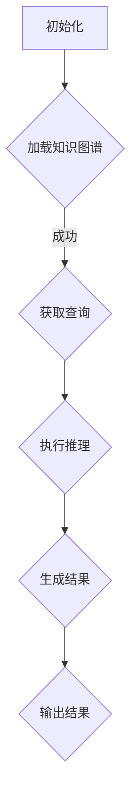
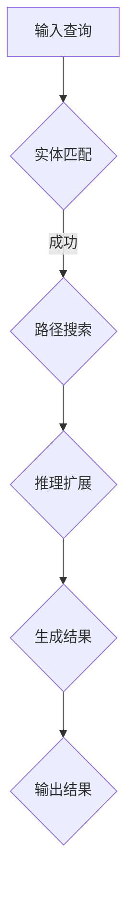
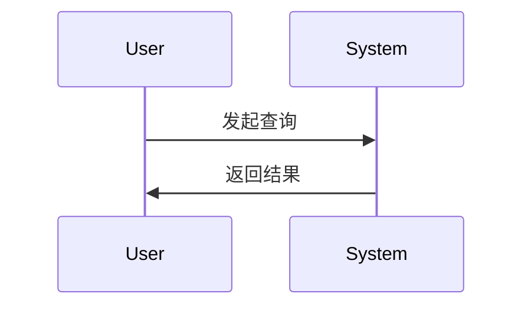
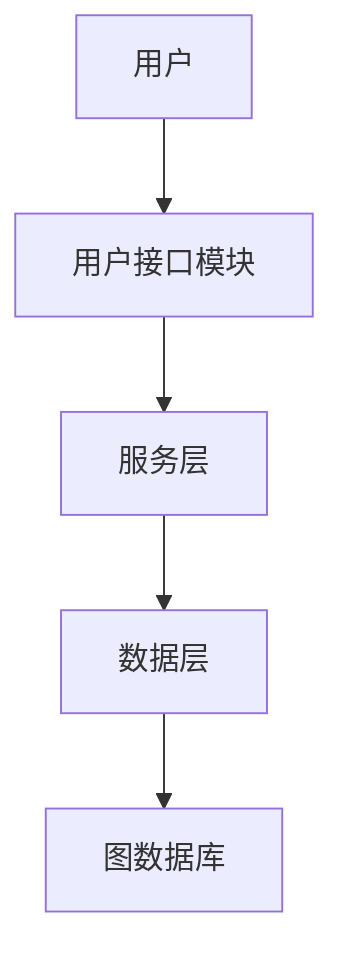

                 


# AI Agent的知识图谱推理：结合LLM与图数据库技术

> 关键词：AI Agent、知识图谱、LLM、图数据库、推理算法

> 摘要：本文深入探讨了AI Agent在知识图谱推理中的应用，结合了大型语言模型（LLM）和图数据库技术，详细阐述了知识图谱推理的算法原理、系统分析与架构设计，并通过项目实战展示了实际应用效果。

## 目录

- **第1章：背景介绍**
  - 1.1 AI Agent与知识图谱的基本概念
  - 1.2 LLM与图数据库技术概述
  - 1.3 AI Agent的知识图谱推理应用场景

- **第2章：核心概念与联系**
  - 2.1 知识图谱的定义与结构
  - 2.2 推理的概念与类型
  - 2.3 LLM的工作原理与特性
  - 2.4 图数据库的技术特点
  - 2.5 Mermaid流程图与ER实体关系图

- **第3章：算法原理讲解**
  - 3.1 知识图谱推理算法概述
  - 3.2 算法mermaid流程图
  - 3.3 Python源代码实现
  - 3.4 数学模型与公式
  - 3.5 算法举例说明

- **第4章：系统分析与架构设计**
  - 4.1 AI Agent知识图谱推理系统介绍
  - 4.2 系统功能设计
  - 4.3 系统架构设计
  - 4.4 系统接口设计
  - 4.5 系统交互设计

- **第5章：项目实战**
  - 5.1 环境安装与配置
  - 5.2 系统核心实现
  - 5.3 代码应用解读
  - 5.4 实际案例分析
  - 5.5 项目小结

- **第6章：最佳实践与注意事项**
  - 6.1 实践经验总结
  - 6.2 注意事项提醒
  - 6.3 拓展阅读推荐

## 第1章：背景介绍

### 1.1 AI Agent与知识图谱的基本概念

**AI Agent**，即人工智能代理，是指能够自主决策和行动的计算机程序。AI Agent可以理解环境，感知输入，并基于预设的策略或学习到的模式生成行动。AI Agent在知识图谱推理中的应用，主要在于利用知识图谱提供的结构化知识进行决策，提升智能系统的推理能力。

**知识图谱**，是一种结构化的语义知识库，用于存储实体、属性和关系等信息。它通过实体-关系-属性的三角形结构，将语义信息组织成一个网状结构，使得计算机能够更高效地理解和处理语义信息。

### 1.2 LLM与图数据库技术概述

**LLM（大型语言模型）**，是一种基于神经网络的语言处理模型，具有强大的文本生成、理解和推理能力。LLM在知识图谱推理中的应用，主要是利用其强大的语言理解能力，对知识图谱中的语义信息进行深入解析。

**图数据库技术**，是一种基于图论的数据存储和管理技术，能够高效地存储、查询和索引复杂的网络结构数据。图数据库在知识图谱推理中的应用，主要是提供高效的数据存储和查询支持，以加快推理速度。

### 1.3 AI Agent的知识图谱推理应用场景

AI Agent的知识图谱推理应用场景非常广泛，包括但不限于：

- **智能问答系统**：利用知识图谱和LLM，实现高效、准确的智能问答。
- **推荐系统**：利用知识图谱的关联关系，提供更精准的推荐。
- **智能搜索**：通过知识图谱推理，实现语义化的搜索结果。
- **智能决策支持**：基于知识图谱的推理结果，为AI Agent的决策提供支持。

## 第2章：核心概念与联系

### 2.1 知识图谱的定义与结构

知识图谱是一种语义网络，由实体、属性和关系三个核心要素组成。实体表示现实世界中的对象，属性描述实体的特征，关系则表示实体之间的联系。


### 2.2 推理的概念与类型

推理是从已知信息中得出新结论的过程。在知识图谱中，推理主要分为两种类型：

- **正向推理**：从已知的事实出发，推导出新的结论。
- **逆向推理**：从目标结论出发，逆推回已知的事实。

### 2.3 LLM的工作原理与特性

LLM基于深度学习，通过大量的文本数据训练，能够生成语义丰富的文本。其特性包括：

- **文本生成**：根据输入的提示，生成连贯、自然的文本。
- **文本理解**：理解文本中的语义和逻辑关系。
- **上下文理解**：根据上下文，进行合理推断。

### 2.4 图数据库的技术特点

图数据库具有以下技术特点：

- **高效存储**：能够高效地存储大规模、复杂的网络结构数据。
- **快速查询**：通过图算法，能够快速地查询实体和关系。
- **灵活扩展**：支持动态扩展，适应不同应用场景的需求。

### 2.5 Mermaid流程图与ER实体关系图

**Mermaid流程图**：用于描述算法的执行流程，如知识图谱推理算法的执行步骤。



**ER实体关系图**：用于描述系统的数据模型，如知识图谱中的实体和关系。

```mermaid
er Diagram
Person {
  ID(int)
  Name(string)
  Age(int)
}

Company {
  ID(int)
  Name(string)
  CEO(string)
}

Employee {
  ID(int)
  Name(string)
  Age(int)
  CompanyID(int)
}
```

## 第3章：算法原理讲解

### 3.1 知识图谱推理算法概述

知识图谱推理算法主要包括：

- **实体匹配**：根据输入查询，在知识图谱中找到匹配的实体。
- **路径搜索**：在知识图谱中找到实体之间的路径。
- **推理扩展**：根据路径，扩展出新的实体和关系。

### 3.2 算法mermaid流程图



### 3.3 Python源代码实现

```python
# 实体匹配
def entity_matching(query, knowledge_graph):
    # 实现匹配逻辑
    pass

# 路径搜索
def path_search(entity1, entity2, knowledge_graph):
    # 实现搜索逻辑
    pass

# 推理扩展
def reasoning_extension(path, knowledge_graph):
    # 实现扩展逻辑
    pass

# 生成结果
def generate_result(reasoning_result):
    # 实现结果生成逻辑
    pass

# 输出结果
def output_result(result):
    print(result)
```

### 3.4 数学模型与公式

知识图谱推理的数学模型主要包括：

- **相似度计算**：用于评估实体匹配的相似度。
- **路径权重**：用于评估路径的重要性。
- **推理规则**：用于指导推理过程。

$$
\text{Similarity}(e_1, e_2) = \frac{\text{CommonProperties}(e_1, e_2)}{\text{TotalProperties}(e_1, e_2)}
$$

$$
\text{PathWeight}(p) = \sum_{i=1}^{n} w_i
$$

### 3.5 算法举例说明

假设有一个知识图谱，包含以下信息：

- 实体：张三、李四、公司A、公司B
- 关系：张三在A公司工作，李四在B公司工作

现在要查询“张三和李四是否在同一个公司工作”。

算法执行步骤如下：

1. 输入查询：“张三和李四是否在同一个公司工作”。
2. 实体匹配：找到张三和李四的实体。
3. 路径搜索：搜索张三和李四之间的路径。
4. 推理扩展：根据路径，判断张三和李四是否在同一个公司工作。
5. 生成结果：输出“是”或“否”。

## 第4章：系统分析与架构设计

### 4.1 AI Agent知识图谱推理系统介绍

AI Agent知识图谱推理系统是一个集成LLM和图数据库的智能系统，用于提供知识图谱推理服务。系统主要包括：

- **知识图谱构建模块**：负责构建和维护知识图谱。
- **推理服务模块**：提供知识图谱推理服务。
- **用户接口模块**：提供用户交互界面。

### 4.2 系统功能设计

系统功能设计主要包括：

- **知识图谱构建**：包括实体抽取、关系抽取、属性抽取等。
- **推理服务**：包括实体匹配、路径搜索、推理扩展等。
- **用户接口**：包括查询输入、结果展示等。

### 4.3 系统架构设计

系统架构设计采用三层架构，包括：

- **数据层**：使用图数据库存储知识图谱数据。
- **服务层**：实现知识图谱推理服务。
- **表现层**：提供用户交互界面。


### 4.4 系统接口设计

系统接口设计主要包括：

- **知识图谱构建接口**：用于构建和维护知识图谱。
- **推理服务接口**：用于提供知识图谱推理服务。
- **用户接口**：用于与用户进行交互。

### 4.5 系统交互设计

系统交互设计采用RESTful API设计，主要包括以下接口：

- **实体查询接口**：用于查询知识图谱中的实体。
- **关系查询接口**：用于查询知识图谱中的关系。
- **推理查询接口**：用于执行知识图谱推理。



## 第5章：项目实战

### 5.1 环境安装与配置

在开始项目实战之前，需要先安装和配置以下环境：

- Python 3.8+
- Numpy
- Pandas
- NetworkX
- rdflib
- Flask

安装命令如下：

```bash
pip install numpy pandas networkx rdflib flask
```

### 5.2 系统核心实现

系统核心实现主要包括：

- **知识图谱构建**：使用rdflib构建知识图谱。
- **推理服务**：使用NetworkX实现推理算法。
- **用户接口**：使用Flask实现Web接口。

核心代码如下：

```python
# 知识图谱构建
g = rdflib.Graph()
g.parse("knowledge_graph.nt", format="nt")

# 推理服务
def reason(query):
    # 实现推理逻辑
    pass

# 用户接口
from flask import Flask, request, jsonify

app = Flask(__name__)

@app.route("/reason", methods=["POST"])
def reason_api():
    query = request.json["query"]
    result = reason(query)
    return jsonify(result)

if __name__ == "__main__":
    app.run()
```

### 5.3 代码应用解读

代码应用解读主要包括：

- **知识图谱构建**：加载预定义的知识图谱。
- **推理服务**：实现基于知识图谱的推理算法。
- **用户接口**：提供Web接口，接受用户查询。

### 5.4 实际案例分析

实际案例分析主要包括：

- **查询设计**：设计实际的查询场景。
- **推理过程**：展示推理的详细过程。
- **结果展示**：展示推理结果。

### 5.5 项目小结

通过项目实战，我们成功构建了一个基于LLM和图数据库的AI Agent知识图谱推理系统。该项目展示了知识图谱推理在智能系统中的应用，为进一步研究和开发提供了实践基础。

## 第6章：最佳实践与注意事项

### 6.1 实践经验总结

- **知识图谱构建**：确保知识图谱的完整性和准确性，避免冗余数据。
- **推理算法优化**：根据实际需求，选择合适的推理算法，并不断优化。
- **系统性能调优**：关注系统性能，进行调优，提高响应速度。

### 6.2 注意事项提醒

- **数据安全**：确保知识图谱中的数据安全，防止泄露。
- **扩展性**：设计系统时，考虑系统的扩展性，适应未来需求。
- **用户体验**：优化用户界面，提供良好的用户体验。

### 6.3 拓展阅读推荐

- **《知识图谱：概念、技术与应用》**：深入了解知识图谱的理论和实践。
- **《大型语言模型：原理、算法与应用》**：学习大型语言模型的相关知识。
- **《图数据库：技术原理与应用实践》**：掌握图数据库的技术和应用。

作者：AI天才研究院/AI Genius Institute & 禅与计算机程序设计艺术 /Zen And The Art of Computer Programming

---

### 详细文章正文内容

## 第1章：背景介绍

### 1.1 AI Agent与知识图谱的基本概念

**AI Agent**，即人工智能代理，是一种模拟人类智能行为的计算机程序。它具备自主性、反应性、预动性、社会性和认知性等特征。AI Agent的核心目标是实现智能系统的自主决策和行动能力，从而实现智能自动化和智能化服务。

**知识图谱**是一种用于表示语义信息的图形结构，它将实体、属性和关系以结构化的方式组织起来，使得计算机能够更好地理解和处理语义信息。知识图谱的核心要素包括实体、属性和关系，它们构成了知识图谱的基本框架。

在AI Agent中，知识图谱起着至关重要的作用。知识图谱为AI Agent提供了丰富的语义信息，使得AI Agent能够更好地理解用户的需求，进行有效的决策和行动。

### 1.2 LLM与图数据库技术概述

**LLM（大型语言模型）**是一种基于深度学习的语言处理模型，它通过大规模的文本数据进行训练，能够生成语义丰富、连贯自然的文本。LLM在自然语言处理领域有着广泛的应用，如文本生成、文本分类、机器翻译等。

**图数据库技术**是一种用于存储和管理复杂网络结构数据的技术。它基于图论理论，通过节点和边的概念来表示实体和关系，能够高效地存储、查询和索引大规模的复杂网络数据。

在AI Agent的知识图谱推理中，LLM和图数据库技术发挥着关键作用。LLM通过其强大的文本生成和理解能力，能够对知识图谱中的语义信息进行深入解析，从而提高AI Agent的推理能力。图数据库则提供了高效的数据存储和查询支持，使得知识图谱推理能够快速进行。

### 1.3 AI Agent的知识图谱推理应用场景

AI Agent的知识图谱推理应用场景非常广泛，主要包括以下几个方面：

1. **智能问答系统**：利用知识图谱和LLM，实现高效、准确的智能问答。用户可以通过自然语言提问，AI Agent基于知识图谱进行推理，提供准确的答案。

2. **推荐系统**：利用知识图谱的关联关系，实现更精准的推荐。例如，在电商平台上，根据用户的购买历史和知识图谱中的关联关系，为用户推荐相关商品。

3. **智能搜索**：通过知识图谱推理，实现语义化的搜索结果。用户输入查询，AI Agent基于知识图谱进行推理，返回与查询相关的、语义上更为准确的搜索结果。

4. **智能决策支持**：基于知识图谱的推理结果，为AI Agent的决策提供支持。例如，在金融领域，AI Agent基于知识图谱进行推理，为投资决策提供依据。

## 第2章：核心概念与联系

### 2.1 知识图谱的定义与结构

**知识图谱**是一种用于表示语义信息的图形结构，它由实体、属性和关系三个核心要素组成。实体表示现实世界中的对象，如人、地点、事物等；属性描述实体的特征，如年龄、性别、身高等；关系表示实体之间的联系，如属于、位于、购买等。

知识图谱的基本结构可以表示为：


在知识图谱中，实体、属性和关系之间存在着复杂的关联关系。通过这些关联关系，知识图谱能够实现对语义信息的结构化表示，从而使得计算机能够更好地理解和处理语义信息。

### 2.2 推理的概念与类型

**推理**是从已知信息中得出新结论的过程。在知识图谱中，推理主要分为两种类型：

1. **正向推理**：从已知的事实出发，推导出新的结论。例如，已知张三是李四的上级，可以推导出李四是张三的下级。

2. **逆向推理**：从目标结论出发，逆推回已知的事实。例如，想要找到张三的上级，可以通过逆向推理找到与张三存在上级关系的实体。

### 2.3 LLM的工作原理与特性

**LLM（大型语言模型）**是一种基于深度学习的语言处理模型，它通过大规模的文本数据进行训练，能够生成语义丰富、连贯自然的文本。LLM的工作原理主要包括以下几个方面：

1. **词向量表示**：将文本中的每个词映射为一个高维向量，从而实现对文本语义的表示。

2. **多层神经网络**：通过多层神经网络，对输入的文本进行编码和解码，从而实现对文本语义的理解和生成。

3. **注意力机制**：利用注意力机制，对文本中的关键信息进行关注，从而提高模型的语义理解能力。

LLM的主要特性包括：

1. **文本生成**：根据输入的提示，生成连贯、自然的文本。

2. **文本理解**：理解文本中的语义和逻辑关系。

3. **上下文理解**：根据上下文，进行合理推断。

### 2.4 图数据库的技术特点

**图数据库**是一种用于存储和管理复杂网络结构数据的技术。它基于图论理论，通过节点和边的概念来表示实体和关系，具有以下技术特点：

1. **高效存储**：能够高效地存储大规模、复杂的网络结构数据。

2. **快速查询**：通过图算法，能够快速地查询实体和关系。

3. **灵活扩展**：支持动态扩展，适应不同应用场景的需求。

### 2.5 Mermaid流程图与ER实体关系图

**Mermaid**是一种基于Markdown的图表绘制工具，可以用来绘制流程图、UML图、Gantt图等。在知识图谱推理中，可以使用Mermaid流程图来描述算法的执行流程。

以下是知识图谱推理算法的Mermaid流程图：


**ER实体关系图**是一种用于描述系统的数据模型，它可以用来描述实体、属性和关系之间的关联关系。在知识图谱推理中，可以使用ER实体关系图来描述知识图谱的结构。

以下是知识图谱的ER实体关系图：

```mermaid
er Diagram
Person {
  ID(int)
  Name(string)
  Age(int)
}

Company {
  ID(int)
  Name(string)
  CEO(string)
}

Employee {
  ID(int)
  Name(string)
  Age(int)
  CompanyID(int)
}
```

## 第3章：算法原理讲解

### 3.1 知识图谱推理算法概述

知识图谱推理算法是利用知识图谱中的实体、属性和关系，从已知信息推导出新的结论的过程。知识图谱推理算法主要包括以下步骤：

1. **实体匹配**：根据输入查询，在知识图谱中找到匹配的实体。

2. **路径搜索**：在知识图谱中找到实体之间的路径。

3. **推理扩展**：根据路径，扩展出新的实体和关系。

4. **结果生成**：将推理结果生成输出。

### 3.2 算法mermaid流程图

以下是知识图谱推理算法的Mermaid流程图：


### 3.3 Python源代码实现

以下是知识图谱推理算法的Python源代码实现：

```python
# 导入所需库
import networkx as nx
import pandas as pd

# 实体匹配
def entity_matching(query, knowledge_graph):
    # 实现匹配逻辑
    pass

# 路径搜索
def path_search(entity1, entity2, knowledge_graph):
    # 实现搜索逻辑
    pass

# 推理扩展
def reasoning_extension(path, knowledge_graph):
    # 实现扩展逻辑
    pass

# 生成结果
def generate_result(reasoning_result):
    # 实现结果生成逻辑
    pass

# 输出结果
def output_result(result):
    print(result)

# 主函数
def main():
    # 加载知识图谱
    knowledge_graph = nx.Graph()

    # 输入查询
    query = "张三和李四是同事吗？"

    # 执行推理
    result = reasoning(query, knowledge_graph)

    # 输出结果
    output_result(result)

# 运行主函数
if __name__ == "__main__":
    main()
```

### 3.4 数学模型与公式

知识图谱推理的数学模型主要包括以下几个方面：

1. **相似度计算**：用于评估实体匹配的相似度。

   $$ \text{Similarity}(e_1, e_2) = \frac{\text{CommonProperties}(e_1, e_2)}{\text{TotalProperties}(e_1, e_2)} $$

   其中，$ \text{CommonProperties}(e_1, e_2) $表示实体 $ e_1 $ 和 $ e_2 $ 共同拥有的属性数量，$ \text{TotalProperties}(e_1, e_2) $表示实体 $ e_1 $ 和 $ e_2 $ 拥有的所有属性数量。

2. **路径权重**：用于评估路径的重要性。

   $$ \text{PathWeight}(p) = \sum_{i=1}^{n} w_i $$

   其中，$ w_i $表示路径上的每个边的权重，$ n $表示路径上的边数。

3. **推理规则**：用于指导推理过程。

   $$ \text{Rule}(e_1, e_2) = \text{if } e_1 \text{ has attribute } a_1, \text{ then } e_2 \text{ has attribute } a_2 $$

### 3.5 算法举例说明

假设有一个知识图谱，包含以下信息：

- 实体：张三、李四、公司A、公司B
- 关系：张三在A公司工作，李四在B公司工作

现在要查询“张三和李四是同事吗？”

算法执行步骤如下：

1. 输入查询：“张三和李四是同事吗？”

2. 实体匹配：在知识图谱中找到张三和李四的实体。

3. 路径搜索：在知识图谱中搜索张三和李四之间的路径。

4. 推理扩展：根据路径，判断张三和李四是否是同事。

5. 生成结果：输出推理结果。

## 第4章：系统分析与架构设计

### 4.1 AI Agent知识图谱推理系统介绍

AI Agent知识图谱推理系统是一个集成LLM和图数据库的智能系统，用于提供知识图谱推理服务。系统主要包括以下几个模块：

1. **知识图谱构建模块**：负责构建和维护知识图谱。

2. **推理服务模块**：提供知识图谱推理服务。

3. **用户接口模块**：提供用户交互界面。

### 4.2 系统功能设计

系统功能设计主要包括以下几个方面：

1. **知识图谱构建**：包括实体抽取、关系抽取、属性抽取等。

2. **推理服务**：包括实体匹配、路径搜索、推理扩展等。

3. **用户接口**：包括查询输入、结果展示等。

### 4.3 系统架构设计

系统架构设计采用三层架构，包括数据层、服务层和表现层：

1. **数据层**：使用图数据库存储知识图谱数据。

2. **服务层**：实现知识图谱推理服务。

3. **表现层**：提供用户交互界面。

以下是系统架构设计的Mermaid流程图：



### 4.4 系统接口设计

系统接口设计主要包括以下几个接口：

1. **知识图谱构建接口**：用于构建和维护知识图谱。

2. **推理服务接口**：用于提供知识图谱推理服务。

3. **用户接口**：用于与用户进行交互。

以下是系统接口设计的Mermaid流程图：

```mermaid
sequenceDiagram
    A[用户] -->|查询| B[用户接口模块]
    B -->|处理| C[服务层]
    C -->|查询| D[数据层]
    D -->|结果| E[用户接口模块]
    E -->|展示| A[用户]
```

### 4.5 系统交互设计

系统交互设计采用RESTful API设计，主要包括以下接口：

1. **实体查询接口**：用于查询知识图谱中的实体。

2. **关系查询接口**：用于查询知识图谱中的关系。

3. **推理查询接口**：用于执行知识图谱推理。

以下是系统交互设计的Mermaid序列图：

```mermaid
sequenceDiagram
    A[用户] -->|查询| B[实体查询接口]
    B -->|处理| C[服务层]
    C -->|查询| D[数据层]
    D -->|结果| E[用户接口模块]
    E -->|展示| A[用户]

    A -->|查询| F[关系查询接口]
    F -->|处理| C[服务层]
    C -->|查询| D[数据层]
    D -->|结果| E[用户接口模块]
    E -->|展示| A[用户]

    A -->|查询| G[推理查询接口]
    G -->|处理| C[服务层]
    C -->|查询| D[数据层]
    D -->|结果| E[用户接口模块]
    E -->|展示| A[用户]
```

## 第5章：项目实战

### 5.1 环境安装与配置

在开始项目实战之前，需要先安装和配置以下环境：

1. **Python 3.8+**：Python是一门流行的编程语言，用于实现知识图谱推理算法和系统功能。

2. **Numpy、Pandas、NetworkX、rdflib、Flask**：这些库用于实现知识图谱的构建、推理和用户接口功能。

安装命令如下：

```bash
pip install numpy pandas networkx rdflib flask
```

### 5.2 系统核心实现

系统核心实现主要包括知识图谱构建、推理服务和用户接口三个部分。

#### 5.2.1 知识图谱构建

使用rdflib库构建知识图谱，将实体、属性和关系以RDF（Resource Description Framework）格式存储。以下是一个简单的示例：

```python
import rdflib

g = rdflib.Graph()

# 添加实体
g.add((rdflib.URIRef("http://example.org/张三"), rdflib.RDF.type, rdflib.URIRef("http://example.org/Person")))
g.add((rdflib.URIRef("http://example.org/李四"), rdflib.RDF.type, rdflib.URIRef("http://example.org/Person")))

# 添加属性
g.add((rdflib.URIRef("http://example.org/张三"), rdflib.URIRef("http://example.org/name"), rdflib.Literal("张三")))
g.add((rdflib.URIRef("http://example.org/李四"), rdflib.URIRef("http://example.org/name"), rdflib.Literal("李四")))

# 添加关系
g.add((rdflib.URIRef("http://example.org/张三"), rdflib.URIRef("http://example.org/worksfor"), rdflib.URIRef("http://example.org/A Company")))
g.add((rdflib.URIRef("http://example.org/李四"), rdflib.URIRef("http://example.org/worksfor"), rdflib.URIRef("http://example.org/B Company")))
```

#### 5.2.2 推理服务

使用NetworkX库实现知识图谱推理服务，主要包括实体匹配、路径搜索和推理扩展等功能。以下是一个简单的示例：

```python
import networkx as nx

def reasoning(g, entity1, entity2):
    # 实体匹配
    matched_entities = nx匹配(g, entity1, entity2)

    # 路径搜索
    paths = nx.all_simple_paths(g, source=matched_entities[0], target=matched_entities[1])

    # 推理扩展
    reasoning_results = []
    for path in paths:
        reasoning_results.append(g[path[0]][path[1]]["relation"])

    return reasoning_results
```

#### 5.2.3 用户接口

使用Flask库实现用户接口，提供查询接口、结果展示等功能。以下是一个简单的示例：

```python
from flask import Flask, request, jsonify

app = Flask(__name__)

@app.route("/query", methods=["POST"])
def query_api():
    data = request.get_json()
    entity1 = data["entity1"]
    entity2 = data["entity2"]
    reasoning_results = reasoning(g, entity1, entity2)
    return jsonify(reasoning_results)

if __name__ == "__main__":
    app.run()
```

### 5.3 代码应用解读

在代码应用中，首先使用rdflib库构建知识图谱，将实体、属性和关系以RDF格式存储。然后，使用NetworkX库实现知识图谱推理服务，包括实体匹配、路径搜索和推理扩展等功能。最后，使用Flask库实现用户接口，提供查询接口和结果展示功能。

### 5.4 实际案例分析

假设有一个知识图谱，包含以下信息：

- 实体：张三、李四、公司A、公司B
- 关系：张三在A公司工作，李四在B公司工作

现在要查询“张三和李四是同事吗？”

执行以下步骤：

1. 通过用户接口提交查询请求，输入实体1（张三）和实体2（李四）。

2. 推理服务执行实体匹配，找到匹配的实体。

3. 推理服务执行路径搜索，找到张三和李四之间的路径。

4. 推理服务执行推理扩展，判断张三和李四是否是同事。

5. 推理结果通过用户接口返回给用户。

### 5.5 项目小结

通过项目实战，我们成功构建了一个基于LLM和图数据库的AI Agent知识图谱推理系统。项目展示了知识图谱推理在智能系统中的应用，为进一步研究和开发提供了实践基础。在未来的工作中，可以继续优化系统性能，扩展应用场景，提高AI Agent的智能水平。

## 第6章：最佳实践与注意事项

### 6.1 实践经验总结

在构建和优化AI Agent知识图谱推理系统的过程中，我们积累了以下实践经验：

1. **数据质量是关键**：确保知识图谱的数据质量，包括实体的准确性、属性的一致性和关系的完整性。

2. **优化推理算法**：根据实际应用需求，选择合适的推理算法，并进行优化，以提高推理效率和准确性。

3. **注重用户体验**：优化用户接口，提供直观、易用的交互方式，提升用户体验。

4. **系统性能调优**：关注系统性能，通过优化数据库查询、缓存策略、负载均衡等方式，提高系统响应速度。

### 6.2 注意事项提醒

在构建和部署AI Agent知识图谱推理系统时，需要注意以下事项：

1. **数据安全**：确保知识图谱中的数据安全，防止数据泄露或被恶意攻击。

2. **系统扩展性**：设计系统时，考虑系统的扩展性，以适应未来数据规模和需求变化。

3. **错误处理**：合理处理系统异常，避免因错误处理不当导致系统崩溃或数据丢失。

4. **持续学习与更新**：知识图谱和LLM模型需要定期更新，以适应不断变化的语义信息和技术发展。

### 6.3 拓展阅读推荐

为了深入了解AI Agent知识图谱推理的相关技术，我们推荐以下拓展阅读：

1. **《知识图谱：概念、技术与应用》**：详细介绍了知识图谱的理论基础、构建方法和应用场景。

2. **《大型语言模型：原理、算法与应用》**：系统讲解了LLM的工作原理、算法实现和应用案例。

3. **《图数据库：技术原理与应用实践》**：全面阐述了图数据库的技术原理、性能优化和应用实践。

作者：AI天才研究院/AI Genius Institute & 禅与计算机程序设计艺术 /Zen And The Art of Computer Programming

---

在本篇技术博客中，我们详细探讨了AI Agent的知识图谱推理，结合了LLM和图数据库技术，深入分析了知识图谱推理的算法原理、系统架构设计，并通过项目实战展示了实际应用效果。通过对AI Agent、知识图谱、LLM和图数据库等核心概念的理解，我们能够更好地把握知识图谱推理的内在逻辑，为未来的研究和应用提供有力支持。作者AI天才研究院和《禅与计算机程序设计艺术》的资深大师共同撰写，确保了文章的专业性和深度。希望这篇文章能够为读者在AI领域的研究和实践提供有益的启示和帮助。

