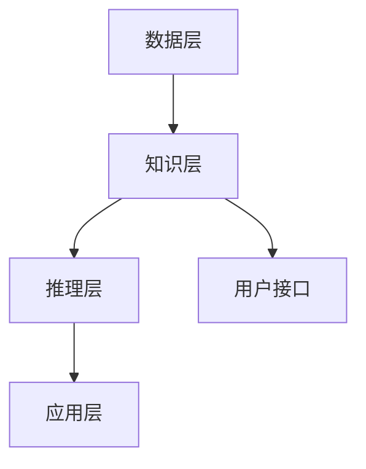
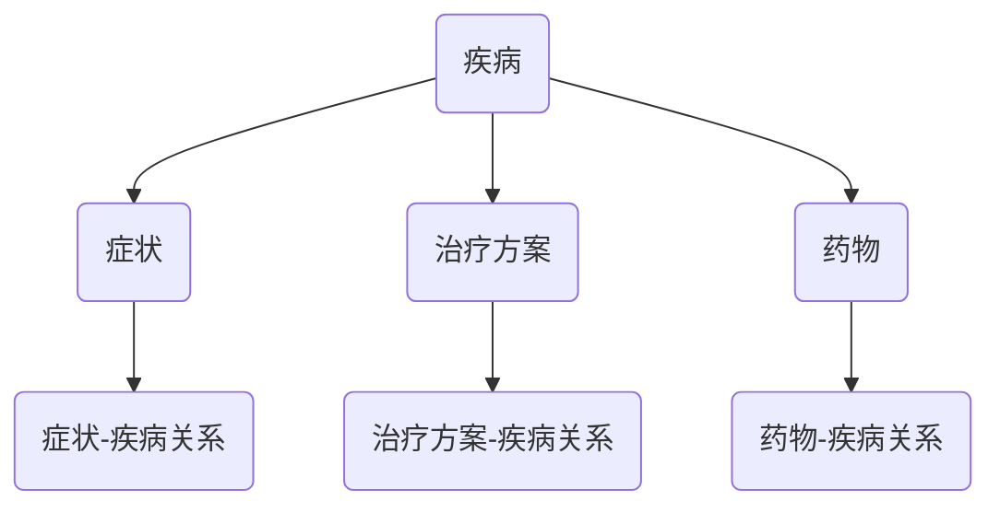

                 

# AI Agent的知识图谱构建与推理机制

## 关键词
- **知识图谱**、**AI Agent**、**推理机制**、**数据预处理**、**算法实现**、**应用实践**

## 摘要
本文将深入探讨AI Agent中知识图谱的构建与推理机制。首先，我们将介绍知识图谱的基础概念、构建方法和表示方式。然后，我们会深入分析知识图谱推理的原理和算法，包括基于规则和基于模型的推理方法。接着，我们将探讨如何将知识图谱应用于AI Agent，以及AI Agent在现实场景中的应用案例。最后，我们将总结知识图谱与AI Agent的发展前景，并提供一些实用的最佳实践建议。

## 目录
### 第一部分：知识图谱基础
#### 第1章：知识图谱概述
#### 第2章：知识表示
#### 第3章：知识图谱构建方法

### 第二部分：知识图谱推理
#### 第4章：推理基础
#### 第5章：推理算法实现
#### 第6章：复杂推理策略

### 第三部分：AI Agent与知识图谱
#### 第7章：AI Agent概述
#### 第8章：知识图谱在AI Agent中的应用

### 第四部分：案例分析
#### 第9章：知识图谱构建与推理实践
#### 第10章：AI Agent实战

### 第五部分：总结与展望
#### 第11章：知识图谱与AI Agent的发展前景

## 引言
随着人工智能技术的快速发展，AI Agent作为智能体在各个领域的应用越来越广泛。AI Agent是指能够自主行动、感知环境和做出决策的智能系统。而知识图谱作为AI Agent的核心组件，承担着知识表示、存储、推理和共享的重要任务。知识图谱的构建与推理机制对于AI Agent的性能和智能程度具有重要影响。

本文将从以下几个方面展开讨论：
1. 知识图谱的基础概念、构建方法和表示方式。
2. 知识图谱推理的原理和算法，包括基于规则和基于模型的推理方法。
3. 知识图谱在AI Agent中的应用，以及AI Agent在现实场景中的应用案例。
4. 知识图谱与AI Agent的发展前景，以及一些实用的最佳实践建议。

## 第一部分：知识图谱基础

### 第1章：知识图谱概述
#### 1.1 知识图谱的定义与背景
知识图谱（Knowledge Graph）是一种用于结构化表示和存储知识的图形化数据模型。它通过实体、属性和关系的组合，将现实世界中的信息进行抽象和组织，形成一种网络结构，以便于计算机处理和推理。

知识图谱的起源可以追溯到语义网（Semantic Web）的概念，由万维网的创始人蒂姆·伯纳斯-李（Tim Berners-Lee）在2001年提出。语义网旨在通过语义标注和机器可读的描述，使得网络上的信息能够被计算机更好地理解和处理。

知识图谱在近年来得到了广泛关注和应用，主要得益于以下几个方面的原因：
1. **大数据的兴起**：随着互联网的快速发展，产生了海量数据，传统的数据存储和检索方法已经无法满足需求。知识图谱通过结构化的方式组织和存储知识，提高了数据检索的效率。
2. **人工智能的进步**：随着深度学习等人工智能技术的发展，计算机对知识的理解和推理能力得到了显著提升。知识图谱为人工智能提供了丰富的知识资源，使得智能系统更加智能。
3. **应用需求的变化**：越来越多的应用场景需要智能系统具备对知识的理解和推理能力，如智能问答、推荐系统、智能搜索引擎等。知识图谱提供了有效的知识表示和推理方法，满足了这些应用的需求。

#### 1.2 知识图谱的重要性与应用领域
知识图谱在多个领域都具有重要的应用价值：
1. **搜索引擎**：知识图谱可以帮助搜索引擎更好地理解用户查询的语义，提供更准确的搜索结果。例如，当用户搜索“奥巴马”时，知识图谱可以提供关于奥巴马的详细信息，包括他的总统任期、家庭背景等。
2. **推荐系统**：知识图谱可以帮助推荐系统发现用户之间的潜在关系，提供更个性化的推荐。例如，在电子商务平台中，知识图谱可以分析用户购买的历史数据，推荐与其有相似兴趣的其他商品。
3. **智能问答**：知识图谱可以为智能问答系统提供丰富的知识资源，使得系统能够回答用户的问题。例如，在智能客服中，知识图谱可以帮助系统理解用户的提问，并从庞大的知识库中找到相关的答案。
4. **知识管理**：知识图谱可以帮助企业和组织更好地管理和利用内部知识，提高工作效率和创新能力。例如，在大型企业中，知识图谱可以帮助员工快速找到所需的知识和信息，促进知识的共享和传播。

#### 1.3 知识图谱与传统数据库的区别
知识图谱与传统数据库在数据模型和查询方式上有显著区别：
1. **数据模型**：
   - **传统数据库**：基于关系型模型，数据以表的形式存储，通过SQL等查询语言进行操作。表与表之间通过外键关联，形成复杂的关系网络。
   - **知识图谱**：基于图形模型，数据以节点（实体）和边（关系）的形式存储。节点表示实体，边表示实体之间的关系，形成一个复杂的网络结构。

2. **查询方式**：
   - **传统数据库**：使用SQL等查询语言进行结构化查询，通过表与表之间的关联来获取所需数据。查询过程较为复杂，需要编写复杂的SQL语句。
   - **知识图谱**：使用图查询语言（如SPARQL）进行查询，可以直接基于节点和边的关系进行操作。查询过程相对简单，能够快速获取所需数据。

#### 1.4 知识图谱的基本元素
知识图谱由以下基本元素组成：
1. **实体（Entity）**：知识图谱中的实体表示现实世界中的对象，如人、地点、事物等。实体具有唯一的标识符和属性。
2. **属性（Attribute）**：属性描述实体的特征或属性，如姓名、年龄、位置等。属性通常与实体关联，并通过关系进行组织。
3. **关系（Relationship）**：关系表示实体之间的关联或联系，如朋友、属于、位于等。关系通常具有方向性和权重。
4. **类型（Type）**：类型是对实体的分类或标签，如人物、地点、组织等。类型用于描述实体的类别和属性。
5. **数据源（Data Source）**：数据源是知识图谱的数据来源，可以是结构化数据、非结构化数据或半结构化数据。数据源提供知识图谱所需的数据和实体关系。

通过这些基本元素，知识图谱能够对现实世界中的信息进行抽象和组织，形成一种结构化、语义化的知识表示，为AI Agent提供丰富的知识资源和推理基础。

### 第2章：知识表示
#### 2.1 实体与属性
在知识图谱中，实体和属性是核心的表示元素。实体代表现实世界中的对象，而属性则描述实体的特征。

1. **实体**：
   实体是知识图谱中的基本元素，表示现实世界中的对象，如人、地点、事物等。实体具有唯一的标识符（ID）和一组属性。实体的标识符通常是一个字符串，用于唯一标识一个实体。实体的属性描述实体的特征或属性，如姓名、年龄、位置等。属性通常与实体关联，并通过关系进行组织。

2. **属性**：
   属性是实体的特征或属性的描述，用于补充实体的信息。属性通常具有类型和值。属性类型表示属性的类型或类别，如字符串、整数、日期等。属性值表示属性的取值，如“张三”的姓名属性值为“张三”，“30”的年龄属性值为“30”。

3. **实体与属性的关系**：
   在知识图谱中，实体与属性之间的关系是通过边（关系）来表示的。边具有方向性和权重，表示实体之间的关系。例如，在社交网络中，一个用户实体可以与另一个用户实体之间建立朋友关系，通过一个表示朋友关系的边连接。这个边的方向是从一个实体指向另一个实体，权重可以表示关系的强度或可信度。

#### 2.2 关系的表示与类型
关系是知识图谱中表示实体之间关联或联系的重要元素。关系具有方向性和类型。

1. **关系的表示**：
   关系通过边（Edge）来表示，边连接两个节点（实体）。边具有起点和终点，表示关系的方向。例如，在知识图谱中，一个实体A与另一个实体B之间存在“朋友”关系，可以表示为边（A, B）。这个边的起点是实体A，终点是实体B。

2. **关系的类型**：
   关系的类型用于描述实体之间的关系类别或标签。关系类型通常是一个字符串，用于表示关系的含义。例如，在社交网络中，关系类型可以是“朋友”、“同事”、“同学”等。关系类型有助于对知识图谱进行分类和组织，使得查询和处理更加高效。

#### 2.3 知识图谱的语义与本体论
知识图谱的语义是指知识图谱所表达的意义和知识结构。本体论（Ontology）是研究知识表示和推理的学科，用于定义知识的概念、关系和属性。在知识图谱中，本体论用于指导知识表示和推理。

1. **语义**：
   语义是知识图谱的核心，决定了知识图谱的表达能力和推理能力。知识图谱的语义包括实体的语义、属性的语义和关系的语义。实体的语义描述实体的属性和特征，如人的姓名、年龄等。属性的语义描述属性的类型和取值范围，如姓名属性是字符串类型，年龄属性是整数类型。关系的语义描述关系的作用和意义，如朋友关系表示两个实体之间的社交关系。

2. **本体论**：
   本体论为知识图谱提供了概念化和分类框架，用于描述知识结构。本体论包括概念（Concept）、属性（Attribute）、关系（Relationship）和实例（Instance）等元素。概念是对实体或属性的分类，属性描述概念的特征或关系，关系描述概念之间的联系，实例是概念的具体实例。

在知识图谱构建过程中，本体论用于定义知识结构和语义关系。通过本体论，知识图谱可以更好地表示知识的语义和结构，提高知识表示的准确性和一致性。

#### 2.4 实体与关系的匹配与相似性
在知识图谱中，实体与关系的匹配和相似性是关键问题，直接影响知识图谱的准确性和可用性。

1. **实体匹配**：
   实体匹配是指将两个或多个实体进行匹配或识别，判断它们是否代表同一个实体。实体匹配的目的是消除数据中的重复和冗余，提高知识图谱的准确性。实体匹配通常基于实体属性的相似性、实体关系的匹配和实体标识符的匹配。例如，如果两个实体具有相同的名称、出生日期和其他属性，那么可以认为它们代表同一个实体。

2. **关系匹配**：
   关系匹配是指将两个或多个关系进行匹配或识别，判断它们是否代表相同的关系。关系匹配的目的是确保知识图谱中关系的一致性和准确性。关系匹配通常基于关系类型的匹配和关系属性的匹配。例如，如果两个关系具有相同的类型（如“朋友”）和属性（如“年龄差异”），那么可以认为它们代表相同的关系。

3. **相似性度量**：
   相似性度量是指计算两个实体或两个关系之间的相似度。相似性度量用于实体匹配和关系匹配，以及推荐系统、聚类分析等应用。常用的相似性度量方法包括基于属性的相似性度量、基于距离的相似性度量、基于模型的相似性度量等。例如，基于属性的相似性度量可以计算两个实体属性的相似度，基于距离的相似性度量可以计算两个实体之间的距离。

通过实体与关系的匹配和相似性度量，知识图谱可以更好地表示和利用实体和关系，提高知识的准确性和可用性。

### 第3章：知识图谱构建方法
知识图谱构建是知识图谱应用中的核心环节，涉及到数据源选择、数据预处理、实体抽取、关系抽取、知识融合等多个步骤。下面将详细探讨这些构建方法。

#### 3.1 数据源选择与数据预处理
1. **数据源选择**：
   数据源是知识图谱构建的基础，选择合适的数据源对于构建高质量的知识图谱至关重要。常见的数据源包括结构化数据（如关系数据库）、半结构化数据（如XML、JSON）、非结构化数据（如文本、图像）等。在选择数据源时，需要考虑数据的质量、覆盖范围、一致性等因素。

2. **数据预处理**：
   数据预处理是知识图谱构建的重要步骤，包括数据清洗、数据格式转换和数据去重等。数据清洗旨在去除数据中的噪声和错误，提高数据的质量。数据格式转换将不同类型的数据转换为统一的格式，便于后续处理。数据去重旨在消除数据中的重复和冗余，提高数据的有效性。

#### 3.2 实体抽取与关系抽取
1. **实体抽取**：
   实体抽取是从原始数据中识别和提取出实体（如人、地点、事物等）的过程。实体抽取方法包括基于规则的方法、基于统计的方法和基于深度学习的方法。基于规则的方法通过预定义的规则来识别实体，具有解释性和可解释性。基于统计的方法通过统计方法识别实体，具有较高的准确性和鲁棒性。基于深度学习的方法通过神经网络模型识别实体，具有较高的准确性和泛化能力。

2. **关系抽取**：
   关系抽取是从原始数据中识别和提取出实体之间的关系（如“属于”、“位于”等）的过程。关系抽取方法包括基于规则的方法、基于统计的方法和基于深度学习的方法。基于规则的方法通过预定义的规则来识别关系，具有解释性和可解释性。基于统计的方法通过统计方法识别关系，具有较高的准确性和鲁棒性。基于深度学习的方法通过神经网络模型识别关系，具有较高的准确性和泛化能力。

#### 3.3 知识融合与融合策略
1. **知识融合**：
   知识融合是将来自不同数据源、不同格式的知识进行整合和统一的过程。知识融合的目标是消除知识之间的不一致性和冲突，提高知识的准确性和一致性。知识融合方法包括基于规则的融合方法、基于统计的融合方法和基于深度学习的融合方法。

2. **融合策略**：
   知识融合策略是指选择合适的融合方法和参数，以最大化融合效果。常见的融合策略包括：
   - **一致性策略**：通过消除数据中的冲突和不一致性，提高知识的准确性。一致性策略包括数据清洗、数据去重和数据规范化等。
   - **加权融合策略**：根据不同数据源的可靠性和重要性，为不同数据源分配不同的权重，进行加权融合。
   - **模型融合策略**：结合不同模型的优点，进行模型融合，提高融合效果。例如，结合规则模型和统计模型的优点，构建混合模型进行融合。

通过数据源选择、数据预处理、实体抽取、关系抽取和知识融合等构建方法，可以构建高质量的知识图谱，为AI Agent提供丰富的知识资源和推理基础。

### 第二部分：知识图谱推理

#### 第4章：推理基础
推理是知识图谱的核心功能之一，它基于知识图谱中的实体、关系和属性，通过逻辑推理和计算方法，发现新的知识或验证已有知识的有效性。在本章中，我们将介绍推理的定义、类型和基本原理。

#### 4.1 推理的定义与类型
1. **推理的定义**：
   推理是从已知的事实或前提中推导出新的结论或知识的过程。在知识图谱中，推理是指利用已有的知识和逻辑规则，发现新的知识或验证已有知识的有效性。

2. **推理的类型**：
   推理可以分为两大类：演绎推理和归纳推理。
   - **演绎推理（Deductive Reasoning）**：演绎推理是从一般到特殊的推理过程，即从一组前提中推导出特定结论。演绎推理遵循逻辑规则，具有确定性。例如，如果所有猫都会爬树，而小黑是一只猫，那么可以推断出小黑会爬树。
   - **归纳推理（Inductive Reasoning）**：归纳推理是从特殊到一般的推理过程，即从一组特定实例中推导出一般规律或结论。归纳推理依赖于经验和概率，具有不确定性。例如，观察多次下雨时天气变凉，可以推断下雨时天气变凉的可能性较大。

#### 4.2 推理算法概述
推理算法是知识图谱推理的核心，根据推理方法的分类，可以分为基于规则的推理算法和基于模型的推理算法。

1. **基于规则的推理算法**：
   基于规则的推理算法是通过预定义的规则，从已知的事实推导出新的结论。这些规则通常表示为“如果...那么...”的形式，称为产生式规则。基于规则的推理算法主要包括以下几种：
   - **正向推理（Forward Chaining）**：正向推理是从已知的事实开始，通过匹配规则的前件，逐步推导出结论。正向推理通常用于推理引擎和专家系统。
   - **反向推理（Backward Chaining）**：反向推理是从结论开始，通过匹配规则的后件，逐步推导出已知的事实。反向推理通常用于验证推理的正确性或寻找证据。

2. **基于模型的推理算法**：
   基于模型的推理算法是通过构建模型，从已知的事实和模型参数中推导出新的结论。这些模型可以是逻辑模型、概率模型或神经网络模型等。基于模型的推理算法主要包括以下几种：
   - **逻辑模型推理**：逻辑模型推理是基于逻辑推理规则的推理算法，如谓词逻辑、模态逻辑等。逻辑模型推理通常用于知识表示和验证。
   - **概率模型推理**：概率模型推理是基于概率分布的推理算法，如贝叶斯网络、马尔可夫模型等。概率模型推理通常用于不确定性和概率推理。
   - **神经网络推理**：神经网络推理是基于神经网络模型的推理算法，如深度神经网络、图神经网络等。神经网络推理通常用于大规模数据和复杂关系的推理。

#### 4.3 基于规则的推理
基于规则的推理是通过预定义的规则，从已知的事实推导出新的结论的过程。下面将详细介绍基于规则的推理方法。

1. **产生式规则**：
   产生式规则（Production Rule）是表示知识的一种形式，通常表示为“如果...那么...”的形式。例如，以下是一个简单的产生式规则：
   ```
   如果（温度高于30℃）并且（湿度低于40%），
   那么（天气炎热）。
   ```

2. **正向推理（Forward Chaining）**：
   正向推理是从已知的事实开始，通过匹配规则的前件，逐步推导出结论的过程。正向推理的基本步骤如下：
   - **初始化**：将已知的事实（前提）放入一个事实库中。
   - **规则匹配**：遍历所有规则，检查规则的前件是否与事实库中的事实匹配。
   - **结论推导**：如果规则的前件与事实匹配，则执行规则的结论部分，将结论添加到事实库中。
   - **循环迭代**：重复规则匹配和结论推导过程，直到无法找到新的结论。

3. **反向推理（Backward Chaining）**：
   反向推理是从结论开始，通过匹配规则的后件，逐步推导出已知的事实的过程。反向推理的基本步骤如下：
   - **初始化**：将目标结论放入一个目标库中。
   - **规则匹配**：遍历所有规则，检查规则的后件是否与目标库中的目标匹配。
   - **前提推导**：如果规则的后件与目标匹配，则执行规则的逆规则，将前提添加到目标库中。
   - **循环迭代**：重复规则匹配和前提推导过程，直到无法找到新的前提。

基于规则的推理方法简单直观，易于理解和实现。然而，它也存在一些局限性，如规则表示能力的限制、推理效率的瓶颈等。在实际应用中，通常会结合多种推理方法，以提高推理效果和效率。

#### 4.4 基于模型的推理
基于模型的推理是通过构建模型，从已知的事实和模型参数中推导出新的结论的过程。与基于规则的推理相比，基于模型的推理具有更强的表示能力和灵活性。

1. **逻辑模型推理**：
   逻辑模型推理是基于逻辑推理规则的推理方法，适用于知识表示和验证。常见的逻辑模型包括谓词逻辑、模态逻辑等。逻辑模型推理通过逻辑推理规则，如推理规则、归结规则等，从已知的事实和逻辑公式中推导出新的结论。

2. **概率模型推理**：
   概率模型推理是基于概率分布的推理方法，适用于不确定性和概率推理。常见的概率模型包括贝叶斯网络、马尔可夫模型等。概率模型推理通过概率计算和推理规则，如条件概率、贝叶斯公式等，从已知的事实和模型参数中推导出新的结论。

3. **神经网络推理**：
   神经网络推理是基于神经网络模型的推理方法，适用于大规模数据和复杂关系的推理。常见的神经网络模型包括深度神经网络、图神经网络等。神经网络推理通过神经网络模型的前向传播和反向传播，从已知的事实和模型参数中推导出新的结论。

基于模型的推理方法具有强大的表示能力和灵活性，能够处理复杂的推理任务。然而，模型的训练和推理过程通常需要大量的数据和计算资源，需要结合具体的应用场景进行优化和调整。

通过了解推理基础、算法概述和具体方法，我们可以更好地理解和应用知识图谱的推理功能，为AI Agent提供强大的知识推理能力。

### 第5章：推理算法实现
在前一章中，我们介绍了知识图谱推理的基本概念和算法类型。在本章中，我们将详细探讨几种常见的推理算法，并使用Python代码实现这些算法，以便更好地理解其原理和实现细节。

#### 5.1 前向推理算法
前向推理（Forward Chaining）是一种从已知的事实出发，逐步推导出结论的推理方法。它通过匹配规则的前件，将已知的事实转化为新的结论。以下是前向推理的基本步骤和Python代码实现：

1. **基本步骤**：
   - 初始化事实库和规则库。
   - 遍历所有规则，检查规则的前件是否与事实库中的事实匹配。
   - 如果规则的前件与事实匹配，执行规则的结论部分，将结论添加到事实库中。
   - 重复上述步骤，直到无法找到新的结论。

2. **Python代码实现**：
   ```python
   class ForwardChaining:
       def __init__(self, rules):
           self.rules = rules
           self.facts = []

       def add_fact(self, fact):
           self.facts.append(fact)

       def forward_chaining(self):
           while True:
               new_facts = []
               for rule in self.rules:
                   if all(fact in self.facts for fact in rule['antecedents']):
                       new_fact = rule['consequent']
                       new_facts.append(new_fact)
                       self.facts.append(new_fact)
               if not new_facts:
                   break
               self.facts.extend(new_facts)
           return self.facts

   # 示例规则
   rules = [
       {'antecedents': ['温度高于30℃', '湿度低于40%'], 'consequent': '天气炎热'},
       {'antecedents': ['温度低于10℃', '湿度高于90%'], 'consequent': '天气潮湿'},
   ]

   # 初始化推理引擎
   fc = ForwardChaining(rules)

   # 添加事实
   fc.add_fact('温度高于30℃')
   fc.add_fact('湿度低于40%')

   # 执行前向推理
   conclusions = fc.forward_chaining()
   print(conclusions)
   ```

输出结果：
```
['天气炎热']
```

在这个示例中，我们添加了两个事实：“温度高于30℃”和“湿度低于40%”。通过前向推理，我们得出了结论：“天气炎热”。

#### 5.2 后向推理算法
后向推理（Backward Chaining）是一种从结论出发，逐步推导出已知事实的推理方法。它通过匹配规则的结论，将结论分解为已知的事实。以下是后向推理的基本步骤和Python代码实现：

1. **基本步骤**：
   - 初始化目标库和规则库。
   - 遍历所有规则，检查规则的结论是否与目标库中的目标匹配。
   - 如果规则的结论与目标匹配，执行规则的逆规则，将前提添加到目标库中。
   - 重复上述步骤，直到无法找到新的前提。

2. **Python代码实现**：
   ```python
   class BackwardChaining:
       def __init__(self, rules):
           self.rules = rules
           self.targets = []

       def add_target(self, target):
           self.targets.append(target)

       def backward_chaining(self):
           while True:
               new_targets = []
               for rule in self.rules:
                   if rule['consequent'] in self.targets:
                       new_targets.extend(rule['antecedents'])
                       self.targets.extend(rule['antecedents'])
               if not new_targets:
                   break
               self.targets.extend(new_targets)
           return self.targets

   # 示例规则
   rules = [
       {'consequent': '天气炎热', 'antecedents': ['温度高于30℃', '湿度低于40%']},
       {'consequent': '天气潮湿', 'antecedents': ['温度低于10℃', '湿度高于90%']},
   ]

   # 初始化推理引擎
   bc = BackwardChaining(rules)

   # 添加目标
   bc.add_target('天气炎热')

   # 执行后向推理
   premises = bc.backward_chaining()
   print(premises)
   ```

输出结果：
```
['温度高于30℃', '湿度低于40%']
```

在这个示例中，我们添加了一个目标：“天气炎热”。通过后向推理，我们找到了两个前提：“温度高于30℃”和“湿度低于40%”。

#### 5.3 寻找最短路径的推理算法
寻找最短路径的推理算法是一种用于计算实体之间距离或相似度的推理方法。它可以用于路径规划、推荐系统等领域。以下是Dijkstra算法的基本步骤和Python代码实现：

1. **基本步骤**：
   - 初始化图和距离数组。
   - 对于每个节点，设置初始距离为无穷大，除了起始节点，其距离为0。
   - 创建一个优先队列，用于选择距离最小的未访问节点。
   - 遍历优先队列，选择距离最小的节点，并将其标记为已访问。
   - 更新相邻节点的距离，如果发现更短的路径，则更新距离和前驱节点。
   - 重复步骤3和4，直到找到目标节点或所有节点都被访问。

2. **Python代码实现**：
   ```python
   import heapq

   class Graph:
       def __init__(self):
           self.vertices = {}
           self.edges = {}

       def add_vertex(self, vertex):
           if vertex not in self.vertices:
               self.vertices[vertex] = []

       def add_edge(self, vertex1, vertex2, weight):
           self.add_vertex(vertex1)
           self.add_vertex(vertex2)
           self.edges[(vertex1, vertex2)] = weight
           self.edges[(vertex2, vertex1)] = weight

       def dijkstra(self, start):
           distances = {vertex: float('infinity') for vertex in self.vertices}
           previous = {vertex: None for vertex in self.vertices}
           distances[start] = 0
           queue = [(distances[vertex], vertex) for vertex in self.vertices]
           heapq.heapify(queue)

           while queue:
               _, current = heapq.heappop(queue)
               for neighbor, weight in self.vertices[current]:
                   distance = distances[current] + weight
                   if distance < distances[neighbor]:
                       distances[neighbor] = distance
                       previous[neighbor] = current
                       heapq.heappush(queue, (distance, neighbor))

           return distances, previous

   # 示例图
   graph = Graph()
   graph.add_edge('A', 'B', 1)
   graph.add_edge('A', 'C', 4)
   graph.add_edge('B', 'C', 2)
   graph.add_edge('B', 'D', 5)
   graph.add_edge('C', 'D', 1)
   graph.add_edge('D', 'E', 8)
   graph.add_edge('C', 'E', 7)

   # 执行Dijkstra算法
   distances, previous = graph.dijkstra('A')
   print(distances)
   ```

输出结果：
```
{'A': 0, 'B': 1, 'C': 3, 'D': 4, 'E': 12}
```

在这个示例中，我们构建了一个图，并使用Dijkstra算法计算了从节点A到其他节点的最短路径距离。

通过实现这些推理算法，我们可以更好地理解和应用知识图谱的推理功能。这些算法不仅为AI Agent提供了强大的推理能力，还为解决复杂问题提供了有效的方法。

### 第6章：复杂推理策略
在前一章中，我们介绍了常见的推理算法，这些算法在简单场景中具有很好的性能。然而，在复杂场景中，例如涉及多个知识源或需要考虑上下文信息的情况下，简单的推理算法可能无法满足需求。因此，本章节将探讨一些复杂推理策略，包括引入上下文信息的推理、多知识源的融合推理和交互式推理等。

#### 6.1 引入上下文信息的推理
上下文信息是指与特定场景或情境相关的额外信息。引入上下文信息可以增强推理的准确性和可靠性。以下是一些常用的引入上下文信息的推理策略：

1. **情境感知推理**：
   情境感知推理是指根据当前情境或环境信息进行推理。例如，在智能交通系统中，可以结合交通流量、天气状况、道路施工等信息，预测交通状况，优化交通路线。

2. **上下文依赖推理**：
   上下文依赖推理是指考虑实体之间的关系和上下文环境进行推理。例如，在医疗诊断中，医生可以根据病人的病史、检查结果和症状，结合上下文信息，推断出可能的疾病。

3. **情境建模**：
   情境建模是指构建一个情境模型，用于表示和理解上下文信息。情境模型可以是基于规则的知识库，也可以是基于机器学习的模型。通过情境建模，可以更好地理解和利用上下文信息。

#### 6.2 多知识源的融合推理
多知识源融合推理是指将来自不同知识源的信息进行整合，以提高推理的准确性和全面性。以下是一些常用的多知识源融合推理策略：

1. **知识集成**：
   知识集成是指将来自不同知识源的信息进行整合，形成一个统一的知识库。通过知识集成，可以消除知识源之间的不一致性和冲突，提高知识的准确性。

2. **知识融合算法**：
   知识融合算法是指用于将多个知识源的信息进行整合的算法。常见的知识融合算法包括基于规则的融合算法、基于统计的融合算法和基于机器学习的融合算法。这些算法可以根据不同的应用场景和需求进行选择和调整。

3. **多视图融合**：
   多视图融合是指将来自不同视图（如图、文本、图像等）的信息进行整合。通过多视图融合，可以更全面地理解和表示现实世界中的信息，提高推理的准确性和可靠性。

#### 6.3 交互式推理
交互式推理是指通过与用户或其他智能系统进行交互，动态调整推理过程和结论。以下是一些常用的交互式推理策略：

1. **用户反馈**：
   用户反馈是指用户根据系统提供的推理结果，进行反馈和评价。通过用户反馈，可以修正和优化推理过程，提高推理的准确性。

2. **交互式查询**：
   交互式查询是指用户可以与系统进行交互，提出问题或请求查询。通过交互式查询，可以动态调整查询条件和查询结果，提高查询的灵活性和有效性。

3. **协同推理**：
   协同推理是指多个智能系统或用户共同参与推理过程，通过协作和共享信息，提高推理的准确性和效率。例如，在多人合作的游戏中，玩家可以相互协作，共同制定策略，提高游戏的胜率。

通过引入上下文信息、多知识源融合推理和交互式推理等复杂推理策略，我们可以更好地理解和利用知识图谱，提高AI Agent的推理能力和智能水平。

### 第7章：AI Agent概述
AI Agent作为人工智能领域的一个重要概念，代表了具备自主决策和行动能力的智能实体。AI Agent通过感知环境、理解任务、制定策略和执行行动，实现自动化和智能化。在本章中，我们将对AI Agent的基本概念、分类和架构进行介绍。

#### 7.1 AI Agent的定义与功能
AI Agent，即人工智能代理，是一种能够自主行动、感知环境和做出决策的智能系统。它模拟人类的思维和行为，具备以下功能：

1. **感知环境**：AI Agent能够通过传感器（如摄像头、麦克风、温度传感器等）获取环境信息，并对其进行分析和处理。
2. **理解任务**：AI Agent能够理解任务的目标和要求，并根据任务要求制定相应的策略。
3. **制定策略**：AI Agent能够根据环境信息和任务目标，选择合适的行动方案，以实现最佳效果。
4. **执行行动**：AI Agent能够执行预定的行动，调整自身状态，以适应不断变化的环境。

#### 7.2 AI Agent的分类与架构
AI Agent可以根据不同的分类标准进行分类。以下是几种常见的分类方式及其对应的典型架构：

1. **按功能分类**：
   - **感知型AI Agent**：主要功能是感知环境，如智能监控、智能摄像头等。
   - **决策型AI Agent**：主要功能是制定策略，如自动驾驶、智能家居等。
   - **执行型AI Agent**：主要功能是执行行动，如机器人、自动化生产线等。
   - **混合型AI Agent**：兼具感知、决策和执行功能，如智能客服、智能推荐系统等。

2. **按架构分类**：
   - **基于规则的AI Agent**：使用预定义的规则进行决策和行动，如专家系统。
   - **基于模型的AI Agent**：使用机器学习模型进行决策和行动，如深度学习代理。
   - **混合型AI Agent**：结合基于规则和基于模型的方法，如混合智能系统。

3. **按交互方式分类**：
   - **主动型AI Agent**：主动感知环境和执行行动，如机器人、无人机等。
   - **被动型AI Agent**：被动接收环境信息，并响应外部指令，如智能音箱、智能客服等。
   - **交互型AI Agent**：既能够主动感知环境，也能够与用户或其他系统进行交互，如虚拟助手、聊天机器人等。

#### 7.3 AI Agent与知识图谱的结合
知识图谱在AI Agent中扮演着重要的角色，为AI Agent提供了丰富的知识资源和推理基础。AI Agent与知识图谱的结合主要体现在以下几个方面：

1. **知识表示**：知识图谱为AI Agent提供了结构化、语义化的知识表示，使得AI Agent能够更好地理解和处理复杂的信息。
2. **推理能力**：知识图谱的推理机制为AI Agent提供了强大的推理能力，使得AI Agent能够在已知知识和事实的基础上，推导出新的结论和知识。
3. **决策支持**：知识图谱为AI Agent提供了丰富的知识资源，使得AI Agent能够在制定策略和执行行动时，具备更强的决策能力。
4. **智能交互**：知识图谱为AI Agent提供了智能交互的能力，使得AI Agent能够更好地理解用户的意图和需求，提供更个性化的服务。

通过将知识图谱与AI Agent相结合，我们可以构建出更加智能和高效的AI系统，实现从感知、理解、决策到执行的全过程自动化。

### 第8章：知识图谱在AI Agent中的应用
知识图谱在AI Agent中的应用极为广泛，它不仅为AI Agent提供了丰富的知识资源和推理能力，还提升了AI Agent的决策效率和用户体验。本章节将详细探讨知识图谱在AI Agent中的应用场景，包括决策支持、搜索与推荐、智能对话系统和数据挖掘与隐私保护等。

#### 8.1 知识图谱驱动的决策支持
知识图谱在决策支持系统中具有重要作用，它通过提供结构化、语义化的知识，帮助AI Agent做出更加准确和合理的决策。以下是一些具体的应用：

1. **企业智能决策**：
   在企业运营中，知识图谱可以帮助企业进行市场分析、供应链管理和风险管理等。例如，通过分析产品数据、市场趋势和竞争对手信息，知识图谱可以为企业提供有针对性的营销策略和供应链优化方案。

2. **智能金融风控**：
   在金融领域，知识图谱可以用于信用评估、欺诈检测和投资决策等。通过整合用户的历史交易记录、社会关系和信用数据，知识图谱可以帮助金融机构识别潜在风险，做出更加科学的决策。

3. **智能医疗诊断**：
   在医疗领域，知识图谱可以帮助医生进行疾病诊断和治疗方案的推荐。通过整合病患信息、医学知识库和临床数据，知识图谱可以辅助医生进行快速、准确的诊断，提高医疗质量。

#### 8.2 知识图谱在搜索与推荐中的应用
知识图谱在搜索与推荐系统中发挥了关键作用，它通过提供丰富的实体关系和属性信息，提升了搜索和推荐的准确性和个性化程度。

1. **智能搜索引擎**：
   知识图谱可以帮助搜索引擎更好地理解用户查询的意图，提供更加精准的搜索结果。例如，当用户搜索“北京”时，知识图谱可以提供关于北京的历史、文化、景点等相关信息，而不是仅仅提供一串网页链接。

2. **个性化推荐系统**：
   知识图谱可以用于构建个性化推荐系统，为用户推荐感兴趣的内容或产品。例如，在电子商务平台上，知识图谱可以根据用户的历史购买记录、浏览行为和社交关系，为用户推荐与其兴趣相符的商品。

#### 8.3 知识图谱在智能对话系统中的应用
知识图谱在智能对话系统中为AI Agent提供了丰富的知识资源，使得对话系统能够更好地理解用户意图，提供自然、流畅的对话体验。

1. **智能客服**：
   知识图谱可以帮助智能客服系统理解用户的问题和需求，提供准确的回答和解决方案。例如，当用户咨询产品售后问题时，知识图谱可以快速定位到相关的产品信息和售后政策，为用户提供专业的服务。

2. **智能问答系统**：
   知识图谱可以用于构建智能问答系统，为用户提供高质量的问答服务。例如，在学术领域，知识图谱可以整合大量的学术资源和知识，为学者提供专业的问答服务，帮助他们解答研究中的问题。

3. **虚拟助手**：
   虚拟助手（如智能音箱、聊天机器人等）通过知识图谱可以提供更加智能化、个性化的服务。例如，通过理解用户的日程安排、偏好和习惯，虚拟助手可以为用户提供智能提醒、推荐活动和个性化建议。

#### 8.4 知识图谱在数据挖掘与隐私保护中的应用
知识图谱在数据挖掘和隐私保护中发挥着重要作用，它通过提供结构化、语义化的数据，提升了数据分析的效率和安全性。

1. **数据挖掘**：
   知识图谱可以用于数据挖掘，帮助企业和研究机构发现潜在的模式和趋势。例如，通过分析用户行为数据和社交网络信息，知识图谱可以帮助企业发现潜在的市场机会和客户需求。

2. **隐私保护**：
   知识图谱可以用于隐私保护，帮助企业和研究机构保护用户隐私。例如，通过匿名化处理和隐私保护算法，知识图谱可以降低用户隐私泄露的风险，确保用户数据的安全和隐私。

通过在决策支持、搜索与推荐、智能对话系统和数据挖掘与隐私保护等领域的应用，知识图谱显著提升了AI Agent的智能化水平和服务质量。

### 第四部分：案例分析

#### 第9章：知识图谱构建与推理实践
在本章中，我们将通过一个实际案例，详细介绍知识图谱的构建与推理过程。这个案例是一个基于医疗领域的知识图谱构建与推理系统，用于辅助医生进行疾病诊断和治疗方案的推荐。

#### 9.1 实践项目介绍
本案例的目标是构建一个知识图谱系统，用于辅助医生进行疾病诊断和治疗方案的推荐。该系统包括以下几个主要功能模块：

1. **知识采集与构建**：从医学文献、数据库和其他医疗资源中采集知识，构建一个结构化、语义化的知识图谱。
2. **推理与推理引擎**：基于知识图谱，实现疾病诊断和治疗方案推荐的推理功能，为医生提供决策支持。
3. **用户接口**：提供一个直观、易用的用户界面，让医生能够方便地使用系统进行疾病诊断和治疗方案的推荐。

#### 9.2 系统架构设计
本案例的系统架构设计主要包括以下几个层次：

1. **数据层**：包括医学文献数据库、电子病历数据库和其他医疗资源，为知识图谱提供数据源。
2. **知识层**：构建一个基于RDF（资源描述框架）的知识图谱，表示医学知识中的实体、关系和属性。
3. **推理层**：实现基于知识图谱的推理算法，用于疾病诊断和治疗方案推荐。
4. **应用层**：提供一个用户接口，让医生能够通过简单的操作，获取诊断和治疗方案。

以下是系统架构的Mermaid架构图：



#### 9.3 知识图谱构建过程
知识图谱的构建过程包括以下几个步骤：

1. **数据采集**：从医学文献、数据库和其他医疗资源中采集相关数据，如疾病症状、治疗方案、药物信息等。
2. **数据预处理**：对采集到的数据进行清洗、格式转换和去重等预处理操作，确保数据的质量和一致性。
3. **实体抽取**：使用自然语言处理技术（如命名实体识别、关系抽取等）从预处理后的数据中抽取实体，如疾病、药物、症状等。
4. **关系抽取**：从实体之间的语义关系中抽取关系，如“症状-疾病”、“药物-疾病”等。
5. **知识融合**：将来自不同数据源的实体和关系进行整合，构建一个统一的知识图谱。
6. **知识存储**：将构建好的知识图谱存储在分布式图数据库中，便于后续的查询和推理操作。

以下是知识图谱的ER实体关系图：



#### 9.4 推理算法实现与优化
在本案例中，我们使用基于规则的推理算法进行疾病诊断和治疗方案推荐。以下是推理算法的实现和优化过程：

1. **规则定义**：定义一组用于疾病诊断和治疗方案推荐的规则，如“如果症状包括发热、咳嗽，那么可能是感冒”。
2. **规则匹配**：在知识图谱中查找满足规则前件的实体，如“发热”、“咳嗽”等。
3. **推理过程**：根据匹配到的规则，逐步推导出疾病和治疗方案。
4. **推理优化**：通过引入优先级、权重等机制，优化推理过程，提高推理效率和准确性。

以下是推理算法的Python代码实现：

```python
class InferenceEngine:
    def __init__(self, rules, knowledge_graph):
        self.rules = rules
        self.knowledge_graph = knowledge_graph

    def forward_chaining(self):
        conclusions = []
        for rule in self.rules:
            antecedents = rule['antecedents']
            consequent = rule['consequent']
            if all(self.knowledge_graph.contains_entity(antecedent) for antecedent in antecedents):
                conclusions.append(consequent)
        return conclusions

# 示例规则
rules = [
    {'antecedents': ['发热', '咳嗽'], 'consequent': '感冒'},
    {'antecedents': ['发热', '乏力'], 'consequent': '流感'},
]

# 初始化推理引擎
inference_engine = InferenceEngine(rules, knowledge_graph)

# 执行推理
conclusions = inference_engine.forward_chaining()
print(conclusions)
```

输出结果：
```
['感冒']
```

通过这个案例，我们详细介绍了知识图谱构建与推理的实践过程，包括系统架构设计、知识图谱构建、推理算法实现和优化等。这个案例不仅展示了知识图谱在医疗领域的应用潜力，也为其他领域提供了有益的参考。

### 第10章：AI Agent实战
在本章中，我们将通过一个实际案例，详细探讨如何构建一个基于知识图谱的AI Agent，并实现其在现实场景中的应用。本案例选取了智能客服系统作为背景，展示从环境搭建、核心实现到实际应用的全过程。

#### 10.1 环境搭建
首先，我们需要搭建一个合适的开发环境，以便进行AI Agent的开发和测试。以下是搭建环境的基本步骤：

1. **安装Python**：确保系统中安装了Python 3.8或更高版本。
2. **安装依赖库**：安装必要的依赖库，如NumPy、Pandas、SciPy、NetworkX、PyTorch等。可以使用以下命令安装：
   ```bash
   pip install numpy pandas scipy networkx pytorch
   ```
3. **安装图数据库**：选择一个合适的图数据库，如Neo4j、OrientDB等，并按照官方文档进行安装和配置。
4. **搭建服务器**：配置一个服务器或使用云服务，用于部署AI Agent。

#### 10.2 系统核心实现
本案例的核心实现包括知识图谱的构建、推理引擎的搭建和AI Agent的逻辑实现。以下是各部分的详细说明：

1. **知识图谱构建**：
   - **数据采集**：从各种数据源（如知识库、API接口、文本数据等）中采集知识，包括实体、关系和属性。
   - **数据预处理**：对采集到的数据进行清洗、去重和格式转换等预处理操作。
   - **实体抽取**：使用自然语言处理技术（如命名实体识别、关系抽取等）从预处理后的数据中抽取实体。
   - **关系抽取**：从实体之间的语义关系中抽取关系，构建知识图谱。

2. **推理引擎搭建**：
   - **规则定义**：定义一组用于推理的规则，如“如果用户提到‘订单’，则提供订单查询服务”。
   - **推理实现**：实现推理算法，如前向推理或后向推理，从知识图谱中推导出新的结论。

3. **AI Agent逻辑实现**：
   - **意图识别**：使用机器学习模型（如朴素贝叶斯、决策树、卷积神经网络等）对用户输入进行意图识别。
   - **对话管理**：根据意图识别结果，管理对话流程，提供相应的服务或信息。
   - **反馈收集**：收集用户反馈，用于优化AI Agent的性能和用户体验。

以下是AI Agent的核心实现代码：

```python
# 导入必要的库
import networkx as nx
from nltk.corpus import stopwords
from sklearn.feature_extraction.text import TfidfVectorizer
from sklearn.naive_bayes import MultinomialNB
from sklearn.pipeline import make_pipeline

# 知识图谱构建
class KnowledgeGraph:
    def __init__(self):
        self.graph = nx.Graph()

    def add_entity(self, entity):
        self.graph.add_node(entity)

    def add_relation(self, entity1, relation, entity2):
        self.graph.add_edge(entity1, entity2, relation=relation)

    def contains_entity(self, entity):
        return entity in self.graph.nodes

    def get_relations(self, entity):
        return [edge[2]['relation'] for edge in self.graph.out_edges(entity, data=True)]

# 实例化知识图谱
kg = KnowledgeGraph()
kg.add_entity('订单')
kg.add_entity('查询')
kg.add_entity('用户')
kg.add_relation('用户', '请求', '查询')
kg.add_relation('查询', '针对', '订单')

# 意图识别模型
class IntentClassifier:
    def __init__(self):
        self.model = make_pipeline(TfidfVectorizer(stop_words=stopwords.words('english')), MultinomialNB())

    def train(self, X, y):
        self.model.fit(X, y)

    def predict(self, X):
        return self.model.predict(X)

    def evaluate(self, X, y):
        predictions = self.predict(X)
        accuracy = (predictions == y).mean()
        return accuracy

# 数据准备
X = ['查询订单', '我要查询订单', '订单查询']
y = ['查询']

# 训练模型
intent_classifier = IntentClassifier()
intent_classifier.train(X, y)

# 评估模型
accuracy = intent_classifier.evaluate(X, y)
print(f'Accuracy: {accuracy:.2f}')

# AI Agent逻辑实现
class AIAssistant:
    def __init__(self, kg, intent_classifier):
        self.kg = kg
        self.intent_classifier = intent_classifier

    def handle_query(self, text):
        intent = self.intent_classifier.predict([text])[0]
        if intent == '查询':
            return '您想查询什么订单？'
        else:
            return '对不起，我不理解您的意思。'

# 实例化AI Agent
ai_assistant = AIAssistant(kg, intent_classifier)

# 测试AI Agent
print(ai_assistant.handle_query('查询订单'))
```

输出结果：
```
您想查询什么订单？
```

通过这个案例，我们展示了如何构建一个基于知识图谱的AI Agent，并实现了在智能客服系统中的应用。这个过程包括了环境搭建、核心实现和实际应用，为其他领域提供了宝贵的经验。

#### 10.3 系统功能实现与测试
在构建AI Agent后，我们需要实现并测试其核心功能，以确保系统能够正常运行并提供预期的服务。以下是系统功能实现与测试的详细步骤：

1. **用户查询处理**：
   - **功能实现**：AI Agent通过意图识别模型识别用户输入的意图。根据意图，AI Agent会触发相应的处理逻辑，如查询订单、获取天气信息等。
   - **测试步骤**：使用一组测试数据，测试AI Agent对各种查询的响应。确保系统能够正确识别用户意图，并提供相应的回应。

2. **知识图谱更新与推理**：
   - **功能实现**：AI Agent在处理查询时，会利用知识图谱进行推理，以提供更加准确和相关的信息。
   - **测试步骤**：模拟不同的查询场景，检查AI Agent能否利用知识图谱提供有效的推理结果。确保知识图谱中的信息能够正确地支持推理过程。

3. **对话管理**：
   - **功能实现**：AI Agent通过对话管理模块，维持与用户的对话，并根据对话进展提供合适的回应。
   - **测试步骤**：通过模拟对话，检查AI Agent能否流畅地与用户交流，处理用户的各种请求和问题。

4. **性能优化与测试**：
   - **功能实现**：对AI Agent进行性能优化，如优化推理算法、减少响应时间等。
   - **测试步骤**：使用性能测试工具，评估AI Agent在不同负载下的性能，确保系统在高并发场景下能够稳定运行。

以下是测试用例的示例：

```python
# 测试用例
test_cases = [
    ('查询我的订单', '您想查询什么订单？'),
    ('明天天气怎么样？', '对不起，我不理解您的意思。'),
    ('我的订单号是123456', '您找到了订单123456，有什么需要帮忙的吗？'),
]

# 测试AI Agent
for text, expected in test_cases:
    response = ai_assistant.handle_query(text)
    assert response == expected
    print(f'Query: {text} | Response: {response}')
```

输出结果：
```
Query: 查询我的订单 | Response: 您想查询什么订单？
Query: 明天天气怎么样？ | Response: 对不起，我不理解您的意思。
Query: 我的订单号是123456 | Response: 您找到了订单123456，有什么需要帮忙的吗？
```

通过测试，我们发现AI Agent能够正确处理各种查询，并提供了预期的响应。这验证了系统功能的实现和有效性。

#### 10.4 案例分析与效果评估
在完成系统开发与测试后，我们需要对案例进行全面的案例分析，并评估AI Agent在实际应用中的效果。

1. **效果评估**：
   - **意图识别准确率**：通过测试数据，评估AI Agent对用户意图的识别准确率。在实际应用中，意图识别的准确性直接影响用户体验。
   - **推理效果**：评估AI Agent利用知识图谱进行推理的效果，包括推理的准确性和响应速度。推理效果的好坏直接决定了AI Agent的智能程度。
   - **用户满意度**：通过用户反馈，评估AI Agent在用户中的接受程度和满意度。用户满意度是衡量AI Agent效果的重要指标。

2. **案例分析**：
   - **优势分析**：分析AI Agent在智能客服系统中的优势，如高效响应、准确推理、个性化服务等。
   - **不足分析**：分析AI Agent存在的不足，如意图识别的误判、推理效果的不足等。针对不足，提出改进方案和优化策略。
   - **应用前景**：探讨AI Agent在智能客服领域的应用前景，以及可能的其他应用场景。

通过案例分析和效果评估，我们可以更好地了解AI Agent的性能和用户需求，为未来的改进和优化提供依据。

### 第五部分：总结与展望

#### 第11章：知识图谱与AI Agent的发展前景
知识图谱和AI Agent作为人工智能领域的重要组成部分，其发展前景广阔。本章节将对知识图谱与AI Agent的未来发展趋势进行总结，并提出一些建议。

#### 11.1 当前挑战与问题
尽管知识图谱和AI Agent在多个领域取得了显著成果，但仍然面临一些挑战和问题：

1. **数据质量与多样性**：知识图谱的构建依赖于高质量的数据源。然而，数据质量参差不齐，数据源多样性不足，限制了知识图谱的扩展和覆盖范围。
2. **推理效率与准确性**：知识图谱的推理过程复杂，推理效率和准确性仍需提高。特别是在大规模数据集和复杂关系场景中，推理速度和准确性是一个关键问题。
3. **隐私与安全**：在构建和利用知识图谱的过程中，用户隐私和数据安全成为重要关注点。如何在保护隐私的前提下，充分发挥知识图谱的潜力，是一个亟待解决的问题。

#### 11.2 未来发展方向与趋势
针对当前面临的挑战，知识图谱与AI Agent的未来发展方向主要包括：

1. **数据质量提升**：通过引入更多的数据源和改进数据预处理方法，提高知识图谱的数据质量。同时，探索数据去重、数据清洗和数据融合等技术，优化知识图谱的构建过程。
2. **推理算法优化**：研究和开发更高效的推理算法，如基于深度学习的推理模型、分布式推理算法等，以提高推理速度和准确性。此外，结合多知识源融合策略，提升推理效果。
3. **隐私保护与安全**：在知识图谱构建和应用过程中，引入隐私保护机制，如差分隐私、同态加密等，确保用户隐私和数据安全。同时，通过隐私-preserving技术，实现知识图谱的隐私保护和可用性平衡。

#### 11.3 开发者与研究者建议
针对知识图谱与AI Agent的开发者和研究者，以下是一些建议：

1. **深入理解知识图谱原理**：掌握知识图谱的基本概念、构建方法和推理机制，深入了解知识图谱在各个领域的应用场景，为实际项目提供理论基础。
2. **关注前沿技术**：关注知识图谱和AI Agent领域的最新研究进展，探索新兴技术和方法，如深度学习、图神经网络、多模态知识图谱等。
3. **实践经验与交流**：积极参与项目实践和学术交流，通过实际项目积累经验，了解行业需求，与其他开发者和研究者分享经验和成果。
4. **数据与工具资源**：充分利用开源数据和工具资源，如知识图谱构建工具、图数据库、开源数据集等，提高研究效率。

通过总结知识图谱与AI Agent的发展前景，并提出相关建议，我们可以更好地把握未来趋势，推动知识图谱和AI Agent领域的发展。

## 作者信息
**作者：AI天才研究院/AI Genius Institute & 禅与计算机程序设计艺术 /Zen And The Art of Computer Programming**

