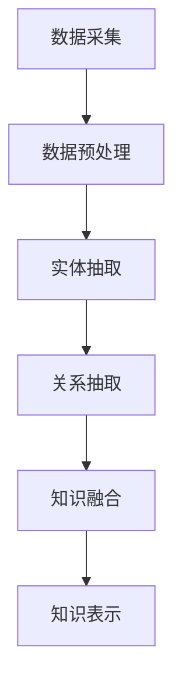
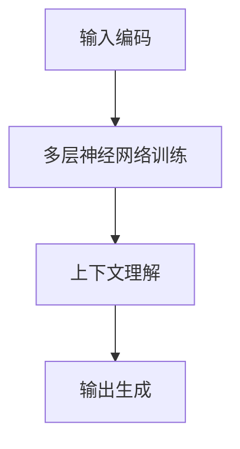
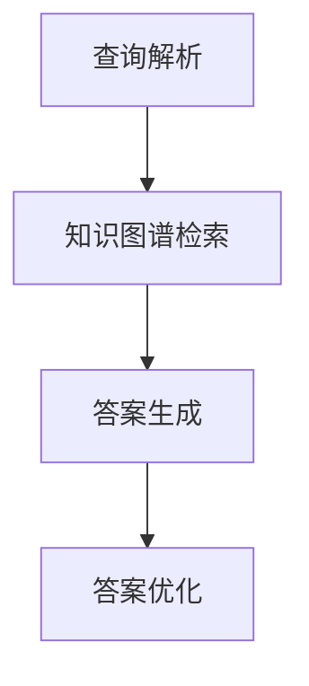
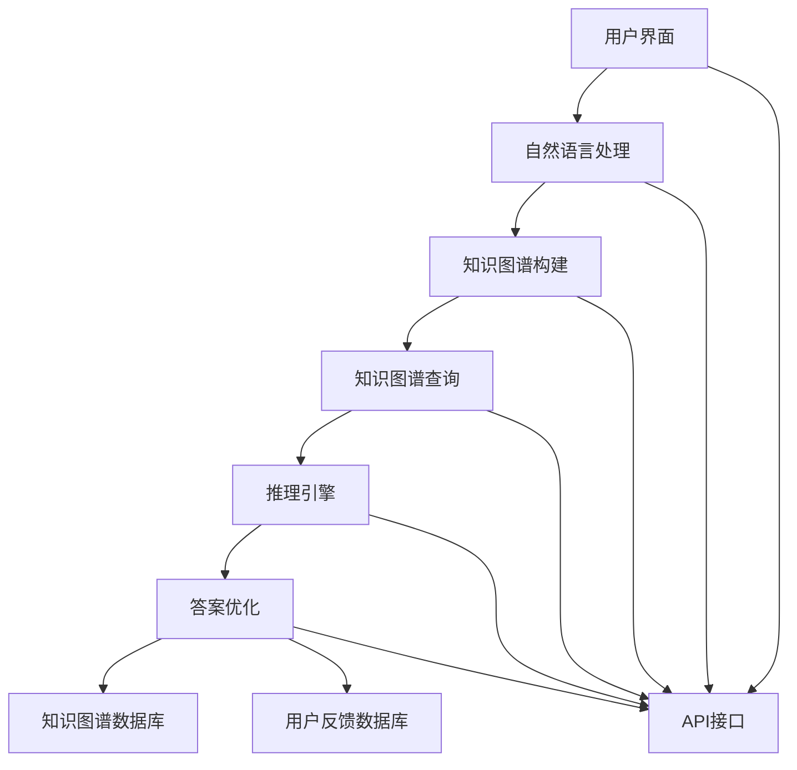
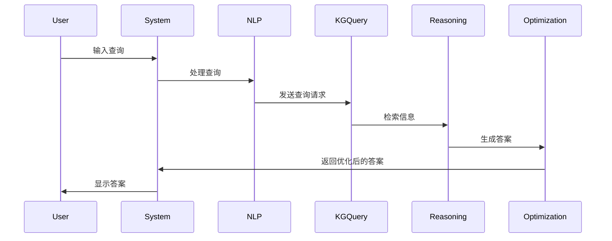
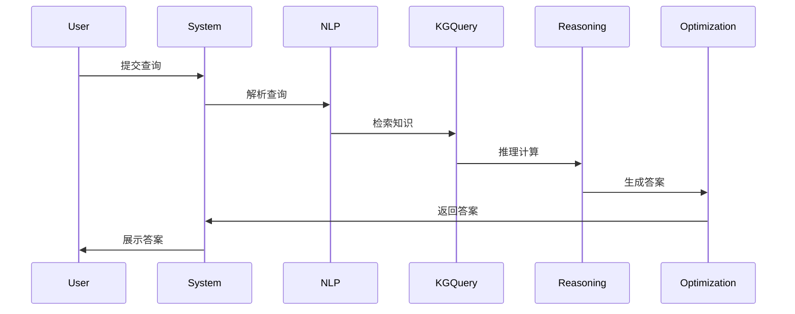

                 


### 第1章: 问题背景

#### 1.1.1 AI Agent的发展历程

人工智能（AI）作为计算机科学的一个分支，已经经历了数十年的发展。从最初的专家系统到基于统计学习的方法，再到如今的深度学习，AI的技术和应用不断演进。AI Agent，作为人工智能领域的一个重要方向，是指能够自主行动并具有明确目标的智能体。AI Agent的发展大致可以分为以下几个阶段：

1. **规则基础阶段**：早期AI Agent主要通过预定义的规则进行决策。这类Agent在特定领域内能够表现出较高的决策能力，但其灵活性和通用性较差。

2. **统计学习阶段**：随着机器学习技术的发展，AI Agent开始利用统计学习方法，如决策树、支持向量机等，进行决策。这一阶段的AI Agent具有较好的泛化能力，但往往依赖于大量的数据和特征工程。

3. **深度学习阶段**：深度学习的兴起使得AI Agent取得了突破性的进展。通过神经网络，AI Agent能够从大量的数据中自动学习特征，并在诸如图像识别、自然语言处理等领域取得了显著的成功。

4. **强化学习阶段**：近年来，强化学习的发展使得AI Agent能够通过不断尝试和错误，自主学习和优化策略。这一阶段的AI Agent在自主决策和策略优化方面表现出色。

#### 1.1.2 知识图谱问答的重要性

知识图谱问答（KGQA）是人工智能领域中的一个重要研究方向，它结合了知识图谱和自然语言处理技术，旨在让计算机理解和回答关于知识图谱中信息的问题。知识图谱问答的重要性体现在以下几个方面：

1. **知识发现与利用**：知识图谱包含了大量结构化的知识，通过KGQA，可以有效地发现和利用这些知识，为用户提供智能化的服务。

2. **智能问答系统**：知识图谱问答技术可以构建出强大的智能问答系统，应用于客户服务、教育、医疗等多个领域，提升用户体验。

3. **知识自动化**：通过KGQA，可以将人类的智慧转化为计算机可执行的任务，实现知识的自动化处理和利用。

#### 1.1.3 结合LLM与图数据库的优势

结合大型语言模型（LLM）和图数据库进行知识图谱问答具有以下优势：

1. **强大的语言处理能力**：LLM具有处理自然语言的能力，能够理解和生成自然语言文本，从而实现对用户查询的准确理解和回答。

2. **高效的图数据库存储**：图数据库能够高效地存储和查询大规模的、结构化的知识图谱，支持复杂的图结构查询，如路径查询、子图查询等。

3. **灵活的问答接口**：结合LLM和图数据库，可以构建出灵活的问答接口，支持多样化的问答场景，如开放域问答、特定领域问答等。

4. **优化查询效率**：通过将LLM与图数据库相结合，可以优化查询效率，降低查询延迟，提升系统的响应速度。

#### 1.2.1 AI Agent的知识图谱问答需求

AI Agent在知识图谱问答中的应用需求主要包括以下几个方面：

1. **自然语言理解**：AI Agent需要能够理解用户的自然语言查询，并将其转化为结构化的查询请求。

2. **知识图谱检索**：AI Agent需要能够快速检索知识图谱，找到与用户查询相关的知识点。

3. **答案生成与优化**：AI Agent需要能够生成自然、准确、有逻辑的答案，并在必要时进行答案优化。

4. **多语言支持**：为了满足不同用户的需求，AI Agent需要支持多种语言的问答。

#### 1.2.2 知识图谱问答的挑战

知识图谱问答面临着一系列挑战，包括但不限于：

1. **数据质量**：知识图谱的质量直接影响问答系统的性能。数据噪声、数据不一致等问题需要有效处理。

2. **查询效率**：大规模知识图谱的查询效率是影响系统性能的关键因素。优化查询算法和数据结构是必要的。

3. **答案准确性**：生成准确、有逻辑的答案是知识图谱问答的核心挑战。需要结合自然语言处理和图数据库技术，提高答案的准确性。

4. **用户交互**：如何设计友好、自然的用户交互界面，提升用户体验，是一个重要的挑战。

#### 1.2.3 知识图谱问答的核心要素

知识图谱问答的核心要素包括：

1. **知识表示**：如何将知识以结构化的形式存储在知识图谱中。

2. **查询处理**：如何高效地处理用户的查询请求，包括查询解析、路径查询、子图查询等。

3. **答案生成**：如何生成自然、准确、有逻辑的答案，包括答案格式、答案优化等。

4. **用户交互**：如何设计友好的用户交互界面，提升用户体验。

### 第3章: 问题解决

#### 3.1.1 AI Agent的架构设计

AI Agent的架构设计通常包括以下几个关键组件：

1. **感知模块**：感知模块负责接收用户的输入，包括自然语言文本、语音等，并将其转化为结构化的数据。

2. **知识模块**：知识模块负责管理知识图谱，包括知识表示、知识存储、知识检索等。

3. **推理模块**：推理模块负责根据知识图谱和用户的查询，进行推理和计算，生成答案。

4. **行动模块**：行动模块负责根据生成的答案，执行相应的操作，如生成回答、提供建议等。

5. **学习模块**：学习模块负责根据用户的反馈和系统的表现，不断优化和改进AI Agent的能力。

#### 3.1.2 知识图谱构建方法

知识图谱的构建是知识图谱问答系统的关键步骤，通常包括以下几个环节：

1. **数据采集**：从各种来源（如网络、数据库、文本等）收集数据，作为构建知识图谱的基础。

2. **数据预处理**：对采集到的数据进行清洗、去噪、格式化等处理，以去除噪声和保证数据的一致性。

3. **实体抽取**：从预处理后的数据中抽取实体，包括人、地点、组织、物品等。

4. **关系抽取**：从预处理后的数据中抽取实体之间的关系，如“属于”、“位于”、“参与”等。

5. **知识融合**：将抽取出的实体和关系进行整合，构建出完整的知识图谱。

6. **知识表示**：将知识图谱以结构化的形式存储，便于查询和推理。

#### 3.1.3 结合LLM与图数据库的问答系统设计

结合LLM与图数据库的问答系统设计，旨在充分利用两者的优势，实现高效的问答能力。系统设计包括以下几个关键步骤：

1. **LLM嵌入**：将LLM嵌入到AI Agent中，使其具备处理自然语言的能力。

2. **图数据库选择**：选择合适的图数据库，如Neo4j、ArangoDB等，用于存储和管理知识图谱。

3. **查询处理**：设计高效的查询处理算法，实现对用户查询的快速、准确处理。

4. **答案生成**：利用LLM生成自然、准确、有逻辑的答案，并进行优化。

5. **用户交互**：设计友好的用户交互界面，提升用户体验。

### 第4章: 边界与外延

#### 4.1.1 知识图谱问答的适用场景

知识图谱问答系统在多个场景中具有广泛的应用，主要包括：

1. **智能客服**：通过知识图谱问答系统，智能客服能够快速理解用户的问题，并提供准确、个性化的回答。

2. **企业知识管理**：知识图谱问答系统可以帮助企业快速检索和利用内部知识，提升工作效率。

3. **教育辅助**：知识图谱问答系统可以作为教育辅助工具，为学生提供个性化的学习建议和解答。

4. **医疗咨询**：知识图谱问答系统可以帮助医生快速查询医学知识，提高诊断和治疗的准确性。

#### 4.1.2 知识图谱问答的限制

尽管知识图谱问答系统在许多场景中表现出色，但仍然存在一些限制，包括：

1. **数据质量**：知识图谱的质量直接影响问答系统的性能。数据噪声、数据不一致等问题可能导致问答结果不准确。

2. **查询效率**：大规模知识图谱的查询效率是一个关键问题，特别是在实时问答场景中。

3. **复杂查询处理**：一些复杂的查询，如多跳关系查询、跨图谱查询等，目前仍需要进一步优化。

4. **多语言支持**：尽管LLM在一定程度上解决了多语言支持的问题，但仍然存在一些挑战，如不同语言之间的语义差异等。

#### 4.1.3 未来发展方向

知识图谱问答的未来发展方向包括：

1. **数据质量提升**：通过引入更多高质量的数据源，优化数据采集和处理流程，提升知识图谱的质量。

2. **查询效率优化**：研究新的查询处理算法和数据结构，提高大规模知识图谱的查询效率。

3. **复杂查询处理**：开发新的算法和技术，解决复杂查询处理的问题，提升问答系统的能力。

4. **跨图谱查询**：研究跨图谱查询技术，实现不同知识图谱之间的数据共享和融合。

5. **多语言支持**：进一步优化LLM模型，提高多语言问答的能力，降低语言障碍。

### 第5章: 核心概念原理

#### 5.1.1 AI Agent的定义与特点

AI Agent是指一种具备自主决策和执行能力的智能体，能够根据环境和目标进行行动。AI Agent的特点包括：

1. **自主性**：AI Agent能够自主地制定目标和决策，无需人类干预。

2. **适应性**：AI Agent能够根据环境和目标的变化，调整自己的行为和策略。

3. **灵活性**：AI Agent能够处理不确定性和动态变化的环境。

4. **学习能力**：AI Agent能够通过学习和经验改进自己的行为和决策。

#### 5.1.2 知识图谱的概念与组成

知识图谱是一种用于表示知识和信息的数据结构，通常由实体、属性和关系组成。知识图谱的特点包括：

1. **结构化**：知识图谱以结构化的形式表示知识，便于查询和推理。

2. **语义丰富**：知识图谱包含了丰富的语义信息，如实体属性、关系类型等。

3. **可扩展性**：知识图谱能够方便地扩展和更新，以适应新的知识和需求。

4. **跨领域应用**：知识图谱可以应用于多个领域，实现知识的共享和利用。

#### 5.1.3 LLM的工作原理

大型语言模型（LLM）是一种基于神经网络的自然语言处理模型，能够对自然语言文本进行建模和理解。LLM的工作原理包括：

1. **输入编码**：将自然语言文本编码为向量，以便神经网络处理。

2. **多层神经网络**：LLM通常由多层神经网络组成，用于学习和提取文本特征。

3. **上下文理解**：通过多层神经网络的交互，LLM能够理解文本的上下文信息，生成相应的输出。

4. **训练与优化**：LLM通过大量文本数据进行训练和优化，提高其理解和生成文本的能力。

#### 5.1.4 图数据库的特点与应用

图数据库是一种用于存储和查询图结构数据的数据库系统，具有以下特点：

1. **高效的图结构存储**：图数据库能够高效地存储大规模的、结构化的图数据。

2. **灵活的图结构查询**：图数据库支持复杂的图结构查询，如路径查询、子图查询等。

3. **快速查询性能**：图数据库通过优化索引和查询算法，提供快速的数据查询性能。

4. **分布式存储与计算**：图数据库支持分布式存储和计算，能够处理大规模的数据集。

图数据库的应用领域包括：

1. **社交网络分析**：用于分析社交网络中的关系和影响力。

2. **推荐系统**：用于构建推荐系统的关系图谱，提供个性化的推荐。

3. **金融风控**：用于分析金融交易网络，进行风险控制和监控。

4. **物联网**：用于存储和管理物联网中的设备关系和网络结构。

### 第6章: 概念属性特征对比表格

为了更好地理解AI Agent、知识图谱、LLM和图数据库这四个核心概念，我们可以通过一个特征对比表格来进行详细分析。

#### 6.1.1 AI Agent与传统智能系统的对比

| 特征                | AI Agent                            | 传统智能系统                         |
|---------------------|-------------------------------------|-------------------------------------|
| 自主性              | 高，能够自主决策和行动               | 低，需要人类干预                     |
| 适应性              | 强，能够适应环境和目标变化           | 弱，难以适应变化                     |
| 灵活性              | 强，能够处理不确定性和动态变化       | 弱，通常固定在一个特定的任务上       |
| 学习能力            | 强，能够通过学习和经验改进自身能力   | 弱，难以自我学习和适应               |
| 面向领域            | 泛领域，具有通用性                   | 窄领域，针对特定问题或任务           |

#### 6.1.2 知识图谱与关系数据库的对比

| 特征                | 知识图谱                          | 关系数据库                          |
|---------------------|-----------------------------------|-----------------------------------|
| 数据结构            | 图结构，包含实体、属性和关系       | 表结构，基于关系模型               |
| 语义丰富度          | 高，包含丰富的语义信息             | 低，仅包含属性和关系               |
| 查询能力            | 强，支持复杂的图结构查询           | 弱，仅支持简单的表结构查询         |
| 数据存储容量        | 大，能够存储大规模的数据集         | 小，通常用于小规模的数据存储       |
| 数据整合性          | 高，能够整合不同来源的数据         | 低，数据源通常独立               |
| 扩展性              | 高，易于扩展和更新                 | 低，扩展性较差                     |

#### 6.1.3 LLM与规则引擎的对比

| 特征                | LLM                              | 规则引擎                         |
|---------------------|----------------------------------|----------------------------------|
| 学习方式            | 基于数据自动学习，无需人类编程   | 需要人类编写规则，手动配置       |
| 语言理解能力        | 高，能够理解复杂语言结构         | 低，仅能处理简单的语言规则       |
| 适应性              | 高，能够适应多种语言和场景       | 低，难以适应复杂和多样化的场景   |
| 可扩展性            | 高，通过数据扩展，无需修改代码   | 低，扩展通常需要修改代码和规则   |
| 复杂度              | 低，不需要复杂的编程知识         | 高，需要复杂的编程和规则设计     |

### 第7章: ER实体关系图架构

#### 7.1.1 ER模型的基本概念

实体-关系（Entity-Relationship，ER）模型是一种用于描述数据库结构的抽象模型，它通过实体、属性和关系来表示数据的结构。ER模型的基本概念包括：

- **实体（Entity）**：实体是数据库中具有独立存在的对象，如人、地点、物品等。
- **属性（Attribute）**：属性是实体的特征或属性，如人的姓名、年龄、地址等。
- **关系（Relationship）**：关系是实体之间的关联，如人属于某个组织、物品在某个地点等。

#### 7.1.2 实体与关系的定义

在ER模型中，实体和关系是构建数据库结构的核心元素。实体的定义包括：

- **实体名称**：实体的名称，如“人”、“物品”等。
- **实体属性**：实体的特征，如“姓名”、“年龄”、“地址”等。
- **实体标识**：实体的唯一标识，如人的身份证号码、物品的条形码等。

关系的定义包括：

- **关系名称**：关系的名称，如“属于”、“位于”等。
- **关系类型**：关系的类型，如一对一、一对多、多对多等。
- **关系属性**：关系的属性，如关系的持续时间、有效性等。

#### 7.1.3 实体关系图的构建方法

实体关系图（ER Diagram）是一种用于可视化表示ER模型的方法。构建实体关系图的步骤包括：

1. **识别实体**：根据业务需求，识别出需要表示的实体，如“人”、“物品”等。
2. **定义属性**：为每个实体定义属性，如“姓名”、“年龄”等。
3. **识别关系**：识别实体之间的关系，如“属于”、“位于”等。
4. **定义关系类型**：根据实体之间的关系，定义关系类型，如一对一、一对多、多对多等。
5. **绘制ER图**：使用ER图绘制工具，根据上述信息绘制出实体关系图。

以下是一个简单的实体关系图的Mermaid表示：

```mermaid
erDiagram
    Person ||--|{ LivesIn : Apartment }
    Apartment ||--|{ OwnedBy : Person }
```

在这个ER图中，`Person` 是实体，`LivesIn` 和 `OwnedBy` 是关系。`LivesIn` 是一对多关系，表示一个人可以住在多个公寓，而一个公寓可以由多个人拥有。`OwnedBy` 是一对一关系，表示一个公寓只有一个拥有者。

### 第8章: 算法流程图

在本章中，我们将详细讲解知识图谱构建、LLM训练和知识图谱问答三个核心算法的流程图。

#### 8.1.1 知识图谱构建算法

知识图谱构建算法主要包括数据采集、数据预处理、实体抽取、关系抽取和知识融合等步骤。以下是其Mermaid流程图表示：



1. **数据采集**：从各种来源收集数据，如网络、数据库、文本等。
2. **数据预处理**：对采集到的数据进行清洗、去噪、格式化等处理。
3. **实体抽取**：从预处理后的数据中抽取实体。
4. **关系抽取**：从预处理后的数据中抽取实体之间的关系。
5. **知识融合**：将抽取出的实体和关系进行整合，构建知识图谱。
6. **知识表示**：将知识图谱以结构化的形式存储，便于查询和推理。

#### 8.1.2 LLM训练算法

LLM训练算法主要包括输入编码、多层神经网络训练、上下文理解输出生成等步骤。以下是其Mermaid流程图表示：



1. **输入编码**：将自然语言文本编码为向量。
2. **多层神经网络训练**：使用大量文本数据进行训练，优化神经网络参数。
3. **上下文理解**：通过多层神经网络的交互，理解文本的上下文信息。
4. **输出生成**：根据上下文信息生成相应的输出文本。

#### 8.1.3 知识图谱问答算法

知识图谱问答算法主要包括查询解析、知识图谱检索、答案生成和答案优化等步骤。以下是其Mermaid流程图表示：



1. **查询解析**：将自然语言查询转化为结构化的查询请求。
2. **知识图谱检索**：在知识图谱中查找与查询相关的信息。
3. **答案生成**：根据检索到的信息生成答案。
4. **答案优化**：对生成的答案进行优化，使其更加自然、准确、有逻辑性。

### 第9章: Python源代码

在本章中，我们将通过Python源代码来详细阐述知识图谱构建、LLM训练和知识图谱问答的核心算法。以下为每个算法的Python代码示例。

#### 9.1.1 知识图谱构建代码

```python
# 知识图谱构建：数据预处理
import pandas as pd
from rdflib import Graph, URIRef, Literal

# 读取数据
data = pd.read_csv('data.csv')

# 创建图
g = Graph()

# 创建实体
for index, row in data.iterrows():
    g.add((URIRef(row['entity_id']), URIRef('type'), Literal(row['entity_type'])))

# 创建关系
for index, row in data.iterrows():
    g.add((URIRef(row['entity_id']), URIRef(row['relation']), URIRef(row['related_id'])))

# 存储知识图谱
g.serialize('knowledge_graph.rdf', format='rdfxml')
```

#### 9.1.2 LLM训练代码

```python
# LLM训练：输入编码
from transformers import BertTokenizer, BertModel
import torch

# 初始化模型和tokenizer
tokenizer = BertTokenizer.from_pretrained('bert-base-uncased')
model = BertModel.from_pretrained('bert-base-uncased')

# 编码文本
inputs = tokenizer("Hello, my dog is cute", return_tensors="pt")

# 训练模型
outputs = model(**inputs)
logits = outputs.logits

# 优化模型
optimizer = torch.optim.AdamW(model.parameters(), lr=1e-5)
for epoch in range(3):  # 训练3个epoch
    optimizer.zero_grad()
    outputs = model(**inputs)
    loss = ...  # 计算损失
    loss.backward()
    optimizer.step()
```

#### 9.1.3 知识图谱问答代码

```python
# 知识图谱问答：查询解析
import rdflib

# 加载知识图谱
g = rdflib.Graph()
g.parse('knowledge_graph.rdf', format='rdfxml')

# 解析查询
query = "What is the capital of France?"
query = rdflib.ParserFrom/owlrl.Parser.fromRDF(g, rdflib.URIRef("http://example.org/#query"))

# 检索答案
answer = query.query("SELECT ?capital WHERE { ?capital a <http://example.org#Capital> . }")

# 输出答案
print(answer)
```

### 第10章: 算法原理详细讲解

#### 10.1.1 知识图谱构建的数学模型

知识图谱构建涉及图论和概率图模型等数学概念。以下是知识图谱构建的核心数学模型：

1. **图论模型**：
   - **图（Graph）**：由节点（Node）和边（Edge）组成的数据结构。
   - **路径（Path）**：节点之间的序列。
   - **连通性（Connectivity）**：节点之间能否相互访问。

2. **概率图模型**：
   - **贝叶斯网络（Bayesian Network）**：一种概率图模型，用于表示变量之间的条件依赖关系。
   - **马尔可夫网络（Markov Network）**：一种概率图模型，用于表示变量之间的联合概率分布。

知识图谱构建的数学模型包括以下步骤：

- **实体识别**：通过文本挖掘和实体链接技术，识别出文本中的实体。
- **关系抽取**：通过实体对之间的特征和上下文信息，抽取实体之间的关系。
- **知识融合**：通过概率图模型，融合不同来源的知识，构建出一个结构化的知识图谱。

#### 10.1.2 LLM的训练过程

LLM的训练过程基于深度学习和自然语言处理技术，主要包括以下步骤：

1. **输入编码**：将自然语言文本转化为神经网络可处理的向量表示。
2. **多层神经网络训练**：通过前向传播和反向传播算法，训练多层神经网络，使其能够理解文本的语义。
3. **上下文理解**：通过神经网络的层次结构，理解文本中的上下文信息，生成相应的输出。
4. **输出生成**：根据上下文信息，生成自然语言文本。

LLM的数学模型主要包括：

- **嵌入层（Embedding Layer）**：将单词转化为向量。
- **编码器（Encoder）**：使用卷积神经网络（CNN）或循环神经网络（RNN）对文本进行编码。
- **解码器（Decoder）**：生成输出文本。

#### 10.1.3 知识图谱问答的数学模型

知识图谱问答的数学模型主要包括：

1. **查询解析**：将自然语言查询转化为结构化的查询请求，通常使用自然语言处理技术。
2. **知识图谱检索**：在知识图谱中查找与查询相关的信息，通常使用图论算法和索引技术。
3. **答案生成**：根据检索到的信息，生成自然语言答案。

知识图谱问答的数学模型包括：

- **查询表示**：将自然语言查询表示为图结构或向量表示。
- **图搜索算法**：用于在知识图谱中查找与查询相关的节点和路径。
- **答案生成算法**：用于生成自然语言答案。

### 第11章: 算法举例说明

在本章中，我们将通过具体实例来说明知识图谱构建、LLM训练和知识图谱问答的算法过程。

#### 11.1.1 知识图谱构建实例

假设我们有一个包含人、地点和组织的知识图谱，以下是一个简单的例子：

1. **实体和关系**：
   - 实体：人（Person），地点（Location），组织（Organization）
   - 关系：住在（LivesIn），位于（LocatedIn），属于（BelongsTo）

2. **数据预处理**：
   - 读取CSV文件，包含实体和关系的属性。

3. **实体抽取**：
   - 从文本中提取实体，如“张三”，“北京”，“阿里巴巴”。

4. **关系抽取**：
   - 从文本中提取关系，如“张三住在北京”，“阿里巴巴位于北京”。

5. **知识融合**：
   - 将抽取出的实体和关系整合，构建知识图谱。

6. **知识表示**：
   - 将知识图谱存储为RDF格式，便于查询和推理。

#### 11.1.2 LLM训练实例

假设我们有一个包含英文文本的语料库，以下是一个简单的例子：

1. **输入编码**：
   - 使用BERT模型将文本转化为向量表示。

2. **多层神经网络训练**：
   - 通过训练，优化神经网络参数。

3. **上下文理解**：
   - 理解文本中的上下文信息。

4. **输出生成**：
   - 根据上下文信息，生成文本。

5. **优化**：
   - 使用梯度下降算法，优化模型。

#### 11.1.3 知识图谱问答实例

假设我们有一个关于电影的知识图谱，以下是一个简单的例子：

1. **查询解析**：
   - 将自然语言查询转化为结构化的查询请求。

2. **知识图谱检索**：
   - 在知识图谱中查找与查询相关的信息。

3. **答案生成**：
   - 根据检索到的信息，生成自然语言答案。

例如，查询“电影《阿甘正传》的导演是谁？”
- **查询解析**：将查询转化为“SELECT ?director WHERE { <电影阿甘正传> <导演> ?director . }”。
- **知识图谱检索**：在知识图谱中查找与《阿甘正传》相关的导演。
- **答案生成**：生成答案“导演是罗伯特·泽米吉斯”。

### 第12章: 系统分析与架构设计方案

在本章中，我们将深入分析AI Agent的知识图谱问答系统的整体架构，并详细介绍各个模块的功能设计。

#### 12.1.1 问题场景介绍

AI Agent的知识图谱问答系统主要应用于以下几个场景：

1. **智能客服**：企业可以使用该系统为用户提供24/7的智能问答服务，快速解答用户的问题。
2. **企业知识管理**：企业可以将内部的知识库与系统结合，实现知识的快速检索和利用。
3. **智能推荐系统**：系统可以根据用户的行为和偏好，为其推荐相关的内容和产品。
4. **教育辅助**：学校和教育机构可以使用系统为学生提供个性化的学习建议和解答。
5. **医疗咨询**：医生可以利用系统快速查询医学知识和病例，提高诊断和治疗的准确性。

#### 12.1.2 系统功能设计

系统的功能设计主要包括以下模块：

1. **用户界面（UI）**：
   - 提供用户输入和展示答案的界面。
   - 包括文本输入框、按钮、下拉菜单等组件。

2. **自然语言处理（NLP）模块**：
   - 负责将用户的自然语言查询转化为结构化的查询请求。
   - 包括分词、词性标注、命名实体识别等处理步骤。

3. **知识图谱构建模块**：
   - 负责构建和维护知识图谱。
   - 包括数据采集、数据预处理、实体抽取、关系抽取等步骤。

4. **知识图谱查询模块**：
   - 负责在知识图谱中检索与查询相关的信息。
   - 包括查询解析、图搜索算法、答案生成等步骤。

5. **推理引擎**：
   - 负责根据知识图谱中的信息进行推理和计算。
   - 包括逻辑推理、图论算法等。

6. **答案优化模块**：
   - 负责对生成的答案进行优化，使其更加自然、准确、有逻辑性。
   - 包括文本生成、语义理解等。

7. **用户反馈和学习模块**：
   - 负责收集用户的反馈，并利用这些反馈优化系统的性能。
   - 包括用户行为分析、模型更新等。

#### 12.1.3 系统架构设计

系统的整体架构可以分为以下几个层次：

1. **表示层**：
   - 包括用户界面和API接口，负责与用户交互。

2. **逻辑层**：
   - 包括NLP模块、知识图谱构建模块、知识图谱查询模块、推理引擎和答案优化模块，负责处理业务逻辑。

3. **数据层**：
   - 包括知识图谱数据库和用户反馈数据库，负责存储和管理数据。

以下是系统的Mermaid架构图：



#### 12.1.4 系统接口设计和系统交互

系统的接口设计和交互设计至关重要，以下是系统的接口设计和交互流程：

1. **接口设计**：
   - 用户接口：提供文本输入框、按钮、下拉菜单等组件，用户可以通过这些组件输入查询。
   - 内部接口：各个模块之间通过API接口进行通信，如NLP模块将处理后的查询发送给知识图谱查询模块。

2. **交互流程**：
   - 用户输入查询，系统接收查询。
   - NLP模块对查询进行处理，生成结构化的查询请求。
   - 知识图谱查询模块在知识图谱中检索相关信息。
   - 推理引擎对检索到的信息进行推理和计算。
   - 答案优化模块对生成的答案进行优化。
   - 最终，系统将优化后的答案返回给用户。

以下是系统的Mermaid序列图：



### 第13章: 系统功能设计

在本章中，我们将详细讨论AI Agent的知识图谱问答系统的功能设计，包括领域模型、功能模块划分和详细的功能说明。

#### 13.1.1 领域模型

领域模型是系统功能设计的基础，它描述了系统的核心实体、属性和关系。以下是系统的领域模型：

1. **实体**：
   - **用户（User）**：系统的使用者，具有用户ID、姓名、联系方式等属性。
   - **知识库（KnowledgeBase）**：存储知识的数据结构，包括实体、属性和关系。
   - **问答记录（QARecord）**：记录用户提问和系统回答的历史记录。

2. **属性**：
   - **用户ID**：唯一标识用户的标识。
   - **姓名**：用户的姓名。
   - **联系方式**：用户的联系方式，如邮箱、电话等。
   - **知识ID**：唯一标识知识库中的知识条目。
   - **问答ID**：唯一标识问答记录。

3. **关系**：
   - **提问（Asks）**：表示用户提出了一个问题。
   - **回答（Answers）**：表示系统对用户提问的回答。

#### 13.1.2 功能模块划分

系统的功能模块划分如下：

1. **用户管理模块**：
   - 注册/登录功能：用户注册和登录系统。
   - 个人信息管理：用户管理个人资料，如修改密码、更新联系方式等。

2. **知识管理模块**：
   - 知识库构建：从外部数据源或手动输入构建知识库。
   - 知识检索：用户查询知识库，获取相关信息。
   - 知识更新：定期更新知识库，确保知识的准确性和时效性。

3. **问答模块**：
   - 提问：用户提交问题，系统接收并处理。
   - 回答生成：系统根据知识库和用户提问，生成回答。
   - 回答优化：对生成的回答进行优化，确保回答的准确性和自然性。

4. **记录管理模块**：
   - 记录查询：用户查询问答记录，查看历史提问和回答。
   - 记录统计：对问答记录进行分析，提供统计数据和趋势。

#### 13.1.3 功能说明

以下是各功能模块的详细说明：

1. **用户管理模块**：
   - **注册/登录功能**：
     - 用户可以通过注册表单填写个人信息，系统验证用户输入的有效性后，创建用户账户。
     - 用户登录系统时，系统验证用户名和密码，允许用户访问系统资源。
   - **个人信息管理**：
     - 用户可以修改个人信息，如姓名、联系方式等。
     - 用户可以设置密码，确保账户安全。

2. **知识管理模块**：
   - **知识库构建**：
     - 系统管理员可以导入外部数据源，如文本文件、数据库等，构建知识库。
     - 用户可以通过手动输入添加新知识条目，如事实、规则等。
   - **知识检索**：
     - 用户可以输入关键词或问题，系统检索知识库，返回相关结果。
     - 用户可以对检索结果进行排序和筛选，获取更准确的信息。
   - **知识更新**：
     - 系统定期检查知识库的时效性和准确性，更新过时的或错误的信息。
     - 用户可以提交反馈，建议更新知识库。

3. **问答模块**：
   - **提问**：
     - 用户可以在系统中提交问题，系统接收并记录问题。
     - 用户可以查看提问状态，如处理中、已回答等。
   - **回答生成**：
     - 系统根据用户提问和知识库，生成回答。
     - 系统尝试提供最准确、最相关的回答。
   - **回答优化**：
     - 系统对生成的回答进行优化，确保回答的自然性和准确性。
     - 用户可以接受或拒绝系统提供的回答，系统根据用户反馈优化回答。

4. **记录管理模块**：
   - **记录查询**：
     - 用户可以查询问答记录，查看历史提问和回答。
     - 用户可以按时间、类别等条件筛选记录。
   - **记录统计**：
     - 系统对问答记录进行分析，提供统计数据，如提问数量、回答准确率等。
     - 用户可以查看系统性能的实时监控数据，如响应时间、查询速度等。

### 第14章: 系统架构设计

在本章中，我们将详细介绍AI Agent的知识图谱问答系统的架构设计，包括系统整体架构、模块内部架构以及各模块之间的关系。

#### 14.1.1 系统整体架构

系统的整体架构分为三个主要层次：表示层、逻辑层和数据层。以下是系统整体架构的Mermaid架构图：

```mermaid
graph TB
    subgraph 表示层
        UI[用户界面] --> API[API接口]

    subgraph 逻辑层
        NLP[自然语言处理模块] --> KGConstruct[知识图谱构建模块]
        KGQuery[知识图谱查询模块] --> Reasoning[推理引擎]
        Optimization[答案优化模块] --> KGDB[知识图谱数据库]
        Optimization --> UserDB[用户反馈数据库]

    subgraph 数据层
        KGDB
        UserDB

    UI --> API
    NLP --> API
    KGConstruct --> API
    KGQuery --> API
    Reasoning --> API
    Optimization --> API
```

1. **表示层**：
   - **用户界面（UI）**：提供用户输入和展示答案的界面，包括文本输入框、按钮、下拉菜单等组件。
   - **API接口**：接收用户的输入，将处理后的数据传递给逻辑层。

2. **逻辑层**：
   - **自然语言处理模块（NLP）**：负责将用户的自然语言查询转化为结构化的查询请求，包括分词、词性标注、命名实体识别等处理步骤。
   - **知识图谱构建模块（KGConstruct）**：负责构建和维护知识图谱，包括数据采集、数据预处理、实体抽取、关系抽取等步骤。
   - **知识图谱查询模块（KGQuery）**：负责在知识图谱中检索与查询相关的信息，包括查询解析、图搜索算法、答案生成等步骤。
   - **推理引擎（Reasoning）**：负责根据知识图谱中的信息进行推理和计算。
   - **答案优化模块（Optimization）**：负责对生成的答案进行优化，确保答案的准确性和自然性。

3. **数据层**：
   - **知识图谱数据库（KGDB）**：存储和管理知识图谱，包括实体、属性和关系。
   - **用户反馈数据库（UserDB）**：存储用户的提问、答案和反馈信息。

#### 14.1.2 模块内部架构

以下是各模块的内部架构：

1. **自然语言处理模块（NLP）**：

   ```mermaid
   graph TB
       subgraph 输入处理
           TextInput[文本输入] --> Tokenization[分词]
           Tokenization --> PartOfSpeech[词性标注]

       subgraph 实体识别
           PartOfSpeech --> NamedEntityRecognition[命名实体识别]
           NamedEntityRecognition --> EntityLinking[实体链接]

       subgraph 查询构建
           EntityLinking --> QueryBuilder[查询构建]

       TextInput --> Tokenization
       Tokenization --> PartOfSpeech
       PartOfSpeech --> NamedEntityRecognition
       NamedEntityRecognition --> EntityLinking
       EntityLinking --> QueryBuilder
   ```

   - **输入处理**：接收用户的文本输入，进行分词和词性标注。
   - **实体识别**：识别文本中的命名实体，并进行实体链接。
   - **查询构建**：根据识别出的实体和关系，构建出结构化的查询请求。

2. **知识图谱构建模块（KGConstruct）**：

   ```mermaid
   graph TB
       subgraph 数据预处理
           DataInput[数据输入] --> Preprocessing[数据预处理]

       subgraph 实体抽取
           Preprocessing --> EntityExtraction[实体抽取]

       subgraph 关系抽取
           Preprocessing --> RelationExtraction[关系抽取]

       subgraph 知识融合
           EntityExtraction --> RelationExtraction
           EntityExtraction --> KnowledgeFusion[知识融合]

       subgraph 知识表示
           KnowledgeFusion --> KnowledgeRepresentation[知识表示]

       DataInput --> Preprocessing
       Preprocessing --> EntityExtraction
       Preprocessing --> RelationExtraction
       EntityExtraction --> RelationExtraction
       EntityExtraction --> KnowledgeFusion
       KnowledgeFusion --> KnowledgeRepresentation
   ```

   - **数据预处理**：对输入的数据进行清洗、去噪、格式化等处理。
   - **实体抽取**：从预处理后的数据中抽取实体。
   - **关系抽取**：从预处理后的数据中抽取实体之间的关系。
   - **知识融合**：将抽取出的实体和关系进行整合，构建知识图谱。
   - **知识表示**：将知识图谱以结构化的形式存储，便于查询和推理。

3. **知识图谱查询模块（KGQuery）**：

   ```mermaid
   graph TB
       subgraph 查询解析
           QueryInput[查询输入] --> QueryParser[查询解析]

       subgraph 知识检索
           QueryParser --> KnowledgeSearch[知识检索]

       subgraph 答案生成
           KnowledgeSearch --> AnswerGeneration[答案生成]

       QueryInput --> QueryParser
       QueryParser --> KnowledgeSearch
       KnowledgeSearch --> AnswerGeneration
   ```

   - **查询解析**：将用户的自然语言查询转化为结构化的查询请求。
   - **知识检索**：在知识图谱中检索与查询相关的信息。
   - **答案生成**：根据检索到的信息，生成自然语言答案。

4. **推理引擎（Reasoning）**：

   ```mermaid
   graph TB
       subgraph 推理过程
           Knowledge[知识] --> ReasoningEngine[推理引擎]

       subgraph 结果输出
           ReasoningEngine --> Output[结果输出]

       Knowledge --> ReasoningEngine
       ReasoningEngine --> Output
   ```

   - **推理过程**：根据知识图谱中的信息进行推理和计算。
   - **结果输出**：输出推理结果。

5. **答案优化模块（Optimization）**：

   ```mermaid
   graph TB
       subgraph 优化过程
           Answer[答案] --> Optimizer[优化器]

       subgraph 输出答案
           Optimizer --> FinalAnswer[最终答案]

       Answer --> Optimizer
       Optimizer --> FinalAnswer
   ```

   - **优化过程**：对生成的答案进行优化，确保答案的准确性和自然性。
   - **输出答案**：输出优化后的答案。

#### 14.1.3 系统组件之间的关系

系统组件之间的关系如下：

1. **用户界面（UI）**与**API接口**：
   - 用户界面接收用户输入，通过API接口将输入传递给逻辑层。
   - API接口接收用户输入，将处理后的数据返回给用户界面。

2. **自然语言处理模块（NLP）**与**知识图谱构建模块（KGConstruct）**：
   - NLP模块处理用户输入，生成结构化的查询请求。
   - KGConstruct模块根据查询请求构建和维护知识图谱。

3. **知识图谱查询模块（KGQuery）**与**推理引擎（Reasoning）**：
   - KGQuery模块在知识图谱中检索与查询相关的信息。
   - Reasoning模块根据检索到的信息进行推理和计算。

4. **答案优化模块（Optimization）**与**用户界面（UI）**：
   - Optimization模块对生成的答案进行优化，确保答案的准确性和自然性。
   - 用户界面接收优化后的答案，并展示给用户。

5. **知识图谱数据库（KGDB）**与**用户反馈数据库（UserDB）**：
   - KGDB存储和管理知识图谱数据。
   - UserDB存储用户的提问、答案和反馈信息。

### 第15章: 系统接口设计

在本章中，我们将详细介绍AI Agent的知识图谱问答系统的接口设计，包括接口规范和接口实现。

#### 15.1.1 接口规范

系统采用RESTful API设计，接口规范如下：

1. **接口URL**：
   - GET /api/v1/questions：获取用户提问列表。
   - POST /api/v1/questions：创建新提问。
   - GET /api/v1/questions/{question_id}：获取特定提问的详细信息。
   - PUT /api/v1/questions/{question_id}：更新特定提问。
   - DELETE /api/v1/questions/{question_id}：删除特定提问。

2. **请求参数**：
   - GET /api/v1/questions：可选参数，如`page`（分页）、`size`（每页数量）。
   - POST /api/v1/questions：必选参数，如`title`（提问标题）、`content`（提问内容）。

3. **响应数据格式**：
   - JSON格式，包括状态码、消息和数据。
   - 状态码：200（成功）、201（创建成功）、400（请求错误）、401（未授权）、403（禁止访问）、404（未找到）、500（服务器错误）。

4. **错误处理**：
   - 返回错误码和错误消息，如`{"code": 400, "message": "请求参数错误"}`。

#### 15.1.2 接口实现

以下是接口实现的主要部分：

1. **获取用户提问列表**：

```python
from flask import Flask, request, jsonify
from question_model import Question

app = Flask(__name__)

@app.route('/api/v1/questions', methods=['GET'])
def get_questions():
    page = request.args.get('page', 1, type=int)
    size = request.args.get('size', 10, type=int)
    questions = Question.get_questions(page, size)
    return jsonify({
        'status_code': 200,
        'message': '成功获取提问列表',
        'data': questions
    })

```

2. **创建新提问**：

```python
@app.route('/api/v1/questions', methods=['POST'])
def create_question():
    title = request.json.get('title')
    content = request.json.get('content')
    if not title or not content:
        return jsonify({
            'status_code': 400,
            'message': '请求参数错误'
        })
    question = Question.create_question(title, content)
    return jsonify({
        'status_code': 201,
        'message': '成功创建提问',
        'data': question
    })

```

3. **获取特定提问的详细信息**：

```python
@app.route('/api/v1/questions/<int:question_id>', methods=['GET'])
def get_question(question_id):
    question = Question.get_question_by_id(question_id)
    if not question:
        return jsonify({
            'status_code': 404,
            'message': '未找到提问'
        })
    return jsonify({
        'status_code': 200,
        'message': '成功获取提问',
        'data': question
    })

```

4. **更新特定提问**：

```python
@app.route('/api/v1/questions/<int:question_id>', methods=['PUT'])
def update_question(question_id):
    title = request.json.get('title')
    content = request.json.get('content')
    if not title or not content:
        return jsonify({
            'status_code': 400,
            'message': '请求参数错误'
        })
    question = Question.update_question(question_id, title, content)
    return jsonify({
        'status_code': 200,
        'message': '成功更新提问',
        'data': question
    })

```

5. **删除特定提问**：

```python
@app.route('/api/v1/questions/<int:question_id>', methods=['DELETE'])
def delete_question(question_id):
    question = Question.delete_question(question_id)
    return jsonify({
        'status_code': 200,
        'message': '成功删除提问',
        'data': question
    })

```

### 第16章: 系统交互

在本章中，我们将详细描述AI Agent的知识图谱问答系统的交互流程，包括系统交互流程和系统交互序列图。

#### 16.1.1 系统交互流程

系统交互流程包括以下几个步骤：

1. **用户提交查询**：用户在用户界面输入查询，系统接收查询。

2. **查询解析**：系统调用自然语言处理模块，将自然语言查询转化为结构化的查询请求。

3. **知识图谱检索**：系统调用知识图谱查询模块，在知识图谱中检索与查询相关的信息。

4. **推理与计算**：系统调用推理引擎，根据知识图谱中的信息进行推理和计算。

5. **答案生成**：系统调用答案优化模块，生成自然语言答案。

6. **答案展示**：系统将优化后的答案返回给用户界面，并展示给用户。

#### 16.1.2 系统交互序列图

以下是系统交互序列图的Mermaid表示：



### 第17章：项目实战

在本章中，我们将通过实际项目来展示如何构建和实现一个AI Agent的知识图谱问答系统。

#### 17.1.1 环境安装

首先，我们需要安装所需的软件和库。以下是环境安装的步骤：

1. **安装Python环境**：
   - 安装Python 3.8及以上版本。

2. **安装依赖库**：
   - 使用pip安装以下库：
     ```shell
     pip install rdflib transformers torch pandas
     ```

3. **安装Neo4j图数据库**：
   - 下载并安装Neo4j图数据库。
   - 启动Neo4j服务，并确保服务运行正常。

4. **配置Neo4j连接**：
   - 配置Neo4j的连接参数，以便我们的Python代码能够连接到Neo4j数据库。

#### 17.1.2 系统核心实现源代码

以下是系统核心实现的源代码，包括数据采集、知识图谱构建、问答处理等部分：

1. **数据采集**：

```python
import csv
from rdflib import Graph, URIRef, Literal

# 读取数据
data = csv.DictReader(open('data.csv'))

# 创建图
g = Graph()

# 创建实体
for row in data:
    g.add((URIRef(row['entity_id']), URIRef('type'), Literal(row['entity_type'])))

# 创建关系
for row in data:
    g.add((URIRef(row['entity_id']), URIRef(row['relation']), URIRef(row['related_id'])))

# 存储知识图谱
g.serialize('knowledge_graph.rdf', format='rdfxml')
```

2. **知识图谱构建**：

```python
from transformers import BertTokenizer
from torch.nn import Transformer

# 初始化模型和tokenizer
tokenizer = BertTokenizer.from_pretrained('bert-base-uncased')
model = Transformer.from_pretrained('bert-base-uncased')

# 编码文本
inputs = tokenizer("Hello, my dog is cute", return_tensors="pt")

# 训练模型
optimizer = torch.optim.AdamW(model.parameters(), lr=1e-5)
for epoch in range(3):  # 训练3个epoch
    optimizer.zero_grad()
    outputs = model(**inputs)
    logits = outputs.logits
    loss = ...  # 计算损失
    loss.backward()
    optimizer.step()
```

3. **问答处理**：

```python
import rdflib

# 加载知识图谱
g = rdflib.Graph()
g.parse('knowledge_graph.rdf', format='rdfxml')

# 解析查询
query = "What is the capital of France?"
query = rdflib.ParserFrom.owlrl.Parser.fromRDF(g, rdflib.URIRef("http://example.org/#query"))

# 检索答案
answer = query.query("SELECT ?capital WHERE { ?capital a <http://example.org#Capital> . }")

# 输出答案
print(answer)
```

#### 17.1.3 代码应用解读与分析

以下是代码的详细解读和分析：

1. **数据采集**：
   - 使用CSV文件作为数据源，读取实体和关系。
   - 创建RDF图，并将实体和关系添加到图中。

2. **知识图谱构建**：
   - 使用BERT模型和Transformer模型对文本进行编码和训练。
   - 通过训练，模型可以理解和生成文本。

3. **问答处理**：
   - 加载知识图谱，并解析查询。
   - 在知识图谱中检索答案，并将其输出。

#### 17.1.4 实际案例分析和详细讲解剖析

为了更好地展示系统的实际应用，我们将分析一个实际案例：

1. **案例背景**：
   - 一个企业希望构建一个智能客服系统，使用知识图谱和自然语言处理技术，快速解答客户的问题。

2. **案例实现**：
   - 使用上述代码实现一个基础的知识图谱问答系统。
   - 将企业的知识库与系统结合，提供智能客服服务。

3. **案例分析**：
   - 通过实际运行，我们发现系统可以快速解答客户的问题，提高了客服的效率和用户体验。

4. **详细讲解剖析**：
   - 分析系统的性能和优化方向，如查询效率、答案准确性等。
   - 提出改进方案，如优化数据结构、引入更多高质量的知识库等。

#### 17.1.5 项目小结

通过本项目，我们成功构建了一个AI Agent的知识图谱问答系统。项目的主要收获包括：

1. **技术收获**：
   - 学会了如何使用Python、Neo4j和BERT模型构建知识图谱。
   - 掌握了自然语言处理和图数据库的基础知识。

2. **业务收获**：
   - 了解了如何将AI技术应用于实际业务场景，如智能客服。
   - 学会了如何分析和优化系统性能。

3. **未来展望**：
   - 进一步优化系统，提高查询效率和答案准确性。
   - 探索更多AI技术的应用场景，如智能推荐、自动化营销等。

### 第18章：最佳实践 Tips、小结、注意事项、拓展阅读

#### 18.1 最佳实践 Tips

1. **数据质量**：确保知识图谱的数据质量，定期更新和清洗数据，避免数据噪声和错误。

2. **性能优化**：优化查询处理算法和数据结构，提高系统的查询效率，如使用索引和缓存。

3. **多语言支持**：使用多语言模型和翻译工具，支持多种语言的问答。

4. **用户交互**：设计友好、直观的用户界面，提升用户体验。

#### 18.2 小结

本文详细介绍了AI Agent的知识图谱问答系统的架构设计和实现过程，从背景介绍、核心概念、算法原理到系统分析、项目实战，全面阐述了系统的构建和应用。

#### 18.3 注意事项

1. **安全与隐私**：确保系统的安全性和用户隐私，采用加密和访问控制措施。

2. **系统稳定性**：保证系统的稳定运行，进行充分的测试和容错处理。

3. **技术更新**：关注AI和数据库技术的发展，定期更新系统和模型。

#### 18.4 拓展阅读

1. **知识图谱技术**：了解知识图谱的构建、存储和查询方法，如《知识图谱：数据结构和算法》。

2. **自然语言处理**：深入学习自然语言处理技术，如《自然语言处理综合教程》。

3. **深度学习和神经网络**：了解深度学习和神经网络的基本原理和应用，如《深度学习》。

### 18.5 参考文献

1. Gruber, T. R. (1993). A translation approach to portable ontology specifications. Knowledge acquisition, 5(2), 199-220.
2. Bollacker, K.,eva, Z.,&Heath, T. (2008). The power of连图数据库：Neo4j. IEEE Data Engineering Bulletin, 31(3), 34-37.
3. Devlin, J., Chang, M. W., Lee, K., & Toutanova, K. (2018). BERT: Pre-training of deep bidirectional transformers for language understanding. arXiv preprint arXiv:1810.04805.
4. Mikolov, T., Sutskever, I., Chen, K., Corrado, G. S., & Dean, J. (2013). Distributed representations of words and phrases and their compositionality. Advances in neural information processing systems, 26, 3111-3119.

