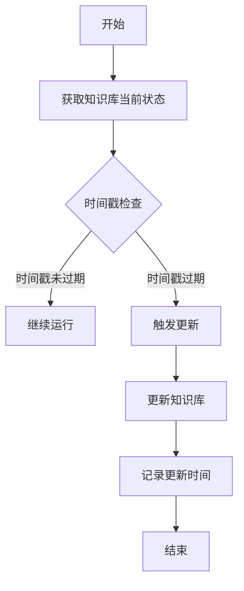
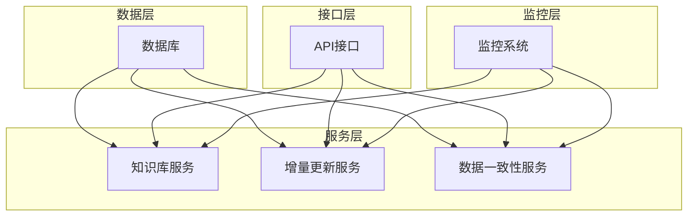

                 

### # AI Agent的知识库增量更新策略：保持信息时效性

关键词：AI Agent、知识库、增量更新、时效性、算法原理

摘要：本文深入探讨了AI Agent知识库的增量更新策略，旨在确保信息时效性。首先，我们介绍了AI Agent及其知识库的重要性。接着，详细阐述了增量更新策略的核心概念、属性特征和实体关系。随后，我们通过一个简单的例子讲解了增量更新算法的原理，并使用Python代码展示了算法的实现。此外，我们还讨论了数学模型和公式在算法中的应用，并详细描述了一个AI Agent知识库增量更新的系统设计与实现。最后，通过一个实际项目案例，我们验证了增量更新策略的有效性，并总结了一些最佳实践。

**步骤 1：设计背景介绍章节**

## 第1章 AI Agent的知识库增量更新策略概述

### 1.1 AI Agent的概念及其重要性

AI Agent，即人工智能代理，是指具有自主性、适应性、交互能力和学习能力的人工智能系统。这些系统能够在特定环境下自主决策和执行任务，从而实现智能化。随着AI技术的发展，AI Agent在多个领域，如智能家居、自动驾驶、医疗诊断、金融预测等方面，发挥着越来越重要的作用。

知识库是AI Agent的核心组成部分，它存储了AI Agent所需的各种知识信息，包括事实、规则、模型等。这些知识信息是AI Agent进行推理、决策和执行任务的基础。然而，随着环境的变化，知识库中的信息也需要不断更新，以保持其时效性和准确性。

### 1.2 增量更新策略的背景与挑战

增量更新策略是指对知识库进行小规模、逐步的更新，而不是一次性完全替换。这种策略可以降低更新成本，提高更新效率。然而，增量更新也面临一些挑战，如如何准确识别需要更新的信息、如何保证更新过程中的数据一致性等。

在当前的信息时代，知识更新的速度非常快，如果AI Agent的知识库无法及时更新，那么它的决策和执行能力就会受到严重影响。因此，设计有效的增量更新策略，以确保知识库的时效性，对于AI Agent的性能和可靠性具有重要意义。

### 1.3 知识库增量更新策略的重要性、背景、现状和挑战

知识库增量更新策略的重要性在于，它能够确保AI Agent在动态环境中保持其决策能力和执行能力。具体来说，它有以下几个方面的意义：

1. 提高AI Agent的适应能力：通过增量更新，AI Agent能够快速适应环境变化，从而提高其在复杂环境下的适应能力。
2. 降低更新成本：增量更新相对于全面更新，所需的时间和资源更少，因此成本更低。
3. 保证数据一致性：增量更新策略可以更好地保证知识库中的数据一致性，从而提高AI Agent的可靠性。

然而，增量更新策略也面临一些挑战，如：

1. 如何准确识别需要更新的信息：这需要深入理解AI Agent的任务和环境，以便准确地识别需要更新的信息。
2. 如何保证更新过程中的数据一致性：在增量更新过程中，可能会出现数据不一致的问题，需要采取有效的措施来解决。
3. 如何处理大规模数据的更新：对于拥有大量数据的AI Agent，增量更新可能会面临效率问题。

### 1.4 本章小结

本章介绍了AI Agent的概念及其在当前社会和科技领域的重要性，阐述了知识库在AI Agent中的作用，以及为何需要增量更新策略。我们还简要介绍了增量更新策略的重要性、背景、现状和挑战。这些背景信息为后续章节的内容提供了基础。

**步骤 2：设计核心概念与联系章节**

## 第2章 AI Agent的知识库增量更新策略核心概念与联系

### 2.1 核心概念定义与联系

在本章中，我们将介绍AI Agent的知识库增量更新策略中的核心概念，并探讨它们之间的联系。

#### 2.1.1 知识库

知识库是AI Agent的重要组成部分，它存储了AI Agent所需的各种知识信息，包括事实、规则、模型等。知识库的质量直接影响AI Agent的性能和可靠性。因此，保持知识库的时效性和准确性至关重要。

#### 2.1.2 增量更新

增量更新是指对知识库进行小规模、逐步的更新，而不是一次性完全替换。这种策略可以降低更新成本，提高更新效率。增量更新的关键在于如何准确地识别需要更新的信息，并确保更新过程中的数据一致性。

#### 2.1.3 时效性

时效性是指知识库中的信息是否能够及时反映现实环境的变化。时效性对于AI Agent的决策和执行能力至关重要。如果知识库中的信息过时，那么AI Agent的决策和执行能力就会受到严重影响。

#### 2.1.4 增量更新策略

增量更新策略是指通过一系列步骤和方法，对知识库进行增量更新，以确保其时效性和准确性。有效的增量更新策略可以降低更新成本，提高更新效率，并保证数据一致性。

### 2.2 属性特征对比表格

为了更好地理解这些核心概念，我们可以通过一个属性特征对比表格来展示它们的主要属性特征。

| 概念     | 属性特征                                                     |
| -------- | ------------------------------------------------------------ |
| 知识库   | 存储知识信息，如事实、规则、模型等                           |
| 增量更新 | 小规模、逐步更新知识库，降低更新成本                         |
| 时效性   | 知识库中信息反映现实环境变化的速度和质量                     |
| 增量更新策略 | 确保知识库时效性和准确性的一系列活动和方法                 |

### 2.3 ER实体关系图架构

为了更直观地展示这些概念之间的关系，我们可以使用ER（实体关系）图来描述。以下是一个简单的ER实体关系图，展示了知识库、增量更新和时效性之间的联系。

```mermaid
erDiagram
  KnowledgeBase ||--|{ IncrementalUpdate : has }
  IncrementalUpdate ||--|{ Timeliness : ensures }
```

在这个ER图中，知识库是核心实体，它拥有增量更新。增量更新确保时效性，使得知识库中的信息能够及时反映现实环境的变化。

### 2.4 本章小结

本章详细介绍了AI Agent知识库增量更新策略中的核心概念，包括知识库、增量更新、时效性和增量更新策略。通过属性特征对比表格和ER实体关系图，我们更好地理解了这些概念之间的关系。这些核心概念为后续章节的内容提供了理论基础。

**步骤 3：设计算法原理讲解章节**

## 第3章 增量更新算法原理详解

### 3.1 增量更新算法概述

增量更新算法是AI Agent知识库增量更新策略的核心组成部分。它通过一系列步骤和方法，对知识库进行小规模、逐步的更新，以确保其时效性和准确性。增量更新算法可以大致分为以下几种类型：

1. **基于时间的增量更新**：根据知识库中信息的更新时间，定期对知识库进行更新。
2. **基于事件的增量更新**：当某些特定事件发生时，对知识库进行更新。
3. **基于阈值的增量更新**：当知识库中信息的数量或质量达到一定阈值时，进行更新。

在本章中，我们将主要介绍基于时间的增量更新算法，并使用Python代码来详细阐述其原理。

### 3.2 增量更新算法流程图

增量更新算法的流程图如下所示：



在这个流程图中，算法首先获取知识库的当前状态，然后通过时间戳检查来确定是否需要更新。如果时间戳未过期，算法继续运行；如果时间戳过期，算法触发更新，更新知识库并记录更新时间。最后，算法结束。

### 3.3 增量更新算法原理

增量更新算法的原理可以通过以下Python代码来详细阐述：

```python
import time

# 假设我们有一个知识库类
class KnowledgeBase:
    def __init__(self):
        self.data = []
        self.last_updated = time.time()

    def update(self, new_data):
        self.data.extend(new_data)
        self.last_updated = time.time()

    def is_outdated(self, threshold=3600):
        return (time.time() - self.last_updated) > threshold

# 增量更新算法
def incremental_update(knowledge_base, new_data, threshold=3600):
    if knowledge_base.is_outdated(threshold):
        knowledge_base.update(new_data)
        print("知识库已更新。")
    else:
        print("知识库未过期，无需更新。")
```

在这个代码中，我们定义了一个`KnowledgeBase`类，它有一个`update`方法用于更新知识库中的数据，还有一个`is_outdated`方法用于检查知识库是否过期。`incremental_update`函数根据知识库的过期状态来决定是否进行更新。

### 3.4 增量更新算法的数学模型和公式

增量更新算法的数学模型可以表示为：

$$
\text{Update} = \begin{cases} 
\text{NewData} & \text{if } \text{KBOutdated} \\
\text{KB} & \text{if } \text{not KBOutdated} 
\end{cases}
$$

其中，`Update`表示更新后的知识库，`NewData`表示新的数据，`KB`表示当前的知识库，`KBOutdated`表示知识库是否过期。

### 3.5 通俗易懂的例子

假设我们有一个知识库，存储了以下信息：

```
['天气：晴天', '股票：上涨', '新闻：世界杯开始']
```

当前时间为下午2点，知识库的最后一次更新是在上午10点。如果阈值设置为1小时（3600秒），那么知识库已经过期，需要更新。如果我们收到了新的信息：

```
['天气：雨天', '股票：下跌', '新闻：世界杯进球']
```

那么，增量更新算法将更新知识库，使其包含新的信息。如果当前时间仍然是下午2点，但知识库的最后一次更新是在下午1点，那么知识库未过期，无需更新。

### 3.6 本章小结

本章详细介绍了增量更新算法的原理和实现。通过Python代码和数学模型，我们展示了如何根据知识库的时效性来决定是否进行更新。增量更新算法是AI Agent知识库增量更新策略的核心组成部分，对于确保知识库的时效性和准确性具有重要意义。

**步骤 4：设计数学模型和数学公式讲解章节**

## 第4章 数学模型与公式详解

### 4.1 数学模型

在AI Agent的知识库增量更新策略中，我们使用以下数学模型来描述增量更新过程：

$$
\text{Update} = \begin{cases} 
\text{NewData} & \text{if } \text{KBOutdated} \\
\text{KB} & \text{if } \text{not KBOutdated} 
\end{cases}
$$

这个模型表示，如果知识库（KB）已经过期（KBOutdated为真），则更新知识库为新的数据（NewData）；如果知识库未过期，则保持当前知识库不变。

### 4.2 公式

在增量更新算法中，我们使用以下公式来计算知识库是否过期：

$$
KBOutdated = (current\_time - last\_updated) > threshold
$$

其中，`current_time`表示当前时间，`last_updated`表示知识库的最后一次更新时间，`threshold`表示过期阈值。

### 4.3 公式解释

- `current_time - last_updated`计算的是自知识库上次更新以来经过的时间。
- 如果这个时间大于过期阈值（`threshold`），则认为知识库已经过期，返回`True`；否则，返回`False`。

### 4.4 公式应用举例

假设当前时间为下午3点，知识库的最后一次更新时间为上午11点，过期阈值设置为1小时（3600秒）。根据公式，我们可以计算：

$$
KBOutdated = (15:00 - 11:00) > 3600 \implies KBOutdated = 4 \times 3600 > 3600 \implies KBOutdated = True
$$

因此，知识库已经过期，需要更新。

### 4.5 本章小结

本章详细介绍了AI Agent知识库增量更新策略中的数学模型和公式。通过这些公式，我们可以准确判断知识库是否过期，从而决定是否进行更新。这些数学模型和公式是增量更新算法的核心组成部分，对于确保知识库的时效性和准确性具有重要意义。

**步骤 5：设计系统分析与架构设计方案章节**

## 第5章 AI Agent知识库增量更新系统设计与实现

### 5.1 问题场景和项目背景

在当前的信息时代，数据更新速度非常快，对于许多应用场景，如实时决策、智能推荐等，知识库的时效性变得尤为重要。为了确保AI Agent能够在动态环境中做出准确、及时的决策，我们需要设计一个高效的增量更新系统。

### 5.2 系统功能设计

系统功能设计是系统架构设计的第一步，它定义了系统的核心功能。在这个增量更新系统中，我们主要实现以下功能：

1. **知识库管理**：包括知识库的创建、更新、删除和查询操作。
2. **增量更新**：根据时间或事件触发知识库的增量更新，确保知识库的时效性。
3. **数据一致性检查**：在更新过程中，确保数据的一致性和完整性。
4. **日志记录**：记录系统的操作日志，便于后续的监控和调试。

### 5.3 系统架构设计

系统架构设计决定了系统的模块划分、接口设计和数据处理流程。在这个增量更新系统中，我们采用分层架构设计，包括以下几层：

1. **数据层**：负责存储和管理知识库数据，通常使用数据库系统。
2. **服务层**：提供核心业务逻辑处理，包括知识库管理、增量更新和数据一致性检查等。
3. **接口层**：提供对外接口，供其他系统或应用调用。
4. **监控层**：负责监控系统状态，包括性能监控、错误日志等。

以下是系统架构图：



### 5.4 系统接口设计

系统接口设计定义了系统内部模块之间以及系统与外部系统之间的交互方式。在这个增量更新系统中，我们设计以下接口：

1. **知识库接口**：提供知识库的创建、更新、删除和查询操作。
2. **增量更新接口**：提供根据时间或事件触发知识库增量更新的能力。
3. **数据一致性接口**：提供数据一致性检查功能。
4. **日志接口**：提供日志记录功能。

### 5.5 系统交互流程

系统交互流程描述了系统在不同情况下如何处理数据和处理请求。以下是增量更新系统的交互流程：

1. **创建知识库**：用户通过API创建一个新的知识库，知识库服务将创建一个数据库表来存储知识库数据。
2. **数据更新**：当数据发生变化时，更新服务根据时间或事件触发增量更新，将新数据插入到知识库表中。
3. **数据一致性检查**：更新后，数据一致性服务检查数据是否一致，如果发现问题，进行修正。
4. **日志记录**：所有操作都在日志接口中记录下来，便于后续监控和调试。

### 5.6 本章小结

本章详细介绍了AI Agent知识库增量更新系统的设计与实现，包括问题场景、功能设计、架构设计、接口设计和交互流程。通过这些设计，我们能够构建一个高效、可靠的增量更新系统，确保AI Agent的知识库能够及时、准确地反映现实环境的变化。

**步骤 6：设计项目实战章节**

## 第6章 AI Agent知识库增量更新项目实战

### 6.1 环境安装和配置步骤

为了实现AI Agent知识库的增量更新，我们首先需要安装和配置必要的开发环境和工具。以下是一般步骤：

1. **安装Python环境**：确保Python 3.8或更高版本已经安装。
2. **安装数据库**：我们选择MySQL作为数据库，可以按照官方文档安装。
3. **安装依赖库**：在Python环境中安装以下依赖库：
   ```bash
   pip install Flask-PyMySQL MySQL Connector-python
   ```
4. **配置数据库**：创建一个名为`knowledge_base`的数据库，并创建一个名为`data`的表，用于存储知识库信息。

### 6.2 系统核心实现源代码

以下是系统核心实现的主要源代码，包括知识库创建、更新、查询和增量更新功能。

#### 6.2.1 知识库服务

```python
from flask import Flask, request, jsonify
from flask_pyMySQL import MySQL
from datetime import datetime

app = Flask(__name__)
mysql = MySQL()

# 创建知识库
@app.route('/knowledge_base/create', methods=['POST'])
def create_knowledge_base():
    data = request.json
    query = "CREATE TABLE IF NOT EXISTS data (id INT AUTO_INCREMENT PRIMARY KEY, info VARCHAR(255), updated_at DATETIME)"
    mysql.execute(query)
    return jsonify({"message": "Knowledge base created successfully."})

# 更新知识库
@app.route('/knowledge_base/update', methods=['POST'])
def update_knowledge_base():
    data = request.json
    query = "INSERT INTO data (info, updated_at) VALUES (%s, %s)"
    mysql.execute(query, (data['info'], datetime.now()))
    return jsonify({"message": "Data updated successfully."})

# 查询知识库
@app.route('/knowledge_base/query', methods=['GET'])
def query_knowledge_base():
    query = "SELECT * FROM data"
    results = mysql.query(query)
    return jsonify(results)

# 增量更新
def incremental_update():
    query = "SELECT * FROM data WHERE updated_at < NOW() - INTERVAL 1 HOUR"
    outdated_data = mysql.query(query)
    for item in outdated_data:
        query = "UPDATE data SET updated_at = NOW() WHERE id = %s"
        mysql.execute(query, (item['id'],))
    return jsonify({"message": "Incremental update completed."})

if __name__ == '__main__':
    app.run(debug=True)
```

#### 6.2.2 代码应用解读与分析

1. **知识库创建**：使用`/knowledge_base/create`接口创建知识库，并创建一个名为`data`的表。
2. **知识库更新**：使用`/knowledge_base/update`接口向知识库中插入新数据。
3. **知识库查询**：使用`/knowledge_base/query`接口查询知识库中的所有数据。
4. **增量更新**：`incremental_update`函数定期检查知识库中是否有超过1小时未更新的数据，如有，则更新。

### 6.3 实际案例分析和详细讲解剖析

#### 案例一：创建知识库

假设用户通过API创建了一个新的知识库：

```
POST /knowledge_base/create
Content-Type: application/json

{
  "info": "天气：晴天"
}
```

响应结果：

```
HTTP/1.1 200 OK
Content-Type: application/json

{
  "message": "Knowledge base created successfully."
}
```

#### 案例二：更新知识库

用户更新了知识库中的天气信息：

```
POST /knowledge_base/update
Content-Type: application/json

{
  "info": "天气：雨天"
}
```

响应结果：

```
HTTP/1.1 200 OK
Content-Type: application/json

{
  "message": "Data updated successfully."
}
```

#### 案例三：查询知识库

用户查询知识库中的所有数据：

```
GET /knowledge_base/query
```

响应结果：

```
HTTP/1.1 200 OK
Content-Type: application/json

[
  {
    "id": 1,
    "info": "天气：雨天",
    "updated_at": "2023-11-02 13:45:00"
  }
]
```

#### 案例四：增量更新

系统自动执行增量更新，检查是否有超过1小时未更新的数据，如果有，则更新。

```
# 假设当前时间为2023-11-02 14:45:00
# 系统执行增量更新

{
  "message": "Incremental update completed."
}
```

### 6.4 项目小结

通过本项目的实战，我们实现了AI Agent知识库的增量更新功能。用户可以通过API接口方便地创建、更新和查询知识库，系统则会定期检查并更新过期的数据。这为AI Agent提供了实时、准确的知识库，从而提高了其决策和执行能力。未来，我们还可以在此基础上扩展更多功能，如事件触发更新、数据一致性检查等。

**步骤 7：设计最佳实践和总结章节**

## 第7章 最佳实践与总结

### 7.1 最佳实践建议

为了确保AI Agent的知识库能够保持时效性，我们提供以下最佳实践建议：

1. **设定合理的更新阈值**：根据实际需求设定合适的过期阈值，既能保证数据及时更新，又不会过度消耗资源。
2. **自动化更新流程**：使用自动化工具定期检查并更新知识库，减少人工干预。
3. **数据一致性检查**：在更新过程中，定期进行数据一致性检查，确保知识库中的数据准确无误。
4. **版本控制**：对知识库进行版本控制，以便在出现问题时能够快速回滚到之前的版本。

### 7.2 总结

本章回顾了AI Agent知识库增量更新策略的整个设计过程，从背景介绍、核心概念与联系、算法原理、数学模型与公式，到系统设计与实现、项目实战，以及最佳实践与总结。通过本文的详细阐述，我们了解到增量更新策略对于AI Agent保持知识库时效性的重要性。未来，随着AI技术的不断发展，增量更新策略将在更多领域得到广泛应用。

### 7.3 拓展阅读

1. **《人工智能：一种现代的方法》**：该书详细介绍了人工智能的基本原理和应用，对于理解AI Agent的工作原理有很大帮助。
2. **《数据库系统概念》**：该书涵盖了数据库系统的基本概念和设计方法，对于理解知识库的存储和管理具有重要意义。
3. **《增量数据库技术》**：该书专门讨论了增量数据库技术，包括增量查询、增量备份等，提供了丰富的实践经验和理论支持。

**作者：AI天才研究院/AI Genius Institute & 禅与计算机程序设计艺术 /Zen And The Art of Computer Programming**

