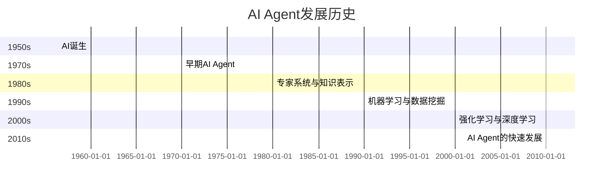

                 

### 第一部分：AI Agent的背景知识

#### 第1章：AI Agent的基础概念与类型

##### 1.1 AI Agent的定义与特征

**问题背景：** 在人工智能（AI）领域，AI Agent是一个重要的概念。它代表了一个能够感知环境、执行行动并从经验中学习的实体。了解AI Agent的定义和特征对于深入探讨其应用和实现至关重要。

**问题描述：** AI Agent是什么？它有哪些特征？

**问题解决：** AI Agent，即人工智能代理，是一个具有自主决策能力、能够与环境交互的实体。它具有以下几个主要特征：

1. **自主性**：AI Agent能够独立执行任务，不需要外部命令。
2. **适应性**：AI Agent能够根据环境变化调整其行为。
3. **学习能力**：AI Agent能够从经验中学习，提高其性能。
4. **社交性**：AI Agent能够与其他AI Agent或人类进行交互。

**边界与外延：** AI Agent不仅仅限于计算机程序，它可以是一个机器人、软件程序、甚至是智能设备。

**概念结构与核心要素组成：**

- **感知器**：用于感知环境的传感器。
- **控制器**：根据感知信息决定行动的模块。
- **执行器**：实施决策的物理设备。

**核心概念术语说明：** 自主性（Autonomy）、适应性（Adaptability）、学习能力（Learning）、社交性（Sociability）。

**核心概念与联系：**

| 特征       | 说明                                                         |
| ---------- | ------------------------------------------------------------ |
| 自主性     | 能够独立执行任务，不需要外部命令。                             |
| 适应性     | 能够根据环境变化调整其行为。                                  |
| 学习能力   | 能够从经验中学习，提高其性能。                                |
| 社交性     | 能够与其他AI Agent或人类进行交互。                             |

**ER实体关系图架构：**

```mermaid
erDiagram
  AI-Agent ||--|{ 感知器 :Sensor}
  AI-Agent ||--|{ 控制器 :Controller}
  AI-Agent ||--|{ 执行器 :Actuator}
```

##### 1.2 AI Agent的分类

**问题背景：** AI Agent的分类有助于我们理解不同类型的AI Agent及其应用场景。

**问题描述：** 如何分类AI Agent？

**问题解决：** AI Agent可以根据不同的标准进行分类，例如：

1. **基于学习方式**：监督学习Agent、无监督学习Agent、强化学习Agent。
2. **基于应用领域**：游戏Agent、机器人Agent、对话Agent。
3. **基于交互方式**：单任务Agent、多任务Agent、协同Agent。

**核心概念与联系：**

| 分类标准       | 类型举例         | 说明                                                         |
| -------------- | ---------------- | ------------------------------------------------------------ |
| 学习方式       | 监督学习Agent    | 能够从标记数据中学习。                                       |
|                | 无监督学习Agent  | 不需要标记数据，通过自我发现学习。                           |
|                | 强化学习Agent    | 通过与环境交互进行学习，基于奖励机制。                       |
| 应用领域       | 游戏Agent        | 在游戏环境中执行任务。                                      |
|                | 机器人Agent      | 在物理世界中执行任务。                                      |
|                | 对话Agent        | 在对话环境中执行任务。                                      |
| 交互方式       | 单任务Agent      | 专注于执行单一任务。                                       |
|                | 多任务Agent      | 能够同时执行多个任务。                                     |
|                | 协同Agent        | 能够与其他Agent协同工作。                                  |

**ER实体关系图架构：**

```mermaid
erDiagram
  监督学习Agent ||--|{ 数据集 :Dataset}
  无监督学习Agent ||--|{ 数据集 :Dataset}
  强化学习Agent ||--|{ 环境 :Environment}
  游戏Agent ||--|{ 游戏环境 :Game}
  机器人Agent ||--|{ 物理世界 :PhysicalWorld}
  对话Agent ||--|{ 对话环境 :Dialogue}
  单任务Agent ||--|{ 任务 :Task}
  多任务Agent ||--|{ 任务1 :Task1}, { 任务2 :Task2}
  协同Agent ||--|{ 合作伙伴 :Partner}
```

##### 1.3 AI Agent的发展历史

**问题背景：** AI Agent的发展历程反映了人工智能技术的演进，有助于我们了解当前技术的发展水平。

**问题描述：** AI Agent的发展历程是怎样的？

**问题解决：** AI Agent的发展可以追溯到20世纪50年代。以下是关键里程碑：

1. **1956年：**约翰·麦卡锡等人提出了“人工智能”这一术语。
2. **1970年代：**早期AI Agent主要基于逻辑推理和规则系统。
3. **1980年代：**专家系统和知识表示技术得到广泛应用。
4. **1990年代：**机器学习和数据挖掘技术开始应用于AI Agent。
5. **21世纪初：**强化学习、深度学习等技术推动了AI Agent的快速发展。

**时间线形式的历史概述：**



**核心概念与联系：**

| 年代      | 主要技术进步                   | 说明                                                         |
| --------- | ----------------------------- | ------------------------------------------------------------ |
| 1950s     | AI诞生                        | 提出了“人工智能”这一术语。                                   |
| 1970s     | 早期AI Agent                  | 基于逻辑推理和规则系统。                                     |
| 1980s     | 专家系统与知识表示            | 知识表示技术得到广泛应用。                                   |
| 1990s     | 机器学习与数据挖掘            | 机器学习和数据挖掘技术开始应用于AI Agent。                     |
| 2000s     | 强化学习与深度学习            | 强调学习、深度学习等技术推动了AI Agent的快速发展。           |
| 2010s     | AI Agent的快速发展            | AI Agent在各个领域的应用得到广泛推广。                         |

通过上述章节，我们为AI Agent的背景知识打下了坚实的基础。接下来，我们将深入探讨知识表示与推理机制，进一步理解AI Agent的核心功能。让我们在下一章节中继续我们的探索。

