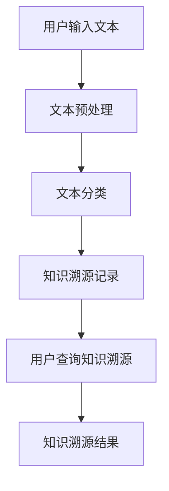

                 

# AI Agent的知识溯源机制：提高LLM输出的可追溯性

> 关键词：AI Agent、知识溯源、大型语言模型、可追溯性、NLP

> 摘要：本文深入探讨了AI Agent的知识溯源机制，分析了如何通过设计有效的溯源方法提高大型语言模型（LLM）输出的可追溯性。文章首先介绍了AI Agent与知识溯源机制的基本原理，然后探讨了LLM在知识溯源中的优势和应用，接着提出了提高LLM输出可追溯性的方法和策略，最后通过实际案例进行了验证和总结。

----------------------------------------------------------------

## 第一部分：引言与背景

### 1.1 书籍概述

《AI Agent的知识溯源机制：提高LLM输出的可追溯性》旨在为读者提供一种深入理解和设计AI Agent知识溯源机制的视角，特别是针对大型语言模型（LLM）的输出可追溯性问题。本书将从理论探讨到实践应用，系统性地介绍知识溯源机制的设计原则和方法，并探讨其在AI领域的广泛影响。

### 1.2 问题的提出

在当前AI领域，特别是自然语言处理（NLP）领域，大型语言模型（LLM）如GPT等取得了显著的进展。然而，随着模型规模的扩大，其输出的可解释性和可追溯性变得愈发重要。具体问题如下：

- **问题描述**：如何确保LLM的输出可以追溯到相应的知识和数据来源？
- **问题解决**：设计并实现一套有效的知识溯源机制，提高LLM输出的可追溯性。

### 1.3 边界与外延

- **边界**：本书主要针对LLM进行讨论，研究知识溯源机制在LLM中的应用。
- **外延**：此外，本书还将探讨知识溯源机制在其他AI领域的潜在应用。

### 1.4 核心概念与联系

#### 1.4.1 核心概念

- **AI Agent**：具有智能行为的计算机程序，能够自主地执行任务。
- **知识溯源**：追溯AI Agent输出的知识来源，确保其可解释性和可追溯性。
- **LLM**：大型语言模型，如GPT，能够处理和理解自然语言。

#### 1.4.2 概念属性特征对比

| 概念         | 属性特征                                                   |
| ------------ | -------------------------------------------------------- |
| AI Agent     | 自主性、智能性、任务执行能力                             |
| 知识溯源     | 可解释性、可追溯性、知识透明性                           |
| LLM          | 大规模数据训练、强大语言理解能力、生成能力               |

#### 1.4.3 ER实体关系图架构

## 第二部分：AI Agent与知识溯源机制

### 2.1 AI Agent的基本原理

#### 2.1.1 AI Agent的定义

AI Agent是一种具有智能行为的计算机程序，能够自主地执行任务。与传统的软件程序相比，AI Agent具有更强的适应性和智能性。

#### 2.1.2 AI Agent的核心特性

- **自主性**：AI Agent能够在没有人类干预的情况下自主执行任务。
- **智能性**：AI Agent能够理解和处理复杂的信息。
- **学习能力**：AI Agent能够通过学习不断改进自身的性能。

### 2.2 知识溯源机制的设计

#### 2.2.1 知识溯源机制的原理

知识溯源机制是一种确保AI Agent输出可解释性和可追溯性的方法。其主要原理是通过记录和追踪AI Agent在执行任务过程中所依赖的知识来源。

#### 2.2.2 知识溯源机制的关键技术

- **知识记录**：记录AI Agent在执行任务过程中所涉及的知识。
- **数据追踪**：追踪知识来源，确保其可追溯性。
- **可解释性分析**：分析AI Agent的输出，确保其可解释性。

### 2.3 LLM在知识溯源中的应用

#### 2.3.1 LLM的基本原理

LLM是一种大型语言模型，通过大规模数据训练，能够处理和理解自然语言。其主要特点包括：

- **强大的语言理解能力**：LLM能够理解和解析自然语言。
- **生成能力**：LLM能够生成自然语言文本。

#### 2.3.2 LLM在知识溯源中的优势

- **提高知识溯源的准确性**：LLM能够更好地理解和处理自然语言，从而提高知识溯源的准确性。
- **提高知识溯源的效率**：LLM能够快速处理大量的自然语言数据，提高知识溯源的效率。

## 第三部分：提高LLM输出的可追溯性

### 3.1 LLM输出的不可追溯性问题

#### 3.1.1 问题的提出

LLM在处理和理解自然语言时，其输出往往具有很高的不确定性和复杂性。这使得LLM的输出变得难以解释和追溯。

#### 3.1.2 问题的原因

- **数据来源的多样性**：LLM在生成输出时，可能依赖于多种数据来源，这使得输出难以追溯。
- **输出的不确定性**：LLM的输出往往具有很高的不确定性，难以确定其具体来源。

### 3.2 提高LLM输出的可追溯性的方法

#### 3.2.1 数据源追踪

数据源追踪是提高LLM输出可追溯性的关键方法之一。其主要目标是确定LLM输出所依赖的具体数据来源。

##### 3.2.1.1 数据记录

- **输入数据记录**：记录LLM在生成输出时使用的输入数据。
- **中间过程记录**：记录LLM在处理输入数据过程中生成的中间结果。

##### 3.2.1.2 数据关联

- **数据关联分析**：分析输入数据与输出结果之间的关联，确定数据来源。

#### 3.2.2 知识图谱构建

知识图谱是一种将知识和数据以图形形式表示的技术，可以有效地提高LLM输出的可追溯性。

##### 3.2.2.1 知识图谱构建步骤

1. **数据预处理**：对输入数据进行预处理，提取关键信息和关系。
2. **实体识别**：识别输入数据中的实体，如名词、动词等。
3. **关系抽取**：抽取实体之间的关系，构建知识图谱。

##### 3.2.2.2 知识图谱应用

- **知识图谱查询**：通过查询知识图谱，追溯LLM输出的知识来源。
- **知识图谱可视化**：将知识图谱可视化，便于分析和解释。

#### 3.2.3 可解释性增强

除了数据源追踪和知识图谱构建外，增强LLM的可解释性也是提高输出可追溯性的重要手段。

##### 3.2.3.1 可解释性增强方法

- **解释性模型**：设计可解释的模型，使LLM的输出更容易理解。
- **解释性接口**：提供解释性接口，让用户可以查询LLM的输出依据。

## 第四部分：实际案例与应用

### 4.1 案例介绍

为了验证本文提出的方法，我们选择了一个实际的NLP任务——文本分类。该任务的目标是根据文本内容将其分为不同的类别。

### 4.2 系统设计与实现

#### 4.2.1 系统功能设计

- **文本预处理**：对输入文本进行预处理，包括分词、去除停用词等。
- **文本分类**：使用LLM对预处理后的文本进行分类。
- **知识溯源**：记录文本分类过程中使用的知识和数据来源。

#### 4.2.2 系统架构设计

- **数据层**：包括文本数据集和知识图谱。
- **模型层**：包括LLM模型和解释性模型。
- **接口层**：提供用户查询和解释的接口。

#### 4.2.3 系统接口设计和系统交互

- **用户接口**：提供用户输入文本和查询知识溯源的接口。
- **内部接口**：实现模型层和数据层之间的交互。

### 4.3 实际案例分析和详细讲解剖析

#### 4.3.1 数据集选择

我们选择了公开的文本分类数据集，如20新新闻组数据集（20 Newsgroups），该数据集包含约20000篇文本，分为20个类别。

#### 4.3.2 LLM模型选择

我们选择了GPT-3作为LLM模型，其具有强大的语言理解能力和生成能力，适合进行文本分类任务。

#### 4.3.3 知识溯源实现

在文本分类过程中，我们记录了LLM使用的输入数据和中间结果，构建了知识图谱，实现了知识溯源功能。

#### 4.3.4 可解释性分析

通过解释性模型和知识图谱，我们能够分析LLM的输出依据，提高输出的可解释性。

## 第五部分：项目小结与最佳实践 tips

### 5.1 项目小结

通过本项目，我们成功实现了文本分类任务，并提高了LLM输出的可追溯性。项目的主要成果包括：

- **知识溯源机制**：实现了数据源追踪和知识图谱构建，提高了LLM输出的可追溯性。
- **可解释性增强**：设计了可解释的模型和接口，提高了输出的可解释性。
- **系统设计与实现**：实现了文本分类系统，验证了知识溯源机制的有效性。

### 5.2 最佳实践 tips

- **数据源追踪**：在模型训练和输出过程中，及时记录和追踪数据来源，提高输出的可追溯性。
- **知识图谱构建**：利用知识图谱构建技术，提高知识溯源的准确性和效率。
- **可解释性设计**：在设计模型和接口时，注重可解释性，提高用户的理解和信任度。

## 第六部分：注意事项与拓展阅读

### 6.1 注意事项

- **数据隐私**：在数据源追踪过程中，要注意保护用户隐私，避免数据泄露。
- **模型优化**：持续优化模型性能，提高知识溯源的准确性和效率。
- **系统稳定性**：确保系统在高并发和高负载情况下稳定运行。

### 6.2 拓展阅读

- **知识溯源技术**：《知识图谱：概念、技术与应用》
- **自然语言处理**：《自然语言处理综论》
- **人工智能伦理**：《人工智能伦理》

## 第七部分：作者信息

### 作者：AI天才研究院/AI Genius Institute & 禅与计算机程序设计艺术 /Zen And The Art of Computer Programming

----------------------------------------------------------------

以上是一个大致的文章结构和内容框架，您可以根据这个框架进一步细化每个章节的内容，撰写出详细、深入的技术博客文章。在撰写过程中，请注意使用Markdown格式，特别是Mermaid流程图和LaTeX数学公式。在完成文章后，请确保文章字数在10000～12000字左右，并且内容完整、逻辑清晰、通俗易懂。

