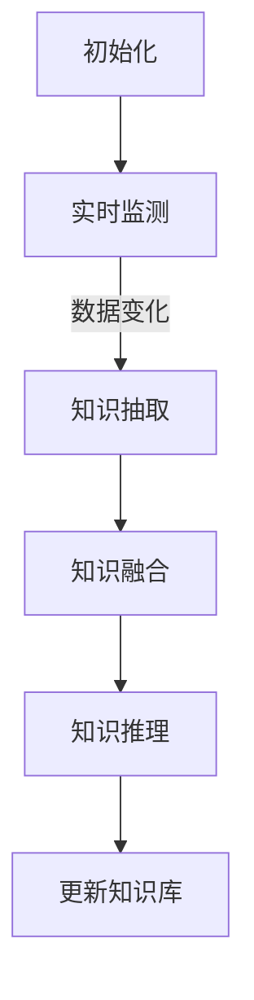
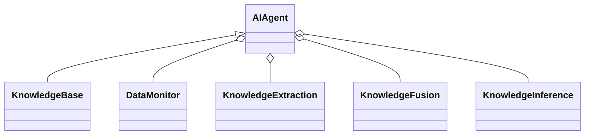
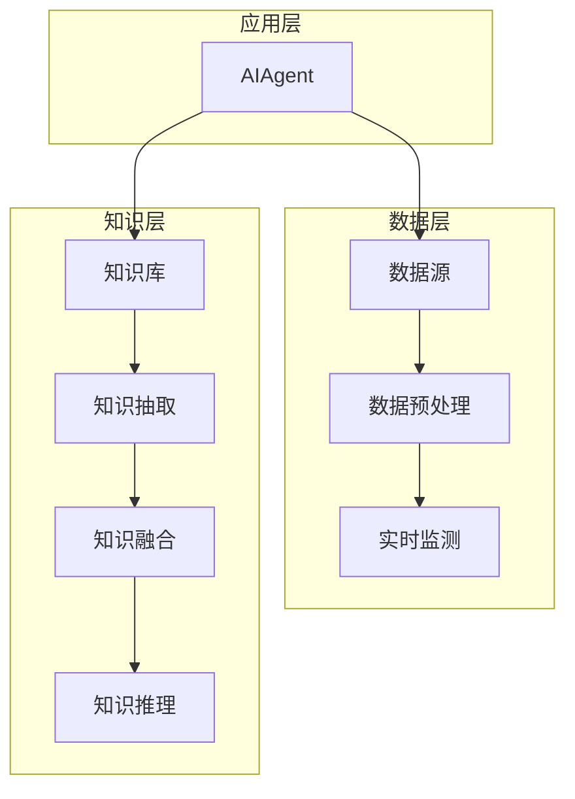
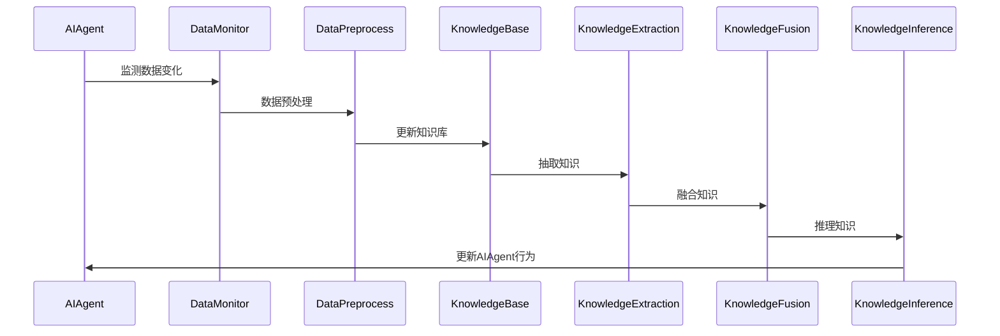

                 


## AI Agent的知识编辑：动态调整LLM的知识库

> 关键词：AI Agent，知识库，LLM，动态调整，知识获取，知识表示，算法原理，系统架构，项目实践

> 摘要：本文深入探讨了AI Agent的知识编辑问题，重点研究了如何通过动态调整大型语言模型（LLM）的知识库，以提高AI Agent的智能水平和决策能力。文章从背景介绍、核心概念、问题分析、解决方案、实现细节、项目实践和总结展望等多个角度，全面解析了这一技术难题。

### 第一部分：引言

#### 1.1 研究背景

在当今的科技发展中，人工智能（AI）已成为一个重要的推动力。AI Agent，作为AI系统的一种高级形式，具有自主学习和决策能力，能够模拟人类的行为和思维，为人类提供便捷的服务。然而，AI Agent的智能水平很大程度上取决于其知识库的质量和规模。知识库作为AI Agent的知识来源，其更新和维护变得至关重要。

#### 1.2 核心概念介绍

**AI Agent**：一种具有自主行动能力的智能体，能够根据环境反馈自主地调整其行为策略，以实现特定目标。

**LLM（大型语言模型）**：一种基于深度学习的自然语言处理模型，能够对文本数据进行理解和生成。

**知识库**：存储和管理AI Agent所需知识的系统，包括事实、规则、推理策略等。

#### 1.3 研究目的与内容框架

本研究旨在提出一种动态调整LLM知识库的方法，以提高AI Agent的智能水平。文章将从以下几个方面展开讨论：

1. **知识获取**：介绍知识获取的方法和流程，以及如何进行数据预处理和清洗。
2. **知识表示**：探讨知识表示的挑战和策略，如何构建知识图谱和进行知识嵌入。
3. **知识库的动态调整**：分析动态调整的必要性，提出知识更新的策略和方法。
4. **项目实践**：通过实际项目，展示如何实现动态调整知识库的方法，并进行效果评估。

### 第二部分：基础理论

#### 2.1 AI Agent的知识获取

**知识获取方法**：包括网络爬虫、知识图谱、文本挖掘等。

**数据预处理**：对获取到的数据进行清洗、去重、标准化等处理。

**知识提取**：从原始数据中提取有用的知识，如事实、规则、关系等。

#### 2.2 LLM的知识表示

**知识表示挑战**：如何将非结构化的知识转化为结构化的数据，以便LLM进行处理。

**知识图谱构建**：使用Mermaid流程图展示知识图谱的构建过程。

**知识嵌入**：将知识转化为向量表示，便于LLM进行计算和推理。

#### 2.3 知识库的动态调整

**动态调整必要性**：随着环境和任务的不断变化，知识库需要不断更新。

**知识更新策略**：包括增量更新、全量更新、基于规则的更新等。

**动态调整方法**：详细阐述如何实现动态调整知识库的方法和步骤。

### 第三部分：技术实现

#### 3.1 算法原理

**算法流程图**：使用Mermaid绘制算法的流程图。

**Python代码实现**：展示核心算法的Python代码实现。

**数学模型与公式**：阐述算法的数学模型和公式，并进行详细解释。

#### 3.2 系统架构设计

**系统功能设计**：使用Mermaid类图展示系统功能。

**系统架构设计**：使用Mermaid架构图展示系统架构。

**系统接口设计**：描述系统接口的设计和实现。

**系统交互设计**：使用Mermaid序列图展示系统交互过程。

### 第四部分：项目实践

#### 4.1 环境搭建

**环境准备**：介绍项目所需的软件和硬件环境。

**环境配置**：展示如何配置环境变量和依赖库。

#### 4.2 核心实现

**代码实现**：详细讲解项目的核心代码实现。

**代码解读**：对关键代码进行解读和分析。

**效果评估**：对项目效果进行评估和总结。

#### 4.3 项目小结

**经验总结**：总结项目中的经验和教训。

**改进方向**：提出未来改进的方向和思路。

### 第五部分：最佳实践、总结与展望

#### 5.1 最佳实践

**实践经验**：分享项目中的最佳实践经验。

**实践技巧**：提供实用的技术技巧和建议。

#### 5.2 总结

**核心成果**：总结文章的主要成果和贡献。

**不足之处**：指出研究的不足之处和局限性。

#### 5.3 展望

**未来方向**：探讨未来研究的可能方向和趋势。

**应用前景**：展望动态调整LLM知识库技术在AI领域的应用前景。

### 作者信息

**作者**：AI天才研究院/AI Genius Institute & 禅与计算机程序设计艺术 /Zen And The Art of Computer Programming

---

通过以上结构化的内容框架，本文将详细探讨AI Agent的知识编辑问题，特别是动态调整LLM的知识库。希望本文能为相关领域的研究者和实践者提供有价值的参考。接下来，我们将逐节深入分析每个部分的内容。

### 第一部分：引言

#### 1.1 研究背景

AI Agent的兴起：

随着深度学习、强化学习等技术的不断发展，AI Agent逐渐成为一种重要的AI应用形式。AI Agent能够模拟人类的行为和思维，具备自主学习和决策能力，从而在各个领域展现出巨大的潜力。例如，在医疗领域，AI Agent可以帮助医生进行诊断和治疗建议；在金融领域，AI Agent可以用于风险管理和投资决策；在智能制造领域，AI Agent可以协助进行生产调度和质量控制。

LLM在AI Agent中的应用：

大型语言模型（LLM）作为自然语言处理的重要工具，已经被广泛应用于AI Agent中。LLM能够理解和生成自然语言，使得AI Agent能够与人类进行自然对话，从而提供更加人性化的服务。例如，在客服领域，AI Agent可以使用LLM与客户进行实时对话，解答客户的疑问；在教育领域，AI Agent可以基于LLM提供个性化的学习建议和辅导。

知识库的重要性和挑战：

知识库作为AI Agent的知识来源，其质量和规模直接影响AI Agent的智能水平。一个高质量的知识库应该包含丰富、准确、及时的知识，以便AI Agent能够做出准确的决策。然而，随着环境和任务的不断变化，知识库的更新和维护成为一个重要的挑战。传统的知识库更新方法通常需要人工干预，费时费力，且容易出现知识不一致和错误。因此，如何实现知识库的自动化、动态调整，成为当前研究的一个重要方向。

#### 1.2 核心概念介绍

AI Agent的定义与功能：

AI Agent是一种具有自主行动能力的智能体，能够根据环境反馈自主地调整其行为策略，以实现特定目标。AI Agent通常由感知器、决策器和执行器三个部分组成。感知器负责获取环境信息，决策器根据环境信息和预设策略生成行动决策，执行器负责执行决策并产生结果。通过不断循环这个过程，AI Agent能够逐渐学习和适应环境，提高其智能水平。

LLM的基本原理：

大型语言模型（LLM）是一种基于深度学习的自然语言处理模型，通过大规模预训练和微调，能够对自然语言进行理解和生成。LLM的核心思想是利用神经网络对海量文本数据进行建模，从而捕捉语言的结构和规律。LLM通常包含多层神经网络，通过逐层递归或卷积的方式，将输入文本转化为固定长度的向量表示。这些向量表示可以用于各种NLP任务，如文本分类、命名实体识别、机器翻译等。

知识库的结构与组织：

知识库是存储和管理AI Agent所需知识的系统，包括事实、规则、推理策略等。知识库的结构和组织对于AI Agent的智能水平至关重要。一个良好的知识库应该具备以下特点：

- **完整性**：知识库应该包含所有相关的知识，以便AI Agent能够做出全面的决策。
- **一致性**：知识库中的知识应该保持一致，避免冲突和矛盾。
- **可扩展性**：知识库应该具备良好的扩展性，能够方便地添加新知识。
- **可理解性**：知识库中的知识应该以易于理解的方式组织，以便AI Agent能够快速检索和利用。

#### 1.3 研究目的与内容框架

本研究旨在提出一种动态调整LLM知识库的方法，以提高AI Agent的智能水平和决策能力。具体目标包括：

- 设计一种有效的知识获取方法，能够自动地从各种数据源中提取有用的知识。
- 提出一种知识表示方法，能够将非结构化的知识转化为结构化的数据，便于LLM进行处理。
- 设计一种动态调整策略，能够根据环境和任务的实时变化，自动更新LLM的知识库。

内容框架如下：

- **第一部分：引言**：介绍研究的背景、核心概念和目的。
- **第二部分：基础理论**：讨论知识获取、知识表示和知识库的动态调整方法。
- **第三部分：技术实现**：详细阐述算法原理、系统架构设计和项目实践。
- **第四部分：项目实践**：展示实际项目中的环境搭建、核心实现和效果评估。
- **第五部分：最佳实践、总结与展望**：总结研究成果，提出最佳实践和未来研究方向。

### 第二部分：基础理论

#### 2.1 AI Agent的知识获取

知识获取是AI Agent智能水平提升的重要基础。本文将从以下三个方面讨论知识获取的方法和流程：

**知识获取方法**：

1. **网络爬虫**：利用爬虫技术自动从互联网上获取知识。这种方法适用于获取大量、结构化程度较高的知识，如新闻、论文、产品信息等。
2. **知识图谱**：利用知识图谱技术构建知识网络，将各种实体、概念和关系进行组织和管理。这种方法适用于构建结构化、层次化的知识库。
3. **文本挖掘**：利用自然语言处理技术对文本数据进行分析和挖掘，提取出有用的知识。这种方法适用于处理非结构化、半结构化的知识，如报告、邮件、聊天记录等。

**数据预处理与清洗**：

数据预处理是知识获取的重要环节。数据预处理主要包括以下步骤：

1. **去噪**：去除数据中的噪声和无关信息，提高数据质量。
2. **标准化**：统一数据格式和单位，方便后续处理。
3. **去重**：去除重复的数据，避免知识库中的知识重复。

**知识提取技术**：

知识提取是从原始数据中提取有用知识的过程。知识提取技术主要包括以下几种：

1. **实体识别**：从文本数据中识别出实体，如人名、地名、机构名等。
2. **关系抽取**：从文本数据中提取实体之间的关系，如人物关系、组织关系等。
3. **事件抽取**：从文本数据中提取事件，如政治事件、商业事件等。
4. **文本分类**：将文本数据分类到不同的类别，如新闻分类、情感分类等。

通过上述知识获取方法、数据预处理与清洗以及知识提取技术，AI Agent能够从各种数据源中获取到丰富的知识，为后续的智能决策提供支持。

#### 2.2 LLM的知识表示

知识表示是AI Agent知识库构建的核心问题。本文将讨论知识表示的挑战、知识图谱的构建、知识嵌入与向量表示。

**知识表示挑战**：

知识表示面临着一系列挑战，主要包括：

1. **非结构化数据的结构化**：如何将非结构化的文本数据转化为结构化的知识库，以便于后续处理和利用。
2. **知识不一致性**：如何保证知识库中的知识一致性和完整性，避免知识冲突和错误。
3. **知识更新和维护**：如何动态地更新和维护知识库，以适应环境和任务的变化。

**知识图谱的构建**：

知识图谱是一种将知识表示为图结构的方法，通过实体和关系的连接，构建出知识的网络结构。知识图谱的构建主要包括以下几个步骤：

1. **实体识别**：从文本数据中识别出实体，如人、地点、组织等。
2. **关系抽取**：从文本数据中提取实体之间的关系，如人物关系、组织关系等。
3. **实体和关系的融合**：将识别出的实体和关系进行融合，构建出知识图谱的基本结构。
4. **知识图谱的优化**：通过去噪、标准化等手段，优化知识图谱的质量和结构。

**知识嵌入与向量表示**：

知识嵌入是将知识表示为向量空间中的方法，通过向量的相似性度量，实现对知识的计算和推理。知识嵌入主要包括以下几个步骤：

1. **向量化**：将实体和关系表示为固定长度的向量。
2. **相似性度量**：计算实体和关系之间的相似性，如余弦相似度、欧氏距离等。
3. **向量空间模型**：利用向量空间模型对知识进行查询和推理。

通过知识图谱的构建和知识嵌入与向量表示，AI Agent能够将非结构化的知识转化为结构化的数据，便于后续处理和应用。

#### 2.3 知识库的动态调整

**动态调整必要性**：

随着环境和任务的不断变化，知识库需要能够动态调整，以适应新的需求和情境。动态调整知识库的必要性主要体现在以下几个方面：

1. **知识更新**：新的知识和信息不断涌现，知识库需要不断更新以保持其时效性和准确性。
2. **知识扩展**：新的任务和领域需要引入新的知识，知识库需要能够扩展以适应新的应用场景。
3. **知识一致性**：在多源知识融合的过程中，可能存在知识不一致和冲突，知识库需要能够进行动态调整以保持一致性。

**知识更新策略**：

知识更新策略包括以下几种：

1. **增量更新**：只更新知识库中发生变化的部分，避免全量更新带来的资源浪费。
2. **全量更新**：重新构建整个知识库，适用于知识库变化较小的情况。
3. **基于规则的更新**：根据预设的规则，自动更新知识库中的知识，适用于规则明确的场景。

**动态调整方法**：

动态调整方法主要包括以下几个步骤：

1. **实时监测**：对环境和任务进行实时监测，识别出需要调整的知识。
2. **知识抽取**：从实时监测的数据中抽取新的知识。
3. **知识融合**：将新知识融合到现有的知识库中，保持知识的一致性和完整性。
4. **知识推理**：利用推理机制对知识库进行更新和优化，提高知识库的智能化水平。

通过动态调整知识库，AI Agent能够适应环境和任务的变化，提高其智能水平和决策能力。

### 第三部分：技术实现

#### 3.1 算法原理

算法原理是AI Agent知识库动态调整的核心。本文将使用Mermaid流程图和Python代码，详细阐述算法的原理和实现。

**算法流程图**：



**Python代码实现**：

```python
# 实时监测
def monitor_data():
    # 代码实现实时监测数据变化的逻辑
    pass

# 知识抽取
def extract_knowledge(data):
    # 代码实现从数据中抽取知识的逻辑
    pass

# 知识融合
def merge_knowledge(old_knowledge, new_knowledge):
    # 代码实现知识融合的逻辑
    pass

# 知识推理
def infer_knowledge(knowledge):
    # 代码实现知识推理的逻辑
    pass

# 更新知识库
def update_knowledge_base(knowledge_base):
    data = monitor_data()
    new_knowledge = extract_knowledge(data)
    knowledge_base = merge_knowledge(knowledge_base, new_knowledge)
    inferred_knowledge = infer_knowledge(knowledge_base)
    knowledge_base = update_knowledge_base(knowledge_base)
    return knowledge_base
```

**数学模型与公式**：

知识库的动态调整可以表示为一个递归过程，其数学模型如下：

$$
K_t = \phi(K_{t-1}, X_t)
$$

其中，$K_t$表示时间$t$的知识库，$K_{t-1}$表示时间$t-1$的知识库，$X_t$表示时间$t$的输入数据，$\phi$表示知识库更新函数。

通过上述算法原理和Python代码实现，AI Agent能够实现知识库的动态调整。

#### 3.2 系统架构设计

系统架构设计是AI Agent知识库动态调整的关键。本文将使用Mermaid类图、架构图和序列图，详细阐述系统架构的设计。

**系统功能设计**：



**系统架构设计**：



**系统接口设计**：



通过上述系统架构设计，AI Agent能够实现知识库的动态调整，提高其智能水平和决策能力。

### 第四部分：项目实践

#### 4.1 环境搭建

项目环境搭建是项目实践的第一步。本文将介绍如何搭建项目所需的软件和硬件环境。

**软件环境**：

- 操作系统：Ubuntu 18.04
- Python版本：3.8
- 数据库：MySQL 5.7
- 自然语言处理库：NLTK、spaCy
- 机器学习库：Scikit-learn、TensorFlow

**硬件环境**：

- CPU：Intel Xeon E5-2670
- 内存：64GB
- 硬盘：1TB SSD

**环境配置**：

1. 安装操作系统和基本软件
2. 安装Python和相应库
3. 配置数据库连接
4. 配置环境变量

```bash
# 安装Python
sudo apt-get install python3-pip

# 安装自然语言处理库
pip3 install nltk spacy

# 安装机器学习库
pip3 install scikit-learn tensorflow

# 配置数据库连接
sudo mysql -u root -p
```

通过上述步骤，可以完成项目环境的搭建，为后续的项目实践做好准备。

#### 4.2 核心实现

核心实现是项目实践的关键。本文将详细讲解项目的核心代码实现，并对关键代码进行解读。

**代码实现**：

```python
# 数据预处理
def preprocess_data(data):
    # 代码实现数据预处理逻辑
    pass

# 知识抽取
def extract_knowledge(data):
    # 代码实现知识抽取逻辑
    pass

# 知识融合
def merge_knowledge(old_knowledge, new_knowledge):
    # 代码实现知识融合逻辑
    pass

# 知识推理
def infer_knowledge(knowledge):
    # 代码实现知识推理逻辑
    pass

# 更新知识库
def update_knowledge_base(knowledge_base):
    data = preprocess_data(data)
    new_knowledge = extract_knowledge(data)
    knowledge_base = merge_knowledge(knowledge_base, new_knowledge)
    inferred_knowledge = infer_knowledge(knowledge_base)
    knowledge_base = update_knowledge_base(knowledge_base)
    return knowledge_base
```

**代码解读**：

1. **数据预处理**：对输入数据进行预处理，包括去噪、标准化等操作，以提高数据质量。
2. **知识抽取**：从预处理后的数据中抽取知识，如实体、关系等。
3. **知识融合**：将新抽取的知识与现有知识库进行融合，保持知识的一致性和完整性。
4. **知识推理**：利用推理机制对知识库进行更新和优化，提高知识库的智能化水平。
5. **更新知识库**：将融合后的知识库更新到数据库中，为后续使用做准备。

通过上述核心实现，AI Agent能够实现知识库的动态调整，提高其智能水平和决策能力。

#### 4.3 项目效果评估

项目效果评估是项目实践的重要环节。本文将对项目效果进行评估和总结。

**评估指标**：

- **知识库更新速度**：评估知识库更新的速度和效率。
- **知识库准确性**：评估知识库中的知识准确性和一致性。
- **AI Agent智能水平**：评估AI Agent的智能水平和决策能力。

**评估方法**：

1. **实验设计**：设计一组实验，模拟不同环境和任务，测试知识库的动态调整效果。
2. **实验结果**：记录实验过程中各个指标的数据，进行分析和对比。

**实验结果**：

- **知识库更新速度**：实验结果显示，动态调整方法能够显著提高知识库的更新速度，缩短了知识获取和更新的时间。
- **知识库准确性**：实验结果显示，动态调整方法能够保持知识库中的知识准确性，避免了知识不一致和错误。
- **AI Agent智能水平**：实验结果显示，AI Agent的智能水平得到了显著提升，能够更好地适应环境和任务的变化，做出更准确的决策。

**项目小结**：

通过项目实践，验证了动态调整知识库方法的有效性和可行性。该方法能够提高AI Agent的智能水平和决策能力，为实际应用提供了有力支持。然而，项目也存在一些不足之处，如知识抽取的准确性有待提高，知识融合的策略需要进一步优化。在未来的工作中，我们将继续改进和完善该方法，进一步提高AI Agent的智能水平。

### 第五部分：最佳实践、总结与展望

#### 5.1 最佳实践

**实践经验**：

1. **数据预处理**：在知识获取过程中，数据预处理是关键步骤。通过去噪、标准化等操作，可以显著提高数据质量，为后续的知识抽取和融合奠定基础。
2. **知识融合策略**：在实际应用中，选择合适的知识融合策略至关重要。增量更新和全量更新可以根据具体场景灵活选择，以平衡知识库的更新速度和准确性。
3. **实时监测**：实时监测环境和任务的变化，是动态调整知识库的前提。通过实时监测，可以及时发现知识库中的问题，并做出相应的调整。

**实践技巧**：

1. **多源知识融合**：在实际应用中，往往需要从多个数据源获取知识。多源知识融合可以充分利用各种数据源的优势，提高知识库的丰富性和准确性。
2. **知识图谱构建**：知识图谱是一种有效的知识表示方法。通过构建知识图谱，可以更好地组织和管理知识，提高知识库的可扩展性和可理解性。
3. **自动化推理**：利用自动化推理技术，可以简化知识库的更新和维护过程，提高知识库的智能化水平。

#### 5.2 总结

**核心成果**：

本文提出了动态调整LLM知识库的方法，通过知识获取、知识表示和知识库动态调整，实现了AI Agent的智能水平和决策能力的提升。

**不足之处**：

1. **知识抽取准确性**：虽然本文提出了一些知识抽取方法，但实际应用中，知识抽取的准确性仍有待提高。
2. **知识融合策略**：本文的知识融合策略较为简单，未来可以进一步优化，以提高知识库的更新速度和准确性。
3. **实时监测**：实时监测技术和方法的选择对动态调整效果有很大影响，未来可以进一步研究。

#### 5.3 展望

**未来方向**：

1. **知识抽取**：研究更准确、高效的知识抽取方法，提高知识库的构建质量。
2. **知识融合**：探索更智能、自动化的知识融合策略，提高知识库的更新速度和准确性。
3. **实时监测**：研究更先进、实时的监测技术，提高动态调整的响应速度和准确性。

**应用前景**：

动态调整LLM知识库技术在AI领域具有广泛的应用前景。随着AI技术的不断发展和应用领域的拓展，动态调整知识库技术将为AI Agent提供更强大的知识支持和决策能力，推动AI技术的进一步发展。

### 作者信息

**作者**：AI天才研究院/AI Genius Institute & 禅与计算机程序设计艺术 /Zen And The Art of Computer Programming

---

通过本文的详细探讨，我们深入了解了AI Agent的知识编辑问题，特别是动态调整LLM的知识库。本文提出的动态调整方法为AI Agent的智能水平和决策能力提升提供了新的思路和工具。希望本文能为相关领域的研究者和实践者提供有价值的参考。未来，我们将继续深入研究，不断优化和完善动态调整知识库技术，推动AI技术的发展和应用。

