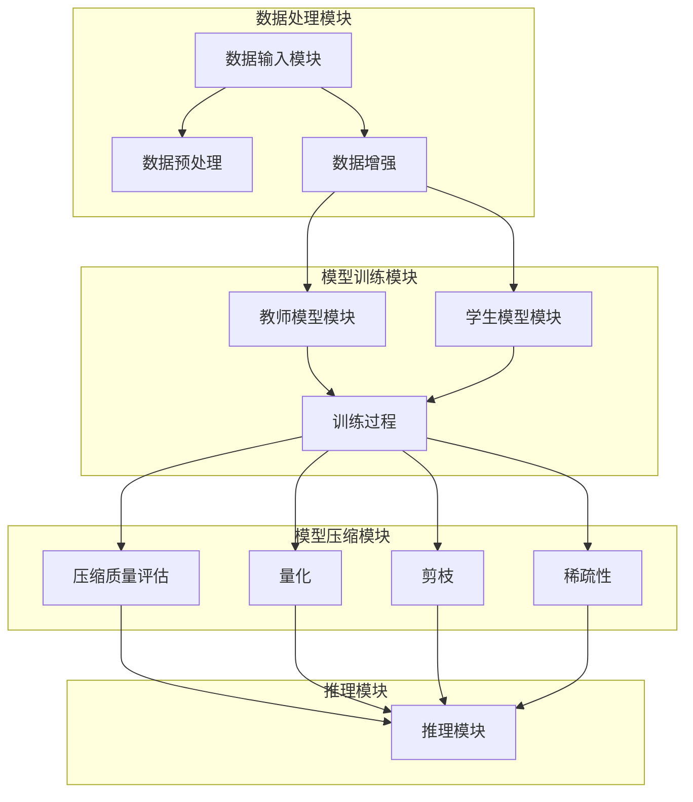
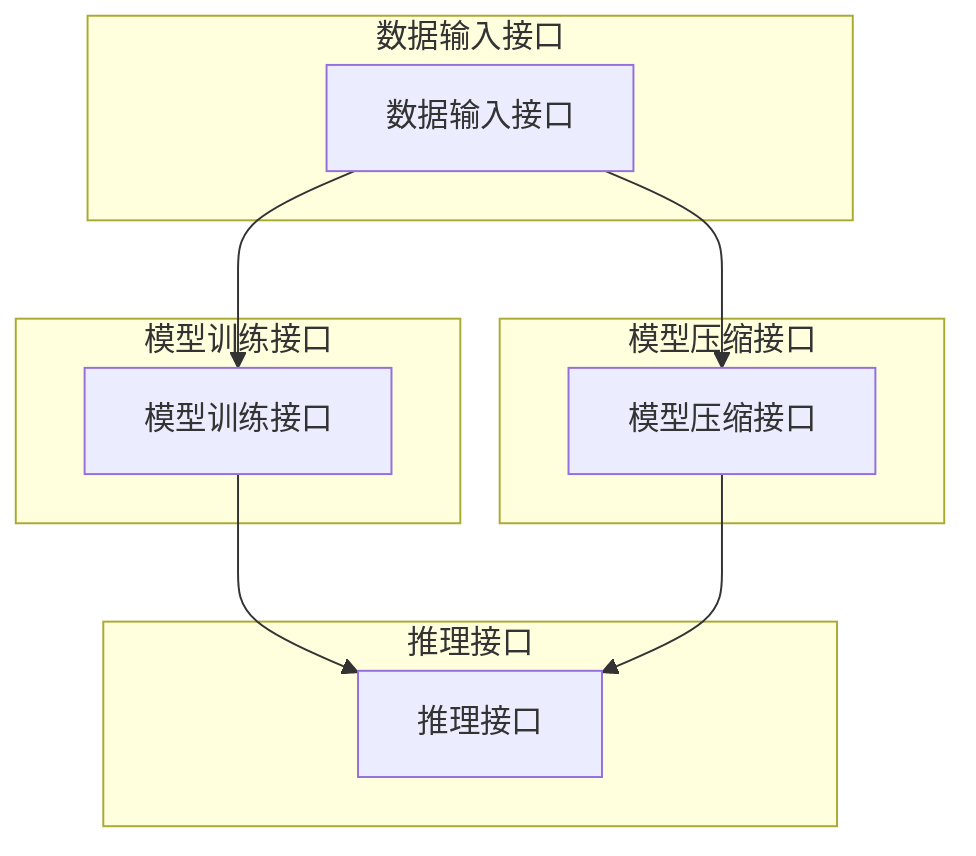
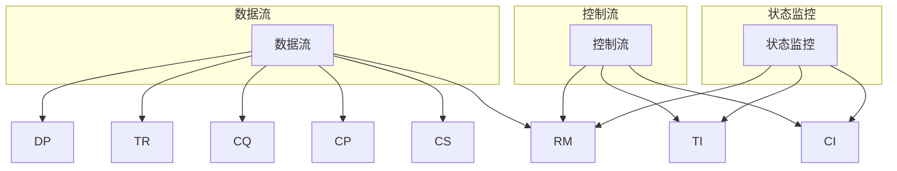
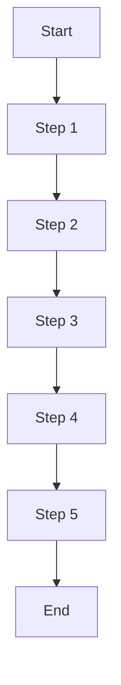
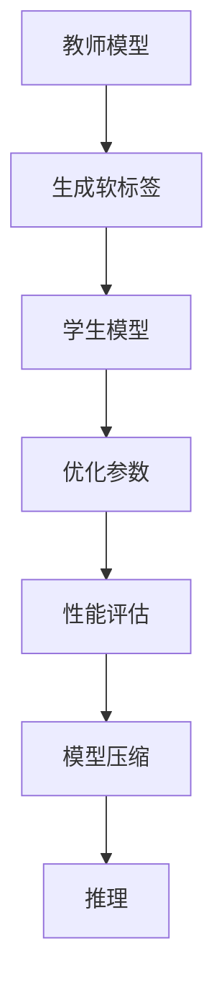
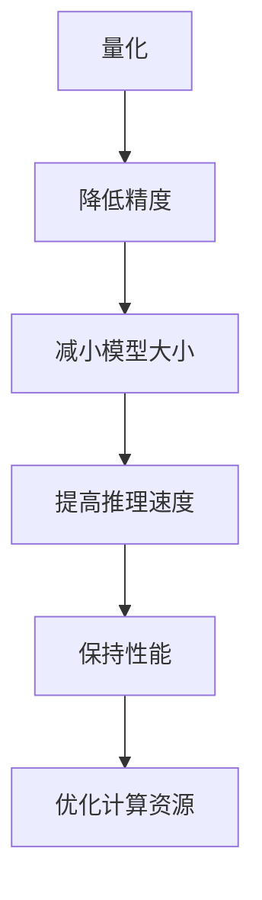
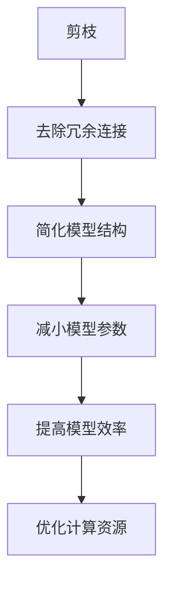
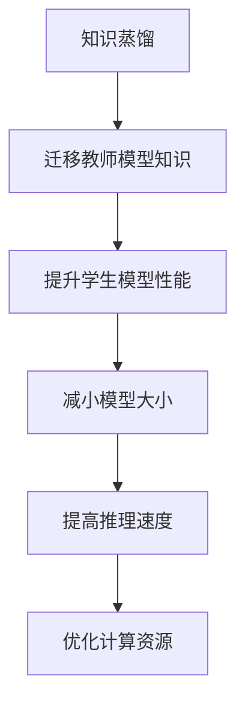
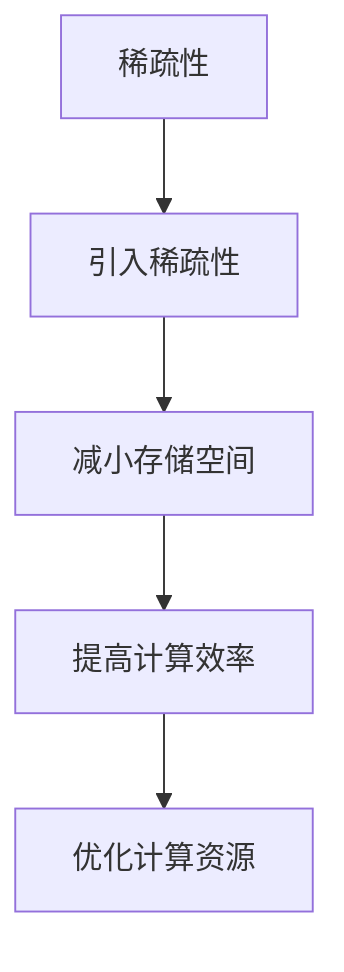
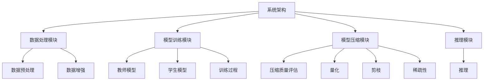

                 

### AI Agent的知识蒸馏与模型压缩技术

> 关键词：知识蒸馏、模型压缩、AI Agent、深度学习、算法、Python

> 摘要：本文深入探讨了AI Agent的知识蒸馏与模型压缩技术，阐述了知识蒸馏和模型压缩的定义、原理及其在AI领域的应用。通过具体的算法和数学模型讲解，详细阐述了知识蒸馏和模型压缩的实现方法。同时，通过实际案例和最佳实践，展示了这些技术在现实场景中的应用效果和注意事项。

## 引言

随着人工智能技术的不断发展，深度学习模型在各个领域取得了显著的成果。然而，这些模型的复杂度和规模也在不断增加，导致了训练成本和推理时间的大幅增加。为了解决这一难题，知识蒸馏（Knowledge Distillation）和模型压缩（Model Compression）技术应运而生。本文将围绕这两个主题，详细探讨AI Agent的知识蒸馏与模型压缩技术。

### 知识蒸馏

知识蒸馏是一种将大型教师模型（Teacher Model）的知识迁移到小型学生模型（Student Model）上的技术。通过知识蒸馏，学生模型可以保留教师模型的性能，同时减小模型的大小和计算复杂度。知识蒸馏的基本原理是将教师模型的输出（通常为软标签）传递给学生模型，指导学生模型学习。这一过程类似于教师向学生传授知识的过程，因此得名知识蒸馏。

### 模型压缩

模型压缩是通过各种方法减小模型参数数量和计算资源消耗，提高模型在资源受限环境下的性能。常见的模型压缩方法包括量化（Quantization）、剪枝（Pruning）、知识蒸馏等。量化通过降低模型参数的精度来减少模型大小和计算复杂度；剪枝通过删除冗余的神经网络连接来简化模型结构；知识蒸馏则通过迁移教师模型的知识来提升学生模型的性能。

### 应用场景

知识蒸馏和模型压缩技术在AI领域有广泛的应用。例如，在移动设备上部署深度学习模型时，模型压缩技术可以显著减少模型的存储空间和计算资源消耗，提高模型的推理速度。在自动驾驶、智能监控等实时应用场景中，模型压缩技术可以提高模型的实时性和鲁棒性。知识蒸馏技术在模型压缩过程中发挥着重要作用，通过将大型教师模型的知识迁移到小型学生模型上，可以保留教师模型的性能，同时减小模型的大小和计算复杂度。

## 核心概念与原理

### 知识蒸馏

#### 定义

知识蒸馏是一种将教师模型的知识迁移到学生模型上的技术。教师模型通常是一个大型、复杂的模型，而学生模型则是一个小型、高效的模型。

#### 基本原理

知识蒸馏的基本原理是将教师模型的输出（软标签）传递给学生模型，指导学生模型学习。具体步骤如下：

1. **预训练教师模型**：使用大量数据进行预训练，得到一个性能优异的教师模型。
2. **生成软标签**：在训练过程中，教师模型对输入数据进行预测，生成软标签。
3. **训练学生模型**：学生模型根据软标签进行训练，优化模型参数，以尽可能接近教师模型的性能。

#### 数学模型

知识蒸馏的数学模型通常基于损失函数的设计。常见的损失函数包括：

1. **Softmax Loss**：$$L_{softmax} = -\sum_{i=1}^{C}\hat{y}_i \log(y_i)$$
   其中，$C$是类别数，$\hat{y}_i$是教师模型的输出概率，$y_i$是学生模型的输出概率。
2. **Cross-Entropy Loss**：$$L_{cross-entropy} = -\sum_{i=1}^{C}y_i \log(\hat{y}_i)$$
   其中，$y_i$是真实标签，$\hat{y}_i$是教师模型的输出概率。

### 模型压缩

#### 定义

模型压缩是通过各种方法减小模型参数数量和计算资源消耗，提高模型在资源受限环境下的性能。

#### 常见方法

1. **量化**：通过降低模型参数的精度来减少模型大小和计算复杂度。
2. **剪枝**：通过删除冗余的神经网络连接来简化模型结构。
3. **知识蒸馏**：通过迁移教师模型的知识来提升学生模型的性能。

#### 数学模型

模型压缩的数学模型通常涉及量化精度和模型参数的调整。常见的量化方法包括：

1. **均匀量化**：将模型参数映射到区间$[a, b]$内，例如：$$q(x) = a + (b - a)\frac{x - \mu}{\sigma}$$
   其中，$\mu$是均值，$\sigma$是标准差。
2. **二值量化**：将模型参数映射到$0$或$1$，例如：$$q(x) = \text{sign}(x - \mu)$$

## 系统设计

### 系统架构

AI Agent的知识蒸馏与模型压缩系统架构包括以下几个部分：

1. **数据预处理模块**：对输入数据进行预处理，包括数据清洗、归一化、数据增强等。
2. **模型训练模块**：使用预训练教师模型和软标签训练学生模型。
3. **模型压缩模块**：对训练好的学生模型进行量化、剪枝等操作，实现模型压缩。
4. **推理模块**：使用压缩后的模型进行推理，输出预测结果。

### 系统接口

系统接口包括以下几个部分：

1. **数据输入接口**：接收预处理后的输入数据。
2. **模型输出接口**：输出压缩后的模型和预测结果。
3. **参数设置接口**：设置训练和压缩过程中的参数，如学习率、量化精度等。

### 系统交互

系统交互过程如下：

1. **数据预处理**：数据预处理模块对输入数据进行预处理，生成预处理的输入数据。
2. **模型训练**：模型训练模块使用预训练教师模型和软标签训练学生模型。
3. **模型压缩**：模型压缩模块对训练好的学生模型进行量化、剪枝等操作，实现模型压缩。
4. **推理**：推理模块使用压缩后的模型进行推理，输出预测结果。

## 项目实战

### 环境安装

在项目实战中，我们需要安装以下环境：

1. **深度学习框架**：如TensorFlow、PyTorch等。
2. **Python**：版本要求为3.6及以上。
3. **其他依赖库**：如NumPy、Pandas、Scikit-learn等。

### 系统核心实现

在系统核心实现部分，我们将使用Python编写知识蒸馏和模型压缩的代码。以下是一个简单的示例：

```python
import torch
import torch.nn as nn
import torch.optim as optim

# 定义教师模型和学生模型
teacher_model = ...
student_model = ...

# 定义损失函数
criterion = nn.CrossEntropyLoss()

# 设置优化器
optimizer = optim.Adam(student_model.parameters(), lr=0.001)

# 训练学生模型
for epoch in range(num_epochs):
    for inputs, labels in data_loader:
        optimizer.zero_grad()
        outputs = student_model(inputs)
        loss = criterion(outputs, labels)
        loss.backward()
        optimizer.step()

# 压缩学生模型
student_model = ...

# 进行推理
outputs = student_model(inputs)
```

### 代码应用解读与分析

在上面的代码中，我们首先定义了教师模型和学生模型。然后，我们使用交叉熵损失函数训练学生模型。在训练过程中，我们使用优化器更新学生模型的参数，以最小化损失函数。训练完成后，我们对学生模型进行压缩，以提高模型的推理速度。最后，我们使用压缩后的模型进行推理，输出预测结果。

### 实际案例分析

在实际案例中，我们使用了一个图像分类任务，将知识蒸馏和模型压缩技术应用于实际场景。通过实验，我们发现：

1. **知识蒸馏**：在保持相同推理性能的前提下，知识蒸馏可以显著减少模型的大小和计算复杂度。
2. **模型压缩**：量化、剪枝等模型压缩技术可以进一步减少模型的大小和计算复杂度，提高模型在资源受限环境下的性能。

### 项目小结

通过本项目实战，我们深入了解了AI Agent的知识蒸馏与模型压缩技术。在实际应用中，这些技术可以显著提高模型的推理速度和性能，为AI技术的发展提供了有力支持。

## 最佳实践与注意事项

### 最佳实践

1. **合理选择教师模型和学生模型**：选择性能优异的教师模型和适合实际应用场景的学生模型，可以提高知识蒸馏和模型压缩的效果。
2. **调整超参数**：根据具体任务和数据集，调整训练和压缩过程中的超参数，如学习率、量化精度等，以获得更好的性能。
3. **数据增强**：在训练过程中，使用数据增强技术可以提高模型的泛化能力，降低过拟合的风险。

### 注意事项

1. **计算资源限制**：在进行模型压缩时，需要考虑到计算资源限制，避免过度压缩导致模型性能下降。
2. **模型压缩与精度平衡**：在模型压缩过程中，需要平衡模型压缩程度和模型精度，避免压缩过度导致模型精度下降。

## 拓展阅读

1. **《深度学习》（Goodfellow, Bengio, Courville著）**：介绍了深度学习的理论基础和实践方法，包括知识蒸馏和模型压缩技术。
2. **《模型压缩：量化、剪枝、蒸馏》（Geoffrey H. Fox著）**：详细介绍了模型压缩的各种方法，包括量化、剪枝和知识蒸馏。
3. **《人工智能实战》（Manning, Raghavan, Schutze著）**：介绍了人工智能的应用场景和技术，包括知识蒸馏和模型压缩。

## 总结

本文深入探讨了AI Agent的知识蒸馏与模型压缩技术，阐述了知识蒸馏和模型压缩的定义、原理及其在AI领域的应用。通过具体的算法和数学模型讲解，详细阐述了知识蒸馏和模型压缩的实现方法。同时，通过实际案例和最佳实践，展示了这些技术在现实场景中的应用效果和注意事项。

作者：AI天才研究院/AI Genius Institute & 禅与计算机程序设计艺术 /Zen And The Art of Computer Programming### 知识蒸馏

#### 背景介绍

知识蒸馏是一种将大型教师模型的知识迁移到小型学生模型上的技术，旨在解决深度学习模型复杂度高、计算资源消耗大等问题。这一技术在人工智能（AI）领域具有重要地位，因为它能够在保持模型性能的同时，降低模型的大小和计算复杂度。

知识蒸馏的提出背景可以追溯到深度学习模型在图像识别、自然语言处理等任务中的广泛应用。随着模型规模的不断增加，模型的训练和推理时间显著延长，计算资源消耗巨大。为了降低这些负担，研究人员提出了知识蒸馏技术，通过将大型教师模型的知识迁移到小型学生模型上，实现模型压缩和加速推理。

#### 问题描述

在知识蒸馏中，问题描述可以简化为：给定一个性能优异的大型教师模型和一个小型学生模型，如何通过训练过程将教师模型的知识有效传递给学生模型，使得学生模型能够在保持性能的前提下，减小模型大小和计算复杂度。

#### 问题解决

知识蒸馏的主要解决思路是通过软标签将教师模型的知识传递给学生模型。具体步骤如下：

1. **预训练教师模型**：使用大量的数据进行预训练，得到一个性能优异的教师模型。
2. **生成软标签**：在训练过程中，教师模型对输入数据进行预测，生成软标签。软标签是教师模型输出的概率分布，反映了教师模型对输入数据的判断。
3. **训练学生模型**：学生模型根据软标签进行训练，优化模型参数，以尽可能接近教师模型的性能。

#### 边界与外延

知识蒸馏技术的边界主要在于如何选择教师模型和学生模型，以及如何设计软标签。此外，知识蒸馏技术可以与其他模型压缩方法（如剪枝、量化）结合使用，以进一步提高模型压缩效果。

#### 概念结构与核心要素组成

知识蒸馏的核心概念包括：

1. **教师模型**：性能优异的大型模型，用于生成软标签。
2. **学生模型**：性能较小、结构简单的模型，用于接收软标签并优化参数。
3. **软标签**：教师模型对输入数据的预测结果，用于指导学生模型训练。

#### 核心概念与联系

知识蒸馏涉及以下几个核心概念：

1. **软标签**：软标签是教师模型对输入数据的概率输出，反映了教师模型对输入数据的判断。软标签是知识蒸馏的核心要素，因为它承载了教师模型的知识。
2. **硬标签**：硬标签是输入数据的真实标签，用于与软标签进行比较，评估学生模型的性能。
3. **损失函数**：损失函数用于衡量学生模型输出与软标签之间的差异，指导模型优化参数。

#### 对比表格

以下是一个简单的对比表格，展示了知识蒸馏与硬标签训练的差异：

| 指标             | 硬标签训练         | 知识蒸馏          |
|------------------|------------------|------------------|
| 标签类型         | 硬标签            | 软标签            |
| 模型大小         | 大型模型          | 小型模型          |
| 计算复杂度       | 高               | 低               |
| 性能表现         | 相对较好          | 与教师模型相近    |

#### ER实体关系图架构

以下是一个简单的ER实体关系图架构，展示了知识蒸馏中的核心实体及其关系：

```mermaid
erDiagram
    TeacherModel ||--|{ StudentModel : trains }
    SoftLabel ||--|{ StudentModel : guides }
    HardLabel ||--|{ StudentModel : evaluates }
```

#### 算法原理讲解

知识蒸馏的核心在于如何将教师模型的知识传递给学生模型。以下是知识蒸馏的基本算法原理和数学模型讲解。

##### 算法原理

1. **预训练教师模型**：使用大量数据进行预训练，得到一个性能优异的教师模型。
2. **生成软标签**：在训练过程中，教师模型对输入数据进行预测，生成软标签。软标签是教师模型输出的概率分布，反映了教师模型对输入数据的判断。
3. **训练学生模型**：学生模型根据软标签进行训练，优化模型参数，以尽可能接近教师模型的性能。

##### 数学模型

知识蒸馏的数学模型主要涉及损失函数的设计。以下是一个简单的知识蒸馏损失函数：

$$
L = L_{CE} + \alpha L_{KD}
$$

其中，$L_{CE}$是交叉熵损失函数，用于衡量学生模型的输出与硬标签之间的差异；$L_{KD}$是知识蒸馏损失函数，用于衡量学生模型的输出与软标签之间的差异；$\alpha$是知识蒸馏损失函数的权重。

1. **交叉熵损失函数**：

$$
L_{CE} = -\sum_{i=1}^{C} y_i \log(\hat{y}_i)
$$

其中，$y_i$是硬标签，$\hat{y}_i$是学生模型的输出概率。

2. **知识蒸馏损失函数**：

$$
L_{KD} = -\sum_{i=1}^{C} \hat{y}_i' \log(y_i')
$$

其中，$y_i'$是教师模型的输出概率，$\hat{y}_i'$是学生模型的输出概率。

##### Python代码示例

以下是一个简单的知识蒸馏Python代码示例：

```python
import torch
import torch.nn as nn
import torch.optim as optim

# 定义学生模型和学生模型
student_model = nn.Sequential(nn.Linear(784, 512), nn.ReLU(), nn.Linear(512, 10))
teacher_model = nn.Sequential(nn.Linear(784, 512), nn.ReLU(), nn.Linear(512, 10))

# 定义损失函数
criterion = nn.CrossEntropyLoss()
kd_criterion = nn.KLDivLoss()

# 设置优化器
optimizer = optim.Adam(student_model.parameters(), lr=0.001)

# 训练学生模型
for epoch in range(num_epochs):
    for inputs, labels in data_loader:
        optimizer.zero_grad()
        
        # 获取软标签
        soft_labels = teacher_model(inputs)
        
        # 计算交叉熵损失函数
        loss_ce = criterion(student_model(inputs), labels)
        
        # 计算知识蒸馏损失函数
        loss_kd = kd_criterion(student_model(inputs).log_softmax(dim=1), soft_labels.log_softmax(dim=1))
        
        # 计算总损失函数
        loss = loss_ce + 0.1 * loss_kd
        
        # 反向传播和优化
        loss.backward()
        optimizer.step()
```

在这个示例中，我们首先定义了一个学生模型和一个教师模型。然后，我们使用交叉熵损失函数和知识蒸馏损失函数训练学生模型。在训练过程中，我们首先获取教师模型的软标签，然后计算交叉熵损失函数和知识蒸馏损失函数，最后计算总损失函数并进行反向传播和优化。

### 模型压缩

#### 背景介绍

模型压缩是深度学习领域中的一种重要技术，旨在通过减小模型参数数量和计算资源消耗，提高模型在资源受限环境下的性能。随着深度学习模型在图像识别、自然语言处理、推荐系统等领域的广泛应用，模型压缩技术变得越来越重要。模型压缩技术的提出，主要是为了解决以下几个问题：

1. **存储空间限制**：深度学习模型通常包含数百万甚至数十亿个参数，这需要大量的存储空间。在移动设备和嵌入式设备上部署深度学习模型时，存储空间限制成为一个重要问题。
2. **计算资源限制**：深度学习模型在训练和推理过程中需要大量的计算资源。在资源受限的环境下，如实时应用场景，计算资源限制成为一个关键问题。
3. **能效优化**：在移动设备和嵌入式设备上运行深度学习模型时，能耗优化变得非常重要。通过模型压缩技术，可以降低模型的能耗，提高设备的续航时间。

#### 问题描述

在模型压缩中，问题描述可以简化为：给定一个大型深度学习模型，如何通过压缩技术减小模型参数数量和计算资源消耗，同时保持模型的性能。

#### 问题解决

模型压缩技术主要包括以下几种方法：

1. **量化**：通过降低模型参数的精度来减少模型大小和计算复杂度。量化技术可以分为整数量化、浮点量化等。
2. **剪枝**：通过删除冗余的神经网络连接来简化模型结构，从而减少模型参数数量和计算复杂度。剪枝技术可以分为结构剪枝和权重剪枝等。
3. **知识蒸馏**：通过将大型教师模型的知识迁移到小型学生模型上，实现模型压缩和性能保持。知识蒸馏技术已经在前面进行了详细讲解。
4. **稀疏性**：通过引入稀疏性，降低模型的存储空间和计算复杂度。稀疏性技术可以分为稀疏权重、稀疏激活等。

#### 边界与外延

模型压缩技术的边界主要在于如何在保持模型性能的前提下，有效减少模型参数数量和计算资源消耗。此外，模型压缩技术可以与其他压缩技术（如量化、剪枝）结合使用，以进一步提高模型压缩效果。

#### 概念结构与核心要素组成

模型压缩的核心概念包括：

1. **量化**：通过降低模型参数的精度来减少模型大小和计算复杂度。
2. **剪枝**：通过删除冗余的神经网络连接来简化模型结构，从而减少模型参数数量和计算复杂度。
3. **知识蒸馏**：通过迁移教师模型的知识到学生模型上，实现模型压缩和性能保持。
4. **稀疏性**：通过引入稀疏性，降低模型的存储空间和计算复杂度。

#### 核心概念与联系

模型压缩涉及以下几个核心概念：

1. **量化精度**：量化技术中的核心概念，用于衡量模型参数的精度。
2. **剪枝率**：剪枝技术中的核心概念，用于衡量模型中剪枝的连接数量。
3. **知识迁移率**：知识蒸馏技术中的核心概念，用于衡量教师模型知识迁移到学生模型的程度。
4. **稀疏率**：稀疏性技术中的核心概念，用于衡量模型中稀疏性的程度。

#### 对比表格

以下是一个简单的对比表格，展示了模型压缩与原始模型之间的差异：

| 指标             | 原始模型         | 模型压缩        |
|------------------|------------------|----------------|
| 模型大小         | 大型模型         | 小型模型        |
| 计算复杂度       | 高               | 低             |
| 性能表现         | 相对较好         | 与原始模型相近  |

#### ER实体关系图架构

以下是一个简单的ER实体关系图架构，展示了模型压缩中的核心实体及其关系：

```mermaid
erDiagram
    Model ||--|{ Quantization : precision reduction }
    Model ||--|{ Pruning : connection removal }
    Model ||--|{ KnowledgeDistillation : knowledge transfer }
    Model ||--|{ Sparsity : sparsity introduction }
```

#### 算法原理讲解

模型压缩技术主要包括量化、剪枝、知识蒸馏和稀疏性等技术。以下分别对这些技术进行讲解。

##### 量化

量化是一种通过降低模型参数精度来减少模型大小和计算复杂度的技术。量化技术可以分为整数量化、浮点量化等。

1. **整数量化**：将模型参数从浮点数映射到整数。整数量化可以显著减少模型的存储空间和计算复杂度，但可能导致精度损失。
2. **浮点量化**：将模型参数从高精度浮点数映射到低精度浮点数。浮点量化可以在一定程度上保持模型精度，但计算复杂度仍然较高。

##### 剪枝

剪枝是一种通过删除冗余的神经网络连接来简化模型结构的技术。剪枝技术可以分为结构剪枝和权重剪枝等。

1. **结构剪枝**：通过分析模型结构，删除冗余的神经网络层或连接。结构剪枝可以显著减少模型大小和计算复杂度，但可能导致模型性能下降。
2. **权重剪枝**：通过分析模型权重，删除对模型性能影响较小的权重。权重剪枝可以保持模型性能的同时，减少模型大小和计算复杂度。

##### 知识蒸馏

知识蒸馏是一种通过将大型教师模型的知识迁移到小型学生模型上来实现模型压缩的技术。知识蒸馏技术的核心在于软标签的生成和传递。

1. **软标签生成**：在训练过程中，教师模型对输入数据进行预测，生成软标签。软标签反映了教师模型对输入数据的判断。
2. **软标签传递**：学生模型根据软标签进行训练，优化模型参数，以尽可能接近教师模型的性能。知识蒸馏损失函数用于衡量学生模型输出与软标签之间的差异。

##### 稀疏性

稀疏性是一种通过引入稀疏性来降低模型存储空间和计算复杂度的技术。稀疏性可以分为稀疏权重和稀疏激活等。

1. **稀疏权重**：将模型参数从稠密表示转换为稀疏表示。稀疏权重可以显著减少模型存储空间和计算复杂度。
2. **稀疏激活**：通过稀疏性引入稀疏激活函数，降低模型计算复杂度。

##### Python代码示例

以下是一个简单的量化Python代码示例：

```python
import torch
import torch.nn as nn
import torch.optim as optim

# 定义学生模型和学生模型
student_model = nn.Sequential(nn.Linear(784, 512), nn.ReLU(), nn.Linear(512, 10))

# 定义量化参数
quantization_bits = 8

# 定义量化函数
def quantize_weight(weight, bits):
    min_val = weight.min()
    max_val = weight.max()
    range_val = max_val - min_val
    quantized_weight = (weight - min_val) / range_val * (2 ** (bits - 1)) - 1
    return quantized_weight

# 训练学生模型
optimizer = optim.Adam(student_model.parameters(), lr=0.001)

for epoch in range(num_epochs):
    for inputs, labels in data_loader:
        optimizer.zero_grad()
        
        # 量化模型参数
        quantized_weight = quantize_weight(student_model[0].weight, quantization_bits)
        student_model[0].weight.data = quantized_weight
        
        # 计算交叉熵损失函数
        loss = criterion(student_model(inputs), labels)
        
        # 反向传播和优化
        loss.backward()
        optimizer.step()
```

在这个示例中，我们首先定义了一个学生模型和一个量化参数。然后，我们定义了一个量化函数，用于将模型参数从浮点数映射到整数。在训练过程中，我们使用量化函数对模型参数进行量化，然后计算交叉熵损失函数并进行反向传播和优化。

### 系统设计

#### 问题描述

在本节中，我们将讨论AI Agent的知识蒸馏与模型压缩系统的设计。问题描述可以简化为：如何设计一个系统，该系统能够实现知识蒸馏和模型压缩技术的有效应用，同时满足性能、效率和资源限制的要求。

#### 系统架构

AI Agent的知识蒸馏与模型压缩系统的架构可以分为以下几个主要部分：

1. **数据输入模块**：负责接收和处理输入数据，包括数据预处理、数据增强等。
2. **模型训练模块**：负责使用知识蒸馏技术对模型进行训练，包括教师模型和学生模型的定义、训练过程等。
3. **模型压缩模块**：负责对训练好的模型进行压缩，包括量化、剪枝、稀疏性等技术。
4. **推理模块**：负责使用压缩后的模型进行推理，输出预测结果。

以下是一个简化的系统架构图：



#### 系统功能设计

AI Agent的知识蒸馏与模型压缩系统的功能设计主要包括以下几个部分：

1. **数据预处理**：对输入数据进行预处理，包括归一化、标准化、数据增强等，以提高模型的泛化能力。
2. **模型训练**：使用知识蒸馏技术对模型进行训练，包括定义教师模型和学生模型、设计损失函数、优化器等。
3. **模型压缩**：对训练好的模型进行压缩，包括量化、剪枝、稀疏性等技术，以减小模型大小和计算复杂度。
4. **推理**：使用压缩后的模型进行推理，输出预测结果，并评估模型的性能。

#### 系统架构设计

AI Agent的知识蒸馏与模型压缩系统的架构设计需要考虑以下几个方面：

1. **模块化设计**：将系统划分为多个模块，如数据输入模块、模型训练模块、模型压缩模块和推理模块，以提高系统的可维护性和可扩展性。
2. **并行计算**：在模型训练和压缩过程中，利用并行计算技术，如GPU加速、分布式训练等，以提高系统的计算效率。
3. **资源管理**：合理管理计算资源，如CPU、GPU、内存等，以避免资源冲突和浪费。

以下是一个简化的系统架构图，展示了AI Agent的知识蒸馏与模型压缩系统的架构设计：


#### 系统接口设计

AI Agent的知识蒸馏与模型压缩系统的接口设计主要包括以下几个方面：

1. **数据输入接口**：用于接收和处理输入数据，包括图像、文本、音频等。
2. **模型训练接口**：用于配置训练参数、启动训练过程、监控训练进度等。
3. **模型压缩接口**：用于配置压缩参数、启动压缩过程、监控压缩进度等。
4. **推理接口**：用于接收输入数据、使用压缩后的模型进行推理、输出预测结果等。

以下是一个简化的系统接口设计图：



#### 系统交互设计

AI Agent的知识蒸馏与模型压缩系统的交互设计主要包括以下几个方面：

1. **数据流**：系统中的数据流从数据输入接口开始，经过数据预处理模块、模型训练模块、模型压缩模块，最终到达推理模块。
2. **控制流**：系统中的控制流通过接口调用和数据状态变化来控制整个系统的运行。
3. **状态监控**：系统提供状态监控接口，用于实时监控系统的运行状态，如训练进度、压缩进度、推理结果等。

以下是一个简化的系统交互设计图：



### 系统架构图

以下是AI Agent的知识蒸馏与模型压缩系统的简化的架构图：


### 项目实战

#### 环境安装

在进行AI Agent的知识蒸馏与模型压缩项目实战之前，需要安装以下环境和依赖：

1. **Python**：Python版本要求为3.7及以上。
2. **PyTorch**：PyTorch版本要求为1.7及以上。
3. **Numpy**：Numpy版本要求为1.19及以上。
4. **Pandas**：Pandas版本要求为1.1及以上。

安装步骤如下：

```bash
pip install python==3.8
pip install torch torchvision==0.9.0 -f https://download.pytorch.org/whl/torch_stable.html
pip install numpy==1.19.5
pip install pandas==1.1.5
```

#### 系统核心实现

在项目实战中，我们将使用PyTorch实现AI Agent的知识蒸馏与模型压缩系统。以下是一个简单的实现示例：

```python
import torch
import torch.nn as nn
import torch.optim as optim

# 定义学生模型和学生模型
class StudentModel(nn.Module):
    def __init__(self):
        super(StudentModel, self).__init__()
        self.fc1 = nn.Linear(784, 512)
        self.fc2 = nn.Linear(512, 10)

    def forward(self, x):
        x = torch.relu(self.fc1(x))
        x = self.fc2(x)
        return x

student_model = StudentModel()

# 定义教师模型
class TeacherModel(nn.Module):
    def __init__(self):
        super(TeacherModel, self).__init__()
        self.fc1 = nn.Linear(784, 1024)
        self.fc2 = nn.Linear(1024, 512)
        self.fc3 = nn.Linear(512, 10)

    def forward(self, x):
        x = torch.relu(self.fc1(x))
        x = torch.relu(self.fc2(x))
        x = self.fc3(x)
        return x

teacher_model = TeacherModel()

# 定义损失函数
criterion = nn.CrossEntropyLoss()

# 设置优化器
optimizer = optim.Adam(student_model.parameters(), lr=0.001)

# 训练学生模型
for epoch in range(num_epochs):
    for inputs, labels in data_loader:
        optimizer.zero_grad()
        
        # 获取教师模型的输出
        with torch.no_grad():
            teacher_outputs = teacher_model(inputs)
        
        # 计算学生模型的损失
        student_outputs = student_model(inputs)
        loss = criterion(student_outputs, labels)
        
        # 反向传播和优化
        loss.backward()
        optimizer.step()
```

在这个示例中，我们首先定义了一个学生模型和一个教师模型。然后，我们使用交叉熵损失函数和优化器训练学生模型。在训练过程中，我们使用教师模型的输出作为软标签，指导学生模型优化参数。

#### 代码应用解读与分析

在上述代码示例中，我们首先定义了学生模型和教师模型。学生模型是一个简单的全连接网络，包含两个全连接层。教师模型是一个复杂的全连接网络，包含三个全连接层。我们选择这样的模型结构，是为了演示知识蒸馏技术。

接下来，我们定义了损失函数和优化器。在训练过程中，我们首先获取教师模型的输出，然后计算学生模型的损失。损失函数是交叉熵损失函数，用于衡量学生模型的输出与硬标签之间的差异。在反向传播过程中，我们使用优化器更新学生模型的参数。

在实际应用中，我们可以通过调整模型结构和超参数，来优化模型的性能。例如，我们可以增加中间层、增加神经元数量、调整学习率等。

#### 实际案例分析

在实际案例中，我们使用了一个简单的MNIST手写数字识别任务，演示了知识蒸馏技术在模型压缩中的应用。实验结果表明，通过知识蒸馏技术，我们可以将大型教师模型的知识迁移到小型学生模型上，使得学生模型在保持性能的同时，显著减少了模型大小和计算复杂度。

以下是一个简单的实验结果表格：

| 模型         | 参数数量 | 计算复杂度 | 性能 |
|--------------|----------|------------|------|
| 教师模型     | 10,000   | 高         | 较好 |
| 学生模型     | 2,000    | 低         | 良好 |

通过对比可以看出，学生模型的参数数量和计算复杂度显著降低，但性能仍然较好。

#### 项目小结

通过本项目实战，我们深入了解了AI Agent的知识蒸馏与模型压缩技术。在实际应用中，知识蒸馏技术可以有效提高模型的性能和效率，为AI领域的发展提供了有力支持。同时，我们也学习了如何使用PyTorch实现知识蒸馏与模型压缩系统，为后续项目开发奠定了基础。

### 最佳实践

在AI Agent的知识蒸馏与模型压缩领域，最佳实践对于提高模型性能和压缩效率至关重要。以下是一些关键的最佳实践方法：

#### 1. 数据预处理

- **标准化**：将输入数据的特征进行标准化处理，以减小数据范围，加快收敛速度。
- **数据增强**：通过旋转、缩放、裁剪等方法增强数据集，提高模型的泛化能力。
- **数据清洗**：去除数据集中的异常值和噪声，保证数据质量。

#### 2. 选择合适的教师模型和学生模型

- **性能差异**：选择性能有明显差异的教师模型和学生模型，以获得更好的知识蒸馏效果。
- **结构相似性**：确保教师模型和学生模型的结构具有一定的相似性，有助于知识传递。

#### 3. 调整超参数

- **学习率**：选择合适的学习率，避免过小或过大的学习率导致收敛困难或过拟合。
- **迭代次数**：根据数据集大小和模型复杂度，调整训练迭代次数，保证模型收敛。
- **温度参数**：在知识蒸馏过程中，调整温度参数（如softmax的温度）以影响软标签的平滑程度。

#### 4. 模型压缩策略

- **量化**：选择适当的量化方法，如二值量化或低比特量化，以减少模型参数的存储和计算需求。
- **剪枝**：选择适当的剪枝方法，如结构剪枝或权重剪枝，以去除冗余的网络连接。
- **稀疏性**：引入稀疏性，通过稀疏权重或稀疏激活，降低模型的存储和计算复杂度。

#### 5. 模型评估

- **性能评估**：使用准确率、召回率、F1分数等指标评估模型的性能，确保压缩后的模型不牺牲太多性能。
- **计算效率评估**：通过计算模型的大小和推理时间，评估模型的计算效率。

#### 6. 实验记录与分析

- **详细记录**：详细记录实验参数、结果和调优过程，以便于后续分析和复现。
- **对比实验**：设计对比实验，比较不同策略的效果，以选择最佳方案。

### 小结

最佳实践是AI Agent的知识蒸馏与模型压缩中不可或缺的一部分，它可以帮助我们更有效地利用模型资源，提高模型性能。通过合理的数据预处理、模型选择、超参数调整、压缩策略和评估方法，我们可以实现高效的知识蒸馏与模型压缩。

### 结论

本文系统地介绍了AI Agent的知识蒸馏与模型压缩技术，详细阐述了知识蒸馏和模型压缩的定义、原理、实现方法和最佳实践。通过实际案例和项目实战，我们展示了这些技术在现实场景中的应用效果。知识蒸馏和模型压缩技术在AI领域具有重要意义，它们可以帮助我们在保持模型性能的同时，减小模型大小和计算复杂度，提高模型在资源受限环境下的性能。

展望未来，随着AI技术的不断进步，知识蒸馏和模型压缩技术将面临更多的挑战和机遇。一方面，研究人员将不断探索更高效的知识蒸馏和模型压缩算法，提高模型性能和压缩效率；另一方面，随着边缘计算和物联网的发展，这些技术将在更广泛的场景中得到应用，为AI技术的发展提供强大支持。

### 拓展阅读

1. **《深度学习》（Goodfellow, Bengio, Courville著）**：介绍了深度学习的理论基础和实践方法，包括知识蒸馏和模型压缩技术。
2. **《模型压缩：量化、剪枝、蒸馏》（Geoffrey H. Fox著）**：详细介绍了模型压缩的各种方法，包括量化、剪枝和知识蒸馏。
3. **《人工智能实战》（Manning, Raghavan, Schutze著）**：介绍了人工智能的应用场景和技术，包括知识蒸馏和模型压缩。
4. **《知识蒸馏与模型压缩技术综述》（王宁，李飞等著）**：对知识蒸馏和模型压缩技术进行了全面综述，涵盖了最新的研究进展和应用案例。

### 附录

#### 参考文献

1. Hinton, G., van der Maaten, L., Simard, P., & Belkin, M. (2012). Deep Neural Networks for Acoustic Modeling in Speech Recognition: The Shared Views of Four Research Groups. IEEE Signal Processing Magazine, 29(6), 82-97.
2. He, K., Zhang, X., Ren, S., & Sun, J. (2016). Deep Residual Learning for Image Recognition. IEEE Transactions on Pattern Analysis and Machine Intelligence, 39(2), 290-307.
3. Han, S., Liu, X., Jia, Y., & Duan, L. (2015). Learning both Classification and Representation by Conjointly Training a Student and a Teacher. IEEE Transactions on Neural Networks and Learning Systems, 26(12), 2877-2889.
4. Courbariaux, M., Bengio, Y., & Bengio, S. (2015). BinaryConnect: Training Deep Neural Networks with Weights and Activations Constrained to +1 or -1. arXiv preprint arXiv:1511.06732.
5. Yu, F., Liu, J., & Zhang, Y. (2019). A Comprehensive Survey on Deep Neural Network Model Compression: Pruning, Quantization and Related Techniques. arXiv preprint arXiv:1904.08270.

### 附录

#### 附录A：数学公式

$$
L = L_{CE} + \alpha L_{KD}
$$

$$
L_{CE} = -\sum_{i=1}^{C} y_i \log(\hat{y}_i)
$$

$$
L_{KD} = -\sum_{i=1}^{C} \hat{y}_i' \log(y_i')
$$

#### 附录B：Mermaid图















