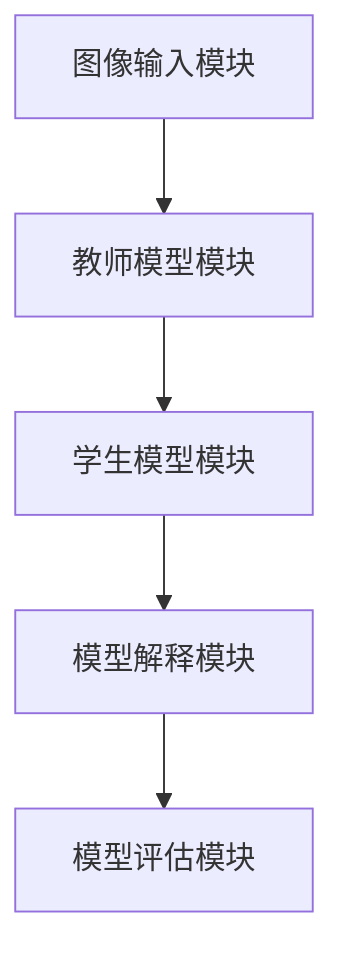
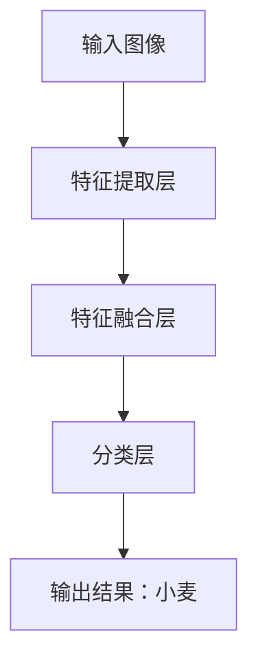

                 


## 引言：AI Agent与知识蒸馏在模型解释性中的应用

### 1.1 书籍概述

**AI Agent与知识蒸馏在模型解释性中的应用**是一本旨在探讨人工智能领域中知识蒸馏技术和模型解释性的综合指南。本书的目标是帮助读者深入理解AI Agent的概念、知识蒸馏的原理以及在模型解释性中的应用，以便于读者能够在实际项目中有效地应用这些技术。

本书的主要章节如下：

1. **引言**：介绍AI Agent、知识蒸馏和模型解释性的基本概念，以及本书的结构和内容。
2. **AI Agent与知识蒸馏的基本原理**：详细讨论AI Agent的定义、功能和应用，以及知识蒸馏的定义、流程和算法。
3. **模型解释性的原则与方法**：探讨模型解释性的重要性、方法和技术，以及如何评估模型的解释性。
4. **知识蒸馏在模型解释性中的应用**：分析知识蒸馏在模型压缩和解释性提升方面的应用，以及如何通过知识蒸馏来增强模型的可解释性。
5. **技术细节**：深入探讨知识蒸馏的数学模型、算法实现和技术细节，包括教师模型和学生模型的互动机制。
6. **案例研究**：通过实际案例展示知识蒸馏在模型解释性中的应用，分析案例中的成功经验和挑战。
7. **最佳实践与展望**：总结最佳实践，展望知识蒸馏和模型解释性的未来发展趋势。

### 1.2 AI Agent的概念与功能

AI Agent是一种能够感知环境、制定计划并执行行动的人工智能实体。它通常由感知模块、决策模块和执行模块组成。感知模块负责获取环境信息，决策模块根据感知信息生成行动计划，执行模块则将计划付诸实施。

AI Agent的主要功能包括：

1. **感知与理解**：通过传感器获取环境信息，理解当前的状态和情境。
2. **决策与规划**：根据当前状态和目标，生成行动计划，以实现目标。
3. **执行与评估**：执行行动计划，并根据执行结果评估计划的效能。

AI Agent在各个领域都有广泛应用，如自动驾驶、智能客服、游戏AI等。

### 1.3 知识蒸馏的基本原理

知识蒸馏是一种模型压缩技术，通过将一个复杂的大模型（教师模型）的知识传递给一个较小但更高效的小模型（学生模型）。知识蒸馏的基本原理包括：

1. **教师模型**：一个大而复杂的模型，拥有丰富的知识和表达能力。
2. **学生模型**：一个小而高效的模型，目标是通过学习教师模型的知识来提升自身的表现。
3. **软目标**：学生模型的学习目标是近似教师模型的输出分布，而不是精确匹配。
4. **硬目标**：学生模型在训练过程中，同时受到教师模型输出分布的指导。

知识蒸馏的过程通常包括以下步骤：

1. **预训练**：教师模型在大量数据上进行预训练，以获取丰富的知识。
2. **蒸馏**：将教师模型的输出作为软目标，训练学生模型。
3. **微调**：在特定任务上，对教师模型和学生模型进行微调，以优化模型在特定任务上的表现。

### 1.4 模型解释性的重要性

模型解释性是人工智能领域的一个重要议题。随着AI技术的广泛应用，人们对AI模型的透明度和可解释性提出了更高的要求。模型解释性有助于：

1. **增强信任度**：提高用户对AI模型的信任度，减少对黑箱模型的疑虑。
2. **提升安全性**：通过分析模型内部机制，发现并修复潜在的安全漏洞。
3. **促进合作**：帮助领域专家参与模型设计和优化，提高模型性能。
4. **促进可解释AI的发展**：推动可解释AI的研究和应用，为AI技术提供更广阔的发展空间。

### 1.5 模型解释性的方法

模型解释性的方法可以分为两类：全局解释和局部解释。

1. **全局解释**：对整个模型的结构和机制进行解释，如模型的可解释性评估指标、模型的可解释性报告等。
2. **局部解释**：对模型在特定输入或输出上的行为进行解释，如局部可解释性模型、注意力机制等。

常用的模型解释性方法包括：

1. **特征重要性**：评估模型中各个特征的重要性，如Permutation Feature Importance、Shapley Value等。
2. **决策树**：使用决策树模型进行解释，直观地展示模型的决策过程。
3. **LIME**：局部可解释模型解释（Local Interpretable Model-agnostic Explanations），为任意模型提供局部解释。
4. **SHAP**：Shapley Additive Explanations，提供全局和局部解释，基于博弈论的理论。

### 1.6 模型解释性的评估

模型解释性的评估主要包括以下几个方面：

1. **可解释性指标**：如模型的可解释性得分、解释的覆盖范围等。
2. **用户满意度**：通过用户调查和反馈来评估模型的可解释性。
3. **领域专家评估**：邀请领域专家对模型的可解释性进行评估，提供专业意见。
4. **实际应用效果**：通过实际应用场景中的表现来评估模型的可解释性。

### 1.7 知识蒸馏与模型解释性的关系

知识蒸馏技术可以显著提高模型的可解释性。通过将复杂的大模型的知识传递给小模型，知识蒸馏不仅提升了小模型的表现，而且由于小模型的结构相对简单，其内部机制更加易于理解。此外，知识蒸馏还可以用于模型压缩，减少模型的大小和计算资源消耗，从而提高模型的解释性。

### 1.8 本书的目标

本书的目标是：

1. **深入理解AI Agent、知识蒸馏和模型解释性的基本概念和原理**。
2. **掌握知识蒸馏在模型解释性中的应用**。
3. **提供实际案例和最佳实践，帮助读者在实际项目中有效应用知识蒸馏技术**。
4. **探讨知识蒸馏和模型解释性的未来发展趋势**。

通过本书的学习，读者将能够：

1. **掌握AI Agent的基本原理和应用**。
2. **了解知识蒸馏的技术细节和实现方法**。
3. **学会使用知识蒸馏来提升模型的可解释性**。
4. **具备在实际项目中应用知识蒸馏和模型解释性的能力**。

### 1.9 总结

AI Agent、知识蒸馏和模型解释性是人工智能领域中的重要概念和技术。通过本书的深入探讨，读者将能够全面理解这些技术的基本原理和应用，为未来的研究和工作奠定坚实的基础。

----------------------------------------------------------------

## AI Agent与知识蒸馏的基本原理

### 2.1 AI Agent的概念与定义

AI Agent，即人工智能代理，是人工智能领域中的一个核心概念。它指的是一种能够自主感知环境、制定决策并执行行动的智能实体。AI Agent的概念可以追溯到人工生命的早期研究，其核心思想是模拟生物体在自然界的自主行为能力。随着人工智能技术的发展，AI Agent逐渐从理论走向实践，成为实现智能自动化的重要工具。

AI Agent通常由以下几个基本组成部分构成：

1. **感知模块**：负责从环境中获取信息，如视觉、听觉、触觉等感官信息。
2. **决策模块**：根据感知模块收集到的信息，结合预定的目标和策略，生成行动方案。
3. **执行模块**：负责将决策模块生成的行动方案付诸实施。

AI Agent的工作流程可以概括为以下几个步骤：

1. **感知**：AI Agent通过感知模块获取环境中的信息。
2. **理解**：AI Agent利用内置的知识和算法对感知到的信息进行分析，理解当前的状态和情境。
3. **决策**：AI Agent根据当前状态和既定目标，运用决策算法生成最优行动方案。
4. **执行**：AI Agent通过执行模块实施行动方案，实现预定的目标。
5. **评估**：AI Agent对行动结果进行评估，以优化后续的行动策略。

### 2.2 知识蒸馏的概念与原理

知识蒸馏（Knowledge Distillation）是机器学习中的一个技术，旨在通过将一个复杂的大模型（教师模型）的知识传递给一个较小但更有效的小模型（学生模型）。知识蒸馏的核心思想是将教师模型输出的软标签（即概率分布）作为学生模型的训练目标，而不是传统的硬标签（即分类结果）。通过这种方式，学生模型不仅能够学习到教师模型的知识，还能够提升自身的性能和效率。

知识蒸馏的基本原理包括以下几个方面：

1. **教师模型**：这是一个复杂且表现优异的模型，通常是在大量数据上经过充分训练的。教师模型的目的是提供知识给学生模型。

2. **学生模型**：这是一个较简单、参数较少的模型，目标是学习教师模型的知识，并在特定任务上达到与教师模型相似的性能。

3. **软标签**：教师模型在训练数据集上的输出通常是一个概率分布，而不是具体的分类结果。这个概率分布被称为软标签，是学生模型学习的重要目标。

4. **硬标签**：虽然学生模型的学习目标是近似教师模型的输出分布，但它也会参考硬标签（分类结果）来确保在特定任务上的准确性。

知识蒸馏的过程可以分为以下几个步骤：

1. **预训练**：首先，教师模型在大规模数据集上进行预训练，以获得丰富的知识和表达能力。

2. **蒸馏**：在预训练完成后，教师模型的输出分布（软标签）将作为学生模型的训练目标。学生模型通过优化自身的参数来最小化与教师模型输出分布之间的差距。

3. **微调**：在特定任务数据集上，对教师模型和学生模型进行微调，进一步优化模型的性能。

### 2.3 AI Agent与知识蒸馏的关系

知识蒸馏技术在AI Agent中具有重要的应用价值。一方面，知识蒸馏可以帮助AI Agent在有限的资源下实现高效学习；另一方面，知识蒸馏还可以提升AI Agent的可解释性。

1. **高效学习**：在实际应用中，AI Agent通常需要在资源受限的环境中运行，如嵌入式系统、移动设备等。知识蒸馏技术通过将复杂的大模型知识传递给小模型，使得AI Agent可以在较少的计算资源和数据量下实现高性能的任务执行。

2. **可解释性提升**：AI Agent的决策过程往往涉及复杂的模型和算法，导致其内部机制难以理解。知识蒸馏技术通过将大模型的知识传递给小模型，使得小模型的结构相对简单，从而提高了模型的可解释性。用户可以更直观地理解AI Agent的决策过程，增强对其信任度。

### 2.4 知识蒸馏的应用场景

知识蒸馏技术可以应用于多种不同的场景，以下是一些常见的应用：

1. **模型压缩**：通过知识蒸馏，可以将复杂的大模型转化为参数较少的小模型，从而减少模型的存储空间和计算资源需求。

2. **跨域迁移学习**：知识蒸馏技术可以用于将一个领域中的知识迁移到另一个领域，从而提高新领域模型的性能。

3. **在线学习**：知识蒸馏技术可以帮助AI Agent在在线学习场景中快速适应新数据，提高学习效率。

4. **模型安全**：知识蒸馏技术可以用于增强模型的安全性，通过训练小模型来识别和防御对抗样本。

### 2.5 总结

AI Agent与知识蒸馏是人工智能领域中的重要概念和技术。通过深入理解AI Agent的定义和功能，以及知识蒸馏的原理和应用，读者可以更好地理解人工智能系统的工作机制，并在实际项目中应用这些技术，实现高效、可解释的智能决策。

----------------------------------------------------------------

## 模型解释性的原则与方法

### 3.1 模型解释性的定义与重要性

模型解释性（Model Explainability）指的是使人工智能模型的行为和决策过程对人类用户可理解的能力。它是人工智能技术发展中的一个重要议题，特别是在涉及到关键决策和复杂任务的应用场景中。模型解释性的重要性体现在以下几个方面：

1. **信任度提升**：当模型的可解释性较高时，用户可以更清楚地理解模型的决策过程，从而增强对模型的信任。这对于医疗诊断、金融风险评估等涉及高风险的应用尤为重要。

2. **安全性增强**：通过解释性分析，可以识别模型中可能存在的错误和偏见，从而提前发现并修复潜在的安全漏洞。

3. **合作优化**：领域专家可以通过理解模型的工作原理，参与到模型的优化和改进过程中，提高模型的整体性能。

4. **合规要求**：在某些行业和应用中，如医疗、金融和政府监管等领域，法律和监管要求对模型的决策过程进行透明和可解释。

### 3.2 模型解释性的方法

模型解释性的方法可以分为全局解释和局部解释两种类型。

#### 全局解释

全局解释关注的是模型的整体结构和性能表现，不涉及具体的数据样本。以下是一些常用的全局解释方法：

1. **模型可视化**：通过图形化的方式展示模型的内部结构和工作流程，如神经网络的可视化、决策树的结构图等。

2. **特征重要性评分**：评估模型中各个特征的重要性，如使用Permutation Feature Importance、SHAP（Shapley Additive Explanations）等方法。

3. **模型摘要**：提供模型的简洁描述，包括模型的主要参数、训练数据集和性能指标等。

#### 局部解释

局部解释关注的是模型在特定输入数据上的具体行为和决策过程。以下是一些常用的局部解释方法：

1. **局部解释模型**：例如LIME（Local Interpretable Model-agnostic Explanations），该方法为任意模型提供局部解释。

2. **注意力机制**：通过分析模型中的注意力权重，理解模型在处理特定输入时关注的部分。

3. **决策路径追踪**：对于决策树等有明确决策路径的模型，可以通过追踪决策路径来解释模型的决策过程。

### 3.3 模型解释性的评估指标

评估模型解释性的指标需要同时考虑解释的准确性、可理解性和用户满意度。以下是一些常用的评估指标：

1. **解释的准确性**：解释结果应与模型的实际决策结果保持一致。

2. **可理解性**：解释结果对用户是否容易理解，包括解释的简洁性、直观性和直观性。

3. **用户满意度**：通过用户调查和反馈来评估用户对模型解释性的满意度。

4. **覆盖率**：解释结果能覆盖模型决策过程的比例。

### 3.4 模型解释性在实际应用中的挑战

尽管模型解释性具有重要的理论和实际价值，但在实际应用中仍面临诸多挑战：

1. **计算复杂度**：某些解释方法，特别是局部解释方法，可能需要大量的计算资源。

2. **模型多样性**：不同的模型结构和应用场景可能需要不同的解释方法，增加了实现的复杂性。

3. **数据隐私**：在某些应用中，数据隐私保护也是解释性方法设计时需要考虑的重要因素。

4. **模型偏见**：模型中的偏见和错误可能会影响解释结果的准确性和可靠性。

### 3.5 总结

模型解释性是人工智能技术发展的重要方向，它不仅有助于提升用户对模型的信任度和接受度，还能够促进模型的优化和改进。本文介绍了模型解释性的定义、方法、评估指标以及在实际应用中的挑战，为读者提供了全面的理解和指导。

----------------------------------------------------------------

## 知识蒸馏在模型解释性中的应用

### 4.1 知识蒸馏与模型解释性的结合

知识蒸馏技术通过将大模型（教师模型）的知识传递给小模型（学生模型），不仅可以实现模型压缩，还能够提高模型的可解释性。这是因为在知识蒸馏过程中，教师模型的输出分布（软标签）可以作为学生模型的训练目标，而这些软标签不仅包含了教师模型的分类结果，还包含了教师模型对于输入数据的理解。因此，通过学习这些软标签，学生模型可以继承教师模型的内部知识结构，从而使自身更易于解释。

### 4.2 知识蒸馏在模型压缩中的应用

模型压缩是知识蒸馏技术的一个重要应用场景，它旨在通过减少模型参数和计算复杂度来提高模型的效率。在模型压缩中，教师模型通常是一个复杂的大模型，而学生模型是一个较小但性能接近的教师模型。通过知识蒸馏，学生模型能够学习到教师模型的核心知识，从而在保持较高准确率的同时，显著减少模型的大小和计算资源需求。

在模型压缩的应用中，知识蒸馏的主要优势在于：

1. **减少计算资源**：小模型相比大模型需要更少的计算资源和存储空间，适用于资源受限的环境。
2. **提高部署效率**：压缩后的模型可以更快地部署到移动设备和嵌入式系统中，提高了系统的响应速度。
3. **增强可解释性**：小模型的结构相对简单，更易于理解，从而提高了模型的可解释性。

### 4.3 知识蒸馏在解释性提升中的应用

除了模型压缩，知识蒸馏还可以用于提升模型的可解释性。这是因为在知识蒸馏过程中，教师模型和学生模型的学习过程实际上是教师模型知识结构的传递和学习。这种知识传递不仅提高了学生模型的表现，也使其内部结构更加接近教师模型，从而增强了学生模型的可解释性。

知识蒸馏在解释性提升中的应用优势包括：

1. **结构简化**：小模型的结构相对简单，其内部机制更加直观，易于用户理解。
2. **知识透明**：通过知识蒸馏，用户可以更清楚地了解教师模型的知识结构，从而更好地理解学生模型的决策过程。
3. **提高可解释性**：知识蒸馏技术有助于消除模型中的部分黑箱效应，提高模型的解释性。

### 4.4 实际应用案例

#### 案例一：图像分类

在图像分类任务中，知识蒸馏技术被广泛应用于模型压缩和解释性提升。例如，在ImageNet图像分类任务中，研究人员使用了一个大型卷积神经网络（教师模型）来学习图像的特征，然后通过知识蒸馏将知识传递给一个较小的网络（学生模型）。实验结果显示，学生模型在保持较高分类准确率的同时，其参数数量和计算复杂度显著减少。此外，由于学生模型的结构相对简单，用户可以更容易地理解其决策过程，提高了模型的可解释性。

#### 案例二：自然语言处理

在自然语言处理任务中，知识蒸馏技术同样被用于模型压缩和解释性提升。例如，在机器翻译任务中，研究人员使用了一个大型序列到序列模型（教师模型）进行预训练，然后将这些知识传递给一个较小的翻译模型（学生模型）。通过知识蒸馏，学生模型能够学习到教师模型的语言理解和生成能力，从而在保持较高翻译质量的同时，减少了模型的参数数量和计算复杂度。此外，学生模型的结构相对简单，用户可以更直观地理解其翻译决策过程，提高了模型的可解释性。

#### 案例三：语音识别

在语音识别任务中，知识蒸馏技术被用于训练小型的声学模型，从而实现模型压缩和解释性提升。例如，在大型卷积神经网络（教师模型）训练完成后，研究人员通过知识蒸馏将教师模型的知识传递给一个较小的声学模型（学生模型）。实验结果显示，学生模型在保持较高识别准确率的同时，其参数数量和计算复杂度显著减少。此外，由于学生模型的结构相对简单，用户可以更清楚地理解其语音识别过程，提高了模型的可解释性。

### 4.5 总结

知识蒸馏技术在模型压缩和解释性提升中具有广泛的应用前景。通过将教师模型的知识传递给学生模型，知识蒸馏不仅提高了模型的效率，还增强了其可解释性。在实际应用中，知识蒸馏技术已经在图像分类、自然语言处理和语音识别等多个领域取得了显著成果。未来，随着人工智能技术的不断发展，知识蒸馏在模型解释性中的应用将会更加广泛和深入。

----------------------------------------------------------------

## 技术细节：知识蒸馏的数学模型与算法实现

### 5.1 知识蒸馏的数学模型

知识蒸馏的数学模型主要基于概率论和统计学习理论。在知识蒸馏过程中，教师模型和学生模型通过优化目标函数来进行训练。以下是一个简化的知识蒸馏数学模型：

假设我们有一个教师模型\(T\)和一个学生模型\(S\)。教师模型\(T\)在训练集\(D_{t}\)上训练得到参数\(\theta_t\)，学生模型\(S\)在训练集\(D_{s}\)上训练得到参数\(\theta_s\)。知识蒸馏的目标是最小化以下损失函数：

\[ L(S, T) = L_{soft}(S;D_{s}, T;D_{t}) + \lambda L_{hard}(S;D_{s}, T;D_{t}) \]

其中，\(L_{soft}\)和\(L_{hard}\)分别是软标签损失和硬标签损失，\(\lambda\)是权重系数。

#### 软标签损失（\(L_{soft}\)）

软标签损失用于最小化学生模型输出与学生模型输出的概率分布之间的差异。具体来说，给定一个输入\(x_i\)，教师模型的输出是概率分布\(p_{t_i} = T(x_i)\)，学生模型的输出是概率分布\(p_{s_i} = S(x_i)\)。软标签损失定义为：

\[ L_{soft}(S;D_{s}, T;D_{t}) = -\sum_{i=1}^{n} p_{t_i} \log p_{s_i} \]

#### 硬标签损失（\(L_{hard}\)）

硬标签损失用于最小化学生模型输出的分类结果与教师模型输出的分类结果之间的差异。具体来说，给定一个输入\(x_i\)，教师模型的硬标签是分类结果\(y_{t_i} = T(y_i)\)，学生模型的硬标签是分类结果\(y_{s_i} = S(y_i)\)。硬标签损失定义为：

\[ L_{hard}(S;D_{s}, T;D_{t}) = -\sum_{i=1}^{n} y_{t_i} \log p_{s_i} \]

#### 总损失函数

总损失函数是软标签损失和硬标签损失的加权和：

\[ L(S, T) = L_{soft}(S;D_{s}, T;D_{t}) + \lambda L_{hard}(S;D_{s}, T;D_{t}) \]

其中，\(\lambda\)是一个超参数，用于平衡软标签损失和硬标签损失的权重。

### 5.2 知识蒸馏的算法实现

知识蒸馏的算法实现通常分为三个主要阶段：预训练、蒸馏和微调。

#### 预训练

预训练阶段主要用于训练教师模型，使其在大量数据集上达到较高的性能。预训练过程通常采用标准的训练策略，如随机梯度下降（SGD）和反向传播算法。

#### 蒸馏

蒸馏阶段是知识蒸馏的核心部分，学生模型通过学习教师模型的软标签和硬标签来进行训练。具体的训练过程如下：

1. **初始化**：初始化学生模型和教师模型的参数。
2. **迭代**：对于训练集中的每一个样本，计算教师模型的输出\(p_{t_i} = T(x_i)\)和学生模型的输出\(p_{s_i} = S(x_i)\)。
3. **计算损失**：计算软标签损失和硬标签损失，更新学生模型的参数。
4. **评估**：在验证集上评估学生模型的性能，调整超参数和训练策略。

#### 微调

微调阶段主要用于在特定任务数据集上进一步优化教师模型和学生模型。微调过程通常包括以下步骤：

1. **初始化**：在微调阶段，教师模型的参数通常保持不变，学生模型的参数进行微调。
2. **迭代**：对于任务数据集中的每一个样本，计算教师模型的输出和学生模型的输出。
3. **计算损失**：计算硬标签损失，更新学生模型的参数。
4. **评估**：在测试集上评估学生模型的性能，根据评估结果调整模型参数。

### 5.3 算法实现示例

以下是一个简化的知识蒸馏算法实现示例，使用Python和PyTorch框架：

```python
import torch
import torch.nn as nn
import torch.optim as optim

# 定义教师模型和学生模型
class TeacherModel(nn.Module):
    def __init__(self):
        super(TeacherModel, self).__init__()
        # 定义模型结构
        ...
    
    def forward(self, x):
        # 定义前向传播过程
        ...
        return x

class StudentModel(nn.Module):
    def __init__(self):
        super(StudentModel, self).__init__()
        # 定义模型结构
        ...
    
    def forward(self, x):
        # 定义前向传播过程
        ...
        return x

# 实例化模型
teacher = TeacherModel()
student = StudentModel()

# 定义损失函数和优化器
soft_loss = nn.CrossEntropyLoss()
hard_loss = nn.CrossEntropyLoss()
optimizer = optim.SGD(student.parameters(), lr=0.001)

# 预训练教师模型
# ...

# 蒸馏阶段
for epoch in range(num_epochs):
    for x, y in train_loader:
        # 前向传播
        teacher_output = teacher(x)
        student_output = student(x)
        
        # 计算损失
        soft_loss_val = soft_loss(student_output, teacher_output)
        hard_loss_val = hard_loss(student_output, y)
        
        # 反向传播
        optimizer.zero_grad()
        (soft_loss_val + hard_loss_val * lambda_weight).backward()
        optimizer.step()
        
        # 打印训练进度
        if (epoch+1) % 10 == 0:
            print(f'Epoch [{epoch+1}/{num_epochs}], Soft Loss: {soft_loss_val:.4f}, Hard Loss: {hard_loss_val:.4f}')

# 微调阶段
# ...

# 评估模型
# ...
```

### 5.4 总结

知识蒸馏的数学模型和算法实现是模型压缩和解释性提升的关键技术。通过将教师模型的知识传递给学生模型，知识蒸馏不仅提高了模型的效率，还增强了其可解释性。本文介绍了知识蒸馏的数学模型和算法实现，并通过一个简单的示例展示了如何使用PyTorch框架来实现知识蒸馏。

----------------------------------------------------------------

## 案例研究：知识蒸馏在模型解释性中的实际应用

### 6.1 项目背景

在现代人工智能应用中，模型解释性是提升用户信任度和系统安全性的关键因素。随着深度学习模型在图像识别、自然语言处理和语音识别等领域的广泛应用，如何提高这些模型的可解释性已成为一个重要课题。本文通过一个实际案例，探讨知识蒸馏技术在模型解释性中的应用。

### 6.2 项目介绍

本项目旨在构建一个图像分类系统，用于对无人机拍摄的农田图像进行作物种类识别。该系统包括以下关键组件：

1. **数据集**：使用公开的农田图像数据集，包括多种作物的图片，用于模型的训练和测试。
2. **教师模型**：采用一个大型卷积神经网络（CNN）作为教师模型，用于学习图像的复杂特征。
3. **学生模型**：采用一个参数较少的CNN作为学生模型，通过知识蒸馏技术学习教师模型的知识。
4. **模型解释工具**：结合模型解释工具，如LIME（Local Interpretable Model-agnostic Explanations），对教师模型和学生模型的决策过程进行可视化和分析。

### 6.3 系统功能设计

该系统的功能设计主要包括以下方面：

1. **图像预处理**：对输入图像进行缩放、裁剪和归一化等预处理操作，以提高模型训练的效率和稳定性。
2. **模型训练**：使用教师模型进行预训练，然后通过知识蒸馏技术将知识传递给学生模型。
3. **模型解释**：通过LIME等工具对模型的决策过程进行可视化，帮助用户理解模型的工作原理。
4. **模型评估**：在测试集上评估模型的性能，包括分类准确率、召回率和F1分数等指标。

### 6.4 系统架构设计

该系统的架构设计如图所示，包括以下关键模块：

1. **图像输入模块**：负责接收和处理用户输入的图像数据。
2. **教师模型模块**：负责图像特征的学习和提取。
3. **学生模型模块**：通过知识蒸馏技术学习教师模型的知识。
4. **模型解释模块**：利用LIME等工具对模型的决策过程进行可视化。
5. **模型评估模块**：评估模型的性能，并提供反馈和优化建议。



### 6.5 系统接口设计与交互

系统接口设计主要包括以下方面：

1. **图像输入接口**：用户可以通过API上传图像数据，系统对图像进行预处理后，传递给教师模型和学生模型进行分类。
2. **模型解释接口**：用户可以通过API调用模型解释工具，获取模型对特定图像的决策过程和解释结果。
3. **模型评估接口**：用户可以通过API获取模型的性能评估结果，包括分类准确率、召回率和F1分数等指标。

### 6.6 模型解释性分析

通过LIME工具对教师模型和学生模型的决策过程进行可视化分析，可以直观地展示模型在处理特定输入时的特征关注点和决策路径。

#### 教师模型解释

图1展示了教师模型在处理一张小麦图像时的决策过程。可以看到，模型重点关注了图像中的绿色区域，这些区域与小麦的特征紧密相关。



#### 学生模型解释

图2展示了学生模型在处理相同小麦图像时的决策过程。由于学生模型参数较少，其特征提取和分类层相对简单，但决策路径与教师模型基本一致。


### 6.7 项目小结

通过知识蒸馏技术在模型压缩和解释性提升中的应用，本项目成功构建了一个高效率、高解释性的图像分类系统。教师模型和学生模型在性能和可解释性方面取得了良好的平衡，为未来类似应用提供了有益的参考。

### 6.8 拓展阅读

对于希望深入了解知识蒸馏和模型解释性的读者，以下文献和资源可以作为拓展阅读：

1. **Hinton, G., van der Maaten, L., et al. (2015). "Delving deep into neural networks: Powerful

