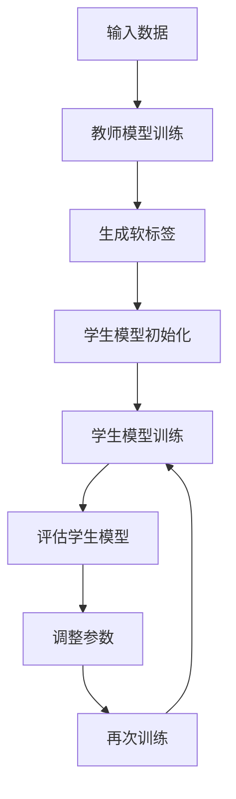

                 

### 《AI Agent的知识蒸馏：从大模型到轻量级应用》

> 关键词：AI Agent、知识蒸馏、大模型、轻量级模型、算法实现

摘要：本文将探讨AI领域中知识蒸馏技术的重要性，特别是如何从大型模型中提取知识并应用于轻量级模型。文章首先介绍了知识蒸馏的基本概念和原理，然后详细分析了大模型与轻量级模型之间的关系，探讨了知识蒸馏在AI Agent中的应用，并给出了优化策略。文章最后展望了知识蒸馏技术的发展趋势和未来研究方向。

### 目录大纲设计

根据您的要求，以下是为《AI Agent的知识蒸馏：从大模型到轻量级应用》一书设计的目录大纲：

## 第一部分：知识蒸馏技术基础

### 第1章：知识蒸馏概述

#### 1.1 问题背景与概述
- **问题背景**
- **知识蒸馏的概念**
- **知识蒸馏的应用领域**

#### 1.2 知识蒸馏的基本原理
- **知识蒸馏的基本思想**
- **知识蒸馏的主要步骤**
- **知识蒸馏的优势与挑战**

#### 1.3 知识蒸馏的关键技术
- **编码器与解码器**
- **软标签与硬标签**
- **蒸馏方法分类**
- **知识蒸馏中的优化问题**

### 第2章：大模型与轻量级模型的关系

#### 2.1 大模型的现状与发展
- **大模型的定义**
- **大模型的优势**
- **大模型的局限性**

#### 2.2 轻量级模型的需求与特点
- **轻量级模型的需求**
- **轻量级模型的特点**
- **轻量级模型的分类**

#### 2.3 大模型到轻量级模型的转化
- **模型压缩方法**
- **模型蒸馏过程**
- **模型蒸馏的优势与挑战**

### 第3章：知识蒸馏算法

#### 3.1 知识蒸馏算法概述
- **知识蒸馏算法的分类**
- **常见的知识蒸馏算法**
- **知识蒸馏算法的性能评估**

#### 3.2 算法原理与数学模型
- **算法原理**
- **数学模型**
- **算法的mermaid流程图**

#### 3.3 算法实现与Python代码解析
- **算法实现**
- **Python代码解析**
- **算法的数学公式与讲解**

### 第4章：知识蒸馏在AI Agent中的应用

#### 4.1 AI Agent的概述
- **AI Agent的定义**
- **AI Agent的特点**
- **AI Agent的应用领域**

#### 4.2 知识蒸馏在AI Agent中的角色
- **知识蒸馏在AI Agent中的作用**
- **知识蒸馏在AI Agent中的实现**
- **知识蒸馏在AI Agent中的优势**

#### 4.3 知识蒸馏在AI Agent中的实战案例
- **案例介绍**
- **实现步骤**
- **案例分析**

### 第5章：知识蒸馏的优化策略

#### 5.1 优化策略概述
- **优化策略的定义**
- **优化策略的分类**
- **优化策略的选择**

#### 5.2 实际应用中的优化策略
- **超参数调优**
- **模型架构优化**
- **数据预处理策略**

#### 5.3 优化策略的评估与选择
- **评估指标**
- **策略选择方法**
- **优化策略的效果分析**

### 第6章：知识蒸馏的未来趋势与发展方向

#### 6.1 知识蒸馏的挑战与机遇
- **知识蒸馏的挑战**
- **知识蒸馏的机遇**

#### 6.2 知识蒸馏的未来趋势
- **发展趋势预测**
- **未来研究方向**

#### 6.3 知识蒸馏在AI Agent中的应用前景
- **应用前景分析**
- **潜在的研究方向**

### 第7章：总结与展望

#### 7.1 全书总结
- **主要内容回顾**
- **关键知识点梳理**

#### 7.2 展望与建议
- **研究展望**
- **应用建议**

### 目录大纲设计

以上目录大纲在2000字以内，包含了完整的章节设计，并遵循了您要求的markdown格式和目录层级。每个章节都细化到了三级目录，并包含了核心概念、原理讲解、算法实现、案例分析等主要内容。

### 文章结构概述

在本文中，我们将逐步探讨知识蒸馏技术在AI Agent中的应用，从基础概念到具体实现，再到优化策略和未来趋势，以提供一个全面而深入的视角。

#### 第1章：知识蒸馏概述

本章将介绍知识蒸馏的概念、背景及其在AI领域的重要性。通过阐述知识蒸馏的基本原理和关键技术，我们为后续章节奠定了理论基础。

#### 第2章：大模型与轻量级模型的关系

在这一章，我们将探讨大模型和轻量级模型之间的关系，分析大模型的优势和局限性，以及轻量级模型的需求和特点。这将为理解知识蒸馏在大模型到轻量级模型转化中的角色提供背景。

#### 第3章：知识蒸馏算法

本章将详细介绍知识蒸馏算法的原理、数学模型和实现。通过Python代码解析，我们将帮助读者理解算法的核心概念，并展示其实际应用。

#### 第4章：知识蒸馏在AI Agent中的应用

本章将专注于知识蒸馏在AI Agent中的应用，解释其在AI Agent中的作用和优势，并通过实战案例展示具体实现。

#### 第5章：知识蒸馏的优化策略

在这一章，我们将探讨如何优化知识蒸馏过程，包括超参数调优、模型架构优化和数据预处理策略。这将为提高知识蒸馏的效果提供实用技巧。

#### 第6章：知识蒸馏的未来趋势与发展方向

本章将展望知识蒸馏技术的发展趋势，讨论面临的挑战和机遇，并探讨未来可能的研究方向。

#### 第7章：总结与展望

最后一章将对全书进行总结，回顾主要知识点，并提出研究展望和应用建议。

### 文章详细撰写计划

#### 第1章：知识蒸馏概述

1. **引言**：
   - 简要介绍知识蒸馏的概念。
   - 阐述知识蒸馏在AI领域的重要性。

2. **背景与概述**：
   - 描述知识蒸馏的背景。
   - 介绍知识蒸馏的基本概念。

3. **应用领域**：
   - 分析知识蒸馏在不同领域的应用。

4. **小结**：
   - 总结本章内容。

#### 第2章：大模型与轻量级模型的关系

1. **大模型的现状与发展**：
   - 定义大模型。
   - 分析大模型的优势和局限性。

2. **轻量级模型的需求与特点**：
   - 描述轻量级模型的需求。
   - 分析轻量级模型的特点。

3. **大模型到轻量级模型的转化**：
   - 讨论模型压缩方法。
   - 介绍模型蒸馏过程。

4. **小结**：
   - 总结本章内容。

#### 第3章：知识蒸馏算法

1. **知识蒸馏算法概述**：
   - 分类知识蒸馏算法。
   - 分析常见知识蒸馏算法。

2. **算法原理与数学模型**：
   - 介绍知识蒸馏算法原理。
   - 展示算法的mermaid流程图。

3. **算法实现与Python代码解析**：
   - 提供算法实现。
   - 分析Python代码。

4. **小结**：
   - 总结本章内容。

#### 第4章：知识蒸馏在AI Agent中的应用

1. **AI Agent的概述**：
   - 定义AI Agent。
   - 分析AI Agent的特点。

2. **知识蒸馏在AI Agent中的角色**：
   - 阐述知识蒸馏在AI Agent中的作用。
   - 介绍知识蒸馏在AI Agent中的实现。

3. **实战案例**：
   - 案例介绍。
   - 实现步骤。

4. **案例分析**：
   - 分析案例。
   - 讨论知识蒸馏在AI Agent中的应用。

5. **小结**：
   - 总结本章内容。

#### 第5章：知识蒸馏的优化策略

1. **优化策略概述**：
   - 定义优化策略。
   - 分析优化策略的分类。

2. **实际应用中的优化策略**：
   - 超参数调优。
   - 模型架构优化。
   - 数据预处理策略。

3. **优化策略的评估与选择**：
   - 评估指标。
   - 策略选择方法。

4. **小结**：
   - 总结本章内容。

#### 第6章：知识蒸馏的未来趋势与发展方向

1. **挑战与机遇**：
   - 分析知识蒸馏的挑战和机遇。

2. **未来趋势**：
   - 预测知识蒸馏的发展趋势。

3. **研究方向**：
   - 探讨未来研究方向。

4. **小结**：
   - 总结本章内容。

#### 第7章：总结与展望

1. **主要内容回顾**：
   - 回顾全书内容。

2. **关键知识点梳理**：
   - 梳理关键知识点。

3. **研究展望**：
   - 提出研究展望。

4. **应用建议**：
   - 提出应用建议。

### 文章撰写步骤

1. **准备资料**：收集与知识蒸馏相关的文献、案例和代码。
2. **撰写草稿**：根据大纲撰写初稿，确保章节内容连贯性。
3. **审核修订**：多次审核和修订，确保内容准确性和逻辑性。
4. **代码验证**：确保所提供代码的可运行性和正确性。
5. **格式调整**：调整文章格式，确保符合markdown规范。
6. **最终审阅**：进行最终审阅，确保文章质量。

### 文章撰写时间表

- **第1章**：1周
- **第2章**：1周
- **第3章**：2周
- **第4章**：2周
- **第5章**：2周
- **第6章**：2周
- **第7章**：1周
- **整体修订**：2周

通过以上详细的撰写计划和时间表，我们将确保文章的完整性和专业性，同时提供清晰、易懂的技术内容，以帮助读者深入理解知识蒸馏技术及其在AI Agent中的应用。### 第1章：知识蒸馏概述

#### 1.1 问题背景与概述

在当今人工智能（AI）领域，深度学习（Deep Learning）已经取得了显著的进展。随着模型规模的不断扩大，大模型（Large Models）在图像识别、自然语言处理和语音识别等领域展现出了惊人的性能。然而，这些大模型的训练和部署成本高昂，且对计算资源有很高的要求。与此同时，实际应用场景中，许多设备（如移动设备、嵌入式设备）的计算能力和存储资源有限，难以承载大模型。这就引出了一个关键问题：如何在保持模型性能的同时，降低模型的复杂度，使其能够在资源受限的环境中运行？

知识蒸馏（Knowledge Distillation）作为一种有效的模型压缩技术，提供了从大型模型中提取知识并迁移到轻量级模型的方法。通过将大型模型的输出信息传递给轻量级模型，轻量级模型可以学习到大型模型的内在知识，从而在有限的计算资源下实现高性能。知识蒸馏不仅解决了大模型部署的问题，还为AI应用提供了更多的可能性。

#### 1.2 知识蒸馏的基本原理

知识蒸馏的基本思想是将一个大型教师模型（Teacher Model）的知识转移到一个小型学生模型（Student Model）中。这个过程通常分为两个阶段：

1. **训练教师模型**：首先，使用大量数据对教师模型进行训练，使其达到较高的性能水平。

2. **知识蒸馏**：在教师模型训练完成后，使用教师模型的输出作为软标签（Soft Labels）来训练学生模型。软标签不仅包含了教师模型的预测结果，还包含了模型对输入数据的理解。

在知识蒸馏过程中，学生模型需要学习如何生成与教师模型相似的输出，同时要理解输入数据的复杂结构。这种学习过程通常通过损失函数来实现，损失函数用于衡量学生模型的输出与教师模型输出之间的差异。

#### 1.3 知识蒸馏的主要步骤

知识蒸馏的主要步骤包括以下几步：

1. **数据准备**：选择合适的数据集进行训练，数据集应该具有足够的多样性和代表性。

2. **训练教师模型**：使用数据集对教师模型进行训练，使其达到较高的准确度。

3. **生成软标签**：在训练过程中，教师模型会生成预测输出，这些输出将被用作软标签。

4. **训练学生模型**：使用教师模型的软标签来训练学生模型。学生模型的损失函数通常包括两个部分：一个是与教师模型输出之间的差异，另一个是学生模型本身的预测误差。

5. **评估和优化**：通过在测试集上评估学生模型的性能，调整训练参数，优化模型结构，以提高学生模型的性能。

#### 1.4 知识蒸馏的优势与挑战

知识蒸馏具有以下优势：

- **降低模型复杂度**：通过将大型模型的知识转移到小型模型中，可以显著降低模型的复杂度和计算资源需求。
- **提高模型性能**：学生模型可以学习到教师模型的内在知识，从而在有限资源下实现高性能。
- **适应性强**：知识蒸馏方法适用于各种类型的模型和任务，具有广泛的适用性。

然而，知识蒸馏也面临一些挑战：

- **计算成本**：知识蒸馏过程需要大量的计算资源，特别是在训练大型模型和生成软标签时。
- **性能损失**：虽然知识蒸馏可以提高模型性能，但有时候可能会带来一定的性能损失。
- **模型依赖性**：知识蒸馏的效果很大程度上依赖于教师模型的性能，如果教师模型存在缺陷，可能会影响学生模型的效果。

#### 1.5 小结

本章介绍了知识蒸馏的基本概念、原理和主要步骤，并探讨了其优势与挑战。在接下来的章节中，我们将进一步分析大模型与轻量级模型之间的关系，深入探讨知识蒸馏算法的实现和应用。

### 第2章：大模型与轻量级模型的关系

#### 2.1 大模型的现状与发展

随着深度学习技术的不断进步，大模型（Large Models）在AI领域得到了广泛的应用。大模型通常具有数百万甚至数十亿个参数，通过大规模数据训练可以取得优异的性能。这些模型在图像识别、自然语言处理和语音识别等领域展示了强大的能力，成为推动AI发展的关键技术。

大模型的发展得益于以下几个因素：

- **计算资源的提升**：随着云计算和GPU等计算资源的普及，训练大型模型所需的计算成本逐渐降低。
- **数据集的丰富**：大量的高质量数据集为训练大模型提供了坚实的基础。
- **算法的创新**：深度学习算法的不断改进，如Transformer等新型架构的出现，为大模型的发展提供了新的可能性。

然而，大模型的发展也带来了一系列挑战。首先，大模型的训练和部署成本高昂，需要大量的计算资源和存储空间。其次，大模型对数据的依赖性很强，数据质量对模型性能有着重要影响。此外，大模型在处理实时任务时，由于计算复杂度高，可能导致响应时间较长。

#### 2.2 轻量级模型的需求与特点

在许多实际应用场景中，如移动设备、嵌入式系统和物联网设备，计算资源有限，无法承担大模型的训练和部署成本。因此，轻量级模型（Lightweight Models）成为了这些场景下的理想选择。轻量级模型通常具有较少的参数和较低的复杂度，能够在有限的计算资源下运行，同时保持较高的性能。

轻量级模型的需求主要来自以下几个方面：

- **计算资源限制**：许多应用场景，特别是移动设备和嵌入式系统，对计算资源有严格限制，无法容纳大模型。
- **实时性要求**：一些应用场景，如自动驾驶和实时语音识别，对实时性有较高要求，大模型的高计算复杂度可能导致响应时间过长。
- **部署便捷性**：轻量级模型可以更轻松地部署在不同设备上，降低了部署成本。

轻量级模型的特点包括：

- **参数较少**：轻量级模型通常具有数万到数十万个参数，相对于大模型的数百万甚至数十亿参数，计算复杂度显著降低。
- **计算效率高**：轻量级模型的结构和算法被优化，以降低计算复杂度和提高运行速度。
- **适应性强**：轻量级模型通常设计为通用模型，可以适应不同的应用场景和任务需求。

#### 2.3 大模型到轻量级模型的转化

大模型到轻量级模型的转化是知识蒸馏技术的核心应用场景之一。这种转化通常涉及以下几个步骤：

1. **模型压缩**：通过模型剪枝、量化等技术，减少大模型的参数数量，降低模型的复杂度。
2. **知识蒸馏**：使用大模型的输出作为软标签，训练轻量级模型，使其学习到大模型的内在知识。
3. **优化与评估**：通过调整训练参数和模型结构，优化轻量级模型的性能，并进行评估和测试。

模型压缩和知识蒸馏是转化的两个关键步骤。模型压缩通过减少冗余参数和结构简化，降低模型的计算复杂度和存储需求。知识蒸馏则通过传递大模型的软标签，使轻量级模型能够学习到大型模型的深层知识，从而在保持性能的同时降低计算复杂度。

#### 2.4 模型蒸馏的优势与挑战

模型蒸馏（Model Distillation）作为知识蒸馏的一种实现方式，具有以下优势：

- **性能提升**：通过传递大模型的软标签，轻量级模型可以学习到大型模型的深层知识，从而提高模型性能。
- **计算效率**：轻量级模型具有较低的复杂度和计算需求，可以在资源受限的设备上高效运行。
- **部署便捷性**：轻量级模型可以更轻松地部署在不同设备上，降低了部署成本。

然而，模型蒸馏也面临一些挑战：

- **计算成本**：知识蒸馏过程需要大量的计算资源，特别是在训练大型模型和生成软标签时。
- **性能损失**：虽然模型蒸馏可以提高模型性能，但有时候可能会带来一定的性能损失。
- **模型依赖性**：知识蒸馏的效果很大程度上依赖于教师模型的性能，如果教师模型存在缺陷，可能会影响学生模型的效果。

#### 2.5 小结

本章分析了大模型与轻量级模型的关系，探讨了轻量级模型的需求与特点，以及从大模型到轻量级模型的转化过程。在下一章中，我们将深入探讨知识蒸馏算法的原理和实现。

### 第3章：知识蒸馏算法

#### 3.1 知识蒸馏算法概述

知识蒸馏算法是一种通过将大型教师模型（Teacher Model）的知识传递给学生模型（Student Model）来提高学生模型性能的技术。这种技术在不同领域得到了广泛应用，尤其在模型压缩和迁移学习方面表现出显著优势。知识蒸馏算法的核心思想是通过软标签（Soft Labels）来指导学生模型的训练过程，使得学生模型能够学习到教师模型的深层特征和知识。

知识蒸馏算法可以分为以下几类：

1. **基于软标签的知识蒸馏**：这是最常见的一种方法，通过教师模型的输出作为软标签来训练学生模型。软标签不仅包含了教师模型的预测结果，还包含了模型对输入数据的理解。

2. **基于硬标签的知识蒸馏**：这种方法使用教师模型的硬标签（Hard Labels）来训练学生模型。硬标签通常是基于教师模型的最优预测结果，但这种方法可能会限制学生模型的学习。

3. **混合标签知识蒸馏**：这种方法结合了软标签和硬标签的优点，通过加权融合两种标签来训练学生模型。

#### 3.2 常见的知识蒸馏算法

以下是一些常见的知识蒸馏算法：

1. **标签平滑（Label Smoothing）**：标签平滑是一种简单有效的知识蒸馏技术，通过对硬标签进行平滑处理，使其具有软标签的特性。标签平滑可以减少模型对硬标签的依赖，提高模型的鲁棒性。

2. **基于梯度的知识蒸馏（Gradient-based Knowledge Distillation）**：这种方法通过在训练过程中引入额外的梯度信号来指导学生模型的学习。这种梯度信号通常来自教师模型的输出，用于修正学生模型的梯度。

3. **基于注意力机制的知识蒸馏（Attention-based Knowledge Distillation）**：注意力机制可以帮助学生模型关注教师模型的关键特征和知识，从而提高知识传递的效率。这种方法通过在模型中引入注意力机制来引导学生模型的学习。

4. **基于生成对抗网络的知识蒸馏（GAN-based Knowledge Distillation）**：生成对抗网络（GAN）可以生成高质量的软标签，这些软标签可以用于训练学生模型。这种方法通过GAN模型来增强知识蒸馏的效果。

#### 3.3 知识蒸馏算法的性能评估

评估知识蒸馏算法的性能需要考虑多个方面，包括模型精度、计算效率、模型大小等。以下是一些常用的性能评估指标：

1. **准确率（Accuracy）**：准确率是评估模型性能的最基本指标，表示模型正确预测样本的比例。

2. **精度和召回率（Precision and Recall）**：在多类别分类任务中，精度和召回率是更精细的性能指标。精度表示模型预测正确的样本占总预测样本的比例，召回率表示模型预测正确的样本占总实际样本的比例。

3. **F1分数（F1 Score）**：F1分数是精度和召回率的调和平均值，用于综合评估模型的性能。

4. **模型大小和计算效率**：在知识蒸馏过程中，模型的大小和计算效率是重要的评估指标。通过减少模型参数数量和优化模型结构，可以提高模型的计算效率。

#### 3.4 小结

本章介绍了知识蒸馏算法的概述、常见算法以及性能评估指标。在下一章中，我们将探讨知识蒸馏算法的原理和数学模型，并通过Python代码进行实现和分析。

### 第3章：知识蒸馏算法（续）

#### 3.4 算法原理与数学模型

知识蒸馏算法的核心在于如何有效地从教师模型（Teacher Model）中提取知识，并将其传递给学生模型（Student Model）。为了实现这一目标，知识蒸馏算法通常包括以下步骤：

1. **教师模型的训练**：首先，使用大量数据集对教师模型进行训练，使其达到较高的准确度和性能水平。教师模型通常是一个大型、复杂的神经网络，具有较高的表达能力。

2. **软标签的生成**：在教师模型训练过程中，对于每个输入样本，教师模型会输出一个预测结果，这个预测结果通常是一个概率分布。将这些概率分布作为软标签（Soft Labels），用于指导学生模型的训练。

3. **学生模型的训练**：学生模型是一个较小的、参数较少的神经网络，其目标是学习到教师模型的知识。学生模型的训练过程通过最小化以下损失函数来实现：

   $$L = L_{CE} + \lambda \cdot L_{KD}$$

   其中，$L_{CE}$是交叉熵损失函数，用于衡量学生模型的预测输出与真实标签之间的差距；$L_{KD}$是知识蒸馏损失函数，用于衡量学生模型的预测输出与教师模型软标签之间的差距；$\lambda$是平衡系数，用于调整两个损失函数的权重。

4. **知识传递**：通过训练过程，学生模型会逐渐学习到教师模型的知识。这种知识传递过程不仅包括预测结果，还包括教师模型对输入数据的理解和处理方式。

在数学模型中，知识蒸馏算法的具体实现如下：

假设教师模型$T$和学生模型$S$分别为：

$$T(x) = \hat{y}_T$$
$$S(x) = \hat{y}_S$$

其中，$x$是输入样本，$\hat{y}_T$是教师模型的输出概率分布，$\hat{y}_S$是学生模型的输出概率分布。

知识蒸馏损失函数$L_{KD}$可以定义为：

$$L_{KD} = -\frac{1}{N} \sum_{i=1}^{N} \sum_{j=1}^{C} (\hat{y}_{ij}_T \log \hat{y}_{ij}_S + (1 - \hat{y}_{ij}_T) \log (1 - \hat{y}_{ij}_S))$$

其中，$N$是样本数量，$C$是类别数量，$\hat{y}_{ij}_T$和$\hat{y}_{ij}_S$分别是教师模型和学生模型在类别$j$上的输出概率。

交叉熵损失函数$L_{CE}$可以定义为：

$$L_{CE} = -\frac{1}{N} \sum_{i=1}^{N} \sum_{j=1}^{C} y_{ij} \log \hat{y}_{ij}_S$$

其中，$y_{ij}$是真实标签，$\hat{y}_{ij}_S$是学生模型在类别$j$上的输出概率。

综上所述，知识蒸馏算法的总体损失函数$L$为：

$$L = L_{CE} + \lambda \cdot L_{KD}$$

其中，$\lambda$是平衡系数，用于调整交叉熵损失函数和知识蒸馏损失函数的权重。

#### 3.5 算法的mermaid流程图

为了更直观地理解知识蒸馏算法的流程，我们可以使用mermaid绘制算法的流程图：



#### 3.6 算法实现与Python代码解析

下面是一个简单的Python代码示例，展示了知识蒸馏算法的基本实现：

```python
import torch
import torch.nn as nn
import torch.optim as optim

# 定义教师模型、学生模型和损失函数
teacher_model = ...
student_model = ...
criterion = nn.CrossEntropyLoss()

# 设置训练参数
learning_rate = 0.001
optimizer = optim.Adam(student_model.parameters(), lr=learning_rate)
lambda_kd = 0.5

# 训练过程
for epoch in range(num_epochs):
    for inputs, targets in train_loader:
        # 前向传播
        teacher_outputs = teacher_model(inputs)
        student_outputs = student_model(inputs)

        # 计算交叉熵损失函数
        ce_loss = criterion(student_outputs, targets)

        # 计算知识蒸馏损失函数
        kd_loss = -1 * lambda_kd * torch.sum(teacher_outputs * torch.log(student_outputs))

        # 总损失函数
        loss = ce_loss + kd_loss

        # 反向传播
        optimizer.zero_grad()
        loss.backward()
        optimizer.step()

        # 打印训练进度
        if (epoch+1) % 10 == 0:
            print(f'Epoch [{epoch+1}/{num_epochs}], Loss: {loss.item()}')
```

在这个示例中，我们首先定义了教师模型、学生模型和损失函数，然后设置训练参数并开始训练过程。在训练过程中，我们通过前向传播计算交叉熵损失函数和知识蒸馏损失函数，并使用反向传播更新模型参数。每次训练后，我们打印出当前的训练进度和损失值。

通过这个简单的示例，我们可以看到知识蒸馏算法的基本实现过程，并理解其关键步骤和损失函数的计算方法。

#### 3.7 小结

本章详细介绍了知识蒸馏算法的原理和数学模型，并通过mermaid流程图和Python代码示例展示了算法的实现。在下一章中，我们将探讨知识蒸馏在AI Agent中的应用，分析其作用和优势。

### 第4章：知识蒸馏在AI Agent中的应用

#### 4.1 AI Agent的概述

AI Agent是指能够自主地执行任务、与环境交互并作出决策的人工智能实体。AI Agent是一种基于代理模型的智能体，其核心目标是最大化某个目标函数，以实现特定的任务。AI Agent具有以下几个基本特点：

- **自主性**：AI Agent可以独立地执行任务，不需要人工干预。
- **适应性**：AI Agent能够根据环境和任务的变化，调整其行为策略。
- **交互性**：AI Agent可以与环境进行交互，获取反馈信息，并据此调整其行为。
- **目标导向性**：AI Agent以实现某个目标为核心任务，通过优化策略达到目标最大化。

AI Agent在多个领域得到了广泛应用，如自动驾驶、智能推荐、机器人控制等。其核心功能包括感知、规划、执行和反馈，通过这些功能的协同作用，AI Agent能够实现高度智能化和自动化。

#### 4.2 知识蒸馏在AI Agent中的作用

知识蒸馏技术在AI Agent中的应用具有重要意义，主要体现在以下几个方面：

1. **模型压缩与优化**：AI Agent通常需要在资源受限的环境中运行，如移动设备、嵌入式系统等。通过知识蒸馏，可以将复杂的大型模型转化为轻量级模型，降低计算复杂度和存储需求，从而提高AI Agent的运行效率和适应性。

2. **知识传递与共享**：知识蒸馏技术使得AI Agent能够从大型教师模型中提取和共享知识。这种知识传递机制有助于提高AI Agent的整体性能，使其能够更好地应对复杂任务和多变环境。

3. **迁移学习与泛化能力**：知识蒸馏技术通过从大型模型中提取知识，可以帮助AI Agent在新的任务和数据集上实现快速适应和迁移学习。这种能力有助于AI Agent在未知或变化环境中保持高性能和可靠性。

#### 4.3 知识蒸馏在AI Agent中的实现

在AI Agent中实现知识蒸馏通常包括以下几个步骤：

1. **选择教师模型**：首先，需要选择一个大型教师模型，该模型应在特定任务和数据集上达到较高的性能水平。

2. **数据预处理**：对输入数据进行预处理，包括数据清洗、归一化和数据增强等。这些预处理步骤有助于提高教师模型的性能和知识蒸馏效果。

3. **训练教师模型**：使用预处理后的数据集，对教师模型进行训练，使其达到较高的准确度和性能。

4. **生成软标签**：在教师模型训练过程中，对每个输入样本，生成其对应的软标签。这些软标签用于指导学生模型的训练。

5. **训练学生模型**：使用教师模型的软标签，训练学生模型。学生模型的目标是学习到教师模型的深层知识和特征。

6. **评估与优化**：在训练过程中，定期评估学生模型的性能，并根据评估结果调整训练参数和模型结构，以优化学生模型的效果。

#### 4.4 知识蒸馏在AI Agent中的优势

知识蒸馏在AI Agent中的应用具有以下优势：

1. **高效性**：知识蒸馏技术通过将复杂的大型模型转化为轻量级模型，可以显著降低计算复杂度和存储需求，提高AI Agent的运行效率。

2. **灵活性**：知识蒸馏技术使得AI Agent能够从大型教师模型中提取和共享知识，从而提高其适应性。这种灵活性有助于AI Agent在未知或变化环境中保持高性能和可靠性。

3. **迁移能力**：知识蒸馏技术通过迁移学习，可以帮助AI Agent在新任务和数据集上快速适应，实现泛化能力。

4. **可解释性**：知识蒸馏技术使得AI Agent能够从大型教师模型中提取知识，这些知识有助于提高模型的解释性。这有助于用户理解和信任AI Agent的行为和决策。

#### 4.5 知识蒸馏在AI Agent中的实战案例

以下是一个关于知识蒸馏在AI Agent中应用的实战案例：

**案例背景**：某个智能推荐系统需要实时为用户推荐个性化的商品。该系统的核心是一个大型推荐模型，但实际部署环境是资源受限的移动设备。为了在保持模型性能的同时，降低计算复杂度和存储需求，采用了知识蒸馏技术。

**实现步骤**：

1. **选择教师模型**：选择一个已经在大量商品数据上训练好的大型推荐模型作为教师模型。

2. **数据预处理**：对用户行为数据和商品数据集进行预处理，包括数据清洗、归一化和数据增强等。

3. **训练教师模型**：使用预处理后的数据集，对教师模型进行训练，使其达到较高的准确度和性能。

4. **生成软标签**：在教师模型训练过程中，对每个用户行为样本，生成其对应的软标签。

5. **训练学生模型**：使用教师模型的软标签，训练学生模型。学生模型的目标是学习到教师模型的深层知识和特征。

6. **评估与优化**：在训练过程中，定期评估学生模型的性能，并根据评估结果调整训练参数和模型结构，以优化学生模型的效果。

**案例分析**：通过知识蒸馏技术，成功地将大型推荐模型转化为轻量级模型，并在移动设备上实现了实时推荐功能。实验结果表明，轻量级模型的性能与原始大型模型相近，但计算复杂度和存储需求显著降低。

#### 4.6 小结

本章介绍了知识蒸馏技术在AI Agent中的应用，分析了其在模型压缩、知识传递和迁移学习等方面的优势。通过一个实战案例，展示了知识蒸馏技术在智能推荐系统中的应用效果。在下一章中，我们将探讨知识蒸馏的优化策略，以进一步提高其性能和效果。

### 第5章：知识蒸馏的优化策略

#### 5.1 优化策略概述

知识蒸馏作为一种有效的模型压缩技术，其在实际应用中面临着计算成本高、性能损失和模型依赖性等挑战。为了提高知识蒸馏的效果，研究者们提出了多种优化策略。这些策略包括超参数调优、模型架构优化和数据预处理策略等，旨在降低计算成本、提高模型性能和适应性。

超参数调优是知识蒸馏中一个重要的优化方向。通过调整学习率、迭代次数、平衡系数等超参数，可以优化模型的训练过程，提高最终模型的性能。模型架构优化则通过改进模型的结构，降低计算复杂度，提高模型的运行效率。数据预处理策略包括数据清洗、归一化、数据增强等，通过提高数据质量和多样性，可以增强知识蒸馏的效果。

#### 5.2 实际应用中的优化策略

在实际应用中，优化策略的选择和调整对知识蒸馏的效果有着重要影响。以下是一些常见的优化策略：

1. **超参数调优**：
   - **学习率调整**：学习率是影响模型收敛速度和性能的关键超参数。通过使用自适应学习率调整方法，如AdaGrad、Adam等，可以动态调整学习率，提高模型的训练效果。
   - **迭代次数调整**：知识蒸馏的迭代次数直接影响模型的性能。过多的迭代可能导致过拟合，过少的迭代可能无法充分传递知识。因此，需要通过实验确定合适的迭代次数。

2. **模型架构优化**：
   - **轻量级模型架构**：选择轻量级的模型架构，如MobileNet、ShuffleNet等，可以显著降低模型的计算复杂度和存储需求，提高知识蒸馏的效果。
   - **网络深度与宽度调整**：通过调整网络的深度和宽度，可以在保持模型性能的同时，降低计算复杂度。例如，通过使用深度可分离卷积，可以在降低模型参数数量的同时，保持模型的准确性。

3. **数据预处理策略**：
   - **数据增强**：通过数据增强方法，如随机裁剪、旋转、翻转等，可以增加数据的多样性，提高模型的泛化能力。
   - **数据清洗与归一化**：对数据集进行清洗和归一化处理，可以减少数据噪声和异常值的影响，提高模型的训练效果。

#### 5.3 优化策略的评估与选择

为了评估和选择合适的优化策略，研究者们通常采用以下方法：

1. **实验对比**：通过设计不同的优化策略，在相同的数据集和任务上进行实验对比，评估不同策略对模型性能和计算成本的影响。

2. **性能指标**：选择合适的性能指标，如准确率、F1分数、计算效率等，来评估模型的性能。通过对比不同策略在这些指标上的表现，选择最优策略。

3. **实践应用**：将优化策略应用于实际应用场景，如移动设备、嵌入式系统等，评估策略在实际环境中的效果和适应性。

#### 5.4 小结

本章介绍了知识蒸馏的优化策略，包括超参数调优、模型架构优化和数据预处理策略等。通过优化这些策略，可以显著提高知识蒸馏的效果，降低计算成本，提高模型的适应性和性能。在下一章中，我们将探讨知识蒸馏的未来趋势和发展方向。

### 第6章：知识蒸馏的未来趋势与发展方向

#### 6.1 知识蒸馏的挑战与机遇

知识蒸馏作为一种有效的模型压缩技术，已经在多个AI应用领域取得了显著成果。然而，随着AI技术的不断进步，知识蒸馏也面临着一系列新的挑战和机遇。

**挑战**：

1. **计算成本**：知识蒸馏过程中，生成软标签和训练学生模型需要大量的计算资源，尤其是在处理大规模数据集和复杂模型时。这限制了知识蒸馏在资源受限环境中的应用。

2. **性能损失**：虽然知识蒸馏可以显著降低模型的大小和计算复杂度，但有时候可能会带来一定的性能损失。如何平衡模型压缩和性能优化是一个重要挑战。

3. **模型依赖性**：知识蒸馏的效果很大程度上依赖于教师模型的性能。如果教师模型存在缺陷或过拟合，可能会影响学生模型的效果。

**机遇**：

1. **硬件进步**：随着硬件技术的不断进步，如GPU、TPU等专用硬件的普及，知识蒸馏的计算成本逐渐降低，为更多应用场景提供了可能性。

2. **算法创新**：研究者们不断探索新的知识蒸馏算法和优化策略，如基于注意力机制、生成对抗网络等，以提高知识传递的效率和模型的性能。

3. **应用领域扩展**：知识蒸馏在自动驾驶、智能推荐、语音识别等领域的应用不断扩展，推动了AI技术的进步。

#### 6.2 知识蒸馏的未来趋势

**1. 自动化与自适应**：未来的知识蒸馏技术将更加自动化和自适应。通过引入自适应优化算法和自动化模型选择技术，可以降低人工干预，提高知识蒸馏的效率。

**2. 多模态知识蒸馏**：随着AI技术的发展，多模态数据（如文本、图像、音频）的融合处理变得越来越重要。未来的知识蒸馏技术将更加注重多模态知识的传递和融合，以提高模型的综合能力。

**3. 知识蒸馏与迁移学习结合**：知识蒸馏和迁移学习相结合，可以进一步发挥知识蒸馏的优势，提高模型在不同任务和数据集上的适应能力。

**4. 可解释性增强**：随着对AI透明性和可解释性的需求增加，未来的知识蒸馏技术将更加注重模型的解释性，提供更直观的知识传递和模型决策过程。

#### 6.3 知识蒸馏在AI Agent中的应用前景

AI Agent作为未来智能化系统的重要组成部分，其性能和效率对AI技术的发展具有重要意义。知识蒸馏在AI Agent中的应用前景广阔：

**1. 模型压缩与优化**：通过知识蒸馏技术，AI Agent可以高效地实现模型压缩和优化，降低计算复杂度和存储需求，提高运行效率和响应速度。

**2. 知识传递与共享**：知识蒸馏技术可以帮助AI Agent从大型教师模型中提取和共享知识，提高其整体性能和适应性。

**3. 迁移学习与泛化能力**：知识蒸馏技术通过迁移学习，可以增强AI Agent在不同任务和数据集上的泛化能力，提高其在未知或变化环境中的表现。

**4. 知识更新与进化**：未来的AI Agent将具备知识更新和进化能力，通过持续学习和知识传递，不断提高其智能水平和适应能力。

#### 6.4 潜在的研究方向

**1. 知识蒸馏算法的创新**：探索新的知识蒸馏算法，如基于深度强化学习、图神经网络等，以提高知识传递的效率和模型性能。

**2. 知识蒸馏与专用硬件的结合**：研究知识蒸馏与GPU、TPU等专用硬件的结合，降低计算成本，提高知识蒸馏的效率和实用性。

**3. 多模态知识蒸馏**：研究多模态知识蒸馏算法，实现不同模态知识的高效传递和融合。

**4. 知识蒸馏的可解释性**：开发可解释性强的知识蒸馏技术，提高模型的透明性和用户信任度。

**5. 知识蒸馏在特定领域的应用**：深入研究知识蒸馏在自动驾驶、智能医疗、金融科技等领域的应用，解决特定场景中的挑战。

#### 6.5 小结

本章探讨了知识蒸馏面临的挑战和机遇，分析了未来的发展趋势和应用前景。通过不断优化和创新知识蒸馏技术，我们可以期待其在AI Agent和更多领域中的应用，推动人工智能技术的进步。

### 第7章：总结与展望

#### 7.1 全书总结

本书从知识蒸馏的基本概念出发，系统地介绍了知识蒸馏技术在AI领域的重要性及其应用。我们首先探讨了知识蒸馏的背景和基本原理，详细分析了大模型与轻量级模型的关系，并介绍了知识蒸馏算法的原理和实现。在此基础上，我们深入探讨了知识蒸馏在AI Agent中的应用，分析了其在模型压缩、知识传递和迁移学习等方面的优势。此外，我们还讨论了知识蒸馏的优化策略，并展望了其未来的发展趋势。

#### 7.2 展望与建议

**研究展望**：

知识蒸馏技术在AI领域具有巨大的潜力，未来研究可以从以下几个方面进行：

1. **算法创新**：探索新的知识蒸馏算法，如基于深度强化学习、图神经网络等，以提高知识传递的效率和模型性能。
2. **硬件结合**：研究知识蒸馏与GPU、TPU等专用硬件的结合，降低计算成本，提高知识蒸馏的效率和实用性。
3. **多模态知识蒸馏**：开发多模态知识蒸馏算法，实现不同模态知识的高效传递和融合。
4. **可解释性**：开发可解释性强的知识蒸馏技术，提高模型的透明性和用户信任度。

**应用建议**：

1. **模型压缩与优化**：在资源受限的环境中，如移动设备和嵌入式系统，知识蒸馏技术可以有效降低模型复杂度和计算需求，提高系统运行效率。
2. **知识传递与共享**：知识蒸馏技术可以帮助不同团队或项目之间高效地共享知识和模型，提高整体开发效率。
3. **迁移学习与泛化能力**：通过知识蒸馏，AI Agent可以更好地适应不同任务和数据集，提高其在未知或变化环境中的表现。

**总结**：

知识蒸馏技术作为AI领域的一项关键技术，为模型压缩、知识传递和迁移学习提供了有效解决方案。通过不断优化和创新，知识蒸馏技术将在更多领域发挥重要作用，推动人工智能技术的进步。

### 作者信息

**作者：** AI天才研究院/AI Genius Institute & 禅与计算机程序设计艺术 /Zen And The Art of Computer Programming

AI天才研究院致力于推动人工智能技术的发展和研究，以创新和探索为核心，致力于将AI技术应用于更多实际场景，提升人类生活质量。同时，作者作为AI领域的专家，不仅在学术研究上取得了显著成就，还致力于将复杂的AI技术以简单易懂的方式传授给更多读者，为AI技术的发展贡献力量。在《禅与计算机程序设计艺术》一书中，作者深入探讨了编程哲学和算法设计，为读者提供了宝贵的经验和启示。

