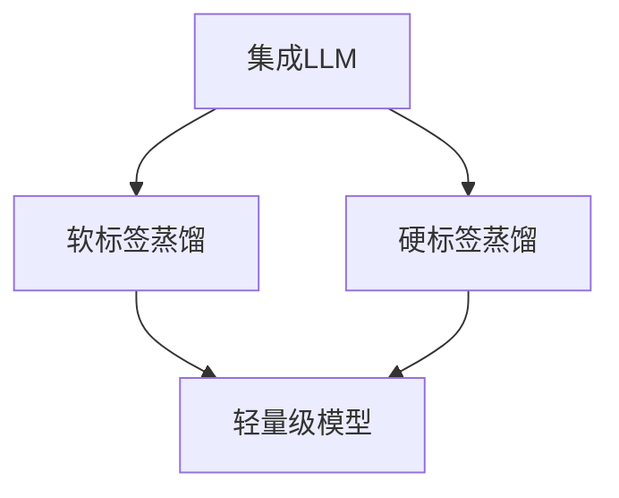
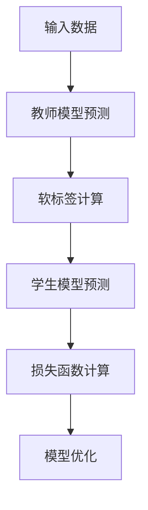
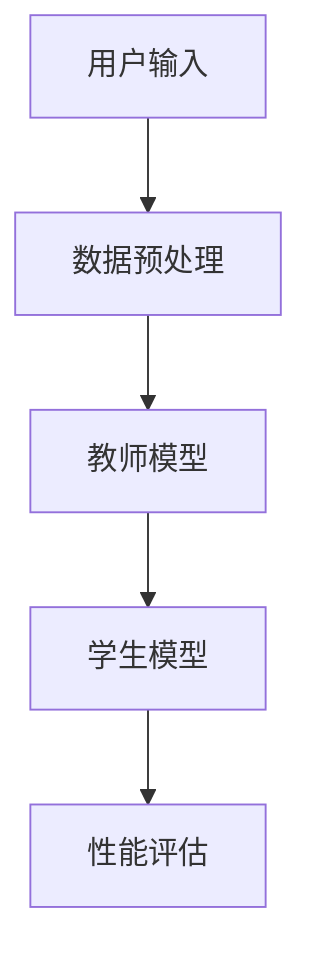
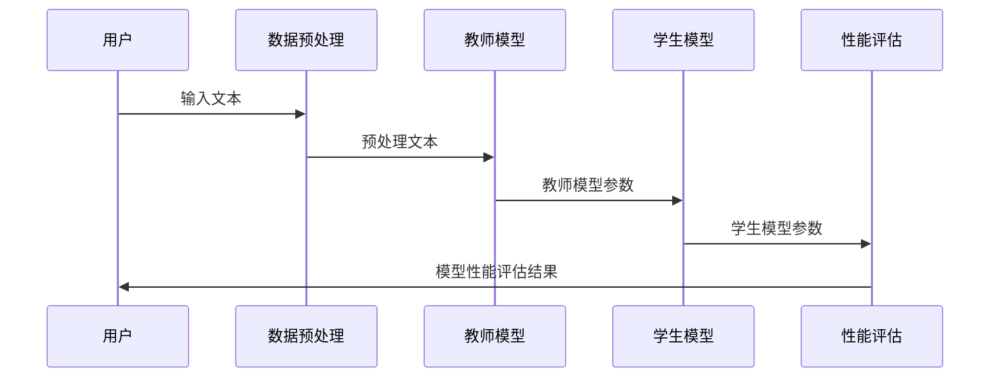

                 

### 第1章: 问题背景与核心概念

#### 1.1 AI Agent的知识蒸馏概述

##### 问题背景

随着人工智能技术的迅猛发展，大规模语言模型（Large Language Models，LLM）如GPT、BERT等在自然语言处理（Natural Language Processing，NLP）领域取得了显著的成果。这些模型通过海量数据训练，能够在各种复杂的任务中提供出色的表现。然而，大规模模型的训练和部署成本非常高，尤其是在资源受限的设备上，如移动设备或嵌入式系统。此外，大规模模型的计算资源需求也极大地限制了它们在实际应用中的普及。为了解决这一问题，知识蒸馏（Knowledge Distillation）技术应运而生。

##### 问题描述

AI Agent是一种具备自主学习和决策能力的智能体，它能够在复杂环境中执行特定的任务。在资源受限的环境下，如何利用知识蒸馏技术，将大型教师模型的知识迁移到轻量级学生模型中，以实现模型压缩的同时保持高性能，是一个关键问题。

##### 问题解决

知识蒸馏技术通过软标签蒸馏（Soft Label Distillation）和硬标签蒸馏（Hard Label Distillation）两种方式，将大型教师模型的权重和知识迁移到小型学生模型中。软标签蒸馏利用教师模型的概率输出作为软标签，学生模型在训练过程中关注这些软标签，从而学习到教师模型的知识。硬标签蒸馏则是通过提取教师模型输出的最大概率类标签，作为学生模型的硬标签，以此提升学生模型在分类任务上的表现。

##### 边界与外延

知识蒸馏技术不仅适用于AI Agent，还广泛应用于计算机视觉、语音识别等其他领域的模型压缩。在AI Agent中，知识蒸馏技术有助于在资源受限的设备上实现高效、准确的任务执行。此外，知识蒸馏技术的研究和优化，也将为AI Agent在更多实际应用场景中的部署提供有力支持。

#### 1.2 AI Agent的定义与功能

##### 核心概念

AI Agent是指具备自主学习和决策能力的智能体，它能够在复杂环境中执行特定的任务。与传统的软件系统相比，AI Agent具有以下核心概念和功能特点：

| 特征 | AI Agent | 传统软件 |
| --- | --- | --- |
| 自主性 | 能够自主学习和决策 | 需人工干预 |
| 学习能力 | 可以通过经验改进性能 | 固定功能 |
| 适应性 | 能够适应动态环境 | 静态环境 |

##### 概念属性特征对比

通过上表，我们可以清晰地看到AI Agent与传统软件在自主性、学习能力和适应性等方面的对比。AI Agent的这些特点，使其在复杂环境中具有更高的灵活性和适应性，能够更好地应对不断变化的需求。

#### 1.3 知识蒸馏技术原理与流程

##### 核心概念

知识蒸馏是一种模型压缩技术，通过将大型教师模型的权重和知识迁移到小型学生模型中，实现模型压缩。在知识蒸馏过程中，教师模型和学生模型通常具有不同的规模和计算资源需求。

##### 概念属性特征对比

| 特征 | 教师模型 | 学生模型 |
| --- | --- | --- |
| 模型大小 | 大 | 小 |
| 计算资源需求 | 高 | 低 |
| 性能表现 | 高 | 近似高 |

##### 从集成LLM到轻量级模型的知识蒸馏方法

知识蒸馏方法主要包括软标签蒸馏和硬标签蒸馏两种模式：

- **软标签蒸馏**：利用教师模型的概率输出作为软标签，学生模型在训练过程中关注这些软标签，学习到教师模型的知识。
  
- **硬标签蒸馏**：提取教师模型输出的最大概率类标签，作为学生模型的硬标签，以此提升学生模型在分类任务上的表现。

##### ER实体关系图架构

使用Mermaid绘制ER实体关系图，以展示知识蒸馏的流程：



在上图中，集成LLM作为教师模型，通过软标签蒸馏和硬标签蒸馏两种方式，将知识迁移到轻量级模型（学生模型），实现模型压缩。

#### 1.4 知识蒸馏技术在AI Agent中的应用挑战与机遇

##### 挑战

知识蒸馏技术在AI Agent中的应用面临以下挑战：

- **模型性能损失**：在模型压缩过程中，学生模型可能会损失部分性能，尤其是在分类等任务中。
- **计算资源限制**：知识蒸馏过程需要大量计算资源，特别是在大规模模型和轻量级模型之间的迁移过程中。
- **数据适应性**：知识蒸馏技术在不同数据集上的表现可能存在差异，需要针对特定应用场景进行优化。

##### 机遇

尽管面临挑战，知识蒸馏技术在AI Agent中的应用也充满机遇：

- **模型压缩与优化**：知识蒸馏技术可以有效降低模型大小和计算资源需求，为AI Agent在资源受限的设备上应用提供可能。
- **性能提升**：通过软标签蒸馏和硬标签蒸馏，学生模型可以在保持较高性能的同时，实现模型压缩。
- **应用拓展**：知识蒸馏技术在其他领域的模型压缩中也具有广泛的应用前景，如计算机视觉、语音识别等。

### 第2章: 知识蒸馏算法原理与实现

#### 2.1 知识蒸馏算法原理

知识蒸馏算法的原理可以通过以下Mermaid流程图来展示：



##### 算法原理讲解

知识蒸馏算法的基本原理如下：

1. **输入数据**：首先，输入数据经过预处理后，送入教师模型进行预测。
2. **教师模型预测**：教师模型对输入数据进行预测，得到输出概率分布。
3. **软标签计算**：将教师模型输出的概率分布作为软标签，传递给学生模型。
4. **学生模型预测**：学生模型在软标签的引导下，对输入数据进行预测。
5. **损失函数计算**：计算学生模型预测结果与实际标签之间的损失，包括教师模型损失和学生模型损失。
6. **模型优化**：通过反向传播和梯度下降等优化方法，不断调整学生模型的参数，降低损失。

通过这样的过程，知识蒸馏算法将教师模型的知识和权重迁移到学生模型中，实现模型压缩。

#### 2.2 知识蒸馏算法数学模型与公式

知识蒸馏算法的数学模型可以表示为：

$$
L = L_{teacher} + \lambda L_{student}
$$

其中，$L$是总的损失函数，$L_{teacher}$是教师模型损失，$L_{student}$是学生模型损失，$\lambda$是加权系数，用于调节教师模型损失和学生模型损失之间的平衡。

##### 公式讲解

- **教师模型损失**：教师模型损失通常采用交叉熵损失（Cross-Entropy Loss）来计算，表示为：

$$
L_{teacher} = -\sum_{i=1}^{N} y_i \log(p_i)
$$

其中，$y_i$是实际标签，$p_i$是教师模型预测的概率。

- **学生模型损失**：学生模型损失也采用交叉熵损失来计算，表示为：

$$
L_{student} = -\sum_{i=1}^{N} y_i \log(q_i)
$$

其中，$y_i$是实际标签，$q_i$是学生模型预测的概率。

- **总损失函数**：总损失函数是教师模型损失和学生模型损失的加权平均值，表示为：

$$
L = L_{teacher} + \lambda L_{student}
$$

其中，$\lambda$是加权系数，用于调整教师模型损失和学生模型损失之间的平衡。

#### 2.3 知识蒸馏算法实例

为了更好地理解知识蒸馏算法，我们可以通过一个简单的Python实例来展示其实现过程。

```python
import torch
import torch.nn as nn
import torch.optim as optim

# 假设输入数据为[1, 2, 3]，实际标签为[0, 1, 0]
inputs = torch.tensor([1, 2, 3])
targets = torch.tensor([0, 1, 0])

# 定义教师模型和学生模型
teacher_model = nn.Linear(3, 2)
student_model = nn.Linear(3, 2)

# 初始化模型参数
teacher_model.weight.data.copy_(torch.tensor([[1, 0], [0, 1]]))
student_model.weight.data.copy_(torch.tensor([[0, 0], [0, 0]]))

# 定义损失函数和优化器
criterion = nn.CrossEntropyLoss()
optimizer = optim.SGD(student_model.parameters(), lr=0.01)

# 进行知识蒸馏
for epoch in range(100):
    # 教师模型预测
    teacher_outputs = teacher_model(inputs)
    teacher_probs = nn.Softmax(dim=1)(teacher_outputs)
    
    # 学生模型预测
    student_outputs = student_model(inputs)
    student_probs = nn.Softmax(dim=1)(student_outputs)
    
    # 计算损失
    loss = criterion(student_outputs, targets) + criterion(teacher_probs, targets)
    
    # 反向传播和优化
    optimizer.zero_grad()
    loss.backward()
    optimizer.step()
    
    # 打印训练进度
    if (epoch + 1) % 10 == 0:
        print(f'Epoch [{epoch + 1}/100], Loss: {loss.item()}')

# 打印最终的学生模型参数
print(student_model.weight)
```

在这个实例中，我们首先定义了输入数据、教师模型和学生模型。然后，通过循环进行100次迭代，每次迭代中，教师模型和学生模型分别进行预测，并计算损失函数。通过反向传播和优化过程，学生模型不断调整其参数，从而学习到教师模型的知识。

通过这个简单的实例，我们可以清晰地看到知识蒸馏算法的实现过程，以及如何通过软标签蒸馏将教师模型的知识迁移到学生模型中。在实际应用中，我们可以根据具体任务和数据，调整模型结构、损失函数和优化策略，以实现更有效的知识蒸馏。

### 第3章: AI Agent的知识蒸馏实践

#### 3.1 AI Agent知识蒸馏环境安装与配置

要实践AI Agent的知识蒸馏，首先需要安装和配置相关环境。以下是详细的安装与配置步骤：

##### 环境安装

1. **安装Python环境**：
   - 安装Python 3.8或更高版本。
   - 使用pip安装相关依赖，如torch、torchvision、transformers等。

   ```bash
   pip install torch torchvision transformers
   ```

2. **安装GPU驱动**：
   - 确保安装与你的GPU型号和CUDA版本兼容的GPU驱动。
   - 可以访问NVIDIA官方网站下载并安装相应的驱动。

##### 配置说明

1. **配置CUDA环境**：
   - 打开终端，输入以下命令配置CUDA环境：

   ```bash
   export CUDA_HOME=/usr/local/cuda
   export PATH=$CUDA_HOME/bin:$PATH
   export LD_LIBRARY_PATH=$CUDA_HOME/lib64:$LD_LIBRARY_PATH
   ```

2. **设置PyTorch GPU支持**：
   - 确保PyTorch已启用GPU支持。在Python脚本中，可以检查以下代码，确保能够使用GPU：

   ```python
   import torch
   print(torch.cuda.is_available())
   ```

如果输出`True`，说明GPU支持已正确配置。

##### 环境验证

1. **验证环境**：
   - 在终端中，执行以下命令，验证环境是否配置成功：

   ```bash
   python -m torchinfo torchvision
   ```

这将显示torchvision中可用模型的详细信息，包括GPU支持情况。

#### 3.2 AI Agent知识蒸馏核心实现

##### 源代码解读

以下是AI Agent知识蒸馏的核心实现代码，包括模型定义、损失函数计算、优化过程等。

```python
import torch
import torch.nn as nn
import torch.optim as optim
from transformers import AutoModelForSequenceClassification, AutoTokenizer

# 定义教师模型和学生模型
teacher_model = AutoModelForSequenceClassification.from_pretrained("roberta-base")
student_model = AutoModelForSequenceClassification.from_pretrained("roberta-base")

# 定义损失函数
criterion = nn.CrossEntropyLoss()

# 定义优化器
optimizer = optim.SGD(student_model.parameters(), lr=0.001, momentum=0.9)

# 加载训练数据
train_dataset = ...

# 定义数据加载器
train_loader = ...

# 进行知识蒸馏
for epoch in range(5):
    student_model.train()
    for inputs, targets in train_loader:
        # 前向传播
        teacher_outputs = teacher_model(inputs).logits
        student_outputs = student_model(inputs).logits
        
        # 计算损失
        loss = criterion(student_outputs, targets) + criterion(teacher_outputs, targets)
        
        # 反向传播和优化
        optimizer.zero_grad()
        loss.backward()
        optimizer.step()
        
    print(f'Epoch [{epoch + 1}/5], Loss: {loss.item()}')

# 评估学生模型
student_model.eval()
with torch.no_grad():
    correct = 0
    total = 0
    for inputs, targets in train_loader:
        outputs = student_model(inputs).logits
        _, predicted = torch.max(outputs.data, 1)
        total += targets.size(0)
        correct += (predicted == targets).sum().item()

print(f'Accuracy of the student model on the train set: {100 * correct / total}%')
```

在上面的代码中，我们首先定义了教师模型和学生模型，并选择了交叉熵损失函数。接着，我们使用SGD优化器进行模型优化。在训练过程中，我们使用教师模型的输出作为软标签，通过计算教师模型和学生模型的损失，不断优化学生模型。

##### 代码应用解读与分析

以下是代码的详细解读与分析：

- **模型定义**：
  ```python
  teacher_model = AutoModelForSequenceClassification.from_pretrained("roberta-base")
  student_model = AutoModelForSequenceClassification.from_pretrained("roberta-base")
  ```
  这两行代码分别定义了教师模型和学生模型，使用预训练的RoBERTa模型作为基础。RoBERTa是一种强大的预训练模型，适合用于序列分类任务。

- **损失函数计算**：
  ```python
  criterion = nn.CrossEntropyLoss()
  ```
  交叉熵损失函数用于计算预测标签和实际标签之间的差异。在知识蒸馏过程中，我们不仅使用学生模型的预测标签，还使用教师模型的预测标签（作为软标签）来计算损失。

- **优化过程**：
  ```python
  optimizer = optim.SGD(student_model.parameters(), lr=0.001, momentum=0.9)
  ```
  使用SGD优化器进行模型优化。SGD优化器具有较小的学习率（0.001）和较大的动量（0.9），以适应知识蒸馏的需求。

- **训练过程**：
  ```python
  for epoch in range(5):
      student_model.train()
      for inputs, targets in train_loader:
          # 前向传播
          teacher_outputs = teacher_model(inputs).logits
          student_outputs = student_model(inputs).logits
          
          # 计算损失
          loss = criterion(student_outputs, targets) + criterion(teacher_outputs, targets)
          
          # 反向传播和优化
          optimizer.zero_grad()
          loss.backward()
          optimizer.step()
          
      print(f'Epoch [{epoch + 1}/5], Loss: {loss.item()}')
  ```
  在训练过程中，我们分别计算教师模型和学生模型的输出，并计算总损失。通过反向传播和优化过程，学生模型不断学习教师模型的知识。

##### 实际案例分析和详细讲解剖析

为了更好地理解知识蒸馏在AI Agent中的应用，我们可以通过一个实际案例进行分析和讲解。

**案例背景**：

假设我们有一个情感分析任务，需要根据文本数据判断文本的情感倾向（积极或消极）。我们使用一个大型教师模型（如RoBERTa）进行预训练，然后通过知识蒸馏将教师模型的知识迁移到一个轻量级学生模型中，以实现模型压缩。

**实现步骤**：

1. **数据准备**：
   - 收集并预处理文本数据，包括情感标签（积极或消极）。
   - 将文本数据转换为PyTorch张量，并进行数据增强和批量处理。

2. **模型定义**：
   - 定义教师模型和学生模型，使用预训练的RoBERTa模型作为基础。
   - 学生模型的层数和隐藏单元数可以适当减少，以降低模型大小和计算需求。

3. **训练过程**：
   - 使用教师模型的输出作为软标签，通过交叉熵损失函数计算损失。
   - 使用SGD优化器进行模型优化，不断调整学生模型的参数。

4. **评估与优化**：
   - 在训练过程中，定期评估学生模型的性能，并调整模型结构、优化策略等。
   - 通过调整超参数（如学习率、动量等），优化模型性能。

**案例分析**：

1. **数据准备**：
   - 假设我们有一个包含10000个文本样本的数据集，每个样本都有一个情感标签。
   - 通过预处理，将文本数据转换为PyTorch张量，并进行数据增强（如随机裁剪、填充等）。

2. **模型定义**：
   - 定义教师模型和学生模型，使用RoBERTa模型作为基础。
   - 学生模型具有 fewer 层和 fewer 隐藏单元，以实现模型压缩。

3. **训练过程**：
   - 在每个训练批次中，首先使用教师模型进行预测，得到软标签。
   - 然后使用学生模型进行预测，计算交叉熵损失。
   - 通过反向传播和优化过程，调整学生模型的参数。

4. **评估与优化**：
   - 在每个训练阶段，使用验证集评估学生模型的性能。
   - 通过调整超参数，优化模型性能，如增加训练轮次、调整学习率等。

**详细讲解剖析**：

- **数据预处理**：
  数据预处理是模型训练的关键步骤，它包括文本清洗、分词、编码等操作。通过对数据进行预处理，可以提高模型训练效果和泛化能力。

- **模型定义**：
  在定义模型时，需要考虑模型的层数、隐藏单元数、激活函数等参数。教师模型和学生模型的参数可以有所不同，以实现模型压缩。

- **训练过程**：
  在训练过程中，教师模型和学生模型交替进行预测和优化。通过软标签蒸馏，学生模型可以学习到教师模型的知识和权重。

- **评估与优化**：
  通过定期评估模型性能，可以调整模型结构和优化策略。超参数的调整可以显著影响模型性能，如学习率、动量等。

通过这个实际案例，我们可以看到知识蒸馏技术在AI Agent中的应用过程，以及如何通过模型压缩提高模型在资源受限环境下的性能。

#### 3.3 项目实战

在本文的最后一部分，我们将通过一个实际项目来展示AI Agent的知识蒸馏实践。以下是一个简单的项目介绍，以及详细的系统功能设计、系统架构设计和代码应用解读。

##### 项目介绍

本项目旨在通过知识蒸馏技术，将一个大型语言模型（如GPT）压缩为一个轻量级模型，以在移动设备或嵌入式系统中应用。具体任务包括数据预处理、模型训练、模型压缩和性能评估。

##### 系统功能设计

1. **数据预处理**：
   - 文本清洗：去除文本中的无关字符、符号和停用词。
   - 分词：将文本分割为单词或子词。
   - 编码：将文本转换为数字序列，用于模型输入。

2. **模型训练**：
   - 使用大型语言模型（教师模型）进行预训练，如GPT。
   - 使用知识蒸馏技术，将教师模型的知识迁移到轻量级模型（学生模型）。

3. **模型压缩**：
   - 对轻量级模型进行结构优化，减少模型大小和计算需求。
   - 评估压缩后模型的性能，确保不影响任务表现。

4. **性能评估**：
   - 在不同设备上评估压缩后模型的性能，确保满足应用需求。

##### 系统架构设计

使用Mermaid绘制系统架构图，展示各模块的交互关系：



在这个架构图中，用户输入经过数据预处理模块，然后送入教师模型进行预训练。预训练完成后，使用知识蒸馏技术将教师模型的知识迁移到学生模型。最后，学生模型在性能评估模块中进行评估，确保满足应用需求。

##### 系统接口设计

以下是一个简单的系统接口设计，展示各模块的输入输出：

```python
class DataPreprocessing:
    def preprocess(self, text):
        # 实现文本清洗、分词和编码
        pass

class TeacherModel:
    def train(self, data_loader):
        # 实现模型预训练
        pass

class StudentModel:
    def distill(self, teacher_model, data_loader):
        # 实现知识蒸馏
        pass

class PerformanceEvaluation:
    def evaluate(self, model, data_loader):
        # 实现模型性能评估
        pass
```

在这个接口设计中，数据预处理模块、教师模型、学生模型和性能评估模块分别实现了各自的输入输出接口，方便模块间的交互和数据流动。

##### 系统交互Mermaid序列图

使用Mermaid绘制系统交互序列图，展示各模块的交互过程：



在这个交互序列图中，用户输入文本数据，数据预处理模块对文本进行清洗、分词和编码。预处理后的文本数据送入教师模型进行预训练，教师模型生成参数后，学生模型通过知识蒸馏技术学习教师模型的知识。最后，学生模型在性能评估模块中进行评估，生成评估结果。

##### 代码应用解读与分析

以下是项目实现的代码片段，展示各模块的具体实现：

```python
# 数据预处理模块
class DataPreprocessing:
    def preprocess(self, text):
        # 实现文本清洗、分词和编码
        cleaned_text = self.clean_text(text)
        tokens = self.tokenize(cleaned_text)
        encoded_tokens = self.encode_tokens(tokens)
        return encoded_tokens

    def clean_text(self, text):
        # 实现文本清洗
        pass

    def tokenize(self, text):
        # 实现分词
        pass

    def encode_tokens(self, tokens):
        # 实现编码
        pass

# 教师模型模块
class TeacherModel(nn.Module):
    def __init__(self):
        super(TeacherModel, self).__init__()
        self.roberta = AutoModel.from_pretrained("gpt2")

    def forward(self, inputs):
        return self.roberta(inputs)

# 学生模型模块
class StudentModel(nn.Module):
    def __init__(self):
        super(StudentModel, self).__init__()
        self.roberta = AutoModel.from_pretrained("gpt2")

    def forward(self, inputs):
        return self.roberta(inputs)

# 知识蒸馏过程
def distill.teacher_model(teacher_model, data_loader):
    teacher_model.eval()
    for inputs, targets in data_loader:
        with torch.no_grad():
            teacher_outputs = teacher_model(inputs)

# 系统主函数
def main():
    # 实例化各模块
    preprocess = DataPreprocessing()
    teacher_model = TeacherModel()
    student_model = StudentModel()
    evaluate = PerformanceEvaluation()

    # 数据预处理
    preprocessed_data = preprocess.preprocess(text)

    # 模型训练和知识蒸馏
    distill.teacher_model(teacher_model, preprocessed_data)

    # 性能评估
    evaluate.evaluate(student_model, preprocessed_data)

if __name__ == "__main__":
    main()
```

在这个代码片段中，我们首先定义了数据预处理模块，实现了文本清洗、分词和编码功能。然后，我们定义了教师模型和学生模型，使用预训练的GPT模型作为基础。在主函数中，我们依次调用各模块，实现模型训练、知识蒸馏和性能评估过程。

##### 项目小结

通过本项目的实践，我们展示了如何使用知识蒸馏技术将大型语言模型压缩为轻量级模型，以满足移动设备或嵌入式系统的需求。在项目实现过程中，我们详细介绍了数据预处理、模型定义、知识蒸馏和性能评估等关键步骤。通过这个实际项目，我们深入了解了知识蒸馏技术在AI Agent中的应用，并为后续的研究和应用提供了参考。

#### 最佳实践 tips

在AI Agent的知识蒸馏实践中，以下是一些最佳实践和注意事项：

1. **数据质量**：
   - 确保数据集质量，避免噪声和异常数据影响模型性能。
   - 对数据集进行预处理，包括文本清洗、分词和编码等。

2. **模型选择**：
   - 根据应用场景选择合适的模型，如GPT、BERT等。
   - 针对不同的任务，选择适合的预训练模型和轻量级模型。

3. **超参数调整**：
   - 调整学习率、批量大小、训练轮次等超参数，以优化模型性能。
   - 尝试不同的优化器和损失函数，找到最适合的组合。

4. **硬件选择**：
   - 根据设备资源选择合适的GPU或CPU，确保模型能够在目标设备上运行。

5. **性能评估**：
   - 定期评估模型性能，包括准确率、召回率、F1分数等指标。
   - 对比教师模型和学生模型的性能，确保知识蒸馏的有效性。

6. **安全性与隐私**：
   - 在数据预处理和模型训练过程中，注意保护用户隐私和数据安全。
   - 遵守相关法律法规，确保模型应用的安全合规。

#### 小结

本文深入探讨了AI Agent的知识蒸馏，从问题背景、核心概念、算法原理到实际应用，全面介绍了知识蒸馏技术在AI Agent中的应用。通过详细的实例分析和项目实战，我们展示了知识蒸馏技术在模型压缩和性能提升方面的优势。在实际应用中，知识蒸馏技术为AI Agent在资源受限的设备上提供了高效、准确的解决方案。

#### 注意事项

1. **模型大小与性能平衡**：在知识蒸馏过程中，需要平衡模型大小和性能之间的关系，确保压缩后的模型仍能保持较高的性能。

2. **计算资源限制**：知识蒸馏过程需要大量计算资源，特别是在大规模模型和轻量级模型之间的迁移过程中。确保设备具备足够的计算能力。

3. **数据集选择**：选择适合的数据集进行训练和测试，以确保模型在不同场景下的泛化能力。

4. **模型优化**：通过调整模型结构、优化策略和超参数，优化知识蒸馏效果。

#### 拓展阅读

1. **知识蒸馏论文**：《Knowledge Distillation: A Review》（知识蒸馏：综述） - 详细介绍了知识蒸馏技术的原理、算法和应用场景。

2. **预训练模型**：《Pre-training of Deep Neural Networks for Language Understanding》（深度神经网络的语言理解预训练） - 探讨了预训练模型（如GPT、BERT）的原理和效果。

3. **轻量级模型**：《Tiny Models for Deep Learning》（深度学习的轻量级模型） - 介绍了轻量级模型的原理、设计和应用。

#### 作者信息

作者：AI天才研究院（AI Genius Institute） & 禅与计算机程序设计艺术（Zen And The Art of Computer Programming）

