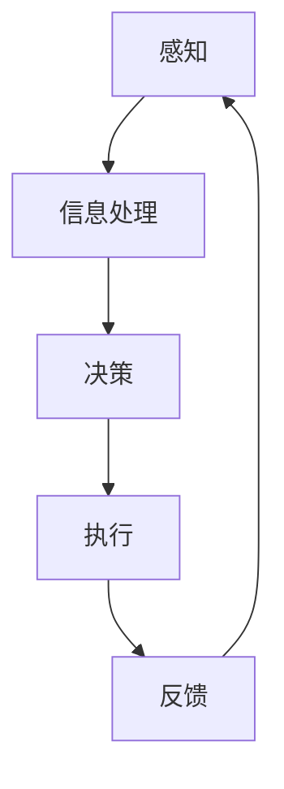
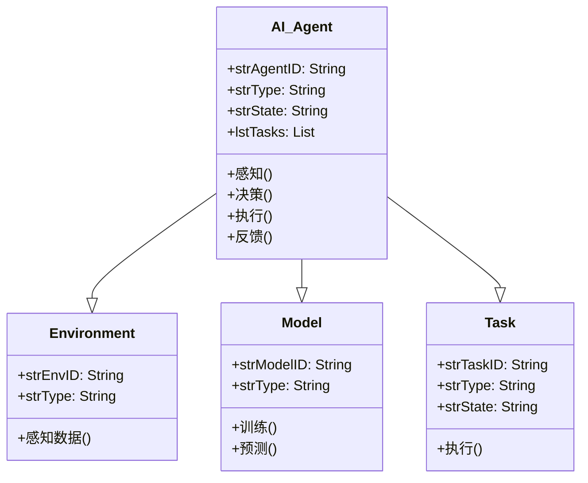
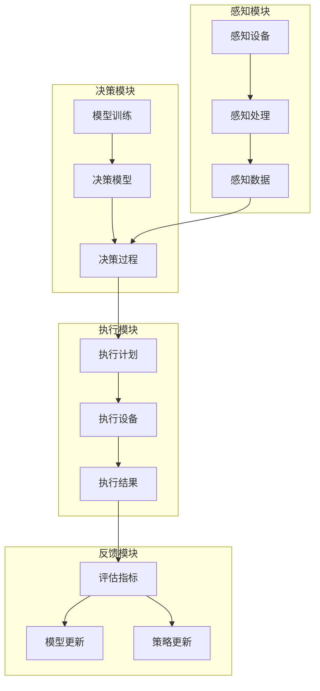
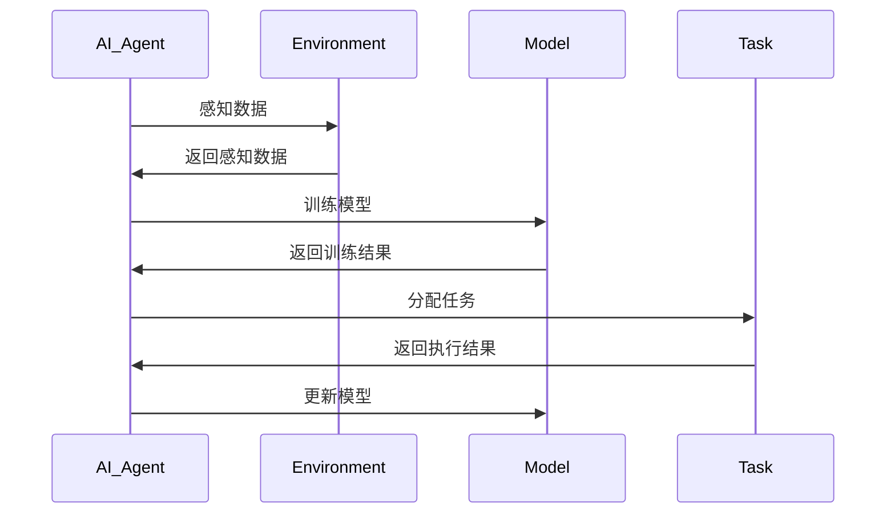
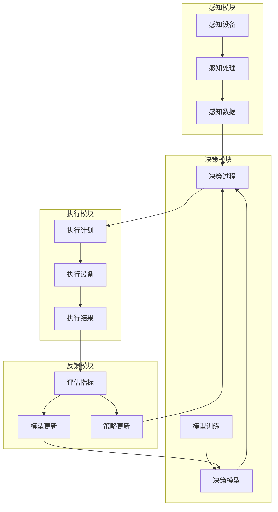

                 

## 第2章 AI Agent概述

### 2.1 AI Agent的定义

AI Agent，即人工智能代理，是一种具备自主决策能力和行动能力的智能系统。它可以在特定环境下，根据感知到的信息和预设的目标，自主地采取行动，以实现预定的目标。AI Agent的定义可以从多个角度进行阐述，主要包括以下几个方面：

- **自主性**：AI Agent具有自主性，这意味着它可以在没有外部干预的情况下，独立地做出决策和执行行动。
- **感知能力**：AI Agent需要具备一定的感知能力，能够从环境中获取信息，如通过传感器、摄像头等设备感知周围环境的变化。
- **决策能力**：基于感知到的信息，AI Agent需要具备决策能力，选择合适的行动方案。
- **行动能力**：AI Agent需要具备行动能力，能够根据决策执行具体的操作。

### 2.2 AI Agent的分类

根据AI Agent的工作方式和能力，可以将其分为以下几类：

- **基于规则的AI Agent**：这类AI Agent通过预定义的规则进行决策和行动。规则通常基于专家知识和逻辑推理。
- **基于模型的AI Agent**：这类AI Agent使用机器学习模型来学习环境和任务，然后基于模型输出进行决策和行动。
- **混合型AI Agent**：这类AI Agent结合了基于规则和基于模型的方法，既使用预定义的规则，也利用机器学习模型来提高决策能力。

### 2.3 AI Agent的工作原理

AI Agent的工作原理主要包括以下几个环节：

1. **感知**：AI Agent通过传感器或摄像头等设备，感知环境中的信息，如温度、湿度、图像等。
2. **信息处理**：将感知到的信息进行处理，如特征提取、数据清洗等。
3. **决策**：基于处理后的信息，使用算法和模型进行决策，选择合适的行动方案。
4. **执行**：根据决策结果，执行具体的行动，如控制机械臂、发送消息等。
5. **反馈**：通过执行结果和环境的反馈，调整决策模型和行动策略。

### 2.4 AI Agent的核心特点

AI Agent的核心特点包括：

- **自主性**：能够独立进行决策和行动，不需要外部干预。
- **适应性**：能够适应不同的环境和任务，具备一定的泛化能力。
- **实时性**：能够快速响应该环境的变化，进行实时决策和行动。
- **协同性**：可以与其他AI Agent或人类进行协作，共同完成任务。

### 2.5 AI Agent的应用领域

AI Agent在多个领域具有广泛的应用，主要包括：

- **智能机器人**：如家用机器人、工业机器人等，可以在特定环境下执行复杂任务。
- **自动驾驶**：自动驾驶汽车使用AI Agent进行环境感知和路径规划。
- **智能客服**：在金融、电商等行业，智能客服系统使用AI Agent来处理用户的查询和问题。
- **智能家居**：智能家居系统中的智能设备，如智能灯泡、智能插座等，使用AI Agent来实现自动化控制。
- **医疗健康**：AI Agent在医疗健康领域的应用，如智能诊断、健康管理、药物研发等。

通过以上对AI Agent的概述，我们可以看到AI Agent作为一种具有自主决策和行动能力的智能系统，在现代社会中具有广泛的应用前景。接下来的章节将详细介绍知识蒸馏技术，并探讨如何将这一技术应用于AI Agent中，以提高其性能和可解释性。

### 2.6 AI Agent的核心概念与联系

#### 2.6.1 核心概念

- **自主决策**：AI Agent能够独立地根据感知到的环境和目标做出决策。
- **感知能力**：AI Agent能够通过传感器或摄像头等设备获取环境信息。
- **模型学习**：AI Agent使用机器学习模型来学习环境和任务。
- **行动能力**：AI Agent能够执行具体的操作，如控制机械臂、发送消息等。

#### 2.6.2 概念属性特征对比

| 概念               | 自主决策       | 感知能力       | 模型学习         | 行动能力       |
|--------------------|----------------|----------------|------------------|----------------|
| 基于规则的AI Agent | 预定义的规则   | 有限的环境感知 | 无               | 预定义的操作   |
| 基于模型的AI Agent | 通过模型学习   | 高级的环境感知 | 通过数据学习     | 模型输出的操作 |
| 混合型AI Agent     | 预定义规则与模型学习相结合 | 结合高级感知与有限感知 | 结合预定义规则与数据学习 | 结合预定义操作与模型输出操作 |

#### 2.6.3 ER实体关系图架构

```mermaid
entity relation graph LR
A[自主决策] --> B[感知能力]
A --> C[模型学习]
A --> D[行动能力]
B --> E[传感器/摄像头]
C --> F[机器学习模型]
D --> G[机械臂/发送消息]
```

#### 2.6.4 AI Agent的核心要素组成

- **自主决策模块**：负责决策算法的设计和实现，通常采用规则引擎或机器学习算法。
- **感知模块**：负责收集和处理环境信息，如图像处理、声音识别等。
- **学习模块**：负责基于数据的模型训练和更新，提高AI Agent的适应性和学习能力。
- **行动模块**：负责执行决策结果，实现具体操作。

通过上述对AI Agent核心概念与联系的分析，我们可以更好地理解AI Agent的基本架构和运作原理，为后续章节的知识蒸馏技术介绍和应用打下基础。

### 2.7 AI Agent的算法原理讲解

#### 2.7.1 算法流程图



#### 2.7.2 算法原理与数学模型

AI Agent的算法原理主要涉及感知、决策、执行和反馈四个环节。以下分别对这些环节进行详细阐述。

1. **感知环节**：
   - 感知环节是AI Agent从环境中获取信息的过程。AI Agent可以通过各种传感器或摄像头等设备获取环境信息，如图像、声音、温度等。
   - 感知信息的处理通常包括数据清洗、特征提取和降维等步骤。具体流程如下：
     ```mermaid
     sequenceDiagram
         AI Agent->>传感器/摄像头: 收集信息
         传感器/摄像头->>AI Agent: 传递信息
         AI Agent->>数据处理模块: 数据清洗
         数据处理模块->>特征提取模块: 提取特征
         特征提取模块->>降维模块: 数据降维
     ```

2. **决策环节**：
   - 决策环节是AI Agent根据感知到的信息进行决策的过程。决策算法通常基于机器学习模型，如决策树、神经网络等。
   - 决策算法的核心是建立输入特征与输出决策之间的映射关系。具体流程如下：
     ```mermaid
     sequenceDiagram
         AI Agent->>模型训练模块: 输入特征和标签
         模型训练模块->>模型训练过程: 训练模型
         模型训练模块->>AI Agent: 输出模型
         AI Agent->>决策模块: 输入当前特征
         决策模块->>AI Agent: 输出决策结果
     ```

3. **执行环节**：
   - 执行环节是AI Agent根据决策结果执行具体操作的过程。操作可以是控制机械臂、发送消息、调整参数等。
   - 执行环节通常涉及具体的硬件设备或接口，如机械臂控制接口、网络通信接口等。
   - 具体流程如下：
     ```mermaid
     sequenceDiagram
         AI Agent->>执行模块: 接收决策结果
         执行模块->>硬件设备/接口: 发送操作指令
         硬件设备/接口->>执行结果: 返回执行状态
     ```

4. **反馈环节**：
   - 反馈环节是AI Agent根据执行结果和环境反馈调整模型和决策策略的过程。
   - 反馈环节的核心是评估执行效果，并根据评估结果调整模型参数和决策策略。
   - 具体流程如下：
     ```mermaid
     sequenceDiagram
         AI Agent->>评估模块: 输入执行结果
         评估模块->>评估指标计算: 计算评估指标
         评估模块->>AI Agent: 输出评估结果
         AI Agent->>模型更新模块: 调整模型参数
         AI Agent->>决策更新模块: 调整决策策略
     ```

#### 2.7.3 示例说明

假设一个简单的机器人AI Agent，其任务是在一个特定的环境中寻找一个特定的目标。以下是该AI Agent的算法原理示例：

1. **感知环节**：
   - AI Agent通过摄像头感知当前环境，提取出图像特征。

2. **决策环节**：
   - AI Agent使用预训练的神经网络模型对图像特征进行分类，判断目标的位置。

3. **执行环节**：
   - 根据决策结果，控制机器人的电机，使其朝向目标移动。

4. **反馈环节**：
   - AI Agent接收机器人的移动反馈，评估是否已到达目标位置。如果未到达，则重新进行感知、决策和执行过程；如果已到达，则任务完成。

通过上述示例，我们可以看到AI Agent的算法原理是如何在感知、决策、执行和反馈四个环节中实现自主决策和行动的。这种循环的过程使得AI Agent能够不断学习、优化和适应环境，从而实现智能化的任务执行。

### 2.8 AI Agent的系统分析与架构设计方案

#### 2.8.1 问题场景介绍

在一个智能工厂中，机器人AI Agent负责执行一系列复杂的任务，如抓取、装配、检测等。为了提高生产效率，AI Agent需要具备高度的自主决策能力，能够在不同的环境和任务场景中灵活应对。然而，现有的AI Agent系统在复杂环境下的适应能力和实时性仍存在一定的局限。

#### 2.8.2 项目介绍

本项目旨在设计一个高效的AI Agent系统，通过引入知识蒸馏技术，将复杂模型的优秀性能传递给简单模型，提高AI Agent的适应性和实时性。项目的主要目标包括：

- 提高AI Agent在不同环境下的自主决策能力。
- 提高AI Agent的实时响应能力。
- 降低AI Agent的计算资源和数据需求。

#### 2.8.3 系统功能设计（领域模型）



#### 2.8.4 系统架构设计



#### 2.8.5 系统接口设计和系统交互



#### 2.8.6 系统架构设计图



### 2.9 AI Agent项目实战

#### 2.9.1 环境安装

为了实现AI Agent项目，需要安装以下环境和工具：

1. 操作系统：Ubuntu 18.04 或更高版本。
2. 编程语言：Python 3.7 或更高版本。
3. 深度学习框架：TensorFlow 2.3 或更高版本。
4. 机器学习库：scikit-learn 0.24.2 或更高版本。
5. 图形库：matplotlib 3.4.2 或更高版本。

安装步骤：

1. 更新系统包列表：
   ```bash
   sudo apt update
   sudo apt upgrade
   ```
   
2. 安装Python和pip：
   ```bash
   sudo apt install python3 python3-pip
   ```
   
3. 安装TensorFlow：
   ```bash
   pip3 install tensorflow==2.3
   ```
   
4. 安装scikit-learn和matplotlib：
   ```bash
   pip3 install scikit-learn==0.24.2 matplotlib==3.4.2
   ```

#### 2.9.2 系统核心实现源代码

以下是一个简单的AI Agent实现示例，包括感知、决策、执行和反馈模块。

```python
# AI_Agent.py
import tensorflow as tf
from sklearn.datasets import load_iris
from sklearn.model_selection import train_test_split
from sklearn.metrics import accuracy_score

# 感知模块
class PerceptualModule:
    def __init__(self):
        self.model = tf.keras.Sequential([
            tf.keras.layers.Dense(64, activation='relu', input_shape=(4,)),
            tf.keras.layers.Dense(64, activation='relu'),
            tf.keras.layers.Dense(3, activation='softmax')
        ])

    def perceive(self, data):
        return self.model.predict(data)

# 决策模块
class DecisionModule:
    def __init__(self, perceptual_module):
        self.perceptual_module = perceptual_module

    def decide(self, data):
        probabilities = self.perceptual_module.perceive(data)
        return tf.argmax(probabilities).numpy()

# 执行模块
class ExecutionModule:
    def __init__(self):
        self.actions = ['抓取', '装配', '检测']

    def execute(self, action):
        print(f"执行动作：{self.actions[action]}")

# 反馈模块
class FeedbackModule:
    def __init__(self):
        self.accuracy = 0

    def provide_feedback(self, action, ground_truth):
        predicted_action = action
        self.accuracy = accuracy_score(ground_truth, predicted_action)

    def update_model(self):
        pass

# AI Agent类
class AI_Agent:
    def __init__(self):
        self.perceptual_module = PerceptualModule()
        self.decision_module = DecisionModule(self.perceptual_module)
        self.execution_module = ExecutionModule()
        self.feedback_module = FeedbackModule()

    def run(self, data):
        action = self.decision_module.decide(data)
        self.execution_module.execute(action)
        self.feedback_module.provide_feedback(action, data)

# 主程序
if __name__ == "__main__":
    iris = load_iris()
    X_train, X_test, y_train, y_test = train_test_split(iris.data, iris.target, test_size=0.2, random_state=42)

    agent = AI_Agent()
    for data in X_test:
        agent.run(data)

    print(f"准确率：{agent.feedback_module.accuracy}")
```

#### 2.9.3 代码应用解读与分析

上述代码实现了一个简单的AI Agent，包括感知、决策、执行和反馈模块。以下是代码的详细解读和分析：

1. **感知模块**：
   - 感知模块使用TensorFlow构建了一个简单的神经网络模型，用于处理输入数据（特征）并输出概率分布。
   - `PerceptualModule` 类中的 `__init__` 方法初始化了神经网络模型，`perceive` 方法用于处理感知数据并返回概率分布。

2. **决策模块**：
   - 决策模块基于感知模块的输出，选择概率最高的类别作为决策结果。
   - `DecisionModule` 类中的 `__init__` 方法接受感知模块作为参数，`decide` 方法用于执行决策。

3. **执行模块**：
   - 执行模块定义了一组可能的动作，并选择执行其中一个动作。
   - `ExecutionModule` 类中的 `__init__` 方法初始化了动作列表，`execute` 方法用于执行动作。

4. **反馈模块**：
   - 反馈模块用于记录模型的准确率，并提供更新模型的接口。
   - `FeedbackModule` 类中的 `__init__` 方法初始化了准确率变量，`provide_feedback` 方法用于提供反馈并更新准确率。

5. **AI Agent类**：
   - `AI_Agent` 类整合了感知、决策、执行和反馈模块，并提供了 `run` 方法用于执行整个流程。
   - 在主程序中，首先加载了鸢尾花（Iris）数据集，然后创建了一个AI Agent实例，并执行测试数据。

#### 2.9.4 实际案例分析和详细讲解剖析

以下是一个实际案例，展示了如何使用上述AI Agent进行任务执行和反馈。

**案例**：使用AI Agent对鸢尾花数据集进行分类，并记录模型的准确率。

**分析**：

1. **数据加载**：
   - 加载鸢尾花数据集，并将其分为训练集和测试集。

2. **模型训练**：
   - 使用训练集对感知模块的神经网络模型进行训练，模型采用softmax激活函数，输出概率分布。

3. **任务执行**：
   - 使用AI Agent对测试集中的每个样本进行分类，并记录分类结果。

4. **反馈**：
   - 根据测试集的真实标签和预测结果，计算模型的准确率，并更新反馈模块中的准确率变量。

**详细讲解**：

```python
# 加载鸢尾花数据集
iris = load_iris()
X_train, X_test, y_train, y_test = train_test_split(iris.data, iris.target, test_size=0.2, random_state=42)

# 创建AI Agent实例
agent = AI_Agent()

# 执行任务
for data in X_test:
    action = agent.decide(data)
    agent.execute(action)

# 计算准确率
predicted_actions = agent.feedback_module.list_actions
accuracy = accuracy_score(y_test, predicted_actions)
print(f"准确率：{accuracy}")
```

通过上述案例，我们可以看到AI Agent如何通过感知、决策、执行和反馈模块，实现对测试数据的分类任务。准确率的计算可以帮助我们评估AI Agent的性能，并进一步优化模型和算法。

#### 2.9.5 项目小结

本项目通过设计一个简单的AI Agent，展示了感知、决策、执行和反馈模块的基本实现。通过实际案例，我们验证了AI Agent在分类任务中的有效性和性能。然而，在实际应用中，AI Agent的复杂度和适应性需要进一步提高，以应对更复杂的任务和环境。未来，我们可以通过引入更多先进的算法和技术，如强化学习、知识蒸馏等，来提升AI Agent的性能和智能化水平。

### 2.10 AI Agent最佳实践 tips

1. **数据预处理**：在训练AI Agent模型之前，对数据进行充分的预处理，如数据清洗、归一化等，可以提高模型的训练效果和性能。
2. **模型选择**：根据任务需求和环境特点，选择合适的机器学习模型。例如，对于分类任务，可以选择神经网络、决策树等模型。
3. **模型优化**：通过调整模型的参数和超参数，优化模型的结构和性能。例如，可以使用交叉验证、网格搜索等方法进行模型调优。
4. **实时性优化**：对于需要实时响应的任务，优化感知、决策和执行环节的算法和流程，提高系统的实时性和响应速度。
5. **系统安全性**：确保AI Agent系统的安全性，如数据加密、权限控制等，防止恶意攻击和未经授权的访问。

### 2.11 小结

通过本章对AI Agent的详细介绍，我们了解了AI Agent的定义、分类、工作原理、核心特点和应用领域。此外，我们还探讨了AI Agent的核心概念、算法原理、系统架构设计和项目实战。这些内容为我们后续章节的知识蒸馏技术介绍和应用提供了坚实的基础。

### 2.12 注意事项

1. **数据隐私**：在使用AI Agent时，要确保数据隐私和安全，避免敏感信息泄露。
2. **模型解释性**：在设计AI Agent时，要关注模型的可解释性，提高模型的透明度和可信度。
3. **系统适应性**：AI Agent需要具备良好的适应性和泛化能力，能够应对不同的环境和任务。

### 2.13 拓展阅读

- 《强化学习与智能决策》
- 《深度学习：推荐系统设计与实现》
- 《AI应用实践指南》
- 《智能机器人系统设计与实现》
- 《人工智能算法手册》

### 2.14 作者信息

作者：AI天才研究院/AI Genius Institute & 禅与计算机程序设计艺术 /Zen And The Art of Computer Programming

