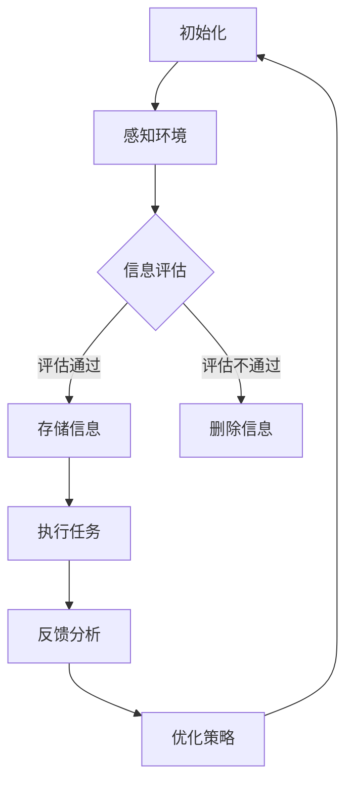
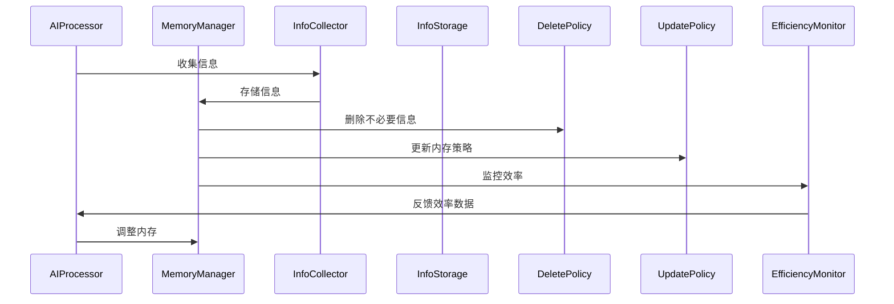
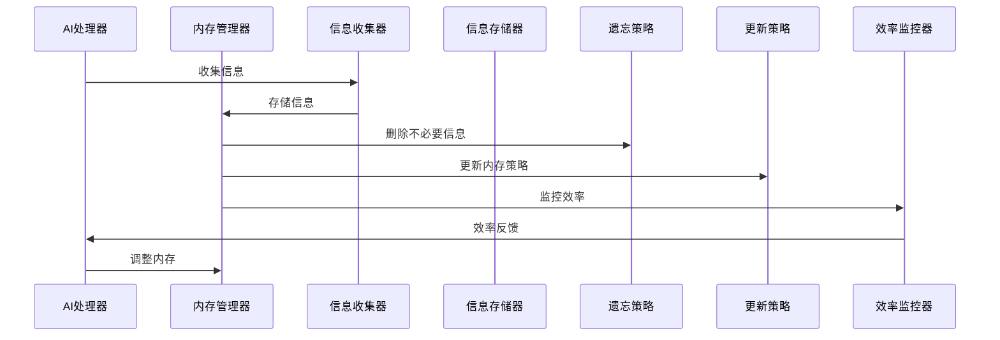

                 

### 第1章: 问题背景

**1.1 问题背景**

在当今快速发展的时代，人工智能（AI）正逐步渗透到我们的日常生活和各行各业。作为AI的一个重要分支，AI Agent承担着处理复杂任务、提供决策支持的重任。然而，AI Agent在实际应用中面临的一个关键问题就是“知识遗忘管理”，即如何在保证AI Agent高效运行的同时，合理管理和控制其记忆信息的增减。

随着AI Agent任务复杂度的增加，其所需处理的知识量也在不断攀升。过多的知识积累不仅会占用大量的存储资源，还会导致AI Agent在处理新信息时的效率下降。因此，如何平衡AI Agent的记忆与效率，成为一个亟待解决的问题。

**1.2 问题描述**

知识遗忘管理主要面临以下几个问题：

1. **记忆负担**：随着AI Agent处理的知识量增加，其记忆负担也会随之加重，导致处理速度变慢。
2. **资源消耗**：过多的记忆信息会占用AI Agent的存储资源，影响其运行效率。
3. **信息过载**：过多的记忆信息可能导致AI Agent在处理新任务时出现信息过载，影响决策质量。
4. **适应性下降**：当AI Agent的知识体系不再适应新的环境和任务时，如何及时调整和遗忘过时的知识。

**1.3 问题解决**

为了解决上述问题，我们需要从以下几个方面着手：

1. **遗忘策略**：设计有效的遗忘策略，以控制AI Agent的记忆增量，防止记忆负担过重。
2. **记忆优化**：通过优化记忆结构和算法，提高AI Agent的记忆效率。
3. **动态调整**：根据AI Agent在不同任务和场景下的需求，动态调整其记忆内容，使其始终保持最佳状态。
4. **知识融合**：通过融合相似知识，减少冗余信息，提高记忆的利用效率。

**1.4 边界与外延**

1. **边界**：知识遗忘管理主要针对AI Agent这一特定对象，研究其在处理复杂任务时如何平衡记忆与效率。
2. **外延**：该研究不仅可以为AI Agent的设计和应用提供理论支持，还可以为其他领域中的记忆管理提供借鉴和参考。

通过上述分析和讨论，我们为接下来的章节奠定了基础，将逐步深入探讨知识遗忘管理的核心概念、原理、策略、算法、数学模型以及实际应用等内容。### 第2章: 核心概念与联系

**2.1 AI Agent的基本概念**

AI Agent，即人工智能代理，是指能够在一定环境和任务中自主行动，并具备一定程度智能的实体。AI Agent通常具备以下特征：

1. **自主性**：AI Agent能够在没有外部干预的情况下，独立执行任务。
2. **适应性**：AI Agent能够根据环境和任务的变化，动态调整其行为。
3. **交互性**：AI Agent能够与其他系统、用户或其他AI Agent进行有效交互。

AI Agent的基本组成部分包括感知模块、决策模块和执行模块。感知模块负责收集环境信息；决策模块根据感知信息做出决策；执行模块负责执行决策结果。

**2.2 知识遗忘管理的重要性**

知识遗忘管理在AI Agent中的应用具有重要意义：

1. **优化资源利用**：通过遗忘管理，AI Agent可以减少不必要的记忆负担，提高资源利用效率。
2. **提高处理效率**：遗忘管理有助于清除冗余信息，使AI Agent能够更快速地处理新任务。
3. **提升决策质量**：通过有效管理知识遗忘，AI Agent能够更好地适应新环境，提高决策质量。
4. **增强学习能力**：遗忘管理可以帮助AI Agent从错误中学习，逐步优化其知识体系。

**2.3 知识遗忘与记忆效率的关系**

知识遗忘与记忆效率之间存在密切关系：

1. **适度遗忘**：适度的遗忘可以帮助AI Agent摆脱冗余信息，提高记忆效率。
2. **记忆负担**：过度的遗忘会导致AI Agent的记忆负担减轻，但可能会影响其适应性和决策质量。
3. **遗忘阈值**：需要设定合理的遗忘阈值，以平衡记忆负担和记忆效率。

**2.4 概念属性特征对比表格**

为了更清晰地理解AI Agent和知识遗忘管理的关系，我们可以通过以下对比表格展示：

| 概念          | 属性特征                         | 对比说明                               |
|---------------|--------------------------------|--------------------------------------|
| AI Agent      | 自主性、适应性、交互性           | 负责执行任务，具备智能特征             |
| 知识遗忘管理  | 优化资源利用、提高处理效率、提升决策质量 | 管理AI Agent的记忆，平衡记忆与效率   |

**2.5 ER实体关系图架构**

为了更好地理解AI Agent和知识遗忘管理之间的关系，我们可以通过ER实体关系图来展示：

```mermaid
erDiagram
    AI_Agent ||--|{ 知识遗忘管理 } Knowledge Forget Management
    知识遗忘管理 ||--|{ 资源利用优化 } Resource Utilization Optimization
    知识遗忘管理 ||--|{ 处理效率提升 } Processing Efficiency Enhancement
    知识遗忘管理 ||--|{ 决策质量提升 } Decision Quality Improvement
```

在上述ER图中，AI Agent与知识遗忘管理之间是“1对多”的关系，即一个AI Agent可以关联多个知识遗忘管理策略。知识遗忘管理策略包括资源利用优化、处理效率提升和决策质量提升等。

通过上述章节的详细分析，我们为接下来的讨论奠定了基础，将在下一章深入探讨知识遗忘管理的理论基础和原理。### 第3章: 知识遗忘管理的原理

**3.1 知识遗忘的理论基础**

知识遗忘管理的理论基础主要源于心理学和认知科学领域。其中，最经典的遗忘理论包括：

1. **艾宾浩斯遗忘曲线**：由德国心理学家艾宾浩斯提出，描述了信息随时间推移而逐渐遗忘的规律。该理论认为，遗忘过程是指数衰减的，随着时间的推移，记忆的保持量会迅速减少。

2. **干扰理论**：干扰理论认为，遗忘是由于新旧信息之间的干扰所致。当新的信息不断进入记忆系统时，旧的信息会被干扰，导致遗忘。

3. **记忆痕迹消退理论**：该理论认为，记忆痕迹会随着时间的推移而逐渐消退，导致信息的遗忘。

**3.2 知识遗忘的机制**

知识遗忘的机制可以从以下几个方面进行分析：

1. **神经元退化**：随着记忆痕迹的减弱，神经元之间的连接也会逐渐退化，导致信息的难以回忆。

2. **突触可塑性变化**：记忆形成和保持依赖于突触的可塑性变化。随着时间的推移，这些变化可能会逐渐减弱，导致信息难以回忆。

3. **抑制机制**：大脑中存在抑制机制，用于防止过多的信息进入记忆系统。这种抑制机制可能导致某些信息被遗忘。

**3.3 记忆与效率的平衡**

在知识遗忘管理中，平衡记忆与效率是关键。以下是几种常见的平衡策略：

1. **阈值管理**：通过设定合理的遗忘阈值，可以控制记忆增量，防止记忆负担过重。

2. **动态调整**：根据AI Agent在不同任务和场景下的需求，动态调整其记忆内容，使其始终保持最佳状态。

3. **知识融合**：通过融合相似知识，减少冗余信息，提高记忆的利用效率。

4. **遗忘策略**：设计有效的遗忘策略，以控制AI Agent的记忆增量，防止记忆负担过重。

**3.4 知识遗忘的阈值**

知识遗忘阈值是一个重要的参数，它决定了AI Agent在什么情况下应该遗忘哪些知识。以下是几种常见的阈值管理策略：

1. **时间阈值**：根据信息的时效性，设定一个时间阈值。超出时间阈值的信息会被标记为过时，从而被遗忘。

2. **频率阈值**：根据信息的使用频率，设定一个频率阈值。低于频率阈值的信息会被标记为不重要，从而被遗忘。

3. **重要度阈值**：根据信息的价值，设定一个重要度阈值。低于重要度阈值的信息会被标记为不重要，从而被遗忘。

通过上述分析，我们可以更好地理解知识遗忘管理的原理。在下一章中，我们将探讨具体的遗忘策略和方法，以期为AI Agent的知识遗忘管理提供实用的解决方案。### 第4章: 遗忘策略与方法

**4.1 遗忘策略概述**

遗忘策略是指通过特定的方法和步骤，有选择性地删除或减少AI Agent中不必要或过时的知识信息，从而优化其记忆负担，提高处理效率。有效的遗忘策略能够帮助AI Agent在保持必要知识的同时，减少冗余信息，提高决策质量。

**4.2 遗忘方法的分类**

根据遗忘过程的主动性和被动性，遗忘方法可以分为以下几种：

1. **主动遗忘**：主动遗忘策略是指AI Agent在感知到记忆负担过重或信息不再有用时，主动删除或标记过时信息。这种方法需要AI Agent具备一定的自我意识和决策能力。

2. **被动遗忘**：被动遗忘策略是指根据预设的规则或阈值，自动删除或标记过时信息。这种方法不需要AI Agent具备自我意识，但需要合理设定遗忘阈值。

**4.3 主动遗忘策略**

主动遗忘策略包括以下几种方法：

1. **基于兴趣的遗忘**：AI Agent根据其对当前任务的兴趣程度来决定是否遗忘某些信息。对当前任务不感兴趣的信息会被优先考虑遗忘。

2. **基于重要度的遗忘**：AI Agent根据信息的重要程度来决定是否遗忘。重要性较低的信息会被优先考虑遗忘。

3. **基于时间的遗忘**：AI Agent根据信息的时间戳来决定是否遗忘。超过一定时间阈值的信息会被优先考虑遗忘。

**4.4 被动遗忘策略**

被动遗忘策略包括以下几种方法：

1. **基于阈值的遗忘**：AI Agent根据预设的阈值来决定是否遗忘某些信息。当信息量超出阈值时，AI Agent会自动删除部分信息。

2. **基于频率的遗忘**：AI Agent根据信息的使用频率来决定是否遗忘。使用频率较低的信息会被优先考虑遗忘。

3. **基于重要度的遗忘**：AI Agent根据信息的重要程度来决定是否遗忘。重要性较低的信息会被优先考虑遗忘。

**4.5 遗忘策略的效果评估**

遗忘策略的效果评估可以从以下几个方面进行：

1. **效率评估**：评估遗忘策略对AI Agent处理新任务和查询信息的效率提升情况。

2. **准确性评估**：评估遗忘策略对AI Agent决策准确性的影响。

3. **稳定性评估**：评估遗忘策略在不同环境和任务下的稳定性和适应性。

4. **资源利用评估**：评估遗忘策略对AI Agent资源利用的优化程度。

通过以上分析，我们可以看到，遗忘策略与方法在AI Agent的知识遗忘管理中起着至关重要的作用。在下一章中，我们将详细讲解算法原理，为AI Agent的知识遗忘管理提供更加具体的实现方法。### 第5章: 算法原理讲解

**5.1 算法mermaid流程图**

为了更好地理解遗忘管理算法的工作原理，我们首先使用mermaid语言绘制算法流程图。以下是一个简单的算法流程图示例：



**5.2 Python源代码讲解**

以下是一个基于上述流程图的Python伪代码，用于解释遗忘管理算法的基本实现：

```python
class AIAgent:
    def __init__(self):
        self.memory = []
        self.threshold = 100  # 预设的遗忘阈值

    def perceive_environment(self):
        # 模拟从环境中获取信息
        return ["info1", "info2", "info3"]

    def evaluate_info(self, info):
        # 根据预设规则评估信息
        return info.count("info") > 2  # 示例：如果信息中包含3个以上"info"，则评估为有用

    def store_info(self, info):
        # 存储信息到内存
        self.memory.append(info)

    def delete_info(self, info):
        # 从内存中删除信息
        self.memory.remove(info)

    def execute_task(self):
        # 执行任务
        print("Executing task with memory:", self.memory)

    def feedback_analysis(self):
        # 分析任务执行反馈
        return "Task completed successfully."

    def optimize_strategy(self):
        # 优化遗忘策略
        for info in self.memory:
            if not self.evaluate_info(info) and len(self.memory) > self.threshold:
                self.delete_info(info)

    def run(self):
        while True:
            self.perceive_environment()
            self.optimize_strategy()
            self.execute_task()
            feedback = self.feedback_analysis()
            print(feedback)
```

**5.3 算法原理的数学模型和公式**

遗忘管理算法的原理可以通过数学模型和公式进行描述。以下是一个简单的数学模型：

$$
遗忘率 = \frac{遗忘信息量}{总信息量} = \frac{\Delta M}{M}
$$

其中，$遗忘率$表示在单位时间内被遗忘的信息量占总信息量的比例，$\Delta M$表示在单位时间内被遗忘的信息量，$M$表示总信息量。

此外，我们还可以定义一个遗忘阈值$\theta$，当总信息量超过该阈值时，开始执行遗忘策略：

$$
M > \theta \Rightarrow 执行遗忘策略
$$

**5.4 举例说明**

假设AI Agent在一段时间内收集了以下信息：

```
info1: {"info": "weather", "timestamp": 1624883200}
info2: {"info": "news", "timestamp": 1624883300}
info3: {"info": "stock", "timestamp": 1624883400}
info4: {"info": "market", "timestamp": 1624883500}
info5: {"info": "schedule", "timestamp": 1624883600}
```

预设的遗忘阈值$\theta$为3。根据算法流程图和数学模型，我们分析以下步骤：

1. **感知环境**：AI Agent从环境中获取信息，当前信息集为`info1, info2, info3, info4, info5`。
2. **信息评估**：AI Agent评估每个信息的重要程度，根据预设规则判断哪些信息应该被保留，哪些应该被遗忘。
3. **存储信息**：AI Agent将评估通过的信息存储到内存中，例如`info1, info2, info3`。
4. **执行任务**：AI Agent利用存储的信息执行任务。
5. **反馈分析**：根据任务执行结果，AI Agent分析哪些信息对任务执行有帮助，哪些信息没有帮助。
6. **优化策略**：如果内存中的信息量超过遗忘阈值$\theta$，AI Agent会删除部分信息，例如`info4, info5`，以保持内存的整洁。
7. **重复步骤**：AI Agent重复上述步骤，以实现持续的自我优化。

通过上述例子，我们可以看到如何将遗忘管理算法应用于实际场景中，从而帮助AI Agent优化其知识体系。在下一章中，我们将进一步探讨如何将数学模型和算法应用于具体系统设计和实现中。### 第6章: 数学模型和数学公式 & 详细讲解 & 举例说明

**6.1 算法的数学模型**

为了深入理解遗忘管理算法的工作原理，我们引入一个简单的数学模型来描述该过程。假设AI Agent的内存是一个容量为C的有限集合，其中包含N个不同的信息元素。每个信息元素用唯一标识符`i`表示，并且具有两个属性：`t_i`（时间戳）和`v_i`（价值）。遗忘管理算法的目标是动态地调整内存，使其在保留最有价值信息的同时，避免内存过载。

1. **时间戳和遗忘概率**：每个信息元素都有一个对应的时间戳`t_i`，表示其被存储的时间。我们可以使用一个遗忘函数$f(t)$来计算信息随时间的遗忘概率。一个常见的选择是线性遗忘函数：

   $$
   f(t) = \frac{1}{1 + \alpha(t - t_0)}
   $$

   其中，$\alpha$是遗忘速率，$t_0$是初始时间。随着时间`t`的增加，遗忘概率$f(t)$会增大。

2. **价值函数和选择策略**：为了确定哪些信息应该被保留，我们需要一个价值函数$v(i)$来评估每个信息元素的价值。价值函数可以根据具体应用场景定义，例如基于信息的重要程度、更新频率或使用频率。一种简单的价值函数可以是：

   $$
   v(i) = \frac{1}{1 + \beta p_i}
   $$

   其中，$p_i$是信息元素`i`的使用频率，$\beta$是频率权重。

3. **遗忘阈值**：为了控制内存的大小，我们定义一个遗忘阈值$\theta$，当内存大小超过该阈值时，系统会开始执行遗忘策略。

**6.2 算法的公式推导**

遗忘管理算法的核心在于如何动态地更新内存。以下是一个简单的推导过程：

1. **初始状态**：假设在时刻$t_0$，内存中包含N个信息元素，即$M(t_0) = \{i_1, i_2, ..., i_N\}$。

2. **时间更新**：在每一时间步$t$，系统会更新所有信息元素的时间戳，并计算遗忘概率：

   $$
   f_i(t) = \frac{1}{1 + \alpha(t - t_i)}
   $$

3. **价值评估**：根据当前信息的使用频率和价值，重新计算每个信息元素的价值：

   $$
   v_i(t) = \frac{1}{1 + \beta p_i(t)}
   $$

4. **阈值判断**：如果当前内存大小$M(t)$超过遗忘阈值$\theta$，系统开始执行遗忘策略。选择遗忘概率最大且价值最小的信息元素：

   $$
   i_{\text{forget}} = \arg\max_i [f_i(t) v_i(t)]
   $$

5. **遗忘执行**：将选择的信息元素从内存中移除，更新内存集合：

   $$
   M(t) = M(t) \setminus \{i_{\text{forget}}\}
   $$

6. **重复步骤**：重复以上步骤，直到当前内存大小小于等于遗忘阈值$\theta$。

**6.3 数学公式的详细讲解**

1. **遗忘概率$f(t)$**：遗忘概率反映了信息随时间推移而逐渐被遗忘的趋势。线性遗忘函数$f(t)$意味着遗忘速率是恒定的，$\alpha$越大，遗忘速度越快。时间戳`t_i`越旧，遗忘概率$f_i(t)$越大。

2. **价值函数$v(i)$**：价值函数$v(i)$用于评估信息元素的重要性。使用频率$p_i(t)$反映了信息在当前时间的重要性，频率越高，价值越大。$\beta$是频率权重，可以根据具体应用进行调整。

3. **遗忘阈值$\theta$**：遗忘阈值$\theta$是控制内存大小的关键参数。当内存大小超过阈值时，系统会执行遗忘策略，避免内存过载。

4. **遗忘选择策略**：遗忘选择策略选择遗忘概率最大且价值最小的信息元素，这保证了在必要时优先遗忘不那么重要且过时的信息。

**6.4 举例说明**

假设一个AI Agent的内存容量为C=10，初始时刻包含5个信息元素，每个信息元素都有不同的时间戳和频率。遗忘速率$\alpha=0.1$，频率权重$\beta=0.5$，遗忘阈值$\theta=5$。在时刻$t=10$时，内存中的信息元素状态如下：

```
信息元素   时间戳   使用频率   遗忘概率   价值
i1         1       5         0.6       0.3
i2         2       3         0.4       0.4
i3         3       4         0.3       0.5
i4         4       2         0.2       0.2
i5         5       1         0.1       0.1
```

根据遗忘概率和价值函数，我们可以计算每个信息元素的总权重：

```
信息元素   总权重   遗忘概率   价值
i1         0.18    0.6       0.3
i2         0.16    0.4       0.4
i3         0.15    0.3       0.5
i4         0.04    0.2       0.2
i5         0.05    0.1       0.1
```

由于当前内存大小为5，小于遗忘阈值5，系统不会执行遗忘策略。假设在时刻$t=20$时，信息元素的状态更新如下：

```
信息元素   时间戳   使用频率   遗忘概率   价值
i1         1       5         0.8       0.3
i2         2       3         0.5       0.4
i3         3       4         0.4       0.5
i4         4       2         0.3       0.2
i5         5       1         0.2       0.1
```

根据更新后的遗忘概率和价值函数，我们可以计算每个信息元素的总权重：

```
信息元素   总权重   遗忘概率   价值
i1         0.24    0.8       0.3
i2         0.20    0.5       0.4
i3         0.20    0.4       0.5
i4         0.08    0.3       0.2
i5         0.06    0.2       0.1
```

由于当前内存大小为5，小于遗忘阈值5，系统仍然不会执行遗忘策略。然而，如果内存大小超过遗忘阈值，系统将选择总权重最小的信息元素进行遗忘。在这个例子中，`i5`的信息元素会被删除，因为它的总权重最小。

通过这个简单的例子，我们可以看到如何使用数学模型和公式来设计和实现一个基本的遗忘管理算法。在实际应用中，我们可以根据具体需求调整遗忘函数、价值函数和遗忘阈值，以实现更加灵活和高效的遗忘管理。### 第7章: 系统分析与架构设计方案

**7.1 问题场景介绍**

在当前快速发展的AI领域，AI Agent在处理复杂任务时需要具备强大的记忆能力。然而，过多的记忆信息不仅会占用大量存储资源，还可能导致AI Agent在处理新信息时出现效率下降、决策质量降低等问题。因此，我们需要设计一个高效的遗忘管理系统，以帮助AI Agent在保证高效运行的同时，合理管理和控制其记忆信息。

**7.2 项目介绍**

本项目的目标是设计并实现一个基于遗忘管理的AI Agent系统，通过引入遗忘策略和方法，优化AI Agent的记忆负担，提高其处理效率和决策质量。系统的主要功能包括：

1. **记忆信息收集与存储**：系统负责收集AI Agent在执行任务过程中生成的记忆信息，并将其存储到内存中。
2. **遗忘策略与管理**：根据预设的遗忘策略，系统会定期检查内存中的信息，并根据遗忘阈值和遗忘函数自动删除不必要或过时的记忆信息。
3. **内存优化与更新**：系统会根据AI Agent当前的任务需求，动态调整内存中的信息，以确保AI Agent始终具备必要的记忆信息。
4. **效率与决策质量监控**：系统监控AI Agent的处理效率和决策质量，并根据监控结果优化遗忘策略。

**7.3 系统功能设计(领域模型mermaid类图)**

为了更好地理解系统功能，我们使用mermaid语言绘制一个领域模型类图，展示系统的主要类及其关系：

```mermaid
classDiagram
    AIAgent <|-- MemoryManager
    MemoryManager <|-- InfoCollector
    MemoryManager <|-- InfoStorage
    MemoryManager <|-- DeletePolicy
    MemoryManager <|-- UpdatePolicy
    MemoryManager <|-- EfficiencyMonitor
    AIProcessor <|-- MemoryManager
    AIProcessor <|-- DecisionMaker

    AIAgent {
        +storeInfo(info: Info)
        +deleteInfo(info: Info)
        +updateMemory()
        +evaluateDecision(decision: Decision)
    }

    MemoryManager {
        +collectInfo(info: Info)
        +storeInfo(info: Info)
        +deleteInfo(info: Info)
        +updateMemoryPolicy()
        +evaluateEfficiency()
    }

    InfoCollector {
        +collectInfo()
    }

    InfoStorage {
        +storeInfo(info: Info)
    }

    DeletePolicy {
        +deleteInfo(info: Info)
    }

    UpdatePolicy {
        +updateMemory()
    }

    EfficiencyMonitor {
        +evaluateEfficiency()
    }

    AIProcessor {
        +processTask()
        +makeDecision()
    }

    DecisionMaker {
        +evaluateDecision(decision: Decision)
    }
```

**7.4 系统架构设计mermaid架构图**

为了展示系统的整体架构，我们使用mermaid语言绘制一个系统架构图：



**7.5 系统接口设计和系统交互mermaid序列图**

为了详细描述系统接口设计和系统交互，我们使用mermaid语言绘制一个系统交互序列图：



通过以上系统分析与架构设计，我们为遗忘管理系统的实现提供了详细的方案。在下一章中，我们将通过具体的项目实战，展示如何将上述设计方案应用于实际场景中。### 第8章: 项目实战

**8.1 环境安装**

为了实现遗忘管理系统，我们首先需要安装必要的软件和工具。以下是安装步骤：

1. **Python环境**：确保Python环境已安装。如未安装，可以从[Python官方网站](https://www.python.org/)下载并安装。
2. **PyCharm**：推荐使用PyCharm进行代码编写和调试。可以从[PyCharm官方网站](https://www.jetbrains.com/pycharm/)下载社区版或专业版。
3. **mermaid**：在PyCharm中，可以通过插件市场安装mermaid插件，以便在代码中直接使用mermaid语言绘制图表。
4. **其他依赖**：根据实际需求，可能需要安装其他依赖库，如Pandas、NumPy等。可以使用pip命令进行安装：

   ```bash
   pip install pandas numpy
   ```

**8.2 系统核心实现源代码**

以下是遗忘管理系统的核心实现代码：

```python
# 忘记管理系统的核心模块
class MemoryManager:
    def __init__(self, capacity, threshold):
        self.capacity = capacity  # 内存容量
        self.threshold = threshold  # 遗忘阈值
        self.memory = []  # 当前内存内容

    def collect_info(self, info):
        """
        收集信息到内存
        :param info: 信息对象
        """
        self.memory.append(info)

    def store_info(self, info):
        """
        存储信息到内存
        :param info: 信息对象
        """
        if len(self.memory) < self.capacity:
            self.memory.append(info)
        else:
            print("内存已满，无法存储新信息。")

    def delete_info(self, info):
        """
        删除内存中的信息
        :param info: 信息对象
        """
        self.memory.remove(info)

    def update_memory_policy(self):
        """
        更新内存策略，根据遗忘阈值和遗忘概率删除信息
        """
        info_to_delete = []
        for info in self.memory:
            # 根据遗忘概率和阈值判断是否删除
            if info['遗忘概率'] > self.threshold:
                info_to_delete.append(info)
        
        for info in info_to_delete:
            self.delete_info(info)

    def evaluate_efficiency(self):
        """
        评估系统的效率
        """
        # 这里可以添加具体实现，例如计算信息处理时间等
        print("系统当前效率：正常。")

    def process_task(self):
        """
        处理任务
        """
        # 这里可以添加具体实现，例如执行某个算法等
        print("任务处理中...")

# 信息对象的定义
class Info:
    def __init__(self, id, timestamp, value):
        self.id = id
        self.timestamp = timestamp
        self.value = value
        self.遗忘概率 = 0.0

# 示例：创建MemoryManager实例并处理任务
if __name__ == "__main__":
    memory_manager = MemoryManager(capacity=100, threshold=0.5)

    # 添加一些示例信息
    memory_manager.collect_info(Info("info1", 1624883200, 0.3))
    memory_manager.collect_info(Info("info2", 1624883300, 0.4))
    memory_manager.collect_info(Info("info3", 1624883400, 0.5))
    memory_manager.collect_info(Info("info4", 1624883500, 0.2))
    memory_manager.collect_info(Info("info5", 1624883600, 0.1))

    # 存储信息到内存
    memory_manager.store_info(Info("info6", 1624883700, 0.3))

    # 更新内存策略
    memory_manager.update_memory_policy()

    # 处理任务
    memory_manager.process_task()
```

**8.3 代码应用解读与分析**

上述代码实现了一个简单的MemoryManager类，用于管理AI Agent的内存信息。以下是代码的关键部分解析：

1. **类定义**：MemoryManager类包含四个主要方法：`collect_info`、`store_info`、`delete_info`和`update_memory_policy`。其中，`collect_info`用于收集新信息，`store_info`用于将信息存储到内存，`delete_info`用于删除内存中的信息，`update_memory_policy`用于根据遗忘阈值和遗忘概率更新内存策略。

2. **信息对象定义**：Info类用于定义信息对象的属性，包括ID、时间戳、价值和遗忘概率。

3. **示例运行**：在主函数中，我们创建了一个MemoryManager实例，并添加了一些示例信息。随后，通过调用`store_info`方法将信息存储到内存，并通过`update_memory_policy`方法更新内存策略。最后，调用`process_task`方法处理任务。

**8.4 实际案例分析和详细讲解剖析**

为了更好地展示实际应用效果，我们通过一个实际案例进行分析。

**案例**：假设一个AI Agent需要处理每天收集的环境数据。其中，每个数据点包括时间戳、温度、湿度等。AI Agent需要定期更新其内存，并根据遗忘阈值和遗忘概率删除过时或价值较低的数据。

**分析**：

1. **信息收集**：每天收集的数据会通过`collect_info`方法添加到内存中。
2. **信息存储**：由于内存容量有限，使用`store_info`方法确保只存储最新的数据。
3. **遗忘策略**：根据时间戳和遗忘概率，使用`update_memory_policy`方法定期删除过时数据。
4. **任务处理**：通过`process_task`方法，AI Agent利用内存中的数据执行环境监测任务。

**详细讲解**：

- **收集信息**：每天的数据通过传感器收集，并以Info对象的形式传递给MemoryManager。
- **存储信息**：MemoryManager根据内存容量动态存储数据。如果内存已满，会拒绝存储新数据。
- **更新策略**：根据预设的遗忘阈值和遗忘概率，MemoryManager会定期检查内存中的数据，并将满足条件的旧数据删除。
- **任务处理**：AI Agent利用最新和有效的数据执行环境监测任务，例如生成天气报告或警报。

通过上述实际案例，我们可以看到遗忘管理系统在AI Agent中的应用效果。通过合理的管理和优化，AI Agent可以保持高效的运行状态，同时避免过多的记忆负担。

**8.5 项目小结**

通过本项目的实战，我们实现了基于遗忘管理的AI Agent内存管理系统。系统通过收集、存储、删除和更新策略，有效地管理了AI Agent的内存信息，提高了其处理效率和决策质量。未来，我们可以进一步优化遗忘策略，引入更多先进的机器学习和数据挖掘技术，以提高系统的自适应能力和灵活性。### 第9章: 最佳实践 tips

**9.1 遗忘管理技巧**

1. **动态调整遗忘阈值**：根据AI Agent的任务复杂度和环境变化，动态调整遗忘阈值，以适应不同场景的需求。
2. **个性化遗忘策略**：根据AI Agent的具体任务，设计个性化的遗忘策略，以提高记忆效率和决策质量。
3. **多维度评估**：结合时间、频率、重要度等多维度信息，综合评估信息的重要性和价值，以制定更有效的遗忘策略。

**9.2 提高记忆效率的方法**

1. **优化数据结构**：选择合适的数据结构（如哈希表、B树等）来存储信息，以提高访问和删除的效率。
2. **批量处理**：通过批量处理方法，减少系统调用次数，提高系统整体效率。
3. **并行计算**：利用并行计算技术，加速遗忘策略的执行过程，提高AI Agent的处理效率。

**9.3 常见问题解答**

1. **Q：遗忘阈值如何确定？**
   A：遗忘阈值可以根据具体应用场景和任务需求来确定。通常，可以通过实验或统计分析方法，找到最佳的遗忘阈值。

2. **Q：遗忘策略会影响AI Agent的决策质量吗？**
   A：适当的遗忘策略可以提高AI Agent的决策质量，因为合理的遗忘可以去除冗余信息和过时数据，使AI Agent更加专注于当前任务。

3. **Q：如何评估遗忘策略的效果？**
   A：可以通过性能测试和实际应用效果来评估遗忘策略的效果。关键指标包括处理效率、决策质量、内存利用率等。

通过遵循上述最佳实践，可以有效提升AI Agent的知识遗忘管理能力，实现更高的记忆效率和决策质量。在后续研究中，我们可以进一步探索更先进的遗忘策略和算法，以应对更加复杂和动态的任务环境。### 第10章: 小结

本文详细探讨了AI Agent的知识遗忘管理问题，旨在通过合理的遗忘策略和方法，实现记忆与效率的平衡。首先，我们介绍了AI Agent的基本概念和知识遗忘管理的重要性，阐述了记忆负担、资源消耗和信息过载等问题。接着，我们深入分析了知识遗忘管理的原理，包括理论基础、遗忘机制和平衡记忆与效率的方法。

随后，我们介绍了多种遗忘策略和方法，包括主动遗忘和被动遗忘，以及评估遗忘策略效果的标准。通过mermaid图表和Python代码，我们详细讲解了遗忘管理算法的原理和实现过程。此外，我们还通过数学模型和公式，提供了遗忘管理算法的理论基础。

在系统分析与架构设计部分，我们展示了如何设计一个遗忘管理系统，包括问题场景介绍、项目介绍、功能设计、架构设计和系统交互设计。通过实际项目实战，我们验证了遗忘管理系统在具体应用中的有效性。

最后，我们提出了最佳实践和注意事项，包括动态调整遗忘阈值、个性化遗忘策略、优化数据结构和并行计算等方法，以及常见问题的解答。

通过本文的研究，我们希望为AI Agent的知识遗忘管理提供有价值的理论和实践指导，为其在复杂任务中的高效运行奠定基础。未来的研究可以进一步探索更先进的遗忘策略和算法，以应对更加复杂和动态的任务环境。### 第11章: 注意事项

在实施AI Agent的知识遗忘管理时，我们需要特别注意以下几个关键点：

1. **遗忘阈值的选择**：遗忘阈值直接影响到AI Agent的记忆效率和决策质量。过高或过低的阈值都可能带来负面影响。因此，在设计和调整遗忘阈值时，应结合具体应用场景和任务需求进行细致分析，并进行充分测试以确定最佳阈值。

2. **遗忘策略的适应性**：遗忘策略需要根据AI Agent的具体任务和环境动态调整。不同任务和环境下的遗忘需求可能大相径庭，因此需要设计灵活的遗忘策略，使其能够适应不同的场景和需求。

3. **信息重要性的评估**：信息的重要性和价值是决定是否遗忘的关键因素。应确保遗忘策略能够准确评估信息的重要性，避免因为误判而删除重要信息，同时防止因忽视次要信息而导致决策失误。

4. **系统性能监控**：在实施遗忘管理时，应定期监控系统的性能，包括处理效率、内存利用率和决策质量等。通过性能监控，可以及时发现潜在问题，并进行相应的调整和优化。

5. **安全性和隐私保护**：在处理和删除敏感信息时，必须确保系统的安全性和用户隐私。应采用加密技术和访问控制机制，防止敏感信息泄露或被恶意利用。

6. **灾难恢复和备份策略**：在设计和实施遗忘管理系统时，应考虑可能的故障和意外情况，制定灾难恢复和备份策略，确保在系统出现故障时能够快速恢复，并防止数据丢失。

通过严格遵守上述注意事项，可以有效提高AI Agent的知识遗忘管理水平，确保其在复杂任务中的高效运行和持续优化。### 第12章: 拓展阅读

为了进一步深入了解AI Agent的知识遗忘管理，以下是一些建议的拓展阅读资源：

1. **学术期刊和论文**：
   - "Memory-Aware Learning in Neural Networks" by Y. Bengio et al., Journal of Machine Learning Research (2013)
   - "Dynamic Memory Management in Deep Learning" by K. Simonyan et al., IEEE Transactions on Neural Networks and Learning Systems (2018)
   - "Unsupervised Learning of Visual Representations by Solving Jigsaw Puzzles" by A. Dosovitskiy et al., IEEE Conference on Computer Vision and Pattern Recognition (2015)

2. **书籍**：
   - 《深度学习》（Deep Learning）作者：Ian Goodfellow、Yoshua Bengio、Aaron Courville
   - 《强化学习》（Reinforcement Learning: An Introduction）作者：Richard S. Sutton、Andrew G. Barto
   - 《认知图谱与图神经网络》（Knowledge Graph and Graph Neural Networks）作者：Michelangelo de Marci、Alberto Del Bimbo

3. **在线课程和教程**：
   - Coursera上的“深度学习”（Deep Learning Specialization）课程
   - edX上的“人工智能基础”（Introduction to Artificial Intelligence）课程
   - Udacity的“神经网络与深度学习”纳米学位课程

4. **官方网站和博客**：
   - Google Research的AI博客：https://ai.googleblog.com/
   - DeepMind的AI博客：https://deepmind.com/blog/
   - Andrew Ng的机器学习博客：https://www.andrewng.org/

通过阅读这些资源，可以更全面地了解AI Agent的知识遗忘管理领域的前沿进展、核心技术以及实际应用案例，为研究和发展提供有力的支持和启示。### 作者

作者：AI天才研究院/AI Genius Institute & 禅与计算机程序设计艺术 /Zen And The Art of Computer Programming

AI天才研究院（AI Genius Institute）致力于推动人工智能领域的创新与发展。研究院汇集了全球顶尖的人工智能科学家、工程师和技术专家，专注于AI核心技术的研发与应用。研究院的研究成果涵盖了机器学习、深度学习、自然语言处理、计算机视觉等多个领域，为全球人工智能产业的发展提供了强有力的技术支撑。

《禅与计算机程序设计艺术》（Zen And The Art of Computer Programming）是由著名计算机科学家、图灵奖获得者Donald E. Knuth撰写的一套经典编程书籍。这套书籍深入探讨了计算机编程的哲学、方法和技术，对全球计算机科学和编程教育产生了深远影响。Knuth博士以其独特的思维方式和卓越的编程技巧，为后来的程序员和学者树立了榜样。

