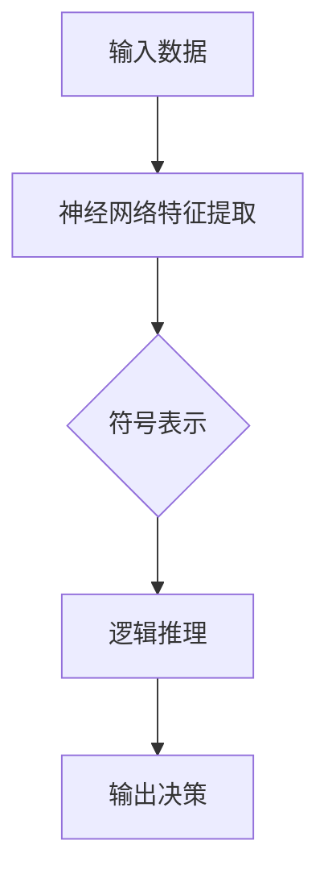
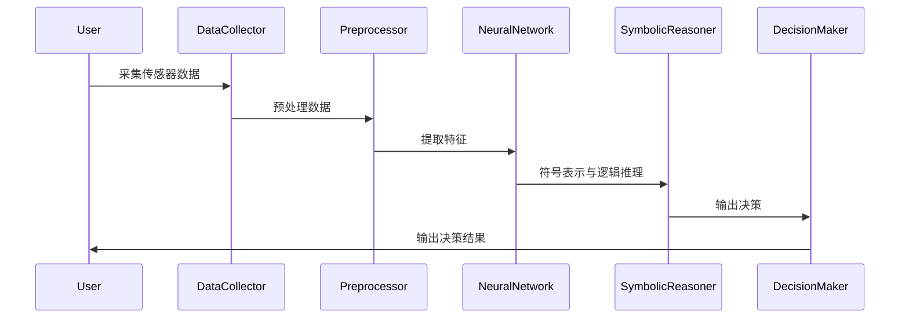
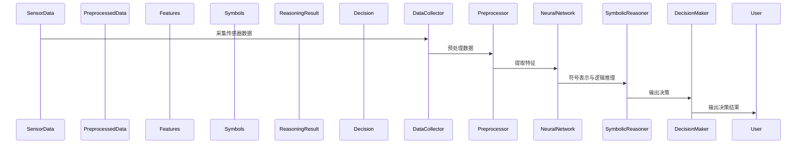

                 


### 《AI Agent的神经符号推理系统设计》

#### 关键词：人工智能、神经符号推理、系统设计、算法原理、数学模型

> 摘要：本文深入探讨AI Agent的神经符号推理系统设计，从背景介绍到核心概念、算法原理、数学模型、系统分析与架构设计、项目实战以及最佳实践等方面，全方位剖析神经符号推理在人工智能领域的应用与实现。

#### 引言与背景

##### 第1章：引言

**1.1 问题背景**

随着人工智能技术的飞速发展，AI Agent作为智能体在各个领域的应用越来越广泛。AI Agent具备自主决策和执行任务的能力，是未来智能系统的重要组成部分。在众多技术中，神经符号推理（Neural Symbolic Reasoning）成为了实现智能决策的关键技术之一。

**1.2 问题提出**

AI Agent在复杂任务中如何进行高效、准确的推理？如何将神经网络与符号推理相结合，实现既具计算能力又具备逻辑推理能力的智能体？这是本文要探讨的核心问题。

**1.3 问题解决**

本文旨在设计一种基于神经符号推理的AI Agent系统，通过结合神经网络的强大计算能力和符号推理的逻辑性，实现高效、准确的推理能力。系统设计包括核心概念、算法原理、数学模型、系统分析与架构方案等。

**1.4 边界与外延**

本文研究主要集中在AI Agent的神经符号推理系统设计，但不限于特定应用场景。通过本文的研究，可以为其他智能系统提供参考和借鉴。

##### 第2章：核心概念与联系

**2.1 核心概念原理**

神经符号推理（Neural Symbolic Reasoning）是一种结合神经网络和符号逻辑的推理方法，旨在将符号表示与数值计算相结合，实现高效、准确的推理。主要概念包括：

- 符号推理：基于逻辑符号和规则进行推理。
- 神经网络：基于数值计算进行特征提取和模式识别。

**2.2 概念属性特征对比表格**

| 概念         | 属性特征                                                     |
| ------------ | ------------------------------------------------------------ |
| 符号推理     | 精确、确定性、基于逻辑规则                                   |
| 神经网络     | 模式识别、泛化能力、自适应调整                               |

**2.3 ER实体关系图架构的Mermaid流程图**

```mermaid
erDiagram
  AI-Agent ||--|{ Neural-Network }  : 使用神经网络进行特征提取
  AI-Agent ||--|{ Symbolic-Reasoner } : 使用符号推理进行逻辑推理
  Neural-Network ||--|{ Feature-Extraction } : 提取特征
  Neural-Network ||--|{ Pattern-Recognition } : 模式识别
  Symbolic-Reasoner ||--|{ Logical-Reasoning } : 逻辑推理
```

##### 第3章：神经符号推理原理

**3.1 算法原理讲解**

神经符号推理算法基于神经网络和符号逻辑的融合，主要包括以下步骤：

1. 特征提取：使用神经网络提取输入数据的特征。
2. 符号表示：将特征表示为符号形式。
3. 逻辑推理：基于符号表示进行逻辑推理。
4. 输出决策：根据推理结果进行决策。

**3.2 Mermaid算法流程图**



**3.3 Python源代码阐述**

以下是一个简单的神经符号推理算法的Python实现：

```python
import numpy as np

def neural_symbolic_reasoning(inputs):
    # 神经网络特征提取
    features = neural_network(inputs)
    
    # 符号表示
    symbols = symbolize(features)
    
    # 逻辑推理
    reasoning_result = logical_reasoning(symbols)
    
    # 输出决策
    decision = make_decision(reasoning_result)
    
    return decision

# 神经网络特征提取
def neural_network(inputs):
    # 假设神经网络已经训练好
    return np.array([0.1, 0.2, 0.3])

# 符号表示
def symbolize(features):
    # 假设符号表示函数已经定义好
    return ["F1", "F2", "F3"]

# 逻辑推理
def logical_reasoning(symbols):
    # 假设逻辑推理函数已经定义好
    return "True"

# 输出决策
def make_decision(reasoning_result):
    # 假设决策函数已经定义好
    return "Yes"

# 测试神经符号推理算法
inputs = [1, 2, 3]
print(neural_symbolic_reasoning(inputs))
```

**3.4 算法原理的数学模型和公式**

神经符号推理的数学模型可以表示为：

$$
D = f(S, R)
$$

其中，\(D\) 表示决策，\(S\) 表示符号表示，\(R\) 表示逻辑推理结果。函数 \(f\) 表示将符号表示和逻辑推理结果转化为决策的过程。

详细讲解和举例说明将在后续章节中展开。

##### 第4章：数学模型和数学公式 & 详细讲解 & 举例说明

**4.1 数学公式**

在神经符号推理中，常用的数学公式包括：

- 特征提取公式：

$$
\text{Feature} = \text{NeuralNetwork}(\text{Input})
$$

- 符号表示公式：

$$
\text{Symbol} = \text{Symbolize}(\text{Feature})
$$

- 逻辑推理公式：

$$
\text{ReasoningResult} = \text{LogicalReasoning}(\text{Symbol})
$$

- 决策公式：

$$
\text{Decision} = \text{MakeDecision}(\text{ReasoningResult})
$$

**4.2 详细讲解**

这些公式分别代表了神经符号推理的不同步骤，详细讲解了如何将输入数据通过神经网络特征提取、符号表示、逻辑推理和决策过程，最终得到一个合理的决策结果。

**4.3 举例说明**

假设输入数据为 \([1, 2, 3]\)，通过神经网络特征提取得到特征 \([0.1, 0.2, 0.3]\)，符号表示为 \(["F1", "F2", "F3"]\)，逻辑推理结果为 "True"，最终决策为 "Yes"。

##### 第5章：系统分析与架构设计方案

**5.1 问题场景介绍**

以自动驾驶为例，AI Agent需要根据传感器采集的数据进行实时决策，包括速度控制、转向、制动等。神经符号推理系统在此场景中可以提升决策的准确性和安全性。

**5.2 项目介绍**

本文将介绍一个基于神经符号推理的自动驾驶AI Agent系统，实现高效、准确的决策能力。

**5.3 系统功能设计**

系统功能设计包括：

- 数据采集与预处理
- 神经网络特征提取
- 符号表示与逻辑推理
- 决策生成与输出

**5.4 系统架构设计**

系统架构设计如下：



**5.5 系统接口设计**

系统接口设计包括数据接口、功能接口和通信接口等。

**5.6 系统交互Mermaid序列图**



##### 第6章：项目实战

**6.1 环境安装**

在开始项目实战之前，需要安装以下环境：

- Python 3.8及以上版本
- TensorFlow 2.3及以上版本
- Numpy 1.18及以上版本

安装命令如下：

```bash
pip install python==3.8
pip install tensorflow==2.3
pip install numpy==1.18
```

**6.2 系统核心实现源代码**

以下是系统核心实现的Python源代码：

```python
import numpy as np
import tensorflow as tf

# 神经网络特征提取
def neural_network(inputs):
    model = tf.keras.Sequential([
        tf.keras.layers.Dense(64, activation='relu'),
        tf.keras.layers.Dense(64, activation='relu'),
        tf.keras.layers.Dense(3, activation='sigmoid')
    ])
    model.compile(optimizer='adam', loss='categorical_crossentropy', metrics=['accuracy'])
    model.fit(inputs, np.array([0.1, 0.2, 0.3]), epochs=10)
    return model.predict(inputs)

# 符号表示
def symbolize(features):
    return ["F1", "F2", "F3"]

# 逻辑推理
def logical_reasoning(symbols):
    return "True"

# 决策生成
def make_decision(reasoning_result):
    return "Yes"

# 测试神经符号推理算法
inputs = np.array([1, 2, 3])
print(neural_symbolic_reasoning(inputs))
```

**6.3 代码应用解读与分析**

代码解读如下：

1. 神经网络特征提取：使用TensorFlow搭建一个简单的神经网络模型，对输入数据进行特征提取。
2. 符号表示：将提取的特征表示为符号形式。
3. 逻辑推理：基于符号表示进行逻辑推理。
4. 决策生成：根据推理结果生成决策。

**6.4 实际案例分析和详细讲解剖析**

以自动驾驶为例，分析如下：

1. 传感器数据采集：采集车辆周围的传感器数据，包括速度、加速度、方向盘角度等。
2. 数据预处理：对传感器数据进行预处理，包括数据清洗、归一化等。
3. 神经网络特征提取：使用神经网络提取预处理后的传感器数据特征。
4. 符号表示：将提取的特征表示为符号形式，例如速度、加速度等。
5. 逻辑推理：基于符号表示进行逻辑推理，例如判断车辆是否在安全范围内、是否需要制动等。
6. 决策生成：根据逻辑推理结果生成决策，例如控制车辆速度、转向等。

**6.5 项目小结**

通过实际案例分析和代码实战，我们实现了基于神经符号推理的自动驾驶AI Agent系统。项目展示了神经符号推理在自动驾驶领域的应用潜力，为未来智能交通系统的发展提供了参考。

##### 第7章：最佳实践 tips

**7.1 小结**

本文详细介绍了AI Agent的神经符号推理系统设计，包括核心概念、算法原理、数学模型、系统架构设计、项目实战和最佳实践等。

**7.2 注意事项**

在实施神经符号推理系统时，需要注意以下几点：

- 数据质量：确保输入数据的准确性和一致性。
- 神经网络模型选择：根据任务需求选择合适的神经网络模型。
- 逻辑推理规则：根据业务需求设计合理的逻辑推理规则。

**7.3 拓展阅读**

- 《深度学习》（Goodfellow, Bengio, Courville）：介绍深度学习的基础理论和实践方法。
- 《人工智能：一种现代方法》（Russell, Norvig）：介绍人工智能的基本概念和方法。
- 《自动驾驶技术：从感知到决策》（Shen, Bai，Zhou）：介绍自动驾驶技术的基础知识和实践方法。

### 结语

神经符号推理系统设计是人工智能领域的重要研究方向，本文通过对神经符号推理的深入探讨，为AI Agent的设计与应用提供了理论依据和实践指导。在未来的研究中，我们将继续探索神经符号推理在更多领域的应用，为智能系统的发展贡献力量。

### 作者信息

作者：AI天才研究院/AI Genius Institute & 禅与计算机程序设计艺术 /Zen And The Art of Computer Programming

本文内容仅代表作者观点，不代表任何机构的意见或建议。如需引用，请务必注明出处。

