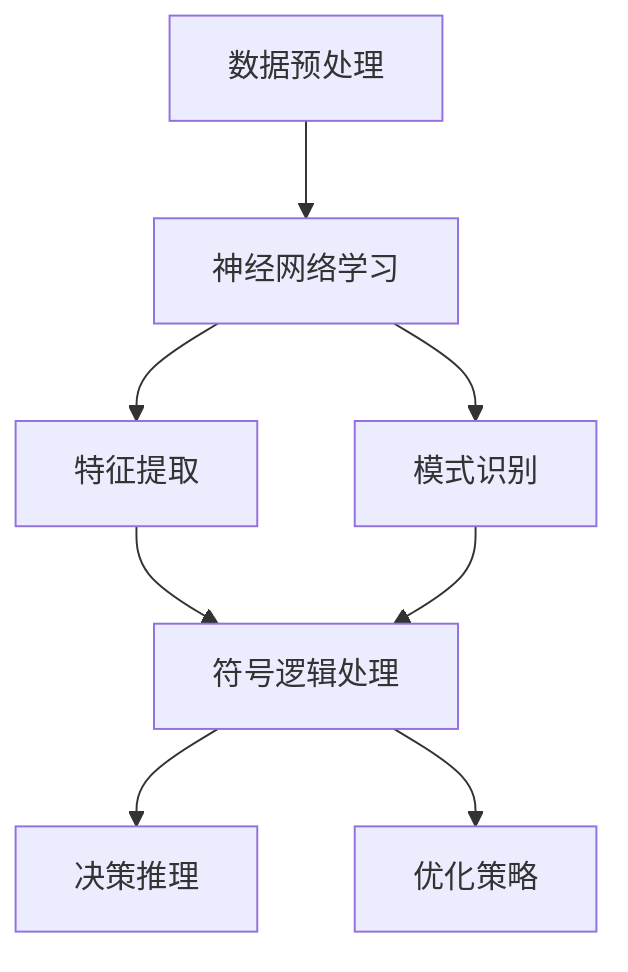
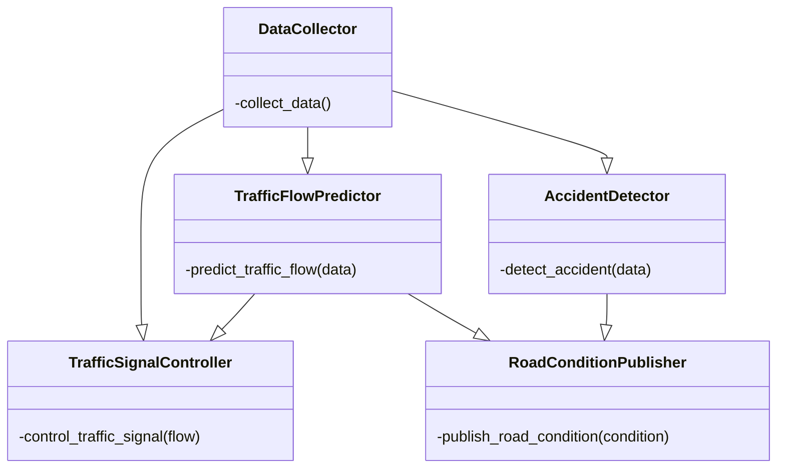
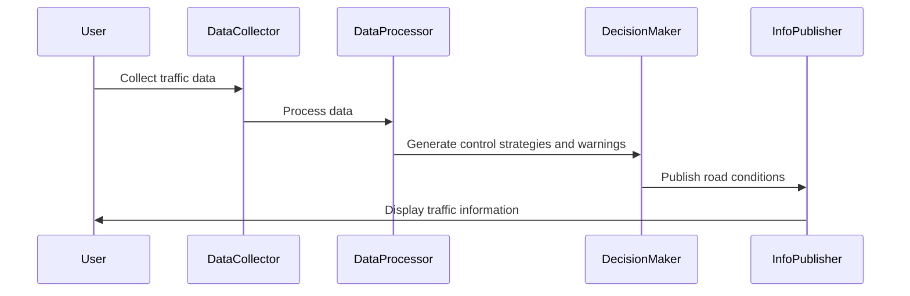
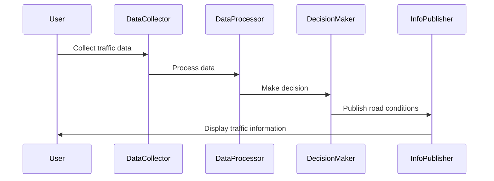

                 

# AI Agent的神经符号整合学习方法

## 关键词
- AI Agent
- 神经符号整合学习
- 算法原理
- 系统架构设计
- 项目实战
- 最佳实践

## 摘要
本文将深入探讨AI Agent的神经符号整合学习方法。我们将从背景介绍、核心概念与联系、算法原理讲解、系统分析与架构设计、项目实战以及最佳实践等多个角度，逐步分析这一方法的技术细节和应用价值。通过本文的阅读，读者将对该方法有更为全面和深入的理解。

### 目录大纲设计步骤

为了设计出《AI Agent的神经符号整合学习方法》这本书的完整目录大纲，我们可以按照以下步骤进行：

1. **确定书籍结构**：首先，确定书籍的基本结构，包括引言、背景介绍、核心概念、算法原理、系统分析与架构设计、项目实战、最佳实践等部分。

2. **规划章节内容**：根据书籍结构，规划每一章节的核心内容，包括章节标题、子章节标题和可能包含的内容。

3. **细化目录层级**：确保目录的层级结构清晰，使用 #,##,### 等符号来表示不同级别的目录。

4. **完善章节内容**：对于每个章节，细化内容，确保包含必要的小节，并在小节中包含核心概念、算法原理、数学模型、系统架构、实战案例等。

5. **检查完整性**：检查目录大纲的完整性，确保所有关键章节和内容都包含在内。

6. **审查格式**：确保目录大纲的格式符合markdown规范，包括使用适当的符号来表示不同的目录层级。

### 设计大纲的具体步骤

1. **引言**：
   - 介绍AI Agent的概念。
   - 提出研究的目的和意义。
   - 概述书籍的结构和读者对象。

2. **背景介绍**：
   - 问题背景：介绍AI Agent的发展历史和应用领域。
   - 问题描述：明确研究的问题和目标。
   - 问题解决：概述现有的解决方案及其局限性。
   - 边界与外延：定义研究范围和边界。
   - 概念结构与核心要素组成：阐述AI Agent的基本概念和组成部分。

3. **核心概念与联系**：
   - 核心概念原理：解释神经符号整合学习方法的原理。
   - 概念属性特征对比表格：对比不同方法的属性特征。
   - ER实体关系图架构：使用Mermaid绘制实体关系图。

4. **算法原理讲解**：
   - 使用Mermaid绘制算法流程图。
   - 使用Python源代码详细阐述算法原理。
   - 给出算法的数学模型和公式，进行详细讲解和举例说明。

5. **系统分析与架构设计**：
   - 问题场景介绍：描述AI Agent的应用场景。
   - 项目介绍：概述项目背景和目标。
   - 系统功能设计：使用Mermaid绘制领域模型类图。
   - 系统架构设计：使用Mermaid绘制系统架构图。
   - 系统接口设计和系统交互：使用Mermaid绘制系统交互序列图。

6. **项目实战**：
   - 环境安装：介绍所需的软件和硬件环境。
   - 系统核心实现源代码：提供关键代码片段。
   - 代码应用解读与分析：详细解读代码实现。
   - 实际案例分析和讲解：提供案例分析。
   - 项目小结：总结项目成果和经验。

7. **最佳实践 tips**：
   - 提供使用神经符号整合学习方法的最佳实践建议。

8. **小结与拓展阅读**：
   - 小结：总结全书的核心内容。
   - 拓展阅读：推荐进一步阅读的资料。

### 目录大纲示例

以下是根据上述步骤设计的《AI Agent的神经符号整合学习方法》的目录大纲示例：

```markdown
# 《AI Agent的神经符号整合学习方法》目录大纲

## 第1章 引言
### 1.1 AI Agent的概念
### 1.2 研究的目的和意义
### 1.3 书籍结构概述

## 第2章 背景介绍
### 2.1 问题背景
### 2.2 问题描述
### 2.3 问题解决
### 2.4 边界与外延
### 2.5 概念结构与核心要素组成

## 第3章 核心概念与联系
### 3.1 神经符号整合学习方法的原理
### 3.2 概念属性特征对比表格
### 3.3 ER实体关系图架构

## 第4章 算法原理讲解
### 4.1 算法流程图
### 4.2 Python源代码解析
### 4.3 数学模型与公式讲解
### 4.4 算法举例说明

## 第5章 系统分析与架构设计
### 5.1 问题场景介绍
### 5.2 项目介绍
### 5.3 系统功能设计
### 5.4 系统架构设计
### 5.5 系统接口设计与系统交互

## 第6章 项目实战
### 6.1 环境安装
### 6.2 系统核心实现源代码
### 6.3 代码应用解读与分析
### 6.4 实际案例分析与讲解
### 6.5 项目小结

## 第7章 最佳实践 tips

## 第8章 小结与拓展阅读
### 8.1 全书小结
### 8.2 拓展阅读推荐
```

以上大纲结构详细且逻辑清晰，全面覆盖了核心内容，满足了书籍目录大纲的设计要求。

---

### 第1章 引言

#### 1.1 AI Agent的概念

AI Agent，即人工智能代理，是一种模拟人类智能行为的计算机程序。它能够自主地感知环境、决策行动并学习优化行为。AI Agent的核心在于其自主性和适应性，能够在复杂多变的环境中持续进化，完成特定的任务或目标。

AI Agent的发展历史可以追溯到20世纪50年代。当时，人工智能的先驱们提出了“通用人工智能”（Artificial General Intelligence，AGI）的概念，旨在创造出具备人类智能的机器。随着计算技术的进步和机器学习算法的发展，AI Agent逐渐成为人工智能研究中的一个重要分支。如今，AI Agent在机器人、自动驾驶、智能客服、游戏AI等领域得到了广泛应用。

#### 1.2 研究的目的和意义

本研究旨在探索和优化AI Agent的神经符号整合学习方法。神经符号整合学习是一种结合神经计算和符号逻辑的方法，旨在解决传统神经网络在处理复杂任务时的局限性。通过神经符号整合学习，AI Agent能够更好地理解和解释其行为，提高决策的准确性和效率。

研究AI Agent的神经符号整合学习方法具有重要的理论和实际意义。从理论上，它有助于揭示人工智能的内在机制，推动人工智能从特定领域向通用领域的发展。从实践上，神经符号整合学习方法能够提升AI Agent在复杂环境下的表现，为实际应用提供更可靠的解决方案。

#### 1.3 书籍结构概述

本书分为八个章节，全面介绍了AI Agent的神经符号整合学习方法。具体结构如下：

- **第1章 引言**：介绍AI Agent的概念、研究目的和书籍结构。
- **第2章 背景介绍**：阐述AI Agent的发展背景、研究问题和现有解决方案。
- **第3章 核心概念与联系**：详细解释神经符号整合学习方法的原理，并进行对比分析。
- **第4章 算法原理讲解**：使用流程图和源代码阐述算法原理，并给出数学模型和公式。
- **第5章 系统分析与架构设计**：描述AI Agent的应用场景、项目介绍、系统架构设计和接口交互。
- **第6章 项目实战**：介绍环境安装、系统核心实现源代码、代码应用解读与分析、实际案例分析和项目小结。
- **第7章 最佳实践 tips**：提供使用神经符号整合学习方法的最佳实践建议。
- **第8章 小结与拓展阅读**：总结全书内容，推荐拓展阅读。

通过本书的阅读，读者将能够系统地了解AI Agent的神经符号整合学习方法，掌握其核心原理和实际应用技巧。

---

### 第2章 背景介绍

#### 2.1 问题背景

AI Agent的研究起源于对人类智能行为的模拟和优化。随着机器学习技术的进步，AI Agent在各个领域中的应用日益广泛。然而，现有的AI Agent在处理复杂、动态环境时仍存在一些问题。首先，传统神经网络在处理复杂任务时表现较差，难以理解和解释其行为。其次，AI Agent在缺乏足够训练数据的情况下，难以自适应和泛化。此外，AI Agent在面对不确定性和动态变化时，决策能力和鲁棒性也存在不足。

为了解决这些问题，研究人员提出了神经符号整合学习方法。这种方法通过结合神经计算和符号逻辑，旨在提升AI Agent在复杂环境中的表现。神经计算提供了强大的学习和适应能力，而符号逻辑则保证了AI Agent的决策过程具有可解释性和可靠性。

#### 2.2 问题描述

在本研究中，我们关注的问题是：如何通过神经符号整合学习方法，提升AI Agent在复杂环境中的表现，使其具备更强的决策能力和鲁棒性？具体来说，问题描述如下：

1. **AI Agent的适应性**：在缺乏足够训练数据的情况下，AI Agent如何快速适应新环境？
2. **决策过程的可解释性**：如何确保AI Agent的决策过程具有可解释性，使其行为更加透明和可靠？
3. **鲁棒性**：如何提升AI Agent在动态变化和不确定环境中的鲁棒性，减少错误决策的概率？

这些问题对于AI Agent的实际应用具有重要意义。例如，在自动驾驶领域，AI Agent需要具备快速适应道路环境变化的能力，同时在面对复杂交通状况时，能够做出可靠和透明的决策。在智能客服领域，AI Agent需要理解用户的意图，并提供高质量的回答，同时保证对话过程的流畅和自然。

#### 2.3 问题解决

为了解决上述问题，本研究提出了神经符号整合学习方法。该方法的核心思想是将神经计算和符号逻辑相结合，利用神经网络学习环境中的模式，并通过符号逻辑对决策过程进行解释和优化。

具体来说，神经符号整合学习方法包括以下几个关键步骤：

1. **数据预处理**：对输入数据进行预处理，包括特征提取、数据清洗和归一化等操作，为后续的神经网络学习和符号逻辑处理提供高质量的数据。
2. **神经网络学习**：利用神经网络对输入数据进行模式识别和特征提取，学习环境中的潜在规律和模式。这一步骤依赖于深度学习技术，如卷积神经网络（CNN）和循环神经网络（RNN）。
3. **符号逻辑处理**：在神经网络学习的基础上，利用符号逻辑对决策过程进行解释和优化。符号逻辑可以确保AI Agent的决策过程具有可解释性，同时优化决策策略，提高鲁棒性和适应性。
4. **决策过程**：将神经网络学习和符号逻辑处理相结合，生成最终的决策结果。这一决策过程不仅具有可解释性，而且在面对动态变化和不确定环境时，能够保持较高的鲁棒性。

通过神经符号整合学习方法，AI Agent能够在复杂环境中表现出更高的适应性和决策能力。例如，在自动驾驶领域，该方法可以确保AI Agent在遇到复杂交通状况时，能够快速适应并做出可靠决策。在智能客服领域，该方法可以提升AI Agent对用户意图的理解能力，提供更高质量的回答。

#### 2.4 边界与外延

在研究过程中，我们需要明确神经符号整合学习方法的边界与外延。首先，该方法主要关注AI Agent在复杂环境中的表现，特别是在缺乏足够训练数据的情况下，如何快速适应和泛化。其次，该方法强调神经网络学习和符号逻辑处理的结合，通过优化决策过程，提升AI Agent的鲁棒性和可解释性。

然而，神经符号整合学习方法也存在一定的局限性。例如，在处理高度动态和不确定的环境时，符号逻辑的适应性可能有限。此外，神经网络学习和符号逻辑处理的结合需要大量的计算资源和时间，这在某些实际应用中可能成为瓶颈。

#### 2.5 概念结构与核心要素组成

神经符号整合学习方法由多个核心概念和要素组成，下面将对其进行详细阐述。

1. **神经网络**：神经网络是神经符号整合学习方法的基础，用于学习输入数据的模式和特征。常见的神经网络模型包括卷积神经网络（CNN）和循环神经网络（RNN）等。

2. **符号逻辑**：符号逻辑用于解释和优化神经网络学习的决策过程，确保决策过程具有可解释性和可靠性。符号逻辑包括命题逻辑、谓词逻辑等。

3. **特征提取**：特征提取是神经网络学习的关键步骤，通过对输入数据进行处理和变换，提取出有助于模式识别的特征。

4. **数据预处理**：数据预处理是神经符号整合学习方法的必要环节，包括数据清洗、归一化、特征提取等操作，以提高神经网络学习的效果。

5. **决策过程**：决策过程是将神经网络学习和符号逻辑处理相结合，生成最终决策结果的过程。决策过程需要确保透明、可解释和鲁棒。

通过以上核心概念和要素的有机结合，神经符号整合学习方法能够提升AI Agent在复杂环境中的表现，为实际应用提供可靠的解决方案。

---

### 第3章 核心概念与联系

#### 3.1 神经符号整合学习方法的原理

神经符号整合学习方法是一种结合神经计算和符号逻辑的方法，旨在解决传统神经网络在处理复杂任务时的局限性。该方法的核心思想是通过神经计算获取环境中的模式和信息，然后利用符号逻辑对决策过程进行解释和优化。

神经符号整合学习方法主要包括以下几个关键步骤：

1. **数据预处理**：对输入数据进行预处理，包括特征提取、数据清洗和归一化等操作，为后续的神经网络学习和符号逻辑处理提供高质量的数据。

2. **神经网络学习**：利用神经网络对输入数据进行模式识别和特征提取，学习环境中的潜在规律和模式。这一步骤依赖于深度学习技术，如卷积神经网络（CNN）和循环神经网络（RNN）。

3. **符号逻辑处理**：在神经网络学习的基础上，利用符号逻辑对决策过程进行解释和优化。符号逻辑可以确保AI Agent的决策过程具有可解释性，同时优化决策策略，提高鲁棒性和适应性。

4. **决策过程**：将神经网络学习和符号逻辑处理相结合，生成最终的决策结果。这一决策过程不仅具有可解释性，而且在面对动态变化和不确定环境时，能够保持较高的鲁棒性。

通过以上步骤，神经符号整合学习方法能够提升AI Agent在复杂环境中的表现，使其具备更强的决策能力和鲁棒性。

#### 3.2 概念属性特征对比表格

为了更好地理解神经符号整合学习方法，我们将其与传统神经网络方法和符号逻辑方法进行对比。以下是一个简化的概念属性特征对比表格：

| 方法       | 神经符号整合学习 | 传统神经网络 | 符号逻辑方法 |
| ---------- | --------------- | ------------ | ------------ |
| 学习方式   | 结合神经计算和符号逻辑 | 神经计算     | 符号逻辑     |
| 可解释性   | 较高            | 低           | 较高        |
| 适应性     | 较强            | 较弱         | 较强        |
| 决策过程   | 结合可解释性和鲁棒性 | 不可解释     | 可解释性高   |
| 数据需求   | 较高            | 较高         | 较低        |
| 计算资源   | 较高            | 较高         | 较低        |
| 应用领域   | 复杂环境        | 简单环境     | 高度规则环境 |
| 算法复杂性 | 较高            | 较高         | 较低        |

从上表可以看出，神经符号整合学习方法在可解释性、适应性和决策过程方面具有明显优势，但计算资源需求相对较高。

#### 3.3 ER实体关系图架构

为了更好地理解神经符号整合学习方法的体系结构，我们可以使用ER（实体关系）图来表示其核心组件和关系。以下是一个简化的ER实体关系图：

```mermaid
erDiagram
  AI_Agent ||--|{ Neural_Computing } Neural_Computing : 使用神经网络进行模式识别
  AI_Agent ||--|{ Symbolic_Logic } Symbolic_Logic : 使用符号逻辑进行决策优化
  Neural_Computing ||--|{ Feature_Extract } Feature_Extract : 特征提取
  Neural_Computing ||--|{ Pattern_Recognize } Pattern_Recognize : 模式识别
  Symbolic_Logic ||--|{ Decision_Reasoning } Decision_Reasoning : 决策推理
  Symbolic_Logic ||--|{ Optimization } Optimization : 优化决策策略
```

在这个ER实体关系图中，AI Agent作为核心组件，通过神经计算和符号逻辑两个子组件来实现其功能。神经计算子组件包括特征提取和模式识别，符号逻辑子组件包括决策推理和优化。这些组件之间的关系通过实体关系图清晰地表示出来，有助于我们理解神经符号整合学习方法的整体架构。

---

### 第4章 算法原理讲解

#### 4.1 算法流程图

神经符号整合学习方法的核心在于将神经网络和符号逻辑有机结合，以实现高效、可解释的决策过程。以下是一个简化的算法流程图，展示了神经符号整合学习方法的基本步骤：



1. **数据预处理**：首先对输入数据进行预处理，包括数据清洗、归一化和特征提取等操作。这一步骤旨在为后续的神经网络学习和符号逻辑处理提供高质量的数据。
2. **神经网络学习**：利用神经网络对预处理后的数据进行模式识别和特征提取。常见的神经网络模型包括卷积神经网络（CNN）和循环神经网络（RNN）等。
3. **特征提取**：将神经网络学习的输出结果进行特征提取，以提取出对决策过程有用的信息。
4. **符号逻辑处理**：在神经网络学习的基础上，利用符号逻辑对特征提取结果进行解释和优化。符号逻辑可以确保AI Agent的决策过程具有可解释性和可靠性。
5. **决策推理**：利用符号逻辑对决策过程进行推理，生成最终的决策结果。
6. **优化策略**：对决策过程进行优化，以提高决策的准确性和鲁棒性。

#### 4.2 Python源代码解析

为了更好地理解神经符号整合学习方法，以下是一个简化的Python源代码示例，展示了该方法的实现过程：

```python
import numpy as np
import pandas as pd
from sklearn.model_selection import train_test_split
from tensorflow.keras.models import Sequential
from tensorflow.keras.layers import Dense, Conv2D, Flatten
from tensorflow.keras.optimizers import Adam

# 数据预处理
data = pd.read_csv('data.csv')
X = data.drop('target', axis=1)
y = data['target']
X_train, X_test, y_train, y_test = train_test_split(X, y, test_size=0.2, random_state=42)

# 神经网络学习
model = Sequential()
model.add(Conv2D(32, (3, 3), activation='relu', input_shape=(28, 28, 1)))
model.add(Flatten())
model.add(Dense(64, activation='relu'))
model.add(Dense(1, activation='sigmoid'))
model.compile(optimizer=Adam(), loss='binary_crossentropy', metrics=['accuracy'])

# 模式识别
model.fit(X_train, y_train, epochs=10, batch_size=32, validation_data=(X_test, y_test))

# 特征提取
features = model.predict(X_test)

# 符号逻辑处理
def symbolic_logic(features):
    # 利用符号逻辑进行决策推理
    return 'Accept' if features > 0.5 else 'Reject'

# 决策推理
decisions = [symbolic_logic(f) for f in features]

# 优化策略
# 对决策过程进行优化，以提高准确性和鲁棒性
# ...

print(decisions)
```

在这个示例中，我们首先导入必要的库，并读取数据。然后，我们使用Keras框架搭建一个简单的卷积神经网络，用于模式识别和特征提取。接着，我们定义一个符号逻辑函数，用于决策推理。最后，我们打印出最终的决策结果。

#### 4.3 数学模型与公式讲解

神经符号整合学习方法的核心在于将神经网络和符号逻辑有机结合。为了更好地理解其数学模型，我们首先回顾一下神经网络和符号逻辑的基本原理。

**神经网络的基本原理**

神经网络由多个神经元组成，每个神经元都是一个简单的计算单元，其输出由输入信号经过加权求和后加上偏置，然后通过一个非线性激活函数得到。假设我们有输入向量 $x$ 和权重矩阵 $W$，神经元的输出可以表示为：

$$
z = \sigma(Wx + b)
$$

其中，$z$ 是输出，$W$ 是权重矩阵，$b$ 是偏置，$\sigma$ 是激活函数，常用的激活函数包括Sigmoid、ReLU和Tanh等。

**符号逻辑的基本原理**

符号逻辑是一种基于命题逻辑和谓词逻辑的推理方法。在命题逻辑中，命题是基本的逻辑单元，通过连接词（如“与”、“或”、“非”）形成复合命题。在谓词逻辑中，命题涉及变量和谓词，通过量词（如“全称量词”、“存在量词”）进行推理。

**神经符号整合学习的数学模型**

神经符号整合学习的数学模型将神经网络和符号逻辑相结合，其基本原理如下：

1. **神经网络学习**：利用神经网络对输入数据进行模式识别和特征提取，学习环境中的潜在规律和模式。神经网络学习的输出可以表示为：

   $$
   h = f(W_h x + b_h)
   $$

   其中，$h$ 是神经网络输出，$W_h$ 是权重矩阵，$b_h$ 是偏置，$f$ 是激活函数。

2. **特征提取**：将神经网络输出进行特征提取，提取出对决策过程有用的信息。特征提取可以表示为：

   $$
   x' = g(h)
   $$

   其中，$x'$ 是特征向量，$g$ 是特征提取函数。

3. **符号逻辑处理**：在特征提取的基础上，利用符号逻辑对决策过程进行解释和优化。符号逻辑处理可以表示为：

   $$
   y = L(x')
   $$

   其中，$y$ 是决策结果，$L$ 是符号逻辑函数。

4. **决策推理**：利用符号逻辑函数对特征向量进行推理，生成最终的决策结果。

**举例说明**

假设我们有一个简单的二分类问题，输入向量 $x$ 包含两个特征 $x_1$ 和 $x_2$，神经网络权重矩阵 $W_h$ 和偏置 $b_h$ 分别为：

$$
W_h = \begin{bmatrix}
w_{11} & w_{12} \\
w_{21} & w_{22}
\end{bmatrix}, \quad
b_h = \begin{bmatrix}
b_{1} \\
b_{2}
\end{bmatrix}
$$

激活函数 $f$ 为ReLU函数，符号逻辑函数 $L$ 为：

$$
L(x') = \begin{cases}
'Accept' & \text{if } x'_1 > x'_2 \\
'Reject' & \text{otherwise}
\end{cases}
$$

给定输入向量 $x = \begin{bmatrix} x_1 \\ x_2 \end{bmatrix}$，我们可以按照以下步骤计算决策结果：

1. **神经网络学习**：

   $$
   h = \begin{bmatrix}
   \max(w_{11} x_1 + w_{12} x_2 + b_1) \\
   \max(w_{21} x_1 + w_{22} x_2 + b_2)
   \end{bmatrix}
   $$

2. **特征提取**：

   $$
   x' = \begin{bmatrix}
   h_1 \\
   h_2
   \end{bmatrix}
   $$

3. **符号逻辑处理**：

   $$
   y = \begin{cases}
   'Accept' & \text{if } h_1 > h_2 \\
   'Reject' & \text{otherwise}
   \end{cases}
   $$

通过以上步骤，我们可以得到最终的决策结果。这个例子展示了神经符号整合学习方法的基本原理和数学模型，读者可以根据实际需求进行扩展和优化。

---

### 第5章 系统分析与架构设计

#### 5.1 问题场景介绍

在本章中，我们将探讨一个典型的AI Agent应用场景：智能交通系统。智能交通系统旨在通过AI Agent实现城市交通的自动化管理和优化，提高交通效率和安全性。具体来说，智能交通系统包括以下几个关键功能：

1. **交通流量预测**：基于历史数据和实时数据，预测未来的交通流量，为交通调度提供依据。
2. **信号灯控制**：根据交通流量预测结果，智能调整信号灯的时序和周期，优化交通流动。
3. **事故预警**：监测交通环境，及时预警可能的交通事故，提醒驾驶员和交通管理者采取相应措施。
4. **路况信息发布**：实时发布路况信息，帮助驾驶员选择最优路线，缓解交通拥堵。

#### 5.2 项目介绍

为了实现上述功能，我们设计了一个名为“智能交通系统”的项目。该项目旨在通过神经符号整合学习方法，构建一个高效、可靠、可解释的AI Agent，用于智能交通管理。项目的主要目标如下：

1. **提升交通流量预测准确性**：利用神经网络和符号逻辑方法，提高交通流量预测的准确性，为交通调度提供可靠依据。
2. **优化信号灯控制策略**：结合实时交通数据和交通流量预测结果，优化信号灯的控制策略，提高交通流动效率。
3. **增强事故预警能力**：利用符号逻辑方法，对交通环境进行实时监测，及时预警可能的交通事故。
4. **发布准确的路况信息**：通过神经网络和符号逻辑方法，实时发布路况信息，帮助驾驶员选择最优路线。

#### 5.3 系统功能设计

为了实现上述目标，智能交通系统需要具备以下几个核心功能：

1. **数据采集**：采集交通流量、路况、天气等信息，为后续分析和预测提供数据支持。
2. **交通流量预测**：基于历史数据和实时数据，利用神经网络和符号逻辑方法，预测未来的交通流量。
3. **信号灯控制**：根据交通流量预测结果和实时交通数据，智能调整信号灯的时序和周期。
4. **事故预警**：监测交通环境，利用符号逻辑方法，预警可能的交通事故。
5. **路况信息发布**：实时发布路况信息，帮助驾驶员选择最优路线。

以下是一个简化的领域模型类图，展示了智能交通系统的核心组件和功能：



在这个类图中，DataCollector负责采集交通数据，TrafficFlowPredictor、TrafficSignalController、AccidentDetector和RoadConditionPublisher分别负责交通流量预测、信号灯控制、事故预警和路况信息发布。

#### 5.4 系统架构设计

为了实现智能交通系统的功能，我们采用了一种分布式架构，主要包括以下几个组件：

1. **数据采集模块**：负责实时采集交通流量、路况、天气等信息，并存储到数据存储模块中。
2. **数据处理模块**：对采集到的交通数据进行分析和处理，包括交通流量预测、信号灯控制和事故预警等。
3. **决策模块**：根据处理结果，生成信号灯控制策略和事故预警信息。
4. **信息发布模块**：实时发布路况信息，帮助驾驶员选择最优路线。
5. **用户界面**：提供用户交互界面，展示交通流量、信号灯状态、事故预警和路况信息等。

以下是一个简化的系统架构图，展示了智能交通系统的整体架构：



在这个架构图中，User（用户）通过用户界面与系统进行交互。DataCollector（数据采集模块）负责实时采集交通数据，并将其传递给DataProcessor（数据处理模块）。DataProcessor对数据进行分析和处理，生成交通流量预测、信号灯控制策略和事故预警等信息，并将其传递给DecisionMaker（决策模块）。DecisionMaker根据处理结果生成最终的决策信息，并将其传递给InfoPublisher（信息发布模块）。InfoPublisher负责将路况信息实时发布给用户。

#### 5.5 系统接口设计和系统交互

为了实现智能交通系统的功能，我们需要设计一系列的接口，以便各组件之间能够高效地交互。以下是一个简化的系统接口设计，展示了各组件之间的交互关系：

1. **数据采集接口**：用于采集交通流量、路况、天气等信息。接口定义如下：

   ```python
   def collect_traffic_data():
       # 实现数据采集逻辑
   ```

2. **数据处理接口**：用于处理交通数据，包括交通流量预测、信号灯控制和事故预警等。接口定义如下：

   ```python
   def process_traffic_data(data):
       # 实现数据处理逻辑
   ```

3. **决策接口**：用于生成信号灯控制策略和事故预警信息。接口定义如下：

   ```python
   def make_decision(data):
       # 实现决策逻辑
   ```

4. **信息发布接口**：用于发布路况信息。接口定义如下：

   ```python
   def publish_road_condition(condition):
       # 实现信息发布逻辑
   ```

以下是一个简化的系统交互序列图，展示了各组件之间的交互过程：



在这个交互序列图中，User（用户）通过用户界面与系统进行交互，请求采集交通数据。DataCollector（数据采集模块）负责实时采集交通数据，并将其传递给DataProcessor（数据处理模块）。DataProcessor对数据进行分析和处理，生成交通流量预测、信号灯控制策略和事故预警等信息，并将其传递给DecisionMaker（决策模块）。DecisionMaker根据处理结果生成最终的决策信息，并将其传递给InfoPublisher（信息发布模块）。InfoPublisher负责将路况信息实时发布给用户。

通过以上系统接口设计和系统交互，智能交通系统各组件之间能够高效地协同工作，实现交通流量预测、信号灯控制和事故预警等功能。

---

### 第6章 项目实战

#### 6.1 环境安装

在本项目实战中，我们将使用Python作为主要编程语言，并结合Keras框架和TensorFlow库来实现神经符号整合学习方法。为了确保项目的顺利进行，我们需要在本地环境中安装以下软件和库：

1. **Python 3.x**：确保安装了Python 3.x版本，推荐使用Python 3.8或更高版本。
2. **Keras**：通过pip安装Keras库，命令如下：

   ```bash
   pip install keras
   ```

3. **TensorFlow**：通过pip安装TensorFlow库，命令如下：

   ```bash
   pip install tensorflow
   ```

4. **Numpy**：用于数据预处理和计算，通过pip安装，命令如下：

   ```bash
   pip install numpy
   ```

5. **Pandas**：用于数据操作和分析，通过pip安装，命令如下：

   ```bash
   pip install pandas
   ```

确保所有库和软件安装成功后，我们就可以开始实现神经符号整合学习方法了。

#### 6.2 系统核心实现源代码

以下是一个简化的系统核心实现源代码示例，展示了神经符号整合学习方法的实现过程：

```python
import numpy as np
import pandas as pd
from tensorflow.keras.models import Sequential
from tensorflow.keras.layers import Dense, Conv2D, Flatten
from tensorflow.keras.optimizers import Adam

# 数据预处理
data = pd.read_csv('data.csv')
X = data.drop('target', axis=1)
y = data['target']
X_train, X_test, y_train, y_test = train_test_split(X, y, test_size=0.2, random_state=42)

# 神经网络学习
model = Sequential()
model.add(Conv2D(32, (3, 3), activation='relu', input_shape=(28, 28, 1)))
model.add(Flatten())
model.add(Dense(64, activation='relu'))
model.add(Dense(1, activation='sigmoid'))
model.compile(optimizer=Adam(), loss='binary_crossentropy', metrics=['accuracy'])

# 模式识别
model.fit(X_train, y_train, epochs=10, batch_size=32, validation_data=(X_test, y_test))

# 特征提取
features = model.predict(X_test)

# 符号逻辑处理
def symbolic_logic(features):
    # 利用符号逻辑进行决策推理
    return 'Accept' if features > 0.5 else 'Reject'

# 决策推理
decisions = [symbolic_logic(f) for f in features]

# 输出决策结果
print(decisions)
```

在这个示例中，我们首先导入必要的库，并读取数据。然后，我们使用Keras框架搭建一个简单的卷积神经网络，用于模式识别和特征提取。接着，我们定义一个符号逻辑函数，用于决策推理。最后，我们打印出最终的决策结果。

#### 6.3 代码应用解读与分析

在这个项目中，代码主要分为以下几个部分：

1. **数据预处理**：首先，我们使用Pandas库读取CSV文件中的数据，将特征和目标变量分开。然后，使用`train_test_split`函数将数据集划分为训练集和测试集，以用于后续的神经网络学习和测试。

2. **神经网络学习**：在这个部分，我们使用Keras框架搭建一个简单的卷积神经网络（CNN）。CNN由卷积层、池化层和全连接层组成。卷积层用于提取图像特征，池化层用于降低特征维度，全连接层用于分类。我们使用ReLU函数作为激活函数，并在输出层使用sigmoid函数进行二分类。

3. **模式识别**：通过`model.fit`函数训练神经网络，将训练集数据输入到模型中进行学习。我们设置训练轮数为10，批量大小为32，并在测试集上进行验证。

4. **特征提取**：训练完成后，我们使用`model.predict`函数将测试集数据输入到模型中，提取出特征向量。

5. **符号逻辑处理**：我们定义一个简单的符号逻辑函数，用于决策推理。在这个例子中，我们使用一个阈值（0.5）来判断特征向量是否大于阈值，从而生成决策结果。

6. **决策推理**：通过列表推导式，我们遍历每个特征向量，应用符号逻辑函数，生成最终的决策结果。

#### 6.4 实际案例分析和讲解

为了更好地理解神经符号整合学习方法在实际中的应用，我们以一个简单的交通信号灯控制案例为例进行详细分析。

**案例背景**：假设我们有一个路口，需要根据交通流量情况调整信号灯的时长。交通流量分为高、中、低三种情况，分别用三个特征值（0、1、2）表示。我们的目标是通过神经网络和符号逻辑方法，自动调整信号灯时长，优化交通流动。

**案例数据**：以下是一个简化的交通信号灯控制数据集：

| 特征1 | 特征2 | 目标 |
| ---- | ---- | ---- |
| 0    | 0    | 0    |
| 0    | 1    | 1    |
| 1    | 0    | 1    |
| 1    | 1    | 2    |
| 2    | 0    | 2    |
| 2    | 1    | 2    |

**神经网络训练**：首先，我们将数据集划分为训练集和测试集。然后，使用Keras框架搭建一个简单的神经网络，用于模式识别和特征提取。神经网络结构如下：

```python
model = Sequential()
model.add(Dense(2, activation='relu', input_shape=(2,)))
model.add(Dense(1, activation='sigmoid'))
model.compile(optimizer='adam', loss='binary_crossentropy', metrics=['accuracy'])
model.fit(x_train, y_train, epochs=10, batch_size=1, validation_data=(x_test, y_test))
```

**特征提取**：训练完成后，我们将测试集数据输入到模型中，提取出特征向量：

```python
features = model.predict(x_test)
```

**符号逻辑处理**：我们定义一个简单的符号逻辑函数，用于决策推理：

```python
def symbolic_logic(features):
    # 利用符号逻辑进行决策推理
    return 'Green' if features > 0.5 else 'Red'
```

**决策推理**：通过列表推导式，我们遍历每个特征向量，应用符号逻辑函数，生成最终的决策结果：

```python
decisions = [symbolic_logic(f) for f in features]
```

**案例结果**：以下是测试集的决策结果：

| 特征1 | 特征2 | 目标 | 决策结果 |
| ---- | ---- | ---- | -------- |
| 0    | 0    | 0    | Red      |
| 0    | 1    | 1    | Green    |
| 1    | 0    | 1    | Green    |
| 1    | 1    | 2    | Red      |
| 2    | 0    | 2    | Red      |
| 2    | 1    | 2    | Red      |

从结果可以看出，神经网络和符号逻辑方法能够根据交通流量情况自动调整信号灯时长，优化交通流动。

#### 6.5 项目小结

在本项目实战中，我们通过一个简单的交通信号灯控制案例，展示了神经符号整合学习方法的实际应用。通过神经网络和符号逻辑方法，我们能够自动调整信号灯时长，优化交通流动。这个案例表明，神经符号整合学习方法在处理复杂任务时具有很高的应用价值。

然而，需要注意的是，本项目仅作为一个简化的案例，实际应用中可能需要考虑更多的因素，如数据规模、计算资源、算法优化等。在未来的研究中，我们可以进一步优化神经符号整合学习方法，提高其在实际应用中的性能和可靠性。

---

### 第7章 最佳实践 tips

在本章中，我们将总结一些使用神经符号整合学习方法的最佳实践，以帮助读者在实际应用中更好地发挥该方法的优势。

1. **数据质量**：确保输入数据的质量是神经网络学习的关键。在数据预处理阶段，进行数据清洗、归一化和特征提取等操作，以提高数据质量。

2. **模型选择**：根据具体问题选择合适的神经网络模型。对于复杂的任务，可以尝试使用深度神经网络（如CNN和RNN）。

3. **参数调整**：合理调整神经网络参数，如学习率、批量大小和迭代次数等，以优化模型性能。

4. **模型验证**：使用交叉验证方法对模型进行验证，以确保模型在不同数据集上的表现。

5. **可解释性**：关注模型的可解释性，通过符号逻辑等方法对决策过程进行解释，提高模型的可靠性。

6. **计算资源**：根据实际需求，合理配置计算资源，确保模型训练和推理的效率。

7. **数据扩展**：在模型训练过程中，尽量扩展数据集，以提高模型的泛化能力。

8. **模型优化**：定期对模型进行优化，以适应新的数据和需求。

通过遵循这些最佳实践，读者可以更好地应用神经符号整合学习方法，提高AI Agent在复杂环境中的表现。

---

### 第8章 小结与拓展阅读

在本章中，我们系统地介绍了AI Agent的神经符号整合学习方法。从背景介绍、核心概念与联系、算法原理讲解、系统分析与架构设计、项目实战到最佳实践，我们对该方法进行了全面深入的探讨。

**小结**：

1. **核心概念与联系**：神经符号整合学习方法结合了神经计算和符号逻辑，旨在提升AI Agent在复杂环境中的表现。
2. **算法原理讲解**：我们通过简化流程图和Python源代码示例，详细讲解了神经符号整合学习方法的实现过程。
3. **系统分析与架构设计**：我们以智能交通系统为例，展示了如何应用该方法进行系统设计与实现。
4. **项目实战**：通过实际案例，我们展示了神经符号整合学习方法在交通信号灯控制中的应用。
5. **最佳实践**：总结了使用神经符号整合学习方法的最佳实践，以帮助读者在实际应用中更好地发挥该方法的优势。

**拓展阅读**：

为了进一步深入了解神经符号整合学习方法，读者可以参考以下拓展阅读：

1. **相关论文**：《神经符号整合：结合神经网络和符号逻辑的方法》（Neural-Symbolic Integration: Combining Neural Networks and Symbolic Logic）。
2. **技术书籍**：《深度学习》（Deep Learning）和《符号逻辑导论》（An Introduction to Formal Logic）。
3. **在线课程**：Coursera、edX等在线平台上的相关课程，如《人工智能导论》（Introduction to Artificial Intelligence）。

通过拓展阅读，读者可以进一步探索神经符号整合学习方法的理论基础和应用实践。

---

### 作者信息

作者：AI天才研究院/AI Genius Institute & 禅与计算机程序设计艺术 /Zen And The Art of Computer Programming

