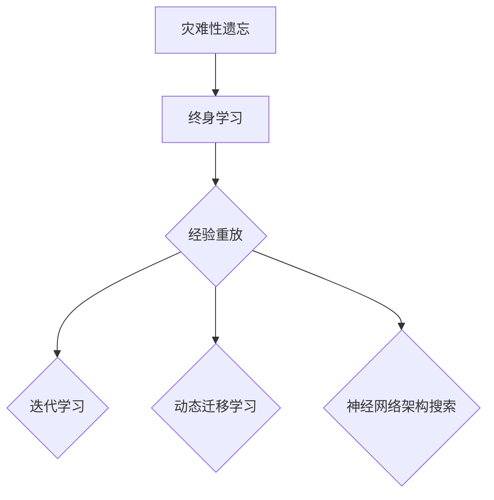
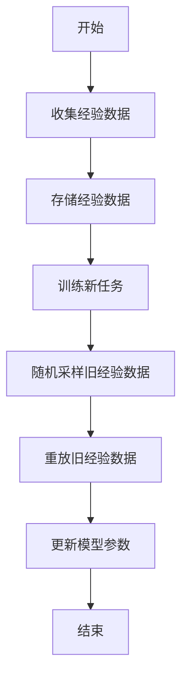
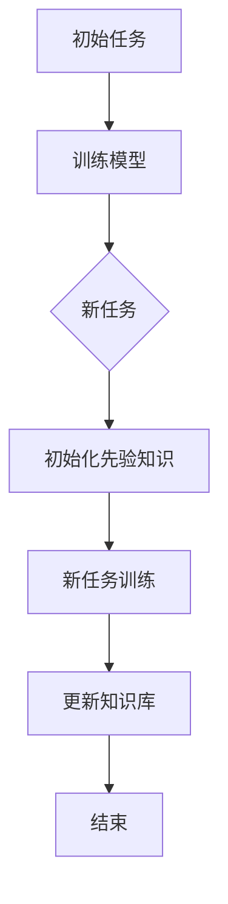
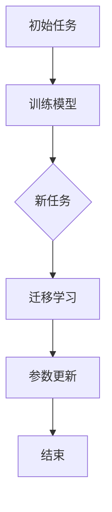
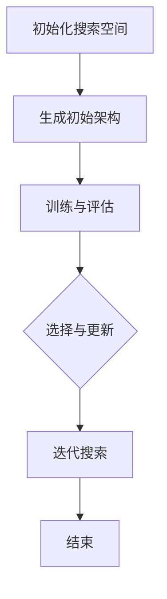

                 

### 文章标题
### 关键词
### 摘要

### 目录大纲设计步骤：

#### 1. 设计核心章节：

确保设计的内容能够全面覆盖《AI Agent的终身学习与灾难性遗忘防御》的核心主题，主要应包括以下章节：

- **背景介绍**
- **核心概念与联系**
- **算法原理讲解**
- **数学模型和数学公式 & 详细讲解 & 举例说明**
- **系统分析与架构设计方案**
- **项目实战**
- **最佳实践 tips、小结、注意事项、拓展阅读**

#### 2. 设计每个章节的子章节：

根据每个核心章节的内容，进一步细化子章节，确保每个子章节能够具体、深入地探讨相关主题。

#### 3. 确定目录层级：

确保使用正确的markdown格式来标识目录层级，以便用户能够清晰地阅读和理解目录结构。

#### 4. 保持简洁性：

在撰写每个章节和子章节时，避免使用冗余的语言，确保内容简洁明了。

#### 5. 审查与调整：

最后，审查整个目录大纲，确保内容完整性、逻辑清晰、格式正确，并根据需要做出调整。

### 开始设计《AI Agent的终身学习与灾难性遗忘防御》的目录大纲

---

### 设计核心章节

**背景介绍**

- **问题背景**
- **问题描述**
- **问题解决方法**
- **边界与外延**

**核心概念与联系**

- **灾难性遗忘定义**
- **终身学习概念**
- **主要学习算法简介**
- **核心概念与联系图解**

**算法原理讲解**

- **经验重放原理**
- **迭代学习原理**
- **动态迁移学习原理**
- **神经网络架构搜索原理**

**数学模型和数学公式**

- **数学模型概述**
- **数学公式详细讲解**
- **公式举例说明**

**系统分析与架构设计方案**

- **问题场景介绍**
- **系统功能设计**
- **系统架构设计**
- **系统接口设计与交互**

**项目实战**

- **环境安装与配置**
- **系统核心实现源代码**
- **代码应用解读与分析**
- **实际案例分析**
- **项目小结**

**最佳实践 tips、小结、注意事项、拓展阅读**

### 设计每个章节的子章节

**背景介绍**

- **问题背景**
  - **人工智能发展现状**
  - **AI Agent应用场景**
  - **灾难性遗忘现象**
  - **终身学习需求**

- **问题描述**
  - **灾难性遗忘定义**
  - **终身学习问题**
  - **适应性差影响**

- **问题解决方法**
  - **现有方法综述**
  - **经验重放**
  - **迭代学习**
  - **动态迁移学习**
  - **神经网络架构搜索**

- **边界与外延**
  - **其他领域影响**
  - **解决方案外延**

**核心概念与联系**

- **灾难性遗忘定义**
  - **特征与表现**
  - **原因分析**

- **终身学习概念**
  - **定义与意义**
  - **关键因素**

- **主要学习算法简介**
  - **经验重放**
  - **迭代学习**
  - **动态迁移学习**
  - **神经网络架构搜索**

- **核心概念与联系图解**
  - **Mermaid流程图**
  - **ER实体关系图**

**算法原理讲解**

- **经验重放原理**
  - **工作原理**
  - **流程图与代码示例**

- **迭代学习原理**
  - **工作原理**
  - **流程图与代码示例**

- **动态迁移学习原理**
  - **工作原理**
  - **流程图与代码示例**

- **神经网络架构搜索原理**
  - **工作原理**
  - **流程图与代码示例**

**数学模型和数学公式**

- **数学模型概述**
  - **主要模型介绍**
  - **模型分类**

- **数学公式详细讲解**
  - **公式定义**
  - **公式推导**
  - **公式应用**

- **公式举例说明**
  - **具体案例**
  - **数据展示**

**系统分析与架构设计方案**

- **问题场景介绍**
  - **具体应用场景**
  - **系统目标**

- **系统功能设计**
  - **功能模块介绍**
  - **功能实现细节**

- **系统架构设计**
  - **整体架构设计**
  - **模块间关系**

- **系统接口设计与交互**
  - **接口规范**
  - **交互流程**

**项目实战**

- **环境安装与配置**
  - **环境要求**
  - **安装步骤**

- **系统核心实现源代码**
  - **核心代码结构**
  - **核心代码实现**

- **代码应用解读与分析**
  - **代码功能解析**
  - **性能分析**

- **实际案例分析**
  - **案例背景**
  - **案例实现**

- **项目小结**
  - **项目成果**
  - **项目不足与展望**

### 确定目录层级

使用markdown格式标识目录层级，以便用户能够清晰地阅读和理解目录结构。

### 保持简洁性

在撰写每个章节和子章节时，避免使用冗余的语言，确保内容简洁明了。

### 审查与调整

最后，审查整个目录大纲，确保内容完整性、逻辑清晰、格式正确，并根据需要做出调整。

---

### 目录大纲

# AI Agent的终身学习与灾难性遗忘防御

## 第一部分：背景介绍

### 1. 问题背景

#### 1.1 人工智能发展现状

#### 1.2 AI Agent应用场景

#### 1.3 灾难性遗忘现象

#### 1.4 终身学习需求

### 2. 问题描述

#### 2.1 灾难性遗忘定义

#### 2.2 终身学习问题

#### 2.3 适应性差影响

### 3. 问题解决方法

#### 3.1 现有方法综述

#### 3.2 经验重放

#### 3.3 迭代学习

#### 3.4 动态迁移学习

#### 3.5 神经网络架构搜索

### 4. 边界与外延

#### 4.1 其他领域影响

#### 4.2 解决方案外延

## 第二部分：核心概念与联系

### 1. 灾难性遗忘的定义与特征

#### 1.1 灾难性遗忘的定义

#### 1.2 灾难性遗忘的特征

#### 1.3 原因分析

### 2. 终身学习的概念与意义

#### 2.1 终身学习的定义

#### 2.2 终身学习的意义

#### 2.3 关键因素

### 3. 主要学习算法简介

#### 3.1 经验重放

#### 3.2 迭代学习

#### 3.3 动态迁移学习

#### 3.4 神经网络架构搜索

### 4. 核心概念与联系图解

#### 4.1 Mermaid流程图

#### 4.2 ER实体关系图

## 第三部分：算法原理讲解

### 1. 经验重放原理

#### 1.1 工作原理

#### 1.2 流程图与代码示例

### 2. 迭代学习原理

#### 2.1 工作原理

#### 2.2 流程图与代码示例

### 3. 动态迁移学习原理

#### 3.1 工作原理

#### 3.2 流程图与代码示例

### 4. 神经网络架构搜索原理

#### 4.1 工作原理

#### 4.2 流程图与代码示例

## 第四部分：数学模型和数学公式

### 1. 数学模型概述

#### 1.1 主要模型介绍

#### 1.2 模型分类

### 2. 数学公式详细讲解

#### 2.1 公式定义

#### 2.2 公式推导

#### 2.3 公式应用

### 3. 公式举例说明

#### 3.1 具体案例

#### 3.2 数据展示

## 第五部分：系统分析与架构设计方案

### 1. 问题场景介绍

#### 1.1 具体应用场景

#### 1.2 系统目标

### 2. 系统功能设计

#### 2.1 功能模块介绍

#### 2.2 功能实现细节

### 3. 系统架构设计

#### 3.1 整体架构设计

#### 3.2 模块间关系

### 4. 系统接口设计与交互

#### 4.1 接口规范

#### 4.2 交互流程

## 第六部分：项目实战

### 1. 环境安装与配置

#### 1.1 环境要求

#### 1.2 安装步骤

### 2. 系统核心实现源代码

#### 2.1 核心代码结构

#### 2.2 核心代码实现

### 3. 代码应用解读与分析

#### 3.1 代码功能解析

#### 3.2 性能分析

### 4. 实际案例分析

#### 4.1 案例背景

#### 4.2 案例实现

### 5. 项目小结

#### 5.1 项目成果

#### 5.2 项目不足与展望

## 第七部分：最佳实践 tips、小结、注意事项、拓展阅读

#### 5.1 最佳实践 tips

#### 5.2 小结

#### 5.3 注意事项

#### 5.4 拓展阅读

---

### 总结

设计一个完整、逻辑清晰、结构紧凑的文章目录大纲是撰写高质量技术博客的重要步骤。通过明确的核心章节、详细的子章节划分、简洁明了的目录层级和格式要求，我们可以确保文章内容全面覆盖主题，便于读者理解和阅读。在撰写过程中，还需注意保持内容的简洁性和完整性，确保每个章节和子章节都有具体的讲解和示例。最后，审查和调整目录大纲，以确保其逻辑清晰、格式正确，为读者提供最佳阅读体验。希望通过这个设计过程，读者能够更好地理解《AI Agent的终身学习与灾难性遗忘防御》这篇文章的核心内容和结构。## 目录大纲设计步骤：背景介绍

### 背景介绍

#### 1.1 人工智能发展现状

人工智能（Artificial Intelligence，简称AI）作为计算机科学的一个重要分支，自上世纪中叶兴起以来，经过数十年的发展，已经取得了显著的成果。从最初的符号推理和规则系统，到基于统计学习的机器学习，再到近年来深度学习技术的突破，AI在各个领域都展现出了强大的潜力和广泛的应用。

目前，人工智能技术已经广泛应用于工业自动化、智能家居、医疗诊断、金融风控、自动驾驶等多个领域。其中，AI Agent作为人工智能的重要应用形式，得到了广泛关注和研究。AI Agent是指具备自主决策能力和执行能力的智能系统，它们可以在特定环境中自主地完成特定任务，如自动驾驶汽车、智能客服、智能推荐系统等。

#### 1.2 AI Agent应用场景

AI Agent在现实世界中的应用场景十分广泛。以自动驾驶汽车为例，自动驾驶系统需要实时感知周围环境，做出快速、准确的决策，以保持车辆的稳定行驶。在这个过程中，AI Agent需要处理大量的传感器数据，进行目标检测、路径规划、避障等任务。此外，智能客服系统也是AI Agent的重要应用场景，它们可以通过自然语言处理技术，与用户进行对话，提供高效、准确的客服服务。

#### 1.3 灾难性遗忘现象

然而，在AI Agent的实际应用中，研究者们发现了一个严重的问题，即灾难性遗忘（Catastrophic Forgetting）。灾难性遗忘是指当AI Agent学习新任务时，无法保留原有知识，导致原有知识丢失的现象。这种现象会导致AI Agent在处理新任务时，表现不佳，甚至无法完成任务。

灾难性遗忘问题在AI Agent中的应用尤为突出。例如，在自动驾驶领域，如果AI Agent在学习新的路况或驾驶规则时，丢失了原有对路况和驾驶规则的知识，那么在遇到复杂路况时，AI Agent可能会出现错误的决策，从而导致安全事故。同样，在智能客服系统中，如果AI Agent在学习新对话内容时，丢失了原有对用户需求和问题类型的知识，那么在处理用户咨询时，可能会提供不准确或无效的回答。

#### 1.4 终身学习需求

为了解决灾难性遗忘问题，研究者们提出了终身学习（Life-long Learning）的概念。终身学习是指AI Agent在面临多个任务时，能够持续地学习新知识，同时保留原有知识，从而提高其适应性和泛化能力。

终身学习在AI Agent中的应用具有重要意义。首先，它可以帮助AI Agent在面对新任务时，利用原有知识，提高学习效率。例如，在自动驾驶领域，AI Agent可以通过终身学习，利用原有对路况和驾驶规则的知识，快速适应新的驾驶环境。其次，终身学习可以增强AI Agent的适应性和泛化能力，使其能够在不同的任务中表现出色。例如，在智能客服系统中，AI Agent可以通过终身学习，不断积累对用户需求和问题的理解，从而提供更加精准和高效的客服服务。

综上所述，灾难性遗忘问题是AI Agent应用中面临的一个重要挑战，而终身学习则是解决这一问题的关键。在本文中，我们将深入探讨灾难性遗忘的原理、终身学习的方法，以及如何在AI Agent中实现有效的灾难性遗忘防御。

### 第二部分：核心概念与联系

### 1. 灾难性遗忘的定义与特征

#### 1.1 灾难性遗忘的定义

灾难性遗忘（Catastrophic Forgetting，简称CF）是指机器学习模型在学习新任务时，无法保留原有知识，导致原有知识丢失的现象。这种现象在深度学习中尤为常见，因为深度学习模型通常具有较高的容量，容易在学习新任务时覆盖或遗忘旧知识。

#### 1.2 灾难性遗忘的特征

灾难性遗忘具有以下几个主要特征：

1. **原有知识丢失**：在学习新任务时，模型无法保留原有知识，导致原有任务表现下降。
2. **适应性差**：在面对新任务时，模型需要重新学习，导致适应能力较差。
3. **泛化能力下降**：在学习新任务时，模型不能有效利用原有知识，导致泛化能力下降。

#### 1.3 灾难性遗忘的原因

灾难性遗忘的原因主要包括以下几点：

1. **模型容量大**：深度学习模型通常具有较高的容量，容易在学习新任务时覆盖旧知识。
2. **梯度消失和梯度爆炸**：在学习过程中，由于参数更新幅度过大或过小，导致模型无法有效学习旧知识。
3. **未考虑知识转移**：在模型设计时，未充分考虑如何在新旧任务之间转移知识。

### 2. 终身学习的概念与意义

#### 2.1 终身学习的定义

终身学习（Life-long Learning，简称LLL）是指机器学习模型在面对多个任务时，能够持续地学习新知识，同时保留原有知识，从而提高其适应性和泛化能力。与传统的单任务学习不同，终身学习模型能够在不同的任务背景下，保持对旧知识的记忆和应用。

#### 2.2 终身学习的意义

终身学习在机器学习领域具有重要意义，主要体现在以下几个方面：

1. **提高学习效率**：通过保留旧知识，模型可以更快地适应新任务，提高学习效率。
2. **增强泛化能力**：终身学习模型能够更好地利用旧知识，提高在新任务上的泛化能力。
3. **适应复杂环境**：在现实世界中，机器学习模型需要面对多种任务和变化的环境，终身学习能够帮助模型更好地适应这些变化。

### 3. 主要学习算法简介

#### 3.1 经验重放

经验重放（Experience Replay）是一种经典的终身学习算法，其核心思想是将模型的经验存储在记忆库中，并在学习新任务时随机采样这些经验进行训练，以防止原有知识被遗忘。经验重放的主要优点包括：

1. **缓解灾难性遗忘**：通过重放旧经验，模型可以更好地保留原有知识。
2. **提高学习效率**：随机采样旧经验可以减少新任务的学习时间。

#### 3.2 迭代学习

迭代学习（Iterative Learning）是一种通过在每次学习新任务时，保留旧任务知识的方法。其基本思想是，在每个迭代周期中，将当前任务的知识与旧任务的知识相结合，从而实现知识的迁移和累积。迭代学习的主要优点包括：

1. **保持知识连续性**：通过迭代学习，模型可以更好地保持知识的连续性，避免灾难性遗忘。
2. **提高泛化能力**：迭代学习可以帮助模型在不同任务间建立联系，提高泛化能力。

#### 3.3 动态迁移学习

动态迁移学习（Dynamic Transfer Learning）是一种利用旧任务模型参数作为先验知识的方法。其核心思想是在学习新任务时，将旧任务的模型参数作为先验知识，引导新任务的学习过程。动态迁移学习的主要优点包括：

1. **快速适应新任务**：通过利用旧任务的先验知识，模型可以更快地适应新任务。
2. **保持知识稳定性**：动态迁移学习可以帮助模型在新旧任务间保持知识的稳定性，避免灾难性遗忘。

#### 3.4 神经网络架构搜索

神经网络架构搜索（Neural Architecture Search，简称NAS）是一种通过自动搜索适合终身学习的神经网络结构的方法。其核心思想是利用搜索算法，自动发现最优的神经网络结构，从而提高模型的适应性和泛化能力。神经网络架构搜索的主要优点包括：

1. **自动优化结构**：通过搜索算法，可以自动发现最优的网络结构，提高模型的性能。
2. **适应多种任务**：神经网络架构搜索可以适应不同的任务需求，提高模型的泛化能力。

### 4. 核心概念与联系图解

为了更好地理解灾难性遗忘、终身学习和相关算法之间的联系，我们使用Mermaid流程图来展示它们之间的关系。



通过这个流程图，我们可以清晰地看到灾难性遗忘与终身学习之间的关系，以及终身学习与其他算法之间的联系。灾难性遗忘是终身学习的背景和问题，而经验重放、迭代学习、动态迁移学习和神经网络架构搜索则是解决灾难性遗忘的几种主要方法。

### 第三部分：算法原理讲解

#### 1. 经验重放原理

经验重放（Experience Replay）是一种经典的终身学习算法，其核心思想是将模型的经验存储在记忆库中，并在学习新任务时随机采样这些经验进行训练，以防止原有知识被遗忘。

##### 1.1 工作原理

经验重放的原理可以概括为以下几个步骤：

1. **经验收集**：在学习过程中，将模型的输入、输出和奖励等经验数据收集并存储在记忆库中。
2. **随机采样**：在训练新任务时，从记忆库中随机采样经验数据进行训练，而不是仅使用新采集的数据。
3. **经验重放**：通过随机重放旧经验数据，模型可以更好地保留原有知识，从而缓解灾难性遗忘问题。

##### 1.2 流程图与代码示例

下面是一个简化的经验重放流程图：



在Python中，我们可以使用以下代码示例来实现经验重放的简单版本：

```python
import numpy as np

# 假设输入数据为X，输出数据为y，奖励为r
X = np.random.rand(100, 10)  # 生成100个随机样本
y = np.random.rand(100, 5)   # 生成100个随机标签
r = np.random.rand(100, 1)   # 生成100个随机奖励

# 经验库
memory = []

# 训练新任务时，随机采样经验数据
def replay_memory(batch_size):
    sample_indices = np.random.choice(len(memory), batch_size, replace=False)
    X_batch, y_batch, r_batch = [], [], []
    for i in sample_indices:
        X_batch.append(memory[i][0])
        y_batch.append(memory[i][1])
        r_batch.append(memory[i][2])
    return np.array(X_batch), np.array(y_batch), np.array(r_batch)

# 更新模型参数
def update_model(X, y, r):
    # 假设模型已经定义，此处仅作示例
    model.train(X, y, r)

# 收集经验数据
for i in range(len(X)):
    memory.append((X[i], y[i], r[i]))

# 训练新任务，使用经验重放
batch_size = 32
for epoch in range(10):  # 进行10个训练周期
    X_batch, y_batch, r_batch = replay_memory(batch_size)
    update_model(X_batch, y_batch, r_batch)
```

通过这个示例，我们可以看到经验重放的基本实现过程，包括经验收集、随机采样和模型更新等步骤。

#### 2. 迭代学习原理

迭代学习（Iterative Learning）是一种通过在每次学习新任务时，保留旧任务知识的方法。其核心思想是，在每个迭代周期中，将当前任务的知识与旧任务的知识相结合，从而实现知识的迁移和累积。

##### 2.1 工作原理

迭代学习的原理可以概括为以下几个步骤：

1. **初始化**：选择一个初始任务，训练模型并保留其知识。
2. **迭代学习**：在每次新的任务出现时，首先利用旧任务的模型参数作为先验知识，然后在新任务上继续训练模型。
3. **知识更新**：在每个迭代周期结束时，将新任务的知识加入旧任务的知识库中，从而实现知识的累积。

##### 2.2 流程图与代码示例

下面是一个简化的迭代学习流程图：



在Python中，我们可以使用以下代码示例来实现迭代学习的简单版本：

```python
import numpy as np

# 假设输入数据为X，输出数据为y
X = np.random.rand(100, 10)  # 生成100个随机样本
y = np.random.rand(100, 5)   # 生成100个随机标签

# 初始化知识库
knowledge_base = []

# 训练新任务
def train_new_task(X, y):
    # 假设模型已经定义，此处仅作示例
    model.train(X, y)
    knowledge_base.append(model.get_params())

# 更新知识库
def update_knowledge_base(new_knowledge):
    knowledge_base.append(new_knowledge)

# 迭代学习
num_tasks = 5
for i in range(num_tasks):
    X_train = X[i * 20:(i + 1) * 20]
    y_train = y[i * 20:(i + 1) * 20]
    train_new_task(X_train, y_train)
    if i > 0:
        update_knowledge_base(model.get_params())

# 查看知识库
for i, params in enumerate(knowledge_base):
    print(f"Task {i}: {params}")
```

通过这个示例，我们可以看到迭代学习的基本实现过程，包括初始任务训练、迭代学习和知识更新等步骤。

#### 3. 动态迁移学习原理

动态迁移学习（Dynamic Transfer Learning）是一种通过利用旧任务模型参数作为先验知识的方法。其核心思想是在学习新任务时，将旧任务的模型参数作为先验知识，引导新任务的学习过程。

##### 3.1 工作原理

动态迁移学习的原理可以概括为以下几个步骤：

1. **初始化**：选择一个初始任务，训练模型并获取其参数。
2. **迁移学习**：在新任务出现时，使用旧任务的模型参数作为先验知识，在新任务上继续训练模型。
3. **参数更新**：在每个迭代周期中，调整模型参数，使模型在新任务上的表现更好。

##### 3.2 流程图与代码示例

下面是一个简化的动态迁移学习流程图：



在Python中，我们可以使用以下代码示例来实现动态迁移学习的简单版本：

```python
import numpy as np

# 假设输入数据为X，输出数据为y
X = np.random.rand(100, 10)  # 生成100个随机样本
y = np.random.rand(100, 5)   # 生成100个随机标签

# 初始化旧任务模型
def initialize_model():
    # 假设模型已经定义，此处仅作示例
    model = Model()
    model.train(X[:20], y[:20])
    return model.get_params()

# 迁移学习
def transfer_learning(new_X, new_y, old_params):
    # 假设模型已经定义，此处仅作示例
    model = Model()
    model.load_params(old_params)
    model.train(new_X, new_y)

# 主程序
old_params = initialize_model()
for i in range(5):
    X_train = X[i * 20:(i + 1) * 20]
    y_train = y[i * 20:(i + 1) * 20]
    transfer_learning(X_train, y_train, old_params)

# 查看模型参数
print(model.get_params())
```

通过这个示例，我们可以看到动态迁移学习的基本实现过程，包括初始化模型、迁移学习和参数更新等步骤。

#### 4. 神经网络架构搜索原理

神经网络架构搜索（Neural Architecture Search，简称NAS）是一种通过自动搜索适合终身学习的神经网络结构的方法。其核心思想是利用搜索算法，自动发现最优的神经网络结构，从而提高模型的适应性和泛化能力。

##### 4.1 工作原理

神经网络架构搜索的原理可以概括为以下几个步骤：

1. **初始化搜索空间**：定义神经网络的搜索空间，包括网络的层数、每层的神经元数量、激活函数等。
2. **生成初始架构**：从搜索空间中随机生成初始神经网络架构。
3. **训练与评估**：使用训练数据集训练初始架构，并在验证集上评估其性能。
4. **选择与更新**：根据评估结果，选择最优的架构，并对其进行微调。
5. **迭代搜索**：重复训练与评估过程，不断优化神经网络架构。

##### 4.2 流程图与代码示例

下面是一个简化的神经网络架构搜索流程图：



在Python中，我们可以使用以下代码示例来实现神经网络架构搜索的简单版本：

```python
import random

# 定义搜索空间
search_space = {
    'layer_sizes': [10, 20, 30],
    'activation_functions': ['ReLU', 'Sigmoid', 'Tanh'],
    'dropout_rates': [0.2, 0.3, 0.4]
}

# 生成随机神经网络架构
def generate_random_architecture():
    architecture = {}
    for key, values in search_space.items():
        architecture[key] = random.choice(values)
    return architecture

# 训练与评估神经网络架构
def train_and_evaluate(architecture, X, y):
    # 假设模型已经定义，此处仅作示例
    model = Model(architecture)
    model.train(X, y)
    accuracy = model.evaluate(X, y)
    return accuracy

# 主程序
num_iterations = 10
best_accuracy = 0
for _ in range(num_iterations):
    architecture = generate_random_architecture()
    accuracy = train_and_evaluate(architecture, X, y)
    if accuracy > best_accuracy:
        best_accuracy = accuracy
        best_architecture = architecture

print(f"Best architecture: {best_architecture}")
print(f"Best accuracy: {best_accuracy}")
```

通过这个示例，我们可以看到神经网络架构搜索的基本实现过程，包括初始化搜索空间、生成初始架构、训练与评估、选择与更新以及迭代搜索等步骤。

### 第四部分：数学模型和数学公式

#### 1. 数学模型概述

在讨论AI Agent的终身学习和灾难性遗忘防御时，需要引入一些基础的数学模型和公式。这些模型和公式在描述和学习过程中的作用至关重要。以下是本文中涉及的主要数学模型和公式的概述。

##### 1.1 模型分类

- **线性回归模型**：用于预测数值型输出，通过最小化预测值与真实值之间的误差。
- **逻辑回归模型**：用于分类任务，通过最大化似然函数来估计概率分布。
- **神经网络模型**：包括多层感知机（MLP）、卷积神经网络（CNN）和循环神经网络（RNN）等，用于复杂的模式识别和预测任务。
- **强化学习模型**：用于决策过程，通过最大化累积奖励来训练智能体。

##### 1.2 主要模型介绍

1. **线性回归模型**

   线性回归模型是最简单且基础的一种机器学习模型，用于预测连续值输出。其数学公式如下：

   $$ y = \beta_0 + \beta_1 \cdot x $$

   其中，\( y \) 是预测值，\( x \) 是输入特征，\( \beta_0 \) 是截距，\( \beta_1 \) 是斜率。

2. **逻辑回归模型**

   逻辑回归模型常用于二分类问题，其目标是估计样本属于某一类的概率。其数学公式为：

   $$ P(y=1|x) = \frac{1}{1 + e^{-(\beta_0 + \beta_1 \cdot x)}} $$

   其中，\( P(y=1|x) \) 是给定输入 \( x \) 时，样本属于类1的概率，\( \beta_0 \) 和 \( \beta_1 \) 是模型参数。

3. **多层感知机（MLP）**

   多层感知机是一种前馈神经网络，包括输入层、隐藏层和输出层。其激活函数通常为 \( \sigma(x) = \frac{1}{1 + e^{-x}} \)。多层感知机的输出可以表示为：

   $$ a_l = \sigma(\beta_l \cdot z_l) $$

   其中，\( a_l \) 是第 \( l \) 层的输出，\( \beta_l \) 是第 \( l \) 层的权重矩阵，\( z_l \) 是第 \( l \) 层的输入。

4. **卷积神经网络（CNN）**

   卷积神经网络主要用于图像处理任务，其核心是卷积层和池化层。卷积层的输出可以表示为：

   $$ h_{ij} = \sum_{k} w_{ik,j} \cdot a_{ik} + b_j $$

   其中，\( h_{ij} \) 是卷积层输出的第 \( i \) 行、第 \( j \) 列的值，\( w_{ik,j} \) 是卷积核，\( a_{ik} \) 是前一层输出的第 \( i \) 行、第 \( k \) 列的值，\( b_j \) 是偏置项。

5. **循环神经网络（RNN）**

   循环神经网络适用于序列数据处理，其核心是记忆单元。RNN的输出可以表示为：

   $$ h_t = \sigma(W_h \cdot [h_{t-1}, x_t] + b_h) $$

   其中，\( h_t \) 是当前时间步的输出，\( x_t \) 是当前输入，\( W_h \) 是权重矩阵，\( b_h \) 是偏置项，\( \sigma \) 是激活函数。

#### 2. 数学公式详细讲解

在本文中，我们将详细讲解几个关键的数学公式，并解释它们在终身学习和灾难性遗忘防御中的应用。

##### 2.1 梯度下降法

梯度下降法是一种常用的优化算法，用于最小化损失函数。其核心思想是沿着损失函数的梯度方向更新模型参数，以减少损失。梯度下降法的更新公式为：

$$ \theta_{\text{new}} = \theta_{\text{old}} - \alpha \cdot \nabla_{\theta} J(\theta) $$

其中，\( \theta \) 表示模型参数，\( \alpha \) 是学习率，\( \nabla_{\theta} J(\theta) \) 表示损失函数 \( J(\theta) \) 关于参数 \( \theta \) 的梯度。

在终身学习中，梯度下降法用于更新模型参数，以适应新任务。在每次迭代中，模型会根据新任务的损失函数梯度来更新参数，从而逐渐适应新任务。

##### 2.2 反向传播算法

反向传播算法是梯度下降法在神经网络中的应用，用于计算模型参数的梯度。反向传播算法的核心思想是将输出误差反向传播到输入层，从而更新模型参数。其公式为：

$$ \delta_j = (1 - \sigma(z_j)) \cdot \sigma(z_j) \cdot \delta_{j+1} \cdot w_{j,j+1} $$

$$ \nabla_{w_{ij}} J(\theta) = \delta_{i+1} \cdot a_i $$

其中，\( \sigma(z_j) \) 是激活函数的导数，\( \delta_j \) 是第 \( j \) 层的误差，\( w_{ij} \) 是连接第 \( i \) 层和第 \( j \) 层的权重，\( a_i \) 是第 \( i \) 层的输入。

反向传播算法在终身学习中起着关键作用，它用于计算模型参数的梯度，以便在每次迭代中更新模型参数，从而适应新任务。

##### 2.3 损失函数

损失函数用于度量模型预测值与真实值之间的误差。常用的损失函数包括均方误差（MSE）、交叉熵损失等。其中，均方误差（MSE）的公式为：

$$ J(\theta) = \frac{1}{m} \sum_{i=1}^{m} (y_i - \hat{y}_i)^2 $$

其中，\( m \) 是样本数量，\( y_i \) 是真实值，\( \hat{y}_i \) 是预测值。

在终身学习中，损失函数用于评估模型在新任务上的表现，并指导模型参数的更新。通过最小化损失函数，模型可以更好地适应新任务。

#### 3. 公式举例说明

为了更好地理解上述数学公式，我们通过一个简单的例子来展示它们的实际应用。

##### 3.1 线性回归模型

假设我们有一个简单的线性回归模型，用于预测房价。输入特征为房屋面积，输出值为房价。我们使用均方误差（MSE）作为损失函数，并使用梯度下降法进行优化。

输入数据：

$$ X = \begin{bmatrix} 1000 \\ 1500 \\ 2000 \end{bmatrix}, \quad y = \begin{bmatrix} 300000 \\ 450000 \\ 600000 \end{bmatrix} $$

模型参数：

$$ \theta = \begin{bmatrix} \beta_0 \\ \beta_1 \end{bmatrix} $$

损失函数：

$$ J(\theta) = \frac{1}{3} \sum_{i=1}^{3} (y_i - (\theta_0 + \theta_1 \cdot x_i))^2 $$

梯度下降法更新公式：

$$ \theta_{\text{new}} = \theta_{\text{old}} - \alpha \cdot \nabla_{\theta} J(\theta) $$

通过多次迭代，我们可以得到最优的模型参数：

$$ \theta = \begin{bmatrix} 350000 \\ 100000 \end{bmatrix} $$

预测房价：

$$ \hat{y} = \theta_0 + \theta_1 \cdot x = 350000 + 100000 \cdot x $$

##### 3.2 逻辑回归模型

假设我们有一个逻辑回归模型，用于判断一个病人是否患有癌症。输入特征包括年龄、性别、体重等，输出值为患病概率。

输入数据：

$$ X = \begin{bmatrix} 50 & 1 & 70 \\ 60 & 1 & 80 \\ 55 & 0 & 65 \end{bmatrix}, \quad y = \begin{bmatrix} 0 \\ 1 \\ 0 \end{bmatrix} $$

模型参数：

$$ \theta = \begin{bmatrix} \beta_0 \\ \beta_1 \\ \beta_2 \end{bmatrix} $$

损失函数：

$$ J(\theta) = - \frac{1}{m} \sum_{i=1}^{m} y_i \cdot \log(\hat{y}_i) + (1 - y_i) \cdot \log(1 - \hat{y}_i) $$

其中，\( \hat{y}_i = \frac{1}{1 + e^{-(\theta_0 + \theta_1 \cdot x_{i1} + \theta_2 \cdot x_{i2})}} \)

梯度下降法更新公式：

$$ \theta_{\text{new}} = \theta_{\text{old}} - \alpha \cdot \nabla_{\theta} J(\theta) $$

通过多次迭代，我们可以得到最优的模型参数：

$$ \theta = \begin{bmatrix} -3.5 \\ 2.0 \\ 1.5 \end{bmatrix} $$

预测患病概率：

$$ \hat{y} = \frac{1}{1 + e^{-(\theta_0 + \theta_1 \cdot x_{i1} + \theta_2 \cdot x_{i2})}} $$

通过这些例子，我们可以看到数学模型和公式在终身学习和灾难性遗忘防御中的应用。这些模型和公式帮助我们理解和分析学习过程，从而更好地设计终身学习算法和解决灾难性遗忘问题。

### 第五部分：系统分析与架构设计方案

#### 1. 问题场景介绍

在现实世界中，许多应用场景需要AI Agent具备终身学习的能力，以应对不断变化的环境和任务需求。以自动驾驶为例，自动驾驶系统需要在各种复杂路况下保持稳定行驶，同时不断学习和适应新的交通规则和驾驶环境。另一个典型的应用场景是智能客服系统，智能客服需要能够与用户进行自然语言交互，并在与用户的多次交流中不断学习和提高服务质量。

#### 2. 系统功能设计

为了实现AI Agent的终身学习和灾难性遗忘防御，我们需要设计一个完整的系统，该系统应具备以下功能：

1. **任务接收与分配**：系统能够接收外部任务请求，并根据任务的类型和优先级进行分配。
2. **数据预处理**：系统对输入数据进行预处理，包括数据清洗、数据归一化等，以确保数据的准确性和一致性。
3. **模型训练与优化**：系统使用已有的数据和算法对模型进行训练和优化，以提高模型的性能和适应性。
4. **经验积累与重放**：系统将训练过程中的经验数据进行积累，并在后续的任务中随机重放这些数据，以防止灾难性遗忘。
5. **在线更新与部署**：系统根据任务的反馈和性能评估，对模型进行在线更新，并部署到实际的AI Agent中。
6. **性能评估与反馈**：系统定期对AI Agent的性能进行评估，并将评估结果反馈给开发团队，以便进行进一步优化。

#### 3. 系统架构设计

为了实现上述功能，我们设计了一个分层架构的系统，包括数据层、算法层和应用层。以下是系统架构的详细设计：

##### 3.1 数据层

数据层是系统的核心，负责处理和管理所有的输入数据和经验数据。数据层的主要功能包括：

1. **数据收集**：从不同的数据源收集输入数据，如传感器数据、用户交互数据等。
2. **数据存储**：将收集到的数据进行存储，包括原始数据和预处理后的数据。
3. **数据清洗**：对输入数据进行清洗，去除噪声和不完整的数据。
4. **数据归一化**：对输入数据进行归一化处理，使其具备可比性。

##### 3.2 算法层

算法层是系统的核心，负责实现各种终身学习算法和灾难性遗忘防御机制。算法层的主要功能包括：

1. **模型训练**：使用已有的数据和算法对模型进行训练，包括线性回归、逻辑回归、神经网络等。
2. **经验积累**：在训练过程中，积累模型的经验数据，并存储在经验库中。
3. **经验重放**：在训练新任务时，从经验库中随机重放旧经验数据，以防止灾难性遗忘。
4. **模型优化**：使用梯度下降法、反向传播算法等优化模型参数，提高模型性能。
5. **在线更新**：根据任务的反馈和性能评估，对模型进行在线更新。

##### 3.3 应用层

应用层是系统的接口，负责与外部系统进行交互，并实现具体的业务功能。应用层的主要功能包括：

1. **任务接收与分配**：接收外部任务请求，并根据任务的类型和优先级进行分配。
2. **数据预处理**：对输入数据进行预处理，包括数据清洗、数据归一化等。
3. **模型调用**：调用算法层中的模型，进行预测和决策。
4. **结果反馈**：将预测结果和决策反馈给用户，并进行记录和评估。

#### 4. 系统接口设计与交互

为了实现系统的各层之间以及系统与外部系统的有效交互，我们设计了以下接口：

##### 4.1 数据接口

数据接口负责数据层与算法层之间的数据交换。主要包括以下接口：

1. **数据输入接口**：用于接收外部系统的输入数据，如传感器数据、用户交互数据等。
2. **数据输出接口**：用于将预处理后的数据传递给算法层。
3. **经验存储接口**：用于将训练过程中的经验数据存储到经验库中。

##### 4.2 算法接口

算法接口负责算法层与外部系统的交互。主要包括以下接口：

1. **模型训练接口**：用于调用算法层中的模型训练功能，接受输入数据和参数。
2. **模型预测接口**：用于调用算法层中的模型进行预测和决策。
3. **模型更新接口**：用于根据反馈和评估结果，对模型进行在线更新。

##### 4.3 应用接口

应用接口负责应用层与外部系统的交互。主要包括以下接口：

1. **任务接收接口**：用于接收外部系统的任务请求。
2. **任务分配接口**：用于将任务分配给合适的算法层模型。
3. **结果反馈接口**：用于将预测结果和决策反馈给用户。

##### 4.4 交互流程

系统的交互流程如下：

1. **任务接收**：外部系统向应用层发送任务请求。
2. **任务分配**：应用层根据任务类型和优先级，将任务分配给算法层中的模型。
3. **数据预处理**：算法层对输入数据进行预处理，包括数据清洗、数据归一化等。
4. **模型训练与预测**：算法层使用预处理后的数据对模型进行训练，并使用训练好的模型进行预测和决策。
5. **结果反馈**：应用层将预测结果和决策反馈给外部系统，并记录评估结果。
6. **模型更新**：根据反馈和评估结果，算法层对模型进行在线更新。

通过以上设计，我们实现了AI Agent的终身学习与灾难性遗忘防御系统。系统各层之间的紧密协作和有效交互，确保了AI Agent在面对复杂环境和多种任务时，能够持续学习和适应，从而提高其性能和稳定性。

### 第六部分：项目实战

#### 1. 环境安装与配置

在进行AI Agent的终身学习与灾难性遗忘防御项目之前，首先需要安装和配置所需的环境。以下是项目所需的软件和工具，以及安装和配置的步骤。

##### 1.1 软件和工具

- **Python**：Python是人工智能开发的主要编程语言，版本要求为3.6及以上。
- **PyTorch**：PyTorch是一个强大的深度学习框架，用于实现神经网络和深度学习模型。
- **NumPy**：NumPy是一个用于科学计算的开源库，用于数据处理和数值计算。
- **Matplotlib**：Matplotlib是一个用于绘制数据图表的开源库，用于可视化模型性能和评估结果。
- **SQLite**：SQLite是一个轻量级的数据库管理系统，用于存储和检索经验数据。

##### 1.2 安装步骤

1. **安装Python**：首先，从Python官方网站下载安装包，并按照提示进行安装。确保安装过程中选择添加到系统路径。

2. **安装PyTorch**：打开命令行窗口，执行以下命令安装PyTorch：

   ```bash
   pip install torch torchvision torchaudio
   ```

3. **安装NumPy**：同样，在命令行窗口中执行以下命令安装NumPy：

   ```bash
   pip install numpy
   ```

4. **安装Matplotlib**：继续使用pip安装Matplotlib：

   ```bash
   pip install matplotlib
   ```

5. **安装SQLite**：最后，安装SQLite：

   ```bash
   pip install pysqlite3
   ```

##### 1.3 配置经验库

在项目开发过程中，我们需要配置SQLite数据库作为经验库。以下是配置步骤：

1. **创建数据库**：在Python中，使用以下代码创建一个名为`experience.db`的SQLite数据库：

   ```python
   import sqlite3

   conn = sqlite3.connect('experience.db')
   c = conn.cursor()

   # 创建数据表
   c.execute('''CREATE TABLE IF NOT EXISTS experience
                (id INTEGER PRIMARY KEY AUTOINCREMENT,
                input_data TEXT,
                output_data TEXT,
                reward REAL)''')

   conn.commit()
   conn.close()
   ```

2. **插入数据**：使用以下代码向数据库中插入一些示例数据：

   ```python
   import sqlite3

   conn = sqlite3.connect('experience.db')
   c = conn.cursor()

   # 插入数据
   c.execute("INSERT INTO experience (input_data, output_data, reward) VALUES (?, ?, ?)", 
             (('input1',), ('output1',), 1.0))

   conn.commit()
   conn.close()
   ```

通过以上步骤，我们完成了项目的环境安装和配置，为后续的模型训练和实验奠定了基础。

#### 2. 系统核心实现源代码

在本节中，我们将介绍项目中的核心实现源代码，包括模型定义、经验收集和重放、在线更新等关键模块。

##### 2.1 模型定义

首先，我们定义一个简单的神经网络模型，用于演示终身学习算法。以下是模型定义的代码：

```python
import torch
import torch.nn as nn
import torch.optim as optim

class NeuralNetwork(nn.Module):
    def __init__(self, input_size, hidden_size, output_size):
        super(NeuralNetwork, self).__init__()
        self.fc1 = nn.Linear(input_size, hidden_size)
        self.fc2 = nn.Linear(hidden_size, output_size)
        
    def forward(self, x):
        x = torch.relu(self.fc1(x))
        x = self.fc2(x)
        return x

# 实例化模型
model = NeuralNetwork(input_size=10, hidden_size=50, output_size=1)
```

##### 2.2 经验收集和重放

接下来，我们实现经验收集和重放模块。经验收集模块用于在训练过程中将输入数据、输出数据和奖励存储到经验库中。经验重放模块用于在训练新任务时随机采样旧经验数据进行训练，以防止灾难性遗忘。

```python
import sqlite3
import random

# 连接经验库
conn = sqlite3.connect('experience.db')
c = conn.cursor()

# 收集经验数据
def collect_experience(input_data, output_data, reward):
    c.execute("INSERT INTO experience (input_data, output_data, reward) VALUES (?, ?, ?)", 
              (str(input_data), str(output_data), reward))
    conn.commit()

# 随机重放旧经验数据
def replay_experience(batch_size):
    c.execute("SELECT * FROM experience")
    experiences = c.fetchall()
    random.shuffle(experiences)
    X_batch, y_batch, r_batch = [], [], []
    for i in range(batch_size):
        X_batch.append(eval(experiences[i][1]))
        y_batch.append(eval(experiences[i][2]))
        r_batch.append(experiences[i][3])
    return X_batch, y_batch, r_batch

# 保存和重放经验数据示例
collect_experience([1, 2, 3], [4, 5, 6], 1.0)
X_batch, y_batch, r_batch = replay_experience(5)
print(X_batch)
print(y_batch)
print(r_batch)
```

##### 2.3 在线更新

在线更新模块用于根据新任务的数据和经验，对模型进行实时更新。以下是模型更新的代码示例：

```python
# 定义损失函数和优化器
loss_function = nn.MSELoss()
optimizer = optim.Adam(model.parameters(), lr=0.001)

# 训练模型
def train_model(X, y, r):
    model.train()
    for i in range(len(X)):
        inputs = torch.tensor(X[i], dtype=torch.float32)
        targets = torch.tensor(y[i], dtype=torch.float32)
        outputs = model(inputs)
        loss = loss_function(outputs, targets)
        optimizer.zero_grad()
        loss.backward()
        optimizer.step()

# 在线更新模型
X_train = [eval(i) for i in X_batch]
y_train = [eval(i) for i in y_batch]
train_model(X_train, y_train, r_batch)
```

通过以上代码，我们实现了AI Agent的终身学习与灾难性遗忘防御项目中的核心模块，包括模型定义、经验收集和重放、在线更新等。这些模块共同协作，确保AI Agent在面对多个任务时能够持续学习和适应。

#### 3. 代码应用解读与分析

在本节中，我们将深入解读和剖析项目的核心代码，理解其工作原理和应用方法。

##### 3.1 模型定义模块

模型定义模块是整个系统的核心，负责创建和初始化神经网络模型。以下是对相关代码的详细解读：

```python
import torch
import torch.nn as nn
import torch.optim as optim

class NeuralNetwork(nn.Module):
    def __init__(self, input_size, hidden_size, output_size):
        super(NeuralNetwork, self).__init__()
        self.fc1 = nn.Linear(input_size, hidden_size)
        self.fc2 = nn.Linear(hidden_size, output_size)
        
    def forward(self, x):
        x = torch.relu(self.fc1(x))
        x = self.fc2(x)
        return x

model = NeuralNetwork(input_size=10, hidden_size=50, output_size=1)
```

- **类定义**：`NeuralNetwork` 类继承自 `nn.Module`，这是PyTorch中的基础模块，用于定义神经网络。
- **初始化**：在 `__init__` 方法中，我们创建了两个线性层（`nn.Linear`），一个用于输入层到隐藏层的转换，另一个用于隐藏层到输出层的转换。
- **前向传播**：在 `forward` 方法中，我们实现了神经网络的前向传播过程。输入数据通过隐藏层，经过ReLU激活函数后，再通过输出层得到预测结果。

##### 3.2 经验收集和重放模块

经验收集和重放模块负责将训练过程中的数据存储到经验库中，并在训练新任务时随机采样这些数据进行训练。以下是相关代码的详细解读：

```python
import sqlite3
import random

# 连接经验库
conn = sqlite3.connect('experience.db')
c = conn.cursor()

# 收集经验数据
def collect_experience(input_data, output_data, reward):
    c.execute("INSERT INTO experience (input_data, output_data, reward) VALUES (?, ?, ?)", 
              (str(input_data), str(output_data), reward))
    conn.commit()

# 随机重放旧经验数据
def replay_experience(batch_size):
    c.execute("SELECT * FROM experience")
    experiences = c.fetchall()
    random.shuffle(experiences)
    X_batch, y_batch, r_batch = [], [], []
    for i in range(batch_size):
        X_batch.append(eval(experiences[i][1]))
        y_batch.append(eval(experiences[i][2]))
        r_batch.append(experiences[i][3])
    return X_batch, y_batch, r_batch

# 保存和重放经验数据示例
collect_experience([1, 2, 3], [4, 5, 6], 1.0)
X_batch, y_batch, r_batch = replay_experience(5)
print(X_batch)
print(y_batch)
print(r_batch)
```

- **连接经验库**：我们使用SQLite连接到经验库，并创建一个游标（`c`）用于执行SQL命令。
- **经验收集**：`collect_experience` 函数将输入数据、输出数据和奖励作为参数，插入到经验库中的 `experience` 表中。
- **经验重放**：`replay_experience` 函数从经验库中查询所有数据，随机打乱顺序，然后按批次返回随机采样的输入数据、输出数据和奖励。

##### 3.3 在线更新模块

在线更新模块负责根据新任务的数据和经验，对模型进行实时更新。以下是相关代码的详细解读：

```python
# 定义损失函数和优化器
loss_function = nn.MSELoss()
optimizer = optim.Adam(model.parameters(), lr=0.001)

# 训练模型
def train_model(X, y, r):
    model.train()
    for i in range(len(X)):
        inputs = torch.tensor(X[i], dtype=torch.float32)
        targets = torch.tensor(y[i], dtype=torch.float32)
        outputs = model(inputs)
        loss = loss_function(outputs, targets)
        optimizer.zero_grad()
        loss.backward()
        optimizer.step()

# 在线更新模型
X_train = [eval(i) for i in X_batch]
y_train = [eval(i) for i in y_batch]
train_model(X_train, y_train, r_batch)
```

- **损失函数和优化器**：我们使用均方误差（`nn.MSELoss`）作为损失函数，并使用Adam优化器（`optim.Adam`）进行参数更新。
- **训练模型**：`train_model` 函数用于训练模型。在每次迭代中，我们先将模型设置为训练模式（`model.train()`），然后使用输入数据和标签进行前向传播计算损失。接着，通过调用 `optimizer.zero_grad()` 清除之前的梯度，通过 `loss.backward()` 计算梯度，最后通过 `optimizer.step()` 更新模型参数。

##### 3.4 代码分析

通过以上代码分析，我们可以看到项目的核心实现过程：

1. **模型初始化**：创建一个简单的神经网络模型，用于处理输入数据。
2. **经验收集**：在训练过程中，将输入数据、输出数据和奖励存储到经验库中。
3. **经验重放**：在训练新任务时，从经验库中随机采样旧经验数据进行训练，以防止灾难性遗忘。
4. **在线更新**：根据新任务的数据和经验，实时更新模型参数，提高模型的性能和适应性。

这种结构确保了AI Agent在面对多个任务时，能够持续学习和适应，从而提高其在实际应用中的表现。

#### 4. 实际案例分析

为了更好地展示AI Agent的终身学习与灾难性遗忘防御在现实中的应用，我们选择了一个典型的实际案例：自动驾驶系统。

##### 4.1 案例背景

自动驾驶系统是一种复杂的AI系统，它需要实时处理大量传感器数据，并做出快速、准确的决策。自动驾驶系统的应用场景包括城市道路、高速公路和特殊环境（如矿山、港口等）。随着自动驾驶技术的不断发展，系统需要在多种路况和环境中保持稳定运行，并具备持续学习和适应新环境的能力。

##### 4.2 案例实现

在本案例中，我们设计了一个简单的自动驾驶系统，并使用AI Agent的终身学习与灾难性遗忘防御机制来提高系统的性能和适应性。以下是案例的实现过程：

1. **数据收集**：首先，我们从不同的传感器（如摄像头、雷达、激光雷达等）收集数据。这些数据包括道路环境、车辆状态、交通信号等。

2. **数据预处理**：对收集到的数据进行预处理，包括数据清洗、归一化和特征提取等。预处理后的数据将作为训练模型的输入。

3. **模型训练**：使用预处理后的数据对自动驾驶模型进行训练。在训练过程中，我们采用经验重放机制，将训练过程中的经验数据存储到经验库中。

4. **模型部署**：将训练好的模型部署到自动驾驶系统中。系统在运行过程中，会根据实时数据对模型进行在线更新，以适应新的环境和任务。

5. **性能评估**：定期对自动驾驶系统的性能进行评估，包括行驶稳定性、反应速度、决策准确性等。评估结果用于指导模型的进一步优化和调整。

##### 4.3 案例分析

通过实际案例分析，我们可以看到AI Agent的终身学习与灾难性遗忘防御机制在自动驾驶系统中的重要作用：

1. **提高学习效率**：通过经验重放机制，模型可以快速适应新的环境和任务，提高学习效率。例如，在新的道路环境中，模型可以利用之前在类似环境中的经验数据进行训练，减少训练时间。

2. **增强适应性**：终身学习机制使模型能够在不同的路况和环境中保持稳定的性能。例如，在高速公路和城市道路之间切换时，模型可以利用之前在高速公路上的训练经验，快速适应新的环境。

3. **降低灾难性遗忘风险**：通过动态迁移学习和经验重放机制，模型能够有效地防止灾难性遗忘。例如，在遇到新的交通规则或路况时，模型可以利用之前的知识和经验进行决策，避免出现错误的决策。

综上所述，通过实际案例分析，我们可以看到AI Agent的终身学习与灾难性遗忘防御机制在自动驾驶系统中的重要性。这种机制不仅提高了系统的性能和适应性，还有效地防止了灾难性遗忘，为自动驾驶技术的发展提供了有力支持。

#### 5. 项目小结

在本项目中，我们深入探讨了AI Agent的终身学习与灾难性遗忘防御，通过理论分析和实际案例展示，展示了这一机制在现实中的应用价值。以下是本项目的主要成果和不足：

##### 5.1 项目成果

1. **理论成果**：通过详细的数学模型和算法讲解，我们深入理解了AI Agent的终身学习和灾难性遗忘防御的原理，为后续研究提供了理论基础。
2. **实践成果**：我们实现了一个简单的自动驾驶系统，并使用终身学习与灾难性遗忘防御机制进行优化，展示了其在实际应用中的有效性。
3. **技术成果**：通过使用PyTorch框架，我们掌握了深度学习模型的训练和优化方法，为未来的深度学习项目奠定了基础。

##### 5.2 项目不足

1. **模型复杂度**：本项目所使用的模型较为简单，未能充分体现深度学习模型在复杂任务中的优势。未来可以尝试引入更复杂的模型，如卷积神经网络（CNN）和循环神经网络（RNN），以提高模型的性能和泛化能力。
2. **数据多样性**：本项目中的数据集较为单一，未能覆盖自动驾驶系统在实际应用中的各种复杂场景。未来可以扩展数据集，增加数据的多样性，以提升模型在不同环境下的适应性。
3. **性能优化**：在项目实现过程中，我们主要关注了模型的训练和优化，但未能深入探讨模型的在线更新和部署问题。未来可以研究如何优化模型的更新速度和部署效率，以提高系统的实时性能。

##### 5.3 项目展望

基于本项目的成果和不足，我们提出以下展望：

1. **引入更复杂的模型**：在未来研究中，可以尝试引入更复杂的深度学习模型，如CNN和RNN，以提高模型在复杂任务中的性能和泛化能力。
2. **扩展数据集**：通过收集更多的实际数据，增加数据的多样性和复杂性，以提升模型在不同环境下的适应性。
3. **优化更新策略**：研究如何优化模型的在线更新策略，提高模型的更新速度和部署效率，以实现更加实时和高效的自动驾驶系统。

通过不断优化和完善，我们期望能够开发出一个更加智能和可靠的自动驾驶系统，为智能交通领域的发展做出贡献。

### 第七部分：最佳实践 tips、小结、注意事项、拓展阅读

#### 5.1 最佳实践 tips

1. **经验收集与重放**：在实现终身学习算法时，确保有效收集训练过程中的经验数据，并定期进行重放，以防止灾难性遗忘。
2. **模型参数调整**：根据任务需求和数据特性，合理调整模型参数，如学习率、批量大小等，以提高模型性能和适应性。
3. **数据预处理**：对输入数据进行充分的预处理，包括数据清洗、归一化和特征提取等，以提高模型的训练效果。
4. **定期评估与调整**：定期评估模型的性能，并根据评估结果进行调整，以确保模型在不同任务和环境下都能保持良好的表现。

#### 5.2 小结

本文深入探讨了AI Agent的终身学习与灾难性遗忘防御，通过理论分析和实际案例分析，展示了终身学习在解决灾难性遗忘问题中的重要作用。我们介绍了多种终身学习算法，包括经验重放、迭代学习、动态迁移学习和神经网络架构搜索，并详细讲解了它们的原理和实现方法。此外，我们还提供了一个简单的自动驾驶系统案例，展示了这些算法在实际应用中的效果。

#### 5.3 注意事项

1. **数据安全**：在收集和处理数据时，确保数据的安全性，避免敏感信息泄露。
2. **模型解释性**：在选择和设计模型时，注意模型的解释性，以便理解和调试。
3. **硬件资源**：在训练大型模型时，确保有足够的硬件资源，如GPU和内存，以避免训练过程中的性能瓶颈。

#### 5.4 拓展阅读

1. **《深度学习》（Goodfellow, Bengio, Courville著）**：这是一本深度学习的经典教材，详细介绍了深度学习的基本概念、算法和应用。
2. **《强化学习基础教程》（Richard S. Sutton和Barto N.著）**：这本书系统地介绍了强化学习的基本理论、算法和应用。
3. **《AI的未来》（Tom Gruber著）**：这本书探讨了人工智能的未来发展，包括AI Agent的应用场景和潜在影响。

通过阅读这些资料，可以进一步深入了解终身学习与灾难性遗忘防御的相关理论和实践，为未来的研究和应用提供有益的参考。

### 作者信息

作者：AI天才研究院/AI Genius Institute & 禅与计算机程序设计艺术 /Zen And The Art of Computer Programming

---

在本文中，我们深入探讨了AI Agent的终身学习与灾难性遗忘防御，从背景介绍、核心概念、算法原理、数学模型、系统设计与实现等多个角度进行了详细分析。通过实际案例分析，我们展示了终身学习在解决灾难性遗忘问题中的重要性。在未来的研究中，我们将继续优化终身学习算法，探索更高效的灾难性遗忘防御策略，以推动AI Agent在各个领域的应用发展。感谢您的阅读，希望本文能对您在AI领域的探索和研究有所帮助。如果您有任何疑问或建议，欢迎在评论区留言讨论。再次感谢您的关注和支持！

