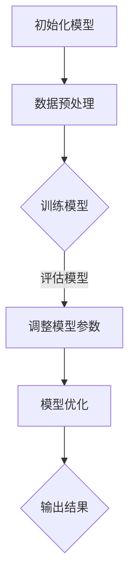

                 


## AI Agent的终身学习与知识累积机制

### 关键词：AI Agent、终身学习、知识累积、学习机制、知识表示、系统架构、Python代码

### 摘要：

本文将深入探讨AI代理的终身学习与知识累积机制。随着AI技术的飞速发展，AI代理在面对不断变化的环境和问题时，如何通过终身学习和知识累积来提升自身的智能水平成为了一个重要课题。本文将从核心概念、终身学习原理、知识累积机制、项目实战等多个方面进行详细阐述，旨在为读者提供全面、系统的理解。

### 第一部分：引言

#### 第1章：背景与概述

##### 1.1 问题背景

随着人工智能技术的不断发展，AI代理在各个领域中的应用越来越广泛。然而，面对复杂多变的环境和问题，传统的单一模型已经难以满足需求。如何使AI代理具备终身学习的能力，持续积累和更新知识，成为了一个亟待解决的问题。

##### 1.2 问题描述

本文主要探讨以下问题：

1. AI代理如何进行终身学习？
2. 知识累积机制的设计与实现？
3. 如何评估AI代理的学习效果？

##### 1.3 问题解决

本文将从以下几个方面进行问题解决：

1. 阐述AI代理终身学习的核心概念与原理。
2. 分析知识累积机制的设计与实现方法。
3. 通过实际案例，展示AI代理的终身学习与知识累积过程。

##### 1.4 边界与外延

本文的研究边界主要涉及AI代理的终身学习与知识累积，不涉及其他相关领域。同时，本文也将讨论一些相关概念的外延，以帮助读者更好地理解。

##### 1.5 概念结构与核心要素组成

本文的核心概念包括AI代理、终身学习、知识累积、学习机制、知识表示等。核心要素主要包括学习模型、算法原理、知识表示方法、系统架构等。

### 第二部分：终身学习原理

#### 第2章：核心概念与联系

##### 2.1 核心概念原理

在本章中，我们将介绍AI代理终身学习的核心概念，包括学习机制、学习模型、动机与驱动因素等。

##### 2.2 概念属性特征对比表格

以下是AI代理终身学习相关概念的属性特征对比表格：

| 概念名称 | 定义 | 主要特征 | 相关关系 |
| :------: | :---: | :------: | :------: |
| 学习机制 | AI代理进行学习的方法与过程 | 自适应、持续、动态调整 | 学习模型、学习算法 |
| 学习模型 | 描述AI代理学习过程的结构与规则 | 神经网络、强化学习、深度学习 | 学习机制、学习算法 |
| 动机与驱动因素 | 推动AI代理学习的内在动力与外在压力 | 学习需求、环境变化、奖励机制 | 学习机制、学习算法 |

##### 2.3 ER实体关系图架构

以下是AI代理终身学习的ER实体关系图：

```mermaid
erDiagram
    LearningAgent ||--|{ LearningModel }
    LearningAgent ||--|{ LearningAlgorithm }
    LearningModel ||--|{ NeuralNetwork }
    LearningModel ||--|{ ReinforcementLearning }
    LearningModel ||--|{ DeepLearning }
```

### 第三部分：知识累积机制

#### 第3章：AI代理的终身学习

##### 3.1 学习机制的介绍

在本章中，我们将介绍AI代理终身学习的机制，包括学习模型的选择、动机与驱动因素等。

##### 3.2 学习模型的选择

AI代理终身学习模型的选择取决于多种因素，如任务类型、环境复杂性等。常见的学习模型包括神经网络、强化学习、深度学习等。

##### 3.3 动机与驱动因素

AI代理进行终身学习的动机与驱动因素主要包括学习需求、环境变化、奖励机制等。

##### 3.4 学习算法原理与mermaid流程图

在本章中，我们将介绍AI代理终身学习的学习算法原理，并使用mermaid绘制流程图进行说明。



### 第四部分：项目实战

#### 第9章：环境安装与系统核心实现

##### 9.1 环境安装

在本章中，我们将介绍如何搭建AI代理终身学习与知识累积的环境，包括所需软件、硬件和配置。

##### 9.2 系统核心实现

在本章中，我们将介绍AI代理终身学习与知识累积系统的核心实现，包括学习模型、知识表示、系统架构等。

##### 9.3 代码应用解读与分析

在本章中，我们将对系统核心实现的代码进行解读与分析，帮助读者更好地理解系统的工作原理。

### 第10章：实际案例分析与详细讲解剖析

##### 10.1 案例选择

在本章中，我们将选择一个实际案例进行深入分析，以展示AI代理终身学习与知识累积的过程。

##### 10.2 案例分析

在本章中，我们将对案例进行分析，探讨AI代理在终身学习与知识累积方面的表现。

##### 10.3 剖析与讲解

在本章中，我们将对案例进行剖析与讲解，帮助读者深入理解AI代理终身学习与知识累积的原理。

##### 10.4 项目小结

在本章中，我们将总结项目的主要成果，并对AI代理终身学习与知识累积的实践进行反思。

### 第五部分：最佳实践与拓展阅读

#### 第11章：最佳实践与拓展阅读

##### 11.1 最佳实践 Tips

在本章中，我们将分享一些AI代理终身学习与知识累积的最佳实践，以帮助读者更好地应用这些技术。

##### 11.2 注意事项

在本章中，我们将列出一些在使用AI代理终身学习与知识累积时需要注意的事项。

##### 11.3 拓展阅读推荐

在本章中，我们将推荐一些相关的拓展阅读资料，以帮助读者进一步深入了解AI代理终身学习与知识累积的相关知识。

以上是文章的整体结构，接下来我们将逐一完善每个章节的内容。在撰写过程中，我们将保持逻辑清晰、结构紧凑、简单易懂的原则，确保文章具有较高的可读性和实用性。同时，我们将使用markdown格式和mermaid流程图等工具，使文章更加直观和易于理解。让我们开始一步步分析推理思考，撰写一篇高质量的技术博客文章吧！

