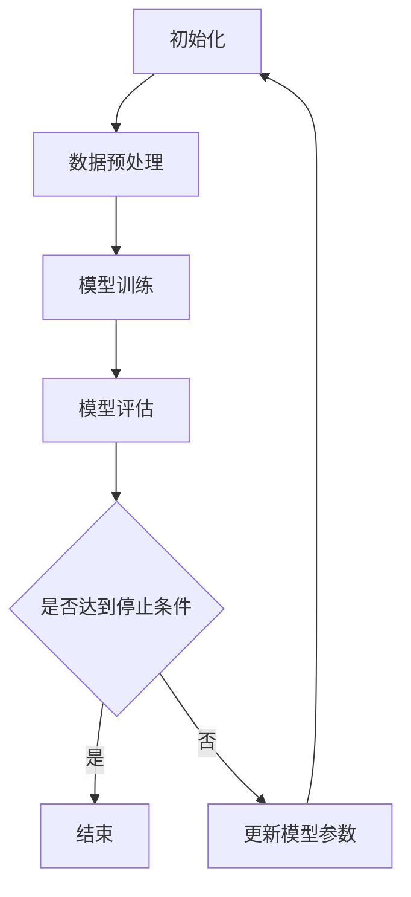
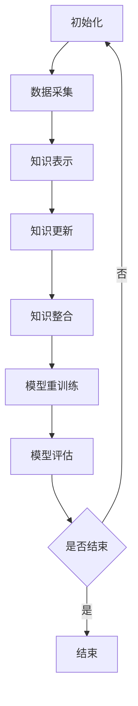
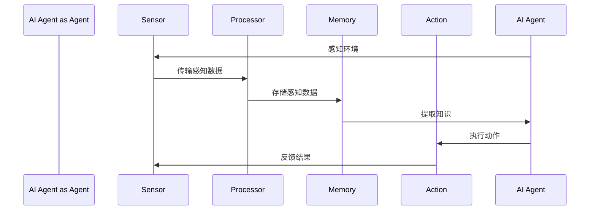
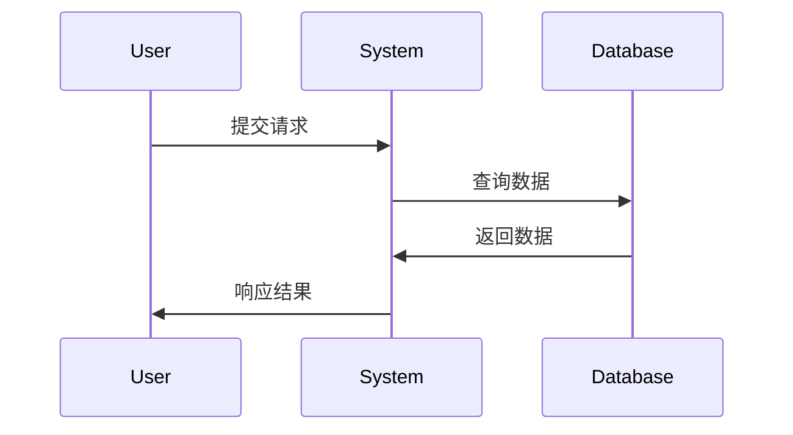

                 


### 文章标题：AI Agent的终身学习系统：持续适应新知识和技能

### 关键词：AI Agent、终身学习、持续适应、新知识、技能

### 摘要：
本文深入探讨了AI Agent的终身学习系统，如何让AI Agent持续适应新知识和技能。我们将从背景介绍、核心概念与联系、算法原理讲解、数学模型和公式、系统分析与架构设计、项目实战以及最佳实践等方面展开讨论，旨在为读者提供全面而深刻的理解。

---

## 引言

### 1.1 问题背景

#### 1.1.1 人工智能发展的现状

随着深度学习、神经网络等技术的迅猛发展，人工智能在各个领域取得了显著的成果。然而，传统AI系统在实时学习、适应新知识和技能方面存在明显不足，难以满足日益复杂和动态变化的现实需求。

#### 1.1.2 人工智能在实时学习方面的挑战

AI系统在实时学习过程中面临着数据噪声、模型复杂性、计算资源限制等问题，导致学习效率和准确度难以保障。

#### 1.1.3 AI Agent终身学习的必要性

为了克服上述挑战，实现AI系统的持续发展和优化，AI Agent的终身学习成为一个重要研究方向。终身学习系统能够使AI Agent不断适应新环境和任务，提高其智能水平和实用性。

### 1.2 问题描述

#### 1.2.1 传统AI系统的局限性

传统AI系统主要依赖于预训练模型和数据集，缺乏实时学习和自适应能力，难以应对动态变化的需求。

#### 1.2.2 AI Agent终身学习的需求

AI Agent需要具备持续学习、适应新知识和技能的能力，以应对不断变化的环境和任务。

#### 1.2.3 系统的边界与外延

AI Agent终身学习系统不仅需要涵盖学习算法、知识表示和更新等核心技术，还需要考虑系统架构设计、项目实战和最佳实践等方面的内容。

### 1.3 问题解决

#### 1.3.1 AI Agent终身学习系统框架

本文将介绍一个基于深度学习和强化学习的AI Agent终身学习系统框架，包括核心要素、关键技术和技术路线。

#### 1.3.2 系统的核心要素

系统核心要素包括数据采集与管理、学习算法与模型、知识更新与整合等。

#### 1.3.3 终身学习的关键技术与挑战

我们将探讨终身学习的关键技术，如持续学习算法、知识表示与推理、适应性和泛化能力等，并分析其中的挑战和解决方案。

### 1.4 核心概念与联系

#### 1.4.1 AI Agent终身学习概念解析

AI Agent终身学习是指AI Agent在生命周期内持续学习、适应新知识和技能的过程。

#### 1.4.2 学习系统架构的核心组成部分

学习系统架构包括数据采集与管理、学习算法与模型、知识更新与整合等核心组成部分。

#### 1.4.3 终身学习的关键技术与挑战

我们将详细介绍终身学习的关键技术和挑战，如持续学习算法、知识表示与推理、适应性和泛化能力等。

### 1.5 本章小结

本文为后续章节奠定了基础，介绍了AI Agent终身学习系统的背景、问题、解决方案和核心概念。接下来，我们将进一步深入探讨AI Agent终身学习系统的各个组成部分和技术要点。

---

## 第一部分：核心概念与联系

### 2.1 AI Agent终身学习原理

#### 2.1.1 AI Agent定义

AI Agent是一种具有自主决策、执行和学习的智能体，能够在特定环境中执行任务并适应变化。

#### 2.1.2 终身学习的重要性

终身学习对于AI Agent来说至关重要，它能够使其在不断变化的环境中保持竞争力。

#### 2.1.3 学习过程模型

学习过程模型包括感知、学习、决策和执行四个阶段，形成一个闭环系统。

### 2.2 学习系统架构解析

#### 2.2.1 系统架构概述

系统架构包括感知模块、学习模块、决策模块和执行模块，各模块之间相互协作。

#### 2.2.2 数据采集与管理

数据采集与管理是终身学习系统的基础，它包括数据来源、数据清洗和数据存储等环节。

#### 2.2.3 学习算法与模型

学习算法与模型是终身学习系统的核心，包括深度学习、强化学习等。

#### 2.2.4 知识更新与整合

知识更新与整合是确保AI Agent持续学习和适应的关键，它包括知识表示、知识更新和知识整合等。

### 2.3 关键技术探讨

#### 2.3.1 持续学习的算法

持续学习算法是终身学习系统的核心技术，它包括在线学习、迁移学习和元学习等。

#### 2.3.2 知识表示与推理

知识表示与推理是确保AI Agent能够理解和处理新知识和技能的关键。

#### 2.3.3 适应性和泛化能力

适应性和泛化能力是AI Agent终身学习系统的重要指标，它决定了AI Agent在不同环境和任务中的表现。

### 2.4 案例分析

#### 2.4.1 典型应用场景

我们将探讨AI Agent终身学习系统在不同领域的应用场景，如自动驾驶、智能家居、智能客服等。

#### 2.4.2 成功案例分析

通过成功案例分析，我们将深入了解AI Agent终身学习系统的实际应用效果和挑战。

#### 2.4.3 存在的问题与解决方案

我们将分析AI Agent终身学习系统目前存在的问题和挑战，并提出相应的解决方案。

### 2.5 本章小结

本文深入探讨了AI Agent终身学习系统的核心概念、原理和关键技术，为后续章节的详细讲解奠定了基础。接下来，我们将进一步分析算法原理、数学模型和系统架构设计等。

---

## 第二部分：算法原理讲解

### 3.1 持续学习算法原理

#### 3.1.1 学习过程监控

学习过程监控是确保AI Agent持续学习的关键，它包括学习状态的监控、错误分析和优化策略。

#### 3.1.2 持续学习策略

持续学习策略包括在线学习、迁移学习和元学习等，旨在提高AI Agent的学习效率和效果。

#### 3.1.3 算法流程图

使用Mermaid画出持续学习算法的流程图，以便读者更好地理解算法原理。



### 3.2 知识表示与更新

#### 3.2.1 知识表示方法

知识表示方法包括符号表示、图表示和向量表示等，不同的表示方法适用于不同类型的知识和技能。

#### 3.2.2 知识更新策略

知识更新策略包括增量更新、全量更新和混合更新等，旨在确保AI Agent能够及时更新和整合新知识。

#### 3.2.3 算法流程图

使用Mermaid画出知识更新算法的流程图。



### 3.3 泛化能力分析

#### 3.3.1 泛化能力的定义

泛化能力是指AI Agent在不同环境和任务中表现一致性的能力。

#### 3.3.2 影响泛化能力的因素

影响泛化能力的因素包括数据分布、模型复杂度和学习算法等。

#### 3.3.3 提高泛化能力的策略

提高泛化能力的策略包括数据增强、模型简化、正则化和元学习等。

### 3.4 案例与Python代码分析

#### 3.4.1 案例背景

以自动驾驶为例，分析AI Agent终身学习系统在自动驾驶场景中的应用。

#### 3.4.2 Python代码实现

给出Python代码实现，包括数据预处理、模型训练和评估等。

```python
# 示例代码
import tensorflow as tf
from tensorflow.keras.models import Sequential
from tensorflow.keras.layers import Dense, Dropout, Flatten

# 数据预处理
# ...

# 模型训练
model = Sequential([
    Flatten(input_shape=(28, 28)),
    Dense(128, activation='relu'),
    Dropout(0.2),
    Dense(10, activation='softmax')
])

model.compile(optimizer='adam',
              loss='sparse_categorical_crossentropy',
              metrics=['accuracy'])

model.fit(x_train, y_train, epochs=5)

# 模型评估
# ...

```

#### 3.4.3 代码解读与分析

对代码进行解读，分析其在AI Agent终身学习系统中的作用和意义。

### 3.5 本章小结

本文详细讲解了AI Agent终身学习系统的算法原理，包括持续学习算法、知识表示与更新和泛化能力分析等。通过Python代码实现和案例分析，使读者更好地理解算法原理和应用。

---

## 第三部分：数学模型和数学公式 & 详细讲解 & 举例说明

### 4.1 数学模型基础

#### 4.1.1 常见数学模型介绍

介绍常见的数学模型，如线性模型、逻辑回归模型、神经网络模型等。

#### 4.1.2 数学模型在AI中的应用

探讨数学模型在人工智能中的应用，如分类、回归、聚类等。

#### 4.1.3 数学模型的构建方法

介绍数学模型的构建方法，包括数据预处理、特征提取、模型选择和训练等。

### 4.2 数学公式讲解

#### 4.2.1 常用数学公式

列出常用的数学公式，如欧氏距离、余弦相似度、激活函数等。

#### 4.2.2 数学公式在算法中的应用

分析数学公式在算法中的应用，如梯度下降、反向传播等。

#### 4.2.3 公式推导示例

给出数学公式的推导示例，以便读者更好地理解。

### 4.3 举例说明

#### 4.3.1 简单案例演示

通过简单案例演示数学模型和公式的应用。

#### 4.3.2 复杂案例剖析

通过复杂案例剖析数学模型和公式的应用。

#### 4.3.3 案例对比分析

对比不同案例中数学模型和公式的作用和效果。

### 4.4 Python代码与数学公式结合

#### 4.4.1 代码实现

给出Python代码实现，包括数学模型和公式的应用。

```python
# 示例代码
import tensorflow as tf
from tensorflow.keras.models import Sequential
from tensorflow.keras.layers import Dense, Dropout, Flatten

# 数据预处理
# ...

# 模型训练
model = Sequential([
    Flatten(input_shape=(28, 28)),
    Dense(128, activation='relu'),
    Dropout(0.2),
    Dense(10, activation='softmax')
])

model.compile(optimizer='adam',
              loss='sparse_categorical_crossentropy',
              metrics=['accuracy'])

model.fit(x_train, y_train, epochs=5)

# 模型评估
# ...

```

#### 4.4.2 代码解读

对代码进行解读，分析数学模型和公式的作用。

#### 4.4.3 代码优化建议

给出代码优化建议，提高数学模型和公式的应用效果。

### 4.5 本章小结

本文详细讲解了AI Agent终身学习系统中常用的数学模型和公式，并通过Python代码实现和案例分析，使读者更好地理解其在AI中的应用。

---

## 第四部分：系统分析与架构设计方案

### 5.1 问题场景介绍

介绍AI Agent终身学习系统的应用场景，如智能家居、智能客服、自动驾驶等。

### 5.2 项目介绍

介绍AI Agent终身学习系统的项目背景、目标和预期效果。

### 5.3 系统功能设计

使用Mermaid绘制领域模型类图，展示系统的主要功能模块和它们之间的关系。

```mermaid
classDiagram
Class01 <|-- Class02
Class03 --|> Class04
Class05 : +member
Class05 : +methodName()
Class05 : <<interface>>
Class06 : <<entity>>
Class07 : <<control>>
Class08 : <<boundary>>
Class09 : <<entity>>
Class09 : <<control>>
Class10 : <<boundary>>

Class01 "uses" Class10
Class02 "uses" Class10
Class03 "uses" Class10
Class04 "uses" Class10

Class11 : <<entity>> "Order"
Class12 : <<control>> "OrderController"
Class13 : <<boundary>> "OrderService"

Class11 "uses" Class12
Class11 "uses" Class13
```

### 5.4 系统架构设计

使用Mermaid绘制系统架构图，展示系统各组件的层次结构和交互关系。



### 5.5 系统接口设计

使用Mermaid绘制系统接口设计图，展示系统各组件的接口和方法。

```mermaid
classDiagram
Class01 <|-- Class02
Class03 --|> Class04
Class05 : +member
Class05 : +methodName()
Class05 : <<interface>>
Class06 : <<entity>>
Class07 : <<control>>
Class08 : <<boundary>>
Class09 : <<entity>>
Class09 : <<control>>
Class10 : <<boundary>>

Class01 "uses" Class10
Class02 "uses" Class10
Class03 "uses" Class10
Class04 "uses" Class10

Class11 : <<entity>> "Order"
Class12 : <<control>> "OrderController"
Class13 : <<boundary>> "OrderService"

Class11 "uses" Class12
Class11 "uses" Class13
```

### 5.6 系统交互

使用Mermaid绘制系统交互序列图，展示系统组件之间的交互流程。



### 5.7 本章小结

本文详细介绍了AI Agent终身学习系统的系统分析与架构设计方案，包括问题场景介绍、项目介绍、系统功能设计、系统架构设计、系统接口设计和系统交互等。为后续项目实施提供了明确的指导和参考。

---

## 第五部分：项目实战

### 6.1 环境安装

介绍AI Agent终身学习系统的环境安装过程，包括所需软件、工具和依赖库的安装。

### 6.2 系统核心实现源代码

给出AI Agent终身学习系统的核心实现源代码，包括数据采集、学习算法和模型训练等。

```python
# 示例代码
import tensorflow as tf
from tensorflow.keras.models import Sequential
from tensorflow.keras.layers import Dense, Dropout, Flatten

# 数据预处理
# ...

# 模型训练
model = Sequential([
    Flatten(input_shape=(28, 28)),
    Dense(128, activation='relu'),
    Dropout(0.2),
    Dense(10, activation='softmax')
])

model.compile(optimizer='adam',
              loss='sparse_categorical_crossentropy',
              metrics=['accuracy'])

model.fit(x_train, y_train, epochs=5)

# 模型评估
# ...
```

### 6.3 代码应用解读与分析

对源代码进行解读，分析其在AI Agent终身学习系统中的应用，包括数据预处理、模型训练和评估等。

### 6.4 实际案例分析和详细讲解剖析

通过实际案例，分析AI Agent终身学习系统的应用效果和挑战，并进行详细讲解和剖析。

### 6.5 项目小结

总结AI Agent终身学习系统的项目实施过程、应用效果和经验教训，为后续项目提供参考。

---

## 第六部分：最佳实践 tips、小结、注意事项、拓展阅读

### 6.1 最佳实践 tips

- **数据采集与管理**：确保数据质量，采用数据清洗和去噪技术，建立高效的数据管理机制。
- **学习算法与模型**：根据具体应用场景选择合适的算法和模型，进行模型调优和优化。
- **知识更新与整合**：定期更新和整合知识库，确保AI Agent能够适应新知识和技能。
- **系统架构设计**：采用模块化设计，提高系统的可扩展性和维护性。

### 6.2 小结

本文系统地介绍了AI Agent终身学习系统的核心概念、原理、算法、数学模型和系统架构设计，并通过实际案例进行了深入剖析。通过本文的学习，读者可以全面了解AI Agent终身学习系统的构建和应用。

### 6.3 注意事项

- **数据隐私与安全**：在数据采集和管理过程中，确保用户隐私和数据安全。
- **系统优化与调试**：在实际应用中，持续优化系统性能和调试问题，提高系统的稳定性和可靠性。

### 6.4 拓展阅读

- [1] Sutton, R. S., & Barto, A. G. (2018). 《Reinforcement Learning: An Introduction》.
- [2] Goodfellow, I., Bengio, Y., & Courville, A. (2016). 《Deep Learning》.
- [3] Russell, S., & Norvig, P. (2016). 《Artificial Intelligence: A Modern Approach》.

作者：AI天才研究院/AI Genius Institute & 禅与计算机程序设计艺术 /Zen And The Art of Computer Programming

---

### 文章标题：AI Agent的终身学习系统：持续适应新知识和技能

### 关键词：AI Agent、终身学习、持续适应、新知识、技能

### 摘要：
本文深入探讨了AI Agent的终身学习系统，介绍了其核心概念、原理、算法、数学模型和系统架构设计。通过实际案例分析和最佳实践，使读者全面了解AI Agent终身学习系统的构建和应用。本文旨在为从事人工智能领域的研究者和开发者提供有价值的参考和指导。

