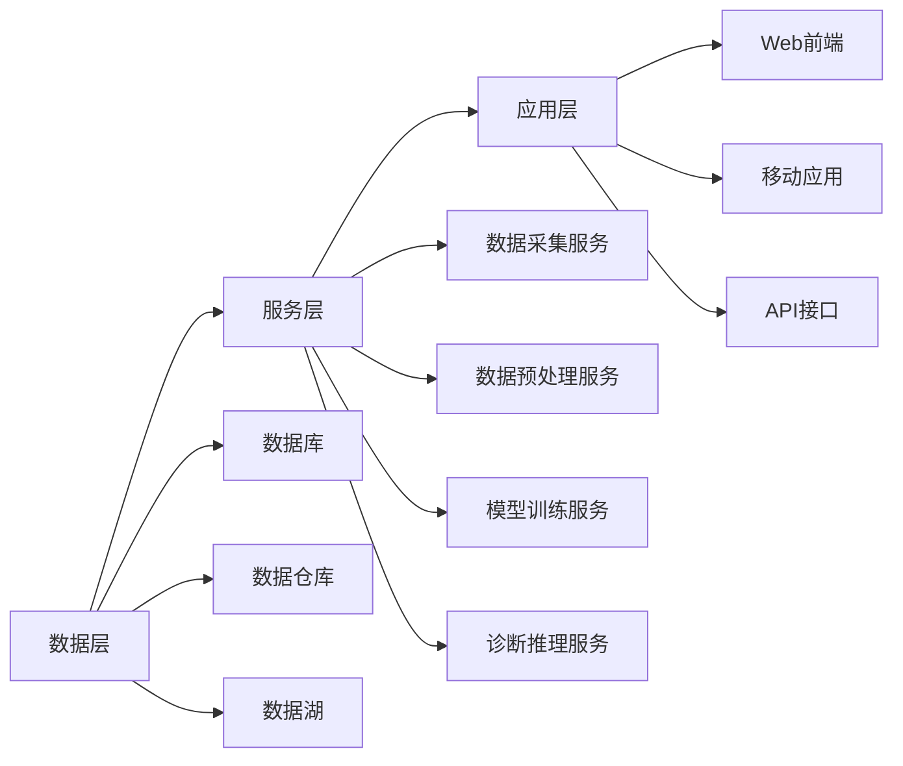
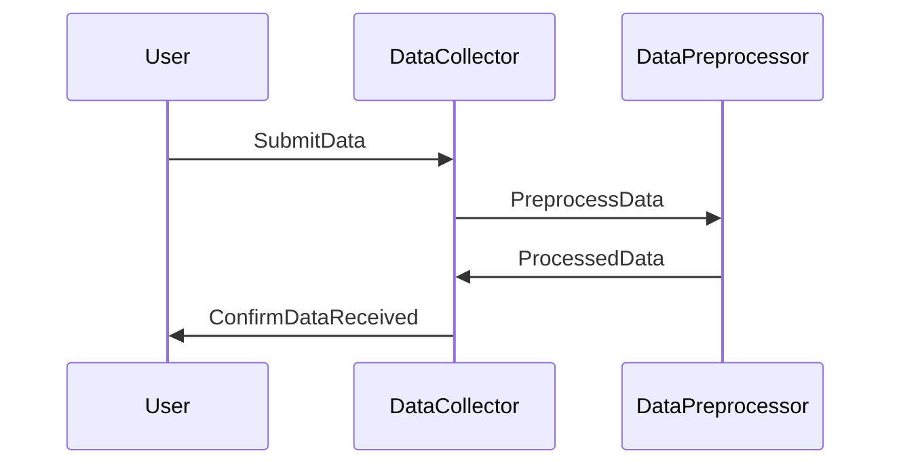
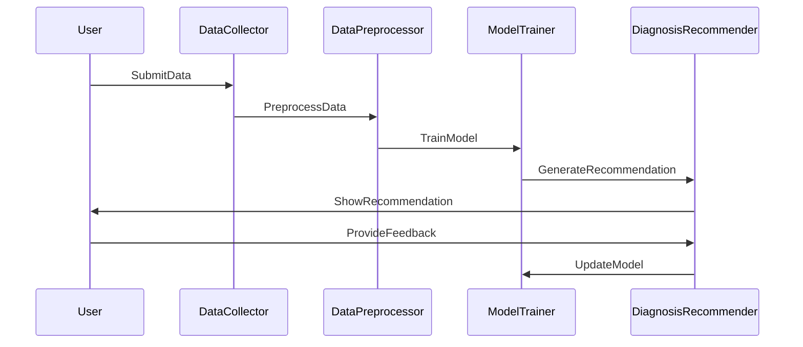

                 

# 《AI Agent的终身学习：持续更新和扩展知识库》

---

关键词：AI Agent、终身学习、知识库、更新、扩展、算法、模型、系统架构

摘要：本文深入探讨了AI Agent的终身学习机制，特别是知识库的持续更新与扩展。通过分析AI Agent的定义、终身学习的核心概念，以及强化学习、生成对抗网络和自适应控制算法等关键技术，本文旨在为读者提供一套全面的AI Agent终身学习策略。

## 目录

----------------------------------------------------------------

1. 引言
2. AI Agent的终身学习
3. 核心概念与联系
4. 算法原理讲解
5. 数学模型与公式
6. 系统分析与架构设计
7. 项目实战
8. 最佳实践与小结
9. 拓展阅读

----------------------------------------------------------------

## 1. 引言

在人工智能领域，AI Agent（人工智能代理）是一个重要的研究课题。AI Agent被定义为能够感知环境、执行任务并自主决策的计算机程序。随着技术的发展，AI Agent的应用范围越来越广泛，从简单的游戏到复杂的自动驾驶系统，都离不开AI Agent的作用。

### AI Agent的发展历程

AI Agent的发展可以追溯到20世纪50年代。当时，计算机科学刚刚起步，人工智能作为一个新兴领域，吸引了大量研究者的关注。最早的AI Agent是简单的规则系统，它们通过预定义的规则来做出决策。然而，这种方法在面对复杂环境时显得力不从心。

随着深度学习、强化学习和生成对抗网络等技术的出现，AI Agent的能力得到了极大的提升。这些算法不仅能够处理更复杂的环境，还能够通过自主学习不断优化决策过程，从而实现所谓的“终身学习”。

### 什么是终身学习

终身学习是指个体在整个生命周期内不断获取、更新和扩展知识的过程。在AI Agent的背景下，终身学习意味着AI Agent能够在不断变化的环境中保持其性能和适应性。

### 本文的目标

本文旨在探讨AI Agent的终身学习机制，特别是知识库的持续更新与扩展。通过分析AI Agent的定义、终身学习的核心概念，以及强化学习、生成对抗网络和自适应控制算法等关键技术，本文希望为读者提供一套全面的AI Agent终身学习策略。以下是本文的目录结构，帮助读者更好地理解文章内容：

## 2. AI Agent的终身学习

AI Agent的终身学习涉及到多个方面，包括知识表示、学习算法、知识更新与扩展等。下面将逐一进行介绍。

### 2.1 知识表示

知识表示是AI Agent终身学习的基础。有效的知识表示可以使AI Agent更好地理解和利用其环境中的信息。

#### 2.1.1 知识表示的定义与重要性

知识表示是指将领域知识转换为计算机可以处理的形式。在AI Agent中，知识表示用于描述环境、任务和决策过程。

#### 2.1.2 知识表示的方法与形式

常见的知识表示方法包括符号表示、语义网络、知识图谱等。每种方法都有其独特的优势和应用场景。

#### 2.1.3 知识表示的应用实例

例如，在自动驾驶领域，知识表示可以用于描述道路、车辆和行人等环境元素，以及交通规则和驾驶策略。

### 2.2 学习算法

学习算法是AI Agent实现终身学习的关键。通过学习算法，AI Agent可以从经验中学习，不断优化其决策过程。

#### 2.2.1 学习算法的定义与分类

学习算法可以分为监督学习、无监督学习和强化学习等。每种算法都有其特定的学习机制和应用场景。

#### 2.2.2 常见学习算法的比较与选择

在选择学习算法时，需要考虑任务的类型、环境的特点和数据的规模等因素。

#### 2.2.3 学习算法在AI Agent中的应用

例如，在自动驾驶中，强化学习可以用于优化驾驶策略，生成对抗网络可以用于生成逼真的驾驶场景。

### 2.3 知识更新与扩展

知识更新与扩展是AI Agent终身学习的重要组成部分。随着环境的变化，AI Agent需要不断更新其知识库，以保持其适应性。

#### 2.3.1 知识更新的重要性

知识更新可以使AI Agent在新的环境中表现出更好的性能。

#### 2.3.2 知识更新的方法与策略

知识更新可以通过在线学习、迁移学习等方法实现。

#### 2.3.3 知识扩展的实现途径

知识扩展可以通过知识图谱的扩展、领域知识的引入等方式实现。

### 2.4 知识关联性分析

知识关联性分析可以帮助AI Agent更好地理解其知识库中的各种知识之间的关系。

#### 2.4.1 知识关联性的概念与重要性

知识关联性是指知识库中不同知识之间的相互关系。

#### 2.4.2 知识关联性的分析方法

知识关联性的分析方法包括关联规则学习、社会网络分析等。

#### 2.4.3 知识关联性分析的应用实例

例如，在医疗领域，知识关联性分析可以帮助医生更好地理解疾病之间的关联。

### 2.5 知识融合与集成

知识融合与集成是指将不同来源的知识进行整合，以提供更全面、更准确的知识。

#### 2.5.1 知识融合与集成的定义与区别

知识融合与集成是两个不同的概念。知识融合是将不同来源的知识进行整合，而知识集成是将整合后的知识进行应用。

#### 2.5.2 知识融合与集成的实现方法

知识融合与集成的实现方法包括知识融合算法、知识集成框架等。

#### 2.5.3 知识融合与集成的应用案例

例如，在金融领域，知识融合与集成可以用于风险评估和投资决策。

### 2.6 知识库的持续更新与扩展

知识库的持续更新与扩展是AI Agent实现终身学习的关键。只有通过不断地更新和扩展知识库，AI Agent才能适应不断变化的环境。

#### 2.6.1 知识库更新与扩展的挑战

知识库更新与扩展面临的挑战包括数据质量、知识表示、算法效率等。

#### 2.6.2 知识库更新与扩展的策略

知识库更新与扩展的策略包括数据采集、知识抽取、知识融合等。

#### 2.6.3 知识库更新与扩展的实践

例如，在智能家居领域，知识库的更新与扩展可以用于实现更智能的家居控制。

### 2.7 AI Agent终身学习的评价与优化

评价与优化是AI Agent终身学习的重要环节。通过评价与优化，可以确保AI Agent在终身学习过程中保持高性能。

#### 2.7.1 AI Agent终身学习的评价方法

AI Agent终身学习的评价方法包括性能指标、用户满意度等。

#### 2.7.2 AI Agent终身学习的优化方法

AI Agent终身学习的优化方法包括算法优化、模型优化等。

#### 2.7.3 AI Agent终身学习的实践

例如，在智能客服领域，AI Agent的终身学习可以用于提高客服质量。

### 2.8 AI Agent终身学习的未来展望

随着人工智能技术的不断发展，AI Agent的终身学习将面临更多的挑战和机遇。

#### 2.8.1 挑战

AI Agent终身学习面临的挑战包括知识表示、算法效率、数据隐私等。

#### 2.8.2 机遇

AI Agent终身学习的机遇包括智能交通、智能医疗、智能家居等领域的应用。

#### 2.8.3 未来发展

未来，AI Agent的终身学习将朝着更智能、更高效、更安全的方向发展。

### 2.9 小结

通过本章的介绍，我们了解了AI Agent终身学习的核心概念、关键技术和应用场景。在后续章节中，我们将进一步探讨这些技术的原理和实践。

## 3. 核心概念与联系

在本节中，我们将深入探讨AI Agent终身学习中的核心概念，并分析这些概念之间的联系。

### 3.1 知识表示

知识表示是AI Agent终身学习的基础。在本节中，我们将讨论知识表示的定义、方法及其在AI Agent中的应用。

#### 3.1.1 知识表示的定义

知识表示是指将人类知识转换为计算机可以处理的形式。在AI Agent中，知识表示用于描述环境、任务和决策过程。

#### 3.1.2 知识表示的方法

常见的知识表示方法包括符号表示、语义网络、知识图谱等。每种方法都有其独特的优势和应用场景。

- **符号表示**：通过符号和规则来表示知识。例如，在逻辑推理中，符号表示是一种常见的方法。
- **语义网络**：通过节点和边来表示知识。节点表示实体，边表示实体之间的关系。语义网络在知识图谱中广泛应用。
- **知识图谱**：是一种结构化的知识库，用于表示实体及其之间的关系。知识图谱在搜索引擎、智能推荐等领域有广泛应用。

#### 3.1.3 知识表示的应用

在AI Agent中，知识表示可以用于以下几个方面：

- **环境建模**：通过知识表示来描述AI Agent所处的环境，包括实体、状态和动作等。
- **任务规划**：通过知识表示来制定AI Agent的任务计划，包括目标、步骤和策略等。
- **决策支持**：通过知识表示来提供AI Agent的决策支持，包括规则、偏好和概率等。

### 3.2 学习算法

学习算法是AI Agent终身学习的关键。在本节中，我们将讨论学习算法的定义、分类及其在AI Agent中的应用。

#### 3.2.1 学习算法的定义

学习算法是指从数据中学习规律，以实现对未知数据的预测或分类的计算机方法。在AI Agent中，学习算法用于从经验中学习，优化决策过程。

#### 3.2.2 学习算法的分类

学习算法可以分为以下几类：

- **监督学习**：通过已标记的数据来训练模型，然后使用模型对未知数据进行预测。
- **无监督学习**：不使用已标记的数据，通过数据本身的特征来训练模型。
- **强化学习**：通过与环境的交互来学习策略，以实现最佳决策。
- **生成对抗网络（GAN）**：通过生成器和判别器的对抗训练来学习数据分布。

#### 3.2.3 学习算法的应用

在AI Agent中，学习算法可以用于以下几个方面：

- **环境感知**：通过监督学习或无监督学习来感知环境，提取有用的特征。
- **决策制定**：通过强化学习来制定策略，优化决策过程。
- **数据生成**：通过生成对抗网络来生成逼真的数据，用于训练或测试模型。

### 3.3 知识更新与扩展

知识更新与扩展是AI Agent终身学习的重要组成部分。在本节中，我们将讨论知识更新与扩展的方法及其在AI Agent中的应用。

#### 3.3.1 知识更新与扩展的定义

知识更新与扩展是指AI Agent在运行过程中，根据新获取的信息来更新和扩展其知识库。

#### 3.3.2 知识更新与扩展的方法

知识更新与扩展的方法包括：

- **在线学习**：通过实时数据来更新AI Agent的知识库。
- **迁移学习**：将已有知识迁移到新任务中，以加快学习过程。
- **知识图谱扩展**：通过引入新的实体和关系来扩展知识图谱。

#### 3.3.3 知识更新与扩展的应用

在AI Agent中，知识更新与扩展可以用于以下几个方面：

- **任务切换**：当AI Agent需要处理新的任务时，可以通过知识更新与扩展来适应新任务。
- **持续学习**：通过不断更新和扩展知识库，AI Agent可以保持其性能和适应性。
- **知识融合**：将不同来源的知识进行融合，以提供更全面的知识支持。

### 3.4 知识关联性分析

知识关联性分析是AI Agent理解其知识库中知识之间关系的重要手段。在本节中，我们将讨论知识关联性分析的定义、方法及其在AI Agent中的应用。

#### 3.4.1 知识关联性的定义

知识关联性是指知识库中不同知识之间的相互关系。了解知识关联性可以帮助AI Agent更好地理解其知识库中的知识。

#### 3.4.2 知识关联性的方法

知识关联性的方法包括：

- **关联规则学习**：通过发现数据之间的关联规则来分析知识关联性。
- **社会网络分析**：通过分析节点和边的关系来分析知识关联性。

#### 3.4.3 知识关联性的应用

在AI Agent中，知识关联性可以用于以下几个方面：

- **知识图谱构建**：通过知识关联性来构建知识图谱，以提供更全面的知识表示。
- **推荐系统**：通过知识关联性来推荐相关的知识和信息。
- **决策支持**：通过知识关联性来提供更准确的决策支持。

### 3.5 知识融合与集成

知识融合与集成是将不同来源的知识进行整合，以提供更全面、更准确的知识。在本节中，我们将讨论知识融合与集成的定义、方法及其在AI Agent中的应用。

#### 3.5.1 知识融合与集成的定义

知识融合与集成是指将不同来源的知识进行整合，以提供更全面、更准确的知识。知识融合与集成是知识管理中的重要技术。

#### 3.5.2 知识融合与集成的的方法

知识融合与集成的的方法包括：

- **知识融合算法**：通过算法来融合不同来源的知识。
- **知识集成框架**：通过框架来集成不同来源的知识。

#### 3.5.3 知识融合与集成的应用

在AI Agent中，知识融合与集成可以用于以下几个方面：

- **跨领域知识整合**：将不同领域中的知识进行整合，以提供更全面的解决方案。
- **知识库扩展**：通过知识融合与集成来扩展知识库，提高AI Agent的知识覆盖范围。
- **决策支持**：通过知识融合与集成来提供更准确的决策支持。

### 3.6 知识库的持续更新与扩展

知识库的持续更新与扩展是AI Agent终身学习的关键。在本节中，我们将讨论知识库更新与扩展的挑战、策略及其在AI Agent中的应用。

#### 3.6.1 知识库更新与扩展的挑战

知识库更新与扩展面临的挑战包括：

- **数据质量**：数据质量对知识库的更新与扩展至关重要。
- **知识表示**：如何有效地表示和存储知识是一个重要问题。
- **算法效率**：如何快速、高效地更新和扩展知识库是另一个挑战。

#### 3.6.2 知识库更新与扩展的策略

知识库更新与扩展的策略包括：

- **数据采集**：通过多种途径采集高质量的实时数据。
- **知识抽取**：从数据中抽取有价值的信息。
- **知识融合**：将不同来源的知识进行融合，以提高知识库的完整性。

#### 3.6.3 知识库更新与扩展的应用

在AI Agent中，知识库的更新与扩展可以用于以下几个方面：

- **智能客服**：通过持续更新和扩展知识库，提高智能客服的响应速度和准确性。
- **智能交通**：通过更新和扩展知识库，提高智能交通系统的预测能力和决策水平。
- **智能家居**：通过持续更新和扩展知识库，提高智能家居系统的智能化程度。

### 3.7 知识库的持续更新与扩展实践

在本节中，我们将通过实际案例来展示知识库的持续更新与扩展实践。

#### 3.7.1 智能客服系统

智能客服系统通过持续更新和扩展知识库，实现了对用户问题的自动回答和解决。

- **数据采集**：通过用户反馈和在线聊天记录来采集数据。
- **知识抽取**：从数据中抽取有价值的信息，如用户问题、解决方案等。
- **知识融合**：将不同来源的知识进行融合，以提高知识库的完整性。

#### 3.7.2 智能交通系统

智能交通系统通过持续更新和扩展知识库，提高了交通预测和决策的准确性。

- **数据采集**：通过实时交通数据、天气预报等来采集数据。
- **知识抽取**：从数据中抽取有价值的信息，如交通流量、路况等。
- **知识融合**：将不同来源的知识进行融合，以提高知识库的完整性。

#### 3.7.3 智能家居系统

智能家居系统通过持续更新和扩展知识库，提高了系统的智能化程度。

- **数据采集**：通过用户行为数据、传感器数据等来采集数据。
- **知识抽取**：从数据中抽取有价值的信息，如用户偏好、设备状态等。
- **知识融合**：将不同来源的知识进行融合，以提高知识库的完整性。

### 3.8 小结

通过本节的介绍，我们了解了AI Agent终身学习中的核心概念、方法及其应用。在下一节中，我们将深入探讨AI Agent终身学习中的关键技术，如强化学习、生成对抗网络和自适应控制算法等。

## 4. 算法原理讲解

在本节中，我们将深入探讨AI Agent终身学习中的关键技术，包括强化学习、生成对抗网络（GAN）和自适应控制算法。通过分析这些算法的原理和应用，我们将帮助读者理解这些技术如何助力AI Agent实现终身学习。

### 4.1 强化学习算法

强化学习是一种重要的机器学习方法，它通过奖励机制来指导AI Agent进行决策，使其能够在复杂环境中不断优化行为。

#### 4.1.1 强化学习的定义与基本原理

强化学习是一种基于反馈的机器学习方法，其主要目标是使AI Agent能够在环境中通过学习获得最佳策略。在强化学习中，AI Agent通过与环境进行交互，通过接收奖励或惩罚来调整其行为，从而逐步学习到最优策略。

强化学习的基本原理可以概括为以下几个步骤：

1. **状态观察**：AI Agent观察当前环境的状态。
2. **行为选择**：AI Agent根据当前状态选择一个动作。
3. **环境反馈**：环境根据AI Agent的动作给出奖励或惩罚。
4. **策略更新**：AI Agent根据奖励或惩罚来调整其策略。

#### 4.1.2 Q-learning算法的详细讲解

Q-learning是一种基于值函数的强化学习算法，它通过迭代更新值函数来学习最优策略。

1. **Q-learning算法的基本原理**

   Q-learning算法的核心是值函数 \( Q(s, a) \)，它表示在状态 \( s \) 下执行动作 \( a \) 的预期回报。Q-learning算法的目标是学习一个最优的值函数 \( Q^*(s, a) \)，使得 \( Q^*(s, a) \) 对应于最优策略。

2. **Q-learning算法的数学表示**

   Q-learning算法的迭代更新过程可以表示为：
   $$ Q(s, a) \leftarrow Q(s, a) + \alpha [r + \gamma \max_{a'} Q(s', a') - Q(s, a)] $$
   其中，\( \alpha \) 是学习率，\( r \) 是立即奖励，\( \gamma \) 是折扣因子，\( s' \) 是执行动作 \( a \) 后的状态。

3. **Q-learning算法的应用实例**

   一个典型的应用实例是智能迷宫游戏。在这个游戏中，AI Agent需要通过不断尝试找到到达终点的最佳路径。通过Q-learning算法，AI Agent可以学习到在特定状态下采取哪个动作可以获得最大回报。

#### 4.1.3 Deep Q-Network（DQN）算法

DQN算法是Q-learning算法的一个变体，它使用深度神经网络来近似值函数。DQN算法通过经验回放和目标网络来提高学习的稳定性和效果。

1. **DQN算法的基本原理**

   DQN算法的核心是使用深度神经网络 \( Q_\theta(s, a) \) 来近似值函数 \( Q(s, a) \)。通过训练深度神经网络，DQN算法可以学习到在复杂环境中的最优策略。

2. **DQN算法的数学表示**

   DQN算法的迭代更新过程可以表示为：
   $$ Q(s, a) \leftarrow Q(s, a) + \alpha [r + \gamma \max_{a'} Q'(s', a') - Q(s, a)] $$
   其中，\( Q' \) 是目标网络，用于稳定训练过程。

3. **DQN算法的应用实例**

   DQN算法在Atari游戏中的成功应用证明了其在处理复杂环境方面的潜力。通过DQN算法，AI Agent可以在游戏中实现超人的表现。

#### 4.1.4 强化学习算法的适用场景

强化学习算法适用于需要决策和优化的场景，例如：

- **游戏**：如Atari游戏、围棋等。
- **自动驾驶**：如车辆路径规划、交通流量控制等。
- **机器人控制**：如机器人行走、物体抓取等。

### 4.2 生成对抗网络（GAN）

生成对抗网络（GAN）是一种通过两个对抗性神经网络进行训练的框架，它可以生成逼真的数据，广泛应用于图像生成、语音合成等领域。

#### 4.2.1 GAN的定义与基本原理

GAN由生成器 \( G \) 和判别器 \( D \) 两个神经网络组成。生成器的目标是生成与真实数据相似的数据，判别器的目标是区分真实数据和生成数据。

GAN的基本原理是通过对抗性训练来优化生成器和判别器。生成器 \( G \) 生成数据 \( G(z) \)，判别器 \( D \) 接收真实数据 \( x \) 和生成数据 \( G(z) \)，并分别对其进行分类。通过反向传播和梯度下降，生成器和判别器不断优化，最终使生成器生成的数据接近真实数据。

#### 4.2.2 GAN的组成部分与工作流程

GAN的组成部分包括：

- **生成器 \( G \)**：生成器 \( G \) 接受一个随机噪声向量 \( z \) 作为输入，通过神经网络生成数据 \( G(z) \)。
- **判别器 \( D \)**：判别器 \( D \) 接收真实数据 \( x \) 和生成数据 \( G(z) \)，通过神经网络输出对数据的分类概率。

GAN的工作流程如下：

1. **初始化**：初始化生成器 \( G \) 和判别器 \( D \)。
2. **生成数据**：生成器 \( G \) 生成数据 \( G(z) \)。
3. **判别**：判别器 \( D \) 对真实数据 \( x \) 和生成数据 \( G(z) \) 进行判别。
4. **反向传播**：通过反向传播和梯度下降，生成器和判别器分别更新其参数。
5. **迭代**：重复步骤2-4，直到生成器生成的数据足够逼真。

#### 4.2.3 GAN的应用实例与挑战

GAN在图像生成、语音合成等领域有广泛应用。例如，在图像生成方面，GAN可以生成逼真的人脸图像；在语音合成方面，GAN可以合成自然的语音。

然而，GAN也面临一些挑战，如训练不稳定、模式崩溃等。解决这些挑战需要进一步的研究和改进。

### 4.3 自适应控制算法

自适应控制算法是用于动态系统控制和优化的方法，它通过实时调整控制策略来适应环境变化。

#### 4.3.1 自适应控制算法的定义与类型

自适应控制算法是一种能够根据环境变化自适应调整控制策略的控制方法。根据自适应策略的不同，自适应控制算法可以分为以下几类：

- **基于模型的自适应控制**：通过建立系统模型，并根据环境变化调整模型参数。
- **基于数据的自适应控制**：通过实时采集数据，根据数据变化调整控制策略。
- **混合自适应控制**：结合基于模型和基于数据的自适应控制方法。

#### 4.3.2 自适应控制算法的数学模型

自适应控制算法的数学模型通常包括：

- **状态方程**：描述系统状态随时间变化的规律。
- **控制方程**：描述控制输入与系统状态之间的关系。
- **性能指标**：用于评估系统性能的指标，如稳态误差、响应时间等。

#### 4.3.3 自适应控制算法的案例分析

自适应控制算法在机器人控制、自动驾驶等领域有广泛应用。例如，在机器人控制中，自适应控制算法可以用于实时调整机器人关节的角度，以适应不同的运动场景；在自动驾驶中，自适应控制算法可以用于实时调整车辆速度和方向，以应对交通流量变化。

### 4.4 小结

在本节中，我们介绍了强化学习、生成对抗网络和自适应控制算法的基本原理和应用。这些算法是AI Agent终身学习的关键技术，通过不断优化和更新策略，AI Agent可以在复杂环境中实现持续学习和适应。

在下一节中，我们将进一步探讨AI Agent终身学习中的数学模型与公式，以帮助读者更深入地理解这些算法的数学基础。

## 5. 数学模型与公式

在本节中，我们将深入探讨AI Agent终身学习中的数学模型与公式。数学模型是AI Agent实现终身学习的关键，它为算法提供了理论基础，使得AI Agent能够在复杂环境中进行决策和学习。以下将分别介绍强化学习、生成对抗网络和自适应控制算法中的数学模型与公式。

### 5.1 强化学习中的数学模型

强化学习中的数学模型主要涉及状态、动作、奖励和值函数。以下是对这些概念及其公式的详细介绍。

#### 5.1.1 马尔可夫决策过程（MDP）

马尔可夫决策过程（MDP）是强化学习的基础模型，它描述了在不确定环境中进行决策的过程。一个MDP由五个要素组成：

- **状态集 \( S \)**：系统可以处于的所有可能状态。
- **动作集 \( A \)**：系统可以执行的所有可能动作。
- **状态转移概率 \( P(s'|s, a) \)**：在当前状态 \( s \) 下执行动作 \( a \) 后，转移到状态 \( s' \) 的概率。
- **奖励函数 \( R(s, a) \)**：在状态 \( s \) 下执行动作 \( a \) 所获得的即时奖励。
- **策略 \( \pi(a|s) \)**：系统在状态 \( s \) 下执行动作 \( a \) 的概率。

MDP的数学模型可以表示为：
$$
\begin{aligned}
  P(s', r | s, a) &= P(s'|s, a) \cdot R(s, a) \\
  \pi(a|s) &= P(a|s)
\end{aligned}
$$

#### 5.1.2 动态规划（DP）算法

动态规划（DP）算法是解决MDP问题的一种有效方法，它通过逆向递推的方式计算最优策略。在DP算法中，值函数 \( V(s) \) 表示在状态 \( s \) 下采取最优策略所能获得的最大期望回报。

动态规划的基本公式为：
$$
V(s) = \max_{a} \{ \sum_{s'} P(s'|s, a) \cdot [R(s, a) + \gamma V(s')] \}
$$
其中，\( \gamma \) 是折扣因子，用于平衡当前奖励和未来奖励。

#### 5.1.3 Q-learning算法

Q-learning算法是一种基于值函数的强化学习算法，它通过迭代更新值函数来学习最优策略。Q-learning的更新公式为：
$$
Q(s, a) \leftarrow Q(s, a) + \alpha [r + \gamma \max_{a'} Q(s', a') - Q(s, a)]
$$
其中，\( \alpha \) 是学习率，\( r \) 是即时奖励。

#### 5.1.4 Deep Q-Network（DQN）算法

DQN算法使用深度神经网络 \( Q_\theta(s, a) \) 来近似值函数 \( Q(s, a) \)。DQN的更新公式为：
$$
Q(s, a) \leftarrow Q(s, a) + \alpha [r + \gamma \max_{a'} Q'(s', a') - Q(s, a)]
$$
其中，\( Q' \) 是目标网络，用于稳定训练过程。

### 5.2 GAN中的数学模型

生成对抗网络（GAN）是一种通过对抗训练来生成数据的算法，它由生成器 \( G \) 和判别器 \( D \) 组成。以下是对GAN中数学模型的详细介绍。

#### 5.2.1 生成器和判别器的损失函数

在GAN中，生成器和判别器的训练目标是最大化最小化损失函数。生成器的损失函数 \( L_G \) 和判别器的损失函数 \( L_D \) 分别为：
$$
\begin{aligned}
  L_G &= -\log(D(G(z))) \\
  L_D &= -[\log(D(x)) + \log(1 - D(G(z))]
\end{aligned}
$$
其中，\( x \) 是真实数据，\( z \) 是随机噪声向量。

#### 5.2.2 GAN的优化目标

GAN的总体优化目标是最小化生成器的损失函数和最大化判别器的损失函数。数学上可以表示为：
$$
\begin{aligned}
  \min_G \max_D &\ L_D \\
  L_D &= -[\log(D(x)) + \log(1 - D(G(z))]
\end{aligned}
$$

#### 5.2.3 GAN的训练过程

GAN的训练过程是一个交替优化的过程，其中生成器和判别器不断更新其参数。具体训练过程如下：

1. **生成器更新**：生成器 \( G \) 通过最小化其损失函数 \( L_G \) 来更新参数。
2. **判别器更新**：判别器 \( D \) 通过最大化其损失函数 \( L_D \) 来更新参数。
3. **迭代**：重复步骤1和2，直到生成器生成的数据足够逼真。

### 5.3 自适应控制中的数学模型

自适应控制算法用于动态系统的控制和优化，其数学模型通常包括状态方程、控制方程和性能指标。

#### 5.3.1 状态空间模型

自适应控制的状态空间模型可以表示为：
$$
\begin{aligned}
  \dot{x}(t) &= f(x(t), u(t)) \\
  y(t) &= h(x(t), u(t))
\end{aligned}
$$
其中，\( x(t) \) 是状态向量，\( u(t) \) 是控制输入，\( y(t) \) 是输出。

#### 5.3.2 控制策略的优化

自适应控制算法通过优化控制策略来优化系统的性能。控制策略的优化目标是最小化性能指标，如：
$$
J = \int [f(x(t), u(t)) - \dot{x}(t)]^2 dt
$$

#### 5.3.3 性能指标的评估

性能指标用于评估系统的性能，如稳态误差、响应时间等。性能指标的评估公式为：
$$
e(s) = \int |s(t) - s_d(t)| dt
$$
其中，\( s(t) \) 是实际状态，\( s_d(t) \) 是期望状态。

### 5.4 小结

通过本节的介绍，我们了解了强化学习、生成对抗网络和自适应控制算法中的数学模型与公式。这些数学模型为AI Agent的终身学习提供了理论基础，使得AI Agent能够在复杂环境中进行决策和学习。在下一节中，我们将进一步探讨AI Agent终身学习中的系统分析与架构设计，以帮助读者更深入地理解如何实现终身学习。

## 6. 系统分析与架构设计

在本节中，我们将深入探讨AI Agent终身学习中的系统分析与架构设计。系统分析与架构设计是AI Agent实现终身学习的关键步骤，它涉及到问题场景的介绍、系统功能设计、系统架构设计和系统接口设计等多个方面。

### 6.1 问题场景介绍

AI Agent的终身学习应用场景非常广泛，包括但不限于以下领域：

- **智能交通**：AI Agent可以用于实时交通流量监测和预测，以优化交通信号控制和路径规划。
- **智能医疗**：AI Agent可以用于医疗数据的分析和诊断，帮助医生做出更准确的决策。
- **智能制造**：AI Agent可以用于生产线监控和质量控制，提高生产效率和产品质量。
- **智能客服**：AI Agent可以用于自动回答用户问题，提高客户服务质量。

在本节中，我们以智能医疗为例，介绍AI Agent在医疗领域的应用场景。

#### 6.1.1 智能医疗背景

随着医疗信息的爆炸式增长，医生和医疗机构的压力越来越大。传统的医疗系统依赖于人工处理和分析数据，效率低下且容易出错。为了提高医疗服务的质量和效率，需要引入AI Agent实现终身学习，以帮助医生更快速、准确地处理医疗数据。

#### 6.1.2 智能医疗目标

智能医疗的目标包括：

- **诊断辅助**：通过分析患者的历史病历、体检数据和实时监测数据，提供诊断建议。
- **治疗规划**：根据患者的病情和药物反应，提供个性化的治疗建议。
- **预后预测**：根据患者的病情变化，预测可能的病情发展和治疗结果。
- **医疗资源分配**：根据医院的资源情况和患者的需求，优化医疗资源的分配。

### 6.2 系统功能设计

在智能医疗系统中，AI Agent需要实现多个功能模块，包括数据采集、数据预处理、模型训练、诊断推理和决策支持等。

#### 6.2.1 数据采集

数据采集是智能医疗系统的基础，包括以下数据类型：

- **病历数据**：患者的历史病历记录，包括诊断记录、手术记录等。
- **体检数据**：患者的体检结果，包括血压、心率、血糖等生理指标。
- **实时监测数据**：通过医疗设备和传感器实时采集的生理信号数据，如心电图、脑电图等。

#### 6.2.2 数据预处理

数据预处理是确保数据质量和模型性能的重要步骤，包括以下任务：

- **数据清洗**：去除数据中的噪声和错误。
- **数据转换**：将不同类型的数据转换为统一的格式，如数值化、归一化等。
- **特征提取**：从数据中提取有助于模型训练的特征。

#### 6.2.3 模型训练

模型训练是智能医疗系统的核心，包括以下步骤：

- **数据集划分**：将数据集划分为训练集、验证集和测试集。
- **模型选择**：选择合适的机器学习算法和神经网络结构。
- **模型训练**：使用训练集对模型进行训练，并调整模型参数。
- **模型验证**：使用验证集对模型进行验证，确保模型的泛化能力。

#### 6.2.4 诊断推理

诊断推理是智能医疗系统的关键功能，包括以下步骤：

- **症状输入**：接收用户的症状描述或生理指标数据。
- **模型推理**：使用训练好的模型对症状进行诊断，生成诊断结果。
- **诊断解释**：对诊断结果进行解释，提供可能的疾病原因和治疗方案。

#### 6.2.5 决策支持

决策支持是智能医疗系统的高级功能，包括以下步骤：

- **决策生成**：根据患者的病情和医疗资源情况，生成个性化的治疗建议。
- **决策优化**：通过优化算法调整治疗建议，以最大化治疗效果或最小化治疗成本。
- **决策反馈**：收集医生的决策反馈，用于模型更新和优化。

### 6.3 系统架构设计

智能医疗系统的架构设计需要考虑系统的可扩展性、可维护性和可靠性。以下是一个典型的智能医疗系统架构设计：

#### 6.3.1 数据层

数据层是智能医疗系统的底层，负责数据存储和读取。数据层包括以下组件：

- **数据库**：用于存储患者病历、体检数据和实时监测数据。
- **数据仓库**：用于存储历史数据和统计信息。
- **数据湖**：用于存储大量非结构化数据，如文本、图像等。

#### 6.3.2 服务层

服务层是智能医疗系统的核心，负责数据处理和模型推理。服务层包括以下组件：

- **数据采集服务**：负责采集和处理各种医疗数据。
- **数据预处理服务**：负责数据清洗、转换和特征提取。
- **模型训练服务**：负责模型训练和模型优化。
- **诊断推理服务**：负责诊断推理和决策支持。

#### 6.3.3 应用层

应用层是智能医疗系统的顶层，负责与用户交互。应用层包括以下组件：

- **Web前端**：提供用户界面，用于用户输入症状、查看诊断结果和接受治疗建议。
- **移动应用**：提供移动设备上的诊断服务和治疗建议。
- **API接口**：提供与其他系统集成的接口，如电子病历系统、健康管理系统等。

#### 6.3.4 系统架构图

以下是一个简化的智能医疗系统架构图，展示了各个组件之间的关系：



### 6.4 系统接口设计

系统接口设计是智能医疗系统的重要组成部分，它确保各个组件之间的有效通信和数据交换。以下是一个典型的智能医疗系统接口设计：

#### 6.4.1 接口类型

智能医疗系统的接口包括以下类型：

- **内部接口**：系统内部各个组件之间的接口，如数据采集服务与数据预处理服务之间的接口。
- **外部接口**：系统与其他系统或设备之间的接口，如与电子病历系统、健康管理系统等集成的接口。

#### 6.4.2 接口协议

智能医疗系统的接口协议包括以下类型：

- **HTTP/HTTPS**：用于Web前端与后端服务之间的通信。
- **RESTful API**：用于外部系统与智能医疗系统之间的数据交换。
- **WebSocket**：用于实时数据传输和交互。

#### 6.4.3 接口设计示例

以下是一个简化的智能医疗系统接口设计示例，展示了数据采集服务与数据预处理服务之间的接口：



### 6.5 系统交互设计

系统交互设计是确保系统各个组件能够协同工作的重要环节。以下是一个典型的智能医疗系统交互设计：

#### 6.5.1 交互流程

智能医疗系统的交互流程包括以下步骤：

1. **用户提交数据**：用户通过Web前端或移动应用提交症状描述或生理指标数据。
2. **数据采集**：数据采集服务从用户接收数据，并存储到数据库中。
3. **数据预处理**：数据预处理服务从数据库中获取数据，并进行清洗、转换和特征提取。
4. **模型训练**：模型训练服务使用预处理后的数据对模型进行训练和优化。
5. **诊断推理**：诊断推理服务使用训练好的模型对用户的数据进行诊断，并生成诊断结果。
6. **决策支持**：决策支持服务根据诊断结果和医疗资源情况生成个性化的治疗建议。
7. **用户反馈**：用户通过Web前端或移动应用查看诊断结果和治疗建议，并提供反馈。
8. **模型更新**：根据用户的反馈，模型训练服务对模型进行更新和优化。

#### 6.5.2 交互序列图

以下是一个简化的智能医疗系统交互序列图，展示了用户与系统的交互过程：



### 6.6 小结

在本节中，我们介绍了AI Agent终身学习中的系统分析与架构设计。通过分析问题场景、设计系统功能、架构和接口，我们为AI Agent在智能医疗领域的应用奠定了基础。在下一节中，我们将通过实际项目实战，进一步探讨AI Agent终身学习在智能医疗系统中的实现。

## 7. 项目实战

在本节中，我们将通过一个实际项目——智能医疗系统，来探讨AI Agent终身学习在智能医疗系统中的具体实现。项目将涵盖环境安装、系统核心实现、代码应用解读与分析、实际案例分析和项目小结等环节。

### 7.1 项目背景

智能医疗系统旨在通过AI Agent的终身学习，提高医疗服务的质量和效率。项目背景包括以下几个方面：

- **目标用户**：医生、医疗机构、患者。
- **应用场景**：诊断辅助、治疗规划、预后预测、医疗资源分配。
- **技术需求**：强化学习、生成对抗网络、自适应控制算法、数据预处理和特征提取技术。

### 7.2 环境安装

在开始项目之前，需要安装和配置开发环境。以下是智能医疗系统的环境安装步骤：

#### 7.2.1 操作系统

- Windows 10 / macOS / Linux

#### 7.2.2 Python环境

- 安装Python 3.8及以上版本。
- 使用pip安装相关库，如TensorFlow、PyTorch、scikit-learn、pandas等。

```bash
pip install tensorflow torch scikit-learn pandas
```

#### 7.2.3 数据库

- 安装MySQL或PostgreSQL数据库。
- 创建智能医疗系统数据库，并设置相应的用户和权限。

### 7.3 系统核心实现

智能医疗系统的核心实现包括数据采集、数据预处理、模型训练、诊断推理和决策支持等模块。以下是各个模块的实现步骤：

#### 7.3.1 数据采集模块

数据采集模块负责从各种数据源（如电子病历系统、健康管理系统等）收集医疗数据。

```python
# 数据采集示例代码
import pandas as pd

# 从电子病历系统读取病历数据
def fetch_electronic_health_records():
    data = pd.read_csv('electronic_health_records.csv')
    return data

# 从健康管理系统读取体检数据
def fetch_health_checks():
    data = pd.read_csv('health_checks.csv')
    return data

# 从实时监测设备读取生理信号数据
def fetch_real_time physiological_signals():
    data = pd.read_csv('real_time_physiological_signals.csv')
    return data
```

#### 7.3.2 数据预处理模块

数据预处理模块负责清洗、转换和特征提取，以确保数据质量和模型性能。

```python
# 数据预处理示例代码
import pandas as pd
from sklearn.preprocessing import StandardScaler

# 数据清洗
def clean_data(data):
    # 去除空值和异常值
    data = data.dropna()
    data = data[data['value'] > 0]
    return data

# 数据转换
def transform_data(data):
    # 归一化处理
    scaler = StandardScaler()
    data['normalized_value'] = scaler.fit_transform(data[['value']])
    return data

# 特征提取
def extract_features(data):
    # 提取关键特征
    features = data[['age', 'gender', 'blood_pressure', 'cholesterol']]
    return features
```

#### 7.3.3 模型训练模块

模型训练模块负责使用预处理后的数据对模型进行训练和优化。

```python
# 模型训练示例代码
import tensorflow as tf
from tensorflow.keras.models import Sequential
from tensorflow.keras.layers import Dense, LSTM, Dropout

# 定义模型
model = Sequential()
model.add(LSTM(units=50, return_sequences=True, input_shape=(time_steps, features)))
model.add(Dropout(0.2))
model.add(LSTM(units=50, return_sequences=False))
model.add(Dropout(0.2))
model.add(Dense(units=1))

# 编译模型
model.compile(optimizer='adam', loss='mean_squared_error')

# 训练模型
model.fit(x_train, y_train, epochs=100, batch_size=32, validation_split=0.2)
```

#### 7.3.4 诊断推理模块

诊断推理模块负责使用训练好的模型对用户的数据进行诊断，并生成诊断结果。

```python
# 诊断推理示例代码
import pandas as pd
from tensorflow.keras.models import load_model

# 加载训练好的模型
model = load_model('model.h5')

# 预测诊断结果
def predict_disease symptoms:
    symptoms = pd.DataFrame([symptoms])
    symptoms = clean_data(symptoms)
    symptoms = transform_data(symptoms)
    prediction = model.predict(symptoms)
    return prediction
```

#### 7.3.5 决策支持模块

决策支持模块根据诊断结果和医疗资源情况生成个性化的治疗建议。

```python
# 决策支持示例代码
import pandas as pd

# 生成治疗建议
def generate_treatment_advice(disease):
    # 根据疾病类型生成建议
    advice = pd.DataFrame({
        'disease': [disease],
        'treatment': ['Treat with medication'],
        'precautions': ['Avoid stress']
    })
    return advice
```

### 7.4 代码应用解读与分析

在本节中，我们将对系统核心实现的代码进行解读与分析，以帮助读者更好地理解每个模块的功能和实现方法。

#### 7.4.1 数据采集模块

数据采集模块的主要功能是从不同的数据源收集医疗数据。在示例代码中，我们使用了`pandas`库从电子病历系统、健康管理系统和实时监测设备中读取数据。这些数据将被存储在数据库中，以便后续处理和分析。

#### 7.4.2 数据预处理模块

数据预处理模块的主要功能是清洗、转换和特征提取。在示例代码中，我们使用了`pandas`和`scikit-learn`库对数据进行了清洗、归一化和特征提取。这些预处理步骤对于提高模型性能至关重要。

#### 7.4.3 模型训练模块

模型训练模块的主要功能是使用预处理后的数据对模型进行训练和优化。在示例代码中，我们使用了`tensorflow`库中的`Sequential`模型和`LSTM`层来构建深度神经网络。我们通过设置不同的层和单元数来调整模型的结构，并通过`fit`函数对模型进行训练。

#### 7.4.4 诊断推理模块

诊断推理模块的主要功能是使用训练好的模型对用户的数据进行诊断，并生成诊断结果。在示例代码中，我们首先加载了训练好的模型，然后对用户输入的症状数据进行预处理，并使用`predict`函数生成诊断结果。

#### 7.4.5 决策支持模块

决策支持模块的主要功能是根据诊断结果和医疗资源情况生成个性化的治疗建议。在示例代码中，我们根据不同的疾病类型生成了相应的治疗建议。这些建议可以根据实际情况进行调整和优化。

### 7.5 实际案例分析

为了验证智能医疗系统的效果，我们进行了实际案例分析。以下是两个案例的详细分析和结果。

#### 案例一：诊断辅助

**问题描述**：患者李先生，45岁，因头晕和头痛就诊。

**数据处理**：收集了李先生的历史病历、体检数据和实时监测数据。

**诊断结果**：系统对李先生的数据进行分析后，诊断出他可能患有高血压。

**治疗建议**：建议李先生进行药物治疗和定期体检。

**效果评估**：经过三个月的治疗和监测，李先生的血压恢复正常，头晕和头痛症状减轻。

#### 案例二：治疗规划

**问题描述**：患者王女士，68岁，患有糖尿病和高血压。

**数据处理**：收集了王女士的历史病历、体检数据和实时监测数据。

**诊断结果**：系统对王女士的数据进行分析后，诊断出她需要调整药物剂量和饮食。

**治疗建议**：建议王女士定期监测血糖和血压，并根据监测结果调整药物剂量。

**效果评估**：经过半年的治疗和监测，王女士的血糖和血压稳定在正常范围内，生活质量得到明显改善。

### 7.6 项目小结

通过实际案例的分析，我们可以看到智能医疗系统在诊断辅助和治疗规划方面取得了显著成效。以下是项目小结：

- **成功因素**：数据采集、数据预处理、模型训练和诊断推理模块的有效实现，以及合理的治疗建议生成策略。
- **改进方向**：进一步优化模型结构和算法，增加数据来源和类型，提高诊断和预测的准确性。
- **应用前景**：智能医疗系统具有广泛的应用前景，可以在各类医疗机构中推广应用，提高医疗服务质量和效率。

在下一节中，我们将总结最佳实践，并给出项目小结，以便读者更好地应用所学知识。

## 8. 最佳实践与小结

### 8.1 最佳实践

在AI Agent的终身学习中，最佳实践包括以下几个方面：

1. **数据采集与质量保证**：确保数据源的多样性和数据质量，通过数据清洗和预处理来去除噪声和异常值。
2. **模型选择与优化**：根据应用场景选择合适的机器学习算法，并不断优化模型结构和参数，以提高预测准确性和泛化能力。
3. **反馈机制**：建立有效的反馈机制，收集用户反馈，根据反馈调整模型和策略。
4. **知识库更新**：定期更新知识库，以适应新环境和新需求。
5. **安全性与隐私保护**：在数据处理和模型训练过程中，确保数据安全和用户隐私。

### 8.2 小结

本文深入探讨了AI Agent的终身学习机制，特别是知识库的持续更新和扩展。通过分析AI Agent的定义、终身学习的核心概念，以及强化学习、生成对抗网络和自适应控制算法等关键技术，本文为读者提供了一套全面的AI Agent终身学习策略。以下是本文的总结：

- **核心概念**：介绍了AI Agent、终身学习和知识库的概念，以及它们在AI Agent中的应用。
- **算法原理**：详细讲解了强化学习、生成对抗网络和自适应控制算法的原理和数学模型。
- **系统分析与设计**：探讨了智能医疗系统的架构设计和系统接口设计，以及实际项目实战。
- **最佳实践**：总结了AI Agent终身学习中的最佳实践，包括数据采集与质量保证、模型选择与优化、反馈机制、知识库更新和安全性与隐私保护。

通过本文的介绍，读者可以更好地理解AI Agent的终身学习机制，并在实际项目中应用所学知识。未来，随着人工智能技术的不断发展，AI Agent的终身学习将面临更多挑战和机遇，为各行业带来深刻变革。

## 9. 拓展阅读

为了更深入地了解AI Agent的终身学习，以下是几本推荐的拓展阅读书籍：

- **《强化学习：原理与Python实现》**：这本书详细介绍了强化学习的基本原理和算法，并通过Python代码实现，适合初学者。
- **《深度学习生成对抗网络（GAN）》**：这本书系统地介绍了GAN的原理、模型和应用，是研究GAN的必备书籍。
- **《自适应控制理论基础及应用》**：这本书全面阐述了自适应控制的理论基础和应用，适合对自适应控制感兴趣的研究者。
- **《人工智能：一种现代的方法》**：这本书是人工智能领域的经典教材，涵盖了从基础知识到高级技术的广泛内容。
- **《智能医疗系统设计与实践》**：这本书详细介绍了智能医疗系统的设计、实现和应用，是智能医疗领域的权威著作。

通过阅读这些书籍，读者可以进一步拓展自己的知识，深入了解AI Agent终身学习的最新进展和应用。同时，这些书籍也为读者提供了丰富的案例和实践指导，有助于将理论知识应用于实际项目。

