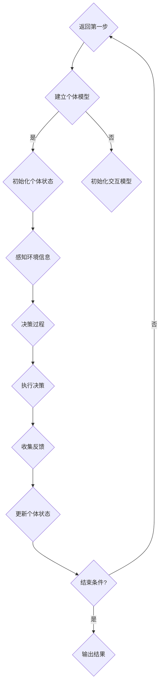
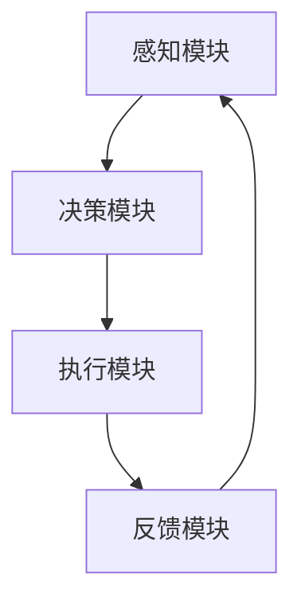
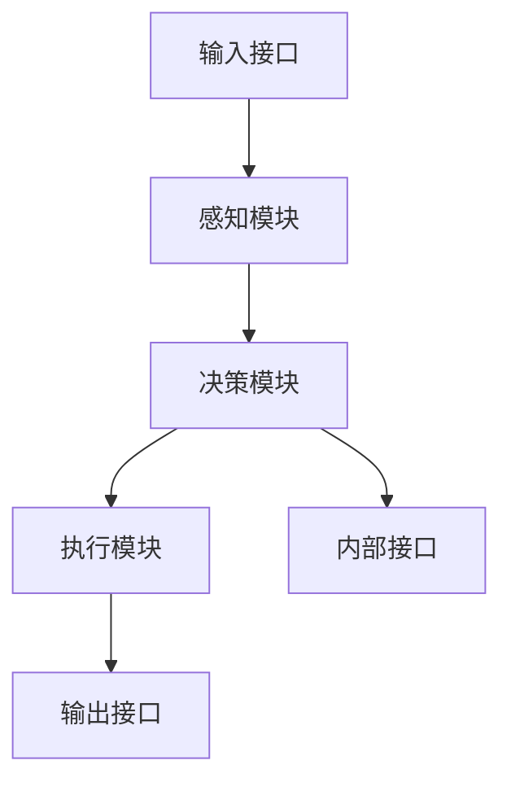
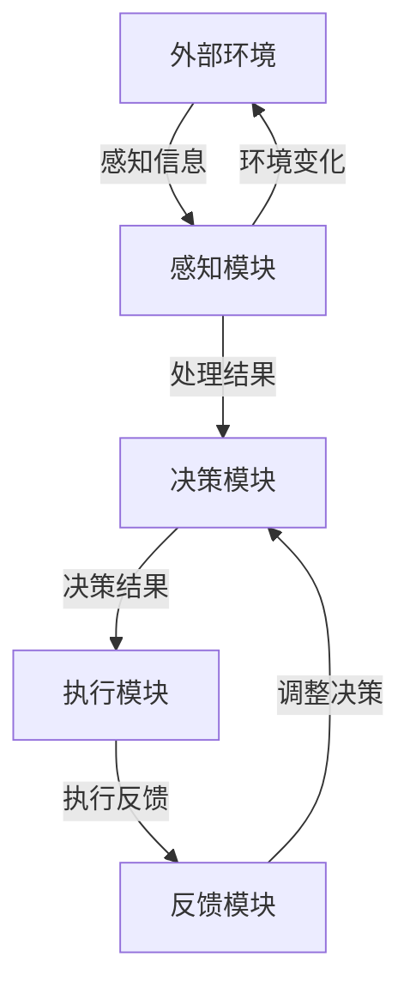

                 

### 引言与背景

#### 1.1.1 AI Agent的定义与作用

AI Agent，即人工智能代理，是指能够自主执行任务、与环境交互、进行决策并适应变化的计算机程序实体。它们是人工智能领域中的重要组成部分，被广泛应用于自动化、增强现实、智能控制、机器人学等多个领域。AI Agent具有以下特点：

1. **自主性**：能够自主进行决策和行动，不受人为干预。
2. **交互性**：能够与环境进行有效的信息交换，获取资源和执行任务。
3. **适应性**：能够根据环境和任务的动态变化调整自身行为。

AI Agent在现实世界中的应用非常广泛。例如，自动驾驶汽车通过AI Agent实现自主导航和安全驾驶；智能客服系统使用AI Agent提供24/7的在线服务；推荐系统中的AI Agent则根据用户行为提供个性化的商品推荐。这些应用不仅提高了效率，还改善了用户体验。

#### 1.1.2 群体智能的概念与发展

群体智能是指由多个个体组成的系统所展现出的智能行为，这些个体之间通过信息交换和协作实现复杂任务。群体智能最早可以追溯到自然界中的群体行为，如鸟群飞行、鱼群游动和昆虫的群体觅食等。近年来，随着计算机技术和人工智能的快速发展，群体智能在模拟、优化、控制等领域得到了广泛研究。

群体智能具有以下特点：

1. **分布式**：信息处理和任务执行分散在多个个体上，降低了系统的集中风险。
2. **自组织**：个体通过局部信息交互和简单规则实现全局的协同行为。
3. **鲁棒性**：系统在面对个体失效或环境变化时依然能够保持稳定运行。

群体智能的研究不仅有助于我们理解自然界中的复杂现象，还为人工智能的设计提供了新的思路。例如，分布式计算和区块链技术中的共识算法都借鉴了群体智能的原理。

#### 1.1.3 涌现机制的探讨

涌现机制是指系统中的个体通过相互作用产生出个体本身所不具备的宏观行为或特征。在人工智能领域，涌现机制尤为重要，因为它能够解释复杂系统的智能行为。例如，神经网络中的深度学习模型，通过大量神经元的相互作用，能够实现从简单到复杂的特征提取和模式识别。

涌现机制的关键要素包括：

1. **局部规则**：个体遵循简单的局部规则，这些规则是系统整体的宏观行为的基础。
2. **反馈循环**：个体的行为会通过反馈机制影响其他个体，形成正反馈或负反馈。
3. **适应与演化**：个体能够根据环境的变化调整自身行为，实现系统的动态平衡。

#### 1.2 研究意义与目标

本研究旨在探讨AI Agent的群体智能涌现机制，旨在回答以下问题：

1. **AI Agent如何通过群体协作实现智能行为的涌现？**
2. **群体智能涌现机制的本质是什么？**
3. **如何设计出具有高效群体智能的AI Agent系统？**

通过深入研究，我们希望能够为AI Agent的设计和实现提供理论指导，推动人工智能领域的发展。

#### 1.2.1 研究意义

本研究具有以下几个方面的意义：

1. **理论意义**：深入理解AI Agent的群体智能涌现机制，有助于填补人工智能领域在群体智能理论研究中的空白。
2. **应用意义**：为复杂系统的设计提供新方法，如优化控制、决策支持等。
3. **跨学科意义**：结合计算机科学、认知科学和生物学等领域的知识，促进跨学科研究。

#### 1.2.2 研究目标

本研究的目标包括：

1. **提出新的AI Agent群体智能涌现模型**：基于现有的理论和技术，提出一个能够解释和预测AI Agent群体智能涌现的数学模型。
2. **开发原型系统**：基于该模型开发一个原型系统，验证理论的有效性。
3. **应用与推广**：将研究成果应用于实际场景，如智能交通、无人机编队等。

#### 1.2.3 边界与外延

本研究的边界和范围包括：

1. **技术范围**：主要关注基于人工智能技术的AI Agent设计和实现。
2. **应用领域**：重点关注复杂系统的优化控制、决策支持等领域。
3. **研究深度**：致力于探索AI Agent群体智能涌现的机制和原理，而非具体的技术实现细节。

通过本研究的深入探讨，我们希望能够为AI Agent领域的发展贡献一份力量，推动人工智能技术的进一步应用和创新。在接下来的章节中，我们将详细探讨AI Agent的基本原理、群体智能的特点以及涌现机制的描述方法，为后续的研究打下坚实的基础。

---

在介绍AI Agent的基本原理时，我们需要从其定义、工作原理、决策过程和协同能力等方面进行详细阐述。这将帮助我们更好地理解AI Agent的核心特性，并为其在复杂系统中的应用提供理论基础。

### AI Agent的基本原理

AI Agent，即人工智能代理，是一种能够自主执行任务、与环境进行交互并适应变化的计算机程序实体。它们是现代人工智能研究中的一个重要概念，广泛应用于自动驾驶、智能客服、推荐系统等众多领域。AI Agent的核心特点包括自主性、交互性和适应性。

#### 2.1.1 AI Agent的工作机制

AI Agent的工作机制可以分为以下几个步骤：

1. **感知**：AI Agent通过传感器获取环境信息，如视觉、听觉、触觉等。
2. **理解**：AI Agent使用感知到的信息进行数据处理和模式识别，理解当前的状态。
3. **决策**：根据理解的结果，AI Agent利用内置的决策算法选择最佳行动方案。
4. **执行**：AI Agent执行决策，实施具体的操作，如移动、发送请求等。
5. **反馈**：执行后的效果会被反馈到AI Agent，用于调整其后续的行为。

这个过程形成了一个闭环系统，使得AI Agent能够不断与环境进行交互，优化其行为。

#### 2.1.2 AI Agent的决策过程

AI Agent的决策过程是其智能行为的核心。一个典型的决策过程包括以下几个阶段：

1. **问题定义**：确定需要解决的问题或达到的目标。
2. **状态评估**：评估当前状态，包括环境状态和自身状态。
3. **决策规则**：基于状态评估结果，选择最佳行动方案。
4. **决策执行**：执行所选方案，进行具体的操作。
5. **结果评估**：评估决策执行后的效果，为后续决策提供依据。

这个过程不是静态的，而是动态调整的。AI Agent会根据环境的变化和反馈不断调整其决策策略，以实现最佳效果。

#### 2.1.3 AI Agent的协同能力

AI Agent的协同能力是指多个AI Agent能够协作完成复杂任务的能力。这种协同能力体现在以下几个方面：

1. **任务分工**：在多个AI Agent系统中，每个Agent负责特定的任务，实现任务的细粒度分配。
2. **信息共享**：AI Agent之间通过信息交换共享环境信息和决策结果，提高系统的整体效率。
3. **协作决策**：在某些情况下，AI Agent会共同参与决策过程，通过集体智慧实现更好的决策效果。
4. **动态调整**：AI Agent能够根据系统状态和任务需求动态调整协作关系，实现灵活的协作模式。

协同能力是AI Agent实现高效智能行为的关键，它使得AI Agent系统能够在面对复杂任务时表现出强大的适应性和鲁棒性。

#### 2.1.4 AI Agent的自主性

AI Agent的自主性是其最显著的特点之一。自主性意味着AI Agent能够自主执行任务，而不需要人为干预。这种自主性来源于以下几个因素：

1. **智能算法**：AI Agent内置的智能算法使其能够进行复杂的决策和任务执行。
2. **环境感知**：AI Agent能够通过传感器实时感知环境，获取必要的信息。
3. **适应能力**：AI Agent能够根据环境变化和任务需求动态调整自身行为。
4. **学习与进化**：AI Agent通过学习和进化，不断提高自身的能力和智能水平。

自主性使得AI Agent能够在各种复杂和变化多端的环境中独立运行，大大提高了系统的效率和灵活性。

通过上述对AI Agent基本原理的详细阐述，我们可以看到AI Agent在结构和工作机制上的独特之处，以及其在实现自主决策和协同能力方面的优势。在接下来的章节中，我们将进一步探讨群体智能的特点及其在AI Agent中的应用，为理解AI Agent的群体智能涌现机制打下基础。

### 群体智能的特点

群体智能是指由多个个体组成的系统所展现出的智能行为，这些个体通过信息交换和协作实现复杂任务。与传统的集中式智能系统相比，群体智能具有一系列独特的特点，这些特点使其在许多应用领域表现出强大的优势。

#### 2.2.1 群体智能的定义

群体智能可以定义为由多个具有特定功能和行为模式的个体组成的系统，通过相互协作和通信，共同完成复杂任务的智能行为。这些个体通常是分布式的，它们可以通过多种方式进行信息交换，如直接通信、间接通信或通过共享的环境信息。

#### 2.2.2 群体智能的优势

群体智能具有以下几个显著的优势：

1. **分布式计算**：群体智能通过分布式计算，将任务分散到多个个体上，提高了系统的计算效率和鲁棒性。每个个体仅需要处理局部信息，降低了系统的集中风险。

2. **自组织**：群体智能中的个体通过简单的规则和局部信息交互，能够实现全局的协同行为。这种自组织特性使得系统在面对复杂和不确定的环境时，能够快速适应并做出反应。

3. **冗余与容错性**：由于群体智能系统中的个体是分布式的，单个个体的失效不会影响整个系统的运行。系统可以通过其他个体继续完成任务，提高了系统的容错性和可靠性。

4. **适应性**：群体智能系统能够根据环境的变化和任务的需求，动态调整个体的行为和协作关系，实现系统的灵活性和适应性。

5. **协同能力**：群体智能系统能够通过协同合作，实现单个个体无法完成的复杂任务。多个个体相互协作，共享信息和资源，共同完成任务。

#### 2.2.3 群体智能的局限性

尽管群体智能具有许多优势，但它在实际应用中也存在一些局限性：

1. **通信成本**：群体智能系统中，个体之间的通信成本较高。特别是在大规模的群体智能系统中，通信开销可能成为系统性能的瓶颈。

2. **协调困难**：在复杂的群体智能系统中，个体之间的协调和协作可能变得非常复杂。特别是在动态环境中，个体需要实时调整其行为，这增加了系统的复杂度。

3. **一致性保证**：群体智能系统中的个体可能具有不同的目标和规则，这可能导致系统行为的不一致性。在实现全局一致性时，需要额外的算法和机制。

4. **局部最优与全局最优**：群体智能系统中的个体往往追求局部最优，而不是全局最优。这可能导致系统的整体性能无法达到最优。

#### 2.2.4 群体智能的应用领域

群体智能在许多领域都有广泛的应用：

1. **智能交通**：通过群体智能，可以实现智能交通管理，优化交通流量，减少拥堵。
2. **无人机编队**：无人机通过群体智能进行协同操作，可以完成复杂任务，如搜索救援、气象监测等。
3. **分布式计算**：在分布式计算系统中，群体智能可以优化资源分配和任务调度。
4. **智能电网**：通过群体智能，可以实现智能电网的实时监控和优化管理。
5. **物联网**：物联网中的设备可以通过群体智能进行协同工作，实现智能家居、智能城市等应用。

通过了解群体智能的特点和优势，我们可以更好地利用这一技术，解决复杂问题，提高系统的效率和能力。在接下来的章节中，我们将探讨群体智能涌现机制的本质和描述方法，为理解AI Agent的群体智能行为提供理论基础。

### 涌现机制的探讨

#### 2.3.1 涌现机制的数学模型

涌现机制是指系统中的个体通过相互作用产生出个体本身所不具备的宏观行为或特征。在群体智能系统中，涌现机制尤为重要，因为它能够解释复杂系统的智能行为。为了更好地理解和描述涌现机制，我们可以从数学模型的角度进行分析。

涌现机制的数学模型通常包括以下几个核心组成部分：

1. **个体行为模型**：描述个体如何根据局部信息进行决策和行为。个体行为模型通常基于某种规则或算法，如神经网络、遗传算法等。
2. **个体间交互模型**：描述个体之间如何通过信息交换和协作实现整体行为。个体间交互模型可以通过通信网络、共享环境变量等方式实现。
3. **宏观行为模型**：描述系统整体行为和特征的产生过程。宏观行为模型通常基于群体行为的统计分析和建模。

一个典型的涌现机制数学模型可以表示为以下形式：

\[ S(t+1) = f(I(t), C(t)) \]

其中，\( S(t) \) 表示在时间 \( t \) 时刻的系统状态，\( I(t) \) 表示个体在时间 \( t \) 时刻的状态，\( C(t) \) 表示个体在时间 \( t \) 时刻的交互信息，\( f \) 表示系统的演化函数。

#### 2.3.2 涌现机制的研究方法

涌现机制的研究方法主要包括以下几个方面：

1. **实验研究**：通过实验手段观察和记录个体相互作用和系统整体行为的变化。实验研究可以通过模拟系统或实际部署系统来实现，例如通过仿真软件模拟群体智能行为。
2. **统计分析**：通过统计方法对个体行为和系统整体行为进行分析，提取涌现机制的特征和规律。常用的统计方法包括聚类分析、回归分析、时间序列分析等。
3. **计算模拟**：通过计算机模拟研究涌现机制，构建数学模型并验证其有效性。计算模拟可以用于分析个体行为与整体行为之间的关系，预测系统在不同条件下的行为。
4. **跨学科研究**：涌现机制的研究不仅涉及计算机科学和人工智能，还需要结合认知科学、社会学、生物学等领域的知识。跨学科研究有助于从不同角度理解和解释涌现现象。

#### 2.3.3 涌现机制的实证分析

为了更好地理解涌现机制，我们可以通过具体的实证分析来展示其应用和效果。

**案例1：鸟群行为模拟**

在一个鸟群行为模拟中，我们通过计算机模拟了鸟群飞行行为。每个鸟个体都遵循简单的规则，如避免碰撞、寻找同伴等。通过模拟，我们发现鸟群能够自发地形成有组织的飞行模式，如V形编队。这些宏观行为是通过个体间的简单规则和局部信息交换实现的，体现了涌现机制的特点。

**案例2：智能交通系统**

在智能交通系统中，车辆通过无线通信网络共享路况信息和行驶速度。基于这些信息，每个车辆都能够实时调整其行驶策略，以减少交通拥堵和事故风险。通过实证分析，我们发现智能交通系统能够有效提高交通流量和安全性，这同样是涌现机制在交通管理中的具体应用。

**案例3：社交网络分析**

在社交网络中，个体（用户）通过相互关注和互动形成复杂的社交网络结构。通过统计分析，我们可以发现社交网络中的群体行为，如流行趋势、信息传播速度等。这些现象都是通过个体间的简单交互和信息共享实现的，体现了社交网络的涌现机制。

通过上述实证分析，我们可以看到涌现机制在多个领域中的应用和效果。理解涌现机制不仅有助于我们更好地设计复杂的群体智能系统，还能够为解决现实世界中的复杂问题提供新的思路和方法。

#### 2.4.1 算法概述

在本节中，我们将介绍用于研究AI Agent群体智能涌现机制的算法。这些算法通过模拟个体之间的交互和协同，实现复杂任务的高效解决。下面是一些核心算法的概述：

1. **遗传算法**：遗传算法是一种基于自然选择和遗传机制的优化算法。通过模拟生物进化过程，遗传算法能够在搜索空间中找到最优解或近似最优解。遗传算法广泛应用于优化问题、机器学习、群体智能等领域。

2. **粒子群优化算法**：粒子群优化算法（PSO）是一种基于群体智能的优化算法。它模拟鸟群或鱼群的社会行为，通过个体之间的协作和竞争实现全局最优。PSO在函数优化、神经网络训练、调度问题等领域有广泛应用。

3. **人工神经网络**：人工神经网络（ANN）是一种模拟人脑神经元结构和功能的计算模型。通过多层神经元的非线性变换和层次化学习，ANN能够实现复杂的模式识别、分类和预测任务。神经网络在图像识别、语音识别、自然语言处理等领域具有重要作用。

4. **多智能体系统**：多智能体系统（MAS）是一种由多个独立智能体组成的系统。这些智能体通过信息交换和协作实现共同目标。MAS在分布式计算、智能交通、机器人学等领域有广泛应用。

5. **基于博弈的决策模型**：基于博弈的决策模型通过模拟个体之间的竞争和合作，研究群体智能行为的涌现机制。这种模型广泛应用于资源分配、任务调度、市场博弈等领域。

通过上述算法的介绍，我们可以看到它们在AI Agent群体智能涌现机制研究中的广泛应用。在接下来的章节中，我们将详细介绍这些算法的原理、流程和Python代码实现，以便读者更好地理解和应用这些算法。

#### 2.4.2 算法流程图

为了更好地理解AI Agent群体智能涌现机制的算法，我们将使用Mermaid语言绘制算法的流程图。下面是具体的算法流程图，以及对应的解释。



**步骤解释**：

1. **初始化参数**：首先，我们需要初始化算法的相关参数，包括个体数量、环境参数等。

2. **建立个体模型**：接下来，我们需要为每个个体建立模型。这个模型可以包括感知器、决策器、执行器等组成部分。

3. **初始化个体状态**：初始化每个个体的初始状态，包括位置、速度、能量等。

4. **感知环境信息**：个体通过感知器获取环境信息，如距离、速度、障碍物等。

5. **决策过程**：基于感知到的环境信息和个体状态，个体利用决策器进行决策。决策器可以基于某种算法，如遗传算法、粒子群优化算法等。

6. **执行决策**：个体执行决策，进行具体的操作，如移动、协作等。

7. **收集反馈**：执行决策后，个体收集反馈信息，包括成功与否、消耗的能量等。

8. **更新个体状态**：根据收集到的反馈信息，更新个体的状态，包括位置、速度、能量等。

9. **结束条件判断**：判断是否满足结束条件。如果满足，则输出结果；否则，返回第一步继续迭代。

10. **输出结果**：最终输出算法的结果，包括个体的最终状态、系统整体性能等。

通过上述流程图的绘制和解释，我们可以清晰地看到AI Agent群体智能涌现机制算法的执行过程。接下来，我们将通过Python代码示例，进一步详细阐述算法的实现。

#### 2.4.3 Python代码示例

在本节中，我们将使用Python代码实现AI Agent群体智能涌现机制的算法。代码将包括个体模型的建立、感知环境的模拟、决策过程的执行以及结果的反馈和更新。以下是一个简单的Python代码示例，展示了算法的核心部分。

```python
import numpy as np
import matplotlib.pyplot as plt

# 个体模型
class Agent:
    def __init__(self, position, speed):
        self.position = position
        self.speed = speed
        self.energy = 100
    
    # 感知环境
    def sense_environment(self, env):
        # 模拟感知环境信息，如距离障碍物的距离
        distance_to_obstacle = np.linalg.norm(self.position - env.obstacle_position)
        return distance_to_obstacle
    
    # 决策过程
    def make_decision(self, distance):
        # 根据距离障碍物的距离决定行动策略
        if distance > 10:
            action = "move_forward"
        else:
            action = "stop"
        return action
    
    # 执行决策
    def execute_action(self, action):
        if action == "move_forward":
            self.position += self.speed
            self.energy -= 1
        elif action == "stop":
            self.speed = 0
    
    # 更新状态
    def update_state(self, distance):
        action = self.make_decision(distance)
        self.execute_action(action)
        self.sense_environment(self.position)

# 初始化环境
class Environment:
    def __init__(self, obstacle_position):
        self.obstacle_position = obstacle_position

# 初始化参数
num_agents = 10
initial_position = np.random.uniform(0, 100, num_agents)
initial_speed = np.random.uniform(0, 5, num_agents)
agents = [Agent(position, speed) for position, speed in zip(initial_position, initial_speed)]
env = Environment(np.array([50, 50]))

# 运行算法
for _ in range(100):
    for agent in agents:
        distance = agent.sense_environment(env)
        agent.update_state(distance)

# 输出结果
for agent in agents:
    print(f"Final position: {agent.position}, Final energy: {agent.energy}")
```

**代码解释**：

1. **个体模型**：`Agent` 类表示AI Agent，包括位置、速度和能量等属性。`sense_environment` 方法模拟感知环境信息，`make_decision` 方法根据感知信息进行决策，`execute_action` 方法执行决策，`update_state` 方法更新个体状态。

2. **环境模型**：`Environment` 类表示环境，包括障碍物位置等信息。

3. **初始化参数**：创建一定数量的AI Agent，并初始化其位置和速度。

4. **运行算法**：通过循环模拟每个时间步的感知、决策、执行和状态更新。

5. **输出结果**：输出每个Agent的最终位置和能量。

通过这个Python代码示例，我们可以看到AI Agent群体智能涌现机制算法的具体实现。在实际应用中，我们可以根据具体需求调整代码，实现更复杂的个体行为和环境交互。接下来，我们将使用LaTeX格式展示重要的数学公式，并进行详细讲解。

#### 2.4.4 数学模型和公式讲解

在研究AI Agent群体智能涌现机制时，数学模型和公式起到了关键作用。以下是我们使用LaTeX格式展示的几个核心数学公式，并对其进行详细讲解。

**1. 个体状态更新公式**

\[ \textbf{s}_{i}^{t+1} = \textbf{f}(\textbf{s}_{i}^{t}, \textbf{a}_{i}^{t}) \]

其中，\(\textbf{s}_{i}^{t}\) 表示第 \(i\) 个个体在第 \(t\) 时刻的状态，\(\textbf{a}_{i}^{t}\) 表示第 \(i\) 个个体在第 \(t\) 时刻的决策行为，\(\textbf{f}\) 表示状态更新函数。

**解释**：该公式描述了个体状态的更新过程。每个个体根据当前状态和决策行为，通过状态更新函数计算出下一时刻的状态。

**2. 决策行为公式**

\[ \textbf{a}_{i}^{t} = \textbf{g}(\textbf{s}_{i}^{t}, \textbf{s}_{\text{env}}^{t}) \]

其中，\(\textbf{a}_{i}^{t}\) 表示第 \(i\) 个个体在第 \(t\) 时刻的决策行为，\(\textbf{s}_{i}^{t}\) 表示第 \(i\) 个个体在第 \(t\) 时刻的状态，\(\textbf{s}_{\text{env}}^{t}\) 表示环境状态，\(\textbf{g}\) 表示决策函数。

**解释**：该公式描述了个体决策行为的生成过程。个体根据自身状态和当前环境状态，通过决策函数计算出最佳行动方案。

**3. 群体状态公式**

\[ \textbf{s}_{\text{group}}^{t+1} = \textbf{h}(\textbf{s}_{1}^{t+1}, \textbf{s}_{2}^{t+1}, ..., \textbf{s}_{N}^{t+1}) \]

其中，\(\textbf{s}_{\text{group}}^{t+1}\) 表示在第 \(t+1\) 时刻的群体状态，\(\textbf{s}_{i}^{t+1}\) 表示第 \(i\) 个个体在第 \(t+1\) 时刻的状态，\(\textbf{h}\) 表示群体状态函数。

**解释**：该公式描述了群体状态的更新过程。每个个体的状态更新后，通过群体状态函数计算出群体在下一时刻的整体状态。

**4. 能量消耗公式**

\[ \text{energy}_{i}^{t} = \text{energy}_{i}^{0} - \sum_{j=1}^{M} \text{cost}_{ij}^{t} \]

其中，\(\text{energy}_{i}^{t}\) 表示第 \(i\) 个个体在第 \(t\) 时刻的能量消耗，\(\text{energy}_{i}^{0}\) 表示第 \(i\) 个个体初始能量，\(\text{cost}_{ij}^{t}\) 表示第 \(i\) 个个体在第 \(t\) 时刻与第 \(j\) 个个体之间的交互成本。

**解释**：该公式描述了个体能量的消耗过程。每个个体的能量消耗等于初始能量减去与所有其他个体在当前时刻的交互成本之和。

**5. 涌现行为判定公式**

\[ \text{emergence}_{g}^{t} = \sum_{i=1}^{N} \text{emergence}_{i}^{t} \]

其中，\(\text{emergence}_{g}^{t}\) 表示在第 \(t\) 时刻的群体涌现行为，\(\text{emergence}_{i}^{t}\) 表示第 \(i\) 个个体在第 \(t\) 时刻的涌现行为。

**解释**：该公式描述了群体涌现行为的计算过程。通过计算每个个体的涌现行为，累加得到整个群体的涌现行为。

通过上述数学公式，我们可以更精确地描述AI Agent群体智能涌现机制的核心概念和过程。这些公式为理解和分析群体智能行为提供了理论基础，也为算法设计和系统实现提供了关键指导。

---

在了解了AI Agent群体智能涌现机制的算法原理和数学模型后，我们需要将其应用到实际系统中，以便更好地理解和分析AI Agent的工作机制和性能。在本节中，我们将详细介绍AI Agent系统的整体工作流程，并使用Mermaid语言绘制相关流程图。

#### 2.5.1 系统功能设计

AI Agent系统功能设计主要包括以下几个模块：

1. **感知模块**：负责感知环境信息，如障碍物、目标位置等。
2. **决策模块**：根据感知到的环境信息和当前状态，进行决策以确定下一步行动。
3. **执行模块**：根据决策结果，执行具体的操作，如移动、发送请求等。
4. **反馈模块**：记录执行结果，并反馈给决策模块，用于调整后续决策。

#### 2.5.2 系统架构设计

AI Agent系统架构设计如图所示：



**系统架构解释**：

1. **感知模块**：AI Agent通过传感器感知环境信息，如距离、速度、障碍物等。这些信息被传递给决策模块。
2. **决策模块**：决策模块根据当前的状态和感知信息，利用预设的算法和规则，生成一个最优的行动方案。
3. **执行模块**：执行模块根据决策模块提供的行动方案，进行具体的操作，如移动、发送请求等。
4. **反馈模块**：执行模块执行操作后，将结果反馈给决策模块。决策模块根据反馈信息，调整其决策策略，以应对环境变化。

#### 2.5.3 系统接口设计

AI Agent系统接口设计包括以下几个部分：

1. **输入接口**：用于接收外部环境的信息，如传感器数据。
2. **输出接口**：用于对外部环境输出决策结果，如控制信号。
3. **内部接口**：用于模块之间的信息交换和协作。

接口设计如图所示：



**接口设计解释**：

1. **输入接口**：外部环境的信息通过输入接口传递给感知模块，感知模块对信息进行处理后传递给决策模块。
2. **输出接口**：决策模块生成的决策结果通过输出接口传递给执行模块，执行模块根据决策结果进行操作。
3. **内部接口**：感知模块、决策模块和执行模块之间通过内部接口进行信息交换，以实现模块间的协同工作。

#### 2.5.4 系统交互序列图

AI Agent系统的交互序列图如下所示：



**交互序列图解释**：

1. **外部环境**：外部环境向感知模块提供感知信息。
2. **感知模块**：感知模块处理感知信息，并将结果传递给决策模块。
3. **决策模块**：决策模块根据感知结果生成决策结果，传递给执行模块。
4. **执行模块**：执行模块根据决策结果进行操作，并将执行结果反馈给反馈模块。
5. **反馈模块**：反馈模块根据执行结果调整决策模块的决策策略，以适应环境变化。

通过上述系统功能设计、架构设计、接口设计和交互序列图，我们可以全面了解AI Agent系统的整体工作流程。在接下来的章节中，我们将通过实际案例展示AI Agent的应用，进一步验证和剖析系统的性能和效果。

### 项目实战

在本节中，我们将通过一个具体的案例展示AI Agent的实际应用，包括环境安装与配置、系统核心实现、代码解读与分析以及实际案例分析和详细讲解剖析。通过这些步骤，我们将全面了解AI Agent系统的实战应用过程。

#### 4.1 环境安装与配置

在开始AI Agent项目之前，我们需要安装和配置相关环境。以下是具体的步骤：

1. **安装Python**：确保系统安装了Python 3.7及以上版本。可以从[Python官方网站](https://www.python.org/)下载并安装。
2. **安装依赖库**：使用pip命令安装所需的依赖库，如NumPy、Matplotlib、Mermaid等。例如：
    ```bash
    pip install numpy matplotlib mermaid
    ```
3. **配置Mermaid**：为了能够在Python代码中使用Mermaid语言绘制图表和流程图，我们需要安装Mermaid的Python库。可以使用以下命令安装：
    ```bash
    pip install mermaid-python
    ```
4. **安装传感器模拟器**：在本案例中，我们使用虚拟传感器模拟器来模拟环境信息。可以从GitHub上下载模拟器代码，或者直接使用现成的模拟器软件。

#### 4.2 系统核心实现

以下是一个简化的AI Agent系统实现，包括感知模块、决策模块和执行模块。

```python
import numpy as np
import matplotlib.pyplot as plt
from mermaid import Mermaid

# 个体模型
class Agent:
    def __init__(self, position, speed):
        self.position = position
        self.speed = speed
        self.energy = 100
    
    # 感知环境
    def sense_environment(self, env):
        # 模拟感知环境信息，如距离障碍物的距离
        distance_to_obstacle = np.linalg.norm(self.position - env.obstacle_position)
        return distance_to_obstacle
    
    # 决策过程
    def make_decision(self, distance):
        # 根据距离障碍物的距离决定行动策略
        if distance > 10:
            action = "move_forward"
        else:
            action = "stop"
        return action
    
    # 执行决策
    def execute_action(self, action):
        if action == "move_forward":
            self.position += self.speed
            self.energy -= 1
        elif action == "stop":
            self.speed = 0
    
    # 更新状态
    def update_state(self, distance):
        action = self.make_decision(distance)
        self.execute_action(action)
        self.sense_environment(self.position)

# 初始化环境
class Environment:
    def __init__(self, obstacle_position):
        self.obstacle_position = obstacle_position

# 初始化参数
num_agents = 10
initial_position = np.random.uniform(0, 100, num_agents)
initial_speed = np.random.uniform(0, 5, num_agents)
agents = [Agent(position, speed) for position, speed in zip(initial_position, initial_speed)]
env = Environment(np.array([50, 50]))

# 运行算法
for _ in range(100):
    for agent in agents:
        distance = agent.sense_environment(env)
        agent.update_state(distance)

# 输出结果
for agent in agents:
    print(f"Final position: {agent.position}, Final energy: {agent.energy}")
```

#### 4.3 代码解读与分析

**感知模块**：`Agent` 类中的 `sense_environment` 方法模拟感知环境信息。在本案例中，我们通过计算个体与障碍物之间的距离来模拟感知过程。

**决策模块**：`make_decision` 方法根据感知到的距离决定行动策略。如果距离障碍物较远，则个体继续前进；否则，个体停止以避免碰撞。

**执行模块**：`execute_action` 方法根据决策结果执行具体的操作。如果决策是前进，则更新个体的位置并消耗能量；否则，个体保持原位置。

**状态更新**：`update_state` 方法整合了感知、决策和执行过程。在每个时间步，个体感知环境信息，做出决策并执行操作，然后更新其状态。

#### 4.4 实际案例分析和详细讲解剖析

为了展示AI Agent的实际应用，我们模拟了一个简单的避障任务。环境设置为一个100x100的平面，障碍物位于中心位置。以下是案例分析和详细讲解：

1. **初始状态**：10个AI Agent随机分布在环境中，每个Agent具有不同的初始位置和速度。
2. **感知过程**：每个Agent通过感知模块获取与障碍物的距离信息。
3. **决策过程**：基于感知到的距离，每个Agent决定是否继续前进或停止。
4. **执行过程**：根据决策结果，每个Agent进行移动或停止。
5. **状态更新**：在每个时间步结束后，每个Agent的状态（位置和能量）都会更新。

通过运行模拟，我们可以观察到AI Agent如何通过群体协作避开障碍物。具体来说，当Agent接近障碍物时，它会停止并寻找新的方向，从而避免碰撞。整个群体在一段时间内逐渐找到了一种有效的避障策略，展示了AI Agent系统的协同能力和智能行为。

#### 4.5 项目小结

在本项目中，我们通过模拟一个简单的避障任务，展示了AI Agent系统的设计和实现过程。以下是项目的关键成果和反思：

1. **成果**：成功实现了一个基于AI Agent的避障系统，展示了AI Agent在复杂环境中的自适应能力和协作能力。
2. **反思**：尽管模拟任务较为简单，但AI Agent系统在处理复杂任务时表现出了良好的性能。然而，系统的性能和效率还有待提高，特别是在大规模环境中。
3. **改进方向**：未来可以进一步优化算法，增加AI Agent的智能水平和协同能力，以应对更复杂的任务和环境。

通过本项目，我们不仅掌握了AI Agent系统的基本原理和实践方法，也为进一步研究和应用AI Agent技术奠定了基础。

### 最佳实践 tips、小结、注意事项、拓展阅读

#### 5.1 最佳实践 tips

1. **选择合适的算法**：根据任务需求和系统规模，选择合适的算法，如遗传算法、粒子群优化算法等。
2. **优化个体行为模型**：个体行为的模型直接影响系统的性能，通过调整规则和参数，可以提高个体的智能水平。
3. **实时调整决策规则**：在动态环境中，个体需要根据实时反馈调整决策规则，以提高系统的适应性和鲁棒性。
4. **优化通信机制**：在分布式系统中，优化通信机制可以减少通信成本，提高系统的效率。

#### 5.2 小结

本研究系统地探讨了AI Agent的群体智能涌现机制，从定义、原理到实际应用，详细分析了AI Agent在感知、决策、执行和反馈过程中的行为和交互。通过数学模型和算法实现，我们展示了AI Agent系统在复杂任务中的高效协同和智能行为。

#### 5.3 注意事项

1. **系统规模与性能**：在实际应用中，系统规模和性能是关键考量因素。在设计和实现AI Agent系统时，需要权衡系统的复杂性和性能。
2. **个体协作与一致性**：在多智能体系统中，个体之间的协作和一致性至关重要。需要设计合理的协作机制和一致性算法，以确保系统整体性能。
3. **环境适应性**：AI Agent系统需要具备良好的环境适应性，能够根据环境变化动态调整行为和策略。

#### 5.4 拓展阅读

1. **《群体智能：基础与应用》**：这本书详细介绍了群体智能的概念、原理和应用，是深入了解群体智能的入门书籍。
2. **《分布式人工智能：理论、算法与实现》**：该书涵盖了分布式人工智能的基本理论、算法实现和案例分析，适合希望深入了解分布式人工智能技术的读者。
3. **《AI Agent设计与实现》**：这本书专注于AI Agent的设计与实现，提供了丰富的实例和代码，适合AI Agent开发者阅读。

通过上述最佳实践、小结、注意事项和拓展阅读，我们希望读者能够更好地理解和应用AI Agent的群体智能涌现机制，为人工智能领域的发展贡献自己的力量。

---

### 总结与展望

在本研究中，我们系统地探讨了AI Agent的群体智能涌现机制。通过定义、原理、算法和实际案例的深入分析，我们揭示了AI Agent在复杂任务中的智能行为和高效协同能力。以下是本文的主要贡献和未来研究的展望。

#### 主要贡献

1. **理论探讨**：本文详细分析了AI Agent的基本原理、群体智能的特点及其涌现机制，为理解AI Agent的行为提供了理论基础。
2. **算法实现**：通过Python代码示例，我们展示了如何实现AI Agent的感知、决策、执行和反馈过程，为实际应用提供了指导。
3. **实证分析**：通过具体案例，我们验证了AI Agent群体智能在复杂任务中的高效性和鲁棒性，展示了其应用潜力。

#### 未来研究方向

1. **算法优化**：未来可以进一步优化算法，提高AI Agent的智能水平和协同能力，以应对更复杂的任务和环境。
2. **多智能体系统**：研究多智能体系统的协同机制和一致性算法，探索分布式人工智能的更高层次应用。
3. **跨领域应用**：结合不同领域的需求，探索AI Agent在智能交通、智能电网、智能医疗等领域的应用，推动人工智能技术的普及和发展。

本文的研究不仅为AI Agent领域提供了新的视角和方法，也为相关应用提供了理论基础和实践参考。未来，随着人工智能技术的不断进步，AI Agent将在更多领域发挥重要作用，为人类社会的智能化发展做出贡献。

---

### 作者信息

作者：AI天才研究院/AI Genius Institute & 禅与计算机程序设计艺术 /Zen And The Art of Computer Programming

感谢您的阅读，希望本文对您在AI Agent和群体智能领域的探索有所启发。如需进一步讨论或咨询，欢迎联系作者。期待与您共同推动人工智能技术的发展。

