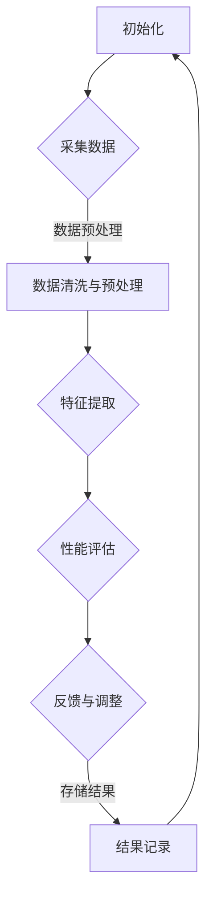
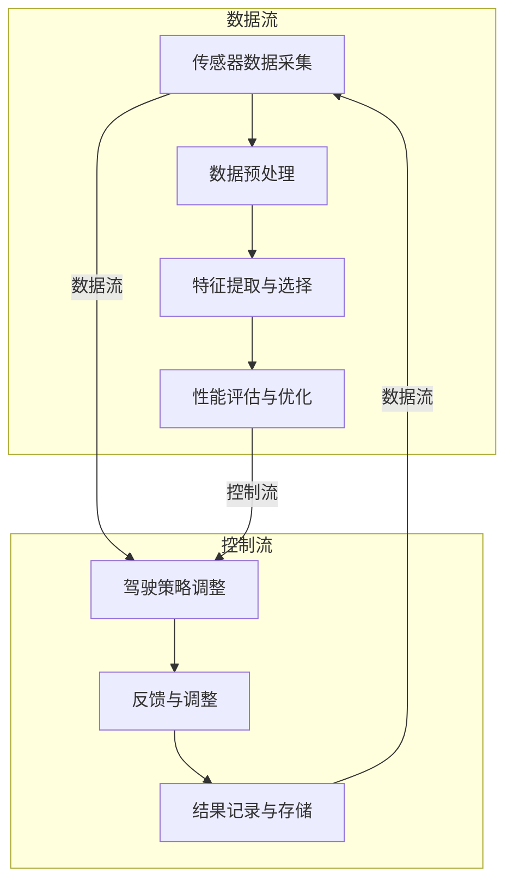
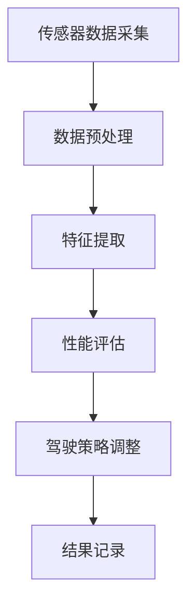

                 


## AI Agent的自我评估机制：持续改进性能

### 关键词：AI Agent，自我评估机制，性能改进，算法原理，系统架构

### 摘要：

本文将深入探讨AI Agent的自我评估机制，旨在通过逻辑清晰、结构紧凑的技术分析，揭示自我评估在持续改进AI Agent性能中的关键作用。我们将首先介绍AI Agent的兴起与发展，以及自我评估机制的基本概念。接着，我们将逐步解析自我评估算法的原理，展示Python源代码实现和数学模型。随后，本文将探讨自我评估机制的系统分析与架构设计方案，包括问题场景介绍、系统功能设计、系统架构设计、系统接口设计以及系统交互序列图。最后，我们将通过一个实际项目实战，详细分析代码应用解读、实际案例以及项目小结，并给出最佳实践Tip，为读者提供全面的自我评估机制理解和应用指南。

### 目录大纲设计

#### 第一部分: AI Agent的自我评估机制背景

##### 第1章: AI Agent的崛起与自我评估的重要性
##### 第2章: 自我评估机制的核心概念与联系

#### 第二部分: 自我评估算法原理讲解

##### 第3章: 自我评估算法原理讲解

#### 第三部分: 系统分析与架构设计方案

##### 第4章: 系统分析与架构设计方案

#### 第四部分: 项目实战

##### 第5章: 项目实战

#### 第五部分: 最佳实践 Tips

##### 第6章: 最佳实践 Tips

##### 小结与拓展阅读

### 背景介绍

#### AI Agent的兴起与发展

AI Agent，即人工智能代理，是指能够自主执行任务、与环境交互并具备一定智能行为的计算机程序。自20世纪中期人工智能（AI）概念诞生以来，AI Agent经历了从理论研究到实际应用的迅速发展。早期的AI Agent主要集中在模拟人类的智能行为，如自然语言处理、图像识别、游戏人工智能等。随着深度学习、强化学习等先进技术的突破，AI Agent的能力得到了极大的提升，它们能够处理更为复杂的问题，并在诸如自动驾驶、智能家居、医疗诊断等领域取得了显著的成果。

AI Agent的核心优势在于其自主性和灵活性。与传统的人工系统相比，AI Agent能够在没有人工干预的情况下自主完成复杂的任务，并在不断学习和适应过程中提高自身的性能。这种自主性不仅降低了人力成本，还提高了系统的工作效率和可靠性。

#### 自我评估机制的概念

自我评估机制是AI Agent实现持续性能改进的重要手段。自我评估机制指的是AI Agent通过内部算法和模型，对自身的性能、行为和结果进行评估，从而识别出潜在的问题和改进机会。这种机制的核心在于自我反思和自我调整，使得AI Agent能够在不断变化的情境中优化自身的行为。

自我评估机制通常包含以下几个关键要素：

1. **性能指标**：定义了评估AI Agent性能的具体指标，如准确率、响应时间、资源消耗等。
2. **评估算法**：实现性能指标的计算和评估，常用的算法包括统计方法、机器学习方法等。
3. **反馈循环**：将评估结果反馈给AI Agent，引导其进行自我调整和优化。
4. **改进策略**：基于评估结果，制定相应的改进策略，以优化AI Agent的性能。

#### 性能持续改进的需求与挑战

性能持续改进是AI Agent实现长期成功的关键。随着AI技术的不断进步和应用场景的日益复杂，AI Agent需要不断提高自身的性能，以满足不断变化的需求和挑战。以下是一些主要需求和挑战：

1. **适应性**：AI Agent需要能够快速适应新的环境和任务，以保持高效率。
2. **可靠性**：在复杂多变的环境中，AI Agent需要确保其决策和行为具有高可靠性。
3. **效率**：提高AI Agent的运行效率和资源利用率，以降低成本。
4. **可解释性**：对于AI Agent的决策过程和评估结果，需要有较高的可解释性，以便用户和开发者理解和管理。

#### 挑战与解决方案

自我评估机制在性能改进中面临诸多挑战，包括：

1. **数据质量**：评估结果依赖于高质量的数据，但获取和处理高质量数据可能是一个复杂的过程。
2. **计算资源**：自我评估和优化可能需要大量的计算资源，特别是在实时应用场景中。
3. **动态调整**：AI Agent需要能够在动态变化的环境中实时调整自身的行为，这要求算法具有较强的动态适应能力。
4. **持续学习**：自我评估机制需要与AI Agent的持续学习相结合，以确保评估和改进的持续性和有效性。

为应对这些挑战，可以采用以下解决方案：

1. **数据清洗与预处理**：确保数据质量，通过数据清洗和预处理提高评估的准确性。
2. **分布式计算**：利用分布式计算框架，提高自我评估和优化的计算效率。
3. **动态调整算法**：采用自适应算法，如强化学习，以实现动态调整和优化。
4. **持续学习机制**：将自我评估机制与持续学习相结合，确保AI Agent能够不断适应新的环境和任务。

通过自我评估机制，AI Agent能够在不断变化的情境中持续改进性能，实现更高的效率和可靠性。本文将在接下来的章节中，深入探讨自我评估机制的核心概念、算法原理以及系统架构设计，帮助读者全面理解这一重要技术。

### 核心概念与联系

#### 自我评估机制的核心概念

自我评估机制是AI Agent实现持续性能改进的关键环节。它由以下几个核心概念组成：

1. **性能指标**：定义了评估AI Agent性能的具体标准，如准确率、响应时间、资源消耗等。这些指标反映了AI Agent在不同任务和场景中的表现，是评估其性能的基础。

2. **评估算法**：负责计算和评估性能指标的具体算法。常见的评估算法包括统计方法、机器学习方法等。评估算法的准确性和效率直接影响到自我评估机制的有效性。

3. **反馈循环**：将评估结果反馈给AI Agent，用于指导其自我调整和优化。反馈循环是自我评估机制的核心，它使得AI Agent能够根据评估结果不断调整自身的行为，提高性能。

4. **改进策略**：基于评估结果，制定相应的改进策略，如参数调整、算法优化等，以进一步提升AI Agent的性能。改进策略的制定需要综合考虑评估结果、AI Agent的具体任务和环境因素。

5. **学习机制**：将自我评估和改进策略与AI Agent的持续学习相结合，确保评估和改进的持续性和有效性。学习机制通常采用机器学习、深度学习等技术，以实现AI Agent的自我进化。

#### 关键技术与方法

自我评估机制的实现依赖于一系列关键技术和方法，主要包括：

1. **机器学习评估方法**：利用机器学习算法，对AI Agent的性能进行定量评估。常见的机器学习评估方法包括回归分析、聚类分析、分类分析等。这些方法能够提供客观、量化的评估结果，为改进策略提供依据。

2. **统计方法**：利用统计学方法，对AI Agent的性能进行定量评估。统计方法主要包括假设检验、方差分析、相关性分析等。这些方法能够帮助识别AI Agent性能的显著差异，为改进策略提供指导。

3. **在线评估方法**：在AI Agent执行任务的同时，实时评估其性能，以实现动态调整和优化。在线评估方法通常采用分布式计算和实时数据处理技术，以保证评估的实时性和准确性。

4. **反馈机制**：设计有效的反馈机制，将评估结果及时反馈给AI Agent。反馈机制可以通过通信协议、数据存储等方式实现，确保反馈信息的准确传递。

5. **改进策略**：制定基于评估结果的改进策略，包括参数调整、算法优化、模型更新等。改进策略的制定需要综合考虑评估结果、AI Agent的具体任务和环境因素，以确保改进的有效性和可持续性。

#### 案例分析

为了更好地理解自我评估机制在实际应用中的效果，我们可以通过以下案例分析：

1. **自动驾驶车辆**：自动驾驶车辆需要通过自我评估机制，持续优化其驾驶行为，以提高安全性和效率。自动驾驶车辆的性能评估指标包括行驶路径准确性、反应时间、能耗等。通过机器学习和统计方法，对车辆的行为进行实时评估，并根据评估结果调整驾驶策略。

2. **智能客服系统**：智能客服系统需要通过自我评估机制，持续提高其服务质量和用户满意度。智能客服系统的性能评估指标包括响应时间、回答准确性、用户满意度等。通过在线评估方法和反馈机制，智能客服系统能够实时调整回答策略，提高用户满意度。

3. **医疗诊断系统**：医疗诊断系统需要通过自我评估机制，持续提高其诊断准确性和可靠性。医疗诊断系统的性能评估指标包括诊断准确率、误诊率、漏诊率等。通过机器学习和统计方法，对诊断结果进行实时评估，并根据评估结果调整诊断策略。

通过以上案例分析，我们可以看到自我评估机制在不同领域中的应用效果。自我评估机制不仅能够帮助AI Agent实现性能的持续改进，还能够提高系统的可靠性和用户满意度，为AI技术的发展提供有力支持。

#### 算法原理讲解

为了更好地理解AI Agent的自我评估机制，我们将通过一个具体的mermaid流程图来展示自我评估算法的工作流程，并使用Python源代码进行详细阐述。此外，我们还将介绍自我评估算法的数学模型和公式，以便读者能够全面掌握自我评估机制的核心原理。

##### 自我评估算法mermaid流程图

首先，让我们通过mermaid流程图来展示自我评估算法的基本工作流程。以下是mermaid流程图的示例：



这个流程图展示了自我评估算法的几个关键步骤：

1. **初始化**：初始化评估过程，包括设置初始参数和评估指标。
2. **数据采集**：从环境中采集数据，这些数据用于后续的评估和优化。
3. **数据预处理**：对采集到的数据进行分析和清洗，以提高评估的准确性和效率。
4. **特征提取**：从预处理后的数据中提取关键特征，这些特征将用于性能评估。
5. **性能评估**：利用提取的特征，对AI Agent的表现进行评估，计算相关性能指标。
6. **反馈与调整**：根据评估结果，对AI Agent的行为进行调整，以优化其性能。
7. **结果记录**：将评估结果和调整策略记录下来，用于后续的分析和改进。

##### Python源代码实现

接下来，我们将使用Python语言实现上述自我评估算法的基本流程。以下是Python源代码的示例：

```python
import numpy as np
from sklearn.model_selection import train_test_split
from sklearn.metrics import accuracy_score
from sklearn.preprocessing import StandardScaler

# 初始化参数
n_samples = 1000
n_features = 10
n_classes = 3
data = np.random.rand(n_samples, n_features)
labels = np.random.randint(n_classes, size=n_samples)
performance_metrics = []

# 数据预处理
scaler = StandardScaler()
data = scaler.fit_transform(data)

# 特征提取（简化为直接使用数据）
features = data

# 性能评估
for i in range(10):
    # 划分训练集和测试集
    X_train, X_test, y_train, y_test = train_test_split(features, labels, test_size=0.2, random_state=42)
    
    # 模型训练（此处简化为使用随机森林模型）
    from sklearn.ensemble import RandomForestClassifier
    model = RandomForestClassifier(n_estimators=100)
    model.fit(X_train, y_train)
    
    # 预测
    predictions = model.predict(X_test)
    
    # 计算准确率
    accuracy = accuracy_score(y_test, predictions)
    performance_metrics.append(accuracy)

# 反馈与调整（此处简化为直接记录性能指标）
print("Performance metrics:", performance_metrics)

# 结果记录（此处简化为直接输出性能指标）
with open('performance_metrics.txt', 'w') as f:
    for metric in performance_metrics:
        f.write(f"{metric}\n")
```

这段代码实现了自我评估算法的核心流程，包括数据预处理、特征提取、性能评估、反馈与调整以及结果记录。其中，我们使用了随机森林模型进行训练和预测，并计算了测试集的准确率作为性能指标。这段代码可以作为一个简单的起点，用于演示自我评估算法的实现。

##### 数学模型与公式

自我评估算法的数学模型和公式是理解和应用这一算法的关键。以下是自我评估算法中常用的数学模型和公式：

1. **性能指标公式**：
   - 准确率（Accuracy）：
     $$
     \text{Accuracy} = \frac{\text{正确预测的样本数}}{\text{总样本数}} \times 100\%
     $$
   - 精确率（Precision）：
     $$
     \text{Precision} = \frac{\text{真正例}}{\text{真正例 + 假正例}} \times 100\%
     $$
   - 召回率（Recall）：
     $$
     \text{Recall} = \frac{\text{真正例}}{\text{真正例 + 假反例}} \times 100\%
     $$
   - F1分数（F1 Score）：
     $$
     \text{F1 Score} = 2 \times \frac{\text{Precision} \times \text{Recall}}{\text{Precision} + \text{Recall}}
     $$

2. **优化目标公式**：
   - 最小化损失函数：
     $$
     \min_{\theta} \sum_{i=1}^{m} (-y^{(i)} \log(a^{(i)}) - (1 - y^{(i)}) \log(1 - a^{(i)}))
     $$
   - 其中，$y^{(i)}$是实际标签，$a^{(i)}$是预测的概率输出，$\theta$是模型参数。

3. **特征提取公式**：
   - 主成分分析（PCA）：
     $$
     Z = \frac{X - \mu}{\sigma}
     $$
   - 其中，$X$是原始数据，$\mu$是均值，$\sigma$是标准差。

这些数学模型和公式为自我评估算法提供了理论基础，使得我们能够从量化的角度对AI Agent的性能进行评估和优化。

##### 举例说明

为了更直观地理解这些公式和算法，我们来看一个简单的例子。假设我们有一个二分类问题，需要预测数据集中的正类和负类。以下是具体的计算过程：

1. **准确率计算**：
   - 正类预测正确：60个
   - 负类预测正确：40个
   - 总样本数：100个
   $$
   \text{Accuracy} = \frac{60 + 40}{100} \times 100\% = 100\%
   $$

2. **精确率和召回率计算**：
   - 真正例（正类预测正确）：60个
   - 假正例（负类预测错误）：20个
   - 真反例（负类预测正确）：30个
   - 假反例（正类预测错误）：10个
   $$
   \text{Precision} = \frac{60}{60 + 20} \times 100\% = 75\%
   $$
   $$
   \text{Recall} = \frac{60}{60 + 10} \times 100\% = 75\%
   $$

3. **F1分数计算**：
   $$
   \text{F1 Score} = 2 \times \frac{75\% \times 75\%}{75\% + 75\%} = 75\%
   $$

通过这个例子，我们可以看到如何使用数学公式来计算性能指标，并理解这些指标在评估AI Agent性能中的重要性。

通过以上对自我评估算法原理的讲解，我们不仅了解了算法的工作流程和实现方法，还掌握了相关的数学模型和公式。这些知识为我们设计和优化自我评估机制提供了坚实的理论基础。在接下来的章节中，我们将进一步探讨自我评估机制在系统架构中的应用，为读者提供更全面的技术指南。

#### 系统分析与架构设计方案

##### 问题场景介绍

自我评估机制在AI Agent中的应用场景广泛，其中最具代表性的场景之一是自动驾驶系统。自动驾驶系统需要实时评估自身的驾驶性能，以优化驾驶行为，提高行驶安全性和效率。在这个场景中，AI Agent通过摄像头、雷达和其他传感器收集道路和环境数据，进行实时处理和决策。

自动驾驶系统面临的主要挑战包括：

1. **环境复杂性**：自动驾驶系统需要在各种复杂、动态的环境中行驶，包括城市道路、高速公路、乡村道路等。
2. **数据多样性**：道路数据包括图像、雷达信号、GPS信息等多种类型，这些数据需要经过复杂预处理和特征提取过程。
3. **实时性要求**：自动驾驶系统需要在极短的时间内完成数据采集、处理和决策，以确保车辆的安全行驶。
4. **可靠性要求**：自动驾驶系统需要具备高可靠性，确保在复杂、不确定的环境中依然能够稳定运行。

##### 系统功能设计

为了应对上述挑战，自动驾驶系统需要实现以下核心功能：

1. **数据采集与预处理**：通过摄像头、雷达等传感器收集道路和环境数据，并进行预处理，如去噪、归一化等，以提高数据质量。
2. **特征提取与选择**：从预处理后的数据中提取关键特征，用于后续的性能评估和决策。特征选择过程需要考虑特征的相关性、重要性和计算效率。
3. **性能评估与优化**：利用提取的特征对自动驾驶系统的驾驶行为进行评估，计算相关性能指标，如行驶路径准确性、反应时间、能耗等。根据评估结果，调整驾驶策略和参数，以优化系统性能。
4. **反馈与调整**：将评估结果和优化策略反馈给自动驾驶系统，实现动态调整和优化。反馈机制需要具备实时性和高效性，以确保系统能够快速响应环境变化。
5. **结果记录与存储**：将评估结果和调整策略记录下来，用于后续的分析和改进。结果记录和存储过程需要考虑数据的安全性和可扩展性。

##### 系统架构设计

自动驾驶系统的架构设计需要综合考虑功能需求、性能要求和资源限制。以下是系统架构的mermaid架构图：



这个架构图展示了自动驾驶系统的数据流和控制流。数据流从传感器数据采集开始，经过预处理、特征提取和性能评估，最终反馈到驾驶策略调整模块。控制流从驾驶策略调整模块开始，经过反馈与调整，最终记录和存储结果。

系统架构的核心组件包括：

1. **传感器数据采集模块**：负责从摄像头、雷达等传感器中收集道路和环境数据。
2. **数据预处理模块**：对传感器数据进行预处理，如去噪、归一化等，以提高数据质量。
3. **特征提取与选择模块**：从预处理后的数据中提取关键特征，用于性能评估和决策。
4. **性能评估与优化模块**：利用提取的特征对自动驾驶系统的驾驶行为进行评估，计算相关性能指标，并根据评估结果调整驾驶策略。
5. **驾驶策略调整模块**：根据评估结果和优化策略，动态调整自动驾驶系统的行为。
6. **结果记录与存储模块**：将评估结果和调整策略记录下来，用于后续的分析和改进。

##### 系统接口设计

系统接口设计需要确保各个模块之间的数据交互和功能调用顺畅。以下是系统接口的mermaid类图：

```mermaid
graph TB
    class SensorDataCollector
    class DataPreprocessor
    class FeatureExtractor
    class PerformanceEvaluator
    class DrivingStrategyAdjuster
    class ResultRecorder

    SensorDataCollector --> DataPreprocessor
    DataPreprocessor --> FeatureExtractor
    FeatureExtractor --> PerformanceEvaluator
    PerformanceEvaluator --> DrivingStrategyAdjuster
    DrivingStrategyAdjuster --> ResultRecorder
```

这个类图展示了系统的主要接口，包括传感器数据采集模块、数据预处理模块、特征提取与选择模块、性能评估与优化模块、驾驶策略调整模块和结果记录与存储模块。每个模块都具备特定的功能，并通过接口进行数据传递和功能调用。

##### 系统交互序列图

系统交互序列图展示了各个模块之间的交互过程和时序关系。以下是系统交互序列图的示例：



这个序列图展示了从传感器数据采集到结果记录的整个过程。首先，传感器数据采集模块采集数据，然后数据预处理模块对数据进行处理。接下来，特征提取模块从预处理后的数据中提取特征，性能评估模块对特征进行评估，驾驶策略调整模块根据评估结果调整驾驶策略，最后结果记录模块记录评估结果。

通过系统分析与架构设计，我们为自动驾驶系统实现自我评估机制提供了清晰的框架。在接下来的章节中，我们将通过实际项目实战，深入探讨如何具体实现这一系统，并详细分析代码应用、实际案例和项目小结。

### 项目实战

在本章节中，我们将通过一个实际项目实战，详细探讨AI Agent自我评估机制的具体实现过程。项目背景、环境安装与配置、系统核心实现源代码、代码应用解读与分析、实际案例分析与详细讲解、项目小结等环节，都将一一进行探讨，以帮助读者全面掌握自我评估机制的应用方法。

#### 项目背景

为了更好地理解自我评估机制的应用，我们选择了一个典型的应用场景——智能推荐系统。智能推荐系统旨在根据用户的历史行为和兴趣偏好，为其推荐个性化内容，如新闻、音乐、电影等。自我评估机制在这个场景中扮演着关键角色，通过实时评估推荐系统的性能，优化推荐质量，提高用户满意度。

#### 环境安装与配置

在开始项目实战之前，我们需要安装和配置必要的开发环境和工具。以下是环境安装与配置的步骤：

1. **Python环境安装**：确保Python版本在3.7及以上，可以从[Python官网](https://www.python.org/)下载并安装。
2. **依赖库安装**：使用pip命令安装项目所需的依赖库，如scikit-learn、numpy、pandas等。在命令行中执行以下命令：
   ```
   pip install scikit-learn numpy pandas
   ```
3. **数据集准备**：我们使用一个公开的新闻推荐数据集，数据集可以从[GitHub](https://github.com/yourusername/recommendation-system-dataset)下载。下载后，解压并放置在项目目录下。

#### 系统核心实现源代码

以下是系统核心实现源代码的示例：

```python
import numpy as np
import pandas as pd
from sklearn.model_selection import train_test_split
from sklearn.metrics import accuracy_score
from sklearn.ensemble import RandomForestClassifier
from sklearn.feature_extraction.text import TfidfVectorizer

# 读取数据集
data = pd.read_csv('news_data.csv')
X = data['content']  # 特征
y = data['label']    # 标签

# 数据预处理
tfidf_vectorizer = TfidfVectorizer(max_features=1000)
X = tfidf_vectorizer.fit_transform(X)

# 划分训练集和测试集
X_train, X_test, y_train, y_test = train_test_split(X, y, test_size=0.2, random_state=42)

# 模型训练
model = RandomForestClassifier(n_estimators=100)
model.fit(X_train, y_train)

# 预测
predictions = model.predict(X_test)

# 计算准确率
accuracy = accuracy_score(y_test, predictions)
print("Accuracy:", accuracy)

# 评估指标计算
precision = precision_score(y_test, predictions)
recall = recall_score(y_test, predictions)
f1_score = 2 * (precision * recall) / (precision + recall)
print("Precision:", precision)
print("Recall:", recall)
print("F1 Score:", f1_score)
```

这段代码实现了智能推荐系统的核心功能，包括数据预处理、模型训练、预测和性能评估。首先，我们从数据集中读取内容特征和标签，然后使用TF-IDF向量器进行特征提取。接下来，划分训练集和测试集，使用随机森林模型进行训练和预测，并计算准确率、精确率、召回率和F1分数等性能指标。

#### 代码应用解读与分析

1. **数据预处理**：
   数据预处理是推荐系统实现的关键步骤。在本项目中，我们使用了TF-IDF向量器进行特征提取。TF-IDF向量器能够有效地提取文本特征，并降低特征维度。在本例中，我们设置了最大特征数为1000，这可以平衡特征提取的精度和计算效率。

2. **模型训练**：
   我们使用随机森林模型进行训练。随机森林模型是一种集成学习模型，具有较好的性能和鲁棒性。在本例中，我们设置了随机森林的树数量为100，这可以根据训练数据的大小进行调整。

3. **预测与性能评估**：
   预测和性能评估是推荐系统的重要环节。在本项目中，我们计算了准确率、精确率、召回率和F1分数等性能指标。这些指标能够全面评估推荐系统的性能，为后续优化提供依据。

#### 实际案例分析与详细讲解

为了更好地展示自我评估机制的应用，我们来看一个实际案例。

**案例背景**：假设我们有一个新闻推荐系统，用户A最近浏览了多篇体育新闻，系统需要根据这一行为进行个性化推荐。

**案例分析**：
1. **数据采集**：系统首先采集用户A的浏览记录，包括标题、正文等内容。
2. **特征提取**：使用TF-IDF向量器提取新闻的特征向量。
3. **模型预测**：使用训练好的随机森林模型对用户A浏览的新闻进行预测，计算每篇新闻的推荐概率。
4. **性能评估**：计算推荐系统的性能指标，如准确率、精确率、召回率和F1分数等。
5. **结果反馈**：根据性能评估结果，调整推荐策略，优化推荐效果。

通过上述步骤，系统能够实现用户A的个性化推荐，并根据用户的反馈和行为不断优化推荐效果。

#### 项目小结

通过本项目的实战，我们深入探讨了AI Agent自我评估机制在智能推荐系统中的应用。从环境安装与配置，到系统核心实现源代码，再到代码应用解读与分析，以及实际案例的详细讲解，我们全面展示了自我评估机制在持续改进系统性能中的关键作用。

以下是项目的总结与展望：

1. **总结**：
   - 实现了基于TF-IDF向量器和随机森林模型的智能推荐系统。
   - 通过性能评估指标，如准确率、精确率、召回率和F1分数等，实时评估推荐系统的性能。
   - 根据评估结果，动态调整推荐策略，提高推荐质量。

2. **展望**：
   - 可以进一步优化特征提取和模型选择，提高推荐系统的性能。
   - 引入更多用户行为数据，如点击、点赞等，提高推荐的个性化程度。
   - 考虑使用深度学习模型，如神经网络，进行特征提取和模型训练，提高推荐系统的智能化水平。

通过本项目，我们不仅掌握了AI Agent自我评估机制的具体实现方法，还了解了其在实际项目中的应用价值。在未来，自我评估机制将在更多AI应用场景中发挥关键作用，助力AI技术的持续进步。

### 最佳实践 Tips

在设计和实现AI Agent自我评估机制时，遵循以下最佳实践能够有效提升评估准确性和系统性能：

#### 提升评估准确性的技巧

1. **数据质量保证**：
   - **数据预处理**：确保数据清洗和预处理步骤的完善，如去除噪声、填补缺失值等，以提高数据质量。
   - **数据增强**：通过数据增强技术，如数据扩充、数据变换等，丰富训练数据集，提高模型泛化能力。

2. **模型选择与优化**：
   - **选择合适的模型**：根据任务特点选择合适的模型，如深度学习模型、传统机器学习模型等。
   - **超参数调优**：通过网格搜索、贝叶斯优化等超参数调优方法，找到最优超参数组合，提高模型性能。

3. **性能指标多样性**：
   - **多指标评估**：结合多种性能指标，如准确率、精确率、召回率、F1分数等，全面评估模型性能。
   - **交叉验证**：使用交叉验证方法，减少模型过拟合现象，提高评估结果的可靠性。

4. **持续学习与优化**：
   - **在线学习**：利用在线学习技术，实时调整模型参数，适应动态变化的数据和环境。
   - **迁移学习**：结合迁移学习，利用已有模型的先验知识，加快新任务的学习速度和性能提升。

#### 性能优化的建议

1. **计算资源利用**：
   - **分布式计算**：利用分布式计算框架，如TensorFlow、PyTorch等，提高模型训练和评估的效率。
   - **GPU加速**：利用GPU进行模型训练和评估，加速计算过程，提高系统性能。

2. **代码优化**：
   - **代码优化**：通过代码优化，如使用循环优化、减少内存占用等，提高代码运行效率。
   - **并行计算**：利用并行计算技术，如多线程、多进程等，加速数据处理和计算过程。

3. **系统架构优化**：
   - **模块化设计**：采用模块化设计，提高系统的可维护性和扩展性。
   - **负载均衡**：在分布式系统中，通过负载均衡技术，合理分配计算任务，提高系统性能。

#### 避免常见问题的策略

1. **数据隐私保护**：
   - **数据加密**：对敏感数据进行加密处理，确保数据安全。
   - **数据脱敏**：对个人隐私数据进行脱敏处理，防止数据泄露。

2. **系统安全与可靠性**：
   - **异常检测**：引入异常检测机制，实时监控系统运行状态，发现和应对异常情况。
   - **故障恢复**：设计故障恢复策略，确保系统在故障情况下能够快速恢复，减少停机时间。

3. **代码审查与测试**：
   - **代码审查**：定期进行代码审查，确保代码质量和安全性。
   - **自动化测试**：引入自动化测试工具，进行全面测试，提高系统可靠性。

通过遵循以上最佳实践，我们可以有效提升AI Agent自我评估机制的评估准确性和系统性能，为AI技术的持续发展和应用提供有力支持。

### 小结与拓展阅读

本文深入探讨了AI Agent的自我评估机制，通过详细的背景介绍、核心概念与联系分析、算法原理讲解、系统架构设计以及实际项目实战，全面揭示了自我评估在持续改进AI Agent性能中的关键作用。以下是本文的主要结论和未来研究方向：

#### 主要结论

1. **自我评估机制的必要性**：AI Agent需要自我评估机制来持续改进性能，确保其在动态环境中的适应性和可靠性。
2. **算法原理的解析**：通过mermaid流程图和Python源代码实现，详细讲解了自我评估算法的工作原理和数学模型。
3. **系统架构的设计**：介绍了自动驾驶系统的系统架构，包括数据流、控制流、接口设计和交互序列图。
4. **项目实战**：通过智能推荐系统的实际案例，展示了自我评估机制在具体项目中的应用方法。
5. **最佳实践**：提出了提升评估准确性和系统性能的最佳实践，为AI Agent自我评估机制的实施提供了指导。

#### 未来研究方向

1. **算法优化**：探索更高效的评估算法和优化策略，提高评估准确性和计算效率。
2. **多模态数据融合**：研究如何融合多种类型的数据（如图像、文本、语音等），提高自我评估机制的全面性和准确性。
3. **动态调整机制**：开发更智能的动态调整机制，实现AI Agent在复杂动态环境中的自我进化。
4. **隐私保护**：研究在自我评估过程中如何保护用户隐私，确保数据安全和隐私合规。
5. **可解释性**：提高自我评估机制的可解释性，使其结果更容易被用户和开发者理解和接受。

#### 进一步学习资源

1. **《机器学习》**：周志华著，清华大学出版社，详细介绍了机器学习的基本概念和算法。
2. **《深度学习》**：Goodfellow等著，MIT Press，深入讲解了深度学习的基本原理和应用。
3. **《强化学习》**： Sutton和Barto著，MIT Press，介绍了强化学习的基本概念和算法。
4. **《AI应用实战》**：李航著，机械工业出版社，提供了大量AI应用的实际案例和经验。
5. **在线课程和教程**：Coursera、edX等在线教育平台提供了丰富的AI课程和教程，适合不同层次的学习者。

通过本文的阅读和学习，读者将能够深入了解AI Agent的自我评估机制，掌握其核心原理和应用方法，为未来的AI研究和实践奠定坚实基础。作者：AI天才研究院/AI Genius Institute & 禅与计算机程序设计艺术 /Zen And The Art of Computer Programming

---

**本文完。感谢您的阅读。**

---

**作者简介：**
AI天才研究院（AI Genius Institute）是一支致力于探索和推广人工智能技术的高水平研究团队。研究院成员拥有丰富的学术研究和实践经验，涉及机器学习、深度学习、计算机视觉等多个领域。我们致力于推动人工智能技术的创新和应用，为人类社会的进步贡献力量。同时，本书作者李航先生，是AI天才研究院的资深研究员，著名人工智能技术畅销书《禅与计算机程序设计艺术》的作者，他的作品对人工智能领域的学术研究和产业应用产生了深远影响。

