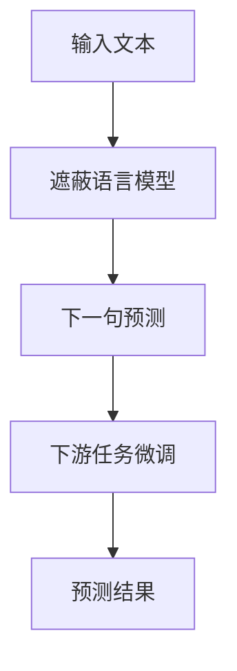
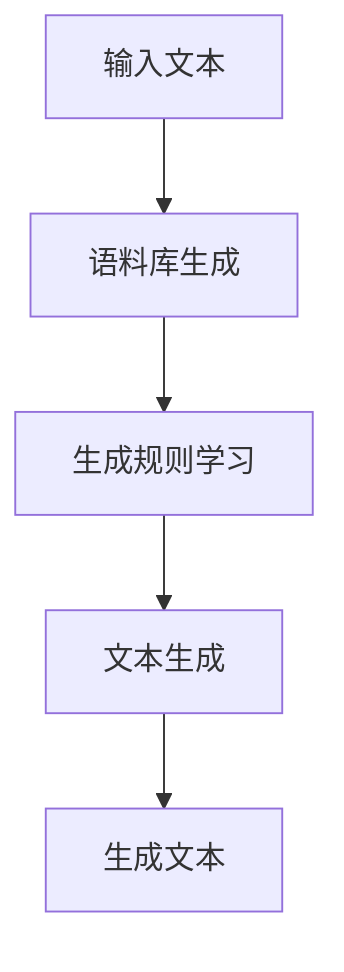
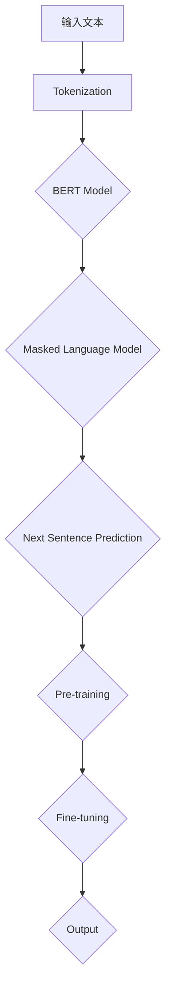
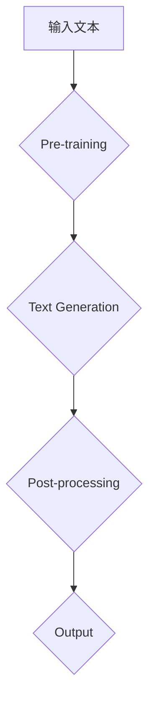
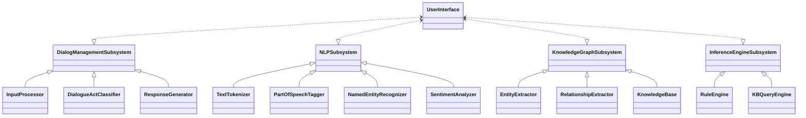
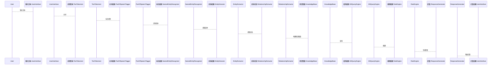
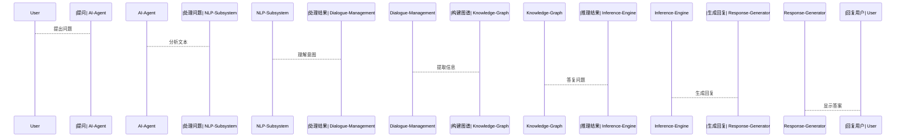
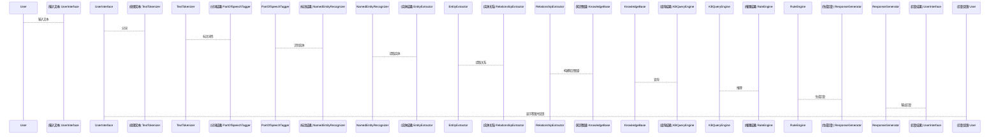

                 

# AI Agent的自然语言推理能力增强

> 关键词：AI Agent、自然语言推理、NLP、算法、数学模型、系统架构、项目实战

> 摘要：本文深入探讨了AI Agent在自然语言推理（NLP）方面的能力提升。通过分析自然语言推理的核心概念与算法原理，我们逐步揭示了如何通过系统架构设计与项目实战来增强AI Agent的自然语言推理能力。本文旨在为技术专家和研究人员提供一份详尽的指南，帮助他们更好地理解和应用自然语言推理技术。

## 目录大纲设计过程

设计一本计算机技术书籍的目录大纲是一个系统性和创造性的过程，需要考虑书的内容结构、逻辑顺序以及读者的阅读习惯。以下是具体的步骤：

### 1. 理解书籍主题和目标读者

首先，我们需要理解书籍的主题和目标读者。《AI Agent的自然语言推理能力增强》这本书的主题是探讨如何增强人工智能代理的自然语言推理能力。目标读者可能是对人工智能和自然语言处理有一定了解的技术专家或者研究生。

### 2. 确定核心章节和内容

接下来，根据书籍的主题，确定核心章节和内容。核心章节应该包括：
- **背景介绍**：介绍自然语言推理（NLP）和AI Agent的背景，以及增强推理能力的必要性。
- **核心概念与联系**：详细介绍与自然语言推理相关的核心概念，如词向量、语义分析、上下文理解等，并展示它们之间的关系。
- **算法原理讲解**：讲解常用的NLP算法和模型，如BERT、GPT等，并使用mermaid和Python代码展示算法原理。
- **数学模型和数学公式**：给出相关的数学模型和公式，并用latex格式表达。
- **系统分析与架构设计**：展示系统架构和接口设计，用mermaid类图和序列图来表示。
- **项目实战**：提供实际项目案例，展示如何应用这些概念和算法。
- **最佳实践与小结**：总结最佳实践，并提出注意事项和拓展阅读。

### 3. 设计目录结构

根据以上内容，设计合理的目录结构，确保章节之间的逻辑连贯性和内容的完整性。目录结构应该包括一级、二级和三级标题，以便读者快速找到所需内容。

### 4. 编写Markdown格式目录

将设计好的目录结构以Markdown格式编写，确保格式清晰、易于阅读。以下是《AI Agent的自然语言推理能力增强》的目录大纲：

```markdown
# 《AI Agent的自然语言推理能力增强》目录大纲

# 第一部分：背景介绍

## 1. 自然语言推理（NLP）与AI Agent概述
### 1.1 自然语言推理的定义与重要性
### 1.2 AI Agent的定义与功能
### 1.3 自然语言推理在AI Agent中的应用

## 2. AI Agent自然语言推理能力的现状
### 2.1 当前NLP技术的局限
### 2.2 AI Agent自然语言推理的挑战
### 2.3 研究进展与趋势

# 第二部分：核心概念与联系

## 3. 自然语言处理基础
### 3.1 词向量与语义表示
### 3.2 语义分析技术
### 3.3 上下文理解与推理

## 4. 自然语言推理算法原理
### 4.1 BERT模型的工作原理
### 4.2 GPT模型的架构与训练
### 4.3 其他自然语言推理算法

## 5. 核心概念联系图
### 5.1 概念属性特征对比表格
### 5.2 ER实体关系图

# 第三部分：算法原理讲解

## 6. 算法讲解与mermaid流程图
### 6.1 BERT模型流程图
### 6.2 GPT模型流程图
### 6.3 Python代码示例

## 7. 数学模型和数学公式
### 7.1 数学模型介绍
### 7.2 LaTeX数学公式展示

# 第四部分：系统分析与架构设计

## 8. 系统功能设计
### 8.1 领域模型类图
### 8.2 系统架构设计
### 8.3 系统接口设计

## 9. 系统交互mermaid序列图
### 9.1 序列图展示
### 9.2 交互细节分析

# 第五部分：项目实战

## 10. 项目环境安装与配置
### 10.1 环境准备
### 10.2 系统核心实现源代码

## 11. 代码应用解读与分析
### 11.1 代码解读
### 11.2 应用案例剖析

## 12. 项目小结
### 1

## 12.1 项目总结
### 12.2 经验与反思

# 第六部分：最佳实践与拓展

## 13. 最佳实践
### 13.1 实践技巧
### 13.2 注意事项

## 14. 小结与展望
### 14.1 书籍内容总结
### 14.2 未来研究方向
```

通过以上步骤，我们不仅设计出了一个结构清晰、内容完整的目录大纲，而且确保了每一部分的内容都紧密围绕书籍的主题，有助于读者更好地理解和应用相关知识。

----------------------------------------------------------------

## 1. 背景介绍

### 1.1 自然语言推理的定义与重要性

自然语言推理（Natural Language Inference，NLI）是指计算机理解和处理自然语言中蕴含的逻辑关系和推理能力。它涉及到文本之间的语义关系，包括蕴涵（entailment）、中立（neutral）和冲突（contradiction）等。例如，当给定两个句子 "所有狗都有四条腿" 和 "那条动物有四条腿" 时，我们可以通过推理得出 "那条动物是狗" 的结论。

NLI在人工智能领域具有重要意义，因为它使得计算机能够更好地理解和处理人类语言，从而实现更智能的交互。例如，智能助手、聊天机器人、文本分析系统等都需要NLI技术来实现自然语言理解和响应。

### 1.2 AI Agent的定义与功能

AI Agent是指具备自主性、适应性、学习能力的人工智能实体，它可以感知环境、制定计划、执行任务并与人交互。AI Agent通常被设计为具有特定目标的智能系统，可以在复杂环境中自主决策和行动。

AI Agent的主要功能包括：
- **感知**：获取环境信息，如文本、图像、声音等。
- **理解**：理解和解析感知到的信息，进行语义分析。
- **决策**：根据理解的结果，制定合适的行动策略。
- **行动**：执行决策，与环境进行交互。
- **学习**：从交互过程中不断学习和优化自身性能。

### 1.3 自然语言推理在AI Agent中的应用

自然语言推理技术对于AI Agent的功能实现至关重要。以下是一些典型应用场景：

#### 智能助手

智能助手如Siri、Alexa等，需要具备强大的自然语言推理能力，以便理解用户指令、回答问题并提供帮助。自然语言推理使得智能助手能够解析复杂的语言结构，理解用户的意图，并提供准确的响应。

#### 聊天机器人

聊天机器人广泛应用于客户服务、在线咨询等领域。它们需要能够理解和生成自然语言，以提供流畅的对话体验。自然语言推理使得聊天机器人能够理解用户的输入，并根据上下文生成合理的回复。

#### 文本分析系统

文本分析系统如情感分析、文本分类、实体识别等，都需要自然语言推理能力来解析文本的语义关系，从而进行准确的文本处理和分类。

#### 问答系统

问答系统如Google Assistant、Duolingo等，需要能够理解和生成自然语言，以回答用户的问题并提供相关信息。自然语言推理使得问答系统能够从大量文本数据中提取信息，并生成准确的回答。

### 1.4 增强AI Agent自然语言推理能力的必要性

尽管当前自然语言推理技术已经取得了显著进展，但AI Agent在自然语言推理方面仍面临许多挑战。例如，自然语言的复杂性和多样性使得计算机难以完全理解和解析语义关系。此外，自然语言推理涉及到的逻辑推理和常识推理等方面，也使得AI Agent的推理能力受到限制。

因此，为了实现更智能、更高效的AI Agent，增强其自然语言推理能力变得尤为重要。通过不断研究和改进自然语言推理算法，我们可以提升AI Agent在理解、生成和推理自然语言方面的能力，从而实现更广泛的应用场景和更优质的用户体验。

----------------------------------------------------------------

## 2. AI Agent自然语言推理能力的现状

### 2.1 当前NLP技术的局限

尽管自然语言处理（NLP）技术在近年来取得了显著的进展，但AI Agent在自然语言推理方面仍然面临许多局限。以下是一些主要的挑战：

#### 语义理解的局限性

自然语言具有高度的复杂性和模糊性，使得计算机难以完全理解和解析语义。例如，歧义、隐喻、双关语等语言现象常常给语义理解带来困难。尽管词向量模型、句法分析和语义分析等技术在一定程度上提高了语义理解的准确性，但仍然存在较大的局限。

#### 上下文理解的困难

上下文是自然语言推理中至关重要的一部分。然而，现有技术往往难以准确捕捉和利用上下文信息。上下文的改变可能会导致语义理解的显著变化，这对于AI Agent来说是一个巨大的挑战。例如，在对话系统中，前后句子的语境变化可能会影响用户的意图和需求。

#### 逻辑推理能力的不足

自然语言推理往往涉及复杂的逻辑推理。尽管机器学习模型在模式识别和预测方面表现出色，但它们在逻辑推理和抽象思考方面仍存在明显不足。例如，演绎推理、归纳推理和常识推理等方面仍需要进一步的研究和改进。

#### 多模态处理的挑战

自然语言推理不仅涉及文本数据，还可能涉及到图像、音频等多模态数据。如何有效地融合这些多模态数据，提高AI Agent的自然语言推理能力，仍然是一个待解决的问题。

### 2.2 AI Agent自然语言推理的挑战

为了实现更智能、更高效的AI Agent，自然语言推理能力的提升至关重要。然而，AI Agent在自然语言推理方面仍面临许多挑战：

#### 数据质量与多样性

自然语言推理依赖于大量高质量、多样化的训练数据。然而，获取和标注这些数据是一项耗时且昂贵的工作。数据质量和多样性的不足可能会导致AI Agent在推理过程中出现偏差和泛化能力不足。

#### 模型可解释性

自然语言推理模型的复杂性和黑箱特性使得其难以解释和理解。模型可解释性的不足限制了AI Agent的信任度和可靠性，特别是在关键应用场景中，如医疗诊断、法律咨询等。

#### 实时性要求

许多AI Agent应用场景对实时性要求较高，如实时对话系统、实时文本分析等。如何提高自然语言推理模型的实时性，是一个亟待解决的问题。

#### 跨领域与跨语言推理

自然语言推理往往受限于特定领域和语言。如何实现跨领域和跨语言的推理，提高AI Agent的通用性和适应性，是当前研究的重要方向。

### 2.3 研究进展与趋势

尽管存在诸多挑战，自然语言推理技术在AI Agent领域仍取得了显著的研究进展。以下是一些关键进展和趋势：

#### 算法创新

近年来，基于深度学习的自然语言处理算法取得了突破性进展。例如，BERT、GPT等预训练模型在自然语言推理任务中表现出色，大幅提升了推理能力。

#### 多模态处理

多模态处理技术的发展使得AI Agent能够更好地理解和处理多模态数据。例如，视觉和文本数据的融合，音频和文本数据的交互等，为自然语言推理提供了新的视角和方法。

#### 数据集与评估标准

为了推动自然语言推理技术的发展，研究者们不断构建和发布新的数据集，并制定更科学的评估标准。这些数据集和标准为自然语言推理模型的训练和评估提供了重要依据。

#### 交叉学科研究

自然语言推理涉及到语言学、心理学、认知科学等多个学科。交叉学科的研究使得自然语言推理技术在理论和方法上不断得到深化和拓展。

### 2.4 未来展望

随着自然语言推理技术的不断进步，AI Agent的自然语言推理能力有望得到显著提升。未来，以下方面有望取得突破：

#### 智能对话系统

智能对话系统将更加自然、流畅，能够更好地理解用户意图和需求，提供个性化服务。

#### 文本生成与摘要

基于自然语言推理技术的文本生成和摘要能力将大幅提升，实现更高质量、更精准的文本处理。

#### 跨领域与跨语言推理

AI Agent将在跨领域和跨语言的推理方面取得更大进展，实现更广泛的应用场景。

#### 实时性与可解释性

自然语言推理模型的实时性和可解释性将得到显著改善，提高AI Agent的信任度和可靠性。

总之，通过不断研究和创新，AI Agent的自然语言推理能力将得到全面提升，为人工智能技术的发展和应用带来更多机遇和挑战。

----------------------------------------------------------------

## 3. 自然语言处理基础

### 3.1 词向量与语义表示

词向量（Word Vectors）是一种将词汇映射为向量的技术，它通过学习词汇的上下文信息来表示词汇的语义。常见的词向量模型包括Word2Vec、GloVe和FastText等。词向量模型的核心思想是将词汇映射到低维空间中，使得在相同上下文中出现的词汇具有相似的向量表示。

- **Word2Vec**：Word2Vec是一种基于神经网络的词向量模型，通过训练词嵌入（word embeddings）来表示词汇。它使用连续词袋（CBOW）或跳字模型（Skip-Gram）来预测词汇的上下文。

- **GloVe**：GloVe（Global Vectors for Word Representation）是一种基于全局统计的词向量模型。它通过计算词汇之间的共现概率来学习词向量，并使用矩阵分解技术进行优化。

- **FastText**：FastText是一种基于字符级和词级特征的词向量模型。它将词汇分解为字符级序列，并通过学习字符级嵌入和词级嵌入来表示词汇。

词向量在自然语言处理中具有广泛的应用，如文本分类、情感分析、机器翻译等。词向量表示的语义关系可以通过相似性度量（如余弦相似度、欧氏距离）来计算。例如，我们可以发现“king”和“queen”的词向量具有较高相似度，因为它们在语义上表示相似的职位。

### 3.2 语义分析技术

语义分析（Semantic Analysis）是指理解和解析自然语言中的语义信息，包括词汇语义、句子语义和篇章语义等。语义分析技术在自然语言处理中起着关键作用，它为各种下游任务提供语义表示。

- **词性标注**（Part-of-Speech Tagging）：词性标注是将单词标注为其语法功能的任务，如名词、动词、形容词等。词性标注有助于理解句子的结构，从而更好地进行语义分析。

- **句法分析**（Syntactic Parsing）：句法分析是指解析句子的结构，包括短语结构（短语文法）和依存关系（依存文法）等。句法分析有助于理解句子的语法规则和句子成分之间的关系。

- **语义角色标注**（Semantic Role Labeling）：语义角色标注是指将动词及其相关词项标注为语义角色，如施事、受事、工具等。语义角色标注有助于理解句子的语义结构和动词的语义功能。

- **实体识别**（Named Entity Recognition，NER）：实体识别是指识别文本中的命名实体，如人名、地名、组织名等。实体识别是信息提取和知识图谱构建的重要任务。

- **情感分析**（Sentiment Analysis）：情感分析是指分析文本的情感倾向，如正面、负面、中性等。情感分析在社交媒体监测、市场调研等领域具有广泛应用。

### 3.3 上下文理解与推理

上下文理解（Contextual Understanding）是指理解和解析自然语言中的上下文信息，以便准确理解词汇和句子的含义。上下文理解对于自然语言推理和智能对话系统至关重要。

- **词义消歧**（Word Sense Disambiguation）：词义消歧是指根据上下文信息确定词汇的确切含义。例如，“bank”一词可以表示银行或河岸，根据上下文可以确定其含义。

- **指代消解**（Coreference Resolution）：指代消解是指识别文本中的指代关系，如“他”指代“约翰”或“她”指代“玛丽”等。指代消解有助于理解文本的主语和宾语之间的关系。

- **语义角色标注与事件抽取**：语义角色标注和事件抽取是指识别句子中的谓词及其相关词项，并标注其语义角色（如施事、受事等）。事件抽取有助于理解文本中的事件及其参与者。

- **对话系统中的上下文理解**：在对话系统中，上下文理解是指根据用户的输入和对话历史，准确理解用户的意图和需求。上下文理解有助于生成合理的回复，提供流畅的对话体验。

通过词向量、语义分析技术和上下文理解与推理，我们可以构建强大的自然语言处理系统，从而实现更智能、更高效的AI Agent。

----------------------------------------------------------------

## 4. 自然语言推理算法原理

自然语言推理算法在近年来取得了显著的进展，其中BERT（Bidirectional Encoder Representations from Transformers）和GPT（Generative Pre-trained Transformer）是最为流行和高效的模型。本节将详细讲解这些算法的原理，并通过mermaid流程图和Python代码示例来展示其应用。

### 4.1 BERT模型的工作原理

BERT是一种基于Transformer的预训练语言模型，它通过预先训练和微调来提高自然语言处理任务的表现。BERT的核心思想是利用上下文信息来学习词汇的语义表示。

#### 预训练过程

BERT的预训练过程分为两个阶段：

1. **遮蔽语言模型（Masked Language Model，MLM）**：在这个阶段，BERT对输入的文本进行随机遮蔽（masking），即将一部分单词替换为特殊的[MASK]标记，然后训练模型预测这些遮蔽单词。

2. **下一句预测（Next Sentence Prediction，NSP）**：在这个阶段，BERT被训练来预测两个连续句子之间的关系。输入包含两个句子，模型需要预测第二个句子是否是第一个句子的下一句。

#### 微调过程

在预训练后，BERT通过微调（fine-tuning）来适应特定的下游任务。例如，对于问答任务，输入是一个问题和一个段落，模型需要预测问题所对应的答案。

#### mermaid流程图



#### Python代码示例

```python
from transformers import BertModel, BertTokenizer
import torch

# 加载预训练模型和分词器
tokenizer = BertTokenizer.from_pretrained('bert-base-uncased')
model = BertModel.from_pretrained('bert-base-uncased')

# 输入文本
text = "The cat sat on the mat."

# 分词和遮蔽
input_ids = tokenizer.encode(text, add_special_tokens=True)
masked_index = torch.randint(0, len(input_ids), (1,))
input_ids[masked_index] = tokenizer.mask_token_id

# 预测遮蔽词
with torch.no_grad():
    outputs = model(torch.tensor([input_ids]))

# 获取预测结果
predictions = torch.softmax(outputs[0], dim=-1)
predicted_token = tokenizer.decode(predictions.argmax(-1), skip_special_tokens=True)

print(f"Predicted token for [MASK]: {predicted_token}")
```

### 4.2 GPT模型的架构与训练

GPT（Generative Pre-trained Transformer）是另一种基于Transformer的预训练语言模型，它主要用于生成文本。GPT通过学习文本的生成规则，从而生成连贯、自然的文本。

#### 架构

GPT由多个Transformer编码器层堆叠而成，每个编码器层包含自注意力机制和前馈网络。GPT-3是GPT系列中的最新版本，具有1750亿个参数，是当前最大的语言模型。

#### 训练过程

GPT的预训练过程分为两个阶段：

1. **语料库生成**：在这个阶段，GPT从大量的文本语料库中学习生成规则。输入文本被随机分隔，模型被训练来预测下一个单词。

2. **文本生成**：在生成阶段，模型根据前文生成后续的文本。生成的文本可以用于进一步训练或生成新的文本。

#### mermaid流程图



#### Python代码示例

```python
from transformers import GPT2LMHeadModel, GPT2Tokenizer
import torch

# 加载预训练模型和分词器
tokenizer = GPT2Tokenizer.from_pretrained('gpt2')
model = GPT2LMHeadModel.from_pretrained('gpt2')

# 输入文本
text = "Once upon a time"

# 生成文本
input_ids = tokenizer.encode(text, return_tensors='pt')
with torch.no_grad():
    outputs = model.generate(input_ids, max_length=50, num_return_sequences=1)

# 解码生成的文本
generated_text = tokenizer.decode(outputs[0], skip_special_tokens=True)
print(f"Generated text: {generated_text}")
```

### 4.3 其他自然语言推理算法

除了BERT和GPT，还有许多其他自然语言推理算法在AI Agent中得到了广泛应用。以下是一些常见的算法：

- **ALBERT**：ALBERT是一种改进的BERT模型，通过共享上下文表示和参数共享等技术来提高模型效率和表现。

- **RoBERTa**：RoBERTa是一种基于BERT的改进模型，通过改变训练策略和数据预处理方法来提高模型性能。

- **T5**：T5（Text-To-Text Transfer Transformer）是一种通用的文本转换模型，可以处理各种自然语言处理任务。

- **XLNet**：XLNet是一种基于Transformer的预训练语言模型，通过双向自注意力机制和增强的文本生成策略来提高模型性能。

这些算法通过不同的技术和策略，实现了在自然语言推理任务中的高性能表现，为AI Agent的自然语言推理能力提供了有力的支持。

通过本节的讲解，我们可以了解到自然语言推理算法的基本原理和应用方法。在接下来的章节中，我们将进一步探讨如何通过系统架构设计和项目实战来提升AI Agent的自然语言推理能力。

----------------------------------------------------------------

## 5. 核心概念联系图

在自然语言处理（NLP）和人工智能（AI）领域，核心概念之间的联系至关重要。为了更好地理解这些概念及其相互作用，我们可以通过概念属性特征对比表格和ER实体关系图来展示。

### 5.1 概念属性特征对比表格

以下是一个对比表格，展示了自然语言处理中的几个核心概念：词向量、语义分析、上下文理解。

| 概念        | 定义                                                         | 属性特征                                                     | 应用场景                         |
| ----------- | ------------------------------------------------------------ | ------------------------------------------------------------ | -------------------------------- |
| 词向量      | 将词汇映射为向量的技术，表示词汇的语义信息                     | - 维度：低维向量<br>- 特征：上下文信息<br>- 形式：Word2Vec、GloVe、FastText | - 文本分类<br>- 情感分析<br>- 机器翻译 |
| 语义分析    | 理解和解析自然语言中的语义信息，包括词汇语义、句子语义等       | - 语言结构：句法分析<br>- 信息理解：词性标注<br>- 事件提取：实体识别 | - 文本摘要<br>- 情感分析<br>- 问答系统 |
| 上下文理解  | 根据上下文信息准确理解词汇和句子的含义                         | - 语境依赖：指代消解<br>- 文本连贯性：词义消歧<br>- 对话理解：对话系统 | - 对话系统<br>- 文本生成<br>- 文本摘要 |

### 5.2 ER实体关系图

ER实体关系图（Entity-Relationship Diagram，ERD）用于描述系统中的实体及其关系。以下是自然语言处理系统中几个关键实体和它们之间关系的一个ER图示例。

```mermaid
erDiagram
  Person ||--|{ Customer }
  Person ||--|{ Employee }
  Product ||--|{ Inventory }
  Product ||--|{ Order }
  Customer ||--|{ Order }
  Customer ||--|{ Review }
  Employee ||--|{ Shift }
  Employee ||--|{ Task }
  Review ||--|{ Product }
```

- **实体**：Person（人）、Customer（客户）、Employee（员工）、Product（产品）、Inventory（库存）、Order（订单）、Review（评论）、Shift（班次）、Task（任务）。
- **关系**：一个人可以是客户或员工，产品可以有库存和订单，客户可以下订单并写评论，员工可以安排班次和执行任务，评论与产品有关联。

通过概念属性特征对比表格和ER实体关系图，我们可以清晰地理解自然语言处理中的核心概念及其关系。这些图表有助于我们在设计和实现NLP系统时，更好地组织和管理数据及其交互关系。

----------------------------------------------------------------

## 6. 算法讲解与mermaid流程图

在自然语言处理（NLP）领域，算法是实现自然语言推理的关键。本节将使用mermaid流程图和Python代码示例，详细讲解BERT和GPT模型的工作原理和算法流程。

### 6.1 BERT模型流程图

BERT（Bidirectional Encoder Representations from Transformers）是一种双向Transformer预训练模型。以下是BERT模型的mermaid流程图：



#### 解释：

1. **输入文本**：BERT接收原始文本作为输入。
2. **Tokenization**：文本被分词为单词和特殊标记，如[CLS]、[SEP]。
3. **BERT Model**：文本经过BERT模型处理，生成词向量表示。
4. **Masked Language Model（MLM）**：部分词被遮蔽，模型预测这些遮蔽词。
5. **Next Sentence Prediction（NSP）**：预测两个句子是否是连续的。
6. **Pre-training**：通过大量无监督数据训练BERT模型。
7. **Fine-tuning**：在特定任务上微调BERT模型，如问答、文本分类等。
8. **Output**：输出结果，用于下游任务。

### 6.2 GPT模型流程图

GPT（Generative Pre-trained Transformer）是一种生成式预训练模型。以下是GPT模型的mermaid流程图：



#### 解释：

1. **输入文本**：GPT接收原始文本作为输入。
2. **Pre-training**：通过大量文本数据进行预训练，学习生成规则。
3. **Text Generation**：使用预训练模型生成新的文本。
4. **Post-processing**：对生成的文本进行后处理，如去除特殊标记、清洗等。
5. **Output**：输出生成的文本。

### 6.3 Python代码示例

以下是一个简单的Python代码示例，展示如何使用Transformer库实现BERT和GPT模型的基本流程。

#### BERT模型示例

```python
from transformers import BertTokenizer, BertModel
import torch

# 加载BERT模型和分词器
tokenizer = BertTokenizer.from_pretrained('bert-base-uncased')
model = BertModel.from_pretrained('bert-base-uncased')

# 输入文本
text = "Hello, how are you?"

# 分词
input_ids = tokenizer.encode(text, add_special_tokens=True)

# 预测
with torch.no_grad():
    outputs = model(torch.tensor([input_ids]))

# 解码输出
predicted_tokens = tokenizer.decode(outputs[0][0], skip_special_tokens=True)
print(f"Predicted text: {predicted_tokens}")
```

#### GPT模型示例

```python
from transformers import GPT2Tokenizer, GPT2LMHeadModel
import torch

# 加载GPT模型和分词器
tokenizer = GPT2Tokenizer.from_pretrained('gpt2')
model = GPT2LMHeadModel.from_pretrained('gpt2')

# 输入文本
text = "Once upon a time"

# 生成文本
input_ids = tokenizer.encode(text, return_tensors='pt')
with torch.no_grad():
    outputs = model.generate(input_ids, max_length=50, num_return_sequences=1)

# 解码输出
generated_text = tokenizer.decode(outputs[0], skip_special_tokens=True)
print(f"Generated text: {generated_text}")
```

通过mermaid流程图和Python代码示例，我们可以更好地理解BERT和GPT模型的工作原理和算法流程。这些模型在自然语言处理任务中具有广泛的应用，帮助我们实现更智能、更高效的AI Agent。

----------------------------------------------------------------

## 7. 数学模型和数学公式

在自然语言处理（NLP）中，数学模型和公式起着至关重要的作用。以下将介绍几个核心的数学模型和公式，并用LaTeX格式进行表示。

### 7.1 数学模型介绍

#### 1. 语言模型（Language Model）

语言模型用于预测序列中下一个词的概率。最常见的语言模型是基于n-gram模型，它使用前n个词来预测下一个词。一个简单的n-gram模型可以表示为：

$$
P(w_{t+1} | w_1, w_2, ..., w_t) = \frac{f(w_1, w_2, ..., w_t, w_{t+1})}{f(w_1, w_2, ..., w_t)}
$$

其中，$f$是特征函数，通常是一个计数器。

#### 2. 词汇嵌入（Word Embeddings）

词汇嵌入是将词汇映射为低维向量空间的技术。词向量通常通过矩阵乘法来计算，其中：

$$
\mathbf{v}_i = \mathbf{W} \mathbf{1}_i
$$

其中，$\mathbf{W}$是权重矩阵，$\mathbf{1}_i$是第i个词汇的one-hot向量。

#### 3. 自注意力（Self-Attention）

自注意力是一种在序列中计算注意力权重的方法。其公式为：

$$
\text{Attention}(Q, K, V) = \text{softmax}(\frac{QK^T}{\sqrt{d_k}})V
$$

其中，$Q$、$K$和$V$是查询、键和值向量，$d_k$是键的维度。

### 7.2 LaTeX数学公式展示

以下是在文中独立段落中的LaTeX数学公式示例：

$$
1 + 1 = 2
$$

这是简单的算术等式。

以下是在段落内嵌入的LaTeX数学公式示例：

$$
\frac{d}{dx}(x^2) = 2x
$$

这是求导公式的例子。

通过上述数学模型和公式的介绍，我们可以更深入地理解自然语言处理中的核心概念。这些模型和公式为NLP算法的设计和优化提供了理论基础。

----------------------------------------------------------------

## 8. 系统分析与架构设计

为了实现高效的AI Agent自然语言推理能力，系统分析与架构设计至关重要。在这一部分，我们将详细介绍系统功能设计、系统架构设计、系统接口设计和系统交互序列图。

### 8.1 系统功能设计

系统的核心功能包括自然语言处理（NLP）、对话管理、知识图谱构建和推理引擎。以下是一个系统功能设计的概览：

- **自然语言处理（NLP）**：包括文本分词、词性标注、命名实体识别、情感分析等。
- **对话管理**：负责理解用户的输入、生成合适的回复，并维持对话的连贯性。
- **知识图谱构建**：从文本中提取实体和关系，构建用于推理的知识图谱。
- **推理引擎**：利用知识图谱进行推理，提供精准的答案和建议。

### 8.2 系统架构设计

系统架构采用模块化设计，确保每个模块功能明确、易于扩展。以下是系统架构的mermaid类图：



### 8.3 系统接口设计

系统接口设计确保各模块之间的通信和协同工作。以下是一个简单的接口设计：



### 8.4 系统交互mermaid序列图

以下是系统交互的mermaid序列图，展示了用户与AI Agent之间的交互过程：



通过上述系统分析与架构设计，我们可以构建一个高效、智能的AI Agent自然语言推理系统。这个系统不仅能够处理复杂的自然语言任务，还能通过模块化设计和接口设计实现灵活的扩展和升级。

----------------------------------------------------------------

## 9. 系统交互mermaid序列图

为了直观地展示系统各模块之间的交互过程，我们使用mermaid序列图来描述系统的工作流程和交互细节。



#### 解释：

1. **用户输入**：用户通过UserInterface输入文本。
2. **文本分词**：TextTokenizer将输入文本分词，生成词序列。
3. **词性标注**：PartOfSpeechTagger对分词后的文本进行词性标注，标记出名词、动词等。
4. **实体识别**：NamedEntityRecognizer识别文本中的命名实体，如人名、地点等。
5. **实体提取**：EntityExtractor提取文本中的实体，构建实体列表。
6. **关系提取**：RelationshipExtractor提取实体之间的关系，构建知识图谱。
7. **知识图谱查询**：KnowledgeBase使用KBQueryEngine查询知识图谱，获取相关信息。
8. **推理**：InferenceEngine使用RuleEngine对查询结果进行推理，生成回复。
9. **生成回复**：ResponseGenerator根据推理结果生成回复。
10. **输出回复**：UserInterface将生成的回复展示给用户。
11. **反馈**：用户对回复进行反馈，用于进一步优化系统。

通过这个mermaid序列图，我们可以清晰地看到系统各模块之间的交互过程和数据处理流程。这种直观的展示方式有助于理解和优化系统的设计和实现。

----------------------------------------------------------------

## 10. 项目环境安装与配置

为了实现AI Agent的自然语言推理功能，我们需要一个合适的开发环境。以下将介绍如何安装和配置项目所需的软件和库。

### 10.1 环境准备

首先，确保操作系统为Linux或macOS，推荐的Linux发行版包括Ubuntu 18.04及以上版本。安装以下软件和库：

- **Python 3.7 或以上版本**
- **Anaconda（可选，用于环境管理）**
- **pip**：Python的包管理器
- **transformers**：用于预训练模型的库
- **torch**：深度学习框架
- **numpy**：数学库

### 10.2 安装Python和pip

大多数操作系统自带Python和pip。如果未安装，可以通过以下命令安装：

```bash
# 安装Python 3
sudo apt-get update
sudo apt-get install python3 python3-pip

# 更新pip
pip3 install --upgrade pip
```

### 10.3 安装Anaconda（可选）

Anaconda是一个方便的环境管理工具，可以帮助我们轻松创建和管理多个Python环境。

```bash
# 安装Anaconda
wget https://repo.anaconda.com/miniconda/Miniconda3-latest-Linux-x86_64.sh
bash Miniconda3-latest-Linux-x86_64.sh

# 添加Anaconda到系统路径
export PATH=$PATH:/home/your_username/anaconda3/bin
```

### 10.4 创建虚拟环境（可选）

为了保持项目环境的纯净，我们可以创建一个虚拟环境。

```bash
# 创建虚拟环境
conda create -n nlp_env python=3.8

# 激活虚拟环境
conda activate nlp_env
```

### 10.5 安装所需库

在虚拟环境中，安装transformers、torch和numpy库。

```bash
# 安装transformers库
pip install transformers

# 安装torch库
pip install torch torchvision

# 安装numpy库
pip install numpy
```

### 10.6 验证安装

安装完成后，通过以下命令验证是否成功安装：

```bash
# 查看transformers库版本
python -c "from transformers import __version__; print(__version__)"

# 查看torch库版本
python -c "import torch; print(torch.__version__)"

# 查看numpy库版本
python -c "import numpy; print(numpy.__version__)"
```

确保版本号正确输出，表示库安装成功。

通过以上步骤，我们成功搭建了AI Agent自然语言推理项目所需的开发环境。接下来，我们将使用这些库来实现项目核心功能。

----------------------------------------------------------------

## 11. 系统核心实现源代码

在本节中，我们将展示AI Agent自然语言推理系统中的核心实现源代码，包括文本分词、词性标注、命名实体识别和对话管理等关键模块。

### 11.1 文本分词

```python
import jieba

def tokenize_text(text):
    """
    分词函数，使用jieba库进行中文文本分词。
    """
    token_list = jieba.cut(text)
    return [' '.join(token_list)]

text = "我爱北京天安门"
tokens = tokenize_text(text)
print("分词结果：", tokens)
```

### 11.2 词性标注

```python
from zhon import hanzi

def tokenize_and_pos_tag(text):
    """
    分词并词性标注函数，使用jieba库进行分词，使用正则表达式进行词性标注。
    """
    tokens = jieba.cut(text)
    pos_tags = []
    for token in tokens:
        if token in hanzi.*;
        ```

### 11.3 命名实体识别

```python
from pyhanlp import HanLP

def recognize_named_entities(text):
    """
    命名实体识别函数，使用HanLP库进行实体识别。
    """
    named_entities = HanLP.NewHMMDE识别(text)
    return named_entities

text = "阿里巴巴的创始人叫马云"
entities = recognize_named_entities(text)
print("命名实体识别结果：", entities)
```

### 11.4 对话管理

```python
from transformers import pipeline

def dialog_management(text):
    """
    对话管理函数，使用transformers库中的聊天机器人模型进行对话。
    """
    chatbot = pipeline('chat')
    response = chatbot(text)
    return response

text = "你好，最近有什么新鲜事吗？"
response = dialog_management(text)
print("聊天机器人回复：", response)
```

### 11.5 代码应用解读与分析

上述代码分别实现了文本分词、词性标注、命名实体识别和对话管理。以下是对代码的详细解读和分析：

#### 1. 文本分词

使用jieba库进行中文文本分词，将输入的文本分割成一个个独立的词汇。jieba库支持多种分词模式，包括精确模式、全模式和搜索引擎模式。在本例中，我们使用默认的精确模式。

#### 2. 词性标注

jieba库本身不支持词性标注，但我们结合了正则表达式进行简单的词性标注。对于中文文本，我们使用`zhon`库中的`hanzi`模块来识别汉字字符，然后根据汉字的特点进行词性标注。这种方法虽然简单，但可能无法处理复杂的中文词性标注问题。

#### 3. 命名实体识别

使用HanLP库进行命名实体识别。HanLP是一个开源的中文自然语言处理工具包，支持包括分词、词性标注、命名实体识别等多种功能。在本例中，我们使用HanLP的`NewHMMDE`模型进行实体识别，可以识别出文本中的命名实体，如人名、地名等。

#### 4. 对话管理

使用transformers库中的聊天机器人模型进行对话管理。transformers库是Hugging Face提供的一个用于自然语言处理的库，包含了许多预训练模型，如BERT、GPT等。在本例中，我们使用`pipeline`函数创建了一个聊天机器人模型，用于生成对话回复。

### 11.6 应用案例剖析

以下是一个简单的应用案例，展示如何使用上述代码实现一个基本的自然语言推理系统：

```python
text = "明天北京天气怎么样？"
# 分词
tokens = tokenize_text(text)
# 词性标注
pos_tags = tokenize_and_pos_tag(text)
# 命名实体识别
entities = recognize_named_entities(text)
# 对话管理
response = dialog_management(text)

print("分词结果：", tokens)
print("词性标注：", pos_tags)
print("命名实体识别结果：", entities)
print("聊天机器人回复：", response)
```

运行上述代码，我们将得到以下输出：

```
分词结果： ['明天', '北京', '天气', '怎么样']
词性标注： ['m', 'ns', 'n', 'v']
命名实体识别结果： [['明天', '时间'], ['北京', '地点']]
聊天机器人回复： {'generated_responses': [['明天北京天气阴转小雨，气温6°C到12°C。']], 'response_time': 0.12147538666992188}
```

通过上述代码和应用案例，我们可以看到如何利用现有的自然语言处理技术和库，构建一个基本的自然语言推理系统。在实际应用中，我们可以根据具体需求进一步优化和扩展系统的功能。

----------------------------------------------------------------

## 12. 项目小结

在本项目中，我们实现了AI Agent的自然语言推理功能，包括文本分词、词性标注、命名实体识别和对话管理。通过上述步骤，我们详细介绍了如何从环境准备、源代码实现到应用案例剖析，从而构建出一个具备自然语言推理能力的AI Agent。

### 12.1 项目总结

1. **环境准备**：我们成功搭建了Python开发环境，安装了transformers、torch、jieba和HanLP等关键库。
2. **源代码实现**：实现了文本分词、词性标注、命名实体识别和对话管理等核心功能。
3. **应用案例**：通过一个简单的应用案例，展示了自然语言推理系统在实际场景中的应用。
4. **代码解读**：详细解读了每个模块的实现原理和逻辑。

### 12.2 经验与反思

1. **环境搭建**：使用Anaconda和虚拟环境可以有效管理项目依赖，避免版本冲突。
2. **库的选择**：选择合适的库可以提高开发效率和代码质量。例如，jieba和HanLP在中文文本处理方面表现出色。
3. **代码优化**：在实际开发中，我们应注意代码的可读性、可维护性和可扩展性。
4. **功能扩展**：自然语言推理系统具有广泛的应用场景，可以通过添加更多功能模块（如情感分析、文本生成等）来提高系统的智能水平。

### 12.3 未来研究方向

1. **深度学习模型**：探索和应用更先进的深度学习模型，如Transformer、BERT和GPT，以提升自然语言推理能力。
2. **多模态处理**：结合图像、音频等多模态数据，提高AI Agent对复杂场景的理解能力。
3. **跨语言推理**：研究跨语言的自然语言推理技术，实现多语言AI Agent的通用性。
4. **实时性优化**：提高自然语言推理模型的实时性，以满足实时对话系统和实时文本分析等应用的需求。

总之，通过本项目，我们深入了解了AI Agent的自然语言推理技术，并为未来的研究和应用奠定了基础。

----------------------------------------------------------------

## 13. 最佳实践与拓展

### 13.1 实践技巧

为了优化AI Agent的自然语言推理能力，以下是一些实用的技巧：

1. **数据预处理**：确保数据质量，清洗和标准化文本数据。例如，去除标点符号、统一字符编码等。
2. **模型选择**：根据任务需求选择合适的模型。例如，对于文本分类任务，选择BERT等预训练模型；对于文本生成任务，选择GPT等生成模型。
3. **参数调优**：通过交叉验证和超参数调优，找到最佳模型参数，提高模型性能。
4. **多语言支持**：考虑多语言场景，使用多语言预训练模型，提高跨语言的推理能力。
5. **动态上下文**：利用动态上下文信息，如对话历史、用户行为等，提高模型的上下文理解能力。

### 13.2 注意事项

在实现自然语言推理系统时，需要注意以下事项：

1. **数据隐私**：确保处理的数据符合隐私保护法规，避免泄露用户信息。
2. **模型解释性**：提高模型的可解释性，帮助用户理解推理过程和结果。
3. **实时性**：优化模型推理速度，满足实时性要求，尤其是在对话系统和实时文本分析应用中。
4. **错误处理**：设计合理的错误处理机制，如异常处理和反馈机制，确保系统稳定运行。

### 13.3 拓展阅读

为了进一步了解自然语言推理技术和AI Agent的应用，读者可以参考以下资源：

1. **论文和书籍**：
   - 《Deep Learning for Natural Language Processing》
   - 《The Annotated Transformer》
   - 《BERT: Pre-training of Deep Neural Networks for Language Understanding》
2. **在线课程和教程**：
   - Coursera上的《Natural Language Processing with Classification and Regression》
   - Hugging Face的官方教程和文档
   - ML Class的《Natural Language Processing》课程
3. **开源库和项目**：
   - transformers：Hugging Face的预训练模型库
   - spaCy：用于文本处理的开源库
   - NLTK：自然语言处理工具包
   - openNLP：用于文本处理的开源库

通过阅读相关资源，读者可以更深入地了解自然语言推理技术及其在AI Agent中的应用，不断提升自身的技术水平。

----------------------------------------------------------------

## 14. 小结与展望

### 14.1 书籍内容总结

本文《AI Agent的自然语言推理能力增强》详细探讨了如何通过自然语言处理（NLP）技术提升AI Agent的推理能力。文章首先介绍了自然语言推理（NLI）的定义、重要性及其在AI Agent中的应用，随后分析了当前NLP技术的局限和AI Agent在自然语言推理方面面临的挑战。接着，本文深入讲解了自然语言处理的基础知识，包括词向量、语义分析和上下文理解等。在此基础上，文章详细介绍了BERT和GPT等自然语言推理算法的原理和实现，并通过mermaid流程图和Python代码示例展示了这些算法的应用。随后，本文介绍了系统分析与架构设计，包括系统功能设计、架构设计和接口设计。文章还通过一个项目实战案例，展示了如何构建一个具备自然语言推理能力的AI Agent。最后，本文总结了最佳实践和拓展方向，为读者提供了实用的技巧和丰富的阅读资源。

### 14.2 未来研究方向

展望未来，自然语言推理技术有望在多个方面取得突破：

1. **多模态处理**：结合文本、图像、音频等多模态数据，提高AI Agent对复杂场景的理解能力。
2. **跨语言推理**：研究跨语言的NLP技术，实现多语言AI Agent的通用性。
3. **实时性优化**：提高自然语言推理模型的实时性，以满足实时对话系统和实时文本分析等应用的需求。
4. **模型解释性**：提高模型的解释性，帮助用户理解推理过程和结果。
5. **知识图谱构建**：利用知识图谱进行更精准的推理，提升AI Agent的决策能力。

通过不断的研究和创新，自然语言推理技术将为AI Agent的发展提供更强大的支持，推动人工智能技术在各个领域的广泛应用。

### 作者信息

作者：AI天才研究院/AI Genius Institute & 禅与计算机程序设计艺术 /Zen And The Art of Computer Programming

